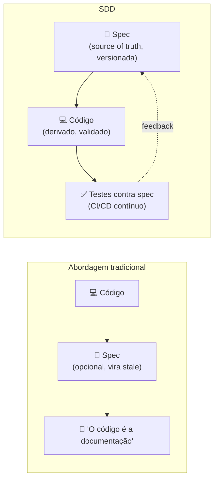
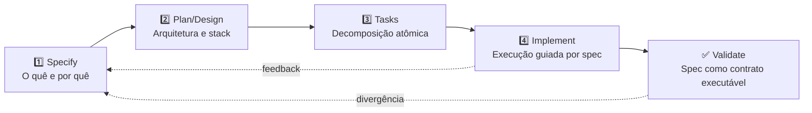
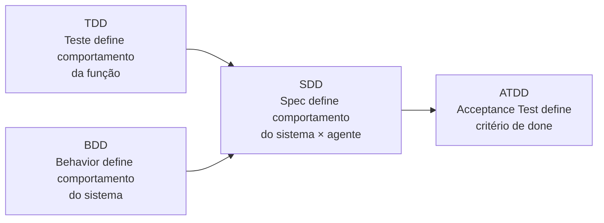
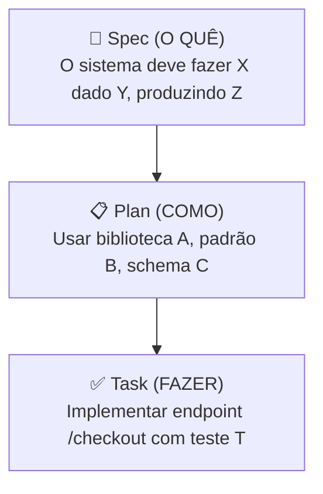

# O que é Spec-Driven Development

> [!abstract] TL;DR
> Spec-Driven Development (SDD) é a metodologia que **inverte a relação entre código e especificação**. Tradicionalmente, código é o source of truth e specs são documentação opcional. Em SDD, **specs são o source of truth**, e código é um artefato derivado e validado contra elas. O pipeline canônico tem 4 fases: **Specify → Plan → Tasks → Implement**. Specs viram contratos executáveis: validados em CI/CD, atualizados com PR, e usados como contexto persistente do agente. Foi a resposta direta da indústria em 2025-2026 ao tech debt do [[01 - O problema do vibe coding em produção|vibe coding]].

## A inversão fundamental

Há uma ideia simples no centro de tudo: *quem diz o que o sistema deve fazer?*

Nas metodologias tradicionais, a resposta emergente é: **o código diz**. Você lê o código para entender o comportamento. Documentação é opcional e frequentemente desatualizada. Quando há discrepância entre spec e código, o código vence — porque é o que está rodando.

Em SDD, a resposta é deliberada: **a spec diz**. O código é verificado contra a spec continuamente. Quando há discrepância, isso é um bug — ou na implementação, ou na spec (que precisa ser atualizada). Nunca silêncio.



> [!quote] Augment Code — *What Is Spec-Driven Development* (2026)
> *"SDD turns specifications from passive documentation into executable contracts that constrain what AI agents generate. Code becomes a generated output derived from these human-authored specifications."*

Por que isso importa especialmente em 2026? Porque o agente que escreve código não tem memória entre sessões, não conhece o domínio da empresa, e não tem intuição sobre o que é "certo" além do que está no contexto imediato. Spec é o mecanismo de injetar esse conhecimento de forma estruturada e verificável.

## A definição em três camadas

SDD pode ser entendido em três níveis de abstração, cada um revelando um aspecto diferente:

### Camada 1: Processo

SDD é um processo de desenvolvimento com fases sequenciais: definir o quê → planejar o como → decompor em tarefas → executar com validação. O diferencial é que cada fase produz artefatos rastreáveis e versionados.

### Camada 2: Epistemologia

SDD é uma postura epistemológica: *"não começamos a escrever código sem saber formalmente o que o código deve fazer"*. É a diferença entre construir orientado por perguntas respondidas vs. perguntas sendo descobertas durante a construção.

### Camada 3: Contrato entre humano e agente

SDD é um protocolo de comunicação. Quando um humano colabora com um agente para construir software, spec é a linguagem formal que elimina ambiguidade na instrução. É o equivalente de uma API fortemente tipada vs. uma chamada em linguagem natural que o receptor interpreta como quiser.

> [!note] Analogia do arquiteto
> Um arquiteto não entrega para o construtor uma foto de como quer que o prédio fique. Entrega plantas, especificações de materiais, normas de segurança, cronograma de inspeções. O construtor pode ter toda a habilidade técnica do mundo; sem a planta, ele constrói o que *achar* que é o prédio correto. Spec é a planta.

## Por que isso muda tudo para agentes

Para humanos com anos de experiência no domínio, "spec é a fonte da verdade" pode soar burocrático — porque eles carregam muito contexto implícito na cabeça. Para LLMs, é **a única forma de obter previsibilidade**:

| Sem spec | Com spec |
|---|---|
| Agente preenche ambiguidade com alucinação plausível | Agente preenche ambiguidade consultando spec |
| Validação é olhômetro humano | Validação é regra mecânica (teste) |
| Cada sessão começa do zero | Spec é contexto persistente entre sessões |
| Inconsistência cresce com o número de features | Spec força coerência entre features |
| Mudança de requisito = regravação manual de contexto | Mudança de spec = PR versionado |
| Bug de "interpretação" invisível | Divergência spec/código é um erro detectável |

A spec é, simultaneamente: contexto do agente, contrato do output, base de testes, registro de decisão. Quatro funções em um artefato.

## O pipeline canônico

A forma mais difundida em 2026 (GitHub Spec Kit, Kiro, OpenSpec, Augment Code) converge em 4 fases. Os nomes variam; a semântica é consistente:



### Fase 1 — Specify

**Pergunta central:** *"O que estamos construindo e por quê? Quem se beneficia e como o sucesso é medido?"*

Artefatos típicos:
- Descrição do problema a resolver (não da solução)
- User stories ou user journeys em linguagem natural estruturada
- Acceptance criteria mensuráveis e verificáveis
- Constraints explícitas: non-functional requirements (perf, segurança, compliance)
- Definição de out-of-scope (o que **não** vai ser feito)

O ponto crítico de Specify: foco em **outcomes**, não em implementação. "O usuário deve conseguir efetuar pagamento em < 3 segundos" é um outcome. "Usar Stripe com webhook idempotente" é uma decisão de implementação — pertence à fase Plan.

Ver [[04 - Fase Specify — definindo outcomes e constraints]].

### Fase 2 — Plan/Design

**Pergunta central:** *"Que arquitetura, stack e decisões técnicas atendem a spec com menor risco e custo?"*

Artefatos típicos:
- Diagrama de arquitetura e fluxo de dados
- Stack com justificativa (por que essa lib e não outra)
- Contratos de API (OpenAPI/protobuf/GraphQL schema)
- Schemas de banco de dados
- Estratégia de segurança (autenticação, autorização, criptografia)
- Trade-offs explicitados e decisões registradas como ADRs

Ver [[05 - Fase Design e Plan — arquitetura e decomposição]].

### Fase 3 — Tasks

**Pergunta central:** *"Como decompor o plano em unidades pequenas, testáveis, executáveis em uma sessão?"*

Artefatos típicos:
- Lista ordenada de tasks com dependências explícitas
- Cada task: entrada clara, saída esperada, critério de aceitação binário (pass/fail)
- Estimativa de escopo (não de horas — de complexidade)
- Tasks priorizadas para entregar valor incremental

A regra das tasks: se não cabe em uma sessão de agente (~30-60 min), divide. Tasks grandes criam contexto huge que o agente perde.

### Fase 4 — Implement

**Pergunta central:** *"Executar as tasks usando spec + plan como contexto, com validação contínua."*

O modo de trabalho:
- Agente trabalha task por task (não "implemente toda a feature")
- Cada task: escrever teste → implementar → verificar que teste passa
- Spec é referência ativa: agente lê spec antes de gerar código, não depois
- Qualquer desvio da spec é explicitado e resolvido antes de avançar

Ver [[06 - Fase Implement — execução disciplinada]] e [[07 - Fase Validate — spec como contrato executável]].

## Variações de naming nas ferramentas

Diferentes ferramentas usam nomes ligeiramente diferentes para fases similares. A semântica converge:

| GitHub Spec Kit | Kiro (Amazon) | OpenSpec | Augment Code | DeepLearning.AI Course |
|---|---|---|---|---|
| Specify | Specs | Proposal | Specify | Requirements |
| Plan | Steering | (incluído) | Design | Design |
| Tasks | Tasks | (incluído) | Plan | Tasks |
| Implement | Hooks + Agents | Apply + Archive | Build | Implementation |
| (implícito) | (implícito) | Archive | Validate | Validation |

A convergência não é coincidência: independentemente da ferramenta, os problemas a resolver são os mesmos — intenção ambígua, contexto perdido, validação ausente.

## O que muda na prática

### O artefato central muda

**Antes:** PR é o artefato principal. Spec, se existe, está num Confluence desatualizado ou no README que ninguém lê.

**Depois:** A spec é versionada no repositório. PR de feature começa com PR da spec. Code review inclui review da spec. Spec stale é um bug.

### O loop de desenvolvimento muda

```
Antes (vibe coding):
  ideia → código → "olha bem?" → merge → (talvez) atualizar doc

Depois (SDD):
  ideia → spec → review da spec → plan → tasks → código → validação contra spec → merge
```

Mais passos na frente, sim. Mas cada passo elimina uma classe inteira de problemas. **Latência inicial maior, retrabalho radicalmente menor.**

A diferença é como pagar seguro vs. pagar pelo sinistro: parece caro antes de precisar, e parece barato depois.

### A revisão muda

**Antes:** reviewer olha código, julga "parece certo" ou "não parece certo" com base em intuição e experiência.

**Depois:** reviewer olha **se o código atende à spec**. Boa parte da revisão vira critério mecânico: testes passam ou não, endpoints batem com o contract ou não, constraints de segurança estão implementadas ou não.

Isso não elimina a necessidade de julgamento humano — mas eleva o nível do julgamento. Em vez de "esse código parece funcionar?", a pergunta é "essa spec captura o que queremos? E esse código implementa a spec?".

## Não é waterfall reciclado

A objeção mais comum: "Spec antes de código soa como waterfall — queremos ser ágeis."

A confusão vem de identificar "spec" com "especificação em cascata": um documento gigante escrito meses antes, assinado por gerentes, imutável durante a execução. Isso NÃO é SDD.

| Waterfall | SDD |
|---|---|
| Spec é gigante, antecipada, abrangente | Spec é incremental, por feature, mínima necessária |
| Spec assinada → execução longa cega | Spec → tasks pequenas → feedback rápido |
| Mudança de spec = projeto refeito | Mudança de spec = PR atomizado, custo baixo |
| Spec em Word/PDF, fora do repositório | Spec em markdown versionado no repositório |
| Spec lida por humano só | Spec lida por humano e máquina (agente e CI) |
| Validação apenas no fim do projeto | Validação contínua (CI/CD a cada task) |
| Feedback loop: meses | Feedback loop: horas ou dias |

SDD é **agile com contrato explícito**. Sprints continuam. Retrospectivas continuam. A diferença é que cada story tem critério de aceitação formal, não informal.

## SDD como evolução do TDD

Developers familiarizados com Test-Driven Development vão reconhecer o padrão: escrever o teste antes do código força clareza sobre o que o código deve fazer. TDD aplicado a uma função; SDD aplicado a uma feature inteira.



SDD generaliza TDD para o contexto de sistemas construídos com agentes: o "teste" é a spec inteira, não só os unit tests. E o "red" do ciclo red-green-refactor equivale ao agente divergindo da spec.

## Quando SDD compensa

| Cenário | Vale SDD? | Por quê |
|---|---|---|
| Protótipo descartável / POC | ❌ Não | Custo de spec > valor entregue |
| Hackathon de fim de semana | ❌ Não | Velocidade pura importa mais |
| Script de uso único, baixo risco | ❌ Não | Escopo pequeno demais |
| Produto com usuários reais | ✅ Sim | Confiabilidade requerida |
| Feature com dados sensíveis | ✅✅ Obrigatório | Segurança precisa de constraint explícita |
| Brownfield com tech debt | ✅✅ Especialmente | Spec age como documentação retroativa |
| Sistema regulado (saúde, finanças) | ✅✅✅ Essencial | Auditabilidade exigida por lei |
| Time distribuído > 2 devs | ✅✅ Alto valor | Specs substituem alinhamento verbal |
| Agentes autônomos multi-sessão | ✅✅✅ Único caminho | Contexto precisa persistir fora da memória |

A heurística simples: se um bug nesse sistema causaria dano real (usuários afetados, dados perdidos, compliance violado), SDD compensa.

## O espectro do rigor

Não existe só "SDD total" ou "nada". A metodologia opera num espectro:

```
Vibe coding ←──────────────────────────────────────→ Spec-as-Source
             spec-optional   spec-anchored   spec-first
```

- **Spec-optional**: specs existem mas não constrangem execução; agente pode ignorar
- **Spec-anchored**: spec orienta, mas agente tem liberdade de implementação
- **Spec-first**: código não começa sem spec; spec é pré-requisito
- **Spec-as-source**: spec *é* o código; geração automática sem intervenção manual

Times podem começar em spec-anchored e evoluir para spec-first conforme adquirem maturidade. Cada passo no espectro reduz ambiguidade e aumenta previsibilidade.

Ver [[03 - Níveis de rigor — spec-first, spec-anchored, spec-as-source]].

## Princípios de uma boa spec

Não é qualquer documento que funciona como spec. Uma spec efetiva para SDD tem propriedades específicas:

**1. Verificabilidade** — cada afirmação na spec deve ser testável. "O sistema deve ser rápido" não é spec; "o endpoint `/checkout` deve responder em < 200ms (p95, prod)" é spec.

**2. Máquina-legibilidade** — a spec deve ser processável por um agente sem interpretação ambígua. Markdown estruturado, checklists, listas, tabelas — são formatos que LLMs processam bem. Prosa livre é menos efetiva.

**3. Completude mínima** — a spec não precisa cobrir tudo, mas o que cobre, cobre sem lacunas. Melhor uma spec pequena e completa que uma spec grande com buracos.

**4. Versionabilidade** — spec vive no repositório, versionada com o código. Não em Confluence, Notion, ou Google Docs. A razão: mudanças de spec devem ser rastreáveis junto com as mudanças de código que as implementaram.

**5. Hierarquia clara** — outcomes no nível de spec, decisões técnicas no nível de plan, passos no nível de task. Misturar esses níveis cria confusão sobre o que é requisito e o que é decisão.



**6. Conectividade** — specs de diferentes features referenciam entidades compartilhadas. Se a spec de `checkout` e a spec de `refund` ambas mencionam `Payment`, deve ser o mesmo `Payment` — e isso deve estar explícito.

## Como specs viram testes

O poder operacional do SDD vem de transformar acceptance criteria em testes automáticos:

```markdown
# Spec: Autenticação de usuário

## Acceptance criteria
- [ ] Usuário pode fazer login com email + senha válidos → recebe JWT com expiração de 24h
- [ ] Login com senha incorreta retorna HTTP 401 (não 400, não 500)
- [ ] Após 5 tentativas falhas, conta é bloqueada por 15 minutos
- [ ] JWT expirado é rejeitado com HTTP 401 + mensagem clara
```

Cada item dessa lista vira um teste automatizado. O agente que implementa sabe exatamente o critério de done: todos os testes passam. Não é subjetivo.

```python
# spec_auth_test.py — gerado a partir da spec
def test_login_valido_retorna_jwt_com_24h():
    ...

def test_login_senha_incorreta_retorna_401():
    ...

def test_cinco_tentativas_bloqueia_15min():
    ...

def test_jwt_expirado_rejeitado():
    ...
```

A spec *é* a test suite. Ou, de outra forma: a test suite *é* a spec em forma executável.

## O papel do humano no loop

Um ponto crítico que SDD não elimina: **o humano ainda decide o que a spec deve dizer**. O agente pode:
- Ajudar a escrever a spec em formato estruturado
- Identificar lacunas e inconsistências na spec
- Sugerir acceptance criteria baseado em casos de uso similares
- Implementar contra a spec

Mas o humano deve:
- Decidir o que é o outcome desejado
- Validar que a spec captura a intenção de negócio
- Resolver conflitos entre specs de features diferentes
- Definir o que está fora do escopo

A divisão de trabalho é: **humano define o quê, agente decide o como dentro das constraints**. Quando isso se inverte (agente decide o quê, humano valida no final), voltamos ao problema do vibe coding.

## SDD na linha do tempo de 2025-2026

A emergência do SDD como metodologia formal aconteceu rapidamente:

| Data | Evento |
|---|---|
| Jan 2025 | GitHub lança Spec Kit (open source) — primeira ferramenta mainstream centrada em spec |
| Fev 2025 | Karpathy cunha "vibe coding" — o problema ganha nome |
| Mar 2025 | Augment Code publica guia de SDD — define vocabulário |
| Mai 2025 | DeepLearning.AI lança curso SDD com Andrew Ng + Paul Everitt |
| Jun 2025 | Martin Fowler publica análise comparativa de ferramentas SDD |
| Set 2025 | OpenSpec initiative — padronização cross-vendor de formato de spec |
| Jan 2026 | Salesforce Ben declara "2026 = ano do tech debt" — urge SDD |
| Mar 2026 | Gartner inclui SDD em "AI Engineering Best Practices" |
| Jun 2026 | Amazon lança Kiro IDE — spec-first como paradigma nativo de IDE |

Em menos de 18 meses, SDD saiu de "prática emergente" para "recomendação de Gartner e produto de grande tech". O ritmo reflete a urgência: o problema que resolve é real e crescente.

## A frase que resume a trilha

SDD diz: **transforme intent em contratos explícitos antes de pedir código**, e o agente vira aliado em vez de fonte de débito.

O resto desta trilha mostra o como: como escrever specs, como estruturar planos, como decompor em tasks, como validar, e como as ferramentas de 2026 suportam cada fase.

## Primeiros passos para adotar SDD

Para times que querem começar sem uma revolução metodológica completa:

**Passo 1 — Uma feature, uma spec:** Escolha a próxima feature nova e escreva uma spec antes de codificar. Não precisa ser perfeita; precisa ter acceptance criteria mensuráveis. Observe o efeito na qualidade do output do agente.

**Passo 2 — Spec em markdown no repositório:** Crie uma pasta `specs/` no repo. Cada spec vive em `specs/<feature-name>.md`. Versione junto com o código.

**Passo 3 — PR de spec antes de PR de código:** Faça review da spec antes de qualquer linha de implementação. Corrija a ambiguidade no papel, não depois de gerar 500 linhas de código.

**Passo 4 — Acceptance criteria → testes:** Para cada item da spec, escreva um teste antes de implementar. Se o item não é testável, reescreva até ser.

**Passo 5 — Spec como contexto do agente:** Inclua a spec no início do contexto ao usar um agente. "Dada esta spec, implemente a task X."

**Passo 6 — Retrospectiva de spec:** Ao final de cada sprint, compare as specs com o código entregue. Divergências explícitas entre spec e código são o diagnóstico mais valioso que você pode coletar: revelam onde o processo falhou e onde a spec era insuficiente.

Cada passo é independente. Você não precisa fazer tudo de uma vez. O ponto de partida é qualquer um deles — o que importa é começar a construir o hábito.

## Veja também

- [[01 - O problema do vibe coding em produção]]
- [[03 - Níveis de rigor — spec-first, spec-anchored, spec-as-source]]
- [[04 - Fase Specify — definindo outcomes e constraints]]
- [[05 - Fase Design e Plan — arquitetura e decomposição]]
- [[Context Engineering|02 - Os quatro pilares — prompt, context, intent, specification]]
- [[08 - Ferramentas SDD — Kiro, Spec Kit, OpenSpec, Tessl]]

## Referências

- **GitHub Blog** — *Spec-driven development with AI: Get started with a new open source toolkit* (2025). Introdução do Spec Kit.
- **Augment Code** — *What Is Spec-Driven Development? A Complete Guide* (2026). Definição canônica moderna.
- **Microsoft for Developers** — *Diving Into Spec-Driven Development With GitHub Spec Kit* (2026).
- **Martin Fowler** — *Understanding Spec-Driven-Development: Kiro, spec-kit, and Tessl* (2026). Análise comparativa das ferramentas.
- **DeepLearning.AI / JetBrains** — *Spec-Driven Development with Coding Agents* (Andrew Ng + Paul Everitt, abr 2026). Curso prático.
- **Amazon** — *Introducing Kiro: the spec-first IDE for AI coding* (jun 2026). Manifesto da abordagem spec-first.
- **Paul Everitt** — *Spec-driven development: a guide to steering AI coding agents* (JetBrains Blog, 2026).
- **Beck, K.** — *Test-Driven Development: By Example* (2002). Base conceitual do qual SDD herda o princípio de constraint-first.
- **Humble, J.; Farley, D.** — *Continuous Delivery* (2010). Pipeline de validação contínua que SDD integra ao ciclo de spec.
- **OpenSpec Initiative** — *Spec Format Standard v0.3* (2025). Esforço de padronização cross-vendor de formato de spec para agentes.
- **Karpathy, A.** — *"I just see stuff, say stuff, run stuff..."* (X/Twitter, fev 2025). Definição original de vibe coding que catalisou a discussão sobre método.
- **Anthropic** — *Building Effective Agents* (2024). Framework de agent workflows que SDD complementa com camada de especificação.
- **Winters, T. et al.** — *Software Engineering at Google* (2020). Princípios de engenharia em escala que informam o design de specs rastreáveis e versionadas.
- **Cohn, M.** — *User Stories Applied* (2004). User stories como forma de capturar outcomes verificáveis — base do formato de acceptance criteria em specs SDD.
- **North, D.** — *Behaviour-Driven Development* (2006). BDD como precursor direto do SDD: especificação em linguagem verificável antes da implementação.
