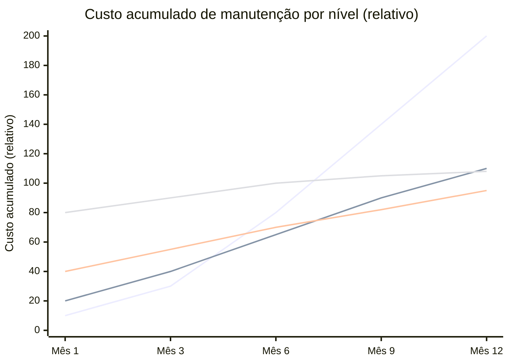

# Níveis de rigor — spec-first, spec-anchored, spec-as-source

> [!abstract] TL;DR
> SDD não é binário. Há um **espectro de rigor** entre [[Dicionário de IA#vibe coding|vibe coding]] (zero spec) e spec-as-source (spec gera código). A escolha depende do contexto: protótipo pode viver sem; produto crítico precisa de spec viva. Quatro níveis nomeáveis: **Vibe** (sem spec), **Spec-first/static** (escreveu uma vez, não mantém), **Spec-anchored/living** (mantida em sincronia com código), **Spec-as-source** (spec é fonte autoritativa, código é derivado). Escolher o nível errado é tão custoso quanto não ter spec.

## Por que o espectro importa

Quando alguém diz "adotar SDD", a pergunta natural é: *quanto?* Não existe uma resposta universal. Um protótipo com vida útil de duas semanas não precisa do mesmo rigor de um sistema de pagamentos com 5 anos de operação e auditoria regulatória.

A analogia é o mercado de seguros. Você não contrata o mesmo seguro para uma bicicleta e para um avião. A cobertura deve ser proporcional ao risco. Spec é o mesmo: o rigor deve ser proporcional ao custo de falhar.

O erro mais comum é aplicar **nível zero** (vibe) onde deveria ser pelo menos nível 1, ou aplicar **nível máximo** (spec-as-source) onde spec-anchored seria suficiente e mais barato. Ambos os erros geram dor — de formas diferentes.


| Nível | Spec mantida? | Validação | Custo inicial | Custo de falha |
|---|---|---|---|---|
| 0 — Vibe | Não existe | Olhômetro | Zero | Alto em prod |
| 1 — Spec-first / static | Uma vez | Manual eventual | Baixo | Médio (drift previsível) |
| 2 — Spec-anchored / living | Contínua | Automatizada parcial | Médio | Baixo |
| 3 — Spec-as-source | Autoritativa | Automatizada total | Alto | Mínimo |

## Nível 0 — Vibe coding (referência)

**Como é:** *"Faça um sistema de login."* → modelo gera → você olha → merge.

Não existe documento de requisitos, critério de aceitação explícito, ou registro de decisão. Code review é intuitivo. Cada sessão começa do zero. O agente não sabe o que foi decidido na semana passada.

**Ciclo de trabalho:**
```
prompt → código → "parece bem?" → merge → próxima sessão começa do zero
```

**Quando ainda faz sentido:**
- Protótipos descartáveis (vai ser jogado fora)
- Hackathons e POCs de validação rápida
- Scripts pessoais de uso único
- Exploração técnica sem intenção de produção

**Onde dói inevitavelmente:**
- Qualquer sistema com usuários reais
- Qualquer sistema com dados sensíveis
- Qualquer sistema com SLA
- Qualquer sistema que vai crescer além de uma feature

Ver [[01 - O problema do vibe coding em produção]] para os dados quantitativos da dor.

## Nível 1 — Spec-first / Static-spec

**Como é:** você escreve a spec **antes** de pedir código ao agente, mas depois que o código está escrito, a spec vira documentação estática — não é atualizada automaticamente com mudanças futuras.

```
docs/features/auth/login.md   ← escrito uma vez, antes
src/auth/login/               ← código vive depois; evolui independentemente
```

A spec da primeira implementação está correta. As specs das implementações 2, 3, 4 não existem — estão implícitas no código. Em 3-6 meses, spec e código divergem. Quem chega novo no projeto lê a spec e encontra um sistema diferente.

**Ciclo de trabalho:**
```
spec → agente implementa → testes manuais → merge
(mudança de requisito) → código muda → spec fica stale
```

> [!warning] Armadilha — mudança frequente escolhendo spec-first
> Spec-first funciona bem para escopo fixo e curta duração. Mas se o projeto tem mudança frequente de requisito — típico de produto em fase de descoberta, com pivôs constantes — spec-first garante que a spec fica obsoleta em semanas, não meses. Nesse cenário, ou o time aceita que a spec é só um artefato de kickoff (e trata como tal, sem fingir que é fonte de verdade), ou sobe direto para spec-anchored. Manter spec-first como documentação viva em contexto de mudança rápida é o pior dos dois mundos: dá trabalho de escrever e mente sobre o estado real do sistema.

**Onde spec-first brilha:**
- Projetos com escopo fixo e curta duração (< 1 sprint)
- Features isoladas sem revisão futura planejada
- Primeiro uso de SDD num time (custo de entrada baixo)
- Documentação de sistemas legados existentes

**Limitações inevitáveis:**
- Drift entre spec e código cresce com o tempo
- Time esquece de atualizar (é humano, não falha moral)
- LLM em sessões posteriores usa spec desatualizada como contexto — pior que sem spec
- Spec vira "documentação de comissão": útil só no onboarding inicial

**Ferramentas típicas:** Notion + revisão pré-PR, GitHub Issues estruturadas com acceptance criteria, ADRs em `/docs/decisions/`.

**Sinal de que está no limite:** alguém pergunta "isso ainda funciona assim?" e ninguém sabe. Hora de subir para spec-anchored.

## Nível 2 — Spec-anchored / Living-spec

**Como é:** spec está **versionada no repositório** e é mantida em sincronia com o código a cada PR. Mudança de comportamento → mudança na spec → mudança no código. Os três andam juntos no mesmo commit ou PR.

```
specs/auth/login.md     ← source of truth, sempre atualizada
src/auth/login/         ← implementação (validada contra spec)
tests/auth/login/       ← assertions derivadas dos acceptance criteria da spec
```

A diferença crítica em relação ao nível 1: **há automação que detecta drift**. Se a spec menciona um endpoint que não existe no código, o CI falha. Se o código implementa comportamento que não está na spec, o reviewer percebe na revisão (PR template inclui "spec atualizada").

**Ciclo de trabalho:**
```
spec nova ou atualizada → PR review da spec → agente implementa
→ testes automáticos validam contra spec → merge (spec + código juntos)
```

**Estrutura típica de um repositório spec-anchored:**
```
projeto/
├── specs/
│   ├── auth/
│   │   ├── login.md          ← spec da feature
│   │   └── permissions.md
│   ├── payments/
│   │   └── checkout.md
│   └── _conventions.md       ← como escrever specs aqui
├── src/
│   └── ...                   ← implementação
└── .github/
    └── pull_request_template.md  ← inclui checklist de spec
```

**Benefícios concretos:**
- Spec sempre fresca → agente em sessões futuras tem contexto correto
- Onboarding de novo dev: lê `specs/` e entende o sistema sem arqueologia de código
- Code review tem critério mecânico (spec atendida ou não, não só "parece certo")
- Mudanças de requisito têm rastreabilidade: diff de spec + diff de código no mesmo PR
- Compliance: auditor lê spec, não código

**Custo real de adoção:**
- PR template com checklist (1 hora para configurar)
- CI job básico de validação de drift (1-2 dias para implementar)
- Reunião de alinhamento de processo (1-2 horas)
- Curva de adaptação do time: 2-4 semanas para virar hábito

**Ferramentas que suportam nativamente:** GitHub Spec Kit, OpenSpec, Kiro (steering docs), Augment Code workspace context.

**O sinal de que spec-anchored é o nível certo:** você tem um produto crescendo, com features se sobrepondo, e precisa que o conhecimento do sistema sobreviva à rotatividade do time.

## Nível 3 — Spec-as-source

**Como é:** spec é **autoritativa**. Código é regenerado/derivado a partir dela. Quando spec e código conflitam, **spec ganha** — código é refeito, não o contrário.

```
specs/auth.spec.yml      ← AUTORITATIVO (machine-readable)
src/auth/                ← gerado/derivado (regenerável)
contracts/auth.test.yml  ← gerado da spec, executável
```

Mudança de comportamento **só** entra na spec. A pipeline regenera stubs, contracts, testes, e às vezes código completo. O código não é editado diretamente para mudanças de comportamento — é um artefato derivado, como bytecode.

**Ciclo de trabalho:**
```
spec atualizada → pipeline CI → gera stubs/contracts → agente implementa dentro dos stubs
→ validação formal (spec vs implementação) → merge
```

**Onde spec-as-source é o nível correto:**

1. **Compliance regulatório com rastreabilidade total** — LGPD, PCI DSS, SOC 2, HIPAA. Auditores exigem prova de que o sistema implementa o que diz implementar. Com spec-as-source, a prova é matemática.

2. **Múltiplas implementações da mesma spec** — API, SDK mobile, Web app, CLI. Mesma spec, três implementações. Sem spec autoritativa, drift entre implementações é inevitável.

3. **Sistemas de alta frequência de mudança com zero tolerância a drift** — fintech, infraestrutura crítica.

4. **Multi-agent SDD** — quando múltiplos agentes trabalham em paralelo, cada um precisa de spec autoritativa clara. Spec-as-source é o contrato entre agentes. Ver [[09 - SDD com agentes — coordinator, implementor, validator]].

**Benefícios:**
- Drift é impossível por construção (não por disciplina)
- Auditoria trivial (spec é o registro completo)
- Multiagent coordenado sem conflito
- Regeneração após upgrade de framework (reaplica spec na nova base)

**Custo e requisitos:**
- Stack precisa suportar geração: OpenAPI Generator, Protobuf, Tessl, Kiro com spec formal
- Spec precisa de linguagem formal ou estrutura machine-readable (YAML/JSON schema > markdown)
- Não funciona para domínios que não se modelam formalmente (ex: UX, criatividade)
- Time precisa desenvolver habilidade de pensar em especificação formal
- Investimento inicial: semanas a meses dependendo do tamanho do sistema

**Ferramentas que suportam:** Tessl, Kiro com steering + hook files estruturados, OpenAPI Generator, Protobuf + gRPC, sistemas de codegen tradicionais acoplados a SDD.

> [!warning] Armadilha — spec-as-source sem cultura de spec-anchored
> Pular direto de spec-first (ou de vibe) para spec-as-source, sem o time ter passado por spec-anchored, tende a falhar. A razão não é técnica — é humana: a disciplina de manter spec e código sincronizados, de tratar drift como bug, de revisar spec como parte do PR, é um hábito que se constrói em spec-anchored. Sem esse hábito, a automação de spec-as-source fica órfã: ninguém sabe editar a spec corretamente, ninguém audita se o gerador está coerente com a intenção, e o time acaba editando o código gerado diretamente (quebrando a garantia central do nível 3). Ver a seção "O espectro como jornada, não como destino" abaixo.

## Quando subir um nível

A regra de ouro é reagir a sinais do sistema, não antecipar por precaução excessiva:

> [!tip] Gatilhos para subir de nível
>
> **Vibe → Spec-first:** quando a feature vai durar mais de um sprint, ou quando você precisar explicar o que construiu para alguém.
>
> **Spec-first → Spec-anchored:** quando alguém perguntou "isso ainda funciona assim?" e ninguém sabia; quando spec divergiu do código pela primeira vez; quando novo membro chegou e spec não ajudou.
>
> **Spec-anchored → Spec-as-source:** quando compliance exige rastreabilidade total; quando você tem ≥3 implementações da mesma spec; quando agentes múltiplos trabalham em paralelo na mesma base.

Subir de nível desnecessariamente tem custo. Implementar spec-as-source num projeto de 3 meses é matar mosquito com canhão.

## Mistura de níveis dentro do mesmo projeto

Projetos maduros frequentemente têm **níveis diferentes por área** — e isso é correto, não inconsistência:

```
projeto/
├── core/            ← Spec-as-source (compliance crítico, zero tolerância a drift)
├── public-api/      ← Spec-anchored (estabilidade, clientes externos dependem)
├── admin-ui/        ← Spec-first (mudança rápida, usuário interno)
└── experiments/     ← Vibe (descartável, duração < 2 semanas)
```

A lógica: o nível certo é proporcional ao custo de erro naquela área. `core/` que falha pode derrubar a empresa; `experiments/` que falha é deletado.

A decisão de qual nível aplica a qual área é uma **decisão arquitetural** — deve ser explícita, registrada, e revisada periodicamente.

> [!warning] Armadilha — mistura de níveis sem registro arquitetural
> Ter níveis diferentes por área é saudável. O que não é saudável é a mistura acontecer por acidente — cada equipe escolhendo seu próprio nível sem ninguém decidir isso conscientemente, e sem nenhum documento dizendo por quê. Sem esse registro, dois problemas aparecem: (1) alguém aplica spec-as-source num módulo que não precisava (custo desperdiçado) ou vibe coding num módulo crítico (risco não percebido); (2) quando o sistema cresce e as fronteiras entre `core/`, `public-api/` e `admin-ui/` mudam, ninguém sabe se o nível de rigor deveria mudar junto — porque a decisão nunca foi um ADR, foi um hábito tácito de cada squad.

## Sinais de que escolheu o nível errado

| Sintoma observado | Diagnóstico | Ajuste |
|---|---|---|
| "Spec atrapalha mais que ajuda — burocracia" | Nível alto demais para o escopo | Reduzir para spec-first ou vibe |
| "Não sei o que era pra fazer" | Nível baixo demais | Subir para spec-first mínimo |
| "Spec stale, ninguém usa" | Spec-first onde precisava ser anchored | Implementar sincronia automática |
| "Geração quebra tudo na primeira mudança" | Spec-as-source prematuro | Voltar para anchored |
| "Agente segue spec mas drift acontece mesmo" | Falta automação de validação | Adicionar CI check de drift |
| "Compliance quer mais rastreabilidade" | Anchored insuficiente para o regulador | Subir para spec-as-source |

## A escolha é organizacional, não só técnica

O nível certo não depende só da tecnologia — depende do contexto humano:

| Fator | Nível recomendado |
|---|---|
| Time de 1-2 devs | Spec-first como piso mínimo |
| Time de 5+ devs | Spec-anchored como base |
| Time distribuído/remoto | Spec-anchored obrigatório (sem alinhamento verbal) |
| Alta rotatividade | Spec-anchored (documentação viva substitui conhecimento tácito) |
| Sistema < 6 meses de vida | Spec-first |
| Sistema > 2 anos de vida | Spec-anchored mínimo |
| Compliance regulatório | Spec-as-source obrigatório |
| Produto crítico sem compliance formal | Spec-anchored como teto prático |
| Múltiplos agentes autônomos | Spec-as-source (agentes precisam de contrato autoritativo) |

## Exemplo concreto: a mesma feature nos três níveis

Para tornar a diferença tangível, aqui está a implementação de "autenticação com OAuth" em cada nível:

### Nível 1 — Spec-first

```markdown
# Auth: OAuth Login
Usuário pode fazer login com Google OAuth.
Deve redirecionar para callback, criar session, redirecionar para dashboard.
```

O agente implementa. Em 3 meses, adicionamos "login com GitHub". Spec diz só "Google OAuth". Código suporta os dois. Spec fica stale. Quando o time crescer, novo dev vai ler a spec e implementar uma terceira OAuth com pattern diferente.

### Nível 2 — Spec-anchored

```markdown
# Auth: OAuth Login — spec v2.1
Atualizado: 2026-03-15 (adicionado GitHub provider)

## Providers suportados
- Google OAuth 2.0 (PKCE flow)
- GitHub OAuth App

## Acceptance criteria
- [ ] Redirect para provider com state anti-CSRF
- [ ] Callback válida state + troca code por token
- [ ] Session criada com user_id, email, provider, expires_at (24h)
- [ ] Redirect para dashboard após login bem-sucedido
- [ ] Login com provider não suportado → HTTP 400

## Não inclui
- Login com senha (ver spec auth-password.md)
- Login com Facebook (fora do roadmap)
```

A spec está no repositório. O PR do GitHub OAuth incluiu a atualização da spec. CI verifica que os endpoints da spec existem no código. Qualquer adição futura segue o mesmo padrão.

### Nível 3 — Spec-as-source

```yaml
# specs/auth/oauth.spec.yml
version: "2.1"
feature: oauth-login
providers:
  - id: google
    flow: pkce
    scopes: [openid, email, profile]
  - id: github
    flow: authorization_code
    scopes: [read:user, user:email]
endpoints:
  - path: /auth/{provider}/login
    method: GET
    response: redirect_to_provider
  - path: /auth/{provider}/callback
    method: GET
    params: [code, state]
    response: session_created
acceptance_criteria:
  - anti_csrf_state: required
  - session_expires: 86400  # 24h
  - invalid_provider: http_400
```

O CI gera stubs, OpenAPI contracts, e teste de integração a partir desse YAML. O agente implementa dentro dos stubs. Mudança de provider é mudança no YAML, não no código — o gerador recria os stubs.

A spec garante que o código web, o SDK mobile e a API pública implementam exatamente o mesmo comportamento de OAuth.

## Custo-benefício ao longo do tempo

Uma análise simplificada de custo relativo nos primeiros 12 meses:



*Da mais alta à mais baixa ao fim: Vibe (vermelha), Spec-first (amarela), Spec-anchored (verde), Spec-as-source (azul). Vibe tem menor custo inicial mas crescimento exponencial; spec-as-source tem maior custo inicial mas trajetória quase plana.*

A divergência começa por volta do mês 3-4 — quando o primeiro retrabalho causado por drift chega. Times de vibe coding frequentemente não percebem o custo porque ele é distribuído em forma de bugs, revisões lentas e onboarding ruim. Só comparando com o alternativo é que o delta fica claro.

## O espectro como jornada, não como destino

Times não começam em spec-as-source. Evoluem:

```
Mês 1-2:  Vibe → Spec-first (uma feature piloto)
Mês 3-4:  Spec-first para todas as features novas
Mês 5-6:  Spec-anchored com CI check de drift
Mês 7+:   Spec-as-source para áreas críticas específicas
```

Essa progressão permite que o time construa o hábito antes de aumentar a automação. Pular direto para spec-as-source sem a cultura de spec-anchored tende a falhar porque a automação sem disciplina humana fica órfã.

Há um padrão recorrente nos times que falham na adoção de SDD: tentam fazer muito de uma vez. Querem ir de vibe para spec-as-source num sprint de duas semanas. A transição bem-sucedida é incremental e oportunista — começa na próxima feature nova, não num big bang de migração.

> [!tip] Regra prática
> Se você está escolhendo o nível certo agora: comece um nível abaixo do que você acha que precisa. Você pode sempre subir quando sentir a necessidade. Descer de nível depois de implementar automação é mais custoso.

## Como explicar em inglês

Em entrevista ou em contexto internacional, os quatro níveis e seus conceitos-satélite têm nomes específicos em inglês — nem sempre a tradução literal do português é a que aparece na literatura.

| PT-BR | EN |
|---|---|
| Spec estática | Static spec |
| Spec viva | Living spec |
| Spec como fonte | Spec-as-source |
| Fonte autoritativa | Source of truth / authoritative source |
| Critério de aceitação | Acceptance criteria |
| Drift de spec | Spec drift |
| Rastreabilidade | Traceability |
| Código derivado | Derived code / generated code |
| Checklist de aceitação | Definition of Done (DoD) |
| Versionamento | Versioning |

> [!tip] Frase de referência
> *"We run spec-anchored for the public API — the spec lives in the repo and CI fails on drift. For the admin UI we're still spec-first; it just doesn't have the traffic to justify the overhead yet."* — frase que comunica em uma sentença que o nível de rigor é uma escolha deliberada, não um acidente.

## O que vem a seguir

Depois de escolher o nível de rigor certo para o contexto, o próximo passo prático é começar a primeira fase do ciclo SDD: escrever a spec em si. Isso significa decidir o que entra nela — outcomes desejados, constraints técnicas e de negócio, o que fica de fora explicitamente — antes de qualquer linha de código. Ver [[04 - Fase Specify — definindo outcomes e constraints]] para como estruturar essa primeira fase na prática.

## Veja também

- [[02 - O que é Spec-Driven Development]]
- [[10 - Integração com context engineering — specs como contexto persistente]]
- [[12 - Debates — spec-as-source vs pragmatismo]]
- [[09 - SDD com agentes — coordinator, implementor, validator]]
- [[07 - Fase Validate — spec como contrato executável]]

## Referências

- **Augment Code** — [*6 Best Spec-Driven Development Tools for AI Coding in 2026*](https://www.augmentcode.com/tools/best-spec-driven-development-tools) (2026). Distinção living-spec vs static-spec com análise de ferramentas.
- **Martin Fowler** — [*Understanding Spec-Driven-Development: Kiro, spec-kit, and Tessl*](https://martinfowler.com/articles/exploring-gen-ai/sdd-3-tools.html) (2026). Taxonomia dos níveis e ferramentas.
- **GitHub Blog** — [*Spec-driven development with AI*](https://github.blog/ai-and-ml/generative-ai/spec-driven-development-with-ai-get-started-with-a-new-open-source-toolkit/) (2025). Introdução do Spec Kit e nível anchored.
- **Hashrocket** — [*OpenSpec vs Spec Kit: Choosing the Right AI-Driven Development Workflow*](https://hashrocket.com/blog/posts/openspec-vs-spec-kit-choosing-the-right-ai-driven-development-workflow-for-your-team) (2026). Comparativo práticos de abordagens.
- **Amazon (Kiro)** — [*Specs — documentação oficial*](https://kiro.dev/docs/specs/) (referência a confirmar quanto ao título/data exatos citados — "Kiro: Spec-First Development", jun 2026). Spec-as-source como paradigma nativo.
- **Tessl** — [*Tessl — Agent Enablement Platform*](https://tessl.io/) (referência a confirmar quanto ao título exato "From specs to running software"). Abordagem spec-as-source pura com geração de código.
- **OpenAPI Initiative** — [*OpenAPI Specification 3.1*](https://spec.openapis.org/oas/v3.1.0.html) (2021). Referência de spec machine-readable que precede SDD mas alinha com nível 3.
- **Google Cloud** — [*Protocol Buffers (protobuf) — Overview*](https://developers.google.com/protocol-buffers/docs/overview) — exemplo de spec-as-source em nível de API contract.
- **Kleppmann, M.** — [*Designing Data-Intensive Applications*](https://dataintensive.net/) (2017). Schemas como contratos de dados — precursor do pensamento spec-as-source para dados.
- **Evans, E.** — [*Domain-Driven Design*](https://www.dddcommunity.org/book/evans_2003/) (2003). Linguagem ubíqua como spec informal — DDD e SDD compartilham o princípio de que o modelo deve governar a implementação.
- **Hohpe, G.; Woolf, B.** — [*Enterprise Integration Patterns*](https://www.enterpriseintegrationpatterns.com/) (2003). Contracts em integração — antecedente histórico do spec-as-source em sistemas distribuídos.
- **NIST** — [*Software Supply Chain Security Guidance*](https://www.nist.gov/itl/executive-order-14028-improving-nations-cybersecurity/software-supply-chain-security-guidance) (2024, inclui SP 800-204D). Rastreabilidade spec→código como requisito emergente de compliance em sistemas críticos.
- **PCI DSS v4.0** — [*Document Library*](https://www.pcisecuritystandards.org/document_library/) — Requisito 6.2 de bespoke software security requirements como exemplo de compliance que se alinha a spec-anchored/spec-as-source.
- **HIPAA Security Rule** — [*The Security Rule*](https://www.hhs.gov/hipaa/for-professionals/security/index.html) (HHS.gov). Documentação técnica de controles como análogo regulatório a spec-as-source para sistemas de saúde nos EUA.
- **Fowler, M.; Lewis, J.** — [*Microservices: A Definition of This New Architectural Term*](https://martinfowler.com/articles/microservices.html) (2014). Contratos de serviço como precursor da separação spec/implementação em arquiteturas distribuídas.
- **Richardson, C.** — [*Microservices Patterns*](https://www.manning.com/books/microservices-patterns) (2018). Consumer-driven contract testing como mecanismo de spec-as-source em nível de integração.
- **Shapira, G.; Palino, T.; Sivaram, R.; Petty, K.** — [*Kafka: The Definitive Guide*](https://www.oreilly.com/library/view/kafka-the-definitive/9781491936153/) (2017/2021). Schema registry como mecanismo de spec-as-source para dados em streaming — mesmo princípio em domínio diferente.
- **Sridharan, C.** — [*Distributed Systems Observability*](https://www.oreilly.com/library/view/distributed-systems-observability/9781492033431/) (2018). Runbooks como specs de operação — extensão do conceito de spec para procedimentos, não só código.
- **Agile Alliance** — [*Definition of Done*](https://agilealliance.org/glossary/definition-of-done/) (2001+). DoD como precursor de acceptance criteria estruturado — SDD formaliza e versiona o que Scrum deixava informal.
- **ISO/IEC 25010** — [*Software Quality Model*](https://www.iso.org/standard/35733.html) (2011). Framework de qualidade que mapeia para dimensões de spec: funcionalidade, confiabilidade, eficiência de desempenho, segurança.
- **SOC 2 Type II** — [*System and Organization Controls (SOC) Suite of Services*](https://www.aicpa-cima.com/resources/landing/system-and-organization-controls-soc-suite-of-services) (AICPA). Auditoria de controles que exige evidência de processo, não só resultado. Spec-anchored com audit trail no git atende a maioria dos critérios de evidência documental.
- **SBOM (Software Bill of Materials) — CISA Guidelines** — [*Software Bill of Materials (SBOM)*](https://www.cisa.gov/sbom) (2023-2024). Rastreabilidade de componentes como extensão do conceito de spec para supply chain — tendência que converge com spec-as-source em 2026.
