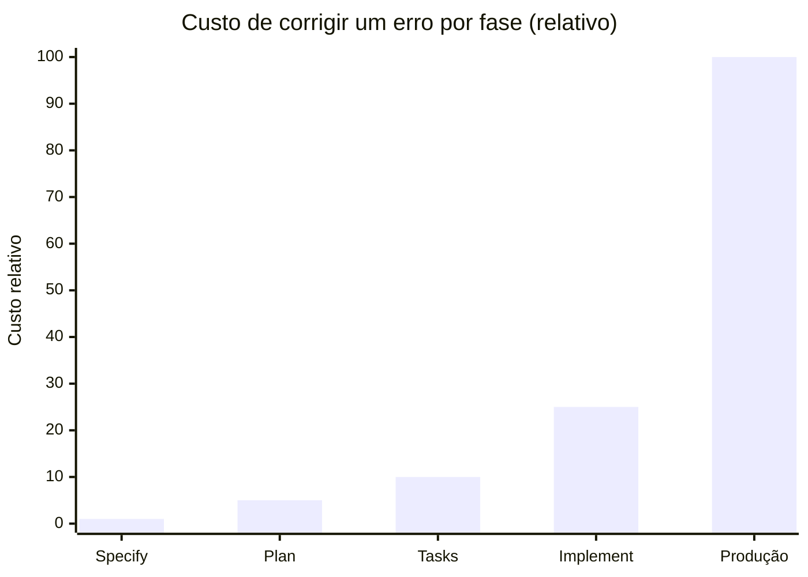
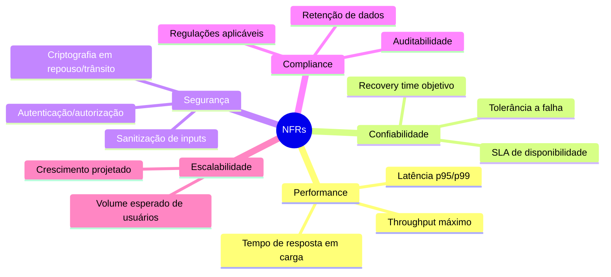
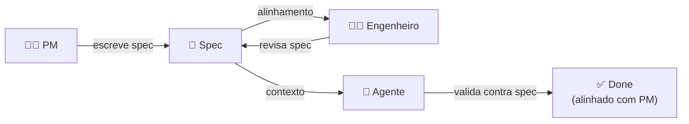

# Fase Specify — definindo outcomes e constraints

> [!abstract] TL;DR
> Specify é a primeira fase do pipeline SDD: descrever **o que** vai ser construído e **por quê**, sem tocar em **como**. Foco em outcomes (o resultado que valida sucesso) e constraints (o que não pode ser violado). Em 2026, o padrão de facto é **markdown estruturado**, legível por humano e por LLM, versionado no repositório. GitHub Spec Kit, Kiro e OpenSpec convergiram em um formato semelhante: user journeys + acceptance criteria + non-functional requirements. Uma spec boa elimina a ambiguidade *antes* de gastar tokens gerando código.

## A regra fundamental

**Specify responde "o quê" e "por quê". Nunca "como".**

Essa regra parece simples e é violada constantemente. O "como" é mais confortável para engenheiros — é o que sabemos fazer. Especificar o "quê" de forma precisa sem cair no "como" é a habilidade central que Specify exige.

| Nível | Pergunta central | Onde mora |
|---|---|---|
| **Specify** | O quê? Por quê? Para quem? | `specs/` |
| **Plan** | Como (arquitetura)? Com quê (stack)? | `plan/` |
| **Tasks** | Em que ordem? Que unidades atômicas? | `tasks/` |
| **Implement** | Em código concreto? | `src/` |

Misturar "como" em Specify é o erro mais comum. Quando aparece *"vamos usar Postgres com índice em user_id"* ou *"implementar com padrão Repository"*, isso é Plan, não Specify. Remova e coloque no lugar certo.

> [!note] Por que a separação importa
> Se você misturar "o quê" com "como" na spec, o agente vai tratar a decisão de implementação como requisito. Quando você quiser mudar de Postgres para DynamoDB, vai parecer que está violando a spec — quando, na verdade, está exercendo uma decisão de implementação legítima.

## Por que Specify é a fase mais crítica

Uma spec ruim não é um problema que você resolve na implementação. É um multiplicador de erro: código errado gerado em alta velocidade, testes validando o comportamento errado, débito que escala antes de ser detectado.

A analogia mais precisa: spec é o plano de navegação. Se você partir com o destino errado, velocidade maior te leva mais rápido ao lugar errado. O "destino" no SDD é o outcome — e ele deve estar explícito e correto antes da primeira linha de código.

Em termos concretos: um bug na spec descoberto na fase Specify custa minutos para corrigir (editar um markdown). O mesmo bug descoberto na fase Implement custa horas (reescrever código). Descoberto em produção, custa incidentes, reputação e dados de usuários.



Invest na spec é o melhor ROI do processo.

## Anatomia de uma spec completa

O template canônico convergiu em 2025-2026 entre as principais ferramentas:

```markdown
# Feature: [Nome da feature]

## Contexto e objetivo
[Por que estamos construindo isso? Qual o problema de negócio que resolve?]

## Outcome
[Definição de sucesso em 1-3 frases. O que deve ser verdadeiro quando isso estiver pronto?]

## Usuários e personas
[Quem usa essa feature? Qual o contexto deles?]

## User journeys

### J1 — [Nome do journey principal]
1. [Passo 1 da perspectiva do usuário]
2. [Passo 2]
...

### J2 — [Nome do journey alternativo ou edge case]
...

## Acceptance criteria

- [ ] [Critério verificável 1]
- [ ] [Critério verificável 2]
...

## Non-functional requirements

- Latência: [número concreto, não "rápido"]
- Disponibilidade: [SLA]
- Segurança: [constraint explícita]
- Compliance: [regulação aplicável]

## Out of scope (explícito)

- [O que NÃO será feito nesta feature]
- [Features relacionadas que ficam para depois]

## Open questions

- [Dúvida que precisa de resposta antes de implementar]
- [Decisão de negócio pendente]

## Dependências

- [Outras features ou sistemas dos quais isso depende]
```

## Exemplo completo: Refund de pagamentos

Um exemplo concreto aplica o template e mostra as decisões em cada seção:

```markdown
# Feature: Refund de pagamentos

## Contexto e objetivo
Clientes que solicitam cancelamento de pedido precisam de um processo claro
para reembolso. Atualmente, o suporte recebe os pedidos por email e o processo
é manual, causando SLA inconsistente e insatisfação.

## Outcome
Cliente que solicita refund deve receber confirmação em até 24h
e crédito processado em até 5 dias úteis, com visibilidade do status
em tempo real no app.

## Usuários e personas
- **Cliente final** — fez uma compra, quer reembolso por produto não entregue
  ou arrependimento em até 7 dias.
- **Analista de suporte** — aprova refunds parciais ou casos fora do prazo.

## User journeys

### J1 — Refund total dentro de 7 dias (automático)
1. Cliente abre app → Histórico de pagamentos
2. Seleciona pagamento dos últimos 7 dias
3. Clica em "Solicitar reembolso" → escolhe tipo: total
4. Confirma motivo (dropdown: arrependimento / produto com defeito / etc.)
5. Sistema cria refund automaticamente + envia email com ID e prazo
6. Em até 5 dias úteis: crédito no método original
7. App mostra status em tempo real: pendente → processando → concluído

### J2 — Refund parcial após 7 dias (requer aprovação)
1. Cliente solicita refund após 7 dias
2. Sistema cria solicitação com status "aguardando aprovação"
3. Analista recebe notificação e avalia
4. Aprovação → mesmo fluxo de J1; recusa → notificação ao cliente com motivo

## Acceptance criteria

- [ ] Cliente vê apenas pagamentos elegíveis (últimos 30 dias, não cancelados)
- [ ] Refund total possível para pagamentos ≤ 7 dias sem aprovação
- [ ] Refund parcial OU pagamentos > 7 dias exigem aprovação do analista
- [ ] Email de confirmação: enviado em < 5 minutos com ID de transação e prazo
- [ ] Estado do refund visível no histórico com atualização em tempo real
- [ ] Notificação push quando status muda (push + email)
- [ ] Refund duplicado bloqueado (idempotência por order_id + type)
- [ ] Log de auditoria imutável para cada evento de refund

## Non-functional requirements

- Latência p95 da requisição de criação: < 500ms
- Idempotência: operação repetida com mesmo order_id deve retornar o mesmo resultado
- Auditabilidade: todo evento de refund registrado por 7 anos (compliance PCI DSS)
- Disponibilidade: 99.9% (refund é crítico para satisfação do cliente)

## Out of scope

- Refund em método diferente do original (ex: cashback quando pagou cartão)
  → será spec separada se necessário
- Refund de pedidos com mais de 90 dias → não suportado, retornar erro claro
- Interface administrativa completa → analista usa endpoint de API nesta iteração

## Open questions

- Como tratar refund quando o cartão original foi cancelado?
  → Aguardando resposta do time financeiro antes de implementar
- O prazo de 5 dias úteis é o mesmo para crédito e débito?
  → Confirmar com compliance antes da Fase Plan

## Dependências

- Sistema de pagamentos (Stripe) — API de refunds
- Sistema de notificações — email + push
- Feature "Histórico de pagamentos" (já existe — verificar contratos)
```

## Os 6 elementos canônicos

| Elemento | Função | Erro mais comum |
|---|---|---|
| **Outcome** | Definir sucesso em 1-3 frases | Confundir outcome com lista de features |
| **User journeys** | Como o usuário interage do início ao fim | Pular para componentes técnicos |
| **Acceptance criteria** | Lista binária, verificável, exaustiva | Critério vago ("deve ser rápido") |
| **Non-functional requirements** | Performance, segurança, compliance | Esquecer — vira surpresa em prod |
| **Out of scope** | Limites explícitos do que não vai ser feito | Não declarar — agente decide sozinho |
| **Open questions** | O que ainda não foi decidido | Fingir certeza onde não há |

O out-of-scope merece atenção especial: quando um agente recebe uma spec sem limites explícitos, ele preenche o que falta com inferências plausíveis. Às vezes certo; frequentemente além do escopo. "Out of scope" é o fence que impede expansão não-planejada.

## O que "outcome" realmente significa

"Outcome" não é sinônimo de "feature" ou "funcionalidade". A distinção:

- **Feature** (output): "Sistema de refund com aprovação manual"
- **Outcome** (resultado): "Cliente que solicita refund recebe crédito em 5 dias úteis com visibilidade em tempo real"

A feature é o que você constrói. O outcome é o que muda para o usuário. Features podem ser entregues sem o outcome ser atingido (sistema existe mas é inutilizável). Outcomes são o critério real de sucesso.

Algumas features têm outcomes óbvios; outras precisam de investigação para descobrir o outcome real. A pergunta certa é: *"Se eu entregar isso e o usuário não conseguir fazer X, foi um sucesso?"* O que completa X é o outcome.

## Acceptance criteria: a arte de ser verificável

O critério mais importante para um acceptance criteria (AC) é **verificabilidade**: você consegue escrever um teste automático para isso? Se não, provavelmente está vago.

| AC vago | AC verificável |
|---|---|
| "Sistema deve ser rápido" | "p95 de latência < 200ms em carga normal" |
| "Interface amigável" | "Usuário conclui checkout em ≤ 5 cliques" |
| "Email de confirmação enviado" | "Email chega em < 5 minutos após confirmação" |
| "Dados seguros" | "PII criptografado em repouso com AES-256" |
| "Erro tratado corretamente" | "Pagamento duplicado retorna HTTP 409 com mensagem X" |

ACs vagos parecem inofensivos mas criam interpretação aberta. Dois engenheiros podem ler "rápido" e implementar soluções radicalmente diferentes. A spec que não resolve a ambiguidade não está fazendo seu trabalho.

**A regra de ouro:** cada AC deve ter uma resposta binária (atende / não atende), não uma escala subjetiva.

## Non-functional requirements: o que matou o sistema em prod

NFRs são os requisitos que "ninguém pediu explicitamente" mas que todo mundo esperava. Não documentá-los é uma das fontes mais comuns de incidente em produção.

**As categorias que nunca devem faltar:**



**A pergunta que revela NFRs ausentes:** *"Se isso fosse para produção amanhã com 10x o volume esperado, o que quebraria?"* As respostas são NFRs que você esqueceu de escrever.

## Linguagem natural estruturada

A spec deve ser simultaneamente legível por humanos e consumível por LLMs como contexto. Isso define algumas características de estilo:

**Faça:**
- Frases declarativas curtas: "Sistema faz X dado Y"
- Números concretos: "< 500ms", "em 24 horas", "máximo 3 tentativas"
- Listas e checklists (LLMs processam bem)
- Estrutura consistente (headers, seções, templates)

**Evite:**
- Prosa livre e longa (difícil de parsear para AC específico)
- Jargão de implementação (mistura com Plan)
- Subjetivos sem medida: "boa performance", "interface intuitiva"
- Tempo futuro ambíguo: "vai precisar", "eventualmente suportar"

> [!tip] Teste do "explica para outro engenheiro"
> Se você lesse essa spec sem ter participado da discussão, conseguiria implementar **uma** versão do que se espera? Se houvesse ≥ 2 implementações plausíveis e contraditórias, a spec ainda está vaga.

## Como LLMs ajudam e atrapalham na fase Specify

**Onde LLMs ajudam genuinamente:**

- Transformar bullet points soltos em spec estruturada
- Detectar ambiguidade ("isso tem duas interpretações possíveis")
- Sugerir edge cases que passariam despercebidos
- Converter linguagem de negócio em ACs verificáveis
- Revisar completude (identificar seções ausentes)

**Onde LLMs introduzem problemas:**

- Inventam ACs razoáveis que **não foram validados** pelo PM ou stakeholder
- Saltam para decisões de Plan (adicionam stack, libs, padrões)
- Adicionam funcionalidades não pedidas (scope creep silencioso)
- Usam templates verbosos que aumentam tokens sem aumentar clareza
- Confundem "plausível" com "correto para este domínio"

> [!warning] Spec gerada por IA precisa de revisão humana mais cuidadosa do que código
> Se a spec está errada, todo o resto cai em cascata. Tempo investido em revisar a spec é o melhor ROI do projeto. Um PM que lê a spec em 20 minutos pode poupar 3 sprints de retrabalho.

## Anti-patterns frequentes

| Anti-pattern | O que acontece | Correção |
|---|---|---|
| **Spec verbosa (10+ páginas)** | Ninguém lê; agente perde contexto | Máximo 2-3 páginas; use links para contexto extra |
| **Sem acceptance criteria** | Agente decide o que "funcionar" significa | AC binário para cada outcome |
| **Sem out-of-scope** | Agente expande feature além do planejado | Declarar explicitamente o que NÃO entra |
| **Open questions não documentadas** | Decisão tomada pelo agente silenciosamente | Listar e resolver antes de implementar |
| **Spec stale após 1 sprint** | Contexto do agente desatualizado | Atualizar spec no mesmo PR do código |
| **Spec em Confluence/Notion** | Não é versionada com o código | Mover para `/specs/` no repositório |
| **AC subjetivo** | Interpretações divergentes entre dev e PM | Reescrever com números, prazos, comportamentos observáveis |
| **"Como" misturado com "o quê"** | Decisões de implementação viram requisito | Mover tudo que é "como" para Plan |

## Spec como comunicação: o problema do PM-Engenheiro-Agente

Spec resolve um problema de comunicação de três vias: PM sabe o que o negócio precisa, engenheiro sabe como construir, agente executa. Sem um artefato compartilhado e formal, a mensagem muda em cada handoff.




A spec é o canal de comunicação sem distorção. PM lê spec e confirma: "é isso". Agente lê spec e sabe: "é isso que devo produzir". Engenheiro revisa spec e verifica: "isso é implementável e seguro".

## Machine-readable specs: o próximo nível

Em [[03 - Níveis de rigor — spec-first, spec-anchored, spec-as-source|spec-as-source]], a spec é parcialmente estruturada para máquina:

```yaml
# specs/payments/refund.spec.yml
version: "1.0"
feature: refund_payment
outcome: |
  Cliente que solicita refund recebe confirmação em <24h
  e crédito processado em <5 dias úteis.

acceptance_criteria:
  - id: AC1
    description: Refund total dentro de 7 dias
    given: "payment_age <= 7d AND payment.status == completed"
    when: "customer.requests_refund(type=full)"
    then: "refund.created AND email.sent(< 5min) AND status=pending"

  - id: AC2
    description: Refund parcial requer aprovação
    given: "payment_age > 7d OR refund_type == partial"
    when: "customer.requests_refund"
    then: "approval_request.created AND status=awaiting_approval"

nfr:
  latency:
    p95_ms: 500
  idempotency: required
  audit_retention_years: 7
  availability_sla: "99.9%"
```

Vantagem: AC pode ser input direto para gerador de testes. Custo: requer linguagem formal, learning curve, e disciplina de manutenção mais rigorosa. Adequado para [[03 - Níveis de rigor — spec-first, spec-anchored, spec-as-source|nível spec-as-source]].

## Métricas de qualidade para Specify

| Métrica | Alvo | Sinal de problema |
|---|---|---|
| % de PRs que aderem a 100% dos ACs | > 85% | Spec vaga ou ACs mal definidos |
| Tamanho médio da spec | 1-3 páginas (≤ 2K tokens) | Spec verbosa = ninguém lê |
| Tempo entre spec e aprovação | < 2 dias | Spec incompleta → ciclos de revisão |
| Frequência de "volta para Specify" durante Implement | Baixa | Alta = spec incompleta saiu sem revisão |
| Open questions sem resposta ao entrar em Plan | Zero | Bloqueio durante implementação |

## Veja também

- [[02 - O que é Spec-Driven Development]]
- [[03 - Níveis de rigor — spec-first, spec-anchored, spec-as-source]]
- [[05 - Fase Design e Plan — arquitetura e decomposição]]
- [[07 - Fase Validate — spec como contrato executável]]
- [[Context Engineering|11 - Skills e instructions como contexto]]

## Referências

- **GitHub Spec Kit** — *spec-driven.md* (2026). Template canônico de spec para AI coding.
- **Augment Code** — *What Is Spec-Driven Development?* (2026). Definição da fase Specify.
- **Microsoft for Developers** — *Diving Into Spec-Driven Development With GitHub Spec Kit* (2026).
- **Zencoder Docs** — *A Practical Guide to Spec-Driven Development* (2026). Exemplos práticos de specs.
- **DeepLearning.AI** — *Spec-Driven Development with Coding Agents* (abr 2026). Curso com exemplos de spec por fase.
- **Cohn, M.** — *User Stories Applied* (2004). Fundamentos de user stories como precursor do formato de journeys.
- **North, D.** — *Introducing Behaviour-Driven Development* (2006). Given/When/Then como padrão de AC verificável.
- **Robertson, S.; Robertson, J.** — *Mastering the Requirements Process* (2012). Framework de requisitos que influencia o formato de spec SDD.
- **Adzic, G.** — *Specification by Example* (2011). Especificação com exemplos executáveis como precursor direto de SDD.
- **Humble, J.; Farley, D.** — *Continuous Delivery* (2010). NFRs como critérios de deployment — influência no formato de non-functional requirements.
