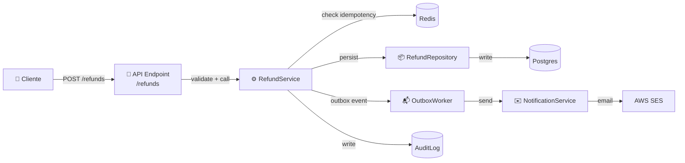
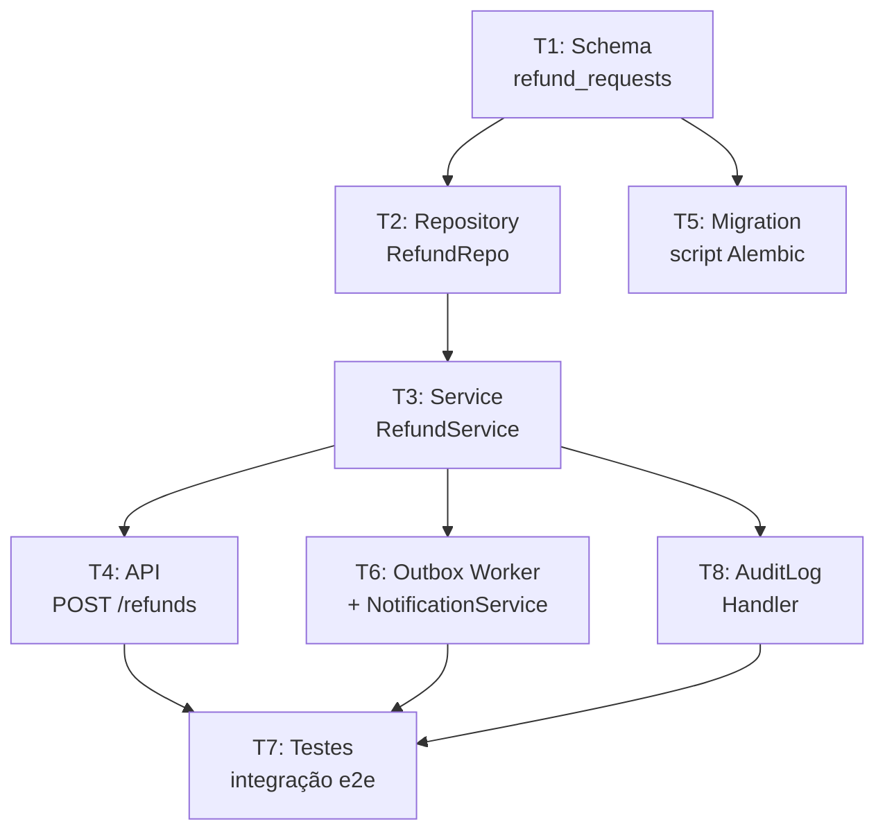

# Fase Design e Plan — arquitetura e decomposição

> [!abstract] TL;DR
> Plan responde **como** vamos atender a [[04 - Fase Specify — definindo outcomes e constraints|spec]]. Duas dimensões: **design** (que arquitetura, que stack, que contratos) e **decomposição** (em quais tasks pequenas e ordenadas o trabalho cabe). O artefato central é um documento de plano + lista de tasks com dependências. Em 2026, frameworks como Spec Kit/Kiro/OpenSpec automatizam parte da decomposição via LLM, mas a aprovação fica com humano. Tasks pequenas, testáveis e com acceptance criteria próprios são o critério de qualidade.

## A separação entre Plan e Specify

Spec define o *destino*; Plan define a *rota*. Misturar os dois é um dos erros mais comuns no processo:

| Pertence à Specify | Pertence ao Plan |
|---|---|
| "Usuário deve receber email em < 5 min" | "Usar AWS SES para envio de emails" |
| "Sistema deve ser idempotente" | "Implementar outbox pattern com Postgres" |
| "Latência p95 < 500ms" | "Adicionar índice em payment_id + cache Redis para lookup" |
| "Dados auditáveis por 7 anos" | "Tabela `audit_log` separada + backup mensal para S3 Glacier" |

A regra prática: se a decisão menciona um nome de ferramenta, biblioteca, padrão ou linguagem, pertence ao Plan. Spec é agnóstica de implementação.

Por que isso importa? Porque **o mesmo plano não é a única solução para uma spec**. Duas equipes com a mesma spec podem escolher Postgres ou DynamoDB, FastAPI ou Express, REST ou gRPC — e ambas estão corretas se atenderem a spec. A spec captura o invariante; o plan captura a escolha.

## Os 5 componentes do Plan

### 1. Decisões arquiteturais (ADRs)

Architecture Decision Records (ADRs) são o mecanismo de registrar **por que** uma decisão foi tomada, não só o que foi decidido. Sem ADR, a próxima sessão do agente pode reverter a decisão sem saber que havia uma razão.

```markdown
## Decisões

### D1 — Persistência: Postgres
**Razão:** Já no stack da empresa; suporta jsonb para metadata flexível de refund.
Alternativas consideradas: MongoDB (rejeitado — time sem expertise), DynamoDB
(rejeitado — latência de consistência eventual inadequada para transações financeiras).

### D2 — Idempotência: chave externa do cliente (client_reference_id)
**Razão:** Cliente pode reenviar requisição de refund sem duplicar operação.
Constraint atendida: NFR de "0 perda de evento" + "sem duplicatas".

### D3 — Notificações: evento assíncrono via outbox
**Razão:** Desacopla falha de email do flow principal de refund.
Constraint atendida: latência p95 < 500ms (não bloqueia em falha de email).
```

ADRs no plan são o contexto que previne retrabalho: o agente na próxima sessão lê D1 e não "melhora" mudando para DynamoDB.

### 2. Stack e dependências

Stack explicita as escolhas tecnológicas com versões fixadas e razão de cada escolha:

```markdown
## Stack

- **Runtime:** Python 3.12
- **Framework:** FastAPI 0.115 (já no monorepo; async nativo)
- **ORM:** SQLAlchemy 2.0 + Alembic (migrations)
- **Banco:** Postgres 16 (decisão D1)
- **Cache:** Redis 7 (para lookup de idempotência)
- **Notificações:** AWS SES via boto3 (já configurado no infra)
- **Testes:** pytest + httpx (já no CI)

### Novas dependências (precisam de aprovação de infra)
- Nenhuma — todas as dependências já estão no projeto
```

O campo "novas dependências" é crítico: adicionar libs não aprovadas é um anti-pattern que cria problemas de supply chain e licença.

### 3. Componentes e responsabilidades

O diagrama de componentes documenta o que cada peça faz e como se conecta. Deve ser funcional, não decorativo — cada caixa tem um nome e uma responsabilidade; cada seta tem um tipo de interação:



Cada componente no diagrama corresponde a um artefato de código com responsabilidade única. O diagrama é o mapa; o código é o território.

### 4. Contratos de interface

Contratos definem o que entra e o que sai de cada interface pública. Em nível de spec-anchored, são pseudocódigo formal. Em spec-as-source, são OpenAPI/protobuf executáveis:

```yaml
# Contrato: POST /refunds
Request:
  payment_id: string(uuid)            # ID do pagamento a ser reembolsado
  amount: decimal | null               # null = refund total
  reason: enum[duplicate, fraud, customer_request, defective_product]
  client_reference_id: string          # para idempotência

Response 201:
  refund_id: string(uuid)
  status: pending
  estimated_completion: string(iso8601)

Response 400 (ValidationError):
  error: string
  field: string                        # qual campo inválido

Response 409 (AlreadyRefunded):
  existing_refund_id: string(uuid)
  message: string

Response 422 (IneligiblePayment):
  reason: enum[too_old, already_refunded, payment_failed]
  message: string
```

Contratos explícitos previnem o erro de "agente decide o formato de resposta" — que inevitavelmente diverge entre features.

### 5. Constraints técnicas mapeadas

Cada NFR da spec vira uma restrição técnica concreta no plan. Esse mapeamento fecha o ciclo spec → plan:

| NFR (spec) | Restrição técnica (plan) | Implementação |
|---|---|---|
| Latência p95 < 500ms | Indexação + cache de idempotência | Índice em `payment_id`; Redis lookup |
| 0 perda de evento | Outbox pattern | Worker separado com retry |
| Auditável 7 anos | Append-only audit log | Tabela `audit_log` sem UPDATE/DELETE |
| Idempotência | Chave única por requisição | `UNIQUE (payment_id, client_reference_id)` |
| Disponibilidade 99.9% | Retry com backoff + circuit breaker | Nos calls externos (SES, notificação) |

## Decomposição em tasks

Plan culmina numa lista de tasks. A qualidade da decomposição determina a qualidade da execução — tasks mal definidas levam a implementação mal executada.

> [!tip] Regra das 2-4 horas
> Cada task deve ser fazível em 2-4 horas (humano ou agente). Mais que isso → existe ambiguidade escondida → quebrar. Tasks de "1 dia" invariavelmente escondem 3-5 subtasks que não foram explicitadas.

### Anatomia de uma task bem definida

```markdown
## Task T1 — Schema: tabela refund_requests

**Objetivo:** Criar tabela `refund_requests` no Postgres com migration Alembic.

**Inputs:**
- Plan: decisão D1 (Postgres), seção contratos (campos do request)
- Spec: AC sobre idempotência, AC sobre status de refund

**Outputs:**
- `migrations/004_create_refund_requests.sql`
- `src/models/refund_request.py` (SQLAlchemy 2.0)

**Acceptance criteria:**
- [ ] Migration roda sem erro em banco limpo
- [ ] Migration tem downgrade funcional (rollback)
- [ ] Modelo tem type hints completos (mypy passa)
- [ ] Constraint UNIQUE em (payment_id, client_reference_id) existe
- [ ] Índice em payment_id existe (NFR latência)

**Dependências:** Nenhuma (primeira task)

**Estimativa:** 2h
```

O elemento mais importante é **acceptance criteria por task**: o agente sabe exatamente quando a task está done. Sem isso, "está pronto" é julgamento subjetivo.

### Ordenação por dependências (DAG)



Tasks formam um DAG. Dependências explícitas permitem:
- Paralelizar tasks sem dependências (T5 pode rodar paralelo a T2)
- Agentes diferentes trabalharem em tasks independentes ([[09 - SDD com agentes — coordinator, implementor, validator|multi-agent SDD]])
- Detectar bloqueis: se T3 está atrasada, T4, T6 e T8 não podem avançar

### Critérios de granularidade

| Sintoma | Problema | Solução |
|---|---|---|
| Task leva > 4h | Ambiguidade escondida | Dividir em 2-3 subtasks |
| Task não tem acceptance | Agente decide "done" subjetivamente | Adicionar checklist de AC |
| Task depende de tudo | Arquitetura não foi decomposta | Revisar o diagrama de componentes |
| Task sem input claro | Agente não sabe o que ler | Referenciar seção do plan/spec |
| Tasks sem ordem | DAG implícito, dependências implícitas | Mapear dependências explicitamente |

## Múltiplos plans para a mesma spec

Para a mesma spec, podem existir múltiplos plans válidos com trade-offs diferentes. Escolher entre eles é a decisão arquitetural:

| Plan | Stack | Complexidade inicial | Latência | Custo de infra | Quando escolher |
|---|---|---|---|---|---|
| **Plan A** | Postgres sync | Baixa | Ok (> 500ms em pico) | Baixo | MVP, volume < 100 req/min |
| **Plan B** | Postgres + Redis cache | Média | Atende NFR | Médio | Produto em crescimento |
| **Plan C** | Postgres + Kafka + ES | Alta | Excelente | Alto | Alta escala, analytics em tempo real |

Documentar a escolha com razão (ADR) previne revisão desnecessária: *"por que não usamos Kafka?"* tem resposta no D3.

## LLMs no Plan — onde ajudam e onde atrapalham

**Onde LLMs genuinamente ajudam:**
- Sugerir decomposição em tasks dado o plan (economiza 30-60 min de quebra manual)
- Identificar dependências implícitas entre componentes
- Mapear NFRs para restrições técnicas concretas
- Gerar esboço de contratos a partir da spec
- Detectar inconsistências entre plan e spec

**Onde LLMs introduzem risco:**
- Sugerem stack desnecessariamente complexa (*"vamos adicionar Kafka + Elasticsearch"*)
- Inventam dependências entre tasks que não existem
- Granularidade errada: tasks muito grandes (*"implementar toda a feature"*) ou muito pequenas (*"adicionar linha no README"*)
- Tomam decisões D1, D2, D3 sem explicitar que são decisões — o humano pensa que é só uma sugestão

> [!example] Pattern produtivo: humano decide stack, LLM detalha
> 1. Engenheiro dedica 30 min decidindo: "Postgres + FastAPI + Outbox"
> 2. LLM recebe spec + essas decisões → gera 12 tasks numeradas com AC em 3 min
> 3. Engenheiro revisa, ajusta dependências, aprova
> 4. Tasks viram contexto do agente de implementação

O humano nunca pede ao LLM *"decida a arquitetura"* — pede *"detalhe as tasks dado que decidimos X"*.

## Como plan + spec viram contexto persistente do agente

```
projeto/
├── specs/payments/refund/
│   └── spec.md          ← imutável durante implementation (spec é lei)
├── plan/payments/refund/
│   ├── plan.md          ← imutável durante implementation (decisões fechadas)
│   └── tasks.md         ← atualizado: [x] conforme tasks completadas
└── src/payments/refund/
    └── ...              ← código (derivado de spec + plan)
```

Agente carrega `spec.md` + `plan.md` + `tasks.md` como contexto base em toda sessão. Sem isso, ele começa cada sessão sem saber as decisões arquiteturais, que viés para soluções "plausíveis" em vez de "corretas para este sistema".

Ver [[10 - Integração com context engineering — specs como contexto persistente]].

## O plano como história

Uma forma de verificar a qualidade de um plan é lê-lo como uma narrativa: *"Dado o que a spec pede, vamos usar X porque Y. Precisamos de componentes A, B, C com as seguintes responsabilidades. O componente A expõe essa interface. As tasks são estas, nessa ordem."*

Se a narrativa tem lacunas ou contradições, o plan tem problemas. Um bom plan é uma história coerente de como o sistema vai funcionar — sem ambiguidade, sem espaços que o agente vai preencher com inferência.

> [!example] Narrativa de plan bem escrito
> "A spec pede idempotência com zero perda de evento, então usaremos outbox pattern (D2). Outbox requer um worker separado que le eventos da tabela `outbox_events` e entrega para o serviço de notificações. O worker tem retry com exponential backoff e dead-letter queue para falhas persistentes. As tasks são: T1 criar schema (outbox_events), T2 implementar RefundService que escreve no outbox, T3 implementar OutboxWorker, T4 configurar retry e DLQ."

Essa narrativa permite que qualquer engenheiro ou agente entenda o design sem precisar inferir.

## Revisão do plan: quem valida o quê

O plan deve ter review antes de ir para Implement. Papéis diferentes têm perspectivas complementares:

| Revisor | O que valida |
|---|---|
| **Tech Lead / Arquiteto** | ADRs: razões fazem sentido? Trade-offs avaliados? |
| **Engenheiro implementador** | Tasks: são claras, factíveis, na granularidade certa? |
| **QA / SDET** | ACs de tasks: são verificáveis? Cobrem edge cases? |
| **PM / PO** | Plan atende a spec? Não adiciona nem remove escopo? |
| **Segurança** | Constraints técnicas cobrem NFRs de segurança? |

Para times menores (1-3 pessoas), o mesmo engenheiro faz múltiplos papéis — mas a mentalidade muda por papel. Revisar o plan como PM *"isso resolve o problema do usuário?"* é diferente de revisar como eng *"essa decomposição é implementável?"*.

## Plan no tempo: evolução durante o projeto

Idealmente, plan é aprovado antes de Implement começar e não muda. Na prática, mudanças acontecem quando descobertas de implementação revelam complexidade escondida.

**Quando o plan pode (deve) mudar:**
- Discovery de implementação revela que uma decisão de plan não é viável
- Spec muda (PR de spec → PR de plan → PR de código)
- Estimativa muito errada sugere que a task esconde subtasks

**Como mudar sem perder rastreabilidade:**
- Registrar nova ADR com a razão da mudança
- Fazer PR de plan com a alteração (não mudar silenciosamente)
- Documentar o que mudou e por quê no corpo do PR

**O que nunca deve mudar silenciosamente:**
- ADRs: decisão mudou → nova ADR explicando a razão
- Contratos de interface: mudança de contrato → PR de plan + revisão

Silêncio na mudança de plan é o vibe coding do Plan: decisão tomada implicitamente, sem registro.

## Anti-patterns

> [!warning] Plan que vira pseudocódigo
> Invade Implement; engenheiro está escrevendo código antes do código.
> **Solução:** Parar em componente + interface, não em algoritmo.

> [!warning] Plan sem ADRs (só diagrama)
> Razões perdidas; a decisão reverte na próxima sessão porque ninguém sabe por que foi tomada.
> **Solução:** Registrar cada escolha com razão e alternativas rejeitadas.

> [!warning] Tasks de "8h: fazer feature inteira"
> Ambiguidade escondida = o agente improvisa o que não foi decidido.
> **Solução:** Quebrar em 4-6 tasks de 2-4h.

> [!warning] Tasks sem acceptance criteria
> O agente decide quando está "done" de forma subjetiva.
> **Solução:** AC binário para toda task.

> [!warning] Dependências implícitas
> Uma task quebra porque outra da qual dependia não terminou — e ninguém sabia da dependência.
> **Solução:** Mapear o DAG explicitamente.

> [!warning] NFRs sem mapeamento técnico
> Performance ou segurança viram surpresa em produção porque o NFR nunca virou restrição concreta.
> **Solução:** Tabela NFR → constraint técnica no plan.

> [!warning] Plan muda durante implement sem registro
> Drift silencioso entre plan e código — a próxima sessão não sabe que algo mudou.
> **Solução:** Qualquer mudança de plan vira PR de plan.

## O plan document completo: template canônico

O document de plan canônico (convergido em 2026 entre GitHub Spec Kit, Kiro e Augment Code):

```markdown
# Plan: [Feature Name] — [versão e data]

## Referência
- Spec: [link para spec.md]
- Autor: [nome]
- Status: draft | em revisão | aprovado | em implementação

## Decisões arquiteturais

### D1 — [Título da decisão]
**Escolha:** [o que foi decidido]
**Razão:** [por que]
**Alternativas rejeitadas:** [o que e por que não]
**Constraint da spec atendida:** [AC/NFR referenciado]

### D2 — ...

## Stack

| Componente | Tecnologia | Versão | Razão |
|---|---|---|---|
| Runtime | Python | 3.12 | Já no projeto |
| Framework | FastAPI | 0.115 | Async nativo |
| ... | | | |

## Arquitetura de componentes

[Diagrama Mermaid aqui]

### Responsabilidades

- **ComponenteA:** [responsabilidade única]
- **ComponenteB:** [responsabilidade única]
- ...

## Contratos de interface

[Pseudocódigo ou YAML com request/response de cada interface pública]

## Mapeamento NFR → constraint técnica

| NFR (spec) | Constraint técnica | Implementação |
|---|---|---|
| ... | ... | ... |

## Tasks

[Lista de tasks T1, T2, ..., Tn com DAG de dependências]

## Estimativa total

[n tasks × média de Xh = estimativa de Yh/dias]

## Riscos

- [Risco 1]: [mitigação]
- [Risco 2]: [mitigação]
```

Este template é o ponto de partida — times adaptam às suas convenções. O importante é manter a estrutura de ADRs, componentes, contratos e tasks como seções obrigatórias.

## Métricas de qualidade

| Métrica | Alvo | Sinal de problema |
|---|---|---|
| Tasks por spec | 8-20 | > 30 → spec grande demais para uma feature |
| % tasks completadas dentro da estimativa | > 70% | Tasks mal definidas ou com ambiguidade |
| Mudanças no plan durante Implement | < 2 por feature | Plan insuficiente ou spec mudou |
| ADRs para cada decisão significativa | 100% | Decisões implícitas voltam como conflito |
| Tasks sem AC | Zero | AC é pré-requisito para task entrar no backlog |

## Como explicar em inglês

Em entrevista ou em time distribuído, os termos de Plan aparecem quase sempre em inglês — inclusive na boca de brasileiros. Vale destravar o vocabulário antes de precisar dele sob pressão.

| PT-BR | EN | Nota de uso |
|---|---|---|
| Especificação | Spec | "The **spec** defines outcomes, not implementation." |
| Plano | Plan | "The **plan** answers *how*, the spec answers *what*." |
| Registro de decisão arquitetural | ADR (Architecture Decision Record) | "We wrote an **ADR** for the Postgres vs. DynamoDB call." |
| Tarefa | Task | "Break the plan into small, testable **tasks**." |
| Critério de aceitação | Acceptance criteria | "Every task needs binary **acceptance criteria**." |
| Decomposição | Decomposition | "**Decomposition** quality determines execution quality." |
| Dependência | Dependency | "T4 has a hard **dependency** on T3." |
| Interface | Interface | "The contract defines the public **interface**." |
| Componente | Component | "Each **component** has a single responsibility." |
| Restrição | Constraint | "Latency is a technical **constraint**, not a suggestion." |

> [!tip] Frase-ponte útil
> *"We let the human decide the architecture and the LLM detail the tasks"* resume bem o padrão produtivo descrito acima — funciona tanto em code review quanto em entrevista técnica.

## O que vem a seguir

Um plan aprovado — com ADRs registrados, stack fixada, contratos definidos e tasks decompostas com acceptance criteria — é o que autoriza a próxima fase a começar. Ver [[06 - Fase Implement — execução disciplinada]] para como esse plano vira execução disciplinada: tasks marcadas conforme completadas, sem desvio silencioso do que foi decidido aqui.

## Veja também

- [[04 - Fase Specify — definindo outcomes e constraints]]
- [[06 - Fase Implement — execução disciplinada]]
- [[09 - SDD com agentes — coordinator, implementor, validator]]
- [[10 - Integração com context engineering — specs como contexto persistente]]
- [[Context Engineering]] — plan.md e tasks.md como contexto persistente do agente são um caso concreto dos pilares de context engineering.

## Referências

- **GitHub Spec Kit** — *Plan phase docs* (2026). Decomposição de tasks e DAG.
- **Augment Code** — *Coordinator-Implementor-Verifier Pattern* (2026). Como plan vira contexto do agente.
- **Anthropic** — *Best Practices for Claude Code: Planning* (2026). Uso de plan como contexto persistente.
- **Microsoft for Developers** — *[Diving Into Spec-Driven Development With GitHub Spec Kit](https://developer.microsoft.com/blog/spec-driven-development-spec-kit)* (2025).
- **Nygard, M.** — *[Documenting Architecture Decisions](https://cognitect.com/blog/2011/11/15/documenting-architecture-decisions)* (Cognitect blog, 2011). ADRs como mecanismo de registro de decisão que SDD incorpora.
- **Rozanski, N.; Woods, E.** — *Software Systems Architecture* (2011). Views e viewpoints como antecedentes dos componentes de Plan.
- **Newman, S.** — *Building Microservices* (2021). Decomposição por responsabilidade como princípio de design que Plan aplica.
- **Kim, G. et al.** — *The DevOps Handbook* (2016). Flow de entrega que SDD estrutura com spec→plan→tasks→implement.
- **Humble, J.; Farley, D.** — *Continuous Delivery* (2010). Pipeline de entrega que tasks mapeiam para stages concretos.
