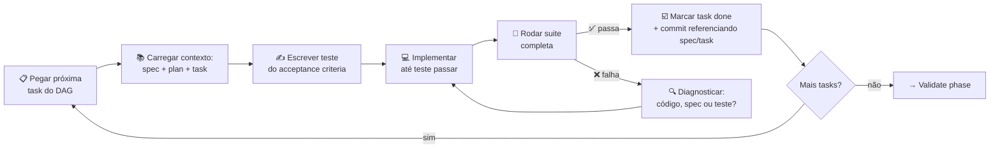
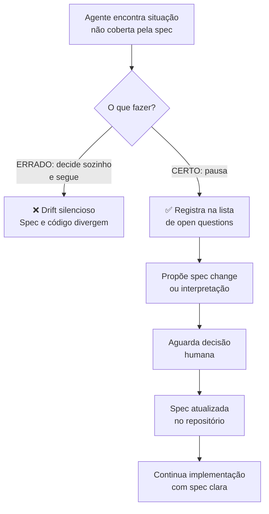
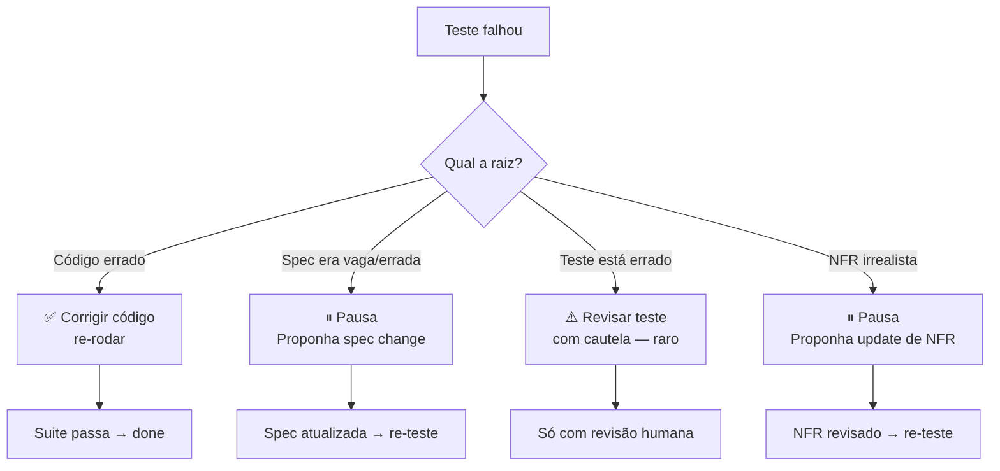
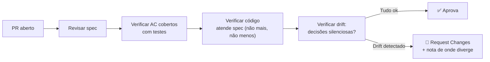

# Fase Implement — execução disciplinada

> [!abstract] TL;DR
> Implement é onde o agente codifica — mas não em modo livre. Usa **spec + plan + tasks como contexto persistente**, trabalha **uma task por vez**, escreve **teste antes** ou junto, e marca a task como done **só quando passa critério de aceitação**. Se desviar do plan, pausa e atualiza o plan (não o oposto). É aqui que SDD se diferencia de "AI escrevendo código com mais documentação": validação contínua contra spec, não só no final.

## O que muda na forma de implementar

A fase Implement no SDD não é simplesmente "escrever código com contexto". É uma mudança de postura do agente:

| Modo vibe coding | Modo SDD Implement |
|---|---|
| Recebe prompt → gera código completo | Recebe task → verifica spec → escreve teste → implementa |
| Faz a feature toda de uma vez | Uma task por vez, em ordem do DAG |
| Passa se "parece funcionar" | Passa se o acceptance criteria binário é atendido |
| Ajusta spec/plan durante o código | Pausa e propõe mudança formal de spec/plan |
| Adiciona o que acha que falta | Adiciona apenas o que a task especifica |
| Sessão longa, contexto cresce sem controle | Sessão por task, contexto limpo |

Essa mudança parece lenta no começo. Em prática, elimina a maior fonte de retrabalho: código que atende algo diferente do que o PM queria.

## A regra de ouro

**Trabalhe uma task de cada vez. Spec é referência, plan é roteiro, task é unidade de progresso.**



O ciclo parece familiar para devs com experiência em TDD — porque é TDD com um passo anterior: a spec define o que o teste deve testar.

## Carregar o contexto certo antes de codificar

O "contexto persistente" do SDD é o que diferencia sessões de agente com SDD de sessões sem. A cada sessão (ou turno significativo), o agente carrega:

| Fonte | Por que inclui | Volume típico |
|---|---|---|
| **AGENTS.md / CLAUDE.md** | Convenções do projeto, stack, padrões | 1-3K tokens |
| **Spec da feature** | O que deve ser construído e por quê | 500-2K tokens |
| **Plan da feature** | Como construir, ADRs, componentes | 1-2K tokens |
| **Task atual** | O que fazer neste turno especificamente | 100-300 tokens |
| **Código relevante** | Código existente que a task modifica | Carregado JIT |

A combinação cabe confortavelmente em 8-10K tokens, deixando ampla janela para reasoning e geração de código. Sem esse contexto, o agente começa do zero e toma decisões que conflitam com o plan.

> [!note] Context como pré-requisito
> Implementar sem carregar spec + plan é equivalente a um dev júnior começar a codar sem ler os requisitos. A diferença é que o agente não tem como pedir esclarecimento implicitamente — ele vai inferir e a inferência vai ser plausível, não necessariamente correta.

## Test-first dentro do SDD

O acceptance criteria (AC) de cada task **vira teste antes de virar código**. Essa sequência — teste → implementação — tem uma propriedade valiosa: o teste falha por razão certa quando o código não existe, garantindo que o teste está testando o que deve testar.

```python
# tests/refunds/test_refund_service.py
# Escrito ANTES da implementação, baseado nos ACs da task T3

class TestRefundServiceRequest:
    """
    Task T3 — AC mapeados da spec specs/payments/refund/spec.md
    """

    def test_full_refund_within_7_days_creates_pending(self, refund_service, db):
        """AC1: Refund total ≤7 dias → status pending, sem aprovação."""
        payment = create_payment(age_days=3, amount=Decimal("100.00"))

        result = refund_service.request(
            payment_id=payment.id,
            amount=payment.amount,  # full
            reason="customer_request"
        )

        assert result.status == RefundStatus.PENDING
        assert result.refund_id is not None
        assert result.estimated_completion is not None

    def test_partial_refund_after_7_days_requires_approval(self, refund_service, db):
        """AC2: Refund parcial >7 dias → approval_required."""
        payment = create_payment(age_days=15, amount=Decimal("100.00"))

        result = refund_service.request(
            payment_id=payment.id,
            amount=Decimal("50.00"),  # partial
            reason="customer_request"
        )

        assert result.status == RefundStatus.APPROVAL_REQUIRED
        assert result.approval_request_id is not None

    def test_duplicate_request_returns_existing_refund(self, refund_service, db):
        """AC-idempotência: mesmo payment_id + client_reference_id → retorna existente."""
        payment = create_payment(age_days=3, amount=Decimal("100.00"))

        result1 = refund_service.request(
            payment_id=payment.id,
            amount=payment.amount,
            client_reference_id="unique-ref-123"
        )
        result2 = refund_service.request(
            payment_id=payment.id,
            amount=payment.amount,
            client_reference_id="unique-ref-123"
        )

        assert result1.refund_id == result2.refund_id
        assert result2.is_duplicate is True
```

> [!tip] A regra de ouro dos testes no SDD
> A task **não é done** se o teste correspondente ao AC não está escrito e passando. Não há negociação sobre isso.

## A unidade de progresso é a task

A disciplina de "uma task por vez" parece excessiva até o primeiro retrabalho causado por sua ausência. Quando o agente faz duas tasks juntas e a segunda introduz um bug na primeira, identificar o ponto exato da regressão é difícil. Tasks atômicas criam checkpoints rastreáveis.

| Anti-pattern | O que acontece | Padrão correto |
|---|---|---|
| "Implementar a feature toda na sessão" | Contexto cresce, rastreabilidade cai | "Implementar Task T3 neste turno" |
| "Vou refatorar enquanto implemento T3" | Refactor não tinha AC; pode ter quebrado algo | "T3 done. Refactor é T8 com seu próprio AC" |
| "O plan parece ruim, mudo no código" | Plan e código divergem silenciosamente | "Pauso, proponho update de plan, aguardo aprovação" |
| "Minha intuição diz Y, o plan diz X" | Intuição pode estar certa, mas não está registrada | "Sigo X. Se Y parece melhor, anoto em open questions" |

## Spec drift detection durante Implement

Situações não cobertas pela spec aparecem durante implementação — e a decisão de como tratá-las é o momento mais crítico do processo. A diferença entre SDD e vibe coding está exatamente aqui:



Decisões silenciosas durante Implement são a fonte #1 de drift em projetos SDD. A postura correta é **registrar e pausar**, nunca decidir silenciosamente e seguir.

**Exemplos de situações não cobertas que exigem pausa:**
- Comportamento com input fora do range especificado
- Interação entre duas features que a spec não antecipou
- Erro de dependência externa (o que fazer se o serviço de email está down?)
- Performance pior que o esperado — NFR foi irrealista?

## Hooks para disciplina automatizada

Ferramentas de 2026 (Kiro, Claude Code hooks, GitHub Actions) oferecem automação de disciplina que transforma "boa intenção" em "default do sistema":

| Hook | Trigger | Ação automatizada |
|---|---|---|
| `pre-edit` | Antes de modificar arquivo | Verifica spec + plan estão no contexto da sessão |
| `pre-commit` | Antes de commit | Roda linter, type check, testes da task atual |
| `post-test` | Depois que testes passam | Atualiza status da task no `tasks.md` |
| `pre-merge` | Antes de merge do PR | Valida cobertura de todos os ACs da spec |
| `spec-drift-check` | Em CI, a cada PR | Detecta endpoints/comportamentos no código sem AC correspondente na spec |

Hooks transformam disciplina de **responsabilidade individual** para **responsabilidade do sistema**. Engenheiros cometem erros; sistemas de automação também, mas de formas previsíveis e detectáveis.

## Commits rastreáveis: a trilha de auditoria

Cada commit da fase Implement deve referenciar o que foi implementado, de qual spec e task:

```
feat(refunds): T3 — implement RefundService.request

Implements AC1 (full refund ≤7 days → pending) and AC2
(partial refund >7 days → approval required) from
specs/payments/refund/spec.md.

Uses outbox pattern per plan decision D2 (idempotency).

Closes: plan/refunds/tasks.md#T3
Refs: specs/payments/refund/spec.md#acceptance-criteria
```

Por que isso importa: quando um bug é reportado em produção, o histórico de git com esse formato permite rastrear diretamente da spec que deveria ter prevenido o bug. A pergunta "o AC X foi implementado?" tem resposta nos commits, não em memória.

## O loop diagnóstico quando o teste falha

Quando um teste falha, o primeiro instinto é "corrigir o código". Em SDD, há uma etapa de diagnóstico antes:



O caso mais perigoso é "Teste está errado" — porque corrigir o teste para fazer o código passar destrói o sinal. Isso só é aceitável com revisão humana explícita e registro de por que o AC original estava errado.

## Sessões por task: o tamanho certo

Uma prática convergente em 2026: cada sessão de agente cobre **uma task completa** — não mais, não menos. Isso tem duas consequências:

**Sessão curta** (< 30 min): provavelmente a task era pequena demais ou não tinha AC real. Tasks-fantasma que o agente completa em minutos geralmente não tinham critério de done real.

**Sessão longa** (> 90 min): provavelmente a task era grande demais, tinha ambiguidade escondida, ou o contexto cresceu tanto que qualidade caiu. Sinal para dividir a task ou para verificar se spec/plan estava completo.

A janela de 30-90 minutos por task é um proxy útil de granularidade correta.

## Paralelização de tasks independentes

Tasks sem dependências no DAG podem ser executadas em paralelo — por diferentes desenvolvedores, por diferentes sessões, ou por diferentes agentes no modelo multi-agent:

```
T1 (schema) ──────────────────────────────────────────────→
                ↓
T2 (repository) ──────────────────────────────────────────→
                            ↓
T5 (notification — independente) ─────────────────────────→
                                          ↓
                            T3 (service, depende de T1+T2) →
                                                    ↓
                                        T4 (endpoint, depende de T3) →
```

T5 pode começar junto com T1 e T2, sem esperar. Em multi-agent SDD, um coordinator agent dispara subagentes para tasks independentes simultaneamente. Ver [[09 - SDD com agentes — coordinator, implementor, validator]].

## Implement como diálogo com a spec

Uma forma de entender a fase Implement é como um diálogo entre o agente e a spec. O agente não "lê a spec uma vez e esquece" — ele retorna à spec como referência a cada decisão de implementação.

**Perguntas que o agente deve fazer antes de cada decisão:**
- *"A spec cobre esse caso?"* → Se sim, implementar conforme spec. Se não, registrar e pausar.
- *"Esse código atende o AC X?"* → Se não tem como verificar, há um AC faltando.
- *"Essa decisão de implementação conflita com a ADR D2?"* → Consultar plan.
- *"Estou adicionando algo que a task não pede?"* → Remover; scope creep silencioso é anti-pattern.

Esse diálogo contínuo é o que separa Implement em SDD de simplesmente "escrever código com um prompt longo".

## O papel do review de código no SDD Implement

Em SDD, o code review muda de foco. Sem SDD, o reviewer julga subjetivamente: "parece correto?", "boas práticas?". Com SDD:

**Reviewer verifica:**
1. Cada AC da task tem um teste correspondente que passa?
2. O código implementa o AC da spec ou algo diferente?
3. Alguma decisão foi tomada silenciosamente sem registro?
4. O código introduz comportamento não previsto na spec?
5. O commit referencia a task e a spec?

O review no SDD é mais rápido porque tem critério objetivo, e mais efetivo porque detecta divergência spec/código enquanto está quente — não em produção.



## O estado dos arquivos durante Implement

Durante a fase Implement, os arquivos têm papéis claros e não se misturam:

```
projeto/
├── specs/payments/refund/
│   └── spec.md          ← IMUTÁVEL durante Implement (lei)
│                          Só muda via PR de spec
├── plan/payments/refund/
│   ├── plan.md          ← Quase imutável (exceção: discovery crítico)
│   └── tasks.md         ← MUDA: [x] conforme tasks completam
└── src/payments/refund/
    ├── models/          ← Criado em T1
    ├── repositories/    ← Criado em T2
    ├── services/        ← Criado em T3
    └── api/             ← Criado em T4
```

`spec.md` é lei durante Implement. Se a spec precisar mudar, há um PR de spec com revisão antes de qualquer mudança de código que reflita a mudança.

`tasks.md` é o estado vivo do progresso — o único arquivo que muda naturalmente conforme Implement avança.

## Quando o Agente é humano (ou quando não é)

As regras da fase Implement se aplicam igualmente quando o "agente" é:

- Um **agente autônomo** (Claude, GPT, Gemini) executando tasks
- Um **desenvolvedor humano** usando AI como copilot
- Um **desenvolvedor humano** sem AI

A diferença é a velocidade e a tendência a errar. Agentes autônomos são mais rápidos e erram de formas menos previsíveis. Desenvolvedores humanos são mais lentos e erram de formas mais conhecidas. Em ambos os casos, a disciplina de "uma task, um AC, um teste" é igualmente valiosa.

Em 2026, o padrão emergente são **loops humano-no-meio**: agente executa uma task, humano revisa o resultado antes de autorizar a próxima. Isso captura a velocidade do agente com o julgamento humano no momento certo.

## Quando o Agente não sabe o que fazer

SDD tem protocolo explícito para incerteza do agente:

1. **Pesquisar na codebase** — existe código similar que resolve o padrão?
2. **Consultar a spec** — a resposta está nos ACs ou NFRs?
3. **Consultar o plan** — existe uma ADR que cobre essa decisão?
4. **Registrar a dúvida** — adicionar em "open questions" do plan/spec
5. **Pausar e perguntar** — o humano toma a decisão

O que nunca deve acontecer: **inferir e seguir adiante sem registro**. Inferência silenciosa é a semente do drift.

## Anti-patterns da fase Implement

| Anti-pattern | Por que é problema |
|---|---|
| Pular tasks — fazer várias juntas | Perde rastreabilidade; regressões difíceis de localizar |
| Não escrever teste antes de implementar | Code review descobre tarde; "done" vira subjetivo |
| Mudar plan no commit message em vez de PR no plan | Drift silencioso; próxima sessão lê plan desatualizado |
| Marcar task done com teste falhando | Destrói o sinal de qualidade; build fica vermelho "aceitável" |
| Adicionar funcionalidade fora da spec | Viola o contrato; scope creep silencioso |
| Sessões longas sem checkpoint de task | Perda em caso de erro; contexto polui próxima task |
| Patchear teste para fazê-lo passar | O teste estava testando algo errado — corrija o teste com razão, não esconda o problema |
| Decidir silenciosamente casos não cobertos pela spec | Spec e código divergem; bug aguarda em produção |

## Implement em sistemas brownfield

Sistemas existentes com tech debt apresentam o desafio de "não há spec para o código atual". A abordagem para introduzir SDD em brownfield:

**Estratégia 1 — Spec-as-found:** antes de modificar qualquer área, escrever uma spec descrevendo o comportamento *atual* (como ele é, não como deveria ser). Depois modificar o comportamento e atualizar a spec. Gradualmente, o sistema vem coberto.

**Estratégia 2 — Spec-for-new:** todo código *novo* segue SDD, mesmo que o código circundante não. Cria uma linha de demarcação clara: código antes de X → sem spec; código depois de X → spec-anchored.

**Estratégia 3 — Spec-por-área-crítica:** identificar as áreas de maior risco (auth, pagamentos, dados sensíveis) e aplicar SDD Implement apenas nelas primeiro. ROI maior, custo menor.

A maioria dos projetos reais começa com a estratégia 2 ou 3, não com uma reescrita completa com spec.

## Métricas da fase Implement

| Métrica | Alvo | Por que importa |
|---|---|---|
| % tasks completadas em primeira tentativa (sem rework) | > 70% | Tasks bem definidas = execução limpa |
| % ACs com teste correspondente | 100% | Sem teste = sem done real |
| Tempo médio por task vs estimativa | ≤ 120% | Tasks subestimadas revelam ambiguidade |
| Mudanças de plan durante Implement | < 2/feature | Plan incompleto = rework |
| Tasks com decisão silenciosa (sem registro) | Zero | Toda decisão fora de spec deve ser registrada |

## Veja também

- [[05 - Fase Design e Plan — arquitetura e decomposição]]
- [[07 - Fase Validate — spec como contrato executável]]
- [[09 - SDD com agentes — coordinator, implementor, validator]]
- [[10 - Integração com context engineering — specs como contexto persistente]]

## Referências

- **Anthropic** — *Best Practices for Claude Code: Implementation* (2026). Diretrizes de implementação com agentes.
- **Kiro** — *Hooks and Subagents documentation* (2026). Automação de hooks para disciplina de implement.
- **GitHub Spec Kit** — *Implement phase docs* (2026). Tasks e commits rastreáveis.
- **OpenSpec** — *Apply phase state machine* (2026). Ciclo de implement no modelo OpenSpec.
- **Beck, K.** — *Test-Driven Development: By Example* (2002). TDD como base do test-first no SDD.
- **Freeman, S.; Pryce, N.** — *Growing Object-Oriented Software, Guided by Tests* (2009). Integração de TDD com design de sistema — antecedente direto do SDD Implement.
- **Martin, R.C.** — *Clean Code* (2008). Princípios de código que SDD preserva ao limitar escopo por task.
- **Humble, J.; Farley, D.** — *Continuous Delivery* (2010). Commits pequenos e rastreáveis como base do pipeline que SDD implementa.
- **Amazon** — *Kiro Hooks: automating spec compliance in agent coding* (2026). Como hooks enforçam disciplina de implement automaticamente.
- **Meszaros, G.** — *xUnit Test Patterns* (2007). Padrões de organização de testes que estruturam os testes de AC no SDD.
- **Fowler, M.** — *Refactoring: Improving the Design of Existing Code* (2018). Refactoring separado de feature — princípio de tarefa atômica que SDD formaliza.
- **Forsgren, N.; Humble, J.; Kim, G.** — *Accelerate: The Science of DevOps* (2018). Métricas DORA que SDD otimiza: lead time, deployment frequency, failure rate, recovery time.
- **Noda, T.; Forsgren, N.** — *DORA 2025 State of DevOps Report* — evidências de que disciplina de commit pequeno e teste contínuo correlacionam com performance de elite.
