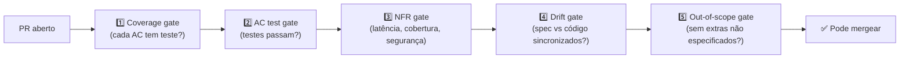

# Fase Validate — spec como contrato executável

> [!abstract] TL;DR
> Validate é o que **fecha o ciclo** SDD — sem ela, spec vira documentação melhorada. Fase Validate transforma a spec em **contrato executável**: jobs de CI verificam que cada acceptance criterion da spec corresponde a teste passando, que NFRs (latência, cobertura, segurança) batem com o declarado, e que não há drift entre spec e código. Em 2026, ferramentas como Kiro, Spec Kit e Tessl integram validation diretamente no pipeline. **Drift detection** é o gate central: spec menciona X que código não tem → build quebra.

## A pergunta que Validate responde

> *"Como provar mecanicamente que o código atende à spec — e que a spec está atualizada com o código?"*

Sem essa fase, spec é intenção. Com ela, spec é lei verificável.

A analogia é o compilador de tipos. Sem TypeScript, você pode declarar que uma variável é `string` e ela pode virar `number` em runtime — descoberto tarde. Com TypeScript, a divergência tipo/uso é detectada antes do runtime. Validate faz o mesmo para spec/código: detecta divergência antes do deploy.

## Por que Validate é o gatilho que SDD precisa

Times adotam SDD com boas intenções. A erosão começa quando:
- Spec foi escrita, PR ficou pronto, alguém mergou sem verificar se código atende spec
- Uma feature mudou, spec não foi atualizada, agente na próxima sessão usa contexto stale
- NFR de latência existia na spec, mas ninguém verificou em produção

Validate fecha cada um desses gaps com automação. Não depende de memória ou boa vontade — depende de pipeline que quebra quando há divergência.

## Os 5 gates canônicos



Cada gate é um ponto de falha explícito. O PR não merga enquanto todos os gates não passam.

### Gate 1 — Coverage gate

**Pergunta:** *Cada acceptance criterion da spec tem pelo menos um teste correspondente?*

O gate mapeia IDs de AC na spec para testes no código. Se AC3 da spec não tem teste com referência a AC3, o gate falha — mesmo que o comportamento esteja implementado, sem teste rastreável o AC não está verificado.

```yaml
# .github/workflows/sdd-validate.yml (fragmento)
- name: AC Coverage Check
  run: spec-kit verify --coverage --spec specs/payments/refund/spec.md --fail-on-missing
  # Extrai AC1..ACn da spec, busca por @pytest.mark.spec("...#AC1") ou comentário
  # Falha se qualquer AC não tem teste vinculado
```

**Implementação com pytest:**
```python
# Convenção: marcar cada teste com o AC que valida
import pytest

@pytest.mark.spec("refund.spec.md#AC1")
def test_full_refund_within_7_days_creates_pending():
    """Valida AC1: refund total ≤7 dias → status pending sem aprovação."""
    ...

@pytest.mark.spec("refund.spec.md#AC2")
def test_partial_refund_after_7_days_requires_approval():
    """Valida AC2: refund parcial >7 dias → approval_required."""
    ...
```

O gate lê todos os `@pytest.mark.spec("refund.spec.md#ACN")` e verifica que N cobre todos os ACs do spec file.

### Gate 2 — Acceptance test gate

**Pergunta:** *Os testes vinculados a cada AC estão passando?*

Esse gate é o mais simples: rodar os testes filtrados por spec e falhar se qualquer AC tem teste vermelho.

```bash
# Rodar apenas testes vinculados à spec de refund
pytest -m "spec and refund" --tb=short

# Output esperado:
# PASSED tests/refunds/test_full.py::test_full_refund_within_7_days (AC1)
# PASSED tests/refunds/test_partial.py::test_partial_refund_after_7_days (AC2)
# PASSED tests/refunds/test_idem.py::test_duplicate_request_idempotent (AC-idempotência)
```

**Por que separar do Coverage gate?** Coverage gate verifica presença de testes; Acceptance gate verifica que passam. Ambos são necessários. Um teste que existe mas está pulado (skip) passa no Coverage gate mas deve falhar no Acceptance gate.

### Gate 3 — NFR gate

**Pergunta:** *Os non-functional requirements declarados na spec são atendidos?*

NFRs são os requisitos que mais frequentemente caem sem perceber em produção porque "ninguém meçiu". NFR gate transforma declarações em assertions:

| NFR na spec | Gate executável |
|---|---|
| `latency_p95_ms: 500` | Load test: k6 ou Locust com assert p95 < 500 |
| `idempotency: required` | Teste envia mesma request 2x → assert resultado idêntico |
| `audit_retention_years: 7` | Inspect schema: assert coluna `expires_at` com valor correto |
| `coverage_min: 80%` | pytest-cov: `--fail-under=80` |
| `auth: required on all endpoints` | OWASP Zap scan ou teste de auth bypass |
| `pii_encrypted_at_rest: true` | Inspect DB: assert campo criptografado |

NFRs que não têm gate em CI são NFRs esperançosos, não verificados.

```yaml
# Gate de latência (k6)
- name: Latency NFR (p95 < 500ms)
  run: |
    k6 run scripts/load-test-refund.js \
      --env TARGET_P95=500 \
      --out json=results.json
    python scripts/assert-p95.py results.json 500
```

### Gate 4 — Drift gate

**Pergunta:** *Existe algo na spec que não está no código, ou no código que não está na spec?*

Este é o gate mais crítico em spec-anchored e spec-as-source. Detecta tanto drift por omissão (implementou menos) quanto por adição (implementou mais).

```python
# Pseudocódigo do drift detector
def check_drift(spec_file: str, code_dir: str) -> list[DriftIssue]:
    spec_endpoints = extract_endpoints_from_spec(spec_file)
    # e.g. {"POST /refunds", "GET /refunds/{id}", "DELETE /refunds/{id}"}

    code_endpoints = extract_routes_from_code(code_dir)
    # e.g. {"POST /refunds", "GET /refunds/{id}"}

    issues = []

    # Spec menciona endpoint que código não implementa
    for ep in spec_endpoints - code_endpoints:
        issues.append(DriftIssue(
            type="missing_implementation",
            message=f"Spec declares {ep} but code has no matching route"
        ))

    # Código tem endpoint que spec não menciona
    for ep in code_endpoints - spec_endpoints:
        issues.append(DriftIssue(
            type="undocumented_endpoint",
            message=f"Code has {ep} but spec has no AC for it"
        ))

    return issues
```

**Implementações reais de drift detection em 2026:**
- **spec-kit verify --drift**: compara spec markdown com OpenAPI gerado do código
- **Kiro drift-check**: AST scanner que mapeia funções para ACs da spec
- **OpenSpec archive gate**: spec no estado "applied" só pode avançar se drift = zero

### Gate 5 — Out-of-scope gate

**Pergunta:** *O PR adicionou algo que a spec marcou explicitamente como fora do escopo?*

Spec declara:
```markdown
## Out of scope
- Refund em método diferente do original (ex: cashback quando pagou no cartão)
- Refund de pedidos com mais de 90 dias
```

O gate procura por sinais de que essas funcionalidades foram implementadas:

```bash
# Busca por padrões que indicariam implementação de out-of-scope
grep -r "cashback\|different_method\|alternative_method" src/refunds/ && exit 1 || true
grep -r "90.*days\|days.*90\|age.*90\|90.*age" src/refunds/ && exit 1 || true
```

Implementação mais sofisticada: LLM critic analisa o diff do PR e verifica semanticamente se algo fora do escopo foi adicionado.

## Spec como contrato executável: dois formatos

### Formato markdown estruturado (spec-anchored)

A especificação em markdown pode ser parseada por ferramentas:

```markdown
## Acceptance criteria

<!-- spec-id: AC1 -->
- [ ] **AC1** — Refund total ≤7 dias
  - **Teste:** [test_full_refund_within_7_days](tests/refunds/test_full.py)
  - **Status:** automated

<!-- spec-id: AC2 -->
- [ ] **AC2** — Refund parcial >7 dias requer aprovação
  - **Teste:** [test_partial_refund_approval](tests/refunds/test_partial.py)
  - **Status:** automated
```

O `spec-id` é o link entre spec e teste que ferramentas como spec-kit usam para o coverage gate.

### Formato YAML/OpenAPI (spec-as-source)

Em nível de rigor máximo, a spec é machine-readable desde o início:

```yaml
# specs/payments/refund.spec.yml
acceptance_criteria:
  - id: AC1
    description: "Full refund within 7 days → pending status"
    test: "tests/refunds/test_full.py::test_full_refund_within_7_days"
    automated: true

  - id: AC2
    description: "Partial refund after 7 days → approval required"
    test: "tests/refunds/test_partial.py::test_partial_refund_approval"
    automated: true
```

CI pode extrair esse YAML e executar os testes referenciados como parte do gate.

## O pipeline completo em GitHub Actions

```yaml
# .github/workflows/sdd-validate.yml
name: SDD Validation Pipeline

on:
  pull_request:
    paths:
      - 'specs/**'
      - 'src/**'
      - 'tests/**'

jobs:
  sdd-validate:
    runs-on: ubuntu-latest
    steps:
      - uses: actions/checkout@v4

      - name: Set up Python
        uses: actions/setup-python@v5
        with:
          python-version: '3.12'

      - name: Install dependencies
        run: pip install -r requirements-dev.txt

      # GATE 1: Cobertura de AC
      - name: AC Coverage Check
        run: spec-kit verify --coverage --spec specs/ --fail-on-missing
        # Falha se qualquer AC não tem teste vinculado

      # GATE 2: Testes de AC
      - name: Run Acceptance Tests
        run: pytest -m spec --tb=short --junitxml=reports/spec-tests.xml

      # GATE 3: NFR — cobertura de código
      - name: Coverage NFR
        run: pytest --cov=src --cov-fail-under=80

      # GATE 3: NFR — latência (smoke test)
      - name: Latency NFR (smoke)
        run: |
          uvicorn src.main:app --host 0.0.0.0 --port 8000 &
          sleep 3
          k6 run scripts/smoke-test.js --env P95_MAX=500

      # GATE 4: Drift detection
      - name: Spec-Code Drift Check
        run: spec-kit verify --drift --spec specs/ --code src/

      # GATE 5: Out-of-scope check
      - name: Out-of-Scope Check
        run: spec-kit verify --out-of-scope specs/

      # LLM critic (gate auxiliar, não bloqueante)
      - name: LLM Critic Review
        continue-on-error: true
        run: claude-cli review-pr --spec specs/payments/refund/spec.md --mode critic
        # Não bloqueia, mas comenta no PR se encontrar divergências semânticas
```

> [!tip] LLM critic como gate auxiliar
> O último gate frequentemente é um LLM rodando como **critic** — não como decisor, mas como sinalizador. Compara spec vs implementação e detecta inconsistências semânticas que regex não pega. Em 2026, ferramentas como Claude Code, Kiro e Augment Code oferecem isso nativamente.

## Living-spec workflow: o PR que força sincronia

Em spec-anchored, o PR completo de uma feature inclui:

```
PR: feat/refunds — Fase Validate
├── specs/payments/refund/spec.md     ← atualizado com AC novo
├── tests/refunds/test_new_ac.py      ← teste do AC novo
├── src/refunds/service.py            ← código que atende AC novo
└── plan/refunds/tasks.md             ← T9 marcada [x]
```

Os gates bloqueiam qualquer PR que não tenha todos os quatro componentes:

| Faltou | Gate que falha |
|---|---|
| Spec atualizada mas sem novo teste | Coverage gate (AC sem teste) |
| Spec atualizada mas sem código | Drift gate (spec menciona algo que código não tem) |
| Código novo mas sem spec | Drift gate (código tem algo que spec não menciona) |
| Spec e código sem teste | Acceptance gate (test não roda = AC não verificado) |

Esse mecanismo torna a sincronia **obrigatória por construção**, não por disciplina.

## Validate nas ferramentas de 2026

| Ferramenta | Como implementa Validate |
|---|---|
| **Kiro** | Hooks de pre-commit + pre-merge com subagents de validation; spec compliance check nativo |
| **GitHub Spec Kit** | CLI `specify verify`; integração direta com GitHub Actions via actions/spec-kit |
| **OpenSpec** | Estado `archive` exige spec no estado `applied` + todos os testes passando |
| **Tessl** | Validation contínua durante Implement (não só no PR); mais agressivo e em tempo real |
| **Augment Code** | Validation como parte do coordinator-validator pattern; LLM critic integrado |

## Anti-patterns na fase Validate

| Anti-pattern | Consequência |
|---|---|
| Validation só pré-merge, não durante PR | Descoberta tardia; maior custo de correção |
| AC sem ID único | Impossível vincular automaticamente a teste |
| NFRs como comentário na spec, sem gate | NFR nunca verificado; viola em prod sem alerta |
| Drift gate em modo "warning" | Ninguém olha warnings; drift cresce silenciosamente |
| Out-of-scope gate muito rígido (regex) | Falsos positivos → time desabilita o gate |
| LLM critic como gate bloqueante | Falsos positivos de LLM param merges legítimos |
| Validation pipeline > 15 min | Time começa a bypassar porque "demora muito" |

## Quando Validate falha com frequência excessiva

Se o pipeline falha em 30%+ dos PRs, o problema não é a validation — é o processo upstream:

| Causa | Diagnóstico | Solução |
|---|---|---|
| Spec muito vaga → drift inevitable | Spec não era precisa o suficiente | Reforce a fase Specify |
| Drift gate com regras mal calibradas | Muitos falsos positivos | Calibre o detector com exemplos reais |
| Time não está em nível anchored mas gates exigem | Nível de rigor incompatível com maturidade | Reduzir para gates compatíveis com spec-first |
| NFRs não eram realistas | p95 de 100ms era impossível | Revisar NFRs com dados de performance reais |

Validate é proporcional ao nível de rigor. Forçar gates de spec-as-source num projeto spec-first quebra o time sem resolver o problema real.

## Métricas de validation

| Métrica | Alvo | Sinal de problema |
|---|---|---|
| % AC com teste vinculado | 100% | ACs órfãos = comportamento não verificado |
| % PRs com drift detectado | < 5% | Acima → spec ou código mal alinhados |
| Tempo do pipeline de validation | < 10 min | Acima → time começa a bypassar |
| % NFRs medidos em CI | > 70% | Abaixo → NFRs são teatro |
| Falsos positivos do drift gate | < 2% | Acima → gate vira ruído, desabilitado |
| Pipeline falha por razões incorretas | 0 | Gate com bug é pior que sem gate |

## Veja também

- [[06 - Fase Implement — execução disciplinada]]
- [[09 - SDD com agentes — coordinator, implementor, validator]]
- [[10 - Integração com context engineering — specs como contexto persistente]]
- [[03 - Níveis de rigor — spec-first, spec-anchored, spec-as-source]]

## Referências

- **GitHub Spec Kit** — *Verify command and validation flow* (2026). Gate de cobertura de AC e drift detection.
- **Kiro** — *Hooks and CI integration for spec compliance* (2026). Automação de validation nativa no IDE.
- **Augment Code** — *AI Agent Workflows: Validation and Drift Detection* (2026).
- **OpenSpec Initiative** — *Archive state and validation requirements* (2025).
- **Tessl** — *Continuous spec validation during development* (2026). Modelo de validation em tempo real.
- **arxiv:2512.08769** — *A Practical Guide for Designing, Developing, and Deploying Production-Grade Agentic AI Workflows* (2025).
- **Anadea** — *CI/CD Pipelines for AI Agent Development* (2026). Integração de SDD validation em pipelines existentes.
- **k6** — *Load testing tool* — referência para NFR gates de latência automatizados.
- **OWASP** — *OWASP Zap* — referência para NFR gates de segurança automatizados.
- **pytest-cov** — Coverage report para NFR de cobertura de testes.
- **Forsgren, N. et al.** — *Accelerate* (2018). DORA metrics que Validate mede: change failure rate, lead time.
- **Rossman, S.** — *Behavior-Driven Development with Cucumber* (2019). BDD como precursor do acceptance test gate: specification examples como testes executáveis.
- **Humble, J.; Farley, D.** — *Continuous Delivery* (2010). Deployment pipeline com gates de qualidade — estrutura que Validate SDD herda e especializa para spec compliance.
- **Arundel, J.; Domingos, J.** — *Cloud Native DevOps with Kubernetes* (2019). NFR gates em CI como prática de engenharia de confiabilidade — base para NFR automation no SDD.
- **Kim, G.; Behr, K.; Spafford, G.** — *The Phoenix Project* (2013). Analogia com "work in progress" e qualidade: spec gates como mecanismo de controle de qualidade no fluxo de entrega.
