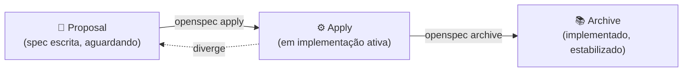
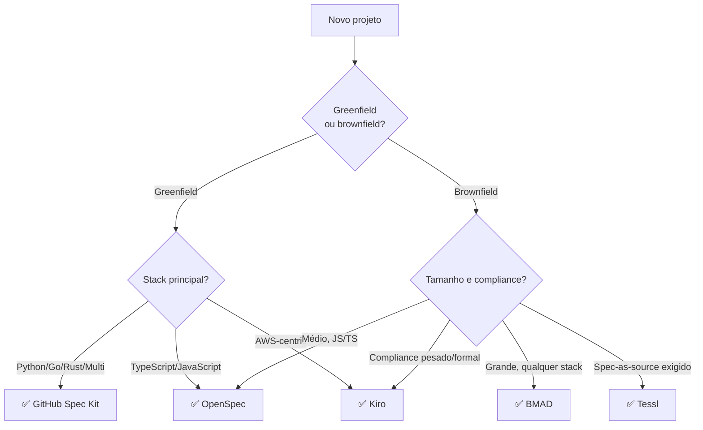

# Ferramentas SDD — Kiro, Spec Kit, OpenSpec, Tessl

> [!abstract] TL;DR
> O ecossistema SDD em 2026 estabilizou em **dois campos**: *static-spec tools* (estruturam spec upfront — Spec Kit / OpenSpec) e *living-spec / agentic IDE* (spec viva integrada com agente — Kiro / Tessl). GitHub Spec Kit é o **padrão open source** com 88k stars. Kiro é a aposta da Amazon para substituir Q Developer. OpenSpec brilha em brownfield TypeScript. Tessl empurra spec-as-source de forma mais agressiva. Esta nota mapeia cada ferramenta, seu modelo mental e quando usar cada uma.

## O contexto: por que ferramentas especializadas

Antes de 2025, SDD era uma prática informal — equipes escreviam spec em Confluence, Notion ou Google Docs, sem integração com o fluxo de desenvolvimento. O resultado previsível: specs ficavam stale rapidamente, sem mecanismo de verificação de drift.

A proliferação de ferramentas SDD em 2025-2026 resolve o problema de tooling: integração com IDE, com CI/CD, com os agentes de codificação mais populares. A spec sai do documento morto e entra no repositório como cidadã de primeira classe.

## Panorama das ferramentas

| Ferramenta | Categoria | Forte em | Stack | Modelo |
|---|---|---|---|---|
| **GitHub Spec Kit** | Static-spec, CLI | Greenfield, multi-agent | Python | Open source (MIT) |
| **OpenSpec** | Static-spec, CLI | Brownfield, npm-friendly | TypeScript | Open source |
| **Kiro** | Living-spec, IDE+CLI | Full-stack, AWS-aligned | Multi (Claude) | Pago (AWS) |
| **Tessl** | Living-spec, plataforma | Spec-as-source agressivo | Multi | Pago |
| **BMAD** | Agentic framework | Brownfield large-scale | Multi | Open source |

Dois critérios organizam essa taxonomia:

1. **Static vs Living**: spec é escrita uma vez (static) ou mantida em sincronia ativa com o código (living)?
2. **CLI vs IDE**: ferramenta vive no terminal (CLI) ou integrada no editor?

## GitHub Spec Kit — o padrão open source

Lançado em 2025 pelo GitHub, licença MIT. Em abril de 2026: 88k stars, 129 releases, suporte a 28+ AI coding agents (GitHub Copilot, Claude Code, Gemini CLI, Cursor, Windsurf, Aider, e outros).

O Spec Kit implementa exatamente o pipeline SDD canônico em 4 fases via CLI:

```bash
# Fase 1: Specify
specify init my-project
specify add "Add refunds feature"
# → Abre sessão com agente para produzir spec.md interativamente

# Fase 2: Plan
specify plan refunds
# → Agente gera plan.md a partir da spec (arquitetura, decisões, stack)

# Fase 3: Tasks (dentro do Plan no Spec Kit)
specify tasks refunds
# → Agente decompõe plan.md em tasks.md numeradas com dependências

# Fase 4: Implement
specify implement refunds
# → Loop task-a-task: carrega spec+plan+task como contexto, agente implementa
```

### Estrutura de arquivos que o Spec Kit mantém

```
my-project/
├── .specify/
│   └── config.yml          ← agente preferido, templates customizados
├── specs/
│   └── refunds/
│       ├── spec.md          ← produzido por `specify add`
│       ├── plan.md          ← produzido por `specify plan`
│       └── tasks.md         ← produzido por `specify tasks`, atualizado em implement
└── src/
    └── ...
```

### O ciclo de implement do Spec Kit

O Spec Kit não apenas orquestra — ele mantém estado entre sessões. `tasks.md` é atualizado em tempo real com `[x]` conforme tasks completam. Ao retomar após uma pausa, o agente lê o estado atual de `tasks.md` e continua da última task incompleta, sem retrabalho.

### Verificação e drift detection

```bash
# Verificar coverage de AC
specify verify --coverage

# Verificar drift spec/código
specify verify --drift

# Validação completa
specify verify
```

### Quando usar Spec Kit

| Situação | Spec Kit? |
|---|---|
| Greenfield project em qualquer linguagem | ✅ Primeira escolha |
| Time usa Claude Code, Cursor ou Copilot | ✅ Suporte nativo |
| Quer open source com governança ativa | ✅ GitHub mantém |
| Multi-agent com agentes diferentes colaborando | ✅ Suporta 28+ agentes |
| Brownfield com convenções JS/TS enraizadas | ❌ Use OpenSpec |
| Quer IDE integrado (não só CLI) | ❌ Use Kiro |
| Compliance AWS-heavy | ❌ Use Kiro |

## OpenSpec — brownfield e npm-friendly

OpenSpec é a ferramenta SDD do ecossistema TypeScript/JavaScript. Foco em brownfield: times com código existente que querem adotar SDD incrementalmente, sem refatoração big-bang.

### O diferencial: state machine de 3 estados



Cada mudança de funcionalidade começa como **Proposal** — um arquivo de spec em estado "pendente". Quando o time decide implementar, muda para **Apply**. Quando está implementado e os testes passam, vai para **Archive**. Estados explícitos tornam o progresso visível e o drift detectável.

```bash
# Instalação
npm install -g @openspec/cli

# Criar proposta de feature
openspec propose "Add refund support to payments"
# → Cria specs/payments/refund/PROPOSAL.md

# Iniciar implementação (spec vai de Proposal para Apply)
openspec apply payments/refund

# Arquivar após implementação completa
openspec archive payments/refund
```

### Integração com projetos TypeScript existentes

OpenSpec foi desenhado para coexistir com código existente. Ao contrário de Spec Kit que é otimizado para greenfield, OpenSpec tem comandos para:

```bash
# Criar spec retroativa para feature existente
openspec reverse-engineer src/payments/refund.ts
# → Gera PROPOSAL.md descrevendo o comportamento atual

# Verificar drift (spec arquivada vs comportamento atual)
openspec verify --archived

# Listar features sem spec
openspec audit src/
```

### Quando usar OpenSpec

| Situação | OpenSpec? |
|---|---|
| Projeto JS/TS brownfield estabelecido | ✅ Primeira escolha |
| Quer adoção incremental (feature por feature) | ✅ State machine facilita |
| Time prefere npm/npx a pip | ✅ Ecossistema nativo |
| Quer spec retroativa para código existente | ✅ reverse-engineer command |
| Greenfield em Python/Go/Rust | ❌ Use Spec Kit |
| Quer IDE integrado nativo | ❌ Use Kiro |

## Kiro — a aposta da Amazon

Kiro foi lançado em junho de 2025 como "the spec-first IDE for AI coding". Em 2027, substituirá Amazon Q Developer (end-of-support confirmado para 30/abr/2027). Tecnicamente, Kiro usa Claude como engine de agente por baixo.

Kiro representa uma abordagem diferente: em vez de CLI + editor separados, é uma IDE completa construída em torno do paradigma spec-first.

### Conceitos únicos do Kiro

**Specs (Steering docs):** documentos de spec estruturados que funcionam como "AGENTS.md por feature". Vivem em `.kiro/specs/` e são carregados automaticamente pelo agente nas sessões relevantes.

**Hooks:** automações que executam em eventos do workspace:

```yaml
# .kiro/hooks/pre-commit.yml
name: Spec Compliance Check
triggers:
  - type: pre-commit
actions:
  - type: run-agent
    prompt: |
      Verify that the changes in this commit comply with the spec
      in .kiro/specs/{{feature_name}}/spec.md
      Report any divergences as blocking issues.
```

**Steering files:** configuração persistente de projeto (similar a CLAUDE.md / AGENTS.md):

```markdown
# .kiro/steering/project.md
## Tech Stack
- Backend: FastAPI + PostgreSQL
- Frontend: React + TypeScript
- Testing: pytest + httpx

## Coding Standards
- Always use type hints
- API endpoints must have OpenAPI docstrings
- Every endpoint needs integration test

## Spec conventions
- ACs must use Given/When/Then format
- NFRs must include numeric targets
```

**Custom subagents:** agentes especializados que podem ser invocados para tarefas específicas:

```yaml
# .kiro/agents/security-reviewer.yml
name: Security Reviewer
model: claude-opus-4-6
instructions: |
  You are a security expert. Review the implementation against
  OWASP Top 10 and the security requirements in the spec.
  Report every violation as a blocking issue with remediation guidance.
```

**Multi-week tasks:** Kiro suporta agentes que trabalham por dias ou semanas em tarefas grandes, com checkpointing automático de estado.

### Caso real: AWS Industries Blog (2026)

> [!example] Drug discovery agent com Kiro
> Time de 3 engenheiros usando Kiro. Feature complexa de bioinformática.
> - Semana 1: Spec + Plan com steering científico
> - Semana 2: Implement com subagent de validação científica
> - Semana 3: Validate + refinamento
> Timeline original: 3-4 meses com desenvolvimento tradicional. Resultado: 3 semanas. Redução de 75%.

### Quando usar Kiro

| Situação | Kiro? |
|---|---|
| Ecossistema AWS (EC2, Lambda, RDS) | ✅ Integração nativa |
| Quer IDE integrado (não só CLI) | ✅ IDE completa |
| Tarefas longas, multi-semana | ✅ Multi-week task support |
| Compliance pesado (subagentes de audit) | ✅ Custom subagents para security/compliance |
| Quer open source portátil | ❌ Use Spec Kit |
| Time em stack não-AWS | ❌ Kiro funciona mas sem vantagem diferencial |
| Quer só CLI lightweight | ❌ Kiro é IDE completo |

## Tessl — spec-as-source agressivo

Tessl é a ferramenta que vai mais longe no espectro: spec não é só fonte de contexto, é **a fonte autoritativa** que gera código. Para o [[03 - Níveis de rigor — spec-first, spec-anchored, spec-as-source|nível spec-as-source]].

A abordagem: você escreve a spec em linguagem formal de Tessl; a plataforma gera stubs, contratos e às vezes código completo a partir dela. Mudanças de comportamento entram pela spec, não pelo código.

### Diferencial de Tessl

Enquanto Spec Kit e Kiro usam spec como contexto para um agente que escreve código livremente, Tessl usa spec como input para um gerador — mais próximo do modelo OpenAPI Generator ou Protobuf do que de um agente LLM.

Vantagem: drift é impossível por construção (código gerado não pode divergir da spec).
Custo: domínio precisa ser modelável formalmente; team tem curva de aprendizado maior.

### Quando usar Tessl

| Situação | Tessl? |
|---|---|
| Compliance regulatório com rastreabilidade formal | ✅ Spec-as-source atende auditores |
| Múltiplas implementações da mesma spec (web, mobile, API) | ✅ Geração multi-target |
| Domínio bem-modelado (CRUD, APIs RESTful) | ✅ Geração funciona bem |
| Domínio criativo ou exploratório | ❌ Formal modeling inibe |
| Team pequeno sem expertise em modelagem | ❌ Curva alta |
| Quer resultado rápido sem investimento em tooling | ❌ Use Spec Kit |

## BMAD — brownfield large-scale

BMAD (Built with Multi-Agent Development) é um framework open source focado em projetos brownfield grandes, onde o desafio não é começar com spec, mas **retroativamente criar spec para código que já existe**.

### Abordagem incremental

```
Módulo A: sem spec (legado)
Módulo B: spec retroativa (BMAD reverse-engineer)
Módulo C: spec-anchored (novo código)
Módulo D: spec-as-source (área crítica)
```

BMAD não exige um big bang. Times adotam módulo a módulo, priorizando as áreas de maior risco.

## Comparativo de decisão



## Compatibilidade entre ferramentas

| Combinação | Funciona? | Comentário |
|---|---|---|
| Spec Kit + Claude Code | ✅✅ | Suporte nativo documentado |
| Spec Kit + Cursor | ✅ | Via prompts; menos integrado |
| Spec Kit + Copilot | ✅✅ | Integração nativa |
| OpenSpec + Aider | ✅ | Coexistem sem conflito |
| Kiro + Spec Kit | ⚠️ | Sobreposição; escolha um |
| Kiro + AGENTS.md | ✅ | Steering files + AGENTS.md complementam |
| OpenSpec + Spec Kit | ⚠️ | Filosofias similares; redundante |
| Qualquer ferramenta + CI/CD | ✅ | `specify verify`, `openspec verify`, CI hooks do Kiro |

## Custo de adoção

| Ferramenta | Curva de aprendizado | Setup inicial | Time até productivo |
|---|---|---|---|
| Spec Kit | Suave | 1-2 horas | 1 dia |
| OpenSpec | Suave | 1 hora | 1 dia |
| Kiro | Média | 1 dia (IDE + config) | 3-5 dias |
| Tessl | Íngreme | 1 semana (formal modeling) | 2-4 semanas |
| BMAD | Média | 2-3 dias | 1 semana |

## A recomendação de start

Para times que estão escolhendo agora (jun 2026):

1. **Comece com Spec Kit** — open source, suave de adotar, multi-agent, padrão da comunidade
2. **Evolua para Kiro** se estiver em ecossistema AWS ou precisar de IDE integrado e tarefas multi-semana
3. **Use OpenSpec** se o projeto é TypeScript brownfield e quer adoção incremental
4. **Chegue a Tessl** só se compliance formal ou spec-as-source for requerimento do projeto

A armadilha: escolher Kiro ou Tessl antes de ter maturidade em SDD é superengenharia. A ferramenta não substitui a prática — e a prática você aprende mais rápido com Spec Kit.

## Veja também

- [[09 - SDD com agentes — coordinator, implementor, validator]]
- [[10 - Integração com context engineering — specs como contexto persistente]]
- [[11 - Guia de implementação SDD — do zero ao projeto]]
- [[03 - Níveis de rigor — spec-first, spec-anchored, spec-as-source]]

## Referências

- **GitHub** — *spec-kit GitHub repository* (2026). 88k+ stars, 129 releases.
- **Fission-AI** — *OpenSpec GitHub repository* (2026). Open source, npm-first.
- **Amazon** — *Kiro official site e documentation* (kiro.dev, 2026).
- **Martin Fowler** — *Understanding Spec-Driven-Development: Kiro, spec-kit, and Tessl* (2026). Análise comparativa independente.
- **AWS Industries Blog** — *From spec to production: drug discovery agent using Kiro* (2026). Caso real de uso enterprise.
- **Augment Code** — *6 Best Spec-Driven Development Tools for AI Coding in 2026* (2026). Análise living-spec vs static-spec.
- **Hashrocket** — *OpenSpec vs Spec Kit: Choosing the Right AI-Driven Development Workflow* (2026). Comparativo hands-on.
- **DeepLearning.AI** — *Spec-Driven Development with Coding Agents* (abr 2026). Curso usando Spec Kit + agentes.
- **Amazon** — *Amazon Q Developer end-of-support announcement* (2026). Contexto da transição Q→Kiro.
