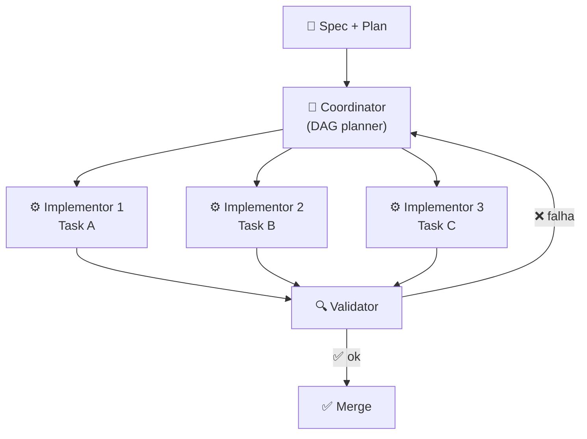
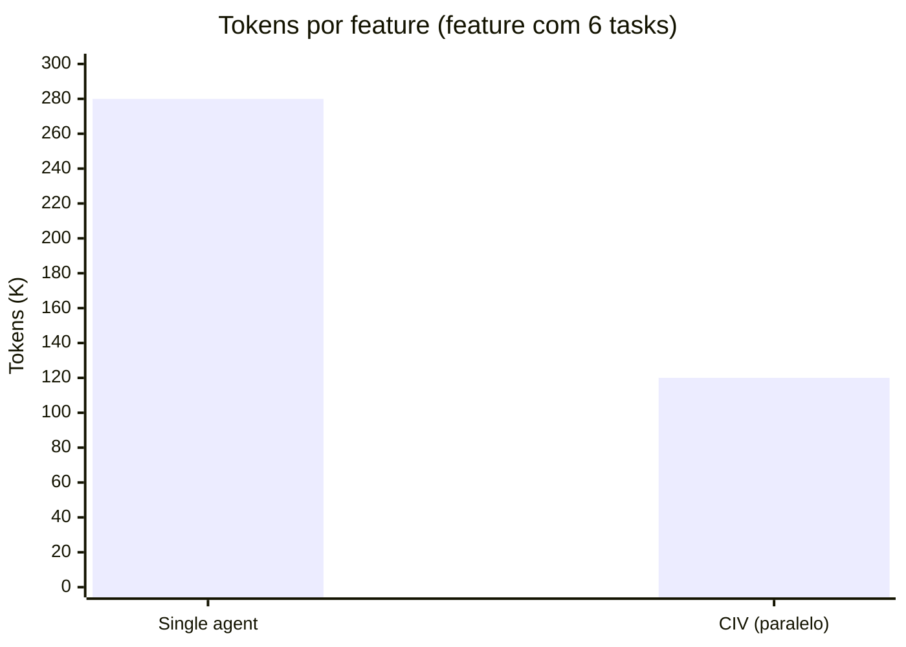

# SDD com agentes — coordinator, implementor, validator

> [!abstract] TL;DR
> SDD é onde **multi-agent começa a fazer sentido**. O padrão dominante em 2026 é o trio **Coordinator/Implementor/Validator (CIV)**: coordinator transforma spec em DAG de subtasks; implementors trabalham em paralelo, cada um com contexto isolado focado na sua task; validators verificam saídas contra spec antes de aceitar. Pesquisa peer-reviewed (VeriMAP, EACL 2026) formalizou o padrão. Anthropic, Augment, AWS Kiro convergiram. Ganho real: paralelismo seguro + isolamento de contexto + drift detection automatizada.

## Por que multi-agent só funciona com spec

Imagine uma montadora. Sem planta de engenharia, operários improvisa em cada posto de trabalho. O carro sai diferente a cada vez, e o inspetor de qualidade não tem como saber *o que* verificar. Com a planta, cada posto sabe exatamente o que recebe, o que faz, e o que entrega. O inspetor verifica contra especificação, não contra opinião.

**SDD para multi-agent é a planta da montadora.** Sem spec, agentes concorrentes produzem código incompatível, duplicam lógica, ou quebram contratos uns dos outros sem perceber. Com spec, cada agente tem contrato claro: o que recebe como input, o que deve produzir como output, e como saber se acertou.

O padrão CIV (Coordinator/Implementor/Validator) é a materialização dessa ideia. Em 2026, convergiu como o padrão de facto para SDD agentic — usado nativamente em Kiro, formalizado no paper VeriMAP (EACL 2026), e documentado como prática recomendada no Claude Agent SDK.

## A arquitetura CIV



Cada papel tem **contexto isolado** — implementor 1 não vê o histórico do 2. A razão é context rot: contexto inflado dilui atenção. Um agente com 5K tokens focados em uma task resolve melhor do que um agente com 200K tokens carregando o projeto inteiro.

## Os três papéis em detalhe

### Coordinator — o planejador de DAG

> [!quote] VeriMAP (EACL 2026)
> *"The Coordinator is the central orchestrator of multi-agent task execution, following the task plan (represented as a DAG) to support reliable and adaptive execution."*

O Coordinator é o único agente que vê a spec completa e o plan completo. Sua função não é implementar — é **transformar o plan em um grafo dirigido acíclico (DAG) de subtasks** e gerenciar a execução.

**Responsabilidades:**
- Transformar [[05 - Fase Design e Plan — arquitetura e decomposição|plan]] em DAG de subtasks com dependências explícitas
- Identificar quais tasks podem rodar em paralelo
- Disparar implementors — um por task — com contexto isolado e mínimo
- Receber resultado de cada implementor via validation
- Replanejar se task falha (até N tentativas, depois escala para humano)
- Manter estado persistente do progresso

**O que o Coordinator NÃO faz:**
- Escrever código (isso é papel do implementor)
- Revisar código linha a linha (isso é o validator)
- Tomar decisões arquiteturais (isso foi feito no Plan)

**Modelo:** Sonnet ou Opus — precisa raciocinar sobre interdependências e replanejar adaptivamente.

**Contexto do coordinator:**
```
CONTEXTO DO COORDINATOR
========================
spec.md (completa)
plan.md (completo)
tasks.yml (DAG, atualizado com status)
AGENTS.md (convenções do projeto)
```

### Implementor — executor de contexto mínimo

O Implementor recebe **uma task** com input definido, critérios de aceitação, e lista de arquivos no escopo. Nada mais.

A analogia: um implementor é como um cirurgião especialista. Você não explica para ele a história médica completa do hospital — você dá o prontuário do paciente, a cirurgia a fazer, e os critérios de sucesso. O resto é ruído que prejudica o foco.

**Responsabilidades:**
- Receber task (input + AC + arquivos de escopo)
- Carregar **só** o contexto relevante (spec da feature + arquivos da task)
- Escrever código + testes que satisfaçam os ACs
- Reportar resultado: `{ status: pass|fail, evidence: [...], files_changed: [...] }`

**O que o Implementor NÃO recebe:**
- Plan completo (só a parte da sua task)
- Output de outros implementors rodando em paralelo
- Histórico de conversas do coordinator

**Modelo:** Sonnet ou Haiku — tarefa estreita, contexto mínimo, modelo barato resolve bem.

**Contexto do implementor para uma task:**
```
CONTEXTO DO IMPLEMENTOR
========================
task.yml (descrição, ACs, escopo)
spec/feature.md (só a feature desta task)
arquivos listados em task.scope
AGENTS.md (convenções)
```

> [!tip] A matemática do isolamento
> 10 implementors com 5K tokens cada = 50K tokens totais. Um agente monolítico lidando com 10 tasks = 150K+ tokens (contexto cresce com histórico). Além de mais barato, os implementors isolados têm atenção 30x mais focada por task.

### Validator — verificador independente

O Validator é o gate entre "implementado" e "aceito". Recebe o output do implementor, a spec da feature, e verifica **de forma independente** se os critérios de aceitação foram atendidos.

A palavra-chave é "independente". Validator deliberadamente **não vê** o raciocínio do implementor — só o resultado. O motivo: se validator e implementor compartilham prompt ou contexto, o validator tende a aceitar qualquer coisa que o implementor produziu. Independência arquitetural (modelo diferente, prompt diferente, contexto diferente) é o que torna o gate efetivo.

**Responsabilidades:**
- Executar os ACs como assertions (não como inspeção visual)
- Rodar gates de coverage, drift, NFR (ver [[07 - Fase Validate — spec como contrato executável]])
- Produzir veredicto estruturado: `{ pass: bool, failures: [...], evidence: [...] }`
- NÃO sugerir como corrigir — isso é papel do implementor/coordinator

**O que o Validator NÃO faz:**
- Implementar correções
- Decidir se "quase passou" é suficiente (isso é humano ou coordinator)
- Avaliar qualidade de código além dos ACs

**Modelo:** Sonnet — diferente do implementor para evitar viés de confirmação idêntico.

**Contexto do validator:**
```
CONTEXTO DO VALIDATOR
======================
task.yml (ACs explícitos)
spec/feature.md (contratos)
output do implementor (código + testes)
resultado dos gates (coverage report, drift report)
[NÃO inclui]: reasoning do implementor
```

> [!warning] Anti-pattern crítico
> Validator com prompt genérico ("is this code good?") é inútil. Validator efetivo tem prompt específico: "Verify that each acceptance criterion in task.yml is satisfied by the evidence in implementor output. Report pass/fail per AC with line-level evidence."

## DAG: a estrutura que habilita paralelismo

O coordinator não inventa o DAG do nada — ele deriva do plan produzido na [[05 - Fase Design e Plan — arquitetura e decomposição|Fase Plan]]. A diferença: o plan descreve decisões; o DAG é uma estrutura de execução.

```yaml
# tasks.yml — DAG gerado pelo coordinator
tasks:
  T1:
    name: "Schema refund_request"
    description: "Criar migration da tabela refund_request"
    inputs:
      - spec/payments.md#refunds
      - plan/architecture.md#data-model
    outputs:
      - migrations/004_add_refund_request.sql
      - src/models/refund_request.py
    acceptance:
      - "migration aplica sem erro em DB vazio"
      - "migration aplica sem erro em DB com dados de prod fixture"
      - "model tem campos: id, order_id, amount, status, created_at"
    depends_on: []
    parallel_safe: true
    status: pending

  T2:
    name: "RefundRepository"
    description: "Repositório de acesso a dados para refunds"
    inputs:
      - spec/payments.md#refunds
      - T1.outputs
    outputs:
      - src/repositories/refund_repository.py
      - tests/unit/test_refund_repository.py
    acceptance:
      - "create_refund persiste e retorna com id gerado"
      - "find_by_order_id retorna lista correta"
      - "update_status lança ValueError se status inválido"
    depends_on: [T1]
    parallel_safe: true   # paralelo com T3 quando T1 aprovado
    status: blocked

  T3:
    name: "RefundService"
    depends_on: [T2]
    parallel_safe: false  # depende de decisão arquitetural em T2
    status: blocked

  T4:
    name: "POST /api/refunds endpoint"
    depends_on: [T3]
    status: blocked

  T5:
    name: "GET /api/refunds/{id} endpoint"
    depends_on: [T3]
    parallel_safe: true   # paralelo com T4
    status: blocked
```

O coordinator dispara T2 e T5 em paralelo assim que seus `depends_on` são aprovados. Tasks `parallel_safe: false` esperam na fila.

## Exemplo end-to-end: feature de reembolso

Para tornar concreto, aqui está um ciclo completo com três implementors paralelos e um validator:

```
Iteração 1: T1 (apenas)
  coordinator → implementor-1(T1: migration + model)
  implementor-1 → validator
  validator: ✅ migration aplicou, model correto

Iteração 2: T2 e T5 em paralelo (desbloqueados por T1)
  coordinator → implementor-2(T2: repository)
  coordinator → implementor-3(T5: GET endpoint)
  [paralelo]
  implementor-2 → validator → ✅ 3/3 ACs pass
  implementor-3 → validator → ❌ 1 AC falhou (404 para id inválido)

Iteração 3: retry de T5
  coordinator → implementor-4(T5: retry com feedback do validator)
  implementor-4 → validator → ✅ 3/3 ACs pass

Iteração 4: T3 (desbloqueado por T2 aprovado)
  coordinator → implementor-5(T3: service layer)
  implementor-5 → validator → ✅

Iteração 5: T4 (desbloqueado por T3)
  coordinator → implementor-6(T4: POST endpoint)
  ...
```

O humano observa o grafo de progresso em `tasks.yml`. Só intervém quando coordinator sinaliza "task falhou 3x, escalando".

## VeriMAP — a formalização peer-reviewed

VeriMAP (EACL 2026) é o paper que trouxe o CIV para o domínio científico. O sistema:

1. **Verification-aware planning**: o coordinator codifica constraints de verificação *antes* de disparar implementors — cada task tem veredicto binário formalmente definido.
2. **DAG com prova de contrato**: antes de liberar T_n, sistema prova mecanicamente que T_{n-1} atendeu todos os ACs.
3. **Rollback parcial**: se T_n falha após aprovação de T_{n-1}, sistema pode reverter apenas T_n sem tocar T_{n-1}.

Aplicação principal: domínios regulados (financeiro, saúde) onde rastreabilidade de decisões é exigência de compliance.

## Implementações práticas em 2026

| Stack | Como fazer CIV |
|---|---|
| **Claude Code (nativo)** | `Task` tool com `subagent_type`; coordinator no main thread via Agent tool |
| **LangGraph** | `StateGraph` com nodes coordinator/implementor/validator; edges condicionais por veredicto |
| **Kiro** | Specs + steering + custom subagents; CIV é a arquitetura default |
| **GitHub Spec Kit** | `specify implement` faz coordinator interno com loop de validation |
| **Python + Anthropic SDK** | Loop manual: `coordinator_loop()` chama `run_implementor()` + `run_validator()` |

### Esqueleto em Python (Anthropic SDK)

```python
import anthropic

client = anthropic.Anthropic()

def run_coordinator(spec, plan, tasks):
    dag = parse_dag(tasks)
    while not dag.complete():
        ready = dag.ready_tasks()           # tasks sem dependências pendentes
        parallel = [t for t in ready if t.parallel_safe]
        # Dispatcher: implementors em paralelo
        results = run_parallel_implementors(parallel, spec)
        for task, output in results.items():
            verdict = run_validator(task, output, spec)
            if verdict.pass_:
                dag.mark_done(task)
            else:
                dag.mark_retry(task, verdict.failures)
                if dag.retry_count(task) >= 3:
                    escalate_to_human(task, verdict)

def run_implementor(task, spec):
    # Contexto mínimo: só spec da feature + arquivos do escopo
    context = build_minimal_context(task, spec)
    return client.messages.create(
        model="claude-sonnet-4-6",
        messages=[{"role": "user", "content": context}]
    )

def run_validator(task, implementor_output, spec):
    # Contexto independente: NÃO inclui reasoning do implementor
    context = build_validator_context(task, implementor_output, spec)
    response = client.messages.create(
        model="claude-sonnet-4-6",          # modelo diferente do implementor
        messages=[{"role": "user", "content": context}]
    )
    return parse_verdict(response)
```

## Custo de tokens: CIV vs single-agent

Uma questão legítima: CIV usa N agentes — não fica mais caro?



O paradoxo: **CIV pode ser mais barato**. A razão:

- Single agent carrega contexto completo desde o início. Cada task adiciona ao histórico. Task 6 processa contexto de tasks 1-5, gerando context rot e tokens desperdiçados em atenção dispersa.
- CIV: cada implementor começa com contexto fresco (5-15K). Coordinator vê DAG de estado, não transcrições completas.

O overhead de CIV (coordinator + validators) costuma ser 20-40% do total — compensado pela ausência de context rot nos implementors.

## Variantes avançadas

### Hierarchical (multi-level coordinator)

Para features muito grandes, coordinator pode delegar a **sub-coordinators** por área:

```
Coordinator principal
├── Sub-coordinator A (camada de dados)
│   ├── Implementor A1 (schema)
│   └── Implementor A2 (repositories)
└── Sub-coordinator B (camada de API)
    ├── Implementor B1 (endpoints)
    └── Implementor B2 (serializers)
```

Sub-coordinators resolvem suas dependências internas. Coordinator principal orquestra entre as áreas.

### Specialist subagents (padrão Kiro)

Em vez de implementors genéricos, **subagents especializados** por domínio:

```yaml
# .kiro/agents/db-migration-writer.yml
name: DB Migration Writer
instructions: You write SQL migrations following the conventions in...

# .kiro/agents/security-reviewer.yml
name: Security Reviewer
instructions: Review implementation against OWASP Top 10 and spec security requirements...
```

Coordinator escolhe o specialist por tipo de task. Resultado: migrations são escritas por um agente que só faz migrations, com prompt otimizado para isso.

### LLM critic como validator extra

Pipeline com validators encadeados, cada um com foco diferente:

```
Implementor → Test validator → Security validator → Style validator → Approve
```

Cada validator é independente. Security validator verifica vulnerabilidades OWASP. Style validator verifica convenções do AGENTS.md. Test validator verifica cobertura de AC.

## Métricas de saúde do CIV

| Métrica | Alvo saudável | Sinal de alerta |
|---|---|---|
| **Speedup vs single-agent** | 2-4x em features com tasks paralelizáveis | <1.5x: DAG não está paralelizando |
| **% tasks aprovadas em first-pass** | >75% | <60%: spec mal escrita ou tasks grandes demais |
| **% drift detectado por validator** | >90% | <70%: validator prompt muito vago |
| **Retry rate por task** | <20% | >40%: ACs ambíguos no plan |
| **Overhead de coordenação** | <20% do tempo total | >35%: coordinator está fazendo trabalho de implementor |
| **Escalações para humano** | <5% das tasks | >15%: tasks mal decompostas ou ACs irrealizáveis |

## Quando NÃO usar CIV

CIV adiciona overhead real — coordinator + validator + comunicação inter-agente. O overhead só vale quando compensa:

- **Feature com 1-2 tasks**: sem paralelismo possível, CIV é apenas burocracia
- **Time sem expertise em orquestração**: aprender CIV enquanto entrega feature é problema duplo
- **Plan vago**: DAG fraco → coordinator produz tasks mal definidas → validators rejeitam tudo
- **Domínio criativo**: validation mecânica funciona mal quando "correto" é subjetivo
- **Prototipagem inicial**: spec still evolving → paralelismo seria retrabalho

Regra de bolso: CIV compensa com ≥4 tasks paralelizáveis e spec estável.

## Anti-patterns CIV

| Anti-pattern | Consequência |
|---|---|
| **Coordinator sem paralelismo** | Vira sequência com overhead extra |
| **Implementors recebendo plan completo** | Perde isolamento, context rot volta |
| **Validator com prompt genérico** | Aprova qualquer output, gate inútil |
| **DAG sem revisão humana** | Coordinator pode criar dependência circular ou ignorar constraint |
| **Sem fallback após 3 falhas** | Loop infinito, custo de tokens explode |
| **Custos não monitorados** | N agentes × tokens = surpresa no billing |
| **Validator = mesmo modelo + prompt do implementor** | Viés de confirmação, gate ilusório |

## Veja também

- [[05 - Fase Design e Plan — arquitetura e decomposição]]
- [[06 - Fase Implement — execução disciplinada]]
- [[07 - Fase Validate — spec como contrato executável]]
- [[08 - Ferramentas SDD — Kiro, Spec Kit, OpenSpec, Tessl]]
- [[10 - Integração com context engineering — specs como contexto persistente]]

## Referências

- **VeriMAP** — *EACL 2026 paper, verification-aware multi-agent planning*. Formaliza CIV com prova de contratos por task.
- **Augment Code** — *Coordinator-Implementor-Verifier Pattern for Dev Teams* (2026).
- **Anthropic** — *Claude Agent SDK: Subagents and Orchestration* (2026).
- **arxiv:2512.08769** — *A Practical Guide for Designing, Developing, and Deploying Production-Grade Agentic AI Workflows* (2025).
- **Kiro** — *Custom subagents documentation* (2026). Specialist subagents como especialização do padrão CIV.
- **LangGraph** — *Multi-agent coordination patterns* (2026). StateGraph para CIV.
- **GitHub Spec Kit** — *Multi-agent workflow documentation* (2026). Implement loop com validation nativa.
