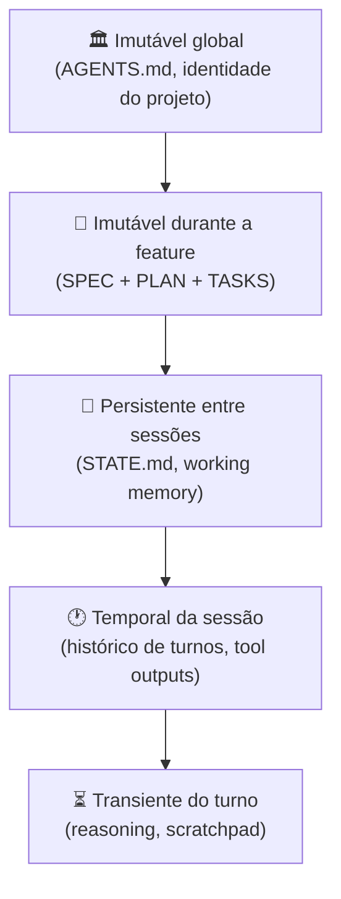
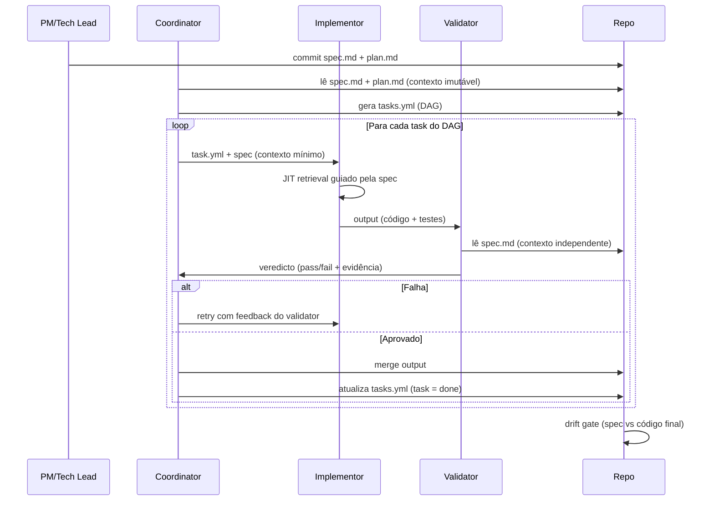

# Integração com context engineering — specs como contexto persistente

> [!abstract] TL;DR
> SDD e context engineering não são disciplinas separadas — são **camadas da mesma stack**. Specs são contexto: imutável, versionado, persistente, machine-readable. Plan é contexto. Tasks são contexto. Quando você faz SDD direito, está fazendo context engineering correto **por construção**. A spec entra na hierarquia de camadas no nível mais alto (imutável durante a feature). Esta nota mostra como as duas disciplinas se complementam e como combiná-las operacionalmente.

## A analogia: spec como mapa de atenção

Um agente de codificação sem spec navega como um turista sem mapa em cidade desconhecida: para cada decisão, precisa explorar, inferir, tentar. Pergunta: "onde fica o banheiro?" Resposta: lê os nomes de todas as ruas do bairro, depois tenta cada estabelecimento.

Um agente com spec tem o mapa. Sabe que "o banheiro é no terceiro andar, ala norte, porta 312". Atenção vai direto. Context rot não acontece porque o agente não carrega todo o "bairro" — carrega só a rota.

Isso é o que specs fazem pelo contexto: funcionam como **seletor de relevância**. Em vez de agente inferir o que é relevante (e frequentemente errar), a spec declara o que importa. JIT retrieval cirúrgico, contexto compacto, atenção focada.

## A correspondência entre SDD e context engineering

Context engineering tem quatro pilares. SDD entrega cada um:

| Pilar de context engineering | Onde SDD entrega |
|---|---|
| **Prompt craft** | Tasks têm prompts pequenos e focados: acceptance criteria + escopo de arquivos |
| **Context engineering** | Spec + plan + tasks + AGENTS.md formam uma pipeline de contexto versionada |
| **Intent engineering** | Outcomes da spec encodam o objetivo de produto; agente nunca perde o "porquê" |
| **Specification engineering** | É o pilar central — SDD é a operacionalização prática de specification engineering |

SDD é, em essência, **specification engineering colocada em prática**, conectada com os outros pilares por baixo.

## Onde a spec mora nas camadas de contexto

Context engineering organiza contexto em camadas por durabilidade. Spec ocupa exatamente a camada que faz sentido: imutável durante a feature, mutável entre features.



Spec + plan + tasks ocupam a **camada imutável por feature**: não mudam durante a execução de uma feature, mas podem ser atualizados quando a feature encerra ou quando a spec evolui por nova informação.

O que isso significa na prática:

- Ao iniciar sessão na feature X, agente carrega `specs/X/spec.md` — e isso não muda durante a sessão
- Ao passar para a feature Y (semana seguinte), o "imutável" muda para `specs/Y/spec.md`
- AGENTS.md nunca muda dentro da sessão (é imutável global)
- STATE.md é a working memory entre turnos da mesma sessão

## Como a spec entra na pipeline de contexto

Um builder de contexto bem-desenhado para implementor SDD:

```python
def build_context_for_implementor(turn):
    return [
        # Camada imutável global (sempre)
        load_agents_md(),

        # Camada imutável por feature (não muda durante a feature)
        load_spec(turn.feature),
        load_plan(turn.feature),

        # Foco do turno (a task atual)
        load_current_task(turn.task_id),

        # Working memory (persistente entre turnos da sessão)
        load_state_md(turn.session),

        # Histórico compactado (temporal)
        recent_history_compacted(turn, max_tokens=2000),

        # Código relevante (JIT: carregado sob demanda)
        relevant_code_jit(turn, scope=turn.task.files),
    ]
```

Cada camada tem papel distinto e vive em duração diferente. A spec entra **antes** do histórico e tem peso maior — é sinal estável, não ruído de curto prazo.

## Spec como memória de longo prazo entre sessões

O problema central de contexto em sessões longas: **decisões se perdem**. O agente decide na sessão 1 que idempotência será via outbox. Na sessão 5, reinicia sem esse contexto e implementa Redis SET para a mesma feature. Inconsistência arquitetural que não aparece nos testes mas quebra invariantes.

```
Sem SDD (memória efêmera):
  Sessão 1: agente decide usar Postgres + outbox → código implementado
  Sessão 5: nova sessão, zero contexto → agente re-decide, usa Redis SET
  → Inconsistência: duas implementações de idempotência conflitantes

Com SDD (memória persistente na spec):
  plan.md: "D2: idempotency via outbox pattern (ver ADR-012)"
  Sessão 1: lê plan → usa outbox
  Sessão 5: lê plan → ainda usa outbox
  → Consistência por construção, sem depender de memória humana
```

A spec é **memória externa versionada** que sobrevive a:
- Context window resets
- Agentes diferentes (Copilot na sessão 1, Claude Code na sessão 5)
- Membros diferentes do time
- Semanas de distância entre sessões

Nenhuma dessas situações corrompe a spec — ela vive no repositório, junto com o código.

## Spec stale = envenenamento de contexto

> [!warning] Spec desatualizada é pior que ausência de spec
> Se spec descreve comportamento da v1 e o código já está na v3, agente carrega contexto **estruturalmente errado** a cada sessão. Não é "documentação velha" — é viés sistêmico injetado na atenção do modelo, que pode:
> - Fazer agente regenerar código que já existe (desperdício)
> - Fazer agente remover código necessário (acreditando que "spec não menciona")
> - Fazer validator reprovar implementação correta (porque spec cita comportamento antigo)

Por isso [[03 - Níveis de rigor — spec-first, spec-anchored, spec-as-source|spec-anchored]] (living spec) é o padrão recomendado para projetos em produção: garante que o contexto persistente reflita a realidade do código.

O drift gate em CI não é só QA — é **proteção do contexto**:

```yaml
# .github/workflows/spec-guard.yml
- name: Detect spec drift
  run: specify verify --drift
  # Falha se spec != comportamento implementado
  # Garante que o "mapa" (spec) reflete o território (código)
```

## Spec + AGENTS.md — divisão de trabalho clara

Uma dúvida frequente: o que vai em AGENTS.md e o que vai na spec?

| Dimensão | AGENTS.md | spec.md |
|---|---|---|
| **Escopo** | Projeto inteiro | Uma feature específica |
| **Vida** | Trimestres a anos | Uma sprint a meses |
| **Frequência de mudança** | Rara | Por feature |
| **Conteúdo** | Convenções de código, stack, build, security policies | Outcomes, acceptance criteria, NFRs da feature |
| **Tamanho** | 1-3K tokens | 1-3K tokens |
| **Carregado pelo agente** | Sempre (toda sessão) | Quando trabalhando na feature |
| **Quem escreve** | Time (decisão coletiva) | PM + tech lead (por feature) |

Regra de ouro: **não duplique**. Se algo vale para o projeto inteiro, vai em AGENTS.md. Se é específico de uma feature, vai na spec. Quando você tem ambos, o agente recebe o contexto certo na granularidade certa.

> [!example] Exemplo concreto de divisão
> - **AGENTS.md**: "Toda API REST deve ter testes de integração com banco real (não mock)"
> - **spec/refunds/spec.md**: "POST /refunds retorna 422 quando amount < 0 com campo errors.amount = 'must be positive'"
>
> O AGENTS.md ensina o padrão geral; a spec define o comportamento específico. Ambos chegam ao implementor; juntos são suficientes.

## Skills + specs — a combinação mais poderosa

Skills resolvem **padrões recorrentes** (como adicionar endpoint, como escrever migration). Specs descrevem **o trabalho atual** (o que o endpoint deve fazer).

```
.agent/
├── skills/
│   ├── adding-endpoint.md        ← padrão genérico (reusável entre features)
│   └── writing-migration.md      ← padrão genérico
└── specs/
    └── refunds/
        ├── spec.md               ← comportamento da feature atual
        ├── plan.md               ← decisões arquiteturais da feature
        └── tasks.md              ← DAG de execução
```

Fluxo de um implementor na feature refunds:
1. Carrega `AGENTS.md` (padrões do projeto — sempre)
2. Carrega `specs/refunds/*` (feature ativa — por sessão)
3. Quando vai adicionar endpoint, ativa skill `adding-endpoint.md` (padrão genérico)
4. Aplica o padrão da skill com os **constraints específicos da spec** (status codes, campos, NFRs)

Resultado: padrão correto + comportamento correto. Nem um, nem outro, sozinhos, chegam lá.

## JIT retrieval guiado pela spec

JIT retrieval (Just-In-Time) é o padrão de carregar código só quando necessário. Sem spec, o agente precisa adivinhar o que é relevante — geralmente explora amplo demais, carregando código que não importa.

Com spec, o retrieval se torna cirúrgico:

```
Spec: "POST /refunds chama refund_service.request(),
       que persiste em tabela refund_request e publica
       evento refund.requested no bus de eventos."

Agente decide ler (JIT):
  - src/refunds/service.py         ← mencionado explicitamente
  - src/models/refund_request.py   ← mencionado explicitamente
  - src/events/bus.py              ← infere do "publica evento"
  - tests/refunds/test_service.py  ← para entender padrão de teste existente

Agente NÃO lê:
  - src/payments/*, src/orders/*, src/users/*  ← fora do escopo da spec
  - docs/**, config/**                         ← não mencionado
```

A spec funciona como **filtro de relevância antes do retrieval**. Isso reduz o contexto carregado em 60-80% em projetos grandes, sem sacrificar completude para a tarefa.

## Compactação que respeita spec

Quando o histórico de uma sessão longa passa do limite de contexto, compactação (summarization) roda. A regra fundamental:

> [!tip] Spec, plan e tasks NUNCA são compactados
> Esses documentos são âncora — o que sustenta todos os outros. O que compacta é histórico de turnos, tool outputs, scratchpad de reasoning. A spec permanece intacta.

Compactação descuidada que "resume" a spec pode perder constraints críticas:

```
ANTES da compactação:
  spec.md: "Retry automático com backoff exponencial. Max 3 tentativas.
            Base delay: 100ms. Jitter: ±20%."

DEPOIS de compactação ingênua:
  summary: "Spec menciona retry com backoff."

Agente na sessão seguinte implementa:
  Max retries: 5, base delay: 1s, sem jitter
  → Spec violada sem alerta, drift silencioso
```

Frameworks maduros (Kiro, Spec Kit) mantêm spec em região protegida fora da janela de compactação.

## Multi-agent SDD como arquitetura de contexto distribuído

O padrão CIV (Coordinator/Implementor/Validator) de [[09 - SDD com agentes — coordinator, implementor, validator|nota 09]] é, em termos de context engineering, uma **arquitetura de contexto distribuída**:

| Papel | Contexto que recebe | Contexto que NÃO recebe |
|---|---|---|
| Coordinator | Spec completa + plan completo + estado do DAG | Detalhe interno de cada implementor |
| Implementor 1 | Spec da feature + plan da feature + sua task | Outras tasks, reasoning de outros implementors |
| Implementor 2 | Spec da feature + plan da feature + sua task | Output de Implementor 1 rodando em paralelo |
| Validator | Spec da feature + output do implementor | Reasoning interno do implementor |

Cada papel recebe **mínima janela de contexto com máxima relevância**. Isso é o ideal de qualidade de contexto (baixa entropia = alta relevância).

Sem spec clara, não há como fazer essa distribuição — o coordinator não saberia o que dar para cada implementor, e o validator não saberia o que verificar.

## Sequência de contexto em uma feature completa



Cada seta é também uma **transferência de contexto** precisa. A spec é o único documento que perpassa todas as trocas.

## Padrão de adoção combinada

Equipes que adotam SDD e context engineering juntos geralmente seguem esta progressão:

```
Semana 1-2: Context engineering básico
  - Criar AGENTS.md com stack, convenções, build
  - Configurar prompt caching (Claude API)
  - Habilitar JIT retrieval via tools nativas

Semana 3-4: SDD spec-first
  - Escrever spec antes de cada feature
  - Versionar em specs/ no repositório
  - Spec informa o JIT retrieval

Semana 5-6: Spec-anchored (living spec)
  - Living spec via PR: código e spec mudam juntos
  - Drift gate básico em CI
  - Compactação protege spec

Mês 2: Multi-agent CIV
  - Coordinator/implementor/validator
  - Specs distribuídas por papel
  - Métricas de contexto por agente

Mês 3+: Spec-as-source (se domínio permite)
  - Geração a partir da spec
  - Validação formal de contratos
  - Tessl ou gerador customizado
```

## Métricas da integração

| Métrica | Sem SDD | Com SDD + context eng |
|---|---|---|
| **Drift spec→código** | Não medido | <5% |
| **Cache hit rate** | ~50% | >70% (spec estável = cache estável) |
| **Tokens por feature** | 100% (baseline) | ~50% (spec evita re-exploração) |
| **Sessões que "esquecem" decisões** | ~30% | <5% (plan como memória externa) |
| **% AC com teste automatizado** | <50% | 100% (AC = test gate) |
| **Context rot detectado por sessão** | Raramente | Automaticamente (drift gate) |

## Spec como single source of truth para humanos e agentes

Uma consequência subestimada da integração SDD + context engineering: **humanos e agentes passam a trabalhar com o mesmo documento**.

Antes de SDD, o contexto humano (o PM sabe que o timeout deve ser 30s) e o contexto do agente (o que está no prompt da sessão) são paralelos — nunca sincronizados. O resultado: agentes tomam decisões que contradizem o que o time já decidiu, sem saber.

Com SDD, a spec é o ponto de convergência:

```
Humanos escrevem → spec.md ← Agentes leem
                       ↑
               Single source of truth
```

Quando PM ou tech lead atualiza a spec, agentes na próxima sessão automaticamente veem a mudança. Quando agente detecta divergência entre spec e código, humans veem via drift gate. O fluxo de informação é bidirecional e auditável.

Isso tem impacto em comunicação de time: em vez de reunião para "alinhar contexto com o agente", o time **atualiza a spec** e o alinhamento acontece na próxima sessão. Less ceremony, mais rastreabilidade.

## Anti-patterns na integração

> [!warning] Spec sem versão no repo
> Não pode ser memória persistente confiável; fica stale sem rastreabilidade.

> [!warning] Spec gigantesca (>3K tokens)
> Vira [[Context Engineering|03 - Context rot e atenção diluída|context rot]] por si mesma — a spec deveria ser o filtro de relevância, mas se ela própria estoura o orçamento, o context window fica dominado pela spec e não sobra espaço para o resto (histórico, código JIT). O sintoma: agente "esquece" partes da spec no meio da tarefa, exatamente o problema que ela deveria resolver.

> [!warning] AGENTS.md duplicando spec
> Uma das duas fontes vai ficar desatualizada primeiro; agente recebe sinal conflitante entre "convenção do projeto" e "regra da feature" sem saber qual pesa mais.

> [!warning] Compactação que toca spec
> Perde constraint crítica silenciosamente — ver o exemplo de retry acima (`Max 3 tentativas, backoff 100ms, jitter ±20%` virando `retry com backoff`). Agente trabalha com mapa errado sem alerta.

> [!warning] Implementor com plan completo
> Anula o isolamento de contexto do padrão CIV — o implementor volta a carregar informação de outras tasks e outros implementors, e o context rot que a arquitetura distribuída existia para evitar volta pela porta dos fundos.

> [!warning] Skills citando specs específicas
> Quebra a reusabilidade: uma skill que hardcoda `refunds/spec.md` não pode ser reaproveitada em outra feature. Skills devem ser genéricas; quem traz o específico é a spec carregada ao lado.

> [!warning] JIT retrieval sem spec como filtro
> Sem a spec como seletor de relevância, o retrieval volta a ser amplo demais — o agente lê arquivos que não importam, o contexto infla e a atenção dilui, anulando o ganho de 60-80% que o JIT guiado por spec entrega.

> [!warning] Spec retroativa falsa (spec depois do código)
> Quando a spec é escrita descrevendo o que o código já faz — em vez de o outcome pretendido antes de codificar — ela perde o valor prescritivo. Vira documentação disfarçada de spec: não filtra decisões futuras, só narra o passado.

## Exemplo: redução de contexto medida em projeto real

Um dado concreto de 2026 (Augment Code case study): time migrou de "agente com contexto livre" para SDD spec-anchored. Métricas antes/depois:

```
Antes:
  - Tokens médios por sessão: 180K (agente explorava codebase de 40K arquivos)
  - Sessões com "esquecimento" de decisão: 28%
  - Drift detectado: nunca (sem gate)
  - Tempo por feature: 4.2 dias

Depois (SDD + context eng):
  - Tokens médios por sessão: 65K (JIT guiado por spec, escopo claro)
  - Sessões com "esquecimento": 3% (plan como memória externa)
  - Drift detectado antes de merge: 100% (drift gate em CI)
  - Tempo por feature: 2.8 dias

Resultado: -64% tokens, -89% esquecimentos, +100% drift coverage
```

O ganho de tempo (33%) veio principalmente da eliminação de "retrabalho por esquecimento" — agente reimplementando algo que já existia, ou contradizendo uma decisão arquitetural anterior.

## Como explicar em inglês

Em entrevista ou discussão técnica com time internacional, a integração SDD + context engineering aparece o tempo todo — geralmente na pergunta "how do you keep the agent from losing track of decisions across sessions?". A resposta em inglês precisa do vocabulário certo: "specs" e "context" viram sinônimos na boca de quem já entendeu a integração, e o entrevistador vai notar se você usa os termos com precisão.

Frase-ponte útil: *"The spec is persistent context — it lives in the immutable-per-feature layer, so it survives context window resets and different agents picking up the same feature weeks apart."*

| Português | Inglês |
|---|---|
| Especificação | Specification / spec |
| Contexto persistente | Persistent context |
| Recuperação cirúrgica | Surgical retrieval |
| Compactação | Compaction / summarization |
| Âncora de contexto | Context anchor |
| Região protegida | Protected region |
| Drift de especificação | Spec drift |
| Arquivo de agentes | Agents file (AGENTS.md) |
| Tarefa | Task |
| Memória externa | External memory |

## O que vem a seguir

Esta nota fechou a integração teórica entre SDD e context engineering — a spec como camada imutável, memória persistente e filtro de JIT retrieval. O próximo passo natural é sair da teoria e montar o esqueleto real de um projeto: [[11 - Guia de implementação SDD — do zero ao projeto]] percorre a implantação passo a passo, desde a primeira spec até o drift gate em CI.

## Veja também

- [[02 - O que é Spec-Driven Development]]
- [[04 - Fase Specify — definindo outcomes e constraints]]
- [[09 - SDD com agentes — coordinator, implementor, validator]]
- [[11 - Guia de implementação SDD — do zero ao projeto]]
- [[Context Engineering]] — MOC do galho irmão; aprofunda camadas, pipelines, compressão e memória agentica que esta nota conecta ao SDD

## Referências

- **Anthropic** — [*Effective context engineering for AI agents*](https://www.anthropic.com/engineering/effective-context-engineering-for-ai-agents) (2025). Hierarquia de camadas.
- **Augment Code** — [*How AI Enhances Spec-Driven Development Workflows*](https://www.augmentcode.com/guides/ai-spec-driven-development-workflows) (2026). Spec como contexto persistente.
- **Atlan** — *Context Engineering Framework for Enterprise AI* (2026, URL a confirmar). JIT retrieval e spec como filtro.
- **GitHub Spec Kit** — *Integration with AI agents documentation* (2026, URL a confirmar). Compactação que preserva spec.
- **Kiro** — [*Steering — context management*](https://kiro.dev/docs/steering/) (kiro.dev, 2026). Região protegida para spec.
- **VeriMAP** — *EACL 2026 paper* (URL a confirmar). Contexto distribuído por papel em multi-agent SDD.
- **Andrej Karpathy** — *Context engineering manifesto* (2025, URL a confirmar). Base teórica de camadas de contexto.
- **Simon Willison** — *Notes on spec-driven context* (2026, URL a confirmar). Análise da integração SDD + context eng.
- **Augment Code** — *Case study: reducing context cost with SDD* (2026, URL a confirmar — não localizado o case study específico; achados próximos apontam reduções de 53-68% em custo por task). Dados concretos de adoção.
- **GitHub** — *Spec Kit: Context management in multi-agent workflows* (2026, URL a confirmar). Spec como região protegida.
