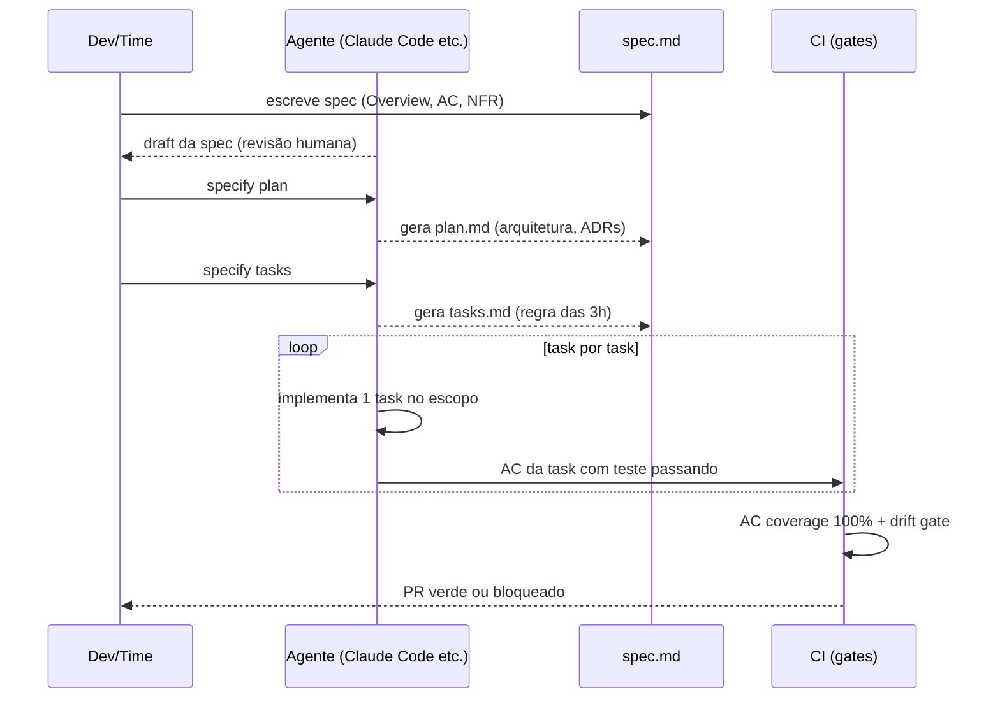

# Guia de implementação SDD — do zero ao projeto

> [!abstract] TL;DR
> Esta nota é o roteiro prático para adotar SDD num projeto real, do zero. Não é teoria — é checklist semana-a-semana. Stack assumida: Spec Kit + Claude Code (mais documentado), mas o roteiro funciona com Kiro/Cursor/qualquer agente. Padrão recomendado: começar em **spec-first**, evoluir para **spec-anchored** após 2-4 semanas, considerar **spec-as-source** só se compliance ou domínio justificarem. Roadmap de 12 semanas para chegar em maturidade.

Você já leu sobre o que é SDD, os níveis de rigor, as ferramentas disponíveis. Mas na segunda-feira de manhã, com o time esperando, a pergunta muda de "o que é SDD" para "por onde eu começo, hoje, neste projeto"? Instalar uma ferramenta não basta — spec-first exige decidir o que vira spec primeiro, quem revisa, e como o time absorve o hábito sem travar a entrega. Este guia é a resposta em forma de checklist: semana a semana, do "isso faz sentido pro meu projeto?" até a maturidade de métricas em CI, passando pelos tropeços mais comuns (adoção parcial, spec retroativa mal revisada, task grande demais) antes que eles aconteçam com você.



## Pré-requisitos

> [!info] O que precisa estar no lugar
> 1. **AGENTS.md** existente ou disposto a criar
> 2. **Repositório git** ativo (specs vão versionadas — sem git não há SDD)
> 3. **Pipeline CI mínimo** (vai precisar de gates, mesmo que simples)
> 4. **Pelo menos um agente configurado** (Claude Code, Cursor, Kiro)
> 5. **Time de acordo** — SDD não funciona com adoção parcial; se um dev ignora, contamina o restante
> 6. **Prompt caching ativo** se possível — specs são prefix cacheável ideal, geram saving real

> [!warning] Adoção parcial contamina o restante
> SDD é uma prática de projeto, não de módulo. Se um dev decide "meu módulo não precisa de spec", o drift dele volta a vazar pros módulos vizinhos (contratos quebrados, specs desatualizadas que ninguém mais confia). O time inteiro precisa topar antes de começar — não dá pra rodar SDD "pela metade" e esperar os benefícios inteiros.

## Semana 0 — Decisão de adoção

### Avaliar fit

> [!question] SDD faz sentido para o seu projeto?
> - [ ] Time >1 pessoa OU vai escalar nos próximos meses
> - [ ] Código vai viver >3 meses (longo prazo)
> - [ ] Compliance/auditoria importa OU vai importar
> - [ ] Dor real com tech debt de IA (agente quebrando contratos, duplicando código)
> - [ ] Disposição a 2-4 semanas de adoção com curva de aprendizado
>
> 4+ marcadas → vale. Menos de 3 → SDD pode ser overhead desnecessário agora.

### Quando NÃO adotar SDD

| Situação | Recomendação |
|---|---|
| Prototipagem de 1-2 semanas | Vibe coding deliberado — spec overhead não vale |
| Projeto solo sem continuidade | Doc informal suficiente |
| Domínio ainda desconhecido | Explore antes de especificar |
| Time de 1 pessoa por <1 mês | Custo de adoção > benefício |
| Feature experimental (throw-away) | Sem spec; se vingar, retroativa depois |

### Escolher ferramenta

Ver [[08 - Ferramentas SDD — Kiro, Spec Kit, OpenSpec, Tessl]]. Default recomendado para a maioria dos times: **GitHub Spec Kit** (open source, suave, multi-agent). Para TypeScript brownfield: **OpenSpec**. Para AWS/IDE integrado: **Kiro**.

### Definir nível inicial

Ver [[03 - Níveis de rigor — spec-first, spec-anchored, spec-as-source]]. Default: **spec-first**. Não comece em spec-anchored ou spec-as-source — a adoção fracassa por overhead.

## Semana 1 — Setup e primeira spec

### Setup técnico (Spec Kit)

```bash
# Instalar Spec Kit
pip install specify-cli

# Inicializar no projeto
cd meu-projeto
specify init

# Estrutura criada automaticamente:
# specs/
# .specify/
#   └── config.yml     ← agente preferido, templates
```

### Adicionar seção SDD ao AGENTS.md

Se AGENTS.md já existe, adicione:

```markdown
## Spec-Driven Development

- Specs vivem em `specs/<feature>/spec.md`
- Plans vivem em `specs/<feature>/plan.md`
- Tasks vivem em `specs/<feature>/tasks.md`
- Antes de implementar qualquer feature, **leia spec + plan**
- Mudança comportamental → atualizar spec antes de alterar código
- Critérios de aceitação → cada um precisa de teste vinculado
```

Se AGENTS.md não existe, criar agora (ver [[Context Engineering]]).

### Template de spec (base para o time)

```markdown
# Spec: [Nome da Feature]

## Overview
[1-2 parágrafos: o que e por que. Qual problema resolve. Para quem.]

## Outcomes
- [Resultado mensurável 1]
- [Resultado mensurável 2]

## Acceptance Criteria
- AC1: [Given/When/Then ou assertion clara]
- AC2: ...
- AC3: ...

## Non-Functional Requirements
- **Performance**: [ex: p95 < 200ms com 100 req/s]
- **Reliability**: [ex: error rate < 0.1%]
- **Security**: [ex: endpoint autenticado por JWT; PII não logado]
- **Maintainability**: [ex: cobertura de testes ≥ 80%]

## Out of Scope
- [X não está incluído]
- [Y será tratado em sprint futuro]

## Dependências
- [Serviço A (versão X)]
- [Feature B (deve estar em produção)]
```

### Primeira spec — escolha algo pequeno

**Regra de ouro**: primeira spec deve ser de uma feature **pequena mas real**. Não comece pelo módulo mais complexo. Sugestões:

- Endpoint de health check
- Validação de email com regras de negócio específicas
- Paginação de listagem existente
- Exportação de CSV com filtros

```bash
specify add "Health check endpoint"
# Abre sessão com agente para produzir spec interativamente
# Agente faz draft, você revisa e ajusta
```

A primeira spec deve ser revisada com **cuidado extra** — ela vira o template mental do time.

## Semana 2 — Plan + tasks + primeira implementação

### Plan

```bash
specify plan health-check
# Agente lê spec e gera plan.md com arquitetura e decisões
```

O plan auto-gerado quase sempre precisa de ajuste. Pontos comuns:

| O que revisar | O que costuma estar errado |
|---|---|
| Stack escolhida | Over-engineered para a necessidade |
| Decisões arquiteturais (ADRs) | Pode pular alternativas óbvias |
| Componentes listados | Pode criar abstrações desnecessárias |
| Dependências externas | Pode incluir libs que projeto não usa |

Ajuste antes de seguir. Plan aprovado = compromisso da equipe.

### Tasks

```bash
specify tasks health-check
# Decompõe plan em tasks numeradas com dependências
```

Cada task deve passar a **regra das 3 horas**: um implementor (humano ou agente) consegue completar em ≤3h? Se não, quebre.

Sintomas de task grande demais:
- Tem mais de 5 arquivos de escopo
- Tem mais de 3 ACs próprios
- Mistura camadas diferentes (model + service + endpoint na mesma task)

> [!warning] Task grande demais quebra a regra das 3h — e quebra o CIV
> Uma task que estoura 3h não é só "mais devagar": ela mistura camadas, dificulta revisão e — se você mais tarde adotar [[09 - SDD com agentes — coordinator, implementor, validator|multi-agent SDD]] — impede paralelização no DAG, porque o validator não consegue isolar o que deu certo do que deu errado dentro da mesma task. Quebrar cedo é mais barato que quebrar depois de descobrir que a task travou o pipeline inteiro.

### Implement

Use o agente já configurado (Claude Code, Cursor) com instrução explícita:

```
Trabalhe em specs/health-check/tasks.md.
Leia spec.md e plan.md primeiro.
Pegue a próxima task [ ].
Implemente com foco apenas no escopo desta task.
Marque [x] quando todos os ACs da task tiverem teste passando.
Então pare e aguarde.
```

Execute task por task. Não pule. Não junte. A disciplina de granularidade é o que permite o CIV funcionar depois.

### Primeira lição da semana 2

É provável que você descubra na implementação:

- Spec ainda tem ambiguidade → corrija a spec (não improvise)
- Plan tem decisão que não funciona → corrija o plan (faça ADR)
- Task estava grande demais → quebre em 2
- Um AC estava testando implementação em vez de comportamento → reformule

**Tudo isso é esperado e é aprendizado.** SDD se aprende fazendo, não lendo. Documente o que corrigiu — vai virar guideline para o time.

## Semanas 3-4 — Adoção pelo time

### Documentar o workflow no projeto

Criar `docs/SDD-WORKFLOW.md` com o fluxo concreto para o time:

```markdown
# Workflow SDD — como fazer uma feature

## Para toda feature nova:
1. Cria branch da feature
2. Escreve `specs/<feature>/spec.md` (use template em docs/SDD-TEMPLATE.md)
3. PR da spec **isolado** (review com PM + tech lead — não codebase)
4. Após spec mergeada: `specify plan <feature>`
5. Revisa plan.md com tech lead (10-15 min)
6. `specify tasks <feature>` — ajusta granularidade
7. Implementa task-a-task com agente
8. PR final: todas tasks [x], testes passando, gates verdes

## Gates de PR:
- Spec presente em `specs/`
- AC coverage 100%
- Sem drift detectado

## Nunca:
- Implementar sem spec aprovada
- Mudar comportamento sem atualizar spec
- Juntar multiple tasks em uma sessão
```

### Treinar o time em sessão prática

Organize uma sessão de 2h: pegar uma feature real, fazer ao vivo, mostrar cada passo. Resistências comuns e como responder:

| Reclamação do time | Resposta |
|---|---|
| "Vai demorar mais" | Sim, nas 2 primeiras semanas. Depois de 2 sprints, velocidade aumenta por menos rework |
| "É burocracia desnecessária" | Agente faz draft da spec em minutos; revisão é 15-20 min de foco |
| "Perdemos flexibilidade" | Mudança de spec é PR — mais flexível que WhatsApp, mas registrado e rastreável |
| "Eu não preciso disso para meu módulo" | SDD é do projeto, não do módulo. Adoção parcial contamina o restante |
| "Agente já faz sem spec" | Mostre um exemplo de drift real do projeto |

## Brownfield: adoção em projeto existente

Projeto com código existente tem uma rota diferente. Não tente spec-retro de tudo.

### Estratégia incremental

```
Módulo legado:  sem spec (por enquanto)
  ↓
Nova feature em módulo legado: spec-first apenas para a parte nova
  ↓
Após 3-4 features: spec retroativa para os contratos principais do módulo
  ↓
Drift gate ativo para o módulo inteiro
```

### Spec retroativa (OpenSpec ou BMAD)

Para criar spec de código existente:

```bash
# OpenSpec: reverse-engineer do código existente
openspec reverse-engineer src/payments/refund.ts
# → Gera PROPOSAL.md com comportamento atual
# Edite para ficar correto e completo

# BMAD: para large-scale brownfield
bmad audit src/payments/
# → Lista módulos, identifica quais têm mais risco
# → Sugere ordem de priorização
```

> [!warning] Spec retroativa descreve bugs como se fossem desejados
> `reverse-engineer`/`audit` lê o código como ele é, não como deveria ser. Se o `refund.ts` tem um bug de arredondamento, a spec gerada documenta esse arredondamento como comportamento esperado — e a partir daí o drift gate passa a *proteger* o bug, porque qualquer correção futura vira "desvio da spec". Revise a spec retroativa linha a linha antes de aprovar; trate-a como rascunho, nunca como fonte de verdade automática.

## Semanas 5-8 — Subir para spec-anchored

### Drift gate em CI

Adicionar ao pipeline:

```yaml
# .github/workflows/spec-gates.yml
name: Spec Gates
on: [pull_request]
jobs:
  spec-compliance:
    runs-on: ubuntu-latest
    steps:
      - uses: actions/checkout@v4
      - run: pip install specify-cli
      - name: AC coverage gate
        run: specify verify --coverage --min=100
      - name: Drift detection gate
        run: specify verify --drift
      - name: NFR gate (opcional)
        run: specify verify --nfr
```

### PR template com checklist SDD

```markdown
## Spec
- Link: `specs/X/spec.md`
- [ ] Spec foi aprovada antes do código
- [ ] Mudança comportamental → spec atualizada neste PR

## Implementação
- [ ] Todas as tasks marcadas [x]
- [ ] Nenhuma task foi "pulada"

## Gates
- [ ] AC coverage 100%
- [ ] Drift gate verde
- [ ] NFR gate verde (se aplicável)
```

### O salto mais difícil: manutenção de spec

A maior dificuldade de spec-anchored não é o setup — é manter a spec em sincronia quando o código muda. Dois padrões que funcionam:

**Pattern 1: Spec-first em bugfixes**
Antes de corrigir um bug, cheque se a spec o descreve. Se o bug é um comportamento não descrito na spec, adicione à spec (como AC negativo) antes de corrigir.

**Pattern 2: Spec review em retrospectiva**
A cada sprint, revisão de 15 min: "Quais specs ficaram stale neste sprint?" Atualiza as que ficaram para trás.

## Semanas 9-12 — Maturidade

### Métricas de saúde SDD

| Métrica | Como medir | Alvo |
|---|---|---|
| % features com spec antes do código | Count de PRs com `specs/` no diff | >90% |
| Drift detectado por CI (não humano) | CI logs de `--drift` | >95% |
| Tempo médio specify→merge | Issue/PR timestamps | -20% vs baseline |
| AC coverage média | `specify verify --coverage` | 100% |
| Specs stale detectadas | Drift gate em CI | <5% das specs ativas |
| Escalações de task para humano | Coordinator logs (se CIV) | <5% das tasks |

### Retrospectiva de adoção (a cada 3 sprints)

- Specs muito vagas? → Reforçar template de AC (Given/When/Then obrigatório)
- Drift frequente? → Suba rigor (spec-first → spec-anchored mais estrito)
- Validation lenta? → Otimize CI, paralelize gates
- Time achou burocrático? → Simplifique template, automatize mais o draft
- Volume de specs explodiu? → Tasks grandes demais; revise granularidade

## Considerar spec-as-source (mês 4+)

> [!warning] Não pule etapas
> Spec-as-source só faz sentido se o time **já domina spec-anchored** por pelo menos 6-8 sprints. Pular etapas = adoção fracassada + desgaste do time.

Sinais de que vale subir para spec-as-source:
- Compliance regulatório com rastreabilidade formal exigida
- Múltiplas implementações da mesma spec (web + mobile + API)
- Time grande com necessidade de governance forte
- Domínio bem-modelado (CRUD pesado, APIs RESTful estáveis)

Sinais de que **não** vale:
- Domínio criativo ou exploratório
- Time sem expertise em modelagem formal
- Stack heterogênea sem geradores compatíveis
- Pressão por velocidade acima de compliance

## Multi-agent SDD (opcional, mês 5+)

Quando spec-anchored está sólido, considere [[09 - SDD com agentes — coordinator, implementor, validator|CIV]] para features grandes. Sinais de que vale:

- Feature com ≥4 tasks paralelizáveis no DAG
- Ciclo de implementação tomando >3 dias
- Time quer verificação automática de drift por task

Stack típica para CIV customizado:
- Claude Code para implementors (uma sessão por task, `Task` tool)
- Script de validator (spec + coverage report → veredicto)
- Coordinator manual (humano) ou script Python simples

Em Kiro: custom subagents resolvem o CIV nativamente sem setup adicional.

## Sinais de adoção bem-sucedida

| Sintoma | O que significa |
|---|---|
| PRs ficaram menores e mais focados | Tasks pequenas, escopo controlado |
| Reuniões de "alinhamento com o agente" sumiram | Specs comunicam em vez de meetings |
| Onboarding de novo dev ficou mais rápido | Specs são documentação viva e confiável |
| Bugs em produção diminuíram | Validation Gates em CI pegando antes |
| Time consegue explicar melhor o que está construindo | Specs forçaram clareza de intenção |
| Agente comete menos erros fora do escopo | Contexto focado na spec |

## Sinais de adoção falhando

| Sintoma | Causa provável | Correção |
|---|---|---|
| Specs são templates vazios sem substância | Falta revisão; ninguém bloqueia spec ruim | Tech lead bloqueia PR de spec com AC vago |
| Drift gate sempre amarelo, ninguém olha | Soft warning virou ruído | Mude para hard fail; PR não mergea |
| Time pula spec "para feature urgente" | Falta cultural | Reforce no PR review + retrospectiva |
| Specs ficam stale depois de 1 sprint | Não está em anchored de verdade | Adicione drift gate, revise retroativamente |
| Volume de specs explodiu | Tasks grandes demais | Refine granularidade (regra das 3h) |
| Agente ignora spec e improvisa | AGENTS.md não tem instrução SDD | Adicione seção obrigatória no AGENTS.md |

## Como explicar em inglês

Se você vai defender esse roteiro num time internacional ou numa entrevista técnica, vale ter o vocabulário pronto — os termos em português deste guia (spec, critério de aceitação, task) têm equivalentes específicos em inglês que não são tradução literal palavra-por-palavra.

| PT-BR | EN |
|---|---|
| especificação | specification / spec |
| critério de aceitação | acceptance criterion |
| desvio (da spec) | drift |
| âncora (spec como referência viva) | anchor |
| validação (gate de CI) | validation / gate |
| tarefa | task |
| granularidade (da task) | task granularity |
| adoção incremental | incremental adoption |
| retroativa (spec de código existente) | retroactive (spec) |
| manutenção de spec | spec maintenance |

> [!example] Frase pronta
> "We adopted spec-driven development incrementally: spec-first for new features, then retroactive specs for the riskiest legacy contracts, with a drift gate enforcing 100% acceptance-criterion coverage in CI."

## O que vem a seguir

Este guia assume que SDD vale o investimento — mas essa é uma posição, não um consenso. Depois de rodar as primeiras semanas (ou antes, se quiser entender o outro lado antes de convencer o time), veja [[12 - Debates — spec-as-source vs pragmatismo]] para a crítica mais afiada ao rigor total: overhead de manutenção de spec, o risco de burocracia sem ganho real, e quando pragmatismo vence spec-as-source.

## Veja também

- [[02 - O que é Spec-Driven Development]]
- [[03 - Níveis de rigor — spec-first, spec-anchored, spec-as-source]]
- [[08 - Ferramentas SDD — Kiro, Spec Kit, OpenSpec, Tessl]]
- [[09 - SDD com agentes — coordinator, implementor, validator]]
- [[12 - Debates — spec-as-source vs pragmatismo]]

## Referências

- **GitHub Blog** — [*Spec-driven development with AI: Get started with a new open source toolkit*](https://github.blog/ai-and-ml/generative-ai/spec-driven-development-with-ai-get-started-with-a-new-open-source-toolkit/) (2025). Tutorial oficial Spec Kit.
- **Microsoft for Developers** — [*Diving Into Spec-Driven Development With GitHub Spec Kit*](https://developer.microsoft.com/blog/spec-driven-development-spec-kit) (2025). Walkthrough hands-on.
- **Augment Code** — [*What Is Spec-Driven Development? A Complete Guide*](https://www.augmentcode.com/guides/what-is-spec-driven-development) (2026). Guia abrangente.
- **Zencoder Docs** — [*A Practical Guide to Spec-Driven Development*](https://docs.zencoder.ai/user-guides/tutorials/spec-driven-development-guide) (2026). Práticas de brownfield.
- **DeepLearning.AI / JetBrains** — [*Spec-Driven Development with Coding Agents*](https://www.deeplearning.ai/courses/spec-driven-development-with-coding-agents) course (abr 2026). Curso com casos práticos.
- **BMAD** — [*Working in the Brownfield*](https://github.com/bmad-code-org/BMAD-METHOD/blob/main/docs/working-in-the-brownfield.md) (2026). Adoção incremental em projetos legados.
- **Hashrocket** — *30-day SDD adoption retrospective* (URL a confirmar — não localizei via busca um artigo específico da Hashrocket sobre retrospectiva de 30 dias; a Hashrocket publica sobre SDD em [hashrocket.com/blog](https://hashrocket.com/blog/posts/from-spec-to-shipping-how-developers-implement-features-with-ai-driven-workflows), mas não confirmei este título exato).
