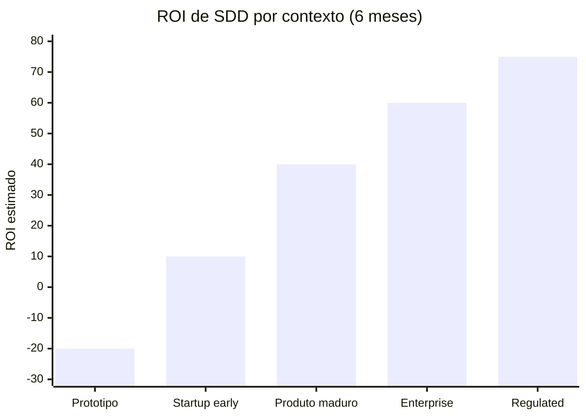

# Debates — spec-as-source vs pragmatismo

> [!abstract] TL;DR
> SDD não é unanimidade. Em 2026, três críticas legítimas circulam: **(1) é waterfall reciclado**, **(2) custo upfront mata velocidade**, **(3) spec-as-source é over-engineering para a maioria**. Entender as críticas separa quem aplica SDD com discernimento de quem aplica como dogma. Esta nota fecha a trilha com posições contrárias, limites concretos do método, e quando explicitamente **não** usar SDD.

## O contexto do debate

A proliferação de ferramentas SDD em 2025-2026 gerou entusiasmo genuíno — e reação igualmente genuína. O debate é saudável. Metodologias que não aceitam crítica viram dogma, e dogmas produzem pior software que o problema que tentam resolver.

Três vozes merecem atenção no debate de 2026:

- **Defensores do SDD** (Augment Code, GitHub Spec Kit team, AWS Kiro, VeriMAP): especificação explícita reduz drift, melhora velocidade líquida no médio prazo, viabiliza multi-agent.
- **Pragmatistas cautelosos** (Fowler, Willison, parte da comunidade Agile): SDD resolve problema real, mas risco de "waterfall com markdown" é concreto. Adoção precisa de julgamento.
- **Céticos radicais** (parte da comunidade startup): toda burocracia mata velocity; vibe coding com revisão humana suficiente resolve; specs são premature optimization.

Nenhuma posição é completamente errada. O ponto é saber quando cada uma se aplica.

## Crítica 1 — "É waterfall reciclado"

> *"Vocês definem tudo antes de codar. Se isso não é waterfall, o que é?"*

### Onde a crítica acerta

- A fase Specify lembra waterfall em nome e estrutura superficial
- O hábito de "spec antes de código" é genuinamente uma volta a princípios pré-agile
- Times que aplicam SDD descuidadamente viram waterfall com markdown
- A resistência cultural de "plan antes de code" é a mesma do Big Design Up Front dos anos 2000

### Onde a crítica erra

| Waterfall | SDD |
|---|---|
| Documento de 200 páginas antes do primeiro commit | Spec de 1-3 páginas por feature, antes daquela feature |
| Fase única longa antes de qualquer desenvolvimento | Iterações curtas: spec → implement → validate → próxima spec |
| Mudança de spec = mudança de projeto | Mudança de spec = PR atomizado |
| Validação no final (UAT) | Validação contínua (drift gate, AC gate por task) |
| Aprovação formal de stakeholder | Review rápido de PM + tech lead |
| Spec como papel assinado | Spec como código versionado e executável |

**Posição honesta:** SDD resgata o rigor pré-ágil que o movimento ágil jogou fora junto com a burocracia. Mas o risco de regredir é real em times descuidados.

### O que diferencia na prática

O critério operacional: em SDD, spec de uma feature cabe em uma sessão de revisão (15-30 min). Em waterfall, specs tomam semanas. Se suas specs estão tomando semanas, você fez waterfall, não SDD.

## Crítica 2 — "Custo upfront mata velocidade"

> *"Antes eu fazia em 2 dias. Agora gasto 1 dia em spec + 1 em plan + 1 em review = 3 dias para a mesma feature."*

### Onde a crítica acerta

- Adoção inicial tem curva real de 2-4 semanas; primeiras features são mais lentas
- Para protótipos de vida curta, é overkill garantido
- Time que faz **só features pequenas isoladas** não se beneficia tanto
- O custo de spec + plan é real e tangível no curto prazo

### Onde a crítica erra

A crítica compara **dia 1 de SDD vs dia 1 sem SDD** — não trimestre vs trimestre. Os dados de 6 meses são consistentemente diferentes:

```
Sem SDD (6 meses, Augment Code study 2026):
  - 28% das sessões perdiam contexto de decisão anterior
  - 35% das features geravam rework por drift spec/código
  - Velocidade bruta alta, velocidade líquida menor

Com SDD (6 meses, mesmo time):
  - <3% das sessões com perda de decisão
  - <5% de rework por drift (drift gate captura)
  - Velocidade bruta menor nas primeiras semanas, líquida +20% após mês 3
```

O argumento real: SDD não é velocidade de feature individual — é **velocidade de produto ao longo do tempo**. Sem spec, cada feature individual é rápida; o produto acumula tech debt que torna features futuras mais lentas.

**Posição honesta:** ROI real aparece após sprint 3. Times com horizonte <2 sprints não recuperam o investimento. SDD é para quem pensa em meses, não dias.

## Crítica 3 — "Spec-as-source é over-engineering para a maioria"

> *"Lean 4 verification, OpenAPI generators, Tessl... isso é fantasy land para 99% dos projetos."*

**Esta crítica está correta.** Sem qualificação.

[[03 - Níveis de rigor — spec-first, spec-anchored, spec-as-source|Spec-as-source]] (nível 3) é:

- Caro de adotar (curva de modelagem formal)
- Restrito a domínios bem modeláveis
- Inaplicável em contextos criativos ou exploratórios
- Over-engineering para a maioria dos projetos comerciais

A defesa honesta de SDD não é "todo mundo deveria fazer spec-as-source". É: **spec-anchored (nível 2) beat vibe coding para qualquer projeto com vida útil >2 meses**. Spec-as-source é um nicho. Confundir as duas posições é o problema.

## SDD vs BDD vs TDD — onde se encaixam

Uma confusão frequente: SDD, BDD (Behavior-Driven Development) e TDD (Test-Driven Development) se sobrepõem, conflitam, ou são a mesma coisa?

| Dimensão | TDD | BDD | SDD |
|---|---|---|---|
| **Nível** | Código (unit) | Feature (behavior) | Produto (outcome) |
| **Quem escreve** | Desenvolvedor | Dev + QA | PM + tech lead + dev |
| **Formato** | Test code | Given/When/Then | Spec.md + ACs |
| **Timing** | Antes do código (ciclo red-green) | Antes do código (feature) | Antes da feature inteira |
| **Audience** | Dev | Dev + non-tech | PM + dev + agente |
| **Machine-readable** | Sim (test runner) | Sim (Cucumber et al.) | Parcialmente (drift gate) |
| **Scope** | Função/método | Comportamento de feature | Outcome de produto |

SDD e BDD são **compatíveis e complementares**. Em SDD, os acceptance criteria são frequentemente escritos em Given/When/Then — que é exatamente a linguagem de BDD. A spec.md pode ser entendida como "BDD feito para agentes de IA em vez de Cucumber".

TDD continua relevante dentro de SDD: implementors usam TDD na execução de cada task. A spec define o quê; TDD define como testar o como.

## O debate "SDD é premature optimization"

Uma crítica filosófica do mundo startup:

> *"SDD é premature optimization da disciplina. Você está organizando antes de saber o que vai construir. Pivô vai tornar sua spec obsoleta em 2 semanas."*

**Onde a crítica acerta:** Em fase de product-market fit (PMF), pivô frequente torna specs caras. Se o problema/mercado ainda está sendo descoberto, especificar detalhadamente é desperdiçar energia.

**Onde a crítica erra:** Há uma confusão de escopo. A crítica é válida para:
- Decisões de produto (o que construir)
- Arquitetura de longo prazo (como a empresa vai escalar)

A crítica não se aplica para:
- Definição de comportamento de uma feature específica (o que o endpoint faz)
- Contratos de integração entre componentes

Você pode estar em "full pivot mode" no nível de produto e ainda se beneficiar de SDD no nível de feature — porque spec no nível de feature protege contra ambiguidade de implementação, não contra mudança de direção de produto.

## Quando explicitamente NÃO usar SDD

| Cenário | Por que não usar | O que usar |
|---|---|---|
| **Hackathon de 48h** | Vida útil do código <72h | Vibe coding deliberado |
| **Throwaway prototype** | Código será descartado; spec é desperdício | Vibe coding + README básico |
| **Spike / exploração técnica** | Você ainda não sabe o que está construindo | Explore primeiro, formalize depois |
| **Bug fix de 1-2 linhas** | Spec para isso é teatro | Fix direto com boa mensagem de commit |
| **Tutorial pessoal** | Foco é entender, não governar | Código livre |
| **Time avesso a estrutura** | SDD parcial = pior dos dois mundos | Resolver cultura primeiro |
| **Domínio radicalmente novo** | Sem precedentes para especificar | Exploração iterativa |
| **Solo dev, vida <1 mês** | Custo > benefício claro | AGENTS.md simples |

## Limites genuínos do método

### Domínios criativos e exploratórios

ML research, data science exploratório, design generativo de produtos. O caminho do problema é fluido — especificar adiantado mata a descoberta.

**Abordagem híbrida** que funciona: SDD na borda (interfaces estáveis, APIs, contratos de dados), vibe coding no núcleo experimental (o modelo, o algoritmo, a heurística). A fronteira é a spec.

### Brownfield com tech debt extremo

Codebase com 0 testes, sem documentação, com 5 anos de mudanças não rastreadas. Tentar SDD greenfield-style é desastre — as spec retroativas serão erradas, os drift gates vão falhar constantemente.

**Abordagem:** BMAD ou spec incremental por módulo. Não tudo de uma vez. Semanas 1-4: spec para áreas de maior risco (autenticação, pagamentos). Resto do código continua sem spec até ter capacidade.

### Times sem disciplina mínima de processo

Se code review é simbólico, se lint não roda, se ninguém lê PRs — SDD não vai trazer disciplina magicamente. Vai virar mais um ritual ignorado.

**Pré-requisito antes de SDD:** CI funcionando, code review real, AGENTS.md básico seguido.

### Critérios subjetivos que resistem à formalização

"A UI deve ficar bonita." "O tom deve ser amigável." "A UX deve ser intuitiva." Spec pode declarar intenção, mas validação automática é fundamentalmente limitada.

**Abordagem:** SDD parcial — spec descreve o que pode ser objetivado (tempos de resposta, campos obrigatórios, fluxos), validação semi-manual para o que não pode. Aceitar que nem tudo automatiza é honestidade.

## A controvérsia "specs geradas por LLM"

Uma crítica mais sofisticada:

> *"Se a spec é gerada por LLM, ela carrega o mesmo viés que o código gerado teria. Você só transferiu o problema para uma camada acima."*

**Onde a crítica acerta:** LLM gerando spec sem revisão humana não resolve nada — é vibe coding um nível acima.

**Onde erra:** Em SDD, o fluxo é:
1. LLM gera **draft** de spec
2. Humano (PM + tech lead) **revisa e aprova** — esse é o gate crítico
3. Spec aprovada entra no repo como compromisso
4. Código é gerado a partir de spec aprovada

O humano revisa spec (1-3 páginas, linguagem natural) em 15-30 minutos. Revisar código (centenas de linhas, lógica complexa) toma horas e ainda assim perde bugs sutis. **Revisar spec gerada é mais eficiente que revisar código gerado.**

A analogia: arquiteto revisa a planta assinada pelo engenheiro, não cada telha instalada pelo pedreiro.

## A controvérsia "drift gates como religião"

> *"O drift gate falhou meu PR porque uma string de mensagem de erro mudou. Isso é burocracia paralisante."*

**Crítica legítima quando o gate é mal calibrado.** Drift gate bem calibrado falha em casos genuinamente relevantes:
- Endpoint presente na spec, ausente no código
- AC na spec, sem teste correspondente
- NFR na spec (p95 < 200ms), código sem benchmark

Drift gate mal calibrado falha em:
- Mensagem de erro com wording diferente
- Nome de variável que não é contrato
- Campo de log interno não especificado

O padrão: quando time começa a desativar o gate em vez de ajustá-lo, é sintoma de gate mal calibrado — não de SDD errado.

## Análise de ROI por contexto



- **Protótipo**: negativo — overhead não amortiza
- **Startup early**: marginal — depende de velocidade de pivô
- **Produto maduro**: positivo claro — tech debt evitado vale mais
- **Enterprise**: alto — compliance, onboarding, governança
- **Regulated**: muito alto — rastreabilidade é exigência, não opção

## O que os críticos e defensores concordam

Apesar do debate, há convergência em pontos importantes — o que é notável:

| Ponto de convergência | Defensores SDD | Pragmatistas | Céticos |
|---|---|---|---|
| Vibe coding gera tech debt | Sim | Sim | Reconhecem (mas discutem severidade) |
| Spec-as-source é nicho | Sim | Sim | Sim |
| Contexto de qualidade melhora output | Sim | Sim | Sim |
| Adoção forçada não funciona | Sim | Sim | Sim |
| Protótipos não precisam de spec | Sim | Sim | Sim |
| Validation automatizada é útil | Sim | Sim | Geralmente sim |

O desacordo real é: **quão pesado deve ser o processo de spec** para projetos profissionais. Céticos: mínimo ou nenhum. Pragmatistas: spec-first leve. Defensores SDD: spec-anchored como mínimo recomendado.

## Quando o método "te trai"

Casos documentados onde SDD piorou a situação:

> [!warning] Specs gigantescas que ninguém lê
> **Causa:** features grandes demais viraram specs de dezenas de páginas. **Lição:** quebrar a feature em pedaços menores *antes* de especificar — spec grande é sintoma de escopo grande, não de rigor excessivo.

> [!warning] Specs sempre stale (desatualizadas)
> **Causa:** o time operava em spec-first quando o contexto pedia spec-anchored — nada garantia que a spec acompanhasse o código. **Lição:** subir o nível de rigor e ligar um drift gate que force a sincronia.

> [!warning] PRs bloqueados eternamente
> **Causa:** gates de validação calibrados como se o time já estivesse maduro em SDD, na fase inicial de adoção. **Lição:** calibrar os gates gradualmente — começar permissivo, apertar conforme o time internaliza o processo.

> [!warning] Time produziu menos por 3 meses
> **Causa:** ferramentas pesadas (Kiro, Tessl) aplicadas a um projeto pequeno que não justificava o nível de rigor. **Lição:** começar com Spec Kit leve; só subir para ferramentas de spec-as-source quando o contexto realmente exigir.

> [!warning] Devs frustrados e saindo do time
> **Causa:** adoção de SDD imposta de cima para baixo, sem buy-in da equipe. **Lição:** adoção de metodologia precisa de convencimento pela evidência (métricas, casos), não de imposição por decreto.

## O debate vibe coding vs SDD em números reais

Salesforce Ben (2026) documentou que 60% das empresas relataram dívida técnica "séria" após adoção massiva de IA em 2024-2025. A maioria dos casos: agentes produzindo código que funcionava mas não era mantível, duplicava lógica, quebrava contratos implícitos.

A resposta da indústria em 2025-2026 foi exatamente SDD — especificação antes de geração. O timing confirma que o problema que SDD resolve é real.

Mas a adoção de SDD também gerou seus próprios excessos: specs que são mais detalhadas que o próprio código, processos que levam 3 dias para uma feature de 2h, gates que reprovam por qualquer divergência.

O equilíbrio é: **rigor suficiente** para capturar intenção e detectar drift, sem burocracia que consome mais espaço que o problema que resolve.

## Casos de uso híbridos que funcionam

A ideia de que é "SDD ou vibe coding" é falsa dicotomia. Times avançados em 2026 usam híbridos calibrados:

**Híbrido por área de risco:**
```
Pagamentos, autenticação, compliance: spec-anchored (alto risco)
Features de produto core: spec-first (risco médio)
Dashboards analíticos, relatórios: spec informal (risco baixo)
Protótipos de UX: vibe coding deliberado (throwaway)
```

**Híbrido por fase de produto:**
```
Pre-PMF (descoberta): spec mínima, pivô frequente aceitável
Post-PMF (crescimento): spec-first para features novas
Maturidade: spec-anchored, crescendo para compliance se necessário
```

**Híbrido por componente:**
```
API pública: spec completa (contrato com externos)
Serviços internos: spec-first
Lógica de UI: spec informal
Scripts de operação: nenhuma spec necessária
```

A chave é **calibrar o nível de rigor ao nível de risco e ao custo de mudança**. Não existe nível certo absoluto — existe nível certo para o contexto.

## Sinais de que você está errando na aplicação

**Errando para o lado burocrático:**
- Specs têm mais linhas que a implementação
- Review de spec toma mais tempo que review de código
- Gates reprovam 30%+ dos PRs por issues não-críticas
- Time sente que spec é obstáculo, não aliado

**Errando para o lado informal:**
- Specs são templates preenchidos com valores genéricos
- Ninguém revisa spec antes de implementar
- Drift gate está desabilitado "temporariamente" há 3 sprints
- ACs são vagos ("o endpoint deve funcionar")

## Falácias comuns no debate

O debate em torno de SDD produz alguns erros lógicos recorrentes que vale nomear:

**Falácia da comparação assimétrica** — comparar SDD em dia 1 com vibe coding em dia 180. O vibe coding de 6 meses tem tech debt acumulado; o SDD de 6 meses tem aceleração de manutenção. A comparação justa é longitudinal.

**Falácia da generalização por caso** — "SDD falhou em nosso projeto" como argumento contra SDD. Pode ter falhado por adoção inadequada, contexto errado, ou nível de rigor incompatível. Caso único não invalida a abordagem; contexto do caso importa.

**Falácia do falso dilema** — "Ou você tem spec perfeita antes de codar, ou você vibe code." SDD é espectro. Spec-first simples já melhora sobre vibe coding puro; não é preciso spec-as-source para ter benefício.

**Falácia da solução perfeita** — "SDD não resolve tudo, logo não serve." Nenhuma metodologia resolve tudo. A questão é se resolve os problemas relevantes no contexto em questão.

**Falácia do tool-first** — "Kiro / Tessl é complexo demais, logo SDD é over-engineering." Ferramenta ≠ metodologia. Spec Kit resolve o problema com overhead mínimo; Kiro e Tessl são camadas adicionais para contextos que justificam.

## O futuro do debate

O debate SDD vs vibe coding em 2026 é análogo ao debate TDD vs "test depois" nos anos 2000. Em 2010, a maioria dos times tinha alguma forma de testes automatizados — não porque TDD "venceu" o debate, mas porque os benefícios eram evidentes na prática.

A trajetória provável para SDD:

- **2026-2027**: ferramentas SDD maduram; adoção cresce mas lenta; debate acirrado
- **2027-2028**: meta-análises aparecem com dados de times que adotaram; ROI se torna mais claro
- **2028-2030**: SDD ou seus princípios são incorporados no workflow padrão de desenvolvimento com IA — talvez sob um nome diferente, integrado nativamente nas IDEs

O que provavelmente não acontece: SDD substituindo completamente o vibe coding (diferentes contextos pedem diferentes abordagens). O que provavelmente acontece: spec explícita se tornando o padrão em contextos profissionais, da mesma forma que testes automatizados se tornaram padrão nos anos 2010.

## A contribuição duradoura do SDD

Mesmo que em 5 anos a metodologia mude de nome ou evolua, três princípios sobrevivem:

1. **Intent explícito é melhor que inferência do agente**: declarar o que você quer, em vez de confiar que o agente vai descobrir, reduz drift e retrabalho em qualquer contexto.

2. **Validação mecânica é melhor que olhômetro**: gates automatizados (cobertura de AC, drift, NFR) escalam; revisão manual não. Onde você puder automatizar validação, automatize.

3. **Contexto persistente versionado é melhor que contexto efêmero**: decisões que vivem no repositório (spec, plan, AGENTS.md) sobrevivem a context window resets, membros de time diferentes, ferramentas diferentes.

Esses três princípios não são específicos de SDD — são princípios de engenharia de software com IA que qualquer metodologia futura vai reutilizar sob outro nome.

## Posição de fechamento da trilha

SDD não é "a metodologia certa para todos". É uma resposta calibrada ao tech debt do vibe coding em **contextos específicos**:
- Time pequeno-médio (2-15 devs)
- Código com vida útil >2 meses
- Disposição a 2-4 semanas de adoção
- Domínio modelável com critérios objetivos

Em outros contextos (protótipos, exploração, hackathons), use o que funciona. Karpathy chamou vibe coding de "libertador" — ele estava certo para o contexto de protótipos de IA. **A virtude está na escolha, não no dogma.** E a escolha não é binária: os mesmos três princípios que sustentam SDD (intent explícito, validação mecânica, contexto persistente) reaparecem, com outro vocabulário, em [[Agentes de Codificação]] — a trilha que trata do harness que executa a spec — e em [[Context Engineering]] — a trilha que trata do ambiente informacional que a spec tenta domar.

Quem internaliza os três princípios — intent explícito, validação mecânica, contexto persistente — vai estar bem em qualquer ferramenta futura, seja ela chamada SDD, BDD, TDD, ou algo que ainda não tem nome.

## Perguntas que o debate ainda não respondeu

Honestidade intelectual: há questões em aberto que o campo ainda não tem dados suficientes para responder:

1. **Qual o ponto ótimo de detalhe em uma spec?** Existe um nível onde mais detalhe começa a prejudicar? Intuição sugere sim, mas dados são escassos.
2. **SDD escala para times grandes?** Dados são de times de 2-15 devs. Times de 50-100 devs têm dinâmicas diferentes.
3. **Como SDD interage com metodologias ágeis formais (SAFe, LeSS)?** Ainda sem roadmap de integração.
4. **O benefício é SDD ou apenas "specs explícitas"?** Talvez o ritual do pipeline (4 fases) não importe; talvez só o AC documentado já resolva.

Essas perguntas abertas são convite para experimentação, não razão para não adotar.

## O que vem a seguir

Esta nota fecha a trilha de Spec-Driven Development, mas os três princípios que sobrevivem ao debate — intent explícito, validação mecânica, contexto persistente — não vivem isolados. Eles são a ponte para três outras trilhas de IA neste Codex:

- **[[Agentes de Codificação]]** — SDD descreve *o quê* especificar; esta trilha descreve o harness que efetivamente executa a spec (agentes autônomos, MCP, comprehension gates, human-in-the-loop). Quem debate "SDD vs pragmatismo" está, no fundo, debatendo o quanto confiar no agente sem supervisão — a mesma pergunta central de Agentes de Codificação.
- **[[Context Engineering]]** — se a spec é o *intent* explícito, context engineering é o ambiente informacional que decide se o agente consegue honrar esse intent. Uma spec impecável ainda falha se o agente não tiver o contexto certo na janela certa; as duas disciplinas resolvem faces complementares do mesmo problema (drift entre o que se quer e o que o agente produz).
- **[[Prompt Engineering]]** — na prática, boa parte do "custo upfront" que os céticos apontam (Crítica 2) é o custo de escrever prompts precisos o bastante para virar spec. Prompt Engineering é a camada de primitivas (especificidade, constraints, few-shot) que torna uma spec.md executável por um agente; SDD é o que acontece quando essas primitivas viram artefato versionado em vez de mensagem efêmera de chat.

Quem sai desta trilha de debates com os três princípios internalizados está pronto para ver como eles se manifestam em cada uma dessas frentes — a metodologia muda de nome, o problema que ela resolve não.

## Veja também

- [[01 - O problema do vibe coding em produção]] — o problema que SDD endereça
- [[03 - Níveis de rigor — spec-first, spec-anchored, spec-as-source]] — escolha do nível certo
- [[11 - Guia de implementação SDD — do zero ao projeto]] — como adotar com cuidado
- [[02 - O que é Spec-Driven Development]] — definição base

## Referências

- **Andrej Karpathy** — [*"There's a new kind of coding I call 'vibe coding'..."*](https://x.com/karpathy/status/1886192184808149383) (X/Twitter, fev 2025, posição original; defensável para protótipos).
- **Salesforce Ben** — [*2026 Predictions: It's the Year of Technical Debt (Thanks to Vibe-Coding)*](https://www.salesforceben.com/2026-predictions-its-the-year-of-technical-debt-thanks-to-vibe-coding/) (2026, documentação da crise de IA-debt).
- **Augment Code** — [*Cursor 3 vs Intent: Prompt-Driven vs Spec-Driven Agents*](https://www.augmentcode.com/tools/cursor-3-vs-intent) (2026, debate de posições).
- **Techzine Global** — *Vibe coding vs Spec-Driven Development* (2026, análise comparativa — peça específica não localizada nesta rodada; referência a confirmar).
- **Pixelmojo** — [*Vibe Coding Hit 84% Adoption. 45% Has Vulnerabilities* (The AI Coding Technical Debt Crisis 2026-2027)](https://www.pixelmojo.io/blogs/vibe-coding-technical-debt-crisis-2026-2027) (2026, ROI por contexto).
- **arxiv:2512.11922** — [*Vibe Coding in Practice: Flow, Technical Debt, and Guidelines for Sustainable Use*](https://arxiv.org/abs/2512.11922) (Waseem et al., 2025).
- **Martin Fowler** — [*Understanding Spec-Driven-Development: Kiro, spec-kit, and Tessl*](https://martinfowler.com/articles/exploring-gen-ai/sdd-3-tools.html) (2026, análise crítica equilibrada).
- **Simon Willison** — *Posição sobre limites de spec-driven development* (2026; peça específica com este recorte não localizada nesta rodada — referência a confirmar. Willison escreve regularmente sobre engenharia agentic em [simonwillison.net](https://simonwillison.net/)).
- **Hashrocket** — *30-day SDD retrospective: what worked and what didn't* (2026, dados reais de time — peça não localizada nesta rodada; referência a confirmar).
- **Kent Beck** — [*Challenging Spec-Driven Development Assumptions*](https://www.linkedin.com/posts/kentbeck_the-descriptions-of-spec-driven-development-activity-7413956151144542208-EGMz) (LinkedIn, 2026): specs tratadas como plano congelado reproduzem waterfall; SDD com iteração real não.
- **Augment Code** — *6 months of SDD: before and after metrics* (2026, dados longitudinais de ROI — peça específica não localizada nesta rodada; referência a confirmar).
- **arxiv:2506.14981** — este ID **não corresponde** ao tema (é um paper sobre somas cumulativas em Zarr/dados geoespaciais, sem relação com SDD); citação removida por não bater — referência a confirmar/substituir. O survey acadêmico equivalente mais próximo confirmado é [*Spec-Driven Development: From Code to Contract in the Age of AI Coding Assistants*](https://arxiv.org/abs/2602.00180) (2026).
- **Stack Overflow** — [*2025 Developer Survey*](https://survey.stackoverflow.co/2025) (dados de adoção de IA e desconfiança do código gerado; edição 2026 aberta em jun/2026, resultados ainda não publicados).
- **ThoughtWorks Radar** — [*Spec-driven development*](https://www.thoughtworks.com/en-us/radar/techniques/spec-driven-development) (Technology Radar vol. 34, abr 2026) — nota: o Radar classifica a técnica no anel **"Assess"** (vale explorar), não "Adopt"; corrigido nesta revisão.
