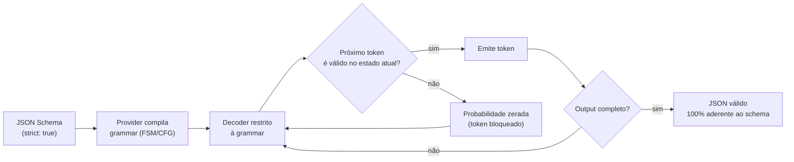

# 04 - OpenAI Structured Outputs — strict mode

> [!abstract] TL;DR
> OpenAI oferece duas formas de structured output: via `response_format: { type: "json_schema", strict: true }` (mais simples, recomendada pra output único) e via `tools` + `tool_choice` forçado (necessária quando você já tem pipeline de tools). Em strict mode, a aderência ao schema é **garantida pelo provider** — o decoder é restringido pra só emitir tokens válidos. Custo: subset de JSON Schema (sem `additionalProperties: true`, todos campos `required`), pequena latência adicional. Compatível com gpt-4o-2024-08-06+, gpt-4.1 e família gpt-5. SDK Python tem helper `parse()` que integra direto com Pydantic.

> [!question]- O que eu preciso saber antes de ler isso?
> Você entende JSON Schema básico (nota 02) e o conceito de tool use como mecanismo de structured output (nota 03). Esta nota é específica da OpenAI: ela tem uma API dedicada de structured output que simplifica o pattern de tool-fake em alguns casos. Se você usa Claude ou Gemini, pode pular esta nota e ir direto para a 05 ou 06, mas o conceito de constrained decoding que aparece aqui se aplica a todos os providers modernos.

## O mecanismo — strict mode

Strict mode da OpenAI usa **constrained decoding**: o provider monta uma grammar a partir do JSON Schema e força o decoder a emitir só tokens que mantenham o output válido. Resultado: 100% de aderência ao shape (não a semântica), garantido por arquitetura, não por probabilidade.

A penalidade é pequena (~50-150ms na primeira chamada com schema novo, cacheado depois) e a categoria de erro "JSON inválido" desaparece.

O fluxo, do schema até o token emitido, é sempre o mesmo — o schema nunca "sugere" o formato, ele **restringe fisicamente** quais tokens o decoder pode escolher em cada passo:



A grammar funciona como uma máscara sobre a distribuição de probabilidade do modelo: em cada passo, tokens que quebrariam o schema (ex: fechar um objeto sem todos os campos `required`, ou abrir uma string onde o schema espera um número) simplesmente saem da lista de candidatos — o modelo nunca chega a "escolher errado" porque a opção errada não existe no espaço de decisão daquele passo.

### Forma 1 — `response_format` direto

A forma mais simples, recomendada quando você só quer output estruturado:

```python
from openai import OpenAI

client = OpenAI()

response = client.chat.completions.create(
    model="gpt-4o-2024-08-06",
    messages=[
        {"role": "system", "content": "Você é um analista. Responda em estrutura."},
        {"role": "user", "content": "Devo migrar de Postgres pra Mongo no projeto X?"}
    ],
    response_format={
        "type": "json_schema",
        "json_schema": {
            "name": "analysis",
            "strict": True,
            "schema": {
                "type": "object",
                "properties": {
                    "answer": { "type": "string" },
                    "confidence": {
                        "type": "string",
                        "enum": ["low", "medium", "high"]
                    },
                    "assumptions": {
                        "type": "array",
                        "items": { "type": "string" }
                    },
                    "risks": {
                        "type": "array",
                        "items": { "type": "string" }
                    },
                    "next_steps": {
                        "type": "array",
                        "items": { "type": "string" }
                    }
                },
                "required": ["answer", "confidence", "assumptions", "risks", "next_steps"],
                "additionalProperties": False
            }
        }
    }
)

import json
output = json.loads(response.choices[0].message.content)
```

O `content` já é JSON válido. Ainda precisa parsear com `json.loads`, mas sem try/except defensivo — strict mode garante.

### Forma 2 — helper `parse()` com Pydantic

Mais ergonômico — define o schema como Pydantic model e o SDK cuida do resto:

```python
from openai import OpenAI
from pydantic import BaseModel
from typing import Literal

class Analysis(BaseModel):
    answer: str
    confidence: Literal["low", "medium", "high"]
    assumptions: list[str]
    risks: list[str]
    next_steps: list[str]

client = OpenAI()

completion = client.chat.completions.parse(
    model="gpt-4o-2024-08-06",
    messages=[
        {"role": "system", "content": "Você é um analista. Responda em estrutura."},
        {"role": "user", "content": "Devo migrar de Postgres pra Mongo?"}
    ],
    response_format=Analysis,
)

analysis: Analysis = completion.choices[0].message.parsed
# analysis.answer, analysis.confidence, etc — tipado
```

`parse()` converte o Pydantic model em JSON Schema, manda com strict, parsea de volta pra Pydantic. Erros de schema (Pydantic não consegue converter) viram exception. É o caminho recomendado pra novos projetos Python.

### Forma 3 — `tools` + `tool_choice`

Quando o pipeline já usa tools, ou quando você quer schema na "função" mas raciocínio em texto:

```python
response = client.chat.completions.create(
    model="gpt-4o-2024-08-06",
    messages=[{"role": "user", "content": pergunta}],
    tools=[{
        "type": "function",
        "function": {
            "name": "record_analysis",
            "strict": True,
            "parameters": {
                "type": "object",
                "properties": { ... },
                "required": [...],
                "additionalProperties": False
            }
        }
    }],
    tool_choice={"type": "function", "function": {"name": "record_analysis"}}
)

import json
args = json.loads(response.choices[0].message.tool_calls[0].function.arguments)
```

O `strict: true` no schema da função garante a mesma garantia do `response_format`.

## Restrições do strict mode

Strict mode não suporta JSON Schema inteiro. Os limites importantes:

### Todos os campos em `required`

Não tem opcional. Pra simular:

```json
{
  "type": "object",
  "properties": {
    "nome": { "type": "string" },
    "apelido": { "type": ["string", "null"] }
  },
  "required": ["nome", "apelido"]
}
```

O modelo retorna `null` quando não tem valor. Sua aplicação interpreta `null` como ausente.

### `additionalProperties: false` obrigatório em todo objeto

Não dá pra deixar default. Tem que declarar explícito em cada `object` (incluindo aninhados). O erro clássico: declarar no objeto raiz e esquecer nos aninhados — a API rejeita a requisição inteira antes de gerar qualquer token.

```python
# ❌ additionalProperties: false só no objeto raiz — falta no objeto aninhado "endereco"
response = client.chat.completions.create(
    model="gpt-4o-2024-08-06",
    messages=[{"role": "user", "content": "Extraia o endereço do texto"}],
    response_format={
        "type": "json_schema",
        "json_schema": {
            "name": "pessoa",
            "strict": True,
            "schema": {
                "type": "object",
                "properties": {
                    "nome": { "type": "string" },
                    "endereco": {
                        "type": "object",
                        "properties": {
                            "rua": { "type": "string" },
                            "cidade": { "type": "string" }
                        },
                        "required": ["rua", "cidade"]
                        # falta "additionalProperties": False aqui
                    }
                },
                "required": ["nome", "endereco"],
                "additionalProperties": False
            }
        }
    }
)
```

```text
openai.BadRequestError: Error code: 400 - {'error': {'message':
  "Invalid schema for response_format 'pessoa': In context=('properties',
  'endereco'), 'additionalProperties' is required to be supplied and to
  be false", 'type': 'invalid_request_error', 'param': 'response_format',
  'code': None}}
```

Repare que o erro cita o caminho exato (`'endereco'`) — mas só aparece se você ler a mensagem completa; muitos clientes truncam o `message` no log e mostram só "Invalid schema", escondendo qual objeto aninhado está faltando. `additionalProperties: false` não herda do pai pro filho: cada `"type": "object"` no schema é validado isoladamente, então schemas com vários níveis de aninhamento (endereços dentro de pessoas dentro de listas, por exemplo) precisam da declaração repetida em cada nível.

### Subset de tipos suportados

`string`, `number`, `integer`, `boolean`, `array`, `object`, `null`, e união simples (`["string", "null"]`). Sem:

- `pattern` em strings (regex)
- `format` strings exóticos (`date`, `email`, `uri` — alguns suportados, verifique doc)
- `minLength`/`maxLength`/`minimum`/`maximum` — não enforced no decoder (ignorados)
- `minItems`/`maxItems` em arrays — idem
- `oneOf`/`anyOf` com restrições complexas

Pra essas validações, valide você mesmo depois (ver [nota 07](07%20-%20Validação%20e%20retry%20—%20Pydantic,%20Zod.md)).

### Limites de tamanho

- Max 100 propriedades totais no schema (somando objetos aninhados).
- Max 5 níveis de aninhamento.
- Max 500 enum values (somando todos os enums).
- Max 15000 caracteres em string descritivas totais.

Schemas grandes precisam ser simplificados — ou divididos em chamadas separadas.

### `$ref` interno suportado, externo não

```json
{
  "$defs": { "Address": { "type": "object", ... } },
  "type": "object",
  "properties": { "billing": { "$ref": "#/$defs/Address" } }
}
```

Funciona. `$ref` apontando pra URL externa não.

## Modelos compatíveis (2026)

Strict mode da OpenAI funciona em:

- `gpt-4o-2024-08-06` e posteriores (incluindo `gpt-4o-mini`)
- Família `gpt-4.1` (todos)
- Família `gpt-5` (todos, incluindo `gpt-5-mini` e reasoning models como `gpt-5-thinking`)
- `o1`, `o3`, `o4` (reasoning models — strict funciona após `o1-2024-12-17`)

Não funciona em modelos legados (gpt-4-turbo, gpt-3.5-turbo) — usar `response_format: { type: "json_object" }` (JSON mode antigo, sem schema). Em produção em 2026, nenhum motivo pra ficar nesses.

Reasoning models (`o`-series, `gpt-5-thinking`) suportam strict mode plenamente desde 2025, mas custam mais tokens — strict não reduz tokens de reasoning, só formata o output final.

## Quando usar `response_format` vs `tools`

| Caso | Preferência |
|---|---|
| Único output estruturado, sem tools no pipeline | `response_format` |
| Pipeline com tools reais + output estruturado final | `tools` (pattern A da nota 03) |
| Quer raciocínio em texto + structured separado | Duas chamadas, ou `tools` com prompt explícito |
| Schema com uniões complexas | `tools` (mais flexível) |
| Multi-provider abstration | `tools` (denominador comum) |

## Boas práticas

### Inclua `description` nos campos

Strict não enforça descrições, mas o modelo usa pra preenchimento. Tudo o que você quer que ele "considere" coloque em `description`.

### Schema versionado

Trate `schema` como contrato versionado. Mude com cuidado, teste com golden set ([[03-Dominios/Tecnologia/IA/Anatomia dos LLMs/19 - Evaluation de LLMs em produção|nota de evaluation]]) antes de promover.

### Cache de schema

Schemas grandes têm overhead na primeira chamada (gramática é montada). OpenAI cacheia automaticamente por algumas horas; aproveite mantendo schema estável.

### Use `parse()` no Python

A ergonomia compensa. Em produção Python, Pydantic + `parse()` é o caminho default.

### Não confunda strict com semantic

Strict garante shape. Semântica (valores fazem sentido?) é outra camada. Ver [nota 07](07%20-%20Validação%20e%20retry%20—%20Pydantic,%20Zod.md).

## Armadilhas comuns

> [!warning] Esquecer `"additionalProperties": false` nos objetos aninhados
> Em strict mode, `additionalProperties: false` é obrigatório — mas a exigência se aplica a **todo objeto no schema**, incluindo aninhados. Um schema com objeto de alto nível correto mas sub-objeto sem `additionalProperties: false` gera um erro de schema que pode ser silencioso (o SDK rejeita mas a mensagem de erro não indica onde). Regra prática: ao escrever o schema, passe em cada `"type": "object"` e verifique que tem `"additionalProperties": false`. Com Pydantic, o SDK cuida disso automaticamente — mais um motivo para usar `parse()`.

> [!warning] Tentar usar validações que strict mode ignora
> O subset de strict mode parece completo até você precisar de `minLength` em uma string ou `minItems` em um array — e descobrir que strict mode aceita o schema mas não enforça essas restrições no decoder. O output vai com o shape certo mas pode ter string vazia ou array vazio que o schema "proibiu". Quem não sabe disso age como se o schema garantisse todo o contrato, passa dados inválidos downstream, e o erro aparece longe da origem. Tudo que não é `type`/`enum`/`required`/`additionalProperties`/`$ref` precisa de validação manual pós-schema.

> [!warning] Confundir `json_object` mode com structured outputs
> A OpenAI tem dois modos distintos: `response_format: {"type": "json_object"}` (JSON mode antigo, garante JSON válido mas sem schema) e `response_format: {"type": "json_schema", ...}` com strict (garante shape). O JSON mode antigo é útil para modelos legados que não suportam strict, mas não é o mesmo mecanismo. Em código legado, você pode encontrar JSON mode e assumir que tem garantia de schema — não tem. Se o schema importa, verifique que `"type": "json_schema"` e `"strict": true` estão configurados, não apenas `"type": "json_object"`.

## Como explicar em inglês

Em entrevistas na FAANG e empresas tech, perguntas sobre OpenAI structured outputs aparecem em contexto de "como você garante confiabilidade de output em produção":

> "OpenAI strict mode uses constrained decoding — the provider builds a grammar from the JSON Schema and restricts the decoder to only emit tokens that keep the output valid. This gives 100% schema adherence by architecture, not by probability. The trade-off is a restricted subset of JSON Schema: all fields must be required, every object needs `additionalProperties: false`, and constraints like `minLength` or `minItems` are accepted in the schema but not enforced at decode time. For Python, the `parse()` method with Pydantic handles schema generation, strict mode setup, and deserialization in one call."

| Português | Inglês |
|-----------|--------|
| decodificação restrita | constrained decoding |
| modo strict | strict mode |
| formato de resposta | response format |
| schema de resposta | response schema |
| helper de parse | parse helper |
| campo obrigatório em strict | required field (all fields required in strict) |
| subset de JSON Schema | JSON Schema subset |
| modelo compatível | compatible model |
| garantia por arquitetura | architectural guarantee |
| modo JSON antigo | JSON object mode (legacy) |

## O que vem a seguir

Strict mode resolve structured output na OpenAI. O próximo provider é o Anthropic — que não tem API dedicada equivalente, o que significa que tool use forçado é o único mecanismo oficial. A nota 05 cobre como implementar isso com Claude, incluindo os detalhes de `tool_choice` e como o provider lida com validação.

Ver [[05 - Anthropic tool use para forçar formato]].

## Fontes

- **OpenAI** — *Structured Outputs guide* ([platform.openai.com/docs/guides/structured-outputs](https://platform.openai.com/docs/guides/structured-outputs)). Documentação oficial completa, com limites e exemplos atualizados.
- **OpenAI** — *Introducing Structured Outputs in the API* ([blog, ago 2024](https://openai.com/index/introducing-structured-outputs-in-the-api/)). Anúncio original com mecanismo de constrained decoding.
- **Pydantic + OpenAI integration** — [Pydantic AI docs](https://ai.pydantic.dev/).

## Veja também

- [[02 - JSON Schema como contrato]] — a linguagem usada no `schema` do strict
- [[03 - Function calling como mecanismo de output]] — quando `tools` é a forma certa
- [[05 - Anthropic tool use para forçar formato]] — como Anthropic resolve (sem API equivalente)
- [[06 - Gemini structured output]] — alternativa do Google
- [[07 - Validação e retry — Pydantic, Zod]] — semântica em cima do shape garantido
