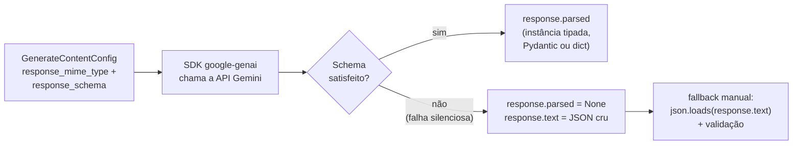

# 06 - Gemini structured output

> [!abstract] TL;DR
> Gemini oferece structured output via dois parâmetros: `response_mime_type: "application/json"` + `response_schema`. O schema usa um **subset de OpenAPI 3.0** (não JSON Schema puro como OpenAI e Anthropic) — diferenças importantes em `enum`, `format`, e união de tipos. Compatível com Gemini 1.5+ (Pro e Flash) e Gemini 2.x (todos). Aderência é alta mas o subset é menor que o de OpenAI strict — schemas com nested deep ou union complexa podem falhar silenciosamente. SDK Python (`google-genai`) tem helper que aceita Pydantic model diretamente. Tool use também funciona como mecanismo alternativo (ver [nota 03](03%20-%20Function%20calling%20como%20mecanismo%20de%20output.md)) com mais flexibilidade.

> [!question]- O que eu preciso saber antes de ler isso?
> Esta nota assume que você sabe o que é JSON Schema (nota 02) e conhece o conceito de structured output enforcement (notas 03-05). O ponto diferenciador do Gemini: ele usa um subset de OpenAPI 3.0 em vez de JSON Schema puro, com tipos em caixa alta e sem `additionalProperties`. Se você viu as notas da OpenAI e Anthropic, o que muda aqui são os detalhes de formato — o padrão conceitual é o mesmo.

Você vem da OpenAI e quer trocar de provider. O schema que funcionava lá — `"type": "object"`, `"type": "string"`, tudo em caixa baixa como o JSON Schema manda — você copia e cola no Gemini. O SDK não reclama, a chamada retorna 200, mas `response.parsed` vem `None` e o output real (em `response.text`) tem um shape torto, sem os campos que você esperava. Nenhuma exceção, nenhum erro claro — só um resultado errado que passa despercebido se você não checar explicitamente. Por quê? Porque o Gemini não fala JSON Schema. Ele fala um subset de OpenAPI 3.0, e nesse dialeto os tipos são `"OBJECT"`, `"STRING"`, `"ARRAY"` — caixa alta. É a primeira armadilha de quem migra de provider, e a explicação de por que existe vem da origem do schema: enquanto OpenAI e Anthropic adotaram JSON Schema (o padrão usado por ferramentas de validação web), o Gemini herdou o formato de definição de parâmetros que o Google já usava internamente para APIs REST — o mesmo vocabulário do Swagger/OpenAPI.

## O mecanismo

Gemini separa dois parâmetros:

1. **`response_mime_type`** — força o tipo de resposta. Pra JSON estruturado, `"application/json"`. (Também aceita `"text/x.enum"` pra responder apenas com um valor de enum, útil em classificação.)
2. **`response_schema`** — o schema OpenAPI que define a forma.

Sem `response_schema`, com só `response_mime_type: "application/json"`, o modelo tenta retornar JSON livre — sem garantia de shape. Sempre combine os dois.

O fluxo completo, do lado do cliente até o dado tipado na mão:



O ramo da direita é o que costuma passar despercebido: não há exceção, só um `None` — por isso checar `response.parsed is None` antes de usar o resultado é obrigatório, não defensivo demais.

## Exemplo Python — `google-genai` SDK

```python
from google import genai
from google.genai import types

client = genai.Client(api_key="...")

response_schema = {
    "type": "OBJECT",
    "properties": {
        "answer": { "type": "STRING" },
        "confidence": {
            "type": "STRING",
            "enum": ["low", "medium", "high"]
        },
        "assumptions": {
            "type": "ARRAY",
            "items": { "type": "STRING" }
        },
        "risks": {
            "type": "ARRAY",
            "items": { "type": "STRING" }
        },
        "next_steps": {
            "type": "ARRAY",
            "items": { "type": "STRING" }
        }
    },
    "required": ["answer", "confidence", "assumptions", "risks", "next_steps"],
    "propertyOrdering": ["answer", "confidence", "assumptions", "risks", "next_steps"]
}

response = client.models.generate_content(
    model="gemini-2.0-flash",
    contents="Devo migrar de Postgres pra Mongo?",
    config=types.GenerateContentConfig(
        response_mime_type="application/json",
        response_schema=response_schema,
    )
)

import json
output = json.loads(response.text)
```

Observações:

- Tipos em **CAIXA ALTA** (`"OBJECT"`, `"STRING"`, `"ARRAY"`, `"NUMBER"`, `"INTEGER"`, `"BOOLEAN"`) — diferente de JSON Schema clássico. Isso é OpenAPI style.
- `propertyOrdering` (opcional, mas recomendado) — define a ordem em que o modelo emite os campos. Sem ele, ordem é arbitrária. Importante quando você quer que campos como `confidence` sejam emitidos antes de `answer` pra "ancorar" o raciocínio.

## Exemplo Python com Pydantic

O SDK aceita Pydantic model direto — caminho mais ergonômico:

```python
from google import genai
from google.genai import types
from pydantic import BaseModel
from typing import Literal

class Analysis(BaseModel):
    answer: str
    confidence: Literal["low", "medium", "high"]
    assumptions: list[str]
    risks: list[str]
    next_steps: list[str]

client = genai.Client(api_key="...")

response = client.models.generate_content(
    model="gemini-2.0-flash",
    contents="Devo migrar de Postgres pra Mongo?",
    config=types.GenerateContentConfig(
        response_mime_type="application/json",
        response_schema=Analysis,
    )
)

# SDK parseia automaticamente
analysis: Analysis = response.parsed
# analysis.answer, analysis.confidence, etc — tipado
```

`response.parsed` retorna instância do Pydantic model já validada. Em caso de schema inválido (raro), `response.parsed` é `None` e `response.text` tem o JSON cru pra debug.

### Anatomia de uma falha — schema com tipos em caixa baixa

Este é o schema literal com que muita migração de OpenAI tropeça — copiado direto do padrão JSON Schema, com tipos em minúsculo:

```python
# ❌ FALHA — tipos em caixa baixa, copiados de um schema OpenAI/JSON Schema
response_schema_quebrado = {
    "type": "object",          # deveria ser "OBJECT"
    "properties": {
        "answer": { "type": "string" },      # deveria ser "STRING"
        "confidence": { "type": "string" }
    },
    "required": ["answer", "confidence"]
}

response = client.models.generate_content(
    model="gemini-2.0-flash",
    contents="Devo migrar de Postgres pra Mongo?",
    config=types.GenerateContentConfig(
        response_mime_type="application/json",
        response_schema=response_schema_quebrado,
    )
)

print(response.parsed)  # None — falha silenciosa, sem exceção
print(response.text)    # JSON cru, shape possivelmente incorreto ou incompleto
```

A correção é trocar cada `type` para caixa alta — ou, melhor ainda, delegar a conversão pro SDK usando um Pydantic model, que nunca erra a caixa:

```python
# ✅ CORRIGIDO — tipos em caixa alta (estilo OpenAPI, exigido pelo Gemini)
response_schema_correto = {
    "type": "OBJECT",
    "properties": {
        "answer": { "type": "STRING" },
        "confidence": { "type": "STRING" }
    },
    "required": ["answer", "confidence"]
}

response = client.models.generate_content(
    model="gemini-2.0-flash",
    contents="Devo migrar de Postgres pra Mongo?",
    config=types.GenerateContentConfig(
        response_mime_type="application/json",
        response_schema=response_schema_correto,
    )
)

print(response.parsed)  # dict/objeto com o shape esperado
```

## Exemplo Python — enum mode (classificação)

Pra classificação pura — output é um único valor de enum — Gemini tem `response_mime_type: "text/x.enum"`:

```python
class Priority(str, Enum):
    LOW = "low"
    MEDIUM = "medium"
    HIGH = "high"
    URGENT = "urgent"

response = client.models.generate_content(
    model="gemini-2.0-flash",
    contents="Classifique a prioridade desse ticket: 'Servidor caiu, clientes não acessam'",
    config=types.GenerateContentConfig(
        response_mime_type="text/x.enum",
        response_schema=Priority,
    )
)

priority = response.text  # "urgent"
```

Output é a string pura, sem JSON wrapping. Útil pra classificadores de alta vazão.

## O subset OpenAPI — diferenças vs JSON Schema

Gemini não aceita JSON Schema puro. O schema segue OpenAPI 3.0, com diferenças importantes:

### Tipos em caixa alta

`"OBJECT"`, `"STRING"`, `"ARRAY"`, `"NUMBER"`, `"INTEGER"`, `"BOOLEAN"`. Não funciona `"object"` minúsculo (que JSON Schema usa).

### `format` mais limitado

Suporta `"date-time"`, `"date"`, `"enum"`. Não suporta `"email"`, `"uri"`, `"uuid"` como format strings.

### `enum` só em string

`enum` em outros tipos não é confiavelmente enforced. Use `string` + enum.

### Sem `additionalProperties`

Gemini não enforça `additionalProperties: false`. Pra travar alucinação de chaves, você precisa validar depois.

### `$ref` limitado

Suporte parcial — refs internos simples funcionam, refs aninhados em arrays podem falhar. Schemas complexos: melhor inline.

### Sem `oneOf`/`anyOf` complexo

Uniões discriminadas não são bem suportadas. Pra polimorfismo, considere modelar como objeto com campo `type` + campos opcionais.

### `nullable: true`

Pra simular tipo opcional/nullable:

```json
{
  "type": "STRING",
  "nullable": true
}
```

Diferente do JSON Schema (`"type": ["string", "null"]`).

### `propertyOrdering`

Específico do Gemini — não existe em OpenAPI puro. Define a ordem de emissão dos campos. Recomendado em todo schema importante porque modelos LLM se beneficiam de ordem coerente (campo "raciocínio" antes do campo "resposta", por exemplo).

## Modelos compatíveis (2026)

Structured output via `response_schema` funciona em:

- **Gemini 1.5 Pro** e **Gemini 1.5 Flash** — suporte estável.
- **Gemini 2.0 Flash**, **Gemini 2.0 Pro** — suporte completo, melhor aderência.
- **Gemini 2.5** (linha mais recente em 2026) — suporte com features adicionais (incluindo `propertyOrdering` mais robusto).

Não funciona em Gemini 1.0 (legado, descontinuado em produção).

Em modelos Flash (menores), schemas muito grandes degradam aderência mais rápido que em Pro — teste antes de assumir paridade.

## Alternativa: tool use (function calling)

Gemini também suporta function calling. Pra structured output via tool:

```python
analysis_function = types.FunctionDeclaration(
    name="record_analysis",
    description="Registra análise estruturada.",
    parameters=response_schema  # mesmo schema
)

tool = types.Tool(function_declarations=[analysis_function])

response = client.models.generate_content(
    model="gemini-2.0-flash",
    contents="Devo migrar?",
    config=types.GenerateContentConfig(
        tools=[tool],
        tool_config=types.ToolConfig(
            function_calling_config=types.FunctionCallingConfig(
                mode="ANY",
                allowed_function_names=["record_analysis"]
            )
        )
    )
)

# Extrai
fc = response.candidates[0].content.parts[0].function_call
args = dict(fc.args)
```

Quando usar tool em vez de `response_schema`:

- Schema usa features que o subset OpenAPI não suporta (uniões, refs complexos).
- Pipeline já tem outras tools.
- Quer raciocínio em texto + structured separado.

## Limitações conhecidas (2026)

- **Aderência levemente abaixo do strict mode da OpenAI** em schemas grandes. Validar é obrigatório.
- **Subset OpenAPI menor que JSON Schema da Anthropic.** Schemas com union, pattern, format custom: forneça por tool ou simplifique.
- **`propertyOrdering` ainda não suportado uniformemente em todos os modelos.** Confira na doc do modelo específico.
- **Erro de schema vira `None` em `response.parsed`** — silencioso. Cheque `response.text` em caso de None.

## Boas práticas

### `description` em cada campo

Como em outros providers, descrições ajudam o modelo. Coloque sempre.

### `propertyOrdering` explícito

Quando suportado, define ordem do output. Coloca campos de raciocínio/contexto antes do output principal — efeito ancoragem similar a chain-of-thought.

### Use Pydantic via SDK

A integração com `google-genai` + Pydantic é a forma ergonômica. Em produção Python, é o caminho default.

### Teste com modelo target

Aderência varia entre Flash e Pro, e entre versões. Teste sempre no modelo que vai rodar em produção, não no maior disponível.

### Combine com validação semântica

Como em todo provider, shape garantido (com ressalvas) ≠ semântica certa. Pydantic validators capturam isso (ver [nota 07](07%20-%20Validação%20e%20retry%20—%20Pydantic,%20Zod.md)).

### Trave campos extras com `model_config = ConfigDict(extra="forbid")`

O Gemini não tem equivalente a `additionalProperties: false` do JSON Schema — o subset OpenAPI que ele usa simplesmente não enforce isso no nível do schema. Na prática, o modelo pode devolver chaves que você não pediu, e sem barreira nenhuma elas passam batido pro seu código. A barreira, nesse caso, não vem do lado do Gemini — vem do lado do seu parser, com Pydantic:

```python
from pydantic import BaseModel, ConfigDict
from typing import Literal

class Analysis(BaseModel):
    model_config = ConfigDict(extra="forbid")  # rejeita campos não declarados

    answer: str
    confidence: Literal["low", "medium", "high"]
    assumptions: list[str]
    risks: list[str]
    next_steps: list[str]

response = client.models.generate_content(
    model="gemini-2.0-flash",
    contents="Devo migrar de Postgres pra Mongo?",
    config=types.GenerateContentConfig(
        response_mime_type="application/json",
        response_schema=Analysis,
    )
)

# Se o Gemini alucinar um campo extra (ex: "extra_notes"), o parsing
# levanta ValidationError em vez de aceitar silenciosamente.
analysis: Analysis = response.parsed
```

Por padrão, o Pydantic v2 usa `extra="ignore"` — campos desconhecidos são descartados sem aviso, o que mascara o problema em vez de resolvê-lo. `extra="forbid"` transforma o silêncio em erro explícito, o comportamento certo quando o shape precisa ser rigoroso (por exemplo, quando o output alimenta um sistema downstream que espera exatamente aqueles campos). Para APIs internas onde algum ruído extra é tolerável, `extra="ignore"` (o default) já basta — mas em contratos estritos, declare `forbid` explicitamente em vez de confiar no default.

## Armadilhas comuns

> [!warning] Usar tipos em caixa baixa no schema (copiando JSON Schema)
> A armadilha mais comum ao migrar código de OpenAI ou Anthropic para Gemini é copiar o schema com tipos em caixa baixa (`"object"`, `"string"`, `"array"`). O SDK do Gemini pode aceitar o schema silenciosamente mas o enforcement falha ou o output vem com shape incorreto. Sempre use `"OBJECT"`, `"STRING"`, `"ARRAY"` etc. em schemas Gemini. Se você usa Pydantic com `response_schema=MyModel`, o SDK converte automaticamente — isso evita o problema inteiro.

> [!warning] Assumir que `response_schema` exclui campos extras
> Diferente do OpenAI strict mode, Gemini não tem equivalente a `additionalProperties: false`. O modelo pode adicionar campos não declarados e o schema não bloqueia. Validação pós-schema é obrigatória no Gemini, não opcional. Usando Pydantic com `response.parsed`, o Pydantic rejeita campos extras por default (se `model_config = ConfigDict(extra="forbid")`). Adicione essa configuração nos models que precisam de shape rigoroso.

> [!warning] Ignorar `response.parsed == None` como sinal de erro
> Quando o Gemini não consegue satisfazer o schema (falha de validação interna ou schema com feature não suportada), `response.parsed` retorna `None` sem levantar exceção. É uma falha silenciosa — seu código acessa `response.parsed.answer` e recebe `AttributeError: 'NoneType' object has no attribute 'answer'`. Sempre cheque `if response.parsed is None: # tratar erro` antes de usar. Em caso de None, `response.text` pode ter o JSON cru para diagnóstico.

## Como explicar em inglês

Perguntas sobre Gemini structured output aparecem em contextos de multi-provider ou migração de OpenAI para Google Cloud:

> "Gemini structured output uses `response_mime_type` plus `response_schema` — the schema follows an OpenAPI 3.0 subset, not pure JSON Schema. The key differences: types are uppercase (`STRING`, `OBJECT`), there's no `additionalProperties` enforcement, and complex unions are limited. The Python SDK integrates with Pydantic directly via `response_schema=MyModel`, making it ergonomic for well-typed outputs. The failure mode to watch for is `response.parsed` returning None silently when schema constraints can't be satisfied — always guard before accessing fields."

| Português | Inglês |
|-----------|--------|
| tipo MIME de resposta | response MIME type |
| schema de resposta | response schema |
| subset OpenAPI 3.0 | OpenAPI 3.0 subset |
| tipos em caixa alta | uppercase types |
| ordenação de propriedades | property ordering |
| modo de enumeração | enum mode |
| nullable (Gemini) | nullable field |
| declaração de função | function declaration |
| config de chamada de função | function calling config |
| modelo Flash vs Pro | Flash model vs Pro model |

## O que vem a seguir

Com os três providers cobertos (OpenAI strict mode, Anthropic tool use, Gemini response_schema), a próxima nota volta ao meta-nível: o que fazer quando o shape está garantido mas os valores estão errados. Validação semântica com Pydantic (Python) e Zod (TypeScript) — como escrever validators que vão além do tipo e checam regras de negócio.

Ver [[07 - Validação e retry — Pydantic, Zod]].

## Fontes

- **Google** — *Generate structured output with the Gemini API* ([ai.google.dev/gemini-api/docs/structured-output](https://ai.google.dev/gemini-api/docs/structured-output)).
- **Google** — *Function calling with Gemini* ([ai.google.dev/gemini-api/docs/function-calling](https://ai.google.dev/gemini-api/docs/function-calling)).
- **google-genai SDK** — [GitHub: googleapis/python-genai](https://github.com/googleapis/python-genai).

## Veja também

- [[02 - JSON Schema como contrato]] — diferenças vs OpenAPI 3.0
- [[03 - Function calling como mecanismo de output]] — alternativa via tool em Gemini
- [[04 - OpenAI Structured Outputs — strict mode]] — comparação direta
- [[05 - Anthropic tool use para forçar formato]] — terceira abordagem
- [[07 - Validação e retry — Pydantic, Zod]] — necessária pelo subset limitado de Gemini
- [[Anatomia dos LLMs/11 - APIs de LLM — anatomia de uma chamada|APIs de LLM — anatomia de uma chamada]] — onde `response_mime_type` e `response_schema` se encaixam na chamada completa
