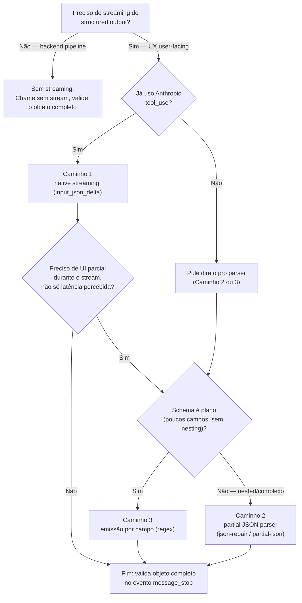

# 08 - Streaming de structured outputs

> [!abstract] TL;DR
> Streaming clássico de texto funciona bem porque cada chunk é um pedaço válido por si só. Streaming de JSON estruturado tem o problema: um pedaço de JSON no meio (`{"answer": "Sim, mas`) não é parseável. Três caminhos resolvem: (1) streaming nativo de `tool_use` blocks da Anthropic, com `input_json_delta` parcial; (2) parsers de JSON parcial (`json-repair` em Python, `partial-json` em TS) que aceitam JSON incompleto e fecham o que falta; (3) emitir só campos completos pra UI, mantendo o JSON acumulando em buffer. Útil pra UX em chat e canvas longos; quase sempre dispensável em backend pipelines. Validação semântica acontece só no final.

> [!question]- O que eu preciso saber antes de ler isso?
> Você entende o problema básico de structured output (nota 01) e como providers garantem schema (notas 03-06). Streaming de texto em LLMs — onde a resposta chega token a token — é um conceito que você provavelmente já conhece. Esta nota trata da intersecção: quando você combina output estruturado com streaming, você perde a capacidade de parsear JSON no meio do caminho. A nota apresenta três padrões que resolvem isso. O contexto principal é UX em aplicações com usuário — em backend pipelines, streaming de structured output raramente vale a complexidade.

## Por que streaming de JSON é diferente

Streaming de texto:

```
Olá!
Olá! Vou
Olá! Vou te ajudar com
Olá! Vou te ajudar com essa pergunta.
```

Cada estado intermediário é texto válido. Você renderiza incrementalmente. Sem problema.

Streaming de JSON:

```
{
{"answer":
{"answer": "Sim
{"answer": "Sim, considerando
{"answer": "Sim, considerando o cenário", "confidence":
{"answer": "Sim, considerando o cenário", "confidence": "high", "assumptions":
...
{"answer": "Sim, considerando o cenário", "confidence": "high", "assumptions": ["X"], "risks": [], "next_steps": []}
```

Nenhum estado intermediário é JSON válido. Você não pode fazer `JSON.parse(chunk)` em ponto algum exceto no fim. UI que quer mostrar progresso precisa de outra estratégia.

E mais: providers diferentes streamam de formas diferentes. OpenAI streama tokens; Anthropic streama eventos tipados (`input_json_delta` por bloco).

## Caminho 1 — Anthropic native streaming de tool_use

Anthropic streama tool use em deltas tipados. Você recebe eventos `content_block_delta` com `input_json_delta` por bloco de tool:

```python
from anthropic import Anthropic

client = Anthropic()

with client.messages.stream(
    model="claude-sonnet-4-5",
    max_tokens=1024,
    tools=[analysis_tool],
    tool_choice={"type": "tool", "name": "record_analysis"},
    messages=[{"role": "user", "content": "Devo migrar?"}]
) as stream:
    buffer = ""
    for event in stream:
        if event.type == "content_block_delta":
            if event.delta.type == "input_json_delta":
                # Acumula o JSON parcial
                buffer += event.delta.partial_json
                # Tenta parsear (geralmente falha até o fim)
                # — mas pode usar partial parser aqui

    # No final, parseia o output completo
    final_message = stream.get_final_message()
    for block in final_message.content:
        if block.type == "tool_use":
            structured = block.input
```

O streaming nativo serve principalmente pra latência percebida (UI mostra "pensando..." mais cedo). Pra extrair valor real do streaming, combine com partial parser ou emissão por campo (próximas seções).

## Caminho 2 — Partial JSON parsers

Libs que aceitam JSON incompleto e devolvem o objeto "fechado" no melhor esforço:

### Python — `json-repair`

```python
from json_repair import repair_json
import json

partial = '{"answer": "Sim, considerando o cenário", "confidence": "high'

repaired = repair_json(partial)
# '{"answer": "Sim, considerando o cenário", "confidence": "high"}'

parsed = json.loads(repaired)
# {"answer": "Sim, considerando o cenário", "confidence": "high"}
```

A lib fecha strings, arrays, objetos abertos. Útil pra mostrar estado parcial na UI:

```python
import json
from json_repair import repair_json

buffer = ""
for chunk in stream:
    buffer += chunk
    try:
        partial_obj = json.loads(repair_json(buffer))
        render(partial_obj)  # atualiza UI
    except Exception:
        continue  # ignora estados que ainda não dá
```

### TypeScript — `partial-json`

```typescript
import { parse, Allow } from "partial-json";

let buffer = "";
for await (const chunk of stream) {
  buffer += chunk;
  try {
    const partial = parse(buffer, Allow.ALL);
    render(partial);
  } catch {
    // estado intermediário inválido, espera próximo chunk
  }
}
```

`partial-json` é mais permissiva — aceita strings, arrays, objetos parciais e infere o restante.

### Trade-offs de partial parsers

- **Falsos positivos.** Em certos estados, o parser "completa" errado e a UI mostra valor que depois muda. Pode confundir usuário.
- **Custo CPU.** Tentar parsear a cada chunk em alta vazão custa. Use throttling (parse a cada N chunks ou cada X ms).
- **Não enforça schema.** O resultado parcial não respeita seu Pydantic/Zod. É só "JSON-like".

## Caminho 3 — Emissão por campo

Em vez de parsear JSON parcial, identifique quando um campo termina e emita só aquele campo:

```python
import re

buffer = ""
emitted_fields = set()

for chunk in stream:
    buffer += chunk
    # Detecta campos completos via regex simples (não-robusto pra nested)
    matches = re.finditer(
        r'"(\w+)":\s*("(?:[^"\\]|\\.)*"|[\d.]+|true|false|null|\[.*?\])',
        buffer
    )
    for m in matches:
        field, value = m.group(1), m.group(2)
        if field not in emitted_fields:
            emitted_fields.add(field)
            emit_to_ui(field, json.loads(value))
```

Funciona pra schemas planos. Pra schemas nested (arrays de objetos), precisa de parser mais sofisticado.

Caminho 3 só vale a pena pra schemas planos; pra nested, combine Caminho 1 + Caminho 2.

## Qual caminho escolher

Os três caminhos não são mutuamente exclusivos — dá pra combinar. Mas pra decidir por onde começar, a pergunta certa não é "qual é melhor", é "o que eu preciso mostrar, e quão cedo". Se a resposta é "só quero que a UI pare de parecer travada", Caminho 1 sozinho já resolve. Se a resposta é "quero campos aparecendo na tela conforme chegam", você precisa de Caminho 2 ou 3 em cima do 1.



Na prática, a maioria dos times de produto acaba em Caminho 1 + Caminho 2: streaming nativo do provider pra latência percebida, e um partial parser por cima pra desenhar a UI conforme o JSON fecha. Caminho 3 (emissão por campo via regex) é a opção mais barata em CPU, mas só compensa quando o schema é raso o bastante pra regex não precisar lidar com nesting — na dúvida, comece pelo Caminho 2, que generaliza melhor.

Pattern visual em UI:

```
[━━━━━━━━━━━━━━━━━━━━] Resposta: "Sim, considerando o cenário..."
[━━━━━━━━━━━━━━━━━━━━] Confiança: high
[████░░░░░░░░░░░░░░░░] Premissas: gerando...
[░░░░░░░░░░░░░░░░░░░░] Riscos: aguardando...
```

Cada campo termina, vira "rendered final". Os que ainda não chegaram ficam em skeleton/loading.

## Quando streaming faz sentido em structured

### Faz sentido

- **Canvas / chat UI longos.** Output de várias seções, usuário fica esperando. Mostrar campos conforme chegam reduz percepção de latência.
- **Reasoning models.** Quando o modelo "pensa" antes (`o`-series, `gpt-5-thinking`, Claude Extended Thinking), streamar mostra que está progredindo — usuário não acha que travou.
- **Outputs grandes pra reportar.** Listas longas de itens, código gerado em blocos, narrativas estruturadas.

### Não faz sentido

- **Backend pipelines.** Você consome o objeto inteiro pra próximo passo. Streaming só adiciona complexidade.
- **Schemas pequenos.** Pra 5 campos curtos, o output inteiro chega em <1s. Streaming não muda percepção.
- **Validação semântica obrigatória.** Você precisa do objeto completo + Pydantic antes de fazer qualquer coisa. Stream-pra-display, parse-pra-processar.
- **Logging / auditoria.** Você quer o output final pra log. Stream parcial não vai pro log.

## Validação em streaming — o que dá e o que não dá

Validação semântica completa (Pydantic/Zod com refinements) só roda no final, com o objeto inteiro. Mas algumas verificações podem rodar no parcial:

| Validação | Funciona em parcial? |
|---|---|
| Tipo do campo (string vs number) | Parcial — mas pode mudar antes do fim |
| Enum value | Sim, se a string do enum já fechou |
| `min_length` | Não, ainda pode crescer |
| `max_length` | Sim — se excedeu, abortar |
| Regex match | Não confiável em parcial |
| Cross-field (model_validator) | Não — precisa de tudo |

Em prática: deixe validação completa pro final. No parcial, faça só sanity checks (ex: confidence emitida cedo? bloqueia se for "low" e a task era de alta confiança).

Por que essa linha divisória — "sim" pra tipo/enum/`max_length`, "não" pra `min_length`/regex/cross-field? A diferença é se a checagem pode ser **refutada por dado que ainda não chegou**. `max_length` só pode falhar (nunca "quase falhar"): se a string parcial já excedeu o limite, o resultado final também vai exceder — o veredito não muda com mais chunks, então dá pra abortar cedo e economizar tokens. `min_length`, ao contrário, está quase sempre "falhando" durante o streaming (a string ainda está crescendo), e só se resolve quando o campo fecha — testar isso no meio produz falso negativo sistemático. Regex tem o mesmo problema: um padrão como `^\d{3}-\d{4}$` rejeita `"555"` no meio do streaming mesmo que o valor final seja `"555-1234"`. E `model_validator` cross-field (ex: "se `confidence` é `high`, `assumptions` não pode ser vazio") depende de campos que talvez nem tenham chegado ainda — validar isso no parcial é validar contra dados incompletos por definição, não uma questão de sorte.

Um sanity check parcial seguro, então, é qualquer checagem **monotônica**: uma vez que passa a falhar, continua falhando até o fim (nunca "se conserta sozinha" com mais chunks). Em código:

```python
def sanity_check_partial(partial: dict) -> str | None:
    """Roda a cada N chunks. Retorna motivo de abort ou None."""
    confidence = partial.get("confidence")
    if confidence == "low" and partial.get("task_priority") == "high":
        return "confidence baixa em task de alta prioridade — aborta cedo"
    answer = partial.get("answer", "")
    if len(answer) > MAX_ANSWER_CHARS:
        return "answer excedeu max_length — aborta cedo"
    return None  # segue streamando; validação completa só no message_stop
```

Note o que essa função **não** faz: não chama `Pydantic.model_validate(partial)`. Ela testa condições pontuais, monotônicas, sobre o dict parcial — e só existe pra permitir abortar cedo em casos óbvios (evita gastar tokens streamando um output que você já sabe que vai rejeitar). A validação de verdade — schema completo, cross-field, tipos — roda uma única vez, no objeto final, depois do `message_stop`.

## Mid-stream falha — o que fazer

Quando algo dá errado no meio do stream:

- **Stream cortou** (rede, rate limit) — buffer parcial. Trate como retry com `messages` que inclui o parcial como contexto pro modelo continuar.
- **JSON ficou irrecuperável** (modelo errou e nem `jsonrepair` salva) — descarta, retry sem feedback parcial.
- **Validação semântica falhou no final** — segue o padrão da nota 07 (retry-with-feedback).
- **Excede `max_tokens` no meio** — pode ser sinal de schema muito grande pro budget. Aumenta `max_tokens` ou simplifica schema.

## Boas práticas

### Stream pra UI, completo pra lógica

UI consome stream. Lógica de negócio consome o objeto final validado. Não misture.

### Throttle a renderização

UI atualizando a cada token custa CPU e ofusca leitura. Atualize a cada 100-200ms.

### Logue o objeto final

Stream é UX. Auditoria precisa do objeto completo + status de validação. Logue só no fim.

### Modelo de fallback sem streaming

Se streaming complica demais, considere chamar sem stream e mostrar loading bonito. Em pipelines onde streaming não traz UX clara, simplifica.

### Considere `useObject` / Vercel AI SDK

Em React/Next.js, Vercel AI SDK tem `useObject` que abstrai streaming structured. Vale conhecer se está nessa stack.

## Armadilhas comuns

> [!warning] Chamar `JSON.parse(chunk)` direto no chunk, sem buffer
> A armadilha mais básica — e a primeira que todo mundo comete antes de entender por que streaming de JSON é diferente de streaming de texto (ver a primeira seção desta nota). O código parece razoável até você rodar:
>
> ```typescript
> // ❌ Ingênuo: trata cada chunk como se fosse JSON completo
> for await (const chunk of stream) {
>   const partial = JSON.parse(chunk);
>   render(partial);
> }
> ```
>
> ```text
> Uncaught SyntaxError: Unexpected end of JSON input
>     at JSON.parse (<anonymous>)
>     at processChunk (stream-handler.ts:12)
> ```
>
> O erro engana: parece que o chunk chegou corrompido, mas o problema é estrutural. Cada `chunk` é um *fragmento* do JSON final (`{"answer": "Sim`), não um documento completo — só o objeto inteiro, no fim do stream, é JSON válido. `JSON.parse` falha em praticamente todo chunk intermediário, menos o último. O conserto não é "tentar de novo": é acumular tudo num buffer e só então parsear (com o parser certo — nativo no fim, ou partial parser no meio):
>
> ```typescript
> // ✅ Acumula no buffer; usa partial parser pro estado intermediário
> let buffer = "";
> for await (const chunk of stream) {
>   buffer += chunk;
>   try {
>     const partial = parse(buffer, Allow.ALL); // partial-json, não JSON.parse
>     render(partial);
>   } catch {
>     continue; // buffer ainda não fechou um estado válido — espera o próximo chunk
>   }
> }
> ```

> [!warning] Tentar validar semanticamente no parcial
> A armadilha clássica é invocar Pydantic ou Zod no objeto parcial durante o streaming — seja por conveniência ("já que tenho o objeto, valido logo") ou por medo de chegar ao final sem validar. Validators com model_validator (cross-field) vão falhar porque campos ainda não chegaram. O objeto parcial do json-repair não respeita tipos ou enums. Resultado: exceções espúrias, resets de stream desnecessários, UX quebrada. Regra: validação semântica só no evento `message_stop` ou equivalente. No parcial, no máximo sanity checks simples (campo emitido cedo com valor obviamente errado).

> [!warning] Confundir streaming com coleta mais rápida do output completo
> Streaming mostra a UI mais cedo, mas o output completo chega no mesmo tempo. Se você acumula o buffer e só processa no final, você pagou a complexidade do streaming sem nenhum ganho. Streaming só faz sentido quando você processa ou renderiza os dados à medida que chegam — campos emitidos progressivamente na tela, progress indicator real, capacidade de abortar cedo. Se você vai aguardar o objeto completo de qualquer forma, desative streaming e simplifique.

> [!warning] Não tratar stream cortado como caso de retry
> Streaming por HTTP é suscetível a cortes de rede, timeouts do cliente, e rate limit do provider no meio da geração. Quando o stream corta sem `message_stop`, você tem um buffer parcial que pode não ser JSON válido nem com json-repair. O código ingênuo descarta o parcial e reporta erro genérico. O correto: detectar stream cortado (ausência de evento final), logar o parcial para diagnóstico, e fazer retry completo. Em alguns casos, o parcial pode ser útil como contexto pra nova chamada.

## Como explicar em inglês

Em entrevistas sobre design de aplicações com LLM, streaming structured output aparece quando o entrevistador quer ver se você entende a diferença entre streaming de texto e streaming de dados estruturados:

> "Streaming JSON is different from streaming text because intermediate JSON states aren't parseable. You can't just call `JSON.parse` on each chunk. Three patterns handle this: native streaming with typed deltas from Anthropic's `input_json_delta`; partial JSON parsers like json-repair that close incomplete JSON in a best-effort way; or field-by-field emission detection for flat schemas. In all cases, full semantic validation — Pydantic, Zod — only runs at the end. Streaming is a UX concern for user-facing applications; backend pipelines should skip it."

| Português | Inglês |
|-----------|--------|
| streaming de output estruturado | structured output streaming |
| parser de JSON parcial | partial JSON parser |
| delta de JSON de input | input JSON delta |
| buffer acumulado | accumulated buffer |
| emissão por campo | field-by-field emission |
| stream cortado | interrupted stream |
| throttle de renderização | render throttling |
| skeleton de loading | loading skeleton |
| evento de parada | stop event / message_stop |
| latência percebida | perceived latency |

## O que vem a seguir

Esta nota fecha a trilha de Structured Outputs. Os próximos galhos do domínio IA aprofundam aspectos que foram mencionados ao longo das notas 01-08: Evaluation (como medir se o pipeline está funcionando), Observability (como monitorar em produção), e Improvement Loop (como melhorar iterativamente). Todos esses galhos pressupõem que você tem output estruturado confiável — o que essas 8 notas construíram.

Próximo galho: Evaluation.

## Fontes

- **Anthropic** — *Streaming with tool use* ([docs](https://docs.anthropic.com/en/docs/build-with-claude/tool-use)). Eventos `input_json_delta` e padrão de acumulação.
- **OpenAI** — *Streaming responses* ([platform.openai.com/docs/api-reference/streaming](https://platform.openai.com/docs/api-reference/streaming)).
- **mangiucugna/json_repair** — [GitHub](https://github.com/mangiucugna/json_repair) (lib Python).
- **josdejong/jsonrepair** — [GitHub](https://github.com/josdejong/jsonrepair) (equivalente JS/TS, não confundir com o pacote Python).
- **promplate/partial-json-parser** — [GitHub](https://github.com/promplate/partial-json-parser).
- **Vercel AI SDK** — *useObject docs* ([sdk.vercel.ai](https://sdk.vercel.ai/docs/ai-sdk-ui/object-generation)).

## Veja também

- [[07 - Validação e retry — Pydantic, Zod]] — validação completa só após objeto final
- [[04 - OpenAI Structured Outputs — strict mode]] — streaming com response_format
- [[05 - Anthropic tool use para forçar formato]] — streaming nativo de tool_use
- [[03-Dominios/Tecnologia/IA/Anatomia dos LLMs/14 - Streaming, batching e latência|Anatomia dos LLMs — Streaming, batching e latência]] — fundamentos de streaming em LLMs
- [[03-Dominios/Tecnologia/IA/AI Engineering Stack/05 - Output Layer|AI Engineering Stack — Output Layer]] — onde decisão de streaming entra na arquitetura
