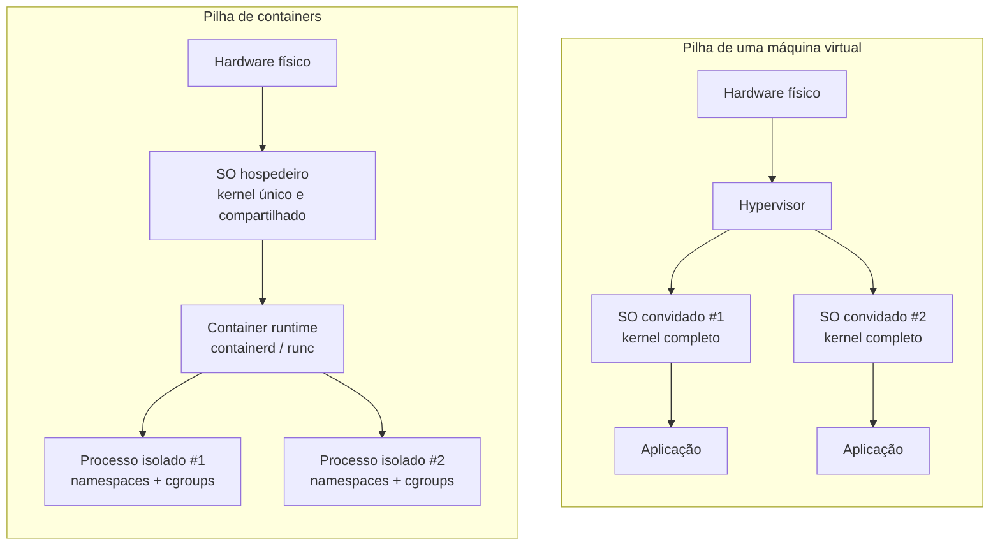
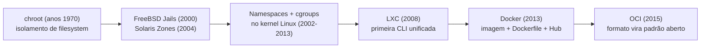
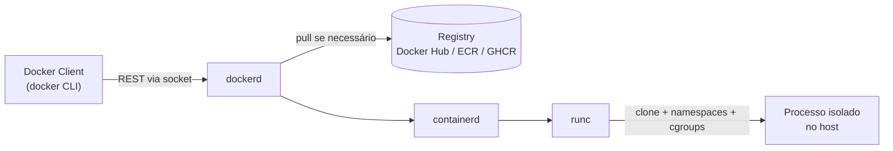
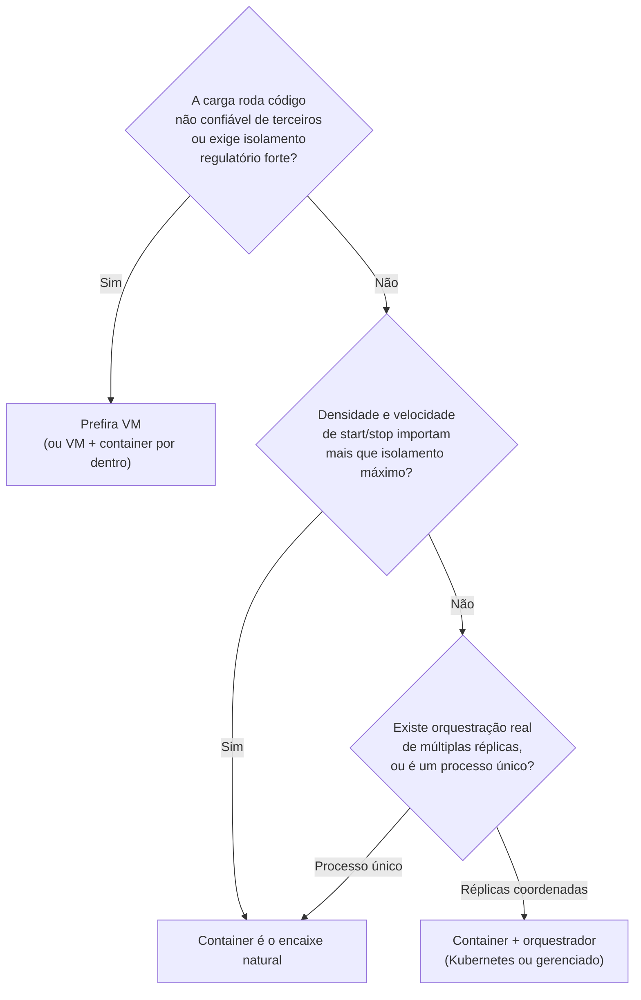

# O problema que o container resolve (e o que ele não é)

> [!abstract] TL;DR
> O isolamento de processos que o container oferece — namespaces e cgroups — já existia no kernel Linux havia mais de uma década antes do Docker existir; a pergunta certa para um sênior não é "o que é isolamento" mas "o que faltava para esse isolamento virar produto". A resposta é empacotamento: o Docker transformou um conjunto de primitivas de kernel dispersas, difíceis de compor manualmente, em um formato de artefato único, versionável e distribuível — a imagem. Esse deslocamento (de mecanismo de isolamento para formato de distribuição) é o que explica por que Docker pegou onde LXC, chroot jails e outras tentativas anteriores de empacotar processos isolados não pegaram. Entender isso evita dois erros de calibração opostos: tratar o Docker como uma VM mais leve, ou tratar o Docker como se tivesse inventado o isolamento — nenhum dos dois é verdade, e cada erro cobra um preço diferente depois.

Um time reporta que o serviço de recomendação passou seis meses rodando sem incidente em staging e caiu na primeira hora em produção com um `ClassNotFoundException` que ninguém conseguia reproduzir localmente.

A investigação encontra a causa em minutos: staging rodava OpenJDK 17.0.9, produção tinha sido provisionada há três semanas com uma imagem de VM mais nova que trazia OpenJDK 17.0.11, e uma dependência transitiva resolvia para uma versão diferente de uma lib nativa que só existia em uma das duas.

Ninguém trocou nada de propósito — o ambiente simplesmente divergiu, do jeito que ambientes provisionados manualmente sempre divergem com o tempo: um patch de segurança aplicado numa janela de manutenção, uma imagem base de VM atualizada pelo time de infraestrutura sem aviso, um pacote do sistema operacional que puxou uma versão mais nova de uma lib transitiva.

Esse é o cenário clássico do "funciona na minha máquina", mas contá-lo assim é insuficiente para quem já é sênior. Qualquer engenheiro com alguns anos de operação já sabe que ambientes divergem — a pergunta que interessa de verdade é outra: **por que essa divergência é tão mais fácil de acontecer, e tão mais cara de rastrear, do que deveria?**

A resposta não está em "faltava disciplina de ambiente" (embora ajude). Está em uma característica estrutural de como sistemas Unix tradicionalmente empacotam software.

O processo em execução e o ambiente que o cerca — bibliotecas do sistema, variáveis, arquivos de configuração, versões de runtime — são coisas diferentes, mantidas por mecanismos diferentes: gerenciador de pacotes do SO, scripts de provisionamento, convenção de equipe, memória tribal de quem configurou o servidor há dois anos. Nada garante que a combinação exata usada em dev seja a mesma que chega em produção.

O container ataca exatamente essa costura: ele torna processo e ambiente uma coisa só, embalada e versionada junto.

Não é coincidência que esse fosse também o problema que Solomon Hykes descrevia ao apresentar o Docker publicamente em 2013. A dotCloud, a empresa por trás do projeto, já operava uma plataforma que precisava rodar cargas de centenas de clientes diferentes na mesma frota, e o "funciona aqui, não funciona lá" era um problema operacional diário, não um incômodo abstrato de palestra.

Isso já revela por que o recorte certo desta nota não é "o que é um container" — resposta que qualquer busca rápida devolve — mas **o que o container resolve que o kernel Linux, sozinho, já não resolvia**.

Porque o kernel Linux, isoladamente, já sabia isolar processos havia anos antes do Docker existir. O que faltava era um jeito de empacotar esse isolamento em algo que se pudesse construir uma vez e rodar em qualquer lugar sem reconstruir o raciocínio a cada máquina.

## O que o kernel já fazia sozinho

Antes de qualquer comparação com máquina virtual, vale registrar o fato que costuma ficar de fora da conversa e que muda a régua de avaliação: **isolamento de processos não nasceu com o Docker**. O kernel Linux ganhou as primitivas que tornam isso possível em um percurso que atravessou quase quinze anos antes da fundação da dotCloud (a empresa que criaria o Docker):

- **`chroot`** — disponível desde os anos 1970 em variantes Unix, restringe a visão de um processo a uma subárvore do filesystem. É isolamento de *namespace de arquivos* rudimentar, sem isolar rede, processos ou usuários.
- **Namespaces** — introduzidos no kernel Linux a partir de 2002 (o primeiro, de mount) e expandidos ao longo da década seguinte (PID em 2008, rede, UTS, IPC, user namespace completando o conjunto por volta de 2013), dão a um processo a ilusão de que ele é o único processo, ou de que tem sua própria pilha de rede, ou seu próprio hostname — sem de fato estar sozinho na máquina.
- **cgroups (control groups)** — mescladas no kernel em 2008, limitam e contabilizam o consumo de recursos (CPU, memória, I/O) de um grupo de processos, impedindo que um processo esfomeado derrube os vizinhos.
- **LXC (Linux Containers)** — lançado em 2008, foi a primeira ferramenta a combinar namespaces e cgroups em uma interface de linha de comando coerente para rodar "containers" no sentido moderno do termo.

> [!info] Caducidade
> Datas de introdução de features de kernel Linux mudam de granularidade conforme a fonte (patch inicial vs. estabilização vs. adoção geral). Os anos acima são aproximações amplamente aceitas, úteis para calibrar "isso é anterior ou posterior ao Docker" — não trate como cronologia oficial de release notes do kernel.

Ou seja: em 2013, quando o Docker foi lançado (originalmente como um projeto interno da dotCloud, uma plataforma de PaaS), o LXC já rodava havia cinco anos sobre primitivas de kernel que já tinham, em conjunto, mais de uma década.

O Docker nas primeiras versões nem sequer implementava seu próprio runtime — usava o LXC por baixo, e só passou a ter runtime próprio (o antecessor do que hoje é `runc`) a partir de 2014.

Se o mecanismo de isolamento já existia e já tinha uma ferramenta de linha de comando havia cinco anos, **o que exatamente o Docker acrescentou que fez a adoção explodir de um jeito que o LXC nunca teve?**

A resposta é a peça central desta nota e da lente de todo o galho: o Docker não competiu no eixo do isolamento — competiu no eixo do **empacotamento**.

LXC exigia que o operador escrevesse configuração manual descrevendo quais namespaces montar, qual root filesystem usar, quais limites de cgroup aplicar — um exercício de infraestrutura, não de desenvolvimento de aplicação.

O Docker inverteu essa experiência: definiu um formato de artefato (a imagem), um jeito de construí-lo de forma reproduzível e declarativa (o Dockerfile e o cache de camadas), e um jeito de distribuí-lo com um comando só (o registry, com o Docker Hub tornando isso trivial e gratuito para imagens públicas desde o primeiro dia).

LXC dava ao operador as primitivas cruas; Docker deu ao desenvolvedor um objeto que se builda uma vez, se versiona, se envia para um registry e se roda em qualquer máquina com o daemon instalado, sem que o destinatário precise entender namespace nenhum.

Essa mudança de público-alvo — de administrador de sistemas para desenvolvedor de aplicação — é, tanto quanto a tecnologia em si, o motivo da adoção maciça: o Docker tornou o isolamento de processos algo que cabia no fluxo de trabalho de quem já escrevia código, não uma tarefa à parte de quem administrava servidores.

Esse é o salto que este galho chama de **a imagem como artefato** — e é o fio que costura as dezessete notas seguintes.

### O pivot de PaaS para produto de infraestrutura

Um detalhe de história de produto que raramente aparece fora de retrospectivas do setor, mas que ilustra bem por que o Docker chegou na hora certa: a dotCloud, empresa que criou o Docker, era originalmente uma plataforma de PaaS (Platform as a Service) que competia contra Heroku e serviços parecidos — e estava, segundo relatos da época, com dificuldades de tração nesse mercado já disputado.

O Docker nasceu como uma ferramenta interna, usada pela própria dotCloud para empacotar as cargas de clientes de forma mais eficiente que a infraestrutura anterior baseada em LXC cru. Quando Solomon Hykes o apresentou publicamente em uma conferência PyCon em 2013 como projeto open source, a reação da comunidade superou de longe qualquer tração que a plataforma de PaaS original tivesse conseguido.

A dotCloud pivotou: descontinuou o produto de PaaS, renomeou-se para Docker Inc., e passou a existir inteiramente em função da ferramenta que tinha nascido como meio, não como fim. É um lembrete de que a contribuição que se tornou padrão de indústria nem sempre é o produto que a empresa originalmente pretendia vender — às vezes é a ferramenta interna que ela construiu para resolver o próprio problema.

## VM e container: duas respostas a um problema parecido, com trade-offs opostos

Máquina virtual e container respondem à mesma pergunta de negócio — "como rodo várias cargas isoladas na mesma infraestrutura física sem que uma derrube a outra" — mas fazem isso em camadas completamente diferentes da pilha. Essa diferença de camada é o que explica todas as diferenças de custo e comportamento que seguem.

Uma VM virtualiza o **hardware**. Um hypervisor (Type 1, como VMware ESXi ou Xen, rodando direto sobre o metal; ou Type 2, como VirtualBox, rodando sobre um SO hospedeiro) apresenta a cada VM um conjunto de dispositivos virtuais — CPU, disco, placa de rede — e cada VM roda seu próprio kernel completo, do zero, por cima disso.

Um container virtualiza o **sistema operacional**: todos os containers de uma máquina compartilham o mesmo kernel do host, e o que os isola são namespaces e cgroups configurados por processo, não um hardware simulado.



A consequência prática dessa diferença de camada aparece em três eixos que qualquer sênior deveria conseguir prever sem consultar tabela, só de olhar o diagrama acima:

**Custo de memória e disco.** Cada VM carrega um kernel inteiro, suas próprias bibliotecas de sistema, seu próprio espaço de swap — algo na ordem de gigabytes de overhead antes mesmo da aplicação subir. Um container não duplica kernel nenhum: o processo isolado consome, além da própria aplicação, apenas o que os namespaces e cgroups custam para manter — tipicamente megabytes.

**Tempo de inicialização.** Subir uma VM significa fazer o hardware virtual completar um boot — POST simulado, carregamento de kernel, inicialização de serviços de sistema — processo que tipicamente leva dezenas de segundos a poucos minutos. Subir um container é, na prática, dar `fork`/`exec` em um processo já isolado por namespaces preexistentes: sem boot de SO nenhum, a ordem de grandeza cai para milissegundos a poucos segundos.

**Grau de isolamento.** Aqui o trade-off se inverte a favor da VM. Como cada VM tem seu próprio kernel, uma vulnerabilidade de kernel explorada de dentro de uma VM comprometida ainda precisa atravessar o hypervisor para afetar outras VMs — uma barreira adicional que containers, por compartilharem kernel, não têm.

Um bug de escape de container que consiga escalar do namespace para o kernel do host expõe, em princípio, todos os outros containers daquele host. Esse mecanismo de escape — e como namespaces e cgroups efetivamente contêm ou falham em conter um processo — é assunto de [[03-Dominios/Ciência/Sistemas Operacionais/13 - Virtualização e containers|Virtualização e containers]], não desta nota; aqui o que importa reter é apenas a direção do trade-off: menos isolamento estrutural em troca de muito menos custo e muito mais velocidade.

Nenhum desses três eixos é "container sempre vence" ou "VM está obsoleta" — são trade-offs, e a escolha entre eles é uma decisão de arquitetura que depende de quão hostil é o ambiente multi-tenant e de quanto overhead o negócio tolera pagar por isolamento extra.

É por isso que nuvens públicas rodam containers *dentro* de VMs (a VM isola tenants entre si no nível de infraestrutura; o container organiza processos dentro de um tenant) — as duas camadas não competem, se complementam.

A tabela abaixo aterra os três eixos em ordens de grandeza concretas — números redondos, propositalmente aproximados, para servir de âncora mental e não de benchmark oficial:

| Eixo | Máquina virtual | Container |
| --- | --- | --- |
| Overhead de memória só para existir | centenas de MB a poucos GB (kernel completo + serviços de sistema) | poucos MB a dezenas de MB (apenas o processo e seus namespaces) |
| Tempo típico de inicialização | dezenas de segundos a poucos minutos (boot completo de SO) | milissegundos a poucos segundos (fork/exec de processo já isolado) |
| Tamanho do artefato de distribuição | GBs (disco virtual com SO completo) | de poucos MB a algumas centenas de MB (camadas deduplicadas) |
| Barreira de isolamento sob exploit de kernel | hypervisor intermediando — barreira adicional | nenhuma barreira extra — kernel compartilhado é o próprio limite |
| Densidade típica por host físico | dezenas de VMs | centenas a milhares de containers |

> [!info] Caducidade
> Esses números são ordens de grandeza para calibração de intuição, não benchmarks reproduzíveis — variam enormemente conforme hypervisor, imagem base, carga de trabalho e hardware. O que não muda com o tempo é a *direção* de cada comparação: a razão estrutural (kernel duplicado vs. kernel compartilhado) é o que produz essas diferenças, e essa razão é estável mesmo que os números concretos fiquem defasados.

Vale reparar que a última linha da tabela — densidade por host — é, na prática, o argumento econômico que primeiro empurrou empresas a adotar containers em escala: se cem containers cabem onde antes cabiam dez VMs, o custo de infraestrutura por unidade de carga despenca, e essa é uma conversa que qualquer time de FinOps entende sem precisar saber o que é um namespace.

### Leveza não é gratuidade absoluta

Vale um adendo de calibração antes de seguir, porque a tabela acima é fácil de ler como "container não custa nada" — o que não é verdade, só é *muito mais barato* que VM.

O sistema de arquivos que um container enxerga não é gravado direto no disco do host; é montado através de um filesystem de união (overlay filesystem), que combina as camadas somente leitura da imagem com uma camada gravável por cima. Essa indireção tem um custo de CPU pequeno, mas não nulo, especialmente sob cargas de I/O intenso — é um dos motivos pelos quais bancos de dados de alta performance em produção às vezes usam volumes montados diretamente em vez de gravar na camada gravável do container.

A rede de um container também não é gratuita: cada container tipicamente ganha sua própria interface de rede virtual, conectada a uma bridge no host, com regras de `iptables` ou `nftables` traduzindo tráfego entre a rede do container e a rede externa. Em hosts com milhares de containers, esse volume de regras de tradução de rede é, na prática, um dos primeiros gargalos de performance que aparece — e a solução costuma vir de trocar o modelo de rede padrão por algo mais direto, um assunto que pertence à camada de operação, não a esta nota.

O ponto de calibração aqui não é memorizar esses mecanismos — é reter que "leve" é relativo à VM, não absoluto. Container ainda paga custo de indireção; só paga muito menos que os GBs de kernel duplicado e o boot completo de uma VM.

## O que muda quando se olha pelo eixo certo: mecanismo vs. formato

A tabela abaixo separa deliberadamente o que é mecanismo de kernel (existia antes, não é conquista do Docker) do que é formato de distribuição (é a contribuição real do Docker):

| Dimensão | Mecanismo (kernel Linux, pré-2013) | Formato (contribuição do Docker) |
| --- | --- | --- |
| Isolamento de processos | namespaces (PID, net, mount, UTS, IPC, user) | — |
| Limitação de recursos | cgroups | — |
| Execução isolada de baixo nível | runc / especificação OCI | — |
| Empacotamento reprodutível | — | imagem (camadas + manifesto) |
| Receita declarativa de build | — | Dockerfile |
| Distribuição versionada | — | registry (Docker Hub, ECR, GHCR, …) |
| Portabilidade "builda uma vez, roda em qualquer host" | — | imagem como artefato imutável |

Ler essa tabela horizontalmente é o que separa quem sabe operar Docker de quem sabe *prever* Docker.

Se algo se comporta de um jeito estranho relacionado a isolamento — um processo dentro do container vendo ou não vendo recursos do host, um limite de memória sendo ou não respeitado — a explicação mora na coluna da esquerda, no kernel, e a nota certa para investigar é [[03-Dominios/Ciência/Sistemas Operacionais/13 - Virtualização e containers|Virtualização e containers]].

Se algo se comporta de um jeito estranho relacionado a build, cache, tamanho de artefato ou reprodutibilidade entre ambientes, a explicação mora na coluna da direita, e é aí que este galho vive — a partir da nota 02.

Esse é o motivo de a lente do galho ser "a imagem como artefato" e não "containers são leves" ou "containers isolam processos". Leveza e isolamento são propriedades herdadas do kernel; o Docker não as inventou, apenas as tornou consumíveis.

O que o Docker de fato desenhou — e o que precisa ser entendido em profundidade para prever o resto do comportamento da ferramenta — é a forma do artefato que embala essas propriedades: imutável, composto de camadas, com um hash que garante que a imagem que rodou em CI é bit a bit a mesma que roda em produção.

## Docker não foi a primeira tentativa de isolamento leve — só a primeira que empacotou bem

Vale marcar, ainda no eixo histórico, que Linux nem sequer foi o primeiro sistema Unix a oferecer isolamento leve de processos sem virtualização completa de hardware — o que reforça, de outro ângulo, que o problema resolvido pelo Docker nunca foi "como isolar", e sim "como empacotar e distribuir o que já se sabia isolar".

**FreeBSD Jails**, lançados em 2000, já ofereciam um isolamento mais completo que o `chroot` tradicional — cada jail tinha seu próprio espaço de usuários, sua própria configuração de rede, um grau de isolamento comparável ao que namespaces Linux trariam anos depois.

**Solaris Zones** (também conhecidas como Solaris Containers), lançadas em 2004 pela Sun Microsystems, levaram a ideia ainda mais longe, com zonas que podiam ter sua própria cópia virtual completa do espaço de usuário do sistema operacional.

Nenhuma das duas se tornou o padrão de fato da indústria de containers, apesar de tecnicamente competentes e, em alguns aspectos, mais maduras que o que o Linux oferecia na época.

A razão não foi técnica: foi que nenhuma delas rodava sobre a plataforma que já dominava o mercado de servidores de aplicação web — Linux — e nenhuma delas veio acompanhada de um formato de empacotamento e um registry de distribuição comparáveis ao que o Docker construiria uma década depois.

A lição para quem está calibrando a régua de avaliação desta nota: tecnologia de isolamento superior, sozinha, não decide adoção de mercado — o empacotamento e a experiência de desenvolvedor em volta dela é que decidem, e é exatamente essa combinação que faltava até 2013.

Vale reforçar também o pano de fundo de mercado: no início dos anos 2010, Linux já era, de longe, o sistema operacional dominante em servidores web — gratuito, com uma comunidade gigantesca de desenvolvedores familiarizados com ele, e já a base de praticamente toda infraestrutura de nuvem pública emergente.

FreeBSD Jails e Solaris Zones, por mais competentes tecnicamente, pertenciam a ecossistemas de sistema operacional em posição de mercado bem menor. Uma ferramenta de empacotamento e distribuição construída sobre Linux tinha, de saída, um público-alvo ordens de grandeza maior do que a mesma ferramenta construída sobre FreeBSD ou Solaris — e esse é outro fator, ortogonal à tecnologia, que ajuda a explicar por que a combinação Linux mais Docker se tornou o padrão e não as alternativas anteriores.



## O registry como peça que faltava: distribuição, não só empacotamento

Empacotar bem um artefato não resolve nada sozinho se não existir um jeito barato de levá-lo de onde foi construído para onde vai rodar. É fácil subestimar essa parte porque hoje ela é invisível — um `docker pull` qualquer resolve em segundos.

Mas antes do Docker Hub, distribuir um ambiente configurado significava, na prática, distribuir um script de provisionamento (Chef, Puppet, Ansible, ou pior, um README com passos manuais) e torcer para que ele produzisse o mesmo resultado em duas máquinas diferentes.

O Docker Hub, lançado junto com o Docker em 2013, resolveu esse problema copiando um padrão que já tinha se provado em outro domínio: o de gerenciadores de pacotes de linguagem, como o npm para JavaScript ou o PyPI para Python.

A ideia central — um repositório central, pesquisável, onde qualquer um publica e qualquer um baixa por um nome curto — já era familiar a qualquer desenvolvedor que tivesse rodado `npm install express`. O Docker aplicou a mesma ideia a ambientes de execução inteiros: `docker pull nginx` baixa não uma biblioteca, mas um sistema de arquivos completo, pronto para rodar, com todas as dependências de sistema já resolvidas.

Essa analogia com gerenciador de pacotes é útil e ao mesmo tempo tem um limite que vale marcar: um pacote npm distribui código-fonte ou bytecode que ainda depende do runtime do host (o Node.js instalado na máquina); uma imagem Docker distribui o runtime *junto* — a imagem `node:22-alpine` já inclui o próprio Node.js dentro dela.

É essa diferença que fecha o círculo do "funciona na minha máquina": não basta distribuir o código, é preciso distribuir o ambiente inteiro em que esse código roda, e é exatamente isso que o formato de imagem garante.

## De formato proprietário a padrão aberto: a fundação da OCI

Um detalhe de governança que reforça a tese de que o valor do Docker está no formato, não no mecanismo: em 2015, dois anos depois do lançamento, a Docker Inc. — junto com outras empresas do setor, incluindo concorrentes diretos — fundou a **Open Container Initiative (OCI)** sob a Linux Foundation, e doou as especificações de formato de imagem e de runtime de container como padrões abertos e neutros de fornecedor.

Isso significa que, hoje, "imagem Docker" e "imagem OCI" são, na prática, o mesmo formato. Qualquer runtime compatível com a especificação OCI — não só o `runc` que o Docker usa, mas alternativas como `crun` ou runtimes com isolamento reforçado como `gVisor` e `Kata Containers` — consegue rodar uma imagem construída pelo `docker build`.

O `containerd`, mencionado na arquitetura desta nota, também é hoje um projeto independente da Cloud Native Computing Foundation, usado por outras ferramentas além do Docker, inclusive pelo próprio Kubernetes, via a interface CRI.

Essa independência tem uma consequência prática direta: uma imagem construída com `docker build` num laptop de desenvolvedor roda, sem modificação, dentro de um cluster Kubernetes que nunca teve o daemon `dockerd` instalado — porque o que o Kubernetes de fato consome é a imagem no formato OCI, não o Docker como produto.

A lição embutida nesse detalhe histórico é a mesma lição estrutural desta nota, só que vista pelo lado da padronização: se o Docker tivesse inventado uma técnica de isolamento proprietária, não faria sentido essa técnica virar um padrão neutro compartilhado com concorrentes.

Técnicas de isolamento de kernel já eram, e continuam sendo, do kernel Linux, de ninguém em particular. O que a OCI padronizou foi exatamente a camada que o Docker desenhou: o formato do artefato e a interface de como ele é executado.

## Um exemplo trabalhado: o que realmente acontece do `docker run` até o processo isolado

Vale seguir um `docker run nginx:1.27-alpine` passo a passo, não para decorar comandos, mas para calibrar onde cada peça do sistema entra:

1. O **Docker Client** (o binário `docker` que o usuário digita no terminal) traduz o comando em uma chamada REST contra o **Docker Daemon** (`dockerd`), tipicamente via socket Unix local (`/var/run/docker.sock`).
2. O daemon verifica se a imagem `nginx:1.27-alpine` já existe localmente. Se não existe, ele a busca em um **registry** (por padrão, o Docker Hub, mas pode ser um registry privado) — a busca é por camadas: só as camadas que ainda não estão no cache local são de fato baixadas.
3. Com a imagem disponível localmente, o daemon delega a criação do container ao **containerd**, o runtime de alto nível responsável por gerenciar o ciclo de vida (criar, iniciar, monitorar, parar).
4. O containerd, por sua vez, invoca o **runc**, o runtime de baixo nível compatível com a especificação **OCI (Open Container Initiative)**, que é quem de fato faz as chamadas de sistema — `clone()` com as flags de namespace corretas, configuração de cgroups — que produzem o processo isolado.
5. O resultado é um processo Linux comum, visível em `ps` no host, mas que enxerga apenas seu próprio filesystem, sua própria árvore de processos, e está sujeito aos limites de CPU/memória definidos.

Esse desenho cliente-servidor do passo 1, embora hoje pareça óbvio, é o que permite que o `docker` do laptop de um desenvolvedor converse com um daemon rodando em outra máquina inteiramente — basta apontar o cliente para outro socket ou host remoto.

A autenticação contra o registry no passo 2, quando necessária, acontece via `docker login`, e é ali que entra a distinção entre registry público e privado: em ambiente corporativo é comum que esse passo nunca toque o Docker Hub público. Empresas hospedam seus próprios registries — Amazon ECR, Google Artifact Registry, GitHub Container Registry, ou um Harbor auto-hospedado — justamente para manter controle sobre quais imagens circulam internamente, aplicar scanning de vulnerabilidade antes de permitir o pull, e evitar dependência de disponibilidade de um serviço público de terceiros para builds de CI/CD críticos.

O containerd do passo 3 expõe uma API que outras ferramentas além do próprio Docker também conseguem consumir — é o que permite, por exemplo, que o Kubernetes converse diretamente com containerd sem passar pelo `dockerd`.

É no passo 4, dentro do runc, que a fronteira entre "Docker" e "kernel Linux" se materializa de fato: tudo antes disso é orquestração de alto nível escrita para tornar a experiência agradável; a partir daqui, é o kernel fazendo o trabalho.

E o resultado do passo 5 roda sem que, do ponto de vista do próprio processo, exista qualquer indício de que ele está compartilhando a máquina com outras dezenas de processos igualmente isolados.



Note que em nenhum desses cinco passos existe boot de sistema operacional, hypervisor, ou disco virtual — é por isso que o tempo entre digitar o comando e o `nginx` responder na porta é medido em segundos, não em minutos.

Note também que o passo 4 — o que `runc` de fato configura no kernel — é onde este galho para e a trilha de Sistemas Operacionais assume: entender por que um `docker exec` dentro do container não vê processos do host, ou por que um container mal configurado consegue escapar do isolamento, exige entender namespaces e cgroups em detalhe, o que é o assunto de [[03-Dominios/Ciência/Sistemas Operacionais/13 - Virtualização e containers|Virtualização e containers]].

Vale olhar o que o passo 2 de fato imprime no terminal, porque a saída já denuncia a arquitetura em camadas que a próxima nota vai abrir:

```bash
$ docker pull nginx:1.27-alpine
1.27-alpine: Pulling from library/nginx
a0d0a0d46f8b: Pull complete
c2274a1a0e27: Pull complete
c93b3d2e4c02: Already exists
f1417ff83b31: Pull complete
Digest: sha256:4c0fdf7e2ec132bd4d8f52b2ab9639dd42b3e2fc1e6a2f0e07e7f9d3a3caab21
Status: Downloaded newer image for nginx:1.27-alpine
```

Cada linha `Pull complete` é uma camada baixada; a linha `Already exists` é uma camada que já estava em cache local — de uma imagem anterior que compartilhava essa mesma base — e por isso não foi baixada de novo.

Esse comportamento de deduplicação por camada não é um detalhe de otimização incidental: é a consequência direta e previsível de a imagem ser, por construção, um conjunto de camadas endereçadas por conteúdo, e é exatamente o mecanismo que a nota 02 abre por dentro.

Um `docker history nginx:1.27-alpine` (comando que lista as camadas de uma imagem e a instrução de Dockerfile que gerou cada uma) reforça a mesma ideia por outro ângulo.

A imagem não é um blob opaco: é uma sequência ordenada e auditável de mudanças de filesystem, cada uma rastreável até a linha do Dockerfile que a produziu — o que é, no fundo, outra forma de dizer que a imagem é um artefato de build reprodutível, não um snapshot mágico de estado.

### O mesmo cenário, agora de VM

Vale contrastar rapidamente com o que os mesmos cinco passos seriam se, em vez de um container, o alvo fosse subir esse `nginx` numa VM nova.

O primeiro passo já muda de natureza: em vez de um cliente falando com um daemon local, um hypervisor precisa alocar um disco virtual, atribuir memória e vCPUs reservadas, e inicializar um dispositivo de hardware simulado do zero — não existe processo já rodando para simplesmente isolar.

O segundo passo — obter o "artefato" — normalmente significa baixar uma imagem de disco de VM inteira (um `.qcow2`, um `.vmdk`, ou equivalente), que já embute um sistema operacional completo, tipicamente medido em gigabytes, não em megabytes.

O passo que seria "criar o processo isolado" vira, na VM, um boot completo: BIOS ou UEFI virtual, carregamento do kernel convidado, inicialização de `systemd` ou equivalente, e só então o processo do `nginx` sendo de fato iniciado dentro desse sistema operacional já de pé — cada uma dessas etapas com seu próprio tempo, somando-se em segundos ou dezenas de segundos onde o container levava milissegundos.

O contraste concreto reforça, sem precisar de mais teoria, por que a arquitetura em camadas de uma VM (hardware → hypervisor → SO convidado → app) tem mais estágios sequenciais entre "comando digitado" e "aplicação respondendo" do que a arquitetura de um container (hardware → SO hospedeiro → runtime → processo) — e por que cada estágio a mais custa tempo e memória que o container simplesmente não paga.

### Uma nota lateral sobre Windows

Tudo dito até aqui pressupõe Linux, e por um bom motivo: é onde o Docker nasceu e onde a esmagadora maioria das cargas de produção roda. Mas vale um parênteses breve, porque ele reforça a tese central desta nota por um ângulo inesperado.

O Docker também roda no Windows, mas com uma ressalva importante: containers Linux e containers Windows não compartilham kernel entre si, porque namespaces e cgroups são mecanismos do kernel Linux — o Windows tem seu próprio mecanismo de isolamento de processos, chamado de Windows Containers, que não é binariamente compatível com o que roda em Linux.

Isso significa que uma imagem Linux não roda nativamente num container Windows, e vice-versa — cada uma precisa do kernel para o qual foi construída. Em máquinas Windows modernas, o Docker Desktop tipicamente resolve isso rodando uma VM Linux leve por baixo dos panos (historicamente via WSL2) só para hospedar os containers Linux, e reservando os containers Windows nativos para quando a aplicação de fato precisa de bibliotecas do ecossistema .NET/Windows.

O ponto que interessa reter aqui, mais uma vez, é que isso é outra evidência de que isolamento é propriedade do kernel, não do Docker: o Docker se adapta ao mecanismo de isolamento do sistema operacional subjacente, seja ele qual for, e continua contribuindo a mesma coisa em ambos os casos — o formato de imagem e a experiência de build e distribuição por cima.

## O que Docker não é (e onde cada coisa mora de verdade)

Errar essas três negativas custa caro em decisão de arquitetura — cada uma delas é um lugar onde engenheiros experientes, vindos de outro contexto, tendem a projetar expectativas erradas sobre o Docker.

**Docker não é uma máquina virtual.** Já ficou claro acima por quê: não há hypervisor, não há kernel duplicado, não há a mesma barreira de isolamento.

Tratar um container como "uma VM mais leve" leva a erros de modelagem de segurança — por exemplo, assumir que rodar um processo não confiável dentro de um container dá a mesma garantia de contenção que rodá-lo em uma VM dedicada, o que não é verdade sem camadas adicionais de hardening.

O lugar certo para essa distinção de fundo é [[03-Dominios/Ciência/Sistemas Operacionais/13 - Virtualização e containers|Virtualização e containers]], que trata o mecanismo de isolamento em profundidade — namespaces, cgroups, e onde exatamente a fronteira de segurança de um container é mais fina do que a de uma VM.

**Docker não é, sozinho, um sistema de deploy.** Docker resolve *construir e empacotar* — ele produz o artefato e sabe rodá-lo em uma máquina, uma de cada vez.

Decidir para qual máquina mandar esse artefato, como fazer rollout gradual sem downtime, como reagir a um container que trava ou vaza memória em produção, como configurar um healthcheck que de fato reflita a saúde da aplicação e não apenas "o processo ainda existe" — nada disso é escopo do Docker em si. Essa é responsabilidade de uma camada acima, que consome imagens Docker mas não é o Docker.

Essa camada tem nome e nota própria: [[03-Dominios/Engenharia/Operação/3 - Rodar em produção/01 - Containers em produção|Containers em produção]] cobre o que muda quando a imagem sai do laptop do desenvolvedor e vai para um ambiente que precisa de healthcheck, restart policy e graceful shutdown levados a sério — e por que ignorar essa camada é a razão mais comum de "funcionou perfeito local, caiu em produção" mesmo depois de adotar containers.

**Docker não é um orquestrador.** Rodar um container isolado é trivial; coordenar dezenas ou centenas deles — decidir em qual nó cada um roda, substituir automaticamente um que morreu, rotear tráfego entre réplicas, gerenciar segredos e configuração em escala, fazer scheduling considerando afinidade e recursos disponíveis — é um problema de outra ordem de grandeza.

Esse problema é resolvido por ferramentas como Kubernetes ou, antes dele, por Docker Swarm, que tentou resolver o mesmo problema de dentro da própria ferramenta e perdeu a corrida de adoção para o Kubernetes ao longo da segunda metade da década de 2010.

O Docker fornece o artefato que o orquestrador consome; ele não decide onde ou quantas cópias desse artefato devem existir. Quando essa responsabilidade é terceirizada para a nuvem em vez de operada manualmente, o assunto vira [[03-Dominios/Tecnologia/Cloud/12 - Containers gerenciados/index|Containers gerenciados]], que cobre serviços como ECS, Fargate, Cloud Run e equivalentes — onde o provedor de nuvem assume o orquestrador e o operador só entrega a imagem.

Reparar essas três fronteiras junto é o que evita o erro mais caro de calibração: tratar o Docker como se ele sozinho resolvesse produção.

Ele resolve *empacotamento e execução local reproduzível* — o resto da pilha de produção é construído em cima, não dentro dele. Cada camada vizinha — isolamento de kernel abaixo, operação de produção e orquestração acima — tem sua própria disciplina, seu próprio corpo de conhecimento, e sua própria nota de referência nesta trilha de domínios; tratar qualquer uma delas como "só mais uma flag do Docker" é o convite mais direto para um incidente de produção evitável.

## Por que aplicações legadas resistem à migração para container

Vale nomear, ainda dentro do escopo desta nota, um atrito recorrente: sistemas legados frequentemente resistem à containerização de um jeito que sistemas novos não resistem, e a razão está diretamente ligada aos eixos discutidos até aqui.

Aplicações desenhadas na era pré-container costumam assumir um filesystem persistente e de longa duração — gravam estado direto em disco local, esperam que arquivos escritos ontem ainda estejam lá hoje, sem qualquer noção de que o processo poderia ser substituído por uma cópia nova a qualquer momento. Essa suposição colide de frente com a natureza descartável do container, discutida na armadilha sobre "atualizar o container": se a aplicação depende de estado que só existe na camada gravável, esse estado desaparece no primeiro `docker rm`.

Da mesma forma, aplicações que assumem um endereço IP fixo, um hostname estável de longo prazo, ou licenciamento amarrado a um identificador de hardware específico (endereço MAC, ID de CPU) tendem a quebrar quando movidas para um ambiente onde o processo pode subir com um endereço de rede diferente a cada reinício — o que é comportamento normal e esperado de um container, não um bug.

Nenhum desses atritos é sobre o Docker estar "errado" ou "incompleto" — são sintomas de uma aplicação desenhada sob premissas de infraestrutura de longa duração, sendo confrontada com um artefato desenhado para ser efêmero e substituível por construção. Resolver isso é trabalho de reengenharia da própria aplicação (externalizar estado para um volume ou banco de dados, remover dependência de identidade de rede fixa), não de configuração do container — e é exatamente por isso que "containerizar um legado" costuma ser um projeto de meses, não um `docker build` de uma tarde.

## Um critério prático de decisão

Juntando os eixos discutidos até aqui, dá para montar um critério de decisão que evita tanto o exagero de "sempre container" quanto o exagero de "VM é coisa do passado" — os dois enquadramentos que mais aparecem em discussões superficiais sobre o assunto e que uma resposta madura em entrevista deveria evitar.



Cada ramo do fluxograma corresponde a um dos eixos discutidos nesta nota. O ramo da VM responde diretamente ao eixo de grau de isolamento — é a escolha quando o custo de um kernel comprometido é inaceitável.

O ramo de "container é o encaixe natural" responde ao eixo de custo de memória e tempo de inicialização — é a escolha quando densidade e velocidade de start/stop pesam mais do que isolamento máximo.

O ramo de orquestrador entra quando a pergunta deixa de ser "VM ou container" e passa a ser "como coordeno múltiplas réplicas desse container" — nesse ponto, a resposta certa já não está mais nesta nota, está nas notas de orquestração e produção linkadas ao longo do texto.

Esse fluxograma não substitui julgamento de arquitetura — é uma primeira aproximação, útil para descartar rapidamente os casos óbvios antes de entrar em uma análise mais fina de custo, equipe e maturidade operacional.

O ponto central para reter é que a pergunta certa nunca é "VM ou container é melhor" em abstrato, é "qual trade-off de isolamento vs. densidade essa carga específica exige".

## Armadilhas comuns

> [!warning] Achar que "leve" significa "sem risco de segurança equivalente a uma VM"
> **O erro:** tratar a leveza do container como se fosse uma vantagem sem contrapartida, aplicando o mesmo nível de confiança que se aplicaria a uma VM dedicada — por exemplo, rodando processos não confiáveis, de múltiplos tenants, ou aceitando código de terceiros dentro do mesmo container sem hardening adicional.
> **Por que acontece:** a economia de recursos do container vem exatamente de eliminar a camada de isolamento extra que a VM oferece — kernel compartilhado é a fonte da leveza e, ao mesmo tempo, a fonte da fronteira de segurança mais fina. Não existe almoço grátis: o que se ganha em densidade e velocidade, perde-se em profundidade de isolamento.
> **Como evitar:** tratar "container" e "VM" como oferecendo garantias de segurança diferentes por padrão, não equivalentes; para cargas que exigem isolamento forte, adicionar camadas (rodar como usuário não root, usar runtimes rootless, aplicar seccomp/AppArmor, ou simplesmente colocar VM por baixo) em vez de assumir que o container já entrega isso sozinho.
> **Sinal de alerta:** se a justificativa para não isolar mais forte é "containers já são isolados", pare — essa frase, sozinha, geralmente indica que a fronteira de segurança real nunca foi de fato mapeada. A fundamentação técnica completa de por que isso é assim pertence a [[03-Dominios/Ciência/Sistemas Operacionais/13 - Virtualização e containers|Virtualização e containers]].

> [!warning] Confundir imagem com container e achar que "atualizar o container" é uma operação que existe
> **O erro:** tentar "atualizar" um container em execução como se atualiza um servidor tradicional — aplicando patches dentro dele, editando arquivos de configuração ao vivo, esperando que a mudança persista e sobreviva a um restart.
> **Por que acontece:** a intuição de "servidor de longa duração que evolui no lugar" está profundamente entranhada em quem operou infraestrutura pré-container, onde o servidor era um pet, não um artefato descartável.
> **Como evitar:** internalizar que o fluxo correto é sempre construir uma imagem nova a partir do Dockerfile atualizado e substituir o container inteiro — nunca editar o sistema de arquivos de um container em produção esperando que a mudança "grude" além do ciclo de vida daquele container específico.
> **Sinal de alerta:** se alguém propõe entrar num container de produção com `docker exec` para "corrigir rapidinho" um arquivo, é o momento de perguntar por que essa correção não está indo para o Dockerfile. A anatomia de por que isso é assim — camadas imutáveis, camada gravável descartável por cima delas — é o assunto da nota 02.

> [!warning] Achar que o Docker "inventou" isolamento e subestimar o kernel por trás dele
> **O erro:** debugar problemas de isolamento — um limite de memória "não respeitado", um processo que enxerga mais do host do que deveria — procurando a causa em configuração de Dockerfile ou de `docker run`, quando a causa real está em como namespaces e cgroups foram configurados pelo runtime.
> **Por que acontece:** a CLI do Docker abstrai tão bem o mecanismo de kernel que é fácil esquecer que ele existe — às vezes o sintoma nem é configuração nenhuma, é uma diferença de versão de kernel entre o host de dev e o host de produção, algo completamente fora do alcance de qualquer flag do Docker.
> **Como evitar:** lembrar sempre da tabela mecanismo-vs-formato desta nota — se o sintoma é sobre isolamento ou consumo de recursos, a investigação correta começa em [[03-Dominios/Ciência/Sistemas Operacionais/13 - Virtualização e containers|Virtualização e containers]], não em `docker inspect` nem em ajustar o Dockerfile.
> **Sinal de alerta:** se a investigação já passou por três variações de Dockerfile sem efeito nenhum no sintoma, é forte indício de que o problema nunca esteve na camada de formato — provavelmente está no kernel ou na configuração do host.

> [!warning] Escolher Docker (ou container) quando o problema real pede uma VM
> **O erro:** generalizar "container é sempre a escolha moderna" e aplicar essa escolha por padrão mesmo em cargas onde a fronteira de isolamento mais forte da VM é exatamente o requisito não negociável.
> **Por que acontece:** o discurso de mercado em torno de containers é majoritariamente positivo e raramente menciona o trade-off de segurança — o resultado é tratar a escolha como questão de modernidade tecnológica, não de adequação ao risco da carga.
> **Como evitar:** aplicar o critério da seção anterior — cargas multi-tenant com dados sensíveis de terceiros, código não confiável de usuários externos, ou exigência regulatória de isolamento de hardware pedem VM (ou VM com container por dentro), não container isolado sozinho; a resposta mais comum em produção séria já combina as duas camadas em vez de escolher uma no lugar da outra.
> **Sinal de alerta:** se a justificativa para usar container numa carga sensível é apenas "é o que todo mundo usa hoje", vale parar e nomear explicitamente qual trade-off de isolamento está sendo aceito — e se alguém de fato avaliou esse risco antes.

## Como explicar em inglês

Um jeito natural de posicionar essa distinção em uma entrevista técnica em inglês, sem soar como quem decorou definição de glossário: *"People often say Docker invented isolation, but that's not quite right — namespaces and cgroups were already in the Linux kernel years before Docker shipped. What Docker actually solved was packaging: it turned a set of low-level kernel primitives that were painful to compose by hand into a single, versionable, distributable artifact — the image. That's the part worth understanding deeply, because most of Docker's day-to-day behavior — build caching, image size, reproducibility across environments — falls out of that one design decision, not from the isolation mechanism itself."*

Essa formulação sinaliza profundidade porque não para na definição de container — ela nomeia explicitamente o que já existia (kernel) e separa isso do que é contribuição real (formato), que é exatamente a pergunta que um entrevistador sênior quer ver respondida sem hesitação.

| Termo em PT-BR | Termo em EN | Nuance de uso |
| --- | --- | --- |
| Container | Container | Em inglês técnico o termo é sempre usado no singular como substantivo comum ("a container", "the container runtime") — evite o falso cognato de tratá-lo como incontável. |
| Máquina virtual | Virtual machine (VM) | "VM" é a forma falada dominante em qualquer conversa técnica; escrever "virtual machine" por extenso soa formal demais para diálogo, reserve para documentação. |
| Isolamento | Isolation | Em discussões de segurança, prefira "isolation boundary" ou "isolation guarantees" a apenas "isolation" quando quiser soar preciso sobre o que está sendo garantido. |
| Kernel compartilhado | Shared kernel | É a frase-chave para explicar a diferença estrutural entre VM e container; dizer apenas "lightweight" sem mencionar "shared kernel" deixa a explicação incompleta aos ouvidos de um entrevistador técnico. |
| Empacotamento | Packaging | Em contexto de Docker, "packaging" carrega a conotação específica de "build once, run anywhere" — não confundir com "bundling", que em JS/frontend significa outra coisa (empacotar assets, não containers). |
| Tempo de inicialização | Startup time / boot time | "Boot time" é usado especificamente para VMs (que de fato dão boot); para containers, o termo idiomático é "startup time" ou "cold start", já que não há boot de SO envolvido. |
| Escape de container | Container escape | É o termo técnico exato usado em CVEs e relatórios de segurança; não traduzir como "fuga" ou "vazamento" — "escape" é o termo padrão da literatura em inglês também. |
| Empacotar uma vez, rodar em qualquer lugar | Build once, run anywhere | É a frase-síntese que resume a proposta de valor do Docker em qualquer conversa de recrutamento; evite a tradução literal "construir uma vez, correr em qualquer lugar" — em inglês técnico o idiom fixo usa exatamente essa forma, sem variação. |
| Padrão aberto de indústria | Open industry standard | Ao mencionar a OCI, prefira essa frase a apenas "standard" — sinaliza que você entende a diferença entre um padrão de fato (de facto standard, imposto por adoção) e um padrão aberto formalmente governado por um consórcio neutro. |

Uma segunda formulação, mais curta, serve bem quando o entrevistador já demonstrou familiaridade e o objetivo é soar direto ao ponto sem soar decorado: *"Namespaces and cgroups did the isolation work; Docker's contribution was turning that into a distributable, versioned artifact — the image — with a build system and a registry on top. That packaging layer is what standardized into OCI a couple of years later."*

Essa segunda versão é útil especificamente para perguntas de follow-up rápidas, quando o entrevistador já sinalizou que quer profundidade técnica e não introdução.

## Recapitulando antes de seguir

Vale fixar, antes de virar a página para a próxima nota, as três ideias que sustentam tudo o que foi dito até aqui e que vão ser pressupostas — não reexplicadas — no resto do galho:

- **Isolamento é mecanismo de kernel, não invenção de aplicação.** Namespaces e cgroups existiam antes do Docker e continuam existindo por baixo dele; quem quiser entender o *como* do isolamento em profundidade tem seu próprio destino, [[03-Dominios/Ciência/Sistemas Operacionais/13 - Virtualização e containers|Virtualização e containers]], e não precisa (nem deve) buscar essa resposta em notas de Docker.
- **A imagem é o formato que faltava, e é a lente do galho.** Empacotamento reprodutível, cache de camadas e distribuição via registry são a contribuição real e duradoura do Docker, e é sobre essa camada — não sobre o mecanismo de isolamento — que as próximas dezessete notas se constroem.
- **Docker é uma peça de uma pilha maior, com fronteiras nítidas.** Ele não é VM, não é sistema de deploy, não é orquestrador; cada uma dessas responsabilidades mora em uma disciplina vizinha e bem definida, e confundir as fronteiras é o erro de arquitetura mais caro que alguém pode cometer ao adotar containers achando que "resolveram produção" sozinhos.

Essas três ideias não são conhecimento de trivia histórica — são o filtro que decide, nota após nota, o que este galho vai e não vai explicar. Sempre que uma nota futura tocar em isolamento, ela vai apontar para fora; sempre que tocar em empacotamento, vai ficar e aprofundar; sempre que tocar em produção ou orquestração, vai apontar para fora de novo. É esse filtro que mantém o galho inteiro focado na lente que lhe dá nome.

## O que vem a seguir

Ficou estabelecido aqui que o container não compete com a VM no eixo do isolamento — compete, historicamente, no eixo do empacotamento — e que a peça que carrega esse empacotamento é a imagem.

Mas "imagem" até agora foi tratada como uma caixa preta: disse-se que ela é composta de camadas, que é imutável, que viaja por um registry, sem nunca abrir o que de fato existe dentro dela. É exatamente essa abertura que a próxima nota faz.

[[03-Dominios/Tecnologia/Infraestrutura/Docker/02 - A anatomia de uma imagem|A nota 02]] disseca a imagem camada por camada — o que cada instrução de Dockerfile produz de fato no filesystem, por que a ordem das instruções determina o que o cache de build reaproveita ou descarta, e por que duas imagens que compartilham a mesma base layer não duplicam espaço em disco.

Se esta nota respondeu "por que a imagem existe como formato", a próxima responde "como a imagem é construída por dentro" — e é o alicerce sobre o qual todo o resto do galho, da fase Iniciado até o capstone em Magus, vai se apoiar.

Para orientação de conjunto do galho, veja o [[03-Dominios/Tecnologia/Infraestrutura/Docker/index|índice do galho Docker]].

## Fontes

- Docker Inc. "What is a Container?" — https://www.docker.com/resources/what-container/
- Docker Docs. "Docker overview" — https://docs.docker.com/get-started/docker-overview/
- Open Container Initiative. "OCI Runtime Specification" — https://github.com/opencontainers/runtime-spec
- Kernel.org. "Namespaces in operation" (série de artigos de Michael Kerrisk, LWN.net) — https://lwn.net/Articles/531114/
- Red Hat. "What is Linux containerization?" — https://www.redhat.com/en/topics/containers/whats-a-linux-container
- Docker Blog. "Containers Are Not VMs" — https://www.docker.com/blog/containers-are-not-vms/
- Open Container Initiative. "About the OCI" — https://opencontainers.org/about/overview/
- Linux Containers Project. "LXC — Linux Containers" — https://linuxcontainers.org/lxc/introduction/
- Docker Docs. "Docker Architecture" — https://docs.docker.com/get-started/overview/#docker-architecture
- Google Cloud Blog. "An update on container support on Google Cloud" (contexto histórico de containerd/CRI) — https://cloud.google.com/blog/products/containers-kubernetes
- CNCF. "containerd" — https://containerd.io/
