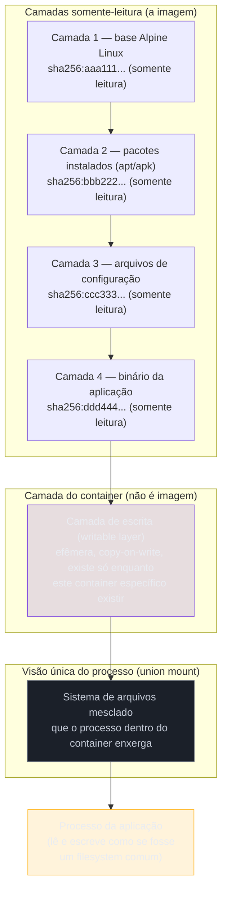
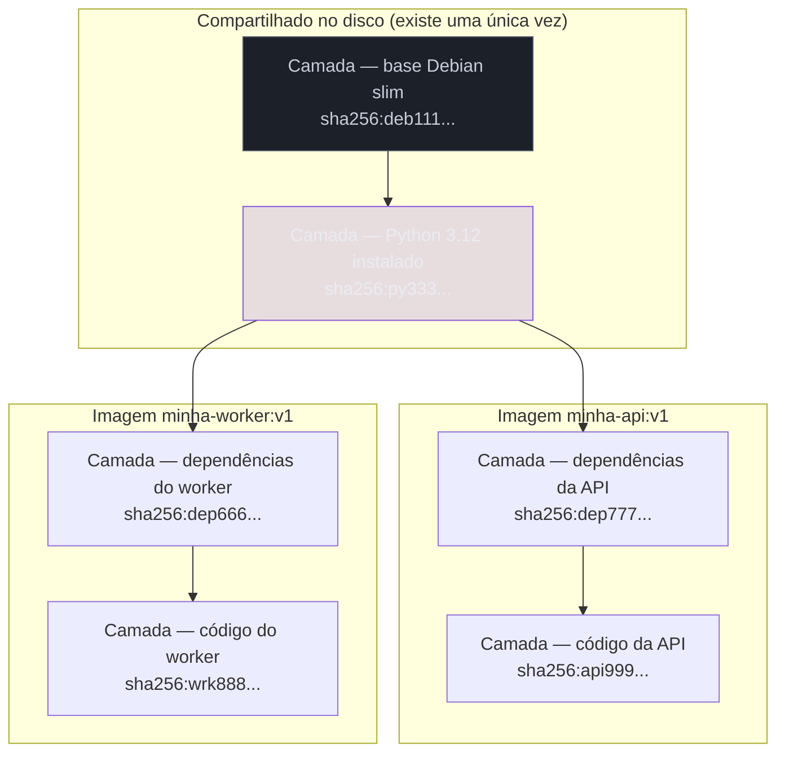
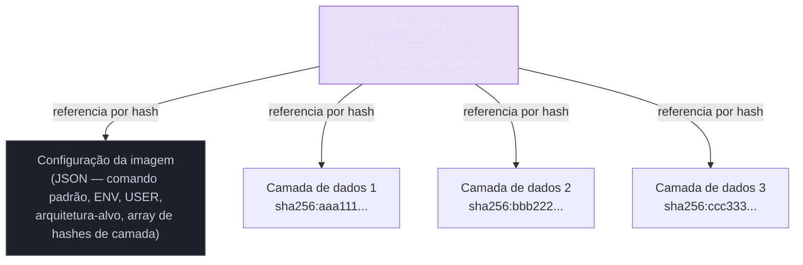

# A anatomia de uma imagem

> [!abstract] TL;DR
> Uma imagem Docker não é um arquivo, é uma pilha de camadas imutáveis empilhadas por um sistema de arquivos union, cada camada endereçada pelo hash do seu próprio conteúdo. É essa arquitetura — não uma escolha arbitrária de engenharia — que explica por que a segunda imagem baseada na mesma base baixa em segundos, por que um container roda sem nunca sujar a imagem que o originou, e por que "mudar a imagem em produção" é uma frase sem sentido: você não muda uma imagem, você constrói outra. Quando o container escreve, escreve numa camada nova, temporária, que morre com ele — a imagem embaixo permanece intocada, disponível para o próximo container que nascer dela. Entender essa mecânica é entender por que quase todo comportamento estranho do Docker — cache de build quebrado, imagem de 1,2 GB, tag que muda de conteúdo da noite para o dia — tem a mesma raiz.

Imagine que você acabou de rodar `docker pull python:3.12-slim` numa máquina nova e o download levou 45 segundos. Uma semana depois, você faz `docker build` de uma imagem que também parte de `python:3.12-slim`, e o `FROM` do Dockerfile resolve em menos de um segundo — "already exists", diz o terminal, para cada uma das camadas da base. Nenhum byte novo trafegou. Isso não é um cache de rede inteligente adivinhando que você já tinha aquilo: é o Docker reconhecendo, pelo hash de cada camada, que já possui exatamente aquele conteúdo no disco, não importa em qual imagem ele apareceu da primeira vez. Essa mesma mecânica é a razão de outro fenômeno, este bem menos simpático: você troca uma variável de ambiente no `docker run`, o container sobe, escreve um arquivo de log dentro de `/var/log/app.log`, você derruba o container com `docker rm -f`, sobe outro a partir da mesma imagem — e o log sumiu. Não foi um bug. O arquivo nunca esteve na imagem; ele vivia numa camada que existia só enquanto aquele container específico existia. Entender por que os dois comportamentos — o pull instantâneo e o log que desaparece — vêm exatamente da mesma peça de design é o objetivo desta nota.

Vale nomear, desde já, o porquê disso importar além da curiosidade técnica. A nota anterior deste galho, [[03-Dominios/Tecnologia/Infraestrutura/Docker/01 - O problema que o container resolve|01 — O problema que o container resolve]], explicou o que o Docker acrescenta ao isolamento que o kernel já oferecia; esta nota explica a peça que o Docker acrescenta ao isolamento de disco tradicional — não é só "processo isolado", é "processo isolado rodando a partir de um artefato que ele fisicamente não consegue corromper". As dezesseis notas que seguem neste galho — do cache de build ao tamanho final da imagem, da ordem do `COPY` à superfície de ataque que uma base desatualizada carrega — vão, todas, remeter de volta ao modelo descrito aqui. Não é exagero de ênfase: é a estrutura real do galho.

## O que é uma camada, de verdade

Esqueça por um momento a metáfora de "imagem = arquivo grande". Uma imagem Docker é uma lista ordenada de **camadas** (layers), e cada camada é, no fundo, um diff de sistema de arquivos: um conjunto de arquivos criados, modificados ou marcados como removidos em relação à camada anterior. Quando o Dockerfile executa `RUN apt-get install -y curl`, o resultado dessa instrução — os binários e bibliotecas que o `apt` gravou no disco — vira uma camada. Quando o Dockerfile executa `COPY app.py /app/`, o arquivo copiado vira outra camada, empilhada em cima.

Cada camada é armazenada como um arquivo compactado — na prática um tarball, no formato `.tar`, com compressão gzip ou zstd; existe também o formato `eStargz`, orientado a streaming, que permite o container começar a rodar antes do download terminar, mas ele não é o padrão: exige opt-in explícito no build e um snapshotter compatível no runtime — e é identificada não por um nome, mas por um **hash SHA-256 calculado sobre o próprio conteúdo daquela camada**. É isso que significa "endereçado por conteúdo": o identificador de uma camada não é escolhido por ninguém, é derivado matematicamente do que está dentro dela. Duas camadas com o mesmo conteúdo byte a byte — mesmo que tenham sido geradas em builds diferentes, em máquinas diferentes, em momentos diferentes — têm o mesmo hash. Para o Docker, elas são a mesma camada.

Essa propriedade tem uma consequência imediata que vale a pena tornar explícita: **camadas são imutáveis por construção, não por convenção**. Não existe operação "editar camada" no Docker, porque editar o conteúdo mudaria o hash, e um hash diferente é, por definição, uma camada diferente. Se você altera uma linha de um Dockerfile que gera a quinta camada de dez, o Docker não corrige a camada 5 — ele descarta as camadas 5 a 10 (as que dependiam do conteúdo alterado) e gera cinco camadas novas, com hashes novos. As quatro primeiras, que não foram tocadas, permanecem exatamente as mesmas, byte a byte, hash a hash. Essa é a semente do cache de build que a nota [[03-Dominios/Tecnologia/Infraestrutura/Docker/05 - Build e cache — por que seu build está lento|05 — Build e cache]] vai desenvolver em detalhe; aqui o que importa é entender que o cache funciona porque a identidade da camada é o próprio conteúdo, e conteúdo idêntico é, tautologicamente, cache hit.

Você pode ver essa pilha com as próprias mãos. Rode:

```bash
docker pull nginx:1.27-alpine
docker history nginx:1.27-alpine
```

A saída lista, de baixo para cima na ordem cronológica (mas de cima para baixo na tela, mais recente primeiro), cada camada com o comando que a gerou, seu tamanho, e um `IMAGE ID` truncado — que é um prefixo do hash de conteúdo que acabamos de descrever. Repare que várias linhas mostram `0B`: são instruções como `ENV`, `LABEL`, `CMD` ou `ENTRYPOINT`, que alteram apenas metadados da imagem (o que ela vai executar, quais variáveis define) sem tocar no sistema de arquivos — e por isso não produzem uma camada de dados, só uma entrada no histórico e no manifesto.

A saída típica de `docker history` para uma imagem pequena se parece com isto (truncado para caber na página):

```
IMAGE          CREATED BY                                      SIZE
a1b2c3d4e5f6   ENTRYPOINT ["/docker-entrypoint.sh"]             0B
b2c3d4e5f6a7   CMD ["nginx" "-g" "daemon off;"]                 0B
c3d4e5f6a7b8   COPY nginx.conf /etc/nginx/nginx.conf            1.1kB
d4e5f6a7b8c9   RUN set -x && apk add --no-cache nginx ...       12.3MB
e5f6a7b8c9d0   ENV NGINX_VERSION=1.27.0                          0B
f6a7b8c9d0e1   /bin/sh -c #(nop) ADD file:8a2b... in /           7.34MB
```

Repare, de baixo para cima, a lógica exata que descrevemos: a primeira linha (a mais antiga, o `ADD` que desempacota o rootfs base) carrega o peso da distribuição Alpine; a instalação de pacotes via `apk` soma outra fatia relevante; e, a partir daí, `ENV`, `CMD` e `ENTRYPOINT` não custam nada em bytes porque só tocam metadados. Cada linha com peso diferente de zero corresponde a exatamente uma camada real no armazenamento; cada linha com `0B` é só uma entrada no histórico da configuração, sem camada de dados associada.

Para ver a lista real de camadas, com os hashes completos, o comando é outro:

```bash
docker inspect nginx:1.27-alpine --format '{{json .RootFS.Layers}}' | python3 -m json.tool
```

A saída é um array de strings no formato `sha256:<64 caracteres hexadecimais>`, uma por camada de dados, na mesma ordem cronológica da construção:

```json
[
    "sha256:f6a7b8c9d0e134af9c8b2e1a...",
    "sha256:d4e5f6a7b8c9012bd4f3a2c1...",
    "sha256:c3d4e5f6a7b8901ac3e2b1d0..."
]
```

Esse array, na ordem em que aparece, *é* a imagem — não uma representação dela, a própria definição. Não há nenhum outro lugar onde "a imagem" more além dessa lista mais o que vem a seguir: um documento de configuração.

O `docker inspect` também mostra outro campo interessante, `Id`, que é o hash de um segundo artefato distinto das camadas — a **configuração da imagem** (o *image config*, um documento JSON que lista, entre outras coisas, o array de hashes de camada acima, o comando padrão a executar, as variáveis de ambiente definidas por `ENV`, o usuário definido por `USER`, e a arquitetura e sistema operacional-alvo, como `linux/amd64` ou `linux/arm64`). Vale não confundir os dois níveis de hash: cada camada individual tem seu próprio hash de conteúdo, calculado sobre o diff de sistema de arquivos que ela representa; a configuração tem um hash separado, calculado sobre o JSON que aponta para essas camadas. É esse segundo hash — o da configuração, não o de nenhuma camada isolada — que alimenta, junto com o manifesto que envolve tudo isso, o **digest** da imagem como um todo, conceito que a seção mais adiante nesta nota vai desenvolver.

### Quantas camadas cabem numa pilha

Vale conhecer um limite concreto que decorre diretamente dessa arquitetura, porque de vez em quando ele aparece como um erro real: o driver `overlay2` tem, historicamente, um teto para o número de camadas *lower* que consegue empilhar numa única montagem — um limite que vem da própria implementação do overlay no kernel Linux, não de uma escolha arbitrária do Docker, e que em versões amplamente usadas girava em torno de 128 camadas. Dockerfiles muito longos, ou pipelines que empilham imagem sobre imagem através de múltiplos `FROM` intermediários sem nunca consolidar nada, podem de fato esbarrar nesse teto e falhar ao tentar criar um container, com uma mensagem de erro que menciona o próprio driver overlay. Isso não é motivo para tratar "menos camadas" como meta em si — a estratégia certa de organizar instruções é assunto da nota 04 e 05 deste galho — mas é bom saber que o teto existe e de onde ele vem: é uma restrição do union filesystem subjacente, não do formato da imagem em si.

### O que uma camada não é

Vale gastar um parágrafo desfazendo três comparações que parecem intuitivas na primeira vez que se ouve falar de camadas, mas que levam a um modelo mental errado se levadas a sério. A primeira comparação tentadora é com um commit do Git: parece natural pensar "cada camada é tipo um commit, e a imagem é o histórico inteiro". A analogia ajuda até certo ponto — ambos são imutáveis, ambos formam uma sequência ordenada — mas quebra num detalhe importante: um commit do Git guarda uma árvore completa do repositório naquele ponto, enquanto uma camada Docker guarda só o **diff** em relação à camada anterior, sem nenhuma cópia do estado acumulado. Reconstituir o estado completo do sistema de arquivos exige percorrer a pilha inteira e aplicar cada diff em ordem — é isso que o union filesystem faz em tempo real, não algo pré-computado e guardado em algum lugar.

A segunda comparação tentadora é com um snapshot de VM ou com uma imagem de disco tradicional (um `.iso` ou um `.vmdk`): parece razoável achar que uma camada é "um pedaço de disco virtual". Também não é: um snapshot de VM tipicamente captura blocos de disco brutos, sem nenhuma noção de arquivo individual; uma camada Docker é definida em termos de **arquivos e diretórios do sistema de arquivos**, com metadados como permissões e dono preservados por arquivo. É uma diferença de nível de abstração — bloco contra arquivo — que explica, entre outras coisas, por que camadas de imagens Docker costumam comprimir e deduplicar melhor entre imagens diferentes do que blocos de disco de VMs distintas costumam fazer: dois arquivos idênticos em duas camadas diferentes têm boa chance de acabar em blocos de compressão parecidos, enquanto blocos de disco brutos raramente se alinham dessa forma entre VMs distintas.

A terceira comparação, mais sutil, é achar que uma camada é "o resultado de uma instrução do Dockerfile" no sentido de existir uma correspondência garantida de um-para-um. Já vimos que isso é quase verdade, mas não exatamente: instruções que só tocam metadados (`ENV`, `LABEL`, `CMD`, `ENTRYPOINT`, `WORKDIR` quando o diretório já existe) não geram camada de dados nenhuma, só uma entrada na configuração. E, com BuildKit, é possível uma única instrução `RUN` gerar mais de uma camada de armazenamento sob certas otimizações internas, embora o comportamento padrão continue sendo uma camada por instrução que efetivamente altera o sistema de arquivos. O modelo mental mais preciso não é "instrução gera camada", é "mudança no sistema de arquivos gera camada" — as instruções são apenas o que dispara essa mudança.

## A pilha vista como um sistema de arquivos único

Ter uma lista de camadas separadas não ajuda em nada se, ao rodar o processo dentro do container, ele enxergar dez diretórios isolados em vez de um sistema de arquivos coerente. É aqui que entra a peça que transforma a pilha em algo utilizável: um **union filesystem** — no Linux moderno, quase sempre o driver `overlay2`.

A ideia central de um filesystem union é simples de enunciar e poderosa na prática: ele empilha várias camadas (chamadas, na terminologia do overlay, de *lower* — as camadas somente-leitura da imagem) e apresenta ao processo uma **visão mesclada** (*merged view*) como se fosse um único diretório. Se a camada 1 tem `/etc/nginx/nginx.conf` e a camada 3 substitui esse mesmo caminho por uma versão diferente, a visão mesclada mostra a versão da camada 3 — a mais alta na pilha "ganha" para qualquer caminho que apareça em mais de uma camada. Arquivos que só existem numa camada aparecem normalmente. Arquivos marcados como removidos numa camada superior (via um marcador especial chamado *whiteout*) somem da visão mesclada, mesmo que ainda existam fisicamente numa camada inferior — o dado não foi apagado do disco, foi apenas ocultado pela camada que o sobrepõe.

O driver `overlay2` implementa essa ideia com uma nomenclatura própria que vale conhecer, porque aparece direto em qualquer investigação de disco cheio ou de comportamento estranho de arquivo. Ele organiza cada montagem em torno de quatro diretórios: `lowerdir`, que é a lista (potencialmente longa) das camadas somente-leitura empilhadas, na ordem correta; `upperdir`, que é exatamente a camada de escrita do container, o único lugar onde qualquer gravação de fato acontece; `workdir`, um diretório interno de uso exclusivo do kernel para operações atômicas durante a fusão, que nunca deve ser mexido manualmente; e `merged`, o ponto de montagem que junta tudo isso na visão única que o processo do container efetivamente enxerga como sua raiz. Rodar `docker inspect <container> --format '{{json .GraphDriver.Data}}'` num container em execução mostra exatamente esses quatro caminhos no host, e é possível — embora raramente necessário — navegar até `upperdir` a partir do host e ver, cru, exatamente os arquivos que aquele container específico escreveu desde que nasceu.

O mecanismo de *whiteout* merece um exemplo concreto, porque "arquivo que some sem ser apagado do disco" soa contraintuitivo até se ver o efeito. Se a camada 2 de uma imagem contém `/app/debug.log` e uma instrução posterior do Dockerfile roda `rm /app/debug.log`, o resultado não é a camada 2 sendo reescrita sem aquele arquivo — camadas anteriores são imutáveis, lembre-se — mas sim uma **nova camada**, gerada por aquela instrução `RUN rm`, contendo apenas um marcador especial (um arquivo de caractere especial, no formato usado pelo overlay do Linux) que instrui a visão mesclada a tratar `/app/debug.log` como inexistente. Na prática, isso quer dizer uma coisa contraintuitiva que costuma pegar quem está otimizando tamanho de imagem de surpresa: **apagar um arquivo grande numa instrução `RUN` posterior não reduz o tamanho da imagem** — o arquivo continua fisicamente presente na camada anterior, ocupando espaço em disco e sendo transferido em todo `pull`; só o marcador de whiteout, minúsculo, é adicionado. A forma correta de evitar esse desperdício — instalar e depois limpar dentro da mesma instrução `RUN`, para que ambos os passos aconteçam dentro de uma única camada — é o tipo exato de decisão que a nota [[03-Dominios/Tecnologia/Infraestrutura/Docker/04 - O Dockerfile como receita de camadas|04 — O Dockerfile como receita de camadas]] vai desenvolver; aqui o que importa é entender por que o problema existe: é geometria de camadas, não um detalhe de implementação do `rm`.

O marcador de whiteout, na especificação OCI, não é um conceito abstrato — tem um formato concreto de arquivo dentro do tarball da camada. Um arquivo removido vira, na camada nova, uma entrada chamada `.wh.<nome-original-do-arquivo>` no mesmo diretório onde o arquivo original estava — um arquivo de caractere especial, sem conteúdo relevante, cuja única função é sinalizar "ignore qualquer versão deste nome vinda de camadas inferiores". Diretórios inteiros têm um caso especial: quando uma camada precisa dizer "este diretório existia embaixo, mas a partir de agora deve ser tratado como vazio", ela usa um marcador chamado *opaque whiteout*, no formato `.wh..wh..opq` colocado dentro do próprio diretório — um sinalizador de que a fusão deve parar de olhar para baixo naquele ponto específico da árvore. Nenhum desses detalhes muda a conclusão prática já estabelecida (nada some fisicamente, só fica marcado como invisível), mas vale saber que o formato existe e tem nome, porque é exatamente esse arquivo que aparece se alguém inspecionar manualmente o `tar` de uma camada em busca de "por que essa imagem não encolheu depois do `rm`".

O diagrama abaixo mostra essa pilha para um container único, da base até o topo:



Note a diferença de natureza entre as quatro camadas de baixo e a camada do topo. As quatro primeiras compõem a **imagem** propriamente dita: imutáveis, endereçadas por hash de conteúdo, e — este é o ponto que a próxima seção explora — potencialmente compartilhadas com outras imagens completamente diferentes. A camada do topo pertence ao **container**, não à imagem: ela nasce vazia no instante em que o container é criado, e é a única camada em toda a pilha na qual se pode escrever.

> [!tip] Vídeo — a pilha de camadas demonstrada no sistema de arquivos
> [**Building a Container Image — OCI, UnionFS, Overlay**](https://www.youtube.com/watch?v=hhQ6uc2bp2s) (Ryan Hay, ~17 min, EN) faz o que texto nenhum consegue: monta um `overlayfs` **fora do Docker**, com diretórios comuns, e mexe nele ao vivo para mostrar cada propriedade da seção acima acontecendo. Ele demonstra que arquivos das camadas de baixo aparecem na visão unificada, que uma camada superior **substitui** o arquivo homônimo da inferior, e que diretórios são **mesclados** em vez de substituídos. O achado que mais importa para esta nota vem em [15:05] e vale ler devagar: **apagar um arquivo numa camada superior apenas o esconde da visão — ele continua existindo na camada onde foi adicionado, e nunca é de fato removido da imagem.** É a base mecânica de duas coisas que este galho trata adiante: por que a imagem é imutável, e por que um segredo que entrou numa camada não sai com um `RUN rm` na camada seguinte. Antes disso, ele abre o manifesto e mostra a estrutura que aponta para a configuração e para o array de camadas. **O que ele não cobre:** a matemática do compartilhamento entre imagens, a camada de escrita do container e o copy-on-write, e a distinção entre tag e digest.

## Por que a segunda imagem baixa quase de graça

Essa mesma arquitetura de camadas endereçadas por conteúdo explica um comportamento que costuma parecer mágica na primeira vez que se presta atenção nele: por que puxar uma segunda imagem que compartilha a base da primeira é quase instantâneo, mesmo que as duas imagens sejam de projetos totalmente diferentes, mantidas por equipes diferentes, publicadas em registries diferentes.

Considere duas imagens: `minha-api:v1`, construída sobre `python:3.12-slim`, e `minha-worker:v1`, construída sobre a mesma base `python:3.12-slim`, mas com um conjunto diferente de dependências instaladas por cima. As camadas que compõem `python:3.12-slim` — a base Debian, as bibliotecas do sistema, o interpretador Python — têm hashes fixos, calculados sobre o conteúdo daquela versão específica da imagem base. Quando o Docker faz `pull` de `minha-api:v1`, ele baixa o manifesto (a lista ordenada de hashes de camada), confere no armazenamento local quais desses hashes já existem, e baixa **apenas os que faltam**. Se `python:3.12-slim` já estava presente porque outra imagem a usou antes, todas as camadas da base são reaproveitadas sem nenhum byte trafegar de novo — só as camadas exclusivas de `minha-api` precisam ser baixadas. O mesmo raciocínio vale para `minha-worker:v1`: suas camadas de base já estão lá, e apenas as camadas específicas do worker chegam pela rede.



O armazenamento local do Docker guarda cada camada uma única vez, indexada pelo seu hash, dentro de `/var/lib/docker/overlay2/` (no Linux, com o driver padrão). Não existe duplicação de disco para camadas idênticas, e não existe re-download de camadas que já estão lá — a única coisa que amarra `minha-api:v1` e `minha-worker:v1` à mesma camada de base é o fato de ambas terem, em algum ponto do manifesto, uma referência ao mesmo hash `sha256:py333...`. Isso é economia de banda e de disco como efeito colateral de uma decisão de endereçamento, não como uma feature de deduplicação implementada à parte.

### Testando o compartilhamento na prática

A melhor forma de acreditar nisso é forçar o cenário com as próprias mãos, em vez de confiar na explicação. Crie dois Dockerfiles minúsculos que partem exatamente da mesma base:

```dockerfile
# Dockerfile.um
FROM alpine:3.20
RUN apk add --no-cache curl
```

```dockerfile
# Dockerfile.dois
FROM alpine:3.20
RUN apk add --no-cache jq
```

Construa os dois, e repare no próprio texto que o build imprime:

```bash
docker build -f Dockerfile.um -t experimento-um .
docker build -f Dockerfile.dois -t experimento-dois .
```

Na segunda build, a linha correspondente a `FROM alpine:3.20` aparece marcada como já resolvida em cache (`CACHED`) — o Docker reconheceu que já tinha, localmente, exatamente aquela camada de base, porque a primeira build já havia puxado e registrado o mesmo hash. Só a instrução `RUN apk add --no-cache jq`, exclusiva do segundo Dockerfile, de fato executa e gera uma camada nova. Confirme o compartilhamento de forma mais direta comparando os hashes de camada das duas imagens:

```bash
docker inspect experimento-um --format '{{json .RootFS.Layers}}'
docker inspect experimento-dois --format '{{json .RootFS.Layers}}'
```

O primeiro hash de cada array — o da camada de base do Alpine — é idêntico nas duas saídas. É esse hash idêntico, e não nenhuma configuração especial que você precisou fazer, que garante que o Docker guarda aquela camada uma única vez em disco e a reaproveita para as duas imagens. Rodar `docker system df -v` na sequência mostra as duas imagens listadas com tamanhos individuais que, somados ingenuamente, ultrapassam o espaço real ocupado — exatamente a armadilha de contabilidade que a seção de armadilhas comuns, mais adiante nesta nota, chama atenção.

## O manifesto: o documento que amarra tudo isso

Até aqui falamos de camadas como se elas simplesmente soubessem se organizar na ordem certa, mas existe um documento concreto responsabilizado por isso: o **manifesto** (*image manifest*), especificado pela [OCI Image Format Specification](https://github.com/opencontainers/image-spec/blob/main/spec.md) — o padrão aberto, mantido pela Open Container Initiative, que o Docker adota desde que a comunidade decidiu desacoplar "formato de imagem" de "Docker especificamente". O manifesto é um documento JSON relativamente pequeno que não contém nenhum byte de dado de aplicação — só referências. Ele lista, em ordem, os hashes de cada camada (o array que vimos com `docker inspect`), o hash da configuração da imagem, e metadados como o tipo de mídia de cada componente (`application/vnd.oci.image.layer.v1.tar+gzip` para uma camada comprimida, por exemplo).

Isso importa porque explica, em termos concretos, o que de fato acontece na rede quando você faz `docker pull`. O cliente Docker não baixa "a imagem" como um blob monolítico: ele primeiro busca o manifesto (pequeno, geralmente poucos kilobytes), lê a lista de hashes ali dentro, confere no armazenamento local quais desses hashes já existem, e só então requisita ao registry, camada por camada, exatamente as que faltam. É esse fluxo em duas etapas — manifesto primeiro, camadas sob demanda depois — que torna possível a economia de banda descrita acima: sem o manifesto como índice, o cliente não teria como saber, antes de baixar qualquer coisa pesada, o que já possui.

O diagrama abaixo resume as três peças que, juntas, formam o que rotineiramente chamamos de "a imagem" — e deixa visível por que nenhuma delas sozinha seria suficiente:



O manifesto não contém as camadas nem a configuração — ele só sabe onde encontrá-las, pelo hash. É essa indireção que permite ao registry (ou ao armazenamento local) guardar cada camada uma única vez e deixar múltiplos manifestos, de imagens diferentes, apontarem para ela sem duplicação, exatamente o mecanismo de compartilhamento que a seção anterior demonstrou na prática.

Dá para ver esse manifesto cru, sem precisar confiar apenas na descrição, com um comando que fala diretamente com o registry:

```bash
docker manifest inspect nginx:1.27-alpine
```

A saída é o JSON do manifesto (ou, dependendo da imagem, do índice de manifestos multi-arquitetura descrito mais adiante) exatamente como o registry o serve: uma lista de objetos, cada um com um campo `mediaType` identificando se aquilo é uma camada ou a configuração, um `digest` no formato `sha256:...`, e um `size` em bytes. Comparar esse `digest` de cada camada, item por item, com o array retornado por `docker inspect --format '{{json .RootFS.Layers}}'` mostrado mais cedo nesta nota mostra a mesma informação vista de dois ângulos: um vindo do registry remoto, antes de qualquer coisa ser baixada; o outro vindo do estado local, depois do `pull`. Os hashes batem porque são o mesmo dado — o manifesto não é uma cópia local de algo que existe "de verdade" só no registry, é a fonte da verdade em si, replicada sem alteração para onde quer que a imagem viaje. A estrutura completa do manifesto, os tipos de mídia envolvidos e como um registry serve múltiplas arquiteturas sob a mesma tag ficam fora do recorte desta nota — o protocolo de transferência entre cliente e registry é assunto de outra parte do galho; aqui bastava reconhecer que o manifesto existe e é a peça que faz o compartilhamento de camadas ser uma decisão de protocolo, não uma coincidência de sorte.

### A imagem também declara para qual arquitetura ela serve

Um detalhe que passa despercebido até dar errado numa hora inconveniente: a configuração da imagem, mencionada acima, não guarda só o comando padrão e as variáveis de ambiente — ela também declara, de forma obrigatória, o sistema operacional e a arquitetura de processador para os quais aquelas camadas foram construídas. Confira num `docker inspect` qualquer:

```bash
docker inspect alpine:3.20 --format '{{.Os}}/{{.Architecture}}'
```

A saída típica é algo como `linux/amd64` ou `linux/arm64`. Isso não é um rótulo cosmético: as camadas referenciadas por aquele manifesto contêm binários compilados especificamente para aquela arquitetura, e tentar rodar um container a partir de camadas `arm64` num host `amd64` sem nenhuma camada de emulação simplesmente falha, ou exige uma camada de tradução (como o `binfmt_misc` combinado com QEMU) que tem seu próprio custo de desempenho. É por isso que, como a seção sobre tag e digest já adiantou, uma tag como `alpine:3.20` frequentemente não resolve para um único manifesto, mas para um índice que lista um manifesto — com seu próprio conjunto de camadas — por arquitetura suportada; o cliente Docker escolhe automaticamente o manifesto certo para o host onde está rodando, e é por isso que o mesmo comando `docker pull alpine:3.20` traz binários diferentes numa máquina Intel e numa Apple Silicon, sem que o usuário precise especificar nada.

## A camada de escrita: copy-on-write e a efemeridade do container

Volte ao diagrama da pilha e olhe de novo para a camada do topo, a única marcada como writable. Quando um container é criado a partir de uma imagem, o Docker não copia a imagem inteira para um espaço novo — isso seria caro e lento para imagens de centenas de megabytes. Em vez disso, ele monta as camadas da imagem como somente-leitura e adiciona por cima uma camada de escrita vazia, específica daquele container. É essa camada, e só ela, que sofre qualquer alteração enquanto o container roda.

O mecanismo que torna isso possível chama-se **copy-on-write** (COW). Quando o processo dentro do container lê um arquivo que existe numa das camadas da imagem, a leitura acontece direto na camada de origem — não há cópia, não há custo extra, o overlay simplesmente resolve o caminho para a camada mais alta que o contém. O comportamento muda no instante em que o processo tenta **escrever**. Se o arquivo-alvo já existe numa camada inferior da imagem, o driver overlay primeiro copia esse arquivo inteiro para a camada de escrita do container — só então aplica a modificação, na cópia, na camada de escrita. O arquivo original, lá embaixo na camada somente-leitura, permanece intocado. Se o arquivo é criado do zero pelo processo (por exemplo, um log novo), ele nasce direto na camada de escrita, sem precisar de cópia prévia porque não havia nada para copiar.

Esse detalhe — "copia o arquivo inteiro antes de escrever" — tem uma implicação prática que vale registrar: modificar um único byte de um arquivo grande que vive numa camada da imagem custa, na primeira escrita, o tempo e o espaço de copiar o arquivo inteiro para a camada de escrita. Isso não costuma importar para arquivos de configuração pequenos, mas é uma das razões pelas quais bancos de dados ou qualquer carga com escrita pesada e arquivos grandes não devem viver na camada de escrita de um container — o padrão correto para esse caso é montar um volume, que contorna o overlay inteiramente, e é assunto para outra nota deste galho, não para esta.

Vale tornar isso tangível com um experimento de dois minutos. Rode um container qualquer em segundo plano, escreva um arquivo dentro dele, e compare o tamanho reportado da camada de escrita antes e depois:

```bash
docker run -d --name experimento alpine sleep 3600
docker exec experimento sh -c "dd if=/dev/zero of=/tmp/arquivo-grande bs=1M count=50"
docker inspect experimento --format '{{.SizeRw}}'
```

O campo `SizeRw` reporta, em bytes, exatamente o tamanho atual da camada de escrita daquele container — não da imagem, que permanece com o tamanho original reportado por `docker images`. Depois de rodar `docker rm -f experimento`, esses 50 MB somem por completo: não foram movidos para lugar nenhum, a camada inteira que os continha deixou de existir.

### Vendo a camada de escrita por dentro: `docker diff`

Existe uma forma direta de enxergar, sem adivinhação, exatamente o que um container escreveu na sua camada de escrita desde que nasceu: o comando `docker diff`. Retome o container de teste que rodou o `dd` mais acima, ou crie outro qualquer, e escreva algumas coisas nele:

```bash
docker run -d --name experimento2 alpine sleep 3600
docker exec experimento2 sh -c "echo teste > /tmp/novo.txt && rm /etc/hostname"
docker diff experimento2
```

A saída lista cada caminho afetado com um prefixo de uma letra: `A` para arquivos adicionados, `C` para arquivos modificados, `D` para arquivos apagados. `/tmp/novo.txt` aparece com `A`, porque nasceu direto na camada de escrita. `/etc/hostname` aparece com `D` — não porque o arquivo tenha sido fisicamente destruído na camada da imagem embaixo (ele continua lá, imutável), mas porque a camada de escrita agora contém um marcador de *whiteout* para aquele caminho, exatamente o mecanismo descrito na seção sobre union filesystem. `docker diff` é, na prática, uma leitura direta do conteúdo da camada de escrita — é o comando mais rápido para responder "o que este container mudou, comparado com a imagem que o originou?" sem precisar entrar em `/var/lib/docker` manualmente.

O que importa reter aqui é a consequência arquitetural: **a imagem nunca é alterada pelo container que roda a partir dela**. Não existe caminho, dentro da execução normal de um container, para uma escrita "vazar" de volta para as camadas somente-leitura. Isso é, ao mesmo tempo, uma garantia de segurança (um processo comprometido dentro do container não corrompe a imagem que outros containers também usam) e a explicação técnica exata para a efemeridade do container: quando você roda `docker rm`, o Docker simplesmente descarta a camada de escrita daquele container. Tudo que foi escrito nela — o log, o arquivo temporário, o cache que o processo gravou em disco — desaparece junto, porque nunca existiu em lugar nenhum além daquela camada específica. O container não "perde dados"; ele nunca teve um lugar durável para guardá-los, a menos que alguém tenha explicitamente montado um.

Essa efemeridade costuma ser descrita como limitação na primeira vez que alguém a encontra — "por que meu container esquece tudo?" — mas vale inverter a pergunta: é exatamente essa garantia que torna trivial rodar dez, cem ou mil containers idênticos a partir da mesma imagem, sem que um interfira no estado do outro e sem que "resetar" um ambiente signifique nada mais complicado do que destruir o container e criar outro. Se a camada de escrita pudesse, de alguma forma, vazar de volta para a imagem, cada container que já rodou deixaria uma marca permanente nela, e duas execuções da "mesma imagem" deixariam de ser garantidamente idênticas depois de um tempo de uso. A efemeridade não é o preço que se paga pelo modelo de camadas — é a característica que o modelo de camadas foi desenhado para entregar.

> [!info] Baseline de versão
> A descrição de overlay2 e copy-on-write nesta nota reflete o comportamento do Docker Engine em versões recentes (linha 27.x, 2026), com `overlay2` como storage driver padrão em hosts Linux modernos (kernel 4.x+). Drivers mais antigos (`aufs`, `devicemapper`, `btrfs`) existiram por razões históricas de compatibilidade de kernel e têm particularidades de implementação diferentes das descritas aqui, mas o modelo conceitual — camadas somente-leitura mais uma camada de escrita copy-on-write — é o mesmo em todos eles. No Docker Desktop para macOS e Windows, o cenário muda mais uma vez: o daemon roda dentro de uma VM Linux leve, e é dentro dela que `overlay2` opera exatamente como descrito aqui; o host não-Linux nunca vê o overlay diretamente, só a interface do cliente Docker conversando com essa VM.

### O tamanho de uma imagem é a soma das suas camadas — mas qual soma

Vale um parágrafo sobre um detalhe que confunde quem compara o tamanho reportado por `docker images` com o tempo real que um `pull` leva: existem, em jogo, dois números de tamanho diferentes para a mesma camada, e eles não costumam bater. O tamanho que trafega pela rede é o da camada **comprimida** (o `layer.tar.gz` ou equivalente, no formato que o manifesto anuncia via `mediaType`); o tamanho que `docker images` mostra, e que efetivamente ocupa espaço em `/var/lib/docker` depois de extraído, é o tamanho **descomprimido** no sistema de arquivos. Para camadas de texto (código-fonte, arquivos de configuração), a compressão costuma render bem, e a diferença entre os dois números é grande — uma camada de 40 MB descomprimidos pode trafegar como 8 MB comprimidos. Para camadas que já contêm dados binários pouco compressíveis (imagens, arquivos já compactados, binários compilados), a diferença é pequena, e o tempo de rede se aproxima mais do tamanho reportado localmente.

Isso explica uma percepção comum e enganosa: duas imagens com o mesmo tamanho reportado por `docker images` podem levar tempos de `pull` visivelmente diferentes, porque uma tem conteúdo mais compressível que a outra. E o inverso também acontece — uma imagem "pesada" segundo `docker images` pode baixar rápido se a maior parte das suas camadas já estiver em cache local, situação que a seção sobre compartilhamento de camadas, mais cedo nesta nota, já cobriu em detalhe. O ponto a reter é que "tamanho da imagem" não é um número único e absoluto: é rede, é disco, é comprimido, é descomprimido, e cada contexto de pergunta ("por que o `pull` demorou", "por que o disco encheu") aponta para um número diferente entre esses.

## Por que a imagem é imutável — e o que isso implica na prática

Chegado a este ponto, a imutabilidade da imagem deixa de ser um slogan e vira uma consequência direta de tudo que já foi descrito: as camadas são endereçadas por hash de conteúdo, hashes não mudam sem o conteúdo mudar, e o container que roda a partir da imagem escreve numa camada separada que nunca é incorporada de volta a ela. Some essas três peças e a conclusão é inevitável: **não existe operação "editar uma imagem"**. Existe apenas "construir uma imagem nova".

Isso tem uma implicação que costuma surpreender quem vem de um modelo mental de servidor tradicional, onde é normal entrar via SSH e corrigir um arquivo de configuração no lugar. Se você entra num container rodando com `docker exec`, edita um arquivo de configuração, e quer que essa correção "vire a imagem", não existe comando que faça isso diretamente — porque a edição aconteceu na camada de escrita do container, que é descartável por natureza. O caminho correto — e o único que existe — é usar `docker commit` para congelar o estado atual da camada de escrita como uma **camada nova**, gerando assim uma imagem nova com um hash de configuração novo:

```bash
docker exec -it meu-container sh -c "echo 'nova config' > /etc/app/config.yml"
docker commit meu-container minha-imagem:v2
```

É útil, antes de rodar o commit, confirmar exatamente o que será congelado — o mesmo `docker diff` apresentado na seção anterior serve para isso, mostrando linha a linha o que a nova camada vai conter antes de ela se tornar permanente.

Esse comando não altera `minha-imagem:v1`. Ele cria `minha-imagem:v2`, uma imagem distinta, com uma camada a mais empilhada em cima das camadas de `v1`, e a tag `v1` continua apontando exatamente para o que sempre apontou. `docker commit` é útil para depuração pontual e é explicitamente desaconselhado como fluxo de trabalho de produção — a construção deliberada e reproduzível de uma imagem, via Dockerfile, é o assunto da nota [[03-Dominios/Tecnologia/Infraestrutura/Docker/04 - O Dockerfile como receita de camadas|04 — O Dockerfile como receita de camadas]] — mas o comando serve bem, aqui, para tornar tangível a regra: mudar alguma coisa é sempre gerar uma imagem nova, nunca alterar a existente.

Dá para ver essa "imagem nova, camada a mais" com os próprios olhos exportando o resultado para um `.tar` e olhando dentro dele:

```bash
docker save minha-imagem:v2 -o minha-imagem-v2.tar
tar -tf minha-imagem-v2.tar | head -20
```

O que aparece não é um blob único: é um diretório por camada (cada um nomeado pelo prefixo do seu hash), cada um contendo um `layer.tar` com o conteúdo daquela camada específica, mais um arquivo `manifest.json` na raiz do tar amarrando tudo. `docker save` não inventa nada — ele simplesmente empacota, num único arquivo de conveniência para transporte offline, exatamente a mesma estrutura de camadas e manifesto que descrevemos ao longo desta nota. Comparar o `tar -tf` de `minha-imagem-v1.tar` com o de `minha-imagem-v2.tar` mostra, lado a lado, que todas as camadas herdadas de `v1` reaparecem intocadas em `v2`, mais exatamente uma camada nova — a que `docker commit` gerou a partir do que estava na camada de escrita do container no momento do commit.

Vale um parágrafo distinguindo `docker save` de um comando com nome parecido, mas que faz algo estruturalmente diferente e existe justamente para o cenário oposto: `docker export`. Enquanto `docker save` opera sobre uma **imagem** e preserva a pilha de camadas intacta (é o formato que se usa para transportar uma imagem inteira, com histórico e tudo, de uma máquina para outra), `docker export` opera sobre um **container** e produz um único tarball achatado — a visão mesclada final do sistema de arquivos, sem nenhuma informação de camada, sem manifesto, sem configuração de comando padrão. Quem faz `docker import` a partir de um export desses recebe um blob de arquivos plano, que vira uma única camada nova numa imagem nova, com todo o histórico de como aquele estado foi construído perdido para sempre. Os dois comandos parecem primos pelo nome; na prática, um preserva exatamente a anatomia que esta nota descreveu, o outro a apaga de propósito em troca de simplicidade — e escolher o errado costuma ser motivo de surpresa só quando alguém precisa depois entender de onde uma camada específica veio.

A mesma lógica é a razão pela qual imagens são um artefato tão adequado para promoção entre ambientes. A imagem que passou nos testes em staging, identificada pelo seu hash de conteúdo, é byte a byte a mesma imagem que sobe para produção — não uma "imagem parecida reconstruída com o mesmo Dockerfile", que poderia divergir se uma dependência de sistema tivesse sido atualizada no meio do caminho. Imutabilidade não é só uma propriedade técnica interessante; é o que torna a promessa "testamos exatamente isto, rodamos exatamente isto" verificável — e é também o que dá sentido a versionar imagens com um identificador estável (uma tag semântica, um hash de commit do código-fonte) em vez de sobrescrever o mesmo nome repetidamente, hábito que a próxima seção desmonta em detalhe.

## Tag versus digest: o ponteiro móvel e o conteúdo fixo

Se a imagem é imutável, por que `nginx:1.27-alpine` de hoje pode não ser `nginx:1.27-alpine` de amanhã? A resposta está em distinguir duas coisas que, no uso cotidiano, se confundem: a **tag** e o **digest**.

O digest é o hash SHA-256 calculado sobre o manifesto da imagem — o documento que lista, entre outras coisas, as camadas e a configuração. Ele tem a forma `sha256:e3b0c4429...` e, como qualquer hash de conteúdo, é imutável por definição: o mesmo digest sempre resolve para exatamente o mesmo conteúdo, em qualquer registry, em qualquer momento. Puxar por digest é o único jeito de garantir, com certeza matemática, que você está recebendo os bytes exatos que alguém testou:

```bash
docker pull nginx@sha256:2ab30d6ac52baeb502bf5f5a4de3a26...
```

Nada disso é peculiaridade do Docker — o mesmo par tag/digest, com a mesma relação de mutável/imutável, se repete em praticamente qualquer registry compatível com o protocolo OCI Distribution, de Docker Hub a GHCR a ECR, porque a distinção é definida no protocolo de distribuição, não implementada de forma independente por cada fornecedor.

A tag, em contraste, é apenas uma **etiqueta legível para humanos** — uma entrada num registro do registry que aponta para um digest. `nginx:1.27-alpine` hoje pode apontar para o digest `sha256:2ab3...`; se a Nginx Inc. publicar uma correção de segurança na mesma tag amanhã (um rebuild da imagem sobre uma base Alpine atualizada, por exemplo), a tag `1.27-alpine` passa a apontar para um digest diferente, `sha256:9f7c...`, sem que o nome que você usa no seu Dockerfile ou no seu `docker run` mude uma única letra. A tag é o ponteiro; o digest é o que o ponteiro aponta.

```
registry.example.com/namespace/imagem:tag@sha256:abc123...
│                    │         │     │    │
│                    │         │     │    └── digest — hash do conteúdo, imutável
│                    │         │     └─────── tag — ponteiro legível, mutável
│                    │         └───────────── nome da imagem
│                    └─────────────────────── namespace (usuário ou organização)
└──────────────────────────────────────────── registry (padrão: docker.io)
```

`latest`, especificamente, é o caso extremo dessa mutabilidade. Ela não significa "a versão mais avançada" nem "a mais recente por algum critério semântico" — significa, literalmente, o que quer que alguém tenha publicado por último sem especificar outra tag, o que na prática costuma ser a tag padrão aplicada por quem faz o build quando esquece (ou escolhe) não colocar uma versão explícita. Duas pessoas rodando `docker pull minha-imagem:latest` em momentos diferentes podem, legitimamente, acabar com conteúdos completamente diferentes — sem nenhum erro, sem nenhum aviso, porque do ponto de vista do Docker nada de errado aconteceu: a tag resolveu para o que ela apontava naquele instante. É uma conveniência real (não precisar decidir uma versão para experimentar algo rapidamente) que se paga com a perda total de reprodutibilidade — e é exatamente por isso que a política de nunca depender de `latest` fora de um ambiente descartável é uma regra operacional que pertence à nota [[03-Dominios/Engenharia/Operação/3 - Rodar em produção/01 - Containers em produção|Containers em produção]], não a esta: aqui cabe apenas explicar por que a mentira é conveniente e onde, tecnicamente, ela se manifesta.

Você pode conferir para qual digest uma tag resolve agora mesmo, sem precisar confiar de olhos fechados:

```bash
docker inspect nginx:1.27-alpine --format '{{index .RepoDigests 0}}'
```

A saída mostra o par `nome@sha256:...` que corresponde ao que foi de fato baixado. Se você rodar esse mesmo comando daqui a seis meses contra a mesma tag, e o digest tiver mudado, não é um erro seu — é a tag fazendo exatamente o que uma tag faz: apontar para o que existe agora, não para o que existia quando você a usou pela primeira vez.

Um jeito prático de tornar essa mutabilidade impossível de ignorar é o comando abaixo, capturado num pipeline de CI e comparado dias depois:

```bash
docker pull python:3.12-slim
docker inspect python:3.12-slim --format '{{index .RepoDigests 0}}' >> digests-registrados.txt
```

Rodar essa mesma sequência periodicamente e comparar as linhas acumuladas de `digests-registrados.txt` é uma forma barata de detectar, sem depender de aviso nenhum do registry, quando uma base que o time trata como "estável" mudou de conteúdo por baixo. Times que levam reprodutibilidade a sério costumam ir um passo além e trocar, no próprio Dockerfile, a tag pelo par completo `imagem:tag@sha256:...` — o que trava o `FROM` no digest exato, mesmo que a tag associada mude de alvo depois; a tag continua ali só como anotação legível para humanos, mas quem decide o que é puxado é o digest. Esse hábito de fixação de versão, junto com a política mais ampla de quando isso é obrigatório e quando é exagero, é o tipo de decisão operacional que pertence à disciplina de produção, não a esta nota — aqui o que importa é que a distinção técnica entre os dois identificadores é exatamente o que torna essa fixação possível.

Vale registrar também que uma mesma tag, em registries modernos, frequentemente não aponta para um único manifesto de imagem, mas para um **índice de manifestos** (também chamado de *manifest list* ou, na terminologia OCI, *image index*) — um nível extra de indireção que lista, para a mesma tag, um manifesto diferente por arquitetura de processador (`linux/amd64`, `linux/arm64`, e por vezes `linux/arm/v7`). Quando você roda `docker pull nginx:1.27-alpine` numa máquina Apple Silicon e a mesma tag numa máquina Intel, os dois comandos resolvem, através desse índice, para digests de imagem diferentes — cada um com seu próprio conjunto de camadas, compiladas para a arquitetura correspondente — ainda que ambos venham "da mesma tag". Esse mecanismo de múltiplas arquiteturas sob uma tag única é construído em cima do BuildKit no momento da publicação, e como construir uma imagem multi-arquitetura é assunto de outra nota do galho; o que fica registrado aqui é que "a tag resolve para um digest" já é, por si, uma simplificação — ela pode resolver primeiro para um índice, e só depois para o digest específico da sua arquitetura.

## Um resumo de comandos para a caixa de ferramentas

Ao longo desta nota, vários comandos apareceram espalhados dentro de exemplos — cada um respondendo a uma pergunta específica sobre a anatomia de uma imagem. Vale reuni-los numa única referência, não como substituto da explicação de cada um, mas como ponto de partida rápido na próxima vez que a pergunta "como eu vejo isso de novo?" aparecer:

| Pergunta | Comando |
|---|---|
| Quais instruções geraram quais camadas, e de que tamanho? | `docker history <imagem>` |
| Quais são os hashes reais das camadas, na ordem certa? | `docker inspect <imagem> --format '{{json .RootFS.Layers}}'` |
| Para qual digest esta tag resolve agora? | `docker inspect <imagem> --format '{{index .RepoDigests 0}}'` |
| Para qual arquitetura e sistema operacional a imagem foi construída? | `docker inspect <imagem> --format '{{.Os}}/{{.Architecture}}'` |
| O que este container escreveu na própria camada, desde que nasceu? | `docker diff <container>` |
| Quanto pesa, em bytes, a camada de escrita deste container agora? | `docker inspect <container> --format '{{.SizeRw}}'` |
| Qual é o manifesto cru que o registry serve para esta tag? | `docker manifest inspect <imagem>` |
| Quanto espaço de disco as imagens realmente ocupam, descontando o que é compartilhado? | `docker system df -v` |

## Armadilhas comuns

> [!warning] Achar que "a imagem" e "o container" são a mesma coisa que muda junto
> É comum, sobretudo em quem vem de VMs, tratar mentalmente o container como "a imagem rodando" — como se editar algo dentro do container editasse a imagem de origem. Acontece porque as camadas da imagem e a camada de escrita do container ficam empilhadas na mesma visão mesclada, então do ponto de vista do processo tudo parece um único filesystem contínuo, sem fronteira visível entre "isto é imutável" e "isto é descartável". A forma de evitar o engano é lembrar da regra mecânica: só existe uma camada writable, é a do container, e ela morre com `docker rm`. Qualquer coisa que precise sobreviver ao container tem que estar ou na imagem (via nova build) ou num volume — nunca solta na camada de escrita.

> [!warning] Confiar em `latest` para reprodutibilidade e descobrir tarde demais
> O erro típico é escrever `FROM node:latest` ou fazer deploy referenciando `minha-app:latest` achando que isso trava numa versão conhecida — e só perceber o problema quando um rebuild automático puxa uma base atualizada com uma mudança de comportamento (uma versão nova de uma lib do sistema, uma flag de compilação diferente) e o comportamento em produção muda sem que ninguém tenha alterado uma linha de código próprio. Acontece porque `latest` parece, pelo nome, uma versão fixa, quando na verdade é só o apelido padrão de "o que foi publicado por último". A prevenção é sempre fixar uma tag versionada explícita no Dockerfile e, em qualquer pipeline que precise de garantia forte, referenciar por digest — a diferença entre os dois nesta nota é justamente a que torna esse hábito não opcional.

> [!warning] Achar que `docker commit` é um fluxo de trabalho legítimo de build
> Depois de descobrir que dá para editar um arquivo dentro de um container rodando e fazer `docker commit` para "salvar" a mudança, é tentador adotar isso como jeito normal de manter imagens — sobretudo sob pressão, quando um ajuste manual rápido resolve um incêndio. O problema é que essa imagem gerada não tem histórico auditável do que mudou, não é reproduzível a partir de um Dockerfile versionado, e ninguém além de quem fez o commit sabe exatamente o que está diferente da imagem anterior. `docker commit` é uma ferramenta de inspeção e depuração pontual, não um substituto para o Dockerfile como fonte da verdade — a construção deliberada e repetível é assunto da nota 04 deste galho, e é para lá que qualquer mudança que precise persistir deveria ir.

> [!warning] Presumir que camadas compartilhadas significam isolamento fraco entre containers
> Ao saber que duas imagens podem compartilhar as mesmas camadas físicas no disco, é fácil concluir, por analogia errada, que os containers rodando a partir delas também compartilham algum estado ou memória em tempo de execução. Não compartilham: o compartilhamento é estritamente das camadas somente-leitura da imagem, um detalhe de armazenamento em disco; cada container tem sua própria camada de escrita, seu próprio namespace de processos, sua própria pilha de rede. Confundir "mesma camada de imagem no disco" com "mesmo espaço de execução" é misturar duas camadas de abstração diferentes — a de armazenamento, que é assunto desta nota, e a de isolamento em tempo de execução, que pertence ao mecanismo do kernel descrito em [[03-Dominios/Ciência/Sistemas Operacionais/13 - Virtualização e containers|Virtualização e containers]].

> [!warning] Somar o tamanho de `docker images` e concluir que é isso que o disco realmente ocupa
> Rodar `docker images` e somar a coluna `SIZE` de todas as imagens listadas dá, quase sempre, um número maior do que o espaço de fato ocupado em `/var/lib/docker`. Acontece porque o `SIZE` reportado para cada imagem já é o tamanho *acumulado* de todas as suas camadas — inclusive as de base, que várias imagens compartilham fisicamente uma única vez no disco. Somar essas colunas conta a mesma camada de base uma vez para cada imagem que a referencia, multiplicando artificialmente o total. Para saber o espaço real ocupado, o comando correto é `docker system df -v`, que discrimina camadas compartilhadas de camadas exclusivas; tratar a soma ingênua de `docker images` como orçamento de disco real é um erro de contabilidade direto, não um capricho de arredondamento.

> [!warning] Copiar um Dockerfile de outro projeto e presumir que a base vai continuar igual para sempre
> É comum herdar um Dockerfile de outro repositório — de outro serviço do mesmo time, de um tutorial, de um exemplo de biblioteca — sem revisar a linha `FROM`, e assumir que a base ali fixada é estável só porque parece específica o bastante (uma tag com número de versão, por exemplo `python:3.12-slim`). O detalhe que escapa é que tags de imagens oficiais recebem rebuilds de segurança regularmente, e cada rebuild redefine o digest para o qual aquela tag aponta, mesmo mantendo o número de versão idêntico — a base "igual de sempre" pode, silenciosamente, ter uma versão de biblioteca de sistema diferente da que rodou no build anterior. Evitar isso não significa nunca atualizar a base; significa saber, conscientemente, quando um rebuild vai puxar uma base nova, e tratar essa mudança como algo a ser revisado, não como algo que simplesmente não acontece porque a tag "parece" fixa.

> [!warning] Confundir o digest da imagem com o hash de uma camada individual
> É comum, ao copiar um valor `sha256:...` de algum lugar (uma saída de `docker history`, um item do array de `RootFS.Layers`, o digest completo da imagem em `docker inspect`), tratá-los como intercambiáveis, porque todos têm exatamente a mesma forma sintática. Não são: o digest da imagem é calculado sobre o **manifesto** (que por sua vez referencia o hash da configuração e os hashes de cada camada), enquanto cada camada tem seu próprio hash, calculado só sobre o conteúdo daquela camada isolada. Usar o hash de uma camada onde se esperava o digest da imagem inteira — por exemplo, tentando fazer `docker pull nome@sha256:<hash-de-uma-camada>` — simplesmente falha, porque aquele hash não corresponde a nenhum manifesto conhecido pelo registry. A forma de evitar o erro é sempre copiar o digest a partir de um campo que explicitamente diga "digest da imagem" (como `RepoDigests` no `docker inspect`, ou a saída de `docker manifest inspect` no nível mais externo), nunca de dentro do array de camadas.

## Como explicar em inglês

Numa entrevista técnica em inglês, a pergunta costuma vir disfarçada de simples — "how does a Docker image actually work?" — e a resposta que soa sênior não é recitar a lista de camadas, é amarrar o mecanismo à consequência que o entrevistador provavelmente já sentiu na pele: *"A Docker image is a stack of read-only, content-addressed layers — each one identified by a hash of its own contents, not by a name someone assigned. When a container starts, Docker doesn't copy the image; it mounts those layers read-only and adds a thin writable layer on top, using copy-on-write, so any file the process modifies gets copied up before the change is applied. That's why removing a container throws away everything it wrote without touching the image, and why two images sharing the same base pull almost instantly — the shared layers are already on disk, keyed by a hash that doesn't care which image referenced them first."* Essa formulação evita a armadilha mais comum em inglês técnico, que é dizer "the image changes" ou "we update the image" quando o que de fato acontece é sempre "we build a new image" — a diferença entre *update* e *rebuild* é exatamente a linha que separa quem entendeu imutabilidade de quem está tratando Docker como uma VM disfarçada.

| Português | Inglês | Nuance de uso |
|---|---|---|
| Camada | Layer | Termo neutro e universal; nunca se diz "slice" ou "level" no jargão do Docker — "layer" é o termo técnico fixo, usado tanto em docs oficiais quanto em conversa. |
| Camada de escrita | Writable layer / container layer | "Writable layer" enfatiza a propriedade (pode escrever); "container layer" enfatiza a posse (pertence ao container, não à imagem). Os dois aparecem na doc oficial; prefira "writable layer" quando o ponto é copy-on-write, e "container layer" quando o ponto é efemeridade. |
| Reconstruir a imagem | Rebuild the image | Nunca diga "update the image" para descrever gerar uma imagem nova a partir de um Dockerfile alterado — "update" sugere edição no lugar, que não existe; "rebuild" deixa claro que o resultado é um artefato novo. |
| Apontar para (uma tag) | Point to / resolve to | "The tag points to a digest" ou "the tag resolves to this digest" — evite "the tag is the image", frase que colapsa exatamente a distinção que se quer marcar. |
| Copy-on-write | Copy-on-write (COW) | Não se traduz nem se abrevia de outro jeito em conversa técnica; a sigla COW é comum em contexto de sistemas e costuma ser reconhecida sem precisar soletrar por extenso. |
| Imutável / mutável | Immutable / mutable | Pares corretos: "the image is immutable, the tag is mutable" — evite "fixed" para digest e "changeable" para tag; soam informais e perdem a precisão técnica que "immutable/mutable" carrega em qualquer discussão de sistemas. |
| Deduplicado entre imagens | Deduplicated across images / shared across images | "Shared" é mais natural em fala corrida; "deduplicated" é o termo mais preciso quando o ponto técnico é armazenamento, comum em discussões sobre o storage driver. |
| Camada de base | Base layer(s) | Sempre no plural quando se refere à cadeia inteira herdada do `FROM` ("the base layers"); no singular só quando se fala de uma camada isolada específica. |
| Endereçado por conteúdo | Content-addressed / content-addressable | Termo emprestado de sistemas de armazenamento em geral (Git usa o mesmo conceito); útil para ancorar a explicação em algo que um entrevistador com fundo em outras áreas de sistemas já reconhece. |

Uma segunda formulação, mais curta, ajuda quando a pergunta é especificamente sobre tag e digest, e não sobre a arquitetura inteira: *"A tag is a mutable pointer a human picks; the digest is the actual content hash. `latest` isn't a version, it's whatever got pushed last without a specific tag — which is why pinning by digest, or at least by an explicit version tag, is the only way to guarantee you're running the exact same bytes you tested."* Vale notar o cuidado de nunca dizer "the image updated itself" em inglês — isso implica mutação no lugar, que contradiz a própria premissa de imutabilidade que se está tentando explicar; a forma correta é sempre "a new image was built" ou "the tag was repointed to a new digest".

## Da bagunça de formatos ao padrão aberto

Vale um parágrafo de contexto histórico, porque explica por que a linguagem desta nota mistura "Docker" e "OCI" o tempo todo em vez de falar só de Docker. Nos primeiros anos do projeto (2013 em diante), o formato de imagem era uma invenção interna do Docker, sem especificação pública formal — o que funcionava bem enquanto só existia uma implementação, mas se tornou um problema no momento em que outras ferramentas (runtimes concorrentes, plataformas de orquestração, registries de terceiros) precisaram interoperar com imagens Docker sem depender do binário do Docker para interpretá-las. A resposta da indústria, em 2015, foi a criação da **Open Container Initiative**, sob a Linux Foundation, com a Docker Inc. doando a base do seu formato de imagem e do seu runtime (o que viria a se tornar `runc`) como ponto de partida para dois padrões abertos: a *OCI Image Format Specification*, que descreve exatamente a estrutura de camadas, manifesto e configuração detalhada nesta nota, e a *OCI Runtime Specification*, que descreve como um runtime deve executar um container a partir desse formato.

A consequência prática dessa história é que, hoje, "imagem Docker" e "imagem OCI" são, para fins de estrutura de camadas, praticamente sinônimos: o Docker Engine constrói e consome imagens no formato OCI (com um verniz de compatibilidade retroativa para o formato Docker original mais antigo), e ferramentas de outros ecossistemas — Podman, containerd, Kubernetes através do CRI — leem exatamente o mesmo formato sem precisar de nenhuma tradução. É por isso que uma imagem construída com `docker build` roda sem alteração num cluster Kubernetes que nunca tem o binário `docker` instalado: o formato de camadas e manifesto que este cluster consome é o padrão OCI, não uma peculiaridade proprietária do Docker. O ecossistema de ferramentas alternativas que também fala esse mesmo formato — Podman, nerdctl, Buildah — e o que muda ao trocar de runtime é assunto de outra nota deste galho; aqui o que fica registrado é que a anatomia descrita ao longo desta nota não é "como o Docker faz as coisas", é como o formato aberto da indústria inteira faz.

Vale medir o tamanho dessa padronização em números concretos: a *OCI Image Format Specification* está, em 2026, numa versão 1.1 estável, publicada em 2024, e cobre não só o formato de camadas e manifesto descrito nesta nota, mas também assinatura de conteúdo e artefatos genéricos além de imagens de container propriamente ditas — um escopo que cresceu bastante além da intenção original de apenas documentar o que o Docker já fazia. É um lembrete útil de que "padrão aberto" não significa "parado no tempo": a especificação segue evoluindo, sob um processo de governança compartilhado entre múltiplas empresas do ecossistema, e não mais sob controle unilateral de nenhuma delas — inclusive da própria Docker Inc., que doou o formato e hoje é apenas mais um dos implementadores.

## O que vem a seguir

Tudo que esta nota estabeleceu descreve uma imagem parada: uma pilha de camadas sentada em disco, esperando. A pergunta natural — e é exatamente onde a próxima nota começa — é o que acontece no instante em que essa pilha deixa de ser um artefato estático e vira um processo vivo. `docker run` não é mágica: é o Docker montando as camadas que acabamos de dissecar, adicionando a camada de escrita que acabamos de explicar, e então entregando o controle a um processo que passa a existir com um PID, um estado, e um ciclo de vida inteiro pela frente — do nascimento até o sinal que o derruba. A nota [[03-Dominios/Tecnologia/Infraestrutura/Docker/03 - O ciclo de vida de um container|03 — O ciclo de vida de um container]] pega exatamente esse fio: a imagem que aqui era só estrutura agora ganha um relógio.

## Fontes

- [Docker Docs — About storage drivers](https://docs.docker.com/storage/storagedriver/)
- [Docker Docs — Docker overlay2 storage driver](https://docs.docker.com/storage/storagedriver/overlayfs-driver/)
- [Docker Docs — About images, containers, and storage drivers](https://docs.docker.com/storage/storagedriver/index.html)
- [OCI Image Format Specification](https://github.com/opencontainers/image-spec/blob/main/spec.md)
- [OCI Image Manifest Specification](https://github.com/opencontainers/image-spec/blob/main/manifest.md)
- [Docker Docs — docker commit reference](https://docs.docker.com/reference/cli/docker/container/commit/)
- [Docker Docs — Image digests and content addressability](https://docs.docker.com/reference/cli/docker/image/pull/#pull-an-image-by-digest-immutable-identifier)
- [Docker Docs — docker save reference](https://docs.docker.com/reference/cli/docker/image/save/)
- [Docker Docs — docker export reference](https://docs.docker.com/reference/cli/docker/container/export/)
- [Docker Docs — docker manifest inspect reference](https://docs.docker.com/reference/cli/docker/manifest/inspect/)
- [OCI Image Index Specification](https://github.com/opencontainers/image-spec/blob/main/image-index.md)
- [Open Container Initiative — sobre o projeto](https://opencontainers.org/about/overview/)
