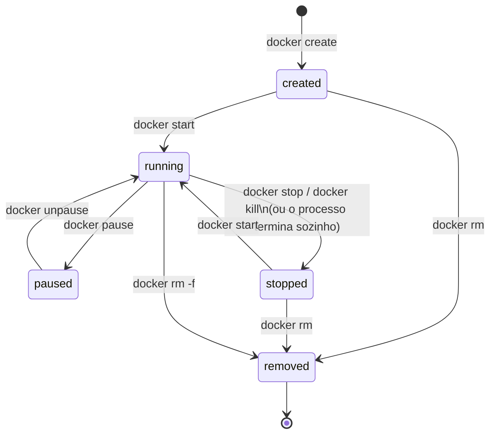

# O ciclo de vida de um container

> [!abstract] TL;DR
> Um container não é uma VM que você "liga" e "desliga" — é um processo com um estado de máquina bem definido, e cada comando do `docker` é uma transição, não uma ação isolada. O container existe enquanto o processo que ele encapsula existe; quando esse processo termina, o container termina junto, porque não há nada mais ali dentro para rodar. Esse processo principal roda como PID 1 do namespace do container, e ser PID 1 muda regras de tratamento de sinal que você provavelmente nunca teve que pensar a respeito rodando fora de um container. É esse detalhe, mais a forma como `docker stop` propaga sinal, que explica por que parar um container às vezes é instantâneo e às vezes demora exatamente dez segundos.

Você roda `docker stop meucontainer` e a resposta demora. Não trava, não dá erro — só demora, quase sempre uns dez segundos cravados, como se houvesse um cronômetro correndo em algum lugar. Em outro container, o mesmo comando volta na hora. A diferença não está no comando: está no que acontece dentro do container entre o pedido de parada e a parada de fato, e é exatamente esse intervalo que esta nota abre.

Essa mesma pergunta aparece disfarçada em outras situações que soam desconectadas à primeira vista: por que um container "trava" ao apertar Ctrl+C num terminal interativo, por que um health check de orquestrador marca um container como travado em `Terminating` por dez segundos antes de forçar, por que `docker ps -a` mostra containers que você jurava ter apagado ainda ocupando espaço em disco. Todas essas perguntas se resolvem com o mesmo modelo: o container é um processo, esse processo tem um lugar específico na árvore de processos do seu próprio namespace, e esse lugar muda como ele reage a pedidos de parada.

## O container como processo, não como máquina

A [[03-Dominios/Tecnologia/Infraestrutura/Docker/02 - A anatomia de uma imagem|nota anterior]] tratou a imagem como artefato imutável — camadas empilhadas, somente leitura. Um container nasce quando o Docker pega essa pilha de camadas, adiciona por cima uma camada de escrita vazia, e usa esse conjunto como filesystem raiz de um processo novo. É só isso. Não há um "container" abstrato rodando ao lado do processo; o container **é** o processo, mais o namespace e o cgroup que o cercam. Não existe container ligado sem processo dentro — a ideia não faz sentido no modelo, do mesmo jeito que não faz sentido perguntar "o quarto está ligado?" quando quem pergunta quer saber se a luz está acesa.

Essa equivalência tem uma consequência direta, e ela pega gente desavisada o tempo todo: se o processo principal do container termina — porque terminou o trabalho, porque crashou, porque alguém matou ele — o container termina junto. Não importa se você tem outros processos rodando dentro (um cron, um processo em background que você disparou com `&`, um shell que você abriu com `docker exec`); nenhum deles sustenta o container. O runtime não está de olho no container como um todo, está de olho num processo específico: o PID 1 do namespace. Quando alguém tenta rodar um container de "servidor" cujo comando principal é um script que faz o setup e sai, e depois se pergunta por que o container morreu sozinho segundos depois de subir, a resposta está aqui: o script terminou, o PID 1 terminou, não havia mais nada para o container ser.

## Os estados e as transições

Pensar em `docker create`, `docker start`, `docker stop`, `docker pause`, `docker rm` como uma lista de comandos independentes é o jeito mais fácil de se confundir. Eles são transições de uma máquina de estados, e cada uma só faz sentido a partir de um estado específico — por isso `docker start` num container que já está rodando não faz nada, e `docker rm` num container rodando dá erro, a menos que você force com `-f`.



`docker create` monta o filesystem, a rede, os volumes — prepara tudo — mas não inicia o processo principal. É um estado pouco usado diretamente (a maioria das pessoas nunca digita `create` sozinho), mas ele existe porque `docker run` é, por baixo, `create` seguido de `start`. Entender isso explica por que `docker run` sempre gera um container novo: ele sempre passa por `created` antes de chegar a `running`, mesmo que você não veja essa etapa.

`running` é o único estado em que o PID 1 está de pé. `paused` é uma curiosidade estrutural mais do que operacional: `docker pause` congela todos os processos do container usando o cgroup freezer do kernel — não manda sinal nenhum, apenas impede que o escalonador dê tempo de CPU a eles. O processo continua existindo, só não executa; por isso `unpause` volta exatamente do ponto onde parou, sem qualquer sinal de retomada. É raro usar isso em produção, mas é comum em debugging pontual, quando você quer congelar o estado de um container sem matá-lo.

`stopped` é onde a maioria dos containers passa a vida entre execuções. Um container parado ainda existe — o filesystem, a camada de escrita, os metadados, tudo continua no disco. Você pode inspecionar ele, ver os logs antigos, e principalmente pode dar `docker start` nele de novo e ele volta com a mesma camada de escrita que tinha antes de parar. Isso é diferente de rodar `docker run` de novo: `run` sempre cria um container novo, com uma camada de escrita nova e vazia; `start` reaproveita o que já existia. Confundir os dois é uma das armadilhas mais comuns de quem está começando — rodar `docker run` repetidamente esperando continuar de onde parou, e se perguntar por que os dados sumiram.

`removed` é terminal. Uma vez removido, o container não volta — o que volta, quando você digita o mesmo `docker run` de novo, é um container novo com o mesmo nome (se você o deu) e a mesma imagem, mas nenhum estado do container anterior.

Note que o diagrama tem só cinco caixas, mas nem toda seta que sai de `running` volta para `running` — algumas vão direto para `removed`, sem passar por `stopped`, quando você usa a flag de força. Isso não é um atalho conceitual: é a máquina de estados reconhecendo que, às vezes, você quer pular a etapa de espera educada e ir direto ao ponto, aceitando o custo de não dar chance nenhuma de cleanup ao processo.

A tabela abaixo resume a mesma máquina de estados do diagrama, mas pelo ângulo de "o que acontece se eu rodar este comando no estado errado" — a pergunta que, na prática, gera a maior parte da confusão de quem está começando:

| Comando | Estado de origem válido | Estado resultante | Rodado no estado errado |
| --- | --- | --- | --- |
| `docker create` | (nenhum — cria do zero) | `created` | Não se aplica; sempre cria um container novo |
| `docker start` | `created` ou `stopped` | `running` | Em `running`: no-op silencioso, nada acontece |
| `docker pause` | `running` | `paused` | Em `stopped` ou `created`: erro, "is not running" |
| `docker unpause` | `paused` | `running` | Em qualquer outro estado: erro, "is not paused" |
| `docker stop` | `running` ou `paused` | `stopped` | Em `stopped`: no-op silencioso |
| `docker kill` | `running` ou `paused` | `stopped` | Em `stopped`: erro, "is not running" |
| `docker rm` | `created` ou `stopped` | `removed` | Em `running`: erro, a menos que use `-f` |
| `docker rm -f` | qualquer estado | `removed` | Sempre funciona — mata primeiro, remove depois |

Esse padrão — comando idempotente quando já está no estado alvo, erro explícito quando está num estado incompatível — não é acidente de implementação. É a mesma disciplina que qualquer máquina de estados bem desenhada segue: transições declaradas, e qualquer coisa fora delas rejeitada ou tratada como não-operação, nunca como comportamento indefinido.

## Observando os estados na prática

O estado não é um conceito abstrato que você precisa deduzir — o Docker expõe ele diretamente, e vale a pena olhar uma vez para os comandos que o revelam antes de seguir para PID 1 e sinal. `docker ps` sozinho só mostra `running`; `docker ps -a` mostra todos os estados, incluindo `created` e `stopped`, na coluna `STATUS`. Um exemplo de sessão inteira, do zero até a remoção:

```bash
$ docker create --name demo alpine sleep 300
a1b2c3d4e5f6...

$ docker ps -a --filter name=demo
CONTAINER ID   IMAGE     STATUS
a1b2c3d4e5f6   alpine    Created

$ docker start demo

$ docker ps --filter name=demo
CONTAINER ID   IMAGE     STATUS
a1b2c3d4e5f6   alpine    Up 2 seconds

$ docker pause demo
$ docker ps -a --filter name=demo
CONTAINER ID   IMAGE     STATUS
a1b2c3d4e5f6   alpine    Up 8 seconds (Paused)

$ docker unpause demo
$ docker stop demo
$ docker ps -a --filter name=demo
CONTAINER ID   IMAGE     STATUS
a1b2c3d4e5f6   alpine    Exited (0) 3 seconds ago

$ docker rm demo
a1b2c3d4e5f6

$ docker ps -a --filter name=demo
CONTAINER ID   IMAGE     STATUS
```

Repare no `Exited (0)` — o número entre parênteses é o código de saída do processo principal, e ele carrega informação de diagnóstico que a coluna `STATUS` sozinha não entrega. `Exited (0)` é saída limpa, o processo terminou porque decidiu terminar. `Exited (137)` é 128 mais o número do sinal SIGKILL (9), quase sempre sinal de que o daemon precisou forçar a parada — o candidato número um para "a aplicação não tratou SIGTERM". `Exited (143)` é 128 mais SIGTERM (15), o processo morreu pelo sinal default sem handler registrado, mas sem precisar do KILL. Ler esse número depois de um `docker ps -a` ou de um `docker inspect` é o primeiro passo de diagnóstico antes de sequer abrir um log — a nota [[03-Dominios/Tecnologia/Infraestrutura/Docker/14 - Debugar um container|14 — Debugar um container]] volta a esse número como parte do roteiro de debugging.

`docker inspect <id>` expõe o mesmo estado de forma estruturada, dentro do campo `State`:

```bash
$ docker inspect --format '{{json .State}}' demo
{"Status":"exited","Running":false,"Paused":false,"Restarting":false,"Pid":0,"ExitCode":0,"StartedAt":"2026-08-02T14:03:11Z","FinishedAt":"2026-08-02T14:03:14Z"}
```

Esse `State.Status` é literalmente o nome do estado da máquina que o diagrama anterior desenha — `created`, `running`, `paused`, `exited` (o Docker chama `stopped` de `exited` internamente) — e é o campo que ferramentas de orquestração e scripts de automação consultam para decidir o que fazer com um container, em vez de tentar adivinhar pelo texto de `docker ps`.

Vale registrar essa troca de nome porque ela confunde quem lê a documentação e o código-fonte lado a lado pela primeira vez: o vocabulário de linha de comando fala em "parar" (`docker stop`, `docker ps -a` mostrando texto "Exited"), mas a API interna e o JSON de `docker inspect` preferem `exited`. São o mesmo estado, com dois rótulos — um voltado para quem digita comando, outro voltado para quem programa contra a API.

Para scripts que precisam esperar um container terminar antes de seguir — um passo de CI, por exemplo, que roda testes num container e precisa do código de saída — existe `docker wait`, que bloqueia até a transição para `stopped` acontecer e devolve exatamente o código de saída:

```bash
$ docker run -d --name testes myimage npm test
$ EXIT_CODE=$(docker wait testes)
$ echo "testes terminaram com código $EXIT_CODE"
```

Isso evita a alternativa frágil de ficar em loop chamando `docker ps` a cada segundo perguntando se o container já parou — `docker wait` é a própria máquina de estados notificando quando a transição para `stopped` acontece, sem polling.

### Health status: uma dimensão que anda junto, mas não é o mesmo eixo

Um container pode declarar, via `HEALTHCHECK` no Dockerfile, um comando que o Docker roda periodicamente para decidir se a aplicação lá dentro está saudável — não só viva. Isso aparece na coluna `STATUS` do `docker ps` como um qualificador extra, entre parênteses, ao lado do estado real: `Up 2 minutes (healthy)`, `Up 30 seconds (health: starting)`, `Up 5 minutes (unhealthy)`. É importante não confundir os dois eixos: `running` contra `stopped` é o estado do processo, que este nota inteira descreve; `healthy` contra `unhealthy` é uma opinião sobre a qualidade daquele processo, formada por um comando de verificação que roda por cima. Um container pode estar `running` e `unhealthy` ao mesmo tempo — o processo está de pé, mas falhando em responder ao healthcheck — e o Docker, por padrão, não faz nada sozinho com essa informação: não reinicia, não remove. `unhealthy` é sinal para quem observa (você, ou um orquestrador por cima do Docker) tomar uma decisão, não uma transição automática da máquina de estados em si.

### Um caso especial de 137: quando quem mata não é você

A tabela de códigos de saída chamou `Exited (137)` de "sinal de que o daemon precisou forçar a parada", mas existe uma segunda origem para o mesmo número que não passa por `docker stop` nem por decisão de nenhum humano: o OOM killer do kernel, agindo sobre o cgroup do container. Se você limitou memória com `--memory 512m` e a aplicação tenta alocar mais do que isso, o kernel — não o Docker — decide matar o processo que estourou o limite, e faz isso com SIGKILL, o mesmo sinal que gera o código 137. `docker inspect` distingue as duas origens no campo `OOMKilled`:

```bash
$ docker inspect --format '{{.State.OOMKilled}}' meucontainer
true
```

`OOMKilled: true` com `ExitCode: 137` conta uma história bem diferente de `OOMKilled: false` com o mesmo 137: a primeira é o container estourando o próprio limite de memória; a segunda é `docker stop` tendo esgotado o prazo e precisado forçar. As duas produzem o mesmo número na coluna `STATUS` do `docker ps -a`, mas exigem diagnósticos opostos — aumentar o limite de memória (ou consertar um vazamento) contra investigar por que a aplicação ignora SIGTERM. É um lembrete de que o código de saída sozinho é pista, não veredito; `docker inspect` é quem fecha a pergunta.

Um uso comum em scripts de manutenção é filtrar diretamente pelo estado, sem depender de olhar a coluna visualmente — `docker ps --filter status=exited -q` devolve só os IDs dos containers parados, pronto para alimentar um `docker rm` em lote; `docker ps --filter status=running -q` faz o inverso, útil para um script que precisa agir só sobre o que está de pé agora. Esses filtros consultam o mesmo `State.Status` que `docker inspect` expõe — é a máquina de estados sendo consultada programaticamente, não texto sendo lido por humano.

## Restart policy: quem decide reentrar em `running`

Até aqui, toda transição para `running` partiu de um comando explícito — `docker start` ou `docker run`. Mas existe uma transição automática que o diagrama de estados não mostra por ser condicional: a restart policy. `docker run --restart=unless-stopped myapp` diz ao daemon "se esse container sair sozinho, sem que eu tenha pedido `docker stop`, volte para `running` sozinho". É o Docker aplicando `stopped → running` por conta própria, sem outro `docker start` — mas só nas condições que a policy define.

```bash
docker run --restart=no myapp              # default: nunca reinicia sozinho
docker run --restart=on-failure:5 myapp    # reinicia só se saiu com erro, até 5 vezes
docker run --restart=unless-stopped myapp  # reinicia sempre, exceto se você pediu docker stop
docker run --restart=always myapp          # reinicia sempre, inclusive depois de reboot do host
```

A diferença entre `always` e `unless-stopped` é sutil e frequentemente mal entendida: `always` reinicia o container mesmo depois de um `docker stop` explícito, se o daemon reiniciar (por exemplo, depois de um reboot do host); `unless-stopped` respeita o `docker stop` como uma decisão que não deve ser desfeita automaticamente, mesmo através de um restart do daemon. Nenhuma das duas policies transforma `removed` em reversível — a política só governa a fronteira entre `running` e `stopped`, nunca a remoção.

### `docker restart`: a transição que parece nova, mas não é

Existe ainda um comando que o diagrama de estados não precisa desenhar como caminho separado, porque ele é literalmente `stop` seguido de `start` no mesmo container, embalado como uma conveniência: `docker restart <id>`. Ele passa por `running → stopped → running`, com a mesma propagação de sinal de um `stop` normal (SIGTERM, espera, SIGKILL se preciso) antes de religar. A diferença para a sequência manual é só operacional — um comando em vez de dois — mas a camada de escrita, o nome, o ID e a configuração de rede do container são os mesmos do início ao fim, porque é o mesmo container passando por duas transições, não um container novo.

Isso deixa três operações parecidas, mas com garantias bem diferentes sobre o que sobrevive:

| Operação | O que preserva | O que é sempre novo |
| --- | --- | --- |
| `docker restart <id>` | Camada de escrita, ID, nome, config de rede | Nada — é o mesmo container, só reiniciado |
| `docker stop` + `docker start <id>` | Camada de escrita, ID, nome, config de rede | Nada — equivalente manual ao `restart` |
| `docker run` (mesma imagem, de novo) | Nenhuma continuidade | Camada de escrita, ID (a menos que force o mesmo nome) |

A confusão mais comum, e já citada nas armadilhas, é tratar a terceira linha como se fosse a primeira — esperar que rodar `docker run` de novo continue de onde um container anterior parou, quando na verdade cada `run` inaugura uma vida nova.

Um jeito rápido de verificar qual das três operações você acabou de fazer, sem depender de memória, é comparar o `CONTAINER ID` antes e depois: se o ID é o mesmo, foi `restart` ou `stop`+`start`; se o ID mudou, foi um `run` novo, e qualquer estado que existia na camada de escrita anterior já não está mais acessível por aquele nome.

## PID 1 e por que ele se comporta diferente

Todo processo Unix tem um PID, e o kernel trata PID 1 de um jeito especial desde sempre — é o processo que, no host, seria o `init` (systemd, ou o que quer que arranque o sistema). Quando o Docker cria o namespace de PID de um container, o primeiro processo que roda ali dentro herda o papel de PID 1 **daquele namespace**, mesmo que no host ele tenha um PID qualquer, alto e sem graça — o `docker top` do exemplo mais adiante mostra exatamente essa dualidade, um processo com dois PIDs simultâneos, um em cada namespace. Essa dualidade é a mesma que o mecanismo de namespace, coberto no domínio de Sistemas Operacionais, descreve em nível de kernel: o namespace de PID cria uma árvore de processos própria, isolada da árvore do host, e quem inaugura essa árvore vira PID 1 dela — sem que isso exija privilégio especial ou configuração explícita, é uma consequência direta de como namespaces de PID funcionam no Linux, a mesma peça que a nota 01 deste galho já citou como o que o Docker acrescenta ao kernel.

E o kernel aplica a PID 1 uma regra que não aplica a nenhum outro processo: sinais que têm um comportamento default definido pelo kernel — como SIGTERM terminar o processo — só disparam esse comportamento default se o processo tiver, ele mesmo, registrado um handler para aquele sinal. Um processo comum que ignora SIGTERM ainda morre com o comportamento default do kernel se não tratar o sinal; PID 1 que ignora SIGTERM simplesmente não morre, porque para PID 1 não existe comportamento default a cair. A tabela a seguir deixa a assimetria explícita para os sinais mais comuns em operação de container:

| Sinal | Comportamento default (processo comum) | Comportamento em PID 1 sem handler | Pode ser capturado / ignorado? |
| --- | --- | --- | --- |
| SIGTERM | Termina o processo | Ignorado — processo continua rodando | Sim |
| SIGINT (Ctrl+C) | Termina o processo | Ignorado — processo continua rodando | Sim |
| SIGHUP | Termina o processo | Ignorado — processo continua rodando | Sim |
| SIGKILL | Termina o processo, sem exceção | Termina o processo, sem exceção — PID 1 não muda isso | Não, nunca |
| SIGSTOP | Suspende o processo | Suspende o processo — também não muda para PID 1 | Não, nunca |

A linha de baixo importa tanto quanto as de cima: SIGKILL e SIGSTOP são os dois sinais que o kernel nunca deixa nenhum processo capturar, ignorar ou tratar — nem PID 1 escapa deles. É por isso que `docker kill` (que manda SIGKILL) sempre funciona, não importa o quão mal-comportada seja a aplicação lá dentro; é o único sinal que a regra especial de PID 1 não consegue neutralizar.

Isso não é um detalhe de trivia de sistemas operacionais — é o motivo pelo qual a aplicação dentro do seu container **precisa** tratar SIGTERM explicitamente para desligar direito, mesmo que a mesma aplicação, rodando fora de um container, morresse de bandeja com o SIGTERM default do kernel. Rodar como PID 1 é uma responsabilidade extra que a maioria dos frameworks e runtimes não foi desenhada pensando em assumir, porque historicamente quase nada rodava como PID 1 além do próprio `init` do sistema.

Na prática, isso significa registrar um handler de sinal na própria aplicação. Dois exemplos, em linguagens diferentes, do mesmo gesto:

```javascript
// Node.js
process.on('SIGTERM', async () => {
    console.log('recebido SIGTERM, encerrando conexões...');
    await server.close();
    await db.disconnect();
    process.exit(0);
});
```

```python
# Python
import signal
import sys

def handle_sigterm(signum, frame):
    print("recebido SIGTERM, encerrando conexões...")
    cleanup()
    sys.exit(0)

signal.signal(signal.SIGTERM, handle_sigterm)
```

Sem esse handler, o mesmo processo — rodando como PID 1 dentro de um container — simplesmente ignora o sinal, porque não há comportamento default de kernel a que ele possa recorrer. É esse mesmo gesto, generalizado para qualquer linguagem e runtime, que a nota 08 vai colocar lado a lado com a forma exec do Dockerfile: registrar o handler não adianta nada se o sinal nunca chega ao processo que o registrou.

## A propagação de sinal e os dez segundos de `docker stop`

`docker stop` não é `docker kill`. `kill` manda SIGKILL direto — o processo morre imediatamente, sem chance de fazer nada, porque SIGKILL não pode ser capturado, ignorado nem tratado por ninguém, nem por PID 1. `stop`, em vez disso, tenta ser educado: primeiro manda SIGTERM (ou o sinal configurado em `STOPSIGNAL`, se o Dockerfile definiu um diferente) para o PID 1, e espera. Se o processo sair sozinho dentro do prazo, ótimo, `stop` termina ali. Se o prazo estourar e o processo ainda estiver de pé, **aí sim** o daemon manda SIGKILL, e o processo morre na marra, sem chance de terminar o que estava fazendo.

Esse prazo é configurável (`docker stop --time=30 <id>`, por exemplo), mas o default histórico é dez segundos — e é exatamente esse valor que você está sentindo quando `docker stop` "demora". Não é o comando que é lento: é a sua aplicação que está ignorando o SIGTERM (ou nem chegou a recebê-lo, se ela não é PID 1 e ninguém propagou o sinal para ela — mas essa é uma variante que a nota 08 disseca em detalhe), o Docker esperando o prazo inteiro de boa fé, e só então usando a força. Um container cuja aplicação trata SIGTERM corretamente — fecha conexões, esvazia filas, sai — para em milissegundos. Um container cuja aplicação ignora o sinal sempre vai pagar o prazo cheio, porque não existe outro jeito honesto de o Docker saber que "terminar agora" é seguro.

> [!info] Baseline de versão
> O prazo default de dez segundos entre SIGTERM e SIGKILL é estável há muitas versões do Docker Engine e não depende de BuildKit nem de configuração de daemon incomum; é seguro tratá-lo como comportamento padrão. `STOPSIGNAL` no Dockerfile e `--signal` no `docker kill` permitem trocar qual sinal é enviado primeiro, mas o mecanismo de espera-e-depois-força continua o mesmo.

Vale notar que `docker kill` também aceita um sinal diferente de SIGKILL — `docker kill --signal=SIGHUP <id>`, por exemplo, é uma forma de mandar um sinal arbitrário para o PID 1 sem necessariamente querer terminar o processo. Algumas aplicações usam SIGHUP como pedido de "recarregue sua configuração" em vez de "termine"; isso só funciona se a aplicação registrou um handler para SIGHUP também, seguindo exatamente a mesma regra de PID 1 explicada acima. `docker kill` sem `--signal` continua sendo o atalho direto para SIGKILL — sem espera, sem chance de cleanup.

Para observar a propagação de sinal e as transições de estado acontecendo em tempo real, sem precisar ficar rodando `docker ps -a` repetidamente, existe `docker events`:

```bash
$ docker events --filter container=demo &
$ docker stop demo
2026-08-02T14:10:02Z container die   demo (exitCode=0)
2026-08-02T14:10:02Z container stop demo
```

O evento `die` carrega o `exitCode` — o mesmo número que aparece em `Exited (N)` no `docker ps -a` — e chega antes do evento `stop`, porque o processo já morreu no momento em que o daemon confirma a transição de estado. É essa mesma fonte de eventos que ferramentas de observabilidade e orquestradores consomem para reagir a containers que caem sem intervenção humana.

A linha do tempo de um `docker stop` típico, com a aplicação tratando o sinal corretamente contra uma que ignora, fica mais clara lado a lado:

```mermaid
graph TB
    subgraph "Aplicação trata SIGTERM"
        A1["t=0s: docker stop"] --> A2["SIGTERM entregue ao PID 1"]
        A2 --> A3["handler roda: fecha conexões, flush"]
        A3 --> A4["t=0.3s: processo sai (exit 0)"]
        A4 --> A5["container em stopped"]
    end
    subgraph "Aplicação ignora SIGTERM"
        B1["t=0s: docker stop"] --> B2["SIGTERM entregue ao PID 1"]
        B2 --> B3["sem handler — sinal sem efeito"]
        B3 --> B4["t=10s: prazo esgota"]
        B4 --> B5["daemon manda SIGKILL"]
        B5 --> B6["t=10s: processo morre (exit 137)"]
        B6 --> B7["container em stopped"]
    end
```



O primeiro fluxo termina em frações de segundo; o segundo sempre paga o prazo inteiro, porque o Docker não tem como saber, de fora, que "terminar agora" é seguro — ele só sabe que mandou o pedido educado e não recebeu confirmação de saída. A diferença entre os dois fluxos nunca está no comando `docker stop`: está inteiramente em o que a aplicação faz (ou deixa de fazer) entre a segunda e a terceira caixa de cada fluxo.

## Limpeza do ciclo de vida: o que sobra em `stopped`

Uma consequência prática de containers parados continuarem existindo em disco é que eles se acumulam. Cada `docker run` que termina sem `--rm` deixa um container em `stopped`, ocupando espaço com sua camada de escrita e seus metadados, até alguém remover explicitamente. Em máquinas de desenvolvimento e em pipelines de CI que rodam `docker run` com frequência, isso vira um acúmulo silencioso que só aparece quando o disco enche.

Duas ferramentas atacam isso de ângulos diferentes. A primeira é preventiva: `--rm` no `docker run` faz o container pular direto de `stopped` para `removed` assim que sai, sem intervenção manual — apropriado para containers efêmeros, como um comando único de debug ou um passo de CI que não precisa ser inspecionado depois.

```bash
docker run --rm alpine echo "não deixa vestígio"
```

A segunda é reativa, para o que já acumulou: `docker container prune` remove todos os containers atualmente em `stopped`, de uma vez.

```bash
$ docker container prune
WARNING! This will remove all stopped containers.
Are you sure you want to continue? [y/N] y
Deleted Containers:
a1b2c3d4e5f6...
f6e5d4c3b2a1...
Total reclaimed space: 128MB
```

Nenhum dos dois comandos toca em containers `running` ou `paused` — a máquina de estados continua sendo respeitada, `prune` só age sobre o que já chegou ao estado terminal-mas-não-removido. É uma limpeza de disco, não uma transição forçada.

## stdout/stderr como o contrato de log

Uma decisão de design que passa despercebida até você precisar dela: um container bem-comportado não escreve arquivo de log. Ele escreve na saída padrão (`stdout`) e na saída de erro (`stderr`), e é o runtime — o Docker, por meio do driver de logging configurado — quem lê esses fluxos e decide o que fazer com eles: gravar em disco, mandar para um coletor central, descartar. `docker logs <id>` não está abrindo um arquivo dentro do container; está lendo o buffer que o daemon já vinha capturando desde que o processo começou a escrever.

Essa convenção existe porque um container é, por design, descartável — a nota 06 aprofunda por que os dados dentro dele não sobrevivem à remoção — e um log gravado só em arquivo dentro de um container que pode desaparecer a qualquer momento é um log que desaparece junto. Tratar `stdout`/`stderr` como o canal oficial desacopla a aplicação de onde o log realmente vai parar: hoje pode ser o terminal de quem rodou `docker logs -f`, amanhã pode ser um agregador central, e a aplicação não precisa saber disso nem mudar uma linha de código para isso acontecer. É o mesmo raciocínio por trás de doze-fatores tratando logs como fluxo de eventos, aplicado dentro do container.

Isso também explica por que aplicações que insistem em escrever para arquivo dentro do container são um cheiro de design: elas estão desperdiçando exatamente o mecanismo que o runtime oferece de graça, e forçando quem opera a entrar no container (ou montar um volume) só para ver o que já estaria disponível via `docker logs`.

O driver de logging é configurável, e essa configurabilidade é justamente a prova de que `stdout`/`stderr` é um contrato, não uma implementação fixa. O default é `json-file`, que grava cada linha como um objeto JSON num arquivo no host — fora do container, então sobrevive à remoção dele, mas ainda precisa de rotação manual ou configurada, sob risco de crescer sem limite:

```bash
docker run --log-driver json-file --log-opt max-size=10m --log-opt max-file=3 myapp
```

Trocar o driver não muda nada do lado da aplicação — ela continua só escrevendo em `stdout`/`stderr`, sem saber nem se importar com o destino final:

```bash
docker run --log-driver=journald myapp     # integra com o journal do systemd do host
docker run --log-driver=syslog myapp       # manda para um syslog remoto
docker run --log-driver=none myapp         # descarta — docker logs não retorna nada
```

Essa troca ser transparente para a aplicação é o próprio ponto da nota: o contrato de log não é "escreva num destino combinado", é "escreva no fluxo padrão e deixe o runtime decidir o destino". Uma aplicação que grava direto num arquivo específico, ou que fala diretamente com um agregador de logs por conta própria, está furando esse contrato e assumindo uma responsabilidade que deveria ser do runtime.

## Exemplo trabalhado: um deploy inteiro pelo prisma dos estados

Para amarrar tudo o que esta nota cobriu, vale seguir uma sequência realista de operação, nomeando explicitamente qual transição cada comando dispara. Considere uma API simples sendo colocada no ar, atualizada, e depois desligada de propósito para manutenção.

```bash
# 1. Sobe a versão atual — create + start numa tacada só
$ docker run -d --name api --restart=unless-stopped -p 8080:8080 myapi:1.0
# transição: (nenhum) -> created -> running

# 2. Confirma que está de pé e olha o PID 1 dentro do namespace
$ docker top api
UID   PID    PPID   CMD
1000  4821   4803   node server.js
# esse "node server.js" é o PID 1 do namespace do container,
# mesmo tendo PID 4821 do lado de fora, no host

# 3. Acompanha os logs (stdout/stderr, não arquivo)
$ docker logs -f api
Server listening on :8080

# 4. Chega uma nova versão da imagem. Não existe "atualizar o container":
#    o container antigo precisa parar e sair, um novo precisa nascer.
$ docker stop api
# transição: running -> stopped (SIGTERM, espera, SIGKILL só se preciso)

$ docker rm api
# transição: stopped -> removed

$ docker run -d --name api --restart=unless-stopped -p 8080:8080 myapi:1.1
# transição: (nenhum) -> created -> running, container novo, camada de escrita nova

# 5. Manutenção planejada: parar sem que a restart policy traga de volta
$ docker stop api
# unless-stopped respeita esse stop -- não volta sozinho, nem depois
# de um restart do daemon, até alguém dar docker start de novo
```

Repare também que o passo 2 usa `docker top`, não `docker exec ... ps`: `top` consulta o processo de fora, sem precisar de um shell instalado dentro do container, o que funciona mesmo em imagens mínimas que não têm `sh` nem `ps` — um detalhe pequeno que a nota 09, sobre imagens mínimas, vai retomar quando discutir o que uma imagem distroless ou scratch efetivamente não tem lá dentro.

O passo 4 é o que mais surpreende quem vem de outros modelos de deploy: não existe comando que "atualize a imagem de um container em execução". A imagem é imutável — a nota 02 já estabeleceu isso — então atualizar significa sempre passar por `stopped` e `removed` para o container antigo, e por `created`/`running` para um container novo apontando para a imagem nova. Ferramentas de orquestração (Compose, Kubernetes, ECS) automatizam exatamente essa sequência de quatro transições por trás de um único comando de "deploy", mas a máquina de estados por baixo é sempre esta.

Vale comparar esse modelo com o que a nota 01 estabeleceu sobre VM contra container: reiniciar uma VM tipicamente preserva o disco e o sistema operacional inteiro rodando por baixo, então "reboot" é uma operação suave sobre um sistema que continua o mesmo. Reiniciar um container com `docker restart` também preserva a camada de escrita — mas `docker rm` seguido de `docker run` não preserva nada, porque não há "sistema operacional persistente" para preservar, só a imagem imutável e uma camada de escrita descartável. É a mesma diferença de modelo que a nota 01 abriu, aparecendo agora como diferença de operação.

E se a versão 1.1 se revelar quebrada depois de subir, o rollback segue exatamente a mesma máquina de estados, só que na direção contrária — não existe um comando "desfazer deploy" separado, existe repetir a sequência com a tag antiga:

```bash
$ docker stop api
$ docker rm api
$ docker run -d --name api --restart=unless-stopped -p 8080:8080 myapi:1.0
```

Isso só é possível, sem drama, porque a imagem `myapi:1.0` continua existindo, intacta, em algum lugar do disco ou do registry — a imutabilidade que a nota 02 estabeleceu é o que torna rollback uma operação trivial de "rode a tag de antes" em vez de uma reconstrução de estado perdido. Um sistema em que containers guardassem estado mutável relevante para a aplicação tornaria esse rollback muito mais arriscado; é justamente porque o container é descartável que voltar atrás é barato.

## `docker attach` contra `docker exec`: dois jeitos de tocar o mesmo container

Vale fechar o modelo de processo com uma distinção que confunde quem vem de outras ferramentas: `docker attach` e `docker exec` parecem fazer a mesma coisa — colocar você "dentro" do container — mas operam em níveis diferentes da árvore de processos. `docker attach <id>` conecta seu terminal aos streams de `stdin`/`stdout`/`stderr` do PID 1 que já está rodando; você não cria processo nenhum, só passa a ver (e opcionalmente escrever para) o que o processo principal já estava produzindo. Sair de um `attach` com Ctrl+C, sem cuidado, pode inclusive mandar SIGINT para o PID 1 e derrubar o container — outra armadilha de quem espera que attach se comporte como uma sessão SSH.

`docker exec -it <id> sh`, em contraste, cria um processo novo dentro dos mesmos namespaces do container — mesmo filesystem, mesma rede, mesmo hostname — mas como um processo irmão do PID 1, não uma janela para ele. Esse processo novo tem seu próprio PID (2, 3, ou o que estiver livre) dentro daquele namespace, e sair dele com `exit` não afeta o PID 1 nem o container em si, exatamente porque, como a nota já estabeleceu, só o PID 1 sustenta o ciclo de vida do container. É por isso que `docker exec` é a ferramenta de debug do dia a dia — entrar, olhar, sair, sem risco de derrubar nada — enquanto `attach` serve para o caso mais raro de precisar ver exatamente o que o processo principal está emitindo, sem passar por `docker logs`.

## Duas perguntas que esta nota deixa em aberto de propósito

Duas coisas ficaram faltando aqui, e é intencional. A primeira: por que existe uma diferença entre escrever `CMD node server.js` e `CMD ["node", "server.js"]` no Dockerfile, e por que essa diferença de sintaxe decide se o SIGTERM chega ou não ao processo da sua aplicação — o exemplo de handler de sinal desta nota supõe que o sinal chegou até o processo certo, e nem sempre chega. A segunda: o que acontece quando o PID 1 do container gera processos filhos e morre sem esperar por eles — o processo zumbi que ninguém colhe, porque normalmente é o `init` do sistema (systemd, no host) quem faz esse trabalho de faxina, e PID 1 dentro de um container raramente foi escrito pensando em assumir esse papel. As duas perguntas têm a mesma raiz que a propagação de sinal explicada aqui, e a nota [[03-Dominios/Tecnologia/Infraestrutura/Docker/08 - ENTRYPOINT, CMD e o container que não morre direito|08 — ENTRYPOINT, CMD e o container que não morre direito]] fecha esse arco inteiro, forma exec contra forma shell e o zumbi juntos, como uma coisa só — inclusive com a solução prática (`--init`) que resolve as duas ao mesmo tempo.

## Por que este modelo importa fora do laptop de desenvolvimento

Tudo o que esta nota cobriu — estados, PID 1, propagação de sinal, o contrato de log — parece detalhe de implementação até o momento em que um deploy em produção precisa dele para não perder requisição nenhuma. Um rolling deploy que troca containers antigos por novos depende inteiramente de o container antigo receber SIGTERM, terminar as requisições em voo, e só então sair — se a aplicação ignora o sinal, o orquestrador espera o prazo cheio (ou o equivalente dele) antes de forçar, e nesse intervalo requisições podem ser perdidas ou, pior, o container pode ser morto no meio de uma escrita. A nota [[03-Dominios/Engenharia/Operação/3 - Rodar em produção/01 - Containers em produção|Containers em produção]] assume, com todas as letras, que quem chega lá já sabe que um container é um processo com um ciclo de vida previsível — é essa suposição, e não mágica de operação, que sustenta zero-downtime deploy, health check de orquestrador e graceful shutdown coordenado em escala. O modelo é o mesmo daqui; só a disciplina em torno dele fica mais rígida.

## Armadilhas comuns

> [!warning] Achar que `docker run` continua de onde `docker stop` parou
> `docker run` sempre cria um container novo — camada de escrita nova, estado novo. Quem continua de onde parou é `docker start` no mesmo container. Confundir os dois leva a "sumiço" de dados que na verdade nunca existiram naquele container, porque cada `run` é uma vida nova.

> [!warning] Supor que qualquer processo dentro do container sustenta o container
> Só o PID 1 importa para o ciclo de vida. Um processo em background disparado manualmente com `&`, ou uma sessão aberta com `docker exec`, não impede o container de morrer quando o processo principal termina — e não faz o container continuar vivo se você tentar usá-lo como âncora.

> [!warning] Achar que `docker stop` está travado quando na verdade está esperando
> Se `docker stop` sempre demora o prazo inteiro (dez segundos por default) num container específico, o problema quase certamente é a aplicação ignorando SIGTERM, não o Docker. Aumentar o prazo com `--time` só adia o sintoma; tratar o sinal na aplicação resolve a causa.

> [!warning] Escrever log em arquivo dentro do container achando que é mais confiável
> Um arquivo dentro do container está sujeito ao mesmo destino do container: some quando o container é removido, a menos que esteja num volume. `stdout`/`stderr` é o canal que o runtime já observa e persiste por fora, de graça — é o caminho mais robusto por padrão, não o mais simples de improvisar.

> [!warning] Confundir `always` com `unless-stopped` na restart policy
> `always` reinicia o container mesmo depois de um `docker stop` explícito, se o daemon reiniciar; `unless-stopped` respeita a decisão humana de parar e não a desfaz sozinho. Escolher a policy errada produz ou um container que "volta sozinho" depois que alguém o parou de propósito, ou um que não volta depois de um reboot esperado do host.

> [!warning] Achar que `docker attach` é uma sessão segura como `docker exec`
> Sair de um `docker attach` com o atalho errado pode propagar o sinal para o PID 1 e derrubar o container inteiro, porque attach conecta você diretamente aos streams do processo principal, não abre um processo novo. Para debug do dia a dia, `docker exec -it <id> sh` é a ferramenta certa — cria um processo irmão, sem risco para o ciclo de vida do container.

> [!warning] Tratar todo `Exited (137)` como aplicação ignorando SIGTERM
> O mesmo código de saída aparece tanto quando `docker stop` esgota o prazo e força SIGKILL quanto quando o OOM killer do kernel mata o processo por estourar o limite de memória do cgroup. Sem checar `docker inspect --format '{{.State.OOMKilled}}'`, é fácil investigar o diagnóstico errado — tratar sinal quando o problema real é memória insuficiente, ou vice-versa.

## Como explicar em inglês

*A container's lifecycle is a state machine, not a list of commands: it moves from created to running to stopped to removed, and each Docker command is a transition, not an isolated action. The container's main process runs as PID 1 of its own namespace, which changes how the kernel handles signals it receives — a detail that explains why `docker stop` sometimes returns instantly and sometimes waits out its full grace period before escalating to a hard kill.*

| PT-BR | EN | Nuance de uso |
| --- | --- | --- |
| ciclo de vida do container | container lifecycle | Em inglês técnico, "lifecycle" já carrega a ideia de estados e transições — não precisa dizer "state machine" toda vez, o termo sozinho já implica isso para quem trabalha com containers. |
| processo principal | main process / entrypoint process | "Entrypoint process" é mais preciso quando você quer amarrar à instrução `ENTRYPOINT` do Dockerfile; "main process" é o termo genérico que qualquer engenheiro entende sem contexto de Docker. |
| sinal | signal | Em frases como "the container doesn't handle the signal", o artigo definido importa — "a signal" soa como um sinal qualquer, "the signal" amarra ao SIGTERM específico que acabou de ser mencionado. |
| desligamento gracioso | graceful shutdown | Termo fixo, quase sempre nessa ordem exata; dizer "gentle shutdown" ou "smooth shutdown" soa estranho para quem já conhece o jargão, mesmo sendo compreensível. |
| container travado (parando) | container hanging (on stop) | "Hanging" é a palavra que engenheiros usam quando algo devia responder rápido e não responde — não confundir com "frozen", que sugere um travamento definitivo, não uma espera com prazo. |
| matar o processo na marra | hard-kill the process | "Hard kill" comunica em duas palavras que não houve chance de cleanup — equivalente direto ao SIGKILL, sem precisar explicar o sinal para uma audiência não técnica. |
| container efêmero (sem `--rm`) | dangling / stopped container | "Dangling" é o termo que a comunidade usa tanto para containers parados acumulados quanto para imagens sem tag — vale desambiguar com "stopped container" se a audiência não for fluente no jargão. |
| reiniciar o mesmo container | restart the container | Distinto de "recreate the container", que implica remover e criar de novo; usar "restart" errado onde o processo real foi recriar é um erro comum que engenheiros nativos notam na hora. |

Vale reter o fio que amarra as duas perguntas em aberto: ambas são casos em que o modelo de "container é processo, PID 1 é especial" produz uma consequência que o senso comum de quem vem de VM ou de scripts soltos não prevê. A nota 08 não introduz conceito novo — ela aplica, com mais precisão cirúrgica, exatamente o vocabulário de estado, sinal e PID 1 que esta nota acabou de construir.

## O que vem a seguir

Esta nota tratou o container como processo — o que o mantém vivo, o que o mata, como ele reage a sinal. A próxima nota, [[03-Dominios/Tecnologia/Infraestrutura/Docker/04 - O Dockerfile como receita de camadas|04 — O Dockerfile como receita de camadas]], volta um passo, para antes de o container sequer existir, e olha para o Dockerfile como o documento que decide, camada por camada, o que essa imagem vai carregar quando alguém finalmente rodar `docker run` nela. O vocabulário de camada que a nota 02 estabeleceu — imutabilidade, união de sistemas de arquivos — ganha ali um segundo uso: cada instrução do Dockerfile é lida pela pergunta "isto cria camada ou só ajusta metadado?", e é essa pergunta que organiza a nota 04 inteira. Para o mapa completo do galho, o [[03-Dominios/Tecnologia/Infraestrutura/Docker/index|índice de Docker]] continua a referência de onde cada peça se encaixa.

## Fontes

- [Docker docs — Container lifecycle](https://docs.docker.com/engine/reference/commandline/container/)
- [Docker docs — `docker stop`](https://docs.docker.com/reference/cli/docker/container/stop/)
- [Docker docs — `docker kill`](https://docs.docker.com/reference/cli/docker/container/kill/)
- [Docker docs — `docker events`](https://docs.docker.com/reference/cli/docker/system/events/)
- [Docker docs — Restart policies](https://docs.docker.com/engine/containers/start-containers-automatically/)
- [Docker docs — Configure the default logging driver](https://docs.docker.com/engine/logging/configure/)
- [Docker docs — View logs for a container or service](https://docs.docker.com/engine/logging/)
- [man7.org — signal(7), seção sobre PID 1 e namespaces](https://man7.org/linux/man-pages/man7/signal.7.html)
- [Docker docs — `docker inspect`](https://docs.docker.com/reference/cli/docker/inspect/)
- [Docker docs — Runtime options with Memory, CPUs, and GPUs (OOM killer)](https://docs.docker.com/engine/containers/resource_constraints/)
- [Docker docs — `docker wait`](https://docs.docker.com/reference/cli/docker/container/wait/)
- [Docker docs — Prune unused Docker objects](https://docs.docker.com/engine/manage-resources/pruning/)
