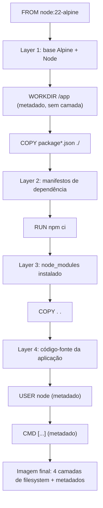

# O Dockerfile como receita de camadas

> [!abstract] TL;DR
> Um Dockerfile não é um script de instalação lido de cima para baixo — é uma declaração de camadas, e cada linha precisa ser lida pela pergunta "isto cria uma camada nova ou só ajusta um metadado?". `RUN`, `COPY` e `ADD` criam camada, gravam bytes novos na pilha imutável que a nota 02 descreveu; `ENV`, `WORKDIR`, `LABEL`, `EXPOSE`, `USER`, `CMD` e `ENTRYPOINT` só anotam configuração que viaja junto com a imagem, sem adicionar filesystem. A ordem em que essas instruções aparecem não é estilo de código, é decisão de arquitetura, porque cada camada é imutável e depende inteiramente do que veio antes dela — mudar uma linha no meio invalida tudo que vem depois. E existe uma armadilha clássica escondida nessa mecânica: separar `apt-get update` de `apt-get install` em camadas diferentes produz, mais cedo ou mais tarde, uma instalação de pacotes obsoleta, porque a lista de pacotes disponíveis fica presa numa camada congelada no tempo.

Um time separa `RUN apt-get update` numa linha e `RUN apt-get install -y curl` na linha seguinte, porque parece mais legível — um comando por linha, um comentário para cada um. O build funciona, a imagem sobe, tudo certo. Três meses depois, alguém adiciona `RUN apt-get install -y jq` numa terceira linha, sem tocar nas duas primeiras, porque "só está adicionando um pacote". O build usa cache para as duas primeiras linhas — não mudaram, então o Docker nem tenta reexecutá-las — e a terceira linha instala `jq` usando uma lista de pacotes que pode ter meses de idade, potencialmente com uma versão que já não existe mais no repositório, ou puxando dependências desatualizadas em silêncio. Ninguém alterou uma vírgula do `apt-get update`, e ainda assim o comportamento do build mudou com o tempo, de um jeito que só aparece quando o build falha, ou pior, quando não falha e só entrega algo sutilmente errado. Entender por que isso acontece exige entender o que cada instrução do Dockerfile realmente faz com o filesystem da imagem — e é exatamente essa pergunta que organiza esta nota inteira.

Essa armadilha é um sintoma de um mal-entendido maior, o mesmo que persegue o galho inteiro desde a primeira nota: tratar o Dockerfile como se fosse um script de shell qualquer, executado de cima para baixo, quando na verdade cada linha é uma instrução para construir uma camada imutável nova em cima da anterior — ou, no caso das instruções de metadado, uma anotação que viaja junto sem gerar camada nenhuma. Um script de shell comum não tem esse conceito de "cada linha congela um estado que a próxima linha nunca mais revisita"; um Dockerfile tem, e ignorar isso é a origem de quase toda armadilha de Dockerfile que existe, não só a do `apt-get`.

## A pergunta que organiza tudo: isto cria camada?

A [[03-Dominios/Tecnologia/Infraestrutura/Docker/03 - O ciclo de vida de um container|nota anterior]] tratou o container como processo efêmero; esta volta para antes de qualquer processo existir, para o documento que decide o que vai estar disponível quando ele nascer. A [[03-Dominios/Tecnologia/Infraestrutura/Docker/02 - A anatomia de uma imagem|nota 02]] já estabeleceu que uma imagem é uma pilha de camadas somente leitura, cada uma imutável, empilhadas por um union filesystem. O Dockerfile é o roteiro que gera essa pilha, instrução por instrução — mas nem toda instrução gera uma camada nova. Algumas de fato gravam bytes no filesystem da imagem; outras só ajustam metadados que o Docker guarda junto com a imagem, sem tocar em disco.

Essa distinção é o filtro que deveria passar por cima de qualquer instrução do Dockerfile antes de você decidir onde colocá-la:

| Instrução | Cria camada? | O que faz de fato |
| --- | --- | --- |
| `FROM` | Sim (herda as camadas da imagem base) | Define o ponto de partida — todas as camadas da imagem base entram na pilha |
| `RUN` | Sim | Executa um comando no filesystem da imagem e grava o resultado como camada nova |
| `COPY` | Sim | Copia arquivos do contexto de build para dentro da imagem, como camada nova |
| `ADD` | Sim | Como `COPY`, mas também extrai tar e busca URLs — mais poder, mais risco |
| `ENV` | Não | Define variável de ambiente nos metadados; visível para `RUN` seguintes e para o container em runtime |
| `ARG` | Não | Variável só disponível durante o build, não persiste na imagem final |
| `WORKDIR` | Não (mas cria o diretório se faltar) | Ajusta o diretório de trabalho default para instruções seguintes e para o container |
| `LABEL` | Não | Anota metadado arbitrário chave-valor na imagem |
| `EXPOSE` | Não | Documenta qual porta a aplicação escuta — não publica nada sozinho |
| `USER` | Não | Ajusta qual usuário roda as instruções seguintes e o processo principal do container |
| `CMD` | Não | Define o comando default, ou argumentos default para `ENTRYPOINT` |
| `ENTRYPOINT` | Não | Define o comando principal do container, difícil de sobrescrever |
| `VOLUME` | Não | Marca um ponto de montagem, sinaliza que aquele diretório deve ser externo |
| `STOPSIGNAL` | Não | Define qual sinal `docker stop` manda primeiro |

A régua é simples de aplicar retroativamente: se a instrução manipula arquivos — grava, copia, extrai — ela cria camada. Se a instrução só diz ao Docker "lembre-se disto" ou "rode as próximas coisas assim", ela é metadado. `FROM` é o caso especial: não cria uma camada nova por si só, mas importa a pilha inteira da imagem base como ponto de partida — é por isso que toda imagem Docker, sem exceção, tem uma cadeia de ancestrais até chegar a alguma imagem que parte de zero bytes.

### Verificando a régua na prática com `docker history`

A régua acima não precisa ficar só na teoria — o Docker expõe exatamente quais instruções produziram camada, com o tamanho de cada uma, através de `docker history`. Para um Dockerfile simples:

```dockerfile
FROM alpine:3.20
LABEL maintainer="time-plataforma"
ENV APP_HOME=/app
WORKDIR /app
COPY app.sh .
RUN chmod +x app.sh
USER nobody
CMD ["./app.sh"]
```

Depois de `docker build -t exemplo .`, `docker history exemplo` mostra:

```bash
$ docker history exemplo
IMAGE          CREATED BY                                      SIZE
a1b2c3d4e5f6   CMD ["./app.sh"]                                0B
<missing>      USER nobody                                     0B
<missing>      RUN chmod +x app.sh                             12B
<missing>      COPY app.sh .                                   45B
<missing>      WORKDIR /app                                    0B
<missing>      ENV APP_HOME=/app                                0B
<missing>      LABEL maintainer=time-plataforma                0B
<missing>      /bin/sh -c #(nop) ADD file:... in /              7.38MB
```

Repare no padrão: `LABEL`, `ENV`, `WORKDIR`, `USER` e `CMD` aparecem na lista de histórico — porque o Docker registra toda instrução como um passo, para fins de proveniência e auditoria — mas todos com `SIZE` igual a `0B`. `COPY` e `RUN` são as únicas linhas com tamanho diferente de zero, exatamente as que gravaram bytes novos no filesystem. A linha final, do `FROM alpine:3.20`, aparece como a instrução implícita que trouxe a imagem base inteira, com o peso real da distribuição Alpine. Esse comando é a forma mais direta de confirmar, para qualquer Dockerfile específico, que a régua "cria camada ou só metadado" não é teoria abstrata — é o que o próprio Docker relata sobre o próprio trabalho que fez.

## RUN: a instrução que mais gera camada, e o cuidado que ela exige

`RUN` executa um comando dentro do contexto de build e grava qualquer diferença no filesystem resultante como camada nova. Cada `RUN` separado é uma camada separada — e é exatamente aqui que mora a armadilha da abertura desta nota.

```dockerfile
# Duas camadas separadas — a armadilha
FROM ubuntu:24.04
RUN apt-get update
RUN apt-get install -y curl
```

O `apt-get update` baixa e grava, na camada dele, o índice de pacotes disponíveis naquele momento — uma lista de nomes, versões e URLs de download. O `apt-get install` roda numa camada seguinte, separada, e consulta esse índice para decidir o que baixar. Se o Docker reutiliza a camada do `update` do cache (porque nada antes dela mudou), o índice consultado pelo `install` seguinte pode ter dias, semanas ou meses de idade, mesmo que o `install` em si tenha uma linha nova adicionando um pacote. O índice congelado não reflete o estado atual do repositório — pacotes podem ter sido removidos, atualizados por segurança, ou renomeados, e o build continua confiando cegamente numa fotografia antiga.

```dockerfile
# Uma camada só — update e install vivem ou morrem juntos
FROM ubuntu:24.04
RUN apt-get update && apt-get install -y curl jq \
    && rm -rf /var/lib/apt/lists/*
```

Encadear os dois comandos com `&&` numa única instrução `RUN` garante que os dois rodem sempre juntos, na mesma camada — não existe cache parcial possível entre eles, porque não existe mais fronteira de camada os separando. Toda vez que o cache invalida essa linha (porque algo antes dela mudou, ou porque o build rodou com `--no-cache`), o `update` roda de novo, o índice fica fresco, e o `install` sempre trabalha sobre dados atuais. O `rm -rf /var/lib/apt/lists/*` no fim é bônus: sem ele, o índice baixado fica gravado na camada final, ocupando espaço para sempre — lembrando que uma camada, uma vez escrita, é imutável, e apagar o arquivo numa instrução seguinte não encolhe a camada anterior, só marca o arquivo como removido na camada de cima. É a mesma lição da nota 02 sobre a diferença entre remover algo e ele efetivamente sumir do peso da imagem.

## COPY: a instrução mais comum, e por que a ordem dela é a alma do cache

`COPY` pega arquivos do contexto de build — o diretório que você passa como argumento final de `docker build` — e grava eles como camada nova dentro da imagem. É a instrução que a maioria dos Dockerfiles usa mais, porque é como o código da sua aplicação entra na imagem.

```dockerfile
FROM node:22-alpine
WORKDIR /app
COPY package.json package-lock.json ./
RUN npm ci
COPY . .
CMD ["node", "server.js"]
```

Repare na separação deliberada entre os dois `COPY`. O primeiro só traz os arquivos de manifesto de dependência — `package.json` e o lockfile — e o `RUN npm ci` seguinte instala essas dependências numa camada que só muda quando o manifesto muda. O segundo `COPY . .` traz o resto do código-fonte, que muda a cada commit, numa camada separada, depois da instalação. Se você inverter essa ordem — copiar tudo primeiro, instalar depois — qualquer mudança em qualquer arquivo do projeto (inclusive um `README.md`) invalida a camada do `COPY` e, em cascata, invalida a camada do `RUN npm ci` que vem depois, forçando reinstalação completa das dependências toda vez, mesmo que nenhuma dependência tenha mudado. A nota 05 disseca esse mecanismo de cascata em profundidade e mostra como explorá-lo deliberadamente para acelerar builds inteiros; esta nota só precisa estabelecer o porquê: cada camada depende do estado exato da camada anterior, então uma camada que muda com pouca frequência deveria vir antes de uma que muda o tempo todo, nunca o contrário.

`COPY` também aceita uma flag `--chown` que ajusta o dono dos arquivos copiados no mesmo passo em que eles entram na imagem, sem precisar de uma instrução `RUN chown` separada logo depois:

```dockerfile
COPY --chown=appuser:appuser . /app
```

A diferença parece cosmética, mas não é: sem `--chown`, o padrão seria copiar os arquivos como root e depois rodar `RUN chown -R appuser:appuser /app` numa segunda instrução — o que gera uma camada inteira só para reescrever a metadata de posse de arquivos que já existiam na camada anterior, efetivamente duplicando o peso desses arquivos na imagem final (a camada antiga com dono root ainda existe, imutável, e a camada nova do `chown` grava por cima). `--chown` no próprio `COPY` evita essa duplicação porque a posse correta já nasce junto com os bytes, numa única camada.

### FROM: a camada que você importa, não escreve

`FROM` merece um parênteses antes de seguir para `COPY` e `ADD`, porque é a única instrução da lista que "cria camada" sem executar comando nenhum — ela importa inteira a pilha de camadas de outra imagem, tornando-as o alicerce da imagem que está sendo construída. A nota 02 já estabeleceu a diferença entre tag mutável e digest imutável; essa diferença aparece aqui em toda a sua força, porque `FROM` é o ponto em que essa escolha se propaga para tudo que vem depois.

```dockerfile
# Tag — pode apontar para bytes diferentes amanhã
FROM node:22-alpine

# Digest — sempre os mesmos bytes, não importa quando o build rodar
FROM node@sha256:8f1e2f4c9d3b...
```

Um `FROM node:22-alpine` construído hoje e o mesmo Dockerfile construído daqui a três meses podem produzir imagens com camadas base diferentes, porque a tag `22-alpine` é atualizada pelos mantenedores conforme patches de segurança saem — o número da tag não muda, os bytes atrás dela sim. Isso é desejável a maior parte do tempo (você quer patches de segurança), mas é exatamente o tipo de variação que torna um build não-reprodutível byte a byte se reprodutibilidade estrita for o objetivo — o caso de uso mais comum para fixar `FROM` num digest específico, geralmente combinado com um processo automatizado de atualização de dependência que testa e promove o digest novo deliberadamente, em vez de deixar cada build puxar uma versão diferente sem aviso.

## ADD contra COPY: por que a recomendação é quase sempre COPY

`ADD` faz tudo que `COPY` faz, e mais duas coisas: extrai automaticamente arquivos `tar` reconhecidos para dentro da imagem, e aceita URLs remotas como origem.

```dockerfile
# ADD extraindo um tar automaticamente
ADD app.tar.gz /app/

# ADD buscando de uma URL
ADD https://example.com/arquivo.txt /app/arquivo.txt

# COPY não faz nenhum dos dois — só copia do contexto de build, como está
COPY app/ /app/
```

O problema não é `ADD` ser tecnicamente pior — é `ADD` ser imprevisível demais para o modelo de camada declarativa que o Dockerfile deveria representar. A extração automática de tar é mágica implícita: só olhando a instrução, sem saber que `app.tar.gz` é reconhecido como arquivo compactado, não dá para prever se o resultado vai ser o arquivo `.tar.gz` inteiro dentro da imagem ou o conteúdo dele já extraído — depende só do nome e extensão do arquivo de origem, uma decisão silenciosa do `ADD`. A busca por URL é pior ainda para reprodutibilidade e cache: o Docker não tem como saber, sem baixar de novo, se o conteúdo daquela URL mudou desde o último build, então o comportamento de cache em torno de `ADD` com URL é menos confiável, e a instrução não dá nenhuma garantia de integridade do que baixou — sem checksum, sem verificação, é uma porta aberta para builds que puxam conteúdo diferente do esperado sem aviso algum.

`COPY` faz uma única coisa, sempre da mesma forma: pega bytes do contexto de build e grava eles na imagem, sem interpretação, sem mágica. Isso é exatamente o tipo de previsibilidade que o modelo de camada declarativa pede — ler a instrução já diz tudo que ela vai fazer, sem precisar saber a extensão do arquivo de origem ou se uma URL está acessível no momento do build. A recomendação oficial da própria documentação do Docker é usar `COPY` por padrão e reservar `ADD` só para o caso específico de precisar extrair um tar local automaticamente — e mesmo nesse caso, vale considerar copiar e extrair explicitamente com `RUN tar -xzf`, que deixa a intenção visível na receita em vez de escondida atrás do comportamento implícito do `ADD`.

## Percorrendo as instruções de metadado, uma a uma

Ficou estabelecido que `ENV`, `WORKDIR`, `LABEL`, `EXPOSE`, `USER`, `CMD` e `ENTRYPOINT` não gravam filesystem — mas cada uma ainda tem um efeito concreto, só que sobre configuração em vez de bytes. Vale percorrer as mais usadas com um exemplo curto de cada, porque a diferença entre "não cria camada" e "não faz nada" é fácil de confundir.

`ENV` define uma variável de ambiente que fica disponível tanto para instruções `RUN` seguintes no próprio build quanto para o processo dentro do container em runtime — é o único tipo de metadado desta lista que atravessa a fronteira build/runtime dessa forma:

```dockerfile
ENV NODE_ENV=production
RUN echo "Ambiente configurado: $NODE_ENV"
```

`WORKDIR` ajusta o diretório de trabalho corrente para toda instrução seguinte no Dockerfile, e também é o diretório em que o processo principal do container nasce em runtime. Diferente de um simples comentário, `WORKDIR` de fato cria o diretório no filesystem se ele ainda não existir — mas o efeito é gravado como parte da metadata da instrução, não como uma camada de conteúdo visível:

```dockerfile
WORKDIR /app
COPY . .
# a partir daqui, todo caminho relativo é relativo a /app
```

`LABEL` só anota metadado arbitrário chave-valor, útil para rastreabilidade — versão, autor, commit de origem — sem qualquer efeito funcional sobre o build ou o container:

```dockerfile
LABEL org.opencontainers.image.source="https://github.com/exemplo/app"
LABEL org.opencontainers.image.version="1.4.0"
```

`EXPOSE` é o metadado mais mal-entendido da lista: ele documenta qual porta a aplicação escuta, mas não publica porta nenhuma sozinho — publicar é decisão de quem roda o container, via `-p` em `docker run`. `EXPOSE` sem `-p` correspondente não abre acesso externo nenhum; é puramente informativo, embora ferramentas como `docker run -P` (maiúsculo) usem essa informação para publicar automaticamente todas as portas expostas em portas aleatórias do host.

```dockerfile
EXPOSE 8080
```

`USER` muda qual usuário executa as instruções seguintes do build e, principalmente, qual usuário roda o processo principal do container. Não gravar essa instrução, ou esquecer dela, deixa o container rodando como root por padrão — um dos itens mais cobrados em qualquer revisão de segurança de imagem, que a nota 13 aprofunda:

```dockerfile
RUN adduser -D appuser
USER appuser
CMD ["./app"]
```

### ARG: metadado que nem chega à imagem final — mas pode vazar de outro jeito

`ARG` é ainda mais efêmero que `ENV`: define uma variável só disponível durante o processo de build, passada via `docker build --build-arg`, e que não persiste na imagem final — a menos que você explicitamente a copie para uma `ENV` seguinte. Um caso de uso comum é parametrizar a versão da imagem base ou de uma dependência sem precisar editar o Dockerfile:

```dockerfile
ARG NODE_VERSION=22
FROM node:${NODE_VERSION}-alpine
```

```bash
docker build --build-arg NODE_VERSION=24 -t myapp .
```

O detalhe que costuma pegar quem assume que `ARG` é seguro por não gerar camada: se um valor de `ARG` é usado dentro de uma instrução `RUN`, esse valor fica registrado no histórico da imagem, visível via `docker history` ou `docker inspect`, mesmo que a variável em si "suma" depois do build. Passar um segredo — uma senha, um token de API — via `--build-arg` e usá-lo dentro de um `RUN` grava esse segredo em texto simples na metadata da imagem, disponível para qualquer um com acesso a ela, mesmo que a variável não exista mais depois que o container sobe. Isso não é um problema de camada de filesystem — é um problema de metadado que registra o que aconteceu durante o build, e é exatamente o tipo de vazamento que os secret mounts do BuildKit, mencionados adiante, foram desenhados para eliminar.

Duas instruções de metadado mais raras completam a lista, e vale registrar o que fazem sem se demorar nelas. `VOLUME` marca um diretório como ponto de montagem esperado, sinalizando à ferramenta de execução que aquele caminho deveria ser externo ao ciclo de vida do container — não grava nada por si só, é uma anotação de intenção que outras ferramentas (Compose, orquestradores) podem usar para decidir automaticamente onde montar um volume. `STOPSIGNAL` troca qual sinal o Docker manda primeiro quando alguém roda `docker stop`, no lugar do SIGTERM default — a nota 03 já estabeleceu por que essa escolha de sinal importa tanto para o tempo de parada de um container.

```dockerfile
VOLUME /data
STOPSIGNAL SIGQUIT
```

## O mesmo padrão em outras linguagens

A régua "isto cria camada ou só ajusta metadado" não muda de linguagem para linguagem — só muda o comando que entra em `RUN`. Um Dockerfile Java de estágio único, sem multi-stage, aplica exatamente a mesma lógica de ordenação por frequência de mudança que o exemplo Python já percorreu:

```dockerfile
FROM eclipse-temurin:21-jre-alpine
WORKDIR /app
COPY pom.xml .
RUN ./mvnw dependency:go-offline
COPY src/ src/
RUN ./mvnw package -DskipTests
EXPOSE 8080
USER nobody
ENTRYPOINT ["java", "-jar", "target/app.jar"]
```

O `pom.xml` chega primeiro, isolado, para que a camada de resolução de dependências Maven só invalide quando o manifesto de dependências mudar — não a cada alteração de código-fonte. `src/` chega depois, numa camada separada, exatamente o mesmo padrão que separou `package.json` de `COPY . .` no exemplo Node. A diferença de ecossistema (Maven contra npm, `.mvnw` contra `npm ci`) é só o comando dentro de `RUN`; a decisão de ordenação por baixo é idêntica.

O mesmo vale para Go, com uma nuance: o comando de build produz um binário estático, então a camada de "instalar dependências" e a de "compilar" costumam ficar mais próximas uma da outra, mas a separação entre manifesto (`go.mod`/`go.sum`) e código-fonte continua valendo:

```dockerfile
FROM golang:1.23-alpine
WORKDIR /src
COPY go.mod go.sum ./
RUN go mod download
COPY . .
RUN CGO_ENABLED=0 go build -o /bin/app ./cmd/server
EXPOSE 8080
ENTRYPOINT ["/bin/app"]
```

Repare que nenhum dos dois exemplos usa multi-stage — a imagem final ainda carrega o JDK completo ou o toolchain do Go inteiro, bem mais pesada do que precisaria ser para rodar só o artefato compilado. É exatamente essa gordura que a nota 09 vai atacar, mostrando como copiar só o artefato final para um estágio novo, muito menor. Aqui, o ponto é só confirmar que a régua desta nota — o que cria camada, o que só ajusta metadado, por que a ordem importa — atravessa qualquer linguagem sem precisar de ajuste nenhum.

### CMD e ENTRYPOINT: os dois metadados que decidem o que o container roda

`CMD` e `ENTRYPOINT` merecem um comentário à parte antes de seguir, porque são metadado — nenhum dos dois cria camada — mas moldam o comportamento do container de um jeito que nenhuma outra instrução desta lista molda: juntos, eles decidem exatamente qual comando o processo principal do container executa quando nasce. `CMD` sozinho define um comando default, fácil de sobrescrever passando argumentos diferentes em `docker run`; `ENTRYPOINT` define o comando fixo, difícil de sobrescrever, e quando os dois aparecem juntos, o `CMD` vira só a lista de argumentos default para o `ENTRYPOINT`.

```dockerfile
ENTRYPOINT ["node"]
CMD ["server.js"]
```

```bash
docker run myimage                # executa: node server.js
docker run myimage worker.js      # executa: node worker.js — só o argumento mudou
```

Essa nota não vai além disso de propósito: a forma como cada um é escrito — como lista JSON entre colchetes (`["node", "server.js"]`) ou como string solta (`node server.js`) — parece só estilo, mas na verdade decide se o processo roda direto ou por trás de um shell intermediário, e isso muda completamente como sinais como SIGTERM chegam até ele. Essa é a pergunta exata que a nota 08 resolve, retomando o que a nota 03 já tinha deixado em aberto sobre PID 1 e propagação de sinal.

O padrão mais comum na prática combina os dois de um jeito específico: `ENTRYPOINT` carrega o binário ou runtime fixo (o interpretador Node, a JVM, o próprio binário compilado), e `CMD` carrega os argumentos que fazem sentido variar entre execuções (qual arquivo rodar, qual subcomando disparar). Um Dockerfile que só usa `CMD`, sem `ENTRYPOINT`, é o caso mais simples e mais comum para aplicações de container único, propósito único — e é exatamente o que os exemplos desta nota usaram até aqui, deixando o padrão `ENTRYPOINT`+`CMD` como uma variação que vale conhecer, não como regra obrigatória.

## A ordem das instruções é decisão de arquitetura, não estilo

Cada camada de uma imagem Docker é construída sobre o estado exato deixado pela camada anterior — não existe camada que "vê o futuro" do que vem depois dela no Dockerfile, e não existe jeito de reordenar camadas depois de construídas sem reconstruir tudo que vem a partir do ponto de mudança. Essa dependência estrita de "cada camada parte exatamente de onde a anterior parou" é o mesmo mecanismo de union filesystem que a nota 02 descreveu, só que aplicado à ordem de escrita: mudar uma instrução no meio do Dockerfile invalida o cache dela e de tudo que vem depois, mesmo que as instruções seguintes não tenham mudado uma vírgula.



Esse diagrama é o mesmo Dockerfile do exemplo de `COPY`, só que desenhado como pilha em vez de lista de linhas. Note que `WORKDIR`, `USER` e `CMD` aparecem no fluxo mas não geram camada própria — eles decoram as camadas ao redor, sem adicionar filesystem. Se amanhã o time decidir mudar a versão do Node em `FROM node:22-alpine` para `FROM node:24-alpine`, a Layer 1 muda, e como toda camada depende do estado exato da anterior, as Layers 2, 3 e 4 são invalidadas e reconstruídas inteiras, mesmo que `package.json` e o código-fonte não tenham mudado nada. É esse encadeamento estrito — cada camada depende inteiramente do que veio antes — que transforma a posição de uma instrução no arquivo de detalhe estético em decisão que afeta diretamente quanto tempo cada build subsequente vai levar. A nota 05 vai além disso e ensina a ler um Dockerfile pensando explicitamente em "o que muda mais raro fica em cima, o que muda mais frequente fica embaixo" como estratégia deliberada de otimização; esta nota só precisa deixar claro o mecanismo que torna essa estratégia possível.

A saída de um `docker build` já entrega essa dependência em cascata de forma visível, sem precisar de nenhuma ferramenta extra — basta olhar quais passos aparecem marcados como `CACHED` e onde essa marca para de aparecer:

```bash
$ docker build -t myapp .
[+] Building 2.1s
 => [1/6] FROM docker.io/library/node:22-alpine                    CACHED
 => [2/6] WORKDIR /app                                              CACHED
 => [3/6] COPY package*.json ./                                     CACHED
 => [4/6] RUN npm ci                                                CACHED
 => [5/6] COPY . .                                                  1.4s
 => [6/6] exporting to image                                        0.3s
```

Os quatro primeiros passos vieram do cache — nada mudou desde o último build até ali. O passo 5 é o primeiro a não bater com o cache, porque algum arquivo do código-fonte mudou desde a última execução, e a partir dali (inclusive) tudo é reconstruído. Se o `COPY . .` estivesse posicionado antes do `RUN npm ci`, o mesmo tipo de mudança de código-fonte apareceria como cache-miss já no passo 3 ou 4, arrastando a reinstalação inteira de dependências junto — exatamente a inversão de ordem que a seção anterior descreveu como armadilha.

### Formatando um `RUN` longo sem criar camada extra

Encadear vários comandos com `&&` dentro de uma única instrução `RUN`, como os exemplos anteriores fizeram, tende a produzir linhas compridas demais para ler confortavelmente. A barra invertida (`\`) no fim de linha permite quebrar visualmente um comando longo em múltiplas linhas de arquivo sem que isso signifique múltiplas instruções, e portanto sem criar camada nova — o shell interpreta a linha inteira como um comando só, independentemente de quantas linhas de texto ela ocupa no Dockerfile:

```dockerfile
RUN apt-get update \
    && apt-get install -y --no-install-recommends \
        curl \
        jq \
        ca-certificates \
    && rm -rf /var/lib/apt/lists/*
```

Isso é puramente uma questão de legibilidade do arquivo-fonte — o resultado em camadas é idêntico a escrever tudo numa única linha gigante. Vale contrastar com a regra vault-wide sobre não quebrar parágrafo de prosa manualmente: dentro de um bloco de código, a quebra de linha é sintaticamente significativa (aqui, cosmética via `\`; em YAML ou prosa, seria estrutural), então as duas regras não entram em conflito — cada uma vale no seu próprio domínio de sintaxe.

### Contagem de camadas: existe custo em ter muitas?

Uma dúvida natural depois de entender que `RUN` e `COPY` multiplicam camadas é se existe um limite prático, ou um custo por camada que justifique consolidar tudo numa instrução só, além do argumento de cache já discutido. Historicamente, alguns storage drivers do Docker (como o antigo `aufs`) tinham um limite rígido de profundidade de camadas — course perto de 42 em algumas configurações — que gerava erros de build em Dockerfiles muito longos. O storage driver moderno, `overlay2`, não tem esse teto artificial baixo, mas cada camada ainda carrega overhead de metadados no daemon, e uma imagem com dezenas de camadas finas é mensuravelmente mais lenta para `docker pull` fazer download e extrair do que a mesma imagem com menos camadas mais gordas, porque cada camada é uma operação de I/O separada. Isso não significa que consolidar tudo numa única instrução `RUN` gigante seja sempre a melhor prática — perder granularidade de cache tem seu próprio custo, discutido na nota 05 — mas é o motivo técnico por trás da prática comum de agrupar comandos relacionados (como a instalação de pacotes do sistema inteira) numa única instrução, em vez de espalhar uma instrução por comando individual sem necessidade.

> [!info] Baseline de versão
> `overlay2` é o storage driver default do Docker Engine desde a versão 18.09 na maioria das distribuições Linux modernas, e não impõe limite artificial de profundidade de camadas como os drivers mais antigos (`aufs`, `devicemapper`) impunham. É seguro considerar essa arquitetura como padrão em qualquer instalação atual de Docker.

## Exemplo trabalhado: lendo um Dockerfile completo pela régua da camada

Reúna tudo o que esta nota cobriu e aplique a um Dockerfile realista, linha a linha, perguntando para cada uma "isto cria camada ou só ajusta metadado":

```dockerfile
FROM python:3.12-slim
LABEL org.opencontainers.image.source="https://github.com/exemplo/api"
ARG APP_ENV=production
ENV PYTHONUNBUFFERED=1 \
    APP_ENV=${APP_ENV}
WORKDIR /app
COPY requirements.txt .
RUN apt-get update && apt-get install -y --no-install-recommends gcc \
    && pip install --no-cache-dir -r requirements.txt \
    && apt-get purge -y gcc \
    && rm -rf /var/lib/apt/lists/*
COPY . .
RUN adduser --disabled-password appuser
USER appuser
EXPOSE 8000
CMD ["python", "-m", "app"]
```

Linha a linha: `FROM` importa a pilha inteira da imagem `python:3.12-slim`. `LABEL` anota metadado, zero bytes. `ARG` define uma variável só de build, também zero bytes, e não sobrevive à imagem final por si só. `ENV` grava duas variáveis nos metadados, disponíveis em build e runtime — repare que `APP_ENV` do lado direito lê o `ARG` definido na linha anterior, uma forma comum de "promover" um valor de build-time para runtime. `WORKDIR` ajusta o diretório default, sem camada de conteúdo. O primeiro `COPY` traz só `requirements.txt` — uma camada pequena, que só muda quando as dependências mudam. O `RUN` seguinte é uma única instrução encadeada com `&&`, exatamente para evitar a armadilha do `apt-get update`/`install` separados: instala o compilador C temporariamente (necessário para compilar algumas dependências Python nativas), instala os pacotes Python, remove o compilador que não é mais necessário em runtime, e limpa o índice de pacotes — tudo isso numa única camada, para que qualquer reexecução do cache traga o pacote de instalação inteiro coerente, sem meio-termo. O segundo `COPY` traz o resto do código-fonte, numa camada separada que muda a cada commit, sem invalidar a instalação de dependências acima. O `RUN adduser` cria o usuário não-root numa camada nova, pequena. `USER` muda o contexto de execução para as instruções seguintes e para o container em runtime, sem camada. `EXPOSE` documenta a porta, sem publicar nada. `CMD` define o comando default, sem camada.

O resultado final: seis camadas de filesystem de fato (a base `python:3.12-slim` conta como um bloco herdado, mais `requirements.txt`, a instalação de dependências, o código-fonte, e a criação do usuário), cercadas por um conjunto de metadados que não pesam nada em disco mas mudam completamente o comportamento do build e do container. É esse mesmo exercício — ler cada linha pela pergunta certa antes de decidir onde ela deveria estar — que vale aplicar a qualquer Dockerfile que você herdar de outra pessoa, muito antes de mexer em qualquer coisa nele.

## Revisar um Dockerfile é revisar arquitetura, não sintaxe

Um efeito colateral direto de tudo que esta nota cobriu: um `pull request` que só adiciona uma linha `RUN apt-get install -y jq` no meio de um Dockerfile já existente não é uma mudança pequena e isolada, mesmo que pareça uma na superfície. Ela toca a posição relativa de todas as instruções depois dela, pode reordenar acidentalmente a fronteira entre "muda raro" e "muda sempre" que o restante do arquivo já tinha estabelecido, e — se cair antes do `apt-get update` da mesma camada, ou pior, numa camada separada dele — reabre exatamente a armadilha que esta nota abriu. Revisar um Dockerfile pela mesma régua que se revisaria qualquer outro código de produção, perguntando "essa mudança está na posição certa dentro da cadeia de dependência de camadas", captura problemas que uma revisão que só olha sintaxe (a instrução está escrita certo?) deixa passar.

Isso também significa que um Dockerfile merece o mesmo tratamento de qualquer artefato versionado: mudanças pequenas, commits que explicam o porquê da posição escolhida, e testes de build rodando em CI a cada mudança — não porque o Dockerfile seja frágil, mas porque a ordem dele carrega decisão de design que um `diff` sozinho não deixa óbvia para quem revisa rápido. Um comentário de uma linha acima de um `COPY package*.json ./` explicando "mantém aqui para preservar cache de dependências" custa quase nada e evita que a próxima pessoa mova essa linha achando que está só reorganizando por estética.

## Automatizando a régua: linters de Dockerfile

Boa parte do que esta nota ensinou a fazer manualmente — separar `apt-get update` de `install` na mesma camada, preferir `COPY` a `ADD`, evitar `RUN chown` separado — já está codificada em ferramentas de lint especializadas em Dockerfile, e vale conhecer pelo menos uma delas antes de depender só de revisão humana. `hadolint` é a mais estabelecida do ecossistema, construída sobre as mesmas regras que a documentação oficial de boas práticas do Docker recomenda:

```bash
$ hadolint Dockerfile
Dockerfile:3 DL3009 warning: Delete the apt-get lists after installing something
Dockerfile:2 DL3006 warning: Always tag the version of an image explicitly
Dockerfile:5 DL3025 info: Use arguments JSON notation for CMD and ENTRYPOINT arguments
```

`DL3009` é literalmente a regra que pega o resíduo de `/var/lib/apt/lists/*` não removido; `DL3006` pega um `FROM` sem tag explícita (que resolveria implicitamente para `:latest`, a tag mais instável que existe, já que aponta para "o que quer que seja mais recente agora"); `DL3025` é o aviso sobre forma shell contra forma exec que a nota 08 disseca em detalhe. Rodar um linter como esse em CI, antes de qualquer build de verdade, transforma boa parte desta nota de conhecimento que precisa estar na cabeça de quem escreve o Dockerfile em verificação automática que roda sozinha a cada mudança — o mesmo raciocínio de qualquer outro linter de código, aplicado à receita de camadas em vez de a uma linguagem de programação.

## O que esta nota não cobre, de propósito

Três assuntos aparecem na periferia desta nota e ficam de fora deliberadamente, porque cada um merece tratamento próprio. Multi-stage builds — construir a aplicação num estágio e copiar só o artefato final para um estágio menor, descartando ferramentas de build e dependências de desenvolvimento — é o tema inteiro da nota [[03-Dominios/Tecnologia/Infraestrutura/Docker/09 - Multi-stage e imagens mínimas|09 — Multi-stage e imagens mínimas]]. BuildKit — o motor de build moderno, com paralelismo, cache mounts e secret mounts que evitam gravar segredos em camada nenhuma, resolvendo de raiz o vazamento de `ARG` descrito acima — é o tema da nota [[03-Dominios/Tecnologia/Infraestrutura/Docker/10 - BuildKit por dentro|10 — BuildKit por dentro]]. E a diferença entre escrever `CMD node server.js` (forma shell) e `CMD ["node", "server.js"]` (forma exec), que decide se sinais como SIGTERM chegam ao processo da aplicação, é o fio que a nota [[03-Dominios/Tecnologia/Infraestrutura/Docker/08 - ENTRYPOINT, CMD e o container que não morre direito|08 — ENTRYPOINT, CMD e o container que não morre direito]] puxa a partir do que a nota 03 já deixou em aberto sobre PID 1 e propagação de sinal. Os três existem, e valem menção, mas entrar neles aqui diluiria o ponto central desta nota: entender o que cada instrução faz com o filesystem antes de discutir qualquer otimização em cima disso.

## Armadilhas comuns

> [!warning] Separar `apt-get update` de `apt-get install` em `RUN` diferentes
> O índice de pacotes gravado por `update` fica congelado numa camada; se o cache reutiliza essa camada, o `install` seguinte trabalha sobre uma lista potencialmente desatualizada, mesmo que a linha do `install` seja nova. Encadear os dois na mesma instrução `RUN`, com `&&`, garante que sempre rodem juntos ou sejam invalidados juntos.

> [!warning] Usar `ADD` por hábito onde `COPY` bastaria
> `ADD` extrai tar automaticamente e aceita URLs — comportamento implícito que torna o resultado da instrução menos previsível só lendo o Dockerfile. `COPY` é a escolha padrão; reserve `ADD` só para o caso específico de precisar da extração automática de um tar local, e ainda assim considere fazer isso explicitamente com `RUN tar`.

> [!warning] `COPY . .` antes de instalar dependências
> Copiar o código-fonte inteiro antes de instalar dependências faz qualquer mudança de arquivo — inclusive um `README.md` — invalidar a camada de instalação de dependências, forçando reinstalação completa a cada build. Copiar primeiro só os manifestos (`package.json`, `pom.xml`, `go.mod`), instalar, e só então copiar o resto do código evita essa cascata.

> [!warning] Achar que apagar um arquivo numa instrução seguinte encolhe a imagem
> `RUN rm arquivo_grande` numa camada depois de `COPY arquivo_grande` não remove os bytes da camada anterior — a camada de `COPY` é imutável e continua pesando o mesmo na imagem final, o `rm` só marca o arquivo como invisível na camada de cima. Se um arquivo não deveria estar na imagem, ele não deveria ser copiado ou baixado em primeiro lugar, ou precisa ser removido na mesma instrução `RUN` em que foi criado.

> [!warning] Passar segredo via `--build-arg` e usá-lo dentro de um `RUN`
> `ARG` não cria camada, mas se seu valor é usado dentro de um comando `RUN`, esse valor fica gravado em texto simples no histórico da imagem — visível via `docker history` ou `docker inspect` para qualquer um com acesso a ela. Um token ou senha passado assim continua recuperável muito depois de a variável "sumir" ao fim do build; o mecanismo correto para segredo em build-time são os secret mounts do BuildKit, não `ARG`.

> [!warning] `COPY` seguido de `RUN chown` numa instrução separada
> Copiar arquivos como root e ajustar a posse deles numa instrução `RUN chown` seguinte grava uma camada nova só para reescrever metadados de arquivos que já existem, sem remover o peso da camada anterior — a imagem carrega os dois conjuntos de metadados. Usar `COPY --chown=usuario:grupo` resolve isso numa única camada, com a posse correta desde o nascimento dos arquivos.

## Como explicar em inglês

*A Dockerfile isn't a script read top to bottom — it's a declaration of layers, and every instruction should be read through the question "does this write to the filesystem, or does it just set metadata?" `RUN`, `COPY`, and `ADD` write bytes and produce a new layer; `ENV`, `WORKDIR`, `USER`, `CMD`, and `ENTRYPOINT` only annotate configuration that travels with the image. Instruction order isn't a style choice — because each layer depends entirely on the exact state left by the one before it, ordering decides how much of the build gets invalidated on every change, and it's also the root cause of the classic `apt-get update` versus `apt-get install` trap when the two run in separate layers.*

| PT-BR | EN | Nuance de uso |
| --- | --- | --- |
| criar camada | produce a layer / write a layer | "Produce" enfatiza o efeito (uma camada nova existe); "write" enfatiza a ação (bytes sendo gravados). Os dois são intercambiáveis, mas "write a layer" soa mais natural quando o sujeito da frase é a instrução (`RUN writes a layer`). |
| ajustar metadado | set metadata / annotate the image | "Annotate" comunica melhor que a informação viaja junto com a imagem sem virar filesystem — útil quando a audiência confunde `ENV`/`LABEL` com instruções que "instalam" alguma coisa. |
| índice de pacotes desatualizado | stale package index | "Stale" é o termo exato que engenheiros usam para cache ou dados que ainda existem mas não refletem mais a realidade — mais preciso que "outdated", que soa como "versão antiga de verdade", quando o problema é a lista, não o software em si. |
| contexto de build | build context | Termo fixo — não traduzir como "build environment", que sugere algo mais amplo (variáveis, imagem base) do que o diretório específico enviado ao daemon. |
| invalidar o cache | bust the cache / invalidate the cache | "Bust the cache" é o jargão mais coloquial, comum em conversa entre engenheiros; "invalidate the cache" é a forma mais formal, melhor para documentação técnica. |
| cascata de invalidação | cache invalidation cascade | Vale explicar a metáfora na primeira menção para audiência não familiarizada — "cascade" comunica que uma mudança pequena no topo derruba tudo abaixo, não é óbvio sem esse termo. |
| copiar só o manifesto primeiro | copy the manifest first, then install | Frase inteira, não tradução termo a termo — é assim que engenheiros descrevem esse padrão específico de otimização em conversa, sem precisar nomear "camada" explicitamente. |
| vazar segredo na metadata | leak a secret into image metadata | Frase específica para o caso de `ARG`/`RUN`; "leak a secret" sozinho é genérico demais e não deixa claro que o vazamento está no histórico da imagem, não no filesystem dela. |
| segredo em tempo de build | build-time secret | Termo técnico fixo do ecossistema BuildKit; contrasta com "runtime secret" (variável de ambiente ou arquivo montado quando o container já está rodando) — a distinção importa porque as soluções para cada caso são diferentes. |
| linter de Dockerfile | Dockerfile linter | Em conversa, `hadolint` costuma ser citado pelo nome próprio em vez do termo genérico — dizer "run hadolint" é mais natural entre engenheiros do que "run the Dockerfile linter", embora ambos sejam entendidos. |

Vale fechar amarrando ao fio condutor do galho inteiro: a imagem é imutável e composta de camadas, e o Dockerfile é só o roteiro declarativo que produz essa pilha — cada instrução ou grava um pedaço novo dela, ou anota configuração ao redor dela, nunca as duas coisas ao mesmo tempo, nunca revisitando o que já foi escrito. Todo comportamento peculiar que este assunto produz — o `apt-get` obsoleto, o `COPY` na ordem errada, o segredo vazado via `ARG`, a duplicação de metadata por um `chown` mal posicionado — é a mesma regra de imutabilidade e dependência estrita entre camadas se manifestando de ângulos diferentes, nunca uma exceção a ela.

## O que vem a seguir

Esta nota estabeleceu o vocabulário para ler qualquer Dockerfile pela pergunta certa — cria camada ou só ajusta metadado — e por que a ordem das instruções não é gosto pessoal, é consequência direta de como cada camada depende da anterior. A próxima nota, [[03-Dominios/Tecnologia/Infraestrutura/Docker/05 - Build e cache — por que seu build está lento|05 — Build e cache]], pega esse mecanismo e vira ele do avesso: em vez de só explicar por que a ordem importa, ela mostra como explorar deliberadamente essa dependência para transformar um build de minutos num build de segundos, como ler exatamente qual instrução invalidou o cache numa build específica, e por que o `.dockerignore` e o tamanho do contexto de build entram nessa conta antes mesmo da primeira instrução rodar. O vocabulário desta nota — camada, cache, invalidação — é o alicerce inteiro sobre o qual a nota 05 constrói. Para o mapa completo do galho, o [[03-Dominios/Tecnologia/Infraestrutura/Docker/index|índice de Docker]] continua sendo a referência de onde cada peça se encaixa.

## Fontes

- [Docker docs — Dockerfile reference](https://docs.docker.com/reference/dockerfile/)
- [Docker docs — Best practices for writing Dockerfiles](https://docs.docker.com/build/building/best-practices/)
- [Docker docs — `ADD` vs `COPY`](https://docs.docker.com/reference/dockerfile/#add)
- [Docker docs — Layers and image history](https://docs.docker.com/get-started/docker-concepts/building-images/understanding-image-layers/)
- [Debian wiki — apt-get update caching pitfall (Dockerfile best practices upstream)](https://docs.docker.com/build/building/best-practices/#apt-get)
- [Docker docs — Build context](https://docs.docker.com/build/concepts/context/)
- [Docker docs — `docker history`](https://docs.docker.com/reference/cli/docker/image/history/)
- [Docker docs — Build arguments (`ARG`)](https://docs.docker.com/reference/dockerfile/#arg)
- [Docker docs — Storage drivers overview (overlay2)](https://docs.docker.com/engine/storage/drivers/)
- [Docker docs — Build secrets](https://docs.docker.com/build/building/secrets/)
- [hadolint — Dockerfile linter](https://github.com/hadolint/hadolint)
- [Docker docs — `COPY` reference (incluindo `--chown`)](https://docs.docker.com/reference/dockerfile/#copy)
- [Docker docs — `CMD` e `ENTRYPOINT` reference](https://docs.docker.com/reference/dockerfile/#cmd)
- [Docker docs — `.dockerignore` file](https://docs.docker.com/build/concepts/context/#dockerignore-files)
- [Docker docs — Multi-stage builds overview](https://docs.docker.com/build/building/multi-stage/)
