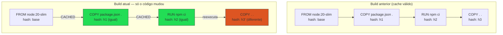
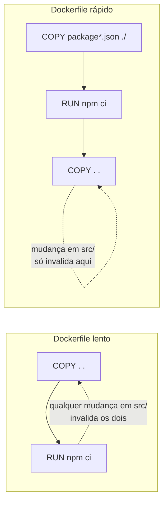

# Build e cache: por que seu build está lento

> [!abstract] TL;DR
> O cache de build do Docker é uma corrente: cada camada carrega uma chave calculada a partir da camada anterior mais o comando (ou o conteúdo dos arquivos) daquela instrução, e no instante em que uma chave muda, toda a corrente a partir dali é reconstruída do zero — mesmo que o resultado final fosse byte a byte idêntico ao anterior. A causa mais comum de build lento não é o gerenciador de dependências nem a rede: é a ordem das instruções no Dockerfile, que faz o `COPY . .` do código-fonte, que muda a cada commit, invalidar em cascata a instalação de dependências, que quase nunca muda. Resolver isso é reordenar o Dockerfile para que o que muda pouco fique no topo e o que muda sempre fique embaixo, e complementar com um `.dockerignore` bem escrito, que afeta tanto o que é enviado ao daemon quanto a própria chave de cache. Esta nota mostra como ler a chave de cada tipo de instrução, como inspecionar onde o cache quebrou e como transformar um build de minutos em um build de segundos sem tocar em BuildKit avançado ou multi-stage — esses ficam para as notas 10 e 09.

Um time tem um Dockerfile que builda em quatro minutos. Toda vez. Mesmo quando a mudança foi uma vírgula num arquivo de configuração, ou uma correção de typo num comentário do código. O pipeline de CI passa boa parte do tempo de cada PR esperando esse build, e ninguém sabe dizer por quê — afinal, "o Docker tem cache, não tem?" Tem. E é exatamente o cache que está sendo destruído a cada build, porque ele foi configurado (sem querer) para nunca ser reaproveitado. A nota 04 já mostrou que cada instrução do Dockerfile produz uma camada e que a ordem dessas instruções é uma decisão de design. Esta nota entra no mecanismo que torna essa decisão importante na prática: como o Docker decide, camada por camada, se pode reaproveitar o que já construiu ou se precisa refazer o trabalho — e por que, em builds mal ordenados, ele quase sempre escolhe refazer.

O time do exemplo não está fazendo nada exótico. Ele só nunca parou para perguntar, instrução por instrução, "o que exatamente o Docker compara para decidir se esta camada pode ser reaproveitada?" Sem essa pergunta, é fácil escrever um Dockerfile funcionalmente correto — a imagem sobe, a aplicação roda — mas estruturalmente lento, porque a estrutura de cache não foi uma escolha deliberada, foi um acidente de qual instrução veio primeiro na hora de escrever o arquivo. O resto desta nota existe para tornar essa pergunta automática.

A boa notícia é que, ao contrário de outras otimizações de performance que exigem instrumentação, benchmark e julgamento fino sobre trade-offs, esta em particular tem uma resposta quase mecânica: existe uma ordem correta, ela é previsível a partir de uma única pergunta — "isto muda com que frequência?" —, e aplicá-la não exige reescrever a aplicação, só reler o Dockerfile já existente com essa pergunta em mente.

O restante desta nota segue essa mesma pergunta em profundidade crescente: primeiro o mecanismo que torna a ordem importante, depois a diferença precisa entre os tipos de instrução, depois um exemplo trabalhado ponta a ponta, e por fim as ferramentas de inspeção que permitem confirmar, sem adivinhação, se um build específico está de fato aproveitando o cache que deveria.

Fica registrado desde já: nada disso depende de conhecer BuildKit avançado ou multi-stage builds — os dois entram nas notas 10 e 09, respectivamente, como otimizações adicionais sobre uma base que já precisa estar bem ordenada primeiro.

## A corrente de cache: invalidação em cascata

A ideia central, e a única que realmente precisa ficar gravada, é esta: **o cache do Docker é sequencial, não independente por camada**. Cada camada do build tem uma chave de cache que depende de duas coisas: a chave da camada anterior e a "assinatura" da instrução atual (o que essa assinatura significa varia por tipo de instrução, e é o assunto da próxima seção). Se a chave da camada N muda, o Docker não tem como saber se a camada N+1 teria produzido o mesmo resultado — ele simplesmente assume que não, descarta o cache dali para frente, e executa cada instrução subsequente de verdade.

Isso é consequência direta de duas coisas que a nota 02 já estabeleceu: a imagem é uma pilha ordenada de camadas, e uma camada é identificada por hash de conteúdo. Hash de conteúdo quer dizer que o cache de uma camada só é válido se as suas entradas — a camada de baixo mais a instrução — forem exatamente as mesmas de uma execução anterior. Não existe "quase igual" para um hash. E como a camada N+1 é construída sobre a camada N, se a camada N mudou (mesmo que o resultado observável seja idêntico do ponto de vista do sistema de arquivos), a entrada da camada N+1 também mudou, e o hash dela muda junto — mesmo que o comando da camada N+1 seja idêntico palavra por palavra ao de antes.



Repare no diagrama: a mudança aconteceu só na última instrução, e só ela foi reconstruída — porque nada depois dela existia para ser invalidado. Agora inverta a ordem: se o `COPY . .` estivesse antes do `RUN npm ci`, qualquer mudança em qualquer arquivo do projeto (inclusive um `README.md`) invalidaria a camada do `COPY`, e a partir dali o `npm ci` — que pode levar minutos — reexecutaria inteiro, mesmo que nenhuma dependência tenha mudado. É exatamente esse erro, multiplicado em centenas de builds de CI por semana, que consome o tempo do time do início desta nota.

Vale insistir num detalhe que costuma escapar mesmo depois de entender a cascata: a invalidação não é "tudo ou nada" no sentido de reconstruir a imagem inteira desde `FROM` — as camadas *antes* do ponto de mudança continuam válidas e são reaproveitadas normalmente. O que se perde é tudo *a partir* do ponto de mudança, inclusive. Isso é ótimo quando o ponto de mudança está perto do fim do Dockerfile (pouco trabalho refeito) e péssimo quando está perto do início (quase tudo refeito) — e é exatamente essa distância entre "onde a mudança acontece" e "onde ela está posicionada no arquivo" que a ordenação do Dockerfile controla.

Um jeito útil de internalizar essa regra é pensar em cada Dockerfile como uma lista ordenada por frequência de mudança esperada, de cima para baixo: no topo, o que só muda quando alguém decide deliberadamente atualizar a versão da imagem base; no meio, o que muda em ciclos de dias ou semanas, como a lista de dependências; embaixo, o que muda a cada commit, normalmente o código-fonte da própria aplicação. Uma vez que essa lista está ordenada dessa forma, a cascata de invalidação deixa de ser um problema e passa a ser, na prática, exatamente o comportamento que se quer: só refazer o que realmente mudou, e nada além disso.

> [!info] Versão e comportamento volátil
> A partir do Docker 23 (BuildKit como motor padrão), o algoritmo de cache descrito aqui é o do BuildKit, não o do builder legado (`legacy builder`, hoje praticamente extinto). Os princípios — chave por instrução, invalidação em cascata — são os mesmos nos dois motores; o BuildKit muda principalmente a granularidade e os recursos extras (paralelismo, cache externo, cache mounts), que são o assunto da nota 10.

> [!tip] Vídeo — a cascata de invalidação, com dois Dockerfiles lado a lado
> [**How Dockerfile Layers/Caching Work**](https://www.youtube.com/watch?v=RP-z4dqRTZA) (Benjamin Porter, ~8 min, EN) demonstra em oito minutos a regra que abre esta nota, do jeito mais direto possível: dois Dockerfiles para a mesma aplicação, um escrito ingenuamente e outro reordenado, e o efeito de mudar uma linha de código em cada um. No primeiro, o `COPY` do código-fonte aparece cedo, e ele mostra o que acontece a seguir — *"cada camada abaixo precisa ser reconstruída mesmo sem ter mudado, porque o pai dela mudou"*. É a cascata: o cache não é por instrução isolada, é por corrente, e quebrar um elo invalida tudo o que vem depois. No segundo, a instalação de pacotes — a parte cara — fica acima do `COPY`, e a mesma alteração de código reaproveita o cache até o último instante possível. **O que ele não cobre:** a chave de cache por tipo de instrução (a diferença entre como o Docker decide invalidar um `RUN`, um `COPY` e um `ADD`), o `.dockerignore` e o contexto de build, e por que o mesmo Dockerfile se comporta diferente em CI.

## A chave de cache por tipo de instrução

Nem toda instrução calcula sua chave da mesma forma, e essa diferença é o segundo ponto que separa quem apenas usa Docker de quem prevê o que ele vai fazer.

Para instruções como `RUN`, `ENV`, `LABEL`, `EXPOSE`, `WORKDIR` e `CMD`, a chave de cache é derivada do **texto literal da instrução** como está escrito no Dockerfile (mais a chave da camada anterior). Isso significa que `RUN npm ci` e `RUN npm ci ` (com um espaço a mais) já são, tecnicamente, comandos diferentes o suficiente para invalidar o cache — na prática o Docker normaliza espaçamento trivial, mas trocar `apt-get update && apt-get install -y curl` por `apt-get install -y curl && apt-get update` é uma instrução diferente para efeito de cache, mesmo que o resultado final no sistema de arquivos pudesse ser equivalente. O Docker não executa o comando para saber se o resultado seria igual; ele compara o texto do comando antes de decidir se precisa executar.

Para `COPY` e `ADD`, a regra é outra e é a mais importante desta nota: a chave de cache é calculada a partir do **conteúdo dos arquivos que serão copiados** (checksum de cada arquivo envolvido, mais metadados como permissões), não do texto da instrução. Isso quer dizer que `COPY . .` tem uma chave de cache que muda toda vez que qualquer arquivo dentro do contexto copiado muda — um espaço a mais num comentário do código já é suficiente. É por isso que a posição do `COPY` no Dockerfile é a decisão de maior alavancagem para a velocidade do build: um `COPY` de um arquivo que muda raramente (o manifesto de dependências) pode ficar cedo, cedendo cache estável para as instruções pesadas que vêm depois; um `COPY` de um arquivo que muda a cada commit (o código-fonte) precisa vir o mais tarde possível, para que sua invalidação frequente não arraste consigo trabalho caro que já estava pronto.

| Instrução | O que forma a chave |
|---|---|
| `FROM` | O digest da imagem base referenciada |
| `RUN` | O texto literal do comando executado |
| `COPY` / `ADD` | Checksum do conteúdo dos arquivos copiados (mais metadados) |
| `ENV`, `ARG`, `LABEL`, `WORKDIR`, `EXPOSE`, `USER` | O texto literal da instrução |
| Qualquer instrução | Também depende da chave (hash) da camada imediatamente anterior |

Duas consequências práticas dessa tabela merecem ficar explícitas antes de seguir para o exemplo trabalhado. A primeira: como `ARG` e `ENV` entram na chave pelo texto, e um `ARG` pode ser preenchido por fora via `--build-arg`, dois builds do mesmo Dockerfile podem ter cache miss um do outro só porque alguém passou um valor de `ARG` diferente na linha de comando — sem editar uma letra do arquivo. A segunda: como `FROM` usa o digest, não a tag, dois builds separados por semanas podem parecer usar "a mesma imagem base" (mesma tag, `node:20-slim`) e ainda assim terem cache miss logo na primeira camada, se a tag tiver sido republicada com um digest novo nesse intervalo — o assunto da seção sobre tags móveis, mais adiante.

Vale ver a primeira consequência num exemplo concreto, porque ela costuma surpreender quem já internalizou a regra do `COPY` mas esquece que `ARG` participa do mesmo jogo:

```dockerfile
FROM node:20-slim
ARG BUILD_ENV=production
WORKDIR /app
COPY package.json package-lock.json ./
RUN npm ci --omit=dev
ENV NODE_ENV=${BUILD_ENV}
COPY . .
CMD ["node", "src/index.js"]
```

```bash
# Build 1: usa o default
docker build -t minha-api .

# Build 2: mesmo Dockerfile, mesmo código-fonte, ARG diferente
docker build --build-arg BUILD_ENV=staging -t minha-api .
```

Repare que `ARG BUILD_ENV` aparece *antes* de `COPY package.json ...` e `RUN npm ci` neste Dockerfile — então, tecnicamente, ela não invalida essas duas camadas, porque o valor de `BUILD_ENV` só é consumido depois, na instrução `ENV NODE_ENV=${BUILD_ENV}`. É só a partir dali que a chave muda entre os dois builds. Se, por outro lado, o `ARG` fosse declarado e consumido *antes* do `COPY` dos manifestos — por exemplo, para escolher uma variante da imagem base via interpolação em `FROM` —, mudar seu valor invalidaria tudo, incluindo a instalação de dependências, mesmo que nenhuma dependência real tivesse mudado. A posição do `ARG`/`ENV` na cadeia segue exatamente a mesma lógica de posição que já vale para `COPY`: quanto mais cedo um valor que muda com frequência aparece, mais camadas caras ele arrasta consigo a cada mudança.

## Exemplo trabalhado: o mesmo app, dois Dockerfiles

Considere uma API Node.js com um `package.json` e um `package-lock.json` que quase nunca mudam, e um diretório `src/` que muda a cada commit. O Dockerfile "ingênuo" — o que a maioria escreve na primeira tentativa — copia tudo de uma vez:

```dockerfile
# Dockerfile lento
FROM node:20-slim
WORKDIR /app
COPY . .
RUN npm ci --omit=dev
CMD ["node", "src/index.js"]
```

Percorra esse Dockerfile camada a camada pensando em chave de cache. `FROM node:20-slim` gera uma chave estável (o digest da imagem base não muda entre builds, a menos que a tag seja atualizada rio acima). `WORKDIR /app` também é estável — é só texto. O problema começa em `COPY . .`: ela copia o diretório inteiro do projeto, incluindo `src/`, para dentro da imagem, e a chave dessa camada é o checksum de todo esse conteúdo. A cada commit que toca qualquer arquivo do projeto — inclusive um `.md` de documentação, se ele estiver no contexto — essa chave muda. E como `RUN npm ci --omit=dev` vem depois, sua entrada (a camada anterior, que acabou de mudar) também mudou, então o Docker reexecuta `npm ci` do zero: baixa dependências da rede, resolve a árvore, escreve `node_modules` inteiro de novo. Em um projeto com centenas de pacotes, isso são minutos, repetidos a cada build, para uma mudança que não tinha nada a ver com dependências.

Agora o Dockerfile reordenado, aplicando a regra "o que muda pouco primeiro, o que muda sempre por último":

```dockerfile
# Dockerfile rápido
FROM node:20-slim
WORKDIR /app
COPY package.json package-lock.json ./
RUN npm ci --omit=dev
COPY . .
CMD ["node", "src/index.js"]
```

A diferença estrutural é uma linha só ter mudado de lugar, mas o efeito no cache é completo. Agora `COPY package.json package-lock.json ./` copia só os dois arquivos de manifesto — sua chave de cache depende apenas do conteúdo deles, que só muda quando uma dependência é adicionada, removida ou atualizada de versão. Enquanto o time só edita código em `src/`, essa camada bate cache toda vez. `RUN npm ci --omit=dev` vem logo depois dela e, como sua entrada (a camada anterior) não mudou, ele também bate cache — o `node_modules` inteiro já construído é reaproveitado sem executar uma única linha do instalador. Só o `COPY . .` final, que agora só existe para trazer o código-fonte, é invalidado a cada commit — e ele é barato: copiar arquivos de texto para dentro de uma camada não compara em custo com resolver e baixar uma árvore de dependências. O resultado observável é o mesmo binário rodando, mas o caminho até ele, na maioria dos builds do dia a dia, passa a levar segundos em vez de minutos.



Esse padrão — manifesto de dependências primeiro, instalação, código-fonte por último — se repete com pequenas variações em praticamente qualquer ecossistema com gerenciador de dependências declarativo. Vale ver o mesmo raciocínio aplicado a dois outros ecossistemas comuns, para confirmar que a régua é a mesma independente da linguagem:

```dockerfile
# Python com pip
FROM python:3.12-slim
WORKDIR /app
COPY requirements.txt .
RUN pip install --no-cache-dir -r requirements.txt
COPY . .
CMD ["python", "-m", "app"]
```

```dockerfile
# Go com módulos
FROM golang:1.23-alpine
WORKDIR /src
COPY go.mod go.sum ./
RUN go mod download
COPY . .
RUN CGO_ENABLED=0 go build -o /bin/app ./cmd/server
CMD ["/bin/app"]
```

Para tornar a diferença de tempo tangível, e não só teórica, veja como a saída de build de cada versão do Dockerfile Node costuma se parecer depois de uma mudança pequena em `src/index.js`, lado a lado:

```bash
# Dockerfile lento — COPY . . antes de npm ci
$ time docker build -t minha-api:lento .
 => [2/4] WORKDIR /app                                        0.0s
 => [3/4] COPY . .                                             0.6s
 => [4/4] RUN npm ci --omit=dev                               187.4s
real    3m9.412s

# Dockerfile rápido — manifesto antes do código
$ time docker build -t minha-api:rapido .
 => [2/5] WORKDIR /app                                        CACHED
 => [3/5] COPY package.json package-lock.json ./              CACHED
 => [4/5] RUN npm ci --omit=dev                                CACHED
 => [5/5] COPY . .                                             0.4s
real    0m1.187s
```

Os números exatos variam conforme o tamanho da árvore de dependências e a velocidade da conexão de rede daquele momento, mas a forma do resultado é sempre a mesma: no Dockerfile lento, a mudança de uma linha em `src/index.js` arrasta consigo os quase 190 segundos do `npm ci`, porque a chave de cache da camada de instalação depende do checksum do `COPY . .` anterior a ela; no Dockerfile rápido, a mesma mudança de uma linha custa só o tempo de recopiar o código-fonte, pouco mais de um segundo. Nenhuma dependência mudou entre os dois builds — a única variável controlada foi a posição relativa das instruções.

Em ambos os casos, o arquivo que descreve dependências (`requirements.txt`, ou o par `go.mod`/`go.sum`) é isolado num `COPY` próprio, seguido pela instrução que resolve essas dependências, e só depois o código-fonte inteiro entra. A lógica é sempre a mesma: identifique o artefato que descreve as dependências, separe-o do restante do código, e garanta que ele seja copiado — e só ele — antes da instrução que instala. O ganho é proporcional ao custo da instalação: em Node ou Python, onde `npm ci`/`pip install` podem levar minutos numa árvore grande de dependências, o ganho é dramático; em Go, onde `go mod download` costuma ser mais rápido (os módulos são cacheados de forma mais eficiente pelo próprio toolchain), o ganho ainda existe, mas é menos chamativo — o que não torna a prática menos correta, só menos visível no relógio.

## Um segundo exemplo: quando um único `COPY . .` esconde granularidade demais

O exemplo Node da seção anterior resolve o caso mais comum, mas vale um segundo exemplo para mostrar que a mesma lógica se aplica dentro do próprio código-fonte, não só na fronteira entre manifesto e código. Considere um monorepo com um backend em `services/api/` e um frontend em `services/web/`, buildados em imagens separadas a partir do mesmo repositório. Um Dockerfile ingênuo para a imagem da API, rodando a partir da raiz do monorepo como contexto, costuma copiar tudo de uma vez:

```dockerfile
# Ingênuo: qualquer mudança no monorepo inteiro invalida a camada
FROM node:20-slim
WORKDIR /app
COPY . .
RUN npm ci --omit=dev --workspace=services/api
CMD ["node", "services/api/src/index.js"]
```

Aqui o problema não é mais só "código muda mais que dependência" — é que `COPY . .` traz o repositório inteiro, incluindo `services/web/`, para dentro da camada, então um commit que só mexe no frontend invalida a mesma camada de instalação de dependências da API, mesmo que nenhuma dependência da API tenha mudado e nenhum arquivo da API tenha sido tocado. A correção segue o mesmo princípio, aplicado com mais precisão: copiar só os manifestos relevantes para aquele serviço específico primeiro, instalar, e só depois copiar o código daquele serviço — não o monorepo inteiro:

```dockerfile
# Preciso: só o que pertence a services/api entra na chave de cache
FROM node:20-slim
WORKDIR /app
COPY package.json package-lock.json ./
COPY services/api/package.json services/api/package.json
RUN npm ci --omit=dev --workspace=services/api
COPY services/api/ services/api/
CMD ["node", "services/api/src/index.js"]
```

O princípio geral por trás dos dois exemplos desta nota é o mesmo, só que aplicado em dois níveis de granularidade diferentes: a chave de cache de um `COPY` é sempre o conteúdo exato do que ele copia, nem mais nem menos, então quanto mais preciso o escopo de cada `COPY` — copiar só o que aquela camada específica realmente precisa, e nada além disso — mais estável o cache fica contra mudanças em partes do projeto que não têm relação com aquela camada.

## O `.dockerignore` faz duas coisas, não uma

O arquivo `.dockerignore`, na raiz do contexto de build, é tratado por muita gente como só "uma lista de pastas pra não copiar", mas ele afeta dois mecanismos distintos e vale entender os dois separadamente.

O primeiro efeito é sobre o **contexto de build**: antes do build começar, o cliente Docker empacota o diretório de contexto (tipicamente o `.` no fim do comando `docker build .`) e envia esse pacote inteiro para o daemon — mesmo que o Dockerfile só use `COPY` em alguns arquivos específicos. Se esse diretório contém um `node_modules/` de centenas de megabytes, um `.git/` com todo o histórico do repositório, ou artefatos de build de execuções anteriores, tudo isso é lido do disco, compactado e transmitido ao daemon antes de qualquer instrução do Dockerfile rodar — mesmo que nenhum `COPY` no arquivo referencie esses diretórios. Isso custa tempo de I/O e, em setups onde o daemon roda remoto ou numa VM (o caso comum no Docker Desktop), custa também tempo de rede. O `.dockerignore` resolve isso excluindo esses diretórios do pacote enviado, na mesma sintaxe de um `.gitignore`.

O segundo efeito é sobre a **chave de cache do `COPY`**, e é mais sutil. Como a chave de `COPY . .` depende do checksum de tudo que é copiado, qualquer arquivo dentro do contexto que mude entre builds — mesmo um que nenhuma parte da aplicação lê, como um log solto ou um arquivo temporário do editor — pode invalidar essa camada. Excluir esses arquivos do contexto via `.dockerignore` remove-os também do cálculo dessa chave, tornando o cache mais estável mesmo quando `COPY . .` continua sendo usado.

```dockerignore
# .dockerignore
node_modules
.git
.env
*.log
dist
coverage
.DS_Store
```

Um erro comum ao escrever esse arquivo é esquecer que ele precisa cobrir também artefatos gerados pelo próprio processo de desenvolvimento local — coverage de testes, builds anteriores de uma execução manual fora do Docker, caches de ferramentas de lint — porque qualquer um desses, se mudar entre um commit e outro, invalida `COPY . .` exatamente como um arquivo de código mudaria, sem trazer nenhum valor para a imagem final.

Vale também registrar o que normalmente **não** deveria entrar no `.dockerignore`, para não confundir "ignorar do contexto de build" com "ignorar do controle de versão" — os dois arquivos (`.dockerignore` e `.gitignore`) compartilham sintaxe, mas servem propósitos distintos, e um arquivo de configuração de exemplo (`config.example.json`) que faz sentido versionar no Git pode ainda assim precisar entrar na imagem via `COPY`, então não deveria estar no `.dockerignore` mesmo que arquivos de configuração locais reais (`config.local.json`) devam.

> [!info] Versão e comportamento volátil
> A sintaxe do `.dockerignore` segue as mesmas convenções de padrão de `.gitignore` (glob simples, `!` para exceção), mas não é idêntica em todos os detalhes — por exemplo, o comportamento de `!` para reincluir um arquivo dentro de um diretório já excluído tem particularidades documentadas na referência oficial do Docker, que vale consultar quando o padrão não se comportar como esperado.

## O contexto de build em si

Vale isolar essa ideia porque ela surpreende gente que já entende cache de camada, mas não pensou no que acontece *antes* da primeira instrução do Dockerfile executar. Todo `docker build` começa com o cliente enviando o contexto — o diretório apontado no comando — ao daemon, como um tar comprimido. Isso acontece independentemente de quantas instruções `COPY`/`ADD` existem, e independentemente do que essas instruções realmente usam: o cliente não sabe, antes de ler o Dockerfile, quais arquivos serão necessários, então ele historicamente empacota o diretório inteiro (respeitando o `.dockerignore`) e deixa o daemon decidir o que usar.

Isso explica por que um diretório de projeto com um `.git` de vários gigabytes de histórico, ou um `node_modules` já instalado localmente, torna o build sensivelmente mais lento mesmo em um Dockerfile "perfeitamente" ordenado como o da seção anterior — o tempo perdido não está em nenhuma camada, está na etapa zero, antes de qualquer camada existir. Rodar `docker build .` num diretório assim paga esse custo a cada invocação, cache ou não, porque o envio do contexto não é uma camada e não tem cache próprio da mesma forma.

A primeira linha da saída de qualquer build, ao rodar com `--progress=plain`, já denuncia esse custo separadamente de qualquer camada:

```bash
$ docker build --progress=plain -t minha-api .
#1 [internal] load build definition from Dockerfile
#1 transferring dockerfile: 412B done
#2 [internal] load .dockerignore
#2 transferring context: 87B done
#3 [internal] load build context
#3 transferring context: 43.02MB 3.8s done
```

O passo `#3 transferring context` é exatamente o envio do contexto de build inteiro — e o tamanho reportado ali, `43.02MB` neste exemplo, é o primeiro número que vale olhar quando um build parece lento antes mesmo de qualquer instrução aparecer na saída. Se esse número for muito maior do que o esperado para o tamanho real do código-fonte, a causa quase sempre é um `.dockerignore` ausente ou incompleto, e não nenhuma instrução do Dockerfile em si.

O efeito de adicionar um `.dockerignore` a um projeto que nunca teve um costuma ser visível já nessa primeira linha da saída, sem precisar de nenhuma outra mudança no Dockerfile:

```bash
# Antes do .dockerignore — node_modules e .git entram no contexto
#3 transferring context: 289.44MB 11.2s done

# Depois de adicionar node_modules, .git e afins ao .dockerignore
#3 transferring context: 1.86MB 0.1s done
```

Uma queda de centenas de megabytes para poucos megabytes, só adicionando um arquivo de texto de meia dúzia de linhas, é uma proporção comum em projetos Node ou Python que nunca tiveram essa etapa configurada — e diferente da reordenação de instruções, esse ganho é constante em todo build subsequente, com ou sem cache, porque o envio de contexto acontece sempre, independentemente de qualquer camada bater ou não bater cache.

## Como inspecionar: ler a saída do build

A melhor forma de verificar essas previsões na prática, em vez de assumir que o cache está se comportando como o esperado, é rodar o build com saída detalhada:

```bash
docker build --progress=plain -t minha-api .
```

A flag `--progress=plain` desativa o resumo compacto (que colapsa etapas) e imprime cada passo do build por extenso, incluindo, para cada camada, se ela veio do cache. Uma linha como `CACHED` ao lado de uma instrução confirma que aquela camada foi reaproveitada; a ausência dela — e a presença do tempo de execução real, em segundos — confirma que ela foi refeita. O padrão a procurar é o ponto exato onde `CACHED` para de aparecer: tudo antes dele bateu cache, tudo depois foi reconstruído, e essa é a linha divisória real entre "o que mudou" e "o que não mudou" do ponto de vista do Docker.

```bash
$ docker build --progress=plain -t minha-api .
#5 [2/5] WORKDIR /app
#5 CACHED

#6 [3/5] COPY package.json package-lock.json ./
#6 CACHED

#7 [4/5] RUN npm ci --omit=dev
#7 CACHED

#8 [5/5] COPY . .
#8 0.412s done
```

Nessa saída, as três primeiras instruções depois de `FROM` bateram cache — nenhuma delas precisou reexecutar. Só o último `COPY . .` foi refeito, e levou menos de meio segundo, exatamente o comportamento esperado do Dockerfile reordenado da seção anterior. Se, em vez disso, a saída mostrasse `RUN npm ci --omit=dev` reexecutando com vários segundos de trabalho de rede, isso seria o sinal inequívoco de que uma camada anterior a ela — o `COPY` dos manifestos, ou o `FROM` — mudou.

Quando o cache quebra numa camada que, pelo seu julgamento, você não tocou, o raciocínio de depuração segue a corrente de trás para frente: a camada anterior a ela mudou? Se sim, por quê — o `FROM` está usando uma tag móvel como `latest` que resolveu para um digest novo desde o último build? Um `ARG` ou `ENV` anterior mudou de valor (inclusive um passado via `--build-arg` no comando, que também entra na chave)? Se a camada imediatamente anterior não mudou, o problema está na própria instrução: para um `RUN`, o texto do comando é idêntico caractere por caractere ao de antes? Para um `COPY`, algum arquivo dentro do escopo copiado mudou — inclusive metadados de permissão, que contam para o checksum mesmo quando o conteúdo textual é idêntico?

```bash
# Buildar sem usar cache algum, para comparar tempos e confirmar hipótese
docker build --no-cache -t minha-api .

# Ver o histórico de camadas de uma imagem já construída
docker history minha-api
```

O `docker build --no-cache` é útil como controle: se o build "rápido" (com cache) e o build sem cache demoram praticamente o mesmo tempo, é sinal de que o cache não estava, na prática, sendo aproveitado em nenhum lugar que importasse — mesmo que a saída mostrasse algumas linhas com `CACHED`. Já `docker history`, aplicado à imagem já construída, mostra o tamanho de cada camada final — útil para confirmar que a camada de instalação de dependências realmente ficou isolada, e que o `COPY . .` final não está, por engano, incluindo algo pesado que deveria ter ficado no `.dockerignore`.

```bash
$ docker history minha-api
IMAGE          CREATED BY                                      SIZE
f7a2b1c9d0e1   CMD ["node" "src/index.js"]                     0B
<missing>      COPY . .                                        842kB
<missing>      RUN npm ci --omit=dev                           187MB
<missing>      COPY package.json package-lock.json ./          2.1kB
<missing>      WORKDIR /app                                     0B
<missing>      /bin/sh -c #(nop) ADD file:... in /              68.1MB
```

Essa saída confirma visualmente o que a ordenação do Dockerfile deveria ter produzido: a camada de `RUN npm ci` concentra o peso pesado (187MB de `node_modules`), a camada de manifestos é pequena (2.1kB, só os dois arquivos JSON), e a camada final de código-fonte também é pequena (842kB). Se essa última camada aparecesse com um tamanho muito maior do que o esperado para o código-fonte real do projeto, seria sinal de que algo que deveria estar no `.dockerignore` — um `node_modules` local, um diretório de build antigo — está sendo copiado junto.

## Cache local contra cache em CI: por que o mesmo Dockerfile se comporta diferente

Vale um parênteses sobre uma confusão comum antes de fechar esta nota: tudo que foi descrito até aqui assume que existe um cache local para reaproveitar — camadas de um build anterior, já presentes no daemon Docker da máquina onde o build roda. Isso é verdade na máquina de um desenvolvedor, que builda o mesmo projeto repetidamente ao longo do dia, mas não é verdade por padrão num executor de CI que sobe uma máquina nova (ou um container efêmero) a cada execução de pipeline — sem daemon persistente, não existe cache local nenhum para reaproveitar, e todo build ali começa do zero, independentemente de quão bem ordenado o Dockerfile esteja.

Isso não invalida nada do que esta nota ensinou — um Dockerfile bem ordenado continua sendo pré-requisito para qualquer estratégia de cache funcionar — mas explica por que a mesma reordenação que reduz um build de minutos para segundos na máquina local pode não produzir o mesmo ganho automaticamente no pipeline de CI, até que o pipeline seja configurado para persistir ou importar cache de builds anteriores. Configurar esse cache persistente entre execuções de CI é justamente o assunto que [[03-Dominios/Tecnologia/Infraestrutura/Docker/17 - Docker em CI e na máquina de dev|17 — Docker em CI e na máquina de dev]] aprofunda; o ponto aqui é só deixar claro que "o Dockerfile está bem ordenado" e "o cache está disponível para ser usado" são duas condições separadas, e a primeira sem a segunda não entrega ganho nenhum.

## Automatizando parte da régua: o que um linter de Dockerfile já cobre

Boa parte do raciocínio desta nota — verificar se `COPY` está posicionado antes de instruções caras, verificar se instruções relacionadas estão consolidadas numa única camada — já está codificada em ferramentas de lint especializadas em Dockerfile, e vale rodar pelo menos uma delas em CI antes de depender só de revisão manual para pegar regressões. `hadolint` é a ferramenta mais estabelecida do ecossistema para esse tipo de verificação:

```bash
$ hadolint Dockerfile
Dockerfile:4 DL3059 info: Multiple consecutive `RUN` instructions. Consider consolidation.
Dockerfile:6 DL3042 warning: Avoid use of cache directory with pip. Use `pip install --no-cache-dir <package>`
```

`DL3059` sinaliza `RUN` consecutivos que poderiam ser consolidados numa camada só — relevante quando a motivação é reduzir o número de camadas (a nota 04 discute os limites de storage driver por trás disso), mas que também merece julgamento: consolidar tudo cega o cache para reaproveitar só uma parte do trabalho, então nem toda consolidação sugerida por um linter é uma melhoria de cache, às vezes é o oposto. `DL3042` pega o hábito comum de deixar o cache interno do `pip` (não o cache de camada do Docker, o cache de pacotes baixados dentro do próprio gerenciador) gravado na imagem, inflando o tamanho da camada final sem ganho nenhum de velocidade de build subsequente, já que aquele cache não sobrevive entre builds independentes da mesma forma que uma camada Docker sobreviveria. Um linter como esse não substitui o raciocínio sobre ordenação que esta nota ensinou — ele não sabe, por exemplo, que seu `package.json` muda pouco e seu `src/` muda sempre — mas automatiza a parte mecânica da verificação, deixando o julgamento sobre ordenação para quem escreve e revisa o Dockerfile.

## Revisar um Dockerfile pela lente do cache

Um efeito prático de tudo que esta nota cobriu: revisar um `pull request` que mexe num Dockerfile não deveria se limitar a perguntar "a sintaxe está certa e a imagem builda?" — deveria incluir a pergunta "essa mudança de posição, ou essa nova instrução, está antes ou depois da fronteira entre o que muda pouco e o que muda sempre?" Um `COPY` novo adicionado no topo do arquivo, por exemplo para trazer um arquivo de configuração que parece pequeno e inofensivo, pode estar silenciosamente movendo a fronteira de cache para mais cedo do que estava, se esse arquivo de configuração mudar com mais frequência do que os manifestos de dependência que vinham antes dele.

Essa disciplina de revisão vale tanto quanto testar se o Dockerfile builda com sucesso, porque um build que funciona e um build que é rápido são propriedades independentes — o primeiro é sobre corretude, o segundo é sobre a ordem escolhida, e só o segundo é o assunto desta nota. Um comentário de uma linha acima de um `COPY` explicando por que ele está posicionado ali — "mantém aqui para preservar cache de dependências enquanto só o código muda" — custa quase nada de escrever e evita que a próxima pessoa mova essa linha achando que está só reorganizando por estética, exatamente a mesma recomendação que a nota 04 já tinha feito para a ordem das instruções em geral, agora aplicada especificamente à pergunta de cache.

## Sinais de que o seu Dockerfile está mal ordenado

Antes de fechar com as armadilhas mais específicas, vale um checklist rápido de sintomas — os sinais que, juntos ou separados, quase sempre apontam para uma cascata de invalidação desnecessária escondida em algum lugar do Dockerfile:

- O build demora praticamente o mesmo tempo, não importa quão pequena seja a mudança de código entre uma execução e a próxima.
- A saída de `--progress=plain` mostra `CACHED` só nas primeiras uma ou duas instruções, e tudo depois disso reexecuta a cada build.
- `docker history` mostra uma camada de instalação de dependências (`npm ci`, `pip install`, `go mod download`) posicionada depois de um `COPY` que traz o código-fonte inteiro.
- O time já normalizou "só vai ficar pronto daqui a alguns minutos" como resposta padrão para qualquer build, mesmo mudanças triviais.
- Ninguém no time sabe dizer, sem olhar o Dockerfile, se um `COPY . .` existe e onde ele está posicionado.

Qualquer um desses sinais isolado já justifica revisar a ordenação do Dockerfile pela régua desta nota; a combinação de dois ou mais é praticamente garantia de que existe ganho fácil disponível.

E o inverso também vale como sinal positivo: um time que já internalizou essa régua costuma notar imediatamente quando um build começa a ficar mais lento sem motivo aparente, porque a expectativa passa a ser "cache o tempo todo, exceto quando algo relevante mudou" — e qualquer desvio dessa expectativa vira, por si só, um convite a investigar antes que o problema se acumule.

## Armadilhas comuns

> [!warning] `COPY . .` antes de instalar dependências
> É o erro mais comum e o que abre esta nota: copiar o projeto inteiro antes de instalar dependências invalida a instalação a cada mudança de código, porque a chave de cache do `COPY` depende do conteúdo copiado, e o código muda o tempo todo. Acontece porque é a forma mais óbvia de escrever o Dockerfile na primeira tentativa — "copia tudo, depois instala". Evite copiando primeiro só o manifesto de dependências (`package.json`, `requirements.txt`, `go.mod` etc.), instalando, e só então copiando o restante do código.

> [!warning] Esquecer o `.dockerignore` e enviar `.git`/`node_modules` no contexto
> Sem um `.dockerignore`, o contexto de build inclui por padrão tudo que está no diretório, inclusive diretórios pesados que nenhuma instrução `COPY` referencia diretamente. Acontece porque o cliente Docker não sabe, antes de ler o Dockerfile inteiro, o que vai ou não ser usado, então ele empacota tudo por segurança. Evite criando um `.dockerignore` desde o primeiro commit do projeto, cobrindo ao menos `.git`, diretórios de dependências instaladas localmente e artefatos de build.

> [!warning] Assumir que uma tag como `node:20` é sempre a mesma imagem
> Tags móveis (`latest`, ou até `20` sem o patch completo) podem apontar para um digest diferente amanhã, se a imagem upstream for republicada com correções. Quando isso acontece, o `FROM` resolve para um digest novo, sua chave de cache muda, e a cascata de invalidação começa já na primeira camada — mesmo que nada no seu Dockerfile tenha mudado. Acontece porque tag não é identidade de conteúdo (a nota 02 já separou os dois conceitos). Evite fixando o mais possível (uma tag com patch, ou o digest explícito) quando reprodutibilidade de build importa mais do que receber atualizações automáticas — a nota 12, sobre registry, entra em como resolver e fixar digests na prática.

> [!warning] Mudar um `ARG` ou `ENV` no meio do Dockerfile e não entender por que tudo depois recompila
> Um `ARG`/`ENV` também entra na chave de cache das instruções que vêm depois dele, então mudar seu valor entre builds (inclusive via `--build-arg` na linha de comando) invalida em cascata a partir daquele ponto, mesmo que nenhuma linha do Dockerfile tenha sido editada. Acontece porque é fácil esquecer que `ARG`s passados externamente contam para o cálculo da chave tanto quanto texto escrito diretamente no arquivo. Evite posicionando `ARG`s que mudam com frequência (como uma versão de build ou um timestamp) o mais tarde possível no Dockerfile, depois das instruções caras que você quer preservar em cache.

> [!warning] Comparar tempo de build "com cache" contra "sem cache" sem controlar variáveis
> Medir "o build ficou mais rápido" só olhando o relógio, sem isolar se a rede estava lenta naquele momento, se a imagem base já tinha sido baixada antes, ou se outro processo competia por CPU no mesmo host, produz conclusões erradas sobre o que realmente mudou. Acontece porque o tempo total de build mistura vários fatores independentes — download de camada base, transferência de contexto, execução de instrução — que só a saída detalhada (`--progress=plain`) separa. Evite comparando builds específicos pela contagem de `CACHED` na saída, não só pelo relógio de parede.

> [!warning] Consolidar instruções demais achando que menos camadas é sempre melhor
> Fundir tudo num único `RUN` gigante, incluindo instalação de dependências e cópia de código numa mesma sequência de comandos, reduz o número de camadas mas também elimina qualquer granularidade de cache entre essas etapas — uma mudança em qualquer parte da sequência invalida o bloco inteiro. Acontece por levar longe demais a recomendação legítima de consolidar comandos relacionados (como `apt-get update && install`) que a nota 04 descreveu. Evite consolidando só o que precisa rodar atomicamente pelo mesmo motivo (como `update`/`install` do gerenciador de pacotes do sistema), e mantendo separadas as etapas que têm frequência de mudança diferente entre si (dependências versus código-fonte).

## Quanto isso vale: o efeito multiplicado ao longo do tempo

Vale fechar com uma conta simples, porque o ganho de reordenar um Dockerfile parece pequeno olhado uma vez só, e só fica evidente quando multiplicado pela frequência real de builds de um time. Se o Dockerfile lento do exemplo trabalhado leva quatro minutos por build porque reinstala dependências a cada mudança de código, e o time roda esse build a cada push para um branch de feature, mais uma vez por merge, um pipeline de CI moderadamente ativo facilmente soma dezenas de builds por dia. Quatro minutos por build, multiplicados por trinta builds num dia comum de trabalho de um time pequeno, já passam de duas horas de tempo de CI só naquele dia — tempo que, se o Dockerfile estivesse ordenado como a versão rápida do mesmo exemplo, cairia para uma fração pequena disso, porque a instalação de dependências deixaria de ser refeita na esmagadora maioria dos builds.

Esse tipo de conta é o motivo pelo qual reordenar um Dockerfile costuma ser, camada por camada, uma das intervenções de maior retorno por linha alterada em todo o ciclo de vida de uma aplicação containerizada: o custo de fazer a mudança é uma tarde revisando um arquivo que raramente passa de cinquenta linhas, e o ganho se paga sozinho, build após build, para sempre, sem precisar de nenhuma manutenção contínua depois de feito — diferente de outras otimizações de performance que precisam ser revisitadas conforme o sistema muda. É esse mesmo cálculo de "poucas linhas mudadas, ganho recorrente multiplicado por frequência de execução" que justifica configurar cache persistente em CI, o assunto que a nota 17 retoma com o Dockerfile já bem ordenado como pré-requisito.

A tabela abaixo resume o comportamento dos dois Dockerfiles do exemplo trabalhado diante dos três tipos de mudança mais comuns num dia de trabalho normal, e vale como checklist mental rápido antes de assumir que um build está lento por causa do gerenciador de dependências ou da rede, quando na verdade é só a ordem das instruções:

| Tipo de mudança | Dockerfile lento (`COPY . .` no topo) | Dockerfile rápido (manifesto antes do código) |
|---|---|---|
| Editar um comentário em `src/` | Reinstala dependências inteiras | Só recopia código, instalação em cache |
| Adicionar uma dependência nova | Reinstala dependências inteiras | Reinstala dependências inteiras (esperado) |
| Corrigir um typo no `README.md` | Reinstala dependências inteiras | Só recopia código, instalação em cache |
| Trocar a versão da imagem base (`FROM`) | Reconstrói tudo | Reconstrói tudo (esperado, sem alternativa) |
| Rodar o build de novo, sem mudar nada | Tudo em cache | Tudo em cache |

Repare que só a segunda e a quarta linha da tabela — mudança real de dependência, e mudança da imagem base — justificam reinstalação completa em qualquer um dos dois Dockerfiles; nas outras três linhas, o Dockerfile rápido evita trabalho que o lento continua pagando, mesmo sem necessidade nenhuma.

Essa tabela também é uma ferramenta útil de diagnóstico para convencer um time cético: pedir para alguém rodar os dois Dockerfiles lado a lado, com o mesmo tipo de mudança trivial (um comentário, um espaço), costuma ser mais persuasivo do que qualquer explicação teórica sobre chave de cache — o relógio fala por si só.

## Como explicar em inglês

*"Docker's build cache works like a chain: each layer's cache key depends on the previous layer's key plus that instruction's own signature — the literal command text for `RUN`, but the checksum of the copied files for `COPY` and `ADD`. The moment one key changes, every layer after it is rebuilt from scratch, even if the final output would have been identical. That's why copying source code before installing dependencies is the single most common cause of slow builds — reorder the Dockerfile so rarely-changing files come first and frequently-changing ones come last, and most builds start hitting cache again."*

| PT-BR | EN | Nuance de uso |
|---|---|---|
| cache de build | build cache | Em inglês quase sempre "the build cache", raramente "build's cache"; em contexto de CI também se diz "layer cache" quando o foco é a camada específica |
| invalidação em cascata | cascading invalidation | "Cascading" é o adjetivo natural aqui; "cascade invalidation" (sem -ing) soa estranho em inglês nativo |
| chave de cache | cache key | Termo técnico fixo; não traduzir por "cache index" ou "cache hash" mesmo quando tecnicamente a chave é um hash |
| contexto de build | build context | Sempre "build context", nunca "build directory" — mesmo apontando para um diretório, o termo técnico é "context" |
| bater cache / cache hit | cache hit | "Bater cache" é calque de "cache hit"; em inglês formal prefira "the layer was cached" ou "cache hit" — evite traduzir literalmente como "hit the cache" fora de contexto técnico específico |
| quebrar o cache | bust the cache / invalidate the cache | "Bust the cache" é a expressão coloquial mais comum entre devs; "invalidate" é o termo mais formal, usado em documentação |
| gerenciador de dependências | dependency manager / package manager | "Package manager" é mais comum no dia a dia (npm, pip); "dependency manager" aparece mais em contextos formais ou multi-linguagem |
| tag móvel | mutable tag / floating tag | "Floating tag" é o termo mais usado em discussões sobre reprodutibilidade de build; "mutable tag" aparece mais em documentação formal |

## O que vem a seguir

Entender cache resolve o problema de *tempo* de build, mas deixa em aberto um problema diferente: o que acontece com os dados que a aplicação escreve depois que o container já está rodando — um banco de dados, um upload de usuário, um arquivo de sessão. A imagem que este galho vem descrevendo é imutável por construção, e a camada de escrita do container é efêmera; nenhuma das duas é lugar para guardar algo que precisa sobreviver a um `docker rm`. A próxima nota, [[03-Dominios/Tecnologia/Infraestrutura/Docker/06 - Dados que sobrevivem ao container|06 — Dados que sobrevivem ao container]], entra exatamente nesse ponto: volumes e bind mounts como os mecanismos que furam deliberadamente essa imutabilidade, e quando cada um é a escolha certa. Mais adiante, [[03-Dominios/Tecnologia/Infraestrutura/Docker/09 - Multi-stage e imagens mínimas|09 — Multi-stage e imagens mínimas]] retoma o Dockerfile desta nota para reduzir o tamanho final da imagem, e [[03-Dominios/Tecnologia/Infraestrutura/Docker/10 - BuildKit por dentro|10 — BuildKit por dentro]] mostra os recursos que o motor de build atual acrescenta sobre o que foi descrito aqui — cache mounts que sobrevivem entre builds distintos, secrets que não entram na imagem final, builds multi-arquitetura. A ordenação de camadas que esta nota ensinou a prever também é a base prática que [[03-Dominios/Tecnologia/Infraestrutura/Docker/17 - Docker em CI e na máquina de dev|17 — Docker em CI e na máquina de dev]] usa para configurar cache persistente entre execuções de pipeline, onde cada minuto de build economizado se multiplica pelo número de builds do time por dia — e onde imagens já publicadas, o assunto de [[03-Dominios/Tecnologia/Infraestrutura/Docker/12 - Registry|12 — Registry]], também podem servir de fonte de cache remoto para acelerar builds que rodam em máquinas diferentes a cada execução. Para revisitar a base sobre a qual tudo isso se apoia — camada como diff endereçado por hash — o ponto de partida continua sendo [[03-Dominios/Tecnologia/Infraestrutura/Docker/02 - A anatomia de uma imagem|02 — A anatomia de uma imagem]], e a estrutura do Dockerfile que esta nota reordenou foi estabelecida em [[03-Dominios/Tecnologia/Infraestrutura/Docker/04 - O Dockerfile como receita de camadas|04 — O Dockerfile como receita de camadas]].

## Fontes

- Docker Docs — Build cache invalidation: https://docs.docker.com/build/cache/invalidation/
- Docker Docs — Build cache overview: https://docs.docker.com/build/cache/
- Docker Docs — Dockerfile best practices, leverage build cache: https://docs.docker.com/build/building/best-practices/#leverage-build-cache
- Docker Docs — .dockerignore file reference: https://docs.docker.com/build/building/context/#dockerignore-files
- Docker Docs — Build context: https://docs.docker.com/build/building/context/
- Docker Docs — BuildKit: https://docs.docker.com/build/buildkit/
- Docker Docs — Dockerfile reference: https://docs.docker.com/reference/dockerfile/
- Docker Docs — `docker history`: https://docs.docker.com/reference/cli/docker/image/history/
- Docker Docs — `docker build` CLI reference (inclusive `--progress` e `--no-cache`): https://docs.docker.com/reference/cli/docker/buildx/build/
- Docker Docs — Multi-stage builds overview (referência para a nota 09): https://docs.docker.com/build/building/multi-stage/
- hadolint — Dockerfile linter: https://github.com/hadolint/hadolint
- Moby BuildKit repository (implementação de referência do cache e do motor de build): https://github.com/moby/buildkit
