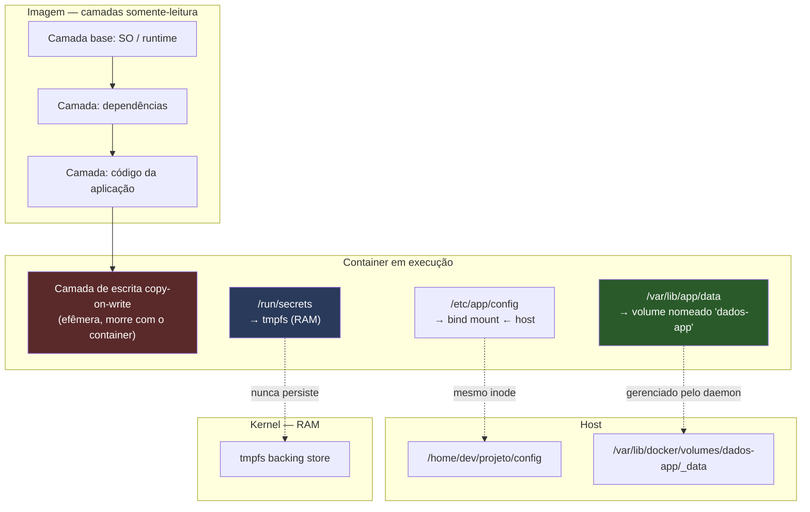
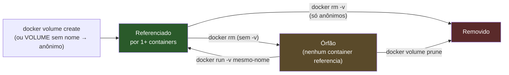

# Dados que sobrevivem ao container

> [!abstract] TL;DR
> Um container é efêmero por desenho: a camada de escrita copy-on-write que ele usa para gravar arquivos morre junto com ele no `docker rm`, e isso não é um bug nem uma limitação a contornar — é a mesma premissa da imagem imutável que a nota 02 já estabeleceu, aplicada agora ao runtime. Quando um dado precisa sobreviver ao ciclo de vida do container, ele só pode morar em um lugar que não seja aquela camada, e o Docker oferece exatamente três desses lugares: o volume nomeado, gerenciado pelo próprio daemon; o bind mount, um caminho do host emprestado ao container; e o tmpfs, memória volátil que nunca toca o disco. Cada um resolve um problema diferente e tem um preço diferente — portabilidade, desempenho, gerenciamento — e escolher errado custa caro, seja em dados perdidos, seja em uma imagem que só roda na máquina de quem a escreveu. Em Linux, a escolha mais comum, o bind mount, esconde uma armadilha estrutural de permissões que confunde até quem já usa Docker há anos: o UID de dentro do container não é o mesmo UID de fora, e o sistema de arquivos não tem como saber disso.

Um desenvolvedor sobe um Postgres em container, roda as migrations, popula a tabela de usuários, testa a aplicação a tarde inteira. No fim do dia, ele encerra tudo com `docker compose down` — ou, pior, esquece e um colega roda `docker system prune -a` na mesma máquina. No dia seguinte, o banco está lá, container rodando, schema criado, mas vazio. Zero linhas. Nenhum erro, nenhum aviso: o Postgres simplesmente inicializou um `data directory` novo, porque o `data directory` antigo não existia mais — ele vivia dentro da camada de escrita do container anterior, e aquele container não existe mais.

Isso não é uma falha do Docker. É a consequência direta e previsível de algo que a [[03-Dominios/Tecnologia/Infraestrutura/Docker/02 - A anatomia de uma imagem|nota 02]] já deixou explícito: a imagem é imutável, composta de camadas somente-leitura empilhadas por um union filesystem, e quando você roda essa imagem o Docker acrescenta por cima uma última camada, fina e descartável, onde qualquer escrita do processo em execução vai parar. Essa camada de escrita é local ao container — não à imagem, não ao host, não a nada além daquele processo específico. Quando o container morre, a camada morre com ele. Não porque o Docker "esqueça" de guardar os dados, mas porque nunca houve intenção de guardá-los ali: aquela camada é rascunho, não arquivo.

O raciocínio correto não é "como evito que o Docker apague meus dados", mas "eu sabia que aquele diretório ia sumir; então por que deixei o dado importante morar nele". A resposta de design do Docker para esse problema é oferecer três lugares alternativos, fora da camada de escrita, onde um dado pode morar com uma vida útil independente do container que o produz.

O restante desta nota trata cada um desses três lugares com o mesmo cuidado: primeiro o mecanismo por dentro que explica por que a camada de escrita se comporta assim, depois o modelo mental de cada uma das três alternativas, a tabela que resume o trade-off entre elas, um diagrama e um exemplo trabalhado que juntam as três num único container, a armadilha de permissão que é praticamente um rito de passagem para quem usa bind mount em Linux, e por fim o ciclo de vida do próprio volume — porque "onde o dado mora enquanto o container está rodando" é só metade da pergunta; a outra metade é "o que acontece com esse dado depois que ninguém mais está olhando para ele".

## Por que o container precisa ser efêmero

Vale registrar por que essa efemeridade é premissa e não acidente, porque entender o "por quê" evita a tentação de tratar volumes como um remendo. Um container reproduzível — que você pode destruir e recriar a qualquer momento a partir da mesma imagem, obtendo sempre o mesmo resultado — só é possível se nada de importante estiver preso ao processo que está rodando agora. Se o comportamento do sistema dependesse de arquivos acumulados na camada de escrita ao longo do tempo, dois containers da mesma imagem, em momentos diferentes, poderiam se comportar de forma diferente, e a promessa central da [[03-Dominios/Tecnologia/Infraestrutura/Docker/03 - O ciclo de vida de um container|nota 03]] — o container como processo cuja identidade nasce e morre junto com o `docker run`/`docker rm` — deixaria de valer.

Separar dado de container é, portanto, o mesmo movimento que separar estado de comportamento em qualquer arquitetura: o comportamento (a imagem) fica versionado, testável, substituível; o estado (o dado) fica em outro lugar, com seu próprio ciclo de vida, sua própria estratégia de backup, sua própria política de acesso. Um container que guarda estado na própria camada de escrita é um container que você tem medo de destruir — e um container do qual você tem medo é um container que já perdeu a razão de ser containerizado.

Esse é, aliás, o mesmo argumento por trás da ideia mais ampla de infraestrutura imutável: se um servidor (ou, aqui, um container) pode ser substituído por uma cópia nova a qualquer momento sem consequência, ele deixa de ser um lugar que alguém precisa cuidar individualmente e passa a ser só uma instância descartável de uma definição — a imagem — que é a única coisa que realmente precisa de cuidado, versionamento e revisão. Volumes, bind mounts e tmpfs são o mecanismo que torna essa substituição segura: eles garantem que "descartar o container" e "descartar o dado" sejam duas decisões independentes, tomadas em momentos diferentes, por motivos diferentes.

## O mecanismo por dentro: copy-on-write e a operação de "copy-up"

Vale abrir por um instante o que realmente acontece dentro do union filesystem quando um processo dentro do container escreve num arquivo que já existe numa das camadas somente-leitura da imagem — porque é esse mecanismo, e não uma regra arbitrária, que explica por que a camada de escrita existe e por que ela é do tamanho que é.

Quando o processo tenta escrever num arquivo que só existe nas camadas de baixo (somente-leitura), o union filesystem não pode simplesmente escrever ali — essas camadas são, por definição, imutáveis, endereçadas por um hash de conteúdo que a [[03-Dominios/Tecnologia/Infraestrutura/Docker/02 - A anatomia de uma imagem|nota 02]] já explicou. Em vez disso, ele executa uma operação chamada *copy-up*: copia o arquivo inteiro (ou, em alguns storage drivers, o quanto for necessário) da camada de baixo para a camada de escrita, e só então aplica a modificação nessa cópia. A partir desse momento, qualquer leitura futura daquele caminho enxerga a versão na camada de escrita, não mais a versão original na imagem — o union filesystem simplesmente prioriza a camada mais alta que contém aquele arquivo.

Duas consequências práticas nascem direto desse mecanismo. A primeira é que modificar um arquivo grande que a imagem já continha (por exemplo, sobrescrever parte de um arquivo de várias centenas de megabytes herdado de uma camada base) pode ser surpreendentemente caro na primeira escrita, porque o copy-up precisa duplicar o arquivo inteiro antes de aplicar uma mudança pequena — um detalhe que explica por que aplicações que geram muito I/O em arquivos grandes e pré-existentes se beneficiam de ter esses caminhos redirecionados para um volume desde o início, em vez de deixar o copy-on-write da imagem lidar com isso. A segunda é que a camada de escrita, exatamente por só conter o que foi de fato modificado ou criado depois que o container começou a rodar, tende a ser pequena para a maioria das aplicações bem comportadas — o que reforça, na prática, por que ela nunca foi pensada como lugar de armazenamento de longo prazo: sua função é registrar diffs de uma execução, não acumular um patrimônio de dados.

## Os três mecanismos e o modelo mental de cada um

O Docker resolve "onde o dado mora" com três primitivas de montagem, cada uma correspondendo a um modelo mental distinto de "quem é dono daquele espaço de armazenamento".

### Volume nomeado: o Docker é o dono

Um volume nomeado é um espaço de armazenamento que o próprio daemon cria, nomeia e gerencia, guardado tipicamente em `/var/lib/docker/volumes/<nome>/_data` no host (o caminho exato é detalhe de implementação, não contrato). Você não aponta para um caminho do host — você pede um nome, e o Docker decide onde fisicamente aquilo mora.

```bash
docker volume create dados-app
docker run -d --name app -v dados-app:/var/lib/app/data minha-imagem
```

O modelo mental é: "esse dado pertence ao Docker, não ao meu filesystem". Isso tem uma consequência prática enorme — o volume é opaco e portável entre containers e entre máquinas (via `docker volume` e ferramentas de backup dedicadas), mas não é diretamente navegável pelo usuário sem passar por um container. Quer olhar o conteúdo de um volume nomeado sem subir a aplicação inteira? Sobe um container descartável só para isso:

```bash
docker run --rm -v dados-app:/data alpine ls -la /data
```

Volumes nomeados são a escolha padrão para qualquer dado que o Docker deve gerenciar de ponta a ponta: dados de banco de dados, uploads persistentes, caches que sobrevivem a redeploys. Eles também suportam drivers de volume plugáveis (NFS, storage de nuvem, Ceph), o que os torna a peça que se conecta ao mundo de orquestração e produção — assunto que esta nota não vai abrir, mas que a [[03-Dominios/Engenharia/Operação/3 - Rodar em produção/01 - Containers em produção|nota de Containers em produção]] trata com a devida profundidade.

O driver padrão de um volume nomeado (`local`) armazena tudo no disco da própria máquina que roda o daemon — é literalmente um diretório dentro de `/var/lib/docker/volumes/`, só que gerenciado pelo Docker em vez de ser um caminho arbitrário escolhido por você. Mas o mesmo comando `docker volume create` aceita um driver diferente, que redireciona esse armazenamento para fora da máquina local:

```bash
docker volume create --driver local \
  --opt type=nfs \
  --opt o=addr=192.168.1.10,rw \
  --opt device=:/exports/dados \
  volume-nfs
```

Do ponto de vista do container que monta `volume-nfs`, nada muda — ele continua vendo um diretório comum em `/var/lib/app/data`, sem saber nem precisar saber que, por trás, cada leitura e escrita está atravessando a rede até um servidor NFS. Essa é a mesma ideia de abstração que torna o volume nomeado portável entre máquinas: o nome e o modelo mental ("Docker é o dono") permanecem estáveis, ainda que o backing store físico mude radicalmente de um driver para outro.

Essa troca de driver sem mudança de vocabulário é, na prática, o mesmo tipo de indireção que faz o volume nomeado ser a peça que conversa naturalmente com orquestradores maiores: um Kubernetes, por exemplo, expõe um conceito de `PersistentVolume` que resolve exatamente o mesmo problema, num nível de abstração comparável, mas com seu próprio ciclo de vida e sua própria terminologia — outro motivo pelo qual essa nota escolhe não avançar sobre o território de produção e orquestração, deixando-o inteiro para a nota dedicada a isso.

### Bind mount: o host é o dono

Um bind mount pega um caminho que já existe no host — um diretório, um arquivo — e o expõe dentro do container em outro caminho. Não há abstração nenhuma: é o mesmo inode, visto de dois lugares.

```bash
docker run -d --name app -v /home/dev/projeto/src:/app/src minha-imagem
docker run -d --name app -v "$(pwd)/config":/etc/app/config:ro minha-imagem
```

O modelo mental é o oposto do volume: "esse dado pertence ao meu filesystem, o container só está de visita". É exatamente o que se quer em desenvolvimento com live reload — você edita o código no editor do host, e o processo dentro do container enxerga a mudança instantaneamente, porque não há cópia envolvida, é o mesmo arquivo. É também o mecanismo certo para injetar configuração específica da máquina, certificados, ou qualquer artefato que já existe fora do universo Docker e que você não quer duplicar dentro de uma imagem.

O preço do bind mount é a portabilidade: o caminho `/home/dev/projeto/src` só existe naquela máquina, com aquele usuário, naquela estrutura de diretórios. Um Dockerfile ou um comando `docker run` que hardcoda esse caminho não roda em outra máquina sem edição. E, em Linux especificamente, o bind mount carrega a armadilha de permissões detalhada mais adiante nesta nota.

Vale registrar também a flag `:ro`, usada no segundo exemplo acima. Um bind mount, por padrão, é bidirecional — o container pode escrever de volta no host tão facilmente quanto o host escreve no container, porque, de novo, é o mesmo arquivo visto de dois ângulos. Isso é exatamente o que se quer para código-fonte em desenvolvimento, mas é perigoso para configuração ou certificados que o container só deveria ler: montar como `:ro` (read-only) impede que um processo comprometido ou com bug dentro do container sobrescreva ou apague algo que pertence ao host. É uma linha de defesa barata — uma flag — contra uma classe inteira de erro que, sem ela, teria acesso de escrita total a um caminho arbitrário do seu filesystem.

### tmpfs: a memória é a dona, e ninguém mais

O terceiro mecanismo nem sequer é armazenamento em disco: `tmpfs` monta um sistema de arquivos inteiramente em memória RAM, visível apenas de dentro do container, e que desaparece por completo quando o container para — não apenas quando é removido, mas já na parada.

```bash
docker run -d --name app --tmpfs /run/secrets:rw,size=64m minha-imagem
```

O modelo mental aqui é "esse dado não deve, em hipótese alguma, tocar um disco". Isso serve a dois propósitos que parecem opostos mas são o mesmo princípio: desempenho (um cache de sessão que precisa de latência de memória, não de disco) e segurança (segredos decodificados em tempo de execução — chaves privadas, tokens desempacotados — que você não quer encontrar meses depois esquecidos num snapshot de disco ou numa camada de imagem por engano). A [[03-Dominios/Tecnologia/Infraestrutura/Docker/13 - Segurança da imagem e do runtime|nota 13]] retoma esse ângulo de segurança com mais profundidade.

> [!tip] Vídeo — persistência em seis minutos
> [**Docker Volumes explained in 6 minutes**](https://www.youtube.com/watch?v=p2PH_YPCsis) (TechWorld with Nana, ~6 min, EN) é curto e cobre exatamente o problema que abre esta nota: por que dados de aplicação com estado — banco de dados, principalmente — não podem viver na camada de escrita do container, que desaparece a cada recriação. Ela percorre as formas de criar volume e o ponto que mais confunde quem está começando: quem administra o diretório no host é o **Docker**, não você, e é por isso que o volume nomeado tem caminho próprio em vez de um diretório qualquer do seu projeto. Fecha mostrando que a declaração em Compose é o mesmo mecanismo, com outra sintaxe. **O que ele não cobre:** o copy-on-write e a operação de *copy-up* que explicam o mecanismo por baixo, a armadilha de permissão em bind mount no Linux — a parte mais cara desta nota —, e o procedimento de backup e restore de volume nomeado.

## Tabela comparativa

| Critério | Volume nomeado | Bind mount | tmpfs |
| --- | --- | --- | --- |
| Quem gerencia o espaço | Docker (daemon) | Você, via caminho do host | Kernel (RAM) |
| Portabilidade entre máquinas | Alta — nome abstrato, sem path do host | Baixa — depende do path existir igual em toda máquina | N/A — não há dado a portar |
| Desempenho típico | Bom, otimizado pelo storage driver do Docker | Depende do filesystem do host (pode ser ótimo ou péssimo) | Excelente — velocidade de RAM |
| Visibilidade direta pelo usuário | Só via container ou `docker volume` | Direta, é o mesmo arquivo do host | Nenhuma fora do container em execução |
| O que acontece no `docker rm` (sem `-v`) | Volume sobrevive, órfão mas intacto | Dado no host intocado (não é do container) | Dado já se foi desde o `stop` |
| O que acontece no `docker rm -v` | Volume anônimo associado é removido junto | Sem efeito — não é gerenciado pelo Docker | Sem efeito — já não existe |
| Quando é a escolha certa | Dados de banco, uploads, caches persistentes, produção | Dev com live reload, configs do host, certificados existentes | Segredos temporários, caches voláteis de altíssimo desempenho |

> [!info] Caducidade
> O caminho físico `/var/lib/docker/volumes/` e o comportamento exato do storage driver (overlay2 na esmagadora maioria das instalações Linux atuais) são detalhes de implementação que já mudaram no passado e podem mudar de novo. Trate como "o Docker decide onde", nunca como contrato estável para scripts de backup fora das ferramentas oficiais (`docker volume`, `docker cp`).

> [!info] Caducidade — desempenho de bind mount em Docker Desktop
> Em Linux nativo, um bind mount tem o mesmo desempenho de acessar o arquivo diretamente, porque não há tradução nenhuma envolvida — é o mesmo kernel, o mesmo filesystem. Em Docker Desktop no macOS e no Windows, o container roda dentro de uma VM leve, e o bind mount atravessa uma camada de compartilhamento de arquivo entre o sistema operacional host e essa VM (historicamente osxfs, hoje VirtioFS por padrão em versões recentes do Docker Desktop para Mac), o que pode introduzir latência perceptível em projetos com muitos arquivos pequenos, como um `node_modules`. Esse detalhe é específico da plataforma e evolui a cada versão do Docker Desktop — não é um comportamento do Docker em si, mas do ambiente onde ele roda fora do Linux.

## As três origens de dado num único container

O diagrama a seguir mostra um container único convivendo com as três fontes de dado ao mesmo tempo — cenário realista de uma aplicação com banco embutido de cache, configuração do host e segredo em memória — junto com as camadas somente-leitura da imagem que a nota 02 já descreveu.



Note que as três montagens (`V`, `B`, `T`) vivem *ao lado* da camada de escrita, não dentro dela — são pontos de montagem que interceptam a escrita naquele caminho específico e a redirecionam para fora do union filesystem da imagem. É por isso que um `docker rm` remove a camada de escrita inteira, mas os três (volume, bind mount, tmpfs backing) seguem cada um o próprio destino, descrito na tabela acima.

Vale reparar também no que o diagrama *não* mostra: nenhuma seta liga diretamente as camadas somente-leitura da imagem (`L1`, `L2`, `L3`) a qualquer uma das três montagens. Isso é proposital — o processo de montagem de volume, bind mount ou tmpfs acontece no momento em que o container é criado a partir da imagem, mas é uma operação do runtime (`containerd`/`runc`, orquestrado pelo daemon), não uma propriedade da imagem em si. A mesma imagem, sem nenhuma alteração, pode ser rodada com três montagens diferentes, sem montagem nenhuma, ou com uma combinação totalmente distinta — a imagem não sabe, e não precisa saber, o que vai ser montado onde quando alguém finalmente rodar `docker run`.

## Banco de dados em container: o caso canônico, com um limite explícito

Rodar um Postgres, MySQL ou MongoDB em container com um volume nomeado apontando para o diretório de dados é, de longe, o padrão mais comum de uso de volumes que existe, e por um motivo simples: em desenvolvimento, você quer poder destruir e recriar o container da aplicação (novo build, nova versão da imagem, teste de configuração) sem perder o banco, e ao mesmo tempo quer que o banco em si seja descartável quando o projeto trocar de máquina ou for reiniciado do zero.

```bash
docker volume create postgres-data
docker run -d --name meu-postgres -e POSTGRES_PASSWORD=segredo -v postgres-data:/var/lib/postgresql/data postgres:16
```

Esse padrão funciona muito bem em desenvolvimento porque as perguntas que importam em produção — replicação, failover, backup consistente sob carga, latência de disco garantida, isolamento de recursos entre bancos concorrentes — simplesmente não se colocam num ambiente onde só existe uma instância, um usuário, e a pior consequência de perder o dado é rodar `migrate` de novo. Em produção, cada uma dessas perguntas tem peso, e a resposta raramente é "container com volume nomeado no mesmo host do daemon que roda a aplicação" — mais frequentemente é um serviço de banco gerenciado, ou um cluster com storage dedicado e sua própria disciplina operacional. Essa é uma conversa inteira por si só, e quem quiser entrá-la encontra o terreno preparado na [[03-Dominios/Engenharia/Operação/3 - Rodar em produção/01 - Containers em produção|nota de Containers em produção]]. Aqui, o ponto é só reconhecer a fronteira: o volume nomeado resolve "onde o dado mora tecnicamente", não "como esse dado é operado com a seriedade que produção exige".

Um sinal prático de que essa fronteira foi cruzada sem querer: se a pergunta que surge é "e se o host onde o volume mora cair", a resposta séria não está mais no vocabulário desta nota. Volume nomeado resolve "o container pode morrer sem levar o dado junto"; não resolve "a máquina física pode morrer sem levar o dado junto" — isso é um problema de storage distribuído, replicação e backup fora do daemon local, tema que pertence à camada de produção, não à primitiva do Docker isoladamente.

Um segundo sinal, mais sutil, é a pergunta "e se eu precisar rodar duas réplicas desse banco ao mesmo tempo, para dividir carga de leitura". Um volume nomeado local está preso a um único daemon Docker, numa única máquina — ele não tem noção de "outra instância do mesmo banco, em outro lugar, sincronizada com esta". Réplicas de leitura, replicação síncrona ou assíncrona entre instâncias, e coordenação de failover são, de novo, disciplinas do banco de dados e da camada de orquestração, não algo que a primitiva de volume, por si só, jamais prometeu resolver.

### A instrução `VOLUME` no Dockerfile: um detalhe que surpreende

Vale registrar um comportamento do Dockerfile que costuma pegar quem já entendeu o resto: a instrução `VOLUME /var/lib/postgresql/data` dentro de um Dockerfile não cria um volume nomeado com um nome escolhido por você — ela declara que aquele caminho deve *sempre* ser um ponto de montagem externo à camada de escrita, e se ninguém especificar de onde vem essa montagem no `docker run`, o Docker cria um volume anônimo automaticamente para satisfazer a declaração. Isso é ótimo para garantir que a imagem nunca deixe alguém escrever dados importantes na camada de escrita por esquecimento, mas péssimo se você não perceber que aconteceu: rodar a mesma imagem várias vezes sem `-v` explícito gera um volume anônimo novo a cada `docker run`, e o dado da execução anterior fica "perdido" só porque ninguém apontou de volta para o mesmo nome.

```dockerfile
FROM postgres:16
VOLUME /var/lib/postgresql/data
```

```bash
docker run -d postgres-custom
# cria volume anônimo #1, dados novos

docker run -d postgres-custom
# cria volume anônimo #2, dados novos — NÃO reaproveita o #1
```

A saída é sempre a mesma: nomear explicitamente a montagem no `docker run` (ou no Compose), em vez de depender do que a imagem declara implicitamente. A declaração `VOLUME` no Dockerfile é uma garantia de que *algum* ponto de montagem vai existir ali — nunca uma garantia de *qual* volume.

## A armadilha central em Linux: bind mount e permissão

Este é o ponto onde a maioria das pessoas trava na primeira vez que usa bind mount em Linux, e vale entender o mecanismo até o fim, não só decorar o comando que "resolve".

Dentro do container, todo processo roda como um usuário identificado por um UID numérico — por padrão, muitas imagens rodam como root, UID 0, embora cada vez mais imagens definam um usuário não-root explícito (`USER app` no Dockerfile, com um UID fixo, digamos 1000). Esse UID não tem cadastro nenhum: ele é só um número. O nome que aparece associado a ele (`root`, `app`, `node`) vem do arquivo `/etc/passwd` *dentro* daquela imagem — um mapeamento local, que o kernel do host nunca vê.

Quando você faz um bind mount, o kernel do host não sabe nada sobre containers, imagens ou `/etc/passwd` de dentro deles. Ele só sabe de UIDs numéricos, porque é assim que o filesystem Linux sempre funcionou — permissão de arquivo é UID/GID numérico mais um bitmask, ponto final. Então, quando o processo do container (UID 1000 dentro do container) escreve um arquivo no bind mount, o host registra a dona daquele arquivo como "UID 1000" — mas UID 1000 no host pode ser um usuário completamente diferente (ou nenhum usuário cadastrado). É por isso que, depois de rodar um container que escreve num bind mount, você abre o `ls -la` no host e vê arquivos pertencendo a um UID estranho, às vezes sem nome associado, às vezes pertencendo a outra pessoa da máquina.

O caminho inverso — que costuma doer mais em desenvolvimento — é o container não conseguir escrever no diretório montado porque o dono do diretório no host é o seu usuário local (UID 1000, digamos), mas o processo dentro do container roda como um UID diferente (UID 0 numa imagem que roda como root, ou UID 999 numa imagem que definiu outro usuário fixo), e o bitmask de permissão do diretório no host simplesmente não concede escrita para aquele UID.

Nenhum dos dois lados está "errado". O host e o container concordam perfeitamente sobre o que é permitido para cada UID — eles só discordam sobre quem é dono de qual número, porque não existe, e nunca existiu, um registro compartilhado de identidade entre os dois mundos. O bind mount expõe essa discordância porque é a única das três montagens que atravessa o limite entre dois espaços de nomes de usuário diferentes.

Três saídas reais, cada uma resolvendo o problema em um nível diferente:

**Alinhar UID/GID entre host e imagem.** A solução mais robusta a longo prazo é garantir que o UID que o processo usa dentro do container seja o mesmo UID do dono do diretório no host. Isso normalmente é feito recebendo o UID como argumento de build:

```dockerfile
ARG UID=1000
ARG GID=1000
RUN groupadd -g "$GID" app && useradd -u "$UID" -g "$GID" -m app
USER app
```

```bash
docker build --build-arg UID=$(id -u) --build-arg GID=$(id -g) -t minha-imagem .
```

**Forçar o UID em tempo de execução com `--user`.** Sem tocar no Dockerfile, é possível fazer o container rodar com o UID do usuário atual do host diretamente na invocação:

```bash
docker run --user "$(id -u):$(id -g)" -v "$(pwd)/dados":/app/dados minha-imagem
```

Isso funciona bem quando a imagem não depende de rodar como um usuário nomeado específico internamente (algumas aplicações checam `$HOME` ou entradas de `/etc/passwd` e quebram se o UID não tiver um nome mapeado — vale testar).

**Ajustar a permissão no host.** A saída mais simples e mais frequentemente usada em desenvolvimento: liberar o diretório do host para o UID que o container usa, seja com `chmod` mais permissivo, seja criando o diretório previamente com o dono certo antes do primeiro `docker run`:

```bash
mkdir -p ./dados && chown 1000:1000 ./dados
```

Nenhuma dessas três é universalmente "a certa" — a escolha depende de quanto controle você tem sobre a imagem (é sua ou de terceiros?), quanto controle tem sobre o host (é sua máquina de dev ou um servidor compartilhado?), e se o requisito é resolver uma vez ou toda vez que alguém novo clona o projeto.

Existe ainda uma segunda camada de restrição, específica de distribuições Linux com SELinux habilitado (Fedora, RHEL, CentOS e derivados), que se manifesta como um erro de permissão mesmo depois de UID e GID estarem perfeitamente alinhados: o SELinux rotula cada arquivo do host com um contexto de segurança, e por padrão o processo dentro do container não tem permissão para acessar arquivos com o rótulo padrão do host, independentemente do UID envolvido. A saída, nesse caso, é uma flag adicional na montagem — `:z` para permitir compartilhamento do rótulo entre múltiplos containers, `:Z` para um rótulo privado e exclusivo daquele container — que instrui o Docker a reetiquetar o conteúdo do bind mount com um contexto SELinux compatível:

```bash
docker run -v "$(pwd)/dados":/app/dados:Z minha-imagem
```

Essa é uma armadilha adicional e ortogonal à de UID/GID: mesmo depois de alinhar os dois números perfeitamente, uma máquina com SELinux ativo ainda pode recusar o acesso por um motivo completamente diferente, e o sintoma no terminal — "permission denied" — é idêntico nos dois casos, o que costuma levar quem não conhece SELinux a insistir, sem sucesso, nas soluções de UID/GID descritas acima.

## Backup e restore de um volume nomeado

Como um volume nomeado é opaco — não é um diretório que você navega diretamente no Explorer ou no Finder do host —, tirar um backup dele exige o mesmo truque já usado antes nesta nota: subir um container descartável que monta o volume e faz o trabalho de leitura ou escrita em nome de quem pediu o backup. O padrão canônico usa uma imagem mínima, tipicamente `alpine` ou `busybox`, monta o volume de origem, monta um bind mount do host como destino, e roda uma compactação:

```bash
docker run --rm -v postgres-data:/origem -v "$(pwd)":/destino alpine tar czf /destino/backup-postgres.tar.gz -C /origem .
```

O restore é o espelho: cria um volume novo (ou reaproveita um já existente e vazio), monta como destino, e extrai o backup para dentro dele.

```bash
docker volume create postgres-data-restaurado
docker run --rm -v postgres-data-restaurado:/destino -v "$(pwd)":/origem alpine tar xzf /origem/backup-postgres.tar.gz -C /destino
```

Note que esse comando não sabe nada sobre Postgres, MySQL ou qualquer aplicação específica — ele copia bytes de um lugar para outro, cegamente. Para bancos de dados relacionais em produção, isso é geralmente insuficiente por si só: um `tar` de um data directory de Postgres em pleno funcionamento pode capturar arquivos em estados inconsistentes entre si, porque não há coordenação com o processo do banco sobre quando é seguro copiar o quê. A saída correta para esse caso é usar a ferramenta de backup nativa do banco (`pg_dump`, `pg_basebackup`, mysqldump, e equivalentes) rodando dentro ou fora do container, não copiar o diretório de dados como se fosse um arquivo qualquer — mais um motivo pelo qual a seriedade operacional de um banco em produção é conversa própria, fora do escopo desta nota.

## Ciclo de vida do volume: nomeado, anônimo e órfão

Um detalhe que passa despercebido até o disco encher: existem volumes *nomeados*, que você criou e referenciou explicitamente por um nome, e volumes *anônimos*, criados implicitamente quando um Dockerfile declara `VOLUME` ou quando um `docker run -v /caminho/no/container` monta um caminho sem especificar a origem — o Docker cria um volume com um hash aleatório como nome só para satisfazer aquela montagem.

```bash
docker volume ls
```

lista todos, nomeados e anônimos, e é comum uma máquina de desenvolvimento acumular dezenas de volumes anônimos de containers que já foram removidos há muito tempo — porque a remoção padrão do container (`docker rm`, ou `docker run --rm` ao final da execução) **não** remove o volume associado, exatamente para proteger contra perda acidental de dado. Esses volumes ficam órfãos: existem, ocupam espaço em disco, mas nenhum container os referencia mais.

```bash
docker volume prune
```

remove todos os volumes que não estão associados a nenhum container em execução ou parado — uma faxina útil, mas que vale rodar com atenção, porque ela não distingue "volume órfão inútil de um teste antigo" de "volume nomeado de um banco que você só não está rodando agora".

O caminho que um volume percorre, do nascimento ao desaparecimento, pode ser resumido num fluxo simples de estados:



O estado que mais surpreende quem não conhece esse ciclo é o "órfão": um volume nesse estado não está quebrado, não está marcado para remoção automática, e não dá nenhum sinal de alerta espontâneo — ele só existe, silenciosamente, até alguém rodar `prune` ou reconectá-lo a um novo container pelo mesmo nome. É esse silêncio que faz volumes órfãos se acumularem ao longo de meses sem que ninguém perceba, até o dia em que `docker system df` revela quantos gigabytes estavam parados ali.

Isso explica por que existe a flag `-v` no próprio `docker rm`:

```bash
docker rm -v meu-container
```

Sem `-v`, remover o container deixa o volume associado para trás — comportamento seguro por padrão. Com `-v`, o Docker também remove qualquer volume anônimo que só aquele container usava (volumes nomeados explicitamente sobrevivem mesmo com `-v`, porque presume-se que um nome escolhido por você é intencional demais para apagar de brinde). Entender essa distinção evita dois erros simétricos: perder um banco de dados por engano ao rodar `docker rm -v` sem pensar, ou acumular gigabytes de volumes anônimos esquecidos por nunca usar `-v` nem `prune`.

Vale mencionar, sem entrar no assunto, que quando o projeto cresce para múltiplos containers coordenados, é o [[03-Dominios/Tecnologia/Infraestrutura/Docker/11 - Compose como ambiente de desenvolvimento|Compose]] quem passa a declarar esses volumes de forma centralizada no `docker-compose.yml`, em vez de cada `docker run` repetir a mesma flag — mas o mecanismo por baixo continua sendo exatamente o que esta nota descreveu.

Para ter visão de conjunto de quanto espaço em disco todo esse acúmulo silencioso está ocupando — camadas de imagem, camadas de escrita de containers parados, e volumes, nomeados e órfãos —, o comando de diagnóstico é:

```bash
docker system df -v
```

A flag `-v` detalha volume por volume, com tamanho ocupado e quantos containers referenciam cada um. É comum, numa máquina de desenvolvimento com meses de uso, descobrir ali dezenas de gigabytes presos em volumes anônimos de experimentos já esquecidos — o tipo de descoberta que transforma `docker volume prune` de comando arriscado em faxina claramente justificada.

### Inspecionando um volume: o que o Docker sabe sobre ele

Para além do `docker volume ls`, que só lista nomes, `docker volume inspect` mostra o que o daemon efetivamente guarda sobre cada volume — informação útil tanto para depurar "por que esse container não está vendo o dado que eu esperava" quanto para auditar o que existe numa máquina compartilhada:

```bash
docker volume inspect dados-app
```

```json
[
    {
        "CreatedAt": "2026-08-02T10:15:00Z",
        "Driver": "local",
        "Labels": {},
        "Mountpoint": "/var/lib/docker/volumes/dados-app/_data",
        "Name": "dados-app",
        "Options": {},
        "Scope": "local"
    }
]
```

O campo `Mountpoint` é o caminho físico real no host — útil para depuração pontual, mas, como o callout de caducidade já registrou, nunca deve virar parte de um script de automação, porque é implementação, não contrato. O campo `Labels` aceita metadados arbitrários definidos na criação (`docker volume create --label projeto=meuapp --label ambiente=dev dados-app`), o que se torna valioso justamente no cenário descrito na seção de ciclo de vida: numa máquina com dezenas de volumes acumulados, rotular por projeto ou por ambiente é o que torna possível filtrar (`docker volume ls --filter label=projeto=meuapp`) em vez de adivinhar, pelo nome sozinho, qual volume pertence a qual contexto.

### `docker cp`: a exceção pontual que não substitui um mecanismo de persistência

Existe ainda um quarto comando que lida com dados de container, mas que não é uma quarta primitiva de persistência: `docker cp` copia arquivos entre o filesystem do host e o filesystem de um container em execução (ou parado), em qualquer direção, sem exigir que nenhuma montagem tenha sido declarada de antemão.

```bash
docker cp meu-container:/var/log/app/error.log ./error.log
docker cp ./seed.sql meu-container:/tmp/seed.sql
```

É a ferramenta certa para uma extração ou injeção pontual — puxar um log para inspeção, empurrar um script de seed uma vez — mas não resolve o problema desta nota, porque o arquivo copiado para dentro do container por `docker cp` vai parar exatamente onde qualquer outra escrita iria: na camada de escrita efêmera, se o caminho de destino não for um ponto de montagem já existente. Usar `docker cp` como estratégia recorrente de persistência é reintroduzir, por outra porta, o mesmo problema que volumes, bind mounts e tmpfs existem para resolver.

## Exemplo trabalhado: os três mecanismos num único `docker run`

Para fechar o raciocínio, vale montar o cenário completo que o diagrama da seção anterior descreve, com o comando real que produziria exatamente aquela topologia. Imagine uma aplicação web que precisa de três coisas ao mesmo tempo: um diretório de dados persistente e gerenciado pelo Docker, um arquivo de configuração que já existe no host e não deve ser duplicado dentro da imagem, e um espaço de memória para descriptografar um segredo em tempo de execução sem nunca gravá-lo em disco.

```bash
docker volume create dados-app

docker run -d \
  --name minha-app \
  -v dados-app:/var/lib/app/data \
  -v "$(pwd)/config":/etc/app/config:ro \
  --tmpfs /run/secrets:rw,size=16m \
  --user "$(id -u):$(id -g)" \
  minha-imagem
```

Cada flag `-v` ou `--tmpfs` nesse comando corresponde a uma decisão consciente sobre "quem é dono deste espaço", não a uma escolha arbitrária de sintaxe. O volume nomeado garante que `docker rm minha-app` seguido de um novo `docker run` reconecte ao mesmo dado. O bind mount `:ro` garante que a aplicação leia a configuração do host, mas não possa corrompê-la mesmo com um bug de escrita. O `--tmpfs` garante que, seja lá o que a aplicação decodificar para dentro de `/run/secrets` em tempo de execução, isso desapareça no exato instante em que o processo parar — nunca sobra num snapshot de disco, nunca vira uma camada de imagem por acidente. E o `--user` alinhado ao UID do host resolve de antemão a armadilha de permissão que a seção seguinte detalha, garantindo que qualquer escrita feita pela aplicação no bind mount (se houvesse alguma além da leitura) apareça no host pertencendo ao mesmo usuário que rodou o comando.

Rodar `docker inspect minha-app` depois de subir esse container confirma a topologia: a seção `Mounts` do JSON retornado lista as três montagens, cada uma com seu `Type` (`volume`, `bind` ou `tmpfs`), sua origem e seu destino — a mesma informação que o diagrama Mermaid representou visualmente, mas na forma que o próprio Docker usa internamente para rastrear cada montagem:

```json
"Mounts": [
    { "Type": "volume", "Name": "dados-app", "Destination": "/var/lib/app/data", "RW": true },
    { "Type": "bind", "Source": "/home/dev/projeto/config", "Destination": "/etc/app/config", "RW": false },
    { "Type": "tmpfs", "Destination": "/run/secrets", "RW": true }
]
```

Ler essa lista é, na prática, o equivalente a perguntar ao próprio Docker "onde cada um dos meus dados realmente mora agora" — útil sempre que o comportamento observado do container (um arquivo que não some, uma escrita que falha, uma configuração que parece não atualizar) não bate com o que se esperava, porque a primeira pergunta de diagnóstico é sempre "essa montagem está mesmo configurada do jeito que eu acho que está?", não "por que o Docker está se comportando de forma estranha?".

Esse hábito de diagnóstico — checar `Mounts` antes de suspeitar de qualquer outra coisa — vale tanto quanto qualquer regra de sintaxe descrita nesta nota, porque a maioria dos "bugs" de persistência que parecem misteriosos à primeira vista se resolve, na prática, em descobrir que a montagem configurada não era a que se imaginava: um volume com nome ligeiramente diferente do esperado, um bind mount apontando para o caminho errado do host, ou um `tmpfs` onde deveria haver um volume nomeado.

## Armadilhas comuns

> [!warning] Achar que `docker stop` já perdeu o dado do volume
> É comum confundir "parar" com "apagar". `docker stop` só interrompe o processo — a camada de escrita, o volume nomeado e o bind mount continuam intactos, prontos para o próximo `docker start`. Só o `tmpfs` some nesse momento, porque vive em RAM associada ao processo. A confusão nasce de tratar as três montagens como equivalentes quando elas têm ciclos de vida distintos: pare para lembrar qual dos três está em jogo antes de assumir que o dado sumiu.

> [!warning] Montar um bind mount por cima de um diretório que a imagem já populou
> Se o Dockerfile copia arquivos de configuração ou seed de dados para `/app/data` e, em seguida, você monta um bind mount vazio nesse mesmo caminho, o conteúdo que a imagem colocou ali fica invisível — não apagado, apenas obscurecido pela montagem por cima, exatamente como qualquer mount Linux esconde o que havia no ponto de montagem antes. É a mesma lógica de union filesystem da nota 02, aplicada agora ao ponto onde o mount acontece: a camada de baixo continua existindo, só não é mais visível através daquele caminho enquanto o mount estiver ativo. Remover a montagem (recriar o container sem aquela flag `-v`) faz o conteúdo original da imagem reaparecer intacto — nada foi perdido, só temporariamente coberto.

> [!warning] Copiar segredos de produção para dentro de uma imagem "só para testar"
> Colocar uma credencial real dentro de um `COPY` do Dockerfile, mesmo que temporariamente, grava aquele segredo numa camada permanente da imagem — removível do `Dockerfile` final, mas não do histórico de camadas já construídas e possivelmente já enviadas a um registry. Segredo de teste, se precisa entrar no container, entra por bind mount, por variável de ambiente injetada em tempo de execução, ou por `tmpfs` — nunca por uma instrução que vira camada.

> [!warning] Esquecer o volume nomeado ao migrar de máquina
> Volumes nomeados não acompanham automaticamente um `git clone` nem um `docker save`/`docker load` de imagem — eles vivem no daemon local, fora do controle de versão e fora da imagem. Trocar de máquina, ou reconstruir o ambiente do zero, sem um plano explícito de backup/restore do volume (`docker run --rm -v origem:/from -v destino:/to alpine cp -a /from/. /to/`, ou uma ferramenta dedicada) é a forma mais comum de "sumir" com um banco de desenvolvimento que ninguém tinha intenção de perder.

> [!warning] Depender de `VOLUME` no Dockerfile achando que isso nomeia o volume
> Como descrito acima, `VOLUME` na imagem só garante que aquele caminho será um ponto de montagem externo — se o `docker run` não especificar o nome, cada execução ganha um volume anônimo novo e o dado da execução anterior parece ter desaparecido. O sintoma ("meu banco zerou de novo!") é idêntico ao da abertura desta nota, mas a causa aqui é uma montagem anônima diferente a cada vez, não a ausência de qualquer montagem.

> [!warning] Assumir que `tmpfs` tem espaço ilimitado
> Um `tmpfs` sem `size` explícito herda um limite padrão (frequentemente metade da RAM total visível ao container, mas isso varia por configuração do kernel e do daemon), e um `tmpfs` cheio se comporta como qualquer filesystem cheio: a próxima escrita falha com erro de "no space left on device", só que consumindo RAM em vez de disco enquanto isso. Para cargas que escrevem volume relevante de dados temporários, declarar `size=` explicitamente evita tanto o estouro silencioso quanto o risco oposto, de um container mal-comportado consumir memória do host além do que deveria.

## Como explicar em inglês

*"Containers are ephemeral by design — the writable layer a container uses at runtime dies with the container itself, so anything that needs to outlive the container has to live outside that layer. Docker gives you three ways to do that: named volumes, which Docker manages end-to-end and are the right default for database data and persistent uploads; bind mounts, which expose a host path directly inside the container and are ideal for local development with live reload; and tmpfs, an in-memory mount that never touches disk, used for secrets and high-throughput caches. On Linux specifically, bind mounts introduce a permission gotcha: the UID inside the container and the UID on the host don't share an identity mapping, so files written from inside the container can show up owned by an unexpected UID on the host, or the container can fail to write into a host directory it doesn't have numeric permission for."*

Numa entrevista técnica, essa distinção entre "quem é dono do storage" costuma render uma pergunta de acompanhamento natural — "so what happens to the data when you run `docker rm`?" — e a resposta correta soa mais sênior quando articula o "why", não só o "what": *"It depends entirely on where the data lived. If it was in the writable layer, it's gone — that layer belongs to the container, not the image or the host. If it was in a named volume, it survives, because the volume's lifecycle is independent of any single container that happens to mount it."* Vale também dominar o verbo certo para "esconder um conteúdo por baixo de um mount": em inglês, diz-se que o mount *"shadows"* ou *"obscures"* o conteúdo anterior daquele caminho, nunca que ele o "deletes" — distinção pequena, mas que sinaliza entendimento correto do mecanismo em vez de medo genérico de perda de dado.

| Termo em PT-BR | Termo em EN | Nuance de uso |
| --- | --- | --- |
| Volume nomeado | Named volume | Em inglês, "volume" sozinho já costuma implicar "named volume, managed by Docker" — especifique "bind mount" quando quiser deixar claro que não é isso |
| Camada de escrita | Writable layer / container layer | "Writable layer" é o termo mais comum em documentação oficial; "container layer" aparece em contextos mais informais |
| Efêmero | Ephemeral | Palavra-chave em qualquer discussão sobre containers em inglês; usar "temporary" soa mais fraco e menos técnico |
| Montar (um volume) | Mount (a volume) | Verbo técnico direto; "attach a volume" também aparece, mas "mount" é o termo do man page e da CLI |
| Volume órfão | Orphaned volume / dangling volume | "Dangling" é mais comum quando se fala de imagens (`dangling images`); para volumes, "orphaned" é mais claro em conversa |
| Alinhar UID/GID | Align UID/GID / UID mapping | Em discussões mais avançadas, "user namespace remapping" é o termo para a solução mais profunda (fora do escopo desta nota) |
| Esconder (um mount por cima de outro) | Shadow / obscure | Nunca "delete" ou "erase" — o conteúdo por baixo continua existindo, só fica inacessível enquanto o mount estiver ativo |
| Faxina de volumes não usados | Prune | Termo específico da CLI do Docker (`docker volume prune`), não traduzido nem mesmo em conversas técnicas em português |

## O que vem a seguir

Resolvido onde o dado mora, sobra uma pergunta simétrica que essa nota deliberadamente não tocou: como esse container, agora com seu estado a salvo fora da camada de escrita, é alcançado por outros processos — outro container, o host, a internet. Um volume nomeado guarda dados; ele não abre porta nenhuma, não resolve nome nenhum, não decide quem consegue falar com o Postgres que acabamos de dar persistência. Essa é exatamente a lacuna que a [[03-Dominios/Tecnologia/Infraestrutura/Docker/07 - Rede no Docker|próxima nota, sobre rede no Docker]], vai fechar.

Não é coincidência que as duas perguntas — "onde o dado mora" e "como o container é alcançado" — apareçam em sequência: são as duas metades do mesmo problema mais amplo, que é fazer um processo efêmero e substituível se comportar, de fora, como se fosse um serviço estável e confiável. Persistência resolve a estabilidade do estado; rede resolve a estabilidade do endereço. Só com as duas resolvidas um container deixa de ser um experimento isolado e começa a parecer, de fato, uma peça de infraestrutura.

## Fontes

- Docker Docs — Volumes: https://docs.docker.com/engine/storage/volumes/
- Docker Docs — Bind mounts: https://docs.docker.com/engine/storage/bind-mounts/
- Docker Docs — tmpfs mounts: https://docs.docker.com/engine/storage/tmpfs/
- Docker Docs — Manage data in Docker (visão geral comparativa): https://docs.docker.com/get-started/docker-concepts/running-containers/persisting-container-data/
- Docker Docs — `docker volume prune`: https://docs.docker.com/engine/reference/commandline/volume_prune/
- Red Hat — Understanding root inside and outside a container: https://www.redhat.com/en/blog/understanding-root-inside-outside-container
- Moby Project — User namespace remapping (mecanismo que resolve a discrepância de UID de forma mais profunda): https://docs.docker.com/engine/security/userns-remap/
- Docker Docs — `docker system df`: https://docs.docker.com/engine/reference/commandline/system_df/
- Docker Docs — `docker volume inspect` e `docker volume create` (drivers, labels, opções): https://docs.docker.com/reference/cli/docker/volume/
- Docker Docs — Docker Desktop for Mac, file sharing (VirtioFS/osxfs e desempenho de bind mount fora do Linux): https://docs.docker.com/desktop/settings-and-maintenance/settings/
