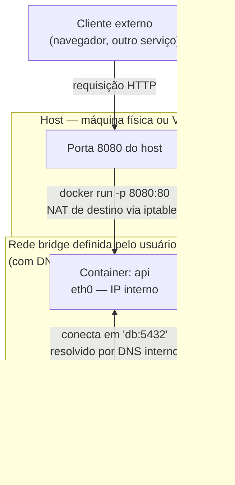
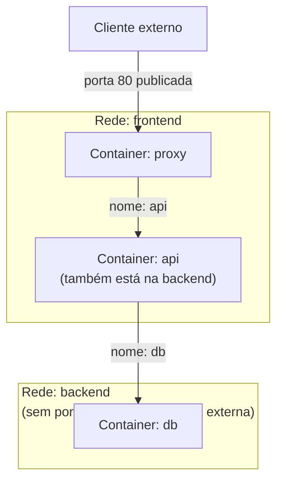

# Rede no Docker

> [!abstract] TL;DR
> Cada container nasce com sua própria pilha de rede isolada — interface, tabela de rotas, portas — e o que muda de driver para driver é só como essa pilha se conecta ao resto do mundo. A confusão mais comum do dia a dia não é sobre isolamento, é sobre nomeação: a bridge padrão do Docker não resolve nomes de container por DNS, uma bridge definida pelo usuário resolve, e essa diferença sozinha explica boa parte dos "não consigo conectar de um container no outro" que aparecem em fórum. Publicar porta com `-p` e declarar `EXPOSE` no Dockerfile parecem a mesma coisa e não são: um cria uma regra real de encaminhamento no host, o outro é documentação que não move um único pacote. Entender essas duas distinções — bridge padrão vs. definida pelo usuário, e `EXPOSE` vs. `-p` — resolve a maior parte dos problemas de rede que você vai encontrar antes mesmo de abrir um `docker network inspect`.

Dois containers, a mesma máquina, o mesmo `docker run` repetido duas vezes com nomes diferentes. Um roda uma API, o outro roda um banco Postgres. A API tenta conectar em `db:5432` — porque foi assim que o README do projeto disse para configurar `DATABASE_URL` — e recebe `getaddrinfo ENOTFOUND db`. Nem firewall, nem porta errada: o nome `db` simplesmente não existe para quem pergunta. A pessoa tenta de novo com o IP do container, funciona, e o mistério vira "ah, tem que usar IP mesmo com Docker". Não tem. O problema não é rede quebrada, é rede sem resolução de nomes — e a razão para isso está numa escolha de design que o Docker fez há mais de uma década e nunca mudou, por compatibilidade retroativa: a rede que ele cria automaticamente, sem você pedir, não tem DNS interno. Uma rede que você cria explicitamente tem. Essa nota inteira gira em torno dessa distinção e do que fica visível quando você a entende — o que confirma sozinho por que quase todo tutorial de Docker Compose recomenda criar uma rede nomeada em vez de confiar na padrão.

## Cada container tem sua própria pilha de rede

Antes de falar de drivers, vale fixar o que é constante independente do driver escolhido: por padrão, cada container roda em seu próprio *network namespace* do Linux. Isso significa que ele enxerga o mundo com uma interface de rede própria (normalmente `eth0`), uma tabela de rotas própria, um conjunto de portas própria, e até suas próprias regras de firewall a nível de namespace. Dois containers rodando na mesma máquina não competem pela porta 80 entre si — cada um pode ter seu próprio processo escutando em `0.0.0.0:80` sem conflito nenhum, porque `0.0.0.0:80` dentro do container A e `0.0.0.0:80` dentro do container B são endereços em espaços completamente separados. É a mesma lógica de isolamento que a [[03-Dominios/Tecnologia/Infraestrutura/Docker/03 - O ciclo de vida de um container|nota sobre o ciclo de vida do container]] já estabeleceu para o processo: o container não compartilha automaticamente nada com o host nem com os irmãos, a não ser que alguém decida explicitamente que deve compartilhar.

O que um **driver de rede** faz é decidir *como* essa pilha isolada se conecta a alguma coisa fora dela — ao host, a outros containers, à internet. Não é uma opção cosmética: é a peça que determina se dois containers conseguem se enxergar, se um container vê a interface real da máquina, ou se ele fica completamente mudo para o mundo. Pensar "rede do Docker" como uma coisa única é o primeiro erro de modelo mental; existem várias formas de conectar essas pilhas, e cada uma resolve um problema diferente.

Vale espiar essa pilha isolada de perto uma vez, para que ela pare de ser abstrata. Rodando `docker inspect` num container qualquer, a seção `NetworkSettings` mostra exatamente o que o namespace de rede desse container contém: um `IPAddress` próprio, um `Gateway` próprio (normalmente o IP da bridge à qual ele está conectado), e um `MacAddress` próprio. Nada disso é emprestado do host nem compartilhado com outro container por padrão — é alocado individualmente, container por container, no momento em que ele entra numa rede.

```bash
docker inspect --format '{{json .NetworkSettings.Networks}}' meucontainer | python3 -m json.tool

# Saída resumida — um bloco por rede à qual o container está conectado
# {
#     "app-net": {
#         "IPAddress": "172.20.0.3",
#         "Gateway": "172.20.0.1",
#         "MacAddress": "02:42:ac:14:00:03",
#         "NetworkID": "a1b2c3...",
#         "Aliases": ["meucontainer", "a1b2c3d4e5f6"]
#     }
# }
```

Note o campo `Aliases`: mesmo antes de qualquer configuração extra, o próprio Docker já registra o nome do container e o ID curto como apelidos resolvíveis dentro daquela rede — desde que ela seja uma rede definida pelo usuário. Esse campo é a ponta visível do DNS interno que a seção seguinte explica em detalhe.

Uma consequência dessa isolação que costuma pegar quem vem de um mundo sem containers, onde vários processos do mesmo host se falam por `localhost` sem pensar duas vezes: `localhost` dentro de um container **não** aponta para o host, nem para outro container — aponta para o próprio loopback daquele container, isolado como tudo mais na sua pilha de rede. Migrar uma aplicação de "dois processos na mesma máquina, se falando por `localhost:5432`" para "dois containers separados" e manter `localhost:5432` na configuração é um erro silencioso clássico: cada container tem seu próprio `localhost`, e o Postgres do outro container simplesmente não está lá. A correção é sempre a mesma que o resto desta nota já cobriu — trocar `localhost` pelo nome do container na rede definida pelo usuário — mas o motivo de precisar trocar é especificamente este: loopback não atravessa fronteira de namespace de rede, custe o que custar.

## Os drivers que você vai usar de verdade

Existem cinco drivers embutidos no Docker, mas na prática o dia a dia — sobretudo em máquina única, sem Swarm — se resolve com três, e os outros dois você só precisa reconhecer de longe.

**bridge** é o padrão. É uma rede virtual privada dentro do host, implementada com uma bridge de software do Linux — uma espécie de switch virtual — à qual cada container se conecta por um par de interfaces virtuais (`veth`). Quando você roda `docker run` sem especificar `--network`, é isso que acontece por trás. Todo container nessa configuração recebe um IP interno, roteável entre containers da mesma bridge, e alcança a internet via NAT através do host.

**host** faz o container abrir mão do próprio namespace de rede e usar diretamente a pilha do host — a mesma interface, o mesmo IP, as mesmas portas. Não existe isolamento de rede aqui: um processo escutando na porta 80 dentro de um container `--network host` está, do ponto de vista da rede, escutando na porta 80 do host, ponto. Isso ganha um pouco de performance (sem NAT, sem overhead de bridge) e simplifica alguns cenários de descoberta de serviço, mas custa exatamente o isolamento que motivou usar container em primeiro lugar. É driver para casos específicos — proxies de altíssima performance, ferramentas de rede que precisam enxergar interfaces reais — não para o app comum.

```bash
docker run --rm --network host alpine ip addr show
# A interface eth0 listada aqui é a interface real do host, não uma
# interface virtual criada pelo Docker — não há 'veth', não há bridge
# entre o container e a rede física; é a mesma pilha, o mesmo endereço.
```

**none** desliga a rede por completo. O container sobe sem interface além do loopback interno; não alcança nada, nada o alcança. Serve para containers que só processam dado local — um job batch que lê um arquivo montado e escreve outro, sem precisar de rede nenhuma — e para quem quer o isolamento de rede mais estrito possível como medida de segurança.

```bash
docker run --rm --network none alpine ping -c 1 8.8.8.8
# ping: sendto: Network unreachable
# — não há gateway, não há rota, não há interface além do loopback;
# o namespace de rede existe, mas está deliberadamente vazio.
```

Dois outros drivers merecem menção rápida, sem desenvolvimento aqui porque saem do escopo de máquina única: **overlay** conecta containers através de hosts diferentes, formando uma rede virtual que atravessa a rede física — é o mecanismo por trás do Docker Swarm e de setups multi-host em geral. **macvlan** dá ao container um endereço MAC próprio, fazendo-o aparecer na rede física como se fosse outro dispositivo físico na LAN, útil quando um sistema legado espera enxergar o container como um host de verdade na rede, não como algo atrás de NAT.

Uma coisa que costuma surpreender quem vem de outras ferramentas de virtualização: um container não fica preso a uma única rede pelo resto da vida. `docker network connect app-net meucontainer` adiciona esse container a uma segunda rede sem removê-lo da primeira — ele passa a ter duas interfaces, uma para cada rede, cada uma com seu próprio IP. Isso é comum em topologias onde um serviço de borda (um proxy reverso, por exemplo) precisa estar simultaneamente na rede pública, exposta ao host, e na rede interna, onde conversa com serviços que não devem ser alcançáveis de fora — o mesmo container, duas pilhas de conectividade diferentes, cada uma isolada da outra a não ser pelo próprio container que faz ponte entre elas.

> [!info] Versão e comportamento
> Os cinco drivers embutidos (`bridge`, `host`, `none`, `overlay`, `macvlan`) são estáveis desde versões antigas do Docker Engine e não mudaram de comportamento básico nos últimos anos; o que mudou ao longo do tempo foi a resolução de nomes na bridge definida pelo usuário, disponível desde Docker 1.10 (2016) — antiga o bastante para estar presente em qualquer instalação atual, mas ainda assim um detalhe que muita documentação antiga ignora.

Colocados lado a lado, os cinco drivers respondem perguntas diferentes, e vale ter a tabela na cabeça antes de escolher um por hábito:

| Driver | Isolamento de rede | Containers se veem por nome? | Quando escolher |
|---|---|---|---|
| bridge (definida pelo usuário) | Sim, entre redes diferentes | Sim, via DNS interno | Caso default para a maioria dos setups em host único |
| bridge (padrão, `docker0`) | Parcial, sem segmentação | Não | Evitar — mantido só por compatibilidade histórica |
| host | Nenhum — usa a pilha do host | N/A (é a mesma pilha) | Performance de rede máxima, ferramentas que precisam da interface real |
| none | Total — sem rede nenhuma | N/A | Jobs batch sem I/O de rede, isolamento de segurança extremo |
| overlay | Sim, através de hosts | Sim, via DNS interno do Swarm | Multi-host, Docker Swarm |
| macvlan | Sim, mas com IP/MAC na LAN física | Depende do DNS da LAN, não do Docker | Sistema legado que exige aparecer como host físico |

> [!tip] Vídeo — todos os drivers, um a um, com duas máquinas de verdade
> [**Docker Networking Tutorial (Bridge, None, Host, IPvlan, Macvlan, Overlay)**](https://www.youtube.com/watch?v=fBRgw5dyBd4) (Anton Putra, ~20 min, EN) é o material mais completo encontrado sobre a seção anterior: ele demonstra cada driver com container rodando, e não apenas com diagrama. O que ele acrescenta a esta nota é o comportamento observável de cada um. No `host`, **não existe isolamento de rede** — o processo aparece como se rodasse direto na máquina. No `none`, só a interface de loopback é criada, e por isso publicar porta deixa de ser possível. No `macvlan`, o container recebe **endereço MAC próprio, diferente do host**, aparecendo na rede física como se fosse outra máquina. E o `overlay` ele demonstra com **duas VMs**, ligando containers em hosts diferentes — normalmente território de Swarm, mas ele mostra conectando containers individuais. Ele também repete, com as palavras dele, a recomendação da seção seguinte: a bridge padrão tem limitações e o próprio Docker desaconselha usá-la em produção. **O que ele não cobre:** a diferença entre publicar porta e declarar `EXPOSE`, como alcançar o host de dentro do container, e a segmentação em mais de uma rede por projeto.

## A armadilha: bridge padrão contra bridge definida pelo usuário

Aqui mora a distinção que mais confunde gente chegando em Docker, e vale devagar. Quando o Docker é instalado, ele já cria uma rede bridge chamada `bridge` (visível como `docker0` a nível de interface no host). Todo container que você sobe sem especificar `--network` cai automaticamente nessa rede padrão. Ela funciona — containers nela conseguem sair para a internet, conseguem se falar por IP — mas tem uma limitação que não é bug, é decisão de design antiga mantida por compatibilidade: **ela não tem resolução de nomes por DNS interno**. Um container na bridge padrão não consegue perguntar "qual é o IP de `db`" e receber resposta; ele só enxerga o outro container se souber o IP dele de antemão, o que em um mundo de containers que sobem e reiniciam com IP diferente a cada vez é inviável na prática.

Uma **rede bridge definida pelo usuário** — criada explicitamente com `docker network create` — resolve exatamente esse problema. O Docker roda um servidor DNS embutido para cada rede definida pelo usuário, e todo container conectado a ela é automaticamente registrado nesse DNS pelo nome que você deu a ele (via `--name` ou, em Compose, pelo nome do serviço). A partir daí, qualquer container da mesma rede pode simplesmente perguntar por `db`, `api`, `cache` — o nome, não o IP — e o Docker resolve para o IP atual, mesmo que esse IP tenha mudado num restart.

```bash
# Criar uma rede definida pelo usuário
docker network create app-net

# Subir dois containers nela, cada um com um nome
docker run -d --name db --network app-net postgres:16
docker run -d --name api --network app-net minha-api

# De dentro do container 'api', isso funciona:
# conectar em postgres://db:5432 — 'db' resolve por DNS interno
# Na bridge padrão, a mesma tentativa falharia com "nome não resolvido"
```

A diferença não é sutil e não é cosmética — é a razão estrutural por trás de metade dos relatos de "não consigo conectar um container no outro" que aparecem em fórum e Stack Overflow. A pessoa sobe dois containers do jeito mais simples possível (sem `--network`, porque não sabia que precisava pensar nisso), eles caem na bridge padrão, e a tentativa de conectar por nome falha silenciosamente com erro de resolução de DNS, que muita gente lê como "problema de rede" quando é, estritamente, ausência de um serviço de nomes. A correção não é investigar firewall — é trocar a bridge padrão por uma definida pelo usuário.

Vale registrar também a outra vantagem prática da bridge definida pelo usuário, menos falada que o DNS mas real: **isolamento entre redes**. Containers em bridges definidas pelo usuário diferentes não se enxergam por padrão, mesmo rodando no mesmo host — o que dá uma forma barata de segmentar ambientes (um app e seu banco numa rede, outro app e seu banco noutra) sem precisar de VLAN nem firewall manual.

### Vendo a diferença acontecer, passo a passo

Para fixar a distinção de vez, vale reproduzir o erro de propósito e depois corrigi-lo, comparando as duas situações lado a lado.

```bash
# Cenário 1 — bridge padrão, sem --network especificado
docker run -d --name db1 postgres:16
docker run -d --name app1 alpine sleep infinity

docker exec app1 ping -c 1 db1
# ping: bad address 'db1'
# — 'db1' não resolve. Os dois containers estão na bridge padrão,
#   que não roda DNS interno. Só resolveriam se você usasse o IP direto.

# Cenário 2 — rede definida pelo usuário
docker network create app-net
docker run -d --name db2 --network app-net postgres:16
docker run -d --name app2 --network app-net alpine sleep infinity

docker exec app2 ping -c 1 db2
# PING db2 (172.20.0.2): 56 data bytes
# 64 bytes from 172.20.0.2: seq=0 ttl=64 time=0.089 ms
# — 'db2' resolveu para o IP interno automaticamente.
```

Os dois cenários usam a mesma imagem, o mesmo comando, o mesmo host — a única variável é a rede. É essa comparação lado a lado, mais do que qualquer explicação teórica, que deixa claro por que a recomendação universal é: nunca depender da bridge padrão para comunicação por nome entre containers, sempre criar (ou deixar o Compose criar) uma rede definida pelo usuário.

### O que o "DNS interno" é, de fato

Vale desmistificar o termo, porque "DNS interno" soa como algo pesado, e não é. Quando um container entra numa rede definida pelo usuário, o Docker configura o `/etc/resolv.conf` desse container para apontar para um resolvedor especial, no endereço fixo `127.0.0.11`. Esse endereço não existe em lugar nenhum fora do container — é um resolvedor embutido que o próprio daemon do Docker expõe dentro do namespace de rede, respondendo por qualquer nome que esteja registrado naquela rede específica. Não é um serviço externo, não depende de configuração adicional, e não aparece em `docker ps` porque não é ele mesmo um container — é parte da infraestrutura de rede que o daemon monta ao criar a rede definida pelo usuário.

```bash
docker exec app2 cat /etc/resolv.conf
# nameserver 127.0.0.11
# options ndots:0
```

É por isso que a bridge padrão não tem essa capacidade e uma rede definida pelo usuário tem: o Docker só sobe esse resolvedor embutido para redes que ele criou explicitamente sob pedido, não para a rede padrão que existe desde a instalação por conveniência histórica. Entender isso tira o mistério de "como o Docker sabe resolver nome" — ele não adivinha, ele roda um resolvedor de verdade, só que dentro do próprio namespace, invisível a não ser que você vá procurar.

Um detalhe fino que vale registrar para quando aparecer, mesmo sem se aprofundar: o mesmo `resolv.conf` também define `options ndots:0` nas redes definidas pelo usuário, diferente do `ndots:5` que é comum em configurações padrão de Linux. Esse número controla quantos pontos um nome precisa ter antes do resolvedor tentar resolvê-lo como está, em vez de anexar domínios de busca primeiro. Com `ndots:0`, `db` é resolvido diretamente contra o DNS embutido do Docker sem rodeio; é essa configuração, mais do que mágica nenhuma, que faz nomes curtos de container resolverem rápido e sem tentativas extras de resolução que atrasariam a primeira conexão.

## Publicar porta não é a mesma coisa que declarar `EXPOSE`

A segunda confusão recorrente é achar que `EXPOSE` no Dockerfile "abre" alguma coisa. Não abre. `EXPOSE 80` é metadado — documentação que diz "este container espera receber tráfego na porta 80", lido por humanos e por ferramentas como `docker run -P` (maiúsculo), mas que **não cria nenhuma regra de rede por si só**. Um container com `EXPOSE 80` no Dockerfile e nenhum `-p` no `docker run` continua com a porta 80 completamente inacessível de fora — ela existe dentro do namespace de rede do container, ninguém no host consegue alcançá-la.

Quem de fato conecta o mundo externo à porta interna do container é a flag `-p` (ou `--publish`) do `docker run`, e o que ela faz é criar uma regra real de encaminhamento: o Docker configura o host para escutar numa porta específica e repassar todo tráfego recebido ali para a porta correspondente dentro do container, através da bridge de rede. É por isso que a sintaxe é `-p host:container` — a ordem espelha o caminho físico do pacote, de fora para dentro. `docker run -p 8080:80 nginx` significa: "o host escuta na 8080; tudo que chegar ali, encaminhe para a porta 80 dentro deste container". Inverter a ordem por engano (`-p 80:8080` quando você queria o oposto) é um erro comum e silencioso — o container sobe, o comando não reclama, só a porta que você esperava usar continua fechada.

```bash
# -p host:container — a ordem importa, é o caminho do pacote
docker run -p 8080:80 nginx            # host:8080 → container:80
docker run -p 127.0.0.1:8080:80 nginx  # só acessível via localhost do host
docker run -P nginx                    # publica todas as portas EXPOSE, em portas aleatórias do host
```

Um detalhe que costuma faltar nessa explicação e que resolve outra confusão comum: `-p` só importa para tráfego vindo de **fora** da rede do container. Dois containers na mesma rede definida pelo usuário já conseguem conversar entre si em qualquer porta, sem publicação nenhuma — `app` alcança `db:5432` mesmo que `db` não tenha um único `-p` no `docker run`, porque ambos estão dentro do mesmo namespace de rede virtual e se enxergam diretamente pela bridge. Publicar porta é sobre abrir uma porta de entrada para quem está fora dessa rede — o host, ou a internet através do host — não sobre permitir que containers vizinhos conversem. É comum ver gente publicando a porta do banco de dados "para a API conseguir acessar", quando a API já conseguia acessar sem publicação nenhuma, e o que a publicação fez de verdade foi abrir aquele banco para qualquer coisa que alcance o host — o oposto do que se queria.

O mecanismo por trás, resumido: o Docker adiciona regras de `iptables` (ou `nftables`, dependendo da versão e distro) que fazem NAT de destino — reescrevem o destino do pacote que chega na porta do host para o IP interno e porta do container na bridge. Não há um processo Docker "ouvindo e repassando" manualmente pacote por pacote; é encaminhamento a nível de kernel, configurado pelo daemon no momento em que o container sobe com `-p`. Dá para ver essas regras diretamente, embora raramente seja preciso ler `iptables` em detalhe no dia a dia — o que importa é saber que elas existem e que `docker port` é a forma suportada de consultar o mapeamento sem precisar decifrar regra de firewall:

```bash
docker port meucontainer
# 80/tcp -> 0.0.0.0:8080
# 80/tcp -> [::]:8080
# — duas linhas para a mesma porta publicada: uma para IPv4 (0.0.0.0),
#   outra para IPv6 ([::]), porque o Docker publica em ambas as pilhas
#   por padrão quando o host tem IPv6 habilitado.

# Para quem quiser ver a regra de NAT que o Docker de fato instalou:
sudo iptables -t nat -L DOCKER -n
# Chain DOCKER (2 references)
# target     prot opt source       destination
# DNAT       tcp  --  0.0.0.0/0    0.0.0.0/0   tcp dpt:8080 to:172.20.0.3:80
```

Isso importa para depuração: se `docker ps` mostra a porta mapeada mas a conexão ainda falha, o problema normalmente não está no mapeamento em si — está no processo dentro do container não escutando em `0.0.0.0` (só em `127.0.0.1`, invisível de fora do próprio namespace) ou num firewall do host bloqueando a porta publicada antes mesmo de chegar no NAT. Um sintoma comum e específico ajuda a distinguir os dois: se `curl localhost:8080` falha do próprio host mas `docker exec meucontainer curl localhost:80` funciona de dentro do container, o processo está de pé e escutando — o problema está no caminho entre o host e o container, não no processo em si.

Há ainda uma segunda peça no mecanismo, menos citada que o `iptables`, que vale conhecer para não se confundir olhando `docker ps` ou `ps aux` no host: para cada porta publicada, o Docker também sobe um processo chamado `docker-proxy`, rodando no host, que atua como intermediário de encaminhamento em paralelo às regras de NAT. Na maioria dos casos o tráfego de fato segue pelo caminho do `iptables`/NAT, mais rápido; o `docker-proxy` existe historicamente para cobrir cenários em que o NAT sozinho não bastava (certas configurações de `--network host` com múltiplas interfaces, IPv6 antes de suporte completo a NAT66). Ver vários processos `docker-proxy` no host, um por porta publicada, não é vazamento de processo nem bug — é esperado, um por container com `-p` ativo.

```bash
ps aux | grep docker-proxy
# root   4821  ... /usr/bin/docker-proxy -proto tcp -host-ip 0.0.0.0 -host-port 8080 -container-ip 172.20.0.3 -container-port 80
```

Na prática, isso raramente exige ação — mas explica um sintoma específico que, sem esse conhecimento, parece incoerente: matar um container publicado à força (`docker rm -f`) às vezes deixa, por uma fração de segundo, a porta do host ainda ocupada, porque o `docker-proxy` correspondente ainda está encerrando. Tentar subir um novo container na mesma porta imediatamente em seguida pode falhar com "address already in use" por esse motivo, mesmo com o container antigo já removido — um retry alguns instantes depois resolve, e não é preciso reiniciar o daemon nem investigar mais fundo.

## Alcançar o host de dentro do container

Existe um cenário que inverte a direção de tudo que foi dito até aqui: em vez de um container publicar uma porta para o host, é o container que precisa alcançar um serviço rodando no próprio host — um banco de dados que você roda localmente para desenvolvimento, fora de qualquer container, por exemplo. Isso parece trivial e não é, porque o container não enxerga `localhost` do host como `localhost` — `localhost` dentro do container aponta para o próprio container, pela mesma razão pela qual duas pilhas de rede isoladas não compartilham espaço de endereço.

A solução não é descobrir o IP do host na bridge e usar isso — funciona, mas é frágil, porque esse IP pode variar entre ambientes e reinstalações. Docker Desktop (macOS e Windows) resolve isso com um nome mágico, `host.docker.internal`, que qualquer container pode resolver para alcançar o host:

```bash
docker run --add-host=host.docker.internal:host-gateway alpine \
  ping -c 1 host.docker.internal
```

Em Docker Engine puro no Linux, `host.docker.internal` não é resolvido automaticamente por padrão em todas as versões — por isso a flag `--add-host=host.docker.internal:host-gateway` explícita no exemplo acima, que registra o apelido apontando para o gateway da rede, que é o próprio host. É um detalhe pequeno, mas que gera bastante confusão de quem desenvolve num Mac (onde funciona de graça) e depois roda o mesmo `docker run` num servidor Linux (onde precisa da flag) e se pergunta por que parou de funcionar — a resposta não é rede quebrada, é uma conveniência de plataforma que não existe em todo lugar do mesmo jeito.

O mesmo `--add-host` que resolve `host.docker.internal` na linha de comando tem equivalente direto em Compose, na chave `extra_hosts:` de um serviço — outro caso, como a rede definida pelo usuário e o DNS interno, de algo que esta nota cobre na base e o Compose só empacota de forma mais declarativa.

## Segmentando por camadas: mais de uma rede por projeto

Tudo até aqui tratou de uma rede só, com todos os containers dentro dela. Em qualquer aplicação com mais de duas ou três peças, vale considerar mais de uma rede — não por limitação técnica, mas por desenho deliberado de quem deve enxergar quem. Um padrão comum: uma rede `frontend`, onde ficam o proxy reverso e a API, alcançável (parcialmente) de fora; e uma rede `backend`, onde ficam o banco de dados e o cache, que nenhum container de fora dela consegue tocar. A API entra nas duas redes — conecta-se ao proxy pela `frontend` e ao banco pela `backend` — enquanto o banco em si só existe na `backend`, sem rota nenhuma para o mundo externo mesmo que alguém erre e tente publicar uma porta dele.

```bash
docker network create frontend
docker network create backend

docker run -d --name proxy --network frontend -p 80:80 nginx
docker run -d --name api --network frontend minha-api
docker network connect backend api          # api entra também na backend

docker run -d --name db --network backend postgres:16
# 'db' nunca entra na 'frontend' — proxy não consegue alcançá-lo,
# mesmo que tentasse, porque estão em redes diferentes e isoladas
```

Essa segmentação é exatamente o tipo de decisão que separa um ambiente de desenvolvimento descuidado (tudo numa rede só, tudo acessível de tudo) de um desenho pensado para produção, onde a superfície de ataque de cada camada importa. Ela também é o ponto de contato direto com a [[03-Dominios/Engenharia/Operação/3 - Rodar em produção/05 - Rede e borda em produção|nota sobre rede e borda em produção]], que trata do mesmo problema em escala maior — múltiplos hosts, load balancers reais, políticas de rede de um orquestrador — mas parte exatamente desse mesmo instinto: nem todo serviço deveria estar na mesma rede que todo o resto, e a fronteira entre redes é uma ferramenta de segurança tão real quanto qualquer firewall.

Vale um parênteses sobre nomenclatura, porque ele evita confusão mais adiante: quando o Compose cria uma rede automaticamente para um projeto, ele não usa o nome cru que aparece no `docker-compose.yml` — prefixa com o nome do diretório do projeto (ou o nome definido em `name:`, em versões mais recentes do Compose). Uma rede declarada como `default` num projeto chamado `minha-api` acaba se chamando `minha-api_default` de verdade, visível em `docker network ls`. Não é bug nem comportamento estranho — é como o Compose evita colisão de nome entre projetos diferentes que, sem esse prefixo, tentariam criar redes ou containers com nomes idênticos na mesma máquina.

## A topologia por trás dos comandos

O diagrama a seguir junta as duas peças da nota: dois containers na mesma rede definida pelo usuário se falando por nome através do DNS interno, e um deles com porta publicada para fora, alcançável do host e da rede externa.



Repare no que o diagrama não mostra: não há seta entre `db` e o mundo externo, porque nenhuma porta dele foi publicada — ele só é alcançável de dentro da rede `app-net`, exatamente como um banco de dados deveria estar. E a seta entre `api` e `db` usa nome, não IP, porque estão na mesma rede definida pelo usuário. Se essa mesma topologia estivesse na bridge padrão, a seta rotulada "resolvido por DNS interno" simplesmente não existiria — a conexão precisaria de IP fixo, e IP fixo é frágil porque muda a cada restart do container.

Estendendo essa mesma topologia para a segmentação em duas redes descrita acima, o desenho ganha uma fronteira que o primeiro diagrama não tinha: um container que pertence a duas redes ao mesmo tempo, fazendo ponte deliberada entre uma camada exposta e uma camada que não deveria ser.



O container `api` aparece nos dois retângulos porque de fato está conectado às duas redes — é a única peça com visão dos dois mundos. `db` só existe dentro de `backend`: nenhuma seta chega nele vinda de fora dessa rede, e nenhuma quantidade de `-p` no `proxy` mudaria isso, porque publicação de porta e associação de rede são mecanismos independentes. Essa é a diferença estrutural entre "container acessível de fora porque alguém publicou uma porta" e "container inacessível de fora porque nunca fez parte de uma rede que chega até lá" — a segunda é mais forte, porque não depende de ninguém lembrar de não publicar uma porta por engano.

Guarde essas duas figuras juntas: a primeira mostra o caso simples, uma rede só; a segunda mostra o mesmo modelo esticado para uma topologia com fronteira de segurança real. Nenhuma delas usa um mecanismo diferente do que já foi explicado — são a mesma bridge definida pelo usuário, o mesmo DNS interno, a mesma regra de publicação de porta, só compostos em arranjos diferentes conforme a necessidade do projeto cresce.

## Um nome pode apontar para mais de um container

Uma extensão natural do DNS interno, útil de conhecer mesmo em setup simples: um mesmo alias de rede pode ser compartilhado por vários containers, e o resolvedor embutido responde com todos os IPs, num esquema simples de round-robin. `docker run --network app-net --network-alias worker minha-imagem`, repetido três vezes com nomes de container diferentes mas o mesmo `--network-alias worker`, faz com que qualquer container da rede que pergunte por `worker` receba, a cada consulta, um IP diferente dentre os três — sem load balancer nenhum no meio, só o próprio resolvedor DNS embutido alternando respostas.

```bash
docker network create app-net
docker run -d --name worker-1 --network app-net --network-alias worker minha-imagem
docker run -d --name worker-2 --network app-net --network-alias worker minha-imagem
docker run -d --name worker-3 --network app-net --network-alias worker minha-imagem

docker run --rm --network app-net alpine sh -c \
  'for i in 1 2 3; do getent hosts worker; done'
# 172.20.0.2   worker
# 172.20.0.4   worker
# 172.20.0.3   worker
# — a ordem varia a cada chamada; não é garantia de distribuição
#   perfeita, é só round-robin no nível de resolução de nome.
```

Vale registrar o limite honesto disso: é balanceamento no nível mais raso possível, sem verificação de saúde, sem retry automático se um dos IPs estiver com o processo travado. Não substitui um load balancer de verdade para produção — mas explica por que, em ambientes de desenvolvimento com Compose escalado (`docker compose up --scale worker=3`), pedir por `worker` já distribui entre as réplicas sem configuração extra: é exatamente esse mecanismo, aplicado automaticamente pelo Compose.

## Como investigar quando a conexão falha

O ponto de partida quase sempre é a mesma sequência de três comandos, na ordem em que eles restringem o problema:

```bash
# 1. Quais redes existem, e qual é o driver de cada uma
docker network ls

# 2. Detalhe de uma rede: quem está conectado, IPs, se tem DNS
docker network inspect app-net

# 3. De dentro de um container, testar se o outro é alcançável
docker exec -it api ping db
docker exec -it api curl -v http://db:5432
```

`docker network ls` já responde a primeira pergunta que importa: os dois containers estão na mesma rede? É comum descobrir aqui que um container subiu numa rede e o outro ficou na bridge padrão por esquecimento — cenário em que nem DNS nem IP direto resolvem, porque namespaces de rede diferentes simplesmente não se enxergam.

```bash
docker network ls
# NETWORK ID     NAME       DRIVER    SCOPE
# 8f3a2c1d9e4b   bridge     bridge    local
# 1a2b3c4d5e6f   app-net    bridge    local
# f9e8d7c6b5a4   none       null      local
# a1b2c3d4e5f6   host       host      local
```

Já ali dá para ver o primeiro sinal de alerta: se um dos dois containers em questão nem aparece listado dentro de `app-net` mais adiante, ele provavelmente ficou na `bridge` padrão, listada na primeira linha. `docker network inspect <rede>` confirma isso em detalhe — mostra a lista de containers conectados, seus IPs atuais, e o driver:

```bash
docker network inspect app-net --format '{{json .Containers}}' | python3 -m json.tool
# {
#     "3f8a...": {"Name": "db2", "IPv4Address": "172.20.0.2/16"},
#     "7c1b...": {"Name": "app2", "IPv4Address": "172.20.0.3/16"}
# }
```

Se o container que você esperava ver ali simplesmente não aparece nessa lista, a causa mais provável já foi encontrada — ele está em outra rede, e nenhuma quantidade de configuração de DNS ou firewall vai resolver isso, porque o problema é de topologia, não de regra. Só depois de confirmar que os dois estão na mesma rede é que vale a pena ir para o terceiro passo — o `ping` e o `curl` de dentro de um container, feitos com [[03-Dominios/Tecnologia/Infraestrutura/Docker/14 - Debugar um container|as mesmas técnicas de debug já cobertas]] — que separam "nome não resolve" (problema de rede/DNS, provavelmente bridge padrão) de "nome resolve mas conexão recusada" (problema no processo de destino, não na rede: ele não subiu ainda, ou está escutando só em `127.0.0.1`) — dois sintomas que parecem idênticos de fora e têm causas completamente diferentes. Um `curl -v` costuma bastar para distinguir os dois: se a conexão nem chega a ser tentada, o erro aparece como falha de resolução de nome; se chega e é recusada, o erro é `Connection refused`, e aí o problema mudou de "rede" para "o processo lá dentro".

> [!info] Comportamento sujeito a mudança
> `docker network inspect` mostra o campo `IPAddress` de cada container conectado, mas depender desse IP em configuração de aplicação é frágil por natureza — ele pode mudar a cada restart do container, mesmo dentro da mesma rede definida pelo usuário. O nome via DNS interno é a forma estável; o IP é só para diagnóstico pontual.

Vale um aviso para quem pesquisar tutoriais antigos durante essa investigação: muita documentação de anos atrás menciona a flag `--link` como forma de conectar containers, criando uma entrada em `/etc/hosts` do container de origem apontando para o de destino. `--link` é anterior à existência de rede definida pelo usuário com DNS embutido, está formalmente descontinuada há vários anos, e resolve pior o mesmo problema que uma rede definida pelo usuário resolve de forma nativa — se um resultado de busca mencionar `--link`, é sinal de que o conteúdo é antigo e a alternativa correta é a rede definida pelo usuário descrita nesta nota, não a flag em si.

Para consulta rápida sob pressão, vale ter esse resumo de sintoma para causa mais provável na cabeça — na ordem em que vale checar:

| Sintoma | Causa mais provável | Onde confirmar |
|---|---|---|
| `getaddrinfo ENOTFOUND` / nome não resolve | Containers em redes diferentes, ou ambos na bridge padrão sem DNS | `docker network ls` + `docker network inspect` |
| `Connection refused` depois do nome resolver | Processo de destino não está escutando, ou escuta só em `127.0.0.1` | `docker logs` do container de destino, `docker exec ... netstat -tlnp` |
| Porta publicada não responde do host | Firewall do host, ou processo escutando só em `127.0.0.1` dentro do container | `docker port`, `curl` de dentro do container vs. de fora |
| Container não sobe com `--network host` | Porta já em uso por outro processo do host ou outro container em modo host | `sudo ss -tlnp` no host |
| Dois containers na mesma rede não se enxergam mesmo com DNS ok | Regra de firewall do host bloqueando tráfego entre bridges, ou `icc=false` no daemon | `docker network inspect` + configuração do daemon (`/etc/docker/daemon.json`) |
| Porta publicada funciona da própria VM mas não de fora | Firewall/security group do provedor de nuvem bloqueando a porta na borda | Console do provedor de nuvem, não o Docker — o mapeamento local já está correto |

## Armadilhas comuns

> [!warning] Conectar por nome na bridge padrão e receber erro de DNS
> Subir dois containers sem `--network` (caindo automaticamente na bridge `bridge`/`docker0`) e tentar conectar um no outro pelo nome dado via `--name`. Acontece porque a bridge padrão não roda o DNS interno que o Docker oferece nas redes definidas pelo usuário — é limitação histórica mantida por compatibilidade, não bug. Evite sempre criando uma rede explícita com `docker network create` antes de subir os containers, ou deixando o Compose fazer isso automaticamente (ele cria uma rede definida pelo usuário por padrão para cada projeto).

> [!warning] Achar que `EXPOSE` no Dockerfile publica a porta
> Ler `EXPOSE 80` no Dockerfile de uma imagem e assumir que a porta já está acessível de fora assim que o container sobe. Acontece porque o nome da instrução sugere ação ("expose" soa como "abrir"), quando na prática é só metadado consultado por `docker run -P` e por ferramentas de orquestração — não cria regra de rede nenhuma sozinho. Evite sempre publicando explicitamente com `-p host:container` quando o objetivo é acesso externo real, e tratando `EXPOSE` como documentação de intenção, não como configuração funcional.

> [!warning] Inverter a ordem em `-p host:container`
> Escrever `-p 80:8080` pensando "container escuta 80, publica na 8080" quando é o oposto: o primeiro número é sempre a porta do host, o segundo é sempre a porta dentro do container. Acontece porque nada no comando impede a inversão — ele sobe normalmente, sem erro, só a porta que devia estar acessível continua fechada e a que abriu não é a esperada. Evite sempre lendo a flag como "de fora para dentro": primeiro onde o mundo bate, depois onde o processo escuta.

> [!warning] Usar `--network host` e se surpreender com conflito de porta
> Rodar um container com `--network host` pensando em ganho de simplicidade e descobrir que ele não sobe porque a porta já está em uso — por outro processo do host, ou por outro container também em modo host. Acontece porque `--network host` remove o isolamento de rede que normalmente evitaria esse conflito: sem namespace próprio, o container compete por portas exatamente como um processo comum do host competiria. Evite reservando `--network host` para os casos em que você realmente precisa da pilha de rede do host (baixíssima latência, ferramentas de rede) e não como atalho para "simplificar" a configuração de porta.

> [!warning] Configurar `localhost` esperando que aponte para outro container
> Migrar uma configuração que funcionava com dois processos na mesma máquina (`DATABASE_URL=postgres://localhost:5432`) para dois containers separados, e manter `localhost` sem trocar pelo nome do container. Acontece porque fora de containers é comum dois processos do mesmo host se falarem por loopback, e a mudança de mentalidade — cada container tem seu próprio loopback, isolado — não é óbvia até alguém explicar. Evite sempre tratando `localhost` dentro de um container como "esse container mesmo", nunca como "a máquina" ou "o container vizinho"; o nome do container na rede definida pelo usuário é o substituto correto.

> [!warning] Publicar a porta do banco "para a API acessar"
> Adicionar `-p 5432:5432` no container do banco de dados achando que é isso que permite a API conversar com ele, quando os dois já estão na mesma rede definida pelo usuário e já se enxergam sem publicação nenhuma. Acontece porque a intuição de "preciso abrir a porta para alguém acessar" é correta para acesso externo e enganosa para acesso entre containers da mesma rede — publicação de porta é sobre o mundo de fora, não sobre os vizinhos de dentro. Evite perguntando primeiro "quem precisa alcançar isso: outro container da mesma rede, ou algo fora dela?" — só no segundo caso `-p` é necessário, e publicar a porta de um banco sem necessidade é abrir uma superfície de ataque desnecessária.

## Um checklist antes de subir um projeto com mais de um container

Fechando o modelo, vale condensar tudo isso numa sequência de perguntas que, respondidas em ordem, evitam a maioria dos problemas de rede antes deles acontecerem — mais útil do que decorar comandos, porque força a pensar na topologia antes de digitar `docker run`.

Primeiro: **existe mais de um container que precisa conversar com outro por nome?** Se sim, a resposta automática é criar (ou deixar o Compose criar) uma rede definida pelo usuário — nunca confiar na bridge padrão. Não é uma escolha entre "mais simples" e "mais correto"; é sempre mais simples também, porque `docker network create app-net` mais dois `--network app-net` custam uma linha a mais e eliminam de vez a classe inteira de erro de "nome não resolve".

Segundo: **quem, de fora da máquina, realmente precisa alcançar qual container?** Cada resposta "ninguém" é um `-p` a menos no `docker run` — e cada porta publicada a menos é uma porta de ataque a menos exposta na máquina. Bancos de dados, filas internas, caches: a resposta default para esses deveria ser "ninguém de fora precisa", e portanto nenhuma publicação de porta. Só o que de fato serve requisição externa (a API, o proxy) deveria ter `-p`.

Terceiro: **faz sentido segmentar em mais de uma rede?** Para um projeto de dois ou três containers, provavelmente não — uma rede definida pelo usuário já resolve. Para um projeto com camada de borda e camada de dado claramente distintas, vale considerar a segmentação em `frontend`/`backend` (ou nomes equivalentes) desde o início, porque adicionar segmentação depois, com serviços já rodando e configurados para se enxergarem livremente, é bem mais trabalhoso do que desenhar assim de cara.

Quarto: **existe alguma dependência do host** — outro serviço rodando fora de container, uma ferramenta de desenvolvimento local — **que algum container precisa alcançar?** Se sim, vale já deixar documentado o uso de `host.docker.internal` (ou do equivalente `--add-host` no Linux puro), em vez de descobrir isso later através de um erro de conexão recusada que parece, à primeira vista, um problema de configuração da aplicação.

Quinto, e só relevante fora do laptop de desenvolvimento: **se a máquina está numa nuvem, o firewall que importa de fato é o do provedor, não só o do Docker.** Publicar uma porta com `-p` faz o host escutar nela, mas se o security group ou firewall de borda da VM não liberar essa porta para o mundo, a publicação do Docker é necessária e não suficiente — os dois precisam concordar. É um erro comum publicar a porta certa no `docker run`, testar de dentro da própria VM (que funciona, porque o tráfego nem sai da máquina), e concluir erroneamente que está tudo certo antes de testar de fora de verdade.

Essas cinco perguntas, nessa ordem, cobrem a esmagadora maioria dos problemas de rede que aparecem em projetos pequenos e médios rodando em host único — e é exatamente esse tipo de decisão, tomada com antecedência, que o Compose formaliza em arquivo e que a próxima fase do galho vai explorar com mais ferramentas em torno de cada resposta.

Uma última peça de higiene operacional, pequena mas fácil de esquecer: redes definidas pelo usuário criadas para experimentos acumulam com o tempo, do mesmo jeito que imagens e volumes acumulam — e `docker network rm` recusa remover qualquer rede que ainda tenha um container conectado, mesmo parado, o que é uma proteção deliberada contra remover algo em uso por engano.

```bash
docker network ls                    # ver o que existe
docker network rm app-net            # falha se algum container ainda estiver conectado
docker network disconnect app-net meucontainer   # desconecta primeiro, se necessário
docker network prune                 # remove de uma vez todas as redes sem container algum
```

`docker network prune` é o equivalente, para redes, do `docker system prune` mais amplo — seguro de rodar periodicamente, porque só afeta redes definidas pelo usuário que não têm nenhum container conectado no momento; as redes padrão (`bridge`, `host`, `none`) nunca são removidas por ele, mesmo vazias, porque fazem parte da instalação base do Docker.

Essa mesma proteção — recusar remover algo em uso — é a razão pela qual `docker compose down` sempre desconecta e remove os containers do projeto antes de tentar remover a rede que ele criou: fazer na ordem inversa simplesmente falharia com o mesmo erro que `docker network rm` daria manualmente. Não é mágica do Compose, é a mesma regra desta seção, aplicada automaticamente.

## Como explicar em inglês

*"By default, every container gets its own isolated network stack — its own interface, routing table, and port space. What a network driver does is decide how that stack connects to the outside world. The bridge driver is the default: it puts containers on a private virtual network on the host. Here's the part that trips people up — the default bridge network doesn't do internal DNS resolution, so containers on it can't reach each other by name, only by IP. A user-defined bridge network does resolve container names automatically, which is why it's the recommended pattern, and it's exactly what Docker Compose sets up for you behind the scenes. Separately, publishing a port with `-p` and declaring `EXPOSE` in the Dockerfile are not the same thing: `-p` creates a real port-forwarding rule from the host into the container, while `EXPOSE` is just documentation — it doesn't open anything by itself."*

Em entrevista técnica, essa mesma explicação costuma render uma pergunta de acompanhamento previsível — "so how would you debug two containers that can't reach each other?" — e a resposta modelo é justamente a sequência de três comandos desta nota, dita em inglês sem tropeçar: *"First, I'd check `docker network ls` to confirm both containers are actually on the same network. Then `docker network inspect` to see their current IPs and confirm the network type. And finally, from inside one container, I'd try to `ping` and `curl` the other — that tells you whether it's a DNS problem or the target process simply isn't listening."*

| PT-BR | Inglês | Nuance de uso |
|---|---|---|
| pilha de rede | network stack | usar para descrever o conjunto interface + rotas + portas de um container; soa natural em conversa técnica de infra |
| rede bridge padrão | default bridge network | sempre qualificar com "default" — dizer só "bridge network" é ambíguo entre a padrão e uma definida pelo usuário |
| rede definida pelo usuário | user-defined network / user-defined bridge | termo oficial da documentação Docker; evita ambiguidade com "custom network", que também é usado mas menos preciso |
| resolução de nomes / DNS interno | (built-in) DNS resolution / service discovery | em contexto de orquestração maior (Kubernetes, Consul), "service discovery" é o termo mais amplo; para Docker puro, "DNS resolution" é mais direto |
| publicar uma porta | publish a port | distinto de "expose a port" em inglês técnico também — nativos de Docker fazem essa mesma distinção, não é só tradução |
| encaminhamento de porta | port forwarding | termo genérico de redes, não exclusivo de Docker; usar quando explicar o mecanismo por trás de `-p`, não só o comando |
| sem isolamento de rede | no network isolation | frase natural para descrever `--network host`; evitar "no network sandboxing", que soa traduzido |
| segmentar por camadas | network segmentation | termo padrão de segurança de redes, não específico de Docker; usar ao justificar por que um projeto tem mais de uma rede |
| balanceamento por DNS round-robin | DNS round-robin (load) balancing | qualificar sempre como "DNS-level", para deixar claro que não é um load balancer de aplicação de verdade |

## O que vem a seguir

Com esta nota, a fase Iniciado fecha o modelo básico do Docker: imagem como artefato imutável, container como processo com ciclo de vida próprio, dado que sobrevive fora do container por volume ou bind mount, e agora rede como pilha isolada que um driver conecta ao mundo. Isso é o suficiente para prever o comportamento do Docker em situações novas — não decorar comandos, mas saber por que um comando faz o que faz. Vale notar, de passagem, que a rede definida pelo usuário e a resolução de nomes por DNS que ocuparam boa parte desta nota são exatamente o que o [[03-Dominios/Tecnologia/Infraestrutura/Docker/11 - Compose como ambiente de desenvolvimento|Docker Compose]] automatiza por padrão para cada projeto — quando um `docker-compose.yml` sobe dois serviços e um consegue chamar o outro pelo nome, sem nenhuma configuração explícita de rede, é porque o Compose já criou a rede definida pelo usuário e já registrou os nomes por você. Nada de novo ali, só o mesmo mecanismo desta nota, automatizado.

A fase Adepto que começa na próxima nota já não trata mais de entender o modelo: trata de construir com deliberação em cima dele. Isso muda o tipo de pergunta que a nota seguinte responde — não mais "o que o Docker faz por baixo", mas "como eu escrevo um Dockerfile e organizo um projeto de um jeito que não me surpreenda depois". A [[03-Dominios/Tecnologia/Infraestrutura/Docker/08 - ENTRYPOINT, CMD e o container que não morre direito|próxima nota]] pega uma dupla de instruções do Dockerfile que todo mundo usa cedo demais e sem entender — `ENTRYPOINT` e `CMD` — e mostra como a escolha errada entre elas produz containers que não recebem sinal de parada direito, um problema que só faz sentido depois de já saber, como você sabe agora, que o container é um processo e que esse processo tem regras específicas de como reage a `docker stop`. Rede e ciclo de vida, as duas últimas peças do Iniciado, se encontram exatamente ali — e o mesmo instinto de investigação usado aqui (`docker network ls`, `docker network inspect`, `ping`/`curl` de dentro do container) reaparece, com outra forma, na [[03-Dominios/Tecnologia/Infraestrutura/Docker/14 - Debugar um container|nota de debugging]] mais adiante no Adepto: a técnica de isolar sintoma de causa não muda entre rede e processo, só a superfície que ela investiga.

## Fontes

- [Docker Docs — Networking overview](https://docs.docker.com/network/) — ponto de partida oficial, cobre a visão geral de todos os drivers.
- [Docker Docs — Network drivers](https://docs.docker.com/network/drivers/) — página que detalha bridge, host, none, overlay e macvlan lado a lado.
- [Docker Docs — Networking with user-defined bridges](https://docs.docker.com/network/drivers/bridge/) — a fonte primária da distinção entre bridge padrão e definida pelo usuário, incluindo a explicação do DNS embutido.
- [Docker Docs — Embedded DNS server](https://docs.docker.com/engine/network/#dns-services) — detalha o resolvedor em `127.0.0.11` e o comportamento de `ndots` citado nesta nota.
- [Docker Docs — Packet filtering and firewalls (iptables e NAT)](https://docs.docker.com/network/packet-filtering-firewalls/) — como o Docker manipula `iptables`/`nftables` para publicação de porta.
- [Docker Docs — Publish and expose ports](https://docs.docker.com/config/containers/container-networking/#published-ports) — a referência oficial para a diferença entre `-p` e `EXPOSE`.
- [Docker Docs — Compose networking](https://docs.docker.com/compose/networking/) — como o Compose automatiza a criação de rede definida pelo usuário e a nomenclatura por projeto.
- [Docker Docs — Networking with standalone containers](https://docs.docker.com/engine/network/tutorials/standalone/) — tutorial prático que reproduz o cenário de dois containers se conectando por nome, próximo ao exemplo desta nota.
