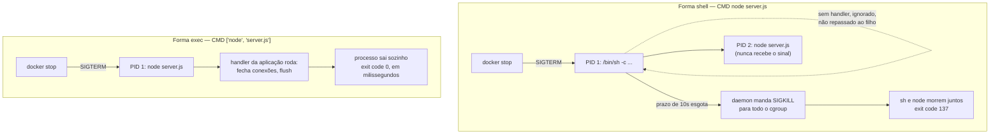
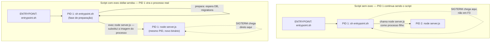

# ENTRYPOINT, CMD e o container que não morre direito

> [!abstract] TL;DR
> `ENTRYPOINT` e `CMD` não são dois jeitos de escrever a mesma coisa — são duas metades de um template de comando, e a forma como você escreve cada uma decide se o Docker roda seu processo direto ou o esconde atrás de um `/bin/sh -c` que rouba o PID 1 e engole o SIGTERM antes dele chegar à aplicação. É exatamente essa diferença — forma shell contra forma exec — que explica por que um `docker stop` às vezes demora dez segundos cravados mesmo numa aplicação que trata SIGTERM direitinho: o sinal nunca chegou nela. E há um segundo problema, irmão do primeiro, que sobrevive mesmo quando o sinal chega: se o processo principal gera filhos e não os recolhe, esses filhos viram zumbis que ninguém enterra, porque dentro de um container raramente existe um `init` de verdade fazendo esse trabalho. O padrão que resolve as duas coisas ao mesmo tempo é simples — forma exec, mais um init de verdade (`--init` ou `tini`), mais um script de entrypoint que termina com `exec "$@"` — e esta nota fecha o arco que a [[03-Dominios/Tecnologia/Infraestrutura/Docker/03 - O ciclo de vida de um container|nota 03]] abriu de propósito.

Um time adiciona, com todo cuidado, um handler de SIGTERM na aplicação Node: fecha conexões abertas, espera requisições em voo terminarem, sai com código zero. Testam local, com `node server.js` direto no terminal — funciona, o shutdown é limpo, leva menos de um segundo. Empacotam a mesma aplicação num container e fazem o mesmo teste, dessa vez com `docker stop`. E o container demora os mesmos dez segundos de sempre, cravados, e sai com código 137 — exatamente o comportamento que a aplicação deveria ter deixado de ter. O handler está lá, o código não mudou uma linha, mas o SIGTERM parece nunca ter chegado. E de fato não chegou: a explicação inteira mora numa única linha do Dockerfile, a que declara `CMD` ou `ENTRYPOINT`, e na diferença entre escrever `node server.js` e `["node", "server.js"]`.

## ENTRYPOINT e CMD como template de comando

A [[03-Dominios/Tecnologia/Infraestrutura/Docker/04 - O Dockerfile como receita de camadas|nota anterior]] já estabeleceu que `ENTRYPOINT` e `CMD` não criam camada — são metadado puro, guardado na configuração da imagem, não conteúdo de filesystem. O que ainda falta é entender o que esse metadado faz quando o container efetivamente sobe, e a resposta certa não é "ENTRYPOINT é o comando fixo, CMD é o comando padrão" — essa frase é verdadeira, mas esconde o mecanismo. O jeito mais preciso de pensar nas duas instruções juntas é como um **template de comando**: `ENTRYPOINT` define o programa que vai rodar, `CMD` define os argumentos default para esse programa, e o comando final que o Docker efetivamente executa é a concatenação dos dois, montada em tempo de `docker run`.

Quando você escreve só `CMD`, sem `ENTRYPOINT`, o template inteiro é substituível: qualquer coisa que você passe depois do nome da imagem em `docker run` troca o `CMD` inteiro, sem sobrar nada da instrução original. Quando você escreve só `ENTRYPOINT`, sem `CMD`, o template é fixo: os argumentos que você passar em `docker run` são anexados depois do `ENTRYPOINT`, nunca o substituem. Quando você escreve os dois juntos — o padrão mais comum em Dockerfiles maduros — o `ENTRYPOINT` continua fixo, mas o `CMD` age como argumento default que só é usado se `docker run` não passar nada no lugar dele; qualquer coisa que você passe depois do nome da imagem substitui só o `CMD`, deixando o `ENTRYPOINT` intocado. E quando nenhum dos dois é declarado no seu Dockerfile, o Docker sobe na cadeia de imagens base até achar um `CMD` ou `ENTRYPOINT` herdado — toda imagem precisa de algum comando final para o processo PID 1 rodar, então se você não declarar nenhum, está confiando (às vezes sem perceber) no que a imagem base já definiu.

A tabela a seguir fecha as quatro combinações possíveis, com o comando que efetivamente roda em cada uma:

| Combinação no Dockerfile | `docker run myimage` (sem args) | `docker run myimage foo bar` (com args) |
| --- | --- | --- |
| Só `CMD ["node", "server.js"]` | `node server.js` | `foo bar` — CMD inteiro substituído |
| Só `ENTRYPOINT ["node", "server.js"]` | `node server.js` | `node server.js foo bar` — args anexados |
| `ENTRYPOINT ["node"]` + `CMD ["server.js"]` | `node server.js` | `node foo bar` — CMD substituído, ENTRYPOINT fixo |
| Nenhum dos dois | comando herdado da imagem base | comportamento da imagem base, se houver |

O pattern da terceira linha — `ENTRYPOINT` como binário fixo, `CMD` como argumento default trocável — é o que a maioria dos Dockerfiles de produção usa, porque combina o melhor dos dois mundos: o programa que roda nunca muda por acidente (alguém rodando `docker run myimage bash` não vai magicamente trocar o processo principal por um shell interativo), mas o comportamento default continua ajustável sem reconstruir a imagem. Um exemplo comum é uma imagem de CLI que sempre invoca o mesmo binário, mas aceita subcomandos diferentes:

```dockerfile
ENTRYPOINT ["myctl"]
CMD ["--help"]
```

```bash
docker run myctl-image                  # myctl --help
docker run myctl-image deploy --env=qa  # myctl deploy --env=qa
```

Existe ainda uma quarta forma de intervir nesse template, que vale citar porque aparece o tempo todo em debugging: `docker run --entrypoint` sobrescreve o `ENTRYPOINT` inteiro, não só o `CMD`, e é a única forma de trocar de fato o programa que roda, sem editar o Dockerfile:

```bash
docker run --entrypoint sh myimage     # ignora ENTRYPOINT e CMD da imagem, roda sh
```

Isso é exatamente o truque que a nota [[03-Dominios/Tecnologia/Infraestrutura/Docker/14 - Debugar um container|14 — Debugar um container]] usa quando um container morre antes de você conseguir investigar de dentro — trocar o `ENTRYPOINT` por um shell interativo é um jeito de entrar na imagem sem depender do processo principal sequer tentar rodar.

### Verificando o template com `docker inspect`

O template inteiro — `ENTRYPOINT`, `CMD`, e qual dos dois veio de qual imagem na cadeia de herança — não é um mistério que você precisa deduzir lendo Dockerfile de terceiros: ele está gravado, explícito, na configuração da imagem, e `docker inspect` expõe exatamente esses dois campos.

```bash
$ docker inspect --format '{{json .Config.Entrypoint}} / {{json .Config.Cmd}}' myctl-image
["myctl"] / ["--help"]
```

Isso é útil sobretudo quando a imagem que você está usando não é sua — uma imagem oficial de terceiro, uma base corporativa mantida por outro time — e você precisa saber, antes de rodar `docker run` em produção, o que exatamente vai acontecer se você passar (ou não passar) argumentos extras. Confiar de memória na tabela de quatro combinações é arriscado quando a imagem base já definiu um `ENTRYPOINT` que você nem sabia que existia; `docker inspect` tira a dúvida sem precisar rodar o container primeiro.

### Cada `FROM` novo reseta o template

Um detalhe que só aparece quando o Dockerfile passa a ter mais de um estágio — o assunto inteiro da próxima nota — mas que vale adiantar aqui, porque é uma armadilha do próprio template, não da forma exec/shell: `ENTRYPOINT` e `CMD` declarados num estágio de build **não sobrevivem** para o estágio seguinte. Cada `FROM` inaugura uma configuração de imagem nova, do zero, herdada só da imagem base daquele `FROM` específico — nunca do estágio anterior do mesmo Dockerfile, mesmo que você copie artefatos dele com `COPY --from=`.

```dockerfile
# Stage 1: build
FROM node:22-alpine AS builder
WORKDIR /app
COPY . .
RUN npm run build
ENTRYPOINT ["node", "dist/server.js"]   # só vale DENTRO deste estágio

# Stage 2: runtime
FROM node:22-alpine
WORKDIR /app
COPY --from=builder /app/dist ./dist
# ENTRYPOINT aqui NÃO herda o do stage 1 — precisa ser redeclarado
CMD ["node", "dist/server.js"]
```

Esquecer de redeclarar `ENTRYPOINT`/`CMD` no estágio final não gera erro de build — o Dockerfile compila normalmente — mas o container final acaba herdando o `CMD` da imagem base (`node:22-alpine`, por exemplo, cujo `CMD` default é abrir um shell interativo `node` do REPL), não o comando que você pretendia. É um erro silencioso, do mesmo gênero que a forma shell: nada acusa a falha até alguém rodar o container e reparar que ele não faz o que deveria.

## Forma exec contra forma shell — o sinal que nunca chega

Até aqui, tudo o que foi dito assume que `ENTRYPOINT`/`CMD` são escritos como lista — `["node", "server.js"]`, com colchetes e aspas. Essa é a **forma exec**. Mas o Docker também aceita a mesma instrução escrita como string solta, sem colchetes — `CMD node server.js` — e essa é a **forma shell**. As duas parecem produzir o mesmo resultado visual quando você roda o container, e é exatamente essa semelhança superficial que faz a armadilha ser tão comum: o comportamento por baixo é radicalmente diferente, e a diferença é justamente sobre o que a nota 03 deixou em aberto — como o sinal se propaga até o PID 1.

Na forma exec, o Docker chama diretamente a syscall que executa o programa — sem intermediário, sem shell. `["node", "server.js"]` vira, na prática, um `execve("/usr/bin/node", ["node", "server.js"], ...)` direto, e o processo `node` nasce como PID 1 do namespace do container. É exatamente o modelo que a nota 03 descreveu: um processo, PID 1, sujeito à regra de que sinais sem handler registrado simplesmente não têm efeito default.

Na forma shell, o Docker não executa o programa diretamente — ele executa um shell, e pede para esse shell interpretar sua string como um comando. `CMD node server.js` vira, por baixo, algo equivalente a `["/bin/sh", "-c", "node server.js"]`. Isso significa que o processo que nasce como PID 1 do container **não é o `node`** — é o `/bin/sh`. O `node` nasce depois, como processo filho do shell, com um PID diferente (2, ou o que estiver livre naquele namespace). E aqui está o problema inteiro: quando `docker stop` manda SIGTERM, ele manda para o PID 1 — que agora é o shell, não a sua aplicação.

Um shell como `sh` (normalmente `dash`, em imagens Debian/Alpine mínimas) não repassa sinais automaticamente para o processo filho que está executando em primeiro plano. Ele recebe o SIGTERM, e — seguindo a mesma regra de PID 1 que a nota 03 explicou — como não tem handler registrado para SIGTERM, simplesmente ignora o sinal e continua esperando o filho terminar sozinho. O `node`, por sua vez, nunca recebe sinal nenhum: ele não é PID 1, então o kernel aplicaria o comportamento default (terminar) se o sinal chegasse até ele, mas o sinal nunca chega, porque o shell na frente não o repassa. O resultado é a cadeia inteira: `docker stop` manda SIGTERM, o shell ignora, o `node` continua rodando sem saber que alguém pediu para parar, o prazo de dez segundos que a nota 03 explicou se esgota, e o daemon manda SIGKILL — que aí sim atinge todo mundo, porque SIGKILL não respeita PID 1 nem shell nenhum. A aplicação nunca teve chance de rodar seu handler cuidadosamente escrito, não porque o handler estivesse errado, mas porque o sinal nunca bateu na porta certa.



A regra prática, e é por isso que a nota anterior chamou isso de arco fechado aqui: **sempre use a forma exec** em `ENTRYPOINT` e `CMD`. Não há cenário de produção em que a forma shell seja preferível só por causa disso — se você precisa de interpretação de shell (variáveis de ambiente, pipes, encadeamento com `&&`), a resposta certa não é usar a forma shell da instrução, é escrever um script de shell explícito e chamar esse script pela forma exec, que é exatamente o padrão que a próxima seção desenvolve.

> [!warning] `CMD` e `ENTRYPOINT` sem colchetes é forma shell, mesmo parecendo inofensivo
> `CMD npm start` e `CMD ["npm", "start"]` parecem intercambiáveis olhando o Dockerfile, mas a primeira roda por trás de `/bin/sh -c`, e a segunda não. A diferença só aparece quando alguém tenta parar o container e descobre que o SIGTERM nunca chegou — nesse ponto, o Dockerfile já foi copiado para uma dúzia de projetos.

## Forma exec e a perda da expansão de shell

A troca para forma exec resolve o problema do sinal, mas troca também um comportamento que a forma shell dava de graça e que costuma pegar quem migra um Dockerfile antigo sem prestar atenção: expansão de variável de ambiente, glob de arquivo, pipe, encadeamento com `&&` — tudo isso é interpretação de shell, e forma exec, por definição, não passa por shell nenhum. `CMD ["echo", "$HOME"]` não imprime o valor da variável `HOME`; imprime literalmente a string `$HOME`, porque não existe `sh` ali para expandir nada. A mesma armadilha aparece com glob: `CMD ["rm", "*.log"]` tenta remover um arquivo chamado literalmente `*.log`, não os arquivos que batem com esse padrão, porque expansão de glob também é trabalho de shell.

```dockerfile
# Comportamento inesperado — forma exec não expande $PORT
CMD ["echo", "servindo na porta $PORT"]
# imprime literalmente: servindo na porta $PORT

# Forma shell resolveria, mas reintroduz o problema de sinal
CMD echo "servindo na porta $PORT"
# imprime: servindo na porta 3000 (se PORT=3000) — mas via /bin/sh -c
```

A resposta certa **não** é voltar para forma shell só para recuperar a expansão — isso joga fora a correção de sinal para resolver um problema cosmético. As duas saídas que preservam forma exec no `ENTRYPOINT`/`CMD` são: primeiro, deixar a própria aplicação ler a variável de ambiente diretamente (a esmagadora maioria dos runtimes — Node, Python, Java, Go — lê `process.env`, `os.environ`, `System.getenv()` sem precisar de shell nenhum no meio, então na prática essa armadilha quase nunca deveria aparecer para o comando principal de uma aplicação real); segundo, quando você realmente precisa de interpretação de shell para algo pontual — montar uma string de conexão a partir de duas variáveis, por exemplo — isolar essa necessidade dentro do script de entrypoint, que já é um script de shell por definição, e deixar só a etapa final (`exec "$@"`) em forma exec. O shell do script tem escopo limitado e conhecido; ele não é o processo principal, então não herda o problema de PID 1 comendo o sinal.

> [!warning] Migrar CMD para forma exec e perder expansão de variável sem perceber
> Um Dockerfile antigo com `CMD echo "porta: $PORT"` migrado ingenuamente para `CMD ["echo", "porta: $PORT"]` troca a forma, mas o resultado impresso muda de "porta: 3000" para o literal "porta: $PORT" — sem erro, sem aviso, só um comportamento silenciosamente diferente que só aparece quando alguém olha o log e estranha.

## Diagnosticando o bug ao vivo

A teoria da seção anterior fica mais concreta olhando o antes e o depois no próprio `docker top` — o mesmo comando que a nota 03 já usou para mostrar o PID 1 de dentro do namespace, sem precisar de shell instalado na imagem. Considere uma imagem construída com `CMD node server.js`, forma shell, rodando em produção:

```bash
$ docker run -d --name api-bug myapi:shell-form
$ docker top api-bug
UID    PID    PPID   CMD
1000   8842   8821   /bin/sh -c node server.js
1000   8879   8842   node server.js
```

O `docker top` já entrega a resposta sem precisar de `docker exec`: a primeira linha é o PID 1 do namespace — a coluna `PPID` mostra `8821`, que é o próprio `containerd-shim` do host, confirmando que esse processo é o que o Docker lançou diretamente — e o comando dele é `/bin/sh -c node server.js`, não `node` sozinho. A segunda linha, com `PPID 8842` apontando para a primeira, é o `node` de verdade, existindo apenas como filho do shell. Rodar `docker stop api-bug` contra esse container manda SIGTERM para o PID do shell (8842), não para o PID do `node` (8879) — e é exatamente por isso que o handler de SIGTERM da aplicação, por mais correto que esteja escrito, nunca dispara.

Depois de trocar o Dockerfile para `CMD ["node", "server.js"]`, forma exec, o mesmo `docker top` no container reconstruído mostra uma árvore de um elo só:

```bash
$ docker run -d --name api-fixed myapi:exec-form
$ docker top api-fixed
UID    PID    PPID   CMD
1000   9103   9084   node server.js
```

Não existe mais um segundo processo — o `node` é, ele mesmo, o que o Docker lançou diretamente, com `PPID` apontando para o `containerd-shim`. `docker stop` agora manda SIGTERM direto para o PID que a aplicação está de fato rodando, e o handler tem a chance de agir. Esse par de `docker top` — antes e depois — é o teste mais rápido para confirmar, em qualquer imagem que você não escreveu, se a forma usada foi shell ou exec, sem precisar ler o Dockerfile de origem nem torcer para que `docker inspect` esteja disponível.

## O processo zumbi e o papel do init

Corrigir a forma shell resolve o problema do sinal não chegar — mas resolve só metade do arco que a nota 03 deixou em aberto. A outra metade aparece mesmo com forma exec, quando a aplicação que roda como PID 1 gera processos filhos por conta própria: um cron interno, um worker disparado com `fork()`, um subprocesso chamado via `child_process.exec()` ou `subprocess.Popen()`. Em qualquer sistema Unix comum, quando um processo filho termina, ele não desaparece imediatamente da tabela de processos do kernel — vira um processo **zumbi** (o estado `Z` que aparece em `ps`), guardando só o código de saída, até que o processo pai chame `wait()` (ou `waitpid()`) para "colher" esse código e liberar a entrada da tabela de vez.

Fora de um container, isso quase nunca é problema visível, porque o `init` do sistema (systemd, no Linux moderno) tem uma responsabilidade explícita de adotar órfãos e recolher zumbis órfãos que sobraram de qualquer processo que tenha morrido sem colher os próprios filhos — é literalmente parte do contrato de ser PID 1 do sistema operacional inteiro. Dentro de um container, esse papel não existe automaticamente: o processo que você escolheu como `ENTRYPOINT` — seu `node`, seu `java`, seu binário Go — vira PID 1 do namespace, mas ele não foi escrito pensando em assumir a responsabilidade de `init`. A grande maioria dos runtimes de aplicação nunca chama `wait()` sobre processos filhos que não criaram diretamente com essa intenção, e mesmo os que criam diretamente às vezes falham em colher corretamente em todos os caminhos de erro.

O sintoma é sutil e demora para aparecer: cada processo zumbi consome uma entrada na tabela de processos do kernel daquele namespace, mas não consome CPU nem memória relevante — então `docker stats` não acusa nada de errado, e o container parece saudável por dias. O que eventualmente quebra é a tabela de processos em si: PIDs são um recurso finito por namespace (e limitado também pelo host), e um container de longa duração que gera processos com frequência e nunca colhe os zumbis eventualmente esgota esse espaço, e novos `fork()` começam a falhar com `ENOMEM` ou `EAGAIN` — um erro que não tem nada a ver com memória de verdade, mas com a tabela de processos cheia de cadáveres não recolhidos.

```bash
$ docker exec meucontainer ps aux
PID   USER     STAT   COMMAND
1     app      Ss     node server.js
47    app      Z      [sh] <defunct>
52    app      Z      [curl] <defunct>
```

O `Z` na coluna `STAT` e o `<defunct>` no nome do comando são o sinal inequívoco de zumbi. Um zumbi isolado não derruba nada sozinho — o problema é o acúmulo, silencioso, ao longo de dias ou semanas de um container de vida longa.

A solução do Docker para isso é direta: a flag `--init` no `docker run` (ou `init: true` em Compose) insere, automaticamente, um processo minúsculo entre o daemon e o seu `ENTRYPOINT` — esse processo vira o PID 1 de verdade, e o seu comando principal passa a rodar como PID 2. Esse init embutido (baseado no projeto `tini`, e às vezes chamado de `docker-init`) faz exatamente duas coisas, e só duas: repassa sinais recebidos para o processo filho principal — resolvendo o problema da seção anterior mesmo se alguém, por engano, ainda tiver usado forma shell em algum lugar da cadeia — e recolhe (`wait()`) qualquer processo órfão que sobre, incluindo zumbis gerados por subprocessos que seu comando principal esqueceu de colher.

```bash
docker run --init myimage
```

```yaml
# compose.yaml
services:
    app:
        image: myimage
        init: true
```

A alternativa equivalente, para quem prefere embutir isso na própria imagem em vez de depender de uma flag de `docker run` (que alguém pode esquecer de passar em produção), é instalar o `tini` diretamente no Dockerfile e usá-lo como `ENTRYPOINT`, delegando o comando real como argumento:

```dockerfile
FROM node:22-alpine
RUN apk add --no-cache tini
WORKDIR /app
COPY . .
ENTRYPOINT ["/sbin/tini", "--"]
CMD ["node", "server.js"]
```

O `--` depois de `tini` é o separador convencional entre as opções do próprio `tini` e o comando que ele deve supervisionar — sem ele, `tini` pode interpretar argumentos do seu comando como opções suas. Com essa configuração, o `tini` é quem vira PID 1 de verdade, e faz o trabalho de repassar sinal e recolher zumbi, não importa se quem chamou `docker run` lembrou da flag `--init` ou não — a garantia está embutida na imagem, não depende de disciplina de quem opera.

> [!info] Baseline de versão
> `--init` está disponível desde o Docker Engine 1.13 (2017) e usa `tini` embutido no próprio binário do daemon — não precisa instalar nada na imagem para usar a flag. Embutir `tini` manualmente no Dockerfile só é necessário quando você quer a garantia mesmo que alguém rode o container sem passar `--init` explicitamente, ou em orquestradores que não expõem essa flag facilmente.

Vale situar as três opções lado a lado, porque a comunidade cita as três com frequência e elas não são idênticas em escopo:

| Opção | O que faz | Instalação | Quando preferir |
| --- | --- | --- | --- |
| `docker run --init` | Insere `tini` (embutido no daemon) como PID 1, repassa sinal, recolhe zumbi | Nenhuma — já vem no Docker Engine | Rodando containers manualmente, ou orquestrador que expõe a flag (Compose `init: true`) |
| `tini` embutido no Dockerfile | Mesmo mecanismo de `--init`, mas como `ENTRYPOINT` explícito da imagem | `apk add tini` / `apt-get install tini` | Quando a garantia precisa valer mesmo se alguém esquecer `--init`, ou o orquestrador não suporta a flag |
| `dumb-init` (Yelp) | Alternativa a `tini` com o mesmo objetivo — repasse de sinal e reap de zumbi | Binário estático, copiado para a imagem | Equivalente funcional a `tini`; escolha é mais convenção de time do que diferença técnica relevante |

Nenhuma das três substitui o handler de sinal na aplicação — todas resolvem o problema de **chegar** o sinal e de **recolher** o zumbi; o que a aplicação faz ao receber o sinal continua sendo responsabilidade do código da aplicação, não do init.

O efeito de `--init` fica visível comparando o mesmo `docker exec ... ps aux` de antes e depois, no mesmo container que gerava zumbis por chamar `curl` e `sh` repetidamente via subprocessos:

```bash
# Sem --init
$ docker exec worker ps aux
PID   USER   STAT   COMMAND
1     app    Ss     node worker.js
47    app    Z      [sh] <defunct>
52    app    Z      [curl] <defunct>

# Com --init
$ docker exec worker ps aux
PID   USER   STAT   COMMAND
1     root   Ss     /sbin/docker-init -- node worker.js
7     app    Sl     node worker.js
```

Duas mudanças acontecem ao mesmo tempo: o PID 1 passa a ser o `docker-init` (o `tini` embutido), não mais o `node`; e os processos zumbis somem, porque agora existe alguém — o próprio init — chamando `wait()` sobre qualquer filho órfão que o `node` deixe para trás. O `node` continua fazendo seu trabalho normalmente, só que a partir de um PID mais alto (7, nesse exemplo), e sem carregar a responsabilidade de `init` que ele nunca foi desenhado para assumir.

Vale uma nota lateral sobre uma tentação comum e mal orientada de resolver "múltiplos processos dentro de um container" com um supervisor de propósito geral — `supervisord`, `runit`, ou até reintroduzir um `systemd` completo dentro da imagem. Isso funciona, no sentido de que os processos sobem, mas reintroduz exatamente o mesmo problema estrutural que esta nota inteira tenta eliminar: o supervisor vira o PID 1, e agora é ele quem precisa repassar sinal corretamente e recolher zumbi para todos os processos que gerencia — trabalho que `tini`/`--init` já fazem, de forma auditada e mínima, sem a superfície de um supervisor completo. A recomendação, alinhada ao princípio de um processo principal por container que o Docker.md já registra como pattern de produção, é resistir à tentação de empacotar múltiplos serviços de longa duração num único container; quando isso é genuinamente necessário (um sidecar de log-shipping, por exemplo), a resposta preferida é um container separado, não um supervisor dentro do mesmo container.

## O script de entrypoint e o `exec "$@"`

Muitas imagens precisam fazer alguma preparação antes do processo principal subir — validar variáveis de ambiente obrigatórias, esperar um banco de dados ficar disponível, rodar migrations, ajustar permissões de um volume montado. O jeito ingênuo de fazer isso é colocar tudo isso dentro de um script de shell e apontar `ENTRYPOINT` para ele, mas há uma armadilha exatamente do mesmo tipo da forma shell: se o script termina o setup e depois só **chama** o processo principal como um comando comum, esse processo nasce como filho do script, não como o próprio PID 1 — e o script continua vivo, ocupando o PID 1, exatamente o mesmo problema da seção anterior, só que causado por um script seu em vez de um `CMD` mal escrito.

```bash
#!/bin/sh
# entrypoint.sh — versão com o bug
set -e
echo "aguardando banco de dados..."
until pg_isready -h "$DB_HOST"; do sleep 1; done
echo "banco disponível, iniciando aplicação"
node server.js
```

Nesse script, `node server.js` é chamado como um comando qualquer — o shell faz `fork()` e depois `exec()` nesse filho, mas o **shell continua existindo** como processo pai, esperando o filho terminar (é o comportamento default de qualquer script sem instrução especial na última linha). O PID 1 do container continua sendo o script, não o `node`, e o problema de propagação de sinal reaparece do zero, mesmo tendo corrigido `CMD` para forma exec no Dockerfile.

A correção é uma palavra: `exec`. Dentro de um script de shell, `exec comando` não cria um processo filho — ele substitui a imagem do processo atual pela do comando, no mesmo PID, via a mesma syscall `execve` que a forma exec do Dockerfile usa. O script, como processo, deixa de existir; o que estava rodando naquele PID passa a ser o `node`, herdando o papel de PID 1 do namespace, exatamente como se ele tivesse sido o `ENTRYPOINT` desde o início.

```bash
#!/bin/sh
# entrypoint.sh — versão correta
set -e
echo "aguardando banco de dados..."
until pg_isready -h "$DB_HOST"; do sleep 1; done
echo "banco disponível, iniciando aplicação"
exec "$@"
```

```dockerfile
FROM node:22-alpine
WORKDIR /app
COPY . .
COPY entrypoint.sh /usr/local/bin/entrypoint.sh
RUN chmod +x /usr/local/bin/entrypoint.sh
ENTRYPOINT ["/usr/local/bin/entrypoint.sh"]
CMD ["node", "server.js"]
```

O `"$@"` no script recebe exatamente os argumentos que o Docker monta a partir do template `ENTRYPOINT`/`CMD` explicado na primeira seção — nesse Dockerfile, `$@` dentro do script vale `node server.js`, vindo do `CMD`. `exec "$@"` então substitui o processo do script pelo `node`, no mesmo PID, e a partir desse ponto o `node` é o PID 1 de fato, sujeito às mesmas regras de sinal que a nota 03 descreveu, e capaz de receber SIGTERM diretamente de `docker stop` sem intermediário nenhum atravessando o caminho.



Combinar as três camadas desta nota — forma exec no `CMD`/`ENTRYPOINT`, `--init` (ou `tini` embutido) para garantir reap de zumbi e repasse de sinal como rede de segurança, e `exec "$@"` no fim de qualquer script de entrypoint que faça preparação — é o padrão completo que fecha, de uma vez, tanto a pergunta de sinal quanto a pergunta de zumbi que a nota 03 deixou como dívida.

```dockerfile
# syntax=docker/dockerfile:1.6
FROM node:22-alpine
RUN apk add --no-cache tini
WORKDIR /app
COPY package*.json ./
RUN npm ci --only=production
COPY . .
COPY entrypoint.sh /usr/local/bin/entrypoint.sh
RUN chmod +x /usr/local/bin/entrypoint.sh
USER node
ENTRYPOINT ["/sbin/tini", "--", "/usr/local/bin/entrypoint.sh"]
CMD ["node", "server.js"]
```

Nesse Dockerfile final, a cadeia de processos tem três elos, cada um sabendo exatamente o que fazer: `tini` como PID 1 de verdade, repassando sinal e recolhendo zumbis; o script de entrypoint, que roda brevemente como PID 2 durante a preparação e depois **desaparece via `exec`**, virando o próprio `node`; e o `node`, que a partir desse ponto ocupa o PID 2 recebendo sinais diretamente, com `tini` como rede de segurança na frente caso qualquer subprocesso escape do controle direto do `node`.

## Exemplo trabalhado: consertando o Dockerfile do início desta nota

Vale fechar o ciclo voltando ao cenário da abertura — o time que adicionou um handler de SIGTERM cuidadoso e viu o container continuar demorando dez segundos e saindo com 137. O Dockerfile original, depois de investigado, era este:

```dockerfile
FROM node:22-alpine
WORKDIR /app
COPY package*.json ./
RUN npm ci --only=production
COPY . .
CMD node server.js
```

Um Dockerfile perfeitamente razoável à primeira vista — nada ali parece "errado" para quem não sabe procurar a diferença entre forma exec e forma shell. O diagnóstico segue exatamente os passos das duas seções anteriores: primeiro `docker top` no container rodando, confirmando dois processos (`/bin/sh -c node server.js` como PID 1, `node server.js` como PID 2 do namespace); depois `docker inspect --format '{{json .Config.Cmd}}'`, confirmando que o `Cmd` gravado na imagem é `["/bin/sh", "-c", "node server.js"]` — a prova documental de que a forma shell realmente foi usada, não uma suspeita.

A correção aplica as três camadas desta nota de uma vez, porque o time também notou, numa investigação separada, zumbis se acumulando num worker que chamava `ffmpeg` via `child_process.exec()` sem tratar o processo filho corretamente:

```dockerfile
FROM node:22-alpine
RUN apk add --no-cache tini
WORKDIR /app
COPY package*.json ./
RUN npm ci --only=production
COPY . .
COPY entrypoint.sh /usr/local/bin/entrypoint.sh
RUN chmod +x /usr/local/bin/entrypoint.sh
USER node
ENTRYPOINT ["/sbin/tini", "--", "/usr/local/bin/entrypoint.sh"]
CMD ["node", "server.js"]
```

```bash
#!/bin/sh
# entrypoint.sh
set -e
echo "validando variáveis obrigatórias..."
: "${DATABASE_URL:?DATABASE_URL não definida}"
exec "$@"
```

A verificação final não depende de julgamento visual — `docker events`, a mesma ferramenta que a nota 03 usou para observar transição de estado em tempo real, mostra a diferença de forma objetiva, em tempo decorrido:

```bash
# Antes da correção
$ docker events --filter container=api-bug &
$ docker stop api-bug
2026-08-02T10:00:00Z container die   api-bug (exitCode=137)
2026-08-02T10:00:10Z container stop  api-bug

# Depois da correção
$ docker events --filter container=api-fixed &
$ docker stop api-fixed
2026-08-02T10:05:00Z container die   api-fixed (exitCode=0)
2026-08-02T10:05:00Z container stop  api-fixed
```

Dez segundos de diferença entre os dois carimbos de tempo do `die`, no primeiro caso, contra praticamente zero no segundo — e o `exitCode` sozinho já conta a história completa, sem precisar de mais nenhuma outra evidência: 137 é SIGKILL forçado depois do prazo esgotado, 0 é o processo saindo por vontade própria, exatamente como o handler de SIGTERM da aplicação sempre pretendeu fazer, desde a primeira versão do código que nunca teve chance de rodar.

## Encerramento gracioso é contrato de produção

Tudo o que esta nota cobriu — forma exec, `--init`, `exec "$@"` — é mecanismo: o conjunto de peças que garante que um sinal enviado chega ao processo certo e que processos filhos não se acumulam como zumbis. Mas o próprio sinal a ser enviado, e quanto tempo esperar antes de forçar, não são fixos: `STOPSIGNAL` no Dockerfile troca qual sinal `docker stop` manda antes de SIGTERM (algumas aplicações preferem reagir a SIGINT ou a um sinal customizado), e `docker stop --time` troca o prazo antes do SIGKILL. Um script de entrypoint bem escrito, com `exec "$@"` no fim, garante que qualquer que seja o sinal declarado em `STOPSIGNAL`, ele chega ao processo real e não ao script de preparação — mas decidir qual sinal usar, e quantos segundos de prazo são necessários para a aplicação drenar conexões em voo, é uma decisão de operação, não de Dockerfile.

```dockerfile
STOPSIGNAL SIGINT
```

Esse mesmo mecanismo — sinal correto chegando ao PID 1 certo, dentro de um prazo configurável — é o que sustenta encerramento gracioso em qualquer orquestrador por cima do Docker. Um `terminationGracePeriodSeconds` de Kubernetes, ou um `stop_grace_period` de Compose, são a mesma ideia de `docker stop --time`, só que declarada uma camada acima; e um `preStop` hook do Kubernetes existe justamente para casos em que a aplicação precisa de um empurrão externo antes mesmo do sinal chegar, quando o sinal sozinho não é suficiente para drenar tráfego de um load balancer com segurança. Esta nota entrega o mecanismo — como garantir que o sinal chega, e ao processo certo; a nota [[03-Dominios/Engenharia/Operação/3 - Rodar em produção/01 - Containers em produção|Containers em produção]] assume esse mecanismo como dado e constrói em cima dele o resto da disciplina de operar containers vivos, e a nota [[03-Dominios/Engenharia/Operação/3 - Rodar em produção/02 - O contrato de produção do Kubernetes|O contrato de produção do Kubernetes]] detalha como esse mesmo sinal e prazo viram cláusula explícita de contrato entre a aplicação e o orquestrador — o que fica fora do escopo aqui é justamente a decisão operacional de quanto tempo de graça é suficiente, e o que fazer quando não é.

## Armadilhas comuns

> [!warning] Trocar `CMD` para forma exec e esquecer que o script de entrypoint também precisa da mesma disciplina
> Corrigir só o Dockerfile, sem revisar o script que ele chama, deixa o problema intacto — o script vira o novo PID 1 escondido, e o `exec "$@"` no fim dele é tão obrigatório quanto os colchetes no `CMD`. Os dois lugares onde forma shell pode se esconder precisam da mesma correção.

> [!warning] Usar `--init` como substituto de tratar SIGTERM na aplicação, em vez de complemento
> `--init` resolve repasse de sinal e reap de zumbi, mas não inventa um handler de SIGTERM que a aplicação não tem. Sem handler, o sinal chega direitinho ao processo — e ele simplesmente morre com o comportamento default do kernel, sem chance de fechar conexão ou fazer flush, porque agora o processo não é mais PID 1 (o `tini` é) e a regra especial de "sem handler, sem efeito" deixou de se aplicar a ele.

> [!warning] Testar shutdown gracioso rodando o binário direto no terminal, fora do container
> `node server.js` rodado direto no shell do desenvolvedor nasce como filho do seu terminal, não como PID 1 — o SIGTERM chega nele normalmente, mesmo sem nenhuma das correções desta nota. O teste que importa é `docker stop` contra o container de verdade; validar só localmente esconde exatamente o bug que esta nota descreve.

> [!warning] Confiar cegamente na tabela de quatro combinações sem checar `--entrypoint` de scripts de terceiros
> Imagens base de terceiros às vezes já definem um `ENTRYPOINT` próprio (frequentemente um script de inicialização da distro ou do runtime), e um `CMD` seu no Dockerfile derivado vira só argumento para esse `ENTRYPOINT` herdado, não um comando novo. Rodar `docker inspect --format '{{.Config.Entrypoint}} {{.Config.Cmd}}'` na imagem base antes de assumir o comportamento evita surpresa.

> [!warning] Esquecer de redeclarar `ENTRYPOINT`/`CMD` no estágio final de um build multi-stage
> Um build de dois estágios que só declara o comando principal no estágio de build e nunca repete no estágio de runtime compila sem erro, mas o container final herda o `CMD` da imagem base — quase nunca o que se pretendia. Não há aviso de build para isso; só aparece rodando o container e reparando que ele não faz o esperado.

## Como explicar em inglês

*ENTRYPOINT and CMD aren't interchangeable ways of writing the same thing — they're two halves of a command template, and whether you write them in exec form or shell form decides whether your process becomes PID 1 directly or gets hidden behind a `/bin/sh -c` that swallows SIGTERM before it ever reaches your application. That's the root cause behind a container that always takes the full stop timeout even when the application has a perfectly good signal handler: the shell in front of it never forwards the signal, so the handler never fires. I default to exec form everywhere, add `--init` (or embed tini) so orphaned child processes actually get reaped instead of piling up as zombies, and end every entrypoint script with `exec "$@"` so the script itself gets replaced by the real process instead of lingering as an unnecessary parent that keeps holding PID 1.*

*The mechanism generalizes beyond signals, too — the same exec-form discipline that fixes signal delivery also removes shell interpretation you might have been relying on without noticing, like environment variable expansion or globbing; when I genuinely need that, I push it into the entrypoint script, not back into shell-form CMD.*

| PT-BR | EN | Nuance de uso |
| --- | --- | --- |
| forma exec | exec form | Sempre em minúsculo, sem hífen; é o nome oficial na documentação do Docker para a sintaxe com colchetes. |
| forma shell | shell form | Contraparte direta de "exec form"; usar os dois termos juntos deixa claro que é uma dicotomia binária, não um espectro. |
| processo zumbi | zombie process | Termo padrão em qualquer discussão de sistemas Unix; "defunct process" é o rótulo literal que aparece em `ps`, mas "zombie" é o termo falado. |
| recolher (um processo filho) | reap (a child process) | "Reap" é o verbo técnico específico para a chamada `wait()`/`waitpid()` recolhendo o código de saída; "collect" soa estranho nesse contexto para quem já conhece o jargão. |
| script de entrypoint | entrypoint script | Termo fixo, quase sempre com esse nome de arquivo (`entrypoint.sh`) por convenção da comunidade, não exigência do Docker. |
| substituir a imagem do processo | replace the process image | Frase técnica exata para o que `exec` faz via `execve()` — evitar "restart the process", que sugere término e recriação, quando na verdade é o mesmo PID continuando a existir com outro binário carregado. |
| ceder o lugar ao processo principal | hand off to the main process | Expressão natural para descrever o papel do `exec "$@"` no fim de um entrypoint script, sem precisar entrar em detalhe de syscall toda vez. |

## O que vem a seguir

Esta nota fechou o arco que a nota 03 abriu de propósito: por que a forma do comando no Dockerfile decide se o sinal chega, e por que um processo principal também precisa de ajuda para não deixar zumbis para trás. Com isso resolvido, o próximo passo natural é olhar para o que sobra dentro da imagem depois que ela já roda corretamente — porque uma imagem que carrega compilador, dependências de build e ferramentas de debug que nunca são usadas em produção é, ela mesma, uma superfície desnecessária, tanto de tamanho quanto de risco. A nota [[03-Dominios/Tecnologia/Infraestrutura/Docker/09 - Multi-stage e imagens mínimas|09 — Multi-stage e imagens mínimas]] parte exatamente daí: como separar o que constrói do que roda, e até onde é possível reduzir a imagem final — inclusive para o ponto em que ela não tem `sh` nenhum lá dentro, o que muda, de novo, como você pode escrever (ou precisa deixar de escrever) um script de entrypoint. Para o mapa completo do galho, o [[03-Dominios/Tecnologia/Infraestrutura/Docker/index|índice de Docker]] continua a referência de onde cada peça se encaixa.

## Fontes

- [Docker docs — Dockerfile reference, ENTRYPOINT](https://docs.docker.com/reference/dockerfile/#entrypoint)
- [Docker docs — Dockerfile reference, CMD](https://docs.docker.com/reference/dockerfile/#cmd)
- [Docker docs — Dockerfile reference, SHELL and exec form](https://docs.docker.com/reference/dockerfile/#shell-and-exec-form)
- [Docker docs — Run details, `--init`](https://docs.docker.com/reference/run/#specify-an-init-process)
- [Docker Engine release notes — 1.13.0 (introduces --init)](https://docs.docker.com/engine/release-notes/17.03/)
- [tini — GitHub repository](https://github.com/krallin/tini)
- [man7.org — signal(7), seção sobre PID 1 e namespaces](https://man7.org/linux/man-pages/man7/signal.7.html)
- [man7.org — wait(2)](https://man7.org/linux/man-pages/man2/wait.2.html)
- [man7.org — execve(2)](https://man7.org/linux/man-pages/man2/execve.2.html)
- [Julia Evans — "Why do I need tini?"](https://jvns.ca/blog/2020/03/03/what-is-a-container/)
