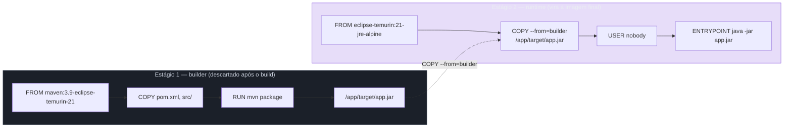
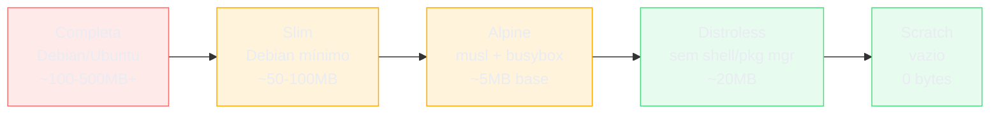

# Multi-stage e imagens mínimas

> [!abstract] TL;DR
> Um `Dockerfile` pode ter mais de um `FROM`, e cada `FROM` inicia um **estágio** novo — mas só o último estágio construído vira a imagem final; todos os anteriores existem apenas durante o build, como andaimes que são desmontados depois de servir. É essa separação que resolve um problema que nenhuma ordenação de instrução resolve: o compilador, o gerenciador de pacotes e os cabeçalhos de desenvolvimento precisam existir para *construir* a aplicação, mas não precisam existir para *rodar* o binário ou o `jar` resultante — e um Dockerfile de estágio único é obrigado a carregar os dois conjuntos de ferramentas na mesma imagem, para sempre. A partir daí, a escolha da imagem base do estágio final é uma escala com um trade-off honesto em cada degrau — completa, slim, alpine, distroless, scratch —, e o degrau mais baixo dessa escala custa uma capacidade que a maioria só percebe quando falta: a de abrir um shell dentro do próprio container para investigar um problema. Esta nota cobre o mecanismo do multi-stage, a escala de bases com o que cada uma ganha e perde, a pegadinha específica de Alpine usar musl em vez de glibc, e nomeia — sem resolver — o problema da imagem sem shell, que a nota 14 assume de frente.

Uma imagem Java para uma API simples chega a 900 megabytes. Dentro dela: o JDK completo (não só o JRE), o Maven com todo o repositório de plugins baixado durante o build, o código-fonte em `.java`, os testes, e — por trás de tudo isso, empilhado sem que ninguém tenha pedido — a distribuição completa de um Debian ou Ubuntu que serviu de base para instalar esse ecossistema inteiro. O `.jar` que a aplicação de fato executa em produção tem 40 megabytes. O resto, os outros 860, é ferramenta de construção que nunca vai ser usada depois que o `.jar` já existe — e que continua ali, ocupando espaço em disco, tempo de transferência a cada `docker pull`, e superfície de ataque a cada CVE publicada contra qualquer um dos pacotes que vieram de brinde.

O reflexo comum é tentar resolver isso limpando depois: um `RUN apt-get remove maven && rm -rf /var/lib/apt/lists/*` no fim do Dockerfile, torcendo para que a imagem final encolha. Não encolhe — ou encolhe muito menos do que parece. A nota 02 já estabeleceu por que: uma imagem é uma pilha de camadas, e cada camada é imutável depois de criada. Remover um arquivo numa camada posterior não apaga os bytes da camada anterior onde ele foi escrito; grava uma nova camada dizendo "este arquivo não existe mais aqui", mas os bytes originais continuam fazendo parte da imagem, transferidos a cada pull, ocupando espaço em disco. Limpar depois de instalar, dentro do mesmo estágio, é course correction tardia sobre um problema que já aconteceu — o Maven inteiro já foi baixado, já foi escrito em camada, e apagar o diretório numa instrução seguinte só esconde o rastro, não desfaz o custo.

O que de fato resolve o problema é nunca deixar o Maven — ou o JDK completo, ou o `node_modules` de desenvolvimento, ou o `gcc` — chegar perto da imagem que vai para produção. E para isso é preciso um mecanismo que separe fisicamente "o ambiente onde eu construo" de "o ambiente onde eu rodo", dentro do mesmo arquivo de receita. É exatamente isso que o multi-stage build faz, e é o assunto do resto desta nota.

## Cada `FROM` é um estágio novo

A sintaxe do multi-stage não introduz nenhuma instrução nova — ela reaproveita o `FROM` que já existe desde a primeira linha de qualquer Dockerfile, só que permite repeti-lo mais de uma vez no mesmo arquivo. Cada ocorrência de `FROM` fecha o estágio anterior e abre um estágio novo, com seu próprio sistema de arquivos, começando do zero a partir da imagem base indicada — nenhum estado do estágio anterior atravessa automaticamente para o próximo.

```dockerfile
# syntax=docker/dockerfile:1

# Estágio 1 — build
FROM node:22-alpine AS builder
WORKDIR /app
COPY package.json package-lock.json ./
RUN npm ci
COPY . .
RUN npm run build

# Estágio 2 — runtime
FROM node:22-alpine
WORKDIR /app
COPY --from=builder /app/dist ./dist
COPY --from=builder /app/package.json ./
RUN npm ci --omit=dev
USER node
CMD ["node", "dist/server.js"]
```

Repare na palavra-chave `AS builder` no primeiro `FROM`: ela dá um nome ao estágio, para que instruções posteriores possam se referir a ele por esse nome em vez de por índice numérico. É o `COPY --from=builder` no segundo estágio que faz a ponte deliberada entre os dois mundos: em vez de reconstruir o artefato, ele copia um arquivo (ou diretório) que já existe no sistema de arquivos do estágio `builder`, e coloca esse arquivo no sistema de arquivos do estágio atual. Sem nomear o estágio, a mesma referência funcionaria por posição — `COPY --from=0 ...` para o primeiro `FROM` do arquivo —, mas o nome torna o Dockerfile legível e resistente a reordenação, o mesmo argumento de manutenibilidade que já vale para qualquer identificador em qualquer linguagem.

O ponto central, e o que separa multi-stage de "só ter vários `FROM` por acaso", é que **apenas o estágio construído por último, o que o `docker build` recebe como alvo final, vira a imagem resultante**. Os estágios anteriores existem inteiramente dentro do processo de build — o daemon os constrói, mantém disponíveis para que `COPY --from` os referencie, e depois os descarta. Nenhum deles é enviado a um registry, nenhum deles compõe a imagem final, a menos que algo seja explicitamente copiado dali para o estágio final via `COPY --from`. É essa fronteira que resolve o problema do JDK e do Maven: eles vivem inteiros dentro do estágio `builder`, produzem o `.jar`, e o estágio de runtime só copia o `.jar` — nunca o compilador que o gerou.



O diagrama deixa visível o que importa: o estágio 1 inteiro — a imagem base do Maven, com JDK completo, mais tudo que `mvn package` baixou e gerou — nunca existe na imagem final. Só a seta pontilhada, o `.jar` que atravessa via `COPY --from`, chega ao outro lado. Se essa imagem final for inspecionada com `docker history` ou `docker images`, o Maven simplesmente não aparece em lugar nenhum — não porque foi removido, mas porque nunca foi copiado para lá desde o início.

## `--target`: parar num estágio específico

Um Dockerfile pode ter mais de dois estágios, e o `docker build` não precisa necessariamente construir até o último. A flag `--target` diz ao build para parar num estágio nomeado específico e tratá-lo como se fosse o estágio final — útil quando o mesmo arquivo de receita precisa produzir, em momentos diferentes, uma imagem de desenvolvimento (com ferramentas de debug, hot reload, um shell completo) e uma imagem de produção (mínima, sem nada além do necessário para rodar).

```dockerfile
# syntax=docker/dockerfile:1

FROM node:22-alpine AS base
WORKDIR /app
COPY package.json package-lock.json ./

FROM base AS dev
RUN npm ci
COPY . .
CMD ["npm", "run", "dev"]

FROM base AS build
RUN npm ci
COPY . .
RUN npm run build

FROM node:22-alpine AS production
WORKDIR /app
COPY --from=build /app/dist ./dist
COPY --from=build /app/package.json ./
RUN npm ci --omit=dev
USER node
CMD ["node", "dist/server.js"]
```

```bash
# Imagem de desenvolvimento — para docker compose local, com volume montado por cima
docker build --target dev -t minha-api:dev .

# Imagem de produção — o default se --target não for passado (constrói até o último estágio)
docker build --target production -t minha-api:prod .
docker build -t minha-api:prod .   # equivalente, sem --target
```

Repare que o estágio `dev` e o estágio `build` compartilham o mesmo estágio `base` como ponto de partida (`FROM base AS dev`, `FROM base AS build`) — outro recurso do multi-stage é que um estágio pode servir de `FROM` para outro estágio nomeado, não só para imagens externas do registry. Isso evita repetir `WORKDIR` e o `COPY` dos manifestos em cada ramificação, mantendo a base de cache comum às duas variantes. A referência a `docker compose` no comentário acima não é um adiantamento de conteúdo — só um lembrete de contexto: [[03-Dominios/Tecnologia/Infraestrutura/Docker/index|este galho]] trata o compose numa nota própria, mais adiante.

O `--target` também é a peça que fecha o ciclo com a nota 05: o cache de build de cada estágio segue exatamente a mesma corrente de invalidação já descrita ali, camada por camada, dentro de cada estágio — multi-stage não muda a regra de cache, só multiplica o número de correntes de camadas que existem dentro de um único Dockerfile, uma por estágio.

## O problema que nenhuma ordem de instrução resolve

A nota 04 estabeleceu que a ordem das instruções dentro de um Dockerfile é uma decisão de design, e a nota 05 mostrou como essa ordem controla a cascata de invalidação de cache. As duas notas resolvem problemas reais, mas nenhuma delas resolve o problema desta nota, porque é um problema de natureza diferente: não é sobre *quando* uma ferramenta é instalada, é sobre *se* ela precisa continuar existindo depois que já cumpriu sua função.

Um Dockerfile de estágio único, por melhor que esteja ordenado para cache, ainda carrega o compilador, o gerenciador de pacotes de desenvolvimento e os cabeçalhos de biblioteca (`-dev`, `-devel`) na imagem final — porque não existe instrução dentro de um único estágio que "desinstale de verdade", no sentido de remover os bytes já escritos em camadas anteriores. Reordenar instruções otimiza *quando* o trabalho é refeito; multi-stage decide *o que sobrevive* até a imagem final. São dois eixos ortogonais, e um Dockerfile bem escrito precisa dos dois: instruções bem ordenadas dentro de cada estágio, e a fronteira de estágio certa separando ferramenta de construção de artefato de execução.

Vale nomear com precisão o que costuma ficar preso num estágio único, porque a lista é maior do que "o compilador":

- **Compiladores e toolchains** — `gcc`, `javac` via JDK completo, o toolchain do Go antes de `CGO_ENABLED=0` gerar um binário estático.
- **Gerenciadores de pacote de build** — Maven com o repositório `.m2` baixado, npm com `devDependencies` instaladas (linters, bundlers, frameworks de teste).
- **Cabeçalhos e bibliotecas de desenvolvimento** — pacotes `-dev`/`-devel` do sistema, necessários para compilar extensões nativas mas inúteis depois de compiladas.
- **Código-fonte e testes** — o `.java`, o `.go`, os arquivos de teste, que não precisam estar presentes para o binário compilado rodar.
- **Artefatos intermediários** — caches de build, arquivos `.o`, diretórios de trabalho do compilador.

Nenhum desses itens contribui em nada para a aplicação rodar em produção. Todos eles contribuem para a superfície de ataque: cada pacote instalado é um pacote que pode ter uma CVE, e um scanner de vulnerabilidade (a nota 13 aprofunda isso) reporta CVEs em pacotes que a aplicação nunca sequer invoca em runtime, só porque eles estão fisicamente presentes na imagem.

> [!tip] Vídeo — a redução levada ao extremo, passo a passo
> [**Docker Image BEST Practices — From 1.2GB to 10MB**](https://www.youtube.com/watch?v=t779DVjCKCs) (Better Stack, ~7 min, EN) percorre uma redução real e nomeia cada técnica no momento em que ela é aplicada, o que torna visível quanto cada uma contribui. Duas delas conversam diretamente com este galho. A primeira é ordenar o Dockerfile pela **frequência de mudança** — copiar o manifesto de dependências antes do código, porque dependências mudam menos que código —, que é a regra da nota 05 vista pelo efeito no tamanho, não só no tempo. A segunda é consolidar operações num único `RUN`: como a camada só é gravada ao fim da instrução, limpar arquivos temporários **dentro** da mesma instrução faz a camada nascer já limpa — enquanto limpar numa instrução seguinte apenas esconde os arquivos, que continuam gravados na camada anterior, pelo mecanismo que a nota 02 explica. **O que ele não cobre:** `--target` e estágios nomeados, estágio de teste que não chega à imagem final, a diferença entre musl e glibc no Alpine, e o preço de depurar uma imagem sem shell.

## A escala de bases: da completa ao `scratch`

Depois que o multi-stage já separou "construir" de "rodar", a pergunta seguinte é: qual imagem base usar para o estágio final? A resposta não é uma escolha binária, é uma escala, e cada degrau troca conveniência por tamanho e superfície de ataque menores.



**Imagem completa (Debian, Ubuntu, etc.).** Traz um sistema operacional convencional inteiro: shell completo (`bash`), gerenciador de pacotes (`apt`), utilitários de diagnóstico (`ps`, `curl`, `netcat`, `strace` se instalado), bibliotecas C padrão (glibc). Ganho: máxima conveniência — qualquer ferramenta de debug que se precise instalar via `apt-get install` provavelmente existe no repositório da distro, e o comportamento em runtime é o mais previsível e bem documentado que existe, porque é o ambiente que a maioria das bibliotecas foi testada contra. Perda: centenas de megabytes de pacotes que a aplicação nunca usa, cada um deles uma fonte potencial de CVE, e um tempo de pull/push proporcionalmente maior.

**Slim.** Uma variante oferecida por muitas imagens oficiais (`python:3.12-slim`, `node:22-slim`) que remove documentação, pacotes de compilação e utilitários não essenciais, mantendo glibc e um shell mínimo funcional. Ganho: reduz consideravelmente o tamanho frente à imagem completa, sem abrir mão de glibc — o que importa para bibliotecas com extensões nativas compiladas contra glibc. Perda: ainda carrega um shell e alguns utilitários que uma imagem de produção estritamente mínima dispensaria, e nem todo pacote de sistema necessário em runtime vem pré-instalado — é comum precisar de um `RUN apt-get install` extra para dependências específicas.

**Alpine.** Baseada em musl libc e BusyBox em vez do conjunto GNU/glibc convencional, com gerenciador de pacotes próprio (`apk`). Ganho: tamanho de base espantosamente pequeno (a imagem `alpine` sozinha soma poucos megabytes), o que a tornou o padrão de fato para builds preocupados com tamanho ao longo da última década. Perda: além do tamanho reduzido em si, Alpine introduz uma mudança de comportamento que a próxima seção trata em detalhe — musl não é glibc, e isso nem sempre é transparente.

**Distroless.** Mantida pelo Google, remove deliberadamente shell, gerenciador de pacotes e a maior parte dos utilitários de sistema, deixando só o runtime da linguagem (JRE, interpretador Python, runtime Node) e as bibliotecas mínimas que ele exige. Ganho: superfície de ataque drasticamente menor que qualquer alternativa acima — sem `sh`, um atacante que ganhe execução de código dentro do container não tem shell para escalar a partir dali, e sem gerenciador de pacotes não há como instalar ferramenta adicional em runtime. Perda: o preço mais direto do minimalismo, que a próxima seção mas uma nomeia sem resolver — não existe shell para `docker exec -it <container> sh` de jeito nenhum, porque não existe shell instalado.

**Scratch.** A imagem base literalmente vazia — zero bytes, nenhum arquivo, nenhum sistema operacional. Só funciona para binários estaticamente linkados que não dependem de nenhuma biblioteca compartilhada do sistema (o caso comum de Go com `CGO_ENABLED=0`, ou Rust com `musl` target). Ganho: o mínimo absoluto de tamanho e superfície de ataque possível — literalmente nada além do próprio binário da aplicação. Perda: tudo que qualquer sistema operacional convencional oferece de graça — resolução de nome DNS depende de bibliotecas que podem não estar presentes, certificados TLS para chamadas HTTPS de saída precisam ser copiados manualmente (`/etc/ssl/certs/ca-certificates.crt`), timezone data idem, e claro, nenhum shell, nenhuma ferramenta, nenhuma forma de inspecionar o sistema de arquivos por dentro do container.

| Base | Tamanho típico | Shell | Gerenciador de pacotes | Caso de uso honesto |
|---|---|---|---|---|
| Completa (Debian/Ubuntu) | 100–500+ MB | Sim, completo | `apt` | Desenvolvimento, debug pesado, quando conveniência > tamanho |
| Slim | 50–100 MB | Mínimo | `apt` | Compromisso razoável quando glibc importa e Alpine é arriscado |
| Alpine | ~5 MB base | `sh` (BusyBox) | `apk` | Produção com CGO/nativo testado, ou apps sem dependência nativa |
| Distroless | ~20 MB | Nenhum | Nenhum | Produção séria, JVM/Python/Node, quando superfície de ataque importa mais que debug fácil |
| Scratch | 0 bytes | Nenhum | Nenhum | Binários estáticos (Go, Rust), o mínimo absoluto |

Não existe "a melhor" nessa tabela de forma universal — existe a que corresponde ao ponto de equilíbrio que a equipe está disposta a aceitar entre conveniência operacional e minimalismo de produção, e essa resposta muda conforme a linguagem, a presença de dependências nativas e a maturidade do time em debugar sem shell.

## Um estágio de teste que nunca chega à imagem final

Um uso de multi-stage que costuma passar despercebido, porque não aparece nos exemplos mais básicos, é usar um estágio inteiro só para rodar a suíte de testes — sem que esse estágio jamais seja copiado para lugar nenhum. A ideia é simples: se os testes rodam dentro do build, e o build falha quando um teste falha, então o próprio `docker build` vira um gate de qualidade, sem exigir um pipeline de CI separado para a mesma verificação.

```dockerfile
# syntax=docker/dockerfile:1
FROM node:22-alpine AS deps
WORKDIR /app
COPY package.json package-lock.json ./
RUN npm ci

FROM deps AS test
COPY . .
RUN npm run lint && npm test

FROM deps AS build
COPY . .
RUN npm run build

FROM node:22-alpine AS production
WORKDIR /app
COPY --from=build /app/dist ./dist
COPY --from=build /app/package.json ./
RUN npm ci --omit=dev
USER node
CMD ["node", "dist/server.js"]
```

Repare que o estágio `test` parte do mesmo `deps` que o estágio `build`, então ambos compartilham o cache de `npm ci` sem repetir a instalação. O estágio `test` nunca é referenciado por nenhum `COPY --from` no estágio `production` — ele existe só para o `docker build` falhar ali, com o exit code da instrução `RUN npm test`, caso algum teste quebre. Um build que chega até `production` com sucesso é, por construção, um build cuja suíte de testes passou, porque o Docker executa os estágios necessários para produzir o alvo pedido, e nesse Dockerfile o estágio `production` depende (via `deps`) da mesma árvore que `test`, mas não depende diretamente do próprio `test` ter sido construído — vale a ressalva, porque é um ponto sutil: se `test` e `production` não estiverem numa cadeia de dependência explícita entre si, um build direcionado por `--target production` pode pular o estágio `test` inteiramente. Para garantir que os testes sempre rodem antes da imagem de produção existir, a forma mais robusta é fazer o pipeline de CI chamar `docker build --target test` como um passo separado e só prosseguir para `docker build --target production` se o primeiro tiver sucesso — uma prática que amarra melhor com a nota 17 do que tentar forçar essa ordem só na estrutura do Dockerfile.

## Verificando o resultado: `docker images`, `docker history` e `dive`

Depois de escrever um Dockerfile multi-stage, vale confirmar empiricamente que a separação funcionou como esperado, em vez de assumir que funcionou só porque o build passou sem erro. `docker images` mostra o tamanho final de cada imagem taggeada:

```bash
$ docker images minha-api
REPOSITORY   TAG    IMAGE ID       SIZE
minha-api    prod   a1b2c3d4e5f6   98.4MB
```

Esse número já confirma que a imagem final não carrega o peso do estágio de build, mas não mostra *onde* esse peso foi. `docker history`, já usado na nota 05 para inspecionar camadas de cache, também serve aqui — ele lista só as camadas que efetivamente compõem a imagem final, então qualquer instrução do estágio `builder` que não tenha sido copiada via `COPY --from` simplesmente não aparece na lista:

```bash
$ docker history minha-api:prod
IMAGE          CREATED BY                                SIZE
f7a2b1c9d0e1   CMD ["node" "dist/server.js"]             0B
<missing>      USER node                                  0B
<missing>      RUN npm ci --omit=dev                     42.1MB
<missing>      COPY --from=build /app/package.json ./     1.8kB
<missing>      COPY --from=build /app/dist ./dist         3.2MB
<missing>      /bin/sh -c #(nop) ADD file:... in /        5.6MB
```

Nenhuma linha menciona `npm run build`, `webpack` ou qualquer ferramenta de desenvolvimento — porque essas instruções rodaram inteiramente dentro do estágio `builder`, que não contribui nenhuma camada para a imagem final. Se, por acidente, uma dessas ferramentas aparecesse aqui, seria sinal de que algum `COPY` copiou mais do que devia (por exemplo, um `COPY --from=build /app ./` genérico demais, que traz `node_modules` de desenvolvimento junto com `dist`).

Para uma inspeção visual mais rica, camada por camada, com o que cada uma adiciona ou modifica no sistema de arquivos, a ferramenta `dive` (já citada na nota-tronco deste galho) permite navegar interativamente pelas camadas de uma imagem já construída, útil para confirmar visualmente que nenhum arquivo pesado inesperado ficou preso numa camada do estágio final:

```bash
dive minha-api:prod
```

## Multi-stage entre estágios de linguagens diferentes

Um uso menos óbvio, mas comum em aplicações com frontend e backend no mesmo repositório, é usar multi-stage para atravessar duas linguagens: um estágio Node.js compila os assets estáticos do frontend, e um estágio final de outra linguagem (Go, Java, Python) serve esses assets já compilados, sem que a imagem final precise conter Node.js em lugar nenhum.

```dockerfile
# syntax=docker/dockerfile:1

# Estágio 1 — build do frontend (React/Vite), nunca chega ao runtime
FROM node:22-alpine AS frontend
WORKDIR /web
COPY web/package.json web/package-lock.json ./
RUN npm ci
COPY web/ .
RUN npm run build

# Estágio 2 — build do backend em Go
FROM golang:1.23-alpine AS backend
WORKDIR /src
COPY go.mod go.sum ./
RUN go mod download
COPY . .
RUN CGO_ENABLED=0 go build -o /bin/server ./cmd/server

# Estágio 3 — runtime mínimo, sem Node e sem toolchain Go
FROM alpine:3.20
WORKDIR /app
COPY --from=backend /bin/server ./server
COPY --from=frontend /web/dist ./static
ENTRYPOINT ["./server"]
```

O estágio final não contém `node`, não contém `npm`, não contém o toolchain de Go — só o binário compilado do backend e o diretório `static/` já com os arquivos estáticos gerados pelo build do frontend. Os dois estágios de build (`frontend` e `backend`) não dependem um do outro e, sob BuildKit, isso é exatamente o tipo de independência que permite construí-los em paralelo em vez de sequencialmente — o assunto do grafo de build que a nota 10 aprofunda a seguir.

## O detalhe que quase todo material omite: Alpine usa musl, não glibc

A recomendação de "use Alpine, é menor" é comum o suficiente para virar reflexo, e o reflexo esconde um detalhe que a maioria dos tutoriais nunca menciona: Alpine Linux não usa a implementação glibc da biblioteca C padrão, que é a que praticamente todo o resto do ecossistema Linux (Debian, Ubuntu, Fedora, e a maioria das distros convencionais) usa. Alpine usa **musl**, uma implementação diferente, escrita com foco em tamanho pequeno e simplicidade de código — objetivos legítimos, mas que produzem uma biblioteca com comportamento e API binária diferentes de glibc em pontos específicos.

Isso não é um detalhe puramente acadêmico, ele tem três consequências concretas e recorrentes:

**Compatibilidade de binários pré-compilados.** Um binário compilado e linkado dinamicamente contra glibc não roda contra musl, e vice-versa — as duas implementam a mesma interface de alto nível (a API da libc), mas não são compatíveis a nível de ABI (interface binária). Extensões nativas empacotadas como binários pré-compilados (`.whl` do Python com extensão em C, módulos nativos do Node como `bcrypt` ou `sharp`, `.so` baixados prontos) frequentemente são publicados só para glibc, e ao rodar num container Alpine, ou falham silenciosamente na hora de carregar, ou nem sequer instalam — obrigando a recompilar a partir do código-fonte dentro do próprio Alpine (o que exige instalar toolchain de compilação, ironicamente inflando de volta a imagem, ou empurrando essa compilação para dentro de um estágio de build que multi-stage já isola).

**Resolução de DNS.** musl implementa a resolução de nomes de forma diferente de glibc — em particular, o comportamento padrão de busca em múltiplos servidores DNS e o suporte a certas opções do `resolv.conf` não são idênticos. Isso já causou incidentes reais em produção onde uma aplicação que resolve nomes de host de forma correta contra uma base Debian falha, de forma intermitente e difícil de reproduzir, contra a mesma configuração de rede rodando sobre Alpine — porque o comportamento de fallback e timeout de musl diverge sutilmente do de glibc.

**Desempenho de alocação em certas cargas.** O alocador de memória de musl é deliberadamente mais simples e compacto que os de glibc (que usa uma variante do ptmalloc), e para certas cargas — sobretudo aplicações com padrões intensos de alocação/desalocação em threads concorrentes — isso pode se traduzir em desempenho mensuravelmente pior, embora o efeito varie por carga e não seja universal nem sempre perceptível.

Um exemplo concreto de como a consequência de compatibilidade de binário se manifesta na prática: um pacote Node.js com extensão nativa pré-compilada, instalado sem problema aparente contra uma imagem `slim` (glibc), falha ao carregar dentro de uma imagem `alpine`:

```bash
$ docker run --rm node:22-alpine node -e "require('bcrypt')"
Error: Error loading shared library ld-linux-x86-64.so.2: No such file or directory
    (needed by /app/node_modules/bcrypt/lib/binding/napi-v3/bcrypt_lib.node)
```

A mensagem de erro aponta exatamente para o problema: o binário pré-compilado de `bcrypt` foi linkado contra o loader de glibc (`ld-linux-x86-64.so.2`), que simplesmente não existe no sistema de arquivos de uma imagem Alpine baseada em musl. A correção mais comum é forçar a recompilação da extensão nativa a partir do código-fonte dentro do próprio ambiente Alpine — o que, por sua vez, exige instalar temporariamente um toolchain de compilação C, e é exatamente o tipo de ferramenta que só deveria existir dentro de um estágio de build, nunca no estágio final:

```dockerfile
FROM node:22-alpine AS builder
RUN apk add --no-cache python3 make g++
WORKDIR /app
COPY package.json package-lock.json ./
RUN npm ci   # recompila bcrypt contra musl automaticamente, via node-gyp

FROM node:22-alpine
WORKDIR /app
COPY --from=builder /app/node_modules ./node_modules
COPY . .
CMD ["node", "server.js"]
```

O `python3 make g++` instalado no estágio `builder` nunca aparece na imagem final — mas sem ele, `npm ci` teria falhado na recompilação da extensão nativa dentro do próprio Alpine, e o erro de "shared library não encontrada" continuaria acontecendo, só que mais tarde e de forma mais confusa (dentro do próprio processo de instalação, em vez de na hora de rodar). É esse tipo de custo escondido — instalar um toolchain de compilação só para fazer uma dependência nativa funcionar sob musl — que costuma inclinar a balança de volta para `slim` quando a aplicação depende de várias extensões nativas desse tipo.

Nenhuma dessas três consequências torna Alpine uma escolha errada — elas tornam Alpine uma escolha que precisa ser **consciente**, não um reflexo automático de "menor é sempre melhor". Para uma aplicação sem dependências nativas, sem sensibilidade fina de DNS, e sem carga de alocação extrema, Alpine costuma funcionar sem incidente algum, e o ganho de tamanho é real. Para uma aplicação com extensões nativas pesadas ou sensibilidade de rede, `slim` (que preserva glibc) costuma ser a escolha mais previsível, mesmo custando alguns megabytes a mais — o mesmo raciocínio, aplicado de forma inversa, que orienta a escolha entre os outros degraus da escala.

> [!info] Fronteira — a disciplina de produção fica em outra casa
> Tudo que esta nota cobriu até aqui é sobre **construir** a imagem — o mecanismo do multi-stage, a escala de bases e seus trade-offs. A **disciplina** de tratar essa imagem como artefato de produção — imutabilidade como política, exigir digest em vez de tag no deploy, rodar como não-root por regra e não por exceção, o checklist que uma revisão de produção efetivamente cobra antes de aprovar — pertence a [[03-Dominios/Engenharia/Operação/3 - Rodar em produção/01 - Containers em produção|Containers em produção]]. Aqui é a construção; lá é a política que governa o que sai dessa construção.

## O preço do minimalismo: imagem sem shell não se debuga do jeito habitual

Todo o ganho de segurança de distroless e scratch vem de uma escolha específica: não instalar shell. É essa mesma escolha que remove a ferramenta de investigação mais usada por qualquer pessoa que já operou containers — `docker exec -it <container> sh` simplesmente não tem o que executar, porque não existe `sh` dentro da imagem para executar. Um container rodando `distroless` ou `scratch` que apresenta comportamento inesperado em produção não pode ser "entrado" da forma reflexa e imediata que funciona contra uma imagem completa ou Alpine.

Isso não é um defeito acidental do design dessas imagens — é o preço deliberado do mesmo mecanismo que elimina a superfície de ataque de um shell disponível para um invasor. Um container sem shell é, ao mesmo tempo, mais difícil de atacar de dentro e mais difícil de diagnosticar de dentro — as duas propriedades vêm do mesmo lugar, e não é possível ter uma sem abrir mão parcialmente da outra.

O ponto aqui não é resolver esse problema — resolver de fato exige um conjunto de técnicas próprio (containers de debug efêmeros anexados ao mesmo namespace, imagens de debug paralelas construídas a partir do mesmo estágio, inspeção via `docker cp` do sistema de arquivos parado) que merecem tratamento dedicado. É nomear o problema com precisão suficiente para que a ausência de shell numa imagem de produção não seja uma surpresa descoberta no meio de um incidente: [[03-Dominios/Tecnologia/Infraestrutura/Docker/14 - Debugar um container|14 — Debugar um container]] é a nota que assume esse problema de frente e mostra como investigar um container quando `docker exec -it ... sh` não é uma opção.

## Exemplo trabalhado: de 900MB a 90MB, degrau por degrau

Vale acompanhar a mesma aplicação Java atravessando a escala inteira, para tornar o ganho tangível em vez de abstrato. Considere uma API Spring Boot com um `pom.xml` e um diretório `src/`.

**Passo 0 — estágio único, imagem completa (o ponto de partida ingênuo):**

```dockerfile
FROM ubuntu:24.04
RUN apt-get update && apt-get install -y openjdk-21-jdk maven
WORKDIR /app
COPY pom.xml .
COPY src/ src/
RUN mvn package -DskipTests
CMD ["java", "-jar", "target/app.jar"]
```

Tamanho aproximado: acima de 900MB — Ubuntu completo, JDK completo (não JRE), Maven com o repositório de plugins baixado, mais o código-fonte e os artefatos intermediários do build, todos na mesma imagem que vai para produção.

**Passo 1 — multi-stage com JRE Alpine no estágio final:**

```dockerfile
# syntax=docker/dockerfile:1
FROM eclipse-temurin:21-jdk-jammy AS builder
WORKDIR /app
COPY pom.xml .
COPY .mvn/ .mvn/
COPY mvnw .
RUN ./mvnw dependency:go-offline
COPY src/ src/
RUN ./mvnw package -DskipTests

FROM eclipse-temurin:21-jre-alpine
WORKDIR /app
COPY --from=builder /app/target/*.jar app.jar
USER nobody
ENTRYPOINT ["java", "-jar", "app.jar"]
```

Tamanho aproximado: por volta de 190–220MB — o `builder` some da imagem final; sobra só um JRE (menor que o JDK completo, sem `javac`) sobre Alpine, mais o `.jar`.

**Passo 2 — distroless no estágio final, mesmo estágio de build:**

```dockerfile
# syntax=docker/dockerfile:1
FROM eclipse-temurin:21-jdk-jammy AS builder
WORKDIR /app
COPY pom.xml .
COPY .mvn/ .mvn/
COPY mvnw .
RUN ./mvnw dependency:go-offline
COPY src/ src/
RUN ./mvnw package -DskipTests

FROM gcr.io/distroless/java21-debian12
WORKDIR /app
COPY --from=builder /app/target/*.jar app.jar
CMD ["app.jar"]
```

Tamanho aproximado: por volta de 90–110MB — sem shell, sem gerenciador de pacotes, sem `nobody` explícito (a imagem distroless já roda como não-root por padrão). O `CMD ["app.jar"]` acima segue a convenção específica da imagem distroless de Java, cujo `ENTRYPOINT` já embute `java -jar` implicitamente — vale conferir a documentação de cada variante distroless antes de assumir esse formato para outra linguagem.

O mesmo raciocínio, aplicado a Go, chega no degrau mais extremo da escala sem esforço adicional, porque um binário Go com `CGO_ENABLED=0` já é estaticamente linkado:

```dockerfile
# syntax=docker/dockerfile:1
FROM golang:1.23-alpine AS builder
WORKDIR /src
COPY go.mod go.sum ./
RUN go mod download
COPY . .
RUN CGO_ENABLED=0 GOOS=linux go build -ldflags="-s -w" -o /bin/app ./cmd/server

FROM scratch
COPY --from=builder /etc/ssl/certs/ca-certificates.crt /etc/ssl/certs/
COPY --from=builder /bin/app /app
ENTRYPOINT ["/app"]
```

Tamanho aproximado: pouco acima do tamanho do próprio binário compilado, tipicamente entre 5 e 15MB. Repare no `COPY` extra de `ca-certificates.crt` a partir do estágio `builder` — sem ele, qualquer chamada HTTPS de saída feita pelo binário falharia por não haver cadeia de certificados confiável disponível no sistema de arquivos vazio do `scratch`, exatamente o tipo de detalhe que a perda de "sistema operacional convencional de graça" cobra do degrau mais extremo da escala.

## Armadilhas comuns

> [!warning] Trocar para Alpine sem testar a aplicação de ponta a ponta
> A tentação de trocar `FROM node:22-slim` por `FROM node:22-alpine` só pelo ganho de tamanho, sem rodar a suíte de testes completa contra a imagem nova, esconde regressões de musl que só aparecem em runtime — uma extensão nativa que falha ao carregar, uma resolução de DNS que se comporta diferente sob carga. Acontece porque a imagem builda com sucesso e sobe sem erro aparente; o problema só se manifesta em cenários específicos que o smoke test do CI pode não cobrir. Evite tratando a troca de base como uma mudança de comportamento, não só de tamanho — rode a suíte de testes de integração completa contra a imagem Alpine antes de promovê-la.

> [!warning] Copiar arquivo do estágio errado, ou esquecer `--from`
> `COPY arquivo destino` sem `--from=<estágio>` copia do contexto de build do host, não de outro estágio — um erro fácil de cometer ao adicionar um segundo estágio a um Dockerfile que antes só tinha um `FROM`, especialmente quando o nome do arquivo copiado é o mesmo dos dois lados. Acontece porque a sintaxe de `COPY` é idêntica com ou sem `--from`, então o esquecimento não produz erro de sintaxe — produz um arquivo errado (ou ausente) silenciosamente. Evite nomeando estágios explicitamente com `AS` e revisando cada `COPY` entre estágios para confirmar que o `--from` está presente e aponta para o nome certo.

> [!warning] Deixar ferramentas de teste ou debug vazarem para o estágio final
> Adicionar um `RUN npm install -g algum-debugger` ou copiar um script de diagnóstico "só por precaução" no estágio final, achando que multi-stage já cuida disso automaticamente, reintroduz exatamente o inchaço que o multi-stage existe para evitar — a fronteira entre estágios só protege o que não é explicitamente copiado, não o que é adicionado depois no estágio final. Acontece por um instinto razoável de "deixa isso aqui, pode ser útil depois", que ignora que o estágio final agora carrega uma ferramenta com sua própria superfície de CVE. Evite tratando o estágio final como um orçamento fechado — qualquer instrução `RUN`/`COPY` adicionada ali precisa justificar sua presença em runtime, não em build.

> [!warning] Escolher `scratch` sem entender o que o sistema operacional fazia de graça
> Migrar direto para `FROM scratch` sem copiar certificados TLS, dados de timezone, ou (para Go) sem desabilitar `CGO_ENABLED` corretamente produz falhas em runtime que parecem misteriosas — chamadas HTTPS que falham por falta de cadeia de certificados confiável, ou o binário nem sequer inicia porque foi linkado dinamicamente contra uma libc que não existe no sistema de arquivos vazio. Acontece porque `scratch` não avisa do que está faltando — ele simplesmente não tem nada, e cabe a quem escreve o Dockerfile suprir manualmente cada coisa que um sistema operacional convencional supriria de graça. Evite testando explicitamente os caminhos de rede e data/hora da aplicação contra a imagem `scratch`, não só o caminho feliz de inicialização.

> [!warning] Achar que o degrau mais baixo da escala é sempre a meta certa
> Perseguir `scratch` ou `distroless` como objetivo em si, para uma aplicação com dependências nativas pesadas, extensões dinâmicas ou necessidade real de ferramentas de diagnóstico em produção, troca um problema real (imagem grande) por outro (impossibilidade de debugar, ou builds frágeis contra musl) sem necessariamente resolver o que de fato importava. Acontece por tratar a escala como hierarquia de qualidade em vez de escala de trade-off — "menor é sempre melhor" ignora o custo do lado oposto. Evite escolhendo o degrau pela combinação real de linguagem, dependências nativas e maturidade operacional do time em debugar sem shell — não pelo menor número de megabytes possível.

## Como explicar em inglês

*"Multi-stage builds let a single Dockerfile have multiple `FROM` instructions, each starting a fresh stage — but only the last stage built becomes the final image. Earlier stages exist purely during the build, as scaffolding: I use one stage with a full JDK and Maven to compile the application, then copy only the resulting jar into a minimal runtime stage that never sees the build tools at all. From there, choosing the base image for that runtime stage is a real trade-off, not a free lunch — Alpine is small, but it ships musl instead of glibc, and that's caused real incidents with native extensions and DNS resolution for me before. Distroless and scratch go even further on size and attack surface, at the direct cost of having no shell at all inside the container — which means the debugging workflow has to change, not disappear."*

| PT-BR | EN | Nuance de uso |
|---|---|---|
| construção multi-estágio | multi-stage build | Termo técnico fixo, sempre no plural do inglês "builds" quando genérico, singular quando se refere a um Dockerfile específico |
| estágio (de build) | (build) stage | "Stage" sozinho já é entendido em contexto Docker; "build stage" desambigua quando há ambiguidade com outros sentidos de "estágio" |
| imagem mínima | minimal image | "Minimal" é o adjetivo natural; evitar "minimum image", que soa como tradução literal incorreta |
| superfície de ataque | attack surface | Termo de segurança padrão, não varia |
| binário estaticamente linkado | statically linked binary | "Static binary" é a forma coloquial mais comum entre devs; "statically linked" é mais preciso e aparece em documentação |
| biblioteca C padrão | standard C library / libc | "libc" é a abreviação universalmente entendida; útil especificar "glibc" ou "musl libc" quando a implementação importa |
| imagem sem shell | shell-less image / shellless container | Não há termo 100% fixo; "a container with no shell" é a forma mais natural e menos ambígua em fala corrida |
| ferramenta de construção | build tool(s) | Sempre no plural quando genérico ("build tools"); singular só ao se referir a uma ferramenta específica nomeada |

## O que vem a seguir

Multi-stage resolve o que sobrevive até a imagem final, e a escala de bases resolve quanto sistema operacional acompanha essa sobrevivência — mas nenhuma das duas decisões acelera o processo de *construir* os estágios em si. O estágio `builder` de um Dockerfile multi-stage típico ainda paga o custo integral de baixar dependências a cada build sem cache persistente entre execuções, ainda não tem como receber um segredo (uma credencial de registry privado, uma chave de API) sem arriscar gravá-lo permanentemente numa camada, e ainda constrói estágios independentes — como um estágio de build de frontend e um de backend no mesmo Dockerfile — em sequência estrita, um depois do outro, mesmo quando nada impede que rodem em paralelo. [[03-Dominios/Tecnologia/Infraestrutura/Docker/10 - BuildKit por dentro|10 — BuildKit por dentro]] é exatamente sobre isso: o motor de build que substituiu a execução linear por um grafo de dependências, os *cache mounts* que preservam artefatos de dependência entre builds distintos sem virarem camada da imagem, e os *secret mounts* que resolvem, de vez, o problema de credencial vazada em `--build-arg` que a nota 04 já tinha avisado existir. É a mesma disciplina desta nota — separar o que precisa existir durante o build do que precisa sobreviver na imagem — aplicada não mais ao sistema de arquivos final, mas ao próprio processo de construção.

## Fontes

- Docker Docs — Multi-stage builds: https://docs.docker.com/build/building/multi-stage/
- Docker Docs — Dockerfile reference, `FROM ... AS`: https://docs.docker.com/reference/dockerfile/#from
- Docker Docs — `docker build`, flag `--target`: https://docs.docker.com/reference/cli/docker/buildx/build/#target
- Docker Docs — Building best practices: https://docs.docker.com/build/building/best-practices/
- Google — Distroless container images: https://github.com/GoogleContainerTools/distroless
- Alpine Linux — About musl libc: https://www.musl-libc.org/
- Alpine Linux Wiki — Musl vs glibc, comparações e limitações conhecidas: https://wiki.alpinelinux.org/wiki/Running_glibc_programs
- Chainguard — Zero-CVE minimal images (alternativa a distroless): https://www.chainguard.dev/chainguard-images
- Eclipse Temurin — Docker images (JDK/JRE oficiais): https://github.com/adoptium/containers
