# BuildKit por dentro

> [!abstract] TL;DR
> O construtor antigo do Docker lia um Dockerfile de cima para baixo e executava cada instrução na ordem em que aparecia, uma de cada vez, mesmo quando duas partes do arquivo não dependiam uma da outra — dois estágios de multi-stage independentes, por exemplo, eram construídos em sequência estrita, gastando tempo de espera que não precisava existir. BuildKit substitui essa execução linear por um **grafo de dependências**: ele analisa o Dockerfile inteiro antes de rodar qualquer coisa, descobre quais instruções realmente precisam de qual resultado anterior, executa em paralelo tudo que não depende entre si, e pula de propósito qualquer estágio que o alvo pedido não vai usar. Sobre essa mudança de motor, BuildKit também introduz um eixo novo de cache que não existia antes — *cache mounts*, diretórios que persistem entre builds distintos sem nunca virarem camada da imagem —, um mecanismo de segredo que nunca toca disco na imagem final, e o `buildx` como porta de entrada para builds multi-arquitetura e cache exportável entre máquinas. Esta nota entra em cada um desses recursos, sempre contrastando com o que a nota 05 (ordenação e cache de camada) e a nota 04 (`--build-arg` como vazamento) já estabeleceram — porque BuildKit não substitui aquelas regras, acrescenta um conjunto de ferramentas por cima delas.

Um pipeline de CI reconstrói a mesma imagem Node a cada push. O Dockerfile já está bem ordenado — manifesto de dependências primeiro, código depois, exatamente como a nota 05 recomenda — e o cache de camada funciona perfeitamente dentro de uma única execução da máquina de CI. O problema é que a máquina de CI é descartada ao fim de cada execução: não existe daemon Docker persistente entre um push e o seguinte, então o cache de camada que funcionou tão bem localmente simplesmente não existe na próxima execução, e `npm ci` volta a rodar do zero, baixando a árvore de dependências inteira da rede, a cada single commit. Ordenar o Dockerfile corretamente resolveu metade do problema; a outra metade — fazer o cache sobreviver entre execuções de máquinas que não compartilham disco — é um problema estrutural diferente, e é exatamente aqui que BuildKit entra com ferramentas que o construtor legado nunca teve.

O mesmo pipeline também constrói duas imagens independentes a partir do mesmo repositório — um estágio que compila o frontend, outro que compila o backend — e o construtor legado as constrói uma depois da outra, mesmo que nenhuma delas leia nada da outra. Alguém no time percebe isso olhando o log de build, vê os dois estágios em sequência, e se pergunta: por que o Docker não percebe, sozinho, que esses dois trabalhos são independentes e podem rodar ao mesmo tempo? A resposta, antes de BuildKit, era simplesmente que o motor de build não tinha esse tipo de visão — ele processava o Dockerfile como uma lista sequencial de comandos, sem nunca construir uma representação do que dependia do quê.

## De execução linear a grafo de dependências

O construtor clássico do Docker (o "legacy builder") lê um Dockerfile como uma sequência: instrução 1, depois instrução 2, depois instrução 3, sempre nessa ordem, sem exceção. Quando o Dockerfile tem múltiplos estágios de multi-stage, essa leitura linear se estende também entre estágios — o estágio A é construído do início ao fim, e só depois o estágio B começa, mesmo quando B não usa nada que A produziu.

BuildKit muda a unidade de análise: em vez de ler instrução por instrução, ele constrói primeiro um **grafo de dependências** (um DAG — grafo acíclico dirigido) representando todo o Dockerfile, onde cada nó é uma operação (uma camada, um `COPY --from`, um `RUN`) e cada aresta representa uma dependência real — "esta operação precisa do resultado daquela". Só depois de montar esse grafo completo é que BuildKit decide a ordem de execução, e essa ordem já não precisa ser a ordem textual do arquivo: qualquer subconjunto de nós sem aresta de dependência entre si pode, em princípio, rodar ao mesmo tempo, em threads ou processos separados, aproveitando os múltiplos núcleos da máquina que executa o build.

```mermaid
graph TB
    F1["FROM node:22-alpine AS frontend"] --> C1["COPY web/ ."]
    C1 --> R1["RUN npm run build"]

    F2["FROM golang:1.23-alpine AS backend"] --> C2["COPY . ."]
    C2 --> R2["RUN go build -o /bin/server"]

    R1 --> M["FROM alpine:3.20<br/>COPY --from=frontend /web/dist ./static<br/>COPY --from=backend /bin/server ./server"]
    R2 --> M

    style F1 fill:#2a3a5a
    style F2 fill:#5a3a2a
    style M fill:#2a5a2a
```



O diagrama mostra os dois ramos — `frontend` e `backend` — sem nenhuma aresta entre si: nada no ramo do frontend depende de qualquer coisa produzida pelo ramo do backend, e vice-versa. Sob o construtor legado, esses dois ramos seriam construídos em sequência, na ordem em que aparecem no arquivo. Sob BuildKit, o motor identifica essa independência a partir do grafo e os constrói em paralelo, convergindo só no estágio final `M`, que de fato depende dos dois. O tempo total de build, nesse cenário, tende ao tempo do ramo mais lento entre os dois, não à soma dos dois — um ganho que cresce proporcionalmente ao número de estágios independentes que um Dockerfile mais complexo acumula.

Uma segunda consequência do grafo, menos visível mas igualmente valiosa, é que BuildKit consegue **pular estágios inteiros** que o alvo pedido não usa. Se um Dockerfile tem um estágio `test` (como o exemplo trabalhado na nota 09), um estágio `lint`, e um estágio `production`, e o build é invocado com `--target production`, BuildKit examina o grafo, descobre que `production` não depende de `test` nem de `lint`, e simplesmente não executa nenhuma instrução desses dois estágios — nem para construí-los, nem para descartá-los depois, porque eles nunca chegam a ser construídos. O construtor legado, por não ter essa visão de grafo, precisava de instruções mais cuidadosas de dependência explícita para obter o mesmo efeito; BuildKit deriva isso automaticamente da própria estrutura do Dockerfile.

> [!info] Versão e comportamento volátil
> BuildKit é o motor padrão do Docker Engine e do Docker Desktop desde a versão 23.0 (2023), e continua sendo o padrão nas versões mais recentes do Docker ao longo de 2025 e 2026. Em versões mais antigas do Engine, era preciso ativá-lo explicitamente com a variável de ambiente `DOCKER_BUILDKIT=1`; hoje isso só é necessário em instalações desatualizadas ou em ambientes que desabilitaram BuildKit deliberadamente. `docker buildx version` confirma qual motor e qual versão do BuildKit estão em uso.

## Vendo o grafo em ação: `--progress=plain` sob BuildKit

A melhor forma de confirmar que o paralelismo do grafo está de fato acontecendo, em vez de assumir isso pela teoria, é observar a saída detalhada de um build com estágios independentes:

```bash
$ docker build --progress=plain -t minha-api .
#4 [frontend 2/4] COPY web/ .
#5 [backend  2/4] COPY . .
#4 DONE 0.3s
#5 DONE 0.2s
#6 [frontend 3/4] RUN npm run build
#7 [backend  3/4] RUN go build -o /bin/server ./cmd/server
#6 0.812s
#7 0.734s
#6 DONE 4.912s
#7 DONE 3.201s
#8 [stage-2 1/3] FROM alpine:3.20
#9 [stage-2 2/3] COPY --from=backend /bin/server ./server
#9 DONE 0.1s
#10 [stage-2 3/3] COPY --from=frontend /web/dist ./static
#10 DONE 0.1s
```

Repare que as etapas `#4`/`#5` (os `COPY` de cada estágio) e depois `#6`/`#7` (os `RUN` de build de cada estágio) aparecem intercaladas na saída, com timestamps sobrepostos — `#6` e `#7` começam quase juntas e terminam com menos de dois segundos de diferença entre si, sinal de que estavam de fato executando ao mesmo tempo, não uma depois da outra. Sob o construtor legado, essa mesma saída mostraria `#6` do início ao fim antes de `#7` sequer começar, e o tempo total seria a soma dos dois, não o maior dos dois. Esse tipo de leitura de log é o equivalente, para paralelismo de estágio, ao que a nota 05 já ensinou para leitura de `CACHED` — uma forma de verificar empiricamente uma previsão sobre o comportamento do motor de build, em vez de confiar cegamente nela.

Um resumo rápido do que muda entre os dois motores, para fechar esta seção com uma referência direta:

| | Construtor legado | BuildKit |
|---|---|---|
| Execução de estágios independentes | Sequencial, na ordem do arquivo | Paralela, conforme o grafo permite |
| Estágios não usados pelo `--target` | Ainda podem ser processados | Pulados por completo |
| Cache mounts (`--mount=type=cache`) | Não suportado | Suportado |
| Secret mounts (`--mount=type=secret`) | Não suportado (só `--build-arg`, que vaza) | Suportado |
| Cache exportável para registry/CI | Não suportado nativamente | Suportado (`--cache-to`/`--cache-from`) |
| Builds multi-plataforma num só comando | Exigia scripts externos por arquitetura | Nativo via `buildx --platform` |

> [!tip] Vídeo — o BuildKit apresentado por quem o escreveu
> [**BuildKit: A Modern Builder Toolkit on Top of containerd**](https://www.youtube.com/watch?v=yd0lvUXitxY) (Tõnis Tiigi, Docker & Akihiro Suda, NTT — canal da CNCF, ~35 min, EN) é a fonte primária: Tiigi é o autor do BuildKit. A palestra explica a peça que esta nota chama de grafo de dependências pelo nome que ela tem no projeto — **LLB**, a definição de build de baixo nível, composta de operações de origem e de execução — e o ponto que mais surpreende quem só conhece `docker build`: o Dockerfile é apenas **um frontend** entre outros possíveis; o BuildKit não é preso a ele. Os números que eles mostram valem a visita porque quantificam o argumento desta nota: o mesmo build leva **139 segundos** no construtor antigo, **31 segundos** no BuildKit, e **3,29 segundos** com cache mount — que é exatamente o recurso da seção seguinte. Eles também percorrem multi-arquitetura com `buildx` (mostrando o mesmo Dockerfile sendo executado uma vez por plataforma), builders distribuídos em vários nós construindo em paralelo, e build sem privilégio via user namespace. **O que ele não cobre:** secret mount e SSH mount com a profundidade desta nota, e a diretiva `# syntax` como mecanismo de atualização do frontend.
>
> ⚠️ Palestra de 2018-2019. O BuildKit deixou de ser opcional — é o construtor padrão do Docker Engine desde a versão 23.0 —, então a moldura de "como habilitar" envelheceu; os conceitos de LLB, frontend e cache mount seguem exatos.

## `# syntax=docker/dockerfile:1`

Boa parte dos recursos avançados de BuildKit — os *mounts* que o resto desta nota cobre — não fazem parte da sintaxe padrão do Dockerfile herdada do construtor legado; são extensões que BuildKit interpreta através de um frontend de sintaxe dedicado. Para que o daemon saiba que deve interpretar essas extensões, o Dockerfile precisa declarar, na primeira linha, qual versão desse frontend usar:

```dockerfile
# syntax=docker/dockerfile:1
FROM node:22-alpine
...
```

Essa linha não é um comentário decorativo, embora comece com `#` — é uma diretiva de parser, lida pelo próprio BuildKit antes de qualquer outra coisa no arquivo. `docker/dockerfile:1` referencia a imagem de frontend de sintaxe publicada oficialmente pelo projeto Moby/BuildKit, e o `:1` fixa a série de versão principal (`1.x`), recebendo correções e novos recursos menores automaticamente sem quebrar compatibilidade — o mesmo espírito de versionamento semântico que orienta o pin de versão discutido em outras notas do galho. Sem essa linha, um Dockerfile que usa `--mount=type=cache` ou `--mount=type=secret` falha ao ser interpretado, porque o parser padrão (sem o frontend estendido) não reconhece essa sintaxe.

Fixar uma versão mais específica que `1` — como `docker/dockerfile:1.7` — é possível e às vezes recomendado em pipelines que exigem build totalmente reprodutível mesmo quanto ao próprio parser, ao custo de precisar atualizar essa linha manualmente quando um recurso novo do frontend for necessário. Na prática do dia a dia, `docker/dockerfile:1` é a escolha default razoável: recebe melhorias sem exigir manutenção, e a superfície de mudança de um frontend de sintaxe entre versões menores é historicamente pequena.

## Cache mount: um diretório que sobrevive ao build, sem virar camada

A nota 05 já resolveu metade do problema de builds lentos: ordenar o Dockerfile para que o cache de camada seja reaproveitado sempre que possível, dentro do mesmo daemon. Mas essa solução tem um limite estrutural: o cache de camada vive atrelado à *imagem* — se a imagem final muda (por exemplo, porque o código-fonte mudou, invalidando o `COPY . .` final), a camada de instalação de dependências anterior continua em cache, mas o **diretório interno de cache do próprio gerenciador de pacotes** (o cache de download do `npm`, o repositório local do Maven, o cache de módulos do Go) não é a mesma coisa que a camada — é um efeito colateral da execução do `RUN`, gravado dentro do sistema de arquivos daquela camada, e se a camada precisar ser refeita (por exemplo, porque o `package-lock.json` mudou), esse cache interno é refeito do zero junto com ela.

*Cache mount* resolve isso desacoplando completamente o cache interno do gerenciador de pacotes da própria camada da imagem. Com `--mount=type=cache`, uma instrução `RUN` recebe um diretório que persiste **entre builds distintos**, gerenciado pelo próprio BuildKit fora da árvore de camadas da imagem — e, crucialmente, o conteúdo desse diretório nunca é gravado na imagem final, porque ele não é parte do sistema de arquivos da camada, é um volume temporário montado só durante a execução daquele `RUN` específico.

```dockerfile
# syntax=docker/dockerfile:1
FROM node:22-alpine
WORKDIR /app
COPY package.json package-lock.json ./
RUN --mount=type=cache,target=/root/.npm \
    npm ci
COPY . .
CMD ["node", "server.js"]
```

Repare na diferença sutil, mas essencial, frente ao raciocínio da nota 05: mesmo que o `package-lock.json` mude entre um build e outro — invalidando a camada de `RUN npm ci` normalmente, pela regra de cache já conhecida —, o diretório `/root/.npm` montado por `--mount=type=cache` continua contendo os pacotes já baixados de builds anteriores, porque ele nunca fez parte da chave de cache da camada. `npm ci` ainda precisa rodar de novo (a camada foi invalidada, então a instrução é reexecutada), mas ele não precisa baixar da rede tudo de novo — só o que realmente mudou na árvore de dependências, porque o cache interno do próprio `npm` (não o cache de camada do Docker) já está populado com o que foi baixado antes.

```dockerfile
# Java/Maven — repositório local como cache mount
RUN --mount=type=cache,target=/root/.m2 \
    ./mvnw package -DskipTests

# Go — módulos e cache de build como cache mounts
RUN --mount=type=cache,target=/root/.cache/go-build \
    --mount=type=cache,target=/go/pkg/mod \
    go build -o /bin/app ./cmd/server

# Python/pip
RUN --mount=type=cache,target=/root/.cache/pip \
    pip install -r requirements.txt
```

Esse é um eixo de otimização genuinamente diferente do que a nota 05 ensinou, e vale marcar a diferença com clareza: ordenar instruções resolve *quando* uma camada é invalidada; cache mount resolve *o que é refeito* quando ela é invalidada. Um Dockerfile pode estar perfeitamente ordenado e ainda assim, na primeira vez que uma dependência muda, pagar o custo integral de rede para baixar tudo de novo — cache mount elimina justamente esse custo de rede residual, mesmo quando a camada precisa mesmo ser reexecutada. É também o mecanismo que devolve, ao ambiente descartável de um executor de CI, uma aproximação do comportamento de cache local que a nota 05 descreveu como ausente por padrão nesses ambientes — desde que o backend de cache do BuildKit em uso persista esses diretórios entre execuções, o que depende de configuração adicional no runner de CI, tratada em profundidade pela nota 17.

Um detalhe de comportamento que vale registrar: por padrão, um cache mount é compartilhado entre builds concorrentes de forma que múltiplas execuções paralelas do mesmo `RUN` (por exemplo, builds simultâneos de imagens diferentes que usam o mesmo cache) podem competir pelo mesmo diretório. A opção `sharing=locked` (ou `sharing=private`) ajusta esse comportamento quando builds concorrentes precisam de isolamento mais estrito entre si — um ajuste raro no dia a dia, mas relevante em pipelines de CI com alto grau de paralelismo entre jobs.

```dockerfile
# sharing=locked — serializa acesso concorrente ao mesmo cache mount,
# útil quando dois builds do mesmo projeto podem rodar ao mesmo tempo
# e o gerenciador de pacotes não tolera acesso concorrente ao seu diretório interno
RUN --mount=type=cache,target=/root/.npm,sharing=locked \
    npm ci
```

Vale tornar tangível o ganho de cache mount com um exemplo numérico, no mesmo espírito da tabela de tempos que a nota 05 usou para o cache de camada. Considere um projeto Node com uma árvore de dependências de tamanho médio, cujo `package-lock.json` muda uma vez por semana (uma dependência atualizada) mas cujo código em `src/` muda a cada commit:

| Cenário | Sem cache mount | Com cache mount |
|---|---|---|
| `package-lock.json` não mudou (cache de camada bate) | `npm ci` não roda — instantâneo | `npm ci` não roda — instantâneo |
| `package-lock.json` mudou, máquina com cache local do `npm` | `npm ci` baixa parte da árvore da rede | `npm ci` reaproveita quase tudo do cache mount, download mínimo |
| `package-lock.json` mudou, executor de CI descartável | `npm ci` baixa a árvore inteira da rede, sempre | `npm ci` reaproveita o cache mount persistido entre execuções (se o backend de cache do BuildKit exportar/importar esse cache), download mínimo |

A terceira linha é a que mais importa na prática: é exatamente o cenário que abriu esta nota, e é onde cache mount, combinado com cache exportável (a seção mais adiante desta mesma nota), fecha a lacuna que a nota 05 deixou explicitamente em aberto para pipelines de CI.

## Secret mount: o segredo existe durante o `RUN`, nunca na camada

A nota 04 já deixou um aviso pendente: passar um segredo via `--build-arg` faz esse valor virar **metadado da imagem**, visível para sempre a quem rodar `docker history` ou inspecionar os metadados de build da imagem, mesmo que o `ARG` nunca seja usado dentro de um `COPY` ou gravado explicitamente num arquivo. Isso acontece porque `ARG`, como qualquer outra instrução de texto, entra na chave de cache e nos metadados de cada camada subsequente que o referencia — o valor literal fica registrado, não só usado.

*Secret mount* é a resposta direta a esse problema. Com `--mount=type=secret`, um valor é disponibilizado **apenas dentro da execução daquele `RUN` específico**, como um arquivo temporário montado num caminho conhecido, e esse arquivo nunca é copiado para a camada resultante — quando o `RUN` termina, o segredo desaparece junto com o mount, e a camada gravada não contém rastro dele, nem no sistema de arquivos, nem nos metadados de build.

```dockerfile
# syntax=docker/dockerfile:1
FROM node:22-alpine
WORKDIR /app
COPY package.json package-lock.json ./
RUN --mount=type=secret,id=npmrc,target=/root/.npmrc \
    npm ci
COPY . .
CMD ["node", "server.js"]
```

```bash
docker build --secret id=npmrc,src=$HOME/.npmrc -t minha-api .
```

Neste exemplo, `/root/.npmrc` — um arquivo de configuração do `npm` que costuma conter um token de autenticação para um registry privado de pacotes — existe no sistema de arquivos só enquanto `npm ci` executa. Depois que essa instrução termina, o arquivo já não existe mais no sistema de arquivos que vira a camada; a camada gravada contém só o efeito de `npm ci` (o `node_modules` instalado), não o segredo usado para autenticar o download. `docker history` dessa imagem, ou uma inspeção completa de qualquer camada, não revela o conteúdo do `.npmrc` em lugar nenhum.

O contraste com `--build-arg` merece ficar lado a lado, porque a diferença entre os dois é exatamente a diferença entre "resolvido" e "avisado, mas não resolvido":

| | `--build-arg` | `--mount=type=secret` |
|---|---|---|
| Onde o valor fica visível | Metadados da imagem, `docker history`, cache de build | Só durante a execução daquele `RUN`, nunca gravado |
| Sobrevive à camada | Sim — permanentemente, mesmo sem uso explícito em `COPY` | Não — desaparece ao fim da instrução |
| Uso correto | Parâmetros não sensíveis (versão, flag de build, ambiente) | Credenciais, tokens, chaves privadas |
| Correção depois de vazado | Nenhuma — rebuild com outro valor não apaga a camada antiga já publicada | Não se aplica — nunca chega a ser gravado |

A última linha da tabela é a que mais costuma surpreender: se um segredo já foi passado via `--build-arg` numa imagem publicada, trocar o valor num build seguinte **não remove** o segredo antigo da imagem antiga que já foi publicada e possivelmente já foi puxada por outra máquina — a única remediação real, nesse caso, é revogar a credencial vazada do lado de quem a emitiu (o provedor do registry, o serviço de API), porque a imagem já publicada carrega o segredo antigo de forma permanente enquanto existir.

Secret mount também aceita valor vindo diretamente de uma variável de ambiente do host que roda o build, em vez de exigir um arquivo em disco — útil em pipelines de CI onde a credencial já está injetada como variável de ambiente pelo próprio provedor:

```bash
export NPM_TOKEN=ghp_xxxxxxxxxxxx
docker build --secret id=npmtoken,env=NPM_TOKEN -t minha-api .
```

```dockerfile
RUN --mount=type=secret,id=npmtoken \
    NPM_TOKEN=$(cat /run/secrets/npmtoken) npm ci
```

O caminho `/run/secrets/<id>` é onde BuildKit monta o conteúdo do segredo por padrão dentro do container de build, a menos que um `target` explícito seja passado (como no exemplo anterior com `target=/root/.npmrc`). Ler esse arquivo dentro da própria instrução `RUN`, como no exemplo acima, é a forma recomendada de consumir o segredo sem nunca gravá-lo em variável de ambiente permanente da imagem — um `ENV NPM_TOKEN=...` separado, por outro lado, reintroduziria exatamente o mesmo vazamento que secret mount existe para evitar, porque `ENV` grava seu valor nos metadados da imagem de forma permanente, assim como `ARG` referenciado faz.

Vale confirmar essa garantia empiricamente, do mesmo jeito que a seção anterior confirmou o grafo de dependências olhando a saída de build — inspecionando a imagem já construída em busca do segredo:

```bash
$ docker history --no-trunc minha-api | grep -i token
# (nenhuma linha encontrada)

$ docker inspect minha-api | grep -i npm_token
# (nenhuma linha encontrada)
```

A ausência de qualquer resultado nessas duas buscas é a confirmação prática de que o token nunca chegou a fazer parte da imagem — nem no histórico de camadas, nem nos metadados de configuração. Rodar essa mesma verificação contra uma imagem equivalente construída com `--build-arg NPM_TOKEN=...` produziria o resultado oposto: o valor apareceria diretamente na saída de `docker history --no-trunc`, exatamente o vazamento que a nota 04 já tinha avisado, agora visível de forma concreta em vez de só descrito.

## SSH mount: clonar um repositório privado durante o build

Um terceiro tipo de *mount* resolve um problema adjacente: builds que precisam clonar um repositório Git privado (uma dependência interna que vive num monorepo separado, um submódulo privado) sem embutir uma chave SSH ou um token de acesso pessoal na imagem. `--mount=type=ssh` encaminha o agente SSH já autenticado da máquina que está rodando o build para dentro do container de build, sem nunca copiar a chave privada em si para nenhuma camada.

```dockerfile
# syntax=docker/dockerfile:1
FROM alpine:3.20
RUN apk add --no-cache openssh-client git
RUN mkdir -p -m 0700 ~/.ssh && ssh-keyscan github.com >> ~/.ssh/known_hosts
RUN --mount=type=ssh git clone git@github.com:minhaorg/lib-interna.git /lib-interna
```

```bash
# Requer um agente SSH ativo com a chave já carregada
eval $(ssh-agent)
ssh-add ~/.ssh/id_ed25519
docker build --ssh default -t minha-api .
```

A flag `--ssh default` diz ao BuildKit para usar o agente SSH padrão já ativo no host que roda o build (a variável de ambiente `SSH_AUTH_SOCK`), encaminhando as chamadas de autenticação através do socket do agente sem que a chave privada em si nunca atravesse para dentro do container de build. O mesmo raciocínio de "existe só durante a instrução, nunca é gravado" que vale para secret mount vale aqui: o processo de `git clone` se autentica usando o agente encaminhado, mas nenhuma chave privada chega a existir como arquivo dentro da imagem.

Em executores de CI, onde não existe sessão de terminal interativa nem `ssh-agent` já rodando por padrão, o equivalente costuma ser configurado explicitamente como um passo prévio do pipeline — subir um agente, carregar a chave a partir de um segredo do próprio provedor de CI, e só então invocar `docker build --ssh default`. A alternativa mais simples, quando o repositório privado suporta, é autenticar via token HTTPS através de um secret mount comum (a seção anterior desta nota) em vez de SSH — evita a complexidade de configurar um agente dentro do executor, ao custo de depender de um token com escopo e expiração geridos separadamente da chave SSH da equipe. Nenhuma das duas abordagens é universalmente superior; a escolha depende de qual mecanismo de autenticação o repositório privado em questão já expõe com menos atrito.

## Cache exportável: o que faz cache de camada valer a pena em CI

A nota 05 fechou com um ponto que ficou deliberadamente em aberto: cache local funciona bem numa máquina de desenvolvedor que reconstrói o mesmo projeto repetidamente ao longo do dia, mas um executor de CI que sobe uma máquina nova a cada execução não tem cache local nenhum para reaproveitar — cada build ali começa do zero, por melhor que o Dockerfile esteja ordenado e por mais cache mounts que existam, porque tanto o cache de camada quanto os próprios cache mounts vivem por padrão dentro do daemon local daquela máquina descartável.

`--cache-to` e `--cache-from` resolvem exatamente essa lacuna: eles permitem **exportar** o cache de build para um destino externo ao daemon local — um registry de imagens, um bucket de armazenamento, o próprio cache nativo do provedor de CI — e **importar** esse cache de volta numa execução seguinte, mesmo que essa execução seguinte rode numa máquina completamente diferente da que exportou.

```bash
# Build que exporta seu cache para um registry, além de publicar a imagem
docker buildx build \
  --cache-to type=registry,ref=ghcr.io/minhaorg/minha-api:cache,mode=max \
  --cache-from type=registry,ref=ghcr.io/minhaorg/minha-api:cache \
  -t ghcr.io/minhaorg/minha-api:latest \
  --push .
```

Esse comando faz duas coisas ao mesmo tempo: `--cache-from` importa, antes de começar a construir, qualquer cache já publicado sob a tag `minha-api:cache` no registry — então mesmo uma máquina de CI que nunca viu esse projeto antes começa com cache disponível, como se tivesse construído a imagem localmente antes. `--cache-to` publica, ao fim do build, o cache resultante de volta para essa mesma tag, tornando-o disponível para a próxima execução, seja em qual máquina for. `mode=max` instrui BuildKit a exportar o cache de **todos** os estágios intermediários, não só do estágio final — relevante especificamente para Dockerfiles multi-stage, onde o cache dos estágios de build (não só do estágio final publicado) também precisa sobreviver entre execuções para que o ganho valha o esforço.

Provedores de CI com integração nativa costumam oferecer um backend de cache dedicado, mais simples de configurar que um registry genérico — o GitHub Actions, por exemplo, expõe `type=gha`:

```yaml
# GitHub Actions — cache nativo, sem precisar de um registry externo dedicado
- uses: docker/build-push-action@v6
  with:
    context: .
    push: true
    tags: ghcr.io/minhaorg/minha-api:latest
    cache-from: type=gha
    cache-to: type=gha,mode=max
```

Esse mesmo mecanismo é o que fecha, de vez, o ciclo aberto pela nota 05: um Dockerfile bem ordenado é pré-requisito, mas sozinho não garante ganho em CI sem cache disponível; cache mounts reduzem o custo de rede quando uma camada precisa ser refeita; e cache exportável garante que o cache de camada em si — não só o cache interno do gerenciador de pacotes — sobreviva entre execuções descartáveis. [[03-Dominios/Tecnologia/Infraestrutura/Docker/17 - Docker em CI e na máquina de dev|17 — Docker em CI e na máquina de dev]] entra em mais detalhe sobre como configurar isso especificamente dentro de um pipeline, incluindo o trade-off entre os diferentes backends de cache disponíveis — este ponto fica só como a ponte necessária, não como o tratamento completo do assunto.

## Multi-arquitetura com `buildx`: um manifesto, várias plataformas

`buildx` é o componente de BuildKit que expõe, através da CLI do Docker, recursos de build que vão além do que `docker build` sozinho historicamente oferecia — incluindo builds direcionados a mais de uma arquitetura de processador ao mesmo tempo. O caso de uso comum: uma equipe desenvolve em máquinas com processador ARM (Apple Silicon é o exemplo mais frequente hoje) mas precisa publicar imagens que rodem tanto em servidores `amd64` (a maioria dos data centers e clouds tradicionais) quanto em servidores `arm64` (cada vez mais comuns, inclusive em instâncias de nuvem mais baratas).

A peça técnica que torna isso possível sem publicar imagens separadas com nomes diferentes é o **manifesto multi-plataforma**: uma tag de imagem no registry pode apontar não para um único conjunto de camadas, mas para uma lista de manifestos, cada um correspondendo a uma arquitetura específica, com o mesmo nome e tag para todas. Quando um cliente Docker roda `docker pull minha-api:latest`, o daemon local consulta esse manifesto multi-plataforma, identifica a arquitetura da própria máquina, e baixa só o manifesto específico compatível — o mesmo comando funciona identicamente em uma máquina `amd64` e em uma `arm64`, sem que quem executa o pull precise saber ou escolher nada sobre arquitetura.

```bash
# Cria e ativa um builder que suporta multi-plataforma
docker buildx create --name multi-builder --use
docker buildx inspect --bootstrap

# Build e push simultâneo para duas arquiteturas, sob a mesma tag
docker buildx build \
  --platform linux/amd64,linux/arm64 \
  -t ghcr.io/minhaorg/minha-api:latest \
  --push .
```



```mermaid
graph TB
    T["ghcr.io/minhaorg/minha-api:latest<br/>(manifesto multi-plataforma)"]
    T --> A["manifesto linux/amd64"]
    T --> B["manifesto linux/arm64"]
    A --> A1["camadas específicas amd64"]
    B --> B1["camadas específicas arm64"]

    style T fill:#2a3a5a
```

**Emulação contra construção nativa** é a distinção que determina o custo real desse build. Quando a máquina que executa `buildx build` é `amd64` e o alvo inclui `linux/arm64`, BuildKit tem duas formas de produzir esse segundo manifesto: **emulação**, via QEMU, que traduz instruções ARM para rodar (mais lentamente, às vezes numa ordem de magnitude) sobre um processador que fisicamente só entende instruções `amd64`; ou **construção nativa**, delegando esse build específico para uma máquina que realmente possui um processador `arm64`, através de um builder remoto configurado para essa arquitetura. Emulação é mais simples de configurar — `docker buildx create` já ativa suporte a QEMU automaticamente em instalações recentes do Docker Desktop — mas paga um custo de tempo de build real, às vezes severo para builds pesados em compilação (um `RUN cargo build` ou `RUN mvn package` emulado pode levar múltiplas vezes mais tempo que o mesmo comando rodando nativamente). Construção nativa evita esse custo, ao preço de exigir infraestrutura de build própria para cada arquitetura-alvo — tipicamente um builder remoto real rodando naquela arquitetura, configurado como um nó adicional do mesmo `buildx`.

```bash
# Registrar um builder remoto arm64 nativo, evitando emulação para essa arquitetura
docker buildx create --name multi-builder --append --node arm64-native \
  ssh://usuario@maquina-arm64.exemplo.com
```

A escolha entre os dois não costuma ser tudo-ou-nada: é comum construir `amd64` nativamente (a máquina de CI já é `amd64`) e usar emulação só para `arm64`, aceitando o custo de tempo maior nessa arquitetura em troca de não manter infraestrutura dedicada adicional — uma decisão de trade-off proporcional a quanto builds multi-arquitetura de fato pesam no tempo total do pipeline daquele projeto.

### Inspecionando o manifesto multi-plataforma já publicado

Depois de um `buildx build --push` multi-arquitetura, vale confirmar que o manifesto publicado de fato contém as plataformas esperadas, em vez de assumir que o push funcionou como pretendido:

```bash
$ docker buildx imagetools inspect ghcr.io/minhaorg/minha-api:latest
Name:      ghcr.io/minhaorg/minha-api:latest
MediaType: application/vnd.oci.image.index.v1+json
Digest:    sha256:9f8e7d6c5b4a...

Manifests:
  Name:      ghcr.io/minhaorg/minha-api:latest@sha256:aaa111...
  Platform:  linux/amd64

  Name:      ghcr.io/minhaorg/minha-api:latest@sha256:bbb222...
  Platform:  linux/arm64
```

`docker buildx imagetools inspect` lê o manifesto multi-plataforma diretamente do registry, sem precisar puxar nenhuma camada de imagem para a máquina local — é a ferramenta certa para confirmar, em CI ou manualmente, que ambas as arquiteturas esperadas foram de fato publicadas sob a mesma tag, cada uma com seu próprio digest interno (o mesmo conceito de digest imutável que a nota 02 introduziu, aqui aplicado a cada manifesto de plataforma dentro do índice multi-plataforma). A ausência de uma plataforma esperada nessa saída é o sinal mais direto de que algo no `--platform` passado ao build, ou na configuração do builder, não incluiu de fato aquela arquitetura.

### Cache exportável local, sem depender de um registry

Nem todo pipeline de CI tem acesso fácil a um registry para servir de destino de `--cache-to type=registry`, e BuildKit também aceita um destino puramente local — um diretório no próprio disco do executor —, útil quando o mesmo runner de CI é reaproveitado entre execuções (comum em runners auto-hospedados, menos comum em runners efêmeros de provedores gerenciados):

```bash
docker buildx build \
  --cache-to type=local,dest=/tmp/buildx-cache,mode=max \
  --cache-from type=local,src=/tmp/buildx-cache \
  -t minha-api:latest .
```

A diferença central frente a `type=registry` é que o cache local não viaja entre máquinas diferentes — ele só ajuda se a próxima execução do build rodar fisicamente na mesma máquina (ou no mesmo volume persistente) que gravou o cache anterior. Em runners de CI genuinamente efêmeros, descartados por completo a cada execução, `type=registry` (ou o backend nativo do provedor, como `type=gha`) é a escolha que de fato resolve o problema, porque o cache sobrevive num lugar externo à máquina descartável; `type=local` é a escolha certa só quando existe algum disco persistente entre execuções para aproveitá-lo.

## Exemplo trabalhado: um Dockerfile que usa os três recursos juntos

Vale fechar a parte técnica desta nota com um único Dockerfile que combina multi-stage (nota 09), cache mount e secret mount — a composição realista que um serviço backend com dependência privada e build pesado costuma precisar, com cada recurso resolvendo uma parte distinta do problema.

```dockerfile
# syntax=docker/dockerfile:1

FROM node:22-alpine AS builder
WORKDIR /app

# Secret mount — token de acesso a um registry npm privado, nunca gravado em camada
COPY package.json package-lock.json .npmrc.template ./
RUN --mount=type=secret,id=npm_token \
    sed "s/__TOKEN__/$(cat /run/secrets/npm_token)/" .npmrc.template > .npmrc && \
    --mount=type=cache,target=/root/.npm \
    npm ci && \
    rm .npmrc

COPY . .
RUN --mount=type=cache,target=/root/.npm \
    npm run build

FROM node:22-alpine
WORKDIR /app
COPY --from=builder /app/dist ./dist
COPY --from=builder /app/package.json ./
RUN --mount=type=cache,target=/root/.npm \
    npm ci --omit=dev
USER node
CMD ["node", "dist/server.js"]
```

```bash
docker build --secret id=npm_token,env=NPM_TOKEN -t minha-api .
```

Percorrendo o papel de cada recurso neste Dockerfile: o estágio `builder` existe, como a nota 09 já ensinou, para isolar o `npm run build` (que pode depender de `devDependencies` pesadas, como bundlers e transpiladores) do estágio final, que só recebe o `dist/` já compilado. Dentro desse estágio, o secret mount injeta o token de autenticação do registry privado só pelo tempo necessário para escrever um `.npmrc` temporário e rodar `npm ci` — o `.npmrc` gerado é removido na mesma instrução `RUN` antes dela terminar, então mesmo esse arquivo intermediário nunca sobrevive como parte de nenhuma camada. O cache mount em `/root/.npm`, presente nas três instruções `npm ci`/`npm run build` deste arquivo, garante que builds sucessivos — mesmo em executores de CI diferentes, desde que o cache mount esteja combinado com `--cache-to`/`--cache-from` — não paguem o custo de rede integral de rebaixar toda a árvore de dependências a cada vez que o `package-lock.json` muda.

Nenhum desses três recursos substitui os outros dois: multi-stage decide o que sobrevive até a imagem final; secret mount decide o que nunca é gravado em nenhuma camada, nem na provisória nem na final; cache mount decide o que persiste entre execuções de build sem nunca virar camada de imagem alguma. Um Dockerfile de produção maduro tende a acumular os três ao mesmo tempo, cada um resolvendo uma dimensão diferente do mesmo objetivo geral — build rápido, imagem pequena, sem vazamento de credencial.

## Armadilhas comuns

> [!warning] Esquecer `# syntax=docker/dockerfile:1` e ter `--mount` ignorado silenciosamente ou rejeitado
> Sem a diretiva de sintaxe na primeira linha, um Dockerfile que usa `--mount=type=cache` ou `--mount=type=secret` falha ao ser parseado, com uma mensagem de erro que nem sempre deixa óbvio que a causa raiz é a ausência dessa linha — dependendo da versão do Docker, o erro reportado é sobre sintaxe desconhecida da instrução `RUN`, não sobre a falta do frontend estendido. Acontece porque a sintaxe estendida de BuildKit não é reconhecida pelo parser padrão do Dockerfile sem essa declaração explícita. Evite tornando `# syntax=docker/dockerfile:1` a primeira linha padrão de todo Dockerfile novo, independentemente de o build atual já usar `--mount` ou não — não custa nada e evita a surpresa quando alguém adicionar um cache mount depois.

> [!warning] Achar que cache mount substitui a ordenação de instruções da nota 05
> Adicionar `--mount=type=cache` a um `RUN npm ci` posicionado depois de um `COPY . .` genérico não resolve o problema de cascata de invalidação — a camada de `RUN npm ci` continua sendo refeita a cada mudança de código, só que agora com menos custo de rede, porque os pacotes já baixados continuam disponíveis no cache mount. Acontece por tratar cache mount como substituto, quando na verdade é um complemento: um eixo resolve *o que precisa ser refeito*, o outro resolve *quando* algo precisa ser refeito. Evite mantendo a ordenação correta de instruções (manifesto antes de código) e adicionando cache mounts por cima dela, não em vez dela.

> [!warning] Passar segredo via `--build-arg` "só para testar rápido" e esquecer de trocar depois
> É tentador, sob pressão de prazo, resolver uma necessidade pontual de credencial de build com `--build-arg TOKEN=$MEU_TOKEN`, prometendo trocar para `--mount=type=secret` "depois que o build estiver funcionando". O problema é que, se essa imagem for publicada mesmo que uma única vez com esse `--build-arg`, o valor já está gravado nos metadados dessa imagem publicada, permanentemente, e trocar a instrução no Dockerfile seguinte não desfaz o vazamento já ocorrido. Acontece porque a pressão de "fazer funcionar agora" costuma vencer a disciplina de segurança, e o custo do atalho só aparece depois, quando alguém audita a imagem já publicada. Evite não publicando (nem mesmo em ambiente de teste com acesso amplo) nenhuma imagem construída com segredo via `--build-arg` — se precisar de um atalho rápido para testar localmente sem publicar, ainda assim prefira `--mount=type=secret` desde a primeira tentativa, o custo de configurá-lo é pequeno.

> [!warning] Usar emulação para toda arquitetura sem medir o custo real de tempo
> Configurar `--platform linux/amd64,linux/arm64` sem builder nativo para nenhuma das duas, confiando cegamente na emulação via QEMU para as duas arquiteturas, pode multiplicar o tempo de build de um pipeline de CI a ponto de tornar o feedback loop impraticável — um build que levava três minutos em uma arquitetura pode levar vinte ou trinta emulado, dependendo da carga de compilação envolvida. Acontece porque a configuração inicial de `buildx create` já ativa emulação por padrão, então o caminho de menor resistência é usá-la sem medir, e o custo só aparece quando o pipeline já está em produção e alguém reclama de lentidão. Evite medindo o tempo de build emulado antes de assumi-lo como aceitável, e configurando um builder nativo para pelo menos a arquitetura mais usada internamente, mesmo mantendo emulação para a secundária.

> [!warning] Depender de cache exportável sem `mode=max` e perder o cache dos estágios intermediários
> Com `--cache-to type=registry,ref=...` sem `mode=max` (o modo `min`, que é o default em algumas versões), BuildKit exporta cache só do estágio final, não dos estágios intermediários de um Dockerfile multi-stage — então uma execução de CI seguinte que importa esse cache reaproveita o estágio final, mas ainda reconstrói do zero qualquer estágio de `builder` anterior, perdendo boa parte do ganho esperado. Acontece porque o modo default de exportação de cache prioriza tamanho do cache exportado sobre cobertura completa, e essa troca não costuma estar óbvia para quem configura o pipeline pela primeira vez. Evite especificando `mode=max` explicitamente sempre que o Dockerfile usa multi-stage e o objetivo é maximizar reaproveitamento de cache entre execuções de CI.

## Como explicar em inglês

*"BuildKit changed the build engine from linear instruction-by-instruction execution to a dependency graph — it analyzes the whole Dockerfile up front, runs independent stages in parallel, and skips any stage the requested target doesn't need. On top of that, it introduced cache mounts, which persist a package manager's internal cache — npm's download cache, Maven's local repo — across separate builds without ever becoming part of the image layer, which is a different axis from just ordering instructions well. Secret mounts solve a problem I'd otherwise have with `--build-arg`: a value passed that way gets permanently baked into the image's build metadata, visible in `docker history` forever, while a secret mount only exists for the duration of that one `RUN` and never touches a layer. For CI, exportable cache — `--cache-to`/`--cache-from` against a registry or a provider's native cache backend — is what actually makes layer caching worth anything on throwaway CI runners, since there's no persistent local daemon between runs otherwise. And `buildx` is how I build true multi-architecture images under a single tag, trading off QEMU emulation's simplicity against the real time cost of emulating a different CPU architecture versus building natively on one."*

| PT-BR | EN | Nuance de uso |
|---|---|---|
| grafo de dependências | dependency graph | Em contexto BuildKit específico também aparece como "DAG" (directed acyclic graph), mais técnico e comum em discussões de implementação |
| montagem de cache | cache mount | Termo técnico fixo da flag `--mount=type=cache`; não traduzir como "volume de cache", que é impreciso |
| montagem de segredo | secret mount | Idem; termo fixo associado a `--mount=type=secret` |
| construção multi-arquitetura | multi-architecture build / multi-arch build | "Multi-arch" é a abreviação universalmente usada em conversa técnica e documentação |
| emulação | emulation | Sempre "emulation" em contexto QEMU/arquitetura; não confundir com "simulation", termo usado em outros contextos técnicos |
| construção nativa | native build | Contrasta diretamente com "emulated build"; o par é sempre usado junto em discussões de custo |
| exportar cache | export cache / cache export | Como substantivo, "cache export" (`--cache-to`); como verbo, "export the cache" |
| motor de build | build engine | Refere-se ao BuildKit como um todo, distinto de "builder" que às vezes se refere à instância configurada via `buildx create` |

## O que vem a seguir

BuildKit resolveu o tempo de build e o vazamento de segredo, mas nenhum dos dois problemas era, no fundo, sobre o ambiente onde a aplicação de fato roda depois de construída. Uma imagem já otimizada por multi-stage, já rápida de construir graças a cache mounts, ainda precisa de um jeito prático de subir junto com um banco de dados, um cache Redis, e as outras peças que formam o ambiente de desenvolvimento completo de uma aplicação real — sem que cada desenvolvedor precise lembrar, de cor, a sequência exata de `docker run` e flags de rede que faz tudo conversar. [[03-Dominios/Tecnologia/Infraestrutura/Docker/11 - Compose como ambiente de desenvolvimento|11 — Compose como ambiente de desenvolvimento]] é exatamente essa peça seguinte: como declarar esse ambiente inteiro num único arquivo, o que o Compose resolve bem para desenvolvimento local, e a fronteira honesta entre isso e um orquestrador de produção de verdade — fronteira que este galho já vinha sinalizando desde as notas anteriores e que a 11 finalmente nomeia com precisão. As imagens que este galho e a nota anterior aprenderam a construir também precisam, eventualmente, de um lugar para viver entre o build e o deploy — [[03-Dominios/Tecnologia/Infraestrutura/Docker/12 - Registry|12 — Registry]] entra em como push e pull tratam essas camadas como objetos versionados, e como tag e digest, já apresentados na nota 02, se comportam quando múltiplas equipes compartilham o mesmo registry. Cache exportável, mencionado aqui só de passagem, ganha o tratamento completo — incluindo o comparativo entre backends de cache disponíveis num pipeline real — em [[03-Dominios/Tecnologia/Infraestrutura/Docker/17 - Docker em CI e na máquina de dev|17 — Docker em CI e na máquina de dev]].

Fica registrado, para quem revisar um Dockerfile de outra pessoa daqui em diante, um checklist mental curto que resume esta nota inteira: existe `# syntax=docker/dockerfile:1` na primeira linha? Instruções `RUN` que instalam dependências usam `--mount=type=cache` no diretório interno certo do gerenciador de pacotes? Nenhuma credencial aparece via `--build-arg` ou `ENV`, e sim via `--mount=type=secret`? E, se o Dockerfile publica para mais de uma arquitetura, o pipeline mede — não assume — o custo real de emulação envolvido? Um Dockerfile que responde "sim" às quatro perguntas já está aproveitando a maior parte do que BuildKit tem a oferecer além do que o construtor legado já fazia.

## Fontes

- Docker Docs — BuildKit overview: https://docs.docker.com/build/buildkit/
- Docker Docs — Dockerfile frontend syntax: https://docs.docker.com/build/dockerfile/frontend/
- Docker Docs — Build cache, cache mounts: https://docs.docker.com/build/cache/optimize/#use-cache-mounts
- Docker Docs — Build secrets: https://docs.docker.com/build/building/secrets/
- Docker Docs — SSH forwarding no build: https://docs.docker.com/build/building/secrets/#ssh-mounts
- Docker Docs — Multi-platform builds com buildx: https://docs.docker.com/build/building/multi-platform/
- Docker Docs — Cache storage backends (`--cache-to`/`--cache-from`): https://docs.docker.com/build/cache/backends/
- Docker Docs — GitHub Actions cache backend (`type=gha`): https://docs.docker.com/build/cache/backends/gha/
- Moby BuildKit repository — implementação de referência: https://github.com/moby/buildkit
- Docker Docs — Dockerfile reference completa: https://docs.docker.com/reference/dockerfile/
