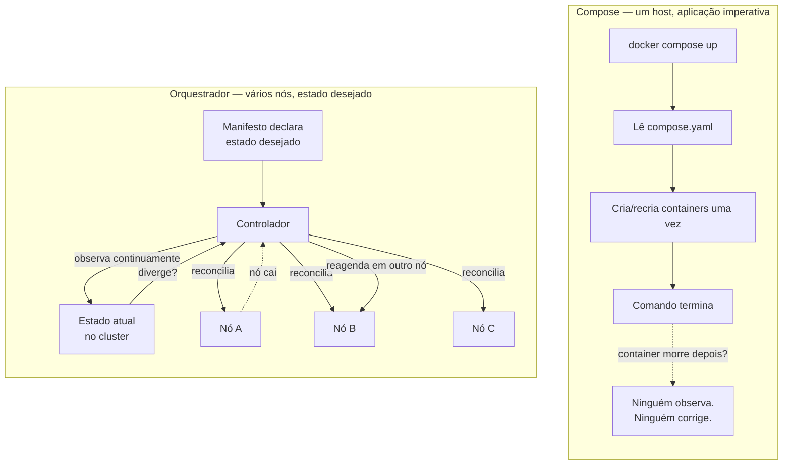

# Compose como ambiente de desenvolvimento

> [!abstract] TL;DR
> Compose resolve um problema muito específico e resolve bem: descrever, num arquivo versionado, todos os serviços que uma aplicação precisa para rodar — aplicação, banco, cache, fila — e subir esse conjunto inteiro com um comando, de forma reproduzível para qualquer pessoa que clone o repositório. Ele faz isso amarrando rede, volumes e variáveis de ambiente automaticamente, e com `condition: service_healthy` ele até resolve corretamente a diferença entre "o container começou" e "o serviço está pronto para receber tráfego". Mas Compose não reconcilia estado: ele aplica o que você pediu, uma vez, numa máquina só, e vai embora — não há controlador rodando em segundo plano trazendo o sistema de volta ao estado desejado quando algo sai do previsto. É exatamente essa ausência — de reconciliação contínua, de múltiplos nós, de rollout com verificação de saúde — que abre a porta para orquestração de produção.

Um time novo entra num projeto e o README diz: "instale Postgres 16, Redis 7, RabbitMQ 3.12, depois rode a API". Cada instrução tem uma versão específica, uma porta padrão que pode colidir com outra coisa já instalada na máquina, um passo de configuração inicial que o autor do README esqueceu de mencionar porque "já estava configurado" há dois anos. Três dias depois, alguém finalmente consegue rodar a aplicação — só que com Postgres 15, porque foi o que o `brew install postgres` trouxe, e um bug sutil de compatibilidade de tipo aparece semanas depois em produção. Esse cenário, multiplicado por cada novo membro do time e por cada máquina de CI, é o problema que motivou o Compose a existir: não uma limitação técnica do Docker, mas o custo de coordenar manualmente várias peças móveis que precisam nascer juntas, na versão certa, na mesma rede, com os dados no lugar certo.

O Docker sozinho já resolve isolamento e reprodutibilidade por container individual — isso ficou estabelecido desde a nota sobre [[03-Dominios/Tecnologia/Infraestrutura/Docker/06 - Dados que sobrevivem ao container|dados que sobrevivem ao container]] e a nota sobre [[03-Dominios/Tecnologia/Infraestrutura/Docker/07 - Rede no Docker|rede no Docker]]. O que falta é um jeito declarativo de dizer "estes N containers, juntos, formam a minha aplicação" — e é exatamente essa lacuna que o Compose preenche.

## O arquivo compose.yaml

Um arquivo `compose.yaml` descreve serviços, não containers diretamente. Cada serviço é uma receita: qual imagem usar (ou como construí-la), quais portas expor, quais volumes montar, quais variáveis de ambiente injetar, de quais outros serviços ele depende. Quando você roda `docker compose up`, o Compose lê essa receita e cria um container por serviço — mas antes disso, ele já fez um trabalho importante nos bastidores.

```yaml
# compose.yaml
services:
  app:
    build:
      context: .
      dockerfile: Dockerfile
    ports:
      - "3000:3000"
    environment:
      - NODE_ENV=development
      - DATABASE_URL=postgres://app:app@db:5432/app
      - REDIS_URL=redis://cache:6379
    depends_on:
      db:
        condition: service_healthy
      cache:
        condition: service_started
    volumes:
      - ./src:/app/src
      - ./package.json:/app/package.json
    profiles:
      - default

  db:
    image: postgres:16-alpine
    environment:
      - POSTGRES_USER=app
      - POSTGRES_PASSWORD=app
      - POSTGRES_DB=app
    volumes:
      - db-data:/var/lib/postgresql/data
    healthcheck:
      test: ["CMD-SHELL", "pg_isready -U app"]
      interval: 5s
      timeout: 5s
      retries: 5

  cache:
    image: redis:7-alpine
    volumes:
      - cache-data:/data

  migration-tool:
    image: app-migrations:latest
    profiles:
      - tools
    depends_on:
      db:
        condition: service_healthy
    command: ["migrate", "up"]

volumes:
  db-data:
  cache-data:
```

Cada bloco sob `services:` vira um container quando o Compose sobe o projeto. O nome do serviço — `app`, `db`, `cache` — não é só um rótulo organizacional: é também o nome que os outros containers usam para se encontrar. Isso porque, ao criar o projeto, o Compose cria automaticamente uma rede definida pelo usuário e conecta todos os serviços a ela, com o DNS interno do Docker resolvendo `db` para o endereço IP do container do banco. É exatamente o mecanismo descrito na nota sobre [[03-Dominios/Tecnologia/Infraestrutura/Docker/07 - Rede no Docker|rede no Docker]] — só que ali era um passo manual (`docker network create`, depois `--network` em cada `docker run`), e aqui o Compose faz por você, sem que você precise nem pensar nisso. A `DATABASE_URL` no exemplo acima usa `db` como host justamente porque essa resolução de nome já está garantida pela rede que o Compose criou.

Volumes seguem o mesmo princípio de declaração central: em vez de lembrar de recriar `docker volume create db-data` toda vez que alguém monta o ambiente do zero, o bloco `volumes:` no topo do arquivo declara os volumes nomeados que os serviços referenciam, e o Compose garante que existam antes de qualquer container subir. O comportamento de persistência em si — o que sobrevive a um `docker compose down`, o que não sobrevive, a diferença entre volume nomeado e bind mount — é o assunto já coberto em [[03-Dominios/Tecnologia/Infraestrutura/Docker/06 - Dados que sobrevivem ao container|dados que sobrevivem ao container]]; o Compose não muda essa semântica, só automatiza a criação e a referência.

Variáveis de ambiente podem vir embutidas no `compose.yaml` (como no exemplo acima) ou, mais comumente em projetos reais, de um arquivo `.env` na mesma pasta — o Compose carrega esse arquivo automaticamente e permite interpolação, como `${DATABASE_URL}` dentro do YAML. Isso separa configuração (o `compose.yaml`, versionado) de segredo e valor por ambiente (o `.env`, normalmente no `.gitignore`, com um `.env.example` versionado como documentação viva de quais variáveis existem).

## O ciclo de comandos do dia a dia

Na prática, o trabalho com Compose gira em torno de um punhado pequeno de comandos, mas vale ver o que cada um realmente faz por baixo, porque a confusão entre eles é uma fonte comum de erro. `docker compose up` calcula a diferença entre o estado descrito no arquivo e o que já existe, e cria ou recria o que for necessário; com `-d` ele roda em segundo plano e devolve o terminal; sem `-d`, ele fica anexado, mostrando os logs entrelaçados de todos os serviços em tempo real — útil justamente para desenvolvimento, quando você quer ver o que a aplicação está fazendo enquanto edita código. `docker compose down` faz o inverso: para e remove os containers e a rede criada para o projeto, mas preserva os volumes nomeados por padrão — os dados do banco sobrevivem à queda do ambiente.

```bash
# Sobe tudo em segundo plano, construindo a imagem do serviço "app" se necessário
docker compose up -d --build

# Lista os serviços do projeto e seu estado atual
docker compose ps

# Acompanha os logs de um serviço específico, em tempo real
docker compose logs -f app

# Abre um shell dentro do container já rodando, para inspecionar algo pontualmente
docker compose exec app sh

# Sobe também o serviço de migração, que fica fora do "up" comum por causa do profile
docker compose --profile tools run --rm migration-tool

# Reconstrói só a imagem de um serviço, sem tocar nos demais
docker compose build app

# Derruba o ambiente, preservando os volumes nomeados
docker compose down

# Derruba o ambiente E apaga os volumes — cuidado aqui
docker compose down --volumes
```

`docker compose exec` roda um comando dentro de um container que já está de pé — é o caminho normal para inspecionar algo pontualmente, como abrir um shell ou rodar uma query direto no banco. Já `docker compose run` cria um container novo, avulso, a partir da definição de um serviço, útil para tarefas de execução única que não fazem parte do ciclo de vida contínuo da aplicação — é assim que o serviço `migration-tool` do exemplo, com seu `profile: tools`, normalmente é invocado: não como parte do `up` do dia a dia, mas sob demanda, quando alguém precisa rodar uma migração.

> [!tip] Vídeo — a dor que o Compose resolve, encenada antes da solução
> [**How To Use Docker To Make Local Development A Breeze**](https://www.youtube.com/watch?v=zkMRWDQV4Tg) (ArjanCodes, ~22 min, EN) tem uma virtude didática que compensa a duração: ele **primeiro mostra o problema**. Constrói a imagem à mão, roda o container, edita o código — e nada acontece, porque o código está gravado na imagem. Só depois de percorrer o ciclo manual de apagar container, reconstruir imagem e subir de novo é que ele apresenta o Compose com a pasta de build declarada e, principalmente, a **sincronização do código-fonte**: a partir dali, salvar o arquivo reinicia o serviço sozinho. É exatamente o argumento desta nota — o Compose não é "Docker com YAML", é o que torna o container um ambiente de desenvolvimento em vez de um artefato de entrega. **O que ele não cobre:** `depends_on` e a diferença entre iniciado e pronto, `healthcheck`, perfis e sobreposição de arquivos, e o `docker compose watch`, que é a evolução do que ele faz com volume — assunto da seção seguinte.

## docker compose watch — sincronização sem bind mount manual

Versões recentes do Compose (a partir da 2.22, distribuída com Docker Engine desde 2023) trazem `docker compose watch`, uma alternativa ao bind mount manual do código-fonte. Em vez de montar `./src:/app/src` de forma estática no `compose.yaml`, o serviço declara uma seção `develop.watch` dizendo quais caminhos observar e o que fazer quando mudam — sincronizar o arquivo alterado direto para dentro do container já rodando (`action: sync`), ou disparar um rebuild completo da imagem quando o arquivo que mudou afeta a build em si, como o `package.json` (`action: rebuild`).

```yaml
services:
  app:
    build:
      context: .
    develop:
      watch:
        - action: sync
          path: ./src
          target: /app/src
        - action: rebuild
          path: ./package.json
```

A vantagem sobre o bind mount estático é granularidade: o Compose decide, arquivo por arquivo, se basta copiar a mudança para dentro do container já rodando ou se é preciso reconstruir a imagem — o que evita tanto o exagero de rebuildar tudo a cada salvamento quanto o problema oposto de um bind mount genérico esconder que uma mudança de dependência exigiria, sim, uma imagem nova. Ainda assim, o propósito continua sendo estritamente o mesmo do bind mount tradicional: acelerar o ciclo de edição em desenvolvimento. `docker compose watch` não muda nada sobre o que acontece em produção — lá, a imagem construída continua sendo o único artefato que importa.

## Exemplo trabalhado: do clone ao primeiro request

Vale seguir o fluxo completo, do jeito que uma pessoa nova no projeto realmente experimenta, usando o `compose.yaml` apresentado no início desta nota. Depois de clonar o repositório, o primeiro passo é copiar o arquivo de exemplo de variáveis de ambiente e ajustar o que for local:

```bash
git clone git@example.com:time/app.git
cd app
cp .env.example .env
```

Com o `.env` no lugar, o comando que sobe o ambiente inteiro é um só:

```bash
docker compose up -d --build
```

O que acontece por baixo, em ordem, é bem mais do que o comando único sugere. O Compose lê o `compose.yaml`, resolve as variáveis via `.env`, constrói a imagem do serviço `app` a partir do `Dockerfile` local (porque esse serviço tem `build:` em vez de `image:`), cria a rede definida pelo usuário para o projeto, cria os volumes nomeados que ainda não existem, e então inicia os containers respeitando a ordem imposta por `depends_on` — `db` primeiro, aguardando seu `healthcheck` reportar sucesso, só depois `app`.

```
[+] Running 4/4
 ✔ Network app_default       Created
 ✔ Volume "app_db-data"      Created
 ✔ Container app-db-1        Healthy
 ✔ Container app-cache-1     Started
 ✔ Container app-app-1       Started
```

Uma pessoa acompanhando esse output percebe que o container `app-db-1` só aparece como `Healthy` — não apenas `Started` — antes do container da aplicação subir; é a garantia de `condition: service_healthy` sendo cumprida na prática, não apenas descrita no arquivo. Para confirmar que os três serviços estão de pé:

```bash
docker compose ps
```

```
NAME             IMAGE               STATUS                    PORTS
app-app-1        app-app             Up 8 seconds              0.0.0.0:3000->3000/tcp
app-cache-1       redis:7-alpine      Up 9 seconds              6379/tcp
app-db-1          postgres:16-alpine  Up 10 seconds (healthy)   5432/tcp
```

A coluna `STATUS` do serviço `db` mostra `(healthy)` entre parênteses — o resultado visível do `healthcheck` declarado no arquivo. Nesse ponto, um `curl` na porta exposta já deve responder, porque a aplicação só terminou de subir depois que o banco confirmou que estava pronto:

```bash
curl http://localhost:3000/health
```

Editar um arquivo dentro de `./src` no host e salvar aparece imediatamente refletido dentro do container `app`, sem rodar `docker compose up` de novo — efeito do bind mount (ou da seção `develop.watch`, se configurada). Ao final do dia, ou entre sessões de trabalho, o comando que encerra tudo preservando os dados é:

```bash
docker compose down
```

Os volumes `db-data` e `cache-data` continuam existindo depois desse comando; na próxima vez que alguém rodar `docker compose up`, o banco volta com os mesmos dados de antes, sem precisar rodar migrações ou popular dados de teste de novo.

## depends_on e a diferença entre iniciado e pronto

Aqui mora uma das armadilhas mais comuns de quem começa a usar Compose. `depends_on` controla **ordem de inicialização**, não prontidão. Na forma mais simples — `depends_on: [db]` — o Compose garante que o container `db` seja *criado e iniciado* antes do container `app`. Mas "iniciado" não é "pronto". O processo do Postgres pode ter acabado de começar, ainda estar rodando rotinas de inicialização do banco de dados, e recusar conexões por vários segundos — enquanto isso, a aplicação já tentou conectar, falhou, e ou crashou ou entrou num loop de retry malfeito.

A correção correta não é adicionar um `sleep` no `entrypoint` da aplicação — isso é gambiarra que falha de forma imprevisível dependendo da carga da máquina. A correção correta é declarar um `healthcheck` no serviço dependido e usar `condition: service_healthy` em vez de apenas listar o nome do serviço. No exemplo acima, o serviço `db` declara um `healthcheck` que roda `pg_isready` a cada 5 segundos; o serviço `app` declara `depends_on: db: condition: service_healthy`, o que significa "não inicie o container `app` até que o healthcheck do `db` reporte `healthy` pelo menos uma vez". Essa é a diferença entre container iniciado e serviço pronto, resolvida de verdade — não por adivinhação de tempo, mas por verificação ativa do estado interno do serviço.

Vale notar que `condition: service_started` (o padrão implícito quando você só lista o nome do serviço) ainda tem seu lugar: para dependências que não têm — ou não precisam de — um conceito de "pronto" distinto de "rodando", como um serviço de cache que aceita conexões desde o primeiro milissegundo depois do bind na porta.

Existe ainda uma terceira condição, `service_completed_successfully`, pensada para dependências que não são serviços de longa duração e sim tarefas de execução única — um container que roda uma migração de banco e termina com código de saída zero. Um serviço que declara essa condição só inicia depois que o container dependido tiver rodado até o fim e saído com sucesso; se ele sair com um código de erro, o serviço dependente nunca chega a iniciar, e o Compose reporta a falha em vez de seguir em frente como se nada tivesse acontecido.

| Condição | O que garante | Quando usar |
|---|---|---|
| `service_started` (padrão) | O container foi criado e o processo principal começou a rodar | Serviços sem noção útil de "pronto" distinta de "rodando" |
| `service_healthy` | O `healthcheck` do serviço dependido já reportou `healthy` ao menos uma vez | Bancos de dados, filas, qualquer serviço que demora para aceitar conexões de verdade |
| `service_completed_successfully` | O container dependido rodou até o fim e saiu com código zero | Tarefas de execução única, como uma migração que precisa terminar antes da aplicação subir |

## Variáveis de ambiente e o arquivo .env

O `.env` na raiz do projeto — na mesma pasta do `compose.yaml` — é lido automaticamente pelo Compose antes de qualquer interpolação de variável no arquivo. Isso significa que `${DATABASE_PASSWORD}` dentro do `compose.yaml` é substituído pelo valor definido no `.env`, sem precisar exportar nada manualmente no shell antes de rodar o comando.

```bash
# .env
POSTGRES_PASSWORD=app_dev_password
APP_PORT=3000
```

```yaml
services:
  app:
    ports:
      - "${APP_PORT:-3000}:3000"
    environment:
      - DATABASE_URL=postgres://app:${POSTGRES_PASSWORD}@db:5432/app
  db:
    environment:
      - POSTGRES_PASSWORD=${POSTGRES_PASSWORD}
```

A sintaxe `${APP_PORT:-3000}` fornece um valor padrão para quando a variável não está definida em lugar nenhum, o que torna o arquivo tolerante a ambientes onde o `.env` ainda não foi criado — útil logo depois de um `git clone`, antes de qualquer configuração local. A prática comum é versionar um `.env.example` com todas as chaves esperadas e valores de exemplo (nunca segredos reais), e deixar o `.env` de fato fora do controle de versão, listado no `.gitignore`; cada pessoa que clona o repositório copia o exemplo e preenche os valores que fazem sentido para a própria máquina.

Vale reforçar o limite dessa abordagem: um arquivo `.env` é texto plano no disco. Ele resolve bem o problema de configuração por ambiente de desenvolvimento — não é, e nunca se propôs a ser, um cofre de segredo com rotação, criptografia em repouso ou controle de acesso granular. Para produção, esse mesmo problema pede outra ferramenta — é um dos pontos onde a resposta muda quando o alvo deixa de ser a máquina de um desenvolvedor.

## healthcheck: as variações de teste

O `healthcheck` de um serviço aceita algumas formas de teste diferentes, e escolher a certa evita tanto falsos positivos (o Compose achar que está tudo bem quando não está) quanto falsos negativos (marcar como `unhealthy` um serviço que na verdade está funcionando). `CMD-SHELL` executa a string dada através de `/bin/sh -c`, o que permite pipes e variáveis de shell, mas exige que um shell exista dentro da imagem — não é garantido em imagens `distroless`. `CMD`, na forma de lista, executa o binário diretamente, sem passar por um shell, e por isso funciona mesmo em imagens minimalistas sem `/bin/sh`, desde que o binário testado exista na imagem.

```yaml
services:
  api:
    healthcheck:
      # Forma CMD-SHELL: precisa de shell dentro da imagem
      test: ["CMD-SHELL", "curl -f http://localhost:8080/health || exit 1"]
      interval: 15s
      timeout: 5s
      retries: 3
      start_period: 20s

  worker:
    healthcheck:
      # Forma CMD: roda o binário direto, sem shell — funciona em imagens distroless
      test: ["CMD", "/app/healthcheck-bin"]
      interval: 15s
      timeout: 5s
      retries: 3
```

O campo `start_period` merece atenção à parte: ele define uma janela de tolerância logo após o container iniciar, durante a qual falhas do healthcheck não contam para o contador de `retries` nem derrubam o status para `unhealthy`. É o mecanismo certo para uma aplicação que sabidamente demora alguns segundos para terminar sua própria inicialização (aquecer um pool de conexões, carregar um cache em memória) antes de estar de fato pronta — sem esse campo, um healthcheck agressivo poderia marcar o serviço como não saudável exatamente durante essa janela normal de aquecimento, disparando reinícios desnecessários se combinado com uma política de `restart` que reage a esse estado.

| Campo | Efeito |
|---|---|
| `test` | Comando executado para verificar a saúde; `CMD` roda direto, `CMD-SHELL` passa por um shell |
| `interval` | Intervalo entre execuções sucessivas do teste |
| `timeout` | Tempo máximo que uma execução do teste pode levar antes de contar como falha |
| `retries` | Número de falhas consecutivas necessárias para marcar o serviço como `unhealthy` |
| `start_period` | Janela inicial de tolerância em que falhas não contam para `retries` |

## Perfis e sobreposição de arquivos

Nem todo serviço deveria subir em todo cenário. O exemplo acima tem um serviço `migration-tool` com `profiles: [tools]` — ele só sobe se você rodar `docker compose --profile tools up`, e fica de fora de um `docker compose up` comum. Isso evita que ferramentas administrativas (rodar uma migração pontual, gerar dados de teste, abrir um shell administrativo) apareçam toda vez que alguém sobe o ambiente do dia a dia, sem exigir um `compose.yaml` separado ou duplicado para cada variação.

Para variações mais estruturais — diferenças entre o ambiente de um desenvolvedor individual e o ambiente usado em CI, por exemplo — o Compose permite sobrepor arquivos. Um `compose.override.yaml` na mesma pasta é automaticamente mesclado sobre o `compose.yaml` quando você roda `docker compose up`, sem precisar de flag nenhuma; para outras combinações, `docker compose -f compose.yaml -f compose.ci.yaml up` mescla explicitamente o arquivo base com um arquivo adicional. Isso permite, por exemplo, manter o `compose.yaml` genérico e correto para qualquer ambiente, e usar um `compose.override.yaml` (tipicamente não versionado, ou versionado como exemplo) só para as particularidades da máquina de um desenvolvedor específico — uma porta diferente, um volume extra montado, uma variável de debug ligada.

```bash
# Sobe usando apenas o arquivo base, sem migration-tool
docker compose up -d

# Inclui o serviço de ferramentas administrativas nesta subida
docker compose --profile tools up -d

# Mescla explicitamente o arquivo base com um arquivo específico de CI
docker compose -f compose.yaml -f compose.ci.yaml up -d --build
```

```yaml
# compose.override.yaml — mesclado automaticamente sobre compose.yaml
services:
  app:
    ports:
      - "9229:9229"    # porta extra, para anexar um debugger Node
    environment:
      - LOG_LEVEL=debug
```

O merge entre arquivos é feito campo a campo, não arquivo a arquivo: uma lista como `ports` é concatenada, um mapa como `environment` é combinado chave a chave, e um valor escalar no arquivo de sobreposição substitui o valor correspondente do arquivo base. Isso é o que permite manter o `compose.yaml` principal enxuto e comum a todo mundo, e usar arquivos de sobreposição pequenos e focados só na diferença que cada contexto realmente precisa — sem duplicar o arquivo inteiro para cada variação.

## O fluxo de desenvolvimento com bind mount

O exemplo de `compose.yaml` acima monta `./src:/app/src` como bind mount — o código-fonte do host aparece dentro do container, e mudanças no editor do desenvolvedor refletem imediatamente dentro do processo rodando, sem rebuild da imagem. Combinado com uma ferramenta de recarga automática (nodemon, um dev server com hot reload, ou o processo de watch equivalente na linguagem em uso), isso produz o ciclo de desenvolvimento que todo mundo quer: editar, salvar, ver o efeito, sem esperar minutos de build a cada alteração de uma linha.

Esse mesmo padrão é **inaceitável como forma de entregar software**. Um bind mount do código-fonte depende da árvore de arquivos existir no host exatamente daquele jeito — não existe isso em produção, onde o artefato que roda é a imagem construída e nada mais, imutável e auto-contida. As técnicas de build enxuto e reprodutível cobertas nas notas sobre multi-stage e BuildKit — veja [[03-Dominios/Tecnologia/Infraestrutura/Docker/10 - BuildKit por dentro|BuildKit por dentro]] — existem justamente para que o artefato de produção não dependa de mais nada além de si mesmo. Um bind mount de código é uma conveniência de desenvolvimento que troca reprodutibilidade por velocidade de iteração; essa troca faz sentido na mesa de um desenvolvedor e não faz sentido nenhum num ambiente que precisa ser idêntico da primeira à milésima execução.

> [!info] Vocabulário — o binário separado morreu
> O comando moderno é `docker compose` — subcomando integrado à CLI principal do Docker, escrito em Go, parte do Docker Engine desde 2021. O antigo `docker-compose` (com hífen), um binário Python separado que precisava ser instalado à parte, entrou em modo de manutenção e não recebe mais atualizações de funcionalidade; a Compose Specification que ele lia também evoluiu (o arquivo se chama `compose.yaml`, não mais obrigatoriamente `docker-compose.yml`, embora o nome antigo ainda seja reconhecido por compatibilidade). Documentação, tutoriais e scripts antigos que usam `docker-compose` com hífen não estão errados historicamente, mas descrevem uma ferramenta que não é mais o caminho recomendado.

## O que o Compose não faz

Tudo até aqui descreve o Compose fazendo bem exatamente o que ele promete: declarar um conjunto de serviços e subir esse conjunto de forma reproduzível numa máquina. O problema aparece quando esse mesmo arquivo, ou a mesma mentalidade, é levado para um contexto onde "subir uma vez numa máquina" deixa de ser suficiente.

**Compose não reconcilia estado.** Quando você roda `docker compose up`, o Compose lê o arquivo, calcula a diferença entre o que existe e o que foi pedido, e aplica essa diferença — uma vez. Depois disso, ele não fica rodando em segundo plano observando o sistema. Se um container morre e a política de `restart` não cobre o caso (ou não existe), ninguém percebe e ninguém age; o serviço simplesmente fica fora do ar até uma pessoa notar e rodar o comando de novo. Não existe um controlador com um laço contínuo perguntando "o estado atual bate com o estado desejado?" e agindo quando a resposta é não — o que existe é uma aplicação pontual de configuração, seguida de silêncio.

**Compose roda em uma máquina só.** Todo o arquivo `compose.yaml` pressupõe um único host Docker por trás do comando. Não há conceito de agendar um serviço num de vários nós disponíveis, não há tolerância à falha da máquina inteira — se o host morre, tudo o que rodava nele morre junto, sem failover — e não há como escalar um serviço além do que aquele host físico ou virtual aguenta. `docker compose up --scale app=3` até sobe três réplicas do serviço `app`, mas as três continuam competindo pelos mesmos recursos da mesma máquina; não há distribuição real de carga entre hosts diferentes.

**Não há atualização progressiva com verificação de saúde.** Quando você muda a imagem de um serviço e roda `docker compose up` de novo, o Compose recria o container: para o antigo, sobe o novo, ponto. Não existe um mecanismo nativo de subir a nova versão ao lado da antiga, direcionar uma fração do tráfego, verificar se a nova versão está saudável, e só então completar a troca — e, criticamente, não existe reversão automática para a versão anterior se a nova falhar. Se o deploy dá errado, a correção é manual: alguém percebe, edita o arquivo de volta, roda o comando de novo.

**Não há descoberta de serviço entre máquinas nem gestão de segredo além do básico.** A resolução de nome via DNS interno funciona muito bem dentro da rede de um único host — mas não existe um mecanismo do Compose para um serviço descobrir e falar com outro serviço rodando num host Docker diferente. E o inventário de segredo se limita a arquivo `.env` e variável de ambiente; não há um armazenamento de segredo com rotação, controle de acesso granular ou auditoria integrado ao Compose.

O diagrama a seguir contrasta as duas formas de operar:



A diferença central não é sofisticação de sintaxe — é a existência de um laço de controle. Compose aplica uma intenção e para. Um orquestrador de produção mantém um controlador rodando indefinidamente, comparando o estado desejado (declarado) contra o estado observado (real), e agindo sozinho toda vez que os dois divergem, em qualquer um dos nós do cluster.

**Limites de recurso existem, mas não há um agendador que os respeite entre nós.** É possível declarar `deploy.resources.limits` num serviço do Compose, restringindo quanta CPU e memória o container pode usar — o Docker Engine aplica esse limite localmente, via os mesmos mecanismos de cgroup usados por qualquer container. A diferença para um orquestrador de produção não está na sintaxe do limite, e sim no que existe por trás dele: um orquestrador usa esses números para decidir *onde* colocar cada carga de trabalho dentro de um conjunto de nós com capacidade diferente, evitando concentrar demais num único nó e deixando outro ocioso; o Compose, rodando numa máquina só, não tem decisão nenhuma de posicionamento para tomar — o limite existe só para conter um container que já sabe, de antemão, em qual (única) máquina vai rodar.

Também não há isolamento multi-tenant nem controle de acesso granular por serviço. Tudo que um `compose.yaml` descreve roda com os privilégios de quem executou o comando, na mesma máquina, sem um conceito equivalente a namespaces isolando cargas de trabalho de times ou aplicações diferentes dentro do mesmo cluster, nem um modelo de permissão que diga "esta equipe pode alterar este serviço, aquela não pode". Isso é razoável para o escopo em que o Compose nasceu — uma pessoa ou um time pequeno, uma máquina, um projeto — e deixa de ser suficiente exatamente quando a mesma infraestrutura passa a hospedar várias equipes e várias aplicações com fronteiras de responsabilidade próprias.

Essas lacunas não são um defeito de projeto do Compose — ele nunca se propôs a resolver esses problemas, porque eles só aparecem quando a unidade de operação deixa de ser "uma máquina com alguns containers" e passa a ser "uma frota de máquinas rodando uma aplicação que não pode parar". São exatamente essas perguntas — quem reconcilia estado quando algo falha, como escalar entre nós, como fazer um rollout seguro com reversão automática, como descobrir serviços através de uma frota inteira, como isolar cargas de trabalho de times diferentes no mesmo cluster — que o próximo domínio deste vault, sobre orquestração de containers em produção, vai responder. Este vault ainda não tem esse conteúdo escrito; o que fica registrado aqui é a fronteira exata onde a responsabilidade do Compose termina.

## Onde o Compose continua certo, mesmo com orquestração no horizonte

Vale fechar sem cair na caricatura oposta — a de tratar o Compose como uma ferramenta de brinquedo que qualquer time sério abandona assim que amadurece. Isso não é verdade. Mesmo organizações que operam um orquestrador de produção completo, com múltiplos nós e reconciliação contínua, tipicamente continuam usando Compose para dois propósitos que o orquestrador não substitui bem: o ambiente de desenvolvimento local de cada pessoa, e a suíte de testes de integração que roda em CI.

Para desenvolvimento local, rodar o cluster de orquestração completo na máquina de cada desenvolvedor — mesmo em versões locais simplificadas — costuma ser mais pesado, mais lento para iterar e mais distante do ciclo de "editar e ver o efeito imediatamente" do que um `compose.yaml` enxuto com bind mount ou `develop.watch`. E para testes de integração em CI, o padrão comum é justamente usar Compose para subir dependências reais (banco, cache, fila) ao lado dos testes, rodar a suíte, e derrubar tudo — um uso que não compete com o papel do orquestrador em produção, porque nunca teve a pretensão de reconciliar estado continuamente; a vida útil do ambiente ali é a duração do pipeline, não a duração indefinida de um serviço em produção. Esse segundo uso é justamente o assunto da nota sobre [[03-Dominios/Tecnologia/Infraestrutura/Docker/17 - Docker em CI e na máquina de dev|Docker em CI e na máquina de dev]].

Ou seja: a pergunta certa não é "Compose ou orquestrador", como se fossem concorrentes pelo mesmo papel. É "qual ferramenta serve a qual fase do ciclo de vida do software" — e a resposta comum, em times que operam em escala, é as duas ao mesmo tempo, cada uma no lugar para o qual foi desenhada.

Um exemplo concreto desse segundo uso é um arquivo de sobreposição dedicado a CI, mesclado sobre o `compose.yaml` base só durante o pipeline, sem tocar no arquivo que os desenvolvedores usam no dia a dia:

```yaml
# compose.ci.yaml — mesclado sobre compose.yaml só no pipeline de CI
services:
  app:
    build:
      target: test
    environment:
      - NODE_ENV=test
      - DATABASE_URL=postgres://app:app@db:5432/app_test
    volumes: !reset []   # remove o bind mount de código herdado do arquivo base
    command: ["npm", "run", "test:integration"]

  db:
    image: postgres:16-alpine
    tmpfs:
      - /var/lib/postgresql/data   # banco efêmero: nasce e morre com o pipeline
```

Note o uso de `!reset []` no campo `volumes` do serviço `app` — um mecanismo de merge do Compose para anular explicitamente uma lista herdada do arquivo base, em vez de concatenar a ela. Aqui isso importa porque o bind mount de desenvolvimento (`./src:/app/src`) não faz sentido nenhum dentro de um runner de CI, que já tem o código-fonte no lugar certo através do próprio checkout do pipeline — herdar esse volume seria, na melhor das hipóteses, redundante, e na pior, uma fonte de comportamento diferente entre rodar localmente e rodar em CI.

A tabela a seguir resume os conceitos que o Compose e um orquestrador de produção têm em comum — mesmo com implementações e garantias muito diferentes por trás de cada um:

| Conceito | No Compose | Num orquestrador de produção |
|---|---|---|
| Unidade de execução | Container definido por `service:` | Pod (um ou mais containers agendados juntos) |
| Descrição do desejado | `compose.yaml`, aplicado uma vez | Manifesto declarativo, observado continuamente |
| Rede interna | Rede definida pelo usuário, um host | Rede overlay entre nós, com política de acesso |
| Descoberta de nome | DNS interno do Docker, escopo do host | DNS interno do cluster, escopo de todos os nós |
| Persistência | Volume nomeado, escopo do host | Volume persistente, provisionado e anexado dinamicamente |
| Verificação de saúde | `healthcheck` + `depends_on` | Sondas de vivacidade e prontidão, com ação automática |
| Escala | `--scale`, mesma máquina | Réplicas agendadas entre nós distintos |
| Atualização | Recria o container, sem verificação | Rollout progressivo com rollback automático |
| Segredo | Arquivo `.env` / variável de ambiente | Armazenamento de segredo dedicado, com controle de acesso |

## Armadilhas comuns

> [!warning] `depends_on` sem `condition: service_healthy` não garante nada sobre prontidão
> A forma simples de `depends_on` — só o nome do serviço, sem bloco de condição — garante apenas que o container dependido foi *iniciado*, não que o processo dentro dele já está aceitando conexões. É a causa mais comum de "funciona quando eu testo local (minha máquina está lenta e o banco já subiu por acaso) e falha em CI (máquina mais rápida, aplicação tenta conectar antes do banco estar pronto)". A correção é declarar `healthcheck` no serviço dependido e usar `condition: service_healthy` explicitamente.

> [!warning] Bind mount de código em produção quebra a imutabilidade da imagem
> Copiar o padrão de bind mount de desenvolvimento (`./src:/app/src`) para um `compose.yaml` de produção significa que o processo dentro do container não está mais rodando o que a imagem contém — está rodando o que existe no sistema de arquivos do host naquele momento. Isso anula a garantia central de que a imagem é o artefato imutável e auto-contido, discutida nas notas anteriores sobre build. Em produção, o código vem de dentro da imagem, sempre.

> [!warning] `docker compose down -v` apaga volumes, e é fácil digitar sem querer
> `docker compose down` sozinho remove containers e a rede criada, mas preserva volumes nomeados — os dados do banco continuam lá para a próxima subida. A flag `-v` (ou `--volumes`) remove também os volumes declarados no arquivo, o que significa apagar o banco de dados de desenvolvimento inteiro. É comum alguém copiar um comando de um tutorial ou de um script de "limpar tudo" sem perceber que ele carrega essa flag, e perder dados locais que levaram horas para popular.

> [!warning] Confundir escala de `--scale` local com escala real de orquestração
> `docker compose up --scale app=3` sobe três containers do mesmo serviço, mas todos competindo pelos recursos da mesma máquina física ou virtual, sem balanceamento inteligente de carga entre hosts diferentes e sem tolerância a falha caso a máquina inteira caia. Tratar isso como uma solução de escalabilidade real, em vez de um artifício útil só para testar comportamento sob múltiplas instâncias localmente, é subestimar o que escala de produção exige.

## Como explicar em inglês

> Docker Compose is how I define an entire local development environment as code. A single `compose.yaml` file declares every service my application needs — the app itself, a database, a cache, sometimes a message broker — and `docker compose up` brings the whole stack up with correct networking and volumes already wired together, because Compose automatically creates a user-defined network and lets services resolve each other by name. The detail I always get right is the difference between a container starting and a service being ready: I use `healthcheck` blocks together with `depends_on: condition: service_healthy`, so the application container doesn't even start until the database has proven it's actually accepting connections, not just that its process exists. For iteration speed, I bind-mount the source code so changes reload without a rebuild — but that's strictly a development convenience; the production artifact is always the built image, with nothing bind-mounted in. And I'm clear with teams about where Compose's usefulness ends: it applies a desired state once and walks away, on a single host, with no continuous reconciliation, no multi-node scheduling, and no health-checked progressive rollout with automatic rollback. That gap is exactly why production workloads move to a real orchestrator once a single host and a one-shot `up` stop being enough.

| PT-BR | EN |
|---|---|
| ambiente de desenvolvimento | development environment |
| serviço (no Compose) | service |
| rede definida pelo usuário | user-defined network |
| verificação de saúde | healthcheck |
| container pronto (vs. iniciado) | service ready (vs. started) |
| reconciliação de estado | state reconciliation |
| atualização progressiva | rolling update / progressive rollout |
| reversão automática | automatic rollback |
| descoberta de serviço | service discovery |
| sobreposição de arquivos | file overlay / override |

## O que vem a seguir

O Compose resolve o problema de "subir vários serviços juntos numa máquina", mas os serviços que ele sobe ainda precisam vir de algum lugar quando não são construídos localmente — e é aí que entra a nota sobre [[03-Dominios/Tecnologia/Infraestrutura/Docker/12 - Registry|Registry]]: onde as imagens que um `compose.yaml` referencia por nome (`postgres:16-alpine`, `redis:7-alpine`) realmente vivem, e como uma imagem construída localmente chega a um lugar de onde outras máquinas — inclusive as de produção — podem puxá-la. A relação entre desenvolvimento local e o que roda de fato em produção, aliás, também aparece na nota sobre [[03-Dominios/Tecnologia/Infraestrutura/Docker/17 - Docker em CI e na máquina de dev|Docker em CI e na máquina de dev]], que trata do mesmo `compose.yaml` sendo reaproveitado (com ajustes) como ambiente de teste de integração em pipelines. Já a fronteira desta nota — tudo que o Compose deliberadamente não faz — é o ponto de partida do próximo galho deste domínio, sobre orquestração de containers em produção: o contrato que um orquestrador precisa cumprir está descrito, do lado de quem opera esse contrato, em [[03-Dominios/Engenharia/Operação/3 - Rodar em produção/02 - O contrato de produção do Kubernetes|O contrato de produção do Kubernetes]]; e para quem prefere não operar esse controlador diretamente, existe também o caminho de containers gerenciados na nuvem, coberto em [[03-Dominios/Tecnologia/Cloud/12 - Containers gerenciados/index|Containers gerenciados]]. De qualquer forma, o ponto de partida é o mesmo: uma vez que "uma máquina, uma vez" para de ser suficiente, alguma coisa precisa assumir o papel de observar e reconciliar continuamente — e essa alguma coisa não é o Compose.

## Fontes

- [Docker Compose overview — Docker Docs](https://docs.docker.com/compose/)
- [Compose file reference — Docker Docs](https://docs.docker.com/reference/compose-file/)
- [Compose Specification — GitHub](https://github.com/compose-spec/compose-spec/blob/master/spec.md)
- [Control startup and shutdown order in Compose](https://docs.docker.com/compose/how-tos/startup-order/)
- [Use profiles with Compose](https://docs.docker.com/compose/how-tos/profiles/)
- [Merge Compose files](https://docs.docker.com/compose/how-tos/multiple-compose-files/merge/)
- [Use Compose Watch](https://docs.docker.com/compose/how-tos/file-watch/)
- [Environment variables in Compose](https://docs.docker.com/compose/how-tos/environment-variables/)
- [Dockerfile reference — HEALTHCHECK](https://docs.docker.com/reference/dockerfile/#healthcheck)
- [Compose Specification — deploy.resources](https://github.com/compose-spec/compose-spec/blob/master/deploy.md#resources)
- [Kubernetes: What is Kubernetes? — Kubernetes Docs](https://kubernetes.io/docs/concepts/overview/)
- [Kubernetes: Liveness, Readiness and Startup Probes](https://kubernetes.io/docs/tasks/configure-pod-container/configure-liveness-readiness-startup-probes/)
