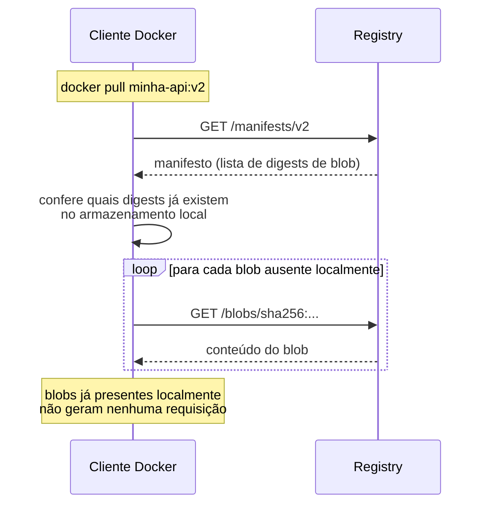
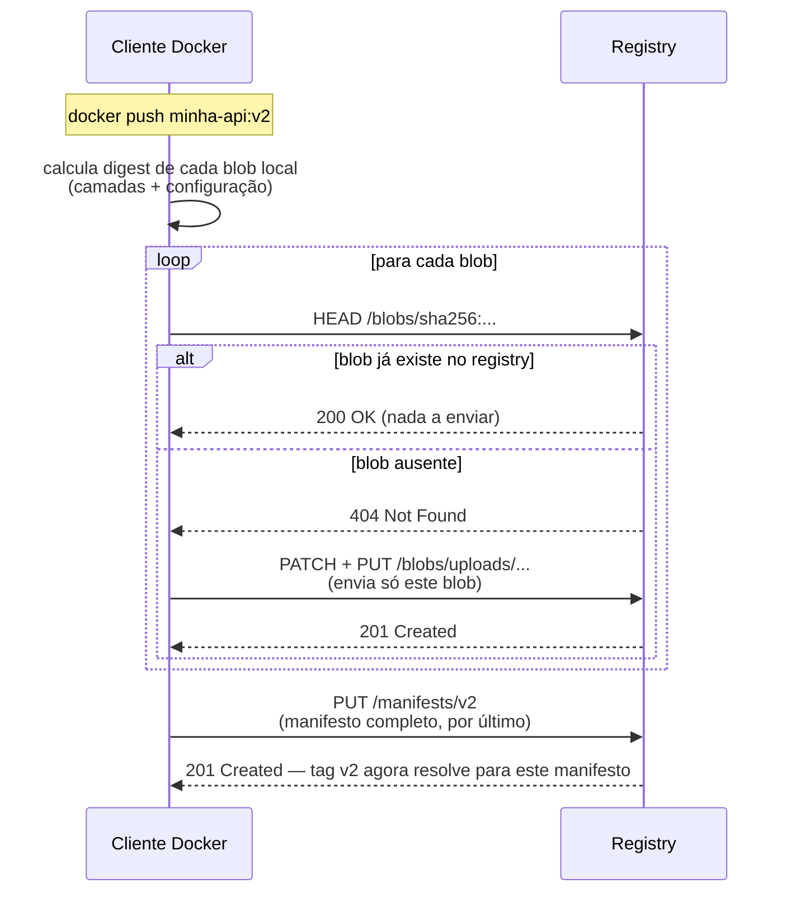
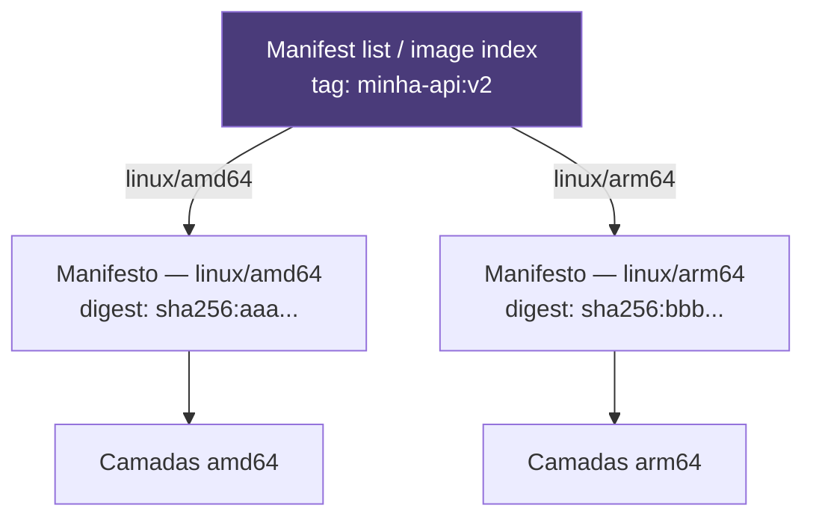
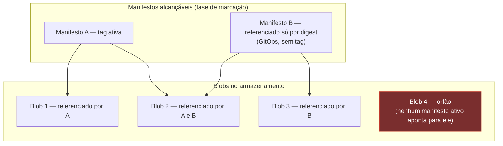
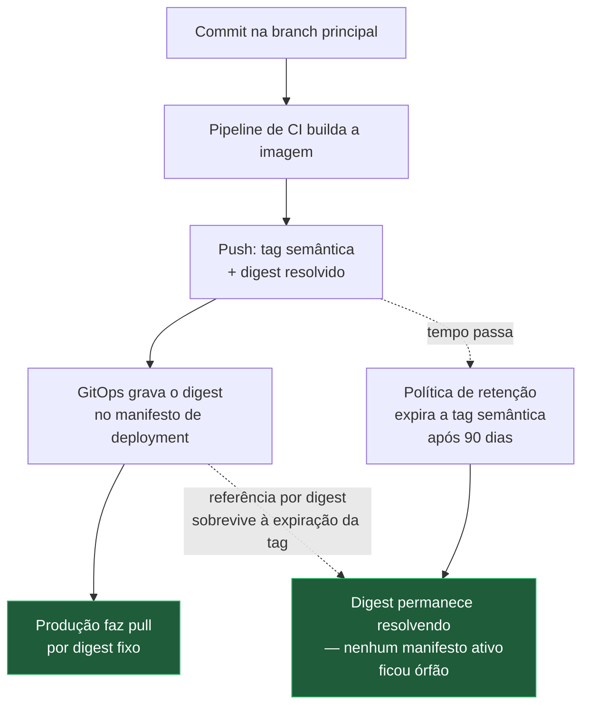
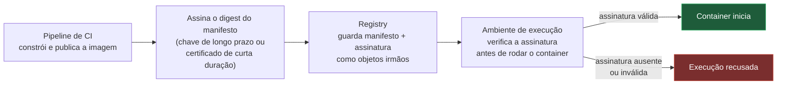

# Registry

> [!abstract] TL;DR
> Um registry não guarda imagens — guarda camadas endereçadas por digest e manifestos que apontam para elas, e é essa mesma indireção descrita na nota 02 que torna `push` e `pull` operações de diferença, não de cópia integral: o cliente pergunta o que falta, e só o que falta trafega. Uma tag é conveniência humana que aponta para um digest; fixar por digest é a única forma de garantir, matematicamente, que dois ambientes rodam o artefato exatamente igual, e essa disciplina tem um custo real — atualizar deixa de ser automático. Registry privado, retenção de camadas órfãs e proveniência de imagem são as três preocupações operacionais que crescem em torno desse mecanismo assim que ele passa a valer dinheiro e confiança, não só armazenamento.

Um pipeline de CI publica a mesma imagem, sob a mesma tag, a cada merge na branch principal — dezenas de vezes por semana, em alguns times, centenas. Alguém percebe, meses depois, que o consumo de armazenamento do registry privado cresceu de forma constante e decidiu revisar a fatura antes de entender por quê. A pergunta que motiva esta nota nasce exatamente aí: se cada imagem publicada compartilha a maior parte das suas camadas com a imagem anterior — a nota 02 já estabeleceu que camadas idênticas têm o mesmo hash e não se duplicam —, por que o espaço ocupado continua subindo sem parar? A resposta não está em nenhum detalhe do Dockerfile. Está em como o registry lida, ou deixa de lidar, com as camadas que nenhuma tag ativa mais referencia.

A mesma pergunta aparece, meses antes, de um jeito bem menos abstrato: um deploy de correção de segurança urgente puxa uma imagem que o time jurava que não tinha mudado desde ontem, e o `pull` traz um comportamento diferente do esperado — porque a tag `latest`, sem que ninguém tivesse decidido isso conscientemente, já havia sido sobrescrita por um build de outra branch horas antes. Os dois incidentes — o armazenamento que não para de crescer e a tag que muda de conteúdo sem aviso — parecem problemas distintos, um de custo e outro de confiabilidade, mas nascem da mesma peça de mecanismo: um registry guarda o que alguém manda guardar, resolve tags para o que elas apontam agora, e não tem opinião própria sobre o que "deveria" acontecer a seguir. Entender exatamente o que ele guarda, e como, é o que permite decidir — em vez de descobrir tarde demais — o que fazer a respeito de ambos.

## O que um registry guarda, de fato

Vale corrigir, de saída, uma imprecisão comum: um registry não é "um repositório de imagens" no sentido de guardar um arquivo por imagem. Um registry guarda dois tipos de objeto, ambos já apresentados na nota 02 como peças da anatomia de uma imagem, agora vistos do lado do servidor: **blobs** (as camadas de dados comprimidas e a configuração da imagem, cada uma endereçada pelo seu próprio digest SHA-256) e **manifestos** (documentos JSON que listam, por referência, quais blobs compõem qual imagem, para qual plataforma). O registry não sabe, em nenhum sentido interessante, "o que é uma imagem" — ele sabe servir blobs por digest e manifestos por tag ou por digest, e é a combinação dessas duas operações que, do lado do cliente, produz a ilusão de "baixar uma imagem".

Essa arquitetura é normatizada, não é escolha de um fornecedor específico: o protocolo que rege como um cliente conversa com um registry — quais endpoints existem, como se autentica, como se lista o que falta, como se envia um blob — é a [OCI Distribution Specification](https://github.com/opencontainers/distribution-spec/blob/main/spec.md), mantida pela mesma Open Container Initiative responsável pelo formato de imagem que a nota 02 citou. Docker Hub, GitHub Container Registry, Amazon ECR, Google Artifact Registry, Azure Container Registry e um registry auto-hospedado com o projeto Distribution implementam, todos, essa mesma API HTTP — é por isso que `docker push` e `docker pull` funcionam de forma idêntica contra qualquer um deles, trocando apenas o hostname no início do nome da imagem.

Um registry, internamente, mantém uma estrutura de armazenamento organizada em torno de dois índices: um índice de blobs, endereçado por digest (um blob com um digest específico existe uma única vez no registry, não importa quantos manifestos diferentes o referenciem — o mesmo princípio de deduplicação por conteúdo que a nota 02 descreveu para o disco local do Docker Engine, só que agora do lado do servidor), e um índice de tags por repositório, que resolve nomes legíveis como `minha-api:v1` para o digest do manifesto correspondente. Repare que essa segunda estrutura é exatamente o "ponteiro móvel" descrito na nota 02 na distinção entre tag e digest — só que agora localizado: é o registry, não o cliente, quem guarda a tabela de qual tag aponta para qual digest neste exato momento.

Vale reter essa divisão em dois índices porque ela antecipa quase todo o resto desta nota: a economia de rede em push e pull vem do índice de blobs (perguntar o que já existe antes de enviar); a mutabilidade que a nota 02 já descreveu para tag versus digest vive inteiramente no índice de tags, nunca no de blobs; e o problema de crescimento sem fim que abriu esta nota nasce exatamente na lacuna entre os dois — blobs que o índice de blobs ainda guarda, mas que nenhuma entrada do índice de tags, direta ou indiretamente, ainda aponta.

### Um registry guarda mais do que imagens de container

Vale um parágrafo sobre uma consequência da arquitetura de blobs-e-manifestos que vai além do escopo estrito de imagens Docker, porque explica um uso cada vez mais comum do mesmo protocolo: como o formato de manifesto não exige, estruturalmente, que os blobs referenciados sejam camadas de sistema de arquivos, a mesma API de distribuição serve, sem modificação nenhuma, qualquer artefato que se deixe descrever como "uma lista de blobs endereçados por digest mais um documento de configuração" — um chart do Helm, um relatório de inventário de dependências (SBOM, *software bill of materials*), ou o próprio atestado de proveniência que a seção sobre assinatura mais adiante nesta nota vai mencionar. Isso não é um recurso lateral bolado por um fornecedor específico: é uma consequência direta de o protocolo OCI Distribution ter sido desenhado em torno de digest e mediaType genéricos, não em torno da noção específica de "camada de container". Na prática, muitos times já guardam, no mesmo registry privado que hospeda suas imagens, outros artefatos de build ao lado delas — um mesmo serviço, uma mesma autenticação, um mesmo ciclo de retenção, cobrindo tipos de conteúdo que, cada um, teria justificado um serviço de armazenamento à parte antes dessa generalização.

### Namespace, repositório e nome de imagem

Vale destrinchar, rapidamente, o que cada pedaço de um nome como `registry.example.com/minha-org/minha-api:v2` significa para o registry, porque a estrutura interna de armazenamento espelha exatamente essas partes. O primeiro segmento, antes da primeira barra, é o hostname do registry — omitido nos comandos do dia a dia porque o cliente Docker assume `docker.io` (Docker Hub) quando nada é especificado, o que é a razão de `docker pull nginx` funcionar sem nenhum hostname visível. O restante, `minha-org/minha-api`, é o **repositório**: a unidade dentro da qual tags e manifestos são organizados e listados. Duas imagens completamente distintas — `minha-org/api` e `outra-org/api` — são repositórios diferentes mesmo tendo o mesmo nome final, porque o namespace que os precede os distingue; é essa hierarquia que permite a um mesmo registry hospedar milhares de projetos sem colisão de nomes.

Um detalhe de mecânica que decorre diretamente do armazenamento por digest, e que muitos registries de fato implementam como otimização: quando dois repositórios diferentes, no mesmo registry, compartilham um blob idêntico (a mesma camada de base, por exemplo, publicada em dois projetos distintos por equipes que nunca se falaram), a especificação de distribuição permite um **cross-repository blob mount** — o cliente, em vez de reenviar um blob que o registry já tem em outro repositório, pode pedir para "montar" a referência existente no repositório novo, sem nenhum byte de dado trafegar de novo. É a mesma lógica de deduplicação por conteúdo que rege tudo nesta nota, agora aplicada através da fronteira entre repositórios, não só dentro de um único repositório.

Isso costuma surpreender quem imagina que a deduplicação por conteúdo só vale "dentro da mesma imagem" ou "entre versões da mesma imagem" — na prática, ela vale entre quaisquer dois blobs de qualquer repositório do mesmo registry, sem nenhuma relação declarada entre os projetos que os publicaram. Duas equipes que nunca se comunicaram, construindo imagens sobre a mesma base pública, acabam compartilhando fisicamente as mesmas camadas de base no armazenamento do registry, pela simples coincidência de ambas terem baixado e reempacotado o mesmo conteúdo — o hash não sabe, e não precisa saber, de qual projeto cada camada "pertence".

## Push e pull são negociação de diferença, não transferência de imagem

Aqui está o ponto que costuma passar despercebido até alguém prestar atenção no relógio: um `docker push` ou `docker pull` nunca envia "a imagem" como um bloco. Ele envia, primeiro, um manifesto — um documento pequeno, tipicamente alguns kilobytes — e, a partir dele, negocia blob por blob quais precisam de fato trafegar.

No sentido de subida (`push`), o fluxo funciona assim: o cliente Docker calcula localmente o digest de cada blob que compõe a imagem (as camadas de dados e a configuração — cálculo que ele já tem pronto, porque é exatamente esse hash que identifica a camada desde que ela foi construída, como a nota 02 explicou em detalhe). Para cada blob, o cliente pergunta ao registry, via uma requisição HEAD contra o endpoint de blobs daquele repositório, se um blob com aquele digest exato já existe ali. O registry responde sim ou não, sem o cliente precisar enviar nenhum byte de conteúdo para fazer essa pergunta. Só os blobs para os quais a resposta é não são de fato enviados, via uma sequência de requisições PATCH e PUT (upload em partes, retomável se cair no meio). Depois que todos os blobs ausentes chegaram, o cliente envia por último o manifesto — o documento pequeno que amarra tudo — e só nesse instante a tag passa a resolver para a nova imagem.

No sentido de descida (`pull`) o fluxo é o espelho: o cliente busca primeiro o manifesto (pela tag ou pelo digest solicitado), lê ali a lista de digests de blob que ele referencia, confere no armazenamento local do Docker Engine quais desses digests já existem em disco — o mesmo mecanismo que a nota 02 usou para explicar por que a segunda imagem baixa quase de graça —, e só requisita ao registry, via GET no endpoint de blobs, exatamente os que faltam.





É essa sequência — perguntar antes de enviar, manifesto por último — que explica o fenômeno concreto que abriu esta nota e, antes dela, o que a nota 05 já havia adiantado ao falar de reaproveitamento de cache entre máquinas: se você altera uma única linha no fim de um Dockerfile de dez instruções, só a última camada (e as que dependem dela) muda de digest; as nove primeiras continuam com o mesmo hash de sempre. Um `docker push` dessa imagem revisada troca, na prática, poucos megabytes — exatamente o tamanho da camada nova — mesmo que a imagem inteira, somada, pese muitos gigabytes. O registry nunca recebe, nem armazena de novo, o que ele já tinha. O manifesto ser o último objeto a subir também não é acidente: é o que garante atomicidade do ponto de vista de quem consome a tag — enquanto os blobs estão subindo, ninguém que fizer `pull` daquela tag vê uma imagem pela metade, porque a tag só passa a apontar para o novo manifesto depois que tudo que ele referencia já está garantidamente no registry.

Vale tornar essa economia tangível com uma conta simples. Suponha uma imagem de aplicação com seis camadas: três delas, herdadas da base do sistema operacional e do runtime da linguagem, somam a maior parte do peso total; as outras três, exclusivas daquele projeto (dependências instaladas, código da aplicação, configuração), somam uma fração pequena. Se um commit altera só o código-fonte, apenas a camada de código muda de digest — as outras cinco, incluindo as duas outras camadas exclusivas do projeto que não dependiam do arquivo alterado, permanecem com o hash de sempre. Um `docker push` dessa revisão transfere, na prática, só a camada de código e o manifesto atualizado; a base do sistema operacional e o runtime, que já estão no registry desde o primeiro push, não trafegam de novo. É por isso que um pipeline de CI que builda e publica a cada merge, ao longo de centenas de execuções, transfere pela rede uma fração pequena do que a soma ingênua "tamanho da imagem vezes número de publicações" sugeriria — o próprio mecanismo de negociação por digest é o que barateia a publicação frequente, mesmo que, como a seção sobre retenção adiante vai mostrar, ele não impeça sozinho o crescimento do armazenamento acumulado.

### Autenticação por token: o desafio antes da conversa

Vale um parágrafo sobre o que de fato acontece na rede quando `docker login` já rodou e um `push` ou `pull` subsequente conversa com um registry privado, porque o mecanismo é mais interessante do que "envia usuário e senha em toda requisição". A especificação de distribuição define um fluxo em duas etapas: o cliente faz uma primeira requisição sem nenhuma credencial anexada; o registry, se aquele recurso exige autenticação, responde não com sucesso nem com uma simples recusa, mas com um código HTTP 401 acompanhado de um cabeçalho `WWW-Authenticate` que aponta para um **serviço de token** separado — geralmente outro endpoint HTTP, às vezes hospedado pelo próprio registry, às vezes por um serviço de identidade distinto. O cliente então autentica contra esse serviço de token, apresentando a credencial que `docker login` guardou, e recebe de volta um token Bearer de curta duração, com escopo explícito (por exemplo, "permissão de pull sobre o repositório `minha-org/minha-api`"). Só então o cliente refaz a requisição original, agora anexando esse token Bearer, e o registry a atende.

Essa indireção — separar "quem eu sou" (a credencial de login) de "o que eu posso fazer agora, sobre qual recurso, por quanto tempo" (o token de curta duração e escopo estreito) — é o que permite que um registry emita, para uma mesma credencial de automação, tokens diferentes para repositórios diferentes, e que cada token expire rápido sem exigir novo `docker login` a cada operação: o cliente Docker guarda a credencial de longo prazo localmente e troca por um token novo, de forma transparente, sempre que o anterior expira ou quando toca um repositório diferente pela primeira vez.

### Catálogo: o que um registry sabe listar sobre si mesmo

Vale saber que existe, na mesma especificação de distribuição, um par de endpoints que respondem não a "me dê este blob" ou "me dê este manifesto", mas a "o que você tem". O endpoint de catálogo (`GET /v2/_catalog`) lista os nomes de repositório que o registry conhece, paginados; o endpoint de tags de um repositório específico (`GET /v2/<repositório>/tags/list`) lista todas as tags publicadas ali. `docker` não expõe esses dois diretamente por um comando nativo simples — ferramentas de terceiros (interfaces web de registry, scripts de auditoria, a própria ferramenta de retenção que uma organização escolher) é que costumam falar com eles diretamente via HTTP, tipicamente autenticando com a mesma credencial que `docker login` já registrou. É a partir desses dois endpoints, na prática, que qualquer política de retenção automatizada enumera "o que existe" antes de decidir "o que expira" — sem eles, a única forma de saber o que um registry contém seria adivinhar nomes de repositório e tag um a um.

Os endpoints centrais que a especificação de distribuição define, resumidos, dão uma visão compacta de tudo que esta nota já cobriu em prosa:

| Endpoint | Propósito |
|---|---|
| `GET /v2/` | Verifica suporte ao protocolo (ping inicial) |
| `HEAD /v2/<repo>/blobs/<digest>` | Pergunta se um blob já existe, sem baixá-lo |
| `GET /v2/<repo>/blobs/<digest>` | Baixa o conteúdo de um blob específico |
| `POST` + `PATCH` + `PUT /v2/<repo>/blobs/uploads/...` | Abre, alimenta e fecha uma sessão de upload de blob |
| `GET /v2/<repo>/manifests/<referência>` | Busca um manifesto por tag ou por digest |
| `PUT /v2/<repo>/manifests/<referência>` | Publica ou atualiza um manifesto |
| `GET /v2/<repo>/tags/list` | Lista as tags de um repositório |
| `GET /v2/_catalog` | Lista os repositórios conhecidos pelo registry |

### Transferência sem rede: o elo com `docker save`

Vale fechar o mecanismo de distribuição com o caso em que ele simplesmente não se aplica: um ambiente **air-gapped** — uma rede sem acesso à internet, comum em infraestrutura militar, industrial, ou em qualquer contexto onde a política de segurança proíbe qualquer conexão de saída — não tem como fazer `docker pull` de nenhum registry remoto, porque não existe caminho de rede entre a máquina de destino e nenhum servidor. A ponte, nesse cenário, é exatamente o par de comandos que a nota 02 já introduziu para outro propósito (congelar o estado de um `docker commit` para inspeção manual): `docker save` empacota a pilha completa de camadas, manifesto e configuração de uma imagem num único arquivo `.tar` que pode viajar por qualquer meio físico ou de rede isolada — um pendrive, uma transferência por um elo de dados restrito —, e `docker load`, do outro lado, reconstrói exatamente a mesma estrutura de camadas e manifesto na máquina de destino, sem nenhum registry envolvido em nenhum dos dois lados.

```bash
docker save minha-api@sha256:e3b0c44298fc1c149afbf4c8996fb924... -o minha-api.tar
# transporte físico ou por rede isolada do arquivo .tar
docker load -i minha-api.tar
```

O ponto que vale reter aqui é conceitual, não operacional: `docker save`/`docker load` não é um substituto de segunda classe para um registry — é o mesmo modelo de distribuição (camadas endereçadas por conteúdo, manifesto como índice) transportado por um meio físico em vez de por uma conversa HTTP entre cliente e servidor. A garantia de integridade não muda: o digest da imagem carregada por `docker load` é, verificavelmente, o mesmo digest que existia antes do `docker save`, porque o hash é calculado sobre o conteúdo, não sobre o caminho que ele percorreu para chegar até ali.

Vale notar, ainda, que muitos ambientes air-gapped operam com um registry privado interno próprio, sem nenhuma saída para a internet — o que reconcilia as duas seções desta nota: `docker save`/`docker load` resolve a travessia pontual da fronteira isolada (trazer uma imagem publicada externamente para dentro da rede fechada), e, uma vez dentro, um registry privado local volta a ser o mecanismo normal de distribuição entre as máquinas daquela rede, com todas as garantias de push e pull incremental descritas ao longo desta nota funcionando exatamente como funcionariam num ambiente com acesso livre à internet.

### Upload retomável: o que acontece quando a conexão cai no meio do caminho

Vale um parágrafo sobre um detalhe de robustez que faz diferença prática em redes instáveis ou em blobs grandes: o upload de um blob individual, na especificação de distribuição, não acontece como um único envio monolítico — ele acontece como uma sessão de upload, iniciada por uma requisição que abre a sessão e devolve uma URL específica para aquele envio, seguida por uma ou mais requisições PATCH que enviam pedaços do conteúdo (cada uma podendo, opcionalmente, retomar exatamente de onde a anterior parou, consultando o registry sobre quantos bytes ele já recebeu daquela sessão), e finalizada por um PUT que fecha a sessão e confirma o digest do conteúdo completo. Isso significa que uma conexão que cai no meio do upload de uma camada grande não obriga o cliente a reenviar tudo do zero — ele pode, ao reconectar, perguntar ao registry quanto daquela sessão específica já chegou, e retomar dali. É a mesma filosofia de "não repetir o que já foi feito" que rege todo o resto do protocolo, aplicada agora à granularidade de um único blob em vez de à granularidade de uma imagem inteira.

## Manifest list: uma tag, várias arquiteturas

A nota 02 mencionou, de passagem, que a configuração de uma imagem declara uma arquitetura-alvo específica (`linux/amd64`, `linux/arm64`) e que uma tag como `alpine:3.20` frequentemente não resolve para um único manifesto, mas para um índice. Esta é a peça que faltava detalhar: esse índice se chama **manifest list** (na terminologia mais antiga do Docker) ou **image index** (na especificação OCI, que é o mesmo conceito padronizado) — um documento JSON que, em vez de listar camadas, lista **manifestos**, um por combinação de sistema operacional e arquitetura, cada um com seu próprio digest.

Quando alguém publica uma imagem multi-arquitetura — o fluxo típico de `docker buildx build --platform linux/amd64,linux/arm64 --push` — o que sobe ao registry não é um manifesto só: são dois manifestos completos e independentes, cada um com seu próprio conjunto de camadas (porque os binários compilados para `amd64` e para `arm64` são fisicamente diferentes, não a mesma camada rotulada de dois jeitos), mais um manifest list que os amarra sob a mesma tag. Quando o cliente Docker roda `docker pull minha-api:v2` numa máquina Apple Silicon, ele busca primeiro o manifest list, lê ali qual entrada corresponde a `linux/arm64`, e só então busca o manifesto específico daquela arquitetura — o cliente escolhe automaticamente, sem que ninguém precise especificar nada além da tag.



Vale amarrar essa mecânica ao que a nota [[03-Dominios/Tecnologia/Infraestrutura/Docker/10 - BuildKit por dentro|10 — BuildKit por dentro]] já estabeleceu sobre BuildKit e cache exportável: é o mesmo `docker buildx build --push`, com `--cache-to type=registry`, que publica não só as camadas da imagem final mas também um cache de build inteiro dentro do próprio registry, endereçado do mesmo jeito por digest. Um segundo desenvolvedor, ou um segundo runner de CI, fazendo o mesmo build a partir do mesmo commit, consegue reaproveitar esse cache remoto exatamente pelo mesmo mecanismo de "perguntar o que já existe antes de enviar" descrito na seção anterior — o registry, nesse uso, deixa de ser só o destino final da imagem e passa a ser também o repositório do cache de build, compartilhado entre máquinas que nunca se falaram diretamente.

Isso tem uma implicação prática que vale nomear: **a mesma tag, puxada em máquinas de arquiteturas diferentes, entrega conteúdo de fato diferente** — camadas diferentes, digests de manifesto diferentes — mesmo que o comando digitado seja idêntico e a intenção de quem publicou tenha sido "a mesma versão para todo mundo". Isso não quebra a garantia de reprodutibilidade dentro de uma mesma arquitetura (`sha256:aaa...` sempre resolve para o mesmo conteúdo `amd64`), mas quebra a ideia mais ingênua de que um único digest identifica "a imagem" de forma absoluta quando a imagem é multi-arquitetura: o digest que identifica algo de forma única, nesse caso, é o do manifest list como um todo, não o de nenhum dos manifestos internos isoladamente. Times que fixam por digest em ambientes heterogêneos (um cluster com nós `amd64` e `arm64` misturados) precisam decidir, conscientemente, se estão fixando o índice inteiro — que continua resolvendo corretamente por arquitetura — ou um manifesto específico de uma única arquitetura, o que quebraria o `pull` em qualquer nó da arquitetura oposta.

Vale reforçar que essa escolha de granularidade — índice inteiro versus manifesto de uma arquitetura específica — não é cosmética, é a diferença entre um digest que continua servindo o cluster inteiro e um digest que só serve metade dele. Um pipeline que resolve o digest a partir de `docker inspect` numa máquina de build específica, sem prestar atenção a essa distinção, captura por padrão o manifesto daquela arquitetura local, não o índice — é fácil, sem querer, fixar o pedaço errado do que parecia ser "o mesmo comando de sempre".

### Dois formatos de manifesto convivendo no mesmo protocolo

Um detalhe de compatibilidade que vale saber existe, mesmo sem se aprofundar: o manifesto que um registry serve não tem um formato único e imutável ao longo da história do ecossistema — existiu o formato original do Docker (Schema 2), e existe hoje o formato padronizado pela OCI Image Format Specification, que a nota 02 já citou. Os dois são, na prática, quase idênticos em estrutura — ambos JSON, ambos com uma lista de referências por digest e mediaType —, e todo registry minimamente atual entende ambos, mas o campo `mediaType` no topo do documento identifica qual dos dois formatos aquele manifesto específico usa, e é essa etiqueta que diz ao cliente como interpretar o restante do documento. A razão prática de mencionar isso aqui é uma armadilha real, embora cada vez mais rara: uma ferramenta de terceiros mais antiga, escrita antes da padronização OCI se difundir, pode falhar ao processar um manifesto anunciado com o mediaType OCI mesmo que o conteúdo seja funcionalmente equivalente ao que ela esperava — um problema de rótulo, não de substância, mas que aparece como erro obscuro de "manifesto inválido" quando na verdade é só desconhecimento do rótulo mais novo.

### Vendo o manifest list por dentro

Dá para inspecionar essa estrutura diretamente, sem precisar confiar de olhos fechados na explicação, com o mesmo comando que a nota 02 já introduziu para olhar um manifesto único:

```bash
docker manifest inspect --verbose python:3.12-slim
```

Contra uma imagem multi-arquitetura, a saída não é um único objeto — é uma lista, cada item trazendo um campo `platform` (com `architecture` e `os`) e um `digest` próprio, um por combinação de sistema operacional e arquitetura que aquela tag suporta. O formato, resumido e com digests encurtados para caber na página, se parece com isto:

```json
{
  "manifests": [
    {
      "mediaType": "application/vnd.oci.image.manifest.v1+json",
      "digest": "sha256:aaa111...",
      "platform": { "architecture": "amd64", "os": "linux" }
    },
    {
      "mediaType": "application/vnd.oci.image.manifest.v1+json",
      "digest": "sha256:bbb222...",
      "platform": { "architecture": "arm64", "os": "linux" }
    }
  ]
}
```

Comparar essa saída, item por item, com o resultado de `docker inspect python:3.12-slim --format '{{.Os}}/{{.Architecture}}'` rodado depois de um `pull` mostra exatamente qual entrada da lista o cliente escolheu para o host local — sempre a que combina com o sistema operacional e a arquitetura de processador daquela máquina específica, nunca uma escolha que precise ser feita manualmente pelo usuário.

## Fixar por digest: a única garantia real, e o preço dela

A nota 02 já estabeleceu a mecânica: tag é ponteiro mutável, digest é conteúdo imutável. O que esta nota acrescenta é a consequência operacional dessa distinção, porque é aqui — na hora de decidir o que efetivamente vai rodar num cluster de produção — que a diferença deixa de ser curiosidade e vira decisão de engenharia.

Rodar `imagem:v2` em produção significa confiar que `v2`, no momento em que o orquestrador fizer o `pull`, ainda resolve para o mesmo manifesto que resolvia quando alguém testou aquela imagem em staging. Na prática, a maioria dos times não sobrescreve tags de release depois de publicadas — mas nada no protocolo impede que alguém, por engano ou por processo mal desenhado, publique de novo sob a mesma tag, e nesse momento a garantia silenciosamente deixa de existir. Rodar `imagem@sha256:e3b0c4...` elimina esse risco por completo: aquele digest resolve, matematicamente, para o mesmo manifesto e as mesmas camadas hoje, amanhã e daqui a cinco anos, em qualquer registry que ainda o hospede. É a única forma de uma frase como "estamos rodando exatamente o que testamos" ser verificável em vez de apenas provável.

```bash
docker pull minha-api@sha256:e3b0c44298fc1c149afbf4c8996fb924...
```

O preço dessa disciplina é concreto e vale nomear sem meias palavras: **fixar por digest transforma toda atualização em um ato explícito**. Não existe mais "a tag mudou de conteúdo e todo mundo que a usa recebeu a correção na próxima vez que reiniciar" — alguém precisa, deliberadamente, trocar o digest referenciado no manifesto de deployment, no `docker-compose.yml`, ou onde quer que a referência viva, e isso normalmente significa um commit, uma revisão, um pipeline rodando de novo. Isso é exatamente o comportamento desejável para uma correção de segurança que se quer aplicar de forma controlada e auditável — e exatamente o comportamento indesejável para quem só queria que a base do sistema operacional recebesse patches automaticamente sem ninguém precisar tocar em nada. Times costumam resolver essa tensão fixando por digest nos ambientes onde reprodutibilidade importa mais (produção, qualquer ambiente regulado) e deixando uma tag semântica mais solta (`imagem:1.2`, sem o patch) em ambientes de desenvolvimento, onde a conveniência de "sempre a correção mais recente da série 1.2" pesa mais que a garantia absoluta. A política operacional de quando e como aplicar essa disciplina — incluindo por que `latest` nunca deveria aparecer num manifesto de produção — é assunto de [[03-Dominios/Engenharia/Operação/3 - Rodar em produção/01 - Containers em produção|Containers em produção]]; aqui cabe só deixar claro de onde vem o trade-off.

Uma prática intermediária, comum em pipelines de CI maduros, é publicar sob os dois identificadores ao mesmo tempo: uma tag semântica legível (`minha-api:2026.08.02-a1b2c3d`, combinando data e hash curto do commit) para navegação humana, e registrar em paralelo o digest resolvido daquele push num manifesto de deployment versionado. A tag dá contexto para quem está lendo um painel; o digest, gravado ao lado dela, é o que de fato ancora o deployment.

Vale mencionar que alguns registries oferecem, como recurso administrativo à parte do protocolo básico, a possibilidade de marcar uma tag específica como **imutável** — uma trava que impede qualquer novo push tentar sobrescrevê-la, obrigando quem tentar a escolher um nome de tag diferente. Isso não é uma propriedade do protocolo de distribuição em si (que, por padrão, sempre permite mover o ponteiro de uma tag para um digest novo), mas uma política adicional que o operador do registry escolhe aplicar sobre repositórios específicos. Times que adotam essa trava sobre tags de release conseguem uma garantia parecida com a de fixar por digest — "esta tag nunca vai apontar para outra coisa" — sem abrir mão da legibilidade de um nome semântico no lugar de um hash de sessenta e quatro caracteres em todo lugar onde a imagem é referenciada; a diferença é que a garantia, nesse caso, depende de uma configuração administrativa do registry continuar em vigor, e não de uma propriedade matemática que nenhuma configuração pode desfazer.

### Convenções de nome de tag: uma decisão que precede a disciplina de digest

Vale um parágrafo prático antes de seguir para registry privado, porque a decisão de que padrão de nomenclatura de tag usar condiciona quão fácil ou penoso é aplicar tudo que foi descrito até aqui. Três convenções aparecem com mais frequência, cada uma resolvendo uma prioridade diferente: **versionamento semântico** (`v1.4.2`), que comunica compatibilidade e é a escolha natural para uma biblioteca ou imagem base pensada para ser consumida por terceiros; **data de build combinada com hash curto de commit** (`2026.08.02-a1b2c3d`), que sacrifica legibilidade de compatibilidade em troca de rastreabilidade exata — cada tag aponta, sem ambiguidade, para um commit específico, útil sobretudo para aplicações internas publicadas por um pipeline de CI a cada merge; e **`latest`**, que já foi desmontada nesta nota e na nota 02 como a pior escolha para qualquer coisa que precise ser reproduzível. Nenhuma dessas convenções, por si só, resolve o problema de mutabilidade que abriu a seção anterior — mesmo uma tag semântica pode, tecnicamente, ser republicada apontando para outro digest — mas a escolha entre elas determina o quanto de disciplina extra (fixar por digest, marcar tags como imutáveis) é preciso empilhar por cima para fechar essa lacuna.

## Registry privado: onde ele mora e como o cliente se autentica

Nem toda imagem pode viver num registry público. Código proprietário, artefatos internos de build, ou simplesmente a preferência de controlar retenção e acesso levam a maioria das organizações a operar, ou contratar, um registry privado. As opções, no mecanismo, se dividem em três famílias: um **registry gerenciado de provedor de nuvem** (integrado ao provisionamento de identidade e rede daquela nuvem, sem que a organização precise operar a infraestrutura do registry em si), um **registry auto-hospedado** — tipicamente rodando o [Distribution](https://github.com/distribution/distribution), o projeto de referência open source que implementa a especificação OCI Distribution do lado do servidor, o mesmo motor por trás do Docker Hub —, ou um **registry privado de plataforma de código** (integrado ao mesmo provedor que hospeda o repositório de código-fonte, com autenticação compartilhada). Nenhuma dessas famílias muda o protocolo: todas conversam com `docker push`/`docker pull` do mesmo jeito, porque implementam a mesma especificação.

O que muda, entre as três famílias, é onde recai a responsabilidade operacional, não o mecanismo de distribuição em si. Um registry gerenciado de nuvem tira da organização a preocupação de operar disco, réplica e disponibilidade do próprio serviço de registry, em troca de menos controle sobre a configuração fina de retenção e sobre onde fisicamente os blobs residem — uma troca sensata para a maioria dos times, que preferem gastar atenção de engenharia em outro lugar. Um registry auto-hospedado com o Distribution devolve esse controle por completo — inclusive a decisão de onde os blobs vivem fisicamente, relevante para organizações com exigência regulatória de residência de dados — ao custo de a própria organização assumir a operação: backup do armazenamento de blobs, disponibilidade do serviço, e a própria execução periódica do ciclo de garbage collection descrito adiante nesta nota, que num registry gerenciado normalmente já vem embutida como responsabilidade do provedor. Um registry de plataforma de código, por fim, tem a vantagem prática de reaproveitar a mesma identidade e o mesmo controle de acesso que já regem quem pode ler ou escrever no repositório de código-fonte associado — útil quando a política de acesso a imagens deveria espelhar, de forma óbvia, a política de acesso ao código que as gerou.

Vale mencionar, de passagem, uma peça de infraestrutura que aparece na fronteira entre registry privado e economia de tráfego: um **registry mirror** (ou *pull-through cache*), um serviço intermediário que fica entre os hosts que fazem `pull` e o registry de origem, cacheando localmente os blobs já solicitados. Um cluster grande, com muitos nós fazendo `pull` da mesma imagem de base pública repetidas vezes, se beneficia de ter um mirror interno na própria rede: a primeira requisição de cada blob sai para a internet, todas as seguintes, de qualquer nó do cluster, são servidas localmente. É o mesmo mecanismo de deduplicação por digest desta nota, aplicado como camada de cache de rede em vez de camada de armazenamento — resolve exatamente a preocupação de tráfego repetido que a terceira armadilha de retenção, mais adiante, nomeia.

Vale notar que um mirror não é uma cópia completa e permanente do registry de origem — ele guarda, tipicamente, só o que já foi solicitado ao menos uma vez, crescendo sob demanda em vez de replicar tudo de antemão. Isso o distingue da replicação entre regiões descrita mais adiante nesta nota, que existe justamente para o caso oposto: garantir, de antemão e de forma completa, que um conjunto conhecido de conteúdo esteja disponível em mais de um lugar, em vez de esperar a primeira requisição para começar a cachear.

Essa mesma peça aparece com frequência do lado do desenvolvimento e da esteira de integração contínua, não só em produção: a nota [[03-Dominios/Tecnologia/Infraestrutura/Docker/17 - Docker em CI e na máquina de dev|17 — Docker em CI e na máquina de dev]] trata do runner de CI como um ambiente que se recria do zero a cada execução — o que significa, do ponto de vista desta nota, que o cache local de camadas também nasce vazio a cada job, a menos que algo preserve esse estado entre execuções. Configurar o runner para falar com um mirror interno, ou restaurar entre jobs um volume que guarde `/var/lib/docker`, é a forma de evitar que cada execução de CI repita, pela rede pública, o download completo das camadas de base que a execução anterior já havia trazido — o mesmo raciocínio de reaproveitamento de camadas entre máquinas que a nota 05 já havia adiantado, aqui aplicado especificamente à efemeridade de um runner de CI.

A autenticação, do lado do cliente, passa pelo comando `docker login`:

```bash
docker login registry.example.com
```

O fluxo por trás desse comando varia por provedor — usuário e senha, token de acesso pessoal, ou um mecanismo de credencial de curta duração emitido pela própria infraestrutura de nuvem —, mas o resultado, do lado do cliente Docker, é sempre o mesmo: um token ou credencial fica registrado, associado àquele hostname de registry, para ser enviado automaticamente em toda requisição HTTP subsequente contra ele. Onde exatamente essa credencial fica guardada no disco do cliente, em que formato, e como integrar isso com um keychain do sistema operacional ou com um cofre de segredos em vez do arquivo de configuração padrão do Docker é o assunto de [[03-Dominios/Tecnologia/Infraestrutura/Docker credential helpers|Docker credential helpers]] — esta nota só precisa que se saiba que a peça existe e que ela é o mecanismo, não o `docker login` em si, que resolve o problema real de nunca deixar uma senha em texto plano num arquivo de configuração compartilhado.

Vale distinguir, dentro dessa credencial, dois padrões de uso que aparecem o tempo todo em ambientes reais e que costumam se misturar por descuido: a credencial de uma **pessoa** (o token pessoal de quem faz `docker login` na própria máquina de desenvolvimento, tipicamente de vida longa e com escopo amplo sobre tudo que aquela pessoa pode publicar) e a credencial de uma **automação** (o token ou identidade de serviço que um pipeline de CI usa para publicar, idealmente de vida curta, escopo restrito a um repositório específico, e emitida por máquina, sem que nenhuma pessoa jamais precise digitá-la). Misturar as duas — usar o token pessoal de um desenvolvedor dentro de um pipeline de CI compartilhado, por conveniência — é um padrão comum e problemático: revogar o acesso daquela pessoa (quando ela sai do time, por exemplo) quebra silenciosamente todo pipeline que dependia, sem que ninguém tivesse documentado essa dependência, do token dela.

### Escopo de acesso: nem toda credencial deveria poder tudo

Vale um parágrafo sobre o outro eixo de controle que um registry privado normalmente oferece, além de simplesmente "autenticado ou não": permissão diferenciada por operação e por repositório. A distinção mais comum, presente em praticamente qualquer registry privado sério, separa pelo menos três níveis — **leitura** (permissão de `pull`, suficiente para qualquer máquina que só precisa rodar a imagem, nunca publicá-la), **escrita** (permissão de `push`, necessária só para quem de fato produz imagens novas, tipicamente restrita à automação de CI e a poucas pessoas) e **administração** (permissão de alterar política de retenção, gerenciar outras credenciais, ou apagar repositórios inteiros). Uma credencial de automação de CI que só precisa publicar imagens de um projeto específico não deveria ter permissão de escrita sobre repositórios de outros projetos, e quase nunca precisa de permissão administrativa nenhuma — restringir o escopo dessa forma limita o estrago possível se aquela credencial específica vazar, sem exigir nenhuma mudança no protocolo de distribuição em si, só na política de autorização que o serviço de token, mencionado na seção anterior, decide aplicar antes de emitir cada token Bearer.

## Retenção: por que um registry cresce sem parar se ninguém decidir o contrário

Volte ao cenário que abriu esta nota. Cada push de CI cria, tipicamente, uma tag nova (ou substitui uma tag existente, sem apagar o conteúdo antigo que ela apontava antes). Nenhuma dessas duas ações remove, por si só, nenhum blob do armazenamento do registry — mover ou sobrescrever uma tag muda apenas para onde o ponteiro aponta; os blobs que o manifesto anterior referenciava continuam fisicamente presentes, porque o registry não sabe, sem verificação explícita, se alguma outra tag (ou algum manifesto referenciado só por digest, sem tag nenhuma) ainda depende deles.

É aqui que aparece o conceito de **camada órfã** (ou, de forma mais geral, blob órfão): um blob que existe no armazenamento do registry mas que nenhum manifesto ativo referencia mais. Isso acontece o tempo todo em uso normal — uma tag é sobrescrita, um manifesto antigo deixa de ser apontado por qualquer tag, e as camadas exclusivas daquele manifesto (as que não eram compartilhadas com nenhuma outra imagem ainda viva) se tornam órfãs. O registry, por padrão, não detecta nem remove esses blobs sozinho em tempo real — fazer isso a cada operação seria caro demais; a limpeza é, em quase toda implementação, um processo separado, rodado sob demanda ou em agenda, chamado de **garbage collection**, que percorre todos os manifestos ativos, monta o conjunto de digests ainda referenciados, e só então remove do armazenamento tudo que sobrou fora desse conjunto.

A conta simples que explica o crescimento sem fim é direta: um pipeline de CI que publica uma tag nova a cada merge, sem nenhuma política de expiração, acumula um manifesto novo (e, tipicamente, ao menos uma camada exclusiva daquela build — a camada com o binário ou o código-fonte mais recente) a cada execução, para sempre, mesmo que ninguém jamais volte a puxar noventa por cento dessas tags antigas. Sem garbage collection rodando com regularidade, e sem uma **política de retenção** — regras explícitas como "manter só as últimas N tags por repositório", "expirar tags sem pull há mais de X dias", ou "manter permanentemente apenas tags que correspondem a um release marcado" —, o espaço ocupado cresce de forma monotônica, porque cada novo push soma e (quase) nada nunca subtrai automaticamente.

Vale tornar essa acumulação tangível com números ilustrativos, sem nenhuma pretensão de refletir um caso real: imagine um repositório que recebe vinte publicações por semana, cada uma acrescentando, em média, uma única camada exclusiva de poucos megabytes (o restante compartilhado com a build anterior). Ao fim de um ano, isso são mais de mil manifestos e mil camadas exclusivas acumuladas — nenhuma delas individualmente pesada, mas a soma se torna relevante justamente porque nada, por padrão, as remove. Aplicar uma política que mantenha, digamos, as últimas vinte tags por repositório mais qualquer tag marcada como release, e rodar garbage collection depois de aplicá-la, faz esse número parar de crescer sem limite e se estabilizar num teto previsível — o mecanismo não é sofisticado, é aritmética simples aplicada com disciplina, mas exige que alguém explicitamente configure o teto, porque o comportamento padrão do protocolo de distribuição é nunca remover nada por conta própria.

> [!warning] Sobrescrever uma tag não libera espaço sozinho
> Publicar de novo sob a mesma tag (`docker push minha-api:latest`, repetidamente) muda só o ponteiro; o manifesto e as camadas exclusivas da versão anterior continuam ocupando espaço no registry até que um ciclo de garbage collection rode e confirme que nenhuma outra tag ou manifesto os referencia mais. Quem espera que sobrescrever uma tag "limpe" o espaço da versão anterior está confundindo o comportamento do ponteiro com o comportamento do armazenamento — são coisas diferentes, e só a segunda de fato libera disco.

> [!warning] Retenção agressiva pode apagar o que um digest fixo em produção depende
> Uma política de expiração que remove tags "sem uso há X dias" olhando só para o histórico de `pull` da tag corre o risco de apagar um manifesto que um ambiente de produção referencia por digest fixo, sem nunca ter puxado por aquela tag desde a fixação — porque, tecnicamente, o `pull` mais recente foi por digest, não pela tag, e alguns sistemas de métricas de uso contam só o segundo. Antes de aplicar retenção agressiva, vale confirmar se a métrica de "última vez usado" da ferramenta de retenção enxerga pulls por digest, não só por tag.

> [!warning] O tráfego de saída também custa, e cresce junto com o número de consumidores
> O foco costuma recair só sobre armazenamento acumulado, mas o outro lado do mecanismo de retenção mal ajustado é o tráfego de rede: cada `pull` de uma camada que não está em cache local do consumidor sai do registry pela rede, e um cluster grande fazendo `pull` repetido da mesma imagem sem um cache de camadas próximo — um mirror local, um proxy de pull-through — multiplica esse tráfego por nó. Retenção resolve o lado do armazenamento acumulado; ela não resolve, sozinha, o lado do tráfego repetido — são dois mecanismos de custo distintos, com mitigação distinta.

### Manifestos sem tag: quando um digest continua vivo por referência indireta

Vale um parágrafo sobre um caso que confunde ferramentas de retenção mal calibradas: um manifesto pode continuar plenamente alcançável mesmo depois que a última tag que apontava para ele expira, se algo fora do próprio registry — o manifesto de deployment do GitOps do exemplo anterior, um `docker-compose.yml` versionado, um arquivo de infraestrutura como código — ainda referencia aquele digest diretamente. Do ponto de vista puramente interno do registry, sem visibilidade sobre esses consumidores externos, esse manifesto órfão de tag parece candidato a expirar; a política de retenção que só olha para "tags sem pull recente" pode, de fato, removê-lo — como a segunda armadilha desta nota já advertiu — mesmo que produção dependa dele. É por isso que qualquer disciplina séria de retenção precisa de um canal, ainda que manual, para marcar exceções: digests que uma política automática nunca deve tocar, porque algo fora do alcance de visão do registry ainda depende deles.

### O que garbage collection de fato faz, e por que roda separado

Vale entrar num nível a mais de detalhe sobre o mecanismo de limpeza, porque "coleta de lixo" descrito de forma vaga soa mais mágico do que é. O processo, na implementação de referência do Distribution, funciona em duas fases: primeiro, uma fase de marcação (*mark*), que percorre todos os manifestos de todos os repositórios ainda alcançáveis por alguma tag ou por alguma referência explícita por digest, e monta o conjunto completo de digests de blob que esses manifestos referenciam; depois, uma fase de varredura (*sweep*), que percorre o armazenamento físico inteiro e remove qualquer blob cujo digest não apareceu na fase de marcação. É por isso que o processo tipicamente exige, na implementação de referência, que o registry fique em modo somente-leitura durante a execução (ou uma versão mais recente que suporte marcação incremental sem essa exigência) — rodar uma marcação enquanto um push concorrente ainda está no meio do caminho correria o risco de marcar como órfão um blob que um upload em andamento já considera parte de um manifesto que ainda não terminou de subir.



O blob 4, no diagrama, é exatamente o candidato que a fase de varredura remove — nenhum manifesto ainda alcançável, com ou sem tag, aponta para ele. Os blobs 1, 2 e 3 sobrevivem porque pelo menos um manifesto alcançável ainda os referencia, mesmo que esse manifesto (o B) não tenha nenhuma tag apontando para ele — só uma referência externa por digest, como o exemplo de GitOps da seção anterior descreveu. Note também que o blob 2 é compartilhado entre dois manifestos diferentes — o mesmo princípio de deduplicação por conteúdo da seção sobre camadas compartilhadas, agora visto sob a ótica de quem decide o que pode ser removido com segurança: um blob só vira candidato a remoção quando *nenhum* manifesto alcançável, entre todos os que existem, ainda o referencia.

Isso explica por que garbage collection não roda automaticamente a cada operação, e por que a maioria das organizações a agenda (uma vez por dia, uma vez por semana) em vez de acioná-la manualmente sempre que alguém lembra: o custo de percorrer todo o armazenamento cresce com o tamanho do registry, e rodar isso com frequência excessiva compete por recursos com o tráfego normal de push e pull. A política de retenção — quais tags expiram, depois de quanto tempo, com qual exceção para tags marcadas como release — é o que decide *o que* vira candidato a órfão antes mesmo de a coleta rodar; a coleta em si só executa a limpeza física do que a política já decidiu que pode ser descartado.

Vale reforçar a ordem exata dessas duas etapas, porque invertê-la mentalmente é a fonte mais comum de confusão sobre o assunto: primeiro alguém decide, via política de retenção, quais tags devem deixar de existir; só depois disso a coleta de lixo entra em cena para transformar essa decisão em espaço de disco de fato liberado. Rodar garbage collection sem nenhuma política de retenção configurada não libera quase nada, porque quase tudo continua alcançável por alguma tag; e definir uma política de retenção sem nunca rodar a coleta correspondente deixa as tags expiradas fora da listagem, mas os blobs que elas apontavam continuam fisicamente ocupando disco até a varredura de fato acontecer.

### Replicação entre regiões: o mesmo digest, servido de mais perto

Vale um parágrafo sobre uma preocupação que só aparece quando uma organização opera em mais de uma região geográfica: um registry único, hospedado numa única localização, impõe latência de rede a qualquer `pull` feito de longe, e se torna um ponto único de falha se aquela localização ficar indisponível. A resposta operacional comum é **replicação**: manter cópias do mesmo conteúdo — os mesmos blobs, os mesmos manifestos, os mesmos digests — em mais de uma região, com algum mecanismo de sincronização entre elas. O ponto que vale reter, ligado ao resto desta nota, é que a replicação nesse cenário é barata precisamente pela mesma razão que o `push` incremental é barato: como cada blob é imutável e endereçado por conteúdo, replicar significa copiar bytes que nunca vão precisar de reconciliação de conflito — não existe "duas versões divergentes do mesmo digest" para resolver, porque um digest, por definição, identifica um único conteúdo possível. A sincronização entre réplicas se resume a "quais digests uma região ainda não tem", a mesma pergunta que rege push e pull entre cliente e registry, agora aplicada entre dois registries.

## Um cenário do início ao fim: da build ao digest fixado

Vale amarrar todas as peças desta nota num único fluxo contínuo, do jeito que ele de fato acontece num time que leva reprodutibilidade a sério, em vez de deixá-las soltas como conceitos separados.

O trecho de pipeline abaixo, simplificado até o essencial, mostra as etapas que a narrativa a seguir descreve — build, push sob tag semântica, captura do digest resolvido, e gravação desse digest (não da tag) no arquivo que o GitOps observa:

```bash
docker build -t registry.example.com/minha-org/minha-api:2026.08.02-a1b2c3d .
docker push registry.example.com/minha-org/minha-api:2026.08.02-a1b2c3d

DIGEST=$(docker inspect registry.example.com/minha-org/minha-api:2026.08.02-a1b2c3d \
  --format '{{index .RepoDigests 0}}')

sed -i "s|image:.*|image: ${DIGEST}|" deployment/minha-api.yaml
git commit -am "deploy: minha-api @ ${DIGEST}"
git push
```

Um pipeline de CI builda a imagem de uma aplicação a partir de um commit específico e publica sob duas referências ao mesmo tempo: uma tag semântica legível, combinando data e hash curto do commit (`minha-api:2026.08.02-a1b2c3d`), e nenhuma outra tag além dela — deliberadamente, sem tocar em `latest` nem em nenhuma tag genérica que outro processo possa estar consumindo. O push segue exatamente o protocolo descrito mais cedo: o cliente pergunta ao registry, blob a blob, o que falta; como a base do sistema operacional e o runtime da linguagem não mudaram desde a build anterior, só a camada com o código-fonte novo e a camada de configuração viajam pela rede, e o manifesto sobe por último, tornando a nova tag visível de uma vez, nunca pela metade.

Imediatamente depois do push, o próprio pipeline consulta o digest que aquele push resolveu (com `docker inspect --format '{{index .RepoDigests 0}}'`, como a nota 02 já demonstrou) e grava esse digest — não a tag — no manifesto de deployment que um sistema de GitOps observa: um arquivo YAML versionado num repositório separado, cuja mudança é o gatilho real de qualquer atualização em produção. A partir desse ponto, produção nunca mais consulta a tag; ela só reage a mudanças nesse arquivo, e o campo que importa ali é `imagem@sha256:...`, não `imagem:2026.08.02-a1b2c3d`. Se alguém, por engano, publicar de novo sob a mesma tag semântica — algo que a convenção do time desestimula, mas que o protocolo não impede —, produção continua rodando exatamente o digest gravado, imune ao que aconteceu com a tag depois.



Meses depois, uma política de retenção configurada no registry expira tags mais antigas que noventa dias, exceto as que carregam um marcador explícito de release. A tag `2026.08.02-a1b2c3d` desaparece da listagem — mas o digest que ela apontava, ainda referenciado pelo manifesto de deployment gravado por GitOps, continua resolvendo normalmente: a política de retenção remove tags e, na sequência, blobs que nenhum manifesto ainda alcançável referencia; ela não invalida um digest que algo em produção ainda cita explicitamente, porque isso tornaria a fixação por digest inútil na primeira vez que uma política de limpeza rodasse. É essa combinação — publicar sob tag e digest simultaneamente, consumir por digest em produção, deixar a tag livre para expirar — que faz retenção e reprodutibilidade conviverem sem se anular.

### O registry como dependência crítica de tempo de execução — e quando ele deixa de ser

Vale um parágrafo desfazendo uma suposição implícita que percorreu esta nota inteira: que o registry precisa estar disponível toda vez que algo precisa rodar. Isso é verdade no momento do `pull` inicial — sem conexão com algum registry (ou com um mirror local, na forma descrita mais cedo), não há como obter camadas que ainda não existem localmente. Mas, uma vez que a imagem já foi puxada e está presente no armazenamento local do Docker Engine ou do runtime de container que a hospeda, rodar um container a partir dela não depende mais do registry em nenhum momento — o registry é uma dependência de *distribuição*, não de *execução*. Um host que já tem a imagem em cache continua rodando, reiniciando e escalando containers a partir dela normalmente mesmo que o registry de origem fique temporariamente inacessível; o que fica bloqueado, nesse cenário, é qualquer tentativa de *atualizar* para uma imagem nova ou de provisionar um host novo que ainda não tem nada em cache local. Essa distinção — indisponibilidade do registry bloqueia deploy novo, não execução existente — costuma ser a primeira pergunta útil ao diagnosticar um incidente que parece envolver o registry: o sintoma é "não consigo publicar uma correção" ou é "os containers que já rodavam pararam"? Só o primeiro aponta de fato para o registry; o segundo tem outra causa, e a disciplina de projetar para essa distinção — quantas réplicas manter localmente, como isolar o plano de execução do plano de distribuição — é assunto operacional de [[03-Dominios/Engenharia/Operação/3 - Rodar em produção/01 - Containers em produção|Containers em produção]].

### Apagar manualmente: o endpoint existe, mas raramente é o caminho certo

Vale fechar a discussão de retenção mencionando que a especificação de distribuição define, sim, um endpoint de exclusão direta (`DELETE /v2/<repo>/manifests/<digest>`, e o equivalente para blobs), que remove uma referência específica sem esperar por nenhum ciclo de garbage collection. Na prática, times raramente usam esse endpoint diretamente e no dia a dia — apagar um manifesto manualmente, sem revisar antes o que mais o referencia (a mesma pergunta que a seção sobre manifestos sem tag levantou), corre o risco de invalidar silenciosamente algo que uma tag secundária ou uma referência externa por digest ainda dependia. A exclusão direta tem seu lugar em situações pontuais e bem entendidas — remover um push feito por engano minutos atrás, antes que qualquer outro processo tivesse chance de puxá-lo —, mas a ferramenta de trabalho do dia a dia, para o problema estrutural de crescimento sem fim, continua sendo a política de retenção combinada com garbage collection agendado, não uma sequência de exclusões manuais decididas caso a caso.

## Assinatura e proveniência, de raspão

Um registry que serve blobs por digest garante integridade de conteúdo (o que você recebe é, comprovadamente, o que aquele digest identifica) mas não garante, por si só, **origem** — nada no protocolo de distribuição impede, estruturalmente, que alguém com acesso de push publique uma imagem sob um nome que parece legítimo mas cujo conteúdo não veio de onde deveria vir. É aqui que entram dois mecanismos que valem ser nomeados sem se aprofundar: **assinatura de imagem** (anexar, ao manifesto ou ao repositório, uma assinatura criptográfica que atesta que uma chave específica, controlada por quem tem autoridade para publicar aquela imagem, endossou aquele digest exato) e **atestado de proveniência** (um documento, também assinado, que registra de onde a imagem veio — qual pipeline de build, qual commit de código-fonte, quais dependências entraram na build), no espírito do que a especificação [in-toto](https://in-toto.io/) e o framework [SLSA](https://slsa.dev/) formalizam para cadeia de suprimento de software em geral.

Essa camada de disciplina importa porque muda a pergunta que se pode fazer sobre uma imagem antes de rodá-la: sem assinatura, a pergunta possível é só "este digest corresponde a este conteúdo?" (verificável, mas cega quanto à origem); com assinatura e proveniência, a pergunta possível passa a ser "este conteúdo foi de fato produzido pelo pipeline que eu autorizo, a partir do código-fonte que eu esperava?" — uma garantia de cadeia de suprimento, não só de integridade de bytes.



Vale nomear, sem detalhar, que a forma dominante desse mecanismo hoje costuma dispensar a gestão manual de chave privada de longo prazo — o modelo chamado de **assinatura sem chave** (*keyless signing*, popularizado pelo projeto Sigstore e sua ferramenta `cosign`), no qual a assinatura é gerada usando um certificado de curtíssima duração, emitido no instante da build a partir da identidade da própria automação de CI (por exemplo, "este workflow específico, deste repositório específico, rodando neste pipeline"), e a verificação depois consulta um log de transparência público para confirmar que aquela assinatura de fato existiu naquele momento, sem que ninguém precise guardar nem proteger uma chave privada permanente. Esse detalhe existe porque gerir chave privada de longo prazo é, historicamente, o ponto mais frágil de qualquer esquema de assinatura — perder a chave, vazar a chave, ou esquecer de revogá-la quando alguém sai do time são falhas humanas recorrentes; tirar a chave de longo prazo da equação fecha essa classe inteira de risco. Esta nota não tem escopo para ensinar a configurar nenhuma dessas ferramentas; a disciplina de assinar, verificar e recusar imagens não assinadas em tempo de execução pertence à nota [[03-Dominios/Tecnologia/Infraestrutura/Docker/13 - Segurança da imagem e do runtime|13 — Segurança da imagem e do runtime]] e ao domínio de Segurança do vault — aqui cabia só deixar registrado que o mecanismo existe, e que ele resolve um problema que digest sozinho, por desenho, não resolve.

### Assinatura não é a mesma garantia que varredura de vulnerabilidade

Vale um parágrafo desfazendo uma confusão comum antes de encerrar esta seção: assinatura e proveniência respondem "esta imagem veio de onde eu autorizo, sem ser adulterada no caminho"; elas não respondem, e nunca prometeram responder, "esta imagem é segura de rodar". Uma imagem pode ser assinada corretamente pelo pipeline autorizado, com proveniência impecável, e ainda assim conter uma biblioteca com uma vulnerabilidade conhecida, um pacote desatualizado, ou um usuário `root` desnecessário definido no Dockerfile — nenhum desses problemas tem relação com quem publicou a imagem ou se o conteúdo foi adulterado no trajeto até o registry. São duas preocupações ortogonais, resolvidas por mecanismos diferentes: assinatura garante integridade de cadeia de suprimento; varredura de vulnerabilidade (que compara o conteúdo instalado dentro da imagem contra bases de dados de vulnerabilidades conhecidas) e a disciplina mais ampla de reduzir superfície de ataque são o assunto específico da próxima nota deste galho. Um registry maduro tipicamente aplica os dois — recusa publicar ou servir imagens não assinadas, e reporta vulnerabilidades encontradas — mas são dois portões distintos, não um substituindo o outro.

### Limite de taxa de pull: outro motivo para autenticar e para ter um mirror

Vale mencionar, sem citar nenhum número específico de nenhum provedor — números de limite mudam com frequência e qualquer valor citado aqui envelheceria rápido —, que registries públicos comumente impõem um **limite de taxa de pull** (*pull rate limiting*), mais permissivo para requisições autenticadas do que para requisições anônimas, e frequentemente contado por endereço IP de origem quando a requisição não carrega nenhuma credencial. Isso tem uma implicação concreta em ambientes com muitos consumidores atrás do mesmo IP de saída — um cluster inteiro de CI, uma rede corporativa compartilhada —, onde requisições anônimas de dezenas de jobs distintos podem, somadas, esbarrar num teto pensado para uso individual, mesmo que nenhum job isolado esteja fazendo algo abusivo. As duas mitigações mais comuns são exatamente duas peças que esta nota já cobriu por outros motivos: autenticar (mesmo contra um repositório público, uma requisição autenticada tipicamente conta contra um teto mais generoso, associado à conta, não ao IP) e manter um mirror ou pull-through cache interno, que reduz drasticamente o número de requisições que de fato saem para o registry de origem, porque a maioria dos `pull`s passa a ser satisfeita localmente.

## Armadilhas comuns

> [!warning] "O pull demorou o mesmo tempo de sempre" nem sempre é bug de cache
> Se um `pull` que deveria reaproveitar camadas locais volta a baixar tudo do zero, antes de suspeitar de corrupção de cache vale conferir se a tag mudou de digest desde a última vez — um rebuild da imagem base upstream, por exemplo, produz camadas novas com hashes novos, e nesse caso o download completo é o comportamento correto, não uma falha: não há nada para reaproveitar porque o conteúdo, de fato, mudou.

> [!warning] Um manifest list não é "uma imagem maior" — é várias imagens sob uma tag
> Ferramentas que somam o tamanho reportado de uma tag multi-arquitetura, sem distinguir que aquele número às vezes soma manifestos que nenhum host individual jamais baixa todos juntos, superestimam o espaço que qualquer host real vai de fato ocupar — cada host baixa só o manifesto da sua própria arquitetura, nunca os dois.

> [!warning] Registry privado sem autenticação renovável quebra silenciosamente em produção
> Um token de `docker login` com expiração curta, configurado manualmente numa máquina de CI e nunca renovado por automação, funciona por semanas e falha de repente, tipicamente no pior momento — um deploy de correção de segurança urgente que não consegue puxar a imagem porque a credencial expirou sem ninguém perceber. Preferir mecanismos de credencial de curta duração emitidos automaticamente pela própria infraestrutura, em vez de um token estático colado numa variável de ambiente de pipeline, evita essa classe inteira de falha.

> [!warning] Credencial de `docker login` persistida num runner compartilhado vaza entre jobs
> Um runner de CI reutilizado entre pipelines de projetos diferentes, sem limpar o estado do cliente Docker entre execuções, pode deixar a credencial de um `docker login` anterior disponível para o próximo job que rodar naquele mesmo runner — mesmo que os dois pipelines pertençam a times ou repositórios distintos. Isolar o estado do cliente Docker entre jobs (um runner efêmero por execução, ou uma limpeza explícita de credenciais ao final de cada job) evita que o escopo de acesso cuidadosamente restrito de uma credencial de automação, descrito mais cedo nesta nota, vaze silenciosamente para um contexto que nunca deveria tê-lo.

> [!warning] Fixar por digest sem revisar o manifest list quebra em ambientes multi-arquitetura
> Copiar um digest específico obtido numa máquina `amd64` e fixá-lo diretamente num manifesto de deployment que também vai rodar em nós `arm64` aponta, sem que o erro seja óbvio de imediato, para um manifesto de uma única arquitetura — e o `pull` falha, ou pior, alguém força um mecanismo de emulação caro, no primeiro nó de arquitetura diferente que tentar rodá-lo. Em ambientes heterogêneos, o digest correto a fixar costuma ser o do manifest list como um todo, não o de um manifesto de arquitetura individual escolhido sem querer.

## Como explicar em inglês

A registry is not a warehouse of complete images — it's a content-addressed store of blobs and manifests, and push or pull is really a negotiation of difference: the client asks which digests the registry already has, and only the missing blobs actually travel over the network. Pinning a deployment to a digest instead of a tag is the only way to guarantee, cryptographically, that you're running the exact same artifact you tested, at the cost of making every update an explicit, deliberate action rather than something that happens automatically the next time a container restarts.

Worth stressing in an interview or a design discussion: the reason a registry can serve as both the source of truth and a cheap incremental publishing target is the same property discussed in the anatomy note — content-addressing. Because a layer's identity is derived from its own bytes, deduplication, retention, and replication all reduce to the same underlying question ("which digests already exist where"), rather than needing separate mechanisms for each concern.

| Português | Inglês |
|---|---|
| Registry | Registry |
| Camada / blob | Layer / blob |
| Manifesto | Manifest |
| Índice de imagem / manifest list | Image index / manifest list |
| Digest | Digest |
| Tag | Tag |
| Camada órfã | Orphaned layer / dangling blob |
| Coleta de lixo (do registry) | Garbage collection |
| Política de retenção | Retention policy |
| Proveniência | Provenance |
| Assinatura de imagem | Image signing |
| Registry mirror / pull-through cache | Registry mirror / pull-through cache |
| Blob | Blob |

## O que vem a seguir

Fixar por digest, exigir assinatura, recusar puxar de um registry não autenticado — cada uma dessas disciplinas descritas aqui resolve um problema de distribuição, mas nenhuma delas, sozinha, garante que o conteúdo dentro da imagem, uma vez que ela chega à máquina que vai rodá-la, é seguro para executar. Digest e assinatura atestam que os bytes são os certos e vieram de onde deveriam vir; não dizem nada sobre se esses bytes contêm uma dependência com uma vulnerabilidade conhecida, um usuário `root` desnecessário, ou uma superfície de ataque maior do que a aplicação precisa. Essa é exatamente a lacuna que a nota [[03-Dominios/Tecnologia/Infraestrutura/Docker/13 - Segurança da imagem e do runtime|13 — Segurança da imagem e do runtime]] cobre a seguir: a disciplina de garantir não só que a imagem é a certa, mas que ela é, em si, segura de rodar.

Repare no fio que amarra as duas notas: esta tratou de *chegar* ao artefato certo — pelo caminho de rede certo, autenticado, íntegro, com origem verificável; a próxima trata do que fazer com esse artefato depois que ele já chegou — que privilégios ele deveria ter, que superfície ele deveria expor, o que dentro dele deveria ter sido cortado antes de qualquer um confiar nele o suficiente para rodá-lo em produção. Um registry bem operado reduz a ansiedade sobre "é isto mesmo que eu pedi?" a praticamente zero; ele não reduz em nada a pergunta seguinte, que é sobre o conteúdo em si.

## Fontes

- [OCI Distribution Specification](https://github.com/opencontainers/distribution-spec/blob/main/spec.md)
- [OCI Image Format Specification](https://github.com/opencontainers/image-spec/blob/main/spec.md)
- [Distribution — registro de referência open source](https://github.com/distribution/distribution)
- [Docker Docs — Registry overview](https://docs.docker.com/registry/)
- [Docker Docs — Authenticate with a registry](https://docs.docker.com/reference/cli/docker/login/)
- [Docker Docs — Multi-platform images](https://docs.docker.com/build/building/multi-platform/)
- [in-toto — framework de atestação de proveniência](https://in-toto.io/)
- [SLSA — Supply-chain Levels for Software Artifacts](https://slsa.dev/)
- [Sigstore — assinatura keyless para software supply chain](https://www.sigstore.dev/)
- [cosign — assinatura e verificação de imagens de container](https://github.com/sigstore/cosign)

