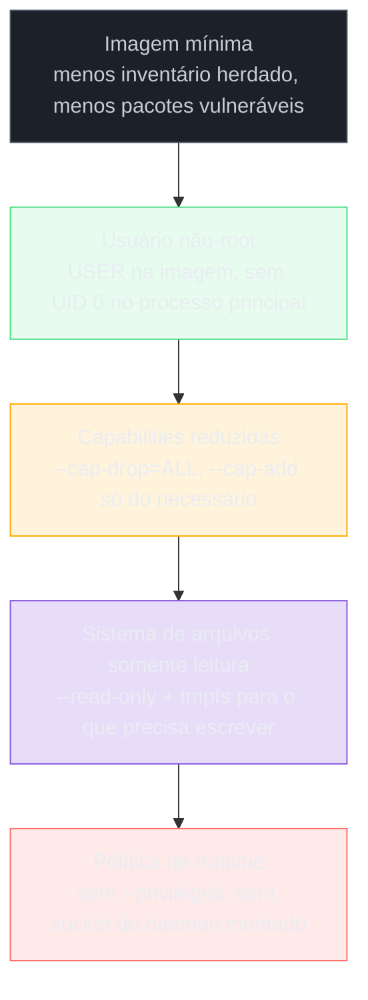

# Segurança da imagem e do runtime

> [!abstract] TL;DR
> Uma imagem Docker traz consigo, para sempre, o inventário inteiro de pacotes da sua base — a maioria dos quais a aplicação nunca chama, mas que ainda assim contam como superfície de ataque; e um segredo apagado numa instrução posterior do Dockerfile continua gravado, recuperável, na camada onde foi escrito, pela mesma imutabilidade que a nota 02 já estabeleceu. Escanear a imagem uma vez no dia do build resolve o problema errado, porque a imagem não muda mas o mundo muda: uma CVE nova pode ser publicada contra um pacote que já está parado num registry há seis meses, e só um reescaneio periódico descobre isso. O segundo eixo é o que o container pode fazer enquanto roda — e aí a pergunta não é "o que a aplicação faz de propósito" mas "o que a configuração do runtime permite", governada por usuário não-root, capabilities reduzidas, sistema de arquivos somente leitura e a recusa terminante de `--privileged` ou de montar o socket do daemon lá dentro. Esta nota separa esses dois eixos — o que está na imagem e o que o container pode fazer — e trata cada um como mecanismo, não como política de produção ou disciplina de segurança da engenharia, que pertencem a outros domínios do vault.

Um scanner de vulnerabilidades roda contra `minha-api:1.4.2` na esteira de CI, na tarde em que a imagem foi construída, e retorna limpo: zero críticas, zero altas. A imagem é promovida, publicada no registry, e passa a rodar em produção. Seis meses depois, um pesquisador de segurança publica uma vulnerabilidade nova contra uma versão específica do `openssl` — a mesma versão que veio de brinde na base Debian daquela imagem, instalada porque o gerenciador de pacotes do sistema operacional trouxe junto, não porque a aplicação chama `openssl` diretamente em nenhuma linha do código. A imagem em produção nunca foi reconstruída: ela é, byte a byte, a mesma que passou no scan seis meses atrás. Só que "passou no scan" era verdade sobre o mundo daquele dia, não uma propriedade permanente da imagem — e o mundo, entre o dia do build e hoje, mudou. Ninguém rodou o scanner de novo contra essa imagem parada no registry, porque o gate de CI só dispara quando existe um build novo, e não existe build novo: a aplicação não mudou, então ninguém tocou no Dockerfile.

Esse cenário não é hipotético nem exótico — é a consequência direta e previsível de duas propriedades que as notas anteriores deste galho já estabeleceram sobre o que uma imagem *é*. A nota 02 mostrou que uma imagem é uma pilha de camadas imutáveis: uma vez escrita, uma camada não muda, e apagar um arquivo numa camada seguinte não desfaz os bytes escritos na camada anterior — só esconde o rastro. A nota 09 mostrou que a base escolhida define um inventário de pacotes que a imagem carrega inteiro, útil ou não. Juntas, essas duas propriedades significam que uma imagem Docker é um artefato **estático que envelhece dentro de um mundo dinâmico** — o inventário de pacotes que ela carrega foi congelado no instante do build, mas o catálogo de vulnerabilidades conhecidas contra esse inventário continua crescendo depois. Essa nota trata os dois lados do problema de segurança que decorrem dessa natureza: o que está gravado na imagem (eixo 1) e o que o container tem permissão de fazer enquanto executa essa imagem (eixo 2). São mecanismos diferentes, resolvidos por ferramentas diferentes, e a confusão entre os dois é a origem de boa parte dos conselhos genéricos e inúteis do tipo "use imagens seguras". Um jeito simples de manter os dois eixos separados na cabeça: o eixo 1 é uma pergunta sobre o passado — o que já foi escrito, de forma imutável, numa camada, no momento do build — e só muda quando alguém reconstrói a imagem ou reescaneia o que já existe; o eixo 2 é uma pergunta sobre o presente — o que o processo em execução agora tem permissão de fazer — e muda a cada `docker run` diferente, mesmo usando exatamente a mesma imagem. Confundir os dois leva a erros de diagnóstico previsíveis: aplicar `--cap-drop=ALL` não torna uma imagem com inventário desatualizado menos vulnerável a uma CVE já conhecida, e trocar a base para uma distroless não impede que um container ainda rode como root se ninguém adicionar `USER` ao Dockerfile.

## Eixo 1 — o que está gravado na imagem

### O inventário herdado e o que uma CVE na base significa na prática

Toda imagem que não começa de `scratch` herda, junto com a base, uma lista de pacotes de sistema operacional instalados por quem manteve aquela base — `bash`, `coreutils`, `openssl`, `zlib`, `curl`, uma libc, e dezenas de outros, dependendo da distribuição escolhida. Nenhum desses pacotes foi pedido linha por linha pela sua aplicação; eles vieram porque a imagem base os inclui como parte do sistema operacional mínimo que ela representa. A nota 09 já tratou essa escala — completa, slim, alpine, distroless, scratch — do ângulo de tamanho e capacidade de debug. Do ângulo de segurança, a mesma escala é uma escala de **inventário herdado**: quanto mais completa a base, mais pacotes de sistema ela carrega, e cada pacote carregado é uma linha a mais no inventário que um scanner de vulnerabilidades vai cruzar contra bancos de CVE conhecidos.

Isso significa, na prática, duas coisas que costumam ser confundidas. A primeira: uma CVE crítica anunciada contra, digamos, uma versão específica de `zlib` afeta toda imagem que tenha essa versão instalada na camada de base — mesmo que a aplicação nunca importe, chame ou dependa de `zlib` em nenhum ponto do próprio código. O pacote está ali, faz parte da superfície que o scanner varre, e conta como vulnerabilidade da imagem, independente de estar em uso ativo. A segunda: reduzir a base — trocar `debian:bookworm` por `debian:bookworm-slim`, ou por uma base Alpine, ou por uma distroless — não elimina a exposição a CVEs, mas reduz o número de pacotes que podem, no futuro, ser alvo de uma. Uma imagem baseada em `scratch` ou numa distroless "estáticos" carrega essencialmente zero desse inventário de sistema operacional, porque não há sistema operacional ali — só o binário da aplicação e o mínimo de bibliotecas dinâmicas de que ele depende, se depender de alguma. Menos inventário herdado é, de forma direta e mensurável, menos superfície de ataque herdada — o mesmo argumento que a nota 09 usou para tamanho de imagem se aplica, quase palavra por palavra, a inventário de vulnerabilidade.

Rodar um scanner contra as duas versões da mesma aplicação — uma construída sobre `debian:bookworm` completo, outra sobre uma distroless equivalente — torna essa diferença visível sem precisar de nenhuma CVE específica citada aqui: a contagem de pacotes de sistema operacional relatada pelo scanner cai de várias centenas para poucas dezenas ou zero, simplesmente porque a distroless não carrega gerenciador de pacotes, shell, ou utilitários de sistema que a imagem completa inclui por padrão. O número exato de CVEs evitadas por essa troca varia a cada dia, conforme o banco de vulnerabilidades muda — por isso o argumento correto nunca é "essa base tem N CVEs a menos", que seria verdade só naquele instante, e sim "essa base tem um inventário estruturalmente menor, o que reduz a probabilidade de qualquer CVE futura encontrar algo para atingir".

### `.dockerignore` como primeira linha de defesa contra vazamento acidental

Antes mesmo de qualquer instrução do Dockerfile ser executada, o contexto de build inteiro — tudo dentro do diretório a partir do qual `docker build` é chamado — é enviado ao daemon, e qualquer instrução `COPY . .` copia, por padrão, tudo o que estiver nesse contexto para dentro da imagem, salvo o que for explicitamente excluído. Sem um arquivo `.dockerignore`, isso costuma incluir artefatos que ninguém pretendia publicar: o diretório `.git` inteiro com todo o histórico de commits, arquivos `.env` de desenvolvimento com credenciais locais, chaves privadas usadas para testes, ou o `node_modules` do host com pacotes potencialmente diferentes dos instalados dentro do container.

```
# .dockerignore
.git
.env
.env.*
*.pem
*.key
node_modules
```

O `.dockerignore` funciona de forma sintaticamente idêntica a um `.gitignore` — um padrão por linha, aplicado antes do contexto de build ser sequer transferido ao daemon — e é, na prática, o mecanismo mais barato e mais frequentemente esquecido desta nota inteira: uma única linha adicionada a um arquivo de texto simples evita que um `COPY . .` grave, permanentemente, um segredo de desenvolvimento numa camada de imagem — o mesmo problema de segredo em camada tratado na próxima seção, só que evitado na origem em vez de remediado depois.

### Segredo em camada: por que apagar depois não resolve

A nota 04 e a nota 10 já cobriram como um `--build-arg` sem cuidado vira metadado inspecionável na imagem final, e como o secret mount do BuildKit resolve o problema no momento do build. O ângulo de segurança aqui é mais específico e mais insidioso: mesmo sem `--build-arg`, um Dockerfile ingênuo que copia um arquivo de segredo, usa-o, e depois o remove numa instrução seguinte continua vazando o segredo — porque cada instrução `RUN`, `COPY` ou `ADD` gera uma camada nova, e a camada em que o segredo foi escrito não desaparece quando uma camada posterior diz "apague este arquivo". Considere:

```dockerfile
# NÃO FAÇA ISSO — o segredo continua recuperável
FROM alpine:3.20
COPY credencial.pem /tmp/credencial.pem
RUN /scripts/configura-com-credencial.sh /tmp/credencial.pem
RUN rm /tmp/credencial.pem
```

A imagem final, inspecionada com `docker run --rm imagem ls /tmp`, não mostra `credencial.pem` — o arquivo de fato não existe mais no sistema de arquivos visível do container em execução, porque a camada mais recente sobrepõe as anteriores e diz "este caminho está removido aqui". Mas a imagem inteira, incluindo cada camada intermediária, ainda existe como um conjunto de arquivos tar gravados no disco e transferidos a cada `docker pull` — e um `docker save imagem | tar -xO` seguido de inspeção manual das camadas, ou uma ferramenta como `dive`, recupera o conteúdo da camada em que `credencial.pem` foi copiado, exatamente como estava, porque aquela camada nunca foi reescrita — só escondida por uma camada seguinte. É a mesma mecânica que a nota 02 descreveu para arquivos comuns, só que aplicada a um dado que, ao contrário de um binário esquecido, tem valor direto para quem consegue puxar a imagem: uma chave privada, uma senha de banco, um token de API.

As saídas reais não passam por "lembrar de limpar direito" — passam por nunca deixar o segredo tocar uma camada em primeiro lugar. O secret mount do BuildKit, já coberto na nota 10, resolve o caso de build: o segredo é montado num sistema de arquivos temporário, acessível só durante a execução daquela instrução `RUN`, e nunca gravado em nenhuma camada da imagem. Para segredos de runtime — credenciais que a aplicação precisa quando o container já está rodando, não durante o build — a saída é injeção externa no momento de `docker run` ou pela orquestração: variáveis de ambiente passadas via `--env-file`, secrets do Docker Swarm, secrets do Kubernetes, ou um cofre externo como Vault ou um secrets manager de nuvem, nunca gravados como arquivo ou `ENV` dentro do Dockerfile.

```dockerfile
# BOM — nenhum segredo entra na imagem
# syntax=docker/dockerfile:1.6
FROM alpine:3.20
RUN --mount=type=secret,id=credencial \
    /scripts/configura-com-credencial.sh /run/secrets/credencial
```

```bash
docker build --secret id=credencial,src=./credencial.pem .
```

O contraste entre os dois Dockerfiles acima não é estético — é a diferença entre um segredo que nunca existiu como camada e um segredo que existiu, foi escondido, e continua recuperável por qualquer um com acesso à imagem completa. Vale reforçar um detalhe que passa despercebido mesmo por quem já conhece a mecânica de camadas: o histórico de instruções de uma imagem, visível via `docker history --no-trunc imagem`, também expõe o comando exato executado em cada `RUN` — incluindo qualquer segredo passado como argumento inline na própria linha de comando, e não apenas o conteúdo de arquivos copiados. Um `RUN curl -H "Authorization: Bearer abc123" https://api.exemplo.com` fica gravado, literalmente, no metadado de histórico da imagem, disponível a qualquer um que rode `docker history` ou inspecione o manifest — mais uma superfície de vazamento que a disciplina de nunca escrever segredo em texto plano dentro de uma instrução do Dockerfile precisa cobrir, além do conteúdo de arquivo já discutido.

### Escaneamento como higiene contínua, não gate único

O cenário de abertura desta nota — o scan que passou no dia do build e a CVE publicada seis meses depois — é a razão pela qual tratar o scanner de vulnerabilidades como um gate único, disparado só quando a imagem é construída, deixa uma janela de exposição indefinida aberta. A imagem não muda depois de publicada no registry: os bytes de cada camada são exatamente os mesmos hoje que eram no dia do build, e é justamente essa imutabilidade — a mesma propriedade que a nota 02 celebrou como reprodutibilidade — que faz da imagem um alvo parado. O banco de CVEs conhecidas, por outro lado, cresce todo dia: pesquisadores publicam vulnerabilidades novas contra versões de software que já estão em produção há meses ou anos, e uma imagem parada no registry não fica automaticamente ciente de nenhuma delas.

A prática que resolve isso é reescanear periodicamente as imagens já publicadas — não só as que estão sendo construídas agora — contra o banco de CVEs atualizado, e ter um processo definido para o que fazer quando um reescaneio encontra uma vulnerabilidade nova numa imagem que já está rodando em produção há meses. Ferramentas como Trivy, Grype ou Docker Scout suportam esse modo: apontar para uma imagem já publicada, sem precisar reconstruí-la, e comparar o inventário de pacotes contra o banco de vulnerabilidades do dia. Rodar isso como job agendado — diário ou semanal, contra todas as imagens ativas em produção — fecha a janela que um gate de CI, disparado só em builds novos, deixa aberta por definição.

```bash
# Reescaneia uma imagem já publicada, sem reconstruir
trivy image --severity CRITICAL,HIGH registry.exemplo.com/minha-api:1.4.2

# Docker Scout, mesmo princípio
docker scout cves registry.exemplo.com/minha-api:1.4.2
```

O ponto central é: "passou no scan" é uma afirmação sobre um instante no tempo, não uma garantia permanente sobre a imagem. Tratar o scan como algo que se refaz continuamente, e não como uma caixa marcada uma vez, é o que transforma o escaneamento de teatro de segurança em higiene de verdade.

Isso não significa abandonar o gate de CI — significa não confundir os dois momentos, que respondem a perguntas diferentes. O gate de CI, disparado a cada build, responde "essa imagem que estou prestes a publicar já nasce com uma vulnerabilidade crítica conhecida hoje?" — e é razoável falhar o pipeline quando a resposta é sim, barrando a promoção daquela imagem antes que ela chegue ao registry. O reescaneio periódico, disparado contra imagens já publicadas e já rodando, responde a uma pergunta diferente: "alguma das imagens que já estão em produção, construídas em dias passados, ficou vulnerável desde então por causa de uma CVE nova?" — e a resposta a essa pergunta só existe se alguém de fato rodar o scanner de novo, porque nenhum gate de build vai disparar sozinho para uma imagem que não está sendo reconstruída. Os dois processos são complementares, não substitutos um do outro; um projeto que só faz o primeiro tem uma falsa sensação de segurança contínua que na verdade é só segurança do instante do build.

### SBOM: o inventário que permite responder rápido quando a CVE nova aparece

Um SBOM — *Software Bill of Materials*, inventário de componentes — é uma lista estruturada e legível por máquina de exatamente quais pacotes, em quais versões, compõem uma imagem: não só os pacotes de sistema operacional da base, mas também as bibliotecas de linguagem instaladas por gerenciadores como `npm`, `pip` ou Maven durante o build. Ferramentas como `syft` geram esse inventário a partir de uma imagem já construída, e o formato costuma seguir um de dois padrões abertos, SPDX ou CycloneDX.

```bash
# Gera um SBOM em formato SPDX a partir de uma imagem publicada
syft registry.exemplo.com/minha-api:1.4.2 -o spdx-json > sbom.json
```

O valor prático do SBOM aparece exatamente no cenário descrito acima: quando uma CVE nova é anunciada contra uma versão específica de um pacote, a pergunta imediata de qualquer equipe de segurança é "quais das nossas imagens em produção têm esse pacote, nessa versão, instalado?". Sem um SBOM gerado e arquivado por imagem, responder essa pergunta significa reescanear tudo do zero, ou pior, inspecionar manualmente.

Com o SBOM já gerado no momento do build e guardado ao lado da imagem, a resposta é uma consulta contra um arquivo estruturado — minutos, não horas, e sem precisar sequer tocar o registry de novo. O SBOM não substitui o scanner — ele não julga se um componente é vulnerável, só descreve o que está presente — mas é o inventário que torna a resposta a uma CVE nova uma consulta, em vez de uma investigação.

A saída de `syft` para uma imagem real lista, tipicamente, centenas de componentes — cada linha com nome do pacote, versão instalada, e o tipo de pacote (`deb`, `npm`, `python`, entre outros), em um formato próximo a este recorte ilustrativo:

```json
{
  "artifacts": [
    { "name": "openssl", "version": "3.0.13", "type": "deb" },
    { "name": "express", "version": "4.19.2", "type": "npm" },
    { "name": "musl", "version": "1.2.4", "type": "binary" }
  ]
}
```

Cruzar esse inventário contra um banco de CVEs — o que ferramentas como Grype fazem automaticamente a partir de um SBOM já gerado, sem precisar reescanear a imagem inteira do zero — é o que fecha o ciclo: o SBOM descreve *o que existe*, o scanner decide *o que, dentro disso, é conhecido como vulnerável hoje*. Gerar o SBOM uma vez, no momento do build, e reutilizá-lo para consultas de vulnerabilidade repetidas ao longo do tempo é mais barato do que reescanear a imagem inteira, byte a byte, a cada rodada — o inventário de componentes não muda entre um reescaneio e outro, só o banco de CVEs contra o qual ele é comparado muda.

Há um segundo uso do SBOM, menos imediato mas igualmente prático: comparar o SBOM de duas versões consecutivas da mesma imagem revela exatamente o que mudou no inventário de componentes entre um build e outro — uma dependência de linguagem que subiu de versão sem ninguém perceber durante uma atualização de outra biblioteca, ou um pacote de sistema operacional novo que entrou de carona porque uma instrução do Dockerfile passou a instalar algo a mais. Esse tipo de diff é o que permite a uma equipe responder, com evidência e não com suposição, à pergunta "o que exatamente mudou de componentes entre a versão que estava rodando ontem e a que está rodando hoje?" — pergunta que se torna central sempre que um comportamento inesperado aparece depois de um deploy e a primeira hipótese é "algo na composição da imagem mudou".

### Por que o digest e a assinatura da nota 12 também são um mecanismo de segurança

A nota 12 já tratou digest de conteúdo e assinatura de imagem do ângulo de identidade — garantir que `minha-api:1.4.2` puxado hoje é exatamente o mesmo conjunto de bytes puxado ontem, e que veio de quem diz ter publicado. Do ângulo desta nota, essas duas propriedades são também defesas de segurança, porque respondem a uma pergunta que nenhum scanner responde sozinho: o scanner verifica se os pacotes *dentro* da imagem têm vulnerabilidades conhecidas, mas não verifica se a imagem que está sendo puxada é, de fato, a imagem que a equipe construiu e escaneou — e não uma substituída por um ataque de cadeia de suprimento entre o build e o `docker pull` em produção. Referenciar imagens por digest (`imagem@sha256:...`) em vez de por tag mutável, e verificar assinatura antes de promover uma imagem para produção, fecha exatamente essa lacuna: garante que o artefato escaneado é o mesmo artefato executado, sem depender de que uma tag como `:latest` ou `:1.4.2` continue apontando, silenciosamente, para o mesmo conteúdo de sempre.

## Eixo 2 — o que o container pode fazer enquanto roda

O eixo anterior tratava do conteúdo estático da imagem — o que está gravado, camada por camada, antes de qualquer `docker run` acontecer. Este eixo trata do que acontece depois: um processo já em execução, dentro de um container, tem um conjunto específico de poderes — determinado não pelo que a aplicação *pretende* fazer, mas pelo que a configuração de runtime *permite* que ela faça. Cinco mecanismos independentes compõem essa configuração, cada um fechando uma pergunta diferente que um invasor faria depois de conseguir executar código dentro do container: qual é o meu UID, quais chamadas administrativas do kernel eu posso fazer, posso escrever em disco, posso escalar para controle total do isolamento, e posso alcançar a rede além do estritamente necessário. As próximas seções tratam cada um.

### Não rodar como root

Muitas imagens base — incluindo a maioria das distribuições genéricas de Debian e Ubuntu usadas como ponto de partida — definem `root` como usuário padrão do container, simplesmente porque é o usuário padrão de qualquer sistema Linux recém-instalado e ninguém trocou explicitamente. Isso significa que, sem uma instrução `USER` no Dockerfile, o processo principal do container roda com UID 0 — e qualquer vulnerabilidade de escrita de arquivo ou execução de comando dentro da aplicação herda todo o poder que UID 0 tem *dentro do namespace daquele container*: acesso irrestrito ao sistema de arquivos do container, capacidade de instalar pacotes, de modificar qualquer arquivo que o container enxergue.

A instrução `USER` no Dockerfile resolve isso trocando o UID efetivo do processo antes que ele comece a rodar:

```dockerfile
FROM node:22-alpine
RUN addgroup -g 1001 -S nodejs && adduser -S nodeapp -u 1001 -G nodejs
WORKDIR /app
COPY --chown=nodeapp:nodejs . .
USER nodeapp
CMD ["node", "server.js"]
```

Muitas imagens oficiais já vêm com um usuário não-root pronto para uso — `USER node` na imagem Node oficial, `USER nobody` em algumas imagens JRE — dispensando a criação manual de usuário e grupo.

Para tornar concreto o que "herda todo o poder que UID 0 tem dentro do namespace" significa na prática: imagine uma vulnerabilidade de execução remota de código na própria aplicação — um parser de upload de arquivo mal validado, por exemplo, que permite a um atacante escrever um arquivo arbitrário em qualquer caminho do sistema de arquivos do container. Rodando como `USER nodeapp` sem privilégio, esse atacante consegue escrever apenas onde o UID 1001 tem permissão — tipicamente o diretório de trabalho da aplicação e pouco mais, porque diretórios de sistema como `/etc` ou `/usr` pertencem a root e não são graváveis por um UID comum. Rodando como root, o mesmo atacante pode sobrescrever `/etc/passwd`, plantar um binário em qualquer diretório do `PATH` do sistema, ou modificar a própria aplicação em disco para persistir acesso depois que o processo original for reiniciado.

A vulnerabilidade de origem é idêntica nos dois cenários — o parser de upload continua igualmente falho — mas o raio de dano que ela permite depende inteiramente de qual UID o processo comprometido tinha quando a falha foi explorada. É esse efeito multiplicador, não uma vulnerabilidade a mais, que `USER` evita.

O ponto que costuma escapar é a relação entre o UID de dentro do container e o UID de fora, no host — e aqui a nota 06 já plantou a armadilha relevante: quando um bind mount conecta um diretório do host a um diretório do container, as permissões de arquivo são resolvidas pelo **UID numérico**, não pelo nome do usuário, porque o kernel do host não tem conhecimento nenhum do mapa de nomes-para-UID que existe dentro da imagem do container. Um container rodando como UID 1001 que escreve num bind mount cria arquivos no host pertencentes ao UID 1001 do host — que pode ser um usuário completamente diferente, ou nenhum usuário cadastrado, dependendo do que aquele número significa no `/etc/passwd` da máquina hospedeira. Trocar `USER root` por `USER nodeapp` dentro do Dockerfile resolve o problema de privilégio dentro do container; não resolve, sozinho, a bagunça de dono de arquivo que pode aparecer no host quando bind mounts entram em cena.

Essa é uma negociação de UID que precisa ser feita explicitamente, alinhando o UID do usuário do container com o UID do usuário do host, ou usando as opções de remapeamento de usuário (`--userns-remap`) que o próprio Docker oferece.

Existe ainda uma camada adicional, mais radical, chamada **rootless mode**: em vez de rodar o próprio *daemon* do Docker como root no host — o que é o padrão em praticamente toda instalação convencional — o daemon inteiro roda como um usuário sem privilégio, usando namespaces de usuário do kernel para mapear o UID 0 *dentro* de qualquer container para um UID sem privilégio nenhum *fora* dele. Isso muda o cálculo de risco de forma estrutural: mesmo que um processo dentro de um container rodando como `USER root` consiga escapar do isolamento normal de container — um cenário que `USER nodeapp` sozinho não cobre, porque o Dockerfile só controla o UID dentro do container, não o UID do daemon que o hospeda — o rootless mode garante que esse escape ainda cai num usuário sem privilégio no host, não em root de verdade. É uma defesa de outra camada, orientada à instalação do Docker em si, não a cada `Dockerfile` individual, mas vale nomear aqui porque resolve exatamente a lacuna que `USER` sozinho deixa aberta.

### Capabilities: descartar tudo, adicionar só o necessário

O kernel Linux não trata "privilégio de root" como um bloco monolítico — ele o divide em cerca de quarenta *capabilities* independentes, cada uma controlando uma fatia específica de poder: `NET_BIND_SERVICE` permite abrir portas abaixo de 1024, `CHOWN` permite mudar o dono de arquivos arbitrários, `SYS_ADMIN` é um cesto quase tão amplo quanto root completo, e assim por diante. Um processo rodando como UID 0 *dentro* de um container Docker não recebe automaticamente todas essas capabilities do host — o runtime do container já descarta um subconjunto por padrão — mas ainda recebe um conjunto generoso o suficiente para ser perigoso caso a aplicação seja comprometida.

O modelo recomendado inverte a lógica: em vez de partir de tudo e tentar lembrar o que remover, o comando `docker run` deve **descartar tudo** com `--cap-drop=ALL` e depois **adicionar de volta, uma por uma, só as capabilities que a aplicação de fato precisa**:

```bash
# Um servidor web que só precisa abrir a porta 80
docker run --cap-drop=ALL --cap-add=NET_BIND_SERVICE nginx
```

Esse é o mesmo princípio de menor privilégio que já apareceu, sob outras formas, em notas anteriores — a nota 09 aplicou o princípio ao tamanho da imagem (não incluir o que não é usado), e aqui ele se aplica ao poder concedido ao processo em execução (não conceder o que não é necessário). Uma aplicação web comum — servindo HTTP, escrevendo em seu próprio diretório de logs, sem necessidade de manipular rede em nível baixo ou trocar dono de arquivos alheios — na prática não precisa de quase nenhuma capability além, no máximo, de `NET_BIND_SERVICE` se precisar abrir uma porta privilegiada. Descobrir exatamente quais capabilities uma aplicação específica usa costuma exigir rodar com `--cap-drop=ALL` num ambiente de teste e ir adicionando de volta só o que quebra, até a aplicação funcionar de novo com o conjunto mínimo.

Esse processo de descoberta, note-se, é diferente para cada aplicação — uma aplicação que só serve HTTP num framework moderno tem um perfil de capability quase vazio, enquanto uma aplicação legada que grava logs num caminho de sistema fixo, ou que precisa trocar de dono de arquivo em tempo de execução, pode legitimamente precisar de `CHOWN` ou `DAC_OVERRIDE` — o objetivo não é atingir zero capabilities a qualquer custo, e sim garantir que cada capability concedida corresponda a uma necessidade real e verificada, não a um hábito herdado do runtime default.

Algumas das capabilities mais relevantes para decidir o que adicionar de volta, e o que cada uma efetivamente concede:

| Capability | O que concede |
|---|---|
| `NET_BIND_SERVICE` | Abrir portas de rede abaixo de 1024 sem ser root completo |
| `CHOWN` | Mudar o dono (`chown`) de qualquer arquivo, mesmo os que o processo não criou |
| `SETUID` / `SETGID` | Trocar o UID/GID efetivo do processo — base de ferramentas como `sudo` dentro do container |
| `NET_RAW` | Criar sockets raw, usados por ferramentas como `ping` — raramente necessário em aplicação de produção |
| `SYS_ADMIN` | Um conjunto amplo de operações administrativas de sistema — montar sistemas de arquivos, entre outras; tratado como quase-root e evitado sempre que possível |
| `DAC_OVERRIDE` | Ignorar checagens de permissão de leitura/escrita/execução em arquivos — concedida por padrão pelo runtime, e uma das primeiras candidatas a remover explicitamente |

A leitura correta dessa tabela não é "adicione a que parece mais próxima do que a aplicação faz" — é testar com o conjunto vazio e adicionar apenas o que um erro concreto de permissão comprovadamente exige, uma capability de cada vez.

O processo iterativo, na prática, costuma ter essa forma: rodar `docker run --cap-drop=ALL imagem`, deixar a aplicação subir e falhar em algum ponto — um log de erro do tipo "permission denied" ao tentar abrir a porta 80, por exemplo — adicionar de volta só `NET_BIND_SERVICE`, testar de novo, e repetir até a aplicação funcionar de ponta a ponta sem erro de permissão. Cada capability adicionada nesse processo é uma capability que se sabe, com evidência de log e não com suposição, que a aplicação de fato precisa — o oposto de partir do conjunto completo de capabilities padrão e nunca revisitar a lista.

### Menor privilégio no build também: contêineres de build não precisam de tudo que o runtime da aplicação final precisa

O mesmo raciocínio de menor privilégio que se aplica ao container em produção vale, de forma menos discutida, para os containers intermediários que rodam durante um multi-stage build — a nota 09 descreveu como esses estágios existem só durante o build e nunca chegam à imagem final, mas isso não significa que a segurança do processo de build seja irrelevante: um estágio de build comprometido, por exemplo por uma dependência de pacote maliciosa baixada durante `npm ci` ou `pip install`, ainda executa código com o UID e as capabilities que o `Dockerfile` concede àquele estágio específico. Manter estágios de build rodando como usuário sem privilégio sempre que a ferramenta de build permitir, e restringir a rede disponível durante o build ao mínimo necessário para baixar dependências, reduz o dano potencial de uma dependência comprometida mesmo num estágio que nunca chega à imagem final.

### Sistema de arquivos somente leitura, com tmpfs para o resto

A flag `--read-only` monta o sistema de arquivos raiz do container em modo somente leitura, impedindo qualquer processo dentro dele de escrever, criar ou modificar arquivos fora dos pontos explicitamente liberados. O valor de segurança é direto: se um invasor conseguir executar código dentro do container — via uma vulnerabilidade na aplicação, por exemplo — um sistema de arquivos somente leitura impede a instalação de ferramentas adicionais, a gravação de payloads persistentes, ou a modificação de binários existentes, porque literalmente não existe permissão de escrita disponível para nenhum desses passos.

O obstáculo prático é que praticamente toda aplicação real precisa escrever *alguma coisa* em algum lugar — arquivos de log temporários, um cache de sessão, um socket Unix, arquivos de trava. A solução é montar exatamente esses diretórios específicos como `tmpfs`, um sistema de arquivos que vive só em memória, nunca toca disco, e desaparece quando o container para:

```bash
docker run --read-only --tmpfs /tmp --tmpfs /var/run myapp
```

O container roda com a raiz travada e ainda assim tem onde escrever o que precisa escrever transitoriamente — sem que nenhuma dessas escritas persista além do ciclo de vida do container, e sem abrir a superfície inteira do sistema de arquivos para gravação.

O mesmo par de opções, expresso no formato de um `docker-compose.yml`, aparece com nomes ligeiramente diferentes mas o mecanismo idêntico:

```yaml
services:
  api:
    image: minha-api:1.4.2
    read_only: true
    tmpfs:
      - /tmp
      - /var/run
```

Descobrir *quais* diretórios precisam de `tmpfs` costuma exigir o mesmo processo iterativo já descrito para capabilities: rodar com `--read-only` num ambiente de teste, deixar a aplicação falhar ao tentar escrever, e adicionar o caminho específico que o erro aponta — em vez de liberar escrita em diretórios inteiros "por garantia", o que reabriria parte da superfície que o modo somente leitura existe para fechar.

### Não usar `--privileged`, e o que ele realmente desliga

A flag `--privileged` não é "mais uma opção de configuração" — ela desliga, de uma vez, praticamente todo o isolamento que separa um container de um processo comum rodando diretamente no host: concede todas as capabilities do kernel sem exceção, remove as restrições do perfil `seccomp` padrão, desabilita as políticas de `AppArmor` ou `SELinux` que normalmente confinam o processo, e dá ao container acesso direto aos dispositivos de bloco do host. Um container rodando `--privileged` que seja comprometido não está mais confinado a "o que aquele container pode fazer" — está, na prática, tão perto de "o que o host pode fazer" quanto o kernel permite, o que na maioria dos casos é equivalente a controle total da máquina.

A flag existe para casos legítimos e estreitos — rodar Docker dentro de Docker para testes de CI, ou manipular dispositivos de hardware diretamente — e mesmo nesses casos, a alternativa preferida quase sempre é conceder só as capabilities específicas necessárias (`--cap-add`) em vez de abrir mão de todo o modelo de isolamento com `--privileged`. Fora desses casos estreitos, `--privileged` numa aplicação comum não resolve nenhum problema real — geralmente aparece como atalho para "parar de receber um erro de permissão", quando o erro de permissão na verdade estava sinalizando corretamente que faltava uma capability específica, que deveria ter sido adicionada com precisão em vez de a flag inteira ser desligada.

Um sintoma comum de quando `--privileged` foi usado como atalho, em vez de necessidade real: a aplicação continua funcionando perfeitamente depois de trocar `--privileged` por `--cap-drop=ALL --cap-add=<capability específica>` mais o conjunto de capabilities que o erro original de fato exigia. Se a aplicação para de funcionar assim que qualquer capability é removida — inclusive as que não parecem relacionadas ao erro original — isso é sinal de que o processo estava, de fato, dependendo implicitamente de um poder amplo que `--privileged` concedia de graça, e vale a pena investigar exatamente qual capability específica cobre essa dependência antes de aceitar `--privileged` como solução permanente.

### Seccomp: a segunda camada que `--privileged` também desliga

Além de capabilities, o Docker aplica por padrão um perfil `seccomp` — *secure computing mode* — a todo container, que restringe quais chamadas de sistema (*syscalls*) o processo dentro do container pode fazer ao kernel do host, mesmo que ele já tenha as capabilities necessárias para o que está tentando fazer. O perfil padrão do Docker bloqueia dezenas de syscalls raramente usadas por aplicações comuns e historicamente associadas a escalonamento de privilégio ou manipulação de baixo nível do kernel — `ptrace` sem restrição, criação de módulos de kernel, montagem de sistemas de arquivos incomuns, entre outras — sem que a maioria das aplicações jamais perceba a diferença, porque simplesmente nunca chamam essas syscalls.

A relação entre seccomp e capabilities é de camadas complementares, não substituíveis: uma capability concede *permissão* para uma categoria de ação (por exemplo, `SYS_ADMIN` concede permissão para uma família ampla de operações administrativas), enquanto o perfil seccomp filtra, syscall por syscall, quais chamadas específicas o kernel aceita processar, independentemente de qual capability o processo tem. Um processo pode ter a capability necessária e ainda assim ser bloqueado pelo filtro seccomp se a syscall específica que está tentando não estiver na lista permitida.

É exatamente por isso que `--privileged` remove as duas camadas ao mesmo tempo: ele não seria "menos privilegiado" de verdade se ainda deixasse o filtro seccomp padrão ativo bloqueando metade do que capabilities completas deveriam permitir.

```bash
# Roda com um perfil seccomp customizado, mais restritivo que o default
docker run --security-opt seccomp=perfil-customizado.json myapp

# Desliga seccomp por completo — raramente necessário, e nunca por padrão
docker run --security-opt seccomp=unconfined myapp
```

Assim como capabilities, o perfil seccomp pode ser customizado para ser mais restritivo que o padrão do Docker — útil quando uma aplicação específica tem um conjunto de syscalls ainda mais estreito do que o perfil genérico já bloqueia — mas raramente há motivo legítimo para desligá-lo (`unconfined`) numa aplicação de produção comum; isso reabre exatamente a classe de syscalls que o perfil padrão existe para filtrar.

### AppArmor e SELinux: o terceiro filtro que `--privileged` também remove

Além de capabilities e seccomp, muitas distribuições Linux aplicam uma terceira camada de confinamento — AppArmor em distribuições baseadas em Debian/Ubuntu, SELinux em distribuições baseadas em Red Hat — que restringe o que um processo pode fazer com base em um perfil de política mais amplo do que syscalls isoladas: quais arquivos ele pode ler ou escrever, quais outros processos pode sinalizar, quais soquetes de rede pode abrir, independentemente de capability ou permissão Unix tradicional. O Docker aplica um perfil padrão de AppArmor (`docker-default`) a todo container em hosts onde AppArmor está disponível, do mesmo jeito que aplica o perfil seccomp padrão — e, como as outras duas camadas, `--privileged` desliga esse confinamento também.

```bash
# Aplica um perfil AppArmor customizado, mais restritivo que o padrão
docker run --security-opt apparmor=perfil-customizado myapp

# Roda sem nenhum confinamento AppArmor — raramente justificável
docker run --security-opt apparmor=unconfined myapp
```

Na prática, a maioria das equipes nunca escreve um perfil AppArmor ou SELinux customizado — o perfil padrão do Docker já cobre o caso comum sem exigir configuração manual — mas vale saber que ele existe e que é mais uma das camadas que `--privileged` remove de uma só vez, reforçando por que essa flag concentra tanto risco num único interruptor: ela não desliga uma restrição, desliga quatro — capabilities, seccomp, AppArmor/SELinux e o isolamento de dispositivos de bloco — simultaneamente.

### O socket do daemon dentro de um container é a máquina inteira

Existe uma tentação específica, recorrente o suficiente para nomear aqui: montar `/var/run/docker.sock` — o socket Unix pelo qual o daemon do Docker escuta comandos — como bind mount dentro de um container, para que esse container possa, ele mesmo, disparar comandos Docker no host. É um padrão comum em pipelines de CI que rodam dentro de um container e precisam construir ou rodar outras imagens.

O problema é que quem controla o socket do daemon controla o daemon inteiro — e o daemon do Docker, historicamente, roda como root no host. Um container com acesso a esse socket pode pedir ao daemon para iniciar um container novo com `--privileged`, com o sistema de arquivos raiz do host montado como volume, e a partir daí executar qualquer comando como root diretamente no host — sem precisar de nenhuma vulnerabilidade adicional, porque o próprio daemon, obedecendo fielmente, faz o trabalho. Montar o socket não é "dar ao container um pouco mais de acesso" — é entregar as chaves da máquina inteira, disfarçado de detalhe de configuração de volume. A nota 17 trata do cenário concreto de CI onde essa tentação aparece com mais força — construir imagens dentro de um pipeline que já roda em container — e das alternativas que evitam expor o socket diretamente, entre elas ferramentas de build que não dependem de um daemon Docker completo, como Kaniko ou um BuildKit rodando isolado sem montar o socket do host.

### Rede mínima: sem acesso algum quando a aplicação não precisa de rede

Nem toda aplicação em container precisa de conectividade de rede de saída. Um processo de conversão de arquivo em lote, uma tarefa de processamento que só lê e escreve em volumes montados, ou um worker que consome de uma fila local, podem executar sua função inteira sem nunca precisar abrir uma conexão de rede — e, ainda assim, rodam por padrão com acesso irrestrito de rede de saída, porque esse é o comportamento padrão do Docker a menos que configurado de outra forma. A flag `--network none` remove completamente a interface de rede do container, deixando-o apenas com a interface de loopback local:

```bash
docker run --network none processador-de-arquivos
```

O valor de segurança aqui é direto e específico: se um invasor comprometer esse processo — através de uma vulnerabilidade no formato de arquivo que ele processa, por exemplo — a ausência de rede impede tanto a exfiltração de dados para um servidor externo quanto o uso do container comprometido como ponto de apoio para alcançar outros hosts na mesma rede.

Isolamento de rede não substitui nenhuma das outras defesas desta seção — um container sem rede ainda pode ser usado para ler arquivos sensíveis que estejam acessíveis via volume, por exemplo — mas fecha um vetor específico, gratuito de aplicar sempre que a característica "esta aplicação não precisa de rede" for verdadeira, e frequentemente esquecido porque nenhuma aplicação declara explicitamente que dispensa rede — o padrão apenas concede, silenciosamente, e ninguém percebe que poderia ter sido negado.

### Composto: um `docker run` com as quatro defesas de runtime juntas

Nenhuma das flags acima, isolada, é o objetivo — o objetivo é compô-las, porque cada uma fecha um vetor de ataque diferente e nenhuma sozinha cobre os outros três. Um comando que aplica as quatro defesas de runtime tratadas nesta seção, para uma aplicação web hipotética que só precisa escutar numa porta e gravar arquivos temporários, tem essa forma:

```bash
docker run \
  --user 1001:1001 \
  --read-only \
  --tmpfs /tmp \
  --cap-drop=ALL \
  --cap-add=NET_BIND_SERVICE \
  --security-opt no-new-privileges \
  -p 8080:8080 \
  minha-api:1.4.2
```

Cada flag ataca uma pergunta diferente que um invasor faria depois de conseguir executar código dentro desse container. "Posso agir como root?" — não, `--user` já garante um UID sem privilégio antes mesmo de capabilities entrarem em jogo. "Posso escrever um binário novo em `/usr/bin` e persistir?" — não, `--read-only` bloqueia qualquer escrita fora do `tmpfs` liberado explicitamente. "Posso abrir uma porta privilegiada, montar um sistema de arquivos, ou mexer em quem é dono de outro arquivo?" — não, restou só `NET_BIND_SERVICE` depois do `--cap-drop=ALL`. E a flag adicional `--security-opt no-new-privileges` fecha um vetor que nenhuma das outras três cobre: impede que qualquer processo dentro do container escale privilégio via um binário com bit `setuid` marcado, mesmo que tal binário exista na imagem por outro motivo. Um invasor que só tem uma dessas portas fechadas ainda pode tentar as outras três; um invasor que enfrenta as quatro ao mesmo tempo esgota rapidamente as opções óbvias.

Nenhuma dessas flags exige mudança no código da aplicação — são inteiramente uma decisão de configuração de runtime, aplicável à mesma imagem sem reconstruí-la, o que as torna, na prática, o ajuste de segurança mais barato de se fazer numa frota de containers já existente: não há build novo, não há mudança de comportamento observável, só uma composição de flags diferente no `docker run` ou no equivalente na orquestração usada.

### Diagrama — camadas de defesa em profundidade



Nenhuma dessas camadas, isolada, é suficiente — uma imagem mínima ainda pode rodar como root; um usuário não-root ainda pode ter capabilities demais; capabilities reduzidas ainda deixam o sistema de arquivos gravável para um invasor plantar algo. A defesa real é a composição das cinco, cada uma fechando uma porta que a anterior deixou aberta.

> [!info] Fronteira: mecanismo do Docker, não disciplina de segurança nem política de produção
> Esta nota cobre o **mecanismo** que o Docker oferece — o que uma flag ou instrução efetivamente restringe ou permite. A prática de engenharia de segurança que decide *como* modelar ameaças, gerir um programa de vulnerabilidades, ou auditar uma cadeia de suprimento de software inteira é tratada no domínio [[03-Dominios/Engenharia/Segurança/index|Segurança]]. A política de produção — quais dessas flags são obrigatórias em qual ambiente, como isso se integra a um orquestrador, e como isso é auditado continuamente numa frota de containers — é assunto de [[03-Dominios/Engenharia/Operação/3 - Rodar em produção/01 - Containers em produção|Containers em produção]]. O isolamento de kernel que torna capabilities e namespaces possíveis em primeiro lugar está descrito em [[03-Dominios/Ciência/Sistemas Operacionais/13 - Virtualização e containers|Virtualização e containers]].

> [!tip] Vídeo — o caminho até o container sem root, contado por quem o percorreu
> [**The Route To Rootless Containers**](https://www.youtube.com/watch?v=qXG_cChQgUg) (Claudia Beresford, Pivotal — Container Camp, ~30 min, EN) é o relato de um time que levou containers *rootless* para produção, e por isso trata o assunto como engenharia com custo, não como recomendação de checklist. O núcleo é o **user namespace** e a mecânica de mapeamento que a seção anterior descreve: ela explica campo a campo o que significa mapear o UID 0 de dentro do container para um usuário sem privilégio nenhum do lado de fora — o primeiro número é o UID de onde começar a mapear dentro do namespace, o segundo é para qual UID ele corresponde no host. O efeito é que o processo se vê como root, com as capacidades que espera, enquanto para o kernel do host ele é um usuário comum. Ela também mostra por que a jornada foi longa: pedaços da pilha exigiam privilégio por motivos acidentais — o caso do AUFS, que só monta como root e era mantido por uma única pessoa, ilustra bem que a barreira nem sempre era conceitual. **O que ele não cobre:** o eixo da imagem — usuário não-root no Dockerfile, varredura de vulnerabilidade, assinatura, imagem mínima — e os controles de runtime além do rootless, como `--cap-drop`, seccomp e sistema de arquivos somente leitura.

## Exemplo trabalhado: do Dockerfile ingênuo ao endurecido

Para ver os dois eixos desta nota agindo juntos, considere a evolução de um Dockerfile real de uma API HTTP simples, em três versões sucessivas.

A primeira versão, escrita sem nenhuma das preocupações desta nota, é a mais comum de se encontrar num repositório recém-criado:

```dockerfile
FROM node:22
COPY . /app
WORKDIR /app
RUN npm install
ENV DATABASE_PASSWORD=senha-de-desenvolvimento
CMD ["node", "server.js"]
```

Essa versão erra em pelo menos quatro pontos que as notas do galho já cobriram individualmente: a base `node:22` completa carrega um Debian inteiro por baixo (nota 09), a senha em `ENV` fica gravada permanentemente na imagem e visível via `docker inspect` (notas 04 e 10), não há instrução `USER`, então o processo roda como root por padrão, e não existe `.dockerignore`, então arquivos locais irrelevantes — possivelmente incluindo um `.env` de desenvolvimento — entram na imagem via `COPY . /app`.

A segunda versão resolve o eixo 1 desta nota — o que está gravado na imagem — sem ainda tocar o eixo 2:

```dockerfile
# syntax=docker/dockerfile:1.6
FROM node:22-alpine AS builder
WORKDIR /app
COPY package*.json ./
RUN npm ci
COPY . .

FROM node:22-alpine
WORKDIR /app
COPY --from=builder /app .
RUN --mount=type=secret,id=db_password \
    node scripts/valida-conexao.js "$(cat /run/secrets/db_password)"
CMD ["node", "server.js"]
```

A base trocou para Alpine, reduzindo o inventário herdado; o multi-stage (nota 09) deixa só o necessário no estágio final; e a senha, se precisar tocar o processo de build por algum motivo, passa por secret mount em vez de `ENV`. O scan de vulnerabilidade contra essa imagem já relataria uma contagem de pacotes de sistema operacional bem menor que a primeira versão. Mas até aqui, o container ainda roda como root, sem restrição de capability, com sistema de arquivos gravável por completo, e nada impede alguém de rodá-lo com `--privileged` "para simplificar".

A terceira versão fecha o eixo 2, na composição de `docker run` que dispara essa imagem em produção:

```bash
docker run \
  --user 1000:1000 \
  --read-only \
  --tmpfs /tmp \
  --cap-drop=ALL \
  --cap-add=NET_BIND_SERVICE \
  --security-opt no-new-privileges \
  --network bridge \
  -p 3000:3000 \
  --env-file /run/secrets/api.env \
  minha-api:2.0.0
```

O `Dockerfile` da segunda versão já teria uma instrução `USER node` adicionada — dispensável de mostrar de novo, é o mesmo padrão já coberto — e o comando de execução aplica exatamente as quatro defesas de runtime discutidas nesta nota, mais a variável de ambiente de senha injetada por arquivo externo em vez de gravada em qualquer camada. Nenhuma das três versões muda o que a aplicação *faz* — o comportamento observável de fora é idêntico nas três. O que muda, a cada versão, é o que uma falha de segurança na aplicação, ou uma CVE futura contra um pacote da base, consegue efetivamente alcançar.

## Armadilhas comuns

> [!warning] "O scan passou, então a imagem está segura"
> Um scan de vulnerabilidades é uma fotografia do banco de CVEs conhecidas no instante em que rodou — não uma garantia permanente sobre a imagem. Uma imagem parada num registry não fica mais vulnerável com o passar do tempo em termos de código, mas o catálogo de vulnerabilidades conhecidas contra os pacotes que ela carrega cresce todo dia; sem reescaneio periódico das imagens já publicadas, uma CVE nova publicada meses depois do build passa despercebida indefinidamente.

> [!warning] "Apaguei o arquivo de segredo na instrução seguinte, então ele não está mais na imagem"
> O arquivo não aparece mais no sistema de arquivos do container em execução, mas continua gravado, byte a byte, na camada onde foi escrito — porque camadas são imutáveis e uma instrução posterior só sobrepõe, nunca reescreve, o que veio antes. Qualquer um com acesso à imagem completa — via `docker save` ou inspeção das camadas intermediárias — recupera o segredo. A única forma de não vazar é nunca deixá-lo tocar uma camada, com secret mount de build ou injeção em tempo de execução.

> [!warning] "É só um `docker run --privileged` pra resolver esse erro de permissão"
> Um erro de permissão geralmente significa que falta uma capability específica, não que falta *toda* capability existente. `--privileged` desliga capabilities, seccomp, AppArmor/SELinux e acesso a dispositivos de bloco de uma vez — resolve o erro imediato trocando-o por uma superfície de ataque do tamanho do host inteiro. Quase sempre existe uma flag mais estreita (`--cap-add` específico, ou ajuste de seccomp) que resolve o mesmo problema sem abrir mão de todo o isolamento.

> [!warning] "Montar o socket do Docker é só uma questão de conveniência de CI"
> Um container com acesso a `/var/run/docker.sock` pode instruir o daemon a criar, para si mesmo, um container privilegiado com o disco do host montado — e a partir daí executar qualquer coisa como root na máquina hospedeira. Não é acesso "um pouco maior"; é controle total do host, disfarçado de bind mount comum. A nota 17 trata das alternativas que evitam esse atalho em pipelines de CI.

> [!warning] "Uma CVE na base não importa, porque minha aplicação não usa esse pacote"
> Um scanner de vulnerabilidades relata o inventário inteiro da imagem, não só os pacotes que a aplicação chama ativamente. Um pacote não usado ainda é código executável presente no sistema de arquivos do container, alcançável por qualquer processo com permissão suficiente — inclusive um invasor que já conseguiu executar código dentro do container por outro caminho e agora está procurando ferramentas locais para escalar. "Não uso esse pacote" reduz a probabilidade de exploração direta, mas não zera a superfície; a defesa estrutural é reduzir o inventário na base (nota 09), não confiar que um pacote parado nunca será alcançado.

## Como explicar em inglês

*"Container security splits into two axes that get conflated too often: what's baked into the image, and what the container is allowed to do at runtime. On the image side, every base you pull in comes with an inherited package inventory — most of which your application never touches, but all of which counts as attack surface once a CVE lands against any of it. Because image layers are immutable, deleting a secret file in a later instruction doesn't remove it from the layer where it was written; it's still recoverable by anyone who can inspect the full image. And because the image is static while the vulnerability landscape keeps moving, scanning once at build time isn't enough — you need to rescan published images on a schedule, not just gate new builds. On the runtime side, the discipline is least privilege applied to what the container process can actually do: run as a non-root user, drop every Linux capability and add back only what's strictly needed, mount the root filesystem read-only with tmpfs for the few paths that must be writable, and never reach for `--privileged` or mount the Docker socket inside a container — both effectively hand over the whole host."*

| Termo em português | Termo em inglês |
|---|---|
| Imagem base | Base image |
| Segredo em camada | Secret baked into a layer |
| Escaneamento de vulnerabilidades | Vulnerability scanning |
| Inventário de componentes (SBOM) | Software Bill of Materials (SBOM) |
| Usuário não-root | Non-root user |
| Descartar capabilities | Dropping capabilities |
| Sistema de arquivos somente leitura | Read-only filesystem |
| Socket do daemon | Daemon socket |
| Superfície de ataque | Attack surface |
| Inventário herdado | Inherited package inventory |
| Menor privilégio | Least privilege |
| Confinamento de processo | Process confinement |

## O que vem a seguir

As restrições que esta nota recomenda — sistema de arquivos somente leitura, capabilities reduzidas, usuário não-root — têm um custo colateral direto: elas tornam um container mais difícil de investigar por dentro quando algo dá errado, porque as mesmas portas fechadas para um invasor também ficam fechadas para quem só quer abrir um shell e olhar o estado do processo. Um container `--read-only` sem `bash` instalado, rodando como usuário sem permissão de escrita, não aceita um `docker exec -it container sh` do jeito ingênuo que um container permissivo aceitaria — e uma imagem distroless, discutida na nota 09 pelo ângulo de tamanho, não tem `sh` algum para executar, mesmo que o `docker exec` tente. A nota 14 assume esse problema de frente — como debugar um container que foi endurecido de propósito, sem abrir mão do endurecimento só para facilitar a investigação, usando os mesmos recursos de namespace de processo que tornam o isolamento possível em primeiro lugar.

Vale fechar com o lembrete de que os dois eixos desta nota nunca operam isolados um do outro na prática: uma imagem com inventário mínimo e sem segredo gravado, rodando com todas as defesas de runtime desta nota compostas, ainda depende de alguém revisitando o scan periodicamente — porque o mundo de CVEs conhecidas continua se movendo mesmo depois que a imagem e o container que a executa já foram endurecidos da melhor forma possível no dia em que isso foi feito.

E o inverso também é verdade: nenhuma quantidade de escaneamento e SBOM substitui as defesas de runtime, porque um scanner só avalia o inventário de pacotes, nunca o que a configuração de execução permite a um processo já comprometido fazer. Os dois eixos, tratados juntos, é o que torna esta nota um mecanismo completo — não uma lista de boas práticas soltas, mas duas perguntas distintas ("o que está aqui" e "o que isso pode fazer") que, respondidas em conjunto, fecham a maior parte do espaço de ataque que o Docker sozinho — sem nenhuma camada adicional de política ou disciplina de segurança — já é capaz de mitigar.

## Fontes

- Docker Docs — Rootless mode: https://docs.docker.com/engine/security/rootless/
- Docker Docs — Security: https://docs.docker.com/engine/security/
- Docker Docs — Runtime privilege and Linux capabilities: https://docs.docker.com/engine/containers/run/#runtime-privilege-and-linux-capabilities
- Docker Docs — Docker Scout: https://docs.docker.com/scout/
- Aqua Security — Trivy documentation: https://trivy.dev/
- Anchore — Syft, SBOM generation tool: https://github.com/anchore/syft
- Anchore — Grype, vulnerability scanner: https://github.com/anchore/grype
- CycloneDX — SBOM specification: https://cyclonedx.org/
- SPDX — Software Package Data Exchange: https://spdx.dev/
- Linux man-pages — capabilities(7): https://man7.org/linux/man-pages/man7/capabilities.7.html
- Docker Docs — `--privileged` flag e suas implicações: https://docs.docker.com/reference/cli/docker/container/run/#privileged
- Docker Docs — Protect the Docker daemon socket: https://docs.docker.com/engine/security/protect-access/
- Docker Docs — Seccomp security profiles: https://docs.docker.com/engine/security/seccomp/
- Docker Docs — AppArmor security profiles: https://docs.docker.com/engine/security/apparmor/
- Sigstore — Cosign, container signing: https://docs.sigstore.dev/cosign/overview/
- Kaniko — Build container images without a Docker daemon: https://github.com/GoogleContainerTools/kaniko
- CIS — Docker Benchmark (referência de hardening independente): https://www.cisecurity.org/benchmark/docker
- OWASP — Docker Security Cheat Sheet: https://cheatsheetseries.owasp.org/cheatsheets/Docker_Security_Cheat_Sheet.html
