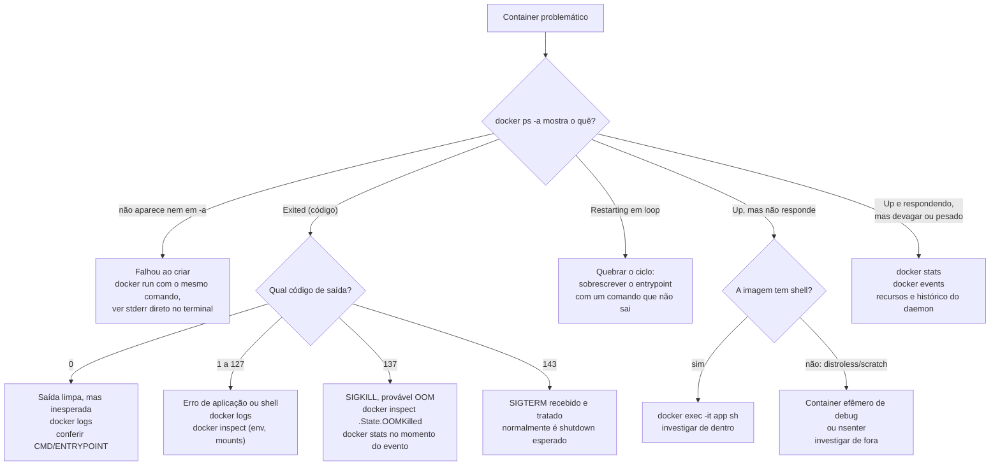

# Debugar um container

> [!abstract] TL;DR
> Debugar um container começa com uma pergunta binária — ele está de pé? — e cada resposta possível abre um caminho de ferramentas diferente: `docker logs` e `docker inspect` para o que já aconteceu, `docker exec` e `docker stats` para o que está acontecendo agora. O problema fica sério quando a imagem que a nota 09 vendeu como mínima — distroless, `scratch`, sem shell — nega justamente a ferramenta mais óbvia: não há `sh` para entrar. A saída não é voltar a empacotar um shell em produção; é subir um container efêmero cheio de ferramentas e anexá-lo aos namespaces do container problemático, ou usar `nsenter` a partir do host. Debug de container mínimo troca conveniência por precisão: você aprende a olhar de fora para dentro.

Duas da manhã, um alerta de indisponibilidade, e o comando reflexo de qualquer pessoa que já mexeu com container é `docker exec -it app sh`. Ele falha. `OCI runtime exec failed: exec failed: unable to start container process: exec: "sh": executable file not found in $PATH`. A imagem em produção é a `gcr.io/distroless/java17` que alguém escolheu com cuidado seis meses atrás, seguindo exatamente o conselho da nota 09: menos superfície de ataque, menos CVE, menos peso na esteira de deploy. A escolha foi certa. Só que agora ela cobra o preço que a nota 09 avisou e não pagou na hora: sem shell, o reflexo de debug não funciona, e é preciso um método — não um comando de sorte — para descobrir o que está acontecendo dentro de um processo que você não consegue tocar diretamente.

Esta nota é sobre esse método. A primeira metade cobre o ferramental que funciona sempre, presumindo que existe (ou existiu) shell. A segunda metade é o pagamento da dívida da nota 09: o que fazer quando não existe shell nenhum.

## O método: uma árvore de decisão, não uma lista de comandos

A tentação em qualquer situação de debug é abrir um manual e testar comandos em ordem alfabética. Isso desperdiça tempo, porque cada estado do container aponta para uma ferramenta diferente, e usar a ferramenta errada no estado errado só produz ruído. A pergunta inicial é sempre a mesma, e ela é a máquina de estados que a [[03-Dominios/Tecnologia/Infraestrutura/Docker/03 - O ciclo de vida de um container|nota 03]] já descreveu: o container está `running`, `exited`, reiniciando em loop, ou nunca chegou a existir de fato?



Repare que a árvore inteira gira em torno de uma distinção que vale a pena nomear: existem ferramentas que olham para **o passado** de um container — o que ele fez, o que ele recebeu, por que ele morreu — e ferramentas que olham para **o presente** de um container vivo. `docker logs` e `docker inspect` são arquivo morto; `docker exec` e `docker stats` exigem pulso. Confundir os dois é a causa mais comum de perda de tempo: tentar `exec` num container que já morreu é sempre erro, e ler só o `logs` de um container que está travado (mas vivo) não conta a história do momento presente.

Essa distinção também explica por que a ordem da árvore não é arbitrária. Ferramentas de arquivo morto (`logs`, `inspect`, `events`) custam pouco e não arriscam nada — só leem dados que o daemon já guardou, sem interagir com o processo do container. Ferramentas que exigem pulso (`exec`, `stats`, e mais adiante o container efêmero de debug e `nsenter`) custam mais esforço de configuração e, no caso de `exec`, chegam a interagir diretamente com o processo em produção. A disciplina correta é sempre esgotar o arquivo morto primeiro — ele é barato, não perturba nada, e frequentemente já responde à pergunta — antes de escalar para uma ferramenta que exige o container vivo e cooperando.

## docker logs: o contrato de log em prática

A [[03-Dominios/Tecnologia/Infraestrutura/Docker/03 - O ciclo de vida de um container|nota 03]] estabeleceu que stdout e stderr são o contrato de log de um container: qualquer coisa que o processo PID 1 escreve nesses dois descritores é capturada pelo daemon através do log driver configurado, e `docker logs` é a janela para ler essa captura. Isso significa que `docker logs` não é mágica nem introspecção — é literalmente um cat do que já foi escrito, formatado pelo driver (`json-file` por padrão, mas pode ser `journald`, `syslog`, ou um driver que envia para um agregador central).

```bash
# ver tudo desde o início
docker logs app

# seguir em tempo real, como tail -f
docker logs -f app

# com timestamp de cada linha — essencial para correlacionar
# com métricas externas ou com o horário do alerta
docker logs --timestamps app

# só as últimas 100 linhas
docker logs --tail 100 app

# só o que aconteceu depois de um horário
docker logs --since 2026-08-02T10:00:00 app

# uma janela específica
docker logs --since 10m --until 5m app
```

`--timestamps` (ou `-t`) é o flag que separa debug amador de debug sério: sem ele, cada linha do log não carrega hora, e correlacionar "o pico de latência foi às 10:03" com uma linha de log específica vira adivinhação. Com ele, cada linha ganha um prefixo RFC3339Nano, e dá para grepar o intervalo exato.

`--since` e `--until` aceitam tanto timestamps absolutos quanto durações relativas (`10m`, `2h`), e são a diferença entre rolar 40 mil linhas de log procurando um evento e pedir exatamente a janela onde ele aconteceu. Em produção, com log driver `json-file` sem rotação configurada, um container de vida longa pode acumular gigabytes; `--since`/`--until` evitam que `docker logs` trave a tentar carregar tudo.

Vale checar qual log driver está de fato configurado antes de assumir que `docker logs` sempre tem o que mostrar — o driver é definido no daemon (`/etc/docker/daemon.json`, chave `log-driver`) ou por container (`--log-driver` no `run`), e só os drivers `json-file`, `local` e `journald` deixam `docker logs` funcionar normalmente lendo do próprio host; drivers como `awslogs`, `gcplogs`, `splunk` ou `syslog` remoto enviam o output direto para o serviço externo, e `docker logs` contra um container configurado com um desses costuma retornar vazio ou um erro explícito de que o driver não suporta leitura local.

```bash
# checar qual driver está ativo para um container específico
docker inspect --format '{{.HostConfig.LogConfig.Type}}' app
```

Quando o log está vazio, isso também é informação, não um beco sem saída. Três hipóteses cobrem a maioria dos casos: (1) a aplicação usa um framework de logging que escreve em arquivo em vez de stdout/stderr, quebrando o contrato que a nota 03 exige — a correção é reconfigurar o logger da aplicação, não o Docker; (2) o processo ainda não produziu output porque está em algum estágio de inicialização lento (health check de dependência, JIT warmup); (3) o log driver configurado não é `json-file`/`journald` local e os logs foram para um destino externo — nesse caso `docker logs` simplesmente não tem o que mostrar, e é preciso ir direto ao agregador (Loki, CloudWatch, Elasticsearch).

> [!info] Caducidade
> Os exemplos de `docker logs` aqui assumem CLI do Docker Engine na faixa 25.x-27.x (2025-2026). Flags como `--since`/`--until`/`--timestamps` são estáveis há muitas versões, mas vale checar `docker logs --help` na versão instalada antes de depender de um flag mais novo.

> [!tip] Vídeo — os dois primeiros degraus da árvore de decisão
> [**Debugging Docker Containers with `docker exec` and `docker logs`**](https://www.youtube.com/watch?v=tLK9nNFHWH8) (TechWorld with Nana, ~10 min, EN) cobre bem os dois comandos que abrem o método desta nota, na ordem certa: primeiro `docker logs`, quando o container está de pé mas a aplicação não se comporta; depois `docker exec -it`, para obter um terminal **dentro** do container e olhar o sistema de arquivos com os próprios olhos — conferir se o arquivo de configuração chegou, em qual diretório o processo está, o que existe de fato ali. Uma precisão de vocabulário que ela faz e que evita confusão real: `docker start` opera sobre **container**, não sobre imagem, e por isso não aceita as opções de `docker run` como `-p` ou `-d`, que pertencem ao momento da criação. **O que ele não cobre:** `docker inspect` como fonte da verdade sobre o que o container recebeu, `docker events` para reconstruir a linha do tempo do daemon, `docker stats`, e o caso mais difícil — depurar um container que **não fica de pé** o suficiente para receber um `exec`.

## docker inspect: a fonte da verdade sobre o que o container recebeu

`docker logs` mostra o que o processo disse. `docker inspect` mostra o que o container **é** — a configuração completa que o daemon efetivamente aplicou, não a que foi pedida. É comum descobrir, ao inspecionar, que uma variável de ambiente esperada não chegou, que um volume foi montado no caminho errado, ou que a política de restart não é a que alguém assumia.

```bash
# saída JSON completa
docker inspect app

# filtrando com Go template — variáveis de ambiente
docker inspect --format '{{json .Config.Env}}' app

# montagens (bind mounts e volumes)
docker inspect --format '{{json .Mounts}}' app

# rede: qual bridge, qual IP, quais portas publicadas
docker inspect --format '{{json .NetworkSettings.Networks}}' app

# política de restart configurada
docker inspect --format '{{.HostConfig.RestartPolicy}}' app

# o pedaço mais importante em post-mortem: por que ele morreu
docker inspect --format '{{json .State}}' app
```

A saída de `.State` é o resumo forense do encerramento do container, e vale a pena decorar a leitura de três campos:

- **`ExitCode`**: retoma diretamente a discussão de código de saída da [[03-Dominios/Tecnologia/Infraestrutura/Docker/03 - O ciclo de vida de um container|nota 03]]. `0` é saída limpa (mas se o container não devia ter saído, "limpa" é só a metade boa da notícia). Códigos entre `1` e `127` normalmente vêm do próprio processo da aplicação sinalizando um erro específico. `137` é `128 + 9` — SIGKILL — e na prática, na imensa maioria dos casos em ambiente containerizado, é o OOM killer do kernel derrubando o processo por estourar o cgroup de memória. `143` é `128 + 15` — SIGTERM — o processo recebeu o sinal de parada gentil e saiu adequadamente, o que costuma ser o fim de vida esperado num `docker stop` ou num rolling update.
- **`OOMKilled`**: booleano que confirma ou descarta a hipótese de out-of-memory sem depender de adivinhar pelo exit code. Quando `true`, o próximo passo é `docker stats` no período anterior ao evento (se houver métricas retidas) ou revisão do limite de memória configurado no `run`/compose.
- **`Error`**: quando o container falhou antes mesmo de o processo rodar (imagem corrompida, comando inexistente), este campo costuma ter a mensagem que `docker logs` não teve chance de capturar, porque o processo nunca chegou a escrever nada.

Inspecionar rede é o ponto de conexão direto com a [[03-Dominios/Tecnologia/Infraestrutura/Docker/07 - Rede no Docker|nota 07]]: `docker network inspect <rede>` mostra a topologia da rede inteira — todos os containers conectados, seus IPs, o subnet — enquanto `docker inspect <container>` sob `.NetworkSettings` mostra a visão de dentro de um único container. Um sintoma clássico de erro de rede é dois containers na mesma rede nomeada mas com nomes DNS que não resolvem entre si; comparar as duas inspeções (rede e container) normalmente revela se o container está mesmo anexado à rede que alguém acha que ele está.

## Health check como sinal antecipado

Antes de chegar em `docker exec`, vale mencionar um sinal que costuma aparecer antes de qualquer um dos outros: se a imagem define um `HEALTHCHECK`, o campo `.State.Health.Status` do `docker inspect` (`starting`, `healthy`, `unhealthy`) e o histórico de execuções em `.State.Health.Log` frequentemente denunciam o problema antes mesmo de olhar logs de aplicação ou métricas de recurso.

```bash
docker inspect --format '{{json .State.Health}}' app | jq .
```

Um container marcado `unhealthy` por várias checagens seguidas, mas ainda `Up`, é o caso mais comum do ramo "Up, mas não responde" da árvore de decisão: o processo não morreu, então nem `logs` (silêncio) nem `inspect .State.ExitCode` (não existe, o container não saiu) têm muito a dizer, mas o histórico de health check já registrou, com timestamp, exatamente quando a aplicação parou de responder à sua própria checagem interna — geralmente antes de qualquer alerta externo disparar.

## docker exec: entrar num container vivo

`docker exec` roda um novo processo dentro do namespace de um container que já existe e está em execução — ele não cria um container novo, apenas anexa um processo adicional aos mesmos namespaces (PID, rede, mount, etc.) do container-alvo.

```bash
# shell interativo, se a imagem tiver um shell
docker exec -it app sh
docker exec -it app bash

# rodar um comando pontual sem shell interativo
docker exec app ps aux
docker exec app cat /etc/resolv.conf

# como outro usuário (útil junto com a nota 13, containers non-root)
docker exec -u root -it app sh
```

A limitação estrutural de `docker exec` é exatamente a razão pela qual ele não serve como ferramenta universal: ele precisa de um processo vivo para anexar. Um container que já saiu (`Exited`) não tem namespace ativo para receber um `exec` — o erro é sempre algo como `Error response from daemon: Container ... is not running`. Para esse caso, a ferramenta certa é `docker logs` (para saber o que aconteceu) e `docker cp` (coberto adiante, para recuperar arquivos de dentro do sistema de arquivos parado).

Também vale lembrar que `docker exec` não precisa ser interativo: rodar um comando pontual sem `-it` é a forma mais barata de checar um fato específico sem abrir uma sessão de shell inteira, e é o que scripts de automação e health checks externos costumam fazer — por exemplo, checar se um arquivo de lock existe, ou se uma porta está de fato escutando, sem o overhead de alocar um pseudo-terminal.

Isso importa em produção porque um `exec -it` deixado aberto por engano numa sessão SSH interrompida pode ficar pendurado indefinidamente, consumindo um descritor de processo dentro do container; comandos pontuais sem terminal alocado evitam esse tipo de vazamento operacional silencioso.

A segunda limitação, mais sutil, é a que amarra esta nota à [[03-Dominios/Tecnologia/Infraestrutura/Docker/13 - Segurança da imagem e do runtime|nota 13]]: um container rodando como usuário non-root, com filesystem raiz somente leitura e capabilities dropadas, restringe severamente o que um `exec` consegue fazer mesmo quando o `exec` em si funciona. Um shell entrando num container assim não consegue instalar um pacote de diagnóstico (`apt-get`/`apk` falham por falta de permissão de escrita ou de rede de saída), não consegue escrever um arquivo temporário fora dos volumes explicitamente montados, e não consegue usar ferramentas que exigem capabilities como `NET_ADMIN` (`tcpdump` dentro do próprio container, por exemplo). Essas restrições são deliberadas — é exatamente o que a nota 13 pediu para reduzir a superfície de ataque — e o custo em fricção de debug é aceito conscientemente, não um bug do setup.

## docker events: o que o daemon fez

`docker logs` mostra o que a aplicação disse; `docker events` mostra o que o **daemon** fez com os containers ao longo do tempo — start, stop, die, oom, health_status, kill — um stream de eventos do próprio motor do Docker, não do processo dentro do container.

```bash
# stream ao vivo de tudo que o daemon faz
docker events

# filtrando por container específico
docker events --filter container=app

# filtrando por tipo de evento
docker events --filter event=die --filter event=oom

# uma janela de tempo específica, sem stream ao vivo
docker events --since 1h --until 5m
```

Assim como `docker logs`, `docker events` depende de o daemon ainda ter o evento retido; não existe retenção infinita configurável por padrão, então investigações que só começam dias depois do incidente costumam já ter perdido a janela de eventos relevante — mais um motivo para capturar essa saída cedo, assim que o incidente é percebido, em vez de deixar para depois.

`docker events` é particularmente valioso para reconstruir uma sequência que já aconteceu e não deixou rastro em `docker ps -a` — por exemplo, confirmar quantas vezes um container reiniciou numa janela de uma hora, ou verificar se um `health_status: unhealthy` disparou antes do `die`, o que aponta para um health check malformado como causa raiz em vez da aplicação em si.

## docker stats: consumo em tempo real

Onde `docker inspect` e `docker events` olham para trás, `docker stats` é o único da lista que olha estritamente para o presente vivo — CPU, memória, I/O de rede e disco, atualizados a cada segundo.

```bash
# todos os containers, atualização contínua
docker stats

# um container específico
docker stats app

# uma leitura só, sem stream (útil em script)
docker stats --no-stream app
```

A leitura mais acionável de `docker stats` é a coluna de memória comparada ao limite configurado: se `MEM USAGE / LIMIT` mostra o container perto do teto, é o sinal de alerta antes do OOM killer agir — dá para agir preventivamente (aumentar limite, encontrar vazamento) em vez de só confirmar depois via `OOMKilled: true` no `inspect`.

Vale entender o que cada coluna da saída padrão realmente mede, porque nem toda métrica é óbvia:

| Coluna | O que mede |
|---|---|
| `CPU %` | Percentual de CPU em uso, relativo a um único core; um container com múltiplas threads pode passar de 100% |
| `MEM USAGE / LIMIT` | Memória residente em uso contra o limite do cgroup configurado (ou o total do host, se não houver limite) |
| `MEM %` | O mesmo em percentual, sempre relativo ao limite mostrado ao lado |
| `NET I/O` | Bytes recebidos/enviados pela interface de rede do container desde que ele iniciou |
| `BLOCK I/O` | Bytes lidos/escritos em disco pelo container desde que iniciou |
| `PIDS` | Número de processos e threads no cgroup — um crescimento descontrolado aqui costuma indicar um fork bomb ou vazamento de threads/processos zumbis |

A coluna `PIDS` costuma passar despercebida, mas é a primeira a denunciar um vazamento de processo antes mesmo de a memória ficar crítica: um número crescendo sem parar, mesmo com CPU e memória estáveis, é sinal de processos filhos que não estão sendo colhidos (`wait()`), um sintoma que se conecta diretamente à discussão de PID 1 e reaping de zumbis da [[03-Dominios/Tecnologia/Infraestrutura/Docker/08 - ENTRYPOINT, CMD e o container que não morre direito|nota 08]].

## docker events com mais detalhe: reconstruindo a linha do tempo

Vale detalhar um pouco mais o vocabulário de eventos, porque a diferença entre eles é justamente o que permite reconstruir uma sequência de causa e efeito em vez de só um instantâneo. Os eventos mais úteis num debug de container, na ordem em que normalmente aparecem numa falha:

| Evento | O que significa |
|---|---|
| `create` | O container foi criado a partir da imagem, mas ainda não iniciado |
| `start` | O processo principal (PID 1) começou a rodar |
| `health_status: healthy` / `unhealthy` | Resultado de uma execução do `HEALTHCHECK` definido na imagem |
| `oom` | O kernel invocou o OOM killer dentro do cgroup do container |
| `die` | O processo principal saiu; o evento carrega o código de saída |
| `kill` | Um sinal foi enviado ao processo, geralmente por `docker stop`/`docker kill` |
| `destroy` | O container foi removido (`docker rm`) |

Uma sequência `health_status: unhealthy` repetida, seguida de `kill` e depois `die` com código `137`, conta uma história completa sem precisar de mais nenhuma outra ferramenta: a aplicação parou de responder ao health check, algo (provavelmente uma orquestração como Swarm ou Kubernetes, ou um supervisor externo) decidiu matá-la, e o kernel confirma que foi um SIGKILL. Sem `docker events`, essa sequência fica invisível — `docker ps -a` só mostra o estado final, não o caminho até ele.

## Container em restart loop: como quebrar o ciclo para olhar

Um container com política `restart: always` ou `on-failure` que falha na inicialização entra num ciclo onde o Docker o recria repetidamente, e cada instância pode viver por menos de um segundo — tempo insuficiente até para um `docker exec` ser executado a tempo, porque quando o comando chega o container já morreu de novo. A técnica padrão é interromper deliberadamente o comportamento de entrada, para congelar o container vivo o suficiente para investigar.

```bash
# sobrescrevendo o entrypoint com algo que não sai sozinho
docker run --rm -it --entrypoint sh myimage -c "sleep infinity"

# ou, sem trocar a imagem, criando o container parado
# e depois iniciando manualmente com override
docker create --entrypoint sh myimage -c "sleep infinity"
docker start <id>
docker exec -it <id> sh
```

Isso conecta direto com a discussão de forma exec vs. shell e sinais da [[03-Dominios/Tecnologia/Infraestrutura/Docker/08 - ENTRYPOINT, CMD e o container que não morre direito|nota 08]]: sobrescrever o comando de entrada por algo inofensivo (`sleep infinity`, ou `tail -f /dev/null`) é usar deliberadamente o mecanismo de ENTRYPOINT/CMD contra si mesmo, para impedir que PID 1 saia — o container fica de pé indefinidamente, e só então dá para `exec` com calma, olhar arquivos de configuração, testar variáveis de ambiente manualmente, rodar o comando original passo a passo. Depois de identificado o problema, o entrypoint original volta e o ciclo de restart, presumivelmente, para de se repetir.

É importante notar que essa técnica exige uma imagem que tenha, ao menos, o binário `sleep` ou `tail` disponível no `$PATH`, ou um `--entrypoint` que aponte para um shell que os invoque — o que já é impossível numa imagem `scratch` sem absolutamente nenhum utilitário. Nesse caso extremo, quebrar o loop de restart exige um recurso diferente: `docker update --restart=no <id>` muda a política de restart de um container já criado sem precisar recriá-lo, e paralisa o ciclo mesmo que o processo continue morrendo — o container simplesmente para de reiniciar sozinho, deixando `docker logs`/`docker inspect` do último exemplar disponíveis para leitura calma, sem disputa contra o daemon recriando o container por baixo.

## Quando não há shell: o preço da imagem mínima

Tudo até aqui presume, implícita ou explicitamente, que existe um shell dentro da imagem — `docker exec app sh` é a ponta comum de metade das técnicas acima. A [[03-Dominios/Tecnologia/Infraestrutura/Docker/09 - Multi-stage e imagens mínimas|nota 09]] defendeu, com razão, empacotar o mínimo possível: uma imagem `distroless` ou `FROM scratch` não tem shell, não tem gerenciador de pacotes, não tem `ls`, `cat`, `ps` — só o binário da aplicação e as bibliotecas de que ele estritamente depende. A superfície de ataque cai, o tamanho da imagem cai, o número de CVEs reportados cai. E o preço, que a nota 09 nomeou mas não pagou, é este: quando `docker exec app sh` roda contra essa imagem, o daemon tenta executar `sh` dentro do namespace do container, procura o binário no `$PATH` configurado, e simplesmente não o encontra — porque ele nunca foi copiado para lá. Não é uma questão de permissão ou de configuração errada; o arquivo não existe fisicamente na imagem.

A resposta certa não é desfazer a escolha da nota 09 e voltar a empacotar `bash` e um `apt-get install` inteiro em produção só para ter um martelo de debug sempre à mão — isso reintroduziria exatamente o custo de superfície de ataque que a imagem mínima existia para eliminar. A resposta é ter uma técnica que investiga o container **de fora**, sem tocar na imagem de produção.

### Container efêmero de debug: emprestando os namespaces do alvo

A técnica central é o `docker debug` (ou, em versões mais antigas do Docker/tooling equivalente, o padrão manual com `--pid=container:` e `--network=container:`): subir um segundo container, de uma imagem cheia de ferramentas (`busybox`, `alpine`, ou uma imagem de debug dedicada como `nicolaka/netshoot`), e fazer esse segundo container compartilhar os namespaces de PID e de rede do container-alvo.

```bash
# forma manual, portável, funciona em qualquer versão recente do Docker Engine
docker run -it --rm \
  --pid=container:app \
  --network=container:app \
  --cap-add SYS_PTRACE \
  nicolaka/netshoot sh

# alternativa mais nova, integrada ao CLI (Docker Desktop / Engine recentes)
docker debug app
```

O mecanismo é o que faz a técnica funcionar, e vale entender por quê: um container não é uma máquina virtual, é um conjunto de processos do host isolados por namespaces do kernel Linux. `--pid=container:app` diz ao novo container para **não** criar seu próprio namespace de PID, e sim entrar no mesmo namespace de PID que o container `app` já está usando — o que significa que, de dentro do container de debug, um `ps aux` enxerga o processo da aplicação-alvo como um PID comum, visível e inspecionável, porque tecnicamente os dois containers agora compartilham a mesma árvore de processos do kernel. `--network=container:app` faz o equivalente para o namespace de rede: o container de debug passa a enxergar exatamente a mesma interface de rede, o mesmo IP, as mesmas portas que o container `app` vê — então um `curl localhost:8080` de dentro do container de debug testa a aplicação exatamente como ela se vê a si mesma, sem depender de a rede externa (a [[03-Dominios/Tecnologia/Infraestrutura/Docker/07 - Rede no Docker|nota 07]]) estar cooperando. Nada disso modifica a imagem `app`; o binário distroless continua intocado, o container de debug é descartável (`--rm`), e a imagem de produção nunca precisou ganhar um shell.

`--cap-add SYS_PTRACE` costuma ser necessário para ferramentas que anexam a processos (`strace`, alguns profilers), porque a capability de ptrace normalmente é uma das primeiras a serem dropadas — de novo, o eco direto da [[03-Dominios/Tecnologia/Infraestrutura/Docker/13 - Segurança da imagem e do runtime|nota 13]]: um container de produção bem configurado, non-root e com capabilities mínimas, torna até esse tipo de técnica de fora um pouco mais trabalhosa, porque o container de debug herda algumas dessas restrições via namespace compartilhado. É atrito real, e é atrito aceito de propósito.

### nsenter e /proc/<pid>/root: acesso direto pelo host

Quando o próprio host é acessível (uma VM de nó de cluster, não um ambiente totalmente gerenciado), existe uma via ainda mais direta, sem precisar subir container nenhum: `nsenter`, um utilitário do `util-linux` que entra diretamente nos namespaces de um processo já rodando no host.

```bash
# descobrir o PID do processo principal do container, do lado de fora
docker inspect --format '{{.State.Pid}}' app
# suponha que retornou 48213

# entrar nos namespaces desse PID a partir do host
sudo nsenter -t 48213 -n -p -- sh
# -n: namespace de rede | -p: namespace de PID
```

Isso é conceitualmente o mesmo truque do container efêmero — anexar-se aos namespaces do alvo — só que sem sequer precisar de outro container: o `nsenter` usa o próprio shell do host (que tem `sh`, porque é o host, não a imagem distroless) e o injeta nos namespaces do processo containerizado.

O `nsenter` aceita flags para cada tipo de namespace, e vale conhecer as mais úteis para debug além de `-n` (rede) e `-p` (PID) já usadas acima: `-m` entra também no namespace de mount, o que faz o shell resultante enxergar o filesystem do container como raiz — equivalente a um `chroot` para dentro da imagem, útil quando o objetivo é navegar arquivos de configuração ou binários da aplicação como se estivesse "dentro" da imagem, sem precisar copiar nada para fora com `docker cp`. `-u` entra no namespace de usuário, relevante quando o container roda com remapeamento de UID (user namespaces), outra camada de isolamento que a [[03-Dominios/Tecnologia/Infraestrutura/Docker/13 - Segurança da imagem e do runtime|nota 13]] pode ter habilitado. Combinar todos numa única chamada dá acesso quase completo ao ambiente interno do container, sem que o container em si precise de shell algum:

```bash
sudo nsenter -t 48213 -n -p -m -- sh
```

Uma segunda via, ainda mais simples e que não exige privilégio de `nsenter`, é acessar o filesystem do container através do `/proc` do host: todo processo Linux expõe seu próprio filesystem-raiz-como-o-processo-o-vê em `/proc/<pid>/root/`. Para um container rodando com runtime clássico (não gVisor/Kata, que isolam mais), isso significa que o conteúdo da imagem do container é literalmente navegável a partir do host:

```bash
ls /proc/48213/root/app/
cat /proc/48213/root/etc/config.yaml
```

Isso funciona mesmo para uma imagem `scratch` sem absolutamente nenhum binário, porque quem está lendo o arquivo é o shell do host, não um processo dentro do container — o namespace de mount do container só determina o que o processo containerizado enxerga como sua própria raiz, e o host sempre enxerga por cima dessa fronteira.

### docker cp: copiar arquivos para dentro e para fora, mesmo parado

`docker cp` copia arquivos entre o host e o filesystem de um container, e — diferente de `exec` — funciona com o container tanto rodando quanto **parado**, porque ele opera diretamente sobre a camada de escrita do container (a mesma discutida na [[03-Dominios/Tecnologia/Infraestrutura/Docker/03 - O ciclo de vida de um container|nota 03]] e na nota 02 do galho), sem precisar executar nenhum processo dentro dele.

```bash
# copiar um arquivo de dentro do container para o host, mesmo parado
docker cp app:/var/log/app.log ./app.log

# copiar um binário de diagnóstico para dentro do container
docker cp ./strace-static app:/tmp/strace

# copiar um diretório inteiro
docker cp app:/etc/myapp ./myapp-config
```

Isso resolve um caso específico e frequente: um container distroless morreu, `docker exec` não serve mais (container parado) e nem serviria de qualquer forma (sem shell), mas o log da aplicação foi escrito em arquivo por engano em vez de ir para stdout — quebrando o contrato da nota 03. `docker cp` recupera esse arquivo do cadáver do container sem precisar de shell nenhum, rodando ou parado.

Um detalhe que costuma passar despercebido: `docker cp` opera sobre a árvore de arquivos completa do container, não só sobre o que está em volumes montados. Isso inclui a própria camada de escrita efêmera descrita na nota 02 — arquivos que a aplicação criou em runtime e que desaparecerão para sempre quando o container for removido (`docker rm`). Num post-mortem de um container que já falhou mas ainda não foi removido, `docker cp` é frequentemente a única chance de recuperar esse estado antes que ele se perca — depois de `docker rm`, a camada de escrita e tudo que só existia nela são apagados sem volta.

### O trade-off, dito sem meias palavras

A imagem mínima da nota 09 é a escolha certa para produção, e ela cobra exatamente este preço em debugabilidade. A resposta correta não é reverter a escolha — não é voltar a empacotar `bash`, `curl`, `ps` e um gerenciador de pacotes inteiro numa imagem de produção só para ter conveniência de debug disponível o tempo todo, porque isso devolve a superfície de ataque que a imagem mínima existia para eliminar. A resposta correta é ter a técnica de olhar de fora: container efêmero com namespaces compartilhados, ou `nsenter`/`/proc/<pid>/root` a partir do host, e `docker cp` para o que só precisa ser lido ou escrito, sem execução nenhuma.

As restrições da [[03-Dominios/Tecnologia/Infraestrutura/Docker/13 - Segurança da imagem e do runtime|nota 13]] — non-root, filesystem raiz somente leitura, capabilities dropadas — somam-se a esse mesmo custo, tornando até o container de debug efêmero um pouco mais trabalhoso de operar (algumas capabilities precisam ser reativadas explicitamente no container de debug, nunca no de produção). É um custo aceito conscientemente, o mesmo espírito de toda a segunda metade do galho: cada restrição que reduz a superfície de ataque também reduz a conveniência operacional, e a engenharia sênior está em saber pagar esse preço com técnica, não em evitá-lo enfraquecendo a produção.

Vale nomear, sem rodeio, o que essa troca realmente significa em termos de tempo e habilidade. Debugar uma imagem cheia (com shell, com pacotes de diagnóstico pré-instalados) é mais rápido na primeira tentativa, mas mais caro estruturalmente: mais CVEs para acompanhar, mais superfície para um atacante que já conseguiu execução de código dentro do container, imagens maiores para transportar e escanear. Debugar uma imagem mínima exige aprender e manter uma técnica adicional — os namespaces compartilhados, o `nsenter`, os comandos de container efêmero — mas paga isso de volta em produção mais segura o tempo inteiro, não só nos raros momentos de incidente. É a mesma lógica de qualquer investimento em disciplina de engenharia: o custo é pago antecipadamente, uma vez, por quem aprende a técnica; o benefício é colhido continuamente, por toda a vida útil da imagem em produção.

## Exemplo trabalhado: seguindo a árvore até o fim

Volte à cena de abertura: alerta de indisponibilidade, `docker exec -it app sh` falhando com "executable file not found". Em vez de tentar comandos ao acaso, siga a árvore de decisão da seção anterior, passo a passo, como ela seria seguida de fato num incidente.

Primeiro passo, sempre: `docker ps -a | grep app`. A saída mostra `Up 42 minutes`, então o container está vivo — não é um caso de `Exited`, e a coluna de código de saída nem se aplica ainda. Isso já descarta metade da árvore: nada de investigar `OOMKilled` ou restart loop por enquanto, o caminho é o ramo "Up, mas não responde".

Segundo passo: já que a imagem é distroless (confirmado de cabeça, é o motivo do `exec sh` ter falhado), o ramo correto não é `docker exec` direto — é `docker logs` primeiro, porque ele não depende de shell nenhum.

```bash
docker logs --timestamps --since 1h app
```

A saída mostra linhas normais de request/response até um certo timestamp, e depois silêncio total — sem erro, sem stack trace, só parou de logar. Isso é o padrão clássico de um processo travado (deadlock, thread pool esgotado, conexão pendurada) em vez de um processo que morreu: se tivesse morrido, o container não apareceria como `Up`.

Terceiro passo: `docker inspect` para checar o que o container recebeu de configuração, à procura de algo que mudou recentemente.

```bash
docker inspect --format '{{json .Config.Env}}' app | jq .
docker inspect --format '{{json .HostConfig.RestartPolicy}}' app
```

Nada incomum aparece nas variáveis de ambiente. A política de restart é `on-failure`, o que explica por que o container não está reiniciando — ele não falhou, só travou, e do ponto de vista do daemon um processo travado que não saiu ainda está tecnicamente saudável.

Quarto passo, e aqui é onde a ausência de shell de fato entra em cena: para inspecionar o processo Java por dentro — thread dump, conexões abertas, uso de heap — seria natural entrar com `exec` e rodar `jstack` ou similar. Como não há shell, o caminho é o container efêmero de debug, anexado aos namespaces do alvo.

```bash
PID=$(docker inspect --format '{{.State.Pid}}' app)
sudo nsenter -t $PID -n -p -- sh
```

De dentro desse shell emprestado do host, mas operando no namespace de PID do container, `ps aux` mostra o processo Java como um PID comum, e dá para seguir com `cat /proc/<pid-do-java>/status` para conferir o estado da thread principal, ou copiar um `jstack`/agente de profiling estático para dentro via `docker cp` e rodá-lo com `nsenter` de novo, desta vez usando o namespace de mount para alcançar o binário do JDK dentro da imagem sem precisar de um shell dentro dela.

O diagnóstico final, nesse exemplo, poderia ser um pool de conexões com o banco esgotado por uma query lenta — descoberto pelo thread dump, não pelo log, porque o log parou de ser escrito exatamente quando as threads pararam de progredir. O ponto do exemplo não é o diagnóstico específico, e sim a disciplina: cada ferramenta entrou exatamente quando a anterior esgotou o que podia responder, sem pular etapas e sem tentar `exec` contra uma imagem que já havia avisado, na primeira tentativa, que não tinha shell.

## Ferramental complementar: olhando o cluster inteiro, não só um container

Todo o ferramental acima opera um container de cada vez, via linha de comando. Em ambientes com dezenas de containers rodando ao mesmo tempo — um `docker-compose` de desenvolvimento com múltiplos serviços, ou um host com vários times publicando containers — alternar entre `docker ps`, `docker logs -f` de cada um e `docker stats` fica rapidamente cansativo de operar manualmente. O [[03-Dominios/Tecnologia/Terminal/TUIs/02 - Lazydocker — overview e operações comuns|Lazydocker]] existe exatamente para esse ponto intermediário: uma TUI que lista todos os containers, deixa navegar entre logs, stats e detalhes de inspeção com poucas teclas, sem substituir o entendimento dos comandos individuais — só reduz o atrito operacional de fazer, na prática, a mesma árvore de decisão desta nota, repetidamente, contra um conjunto grande de containers.

Vale a ressalva: Lazydocker é uma camada de conveniência sobre o mesmo `docker logs`/`docker inspect`/`docker stats` que esta nota descreve. Ele não resolve o problema da imagem sem shell — se um container ali dentro é distroless, o mesmo caminho de container efêmero ou `nsenter` continua sendo necessário. O que ele economiza é o tempo de digitar `docker logs -f <nome-longo-do-container>` repetidamente enquanto se navega entre serviços.

## A conexão com debugging de produção como disciplina

Tudo nesta nota descreve o ferramental *dentro* da fronteira do Docker: comandos que operam sobre um container isolado, um host, um daemon. Isso é necessário, mas é só metade da disciplina de responder a um incidente real. A prática mais ampla de investigar sistemas em produção — formular hipóteses, decidir o que instrumentar antes de o problema acontecer de novo, e a postura mais agressiva de chaos engineering, que injeta falha deliberadamente para testar a resiliência antes que ela seja testada por um incidente real — é tratada, num nível acima do Docker especificamente, na nota [[03-Dominios/Engenharia/Operação/4 - Observar e responder/06 - Debugging de produção e chaos engineering|Debugging de produção e chaos engineering]]. Esta nota dá o ferramental do container; aquela dá o método de investigação que se aplica a qualquer sistema distribuído, containerizado ou não.

## Tabela de referência rápida

Uma síntese de todo o ferramental coberto nesta nota, organizada pela pergunta que cada ferramenta responde — útil como checklist rápida no meio de um incidente, quando reconstruir a árvore de decisão de cabeça consome tempo que não sobra.

| Ferramenta | Pergunta que responde | Exige container vivo? | Exige shell na imagem? |
|---|---|---|---|
| `docker ps -a` | O container existe? Em que estado? | Não | Não |
| `docker logs` | O que a aplicação escreveu em stdout/stderr? | Não | Não |
| `docker inspect` | Qual configuração o container recebeu de fato? Por que ele saiu? | Não | Não |
| `docker events` | O que o daemon fez, em que ordem, ao longo do tempo? | Não | Não |
| `docker stats` | Quanto CPU/memória/rede/disco o container consome agora? | Sim | Não |
| `docker exec` | O que está acontecendo dentro do processo, agora? | Sim | Sim |
| `docker cp` | Copiar um arquivo específico para dentro ou para fora | Não | Não |
| Container efêmero + namespaces compartilhados | Investigar processo/rede de um container sem shell | Sim | Não |
| `nsenter` a partir do host | Mesmo objetivo, sem subir um segundo container | Sim | Não |
| `/proc/<pid>/root/` | Navegar o filesystem de um container vivo, a partir do host | Sim | Não |

A coluna mais reveladora é a última: só `docker exec` exige shell dentro da própria imagem. Todas as outras nove ferramentas funcionam contra uma imagem completamente vazia de utilitários — o que confirma, na prática, que a ausência de shell numa imagem distroless não é o fim das opções de debug, é a perda de exatamente uma ferramenta entre dez, ainda que seja a mais familiar.

## Armadilhas comuns

> [!warning] Rodar `docker exec` num container que já morreu
> `docker exec` exige um namespace ativo. Se o container aparece como `Exited` em `docker ps -a`, todo `exec` falha com "Container is not running", não importa o quão simples seja o comando. A ferramenta certa nesse estado é `docker logs` para entender o que aconteceu e `docker cp` para recuperar arquivos — nunca `exec`.

> [!warning] Interpretar exit code 137 como bug de aplicação
> `137` é `128 + SIGKILL`, e na esmagadora maioria dos casos em container significa que o kernel matou o processo por estouro de memória (OOM killer), não que a aplicação tenha um bug de lógica. Confirme sempre com `docker inspect --format '{{.State.OOMKilled}}'` antes de investigar código — o primeiro suspeito deveria ser o limite de memória do container, não a aplicação.

> [!warning] Empacotar um shell completo em produção só para facilitar debug
> Reverter a escolha da nota 09 (voltar a incluir `bash`/`apt-get`/utilitários numa imagem distroless "para o caso de precisar debugar") reintroduz exatamente a superfície de ataque que a imagem mínima existia para eliminar. A técnica correta é debugar de fora com um container efêmero ou `nsenter`, não engordar a imagem de produção de volta.

> [!warning] Esquecer que restrições de segurança também travam o container de debug
> Um container non-root com capabilities mínimas (nota 13) limita o que até um `docker exec` bem-sucedido consegue fazer — sem escrita fora dos volumes montados, sem instalar pacotes, sem `NET_ADMIN` para sniffar tráfego. Ao montar um container de debug efêmero que compartilha namespaces com o alvo, pode ser necessário reativar capabilities específicas (`--cap-add SYS_PTRACE`, por exemplo) só no container de debug, nunca no de produção.

## Como explicar em inglês

Debugging a container starts with one binary question: is it up or is it down? Each answer routes to a different tool — `docker logs` and `docker inspect` reconstruct what already happened, while `docker exec` and `docker stats` only make sense against a container that is currently alive. The exit code in `docker inspect` is the single most informative field for a post-mortem: `137` almost always means the kernel's OOM killer sent SIGKILL, `143` means the process received and handled SIGTERM cleanly, and anything else usually traces back to the application itself. The hard case is a minimal, distroless image with no shell at all — `docker exec app sh` fails not because of a permission problem but because the binary genuinely does not exist in the image. The fix is not to ship a shell back into production; it's to attach an ephemeral debug container to the target's PID and network namespaces, or use `nsenter` from the host, so you inspect the process from the outside without ever touching the production image.

| Português | Inglês |
|---|---|
| container reiniciando em loop | container stuck in a restart loop |
| código de saída | exit code |
| container efêmero de debug | ephemeral debug container |
| compartilhar namespaces | share namespaces |
| imagem sem shell | shellless image |
| sinal de encerramento | termination signal |
| debugar de fora para dentro | debug from the outside in |
| filesystem raiz somente leitura | read-only root filesystem |
| processo morto por falta de memória | out-of-memory killed process |
| anexar-se a um processo do host | attach to a host process |

## O que vem a seguir

Esta nota fecha a fase Adepto do galho [[03-Dominios/Tecnologia/Infraestrutura/Docker/index|Docker]]. As catorze notas anteriores construíram, camada por camada, a disciplina de empacotar deliberadamente: entender a imagem como artefato imutável, controlar o ciclo de vida do container, desenhar rede, escrever ENTRYPOINT/CMD com cuidado, minimizar a imagem, endurecer o runtime — e agora, fechando o círculo, saber diagnosticar quando algo dá errado mesmo depois de todas essas escolhas corretas. É a competência de quem constrói bem e sabe operar o que construiu.

A fase Magus abre uma pergunta diferente: não mais "como empacotar e operar bem", mas "o que é, de fato, um container por baixo do Docker?". A [[03-Dominios/Tecnologia/Infraestrutura/Docker/15 - Docker por dentro|nota 15]] tira a lente da API e do CLI e olha para os mecanismos de kernel que esta própria nota já invocou de relance — namespaces, cgroups, o runtime OCI — não mais como ferramenta de debug emprestada, mas como o objeto de estudo em si.

## Fontes

- [Docker CLI reference — docker logs](https://docs.docker.com/reference/cli/docker/container/logs/)
- [Docker CLI reference — docker inspect](https://docs.docker.com/reference/cli/docker/inspect/)
- [Docker CLI reference — docker exec](https://docs.docker.com/reference/cli/docker/container/exec/)
- [Docker CLI reference — docker events](https://docs.docker.com/reference/cli/docker/system/events/)
- [Docker CLI reference — docker stats](https://docs.docker.com/reference/cli/docker/container/stats/)
- [Docker CLI reference — docker cp](https://docs.docker.com/reference/cli/docker/container/cp/)
- [Docker Docs — Debug running Docker containers (docker debug)](https://docs.docker.com/reference/cli/docker/debug/)
- [Docker Docs — Distroless and minimal images troubleshooting](https://docs.docker.com/build/building/multi-stage/)
- [man7.org — nsenter(1)](https://man7.org/linux/man-pages/man1/nsenter.1.html)
- [man7.org — namespaces(7)](https://man7.org/linux/man-pages/man7/namespaces.7.html)
- [nicolaka/netshoot — Docker + Kubernetes network troubleshooting toolkit](https://github.com/nicolaka/netshoot)
