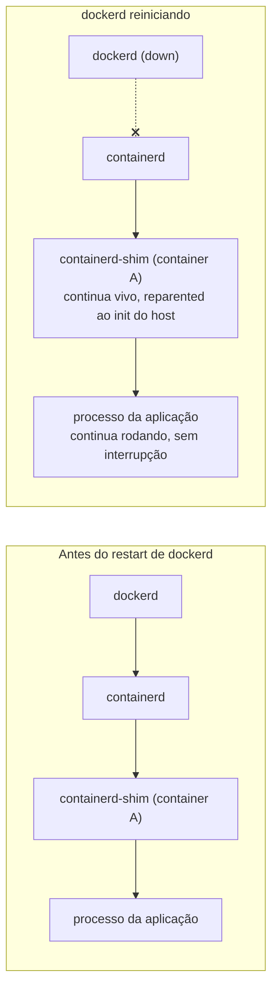
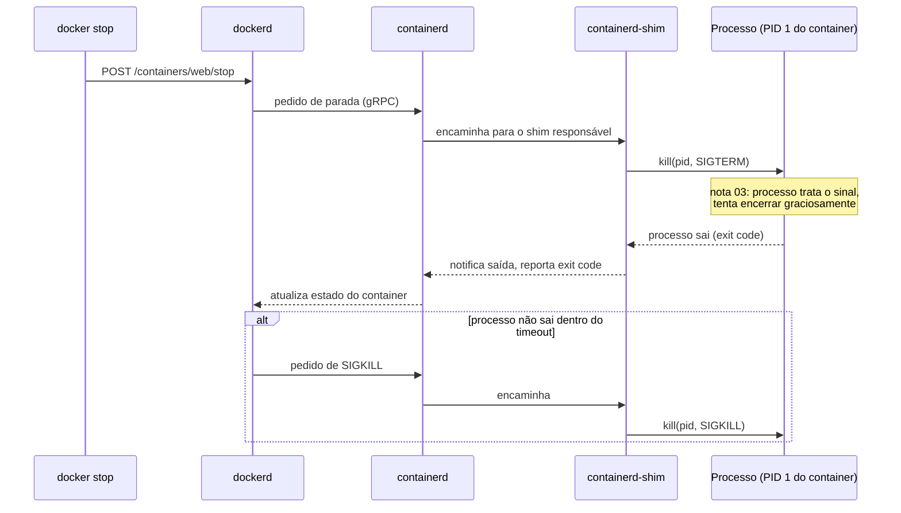
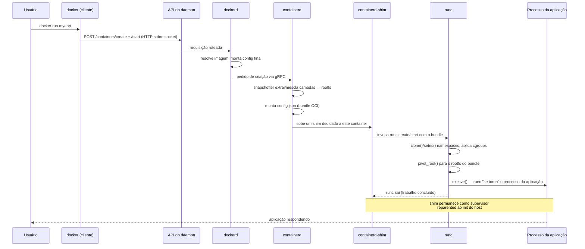

# Docker por dentro

> [!abstract] TL;DR
> `docker run` não cria um container — ele dispara uma cadeia de processos que só termina, muitos elos depois, num `execve` dentro de namespaces isolados. O cliente `docker` é só um cliente HTTP conversando com a API do daemon; o daemon delega o ciclo de vida ao `containerd`; o `containerd` sobe um `containerd-shim` por container, que por sua vez invoca o `runc` para efetivamente montar o rootfs, entrar nos namespaces e executar o processo da aplicação — e então o `runc` sai, deixando o shim como o único adulto na sala. Essa cadeia com tantos elos existe porque cada um resolve um problema que o anterior não resolvia sozinho, e o mais subestimado deles — o shim — é justamente o que permite reiniciar `dockerd` sem derrubar um único container em produção. Tudo isso só é possível de forma padronizada porque a especificação OCI separou o formato da imagem, o mecanismo de execução e o protocolo de distribuição em três contratos independentes: é essa separação, mais a imutabilidade da imagem que a [[03-Dominios/Tecnologia/Infraestrutura/Docker/02 - A anatomia de uma imagem|nota 02]] já estabeleceu, que torna `runc` substituível, o registry intercambiável e a cadeia inteira portável entre implementações.

Um time decide atualizar o Docker Engine num host de produção — sair de uma versão para outra, por causa de uma correção de segurança que não pode esperar a próxima janela de manutenção. O procedimento documentado diz para reiniciar `dockerd`. Alguém, com razão, hesita: será que reiniciar o daemon não derruba todos os containers rodando? Cinquenta serviços, alguns com estado em memória caro de reconstruir, todos em execução nesse host. A resposta curta é não — mas a resposta interessante é *por quê* não, e essa pergunta não tem resposta na API do `docker`, nem no Dockerfile, nem em nada que as quatorze notas anteriores deste galho precisaram explicar para usar o Docker bem. A resposta mora um andar abaixo do que o cliente `docker` mostra: no fato de que, quando você roda `docker run`, o processo que efetivamente fica de pé cuidando do container não é filho de `dockerd` — é filho de um processo intermediário que sobrevive exatamente para que o daemon possa cair e voltar sem levar nada junto.

Esta nota percorre essa cadeia inteira, componente por componente, respondendo à pergunta que a define: o que exatamente acontece entre você digitar `docker run` e existir, de fato, um processo isolado rodando? As notas anteriores usaram essa cadeia sem nomeá-la — a [[03-Dominios/Tecnologia/Infraestrutura/Docker/03 - O ciclo de vida de um container|nota 03]] falou de PID 1 e sinais como se o container fosse a unidade atômica, e a [[03-Dominios/Tecnologia/Infraestrutura/Docker/14 - Debugar um container|nota 14]] invocou `nsenter` e `/proc/<pid>/root` sem perguntar de onde vem esse PID visível no host. Esta nota é o andar de baixo: não mais como usar o Docker bem, mas o que o Docker de fato é.

A ordem escolhida para percorrer a cadeia importa tanto quanto o conteúdo de cada elo: ela segue exatamente o caminho que uma requisição de `docker run` percorre, do mais externo (o cliente que você digita) ao mais interno (o processo que finalmente existe), para que cada seção só precise assumir o que a seção anterior já estabeleceu — sem saltos, sem promessas de "isso será explicado mais adiante".

## O cliente `docker` não faz quase nada

A primeira correção mental necessária para entender essa cadeia é desinflar o que o binário `docker` realmente faz. `docker run`, `docker ps`, `docker build` parecem comandos que executam ação diretamente — mas o binário `docker` é, na prática, um cliente HTTP fino. Ele parseia os argumentos da linha de comando, monta uma requisição contra a API REST exposta pelo daemon (por padrão via socket Unix `/var/run/docker.sock`, mas pode ser TCP com TLS), envia essa requisição, e espera a resposta. Nenhuma lógica de criar processo, montar filesystem ou configurar namespace acontece no cliente — tudo isso é responsabilidade de quem está do outro lado do socket.

Isso explica um comportamento que costuma surpreender: `docker` funciona de máquinas diferentes de onde o daemon roda, bastando apontar `DOCKER_HOST` para o socket certo. Um cliente `docker` instalado num laptop consegue gerenciar containers rodando num servidor remoto, exatamente porque o cliente não carrega nenhum estado nem executa nenhuma ação privilegiada por conta própria — ele só fala HTTP.

```bash
# o cliente é substituível por qualquer coisa que fale a mesma API
curl --unix-socket /var/run/docker.sock http://localhost/containers/json

# apontar o cliente para um daemon remoto
DOCKER_HOST=ssh://usuario@servidor docker ps
```

## O daemon: dono do estado, mas não da execução

Do outro lado do socket está `dockerd`, o processo que efetivamente possui o estado do Docker naquele host: a lista de imagens conhecidas, redes criadas, volumes, metadados de cada container. Quando a API recebe um `POST /containers/create` seguido de um `POST /containers/{id}/start`, o daemon resolve a imagem (local ou via pull do registry, o protocolo que a [[03-Dominios/Tecnologia/Infraestrutura/Docker/12 - Registry|nota 12]] já descreveu), monta a configuração final do container a partir de flags, defaults e a configuração de imagem embutida no manifesto, e prepara tudo que é necessário para pedir a criação de fato do container.

O ponto central desta seção é o que o daemon **não** faz: ele não executa o processo da aplicação diretamente como filho seu, e não é ele quem entra em namespaces do kernel ou aplica limites de cgroup. Historicamente, em versões antigas do Docker, essa responsabilidade era mais monolítica — o próprio `dockerd` continha a lógica de execução, herdada do projeto que viria a se tornar `runc`. Essa arquitetura tinha um problema estrutural sério: se o `dockerd` precisava reiniciar (upgrade, crash, config change), todo o processo de gerenciamento de containers ia junto, e não havia como o processo da aplicação sobreviver a isso de forma limpa e supervisionada. A separação que existe hoje — `dockerd` delegando para `containerd`, que delega para um shim por container, que delega para `runc` — nasce diretamente da necessidade de isolar o ciclo de vida do container do ciclo de vida do daemon que o gerencia.

## `containerd`: o gerente de ciclo de vida, um nível abaixo do daemon

`containerd` é um daemon próprio, historicamente extraído do núcleo do Docker Engine e hoje um projeto independente sob a Cloud Native Computing Foundation, cuja responsabilidade é gerenciar o ciclo de vida completo de containers num host: puxar imagens, gerenciar seus snapshots de filesystem, e — o que importa para esta nota — criar, iniciar, pausar, parar e monitorar containers em execução. `dockerd` fala com `containerd` via uma API própria (gRPC), delegando a ele exatamente a parte "execução" que o parágrafo anterior descreveu como historicamente monolítica.

`containerd` é deliberadamente mais genérico do que "o motor de execução do Docker": ele foi desenhado para ser consumido por qualquer orquestrador, não só pelo `dockerd`. O Kubernetes, por exemplo, pode falar diretamente com `containerd` através da Container Runtime Interface (CRI), sem nenhum `dockerd` no meio — um cluster Kubernetes moderno tipicamente roda `containerd` como runtime, sem o Docker Engine estar presente. Isso é um sinal concreto de que a cadeia inteira foi desenhada em camadas substituíveis, o mesmo princípio que a seção sobre OCI, mais adiante, torna explícito.

Mas `containerd` também não é quem entra fisicamente nos namespaces do kernel. Para cada container que precisa existir, `containerd` sobe um processo auxiliar — o `containerd-shim` — e é esse processo intermediário que finalmente invoca o runtime de baixo nível.

## O shim: o elo que a maioria do material omite

Esta é a peça que quase todo tutorial de Docker pula, e é justamente a que responde à pergunta da cena de abertura. Para cada container em execução, `containerd` cria um processo `containerd-shim` dedicado — um processo pequeno, com pouquíssima lógica, cuja única razão de existir é ficar entre `containerd` e o processo real do container, sobrevivendo a qualquer um dos dois que morra.

O mecanismo funciona assim: o shim invoca `runc` passando a configuração do container (o bundle OCI, coberto na próxima seção). `runc` faz o trabalho pesado — cria os namespaces, configura os cgroups, monta o rootfs, e executa (`execve`) o processo da aplicação dentro desse ambiente isolado. Uma vez que o processo da aplicação está de pé, `runc` **sai** — ele não fica residente. Isso é intencional: manter `runc` vivo, um processo por container, seria overhead desnecessário e um ponto de falha a mais. Quem fica de pé, como pai efetivo (via reparenting no processo de reaping do Linux) do processo da aplicação, é o shim.

Isso resolve dois problemas ao mesmo tempo. Primeiro, reaping de processos zumbis: como o shim é o processo que efetivamente monitora o container, ele consegue fazer o `wait()` necessário quando o processo da aplicação sai, evitando zumbis — um mecanismo que complementa, num nível de processo diferente, a discussão de PID 1 dentro do container que a [[03-Dominios/Tecnologia/Infraestrutura/Docker/03 - O ciclo de vida de um container|nota 03]] já cobriu. Segundo, e mais importante para a cena de abertura: como o shim não é filho de `dockerd` nem de `containerd` (ele é reparented para o `init` do sistema, tipicamente `systemd` ou PID 1 do host, assim que seu processo pai imediato termina sua parte do trabalho), ele continua vivo mesmo que `dockerd` e `containerd` sejam reiniciados. O container que o shim supervisiona nunca perde o processo que o mantém de pé, então reiniciar o daemon para aplicar uma atualização não interrompe nenhum serviço em produção — os containers continuam rodando, órfãos apenas no sentido de que o daemon momentaneamente não está observando-os, até voltar e reconectar ao estado que o shim manteve.



## Um `ps` no host revela a cadeia

A melhor forma de tornar essa cadeia palpável, em vez de apenas descrita, é olhar a árvore de processos do host enquanto um container roda — a mesma técnica de observar de fora que a [[03-Dominios/Tecnologia/Infraestrutura/Docker/14 - Debugar um container|nota 14]] usou para debug, aqui usada para entender arquitetura em vez de diagnosticar problema.

```bash
docker run -d --name web nginx
ps -ef --forest | grep -E "containerd|runc|nginx"
```

A saída, resumida, costuma ter este formato:

```
root   1234  1  0  containerd
root   1350  1234  0  \_ containerd-shim-runc-v2 -namespace moby -id <container-id>
root   1367  1350  0      \_ nginx: master process
101    1401  1367  0          \_ nginx: worker process
```

Repare no que falta: **não há `runc` nessa lista**. O processo que efetivamente montou os namespaces, aplicou os cgroups e chamou `execve()` já saiu, exatamente como a seção anterior descreveu — sua existência foi transitória, um piscar entre o `containerd-shim` invocá-lo e o processo `nginx` assumir o PID que `runc` estava ocupando. O que sobra, permanentemente, é o shim como pai direto do processo `nginx`, e o `containerd` como avô. `dockerd` nem aparece nessa árvore de processos do container em si — ele é irmão distante, falando com `containerd` por fora dessa hierarquia, o que reforça visualmente por que matá-lo não derruba o `nginx`.

Se, nesse mesmo instante, alguém rodar `sudo systemctl restart docker` (que reinicia `dockerd`, e em algumas distribuições também `containerd`, dependendo de como os serviços estão amarrados no systemd), o `ps -ef --forest` rodado logo depois mostra a mesma árvore de shim e processo de aplicação, apenas com um PID novo no lugar de `containerd` — o daemon voltou, reconectou ao shim que nunca saiu do ar, e o `nginx` nunca soube que algo aconteceu.

## Por que o shim é um processo por container, não um serviço central

Vale nomear explicitamente uma escolha de design que fica implícita na árvore de processos acima: existe um `containerd-shim` **por container**, não um único processo compartilhado cuidando de todos. Isso é deliberado. Se o shim fosse um serviço central único, um bug ou um crash nele derrubaria a supervisão de todos os containers do host de uma vez — exatamente o tipo de acoplamento que essa arquitetura em camadas existe para evitar. Isolar o shim por container significa que um travamento ou um comportamento anômalo num único container fica contido: na pior hipótese, aquele container específico perde supervisão, mas os demais continuam com seus próprios shims, intocados.

A implementação de shim usada por padrão hoje — `containerd-shim-runc-v2` — segue uma API de shim (Shim API v2) definida pelo próprio `containerd`, o que permite, na prática, que um único processo de shim gerencie múltiplos containers relacionados (o caso típico é um pod inteiro, no vocabulário do Kubernetes) quando isso faz sentido, sem abrir mão do isolamento por grupo lógico. O ponto arquitetural continua o mesmo independentemente desse detalhe de agrupamento: o shim é a camada pensada especificamente para ser leve, independente do daemon, e descartável container a container (ou grupo a grupo), nunca um monólito que junta o destino de tudo que roda no host.

## `live-restore`: a garantia formalizada em configuração

O comportamento descrito até aqui — containers sobrevivendo a um reinício de `dockerd` — não é um acidente de implementação que só funciona por sorte de arquitetura; ele é formalizado numa opção de configuração explícita do próprio Docker Engine: `live-restore`. Quando essa opção está habilitada em `/etc/docker/daemon.json`, o daemon, ao subir, não tenta recriar containers do zero nem assume que eles morreram — ele varre o estado que `containerd` e os shims já mantêm, reconecta a cada shim ainda vivo, e retoma a supervisão exatamente de onde parou.

```json
{
  "live-restore": true
}
```

Sem essa configuração explícita — em algumas distribuições e versões, o comportamento default pode diferir, e vale sempre checar a documentação da versão instalada em vez de assumir — o daemon pode, em certos fluxos de shutdown, sinalizar para os containers pararem junto com ele. `live-restore` é o reconhecimento, em nível de produto, de que a arquitetura de shim separado só cumpre sua promessa até o fim se o próprio `dockerd` cooperar deliberadamente ao subir de novo, em vez de tratar cada container encontrado como órfão a ser descartado.

Isso também explica por que a cena de abertura desta nota — reiniciar `dockerd` para aplicar uma correção de segurança sem derrubar produção — não é apenas "tecnicamente possível porque o shim existe", mas uma operação que times de infraestrutura sérios verificam explicitamente antes de confiar nela: `live-restore` precisa estar ligado, e vale testar o comportamento num ambiente não crítico antes de depender dele numa janela de manutenção real.

## `docker build` também percorre uma cadeia parecida

Vale uma nota lateral, porque a cadeia descrita até aqui é sobre `docker run` especificamente, mas a pergunta natural — "o build também passa por `containerd`/`runc`?" — merece resposta direta. A [[03-Dominios/Tecnologia/Infraestrutura/Docker/10 - BuildKit por dentro|nota 10]] já cobriu o BuildKit como motor de build; o que essa nota não detalhou é que, para executar cada instrução `RUN` do Dockerfile de forma isolada e paralelizável, o BuildKit também precisa de um executor que crie ambientes isolados — e, na configuração mais comum quando o build roda através do Docker Engine, esse executor é o próprio `containerd`, usando os mesmos mecanismos de snapshotter e o mesmo `runc` por baixo.

Isso significa que cada instrução `RUN` de um Dockerfile, durante o build, roda dentro de um mini-container efêmero — não o container final que a imagem vai produzir, mas um ambiente sandboxed temporário só para aquele passo, criado e destruído pela mesma maquinaria OCI descrita nesta nota. É por isso que uma instrução `RUN` que tenta, por exemplo, acessar a rede de um jeito incomum, ou que depende de capabilities específicas, pode se comportar de forma sutilmente diferente durante o build comparado a como se comportaria dentro do container final — os dois são ambientes OCI distintos, montados a partir de bundles distintos, ainda que a cadeia de componentes por baixo seja essencialmente a mesma.

## O padrão OCI: o que desacopla a cadeia inteira

Nada disso funcionaria como um contrato estável entre implementações diferentes sem a Open Container Initiative, um projeto sob a Linux Foundation que formalizou, em especificações abertas, o que antes era comportamento específico do Docker. A OCI define três especificações separadas, e a separação em si é o ponto — cada uma resolve um problema diferente, e cada uma é substituível sem afetar as outras duas:

- **Image Specification** — o formato do artefato: como um manifesto, uma configuração de imagem e um conjunto de camadas (layers) são serializados e referenciados por digest. É o formato que a [[03-Dominios/Tecnologia/Infraestrutura/Docker/02 - A anatomia de uma imagem|nota 02]] já detalhou em profundidade — esta nota não reabre esse assunto, só nomeia onde ele se encaixa na cadeia.
- **Runtime Specification** — como um container é criado a partir de um *bundle* (rootfs mais um arquivo de configuração), incluindo o formato desse `config.json` e o conjunto de operações de ciclo de vida (`create`, `start`, `kill`, `delete`) que qualquer runtime compatível precisa expor da mesma forma.
- **Distribution Specification** — o protocolo HTTP para publicar e puxar conteúdo de um registry: como autenticar, como referenciar um manifesto por tag ou digest, como fazer upload em chunks. É o protocolo que a [[03-Dominios/Tecnologia/Infraestrutura/Docker/12 - Registry|nota 12]] já cobriu do ponto de vista de quem opera um registry; aqui ele entra só como o terceiro pilar do mesmo tripé.

O efeito prático dessa separação em três contratos é que cada peça da cadeia descrita nas seções anteriores pode ser trocada sem quebrar as outras. `runc` é a implementação de referência da Runtime Specification, mas não é a única: `crun` (escrito em C, mais leve), `gVisor`/`runsc` (que intercepta syscalls num sandbox de userspace para isolamento mais forte) e `Kata Containers` (que roda cada container dentro de uma VM leve) implementam a mesma especificação e podem substituir `runc` no fim da cadeia sem que `containerd`, o shim, ou o `dockerd` precisem saber a diferença — todos falam o mesmo contrato de bundle e `config.json`. Do lado da imagem, uma imagem construída pelo BuildKit (a [[03-Dominios/Tecnologia/Infraestrutura/Docker/10 - BuildKit por dentro|nota 10]] já cobriu esse motor) segue o mesmo Image Spec que uma imagem construída por `buildah`, `kaniko` ou `img` — e por isso roda sem modificação em qualquer runtime compatível com OCI. Do lado do registry, qualquer implementação que fale a Distribution Spec — Docker Hub, GHCR, Harbor, um registry rodado localmente com `docker run registry:2` — serve imagens da mesma forma para qualquer cliente compatível.

## Runtimes OCI alternativos: o que muda ao trocar `runc`

A afirmação de que `runc` é substituível fica mais concreta com exemplos nomeados, porque as alternativas não são apenas teóricas — são usadas em produção por razões específicas de isolamento ou de compatibilidade, sem exigir mudança na imagem, no Dockerfile, ou em qualquer coisa além da configuração de runtime do host.

| Runtime | Abordagem de isolamento | Quando faz sentido escolher |
| --- | --- | --- |
| `runc` | Namespaces e cgroups do kernel Linux, direto | Padrão — menor overhead, isolamento suficiente para a maioria das cargas |
| `crun` | Mesma abordagem de `runc` (namespaces/cgroups), reescrito em C para menor footprint e inicialização mais rápida | Ambientes com muitos containers de vida curta, onde o custo de start importa |
| `gVisor` (`runsc`) | Intercepta syscalls do container num kernel de aplicação em espaço de usuário, sem repassar todas direto ao kernel do host | Multi-tenancy com pouca confiança entre workloads — reduz a superfície de ataque exposta ao kernel real |
| `Kata Containers` | Roda cada container dentro de uma VM leve, com seu próprio kernel convidado | Isolamento equivalente a VM, mantendo a interface e a velocidade de operação de um container |

A troca de runtime, do lado do `dockerd`, é configuração — não reconstrução de nada:

```json
{
  "default-runtime": "runsc",
  "runtimes": {
    "runsc": { "path": "/usr/local/bin/runsc" }
  }
}
```

```bash
docker run --runtime=runsc minha-imagem
```

A mesma imagem, o mesmo `config.json` gerado, o mesmo shim por cima — só a última chamada da cadeia muda de alvo. É essa flexibilidade, específica e nomeada, que a afirmação mais abstrata da seção anterior ("runc é substituível") realmente significa na prática.

## O bundle OCI: o que `runc` realmente consome

A "imagem" que o usuário conhece — aquele objeto composto de camadas, manifesto e configuração que a nota 02 descreveu — não é o que `runc` recebe diretamente. Antes de chegar em `runc`, essa imagem precisa ser transformada num **bundle**: um diretório no filesystem contendo duas coisas.

A primeira é o **rootfs** — as camadas da imagem já extraídas e mescladas numa única árvore de diretórios utilizável como raiz do container. Esse trabalho de extração e merge de camadas (tipicamente via um filesystem union como overlayfs) é feito pelo `containerd`, através de um componente chamado *snapshotter*, antes mesmo de o shim ou o `runc` entrarem em cena.

A segunda é o `config.json` — um arquivo que descreve tudo que o runtime precisa saber para criar o container: qual processo executar e com quais argumentos, quais variáveis de ambiente, qual usuário, quais namespaces criar ou compartilhar, quais montagens (mounts) aplicar dentro do rootfs, e os limites de recursos que serão traduzidos em configuração de cgroup. Esse `config.json` é montado a partir da configuração de imagem embutida no manifesto (o `CMD`/`ENTRYPOINT`/`ENV` que o Dockerfile definiu) combinada com o que o usuário passou em `docker run` — as flags `-e`, `-v`, `--memory`, `-u` viram, no fim da linha, entradas neste arquivo.

```json
{
  "ociVersion": "1.0.2",
  "process": {
    "args": ["node", "server.js"],
    "env": ["NODE_ENV=production"],
    "cwd": "/app",
    "user": { "uid": 1000, "gid": 1000 }
  },
  "root": { "path": "rootfs", "readonly": false },
  "linux": {
    "namespaces": [
      { "type": "pid" },
      { "type": "network" },
      { "type": "mount" },
      { "type": "uts" },
      { "type": "ipc" }
    ],
    "resources": {
      "memory": { "limit": 536870912 }
    }
  }
}
```

`runc` lê exatamente este par — rootfs mais `config.json` — e nada mais. Ele não sabe o que é um Dockerfile, não sabe o que é um registry, não sabe o que é uma tag. Do ponto de vista de `runc`, um bundle produzido a partir de uma imagem Docker e um bundle montado à mão por um script são indistinguíveis, desde que respeitem o mesmo formato. É esse desacoplamento — a imagem vira bundle, e só o bundle importa daqui para frente — que torna a Runtime Specification independente da Image Specification.

Vale notar, ainda, que qualquer pessoa consegue produzir um bundle e chamar `runc` diretamente, sem `dockerd` nem `containerd` no meio — é literalmente assim que se testa uma implementação de runtime contra a especificação, e é útil como exercício mental para desfazer a impressão de que o Docker é indispensável nessa cadeia:

```bash
# gerar um bundle mínimo com um rootfs qualquer já extraído em ./rootfs
runc spec  # gera um config.json default no diretório atual
runc run meu-container-manual
```

Esse comando cria e inicia um container, do zero, sem um único componente do Docker envolvido — só o bundle e o binário `runc`. É a demonstração mais direta de que tudo que vem antes dele na cadeia — cliente, API, daemon, `containerd`, shim — existe para conveniência operacional (agendamento, rede, volumes, distribuição de imagens, API remota), não porque `runc` precise de nenhum deles para funcionar.

## O ciclo de vida no vocabulário do runtime: create, start, kill, delete

A Runtime Specification não define só o formato do `config.json` — ela também define o conjunto de operações que qualquer runtime compatível precisa suportar, com o mesmo significado em qualquer implementação. São, essencialmente, quatro verbos:

| Operação | O que faz | Equivalente no vocabulário do `docker` |
| --- | --- | --- |
| `create` | Monta o ambiente (namespaces, cgroups, rootfs) e deixa o processo pronto para iniciar, mas ainda pausado antes do `execve` final | Parte de `docker create` / parte interna de `docker run` |
| `start` | Libera o processo criado para de fato começar a rodar (`execve` acontece aqui) | Parte de `docker start` / parte interna de `docker run` |
| `kill` | Envia um sinal ao processo principal do container | `docker stop` / `docker kill`, que a [[03-Dominios/Tecnologia/Infraestrutura/Docker/03 - O ciclo de vida de um container|nota 03]] já cobriu do ponto de vista de dentro do container |
| `delete` | Remove o estado residual do container (cgroups, diretórios de estado) depois que ele já saiu | `docker rm` |

O fato de `create` e `start` serem operações separadas na especificação — e não uma única chamada monolítica — é o que permite ao shim (ou a qualquer orquestrador acima dele) inspecionar ou instrumentar o container no instante exato entre o ambiente estar pronto e o processo da aplicação de fato começar a rodar, uma janela pequena mas útil para ferramentas de observabilidade que precisam se anexar antes do primeiro byte de execução do processo alvo.

## Onde os namespaces e cgroups entram — e onde esta nota para

O momento exato em que o mecanismo do kernel entra em cena é quando `runc` lê o `config.json` do bundle e traduz cada entrada em chamadas de sistema: `clone()` com as flags certas para criar (ou `setns()` para entrar em) cada namespace listado, escrita nos arquivos de controle do cgroup para aplicar os limites de recurso, `pivot_root()` para trocar a raiz do filesystem visível pelo processo para o rootfs do bundle, e finalmente `execve()` para substituir o processo de `runc` pelo processo da aplicação dentro desse ambiente já isolado. É por isso que `runc` consegue sair logo em seguida — no momento do `execve`, o processo que estava rodando como `runc` literalmente se torna o processo da aplicação, dentro dos namespaces já configurados; não sobra nenhum "processo `runc`" para ficar de pé.

Esta é a fronteira dura do galho: **quem** chama o kernel (`runc`, neste ponto exato da cadeia) e **quando** (na criação do container, antes do `execve` final) é assunto do Docker. **Como** o kernel implementa isolamento de PID, de rede, de mount, de usuário através de namespaces, e **como** ele contabiliza e limita CPU, memória e I/O através de cgroups, é mecanismo de Linux, e pertence à nota [[03-Dominios/Ciência/Sistemas Operacionais/13 - Virtualização e containers|Virtualização e containers]]. Esta nota não reabre esse mecanismo — só nomeia o instante exato em que a cadeia do Docker o aciona.

> [!tip] Vídeo — construindo um container à mão, exatamente onde esta nota para
> [**Containers From Scratch**](https://www.youtube.com/watch?v=8fi7uSYlOdc) (Liz Rice — GOTO 2018, ~43 min, EN) é a continuação natural do parágrafo acima. Onde esta nota diz *"`runc` chama `clone()` com as flags certas, escreve nos arquivos de controle do cgroup e faz `pivot_root()`"* e para deliberadamente, ela **escreve esse código ao vivo, em Go, do zero**. O percurso é o mesmo, na mesma ordem: primeiro executar um comando arbitrário como processo filho; depois `chroot` para trocar a raiz do sistema de arquivos; depois o namespace de PID, e o momento em que o processo passa a se ver como **PID 1** lá dentro — seguido da descoberta de que `ps` não funciona até que `/proc` seja montado, porque `ps` lê dali e não do kernel diretamente. Em seguida o namespace de UTS para o hostname, com a explicação de por que o nome é esse: foi o primeiro namespace criado, e na época ninguém imaginou que haveria outros. O fecho é sobre cgroups: ela limita o número de processos do container e roda uma **fork bomb** contra ele, mostrando na prática a diferença entre o que namespace faz (esconder) e o que cgroup faz (limitar). **O que ele não cobre:** absolutamente nada da cadeia desta nota — sem daemon, sem `containerd`, sem shim, sem OCI, sem `live-restore`. É o degrau **abaixo** de `runc`, que é justamente o território cedido a [[03-Dominios/Ciência/Sistemas Operacionais/13 - Virtualização e containers|Ciência/SO 13]].
>
> ⚠️ Palestra de 2018. Os mecanismos de kernel mostrados não mudaram, mas ela usa cgroups v1 e escreve direto em `/sys/fs/cgroup/pids/...`; a hierarquia unificada do **cgroups v2** é o padrão nas distribuições atuais, com layout de arquivos diferente. O conceito vale; os caminhos, não.

## Como um sinal viaja a cadeia inteira, de volta para baixo

As seções anteriores descreveram a cadeia no sentido de criação — do `docker run` até o processo respirando. Vale percorrer o mesmo caminho no sentido oposto, porque `docker stop` e `docker kill` são a prova de que a cadeia funciona nos dois sentidos, e porque isso amarra diretamente com o que a [[03-Dominios/Tecnologia/Infraestrutura/Docker/03 - O ciclo de vida de um container|nota 03]] já ensinou sobre SIGTERM, PID 1 e o timeout de graceful shutdown — só que agora do ponto de vista de quem entrega o sinal, não de quem o recebe.

Quando alguém roda `docker stop web`, o cliente monta a requisição de sempre contra a API do daemon. `dockerd` traduz isso numa chamada para `containerd`, pedindo para enviar SIGTERM ao container identificado. `containerd` não entrega o sinal diretamente ao processo — ele repassa o pedido ao shim responsável por aquele container especificamente, porque é o shim quem tem a relação de processo (via PID, reparented) com o alvo real. O shim, por fim, executa o equivalente a um `kill(pid, SIGTERM)` contra o processo da aplicação, que é o mesmo PID 1 dentro do container que a nota 03 descreveu recebendo e (idealmente) tratando esse sinal.



O detalhe que essa direção revela, e que a nota 03 não tinha como cobrir sem esta cadeia já estabelecida: é o **shim**, não `dockerd` nem `containerd` diretamente, quem de fato chama `kill()` contra o processo. Isso é consistente com tudo que já foi dito — o shim é o único componente com uma relação de processo direta e persistente com o alvo, então ele é o ponto natural de onde qualquer sinalização, para dentro ou para fora, precisa passar.

## O que acontece se o próprio shim morrer

Vale fechar um caso extremo que a arquitetura precisa responder para ser coerente: e se o `containerd-shim` em si travar ou for morto, não o processo da aplicação? Como o shim é, por design, um processo pequeno e com pouquíssima lógica própria — sua única responsabilidade é supervisionar, não processar — a superfície para esse tipo de falha é pequena, mas não nula.

Quando `containerd` detecta que um shim morreu sem ter reportado a saída esperada do container que supervisionava, ele marca esse container como estando num estado inconsistente ou desconhecido — normalmente refletido, do lado do `dockerd`/cliente, como o container aparecendo parado ou num estado de erro, mesmo que o processo da aplicação, tecnicamente, ainda possa estar rodando órfão no host, sem ninguém coletando seu exit code corretamente. Esse é o cenário em que a técnica de PID direto e `/proc/<pid>/root`, que a [[03-Dominios/Tecnologia/Infraestrutura/Docker/14 - Debugar um container|nota 14]] descreveu para debug de imagens sem shell, também serve como via de investigação de última instância: mesmo com o shim fora do ar, o processo real ainda é um PID visível no host, acessível via `/proc`, ainda que a camada de gerenciamento acima dele tenha perdido a supervisão.

Esse caso extremo, na prática, é raro precisamente porque o shim foi desenhado para fazer pouco — menos lógica significa menos superfície para bugs — mas é importante nomeá-lo para não deixar a impressão de que a cadeia é infalível. Ela é resiliente a reinícios do daemon e do `containerd`, por design; ela não é imune a uma falha no próprio processo que carrega a responsabilidade de supervisão.

## Quem configura cada namespace, do lado do Docker

A fronteira estabelecida acima — o kernel implementa, `runc` chama — vale um detalhe adicional sem cruzar para o mecanismo em si: nem todo namespace listado no `config.json` é tratado da mesma forma pelo resto da cadeia depois de criado. A tabela a seguir nomeia, para cada tipo de namespace relevante a um container comum, quem do lado do Docker é responsável por decidir sua configuração — não como o kernel a implementa, apenas quem pede o quê.

| Namespace | Quem decide a configuração | Onde isso aparece para quem usa o Docker |
| --- | --- | --- |
| PID | `runc`, a partir do `config.json` | Por que `ps` dentro do container só vê os próprios processos (nota 03) |
| Rede | `containerd`/plugins de rede, que preparam a interface antes de `runc` entrar no namespace | Bridge network, `-p` para publicar portas |
| Mount | `runc`, combinando o rootfs do bundle com os mounts explícitos do `config.json` | Volumes e bind mounts (`-v`) |
| UTS | `runc`, a partir do `config.json` | Hostname isolado do container |
| IPC | `runc`, a partir do `config.json` | Isolamento de memória compartilhada e filas de mensagem entre containers |
| Usuário | `runc`, quando rootless ou quando `--userns-remap` está configurado | Mapeamento de UID dentro vs. fora do container |

Essa tabela existe só para localizar, no vocabulário do Docker, onde cada peça do `config.json` se manifesta como um comportamento observável — o "como" por trás de cada linha continua sendo assunto da [[03-Dominios/Ciência/Sistemas Operacionais/13 - Virtualização e containers|nota de Sistemas Operacionais]].

## A cadeia inteira, em sequência

O diagrama a seguir amarra as sete seções anteriores num fluxo único, do comando digitado até o processo respirando dentro dos namespaces.



Vale notar o que o diagrama deixa explícito: `runc` aparece e desaparece dentro de uma única troca de mensagens, enquanto o shim é o único componente, além do próprio processo da aplicação, que permanece vivo do início ao fim — inclusive além do fim, se `dockerd` ou `containerd` precisarem reiniciar no meio do caminho.

## Modo rootless: o que muda nessa cadeia

Docker rootless — a possibilidade de rodar o daemon e os containers inteiramente sem privilégio de root no host — não troca os componentes da cadeia, mas troca *quem* os executa e *como* alguns dos passos privilegiados são simulados. Em vez de `dockerd` rodar como root, ele roda como um usuário comum, dentro de um user namespace próprio, onde esse usuário comum é mapeado para "root" — mas só dentro daquele namespace, sem privilégio equivalente no host.

O efeito em cadeia é que operações que normalmente exigem privilégio real de root — criar certos tipos de namespace, configurar interfaces de rede, escrever diretamente em arquivos de cgroup — precisam de um caminho alternativo. Para rede, o rootless Docker tipicamente usa um mecanismo de rede em espaço de usuário (como `slirp4netns` ou `VPNKit`), que simula uma interface de rede para o container sem exigir capacidade de configurar interfaces reais no host. Para cgroups, o suporte depende de o sistema estar em cgroups v2 com delegação configurada para o usuário — sem isso, alguns limites de recurso simplesmente não podem ser aplicados no modo rootless, uma limitação real, não cosmética.

`containerd`, o shim e `runc` continuam presentes na cadeia sob rootless — a diferença é que todo o conjunto roda dentro do user namespace do usuário que iniciou o daemon, e cada elo precisa lidar com o fato de não ter os privilégios que tinha antes. O ganho de segurança é direto: um escape de container que conseguiria privilégio de root dentro de um container tradicional encontra, no modo rootless, apenas o privilégio do usuário comum que rodou o daemon — não root real do host.

Vale marcar onde exatamente, na cadeia desta nota, cada substituição acontece sob rootless, porque nem tudo muda no mesmo elo:

- O **cliente `docker`** não muda nada — continua sendo o mesmo cliente HTTP fino falando com um socket, só que agora um socket por usuário (`$XDG_RUNTIME_DIR/docker.sock`) em vez de um socket global do sistema.
- O **daemon** (`dockerd`) muda de contexto de execução — sobe dentro de um user namespace próprio do usuário, tipicamente orquestrado por uma ferramenta auxiliar (`dockerd-rootless.sh`) que prepara esse namespace antes de iniciar o daemon propriamente dito.
- `containerd` e o **shim** continuam com o mesmo papel estrutural — gerenciar ciclo de vida e sobreviver a reinícios — só que operando com o conjunto de privilégios reduzido do user namespace.
- `runc` é onde a diferença fica mais visível na prática: operações que ele faria com uma chamada direta de sistema em modo privilegiado (configurar uma interface de rede, escrever certos arquivos de cgroup) exigem, sob rootless, um caminho alternativo — porque o processo, mesmo "sendo root" dentro do seu próprio user namespace, não tem esses privilégios no namespace do host.

Para rede, especificamente, esse caminho alternativo costuma ser um mecanismo de rede inteiramente em espaço de usuário (`slirp4netns` é a opção mais comum, `VPNKit` é outra), que simula uma interface de rede para o container sem exigir a capacidade real de configurar interfaces no host — o preço dessa simulação costuma ser uma perda mensurável de throughput de rede comparado ao modo tradicional, um trade-off real que vale considerar antes de assumir rootless como substituto sem custo. Para cgroups, o suporte depende de o sistema estar em cgroups v2 com delegação explicitamente configurada para o usuário (via `systemd`, tipicamente); sem essa delegação, alguns limites de recurso simplesmente não podem ser aplicados no modo rootless — uma limitação real, não cosmética, que se conecta diretamente ao mecanismo de cgroups que a nota de Ciência aprofunda.

O ecossistema mais amplo que cresceu em torno dessa e de outras alternativas ao Docker tradicional — Podman, que nasceu rootless e daemonless desde o início, entre outros — é assunto da [[03-Dominios/Tecnologia/Infraestrutura/Docker/16 - O ecossistema além do Docker|próxima nota]], não desta.

## A cadeia inteira, resumida numa tabela

Depois de percorrer cada elo em detalhe, vale consolidar a cadeia numa única referência: o que cada componente faz, por quanto tempo ele vive, e o que garante que ele pode ser trocado sem quebrar o resto.

| Componente | Papel | Tempo de vida | Substituível por |
| --- | --- | --- | --- |
| Cliente `docker` | Parseia comandos, fala HTTP com a API do daemon | Só durante a execução do comando | Qualquer cliente que fale a mesma API (`curl`, outra CLI) |
| `dockerd` | Dono do estado (imagens, redes, volumes), resolve configuração final | Enquanto o serviço estiver ativo no host | Não tem equivalente direto — é a camada de conveniência específica do Docker |
| `containerd` | Gerencia ciclo de vida de containers, snapshotter de camadas | Enquanto o serviço estiver ativo no host | Outro gerenciador de containers que fale CRI, se o consumidor for Kubernetes |
| `containerd-shim` | Supervisiona um container (ou grupo), sobrevive a `dockerd`/`containerd` | Do início do container até sua remoção | Outra implementação de shim que respeite a Shim API do `containerd` |
| `runc` | Cria namespaces, aplica cgroups, `execve` no processo | Só durante a criação — sai logo depois do `execve` | `crun`, `gVisor`/`runsc`, `Kata Containers` — qualquer runtime compatível com a OCI Runtime Spec |
| Registry | Armazena e serve imagens via HTTP | Serviço independente, fora do host do container | Qualquer implementação da OCI Distribution Spec |

## Por que a imagem imutável é o que torna essa cadeia intercambiável

Voltando à lente do galho inteiro: nada do que esta nota descreveu seria seguro de trocar peça por peça se a imagem não fosse endereçada por conteúdo e imutável. Porque cada imagem é identificada por um digest que é literalmente o hash do seu conteúdo — a garantia que a nota 02 estabeleceu — trocar `runc` por `crun`, ou trocar o Docker Hub por um registry Harbor self-hosted, ou trocar `containerd` puro por `containerd` orquestrado via Kubernetes, nunca muda o que a imagem *é*. O bundle que qualquer runtime OCI compatível vai montar a partir dessa imagem é, byte a byte, o mesmo bundle, porque o rootfs vem de camadas cujo conteúdo é verificável por hash e a configuração vem de um manifesto que referencia essas mesmas camadas de forma imutável. É essa combinação — imagem como artefato imutável e endereçado por conteúdo, mais uma especificação aberta de runtime e de distribuição — que permite a cadeia inteira desta nota ser reorganizada, uma peça de cada vez, sem que ninguém precise reconstruir a imagem ou reaprender o Dockerfile que a gerou.

## Exemplo trabalhado: fechando a cena de abertura

Volte ao time decidindo reiniciar `dockerd` em produção para aplicar uma correção de segurança. Em vez de confiar de ouvido no que esta nota descreveu, o procedimento sensato é verificar a garantia antes de depender dela numa janela real — e verificar, aqui, significa observar a própria cadeia de processos antes, durante e depois do restart.

Primeiro passo: confirmar que `live-restore` está de fato habilitado nesse host, porque é essa configuração que transforma "o shim tecnicamente sobrevive" em "o daemon vai reconectar de propósito, sem tentar recriar nada".

```bash
docker info --format '{{.LiveRestoreEnabled}}'
```

Segundo passo: com um container de teste representativo rodando, anotar o PID do processo principal e o PID do shim que o supervisiona, antes de qualquer restart.

```bash
docker inspect --format '{{.State.Pid}}' web
# suponha que retornou 1401 — esse é o PID do processo nginx dentro do container

ps -o pid,ppid,cmd -p 1401
# a coluna PPID aponta para o PID do containerd-shim responsável por esse container
```

Terceiro passo: reiniciar o daemon, exatamente como aconteceria numa janela de manutenção real.

```bash
sudo systemctl restart docker
```

Quarto passo, o que realmente importa: checar, imediatamente depois do restart, se o mesmo PID de aplicação (`1401`, no exemplo) continua respondendo, e se o `docker ps` volta a enxergar o container sem precisar recriá-lo.

```bash
ps -p 1401  # ainda existe, sem interrupção
docker ps --filter name=web  # aparece como Up, sem um novo horário de criação
curl -s localhost:8080 -o /dev/null -w '%{http_code}\n'  # ainda responde
```

Se todos os três checks passam — o PID original ainda vivo, `docker ps` reconhecendo o container sem recriá-lo, e a aplicação respondendo sem uma única falha de requisição durante a janela — a cadeia se comportou exatamente como esta nota descreveu: o shim nunca soltou o processo, `dockerd` voltou e reconectou ao estado que já existia, e o único efeito visível do restart foi a versão nova do daemon disponível para novos comandos, não uma interrupção de serviço. É esse resultado, verificado com comandos concretos e não assumido por fé na arquitetura, que dá a um time a confiança para agendar esse tipo de manutenção em produção sem uma janela de downtime anunciada.

## Armadilhas comuns

> [!warning] Achar que matar `dockerd` mata os containers
> `kill -9` ou um crash em `dockerd` não termina os processos das aplicações em execução, porque eles são filhos (via reparenting) do `containerd-shim` de cada container, não de `dockerd` diretamente. O daemon reconecta ao estado existente ao subir de novo. O comportamento que de fato derruba containers é `systemctl stop docker` com as opções de cleanup habilitadas, ou uma remoção explícita — não a simples morte do processo do daemon.

> [!warning] Confundir `containerd` com "o motor por trás do Docker apenas"
> `containerd` é um projeto independente, consumido diretamente por outros sistemas — Kubernetes fala com ele via CRI sem precisar de `dockerd` no meio. Tratar `containerd` como um detalhe interno do Docker esconde por que ele pode existir sozinho num nó de cluster Kubernetes sem nenhum `dockerd` instalado.

> [!warning] Assumir que trocar `runc` por outro runtime OCI exige mudar a imagem
> A Image Specification e a Runtime Specification são contratos separados de propósito. Uma imagem construída e publicada normalmente roda sem nenhuma modificação sob `runc`, `crun`, `gVisor` ou `Kata` — a escolha de runtime é configuração do host (ou até por container, via `--runtime`), não algo que a imagem precisa saber ou declarar.

> [!warning] Tratar o `config.json` do bundle OCI como equivalente ao Dockerfile
> O `config.json` é gerado, não escrito à mão — ele é a tradução, feita por `containerd`/`dockerd`, do Dockerfile mais as flags de `docker run` para o formato que `runc` consome. Editar esse arquivo diretamente (fora de ferramentas de baixo nível como `runc spec`) não é um fluxo suportado pelo Docker; é útil entendê-lo para depurar, não para operar no dia a dia.

> [!warning] Assumir que rootless é sempre um substituto sem custo do modo tradicional
> Rede em modo rootless normalmente passa por um mecanismo de rede em espaço de usuário (`slirp4netns` ou equivalente), o que costuma custar throughput mensurável comparado ao modo tradicional, e o suporte a limites de cgroup depende de delegação em cgroups v2 estar configurada — sem ela, alguns limites de recurso não são aplicáveis. Tratar rootless como troca de configuração sem nenhum efeito colateral ignora esses dois custos reais.

## Como explicar em inglês

> "People assume `docker run` is a single operation, but it's actually a chain of handoffs. The `docker` CLI is just an HTTP client talking to the daemon's REST API. The daemon delegates lifecycle management to `containerd`, which spins up a dedicated `containerd-shim` process per container — and that shim is the piece almost nobody mentions. It's the shim, not the daemon, that stays alive as the parent of the application process, which is exactly why restarting `dockerd` for an upgrade doesn't kill anything running in production. The shim invokes `runc`, which does the actual kernel work — creating namespaces, applying cgroup limits, and finally `execve`-ing into the application process — and then `runc` exits immediately, because its job is done the instant the process starts. None of this would be interchangeable without the OCI specs: the image format, the runtime spec, and the distribution spec are three separate contracts, which is why `runc` can be swapped for `crun` or `gVisor`, and why an image built with one tool runs unmodified under any OCI-compliant runtime."

| Português | Inglês |
| --- | --- |
| motor de execução | container runtime |
| shim de container | container shim |
| pacote de execução (rootfs + config.json) | OCI bundle |
| desacoplado / substituível | decoupled / pluggable |
| namespace de usuário | user namespace |
| reencaminhado a um processo pai diferente | reparented |
| entrar num namespace existente | join a namespace |
| sem privilégio de root real | rootless |
| especificação aberta | open specification |
| árvore de arquivos raiz do container | container root filesystem (rootfs) |

## O que vem a seguir

Esta nota mostrou que a cadeia inteira — cliente, daemon, `containerd`, shim, `runc` — só existe separada em peças substituíveis por causa de três especificações abertas publicadas pela OCI. Mas se `runc` é substituível, e o `containerd` é consumível por qualquer orquestrador, e uma imagem OCI roda sob qualquer runtime compatível, então a pergunta natural que fica em aberto é: o Docker precisa ser a única implementação dessa cadeia? A resposta, cada vez mais, é não — e o ecossistema que nasceu justamente para explorar essa liberdade, com implementações alternativas de cada elo, é o assunto da [[03-Dominios/Tecnologia/Infraestrutura/Docker/16 - O ecossistema além do Docker|próxima nota]].

Nada nesta nota descreve o Docker como frágil ou substituível por acidente — pelo contrário: o fato de a cadeia inteira ter sido pensada em contratos abertos e camadas independentes é exatamente o que deu ao Docker Engine a estabilidade e a longevidade que ele tem hoje, porque cada peça pôde evoluir, ser corrigida ou ser substituída sem exigir uma reescrita coordenada de todas as outras ao mesmo tempo.

## Fontes

- [OCI Image Format Specification](https://github.com/opencontainers/image-spec)
- [OCI Runtime Specification](https://github.com/opencontainers/runtime-spec)
- [OCI Distribution Specification](https://github.com/opencontainers/distribution-spec)
- [containerd — documentação oficial](https://containerd.io/docs/)
- [containerd — arquitetura e componentes (GitHub)](https://github.com/containerd/containerd/blob/main/docs/architecture.md)
- [runc — repositório e documentação](https://github.com/opencontainers/runc)
- [Docker Docs — Rootless mode](https://docs.docker.com/engine/security/rootless/)
- [Docker Docs — dockerd live-restore](https://docs.docker.com/engine/daemon/live-restore/)
- [Kubernetes — Container Runtime Interface (CRI)](https://kubernetes.io/docs/concepts/architecture/cri/)
- [Ivan Velichko — What even is a container: namespaces and cgroups](https://iximiuz.com/en/posts/containers-vs-vms/)
- [gVisor — documentação e arquitetura](https://gvisor.dev/docs/)
- [Kata Containers — documentação e arquitetura](https://katacontainers.io/docs/)
