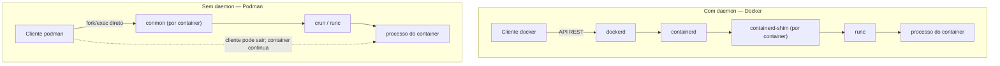

# O ecossistema além do Docker

> [!abstract] TL;DR
> "Container" e "Docker" viraram sinônimos por um acidente histórico — o Docker chegou primeiro e definiu o vocabulário — mas o que hoje é padronizado não é o Docker, são três especificações da OCI: como uma imagem é empacotada, como um runtime executa essa imagem, e como um registry a distribui. Justamente por isso, cliente, motor de build e runtime de execução deixaram de precisar ser o mesmo binário: Podman roda containers sem daemon algum, delegando ciclo de vida ao systemd e ao próprio kernel; Buildah constrói imagens OCI sem Dockerfile e sem daemon; nerdctl fala a ergonomia do Docker direto com o containerd. A pergunta que sobra não é "qual ferramenta é melhor", é onde cada arquitetura compra e onde ela cobra — e o Docker, apesar de tudo isso, continua sendo a escolha mais simples para a maioria das equipes na maior parte do tempo.

Um time de plataforma decide rodar o build de imagens dentro do próprio cluster Kubernetes, para não depender de um runner externo com Docker instalado. O primeiro instinto é procurar "Docker dentro de um pod" — e esbarra de cara num problema conhecido de quem já mexeu com CI containerizado: rodar o daemon do Docker dentro de um container exige ou montar o socket do daemon do host (que é, na prática, dar root no host para qualquer coisa que rode naquele pod) ou rodar em modo Docker-in-Docker privilegiado, o que a nota 13 já tratou como algo a evitar quase sempre. A pergunta certa não é "como colocar o Docker lá dentro" — é "por que o build de uma imagem precisa de um daemon de longa duração rodando como root em primeiro lugar". A resposta, uma vez que se olha para o que a nota 15 já expôs sobre a cadeia cliente → daemon → containerd → shim → runc, é: não precisa. O daemon do Docker existe por uma decisão de arquitetura anterior à própria existência de uma especificação aberta de runtime — não por uma exigência do que faz um container ser um container hoje.

O time acaba resolvendo o problema de duas formas diferentes, e a escolha entre elas é exatamente o assunto desta nota: ou troca a ferramenta de build por uma que nunca precisou de daemon — o Buildah, coberto adiante —, ou aceita que, para esse caso de uso específico, o Docker-in-Docker privilegiado é um mal necessário e mitiga o risco por outros meios (isolamento de rede do runner, rotação de credenciais, um nó dedicado que nunca roda outra carga). Nenhuma das duas é "a resposta certa" universal — é uma decisão de arquitetura que depende de quanto risco o time está dispensado a aceitar em troca de manter uma ferramenta já familiar.

## O que foi padronizado, e por que isso libera a ferramenta

A nota 15 mostrou que o `docker run` que parece uma chamada direta ao kernel é, na verdade, o primeiro elo de uma cadeia — cliente fala com o daemon, o daemon delega ao containerd, o containerd invoca um shim por container, o shim invoca o `runc`, e é só o `runc` que finalmente chama os primitivos do kernel (namespaces e cgroups, cobertos em [[03-Dominios/Ciência/Sistemas Operacionais/13 - Virtualização e containers|Virtualização e containers]]). O que importava naquela nota era que essa cadeia inteira existe porque, em algum momento, a comunidade em torno do Docker decidiu separar as responsabilidades em especificações formais, sob o guarda-chuva da Open Container Initiative (OCI): a **image-spec** define o formato de uma imagem — o manifesto, a lista de camadas endereçadas por conteúdo que a nota 02 já detalhou, a config —; a **runtime-spec** define o contrato que qualquer runtime de baixo nível precisa cumprir para transformar um bundle de filesystem mais um arquivo de configuração num processo isolado; e a **distribution-spec**, que a nota 12 usou para explicar como um registry expõe imagens por HTTP, define como empurrar e puxar esses artefatos de um repositório remoto.

O detalhe que essa nota explora é a consequência dessas três especificações existirem como documentos públicos e versionados, em vez de como comportamento implícito de um binário: qualquer ferramenta que produza um artefato compatível com a image-spec pode ser consumida por qualquer runtime compatível com a runtime-spec, publicado em qualquer registry compatível com a distribution-spec — e nenhuma das três exige que exista um daemon. Uma imagem construída pelo Buildah, sem nunca ter visto o binário `docker`, é indistinguível, para o `runc` que a executa, de uma imagem construída pelo `docker build`. Um registry que fala a distribution-spec não sabe nem se importa se quem fez `push` foi o cliente Docker, o Podman, ou um pipeline de CI escrito em Go que fala HTTP diretamente. A padronização transformou o par imagem/runtime em uma peça de infraestrutura substituível — exatamente como um formato de arquivo aberto permite trocar o editor sem trocar o documento. O Docker deixou de ser "o jeito de rodar containers" para ser "uma implementação, entre várias, de um conjunto de especificações que ele mesmo ajudou a nascer".

Vale registrar de onde essas especificações vieram, porque o detalhe importa para o argumento desta nota: a Open Container Initiative foi lançada em junho de 2015 sob o guarda-chuva da Linux Foundation, com o próprio Docker como um dos membros fundadores — ao lado da CoreOS e de outros participantes da indústria de containers da época —, e o Docker doou as especificações e o código associado que viraram a base do que hoje são a image-spec e a runtime-spec (Linux Foundation, [Open Container Initiative Establishes Technical Governance](https://www.linuxfoundation.org/press/press-release/open-container-initiative-establishes-technical-governance-announces-new-members); Wikipedia, [Open Container Initiative](https://en.wikipedia.org/wiki/Open_Container_Initiative)). Ou seja: o próprio Docker ajudou a criar a régua que hoje o torna substituível — não por acidente ou descuido, mas porque padronizar o formato de imagem e o contrato de runtime beneficiava todo o ecossistema (incluindo o próprio Docker, que ganhava um `runc` reutilizável por qualquer runtime de alto nível) mais do que manter um formato fechado teria beneficiado só a empresa. A OCI hoje mantém as três especificações — image-spec, runtime-spec e distribution-spec — como projetos abertos, com governança técnica compartilhada entre múltiplos mantenedores independentes.

Como referência rápida — sem repetir o que a nota 15 já desenvolveu sobre cada uma —, as três especificações e o que cada uma cobre:

| Especificação | O que define | Quem a consome |
|---|---|---|
| image-spec | Formato do manifesto, config e camadas de uma imagem | Qualquer ferramenta de build (Docker, Podman, Buildah, nerdctl) e qualquer runtime que precise interpretar o artefato |
| runtime-spec | Contrato entre um bundle de filesystem + configuração e um processo isolado em execução | Runtimes de baixo nível — `runc`, `crun`, `gVisor`, `Kata Containers` |
| distribution-spec | Protocolo HTTP para publicar e buscar imagens num registry | Qualquer cliente que faça `push`/`pull` e qualquer implementação de registry |

Um jeito de tornar essa substituibilidade tangível, sem precisar acreditar na afirmação abstrata: pegue uma imagem qualquer publicada num registry público, puxe-a com o cliente Docker, inspecione o manifesto com `docker manifest inspect`, e compare com o mesmo manifesto puxado por `podman manifest inspect` ou por uma chamada HTTP crua contra o endpoint da distribution-spec do mesmo registry. Os três caminhos retornam, byte a byte, o mesmo JSON — a mesma lista de camadas, os mesmos digests SHA-256, a mesma configuração — porque nenhum dos três está interpretando um formato proprietário do Docker; todos estão lendo o mesmo documento público que a image-spec define. É essa convergência, verificável com uma chamada de comando, que sustenta cada uma das ferramentas descritas a seguir: elas não "imitam" o Docker, elas implementam, de forma independente, a mesma especificação que o Docker também implementa.

## Podman: containers sem daemon

O Podman parte de uma pergunta de arquitetura simples: por que um processo servidor de longa duração, rodando como root, precisa mediar cada `run`, cada `build`, cada `stop`? A resposta do projeto, mantido pela Red Hat, é que não precisa. Quando o cliente Podman recebe `podman run`, ele não envia uma requisição a um daemon — ele mesmo cria o container, via fork-exec, como faria qualquer processo comum do sistema, delegando a execução de fato a um runtime OCI (tipicamente o `crun` ou o `runc`) por meio de um monitor leve chamado `conmon`, que fica responsável por manter descritores de arquivo e portas abertos, transmitir logs e limpar o processo quando ele termina — sem que exista, em nenhum momento, um segundo processo servidor coordenando tudo ([DeepWiki, Podman Architecture Overview](https://deepwiki.com/podman-container-tools/podman/1.2-architecture-overview)).

Isso muda duas coisas de peso, uma de segurança e uma de operação. Em segurança: no Docker, o daemon roda continuamente como root (ou com um usuário com privilégios equivalentes de gestão), e qualquer superfície de ataque contra esse processo único vira uma porta para o sistema inteiro — é o mesmo argumento que a nota 13 já levantou contra montar o socket do daemon dentro de um container. No Podman, não existe esse processo permanente e privilegiado à espreita: quando o `conmon` e o container terminam, não sobra nenhum servidor rodando esperando a próxima chamada. Em operação: sem um daemon supervisionando containers com política de restart própria, quem assume esse papel é o `systemd` — o Podman consegue gerar unidades de serviço systemd inteiras a partir de um container já criado, de modo que reiniciar, monitorar e integrar logs com o resto do sistema operacional passa a ser trabalho do gerenciador de serviços nativo do Linux, não de uma camada adicional de gestão que o Docker precisa reinventar (Red Hat, [Running containers with Podman and shareable systemd services](https://www.redhat.com/en/blog/podman-shareable-systemd-services)).



O diagrama expõe a diferença estrutural: no caminho do Docker, o cliente é só um mensageiro de uma API REST, e o daemon é um ponto central e permanente por onde toda operação passa; no caminho do Podman, o cliente cria o processo diretamente e pode encerrar sem que o container morra junto — quem mantém o container vivo depois disso é o próprio kernel mais o `conmon`, não um servidor esperando o próximo comando.

### Compatibilidade de linha de comando

O Podman foi desenhado deliberadamente para que a maior parte dos comandos do Docker funcione trocando só o nome do binário — `podman run`, `podman build`, `podman ps`, `podman logs` aceitam, na prática, o mesmo vocabulário de flags que seus equivalentes `docker`. Muitos guias de migração chegam a recomendar criar um alias `alias docker=podman` como primeiro passo de transição, justamente porque a superfície de comandos do dia a dia coincide (DeepWiki, [Podman Architecture Overview](https://deepwiki.com/podman-container-tools/podman/1.2-architecture-overview); DEV Community, [Docker vs Podman: An In-Depth Comparison](https://dev.to/mechcloud_academy/docker-vs-podman-an-in-depth-comparison-2025-2eia)). Essa compatibilidade não é acidente — é a mesma lógica de especificação aberta da seção anterior aplicada agora à ergonomia do cliente: se o artefato final (imagem OCI) e o contrato de execução (runtime OCI) são os mesmos, faz sentido que o vocabulário de comando também convirja, para que trocar de ferramenta custe o mínimo possível de re-treinamento.

### O conceito de pod

O nome "Podman" não é acaso: a ferramenta introduz nativamente o conceito de **pod**, que é exatamente a mesma abstração que o Kubernetes usa — um grupo de containers que compartilham namespace de rede (e, opcionalmente, IPC e PID), de modo que se enxergam via `localhost` e sobem e descem como uma unidade só (Stack Harbor, [Podman pods — running multi-container groups without Kubernetes](https://stackharbor.com/en/knowledge-base/podman-pods-multi-container/); Oracle Linux Docs, [Podman Networking](https://docs.oracle.com/en/operating-systems/oracle-linux/podman/network.html)). Por padrão, um pod do Podman compartilha rede, UTS e IPC entre os containers que o compõem, e é possível controlar exatamente quais namespaces são compartilhados via a flag `--share`. Onde isso importa na prática: um `podman generate kube` converte um pod já em execução localmente num manifesto YAML de Pod do Kubernetes que pode ser aplicado diretamente num cluster, e o inverso — `podman play kube` — roda um manifesto Kubernetes como um pod local, sem precisar de cluster nenhum, para desenvolvimento e depuração. O Docker Compose, coberto na nota 11, resolve um problema parecido — orquestrar vários containers relacionados — mas por outro caminho: compõe containers isolados a partir de uma definição declarativa, sem a noção nativa de namespace de rede compartilhado que o pod do Podman (e o Pod do Kubernetes) tem desde a raiz.

Um exemplo concreto torna a mecânica visível. Criar um pod com uma porta publicada, subir dois containers dentro dele — um servidor web e um cache — e depois gerar as unidades systemd que vão gerenciar o ciclo de vida inteiro sem depender do Podman continuar rodando:

```bash
podman pod create --name minha-app -p 8080:80

podman run -d --pod minha-app --name web nginx:1.27
podman run -d --pod minha-app --name cache redis:7.4

# web fala com cache via localhost:6379, porque os dois
# compartilham o mesmo namespace de rede do pod

podman generate systemd --new --files --name minha-app
systemctl --user enable --now pod-minha-app.service
```

A partir do momento em que `systemctl --user enable --now` roda, é o `systemd` do usuário — não um daemon do Podman — quem decide se o pod reinicia depois de uma queda, quem agrega os logs via `journalctl`, e quem garante a ordem de subida entre `web` e `cache` na próxima reinicialização do host. O `podman generate systemd` não inventa esse comportamento: ele só traduz o estado do pod já criado para o vocabulário nativo do gerenciador de serviços do Linux, fechando o ciclo que a seção anterior descreveu — nenhum processo adicional de longa duração precisa existir só para supervisionar containers.

O mesmo pod, convertido para o vocabulário do Kubernetes com `podman generate kube minha-app`, produz um manifesto reconhecível por qualquer cluster que fale a API padrão:

```yaml
apiVersion: v1
kind: Pod
metadata:
  name: minha-app
spec:
  containers:
    - name: web
      image: docker.io/library/nginx:1.27
      ports:
        - containerPort: 80
          hostPort: 8080
    - name: cache
      image: docker.io/library/redis:7.4
```

Essa conversão é o que fecha o argumento da compatibilidade de vocabulário: o mesmo grupo de containers que acabou de rodar numa máquina local via `podman pod create` vira, sem reescrita manual, um objeto que `kubectl apply -f` entende — porque a abstração de pod nunca foi exclusividade do Kubernetes, é uma ideia que o Podman implementa de forma standalone e que o Kubernetes implementa em escala de cluster.

### O soquete compatível com a API do Docker

Boa parte do ecossistema de ferramentas que fala com "o Docker" na verdade fala com um soquete Unix que expõe uma API REST — o `docker.sock` — e não com o binário `docker` propriamente dito. O Podman expõe o próprio equivalente desse soquete, com uma camada de compatibilidade que implementa boa parte da API REST v1.40 do Docker, tipicamente em `/run/user/$(id -u)/podman/podman.sock` no modo rootless, ou em `/run/podman/podman.sock` no modo rootful (documentação Baeldung, [Configuring Testcontainers to Work with Podman](https://www.baeldung.com/java-podman-configure-testcontainers)). Isso significa que ferramentas que nunca chamam o binário `docker` diretamente, mas conversam com esse soquete — o `docker-py` (SDK Python), bibliotecas de Testcontainers em Java, Go ou Node, o próprio `docker compose` em algumas configurações — podem, em muitos casos, apontar para o soquete do Podman em vez do soquete do Docker trocando uma única variável de ambiente, `DOCKER_HOST`, sem alterar uma linha de código da aplicação que consome essa API. É outra camada da mesma lógica de substituibilidade: não é só a imagem e o runtime que são intercambiáveis — a própria superfície de controle, quando exposta como API versionada, também é.

Na prática, a maior parte das equipes que migra parcialmente para o Podman não reescreve nenhuma automação existente — só troca o valor de uma variável de ambiente ou o alvo de um `docker context create`, e todo o resto do código que já falava com "o Docker" continua funcionando sem saber que, por baixo, quem está respondendo às chamadas agora é um processo completamente diferente.

> [!tip] Vídeo — a comparação com o argumento de segurança em primeiro plano
> [**Podman vs Docker in 2026: What's Really Different?**](https://www.youtube.com/watch?v=SIvoAOpXZPg) (Better Stack, ~6 min, EN) é curto e vai direto ao ponto que a seção anterior desenvolve: o Docker depende de um **daemon central rodando como root**, e a consequência é que comprometer esse daemon é comprometer a máquina inteira — um container malicioso passa a poder controlar o host. O Podman responde a isso pela arquitetura, não por configuração: **sem daemon**, com modelo *fork/exec*, e rootless por padrão. O vídeo também dá os dois critérios de escolha que esta nota defende — Podman quando segurança é requisito de primeira ordem, e Podman quando se trabalha muito com Kubernetes, pelo conceito de pod que ele traz nativamente. **O que ele não cobre:** Buildah, `nerdctl` e o `containerd` como caminho direto, o que exatamente foi padronizado pela OCI e por isso permite a troca, e os casos em que o Docker continua sendo a escolha melhor.

## Modo rootless de verdade

O Docker moderno oferece um modo rootless, mas ele é a exceção, configurado à parte, rodando um daemon inteiro dentro do namespace de usuário do usuário sem privilégio. O Podman inverte essa relação: rootless é o modo natural, porque não existe daemon central que precisaria, de qualquer forma, de privilégio para gerenciar todos os containers do sistema. O mecanismo que torna isso possível é o **user namespace** do kernel Linux, o mesmo primitivo já apresentado em [[03-Dominios/Ciência/Sistemas Operacionais/13 - Virtualização e containers|Virtualização e containers]]: dentro desse namespace, um processo pode enxergar a si mesmo como UID 0 (root), enquanto no host ele continua mapeado para o UID sem privilégio do usuário real que iniciou o container. Esse mapeamento não usa os UIDs normais do sistema — usa faixas de **UID e GID subordinados**, registradas em `/etc/subuid` e `/etc/subgid`, que o kernel traduz de dentro para fora do container (Red Hat, [Understanding rootless Podman's user namespace modes](https://www.redhat.com/en/blog/rootless-podman-user-namespace-modes)).

O arquivo de configuração por trás desse mapeamento é simples de ler uma vez que se sabe o que procurar — cada linha reserva, para um usuário do host, uma faixa de UIDs e GIDs que só existem dentro dos user namespaces que esse usuário cria:

```
# /etc/subuid
josenaldo:100000:65536

# /etc/subgid
josenaldo:100000:65536
```

A linha diz: o usuário `josenaldo`, no host, ganha o direito de mapear os UIDs de 100000 a 165535 para dentro de qualquer user namespace que ele criar — é dessa faixa que o Podman tira os UIDs que um container rootless enxerga como se fossem 0, 1, 2, e assim por diante. Confirmar o mapeamento em execução é uma linha de comando:

```bash
podman unshare cat /proc/self/uid_map
         0        1000          1
         1      100000       65536
```

A primeira coluna é o UID dentro do namespace; a segunda é o UID correspondente no host; a terceira é o tamanho do intervalo mapeado. A leitura da saída acima: o UID 0 dentro do namespace (o "root" que o processo do container enxerga) corresponde ao UID 1000 do host — o próprio usuário sem privilégio que iniciou tudo —, e os UIDs de 1 a 65536 dentro do namespace mapeiam para a faixa subordinada 100000-165535 reservada em `/etc/subuid`. Nenhum desses UIDs "internos" corresponde a um usuário privilegiado real do host — é uma tradução inteiramente contida dentro do kernel, e é exatamente essa tradução que torna seguro deixar um usuário sem privilégio algum criar um processo que, de dentro do container, parece rodar como root.

As limitações reais dessa escolha não são teóricas, e vale enumerá-las com honestidade em vez de tratá-las como detalhe:

- **Faixa de UID limitada.** Uma configuração padrão de rootless normalmente concede acesso a 65536 UIDs e GIDs subordinados — o Podman usa por padrão algo na casa de 65 mil —, o que significa que imagens cujo processo espera rodar com um UID mais alto do que essa faixa simplesmente não funcionam sem reconfiguração manual das faixas subordinadas (Red Hat, [Understanding rootless Podman's user namespace modes](https://www.redhat.com/en/blog/rootless-podman-user-namespace-modes)).
- **Portas privilegiadas.** Como o processo dentro do container não é root de verdade no host, ele não tem, por padrão, permissão para abrir portas abaixo de 1024 — a mesma regra do kernel que impede qualquer processo sem privilégio de escutar na porta 80 diretamente vale aqui, e a saída usual é mapear para uma porta alta no host e deixar um proxy reverso (ou uma regra de redirecionamento) resolver a fachada em 80/443.
- **Desempenho de armazenamento e sistemas de arquivo compartilhado.** O Podman rootless não funciona sobre NFS nem sobre sistemas de arquivo paralelos como GPFS, porque esses sistemas não entendem user namespaces e aplicam verificação de UID no lado do servidor — exigindo um sistema de arquivos POSIX local, como XFS ou ext4, para o armazenamento de containers (documentação oficial do projeto, [containers/podman rootless.md](https://github.com/containers/podman/blob/main/rootless.md)). Além disso, o backend de armazenamento em modo rootless tipicamente usa `fuse-overlayfs` em vez do driver overlay nativo do kernel, o que historicamente carrega uma penalidade de desempenho de I/O mensurável frente ao overlay usado no modo root — o preço concreto de trocar privilégio por isolamento.
- **Recursos de rede.** Sem privilégio de root, a rede de um container rootless não usa as mesmas pontes de rede em modo bridge nativas do kernel que o Docker root usa por padrão — o Podman rootless depende de mecanismos userspace como `slirp4netns` ou, em versões mais recentes, `pasta`, que simulam a pilha de rede sem exigir privilégio elevado, e cada um desses mecanismos tem seu próprio custo de desempenho e suas próprias lacunas de funcionalidade (por exemplo, algumas topologias de rede multi-container ficam mais limitadas do que o equivalente root).
- **Grupos suplementares.** Um usuário que pertence a grupos suplementares do host — por exemplo, um grupo de projeto compartilhado — pode ver esses grupos aparecerem como `nobody` (GID 65534) dentro do container rootless mesmo usando a flag pensada para resolver justamente isso, `--group-add=keep-groups`, porque o mapeamento correto desses grupos suplementares dentro do user namespace nem sempre se comporta como esperado (documentação da Red Hat e RockyLinux sobre rootless Podman).

Nenhuma dessas limitações é motivo para descartar o modelo — são o preço explícito de eliminar o processo privilegiado permanente, e conhecer o preço é o que permite decidir, caso a caso, se ele vale a pena para uma carga de trabalho específica.

### Auditoria: de volta a uma pessoa, não a um daemon compartilhado

Uma consequência menos óbvia do modelo sem daemon, e que vale registrar por completar o argumento de segurança: como cada container do Podman é criado como processo filho da sessão do próprio usuário que chamou `podman run` — sem passar por um daemon único compartilhado por todo o sistema —, um sistema de auditoria do host consegue rastrear a ação até a sessão daquele usuário específico com mais facilidade do que consegue no Docker, onde toda operação passa pelo mesmo daemon root e a trilha de auditoria tende a apontar genericamente para "o daemon do Docker", não para quem de fato disparou o comando (Better Stack Community, [Exploring Podman: A More Secure Docker Alternative](https://betterstack.com/community/guides/scaling-docker/podman-vs-docker/); NVISO, [Enterprise Podman Security](https://blog.nviso.eu/2026/02/03/rootless-containers-with-podman/)). Não é um recurso de segurança configurado à parte — é uma consequência estrutural direta de não existir um único processo mediador coletando todas as chamadas de todos os usuários do sistema.

### Fora do Linux, a mesma máquina virtual que o Docker também precisa

Vale um esclarecimento honesto que o entusiasmo por "sem daemon" às vezes esconde: containers são, na raiz, um recurso do kernel Linux — namespaces e cgroups, cobertos em [[03-Dominios/Ciência/Sistemas Operacionais/13 - Virtualização e containers|Virtualização e containers]] — e não existem nativamente em macOS nem em Windows. O Docker Desktop resolve isso rodando uma máquina virtual Linux por baixo, de forma transparente ao usuário; o Podman resolve exatamente o mesmo problema com o `podman machine`, que sobe uma VM Linux usando o framework de virtualização nativo do macOS (ou QEMU) ou o WSL2 no Windows, e usa um componente chamado `gvproxy` para prover rede à VM sem exigir privilégio administrativo nem configuração manual de bridge (Red Hat, [How Podman runs on Macs and other container FAQs](https://www.redhat.com/en/blog/podman-mac-machine-architecture)). Ou seja: a alegação "sem daemon" é rigorosamente verdadeira dentro da VM Linux — é lá que o fork-exec direto do Podman acontece —, mas em macOS e Windows ainda existe uma camada de virtualização por baixo, exatamente como no Docker Desktop. A diferença estrutural entre as duas ferramentas só se manifesta plenamente em Linux nativo, que é onde o Podman roda sem VM nenhuma no meio.

Isso tem uma implicação prática direta para quem decide entre as duas ferramentas pensando só na máquina de desenvolvimento: se o time inteiro desenvolve em macOS ou Windows, boa parte da vantagem estrutural do Podman — ausência de daemon, rootless nativo sem VM — simplesmente não se manifesta da mesma forma, porque tanto Docker Desktop quanto `podman machine` já pagam o mesmo custo de rodar uma VM Linux por baixo. A vantagem do Podman fica mais nítida justamente nos cenários de servidor Linux e de pipeline de CI que rodam nativamente sobre o kernel — os mesmos cenários que a lista de diagnóstico rápido, adiante, cataloga.

## Buildah: construir sem Dockerfile e sem daemon

O Buildah, também mantido no guarda-chuva do projeto Podman, ataca um problema mais estreito: construir uma imagem compatível com a OCI sem precisar de um Dockerfile e sem precisar de daemon algum ([buildah.io](https://buildah.io/); Red Hat, [Building container images with Buildah](https://docs.redhat.com/en/documentation/red_hat_enterprise_linux/9/html/building_running_and_managing_containers/assembly_building-container-images-with-buildah)). Ele oferece duas formas de construir uma imagem: a primeira, mais familiar, consome um Containerfile (compatível em sintaxe com um Dockerfile) e produz a imagem exatamente como o `docker build` faria; a segunda, mais radical, expõe um conjunto de subcomandos — `buildah from`, `buildah run`, `buildah copy`, `buildah commit` — que emulam, um a um, o que cada instrução de um Dockerfile faz, mas como chamadas de linha de comando independentes, sem exigir um arquivo de receita declarativo:

```bash
container=$(buildah from alpine:3.20)
buildah run "$container" -- apk add --no-cache curl
buildah copy "$container" ./app /app
buildah config --entrypoint '["/app/start.sh"]' "$container"
buildah commit "$container" minha-api:1.0
buildah rm "$container"
```

Cada uma dessas chamadas manipula um container de trabalho diretamente — sem daemon, sem cache implícito de camadas do BuildKit que a nota 10 detalhou, sem nada além de um processo `buildah` de vida curta que termina assim que o `commit` grava a imagem final. Repare que cada linha do script corresponde, quase um para um, a uma instrução de Dockerfile que a nota 04 já apresentou — `buildah run` é o análogo de `RUN`, `buildah copy` é o análogo de `COPY`, `buildah config` ajusta metadados de imagem como `ENTRYPOINT` ou `CMD` — só que expressas como comandos imperativos de shell em vez de linhas de um arquivo de receita declarativo. Cada chamada gera, da mesma forma que uma instrução de Dockerfile gera, uma camada nova sobre o container de trabalho, preservando a mesma mecânica de composição por camadas que a nota 02 estabeleceu como propriedade fundamental de uma imagem — o Buildah não inventa um formato de imagem alternativo, ele só troca o formato do script que produz as mesmas camadas.

Por que isso importa quando o build roda dentro de um cluster: um pipeline de CI que roda dentro de um pod Kubernetes ganha, com o Buildah, a possibilidade de construir imagens OCI válidas sem montar o socket do daemon do host nem rodar em modo privilegiado — o mesmo cenário de abertura desta nota. Ferramentas como Kaniko (do ecossistema Google) resolvem um problema parecido por outro caminho; o Buildah resolve pela via de ser, ele mesmo, um binário sem componente servidor, herdando a mesma vantagem estrutural que o Podman tem para execução, e de fato compartilha com o Podman a mesma biblioteca de baixo nível de gestão de armazenamento de imagens (`containers/storage`), o que explica por que os dois projetos convivem tão bem no mesmo host — uma imagem construída pelo Buildah aparece imediatamente no `podman images` do mesmo sistema, sem precisar de `push` e `pull` intermediários por um registry:

```bash
container=$(buildah from alpine:3.20)
buildah commit "$container" minha-api:1.0

# a mesma imagem, sem nenhum push/pull, já aparece aqui:
podman images | grep minha-api
```

Essa interoperabilidade de armazenamento local — duas ferramentas diferentes lendo e escrevendo no mesmo repositório de imagens do host — é outra manifestação concreta da mesma tese: quando o formato de dado é compartilhado (aqui, a implementação de armazenamento local, não só o formato OCI de transporte), a fronteira entre "ferramenta de build" e "ferramenta de execução" deixa de exigir sequer uma etapa de publicação intermediária.

Scripts de shell que chamam `buildah` sequencialmente também abrem a porta para lógica condicional de build que um Dockerfile declarativo não expressa facilmente — decidir, em tempo de execução do script, se uma camada específica deve ou não ser incluída, ramificar a lógica de build conforme uma variável de ambiente do próprio pipeline de CI, ou reaproveitar um container de trabalho já configurado como ponto de partida de várias imagens diferentes — ao custo de abrir mão da legibilidade e da portabilidade de um Containerfile puro, que qualquer outro membro da equipe lê de cima a baixo sem precisar entender a lógica imperativa de um script.

### O formato final: OCI puro ou compatível com Docker

Um detalhe que expõe, de novo, a padronização da abertura desta nota: o Buildah deixa o formato do manifesto final explícito, em vez de escondê-lo atrás de uma escolha implícita, através da flag `--format`:

```bash
buildah build --format oci -t minha-api:1.0 .
buildah build --format docker -t minha-api:1.0-legacy .
```

O primeiro produz um manifesto estritamente conforme a image-spec da OCI; o segundo produz um manifesto no formato legado do Docker (Docker Image Manifest V2, Schema 2) — um formato ligeiramente anterior à própria OCI, mas que ainda é o que alguns registries mais antigos ou pipelines legados esperam encontrar. A existência dessa flag é a prova mais direta de que o Buildah não trata "formato de imagem" como um detalhe implícito de fábrica — trata como uma escolha explícita entre dois formatos padronizados e documentados, o que só faz sentido porque a padronização da OCI existe para ser escolhida, e não é um monopólio silencioso de nenhuma ferramenta específica.

## nerdctl: a ergonomia do Docker, falando direto com o containerd

Enquanto o Podman substitui a arquitetura inteira, o nerdctl resolve um problema mais pontual: dar ao containerd — o mesmo componente que já aparece no meio da cadeia do Docker, coberto na nota 15 — um cliente de linha de comando com a mesma ergonomia do `docker`, sem reintroduzir um daemon adicional entre os dois. O projeto, mantido sob o guarda-chuva do próprio containerd, é descrito pelos mantenedores como "o CLI operator-facing para o containerd: os mesmos verbos que o `docker` já entrega, as mesmas flags, o comportamento esperado, mas falando direto com o socket do containerd" (GitHub, [containerd/nerdctl](https://github.com/containerd/nerdctl); Medium, [nerdctl: Docker-compatible CLI for contaiNERD](https://medium.com/nttlabs/nerdctl-359311b32d0e)). Na prática, `nerdctl run`, `nerdctl build`, `nerdctl compose up` aceitam quase o mesmo vocabulário que seus equivalentes Docker — incluindo suporte a Compose nativo — e, por trás, tudo é traduzido em chamadas gRPC ao containerd, sem passar por nenhuma camada equivalente ao `dockerd`.

O caso de uso típico é ambientes onde o containerd já está presente por outro motivo — por exemplo, como runtime de um nó Kubernetes, já que o `kubelet` fala com o containerd diretamente há anos — e onde adicionar o Docker inteiro só para ter uma interação manual ergonômica seria redundante: o mesmo processo containerd que já está rodando o cluster pode ser operado, à mão, com um cliente que parece o Docker. O nerdctl também expõe recursos que o Docker tradicional não tem nativamente, como suporte a lazy-pulling de imagens (Stargz, Nydus), imagens criptografadas via `ocicrypt`, e distribuição de imagens via IPFS — recursos que vêm de o containerd expor extensões que o cliente nerdctl escolhe surfacear, em vez de esconder atrás de uma API mais conservadora como a do Docker (GitHub, [containerd/nerdctl](https://github.com/containerd/nerdctl)).

Um detalhe que expõe a arquitetura por trás da ergonomia familiar: o containerd organiza tudo o que gerencia em **namespaces internos** próprios — não os namespaces do kernel Linux da nota de SO, mas uma partição lógica dentro do próprio containerd — e o `kubelet` de um nó Kubernetes opera, por convenção, dentro do namespace chamado `k8s.io`. O nerdctl, por padrão, opera num namespace `default` diferente, o que significa que uma imagem construída com `nerdctl build` comum não aparece automaticamente para o `kubelet` do mesmo nó — é preciso apontar explicitamente `nerdctl --namespace k8s.io build` para que o artefato caia no mesmo espaço lógico que o Kubernetes enxerga (GitHub, [containerd/nerdctl, discussão #2704](https://github.com/containerd/nerdctl/discussions/2704)):

```bash
# imagem cai no namespace "default" do containerd — invisível ao kubelet
nerdctl build -t minha-api:1.0 .

# imagem cai no mesmo namespace que o kubelet usa
nerdctl --namespace k8s.io build -t minha-api:1.0 .
nerdctl --namespace k8s.io images
```

Esse detalhe de namespace interno é o tipo de coisa que só aparece quando se opera diretamente contra o containerd em vez de contra um daemon que esconde essa granularidade — o preço de ergonomia familiar com uma camada a menos de abstração por baixo. O nerdctl também é capaz de delegar builds mais sofisticados a um daemon `buildkitd` externo, reaproveitando exatamente o mesmo motor de build BuildKit que a nota 10 já detalhou por dentro do Docker — outra prova de que BuildKit, como o resto da cadeia, nunca foi exclusivo do Docker: é um projeto separado, hoje hospedado sob o guarda-chuva do Moby, que o próprio Docker consome como dependência (GitHub, [containerd/nerdctl, docs/build.md](https://github.com/containerd/nerdctl/blob/main/docs/build.md)).

### nerdctl também roda rootless

A mesma independência de daemon central que o Podman explora como diferencial central também está disponível no nerdctl, ainda que de forma menos central ao projeto: `containerd-rootless-setuptool.sh install` configura um containerd inteiro rodando dentro do user namespace do usuário sem privilégio, e a partir daí `nerdctl` (sem sudo, sem grupo `docker`) opera exatamente como no modo rootful, só que com o mesmo isolamento de privilégio que a seção de rootless já detalhou para o Podman (GitHub, [containerd/nerdctl](https://github.com/containerd/nerdctl)). O ponto para reter: rootless não é propriedade exclusiva de nenhuma ferramenta específica deste ecossistema — é uma capacidade do kernel Linux (user namespaces) que qualquer runtime moderno pode escolher expor, e cada uma das ferramentas desta nota faz essa escolha de forma diferente: padrão inegociável no Podman, opção configurável no nerdctl, modo à parte no Docker.

## Exemplo trabalhado: a mesma imagem, quatro caminhos

Para tornar a substituibilidade da seção de abertura concreta em vez de teórica, vale seguir um mesmo alvo — construir e rodar uma imagem simples de API — pelos quatro caminhos descritos até aqui. O ponto de partida é um único Containerfile, sintaticamente idêntico a um Dockerfile, que qualquer uma das ferramentas consegue consumir sem modificação:

```dockerfile
# syntax=docker/dockerfile:1.6
FROM node:22-alpine AS builder
WORKDIR /app
COPY package*.json ./
RUN npm ci --omit=dev
COPY . .

FROM node:22-alpine
WORKDIR /app
COPY --from=builder /app /app
USER node
EXPOSE 3000
ENTRYPOINT ["node", "server.js"]
```

Com o Docker, o caminho é o que a nota 04 já apresentou — um `docker build` seguido de um `docker run`, ambos falando com o daemon por baixo:

```bash
docker build -t minha-api:1.0 .
docker run -d -p 3000:3000 --name minha-api minha-api:1.0
docker logs -f minha-api
```

Com o Podman, a sintaxe muda pouquíssimo — o mesmo Containerfile, o mesmo vocabulário de flags — mas o caminho de execução por baixo é o fork-exec direto descrito na seção anterior, sem daemon algum intermediando:

```bash
podman build -t minha-api:1.0 .
podman run -d -p 3000:3000 --name minha-api minha-api:1.0
podman logs -f minha-api
```

Com o Buildah, o mesmo Containerfile ainda pode ser consumido diretamente — o Buildah não obriga o caminho passo a passo apresentado antes, ele só permite esse caminho quando for útil:

```bash
buildah build -t minha-api:1.0 .
```

E a imagem resultante, sendo um artefato OCI comum, pode ser rodada por qualquer runtime compatível — o próprio Podman, por exemplo, já que Buildah não executa containers de aplicação de longa duração:

```bash
podman run -d -p 3000:3000 --name minha-api minha-api:1.0
```

Com o nerdctl, apontando para um containerd local, o vocabulário de comando é outra vez quase idêntico, mudando só o binário invocado:

```bash
nerdctl build -t minha-api:1.0 .
nerdctl run -d -p 3000:3000 --name minha-api minha-api:1.0
nerdctl logs -f minha-api
```

O que esse exercício deixa visível é que a única coisa que de fato varia entre os quatro caminhos é *quem recebe o comando e como ele é processado por baixo* — a imagem final, inspecionada com `docker manifest inspect` ou `podman manifest inspect` em qualquer um dos quatro casos, é um artefato OCI equivalente, com o mesmo conjunto de camadas e o mesmo comportamento em runtime. Nenhuma das quatro ferramentas produz um formato proprietário que só ela mesma entende — e é exatamente essa equivalência que a seção de abertura descreveu como consequência das três especificações da OCI.

Um passo final de verificação, útil sempre que a dúvida "essas duas imagens são realmente a mesma coisa?" aparecer: comparar o digest do conteúdo, não o nome da tag, porque a tag é só um rótulo mutável apontando para um digest imutável — a mesma lição que a nota 02 já estabeleceu sobre endereçamento por conteúdo.

```bash
docker build -t minha-api:1.0 .
podman build -t minha-api:1.0 .

docker inspect --format '{{.Id}}' minha-api:1.0
podman inspect --format '{{.Id}}' minha-api:1.0
```

Construídas a partir do mesmo Containerfile, sobre a mesma base e no mesmo instante, as duas imagens devem produzir o mesmo digest de conteúdo — porque nenhuma das duas ferramentas está inventando bytes: as duas estão executando as mesmas instruções, sobre a mesma base, e empacotando o resultado no mesmo formato de camadas endereçadas por conteúdo. Uma divergência de digest entre elas normalmente aponta para uma diferença real no processo — uma versão de pacote diferente resolvida pelo gerenciador de dependências, um timestamp de metadado diferente, ou uma base ligeiramente diferente — não para um "jeito diferente de fazer a mesma coisa" que devesse ser ignorado.

Vale ainda citar, sem expandir em seção própria porque foge do recorte desta nota, o **Skopeo** — outro projeto do mesmo guarda-chuva `containers/` que Podman e Buildah, especializado só em mover e inspecionar imagens entre registries (`skopeo copy`, `skopeo inspect`) sem nunca precisar de daemon, de root ou sequer de baixar a imagem inteira para o armazenamento local ([skopeo.org](https://skopeo.org/); Red Hat, [What is Skopeo?](https://www.redhat.com/en/topics/containers/what-is-skopeo)). Ele completa o trio Podman/Buildah/Skopeo como três ferramentas especializadas — rodar, construir, mover — que compartilham a mesma base de código de baixo nível em vez de reunir tudo num binário único como o Docker faz, outra escolha de arquitetura, não de capacidade: a superfície funcional coberta pelas três juntas não é menor do que a do cliente `docker` sozinho.

## Tradução prática

A tabela abaixo cobre as operações do dia a dia e como cada uma se escreve nas quatro ferramentas — útil tanto para quem está migrando quanto para quem convive com mais de uma no mesmo posto de trabalho.

| Operação | Docker | Podman | Buildah | nerdctl |
|---|---|---|---|---|
| Rodar um container | `docker run -d -p 8080:80 nginx` | `podman run -d -p 8080:80 nginx` | não se aplica — Buildah não roda containers de aplicação, só constrói imagens | `nerdctl run -d -p 8080:80 nginx` |
| Construir uma imagem a partir de um arquivo de receita | `docker build -t app:1.0 .` | `podman build -t app:1.0 .` | `buildah build -t app:1.0 .` (consome um Containerfile) | `nerdctl build -t app:1.0 .` |
| Construir uma imagem sem arquivo de receita, passo a passo | não suportado nativamente | não suportado nativamente | `buildah from`, `buildah run`, `buildah copy`, `buildah commit` encadeados | não suportado nativamente |
| Subir uma stack Compose | `docker compose up -d` | `podman compose up -d` (via plugin) ou `podman kube play` para manifesto Kubernetes | não se aplica | `nerdctl compose up -d` |
| Grupo de containers com rede compartilhada | via rede definida no Compose, sem abstração de pod nativa | `podman pod create` seguido de `podman run --pod` | não se aplica | via rede Compose, sem abstração de pod nativa |
| Publicar imagem no registry | `docker push registry/app:1.0` | `podman push registry/app:1.0` | `buildah push registry/app:1.0` | `nerdctl push registry/app:1.0` |
| Listar containers em execução | `docker ps` | `podman ps` | não se aplica | `nerdctl ps` |
| Rodar sem privilégio de root desde a raiz | modo rootless, opt-in, configuração à parte | modo padrão do projeto | daemonless por natureza, sem exigir root | herda o modelo de privilégio do containerd subjacente |
| Gerar unidade systemd a partir de um container | não suportado nativamente | `podman generate systemd` | não se aplica | não suportado nativamente |
| Converter para/de manifesto Kubernetes | não suportado nativamente | `podman generate kube` / `podman play kube` | não se aplica | não suportado nativamente |
| Inspecionar manifesto de uma imagem remota | `docker manifest inspect app:1.0` | `podman manifest inspect app:1.0` | `buildah manifest inspect app:1.0` | `nerdctl manifest inspect app:1.0` |
| Executar comando dentro de um container em execução | `docker exec -it app sh` | `podman exec -it app sh` | não se aplica | `nerdctl exec -it app sh` |
| Criar um volume nomeado | `docker volume create dados` | `podman volume create dados` | não se aplica | `nerdctl volume create dados` |
| Escolher o formato do manifesto de saída do build | apenas Docker Image Manifest V2 | herda o formato configurado do storage | `--format oci` ou `--format docker`, explícito | segue o formato padrão do BuildKit |
| Ver histórico de camadas de uma imagem | `docker history app:1.0` | `podman history app:1.0` | `buildah inspect app:1.0` | `nerdctl history app:1.0` |
| Remover imagens não referenciadas por nenhum container | `docker image prune` | `podman image prune` | não se aplica — Buildah não gerencia limpeza de imagens ociosas | `nerdctl image prune` |
| Copiar/mover uma imagem entre registries sem baixar localmente | não suportado nativamente | `podman image scp` (entre hosts) | não se aplica | não suportado nativamente |
| Construir a partir de um estágio intermediário específico | `docker build --target estagio .` | `podman build --target estagio .` | não se aplica no modo passo a passo — controle total já é o padrão | `nerdctl build --target estagio .` |

## Onde o Docker continua sendo a escolha melhor

Nada do que foi dito acima é argumento para trocar o Docker por padrão. A honestidade que esta nota deve ao leitor é a mesma que a nota 13 já cobrou de si mesma sobre segurança: critério de decisão, não propaganda de alternativa. Três eixos concretos pesam a favor de continuar com o Docker na maior parte das equipes:

**Integração de IDE e de ferramentas de teste que assumem o Docker por padrão.** Extensões de editor para inspecionar containers, visualizar camadas de imagem, ou depurar dentro de um container em execução historicamente foram escritas primeiro contra a API do Docker, e mesmo quando aceitam apontar para outro soquete compatível (como o do Podman, via `DOCKER_HOST`), a experiência "instalar e simplesmente funcionar" ainda pressupõe, na documentação oficial dessas extensões, que o Docker é o alvo. O mesmo vale para bibliotecas de Testcontainers usadas em teste de integração — cobertas por outro domínio deste vault —, que documentam Docker como caminho principal e Podman como caminho suportado, mas secundário, exigindo passos extras de configuração (Baeldung, [Configuring Testcontainers to Work with Podman](https://www.baeldung.com/java-podman-configure-testcontainers)).

**Ergonomia de desenvolvimento e o ecossistema do Compose.** O Docker Desktop, cobrindo Windows, macOS e Linux com uma experiência unificada de instalação e uma GUI que expõe logs, volumes e redes visualmente, ainda não tem equivalente direto no ecossistema Podman/Buildah/nerdctl com o mesmo grau de polimento cross-plataforma. E o Docker Compose, tratado na nota 11 como o ambiente de desenvolvimento padrão do galho, tem um ecossistema de exemplos, templates e integrações de IDE que nasceu com ele e que qualquer alternativa (`podman compose`, `nerdctl compose`) hoje implementa por compatibilidade, não por ter nascido ali.

**Onipresença em documentação e em CI.** A esmagadora maioria dos tutoriais, Stack Overflow, READMEs de projetos open source e templates de pipeline de CI (GitHub Actions, GitLab CI) assume o `docker` como cliente. Isso não é mérito técnico — é efeito de rede: quanto mais gente usa, mais material existe, e mais fácil fica contratar alguém que já sabe operar. Trocar essa base de conhecimento acumulada tem um custo de treinamento e de manutenção de runbooks que raramente se paga só pelos ganhos arquiteturais do daemonless.

**A maior parte das equipes não tem motivo para trocar.** As vantagens do Podman (sem daemon, rootless nativo) resolvem problemas concretos de multi-tenancy em servidor compartilhado, de compliance que proíbe processo root permanente, ou de build dentro de cluster sem privilégio — cenários reais, mas específicos. Um time que roda o Docker Desktop na máquina de dev e publica via um pipeline de CI que já tem Docker instalado como parte da imagem do runner não ganha nada, na prática, ao migrar, e paga o custo de reaprender flags que raramente divergem o suficiente para justificar a fricção. A pergunta certa não é "Podman é melhor que Docker" — é "o problema que o daemon me causa hoje é real e específico, ou é hipotético".

**Um único produto cobrindo o ciclo inteiro, com suporte comercial atrás.** Docker Desktop, Docker Hub, Docker Scout (já apresentado na nota 13 como scanner integrado) e o cliente `docker` são desenvolvidos e mantidos pela mesma empresa, com um único caminho de suporte comercial para quem precisa disso contratualmente. O ecossistema Podman/Buildah/nerdctl é federado — cada peça é um projeto separado, com seu próprio ritmo de release e sua própria comunidade — o que dá liberdade de composição, mas também significa que não existe um único fornecedor a quem recorrer quando uma integração entre duas dessas peças quebra. Para uma equipe que valoriza previsibilidade contratual mais do que liberdade de composição, essa diferença pesa mais do que qualquer argumento de arquitetura.

Vale registrar um contraponto que reforça o argumento inteiro desta nota em vez de contradizê-lo: o próprio formato de arquivo do Docker Compose, historicamente amarrado à implementação do Docker, foi publicado como a **Compose Specification** — um padrão aberto, mantido no repositório `compose-spec/compose-spec` sob licença Apache 2.0, desenvolvido em colaboração com outros participantes da indústria de nuvem, explicitamente para que aplicações descritas nesse formato pudessem rodar em outras plataformas multi-container além do Docker (Docker, [Announcing the Compose Specification](https://www.docker.com/blog/announcing-the-compose-specification/); InfoWorld, [Docker's Compose specification is now an open standard](https://www.infoworld.com/article/2257118/dockers-compose-specification-is-now-an-open-standard.html)). É por isso que `podman compose` e `nerdctl compose` conseguem consumir o mesmo arquivo `compose.yaml` sem reescrevê-lo — não porque imitaram o formato do Docker por engenharia reversa, mas porque o formato deixou de ser propriedade fechada de uma ferramenta e virou mais uma especificação aberta, seguindo exatamente o mesmo padrão que a image-spec, a runtime-spec e a distribution-spec já haviam estabelecido antes dela.

Vale notar, para não simplificar demais o contraste: nada impede rodar Podman, Buildah ou nerdctl em modo rootless também — o modo sem privilégio não é exclusividade do Podman, é uma propriedade que qualquer runtime capaz de user namespaces pode oferecer, e o nerdctl documenta o próprio suporte a rootless como recurso de primeira classe (GitHub, [containerd/nerdctl](https://github.com/containerd/nerdctl)). A diferença não é "só o Podman faz isso" — é que no Podman esse é o caminho *padrão* e testado como tal, enquanto nas outras ferramentas é um modo adicional configurado à parte, o mesmo lugar onde o Docker rootless já está hoje.

Juntando os três eixos: nenhum deles é sobre o Docker ser tecnicamente inferior a nada — é sobre custo de troca (ergonomia e Compose), efeito de rede (documentação e CI) e ausência de motivo concreto (a maioria das cargas de trabalho nunca esbarra no problema específico que motivou o Podman a existir). A régua certa para decidir, caso a caso, não é abstrata: é perguntar se o problema que motivou cada alternativa desta nota — privilégio permanente de um daemon, root obrigatório, dependência de socket montado dentro de um container — está de fato presente no cenário concreto em análise.

> [!info] Caducidade deste assunto
> Este é o tema do galho inteiro que envelhece mais depressa — mais até do que o material de BuildKit da nota 10, porque BuildKit já é um projeto relativamente estável dentro do próprio Docker, enquanto o conjunto de alternativas descrito aqui é onde a maior parte da inovação de arquitetura de containers está acontecendo neste momento. Enquanto a anatomia de uma imagem (nota 02) e as três especificações OCI mudam em ritmo de anos, o ecossistema de ferramentas em torno delas — qual projeto tem mais tração, qual recurso é experimental versus estável, qual integração de nuvem prioriza qual cliente — muda em meses. A baseline desta nota é agosto de 2026: Podman e Buildah como projetos maduros mantidos pela Red Hat sob o guarda-chuva `containers/`, nerdctl como sub-projeto oficial do containerd. Releia esta nota com ceticismo passado um ou dois anos, e verifique se as limitações de rootless ainda valem como descritas — esse é exatamente o tipo de detalhe que evolui rápido.

## Diagnóstico rápido: qual ferramenta para qual cenário

Reunindo os critérios espalhados pela nota inteira num guia de decisão direto, para consultar quando a pergunta concreta aparecer:

- **Build de imagem dentro de um pod Kubernetes, sem privilégio.** Buildah, ou um `docker build` delegado a um serviço externo como Kaniko — nunca Docker-in-Docker privilegiado como primeira escolha.
- **Servidor compartilhado por múltiplos usuários ou múltiplos times (multi-tenancy).** Podman rootless, para que nenhum usuário precise de acesso equivalente a root só para rodar seus próprios containers.
- **Ambiente com política de compliance que proíbe processo permanente rodando como root.** Podman, pela ausência estrutural de daemon.
- **Nó Kubernetes onde o containerd já roda o cluster e falta só uma interface manual.** nerdctl, para evitar instalar o Docker inteiro só por ergonomia de linha de comando.
- **Máquina de desenvolvimento de uma equipe pequena, com Compose no centro do fluxo.** Docker Desktop com Docker Compose — o caminho de menor atrito, sem nenhum dos problemas específicos que motivam as alternativas.
- **Pipeline de CI hospedado (GitHub Actions, GitLab CI) com runner gerenciado por terceiro.** Docker, na esmagadora maioria dos casos — os runners já vêm com o cliente instalado e a documentação da própria plataforma de CI assume esse vocabulário.
- **Grupo de containers que precisa ser tanto testado localmente quanto implantado depois num cluster Kubernetes real.** Podman, usando pods desde o desenvolvimento local e convertendo com `podman generate kube` quando chegar a hora de subir num cluster de verdade.
- **Ambiente de teste de integração via Testcontainers, com a documentação da biblioteca já cobrindo o caso.** Docker por padrão, Podman como caminho suportado que exige configurar `DOCKER_HOST` e, em alguns casos, desativar o Ryuk (o container de limpeza automática do Testcontainers) explicitamente.
- **Dispositivo de borda (edge) com recursos escassos, onde cada processo permanente custa memória mensurável.** Podman ou nerdctl, para evitar o custo fixo de um daemon rodando continuamente só para responder a chamadas ocasionais.
- **Time inteiro desenvolvendo em macOS ou Windows, sem cluster Linux próprio na equação.** Docker Desktop — a vantagem estrutural do Podman se dilui quando os dois já pagam o mesmo custo de VM, como a seção sobre `podman machine` detalhou.

Nenhuma linha dessa lista é uma regra fechada — é um ponto de partida para a pergunta certa, que continua sendo "qual problema concreto essa escolha resolve aqui", não "qual ferramenta é tecnicamente superior em abstrato".

Um padrão comum, que vale nomear porque aparece com frequência em times que crescem: começar com Docker em desenvolvimento, adotar Buildah ou Kaniko só na etapa de build de CI que roda dentro do cluster, e considerar Podman de ponta a ponta só quando surgir um motivo concreto de compliance ou multi-tenancy que o justifique — trocar as três peças de uma vez, sem um motivo específico para cada uma, tende a custar mais em retrabalho do que resolver.

Esse padrão adotado por partes, em vez de uma migração completa de uma vez, é o que permite a uma equipe testar o ganho real de cada ferramenta isoladamente antes de comprometer todo o fluxo de trabalho a ela — e é, na prática, o caminho que a maioria das equipes que hoje usa mais de uma dessas ferramentas relatam ter seguido, segundo os próprios guias de migração citados nesta nota.

## Armadilhas comuns

> [!warning] Achar que "compatível com Docker" significa "idêntico ao Docker" em todo comportamento
> A compatibilidade de linha de comando do Podman e do nerdctl cobre o vocabulário do dia a dia, não cada detalhe de implementação. Diferenças sutis de rede (bridge nativo versus `slirp4netns`/`pasta`), de armazenamento (`overlay` versus `fuse-overlayfs` em rootless) e de comportamento de build podem produzir resultados diferentes em casos de borda — um script de CI que depende de um comportamento não documentado do daemon do Docker pode quebrar silenciosamente ao trocar o cliente, mesmo que a sintaxe do comando seja idêntica.

> [!warning] Rodar rootless e esperar desempenho de I/O idêntico ao modo root
> A troca de `overlay` nativo do kernel por `fuse-overlayfs` em armazenamento rootless tem um custo de desempenho real, especialmente em cargas de trabalho com muita escrita de arquivo pequeno. Medir throughput de disco antes de assumir que "rootless é só uma flag a mais" evita surpresa em produção — a decisão de usar rootless deve pesar esse custo contra o ganho de segurança, não ignorá-lo.

> [!warning] Trocar de ferramenta para resolver um problema que não é da ferramenta
> Migrar de Docker para Podman não resolve um Dockerfile mal escrito, uma imagem sem multi-stage (nota 09), ou uma pipeline de CI sem cache de camada bem configurado (nota 10). A arquitetura sem daemon resolve um conjunto específico de problemas — privilégio permanente, ponto único de falha do daemon, root obrigatório — e nenhum deles é sobre a qualidade do Dockerfile ou da imagem final. Confundir os dois leva a um projeto de migração caro que não entrega o ganho esperado.

> [!warning] Assumir que `podman generate kube` produz um manifesto pronto para produção
> A conversão de um pod local para um manifesto Kubernetes é um ponto de partida útil para prototipagem, não um substituto para escrever o manifesto com as garantias que um cluster de produção exige — `resources.limits`, `livenessProbe`/`readinessProbe`, `PodDisruptionBudget`, políticas de rede. O YAML gerado descreve fielmente o que o pod local está fazendo agora, e nada além disso; tratar esse YAML como produto final pula exatamente as decisões que fazem a diferença entre um Pod que roda numa máquina de desenvolvedor e um workload apto a rodar em um cluster gerenciado com múltiplos nós e múltiplas réplicas.

> [!warning] Esquecer que, fora do Linux, ainda existe uma VM por baixo de qualquer uma dessas ferramentas
> Anunciar "sem daemon" como se fosse "sem nenhuma camada de virtualização" confunde duas coisas diferentes em macOS e Windows. O `podman machine` sobe uma VM Linux exatamente como o Docker Desktop sobe a sua — a ausência de daemon é uma propriedade do que acontece dentro dessa VM, não uma eliminação da VM em si. Comparar tempo de inicialização, consumo de memória ou comportamento de rede entre Podman e Docker nessas plataformas sem levar essa VM em conta produz uma comparação que não mede o que se pretende medir.

## Como explicar em inglês

**Model paragraph:** *"People say 'Docker' and 'container' as if they were the same thing, but what actually got standardized by the OCI is the image format, the runtime contract, and the distribution protocol — not any specific vendor's daemon. Because those three specs are open and versioned, the tool that builds an image and the tool that runs it no longer have to be the same binary, or even talk to a daemon at all. Podman proves that by being daemonless: the client forks and execs the container directly, a lightweight conmon process supervises it, and systemd — not a long-running root daemon — takes over lifecycle management from there. That buys you a real security win, since there's no permanently privileged process sitting around as a single point of compromise, and it enables rootless by default through Linux user namespaces, at the cost of some real limitations: no privileged ports below 1024 out of the box, a measurable storage performance hit from fuse-overlayfs instead of the kernel's native overlay driver, and networking that relies on userspace stacks like slirp4netns or pasta instead of native bridges. None of that makes Docker obsolete, though — Compose's ecosystem, Docker Desktop's cross-platform polish, and sheer documentation ubiquity mean most teams have no concrete reason to switch, and the right question is never 'which tool is better,' it's 'is the specific problem the daemon causes me today real, or hypothetical.'"*

| Português | Inglês |
|---|---|
| sem daemon | daemonless |
| modo sem privilégio (usuário comum) | rootless mode |
| namespace de usuário | user namespace |
| UID e GID subordinados | subordinate UID/GID (subuid/subgid) |
| processo monitor leve | lightweight monitor process |
| grupo de containers com rede compartilhada | pod (shared-namespace container group) |
| ponto único de falha | single point of failure |
| especificação aberta e versionada | open, versioned specification |
| superfície de ataque | attack surface |
| faixa de portas privilegiadas | privileged port range |
| gerenciador de serviços nativo | native service manager |
| motor de build | build engine |
| criação de processo via fork-exec | fork-exec process creation |
| artefato substituível | swappable artifact |
| efeito de rede (documentação, mão de obra) | network effect (docs, hiring pool) |

## O que vem a seguir

Trocar de ferramenta de execução ou de build não muda o lugar onde essas ferramentas são chamadas com mais frequência e com menos tolerância a atrito: o pipeline de CI e a máquina de desenvolvimento do dia a dia. A nota 17, [[03-Dominios/Tecnologia/Infraestrutura/Docker/17 - Docker em CI e na máquina de dev|Docker em CI e na máquina de dev]], parte exatamente desse ponto — não para revisitar Podman ou Buildah como opções abstratas, mas para tratar o Docker (e, onde fizer diferença concreta, suas alternativas) como mecanismo dentro do contexto onde a maioria das equipes de fato o usa: dentro de um runner de CI que precisa cachear camadas entre execuções, e na máquina de um desenvolvedor que precisa que o ambiente local se pareça o suficiente com produção sem custar minutos a cada `docker build`.

O critério de decisão que esta nota deixou pronto — qual problema concreto motiva qual ferramenta — reaparece lá em forma mais estreita: não "Docker ou Podman em geral", mas "o cache de camada deste pipeline específico está configurado direito, e o runner tem privilégio suficiente para o que está sendo pedido".

Guardar isso como fio condutor economiza boa parte da confusão que normalmente cerca a escolha de ferramenta de container: a pergunta nunca é sobre qual binário é mais moderno, é sobre qual arquitetura resolve o problema concreto que está na mesa.

## Fontes

- [DeepWiki — Podman Architecture Overview](https://deepwiki.com/podman-container-tools/podman/1.2-architecture-overview)
- [Red Hat — Running containers with Podman and shareable systemd services](https://www.redhat.com/en/blog/podman-shareable-systemd-services)
- [Red Hat — Understanding rootless Podman's user namespace modes](https://www.redhat.com/en/blog/rootless-podman-user-namespace-modes)
- [GitHub — containers/podman, rootless.md](https://github.com/containers/podman/blob/main/rootless.md)
- [Stack Harbor — Podman pods: running multi-container groups without Kubernetes](https://stackharbor.com/en/knowledge-base/podman-pods-multi-container/)
- [Linux Foundation — Open Container Initiative Establishes Technical Governance](https://www.linuxfoundation.org/press/press-release/open-container-initiative-establishes-technical-governance-announces-new-members)
- [Wikipedia — Open Container Initiative](https://en.wikipedia.org/wiki/Open_Container_Initiative)
- [Oracle Linux Documentation — Podman Networking](https://docs.oracle.com/en/operating-systems/oracle-linux/podman/network.html)
- [buildah.io — projeto oficial](https://buildah.io/)
- [Red Hat Enterprise Linux Documentation — Building container images with Buildah](https://docs.redhat.com/en/documentation/red_hat_enterprise_linux/9/html/building_running_and_managing_containers/assembly_building-container-images-with-buildah)
- [GitHub — containerd/nerdctl](https://github.com/containerd/nerdctl)
- [GitHub — containerd/nerdctl, docs/build.md](https://github.com/containerd/nerdctl/blob/main/docs/build.md)
- [GitHub — containerd/nerdctl, discussão #2704](https://github.com/containerd/nerdctl/discussions/2704)
- [Medium (nttlabs) — nerdctl: Docker-compatible CLI for contaiNERD](https://medium.com/nttlabs/nerdctl-359311b32d0e)
- [DEV Community — Docker vs Podman: An In-Depth Comparison](https://dev.to/mechcloud_academy/docker-vs-podman-an-in-depth-comparison-2025-2eia)
- [Baeldung — Configuring Testcontainers to Work with Podman](https://www.baeldung.com/java-podman-configure-testcontainers)
- [Red Hat — How Podman runs on Macs and other container FAQs](https://www.redhat.com/en/blog/podman-mac-machine-architecture)
- [Better Stack Community — Exploring Podman: A More Secure Docker Alternative](https://betterstack.com/community/guides/scaling-docker/podman-vs-docker/)
- [NVISO — Enterprise Podman Security: Rootless Containers, SELinux, Backups & Docker Comparison](https://blog.nviso.eu/2026/02/03/rootless-containers-with-podman/)
- [Rocky Linux Documentation — Rootless Podman](https://docs.rockylinux.org/10/guides/containers/rootless_podman_advanced/)
- [skopeo.org — projeto oficial](https://skopeo.org/)
- [Red Hat — What is Skopeo?](https://www.redhat.com/en/topics/containers/what-is-skopeo)
- [Docker — Announcing the Compose Specification](https://www.docker.com/blog/announcing-the-compose-specification/)
- [InfoWorld — Docker's Compose specification is now an open standard](https://www.infoworld.com/article/2257118/dockers-compose-specification-is-now-an-open-standard.html)
