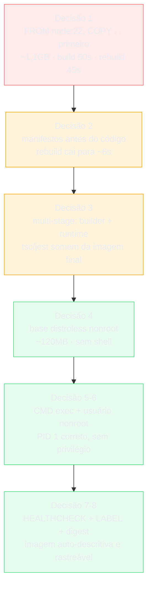

# Capstone: empacotar uma app do zero

> [!abstract] TL;DR
> Esta nota constrói, decisão por decisão, o Dockerfile de uma API real que chega numa empresa sem nenhum artefato de empacotamento — só código, um `package.json` e um passo de build que ninguém automatizou ainda. Cada decisão parte de uma situação concreta, lista as opções de verdade disponíveis, escolhe uma e diz por que, citando a nota do galho que sustenta essa escolha. Ao final, o leitor não vai ter revisto o galho — vai ter visto o galho inteiro sendo aplicado, na ordem em que um profissional sênior de fato o aplicaria, até chegar numa imagem que se defende numa revisão de produção. O que fica de fora — a política de imutabilidade, a promoção entre ambientes, a estratégia de deploy — não é esquecimento: é fronteira deliberada com o domínio de Operação.

## O ponto de partida

A situação é a seguinte: um repositório chamado `resenha-api` chega para revisão. É uma API HTTP em Node.js, escrita em TypeScript, usando Express para as rotas e o driver `pg` para falar com um Postgres. O `package.json` declara duas fases de vida distintas — `devDependencies` com o compilador TypeScript, o `jest` para testes e o `nodemon` para desenvolvimento, e `dependencies` só com o que o processo em produção de fato importa em tempo de execução (`express`, `pg`). Existe um script `build` que roda `tsc` e produz um diretório `dist/` com JavaScript puro, e existe um script `start` que roda `node dist/server.js`. Não existe `Dockerfile`. Não existe `.dockerignore`. Ninguém nunca empacotou essa aplicação, e a tarefa é chegar numa imagem que resista a uma revisão de produção séria — não numa imagem que "funciona na minha máquina".

O critério de sucesso desta nota não é "o container sobe". É a pergunta que qualquer revisor sênior faz ao ler um Dockerfile alheio: por que cada linha está aí, e o que aconteceria se ela não estivesse. É essa pergunta, respondida decisão por decisão, que estrutura o resto do texto.

A árvore de arquivos relevante do repositório, antes de qualquer Dockerfile existir, é a seguinte — deliberadamente comum, sem nada de exótico, porque o ponto desta nota é que o raciocínio se aplica a qualquer stack equivalente, não só a esta:

```
resenha-api/
├── package.json
├── package-lock.json
├── tsconfig.json
├── src/
│   ├── server.ts
│   ├── routes/
│   │   └── resenhas.ts
│   └── db/
│       └── pool.ts
└── test/
    └── resenhas.test.ts
```

O `package.json` declara os dois mundos que qualquer Dockerfile de aplicação compilada precisa separar em algum momento:

```json
{
  "name": "resenha-api",
  "scripts": {
    "build": "tsc",
    "start": "node dist/server.js",
    "dev": "nodemon --exec ts-node src/server.ts",
    "test": "jest"
  },
  "dependencies": {
    "express": "^4.19.0",
    "pg": "^8.12.0"
  },
  "devDependencies": {
    "typescript": "^5.5.0",
    "ts-node": "^10.9.0",
    "nodemon": "^3.1.0",
    "jest": "^29.7.0",
    "@types/express": "^4.17.0",
    "@types/node": "^22.0.0"
  }
}
```

Nada nesse manifesto é incomum. É exatamente essa normalidade que faz o caso valer como exercício: qualquer API Node/TypeScript de porte médio, com um Postgres atrás, tem esse mesmo formato de `package.json`, e o Dockerfile que esta nota constrói serve de modelo para qualquer uma delas — trocando `express`/`pg` pelas dependências reais do projeto em questão.

> [!tip] Vídeo — o mesmo percurso, levado até a máquina remota
> [**Aprenda Docker do zero — tutorial completo com deploy**](https://www.youtube.com/watch?v=DdoncfOdru8) (Fernanda Kipper, ~44 min, **PT-BR**) faz o trajeto deste capstone e continua além dele: escreve o Dockerfile de uma aplicação, constrói a imagem, publica no registry e **roda numa máquina remota**. As duas passagens que mais somam a esta nota estão no fim. A primeira é a construção **multi-arquitetura** — gerar imagem para arquitetura diferente da máquina de desenvolvimento —, que é o problema que aparece assim que a máquina de quem desenvolve e o servidor de destino não têm o mesmo processador. A segunda é uma precisão sobre tag que conversa direto com a Decisão 8: publicar de novo com **a mesma tag sobrescreve a anterior** no registry, e quem já tinha baixado continua com a imagem antiga sob o mesmo nome — o argumento que a nota 02 desenvolve na distinção entre tag e digest. Ela abre com uma analogia boa para quem está começando: a receita que funciona numa cozinha e falha em outra porque o forno e os ingredientes são diferentes.
>
> ⚠️ Duas ressalvas de uso. O exemplo é **Java com Spring Boot** e usa imagem de JDK específica — a estrutura do percurso é agnóstica, os comandos não. E o vídeo tem **segmento patrocinado** no meio (comunidade paga e hospedagem), além de usar um provedor de VPS parceiro na parte de deploy; o conteúdo técnico não depende disso, mas vale saber antes de recomendar a alguém.

## Decisão 1 — a primeira versão que funciona

**Situação.** Ninguém nunca escreveu um Dockerfile para este repositório. A pressão é sair de "zero artefatos de empacotamento" para "existe uma imagem que sobe e responde na porta 3000" o mais rápido possível — e é legítimo que a primeira versão priorize isso acima de qualquer otimização.

**Opções.** Escrever direto a versão "ideal" do Dockerfile, já com multi-stage e base mínima, correndo o risco de gastar tempo depurando dois problemas ao mesmo tempo (o Dockerfile e a aplicação); ou escrever a versão mais óbvia possível, fazê-la funcionar de ponta a ponta primeiro, e só então otimizar com o funcionamento já confirmado como linha de base.

**Decisão.** A segunda opção. A versão ingênua abaixo é exatamente o que qualquer pessoa razoavelmente competente escreveria na primeira tentativa, sem pensar em cache, em tamanho ou em segurança ainda:

```dockerfile
FROM node:22

WORKDIR /app
COPY . .
RUN npm install
RUN npm run build

CMD ["node", "dist/server.js"]
```

**Por quê.** [[03-Dominios/Tecnologia/Infraestrutura/Docker/04 - O Dockerfile como receita de camadas|04 — O Dockerfile como receita de camadas]] estabelece que cada instrução do Dockerfile é uma camada gravada em sequência, e que a receita mais simples de escrever — copiar tudo, instalar tudo, construir tudo — é também a que menos aproveita essa estrutura. Escrevê-la primeiro não é preguiça: é isolar a variável. Se o `npm run build` falhar aqui, o problema é da aplicação, não do Dockerfile; só depois de confirmar que a aplicação builda e roda dentro de um container é que faz sentido otimizar a receita em cima dela.

Medindo esta primeira versão, em ordens de grandeza ilustrativas de um caso típico — os números variam com a stack, a máquina e a rede, e não são uma medição real feita aqui:

| Métrica | Valor aproximado |
|---|---|
| Tamanho da imagem | ~1,1 GB |
| Build limpo (sem cache) | ~50s |
| Rebuild após mudar uma linha de código | ~45s |

O rebuild quase tão lento quanto o build limpo é o primeiro sintoma a investigar, e é exatamente o assunto da próxima decisão.

## Decisão 2 — consertar a ordem

**Situação.** Mudar uma única linha em `src/routes/resenhas.ts` — sem tocar em nenhuma dependência — ainda dispara um `npm install` completo no rebuild, quase tão demorado quanto o build do zero. Para um time que faz esse ciclo dezenas de vezes por dia, esse é o custo que mais dói na prática, muito antes de qualquer preocupação com tamanho de imagem em produção.

**Opções.** Aceitar o custo como "é assim que Docker funciona"; ou investigar por que o cache de camada não está sendo aproveitado entre um rebuild e outro.

**Decisão.** Separar o que muda raramente (os manifestos de dependência) do que muda a cada commit (o código-fonte), copiando cada um em instruções distintas, na ordem certa:

```dockerfile
FROM node:22

WORKDIR /app
COPY package.json package-lock.json ./
RUN npm ci
COPY . .
RUN npm run build

CMD ["node", "dist/server.js"]
```

**Por quê.** [[03-Dominios/Tecnologia/Infraestrutura/Docker/05 - Build e cache — por que seu build está lento|05 — Build e cache]] explica a mecânica exata: o Docker invalida o cache de uma camada e de toda camada seguinte assim que o conteúdo de entrada daquela instrução muda. Com `COPY . .` logo no início, qualquer mudança em qualquer arquivo do repositório — inclusive um `README.md` — invalida a camada de `COPY` e, em cascata, a de `npm install` logo depois, mesmo que nenhuma dependência tenha mudado. Copiar primeiro só `package.json` e `package-lock.json`, rodar `npm ci` (que instala exatamente o que o lockfile especifica, de forma reprodutível) e só depois copiar o resto do código faz o Docker reaproveitar a camada de instalação de dependências sempre que só o código mudar — que é o caso comum, dia a dia.

Vale também um `.dockerignore` que a nota 05 já cobre e que esta aplicação precisa: excluir `node_modules/`, `dist/` e `.git/` do contexto de build enviado ao daemon, para que o `COPY . .` não carregue lixo local que nunca deveria entrar na imagem.

```
node_modules
dist
.git
*.log
.env
```

Medindo de novo, na mesma ordem de grandeza ilustrativa:

| Métrica | Antes (decisão 1) | Depois (decisão 2) |
|---|---|---|
| Build limpo | ~50s | ~50s (sem mudança — primeira vez sempre paga o custo total) |
| Rebuild após mudar código | ~45s | ~6s |

O build limpo não melhora — não tem como, é a primeira vez que tudo precisa ser baixado e construído. O que muda é o caso comum: o rebuild depois de editar uma rota, que é o ciclo que se repete o dia inteiro.

## Decisão 3 — separar build de execução

**Situação.** A imagem ainda carrega, em produção, tudo que o TypeScript e o `npm ci` sem flags trazem: o compilador `tsc`, o `jest`, o `nodemon`, os tipos de desenvolvimento (`@types/*`) — nenhum deles necessário depois que `dist/server.js` já existe como JavaScript puro. E a imagem base `node:22` sozinha já é uma distribuição Debian completa por baixo, com um shell, um gerenciador de pacotes `apt` e ferramentas que a aplicação em produção nunca invoca.

**Opções.** Tentar limpar depois, com um `RUN rm -rf node_modules && npm ci --omit=dev` no fim do mesmo estágio; ou usar um estágio de build separado, cujo resultado final o estágio de runtime só copia.

**Decisão.** Multi-stage: um estágio `builder` com tudo que o `tsc` precisa, e um estágio final que só recebe `dist/` e as dependências de produção:

```dockerfile
FROM node:22 AS builder
WORKDIR /app
COPY package.json package-lock.json ./
RUN npm ci
COPY . .
RUN npm run build

FROM node:22-slim
WORKDIR /app
COPY package.json package-lock.json ./
RUN npm ci --omit=dev
COPY --from=builder /app/dist ./dist
CMD ["node", "dist/server.js"]
```

Vale ainda um refinamento sobre o próprio estágio `builder`, que não muda o resultado final mas acelera o build limpo — o único número que a decisão 2 não conseguiu melhorar. Sob BuildKit, uma instrução `RUN` pode declarar um *cache mount*, um diretório persistido entre builds distintos, fora da imagem, sem nunca virar camada:

```dockerfile
FROM node:22 AS builder
WORKDIR /app
COPY package.json package-lock.json ./
RUN --mount=type=cache,target=/root/.npm npm ci
COPY . .
RUN npm run build
```

O cache de pacotes do `npm` (`~/.npm`) sobrevive entre builds mesmo quando a camada de `npm ci` é invalidada por uma mudança real no lockfile — o download da rede é evitado, só falta reconstruir os `node_modules` locais a partir do cache já presente em disco. Essa é uma otimização ortogonal à ordem de `COPY`: a ordem protege o *rebuild sem mudança de dependência*; o cache mount acelera o *build quando a dependência de fato muda*, inclusive o primeiro build limpo numa máquina de CI que nunca rodou este projeto antes. [[03-Dominios/Tecnologia/Infraestrutura/Docker/10 - BuildKit por dentro|10 — BuildKit por dentro]] é a nota que trata desse mecanismo — e do seu primo, o *secret mount*, que evitaria o erro comum de passar uma credencial de registry privado via `--build-arg` e gravá-la permanentemente numa camada, um risco que esta aplicação em particular não corre, porque nenhuma dependência dela vem de um registry privado.

**Por quê.** [[03-Dominios/Tecnologia/Infraestrutura/Docker/09 - Multi-stage e imagens mínimas|09 — Multi-stage e imagens mínimas]] é explícita sobre o motivo de "limpar depois" não funcionar: uma imagem é uma pilha de camadas imutáveis, e apagar um arquivo numa camada posterior não remove os bytes que uma camada anterior já gravou — só esconde o rastro, sem reduzir o tamanho de fato transferido a cada pull. O único jeito de garantir que o `tsc`, o `jest` e as `devDependencies` nunca cheguem à imagem final é nunca deixá-los atravessar a fronteira de `COPY --from`. Repare que o estágio final roda seu próprio `npm ci --omit=dev`, instalando só as dependências de produção diretamente ali — uma alternativa seria copiar `node_modules` já pronto do builder via `COPY --from`, mas isso arrastaria também as `devDependencies` que o builder instalou, a menos que o builder já tivesse rodado com `--omit=dev` numa etapa própria; instalar de novo no estágio final, com o manifesto certo, é mais simples de raciocinar e evita esse vazamento por acidente.

## Decisão 4 — escolher a base

**Situação.** `node:22-slim` já corta uma fatia grande do tamanho frente a `node:22` completo, mas a escala de bases vai mais fundo — Alpine, distroless, e no limite `scratch`. A pergunta não é "qual é a menor", é qual degrau corresponde ao trade-off que esta aplicação específica pode aceitar.

**Opções, percorridas uma a uma.** `node:22-alpine` reduziria ainda mais o tamanho de base, mas troca glibc por musl — e o driver `pg` desta aplicação é JavaScript puro, sem extensão nativa compilada, então o risco de incompatibilidade binária que costuma pegar quem usa Alpine com dependências nativas simplesmente não se aplica aqui; ainda assim, Alpine mantém um shell e um gerenciador de pacotes (`apk`), que uma imagem de produção rigorosa dispensaria se pudesse. `gcr.io/distroless/nodejs22-debian12` remove esse shell e esse gerenciador de pacotes por completo, mantendo só o runtime Node e as bibliotecas mínimas — o degrau que de fato corresponde a "superfície de ataque mínima" sem exigir binário estaticamente linkado. `scratch` está fora de cogitação: o runtime Node não é um binário estático, ele depende de bibliotecas dinâmicas do sistema, então `scratch` simplesmente não tem onde o Node rodar.

**Decisão.** `gcr.io/distroless/nodejs22-debian12` para o estágio final:

```dockerfile
FROM gcr.io/distroless/nodejs22-debian12
WORKDIR /app
COPY package.json package-lock.json ./
COPY --from=builder /app/node_modules ./node_modules
COPY --from=builder /app/dist ./dist
CMD ["dist/server.js"]
```

**Por quê.** A escala inteira — completa, slim, Alpine, distroless, scratch, com o que cada degrau ganha e o que cada um custa — é o assunto central de [[03-Dominios/Tecnologia/Infraestrutura/Docker/09 - Multi-stage e imagens mínimas|09]]. A decisão aqui aceita conscientemente o custo do degrau distroless, que a nota 09 nomeia sem meio-termo: não há mais `sh` dentro da imagem, então `docker exec -it <container> sh` deixa de ser uma opção para investigar um problema em runtime. Esse custo é adiado — não resolvido — até a decisão 7, e a nota que de fato assume esse problema de frente é [[03-Dominios/Tecnologia/Infraestrutura/Docker/14 - Debugar um container|14 — Debugar um container]]. Repare também que o `CMD` mudou de `["node", "dist/server.js"]` para `["dist/server.js"]` — a imagem distroless de Node já define `ENTRYPOINT` como o próprio binário `node`, então o `CMD` só precisa fornecer os argumentos, não repetir o executável.

## Decisão 5 — o processo

**Situação.** O `CMD` já está em forma de array — `["dist/server.js"]` — desde a decisão anterior, mas vale confirmar por que essa forma é a única aceitável aqui, e o que ela garante sobre quem recebe um `docker stop`.

**Opções.** `CMD node dist/server.js` (forma shell) contra `CMD ["node", "dist/server.js"]` (forma exec).

**Decisão.** Forma exec, que já era a escolhida desde a decisão 3 e permanece assim.

**Por quê.** [[03-Dominios/Tecnologia/Infraestrutura/Docker/08 - ENTRYPOINT, CMD e o container que não morre direito|08 — ENTRYPOINT, CMD e o container que não morre direito]] mostra o motivo exato: a forma shell executa o comando através de `/bin/sh -c "..."`, e é o `sh` — não a aplicação — quem vira o PID 1 e recebe o `SIGTERM` que o `docker stop` envia; o processo Node real fica como filho desse shell, e muitos shells não propagam o sinal automaticamente para os filhos, deixando a aplicação sem chance de encerrar graciosamente até o `SIGKILL` forçado depois do tempo de espera. A forma exec faz o próprio processo da aplicação virar PID 1 diretamente, recebendo o `SIGTERM` sem intermediário — e o runtime Node moderno já trata `SIGTERM` de forma razoável por padrão, encerrando o event loop depois de esvaziar conexões pendentes, desde que o código da aplicação não esteja capturando e ignorando o sinal sem propósito. Vale a ressalva que a nota 08 documenta: como a imagem distroless escolhida na decisão anterior não tem shell, a forma shell nem seria uma opção disponível aqui — outro motivo, além da propagação de sinal, para a forma exec ser a única compatível com essa base.

## Decisão 6 — o usuário

**Situação.** Um Dockerfile que nunca declara `USER` roda como `root` dentro do container por padrão — inclusive esta versão, até aqui. Uma revisão de produção séria pergunta, direto, por que a aplicação precisa desse privilégio.

**Opções.** Deixar como está (root, que é o caminho de menor resistência); ou declarar explicitamente um usuário sem privilégio, aceitando que algo pode quebrar no caminho e precisar de ajuste.

**Decisão.** Não rodar como root — e, felizmente, a imagem distroless de Node já resolve isso por padrão: a variante `nonroot` (implícita na tag usada aqui a partir de uma certa versão, ou explícita via `gcr.io/distroless/nodejs22-debian12:nonroot`) já define o processo para rodar sob um usuário sem privilégios, sem que o Dockerfile precise de uma instrução `USER` própria. Vale deixar isso explícito na receita, para que a intenção não dependa de conhecer o comportamento padrão de uma imagem de terceiros:

```dockerfile
FROM gcr.io/distroless/nodejs22-debian12:nonroot
```

**Por quê.** [[03-Dominios/Tecnologia/Infraestrutura/Docker/13 - Segurança da imagem e do runtime|13 — Segurança da imagem e do runtime]] trata isso como regra, não exceção: um processo rodando como root dentro do container, se comprometido por uma vulnerabilidade da própria aplicação ou de uma dependência, dá ao invasor privilégio total dentro do namespace do container — e, dependendo de configuração de host e de eventuais falhas de isolamento, uma superfície maior do que root não-privilegiado ofereceria. O que costuma quebrar ao tirar o root: qualquer diretório que a aplicação precise escrever (logs locais, um cache em disco, um diretório de upload temporário) precisa ter permissão explícita para o usuário não-root, algo que — nesta aplicação — não se aplica, porque `resenha-api` não escreve nada em disco além dos logs enviados a `stdout`/`stderr`, que não dependem de permissão de arquivo.

## Decisão 7 — healthcheck e metadados

**Situação.** A imagem sobe, mas nada nela declara, de forma consultável, se o processo está de fato saudável, nem quem a construiu, nem a partir de qual commit. E a base escolhida na decisão 4 não tem `curl`, `wget` nem shell — as ferramentas que um `HEALTHCHECK` convencional usaria.

**Opções.** Abrir mão de `HEALTHCHECK` no Dockerfile e empurrar toda verificação de saúde para o orquestrador; ou escrever um healthcheck que não dependa de shell nem de ferramenta externa, usando o próprio runtime Node que já está disponível na imagem.

**Decisão.** Um pequeno script Node (`healthcheck.js`, compilado junto com o resto em `dist/`) que faz uma requisição HTTP interna contra a própria API e sai com código diferente de zero se a resposta não for saudável, invocado por um `HEALTHCHECK` em forma exec — que não precisa de shell, só de um executável:

```dockerfile
HEALTHCHECK --interval=30s --timeout=3s --start-period=5s --retries=3 \
  CMD ["dist/healthcheck.js"]

LABEL org.opencontainers.image.title="resenha-api" \
      org.opencontainers.image.description="API de resenhas — Express + Postgres" \
      org.opencontainers.image.source="https://github.com/exemplo/resenha-api" \
      org.opencontainers.image.licenses="MIT"
```

**Por quê.** A anatomia de uma imagem, coberta em [[03-Dominios/Tecnologia/Infraestrutura/Docker/02 - A anatomia de uma imagem|02 — A anatomia de uma imagem]], já estabelece que uma imagem carrega mais do que camadas de sistema de arquivos — carrega também metadados de configuração, e `LABEL` é exatamente o mecanismo para anexar informação estruturada e consultável (via `docker inspect`) sem que ela ocupe espaço de camada relevante. As chaves `org.opencontainers.image.*` seguem a especificação OCI para metadados de imagem, o que as torna legíveis por qualquer ferramenta compatível, não só pelo Docker. Quanto ao healthcheck: a decisão de usar um script Node em vez de `curl` não é só uma adaptação forçada pela ausência de shell — é uma consequência direta da escolha da decisão 4, e nomeá-la aqui em vez de descobri-la por tentativa e erro é o tipo de antecipação que separa uma revisão de produção madura de uma superficial.

## Decisão 8 — a tag

**Situação.** A imagem está pronta para ir a um registry, e falta decidir como o resto do sistema — o manifesto de deploy, o pipeline de CI, o time que faz o rollback às três da manhã — vai se referir a ela.

**Opções.** Publicar só sob uma tag mutável como `latest` ou `main`, que aponta para "o que quer que tenha sido a última build"; publicar sob uma tag semântica imutável por convenção, como o SHA curto do commit (`resenha-api:a1b2c3d`); ou exigir o digest de conteúdo (`resenha-api@sha256:...`) no ponto de deploy.

**Decisão.** Tag com o SHA do commit para rastreabilidade humana, e digest para qualquer referência que precise de garantia de imutabilidade real — o manifesto de deploy usa o digest, não a tag.

**Por quê.** [[03-Dominios/Tecnologia/Infraestrutura/Docker/12 - Registry|12 — Registry]] é direta sobre o motivo: uma tag é só um ponteiro mutável dentro do registry, e nada impede que alguém — ou um pipeline mal configurado — sobrescreva `resenha-api:latest` para apontar a um conteúdo completamente diferente do que apontava ontem, sem que o número da tag mude. O digest, por ser derivado do hash criptográfico do conteúdo, referencia sempre e exatamente os mesmos bytes — é a diferença entre "peça a versão mais recente, seja lá qual for" e "peça exatamente isto". A prática de tag com SHA do commit mais digest no deploy não é redundância: a tag serve para um humano localizar a imagem certa numa lista; o digest serve para o sistema de deploy nunca rodar, por engano, um conteúdo diferente do que foi de fato testado e aprovado.

## Interlúdio — o mesmo Dockerfile, fora da revisão de produção

Antes da revisão final, vale um desvio deliberado: a imagem construída até aqui não vive só em produção. Ela também precisa servir ao desenvolvimento local do time e ao pipeline de CI que vai construí-la e testá-la antes de qualquer deploy — e essas duas situações usam o mesmo Dockerfile de formas diferentes, sem exigir um segundo arquivo.

**Desenvolvimento local.** Um desenvolvedor rodando `resenha-api` na própria máquina não quer o estágio distroless final — quer o estágio `builder`, com hot reload via `nodemon`, e um Postgres de verdade rodando ao lado, sem instalar Postgres na máquina. Isso é exatamente o que `--target` resolve, apontando para um estágio de desenvolvimento que este Dockerfile ainda não tem, mas que se encaixaria naturalmente entre `builder` e o estágio final — e é exatamente o papel que [[03-Dominios/Tecnologia/Infraestrutura/Docker/11 - Compose como ambiente de desenvolvimento|11 — Compose como ambiente de desenvolvimento]] descreve: orquestrar a API e o Postgres juntos, com um volume nomeado para persistir os dados do banco entre reinicializações, um assunto que [[03-Dominios/Tecnologia/Infraestrutura/Docker/06 - Dados que sobrevivem ao container|06 — Dados que sobrevivem ao container]] trata em profundidade — sem volume, cada `docker compose down` apagaria o banco de desenvolvimento inteiro, porque o sistema de arquivos de um container Postgres é tão efêmero quanto o de qualquer outro.

```yaml
services:
  api:
    build:
      context: .
      target: builder
    command: npm run dev
    ports:
      - "3000:3000"
    depends_on:
      - db
  db:
    image: postgres:16-alpine
    environment:
      POSTGRES_PASSWORD: dev
    volumes:
      - resenha-db-data:/var/lib/postgresql/data

volumes:
  resenha-db-data:
```

O mapeamento `"3000:3000"` publica de fato a porta no host, algo que uma eventual instrução `EXPOSE` no Dockerfile jamais faria sozinha — [[03-Dominios/Tecnologia/Infraestrutura/Docker/07 - Rede no Docker|07 — Rede no Docker]] já resolve essa confusão comum: `EXPOSE` é documentação para quem lê o Dockerfile, não uma instrução de rede efetiva. E `depends_on: db` garante só a ordem de subida dos containers, não que o Postgres já esteja pronto para aceitar conexões — a aplicação ainda precisa de sua própria lógica de retry na conexão inicial, algo que este Dockerfile não resolve e não deveria tentar resolver.

**CI.** O pipeline de integração contínua constrói a mesma imagem, mas com um objetivo diferente do desenvolvimento local: confirmar que o build de produção passa, rodar a suíte de testes contra o código antes de publicar qualquer coisa, e só então empurrar a imagem final para o registry sob a tag do commit definida na decisão 8. [[03-Dominios/Tecnologia/Infraestrutura/Docker/17 - Docker em CI e na máquina de dev|17 — Docker em CI e na máquina de dev]] é a nota que trata da escolha entre *docker-in-docker* e socket montado para esse cenário, e do cache de build entre execuções do pipeline — um cache que, sem cuidado, se perde a cada execução num runner efêmero, anulando boa parte do ganho que a decisão 2 conquistou para o desenvolvedor local.

## Decisão 9 — a revisão final

**Situação.** O Dockerfile está pronto. Antes de aprová-lo, vale reler cada linha como um revisor leria — não perguntando "isso funciona?", mas "o que essa linha custa, e por que ela está aqui?".

A régua aplicada, nota por nota: a ordem de `COPY` protege o cache do caso comum ([[03-Dominios/Tecnologia/Infraestrutura/Docker/05 - Build e cache — por que seu build está lento|05]]); o multi-stage garante que `tsc`, `jest` e `devDependencies` nunca chegam à imagem final ([[03-Dominios/Tecnologia/Infraestrutura/Docker/09 - Multi-stage e imagens mínimas|09]]); a base distroless minimiza superfície de ataque ao custo consciente de shell ([[03-Dominios/Tecnologia/Infraestrutura/Docker/09 - Multi-stage e imagens mínimas|09]] de novo, e [[03-Dominios/Tecnologia/Infraestrutura/Docker/13 - Segurança da imagem e do runtime|13]] para o resto da postura de segurança); o `CMD` em forma exec garante que a aplicação, não um shell, recebe o sinal de encerramento ([[03-Dominios/Tecnologia/Infraestrutura/Docker/08 - ENTRYPOINT, CMD e o container que não morre direito|08]]); o usuário não-root reduz o que um comprometimento da aplicação alcançaria ([[03-Dominios/Tecnologia/Infraestrutura/Docker/13 - Segurança da imagem e do runtime|13]]); o `HEALTHCHECK` e os `LABEL` tornam a imagem consultável sobre sua própria saúde e proveniência ([[03-Dominios/Tecnologia/Infraestrutura/Docker/02 - A anatomia de uma imagem|02]]); e o par tag-mais-digest garante que o que sobe para produção é exatamente o que foi testado, não "o que quer que `latest` aponte hoje" ([[03-Dominios/Tecnologia/Infraestrutura/Docker/12 - Registry|12]]).

Duas ausências deliberadas valem nota, porque um revisor atento perguntaria por elas. Não há `.env` copiado nem segredo embutido em `ARG`/`ENV` — a aplicação recebe credenciais de banco em runtime, via variável de ambiente injetada pelo orquestrador, nunca gravada em camada. E não há `EXPOSE` com efeito prático nenhum além de documentação — a instrução não publica porta nenhuma por si só, quem publica é o `-p` do `docker run` ou o mapeamento equivalente do orquestrador, um ponto que [[03-Dominios/Tecnologia/Infraestrutura/Docker/07 - Rede no Docker|07 — Rede no Docker]] esclarece e que vale não confundir numa revisão.



## O Dockerfile final, comentado

```dockerfile
# syntax=docker/dockerfile:1

# --- Estágio 1: build ---
# Contém o compilador TypeScript, o jest e todas as devDependencies.
# Nunca chega à imagem final — existe só para produzir dist/.
FROM node:22 AS builder
WORKDIR /app

# Manifestos primeiro: só invalida o cache de "npm ci" quando uma
# dependência de fato muda, não a cada edição de código-fonte.
COPY package.json package-lock.json ./
RUN npm ci

# Só agora o código-fonte entra — mudanças aqui não custam reinstalar
# dependências, só reconstruir o que de fato mudou.
COPY . .
RUN npm run build

# --- Estágio 2: runtime ---
# Distroless: sem shell, sem gerenciador de pacotes, roda nonroot
# por padrão. Único runtime disponível é o próprio "node".
FROM gcr.io/distroless/nodejs22-debian12:nonroot
WORKDIR /app

# Dependências de produção resolvidas de novo aqui, com o manifesto
# certo — evita herdar devDependencies do estágio builder.
COPY package.json package-lock.json ./
COPY --from=builder /app/node_modules ./node_modules
COPY --from=builder /app/dist ./dist

# Forma exec: o processo Node vira PID 1 diretamente, recebe SIGTERM
# sem um shell intermediário engolindo o sinal.
# A imagem distroless já define ENTRYPOINT=["node"] — CMD só passa o argumento.
CMD ["dist/server.js"]

# Sem curl/shell disponíveis: healthcheck é um script Node próprio.
HEALTHCHECK --interval=30s --timeout=3s --start-period=5s --retries=3 \
  CMD ["dist/healthcheck.js"]

# Metadados OCI — consultáveis via "docker inspect", não custam camada relevante.
LABEL org.opencontainers.image.title="resenha-api" \
      org.opencontainers.image.description="API de resenhas — Express + Postgres" \
      org.opencontainers.image.source="https://github.com/exemplo/resenha-api" \
      org.opencontainers.image.licenses="MIT"
```

Publicando com tag rastreável e reforçando o digest no ponto de deploy:

```bash
docker build -t registry.exemplo.com/resenha-api:a1b2c3d .
docker push registry.exemplo.com/resenha-api:a1b2c3d

# O manifesto de deploy referencia o digest, não a tag —
# imutabilidade real, não convenção de nomenclatura.
docker inspect --format='{{index .RepoDigests 0}}' registry.exemplo.com/resenha-api:a1b2c3d
```

## Confirmando o resultado, não assumindo

Depois de escrever a versão final, a disciplina que separa uma revisão séria de uma otimista é confirmar empiricamente o que se espera que tenha mudado, em vez de assumir que mudou só porque o Dockerfile parece certo. `docker images` confirma o tamanho final publicado; `docker history` confirma que nenhuma camada do estágio `builder` — nenhum `tsc`, nenhum `jest`, nenhuma `devDependency` — aparece na lista de camadas que de fato compõem a imagem final, exatamente o mesmo tipo de verificação que [[03-Dominios/Tecnologia/Infraestrutura/Docker/09 - Multi-stage e imagens mínimas|09]] recomenda depois de qualquer multi-stage novo:

```bash
$ docker images resenha-api
REPOSITORY    TAG       IMAGE ID       SIZE
resenha-api   a1b2c3d   f7a1b2c3d4e5   118MB

$ docker history resenha-api:a1b2c3d
IMAGE          CREATED BY                            SIZE
f7a1b2c3d4e5   CMD ["dist/server.js"]                0B
<missing>      COPY --from=builder /app/dist ...    2.1MB
<missing>      COPY --from=builder /app/node_mod... 8.4MB
<missing>      RUN npm ci --omit=dev                 6.7MB
```

Nenhuma linha menciona `tsc` ou `jest` — porque essas ferramentas nunca saíram do estágio `builder`. Vale também rodar um scanner de vulnerabilidade (`docker scout`, `trivy` ou equivalente) contra a imagem final antes de aprová-la — [[03-Dominios/Tecnologia/Infraestrutura/Docker/13 - Segurança da imagem e do runtime|13 — Segurança da imagem e do runtime]] trata esse hábito como parte da rotina, não como verificação excepcional, e o ganho esperado aqui é concreto: uma base distroless nonroot, sem gerenciador de pacotes de sistema e sem centenas de pacotes Debian não usados, tende a reportar uma fração pequena das CVEs que a mesma aplicação reportaria rodando sobre `node:22` completo — não porque a aplicação em si mudou, mas porque o que a acompanha na imagem mudou.

E, por fim, o `HEALTHCHECK` da decisão 7 merece uma verificação manual antes de confiar nele em produção — rodar o container localmente e observar o campo `Health` de `docker inspect` transitar de `starting` para `healthy` dentro da janela de `--start-period` configurada, confirmando que o script `dist/healthcheck.js` de fato consegue alcançar a própria API por dentro do container, sem depender de nenhuma ferramenta que a base distroless não tem.

## Antes e depois, de ponta a ponta

Ordens de grandeza ilustrativas de um caso típico — variam com stack, dependências e máquina; não é medição real feita sobre este repositório específico.

| Métrica | Decisão 1 (ingênua) | Decisão 3 (multi-stage + slim) | Decisão 4 (distroless final) |
|---|---|---|---|
| Tamanho da imagem | ~1,1 GB | ~180 MB | ~120 MB |
| Build limpo (sem cache) | ~50s | ~55s | ~55s |
| Rebuild após mudar uma linha de código | ~45s | ~6s | ~6s |
| Shell disponível | Sim | Sim (`node:22-slim`) | Não |
| Usuário do processo | root | root (até a decisão 6) | nonroot (por padrão da base) |

O build limpo não melhora com multi-stage — na verdade tende a custar um pouco mais, porque agora há dois `npm ci` (um por estágio) em vez de um só. O que multi-stage compra não é velocidade de build, é o que sobrevive até a imagem final: o tamanho cai de ~1,1GB para a faixa de 120–180MB porque o compilador, os testes e as `devDependencies` simplesmente nunca atravessam a fronteira de `COPY --from`.

## O que fica de fora e mora em Operação

Este Dockerfile é uma imagem correta. Não é, por si só, uma disciplina de produção — essa disciplina vive em outra casa do vault, e nomeá-la aqui é fechar o galho com honestidade sobre onde ele termina:

- **Política de imutabilidade como regra de organização**, não só como propriedade técnica de uma tag — exigir digest em manifestos, proibir `latest` em produção por convenção de time, não só por capacidade técnica do Docker.
- **Promoção entre ambientes** — a mesma imagem, testada em staging, é o artefato que sobe para produção, sem rebuild no meio do caminho; rebuildar entre ambientes reabre a pergunta "isso é mesmo a mesma imagem?".
- **Estratégia de implantação** — rolling update, blue-green, canary: como a troca de uma versão pela outra acontece sem downtime, o que este galho nunca cobriu porque pertence ao orquestrador, não à imagem.
- **Observabilidade de operação** — o que o `HEALTHCHECK` desta nota faz para o Docker isoladamente é uma fração pequena do que um sistema de observabilidade de produção cobra: métricas, tracing distribuído, agregação de logs.

Essas quatro frentes são o assunto de [[03-Dominios/Engenharia/Operação/3 - Rodar em produção/01 - Containers em produção|Containers em produção]] e de [[03-Dominios/Engenharia/Operação/2 - Entrega e release/02 - Deployment strategies|Deployment strategies]] — a imagem construída aqui é exatamente o artefato que essas duas notas assumem já pronto quando começam a falar de disciplina de produção.

## A régua em uma página

Este é o único trecho desta nota que pode parecer resumo — e é proposital: não é o corpo do capstone, é o fecho, o checklist que sobra depois que o caso concreto já foi trabalhado ponto a ponto. Serve para revisar qualquer Dockerfile, não só o desta nota.

- **Cache.** Os manifestos de dependência (`package.json`/lockfile, `pom.xml`, `go.mod`) são copiados antes do código-fonte? Existe `.dockerignore` excluindo `node_modules`, `.git`, artefatos de build locais?
- **Fronteira de build.** Existe separação clara entre o que constrói (compilador, toolchain, dependências de desenvolvimento) e o que roda? Nenhuma ferramenta de build sobrevive ao `COPY --from` até a imagem final?
- **Base.** A imagem base do estágio final foi escolhida por um trade-off explícito — tamanho, superfície de ataque, compatibilidade de dependência nativa — e não por reflexo de "a menor possível"?
- **Processo.** O `CMD`/`ENTRYPOINT` está em forma exec? O processo da aplicação é PID 1, ou existe um shell/wrapper engolindo sinais no meio do caminho?
- **Usuário.** A imagem roda como não-root, por declaração explícita ou porque a base já garante isso por padrão? O que quebraria ao tirar o root já foi testado?
- **Observabilidade da imagem.** Existe `HEALTHCHECK` funcional dado o que a base oferece (com ou sem shell)? Existem `LABEL` com metadados mínimos de proveniência?
- **Segredo.** Nenhuma credencial, token ou chave privada está gravada em `ARG`, `ENV` ou em qualquer camada — segredos entram em runtime, nunca em build?
- **Referência.** O ponto de deploy referencia um digest, não uma tag mutável como `latest`? A tag usada para rastreamento humano identifica um commit ou uma versão específica?
- **Medição, não suposição.** O tamanho final e o comportamento em runtime foram de fato verificados com `docker images`/`docker history`/teste de fumaça, não só assumidos porque o build passou sem erro?

## Armadilhas comuns

> [!warning] Confundir "funciona" com "revisado"
> A decisão 1 desta nota faz a aplicação subir e responder — e é tentador parar ali, porque tecnicamente "está pronto". Acontece porque o critério mais fácil de verificar (o container sobe) não é o critério que importa numa revisão séria (o que essa imagem custa e o que ela expõe). Evite tratando "sobe e responde" como o ponto de partida da revisão, nunca como o fim dela.

> [!warning] Aplicar multi-stage e base mínima sem medir antes e depois
> Trocar `node:22` por uma base distroless sem confirmar, com `docker images` e um teste de fumaça real, que a aplicação ainda sobe e responde do mesmo jeito, arrisca descobrir em produção que faltava alguma dependência de sistema que a imagem completa fornecia de graça. Acontece porque o build passa sem erro mesmo quando algo em runtime quebra — build bem-sucedido não é sinônimo de comportamento correto. Evite medindo e testando a cada degrau da escala de bases, não só no final.

> [!warning] Esquecer que distroless muda como se debuga, não só o tamanho
> Adotar a base distroless da decisão 4 sem avisar o time que `docker exec -it ... sh` deixou de funcionar produz surpresa desagradável exatamente no pior momento — o meio de um incidente em produção. Acontece porque a ausência de shell só se torna um problema visível quando alguém já precisa investigar algo, não durante o desenvolvimento tranquilo. Evite decidindo, junto com a escolha da base, também o plano de debug alternativo — a nota 14 do galho existe exatamente para isso.

> [!warning] Publicar sob `latest` e chamar isso de "está em produção"
> Empurrar `resenha-api:latest` para o registry e apontar o manifesto de deploy para essa mesma tag parece suficiente, mas não garante que o que roda amanhã seja o mesmo conteúdo que rodou hoje — qualquer push seguinte para `latest` muda o alvo silenciosamente. Acontece porque tag e conteúdo parecem a mesma coisa até o dia em que alguém sobrescreve a tag por engano ou por pressa. Evite fixando o deploy no digest, não na tag mutável.

> [!warning] Tratar a régua como formulário a preencher, não como pergunta a responder
> Percorrer o checklist da seção anterior marcando cada item como "ok" sem de fato reler a linha correspondente do Dockerfile e justificar por que ela está ali reduz a revisão a uma formalidade — exatamente o oposto do que o checklist deveria provocar. Acontece porque um checklist convida à resposta automática, "sim, tem HEALTHCHECK", sem perguntar se aquele HEALTHCHECK específico de fato detecta a falha que importa. Evite usando a régua como gatilho de pergunta aberta a cada item, não como lista de caixas a marcar.

## Como explicar em inglês

*"When I package an application from scratch, I always start with the naive Dockerfile that just works end to end — copy everything, install, build — before optimizing anything, because that isolates whether a failure is in the app or in the packaging. From there it's a sequence of deliberate trade-offs, not a checklist: reorder the COPY instructions so the dependency cache actually survives day-to-day code changes, split the build tools from the runtime with a multi-stage build so the compiler and dev dependencies never reach the final image, and pick a base image that matches what this specific app can afford to give up — here, distroless, since there's no native dependency at risk and the attack surface reduction is worth losing the shell. The exec-form CMD makes sure the process itself is PID 1 and actually receives SIGTERM, the image runs as a non-root user by default, and the healthcheck has to be a small Node script instead of curl, because there's no shell to run curl with. None of that is a checklist I run through blindly — each choice is a trade-off I can defend, and I can tell you exactly what it costs."*

| PT-BR | EN | Nuance de uso |
|---|---|---|
| revisão de produção | production review / production readiness review | "Readiness review" é o termo mais formal em processos de release; "production review" é aceitável em conversa técnica direta |
| a imagem que se defende | the image I'd stand behind / defend in review | Evitar tradução literal "the image that defends itself" — soa estranho em inglês; a ideia é "eu defenderia essa escolha" |
| caso trabalhado | worked example | Termo padrão em material didático técnico em inglês |
| custo escondido | hidden cost | Direto, sem ambiguidade |
| encerramento gracioso | graceful shutdown | Termo técnico fixo, não varia |
| imagem auto-descritiva | self-describing image | Usado ao falar de LABEL/metadados OCI |
| rastreável | traceable | Aplica tanto a tag-por-commit quanto a logs/observabilidade |
| ordem de grandeza | order of magnitude | Usar quando se fala de números ilustrativos, não medições exatas |
| checklist de revisão | review checklist | Termo neutro; evitar "review list", que soa como lista de tarefas genérica, não de critérios técnicos |

## O que vem a seguir

Este capstone fecha o galho Docker: das 18 notas, a lente "a imagem como artefato" percorreu o modelo, a construção deliberada e o mecanismo por dentro, e chegou aqui numa imagem única, decidida ponto a ponto, que uma revisão de produção aprovaria. O que este galho nunca prometeu cobrir — e não cobre agora — é o que acontece quando não é mais uma imagem, é uma frota delas: como manter várias réplicas saudáveis, substituir uma imagem por outra sem downtime, distribuir tráfego entre containers, e reagir automaticamente quando um deles falha. Essa é a disciplina de orquestração, e ela é honestamente o próximo galho do domínio [[03-Dominios/Tecnologia/Infraestrutura/index|Infraestrutura]] — um galho sobre Kubernetes que ainda não existe neste vault, e que este capstone deixa como fronteira nomeada, não como lacuna escondida. Enquanto esse galho não é escrito, a disciplina de rodar containers com seriedade em produção — sem orquestrador dedicado ou com um já em uso — continua em [[03-Dominios/Engenharia/Operação/index|Engenharia/Operação]], que este galho já citou repetidamente como a casa vizinha que assume, desde a primeira linha, que quem chega ali já sabe escrever o Dockerfile que esta nota acabou de construir.

Vale fechar com o que este exercício deveria ter deixado como hábito, mais do que como receita: a régua da seção anterior se aplica igualmente bem a uma API em Go, em Python ou em Java, trocando `npm ci` por `go mod download`, `pip install` ou `mvn package`, e trocando a base distroless de Node pela variante equivalente de cada linguagem — o raciocínio de separar build de runtime, escolher a base pelo trade-off certo, garantir PID 1 correto e usuário sem privilégio não depende da stack específica usada aqui.

## Fontes

- Docker Docs — Multi-stage builds: https://docs.docker.com/build/building/multi-stage/
- Docker Docs — Dockerfile reference: https://docs.docker.com/reference/dockerfile/
- Docker Docs — HEALTHCHECK: https://docs.docker.com/reference/dockerfile/#healthcheck
- Docker Docs — Building best practices: https://docs.docker.com/build/building/best-practices/
- Google — Distroless container images: https://github.com/GoogleContainerTools/distroless
- OCI — Image Format Specification, annotations: https://github.com/opencontainers/image-spec/blob/main/annotations.md
- Node.js Docker Official Images: https://hub.docker.com/_/node
- Docker Docs — Digests e imutabilidade de imagem: https://docs.docker.com/reference/cli/docker/image/pull/#pull-an-image-by-digest-immutable-identifier
