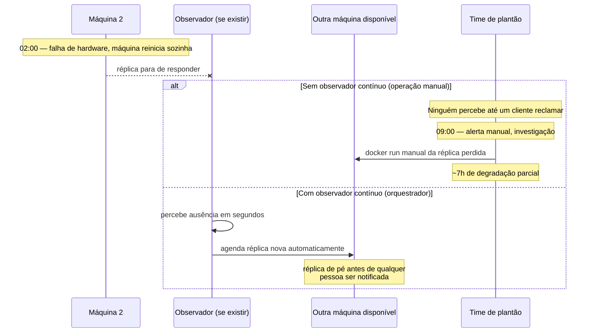
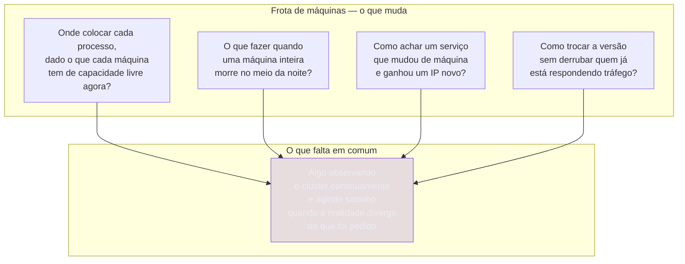
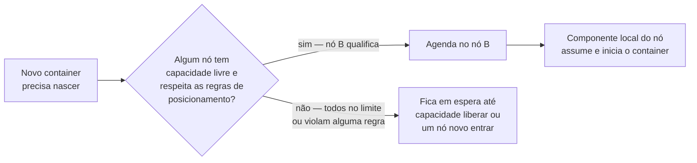
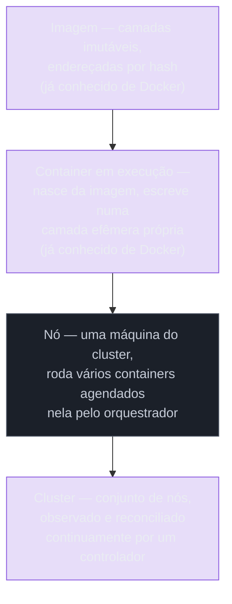

# O problema que orquestração resolve

> [!abstract] TL;DR
> Compose resolve muito bem o problema de "uma máquina, vários containers, um comando". O problema aparece quando a unidade de operação deixa de ser uma máquina e passa a ser uma frota: agora existe a pergunta de em qual das N máquinas cada processo deve rodar, o que fazer quando uma máquina inteira morre no meio da noite, como um serviço acha outro que acabou de nascer com um IP novo, e como trocar a versão de algo que não pode parar de responder enquanto troca. Nenhuma dessas perguntas tem uma resposta boa no nível de "rodar um comando uma vez"; todas exigem alguma coisa observando o cluster o tempo inteiro e agindo sozinha quando a realidade diverge do que foi pedido. Essa "alguma coisa" é o que se chama, genericamente, de orquestrador — e o Kubernetes é, hoje, a implementação dominante dessa ideia. Esta nota fica só no problema; o mecanismo que o Kubernetes usa para resolvê-lo é assunto da próxima.

Considere uma equipe que já fez a lição de casa. A aplicação está containerizada, o `compose.yaml` sobe API, banco e cache com um comando só, e o time inteiro usa exatamente o mesmo ambiente, sem o velho ritual de "instala isso, depois aquilo, depois reza". Um dia o produto cresce, o tráfego cresce junto, e uma única máquina rodando `docker compose up` deixa de dar conta. A resposta óbvia é comprar (ou alugar) uma segunda máquina. E é exatamente aí, no momento de ter duas máquinas em vez de uma, que um conjunto de perguntas que nunca precisou ser respondido antes vira urgente.

## Onde colocar o processo, quando existem várias máquinas

Com uma máquina só, a pergunta "onde esse container roda" nunca existiu — só havia um lugar possível. Com duas, três, ou vinte máquinas, cada uma com sua própria CPU livre, sua própria memória livre, seus próprios containers já rodando nela, a pergunta passa a ter uma resposta não trivial. Colocar mais um container numa máquina que já está no limite de memória derruba tudo que já roda ali; deixar uma máquina ociosa enquanto outra sufoca é desperdiçar capacidade que já foi paga. Alguém — ou alguma coisa — precisa decidir, container por container, em qual das máquinas disponíveis ele deve nascer, levando em conta o que cada máquina tem de sobra naquele instante específico, não numa foto tirada há uma semana.

Fazer essa conta manualmente funciona por um tempo curto, enquanto o número de máquinas e de containers é pequeno o suficiente para caber na cabeça de uma pessoa. O problema deixa de ser gerenciável rápido: dez serviços, cada um com múltiplas réplicas, espalhados por uma dúzia de máquinas com perfis de capacidade diferentes, é uma combinatória que ninguém resolve de cabeça de forma confiável, e muito menos de forma consistente entre um deploy e o seguinte. O que falta não é mais capacidade de cálculo humano — é um componente que faça essa conta de posicionamento automaticamente, toda vez que algo novo precisa nascer em algum lugar do conjunto de máquinas.

Vale ver o tamanho real do problema com números pequenos e concretos, porque a intuição de "dá pra decidir isso na mão" costuma sobreviver só até o segundo exemplo. Considere três máquinas com capacidades diferentes e cinco serviços que precisam de uma réplica cada, com necessidades de memória também diferentes:

| Máquina | Memória livre | Serviço a agendar | Memória necessária |
|---|---|---|---|
| Máquina A | 4 GB livres | `api` | 1.5 GB |
| Máquina B | 2 GB livres | `worker` | 1 GB |
| Máquina C | 6 GB livres | `search` | 3 GB |
| — | — | `cache` | 0.5 GB |
| — | — | `report-gen` | 2 GB |

Decidir "à mão" onde cada um dos cinco serviços deve nascer, de forma a não estourar a memória de nenhuma máquina e ainda deixar folga para o próximo deploy, já exige tentativa e erro mesmo com só três máquinas e cinco serviços — e essa tabela nem inclui CPU, nem preferências de "estes dois serviços não devem ficar na mesma máquina" (para não perder os dois numa única falha), nem o fato de que essa tabela inteira fica desatualizada no instante seguinte, quando qualquer réplica nasce, morre ou é redimensionada em qualquer lugar do cluster. Um agendador de software resolve esse tipo de conta continuamente, a cada mudança, sem nunca precisar de uma pessoa olhando uma planilha.

Vale acrescentar uma camada de realismo: as máquinas de uma frota raramente são todas idênticas entre si. É comum misturar nós comprados ou alugados em momentos diferentes, com gerações de CPU diferentes; nós com armazenamento local rápido ao lado de nós sem ele; ocasionalmente, nós equipados com GPU dedicados a uma carga de trabalho específica, ao lado de dezenas de nós genéricos que jamais precisariam de uma GPU ociosa custando dinheiro sem uso. Decidir manualmente "este serviço específico só pode nascer nos dois nós que têm GPU, e nunca nos outros dezoito" é uma regra fácil de esquecer de aplicar na correria de um deploy às pressas — e esquecê-la significa, na melhor das hipóteses, um erro de agendamento perceptível na hora, e na pior, um serviço que sobe silenciosamente num nó errado e falha de um jeito difícil de diagnosticar depois.

O problema, além disso, raramente é só "caber em bytes de memória disponível". Existem preferências de posicionamento que uma pessoa até consegue enunciar em palavras — "as réplicas deste serviço não devem ficar todas na mesma máquina física, senão perco todas numa falha só", "este processo intensivo em disco deveria preferir os nós com armazenamento local rápido", "esta carga de trabalho não deveria dividir máquina com aquela outra, porque as duas competem pelo mesmo recurso de rede" — mas que se tornam tediosas e sujeitas a erro de aplicar manualmente a cada novo deploy, em cada máquina, sempre que alguma coisa muda. O nome técnico para esse tipo de regra — afinidade e anti-afinidade entre cargas de trabalho, restrições ligadas a características específicas de um nó — pertence à mecânica de agendamento que este galho aprofunda mais adiante; o que importa fixar aqui é que a pergunta "onde colocar o processo" não é só sobre número puro de bytes livres, é também sobre política de posicionamento, e ambas precisam ser resolvidas pelo mesmo componente, de forma consistente, toda vez.

## O que acontece quando um nó morre

Uma máquina única tem uma vulnerabilidade que é fácil de esquecer justamente porque, no dia a dia, ela raramente se manifesta: se aquela máquina cai — falha de hardware, uma atualização de kernel que não volta limpa, uma instância de nuvem que o provedor decide recolocar em outro host físico — tudo que rodava nela para junto, ao mesmo tempo, sem exceção. `docker compose up` não tem resposta nenhuma para esse cenário, porque o `compose.yaml` inteiro pressupõe que aquela máquina específica continua existindo; não há conceito de "esse serviço pode renascer em outro lugar" embutido na ferramenta.

Com várias máquinas no jogo, a pergunta muda de figura, mas só fica mais interessante se alguém — ou alguma coisa — estiver de fato observando. Ter uma segunda e uma terceira máquina disponíveis não ajuda em nada, sozinho, se nada percebe que a primeira caiu e nada decide recriar, numa das máquinas sobreviventes, exatamente o que se perdeu. Sem esse observador contínuo, uma frota de dez máquinas se comporta, na prática, como dez máquinas isoladas rodando isoladamente seus próprios pedaços — cada queda é um incidente que alguém precisa notar, entender e corrigir manualmente, no meio da madrugada, correndo contra o tempo em que o serviço fica fora do ar. O que essa lacuna pede não é redundância de hardware — isso a nuvem ou um datacenter bem planejado já oferece — é um componente de software que trate "um lugar onde algo rodava sumiu" como um evento de rotina a ser corrigido automaticamente, não como uma emergência que exige uma pessoa acordada.

O diagrama abaixo contrasta as duas linhas do tempo do mesmo incidente — a máquina 2 caindo às 2h da manhã de sábado — dependendo de existir, ou não, algo observando o cluster continuamente.



## Como achar o serviço que mudou de endereço

Numa máquina só, com Compose, o problema de descoberta de serviço já tinha uma solução elegante: o DNS interno do Docker resolve o nome do serviço (`db`, `cache`) para o IP do container correspondente, e isso continua funcionando mesmo que o container seja recriado e ganhe um IP novo, porque a resolução de nome acontece de novo a cada consulta. O detalhe importante, fácil de não perceber até faltar, é que essa resolução tem escopo de uma rede local a um único host — ela nunca precisou responder à pergunta "onde está o serviço X, sabendo que ele pode estar rodando em qualquer uma de vinte máquinas diferentes, e pode ter acabado de se mover de uma para outra".

Esse é exatamente o problema que aparece quando a frota cresce. Um processo em execução na máquina A precisa falar com um serviço que pode estar rodando na máquina B hoje e na máquina C amanhã — porque foi reagendado depois de uma falha, ou porque uma atualização o recriou em outro lugar por decisão do agendador. Cada réplica desse serviço tem seu próprio IP, atribuído dinamicamente, que muda toda vez que a réplica nasce de novo. Gravar um IP fixo em algum arquivo de configuração — a solução ingênua, tentadora quando o número de máquinas ainda é pequeno — quebra na primeira vez que alguma coisa se move, e coisas se movem o tempo todo numa frota que se autocorrige. O que falta não é DNS — é um DNS (ou mecanismo equivalente) com visão de cluster inteiro, atualizado automaticamente a cada mudança de posição, e um endereço estável na frente de um conjunto de réplicas que individualmente vêm e vão.

A tentação de resolver isso com um arquivo de inventário mantido à mão aparece cedo, porque parece bastar por um bom tempo:

```text
# inventario.txt — mantido manualmente, atualizado "quando alguém lembra"
api-1     10.0.1.14:8080
api-2     10.0.1.22:8080
worker-1  10.0.2.31:9000
db        10.0.3.10:5432
```

O problema desse arquivo não é a sintaxe, é o ciclo de vida: no instante em que `api-2` é reagendada para outra máquina depois de uma falha, ela recebe um IP novo, e esse arquivo passa a mentir até que alguém — de novo, uma pessoa, de novo, manualmente — perceba a divergência e corrija a linha. Cada entrada nesse arquivo é uma promessa que só se mantém verdadeira enquanto nada muda; e numa frota que se autocorrige, alguma coisa está sempre mudando.

## Como atualizar sem derrubar o que já está de pé

O quarto problema é o que mais dói na prática, porque acontece toda vez que alguém publica uma versão nova — não só nas exceções raras de nó caindo. Com Compose, atualizar a imagem de um serviço e rodar `docker compose up` de novo tem um comportamento simples e brutal: para o container antigo, sobe o novo, ponto. Para uma aplicação de uso interno, um instante de indisponibilidade durante um deploy costuma ser tolerável. Para um serviço que precisa responder o tempo todo — um checkout, uma API pública, qualquer coisa com usuários reais esperando resposta no outro lado — esse instante de "para o antigo antes de o novo estar pronto" é, na prática, uma interrupção visível, ainda que curta.

O problema fica mais sério quando a versão nova tem um bug que só aparece sob carga real, algo que nenhum teste local pegou. Com o padrão "para o antigo, sobe o novo", não existe rede de segurança: se a versão nova está quebrada, ela substitui completamente a versão que funcionava, e a única saída é alguém perceber o problema, editar a configuração de volta manualmente e rodar o comando de novo — enquanto isso, o serviço já está fora do ar ou respondendo errado para quem estiver usando. O que esse cenário pede é uma forma de subir a versão nova ao lado da antiga, direcionar tráfego aos poucos, verificar continuamente se a nova versão está de fato saudável, e reverter automaticamente para a versão anterior se não estiver — sem que uma pessoa precise estar olhando o painel de monitoramento no exato segundo em que o deploy sai do ar.

O nome genérico para essa família de técnicas — trocar tráfego gradualmente entre versão antiga e nova, com verificação e reversão — é bem conhecido fora do contexto de Kubernetes: rolling update, blue-green, canary, cada uma com um perfil diferente de risco e de velocidade. O catálogo dessas estratégias, com seus custos e trade-offs específicos, já está descrito em [[03-Dominios/Engenharia/Operação/2 - Entrega e release/02 - Deployment strategies|Deployment strategies]], e o objetivo concreto de "zero interrupção perceptível durante a troca" tem uma nota própria em [[03-Dominios/Engenharia/Operação/3 - Rodar em produção/03 - Zero-downtime e alta disponibilidade|Zero-downtime e alta disponibilidade]]. O que importa fixar aqui, antes de chegar a esse território, é só a pergunta que motiva as duas: como automatizar a decisão de "a versão nova está boa o suficiente para continuar" sem depender de uma pessoa julgando isso em tempo real.

## As quatro perguntas, lado a lado

O diagrama abaixo resume as quatro lacunas que aparecem, todas de uma vez, no momento em que uma aplicação para de caber numa máquina só — e por que nenhuma delas tem solução dentro do modelo "aplicar uma vez, numa máquina, e ir embora" que caracteriza o Compose.



É útil nomear, mesmo sem sintaxe real ainda, o formato de intenção que está faltando — não um comando a mais para rodar, mas uma declaração de resultado desejado que alguma coisa se responsabilize por manter verdadeira:

```yaml
# pseudo-declaração conceitual — não é sintaxe real de Kubernetes,
# serve só para nomear a intenção que falta expressar hoje
desejado:
  servico: minha-api
  replicas: 3
  distribuir_entre: qualquer-no-com-capacidade-disponivel
  ao_cair_um_no: reagendar-automaticamente-em-outro-no
  ao_atualizar_versao: trocar-gradualmente-com-verificacao-de-saude
  ao_reverter: automatico-se-a-verificacao-falhar
```

Nenhuma das seis linhas acima corresponde a um comando imperativo do tipo "faça X agora". Cada uma descreve uma condição que deveria continuar verdadeira ao longo do tempo, independentemente do que aconteça — e é justamente esse deslocamento, de "comando único" para "condição sustentada", que caracteriza toda a família de ferramentas de orquestração, não só o Kubernetes especificamente. A sintaxe real que o Kubernetes usa para expressar essa mesma intenção — os objetos Pod e Deployment — é assunto das próximas duas notas do galho.

Vale notar a estrutura comum por trás das quatro perguntas, porque é ela — não a lista em si — que importa reter. Nenhuma pergunta é "como faço X uma vez". Todas são variações de "como o sistema continua correto quando algo muda depois que eu já apliquei minha intenção" — um nó cai depois, uma réplica se move depois, uma versão nova precisa substituir a antiga sem interromper nada no meio do caminho. É esse padrão — observar continuamente, agir sozinho quando diverge — que a próxima nota, [[03-Dominios/Tecnologia/Infraestrutura/Kubernetes/02 - O loop de reconciliação|O loop de reconciliação]], nomeia e desenvolve como mecanismo único.

## Um cenário concreto, do jeito que dói na prática

Vale tornar isso tangível com uma sequência de eventos plausível, do tipo que motivou a indústria inteira a convergir para uma resposta comum. Uma equipe roda `minha-api` em três máquinas, uma réplica por máquina, cada uma subida manualmente com `docker run` e uma lista de IPs fixos apontando para o banco e para as outras réplicas, distribuída à mão num arquivo de configuração de um balanceador de carga externo. O procedimento de subida, documentado num script que qualquer pessoa do time roda via SSH em cada máquina, se parece com isto:

```bash
# deploy-manual.sh — roda uma vez em cada uma das três máquinas, via SSH
ssh maquina-1 "docker pull registro.exemplo.com/minha-api:v42 && \
  docker stop minha-api || true && \
  docker run -d --name minha-api --restart unless-stopped \
    -p 8080:8080 registro.exemplo.com/minha-api:v42"

ssh maquina-2 "docker pull registro.exemplo.com/minha-api:v42 && \
  docker stop minha-api || true && \
  docker run -d --name minha-api --restart unless-stopped \
    -p 8080:8080 registro.exemplo.com/minha-api:v42"

ssh maquina-3 "docker pull registro.exemplo.com/minha-api:v42 && \
  docker stop minha-api || true && \
  docker run -d --name minha-api --restart unless-stopped \
    -p 8080:8080 registro.exemplo.com/minha-api:v42"
```

Repare que `--restart unless-stopped` cobre um caso — o processo dentro do container travar e o Docker local reiniciá-lo na mesma máquina — mas não cobre nenhum dos quatro problemas descritos nas seções anteriores: se a máquina inteira cai, não há container nenhum para reiniciar; se uma réplica precisa nascer numa quarta máquina, o script precisa ser editado e rodado à mão; se a atualização para `v43` tiver um bug, o script já sobrescreveu as três réplicas antes de qualquer verificação de saúde acontecer.

Numa sexta-feira à noite, a máquina 2 tem uma falha de hardware e reinicia sozinha, sem nenhum aviso prévio. A réplica que rodava nela simplesmente para de existir; ninguém no time percebe até que um cliente reclama, no sábado de manhã, que uma em cada três requisições está falhando — exatamente a proporção que corresponde à réplica que sumiu, ainda listada no balanceador como se estivesse de pé. Alguém entra remotamente, percebe o óbvio, sobe manualmente um `docker run` equivalente numa quarta máquina disponível, e edita à mão o arquivo de configuração do balanceador de carga que decide para onde o tráfego vai:

```nginx
# upstream.conf — mantido manualmente, editado durante o incidente
upstream minha_api {
    server 10.0.1.10:8080;  # maquina-1, sobrevivente
    # server 10.0.1.11:8080;  # maquina-2 — comentada às 10:12, estava morta
    server 10.0.1.13:8080;  # nova réplica, subida manualmente às 10:05
    server 10.0.1.12:8080;  # maquina-3, sobrevivente
}
```

Recarregar essa configuração ainda exige um comando adicional (`nginx -s reload` ou equivalente) rodado manualmente, mais um passo na cadeia de ações humanas necessárias antes do serviço voltar a distribuir tráfego corretamente entre as réplicas de fato saudáveis. O incidente se encerra — depois de mais de doze horas de degradação parcial que ninguém automatizado tinha detectado ou corrigido.

A linha do tempo desse primeiro incidente, reconstituída depois, mostra com clareza onde o tempo foi gasto e por quê:

| Horário | Evento |
|---|---|
| 02:14 | Máquina 2 falha e reinicia; réplica ali deixa de responder |
| 02:14 – 09:02 | Nenhum alerta dispara; ninguém percebe |
| 09:02 | Cliente reporta erro intermitente via suporte |
| 09:20 | Time de plantão começa a investigar |
| 09:41 | Causa identificada — réplica ausente na máquina 2 |
| 10:05 | Réplica recriada manualmente em outra máquina |
| 10:12 | Balanceador de carga atualizado à mão |
| 10:15 | Serviço volta a responder 100% das requisições |

Quase sete horas — de 02:14 a 09:02 — se passaram só entre a falha acontecer e alguém perceber, porque nada estava observando continuamente. É esse intervalo específico, não o tempo de correção em si, que um observador automático elimina quase por completo.

Duas semanas depois, o mesmo time precisa publicar uma correção de segurança urgente. O procedimento manual é: parar a réplica 1, subir a versão nova, esperar parecer bem, repetir para a réplica 2, repetir para a réplica 3 — tudo via SSH, tudo dependendo de a pessoa lembrar a ordem certa e de ler os logs certos no momento certo para perceber se algo deu errado antes de seguir para a próxima máquina. Na segunda réplica, a versão nova trava sob uma condição de corrida que só aparece com tráfego real; a pessoa percebe porque está olhando o terminal naquele instante exato, reverte manualmente, e só então entende que o problema não estava na primeira réplica por pura coincidência de carga, não porque a versão nova estivesse de fato correta ali.

Nada disso é hipotético ou exagerado: é o dia a dia natural de operar containers manualmente numa frota, sem nenhuma camada que observe o estado do cluster e reaja sozinha. O ponto não é que seja impossível operar assim — equipes operaram assim por anos, antes de orquestradores existirem — é que cada uma das quatro perguntas da seção anterior vira, nesse modelo, um processo manual, propenso a erro humano, que escala mal com o número de máquinas e de serviços envolvidos. Duplicar o número de máquinas duplica (ou pior que duplica) o esforço manual de sustentar esse procedimento; um orquestrador, em contraste, tende a tratar dez máquinas e cem máquinas com o mesmo esforço operacional, porque a lógica de decisão está no software, não na memória de uma pessoa.

Vale seguir com um segundo cenário, ainda no mesmo time hipotético, porque o problema de atualização sem derrubar tráfego costuma doer de um jeito diferente do problema de nó caído — mais silencioso, mais fácil de justificar como "azar" em vez de reconhecer como lacuna estrutural. O script de deploy manual mostrado mais acima roda contra as três máquinas em sequência, uma de cada vez, com uma pausa curta de observação entre elas:

```bash
# trecho do procedimento — repetido manualmente para cada máquina
ssh maquina-1 "docker stop minha-api && docker run -d --name minha-api \
  -p 8080:8080 registro.exemplo.com/minha-api:v43"
sleep 30   # "tempo pra ver se subiu bem" — sem verificação automática de fato
curl -sf http://maquina-1:8080/health || echo "ALERTA: máquina-1 não respondeu"
```

Na `maquina-2`, o mesmo comando roda, a aplicação sobe, e o `curl` de verificação responde `200 OK` dentro dos 30 segundos de espera — porque o bug daquela versão só se manifesta sob um padrão de acesso concorrente que o teste manual de saúde, rodando sozinho e sem carga real, não reproduz. Meia hora depois, com tráfego real batendo nas três réplicas, a `maquina-2` começa a devolver erro 500 para aproximadamente um terço das requisições — exatamente a fração que aquela réplica específica atende. Não há reversão automática, porque nada estava monitorando continuamente para disparar uma; a correção depende, de novo, de uma pessoa perceber o padrão de erro nos logs, relacionar com o deploy recente, e rodar manualmente o mesmo procedimento em sentido inverso, apontando de volta para `v42`.

A linha do tempo desse segundo incidente mostra um padrão diferente do primeiro — não uma ausência de sete horas de observação, e sim uma verificação de saúde curta demais e barata demais para pegar o problema real:

| Horário | Evento |
|---|---|
| 14:00 | Deploy de `v43` inicia, máquina a máquina |
| 14:02 | `maquina-1` atualizada; `curl` de saúde responde 200 OK |
| 14:05 | `maquina-2` atualizada; `curl` de saúde responde 200 OK |
| 14:08 | `maquina-3` atualizada; `curl` de saúde responde 200 OK |
| 14:38 | Sob tráfego real, `maquina-2` começa a devolver erro 500 intermitente |
| 14:45 | Métricas de erro cruzam o limiar que dispara alerta manual |
| 15:10 | Causa relacionada ao deploy recente; reversão manual iniciada |
| 15:25 | `v42` restaurada nas três máquinas; erro cessa |

O intervalo crítico aqui — de 14:08 a 14:45 — não é ausência de observação, é uma verificação de saúde pontual e barata demais para revelar um bug que só aparece sob concorrência real. Um mecanismo de verificação contínua, mantido rodando (não só checado uma vez logo após o deploy), teria capturado esse padrão de erro minutos depois de ele começar, em vez de depender do limiar de alerta manual configurado para outro propósito.

Note a semelhança estrutural com o primeiro cenário: em ambos os casos, o problema não é a ausência de uma ferramenta que faça a ação individual (subir um container, verificar uma URL) — essas ferramentas sempre existiram. O que falta, nos dois casos, é algo que decida sozinho, em tempo real, que uma ação corretiva é necessária, sem esperar que uma pessoa perceba o sintoma primeiro.

## Sinais de que o problema já apareceu, mesmo antes de doer visivelmente

Vale nomear, com honestidade, os sinais concretos de que uma equipe já chegou ao ponto em que essas quatro perguntas deixaram de ser hipotéticas — porque esperar o incidente de madrugada para reconhecer isso é caro, e a resposta certa não exige esperar por ele.

- Existe mais de uma máquina rodando a mesma aplicação, e ninguém tem um plano escrito e testado para o que acontece se uma delas cair agora.
- Um deploy recente já exigiu, pelo menos uma vez, que alguém ficasse de olho no terminal "só para garantir que subiu bem" — sinal de que a verificação de saúde não é automática de verdade.
- Existe algum arquivo, script ou planilha mantido manualmente com a lista de onde cada serviço está rodando atualmente.
- A frase "vamos escalar isso depois, por enquanto uma máquina resolve" já foi dita mais de uma vez sobre o mesmo serviço, e o "depois" já chegou.
- Um incidente recente de indisponibilidade foi resolvido por alguém notando o problema antes de qualquer alerta automático avisar.

Nenhum desses sinais, isoladamente, exige adotar Kubernetes amanhã — mas a presença de vários ao mesmo tempo é um indício forte de que o custo de continuar operando manualmente já superou, ou está prestes a superar, o custo de aprender a operar um orquestrador.

Vale colocar os dois incidentes descritos nesta nota lado a lado com uma estimativa ilustrativa — não uma medição real de nenhuma organização específica, apenas uma forma de tornar concreta a diferença de ordem de grandeza que um observador contínuo costuma produzir:

| Cenário | Tempo até detecção (operação manual) | Tempo até detecção (com observador contínuo) |
|---|---|---|
| Nó cai de madrugada | ~7 horas (até cliente reclamar) | Segundos a poucos minutos |
| Rollout com bug sob carga | ~37 minutos (até limiar de alerta manual disparar) | Minutos, direto na verificação de saúde contínua |

A diferença não está em "ter" ferramentas — `curl`, alertas, scripts, todos já existiam nos dois cenários manuais descritos. Está em algo estar de fato olhando o tempo inteiro, em vez de depender do próximo humano disponível perceber o sintoma por acaso.

Vale amarrar cada sinal de volta à pergunta estrutural que ele revela, porque a lista solta de sintomas é menos útil do que a lista amarrada às quatro lacunas já nomeadas nesta nota:

| Sinal observado | Lacuna estrutural correspondente |
|---|---|
| Sem plano para queda de máquina | Ausência de reagendamento automático |
| Deploy exige "ficar de olho" no terminal | Ausência de verificação de saúde contínua e automática |
| Inventário de endereços mantido à mão | Ausência de descoberta de serviço com escopo de cluster |
| "Escalar depois" adiado repetidamente | Ausência de decisão automática de posicionamento entre nós |
| Incidente notado por pessoa, não por alerta | Ausência de um observador contínuo do estado do cluster |

Essa tabela também serve como um teste rápido e honesto: se nenhuma das cinco linhas descreve a realidade atual de um time, é bem provável que o momento de adotar orquestração ainda não chegou — e adotar cedo demais só significa pagar o custo operacional listado mais adiante nesta nota sem nenhum dos ganhos que o justificam.

O diagrama a seguir mostra, de forma simplificada, a decisão que um agendador de software toma continuamente — e que, na ausência de orquestração, cai inteiramente sobre uma pessoa, a cada novo container que precisa nascer em algum lugar do cluster:



## Orquestração não é sinônimo de automação genérica

Vale um parágrafo de precisão terminológica, porque os dois termos se confundem no uso solto e a confusão atrapalha entender o que exatamente muda. Automação, no sentido mais amplo, é qualquer script que substitui uma sequência de ações manuais por um comando — o `deploy-manual.sh` mostrado mais acima já é automação, no sentido de que ninguém precisa digitar cada `docker run` à mão. Orquestração é mais específica: é automação que **observa continuamente** e **decide sozinha quando agir**, sem esperar que uma pessoa dispare o script de novo. Um script de automação, por mais sofisticado, ainda depende de alguém (ou de algum outro sistema externo, como um cron) decidir *quando* rodá-lo; um orquestrador decide isso internamente, como parte do seu próprio funcionamento contínuo.

Essa distinção explica por que rodar `deploy-manual.sh` dentro de um cron a cada cinco minutos não seria, por si só, orquestração de verdade — seria automação disfarçada de orquestração, com um problema adicional: rodar o script inteiro de novo, mesmo quando nada mudou, tende a ser mais custoso e mais arriscado do que reagir apenas à diferença específica entre o estado desejado e o estado real. Um orquestrador de verdade não repete cegamente uma sequência de comandos em intervalos fixos — ele mede a diferença entre o que existe e o que deveria existir, e age apenas sobre essa diferença, o mínimo necessário para fechá-la. Esse detalhe — agir sobre a diferença, não repetir a receita inteira — é exatamente o que a próxima nota deste galho nomeia como loop de reconciliação.

## O que continua sendo exatamente o mesmo alicerce

Vale marcar, antes de seguir adiante, o que **não** muda nessa transição de uma máquina para uma frota — porque é fácil, na primeira exposição a Kubernetes, achar que tudo é reinventado do zero, e não é. A unidade que roda continua sendo o container, com a mesma anatomia de imagem imutável em camadas descrita em [[03-Dominios/Tecnologia/Infraestrutura/Docker/02 - A anatomia de uma imagem|A anatomia de uma imagem]]: o Kubernetes não inventa um novo formato de empacotamento, ele agenda e observa exatamente o mesmo tipo de artefato que já rodava com `docker run` numa máquina só. O ciclo de vida de cada container individual — criado, rodando, parado, removido — continua sendo o mesmo descrito em [[03-Dominios/Tecnologia/Infraestrutura/Docker/03 - O ciclo de vida de um container|O ciclo de vida de um container]]; o que o orquestrador acrescenta é decidir automaticamente quando cada transição de estado deve acontecer e em qual máquina, não reinventar os estados em si. E a rede que conecta os containers dentro de uma única máquina continua se apoiando nos mesmos princípios vistos em [[03-Dominios/Tecnologia/Infraestrutura/Docker/07 - Rede no Docker|Rede no Docker]] — o Kubernetes estende esses princípios para cobrir múltiplos nós, mas não os substitui por algo conceitualmente diferente.

Essa continuidade importa porque significa que boa parte do conhecimento acumulado sobre Docker — como uma imagem é construída, por que ela é imutável, como uma camada de escrita se comporta, como containers se enxergam numa rede — não vira obsoleto ao entrar neste galho. Ele vira, isto sim, a base sobre a qual as quatro perguntas desta nota fazem sentido: a pergunta não é "como fazer containers do zero de um jeito novo", é "como coordenar, em escala e sem intervenção manual, containers que já se comportam exatamente como sempre se comportaram".

O diagrama a seguir situa onde cada camada de conhecimento se aplica, da unidade mais interna (o container individual) até o cluster inteiro — cada nível se apoiando no anterior, sem substituí-lo:



As duas camadas de baixo, em verde, são exatamente o que o galho de Docker já cobriu; as duas de cima, em azul e roxo, são o que este galho acrescenta. Nenhuma delas invalida a de baixo — um cluster Kubernetes inteiro, no fim das contas, ainda é feito de containers individuais se comportando exatamente como sempre se comportaram, só que agendados, observados e substituídos por um sistema maior, em vez de por uma pessoa digitando comandos.

## Por que a resposta convergiu para um único software

Vale registrar, sem se estender além do necessário, por que a indústria não terminou com uma dúzia de orquestradores concorrentes de peso equivalente. O Kubernetes nasceu de uma década de experiência interna do Google operando exatamente esse tipo de problema em escala massiva, foi doado como projeto de código aberto e passou a ser mantido pela CNCF (Cloud Native Computing Foundation), o que deu a ele uma governança neutra em relação a qualquer fornecedor específico — condição que pesou bastante na hora de virar o padrão que os grandes provedores de nuvem (AWS, Google Cloud, Azure, entre outros) decidiram oferecer como serviço gerenciado, em vez de cada um empurrar sua própria alternativa proprietária incompatível. Outras ferramentas de orquestração existiram e ainda existem para nichos específicos, mas nenhuma reuniu o mesmo volume de adoção, ecossistema de ferramentas ao redor e portabilidade entre provedores diferentes.

### De onde vem o desenho, não só o nome

Vale um parágrafo sobre a origem, porque explica por que o Kubernetes tem a forma que tem, em vez de ser uma escolha de design arbitrária entre várias igualmente razoáveis. Antes de existir como projeto público, o Google já operava, internamente, sistemas chamados Borg e, depois, Omega, responsáveis por agendar e supervisionar as cargas de trabalho de toda a empresa em datacenters próprios, por mais de uma década. A experiência acumulada operando esses sistemas em escala — o que funcionou, o que causou incidentes recorrentes, que tipo de abstração sobreviveu bem à mudança de escala e qual não sobreviveu — foi descrita publicamente pelo próprio Google num artigo acadêmico apresentado na conferência EuroSys em 2015, e boa parte dessas lições foi incorporada, de forma deliberada, no desenho do Kubernetes.

Isso importa porque desfaz uma leitura comum e um pouco ingênua: a de que o modelo declarativo do Kubernetes — descrever o estado desejado e deixar um controlador convergir para ele, em vez de emitir comandos imperativos um a um — foi escolhido por elegância teórica. Na verdade, é o oposto: é o modelo que sobreviveu, dentro do Google, a anos de operação real de milhares de máquinas, precisamente porque comandos imperativos emitidos manualmente não escalam bem quando o número de máquinas e de falhas concorrentes cresce. O Kubernetes reaproveita essa lição já validada, em vez de repetir o caminho de tentativa e erro que a levou a existir.

> [!info] Baseline de origem
> O Kubernetes foi anunciado pelo Google em 2014 e doado à Cloud Native Computing Foundation (CNCF) em 2015, que hoje mantém o projeto com um processo de release regular e um ciclo de suporte de três versões minor ativas simultaneamente. Detalhes de versão específica — o que muda de uma release para outra, comportamento default de um recurso em particular — dependem da distribuição e da versão exata em uso, e ficam fora do escopo desta nota introdutória.

A tabela a seguir resume, dimensão por dimensão, a diferença entre operar manualmente numa máquina só, operar manualmente numa frota, e operar uma frota com um orquestrador cuidando da reconciliação:

| Dimensão | Uma máquina (Compose) | Frota, operação manual | Frota, com orquestrador |
|---|---|---|---|
| Posicionamento do processo | Trivial — só há um lugar | Decisão manual, não escala | Agendador decide automaticamente |
| Reação a queda de máquina | Não se aplica — tudo cai junto | Alguém percebe e corrige à mão | Reagendamento automático em outro nó |
| Descoberta de serviço | DNS interno, escopo de um host | Inventário manual, sempre defasado | DNS de cluster, atualizado a cada mudança |
| Atualização de versão | Para o antigo, sobe o novo | SSH máquina a máquina, sem rede de segurança | Rollout progressivo com verificação de saúde |
| Esforço ao dobrar o número de máquinas | Não se aplica | Dobra (ou mais) o esforço manual | Aproximadamente constante |

Não é coincidência essa tabela ter uma coluna vencedora clara em cada linha — é exatamente essa assimetria, replicada em praticamente toda organização que cresceu além de uma máquina, que empurrou o mercado inteiro na mesma direção ao mesmo tempo, em vez de cada empresa inventar sua própria solução isolada.

O Kubernetes não foi o único software a tentar responder a essas quatro perguntas — outros projetos da mesma época, com propostas de solução distintas, também competiram por esse espaço, cada um com uma filosofia diferente de quanto expor e quanto abstrair. Nenhum deles reuniu, ao longo do tempo, o mesmo volume combinado de adoção de mercado, ecossistema de ferramentas construídas ao redor (Helm, Kustomize, um número grande de operators para praticamente qualquer software de infraestrutura) e disponibilidade como serviço gerenciado em todos os grandes provedores de nuvem simultaneamente. Esse último ponto merece destaque: a razão prática mais forte para uma equipe aprender Kubernetes hoje não é apenas a qualidade técnica do projeto — é que, tendo aprendido, o conhecimento se transfere quase sem atrito entre um cluster on-premise, um EKS na AWS, um GKE no Google Cloud e um AKS na Azure, uma portabilidade que nenhuma alternativa proprietária de um único provedor consegue oferecer. A nota [[03-Dominios/Tecnologia/Cloud/12 - Containers gerenciados/05 - Kubernetes gerenciado de raspão|Kubernetes gerenciado de raspão]] retoma exatamente esse ponto, do lado de quem escolhe não operar o control plane com as próprias mãos.

Vale reforçar, porque é fácil de esquecer sob a superfície de sucesso do projeto, que nada nisso implica que o Kubernetes seja simples. A complexidade das quatro perguntas desta nota não desaparece quando alguém adota Kubernetes — ela se move para dentro do próprio Kubernetes, na forma de um control plane com várias peças móveis, um modelo de objetos com dezenas de tipos diferentes, e um vocabulário próprio que alguém precisa aprender antes de operar o sistema com confiança. A promessa nunca foi "sem complexidade" — foi "a mesma complexidade, resolvida de forma automática e consistente, em vez de manual e propensa a erro humano".

## O que o Kubernetes não é

Vale fechar desfazendo três expectativas que costumam chegar erradas na primeira exposição ao Kubernetes, porque cada uma delas, levada a sério, produz decisões ruins de arquitetura ou de adoção.

A primeira expectativa errada é tratar o Kubernetes como um PaaS (Platform as a Service) no sentido de "faça `git push` e a plataforma cuida do resto". Não é isso. Um PaaS tradicional abstrai completamente a existência de containers, réplicas, rede e armazenamento — você entrega código, a plataforma decide tudo embaixo. O Kubernetes faz o oposto: expõe explicitamente os conceitos de container, réplica, rede e volume como objetos que alguém precisa declarar corretamente. Ele não decide sozinho como sua aplicação deve ser empacotada, quantas réplicas ela precisa, ou que porta ela expõe — alguém escreve isso num manifesto. O Kubernetes automatiza a *reconciliação* daquilo que foi declarado, não a *decisão* sobre o que declarar.

| Pergunta | Num PaaS tradicional | No Kubernetes |
|---|---|---|
| Como a aplicação é empacotada? | A plataforma decide, geralmente a partir do código-fonte | Alguém constrói e publica a imagem explicitamente |
| Quantas réplicas devem existir? | A plataforma infere ou usa um padrão genérico | Declarado explicitamente por quem escreve o manifesto |
| Em qual porta o serviço escuta? | Convenção da plataforma, pouca ou nenhuma configuração | Declarado explicitamente no objeto correspondente |
| Quem decide a estratégia de rollout? | A plataforma, com pouca ou nenhuma customização | Declarada explicitamente, com controle fino disponível |

A diferença não é sobre qual das duas abordagens é "melhor" em abstrato — é sobre onde mora a decisão. Um PaaS troca controle por conveniência; o Kubernetes troca conveniência por controle explícito sobre cada peça, o que exige mais conhecimento de quem opera, mas evita o teto de customização que todo PaaS eventualmente impõe quando a aplicação foge do caminho que a plataforma antecipou.

A segunda expectativa errada é achar que adotar o Kubernetes resolve, por si só, problemas de arquitetura da aplicação. Um monólito com estado espalhado de forma confusa, sem separação clara de responsabilidades, sem tolerância a reinício abrupto de processo, continua sendo exatamente esse monólito depois de empacotado em containers e agendado por um orquestrador — só que agora reiniciando, sendo reagendado e tendo suas réplicas movidas de lugar com muito mais frequência do que antes, porque é assim que o orquestrador se comporta normalmente, não como exceção. Uma aplicação que não tolera bem ser interrompida e recriada a qualquer momento sofre mais, não menos, dentro de um cluster Kubernetes — o orquestrador não ensina a aplicação a se comportar bem, ele só torna mais visível, e mais frequente, qualquer fragilidade que já existia.

A terceira expectativa, a mais importante de desfazer com honestidade, é achar que Kubernetes é sempre a escolha certa só porque é o padrão da indústria. Não é obrigatório, e existem cenários legítimos em que ele custa mais do que entrega. Uma aplicação pequena, com tráfego previsível, operada por um time reduzido sem experiência prévia de operação de cluster, frequentemente sai ganhando rodando em uma plataforma de container mais simples (um serviço de container gerenciado sem control plane próprio para operar, coberto em [[03-Dominios/Tecnologia/Cloud/12 - Containers gerenciados/01 - O que é um container gerenciado|O que é um container gerenciado]]) ou até mesmo em um punhado de máquinas com Compose, revisitado periodicamente conforme a carga cresce de fato. O custo de operar um cluster Kubernetes por conta própria — manter o control plane saudável, entender RBAC, lidar com upgrades de versão, diagnosticar por que um Pod ficou `Pending` — é real e recorrente, e pagar esse custo antes de precisar da capacidade que ele destrava é trocar simplicidade por sofisticação sem nenhum ganho correspondente. A pergunta certa nunca é "o Kubernetes resolve isso?" — quase sempre resolve, em algum nível — é "o problema que tenho hoje já justifica o custo operacional de resolver assim?".

Vale listar, sem exagero nem alarmismo, o que efetivamente compõe esse custo operacional recorrente, porque a decisão de adotar Kubernetes fica mais honesta quando o preço está explícito em vez de implícito:

- aprender e manter atualizado o vocabulário de objetos do próprio Kubernetes — o que este galho existe justamente para ensinar;
- manter o control plane disponível e saudável, ou delegar essa responsabilidade a um provedor de nuvem através de um serviço gerenciado;
- aplicar upgrades de versão do cluster com regularidade, acompanhando o ritmo de suporte de versões ativas do projeto;
- entender RBAC o suficiente para não deixar o cluster nem excessivamente aberto nem tão travado que ninguém consegue operar;
- desenvolver a capacidade de diagnóstico — saber ler por que um Pod ficou preso em `Pending`, por que um rollout travou pela metade, por que uma réplica reinicia em loop;
- montar observabilidade suficiente para enxergar o cluster como um todo, não só cada máquina isoladamente;
- avaliar e manter o ecossistema de ferramentas ao redor (empacotamento de manifestos, gestão de segredo, controle de acesso) que praticamente todo cluster real acaba precisando além do núcleo do projeto.

Nenhum desses itens é insuperável, e times de todos os tamanhos aprendem a lidar com eles todos os dias — mas cada um consome tempo de engenharia que, para uma aplicação simples, poderia ir para o produto em vez de para a infraestrutura que o sustenta. Reconhecer isso com clareza, antes de adotar, é o que separa uma decisão de arquitetura madura de uma decisão movida só por currículo ou por moda.

## As duas formas de errar a decisão

Vale fechar esta nota juntando as duas metades da honestidade que ela tentou manter — os quatro problemas reais que motivam orquestração, e os limites igualmente reais de quando ela compensa — numa única moldura, porque errar a decisão em qualquer uma das duas direções tem custo.

Errar por adotar cedo demais significa pagar, desde o primeiro dia, a lista inteira de custos operacionais listada na seção anterior — aprender o vocabulário do projeto, manter um control plane saudável, entender RBAC, montar observabilidade de cluster — para um problema que uma única máquina bem configurada, com um bom `healthcheck` e um plano simples de backup, ainda resolveria com folga. O sintoma mais comum desse erro é um time pequeno gastando semanas configurando um cluster antes de ter usuários suficientes para justificar mais de uma réplica de qualquer coisa, e descobrindo depois que a maior parte do tempo de engenharia disponível foi para manter a infraestrutura de pé, não para o produto.

Errar por adotar tarde demais significa acumular, silenciosamente, o tipo de dívida operacional que os dois cenários narrados nesta nota ilustram: inventários de IP mantidos à mão que ninguém atualiza direito, scripts de deploy sequenciais sem verificação de saúde de verdade, incidentes resolvidos por sorte de alguém estar olhando o terminal no momento certo. O sintoma mais comum desse erro não é um incidente único e dramático — é uma sequência de pequenos incidentes, cada um justificado individualmente como "azar" ou "coisa rara", que juntos revelam um padrão estrutural que a tabela de sinais, mais acima nesta nota, tenta tornar explícito antes que isso aconteça.

Não existe uma fórmula fechada que decida esse ponto de virada para qualquer time em qualquer contexto — o número de máquinas, a criticidade do serviço, a tolerância a indisponibilidade, o tamanho e a experiência do time envolvido pesam de formas diferentes em cada caso. O que existe, e que esta nota tentou deixar claro, é a pergunta certa a se fazer repetidamente: as quatro lacunas descritas aqui já doem na prática, ou ainda são hipotéticas? A resposta honesta a essa pergunta, revisitada periodicamente conforme o produto cresce, é um guia mais confiável do que qualquer regra genérica sobre quando "todo mundo" deveria adotar Kubernetes.

> [!tip] Vídeo — o panorama em seis minutos, com a conta dos dois lados
> [**Kubernetes Explained in 6 Minutes**](https://www.youtube.com/watch?v=TlHvYWVUZyc) (ByteByteGo, ~6 min, EN) é o resumo mais denso por minuto que existe sobre o assunto, e serve a esta nota principalmente pelo fecho. Depois de percorrer a origem no Borg do Google, a divisão entre control plane e nós de trabalho e os componentes de cada lado — material que este galho desenvolve nas notas 16 e 17 —, ele chega à pergunta que interessa aqui: **quando usar**. E trata como troca, não como recomendação. Do lado bom, escala, alta disponibilidade e uma forma uniforme de empacotar, publicar e operar qualquer aplicação. Do lado ruim, ele é direto: *"o principal inconveniente é a complexidade"* — custo inicial alto, especialmente para quem está começando, e exigência de gente com conhecimento específico. A mitigação que ele aponta é a mesma das "duas formas de errar a decisão" desta nota: serviço gerenciado (EKS, GKE, AKS) tira do seu time a operação do control plane, mas não tira a complexidade do modelo. De quebra, ele explica de passagem por que se escreve **k8s** — é numerônimo, a mesma construção de `i18n` e `l10n`. **O que ele não cobre:** as quatro perguntas que estruturam esta nota, o cenário concreto trabalhado, e o checklist honesto antes de adotar.

## Armadilhas comuns

> [!warning] Achar que "Kubernetes" e "orquestração de containers" são sinônimos perfeitos
> O Kubernetes é, hoje, a implementação dominante da ideia de orquestração, mas a ideia em si — observar continuamente e reconciliar o estado desejado com o estado real — não pertence a ele. Confundir os dois leva a supor que qualquer problema resolvido "de jeito Kubernetes" só tem essa uma solução possível, quando na prática o conceito é mais amplo do que a ferramenta específica que o popularizou.

> [!warning] Adotar Kubernetes achando que ele substitui pensar em arquitetura
> Empacotar um sistema mal desenhado em containers e agendá-lo com um orquestrador não conserta acoplamento excessivo, estado escondido em lugar errado ou ausência de tolerância a falha. O orquestrador reagenda e reinicia processos com mais frequência do que uma máquina fixa jamais faria — o que expõe fragilidades de arquitetura mais rápido, não as esconde.

> [!warning] Subestimar o custo operacional de rodar um cluster por conta própria
> Manter um control plane saudável, entender RBAC, aplicar upgrades de versão sem quebrar workloads em produção e diagnosticar comportamento inesperado do cluster é trabalho contínuo e especializado. Para times pequenos ou cargas simples, esse custo pode superar, de longe, o benefício que a orquestração entrega — e existem alternativas mais simples, do Compose a containers gerenciados sem control plane próprio, que servem melhor esse perfil.

> [!warning] Achar que orquestração resolve o problema de capacidade sozinha
> Ter um agendador decidindo em qual nó cada processo roda não é a mesma coisa que decidir automaticamente quando adicionar mais réplicas ou mais nós conforme a carga muda. Esse é um problema relacionado, mas distinto, coberto à parte em [[03-Dominios/Engenharia/Operação/3 - Rodar em produção/04 - Escala e capacidade|Escala e capacidade]] — esta nota não entra nesse território.

> [!warning] Achar que o problema resolvido aqui é exclusivo de "escala grande"
> Os quatro problemas desta nota aparecem antes do que a intuição sugere — não é preciso ter centenas de máquinas, basta ter duas ou três com serviços que realmente não podem ficar fora do ar. Adiar a pergunta "quem observa e reconcilia isso" até o cluster já estar grande costuma significar responder a ela pela primeira vez durante um incidente real, no pior momento possível para aprender algo novo.

> [!warning] Tratar um `healthcheck` verificado uma vez, logo após o deploy, como equivalente a verificação contínua
> O segundo cenário narrado nesta nota existe exatamente por essa confusão: um `curl` que responde bem trinta segundos depois do deploy não garante nada sobre o comportamento sob carga real, minutos ou horas depois. Verificação de saúde que importa de verdade é a que continua rodando durante toda a vida do serviço, não só no instante da troca de versão.

> [!warning] Confundir automação com orquestração
> Um script que substitui uma sequência de comandos manuais por um comando único ainda depende de uma pessoa (ou de um agendador externo) decidir quando rodá-lo. Isso é automação, e é útil, mas não resolve as quatro perguntas desta nota — que exigem algo observando continuamente e decidindo sozinho, sem esperar o próximo gatilho externo.

## Como explicar em inglês

> The shift from "one machine, one `docker compose up`" to "a fleet of machines running many replicas" surfaces four problems at once: where each process should run given current capacity, what happens automatically when an entire node dies, how a service finds another service that just moved to a different address, and how to roll out a new version without dropping traffic while it happens. None of those have a good answer inside a one-shot, single-host tool — they all require something that watches the cluster continuously and acts on its own whenever reality drifts from what was declared. That's the problem orchestration solves in general, and Kubernetes is the dominant implementation of that idea today. I'm careful to be honest about what it isn't, too: it's not a PaaS that hides containers from you, it doesn't fix bad application architecture by itself, and it isn't mandatory — for a small team with predictable load, the operational cost of running a cluster can easily outweigh what it buys you.
>
> When I'm asked why I'd recommend Kubernetes for one team and not another, I frame it as two symmetric risks rather than a default answer. Adopting too early means paying the full operational cost — learning the object model, keeping a control plane healthy, understanding RBAC — for a problem a single well-configured machine still handles comfortably. Adopting too late means quietly accumulating the same operational debt the four problems describe: hand-maintained IP inventories, sequential deploy scripts with no real health verification, incidents that only get caught because someone happened to be watching a terminal at the right moment. The honest question I keep coming back to is whether those four gaps already hurt in practice, not whether Kubernetes is technically capable of solving them — it almost always is, at some level.

| PT-BR | EN |
|---|---|
| orquestração de containers | container orchestration |
| agendar (um processo numa máquina) | schedule (a process onto a node) |
| nó (máquina do cluster) | node |
| observar continuamente | continuously watch / observe |
| descoberta de serviço | service discovery |
| atualização progressiva | rolling update / progressive rollout |
| reversão automática | automatic rollback |
| control plane operado pelo provedor | provider-managed control plane |
| custo operacional | operational overhead |
| estado desejado vs. estado real | desired state vs. actual state |
| dívida operacional | operational debt |
| verificação de saúde contínua | continuous health verification |
| adotar cedo/tarde demais | adopting too early / too late |

## Checklist honesto antes de adotar

A tabela a seguir resume, num formato rápido de consultar, os critérios discutidos ao longo desta nota — não como regra rígida, mas como ponto de partida para a conversa real que uma equipe deveria ter antes de decidir.

| Critério | Resposta que pesa a favor de orquestração |
|---|---|
| Já existe mais de uma máquina rodando a mesma aplicação? | Sim |
| O serviço tem exigência real de disponibilidade contínua? | Sim |
| Um deploy recente já exigiu alguém "de olho" no terminal? | Sim |
| Existe algum inventário de endereços mantido manualmente? | Sim |
| O time já sente o custo dos incidentes descritos nesta nota? | Sim |
| A carga é pequena, previsível, e um único host ainda sobra capacidade? | Não |
| O time é pequeno e sem experiência prévia de operação de cluster? | Não (pesa contra, ao menos por enquanto) |

Nenhuma linha, isolada, decide a questão — é o padrão agregado de respostas, revisitado periodicamente, que aponta o caminho mais honesto para cada contexto específico.

## O que vem a seguir

Esta nota ficou deliberadamente no problema — as quatro perguntas que uma frota de máquinas levanta e que uma ferramenta como o [[03-Dominios/Tecnologia/Infraestrutura/Docker/11 - Compose como ambiente de desenvolvimento|Compose]] nunca precisou responder — sem entrar em como o Kubernetes de fato resolve cada uma. A resposta a "como ele faz isso" não é uma lista de quatro mecanismos separados, um por pergunta: é um único mecanismo, aplicado de forma uniforme a qualquer objeto do cluster, que a próxima nota, [[03-Dominios/Tecnologia/Infraestrutura/Kubernetes/02 - O loop de reconciliação|O loop de reconciliação]], desenvolve em detalhe. Entender esse mecanismo primeiro é o que torna o resto do galho — o Pod, o Deployment, o Service, e tudo que vem depois — consequência previsível em vez de uma lista de recursos para decorar separadamente.

## Fontes

- [Kubernetes — What is Kubernetes?](https://kubernetes.io/docs/concepts/overview/)
- [Kubernetes — Why Kubernetes?](https://kubernetes.io/docs/concepts/overview/#why-you-need-kubernetes-and-what-can-it-do)
- [CNCF — Kubernetes project](https://www.cncf.io/projects/kubernetes/)
- [Kubernetes — Cluster Architecture](https://kubernetes.io/docs/concepts/architecture/)
- [Kubernetes — Nodes](https://kubernetes.io/docs/concepts/architecture/nodes/)
- [Kubernetes release history and support policy](https://kubernetes.io/releases/)
- [Docker Docs — Compose overview](https://docs.docker.com/compose/)
- [Kubernetes — Components](https://kubernetes.io/docs/concepts/overview/components/)
- [Kubernetes — Glossary](https://kubernetes.io/docs/reference/glossary/)
- [Large-scale cluster management at Google with Borg (Verma et al., EuroSys 2015)](https://static.googleusercontent.com/media/research.google.com/en//pubs/archive/43438.pdf)
- [CNCF Cloud Native Landscape](https://landscape.cncf.io/)
