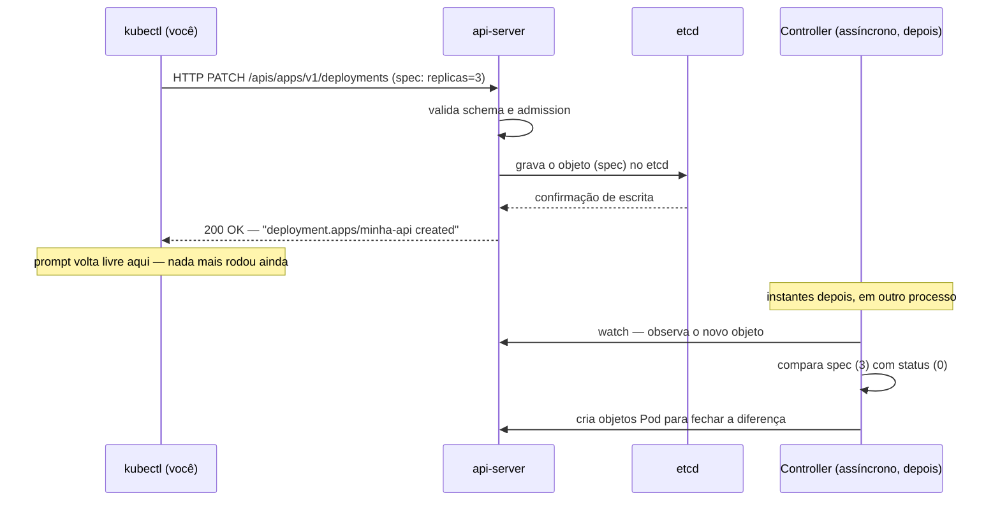
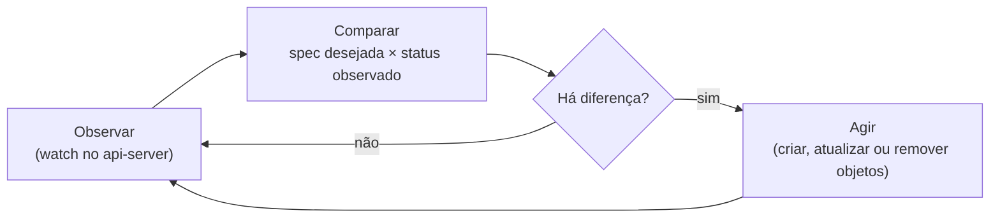
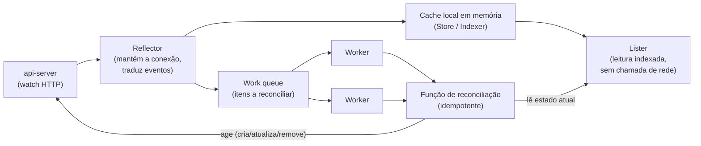
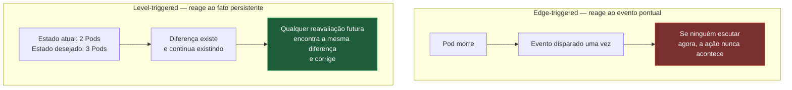
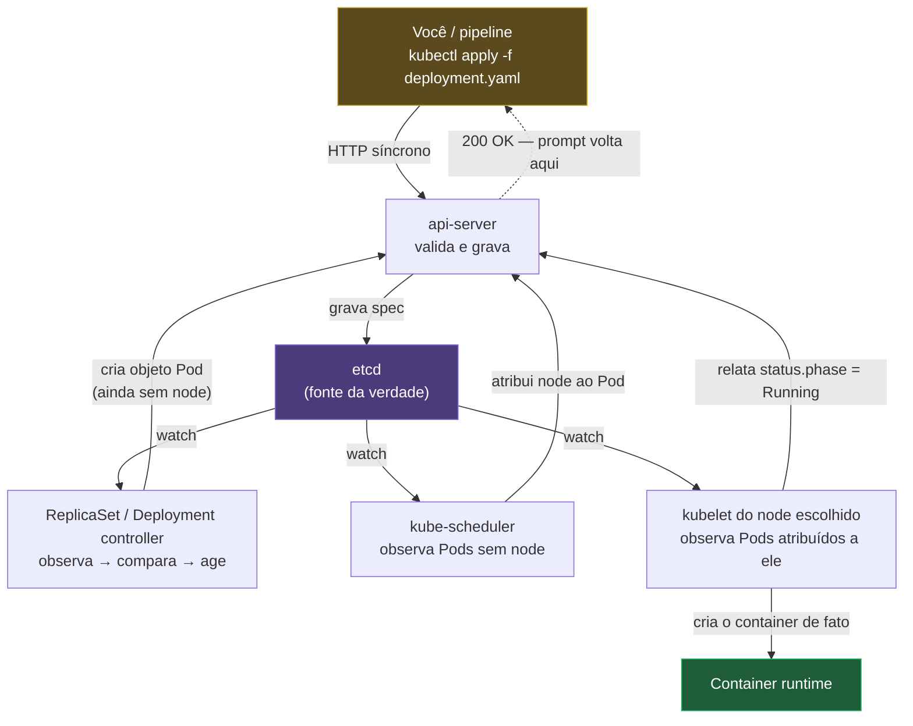

# O loop de reconciliação

> [!abstract] TL;DR
> O Kubernetes não executa comandos, ele converge estado. `kubectl apply` não cria nada: faz uma chamada HTTP contra o api-server, que valida o objeto e grava no etcd, e devolve o controle — nenhum container nasceu ainda, e o `status` do objeto recém-criado está vazio. Quem cria o Pod é outro processo, um controller, rodando em outro instante, de forma assíncrona: um laço infinito que observa o que existe, compara com o que foi declarado na `spec`, age para reduzir a diferença, e repete. Esse laço é level-triggered, não edge-triggered — ele reage ao fato "existem 2 Pods e eu quero 3", nunca ao evento "o Pod X morreu" — e é essa escolha de design, mais do que qualquer outra, que explica por que o Pod que você apagou à mão volta sozinho, por que editar um recurso gerenciado é inútil, e por que o sistema inteiro se recupera sozinho de um evento perdido, de um controller reiniciado ou de uma partição de rede que ninguém percebeu acontecer.

Imagine a cena mais comum de todas: você acabou de escrever um manifesto de dez linhas, roda `kubectl apply -f deployment.yaml`, e o terminal responde em menos de cem milissegundos com `deployment.apps/minha-api created`. Nenhum indicador de progresso, nenhuma barra de carregamento, nenhum "aguarde enquanto os containers sobem" — o prompt já voltou, livre para o próximo comando. Se você for rápido o bastante e rodar `kubectl get pods` no instante seguinte, é bem provável que a lista venha vazia, ou que mostre um Pod com status `Pending`, sem nenhum container de fato rodando em nenhum node. Espere três, cinco, dez segundos, rode o mesmo comando de novo, e agora os Pods aparecem, um a um, passando por `ContainerCreating` até chegar em `Running`. Nada nisso é lentidão de rede ou coincidência de timing: é a arquitetura inteira do Kubernetes, exposta à vista, num experimento que qualquer pessoa com um cluster à mão pode repetir em trinta segundos. O comando que você rodou não criou um Pod. Ele declarou uma intenção — e a intenção, sozinha, não é a mesma coisa que o fato.

Essa distinção entre declarar e executar é o argumento que a nota anterior deste galho, [[03-Dominios/Tecnologia/Infraestrutura/Kubernetes/01 - O problema que orquestração resolve|01 — O problema que orquestração resolve]], deixou em aberto ao mostrar as lacunas que o Compose não fecha: rodar em máquina só, não reagir a falha, não atualizar progressivamente. Esta nota fecha a primeira e mais fundamental dessas lacunas, mostrando o mecanismo concreto por trás da palavra "reagir". Não é modismo de arquitetura declarativa por declarativa: é uma máquina de convergência, com peças específicas, que se comporta de um jeito específico — e cujo comportamento, uma vez entendido, explica de forma mecânica quase todo "porquê" estranho que as próximas vinte notas deste galho vão levantar. Um Pod que volta sozinho depois de apagado à mão, um `kubectl edit` que parece não pegar, um rollout que trava a meio caminho sem erro visível: tudo isso é o mesmo laço, visto de ângulos diferentes.

Vale marcar o paralelo com o galho anterior, porque não é coincidência de estilo: a nota [[03-Dominios/Tecnologia/Infraestrutura/Docker/02 - A anatomia de uma imagem|02 — A anatomia de uma imagem]], do galho de [[03-Dominios/Tecnologia/Infraestrutura/Docker/index|Docker]], carregava a lente daquele galho inteiro — camadas endereçadas por conteúdo, imutabilidade como consequência arquitetural, não como slogan. Esta nota cumpre o mesmo papel aqui: tudo que o Kubernetes faz de interessante — o Pod que sobrevive à morte do node onde rodava, o rollout que substitui containers um a um sem downtime, o `Service` que continua roteando tráfego mesmo com Pods trocando de endereço IP o tempo todo — é uma variação sobre o mesmo tema descrito nas próximas seções. Quem entende o loop de reconciliação com profundidade suficiente para prever seu comportamento em cenários novos não precisa decorar o comportamento de cada objeto do Kubernetes em separado; precisa só perguntar, para cada objeto novo que encontrar, "qual é a spec, qual é o status, e qual controller está reconciliando a diferença entre os dois?".

## Spec e status: os dois lados da equação

Todo objeto do Kubernetes — Pod, Deployment, Service, o que for — carrega, no seu YAML, dois blocos com propósitos radicalmente diferentes: `spec` e `status`. O bloco `spec` é o que você escreve: a declaração do estado que você deseja que exista. O bloco `status` é o que o cluster observa: o retrato, atualizado continuamente, do que de fato existe agora. Você só escreve `spec`. Você nunca escreve `status` diretamente — ele é preenchido, e reescrito, por processos internos do cluster que observam a realidade e relatam o que viram.

Veja isso com as próprias mãos aplicando um Deployment simples:

```yaml
apiVersion: apps/v1
kind: Deployment
metadata:
    name: minha-api
spec:
    replicas: 3
    selector:
        matchLabels:
            app: minha-api
    template:
        metadata:
            labels:
                app: minha-api
        spec:
            containers:
                - name: api
                  image: minha-api:v1
                  ports:
                      - containerPort: 8080
```

Aplique e, no mesmo segundo, peça ao cluster para mostrar o objeto inteiro, `spec` e `status` juntos:

```bash
kubectl apply -f deployment.yaml
kubectl get deployment minha-api -o yaml
```

Nos primeiríssimos instantes depois do `apply`, a seção `status` do YAML devolvido tende a mostrar `replicas: 0` ou nem existir — o objeto foi aceito e gravado, mas ninguém ainda contou quantos Pods de fato existem para ele. Repita o mesmo `kubectl get` alguns segundos depois, e a seção `status` passa a mostrar algo como:

```yaml
status:
    replicas: 3
    readyReplicas: 3
    availableReplicas: 3
    updatedReplicas: 3
    conditions:
        - type: Available
          status: "True"
          reason: MinimumReplicasAvailable
```

Nenhuma dessas linhas foi escrita por você. Você escreveu `replicas: 3` na `spec` — uma intenção. O cluster escreveu `replicas: 3` de volta no `status` — uma observação, feita depois, por um processo à parte, que contou os Pods de fato existentes e relatou o resultado. **O sistema inteiro do Kubernetes existe para zerar a diferença entre essas duas seções.** Quando `spec.replicas` e `status.replicas` coincidem, e as condições reportam saúde, o objeto está reconciliado. Quando divergem — e eles divergem o tempo todo, ainda que por frações de segundo, porque o mundo real está sempre mudando — existe, em algum lugar, um laço trabalhando ativamente para fechar essa distância.

Vale nomear o motivo pelo qual esse desenho de dois blocos separados importa mais do que parece à primeira vista: ele separa, de forma limpa, **o que você é responsável por manter** (a `spec`, que só muda quando você — ou uma pipeline agindo em seu nome — decide mudá-la) de **o que o cluster é responsável por relatar** (o `status`, que muda sozinho, o tempo todo, sem nenhuma ação sua). Confundir os dois é a fonte de boa parte da confusão inicial de quem chega ao Kubernetes vindo de ferramentas onde "rodar o comando" e "o efeito acontecer" são a mesma coisa.

### `generation` e `observedGeneration`: como o controller sabe que a spec mudou

Existe um par de campos, discreto e raramente mencionado fora de documentação de referência, que expõe o mecanismo de comparação de um jeito ainda mais direto do que olhar `spec` contra `status` inteiros: `metadata.generation` e `status.observedGeneration`. Toda vez que a `spec` de um objeto muda — e só quando a `spec` muda, mudanças em `status` ou em metadados não contam — o api-server incrementa `metadata.generation` em um. O controller responsável por aquele objeto, depois de processar a mudança e agir sobre ela, escreve o valor de `generation` que ele acabou de processar de volta em `status.observedGeneration`. Enquanto os dois números não coincidem, existe uma mudança de spec que o controller ainda não processou; quando coincidem, o controller já viu e já reagiu à versão mais recente da spec, ainda que a convergência completa (todos os Pods prontos) possa continuar em andamento.

```bash
kubectl patch deployment minha-api -p '{"spec":{"replicas":5}}'
kubectl get deployment minha-api -o jsonpath='{.metadata.generation} vs {.status.observedGeneration}{"\n"}'
```

Rodar esse `jsonpath` no instante seguinte ao `patch` costuma mostrar os dois números diferentes — `generation` já subiu porque a spec mudou, `observedGeneration` ainda reflete o valor anterior porque o controller não rodou sua rodada de comparação ainda. Segundos depois, os dois convergem. Esse par de campos é, na prática, o jeito mais barato de perguntar programaticamente "o controller já percebeu a minha última mudança?" sem precisar interpretar o `status` inteiro — e é exatamente o campo que `kubectl rollout status` consulta por baixo dos panos para decidir se ainda há trabalho de reconciliação pendente antes de sequer olhar para a contagem de réplicas prontas.

### `resourceVersion`: por que o watch não é um log de eventos

Vale desfazer, com um pouco mais de precisão, uma suposição comum sobre como o watch contra o api-server de fato funciona — a de que ele entrega, para sempre, um histórico completo e ordenado de eventos, como se fosse um log de auditoria que qualquer um pode reler do início. Não é bem assim. Todo objeto do Kubernetes carrega, além de `spec` e `status`, um campo `metadata.resourceVersion` — um identificador opaco, atribuído pelo `etcd`, que aumenta a cada escrita no cluster inteiro, não só naquele objeto específico. Um watch não pede "me dê tudo que aconteceu desde o início"; ele pede "me dê tudo que aconteceu a partir deste `resourceVersion`". O etcd mantém esse histórico de mudanças recentes só por uma janela limitada de tempo (compactando entradas antigas para não crescer para sempre); se um Informer ficar desconectado por tempo demais e o `resourceVersion` que ele tinha guardado já tiver sido compactado, o watch simplesmente falha com um erro específico (`410 Gone`) — e é exatamente esse erro que dispara uma **relist** completa, a releitura do estado inteiro que a seção sobre o controller detalha adiante, porque não há mais como retomar de onde parou, só como recomeçar do zero.

Esse mesmo campo cumpre um segundo papel, independente do watch: **controle de concorrência otimista**. Quando um cliente qualquer — `kubectl`, um controller, outro humano — tenta atualizar um objeto, ele inclui o `resourceVersion` que tinha lido por último. Se, entre a leitura e a tentativa de escrita, algum outro processo já tiver modificado aquele mesmo objeto (e portanto avançado seu `resourceVersion`), o api-server rejeita a escrita com um conflito, em vez de aceitar cegamente e sobrescrever a mudança alheia:

```bash
kubectl get pod minha-api-9f6c7d4b3-lmnop -o jsonpath='{.metadata.resourceVersion}{"\n"}'
```

```
409 Conflict: Operation cannot be fulfilled on pods "minha-api-9f6c7d4b3-lmnop":
the object has been modified; please apply your changes to the latest version and try again
```

Essa mensagem — familiar para quem já tentou automatizar atualizações de objetos via script — não é um bug nem uma falha de rede: é o api-server recusando, de propósito, uma escrita que teria apagado silenciosamente uma mudança concorrente. É a mesma preocupação de fundo que motiva o cuidado com controllers concorrentes brigando por um campo, discutido mais adiante nesta nota, só que aplicado aqui no nível de uma única escrita isolada, em vez de um padrão repetido de disputa.

## O que `kubectl apply` realmente faz

Vale destrinchar, sem pressa, os passos exatos que acontecem entre o Enter no `kubectl apply -f deployment.yaml` e o prompt voltar livre — porque é precisamente aqui que a maior parte da intuição errada se instala. `kubectl` não é uma ferramenta de orquestração com lógica própria de decisão; é, estruturalmente, um **cliente HTTP** para uma API REST. Quando você roda `apply`, o `kubectl` monta o corpo da requisição a partir do YAML, resolve as credenciais do seu `kubeconfig`, e envia uma chamada HTTP (um `POST` quando o objeto ainda não existe, ou um `PATCH` de mesclagem quando já existe) contra um único destino: o **api-server**. É o único ponto de entrada de todo o cluster — todo mundo fala com o api-server, e mais ninguém fala diretamente com mais nada.

O api-server, ao receber a requisição, faz um trabalho bem definido e nada mágico: **valida** a estrutura do objeto contra o schema conhecido daquele `apiVersion`/`kind` (rejeitando, por exemplo, um campo mal escrito ou um tipo errado), passa o objeto por eventuais *admission controllers* configurados no cluster, e então **grava** o objeto resultante no `etcd` — o armazenamento persistente e consistente do cluster, que guarda literalmente todo o estado declarado de tudo. Terminada a gravação, o api-server responde ao `kubectl` com sucesso, e é exatamente nesse ponto que o comando retorna e o prompt volta. Repare no que não aconteceu em nenhum momento dessa sequência: nenhum Pod foi agendado, nenhum container foi puxado de nenhum registry, nenhum processo começou a rodar em nenhuma máquina. O `apply` termina no etcd. Tudo que vem depois é obra de outro conjunto de processos, olhando para esse mesmo etcd, em outro instante.



Esse diagrama deixa visível a virada mental que esta nota inteira defende: existem duas linhas do tempo separadas, não uma só. A primeira linha do tempo — a que envolve você, o `kubectl`, o api-server e o etcd — é síncrona, rápida, e termina no momento em que o objeto está gravado. A segunda linha do tempo — a que de fato coloca um container rodando em algum node — começa depois, é assíncrona, e não tem relação direta de causa-efeito imediata com o comando que você rodou. `kubectl apply` participa só da primeira. É por isso que "aplicado" e "rodando" são, tecnicamente, fatos diferentes — um ponto ao qual esta nota volta na seção sobre onde o modelo custa caro.

> [!info] Baseline de versão
> A descrição do fluxo `apply` → validação → etcd reflete o comportamento do Kubernetes em versões amplamente usadas em 2026 (linha 1.3x). Uma precisão que vale desde já, porque é fonte comum de confusão: o *server-side apply* é estável na API desde a versão 1.22, mas o `kubectl apply` **sem argumento adicional continua fazendo apply do lado do cliente** — quem quer o comportamento de servidor precisa pedir explicitamente `kubectl apply --server-side`. A documentação oficial trata a troca entre os dois como "upgrade" e "downgrade" justamente porque não é o padrão. O contraste entre os dois modos, e a contabilidade de posse de campo que só o server-side mantém, é assunto da nota [[03-Dominios/Tecnologia/Infraestrutura/Kubernetes/07 - kubectl é um cliente de API|07 — `kubectl` é um cliente de API]]; detalhes internos do api-server ficam na nota sobre o control plane, na fase Magus. Aqui basta reter que existe uma fronteira síncrona clara, terminando na escrita do etcd.

### A linha do tempo, em números aproximados

Vale tornar concreta a distância entre as duas linhas do tempo com uma tabela de ordens de grandeza — não como garantia de tempo exato, que depende de carga do cluster, disponibilidade de imagem em cache local do node, e latência de rede até o registry, mas como intuição de qual etapa costuma pesar mais:

| Instante (aproximado) | O que já aconteceu | O que ainda não aconteceu |
|---|---|---|
| t + 0ms | `kubectl apply` enviado | Nada gravado ainda |
| t + 50-200ms | Objeto validado e gravado no etcd; `kubectl` já retornou | Nenhum Pod criado; `status` ainda reflete o estado anterior |
| t + 100ms-1s | Controller observa a diferença via watch e cria o objeto Pod | Pod ainda sem node atribuído (`Pending`) |
| t + 200ms-2s | `kube-scheduler` atribui um node ao Pod | `kubelet` daquele node ainda não começou a agir |
| t + 1-30s | `kubelet` solicita a imagem ao container runtime (rápido se já em cache local do node, lento se precisar baixar do registry) | Container ainda não iniciado |
| t + poucos segundos depois da imagem disponível | Container iniciado; se houver probe de prontidão configurada, `kubelet` aguarda ela passar antes de marcar o Pod como pronto | `status.readyReplicas` ainda não reflete esse Pod |

A linha que mais varia, de longe, é a de puxar a imagem: um node que já tem a imagem em cache local (porque outro Pod da mesma imagem já rodou ali antes) converge em segundos; um node que precisa baixar uma imagem de vários gigabytes de um registry distante pode levar minutos — o mesmo comportamento de camadas endereçadas por conteúdo descrito na nota [[03-Dominios/Tecnologia/Infraestrutura/Docker/02 - A anatomia de uma imagem|02 — A anatomia de uma imagem]] do galho de Docker, só que agora decidindo a velocidade de uma reconciliação inteira, não só de um `docker pull` isolado.

## O controller como laço infinito

O processo que faz a segunda metade do trabalho — perceber que `spec.replicas` é 3 e `status.replicas` é 0, e agir para fechar essa diferença — chama-se **controller**, e roda dentro do `kube-controller-manager` (para os controllers embutidos, como o de ReplicaSet) ou como processo independente (para controllers customizados, assunto da nota sobre Operators, mais adiante no galho, na fase Magus). Todo controller do Kubernetes, sem exceção, implementa a mesma forma abstrata de laço, repetida indefinidamente enquanto o processo estiver vivo:



Vale reter o nome técnico da cada etapa, porque aparece direto em qualquer discussão mais séria sobre controllers: **observar** é implementado, na prática, através de um mecanismo chamado *watch* — uma conexão HTTP de longa duração que o controller mantém aberta contra o api-server, recebendo um fluxo contínuo de eventos ("este objeto foi criado", "este outro foi atualizado", "este terceiro foi removido") em vez de precisar perguntar repetidamente "mudou alguma coisa?". Esse desenho importa porque a alternativa óbvia — *polling*, perguntar "tem novidade?" em intervalos fixos — tem dois problemas que o watch evita: gasta ciclos de CPU e rede perguntando quando não há nada de novo, e introduz um atraso artificial igual ao intervalo do polling entre o momento em que algo muda e o momento em que o controller percebe. Um watch bem implementado percebe a mudança quase no instante em que ela é gravada no etcd.

Na prática, os controllers do Kubernetes não implementam o watch cru diretamente contra o etcd — eles usam uma camada de biblioteca chamada **Informer**, parte do `client-go`, que mantém um cache local, em memória, sincronizado via watch contra o api-server, e expõe esse cache já indexado para o resto do código do controller consultar sem precisar refazer uma chamada de rede a cada comparação. O Informer também resolve um problema sutil e importante: watches HTTP de longa duração eventualmente caem — por reinício do api-server, por timeout de proxy no meio do caminho, por uma partição de rede passageira — e quando isso acontece o Informer não simplesmente perde o rastro; ele reconecta e faz uma **relist**, uma releitura completa do estado atual, para garantir que nenhuma mudança tenha passado despercebida durante a desconexão. Essa combinação de watch contínuo mais relist periódico de segurança é o que torna o modelo resiliente a exatamente o tipo de falha de rede que, num sistema baseado só em eventos pontuais, faria o controller ficar permanentemente desatualizado sem perceber.

Vale abrir, ainda que sem se aprofundar na implementação em si (isso é assunto de outra camada, não desta nota), os três papéis internos que compõem essa peça, porque cada nome aparece com frequência em qualquer log ou discussão mais técnica sobre controllers travados: o **Reflector** é quem de fato conversa por HTTP com o api-server, mantendo o watch aberto e traduzindo cada evento recebido (adicionado, modificado, removido) numa entrada na fila interna; o **cache local** (também chamado de *store* ou, quando indexado por múltiplas chaves, *indexer*) é a cópia em memória do estado mais recente conhecido, consultada pelo código do controller sem custo de rede; e o **Lister**, gerado por código a partir do tipo do objeto, é a interface de leitura conveniente sobre esse cache — é o Lister, por exemplo, que responde a uma pergunta como "quais Pods têm o label `app: minha-api`?" instantaneamente, porque a resposta já está indexada em memória, sem precisar perguntar de novo ao api-server.



Repare no que esse diagrama deixa explícito: a função de reconciliação, quando roda, não confia cegamente no evento que a trouxe até ali — ela relê o estado atual através do Lister (o cache local, já sincronizado) e decide o que fazer com base nesse estado relido, não com base no conteúdo específico do evento que disparou aquela rodada. Essa releitura, de novo, é o que torna a lógica level-triggered na prática: o evento é só o gatilho que diz "hora de olhar de novo", nunca a fonte da decisão em si.

Quando o Informer detecta uma mudança relevante, ele não processa a lógica de reconciliação ali mesmo, na goroutine que recebeu o evento do watch — ele enfileira uma referência ao objeto afetado numa **fila de trabalho** (*work queue*), e um conjunto separado de *workers* consome essa fila, item por item, chamando a função de reconciliação de fato. Esse desacoplamento entre "recebi um evento" e "processei o evento" cumpre um papel duplo: absorve picos (se cem Pods mudarem de status ao mesmo tempo, a fila simplesmente acumula cem itens em vez de derrubar o controller com cem chamadas simultâneas) e permite reprocessar um item que falhou, geralmente com backoff exponencial, sem travar o processamento dos demais itens da fila.

Há uma exigência de design que decorre diretamente desse desenho, e que vale tornar explícita: a função de reconciliação chamada para cada item da fila precisa ser **idempotente**. Ela pode ser chamada uma vez, ou pode ser chamada cinco vezes seguidas para o mesmo objeto — por uma relist, por um retry depois de falha, por dois eventos de watch que colidiram — e o resultado final observável no cluster tem que ser o mesmo em qualquer um desses casos. "Comparar o estado atual com o desejado e agir só na diferença que sobrar" é, por construção, idempotente: se já existem 3 Pods e a spec pede 3, chamar a reconciliação de novo não cria um quarto Pod à toa, porque a comparação já não encontra diferença nenhuma para agir. Um controller escrito como "sempre que este evento chegar, crie um Pod novo" quebraria essa garantia — e é exatamente esse tipo de erro que a lógica level-triggered, descrita na próxima seção, evita por construção.

### Vendo a convergência acontecer em câmera lenta

A melhor forma de tornar tudo isso tangível, em vez de tomar como fé, é observar a convergência gradual acontecendo ao vivo. Escale o Deployment `minha-api` de 3 para 6 réplicas e acompanhe, num terminal separado, a lista de Pods mudando em tempo real:

```bash
kubectl scale deployment minha-api --replicas=6
kubectl get pods -l app=minha-api --watch
```

A saída do `--watch` não chega de uma vez — ela chega linha a linha, cada linha representando um evento observado pelo próprio `kubectl` (que também é, por baixo dos panos, um cliente de watch, exatamente como os controllers):

```
NAME                         READY   STATUS              RESTARTS   AGE
minha-api-7d8f9c6b5-abcde    1/1     Running             0          4m12s
minha-api-7d8f9c6b5-fghij    1/1     Running             0          4m12s
minha-api-7d8f9c6b5-klmno    1/1     Running             0          4m12s
minha-api-7d8f9c6b5-pqrst    0/1     Pending             0          0s
minha-api-7d8f9c6b5-uvwxy    0/1     Pending             0          0s
minha-api-7d8f9c6b5-zabcd    0/1     Pending             0          0s
minha-api-7d8f9c6b5-pqrst    0/1     ContainerCreating   0          2s
minha-api-7d8f9c6b5-uvwxy    0/1     ContainerCreating   0          2s
minha-api-7d8f9c6b5-zabcd    0/1     ContainerCreating   0          3s
minha-api-7d8f9c6b5-pqrst    1/1     Running             0          6s
minha-api-7d8f9c6b5-uvwxy    1/1     Running             0          7s
minha-api-7d8f9c6b5-zabcd    1/1     Running             0          8s
```

Cada uma dessas linhas é uma rodada distinta do laço se manifestando: o ReplicaSet controller viu `spec.replicas` subir para 6, contou que só existiam 3 Pods, criou os três que faltavam (aparecem como `Pending` no instante da criação, antes mesmo de um node ser escolhido), o `kube-scheduler` atribuiu cada um a um node, e o `kubelet` daquele node começou a puxar a imagem e criar o container — cada transição de estado (`Pending` → `ContainerCreating` → `Running`) é, ela mesma, uma atualização de `status` que o próprio `kubectl --watch` está observando via watch, o mesmo mecanismo que os controllers internos usam. Não existe um segundo comando escondido fazendo esse trabalho: é a mesma reconciliação, só que desta vez você está olhando para ela em tempo real em vez de olhar só para o resultado final.

## Nível-gatilho contra borda-gatilho: o ponto que muda tudo

Chegado a este ponto, vale nomear com precisão a distinção mais valiosa desta nota inteira, porque ela não é jargão decorativo — é a peça que explica a robustez inteira do Kubernetes diante de falha. Existem, na teoria de sistemas reativos, duas formas de um observador reagir a mudanças: **borda-gatilho** (*edge-triggered*) e **nível-gatilho** (*level-triggered*).

Um sistema edge-triggered reage ao **evento**: "o Pod X acabou de morrer" dispara uma ação específica, uma única vez, no instante em que o evento acontece. Se esse evento se perder — porque o processo que deveria recebê-lo estava fora do ar, porque uma mensagem se perdeu na rede, porque o processo reiniciou entre o evento acontecer e ser processado — a ação correspondente nunca acontece, e ninguém percebe, porque não existe mais nenhum "evento pendente" para reprocessar depois. O evento é um instante que passou; perdê-lo é perder a única chance de reagir a ele.

Um sistema level-triggered reage ao **fato observável, persistente**: não "o Pod X morreu" (um evento pontual), mas "existem 2 Pods rodando e a spec pede 3" (uma condição que continua verdadeira até alguém corrigi-la). O controller do Kubernetes nunca escuta "morte de Pod" como evento a ser tratado uma única vez — ele simplesmente reavalia, toda vez que roda o laço, a pergunta "quantos existem agora, comparado com quantos deveriam existir". Se o evento que sinalizaria a morte do Pod se perder por qualquer razão, não importa: na próxima vez que o laço rodar — seja porque outro evento qualquer disparou uma reavaliação, seja porque a relist periódica de segurança aconteceu — a contagem de Pods vai continuar mostrando 2 contra uma spec de 3, porque essa é a realidade atual do cluster, não um evento que precisava ser capturado no instante certo. O fato persiste até ser corrigido; o controller só precisa olhar de novo, em algum momento, para encontrá-lo.



É essa escolha de design — nada mais exótico do que isso — que produz as três garantias de resiliência que costumam ser vendidas como mágica do Kubernetes: recuperação de **evento perdido** (se o watch caiu no instante exato em que um Pod morreu, a relist de segurança encontra a diferença de qualquer forma, porque a diferença é um fato do presente, não um evento do passado); recuperação de **reinício do controller** (quando o `kube-controller-manager` reinicia — por upgrade, por crash, por manutenção — ele não precisa recuperar uma fila de eventos pendentes de antes de cair; ele simplesmente relista o estado atual e o estado desejado, e a lógica de comparação funciona exatamente igual, porque ela nunca dependeu de histórico, só do presente); e recuperação de **partição de rede** (se o node onde um Pod rodava ficou inalcançável por alguns minutos e depois voltou, não existe um evento "partição terminou" que alguém precisasse ter escutado — o controller volta a enxergar aquele node e reavalia a diferença entre o que existe e o que deveria existir, exatamente como faria em qualquer outra rodada do laço).

Vale uma ressalva honesta aqui, porque exagerar a garantia seria impreciso: level-triggered resolve o problema de **perder a reação a uma mudança**, mas não elimina, sozinho, a necessidade de um mecanismo de detecção de falha em primeiro lugar — algo continua precisando perceber que um node ficou inalcançável (via `NodeStatus`, sinalizado pelo `kubelet` que rodaria naquele node — mecanismo que uma nota posterior deste galho, na fase Magus, detalha) antes que o controller tenha um fato novo para reavaliar. O que level-triggered garante é que, uma vez que o fato existe — "este Pod não está mais correspondendo ao que a spec pede" —, ele vai continuar existindo e continuar disponível para qualquer rodada futura do laço encontrar, não importa quantas rodadas anteriores tenham falhado em processá-lo.

Vale um exemplo concreto de como essa detecção de falha de nó de fato acontece, porque nomear o mecanismo evita que ele pareça mágico. O `kubelet` de cada node atualiza periodicamente um objeto `Lease` associado àquele node — um "batimento cardíaco" simples, renovado em intervalos curtos. Quando esses batimentos param de chegar por tempo suficiente (um intervalo configurável, contado em dezenas de segundos), o `kube-controller-manager` marca a condição `Ready` do `NodeStatus` daquele node como desconhecida ou falsa. Só a partir desse momento — quando o fato "este node não está mais reportando saúde" passa a existir no estado observado do cluster — é que os controllers responsáveis por Pods rodando ali passam a tratá-los como candidatos a recriação em outro node, depois de um período de tolerância adicional configurável. Não existe, em nenhum ponto dessa cadeia, um "evento de partição de rede" sendo escutado — existe só a ausência continuada de um fato esperado (o batimento), virando ela mesma um novo fato observável (`NodeStatus` não pronto), que por sua vez alimenta a mesma comparação spec-contra-status de sempre.

## As consequências que você já sentiu

Boa parte do comportamento do Kubernetes que costuma parecer arbitrário, ou até hostil, na primeira vez que alguém encontra, é consequência direta e previsível de tudo que foi descrito até aqui. Vale nomear quatro dessas consequências, porque cada uma delas é sintoma do mesmo mecanismo, não um comportamento isolado.

**O Pod que você apagou à mão voltou sozinho.** Se aquele Pod pertence a um Deployment (via ReplicaSet), apagá-lo com `kubectl delete pod <nome>` não muda a `spec` de réplicas — ela continua pedindo, digamos, 3. O que muda é o `status` observado: agora existem só 2 Pods rodando. O controller de ReplicaSet, na próxima rodada do laço (que costuma acontecer em segundos, não minutos), vê essa diferença exatamente como veria a morte de um Pod por qualquer outra causa — crash, `OOMKilled`, node caído — e cria um Pod novo para fechar a conta. Não existe, no vocabulário do ReplicaSet, um conceito de "esse Pod foi apagado de propósito, deixa quieto"; existe só "faltam Pods para bater a spec". Reproduza o experimento e cronometre:

```bash
kubectl get pods -l app=minha-api
kubectl delete pod minha-api-7d8f9c6b5-abcde
kubectl get pods -l app=minha-api --watch
```

A lista imediatamente depois do `delete` mostra 2 Pods (ou um terceiro em `Terminating`, se ainda estiver desligando); segundos depois, um Pod novo aparece — com um sufixo de nome diferente, porque é literalmente um objeto novo, não o mesmo Pod ressuscitado — subindo por `Pending`, `ContainerCreating`, `Running`, até a contagem voltar a bater com os 3 declarados na spec. Quem quer de fato remover uma réplica precisa mudar a `spec.replicas` do Deployment (de 3 para 2, por exemplo) — nesse caso o mesmo controller converge na direção oposta, e não recria nada, porque a nova contagem observada já corresponde à nova contagem desejada.

**Editar um recurso gerenciado é inútil.** Rodar `kubectl edit pod <nome-de-um-pod-gerenciado>` e mudar, por exemplo, a imagem do container, produz uma mudança que sobrevive exatamente até a próxima reconciliação do ReplicaSet perceber que aquele Pod não corresponde mais ao *template* declarado no Deployment. Vale ver isso funcionar, e falhar, com as próprias mãos:

```bash
kubectl edit pod minha-api-9f6c7d4b3-lmnop
# altera spec.containers[0].image para outra tag, salva e sai
kubectl get pod minha-api-9f6c7d4b3-lmnop -o jsonpath='{.spec.containers[0].image}{"\n"}'
```

No instante seguinte ao `edit`, o `jsonpath` confirma a imagem nova — a edição pegou, o api-server aceitou e gravou. Espere alguns segundos e rode o mesmo `get` de novo: dependendo de qual campo foi tocado, ou o Pod inteiro já foi substituído por um novo (mesmo nome de ReplicaSet, sufixo de Pod diferente), ou a mudança específica desapareceu — porque o ReplicaSet controller, na sua rodada seguinte, comparou aquele Pod contra o *template* que ele conhece (o do Deployment), viu uma divergência, e agiu para eliminá-la, exatamente como agiria diante de qualquer outro tipo de drift. Dependendo do campo editado, o controller pode simplesmente substituir o Pod inteiro por um novo, gerado a partir do template correto — a edição manual não é revertida byte a byte, ela é apagada junto com o objeto que a carregava. A forma correta de mudar a imagem é editar a `spec.template` do Deployment, o objeto que de fato é a fonte da verdade, assunto que a nota [[03-Dominios/Tecnologia/Infraestrutura/Kubernetes/04 - Deployment e ReplicaSet|04 — Deployment e ReplicaSet]] desenvolve em detalhe.

**Deletar também é uma operação declarativa.** `kubectl delete deployment minha-api` não é um comando imperativo isolado do resto do modelo — ele também passa pelo api-server, também grava uma intenção (a remoção do objeto), e a remoção efetiva dos Pods em execução acontece de forma assíncrona, pelo mesmo tipo de controller que cria Pods quando a spec pede mais réplicas. "Apagar" e "criar" não são operações de natureza diferente no Kubernetes; são o mesmo mecanismo de convergência, só que a direção da diferença entre spec e status é inversa.

**Rodar o mesmo `apply` duas vezes seguidas não faz nada da segunda vez — e isso é uma garantia, não um acidente.** Rode `kubectl apply -f deployment.yaml` duas vezes seguidas, sem mudar nada no arquivo entre as duas execuções, e a segunda chamada retorna `deployment.apps/minha-api unchanged` em vez de `created` ou `configured`. Isso não é uma otimização de conveniência que alguém adicionou por cima — é a mesma idempotência exigida da função de reconciliação de qualquer controller, só que agora aplicada à própria operação de escrita do api-server: aplicar a mesma `spec` sobre um objeto que já está exatamente naquele estado não produz nenhuma mudança observável, porque não há diferença nenhuma entre o que foi pedido e o que já existe. É essa mesma propriedade que torna seguro rodar `kubectl apply -f .` repetidamente contra um diretório inteiro de manifestos, num pipeline de CI/CD, sem medo de duplicar recursos a cada execução — o comportamento correto de um sistema convergente é, por definição, não fazer nada quando já convergiu.

O mecanismo concreto por trás dessa cascata — apagar um Deployment também apaga os ReplicaSets e Pods que dependiam dele, sem que nenhum controller precise saber explicitamente "quando o Deployment X morrer, também apague o ReplicaSet Y" — chama-se **ownerReferences**. Todo objeto criado por outro objeto do Kubernetes carrega, no seu `metadata`, uma referência ao dono que o criou: um ReplicaSet gerado por um Deployment carrega uma `ownerReference` apontando de volta para aquele Deployment; um Pod gerado por aquele ReplicaSet carrega a sua própria `ownerReference` apontando para o ReplicaSet. Veja isso diretamente:

```bash
kubectl get pod minha-api-9f6c7d4b3-lmnop -o jsonpath='{.metadata.ownerReferences[0].kind}/{.metadata.ownerReferences[0].name}{"\n"}'
```

A saída típica é algo como `ReplicaSet/minha-api-9f6c7d4b3`. Um controller à parte do control plane, o **garbage collector**, observa continuamente essas referências: quando o objeto dono deixa de existir, o garbage collector marca os objetos dependentes para remoção — por padrão, em cascata completa, removendo netos e bisnetos de referência junto. Isso significa que apagar um Deployment não é um comando especial com lógica própria de "apague tudo que depende disso"; é, de novo, o mesmo padrão observar-comparar-agir, aplicado a uma pergunta ligeiramente diferente: "o dono deste objeto ainda existe?" em vez de "a contagem de réplicas bate?".

**Não existe rollback instantâneo, só uma nova declaração.** Quando algo dá errado num rollout e alguém pede "desfaz isso agora", o que `kubectl rollout undo` de fato faz é escrever, no histórico de revisões do Deployment, uma nova `spec.template` — a revisão anterior, reaplicada como se fosse uma declaração nova. Não existe um botão que reverta o estado do cluster instantaneamente sem passar pelo mesmo caminho de sempre: apiserver, etcd, controller percebendo a diferença, rollout gradual dos Pods novos substituindo os antigos. Um "rollback" é, mecanicamente, só mais um "apply" — o mesmo laço, rodando na direção que alguém decidiu chamar de "voltar". Vale conferir isso na prática:

```bash
kubectl rollout history deployment/minha-api
kubectl rollout undo deployment/minha-api --to-revision=2
kubectl rollout status deployment/minha-api
```

O `rollout history` lista as revisões anteriores, guardadas pelo próprio Deployment como parte do seu histórico (limitado a um número configurável de revisões recentes, não infinito). O `rollout undo --to-revision=2` não copia bytes de container de volta a nenhum lugar — ele lê a `spec.template` gravada para a revisão 2 e a reaplica como a `spec.template` atual, disparando o mesmo mecanismo de rolling update, na direção inversa, que qualquer outra mudança de imagem dispararia. E o `rollout status` logo em seguida existe justamente porque, como a seção anterior já estabeleceu, o `undo` retornando sucesso não significa a reversão estar concluída — significa só que a intenção de reverter foi gravada, e a convergência de fato, gradual e assíncrona, ainda está por vir.

## Onde o modelo custa caro

Nenhum modelo de convergência é de graça, e vale nomear com honestidade os três lugares em que essa arquitetura cobra um preço real, porque são exatamente os pontos que costumam pegar quem assume, por hábito de outras ferramentas, que "comando executou" equivale a "efeito concluído".

**"Aplicado" não é "rodando".** `kubectl apply` retornando sucesso garante, com certeza, que o objeto foi validado e gravado no etcd. Não garante, e nunca garantiu, que os Pods correspondentes já existem, muito menos que já estão saudáveis. Um pipeline de CI/CD que trata o código de saída do `apply` como sinal de "deploy concluído" está medindo a coisa errada — a convergência de fato pode levar de segundos a minutos, dependendo de quantas imagens precisam ser baixadas, quantos nodes têm capacidade disponível, e se algum probe de prontidão está falhando. É por isso que pipelines maduros seguem o `apply` com uma espera explícita por convergência — tipicamente `kubectl rollout status`, que bloqueia até o `status` do Deployment reportar as réplicas atualizadas como prontas — em vez de assumir que o `apply` já foi a linha de chegada.

**O erro não volta no `apply`.** Se a imagem declarada num Deployment não existe no registry, ou se o container falha ao subir por falta de uma variável de ambiente obrigatória, o `kubectl apply` original não vai relatar nada disso — porque, no momento em que ele rodou, aquele erro sequer tinha acontecido ainda; a spec foi validada estruturalmente (o YAML está bem formado, os campos existem) e gravada com sucesso. O erro de fato aparece depois, assíncrono, em dois lugares: no `status` do objeto (por exemplo, `status.conditions` reportando indisponibilidade, ou um Pod preso em `ImagePullBackOff`) e nos **eventos** do cluster, um objeto próprio do Kubernetes que registra, em ordem cronológica, o que os controllers e o kubelet observaram tentar fazer e o que deu errado:

```bash
kubectl rollout status deployment/minha-api
kubectl get events --field-selector involvedObject.name=minha-api --sort-by='.lastTimestamp'
kubectl describe pod <nome-do-pod-com-problema>
```

Quem só olha o retorno do `apply` e nunca volta para conferir `status` ou `events` está, estruturalmente, olhando para a metade errada da equação — a metade que descreve a intenção, não a metade que descreve a realidade.

Vale seguir esse cenário até o fim, com números concretos, porque é o tipo de situação que qualquer pessoa que já rodou um deploy errado reconhece na hora. Suponha que o Deployment aplicado referencia `minha-api:v7`, mas alguém digitou a tag errada e a imagem que de fato existe no registry é `minha-api:v6`. O `kubectl apply` retorna sucesso normalmente — a spec está bem formada, `minha-api:v7` é uma string de imagem sintaticamente válida, o api-server não tem como saber, no momento da validação, se aquela tag existe de fato no registry. Segundos depois, `kubectl get pods` mostra algo como:

```
NAME                         READY   STATUS             RESTARTS   AGE
minha-api-9f6c7d4b3-lmnop    0/1     ImagePullBackOff   0          45s
```

`ImagePullBackOff` é, ele mesmo, um valor de `status` — não um erro que "voltou" do `apply`, mas uma observação que o `kubelet` daquele node fez, ao tentar puxar a imagem e falhar, e relatou de volta ao api-server. Descrever o Pod revela o detalhe exato:

```bash
kubectl describe pod minha-api-9f6c7d4b3-lmnop
```

```
Events:
  Type     Reason     Age                From               Message
  ----     ------     ----               ----               -------
  Normal   Scheduled  50s                default-scheduler  Successfully assigned default/minha-api-... to node-2
  Normal   Pulling    18s (x3 over 49s)  kubelet            Pulling image "minha-api:v7"
  Warning  Failed     18s (x3 over 49s)  kubelet            Failed to pull image "minha-api:v7": not found
  Warning  Failed     18s (x3 over 49s)  kubelet            Error: ErrImagePull
  Normal   BackOff    3s (x5 over 48s)   kubelet            Back-off pulling image "minha-api:v7"
```

Repare no `x3` e no `x5`: o `kubelet` não desistiu na primeira falha, e também não ficou tentando sem parar — ele reage com o mesmo padrão de idempotência e retry com backoff descrito para os controllers do control plane, só que rodando no node, mais perto do container runtime. Nenhuma dessas linhas jamais teria aparecido no terminal onde alguém rodou `kubectl apply` — elas moram exclusivamente no `status` do Pod e no fluxo de eventos do cluster, e só aparecem para quem sabe que precisa ir procurá-las ali.

**Controllers concorrentes podem brigar pelo mesmo campo.** O modelo de reconciliação pressupõe, implicitamente, que existe **um** controller responsável por decidir o valor de um dado campo de um dado objeto. Quando dois controllers diferentes — um operator customizado e o `kubectl` de um humano, por exemplo, ou dois operators mal coordenados — tentam impor valores diferentes ao mesmo campo do mesmo objeto, o resultado observável costuma ser um campo que "pisca": um controller escreve um valor, o outro observa a mudança, escreve o valor que ele acha correto por cima, o primeiro observa essa mudança de volta, escreve o seu de novo — um ciclo que consome recursos do cluster sem nunca convergir de verdade, porque cada lado está tratando o outro como "drift" a ser corrigido.

Um exemplo concreto, comum o bastante para valer a pena nomear: um Deployment gerenciado por um chart do Helm declara `replicas: 3` no seu template. Sob pressão, durante um pico de tráfego, alguém roda `kubectl scale deployment minha-api --replicas=10` diretamente — o api-server aceita, o ReplicaSet controller converge para 10 réplicas, e o problema imediato de capacidade é resolvido. Semanas depois, alguém roda `helm upgrade` para aplicar uma mudança não relacionada, de uma variável de ambiente qualquer. O Helm reaplica o template inteiro que ele conhece — inclusive o `replicas: 3` original, que nunca foi atualizado no chart — e o Deployment volta, sem aviso nenhum sobre esse efeito colateral específico, para 3 réplicas. Não houve bug em nenhuma das duas ferramentas: cada uma fez exatamente o que o modelo de reconciliação promete, aplicar a spec que lhe foi entregue. O erro foi de processo — duas fontes de verdade divergentes para o mesmo campo — não de mecanismo.

O *server-side apply* foi desenhado, entre outras coisas, para tornar esse conflito de posse de campo visível e gerenciável, através do conceito de *field managers*: cada cliente que escreve num objeto via server-side apply se identifica, e o api-server passa a rastrear, campo a campo, qual *manager* reivindicou a posse de qual valor mais recentemente. Um `kubectl get deployment minha-api -o yaml --show-managed-fields` expõe essa contabilidade, mostrando qual processo é dono de qual pedaço da spec — informação que não existia antes do server-side apply, quando um `apply` do cliente simplesmente sobrescrevia o objeto inteiro sem noção fina de posse por campo. Ainda assim, o problema de fundo — dois processos com autoridade legítima sobre o mesmo pedaço de estado desejado — é uma armadilha de design que continua existindo independente da ferramenta; field managers tornam o conflito visível, não o eliminam.

## O quadro completo, em uma imagem só

Vale fechar o corpo técnico da nota consolidando, num único diagrama, as duas metades que as seções anteriores trataram separadamente: a metade síncrona (`apply` até o etcd) e a metade assíncrona (controller até o container rodando). Repare que o diagrama não abre o que acontece dentro de cada caixa — `kube-scheduler` decidindo em qual node colocar um Pod novo, `kubelet` conversando com o container runtime — porque esse detalhe interno pertence à parte deste galho dedicada ao control plane e ao kubelet, na fase Magus; aqui cada caixa é tratada como o que ela representa de fora: mais um observador-e-agente participando do mesmo padrão geral.



Note a estrutura que se repete três vezes nesse diagrama, uma para cada participante depois do api-server: `ReplicaSet controller`, `kube-scheduler` e `kubelet` fazem, cada um, exatamente o mesmo tipo de coisa — observar via watch, comparar contra o que já sabem, agir sobre a diferença que sobrar — só que cada um respondendo por uma fatia diferente do problema. O `ReplicaSet controller` responde a "faltam Pods para bater a contagem?"; o `kube-scheduler` responde a "existe algum Pod sem node atribuído ainda?"; o `kubelet` responde a "existe algum Pod atribuído a mim que eu ainda não coloquei para rodar?". Nenhum desses três processos manda diretamente no outro, e nenhum deles chama o outro por uma API própria e exclusiva — todos conversam exclusivamente através do mesmo api-server e do mesmo etcd, cada um lendo e escrevendo objetos, cada um vendo apenas o pedaço do estado do cluster que lhe interessa. É esse desacoplamento — três laços independentes, cada um convergindo sua própria fatia da diferença entre spec e status — que permite ao Kubernetes escalar de um cluster de três nodes para um de milhares sem que a lógica de nenhum controller precise mudar uma linha.

## O mesmo padrão, um nível acima: GitOps

Vale fechar o corpo desta nota apontando para fora do cluster, porque o padrão observar-comparar-agir não para na fronteira do Kubernetes — ele se repete, quase sem modificação, um nível acima, na forma como times operam clusters inteiros em produção. Um pipeline de **GitOps** trata um repositório Git como a `spec` — a fonte da verdade do estado desejado do cluster inteiro, não de um objeto isolado — e roda um controller próprio (Argo CD, Flux, e outras ferramentas do mesmo gênero) que observa continuamente esse repositório, compara com o estado atual do cluster obtido via api-server, e aplica a diferença, exatamente o mesmo laço, só que operando uma camada de abstração acima do que esta nota descreveu. Um commit num arquivo YAML dentro do repositório é, estruturalmente, o mesmo tipo de evento que uma mudança de `spec.replicas` via `kubectl patch`: uma intenção nova, esperando para ser observada e convergida. A diferença entre "declarar via `kubectl apply` direto" e "declarar via commit e deixar um controller de GitOps aplicar" é uma questão de **onde** a intenção mora e **quem** tem permissão de escrevê-la — não uma mudança na mecânica de convergência em si, que continua sendo a mesma. A nota [[03-Dominios/Engenharia/Operação/2 - Entrega e release/05 - GitOps e Infrastructure as Code|GitOps e Infrastructure as Code]], no domínio de Operação, desenvolve essa prática em detalhe — o pipeline, a reconciliação entre Git e cluster, o modelo de permissões que isso possibilita; aqui bastava reconhecer que o modelo mental desta nota se estende, intacto, para além do próprio Kubernetes.

Vale marcar, com igual honestidade, onde este mesmo mecanismo de convergência para de ser suficiente sozinho e passa a exigir disciplina operacional adicional — não porque o laço falhe, mas porque ele resolve "o estado bate com o declarado", não "o estado declarado é o certo para produção". Garantir que uma atualização de imagem não derrube o serviço enquanto converge é assunto de [[03-Dominios/Engenharia/Operação/3 - Rodar em produção/03 - Zero-downtime e alta disponibilidade|Zero-downtime e alta disponibilidade]]; garantir que o cluster tem capacidade de fato disponível para materializar o que foi declarado é assunto de [[03-Dominios/Engenharia/Operação/3 - Rodar em produção/04 - Escala e capacidade|Escala e capacidade]]; e o comportamento do cluster diante de falhas que vão além de "faltam Pods" — nós inteiros caindo, zonas de disponibilidade inteiras falhando — é assunto de [[03-Dominios/Engenharia/Operação/3 - Rodar em produção/06 - Resiliência operacional|Resiliência operacional]]. Nenhuma dessas três notas contradiz o modelo descrito aqui; todas as três pressupõem esse modelo como dado e constroem política em cima dele.

## Um resumo de comandos para a caixa de ferramentas

Ao longo desta nota, vários comandos apareceram espalhados dentro de exemplos — cada um respondendo a uma pergunta específica sobre o estado de um objeto ou sobre o próprio laço de reconciliação. Vale reuni-los numa única referência, não como substituto da explicação de cada um, mas como ponto de partida rápido na próxima vez que a pergunta "como eu vejo isso de novo?" aparecer:

| Pergunta | Comando |
|---|---|
| O que existe na `spec` e no `status` deste objeto agora? | `kubectl get <objeto> <nome> -o yaml` |
| A convergência já terminou, ou ainda está em andamento? | `kubectl rollout status deployment/<nome>` |
| O controller já processou a última mudança de spec? | `kubectl get <objeto> <nome> -o jsonpath='{.metadata.generation} vs {.status.observedGeneration}'` |
| O que os controllers e o kubelet observaram tentar fazer, e o que deu errado? | `kubectl get events --sort-by='.lastTimestamp'` |
| Por que este Pod específico não está `Running`? | `kubectl describe pod <nome>` |
| Quem é o dono deste objeto, na cadeia de garbage collection? | `kubectl get <objeto> <nome> -o jsonpath='{.metadata.ownerReferences[0].kind}/{.metadata.ownerReferences[0].name}'` |
| Quem reivindica posse de qual campo deste objeto? | `kubectl get <objeto> <nome> -o yaml --show-managed-fields` |
| A convergência está acontecendo agora, passo a passo? | `kubectl get pods -l <label> --watch` |

## Armadilhas comuns

> [!warning] Tratar o retorno bem-sucedido do `apply` como confirmação de que a aplicação está no ar
> É tentador ler `deployment.apps/minha-api configured` no terminal e seguir em frente achando que o trabalho terminou — sobretudo em scripts e pipelines escritos rápido, sob pressão. O que de fato aconteceu foi só a gravação da intenção no etcd; a convergência real pode ainda estar em andamento, ou pode até falhar completamente sem que o `apply` original saiba disso. A correção é sempre seguir o `apply` com uma verificação explícita de convergência — `kubectl rollout status` para Deployments, ou uma consulta ao `status` do objeto — antes de declarar o deploy concluído.

> [!warning] Editar um Pod, ReplicaSet ou qualquer objeto gerenciado diretamente, esperando que a mudança persista
> Depois de descobrir que `kubectl edit` funciona e a mudança aparece imediatamente, é natural assumir que ela ficou. Para objetos que têm um controller de nível superior reconciliando ativamente contra eles — Pods de um ReplicaSet, ReplicaSets de um Deployment —, essa edição é apagada na próxima rodada do laço, porque o controller compara o objeto contra o template que ele conhece, não contra o que você acabou de digitar. A correção é sempre editar o objeto de nível mais alto que de fato controla aquele template — o Deployment, não o Pod que ele gerou.

> [!warning] Confundir "o controller não reagiu ainda" com "o controller está quebrado"
> Como a convergência é assíncrona e o laço roda em rodadas, existe sempre uma janela de tempo — de milissegundos a poucos segundos, tipicamente — entre uma mudança na `spec` e o `status` refletir essa mudança. Interpretar essa janela como sinal de que "o controller travou" e reagir apagando e recriando objetos manualmente costuma piorar a situação, gerando mais trabalho para o mesmo laço resolver. A correção é dar ao laço o tempo que ele precisa e observar `status`/eventos antes de concluir que algo está de fato quebrado — a diferença entre "ainda convergindo" e "quebrado de verdade" é justamente o assunto da nota sobre depurar um cluster, mais adiante neste galho, na fase Magus.

> [!warning] Achar que "level-triggered" significa que o Kubernetes ignora eventos
> É fácil escutar "o Kubernetes é level-triggered, não edge-triggered" e concluir, por generalização apressada, que eventos não importam nada no design do sistema. Eles importam — é um evento de watch, tipicamente, que dispara a próxima rodada do laço de reconciliação, evitando que o controller precise ficar comparando `spec` e `status` em polling constante. O que level-triggered garante não é ausência de eventos; é que a **correção não depende** de nenhum evento específico ter sido recebido com sucesso — a relist periódica de segurança, olhando para o fato presente em vez do histórico de eventos, é a rede de segurança que torna a garantia verdadeira mesmo quando um evento se perde.

> [!warning] Presumir que field conflicts entre controllers são raros o bastante para ignorar
> Times que adotam operators customizados por cima de recursos que já são geridos por outra ferramenta — um Helm chart, um pipeline de GitOps, um segundo operator com sobreposição de responsabilidade — às vezes só descobrem o conflito de posse de campo quando um objeto começa a oscilar em produção, sem log de erro nenhum que aponte a causa raiz de forma óbvia. A prevenção passa por mapear, antes de introduzir um controller novo, exatamente quais campos de quais objetos ele vai escrever, e verificar se algum outro processo já reivindica autoridade sobre os mesmos campos — o mecanismo de *field managers* do server-side apply ajuda a tornar esse conflito visível via `kubectl get <objeto> -o yaml --show-managed-fields`, mas não previne o conflito sozinho.

> [!warning] Tratar a leitura de um cache local de Informer como garantidamente atual
> Código de automação escrito por cima do `client-go`, ou qualquer ferramenta que consulte o estado do cluster através de um Lister em vez de perguntar direto ao api-server, está lendo de um cache que é, por construção, uma cópia — atualizada com uma defasagem tipicamente de milissegundos, mas defasagem mesmo assim. Escrever uma decisão crítica ("só prossiga se não houver nenhum outro Pod com este label") baseada só nessa leitura, sem revalidar contra o api-server no momento da escrita, abre uma janela de corrida pequena, porém real. A forma correta de lidar com isso não é abandonar o cache — ele existe justamente para evitar sobrecarregar o api-server com leituras repetidas — mas usar o controle de concorrência otimista descrito nesta nota (o `resourceVersion` na escrita) para deixar o próprio api-server rejeitar qualquer escrita baseada em informação desatualizada, em vez de confiar cegamente que o cache local estava certo.

## Como explicar em inglês

Numa conversa técnica em inglês, a pergunta "so what does `kubectl apply` actually do?" costuma testar exatamente a distinção que esta nota inteira defende, e a resposta que soa sênior nomeia a fronteira síncrona/assíncrona sem rodeio: *"`kubectl apply` is a synchronous HTTP call to the api-server — it validates the object and persists it to etcd, then returns. Nothing else has happened yet. Actually making that state real — scheduling Pods, pulling images, starting containers — is done asynchronously by controllers running a reconciliation loop: they watch the cluster, compare desired state against observed state, and act only on the difference. That's why `kubectl apply` returning success never means the workload is running yet — it means the intent was recorded."* Vale evitar, nessa formulação, a frase "Kubernetes runs your command" — ela sugere execução imperativa direta, que é exatamente o modelo mental que a nota inteira desmonta.

Uma segunda formulação, mais curta, ajuda quando a pergunta é especificamente sobre por que o sistema se recupera de falha sem intervenção: *"Kubernetes controllers are level-triggered, not edge-triggered — they don't react to the event of a Pod dying, they react to the fact that the current replica count doesn't match the desired one. That's the whole reason a missed event, a controller restart, or a network partition doesn't leave the cluster stuck: the next reconciliation pass just looks at the world again and finds the same gap, no matter how many previous passes failed to see it."* Vale notar o cuidado de nunca dizer, em inglês, "the controller listens for the delete event" quando o ponto técnico que se quer defender é justamente o oposto — o controller não depende de ter escutado nenhum evento específico, só de eventualmente reavaliar o estado atual contra o desejado.

| Português | Inglês | Nuance de uso |
|---|---|---|
| Estado desejado | Desired state | Sempre em referência à `spec`; é o termo padrão da documentação oficial, não se traduz por "target state" em contexto de Kubernetes. |
| Estado observado | Observed state / current state | Corresponde ao `status`; "observed" enfatiza que alguém teve que olhar e relatar, "current" é mais neutro e também aceito. |
| Reconciliação | Reconciliation | Termo técnico fixo — não se diz "synchronization" no jargão de controllers, mesmo que a ideia se pareça; "reconciliation loop" é a frase inteira mais comum. |
| Nível-gatilho | Level-triggered | Termo emprestado de eletrônica digital e de projetos de I/O (o mesmo par aparece em discussões de epoll); evite traduzir literalmente palavra por palavra em inglês corrido — "level-triggered" é a expressão fixa. |
| Borda-gatilho | Edge-triggered | Sempre em contraste direto com "level-triggered"; útil para ancorar a explicação em algo que quem já mexeu com I/O de baixo nível reconhece de outro contexto. |
| Convergência | Convergence / converging | "The controller keeps converging the cluster toward the desired state" é uma formulação natural; evite "fixing", que soa como correção pontual em vez de processo contínuo. |
| Drift | Drift / configuration drift | Descreve exatamente a diferença entre spec e status que o loop existe para corrigir; usado também fora do Kubernetes, em qualquer discussão de infraestrutura declarativa. |
| Laço de controle | Control loop | Termo genérico de sistemas de controle, aplicado ao contexto específico do Kubernetes; "control loop" e "reconciliation loop" são usados de forma quase intercambiável na documentação. |
| Fila de trabalho | Work queue | Específico da implementação em `client-go`; aparece em qualquer discussão mais profunda sobre como um controller processa eventos sem travar. |
| Idempotente | Idempotent | Mesmo termo em ambos os idiomas; vale reforçar a definição em inglês se o interlocutor não for familiar: "calling it once or five times produces the same end state." |

## Uma escolha herdada, não inventada do zero

Vale um parágrafo de contexto, porque explica por que esse modelo não é uma peculiaridade isolada do Kubernetes, e sim uma escolha deliberada, com histórico próprio. O Kubernetes nasceu, em 2014, como projeto de código aberto inspirado diretamente no **Borg**, o sistema interno de orquestração que o Google já operava havia mais de uma década para agendar cargas de trabalho em escala planetária. O artigo acadêmico que o Google publicou em 2015 descrevendo o Borg é explícito sobre uma lição operacional aprendida à custa de anos de incidentes: sistemas que reagem a eventos pontuais de falha, sem uma noção persistente e reavaliável de "estado desejado", acumulam bugs sutis de sincronização exatamente no tipo de cenário raro — controller reiniciando no meio de uma operação, mensagem perdida numa rede sob carga — que só aparece em escala grande o bastante para se tornar rotina. A resposta de design, carregada do Borg para o Kubernetes, foi tratar o estado desejado como a única fonte da verdade duradoura, e tratar qualquer reação a evento como, no máximo, um gatilho para reavaliar esse estado — nunca como a própria lógica de decisão.

Essa herança explica também por que "level-triggered" não é um detalhe de implementação que poderia ter sido escolhido de outro jeito sem consequência. Um sistema do tamanho de um cluster de produção real — milhares de nodes, dezenas de milhares de objetos, controllers escritos por dezenas de times diferentes rodando de forma independente — vai, estatisticamente, ter eventos perdidos, processos reiniciando no pior momento possível, e partições de rede acontecendo o tempo todo, como parte normal da operação, não como exceção rara. Um modelo edge-triggered exigiria que cada um desses controllers implementasse, por conta própria, sua própria lógica de recuperação de evento perdido — reconciliação eventual reinventada, ponto a ponto, por cada equipe. O modelo level-triggered move essa garantia para o nível da arquitetura como um todo, disponível de graça para qualquer controller que simplesmente siga o padrão observar-comparar-agir descrito nesta nota — inclusive os controllers customizados que a nota sobre Operators, mais adiante no galho, vai ensinar a escrever.

## O que vem a seguir

Tudo que esta nota estabeleceu descreve o laço em abstrato: uma spec, um status, um controller comparando os dois e agindo na diferença. Mas o laço precisa de algo concreto para agir — um objeto que de fato vira container rodando, com rede, com armazenamento, com um ciclo de vida. A pergunta natural, e onde a próxima nota começa, é: qual é a menor unidade que esse laço sabe criar e destruir? A resposta intuitiva — "um container" — está incompleta de um jeito importante, e é exatamente essa lacuna que a nota [[03-Dominios/Tecnologia/Infraestrutura/Kubernetes/03 - O Pod, a unidade que não é o container|03 — O Pod, a unidade que não é o container]] fecha: o Kubernetes nunca agenda um container isolado, ele agenda um Pod — e entender por que essa diferença existe é o próximo degrau depois de entender que tudo, sempre, converge.

## Fontes

- [Kubernetes Docs — Objects In Kubernetes](https://kubernetes.io/docs/concepts/overview/working-with-objects/kubernetes-objects/)
- [Kubernetes Docs — Object Management using kubectl; apply](https://kubernetes.io/docs/tasks/manage-kubernetes-objects/declarative-config/)
- [Kubernetes Docs — Server-Side Apply](https://kubernetes.io/docs/reference/using-api/server-side-apply/)
- [Kubernetes Docs — Controllers](https://kubernetes.io/docs/concepts/architecture/controller/)
- [Kubernetes Docs — kube-controller-manager](https://kubernetes.io/docs/reference/command-line-tools-reference/kube-controller-manager/)
- [Kubernetes Docs — The Kubernetes API](https://kubernetes.io/docs/concepts/overview/kubernetes-api/)
- [Kubernetes Docs — Events in Kubernetes](https://kubernetes.io/docs/reference/kubernetes-api/cluster-resources/event-v1/)
- [Kubernetes Enhancement Proposal — Server-side Apply (KEP-555)](https://github.com/kubernetes/enhancements/tree/master/keps/sig-api-machinery/555-server-side-apply)
- [client-go — Informer e Work Queue (documentação do projeto)](https://github.com/kubernetes/client-go/tree/master/tools/cache)
- [Kubernetes Docs — kubectl rollout status](https://kubernetes.io/docs/reference/generated/kubectl/kubectl-commands#rollout)
- [Kubernetes Docs — Garbage Collection (ownerReferences)](https://kubernetes.io/docs/concepts/architecture/garbage-collection/)
- [Kubernetes Docs — Node Controller e detecção de falha de nó](https://kubernetes.io/docs/concepts/architecture/nodes/#node-controller)
- [Google Research — Large-scale cluster management at Google with Borg (2015)](https://research.google/pubs/large-scale-cluster-management-at-google-with-borg/)
- [Kubernetes Docs — API Concepts (watch, resourceVersion e list semantics)](https://kubernetes.io/docs/reference/using-api/api-concepts/)
- [Kubernetes Docs — Rolling Update Deployment](https://kubernetes.io/docs/concepts/workloads/controllers/deployment/#rolling-update-deployment)
- [Kubernetes Docs — Optimistic Concurrency Control](https://kubernetes.io/docs/reference/using-api/api-concepts/#concurrency-control-and-consistency)
- [Kubernetes Docs — Server-Side Apply: Field Management](https://kubernetes.io/docs/reference/using-api/server-side-apply/#field-management)
- [Kubernetes Docs — ReplicaSet](https://kubernetes.io/docs/concepts/workloads/controllers/replicaset/)
