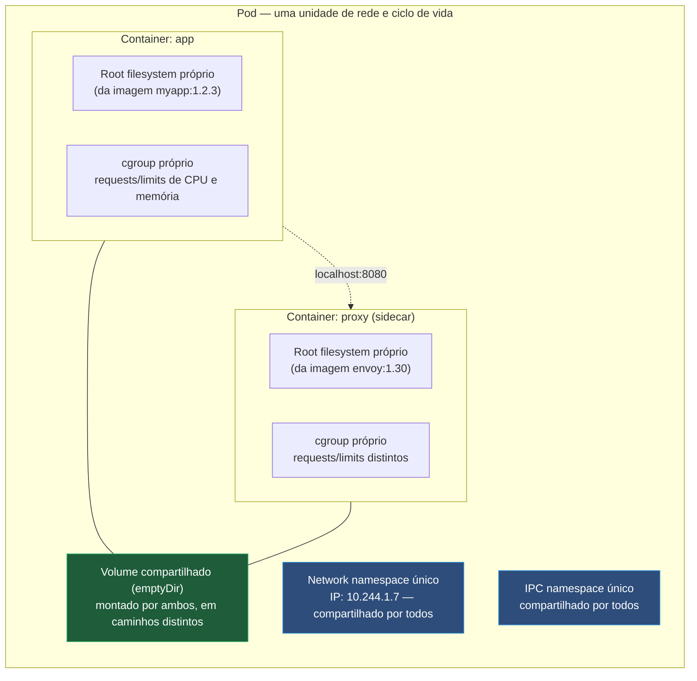
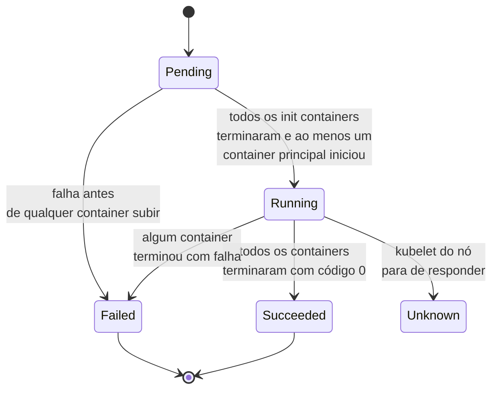
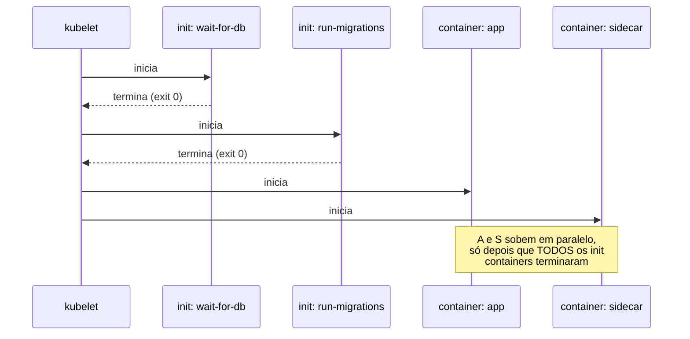
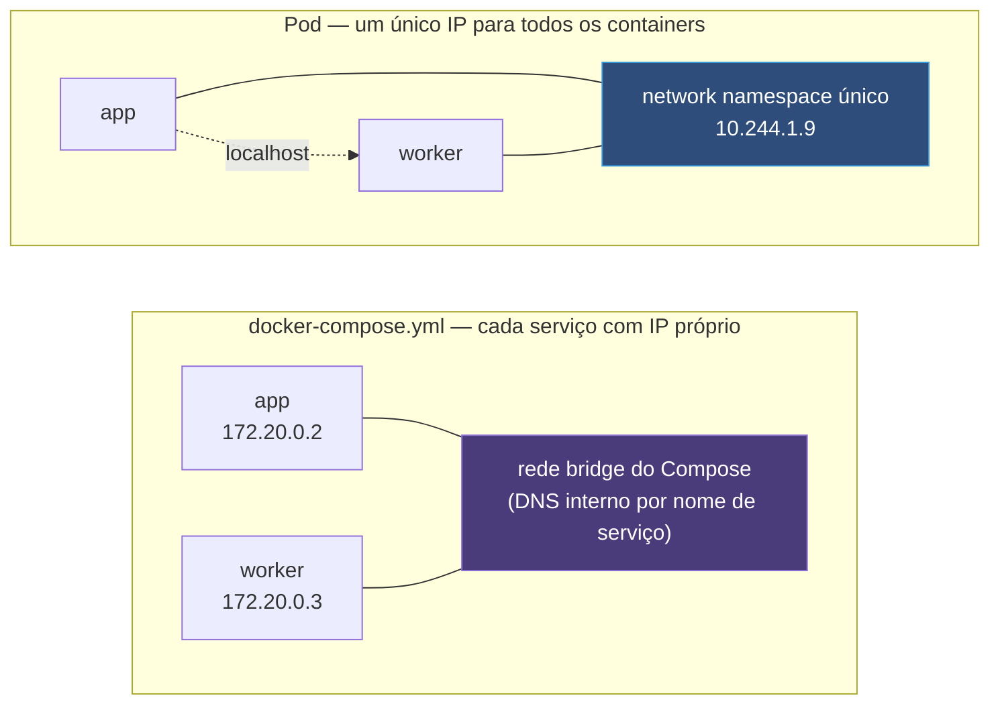

# O Pod, a unidade que não é o container

> [!abstract] TL;DR
> O Kubernetes não escalona containers, escalona Pods — e a diferença não é vocabulário, é arquitetura. Um Pod é um grupo de um ou mais containers que compartilham destino: mesmo IP, mesmo espaço de nomes de rede, os mesmos volumes, o mesmo nó, o mesmo instante de morte. Essa unidade existe porque alguns processos só fazem sentido colocados lado a lado — um proxy que intercepta o tráfego da aplicação, um coletor de logs que lê o mesmo disco, um script que precisa terminar antes do processo principal começar — e o container sozinho não tem como expressar "estes dois processos vivem e morrem juntos". O Pod também é, por design, descartável: não se cura sozinho, não guarda IP entre reencarnações, e por isso quase nunca se cria um à mão — ele precisa de alguém que o reconcilie, e é exatamente essa lacuna que abre a porta para a próxima nota.

Imagine um serviço HTTP comum: uma aplicação que expõe métricas, grava logs em arquivo, e precisa que um proxy de mTLS intercepte toda a rede antes que qualquer pacote chegue nela — um requisito comum quando um service mesh está no meio. Rodar isso como "só o container da aplicação" não fecha a conta: alguma coisa precisa estabelecer o túnel de rede antes da aplicação subir, e essa alguma coisa precisa enxergar exatamente a mesma interface de rede que a aplicação vai usar — não uma interface parecida, a mesma, no mesmo namespace. Se o proxy e a aplicação fossem dois containers Docker independentes, cada um teria seu próprio `network namespace`, cada um teria seu próprio IP, e "interceptar todo o tráfego antes que a aplicação o veja" exigiria uma ginástica de rede entre hosts que ninguém quer manter. O Kubernetes resolve isso não inventando um container mais poderoso, mas inventando uma unidade acima do container — o Pod — que agrupa processos que precisam compartilhar rede, disco e ciclo de vida como se fossem, para efeitos de rede e I/O, um único processo com várias caras.

Essa necessidade não é hipotética nem incomum: é recorrente o bastante para o Kubernetes tratar o Pod, e não o container, como a menor unidade que ele agenda, escala e observa. Todo objeto que "roda alguma coisa" — Deployment, StatefulSet, Job, DaemonSet — termina, no fundo, gerando Pods. Entender por que essa unidade existe, o que ela de fato compartilha, o que ela deliberadamente não compartilha, e por que ela é tratada como descartável é pré-requisito para tudo que vem depois neste galho: sem essa peça, "o Pod voltou sozinho" ou "o Pod ficou com IP diferente depois de reiniciar" parecem bugs, quando na verdade são o comportamento exatamente projetado.

Vale um parágrafo situando o tamanho real dessa ideia antes de entrar no mecanismo: praticamente todo `kubectl get` que alguém roda contra um cluster real — Pods, mas também tudo que aparece em Deployments, ReplicaSets, StatefulSets, Jobs e DaemonSets, cada um deles um gerador de Pods sob uma política diferente de quando e como recriá-los — aponta, em algum nível, de volta para este objeto único. Não é exagero dizer que as dezenove notas restantes deste galho, das que tratam de rede às que tratam de scheduling e do kubelet, descrevem coisas que, direta ou indiretamente, giram em torno de Pods: como encontrá-los (Service, Ingress), como configurá-los sem hardcode (ConfigMap, Secret), como distribuí-los entre nós (Scheduling), e como o próprio kubelet os transforma, por fim, em processos reais rodando sobre um kernel Linux (nota 17). Dominar o vocabulário desta nota — network namespace compartilhado, cgroup por container, `pause`, fases, `restartPolicy` — paga dividendos em cada uma dessas notas seguintes.

## Por que a unidade não podia ser o container

O container, na forma como o Docker o expõe, é isolado por padrão em quase todas as dimensões que o kernel Linux oferece: seu próprio `network namespace` (sua própria pilha de rede, seu próprio IP, suas próprias portas), seu próprio `mount namespace` (sua própria visão de sistema de arquivos, construída a partir das camadas descritas em [[03-Dominios/Tecnologia/Infraestrutura/Docker/02 - A anatomia de uma imagem|A anatomia de uma imagem]]), seu próprio `PID namespace` (sua própria árvore de processos, começando do PID 1). Esse isolamento é exatamente o que torna um container seguro para rodar ao lado de outro sem interferência — e é também exatamente o que impede dois containers de colaborarem de perto sem ajuda externa. Um proxy de rede não consegue interceptar o tráfego de outro container por padrão, porque cada um vive na sua própria pilha de rede; um coletor de logs não consegue ler os arquivos de outro container por padrão, porque cada um vive no seu próprio `mount namespace`.

O Kubernetes precisava de uma unidade que pudesse dizer "estes processos específicos, apesar de rodarem como containers separados — com seus próprios binários, suas próprias imagens, seus próprios ciclos de build — devem abrir mão de parte desse isolamento entre si, mantendo isolamento total contra qualquer coisa de fora do grupo". Não existia essa unidade nem no Docker nem no runtime de containers isolado; o Kubernetes teve que criá-la, e o nome que escolheu foi Pod — uma alusão deliberada a uma vagem de ervilhas, várias sementes (containers) dentro de um único invólucro (o Pod).

Vale registrar o que essa escolha evita: se o Kubernetes tivesse optado por "um container por unidade agendável, sempre", qualquer padrão que exigisse dois processos coordenados na mesma rede — proxy, agente de observabilidade, script de inicialização — teria que ser resolvido dentro de uma única imagem, com um único processo supervisor gerenciando sub-processos manualmente (o antipadrão de empacotar `supervisord` dentro de uma imagem Docker, que a nota [[03-Dominios/Tecnologia/Infraestrutura/Docker/08 - ENTRYPOINT, CMD e o container que não morre direito|ENTRYPOINT, CMD e o container que não morre direito]] já desaconselha por outras razões). O Pod resolve isso um nível acima: mantém cada processo em seu próprio container, com sua própria imagem e seu próprio ciclo de build, mas agrupa os containers que precisam colaborar de perto numa unidade que o scheduler trata como indivisível — todos os containers de um Pod são agendados juntos, no mesmo nó, sempre.

## O que os containers de um Pod compartilham de fato

Três coisas concretas, e vale nomear cada uma com precisão, porque "compartilham tudo" é impreciso e "compartilham rede" sozinho é incompleto.

A primeira é o **network namespace**. Todos os containers de um Pod compartilham a mesma pilha de rede: o mesmo endereço IP, atribuído ao Pod como um todo, não a cada container individualmente; e, por consequência direta, o mesmo espaço de portas — dois containers do mesmo Pod não podem escutar na mesma porta, porque do ponto de vista da rede eles são o mesmo host. É essa propriedade que permite a um container do Pod falar com outro usando `localhost`, exatamente como dois processos na mesma máquina física conversariam sem passar por nenhum DNS ou roteamento — um proxy no Pod pode escutar em `localhost:15001` e encaminhar para a aplicação em `localhost:8080` sem que nenhum dos dois precise saber o IP real do Pod.

A segunda é o **IPC namespace** — o espaço de comunicação entre processos que o kernel Linux oferece via memória compartilhada POSIX ou semáforos System V. Containers do mesmo Pod compartilham esse namespace, o que permite, em cenários menos comuns mas reais, dois processos de containers diferentes se comunicarem via memória compartilhada como se fossem processos irmãos na mesma máquina — o mesmo mecanismo de baixo nível que [[03-Dominios/Ciência/Sistemas Operacionais/09 - Comunicação entre processos (IPC)|Comunicação entre processos (IPC)]] descreve em detalhe no domínio de Sistemas Operacionais.

A terceira são os **volumes declarados no Pod**. Um volume definido no `spec.volumes` do Pod pode ser montado por mais de um container através de `volumeMounts`, cada um escolhendo seu próprio caminho de montagem — o mesmo dado físico, visto em dois pontos diferentes da árvore de arquivos de cada container. É esse mecanismo que permite a um container gravar um arquivo de log e a outro lê-lo, sem que nenhum precise expor uma API de rede só para isso; e é o mecanismo que sustenta o padrão sidecar de logging descrito mais adiante nesta nota. Volumes de aplicação — os que sobrevivem à morte do Pod, os que existem fora do ciclo de vida efêmero descrito aqui — são assunto de outra nota do galho, não desta; aqui importa só a propriedade de compartilhamento entre containers do mesmo Pod, que existe mesmo para volumes efêmeros (`emptyDir`) que nascem e morrem com o próprio Pod.



Vale nomear, ainda nesta seção, uma via de escape que existe mas que é exceção deliberada, não o caminho comum: um Pod pode declarar `hostNetwork: true`, e nesse caso ele abre mão até do namespace de rede próprio criado pelo `pause`, passando a compartilhar diretamente a pilha de rede do nó onde está agendado — os containers desse Pod enxergam as mesmas interfaces e portas que qualquer processo rodando nativamente naquele nó veria. Existe um par equivalente para os outros dois namespaces mencionados, `hostPID` e `hostIPC`, cada um abrindo mão do respectivo isolamento em favor de visibilidade direta sobre o nó. Esse é um recurso real, usado por ferramentas de infraestrutura que precisam operar no nível do nó (agentes de monitoramento de baixo nível, certos componentes de CNI), mas é uma exceção que abre mão exatamente da propriedade que esta nota descreve como padrão — Pods de aplicação comuns não deveriam declarar nenhuma dessas três flags sem uma razão operacional específica e documentada, porque cada uma delas remove uma camada de isolamento que existe por padrão para proteger o nó de um Pod comprometido.

## O que cada container do Pod continua tendo só para si

Compartilhar rede, IPC e volumes declarados não significa que os containers de um Pod se fundem num só. Duas coisas permanecem isoladas por container, mesmo dentro do mesmo Pod, e a confusão sobre esse ponto costuma gerar expectativa errada de quem já ouviu falar em "compartilham tudo".

A primeira é o **filesystem raiz**: cada container do Pod continua tendo seu próprio `mount namespace` para o rootfs, construído a partir da sua própria imagem, com as próprias camadas descritas em [[03-Dominios/Tecnologia/Infraestrutura/Docker/02 - A anatomia de uma imagem|A anatomia de uma imagem]]. Um container não enxerga o `/` de outro; um binário instalado no container da aplicação não aparece magicamente no container do proxy, mesmo que os dois estejam no mesmo Pod. O que se compartilha é apenas o que foi explicitamente declarado como volume — o resto do filesystem de cada container é tão isolado do outro quanto seria em Pods completamente diferentes.

A segunda é o **cgroup de recursos** — CPU e memória. Cada container dentro do Pod tem seu próprio bloco `resources.requests` e `resources.limits`, e o kubelet aplica isolamento de cgroup por container, não por Pod como bloco único indivisível. Isso quer dizer que o container do proxy pode ter um limite de memória de 128Mi enquanto o container da aplicação tem 512Mi, e um vazamento de memória num não derruba diretamente o outro por estourar um teto compartilhado — cada um tem o próprio teto. (O Pod como um todo tem, sim, uma soma efetiva desses limites que conta para o agendamento no nó — isso é assunto de scheduling, nota adiante no galho — mas o *enforcement* de estouro de memória e de CPU throttling acontece no nível do container, não do Pod.) Requests e limits em si, como valores e como política de QoS, pertencem à nota [[03-Dominios/Engenharia/Operação/3 - Rodar em produção/02 - O contrato de produção do Kubernetes|O contrato de produção do Kubernetes]] — aqui basta reter que a fronteira de isolamento de CPU e memória segue o container, não o Pod.

## O container invisível que segura tudo isso junto: `pause`

Existe um detalhe de implementação que raramente aparece em `kubectl get pods`, mas que explica mecanicamente como o compartilhamento de rede descrito acima é sustentado: para cada Pod, o runtime de container cria, antes de qualquer container declarado no manifesto, um container de infraestrutura minúsculo — historicamente chamado de `pause` (a imagem de referência é algo como `registry.k8s.io/pause:3.9`, o número de versão muda entre releases do Kubernetes) — cuja única função é criar e manter vivo o `network namespace` (e, dependendo da configuração do runtime, o IPC namespace) que todos os containers "de verdade" daquele Pod vão compartilhar.

O processo do container `pause` não faz nada além de existir: tipicamente ele chama uma syscall que o coloca dormindo indefinidamente, sem consumir CPU nem produzir qualquer saída. Sua função não é executar lógica de aplicação, é ser o dono estável do namespace de rede — os containers reais do Pod entram nesse mesmo namespace (tecnicamente, são criados apontando para o namespace que o `pause` já possui) em vez de criar o seu próprio. Isso resolve um problema de ciclo de vida que, de outra forma, seria desconfortável: containers de aplicação podem morrer e reiniciar (uma falha, um `OOMKilled`, uma atualização de imagem) sem que o Pod precise recriar o `network namespace` inteiro e, com ele, mudar o IP do Pod a cada reinício de um único container dentro dele. O `pause` é o que garante que o IP do Pod sobrevive a um restart individual de qualquer um de seus containers — desde que o próprio Pod, como objeto, continue de pé.

> [!info] Baseline de versão
> A existência e o papel do container `pause` são estáveis desde as primeiras versões do Kubernetes e continuam válidos em clusters correntes (2026) com containerd ou CRI-O como runtime. O nome da imagem e seu número de versão específico mudam entre releases do Kubernetes; o mecanismo — um processo mínimo dono do namespace de rede compartilhado — não muda. `kubectl` não lista o `pause` como um container do Pod porque ele não aparece em `spec.containers`; ele é gerido pelo runtime, não declarado pelo usuário.

## Vendo o compartilhamento de rede com as próprias mãos

A melhor forma de confirmar que dois containers do mesmo Pod realmente compartilham a mesma pilha de rede é forçar o cenário, em vez de confiar apenas na explicação. Aplique o manifesto multi-container mostrado mais adiante nesta nota (ou qualquer Pod com dois containers à disposição) e rode, a partir de um container, um servidor simples numa porta; a partir do outro, tente alcançá-lo por `localhost`:

```bash
# No container "log-shipper", suba um servidor HTTP trivial na porta 9000.
kubectl exec -it app-com-sidecar-e-init -c log-shipper -- sh -c "echo ok | nc -l -p 9000 &"

# No container "minha-api", do mesmo Pod, alcance essa porta via localhost —
# não pelo IP do Pod, não por nenhum nome de serviço, só localhost mesmo.
kubectl exec -it app-com-sidecar-e-init -c minha-api -- sh -c "nc localhost 9000"
```

Se a resposta `ok` chega no segundo comando, a prova está feita: dois containers, duas imagens completamente distintas, dois processos com PIDs próprios — mas uma única pilha de rede, alcançável por `localhost` como se fossem dois processos comuns na mesma máquina. Repita o experimento tentando o mesmo `nc localhost 9000` a partir de um container de um Pod **diferente**, e a conexão simplesmente falha — não existe pilha de rede compartilhada entre Pods distintos, só dentro do mesmo Pod, exatamente a fronteira que esta nota descreve.

## O que mais o network namespace compartilhado implica na prática

Vale desenvolver uma consequência prática do network namespace único que passa despercebida até alguém precisar depurar um Pod de verdade: como todos os containers de um Pod compartilham a mesma pilha de rede, eles também compartilham a mesma entrada de resolução de nomes — o mesmo `/etc/resolv.conf`, o mesmo `/etc/hosts` gerado pelo kubelet para aquele Pod especificamente. Um container que faz `nslookup meu-servico` dentro de um Pod recebe exatamente a mesma resolução que qualquer outro container do mesmo Pod receberia, porque a consulta DNS sai pela mesma interface de rede, na mesma direção, para o mesmo resolvedor. Isso significa que depurar problema de DNS dentro de um Pod multi-container é indiferente a qual dos containers você usa para rodar o teste — o resultado deveria ser idêntico nos dois, e se não for, o problema não está na rede do Pod, está em alguma diferença de configuração de aplicação entre os containers (uma variável de ambiente com um resolvedor customizado, por exemplo).

Essa mesma propriedade também explica por que `kubectl exec` exige, sempre que o Pod tem mais de um container, que se informe qual container é o alvo do comando — a flag `-c` (ou `--container`):

```bash
# Com um único container, o kubectl escolhe automaticamente.
kubectl exec -it app-com-sidecar-e-init -- sh

# Com mais de um, é obrigatório dizer qual.
kubectl exec -it app-com-sidecar-e-init -c minha-api -- sh
kubectl exec -it app-com-sidecar-e-init -c log-shipper -- sh
```

Repare que o alvo do `exec` é sempre um **container**, nunca "o Pod" como um todo — não existe um shell que rode "no Pod" sem pertencer a nenhum dos containers, exatamente porque o Pod não é ele mesmo um processo executável, é o invólucro que agrupa os processos que de fato executam. O mesmo raciocínio vale para `kubectl logs`: sem especificar `-c`, o comando falha ou escolhe um padrão ambíguo assim que há mais de um container — cada container tem seu próprio fluxo de saída padrão, capturado separadamente pelo runtime, mesmo compartilhando rede com os demais.

## As fases do Pod: o `status.phase` que o loop de reconciliação observa

Um Pod, como qualquer objeto do Kubernetes, tem `spec` (o que foi declarado) e `status` (o que foi observado) — e o campo mais grosso desse `status`, `phase`, resume em uma palavra só onde o Pod está no seu ciclo de vida. Vale nomear as cinco fases possíveis, porque elas aparecem direto em qualquer `kubectl get pods` e costumam ser o primeiro sinal de que algo não convergiu.

| Fase | O que significa | Sinal comum de problema associado |
| --- | --- | --- |
| `Pending` | O Pod foi aceito pelo cluster, mas ao menos um container ainda não está rodando | Sem nó com recursos suficientes; imagem ainda sendo baixada; init container ainda rodando |
| `Running` | O Pod foi associado a um nó e todos os containers foram criados; ao menos um está rodando | Estado normal — não implica que a aplicação esteja saudável, só que o processo existe |
| `Succeeded` | Todos os containers do Pod terminaram com sucesso e não serão reiniciados | Comum em Pods de Job, incomum em Pods de longa duração |
| `Failed` | Todos os containers terminaram, e ao menos um terminou com falha | A `restartPolicy` do Pod determina se ele é recriado ou fica parado nesse estado |
| `Unknown` | O estado do Pod não pôde ser obtido, tipicamente por falha de comunicação com o nó | Nó inacessível, kubelet não respondendo — o control plane literalmente não sabe |

Note que `Running` não é sinônimo de "saudável" — é só a confirmação de que o processo existe e ao menos um container está de pé; se a aplicação está de fato pronta para receber tráfego é uma pergunta diferente, respondida pela readiness probe, e o comportamento do que fazer quando as probes falham — período de graça, reinícios, remoção de endpoints — pertence à nota [[03-Dominios/Engenharia/Operação/3 - Rodar em produção/02 - O contrato de produção do Kubernetes|O contrato de produção do Kubernetes]], não a esta.



## Ordem estrita entre múltiplos init containers

Quando existe mais de um init container declarado, a ordem de execução segue exatamente a ordem em que aparecem na lista `spec.initContainers` — nunca em paralelo, sempre sequencial, e cada um precisa terminar com código de saída zero antes do próximo começar. O diagrama abaixo trabalha um caso com dois init containers e dois containers principais, deixando visível onde o paralelismo começa (só depois que a fase de inicialização termina por completo):



Se `run-migrations` falhar, `app` e `sidecar` nunca chegam a subir naquele ciclo — o kubelet reinicia o Pod inteiro (respeitando `restartPolicy` e o backoff exponencial entre tentativas) e recomeça pela primeira fase, `wait-for-db`, não de onde parou. Não existe retomada parcial da sequência de init containers: ou a cadeia inteira termina com sucesso, ou o Pod não avança para os containers principais.

## Os padrões de composição multi-container

Três padrões cobrem a esmagadora maioria dos casos reais de Pod com mais de um container, e cada um resolve um problema diferente com a mesma mecânica de compartilhamento descrita acima.

**Sidecar** é o padrão mais comum: um segundo container que roda ao lado do container principal, durante toda a vida do Pod, estendendo ou interceptando o comportamento do primeiro sem alterar seu código. Um proxy de service mesh que intercepta todo o tráfego de rede da aplicação é um sidecar; um agente que lê os logs escritos em um volume compartilhado e os encaminha para um sistema de agregação é outro. O sidecar não é "menos importante" que o container principal — ele apenas cumpre um papel auxiliar, e os dois sobem e descem juntos como parte do mesmo Pod.

**Ambassador** (às vezes chamado de adapter, embora os dois termos capturem nuances ligeiramente diferentes do mesmo princípio geral) é um sidecar especializado em normalizar a comunicação de saída ou entrada da aplicação: um container que expõe uma porta local simples e traduz aquilo, por trás, para um protocolo mais complexo — descobrir múltiplos endpoints de um serviço remoto, aplicar retry e circuit breaking, ou converter um formato de métricas específico da aplicação para o formato que um coletor genérico espera. A aplicação principal continua falando com `localhost` como se estivesse conversando com um serviço trivial; toda a complexidade de rede ou de formato fica isolada no container ambassador.

**Init container** resolve um problema diferente dos dois anteriores: containers declarados em `spec.initContainers` rodam **antes** de qualquer container de `spec.containers`, em ordem estrita — o segundo init container só começa depois que o primeiro terminar com sucesso (código de saída zero), e o primeiro container principal só começa depois que o último init container tiver terminado. Se um init container falha, o kubelet reinicia aquele Pod (sujeito à `restartPolicy` do Pod) até o init container ter sucesso ou até esgotar as tentativas configuráveis — o Pod inteiro fica preso na fase `Init` até essa condição ser satisfeita. É o padrão certo para "espere o banco de dados aceitar conexões antes de subir a aplicação", "baixe um arquivo de configuração remoto antes de iniciar", ou "rode uma migração de schema uma única vez antes do processo principal existir".

> [!info] Baseline de versão — sidecars nativos via init container
> O recurso de sidecar containers nativos (KEP-753) permite declarar um container dentro de `spec.initContainers` com o campo adicional `restartPolicy: Always`. Um init container marcado dessa forma continua rodando durante toda a vida do Pod, em vez de terminar antes dos containers principais subirem — na prática, um sidecar que garante ordem de inicialização (sobe e fica pronto antes da aplicação) e ordem de término, sem precisar do truque anterior de scripts de espera dentro do próprio container da aplicação. A maturação foi gradual: o feature gate `SidecarContainers` está **ligado por padrão desde a versão 1.29**, e o recurso foi marcado como **estável na versão 1.33**. Antes dele, sidecars eram declarados apenas em `spec.containers` comuns, sem garantia nenhuma de ordem de início em relação ao container principal — o que forçava padrões manuais de espera (como o `wait-for-db` do exemplo abaixo) quando a ordem importava. Em cluster mais antigo que 1.29, o padrão manual continua sendo o caminho.

## Um exemplo trabalhado do padrão ambassador

Vale desenvolver o padrão ambassador com um cenário concreto, porque a diferença entre ele e um sidecar genérico costuma ficar abstrata sem um exemplo. Considere uma aplicação legada que só sabe falar com um único endereço de banco de dados fixo, gravado décadas atrás no seu código, sem nenhuma lógica de descoberta de serviço nem de retry. O cluster, por outro lado, expõe o banco através de um Service (o objeto que a próxima nota deste galho introduz) cujo endereço pode mudar, e a política do time exige retry com backoff exponencial antes de desistir de uma conexão. Reescrever a aplicação legada para entender isso é caro ou impossível; o padrão ambassador resolve sem tocar no código dela.

```yaml
apiVersion: v1
kind: Pod
metadata:
    name: app-legada-com-ambassador
spec:
    containers:
        # A aplicação legada continua exatamente como sempre foi: conecta em
        # localhost:5433, um endereço fixo que nunca muda do ponto de vista dela.
        - name: app-legada
          image: app-legada:2.1
          env:
              - name: DATABASE_HOST
                value: "127.0.0.1"
              - name: DATABASE_PORT
                value: "5433"

        # O ambassador escuta em localhost:5433 e, por trás, resolve o Service
        # real do banco, aplica retry com backoff, e encaminha a conexão —
        # toda a complexidade fica isolada aqui, invisível para a app legada.
        - name: db-ambassador
          image: db-ambassador:1.0
          ports:
              - containerPort: 5433
          env:
              - name: UPSTREAM_SERVICE
                value: "postgres.default.svc.cluster.local:5432"
              - name: RETRY_BACKOFF_MAX_SECONDS
                value: "30"
```

O ponto a reter não é o formato exato desse `db-ambassador` (uma imagem hipotética, ilustrando o papel) — é a divisão de responsabilidade: a aplicação principal permanece simples e alheia à topologia real do cluster, e todo o conhecimento sobre onde o banco está e como se reconectar a ele fica isolado num segundo container, comunicando-se com o primeiro só via `localhost`, exatamente como o compartilhamento de network namespace permite.

## `restartPolicy`: quem decide se um container volta

O campo `spec.restartPolicy` do Pod — não de cada container individualmente, é uma propriedade do Pod como um todo — determina o que o kubelet faz quando um container termina, e vale conhecer as três opções com precisão, porque a escolha errada aqui costuma ser confundida com "o Pod não se cura sozinho" descrito na seção anterior.

| Valor | Comportamento quando um container termina | Uso típico |
| --- | --- | --- |
| `Always` (padrão) | Reinicia o container sempre, não importa o código de saída | Serviços de longa duração — a imensa maioria dos Deployments |
| `OnFailure` | Reinicia só se o container terminar com código de saída diferente de zero | Jobs que devem tentar de novo em caso de erro, mas parar quando terminarem com sucesso |
| `Never` | Nunca reinicia o container, independentemente do código de saída | Jobs de execução única onde uma falha deve ser tratada por fora, não retentada automaticamente pelo kubelet |

Note a fronteira exata dessa política: ela governa a **reinicialização de um container dentro do mesmo Pod**, sustentada localmente pelo kubelet do nó onde o Pod está agendado. Ela não tem nenhuma opinião sobre o que acontece se o **Pod inteiro** desaparecer — se o nó cai, se alguém roda `kubectl delete pod`, ou se o Pod é despejado (`Evicted`) por falta de recursos no nó. Essas situações escapam completamente do que `restartPolicy` controla, e é exatamente aí que a ausência de um controller de nível superior, descrita a seguir, se torna visível.

## Por que o Pod é descartável por design

Um Pod não tem identidade que sobrevive à sua própria morte, e essa não é uma limitação incidental — é uma escolha deliberada de design, com duas consequências concretas que vale nomear separadamente.

A primeira é o **IP efêmero**. O endereço IP atribuído a um Pod (o mesmo IP que o container `pause` fixa no namespace de rede compartilhado) pertence àquela instância específica do Pod, não ao "cargo" que o Pod ocupa. Quando um Pod morre e é substituído por outro — mesmo que o substituto tenha exatamente o mesmo nome de template, a mesma imagem, os mesmos labels — o novo Pod recebe um IP novo, potencialmente completamente diferente do anterior. Qualquer coisa que dependa de guardar o IP de um Pod em cache por mais que o tempo de vida daquele Pod específico está construindo sobre uma premissa falsa. É exatamente essa instabilidade de endereço que motiva a existência de um objeto com IP estável — assunto da próxima nota deste galho.

A segunda é a **ausência de autocura própria**. Um Pod, como objeto isolado, não tem embutido nele nenhum mecanismo que o traga de volta se ele morrer. Se você cria um Pod avulso — sem nenhum Deployment, ReplicaSet ou outro controller por trás dele — e o processo dentro dele falha, ou o nó onde ele rodava cai, aquele Pod específico simplesmente deixa de existir, e nada o substitui. Isso conecta direto com a lente deste galho: um Pod avulso não tem `spec` observado por nenhum controller além do próprio kubelet local, que só cuida dos containers *dentro* do Pod (reiniciando um container que falhou, conforme `restartPolicy`), não do Pod como um todo se o nó inteiro desaparecer. Não existe, para um Pod criado diretamente, nenhum loop de reconciliação de nível superior perguntando "ainda existem Pods suficientes rodando este template?" — porque não existe um objeto de nível superior declarando quantas réplicas deveriam existir. É por isso que criar um Pod à mão é, na prática, quase sempre um erro de modelagem fora de contextos de depuração pontual: o Pod avulso é órfão por construção, e um órfão não é reconciliado por ninguém.

Vale confirmar essa ausência de autocura com um experimento mental (e, se houver um cluster de teste à mão, um experimento real): crie um Pod avulso, anote seu nome e seu IP, e mate o processo principal de dentro do container com `kubectl exec <pod> -- kill 1`. Dependendo da `restartPolicy` declarada no Pod (`Always`, `OnFailure` ou `Never` — o kubelet, não um controller externo, decide reiniciar o container com base nesse campo), o container pode voltar a subir *dentro do mesmo Pod*, mas o Pod como objeto nunca é recriado por essa falha — ele continua existindo, com o mesmo nome, e é só o container dentro dele que reinicia. Agora repita o experimento matando o nó inteiro (ou, em ambiente de teste, simplesmente removendo o Pod com `kubectl delete pod`): nada o repõe. `kubectl get pods` simplesmente para de listar aquele nome, e não aparece nenhum Pod novo tentando ocupar o lugar dele — porque não existe, para um Pod avulso, nenhuma declaração de "deveriam existir N Pods deste template" para qualquer controller comparar contra a realidade observada.

Essa distinção — reinício de container dentro do mesmo Pod, sustentado pelo kubelet local, contra substituição do Pod inteiro, que exige um controller de nível superior — é o eixo que separa "o Pod tem alguma resiliência" de "o Pod, sozinho, tem resiliência suficiente para produção". A primeira existe; a segunda não, e é exatamente essa lacuna que motiva o objeto da próxima nota.

## Do Compose ao Pod: o que muda e o que permanece

Quem chega neste galho vindo de [[03-Dominios/Tecnologia/Infraestrutura/Docker/11 - Compose como ambiente de desenvolvimento|Compose como ambiente de desenvolvimento]] já conhece uma forma de declarar vários containers relacionados num único arquivo — e vale nomear explicitamente o que muda entre um `docker-compose.yml` e um Pod, porque a semelhança superficial (vários containers, um arquivo YAML, um `depends_on` que lembra a ordem de init containers) esconde uma diferença de fundo. No Compose, cada serviço declarado continua sendo, por padrão, uma unidade de rede isolada — o Compose cria uma rede bridge própria e cada container recebe seu próprio IP nessa rede, comunicando-se entre si por nome de serviço via DNS interno do Compose, não por `localhost`. Um Pod inverte essa premissa: os containers começam já dentro do mesmo namespace de rede, e `localhost` funciona entre eles desde o primeiro instante, sem nenhuma rede adicional a configurar.

Essa diferença explica por que replicar fielmente, em Kubernetes, um `docker-compose.yml` que assume `localhost` entre dois serviços historicamente exigia repensar a topologia — cada "serviço" do Compose que precisasse desse tipo de comunicação direta vira container do mesmo Pod, não Pods separados comunicando-se por rede. E explica também por que o Compose, mesmo com `depends_on` e `condition: service_healthy`, não tem equivalente rigoroso ao init container: `depends_on` no Compose ordena a **subida inicial**, mas não impede que o serviço dependente já esteja rodando (só não pronto) quando o dependido ainda está inicializando, dependendo da versão e da configuração de healthcheck usada — a garantia de ordem estrita, com bloqueio efetivo até o passo anterior terminar, é uma propriedade mais forte que o Pod oferece via `initContainers` por construção, não como configuração opcional.



## Volumes efêmeros dentro do Pod: além do `emptyDir` básico

O `emptyDir` usado no manifesto mais adiante nesta nota tem uma variação que vale nomear, porque aparece com frequência em cenários de performance: por padrão, um `emptyDir` é apoiado no disco do nó (ou, dependendo da configuração do cluster, num volume de armazenamento efêmero configurado à parte), mas pode ser declarado como apoiado em memória, com `emptyDir: {medium: Memory}`. Nesse modo, o "arquivo" compartilhado entre os containers do Pod nunca toca disco — vive inteiramente em RAM, como um `tmpfs` do Linux — o que o torna significativamente mais rápido para cenários de troca intensiva de dados entre containers do mesmo Pod, ao custo de contar contra o limite de memória do Pod e de ser perdido por completo (não só descartado, perdido) se o Pod for reiniciado. Nenhuma das duas variantes de `emptyDir` sobrevive à morte do Pod — a diferença entre elas é só onde o dado mora enquanto o Pod está vivo, não por quanto tempo ele sobrevive.

## Containers efêmeros: um quarto tipo, só para depuração

Vale nomear um quarto tipo de container que um Pod pode receber, distinto dos três já vistos (`initContainers`, `containers`, e os containers de infraestrutura como o `pause`): o **container efêmero** (`ephemeralContainers`), injetado num Pod já em execução, sem reiniciar nenhum dos containers existentes, com o único propósito de depurar. `kubectl debug` é o comando que expõe esse recurso na prática:

```bash
kubectl debug -it app-com-sidecar-e-init --image=busybox:1.36 --target=minha-api
```

Esse comando injeta um novo container (usando a imagem `busybox`, escolhida por trazer ferramentas básicas de shell que a imagem de produção da aplicação pode não ter) dentro do Pod já existente, compartilhando o mesmo network namespace que os demais — e, com a flag `--target`, compartilhando também o namespace de processos do container alvo, o que permite inspecionar os processos do `minha-api` de dentro do container de depuração, algo particularmente útil quando a imagem de produção é minimalista (`distroless`, por exemplo) e não tem nem `sh` disponível para um `kubectl exec` convencional resolver.

O container efêmero não aparece em `spec.containers` nem em `spec.initContainers` do manifesto original — ele é adicionado depois, via subrecurso próprio da API, e **não é recriado** se o Pod for substituído: ele existe só enquanto aquele Pod específico existir, e uma vez removido não pode ser reexecutado sem injetar outro novo. Essa é mais uma manifestação da mesma regra vista para imagens Docker em [[03-Dominios/Tecnologia/Infraestrutura/Docker/02 - A anatomia de uma imagem|A anatomia de uma imagem]]: nada se edita in-place de forma persistente — o container efêmero é uma janela temporária de inspeção, não uma alteração duradoura da definição do Pod.

> [!info] Baseline de versão
> Containers efêmeros passaram por um período de maturação como recurso alpha e depois beta ao longo de várias versões, e foram promovidos a **estáveis na versão 1.25**. Em qualquer cluster corrente (2026) o recurso está disponível por padrão, e `kubectl debug` é a forma suportada de usá-lo. A restrição que permanece não é de disponibilidade, e sim de desenho: um container efêmero não pode ser removido depois de adicionado, e o Pod precisa continuar existindo — se o container principal já entrou em `CrashLoopBackOff` e o Pod está sendo recriado, não há Pod estável onde anexar o container de debug.

## Cattle, não pet: a metáfora que resume o design

A indústria de operações costuma resumir essa filosofia com uma metáfora curta, cunhada bem antes do Kubernetes existir mas que descreve com precisão o que este objeto encarna: servidores tratados como **pets** recebem nome próprio, são cuidados individualmente, e sua perda é um evento grave que exige recuperação cuidadosa; servidores tratados como **cattle** (gado) são numerados, não nomeados, e a perda de um indivíduo é rotina — o rebanho continua, um substituto surge, ninguém chora a perda do animal específico. Um Pod é gado por construção: seu nome, quando gerado por um controller, carrega um sufixo aleatório sem significado semântico; seu IP não é reservado para ele; sua morte não é um evento excepcional a ser investigado com urgência, é o esperado, contanto que outro Pod substitua o papel que ele ocupava.

| Dimensão | Pet (servidor tradicional) | Cattle (Pod no Kubernetes) |
| --- | --- | --- |
| Identidade | Nome próprio, significativo, reutilizado após manutenção | Nome gerado, com sufixo aleatório, descartado ao morrer |
| Endereço de rede | Fixo, reservado, documentado à parte | Efêmero, atribuído no nascimento, perdido na morte |
| Reação a uma falha | Investigação individual, recuperação do mesmo servidor | Substituição por um novo indivíduo, sem investigação forçada |
| Escala | Verticalmente, reforçando o mesmo indivíduo | Horizontalmente, multiplicando indivíduos idênticos |

Essa metáfora não é só folclore de palestra: ela explica por que, no Kubernetes, "restaurar o Pod que caiu" nunca é a operação certa — o Pod que caiu não é restaurado, é substituído por outro, criado do zero a partir do mesmo template. A pergunta certa nunca é "como eu recupero aquele Pod específico", é "o que garante que sempre existe um Pod suficiente rodando aquele template" — e é exatamente aí que a próxima nota entra.

## Manifesto completo: um Pod multi-container comentado

O manifesto abaixo reúne, num único exemplo trabalhado, os três conceitos desenvolvidos nesta nota: um init container que espera uma dependência ficar pronta, um container principal de aplicação, e um sidecar que compartilha um volume efêmero com a aplicação para coletar seus logs.

```yaml
apiVersion: v1
kind: Pod
metadata:
    name: app-com-sidecar-e-init
    labels:
        app: minha-api
spec:
    # Roda ANTES de qualquer container de spec.containers, em ordem estrita.
    # Este espera o banco aceitar conexões na porta 5432 antes de liberar o Pod
    # para seguir adiante — sem isso, a aplicação subiria e falharia ao tentar
    # conectar num banco que ainda não está pronto.
    initContainers:
        - name: wait-for-db
          image: busybox:1.36
          command: ['sh', '-c', 'until nc -z db.default.svc.cluster.local 5432; do echo aguardando banco; sleep 2; done']
          resources:
              requests:
                  cpu: "10m"
                  memory: "16Mi"

    containers:
        # Container principal — o processo que a aplicação de fato executa.
        - name: minha-api
          image: minha-api:1.2.3
          ports:
              - containerPort: 8080
          resources:
              requests:
                  memory: "256Mi"
                  cpu: "250m"
              limits:
                  memory: "512Mi"
                  cpu: "500m"
          volumeMounts:
              # A aplicação grava logs aqui; o sidecar lê do mesmo caminho lógico
              # através do seu próprio ponto de montagem, mais abaixo.
              - name: logs-compartilhados
                mountPath: /var/log/app

        # Sidecar — não é a aplicação, mas roda durante toda a vida do Pod,
        # lendo o mesmo volume que a aplicação escreve, via localhost e via
        # volume, nunca via rede externa ao Pod.
        - name: log-shipper
          image: fluent/fluent-bit:3.0
          resources:
              requests:
                  memory: "64Mi"
                  cpu: "50m"
              limits:
                  memory: "128Mi"
                  cpu: "100m"
          volumeMounts:
              - name: logs-compartilhados
                mountPath: /var/log/app
                readOnly: true

    # emptyDir: um volume que nasce vazio quando o Pod é criado e morre com
    # o Pod — não é armazenamento durável, é só o meio de comunicação entre
    # os dois containers acima enquanto ambos vivem no mesmo Pod.
    volumes:
        - name: logs-compartilhados
          emptyDir: {}
```

Repare no que este manifesto não declara: nenhuma contagem de réplicas, nenhuma estratégia de atualização, nenhuma política de reinício em caso de falha do nó inteiro. Um Pod, sozinho, não tem vocabulário para expressar nenhuma dessas ideias — ele descreve um único agrupamento de containers, uma vez, sem opinião sobre quantas cópias dele deveriam existir no cluster nem sobre o que fazer se ele desaparecer. Isso não é uma lacuna acidental do formato; é a fronteira exata de responsabilidade do objeto, e é exatamente essa fronteira que o próximo objeto do galho preenche.

## `qosClass`: uma consequência colateral de `requests` e `limits`

Vale registrar, de passagem, uma consequência do jeito como `requests` e `limits` são declarados por container (não pelo Pod como bloco) que reaparece direto quando o nó fica sob pressão de memória: o Kubernetes deriva, automaticamente, uma classe de qualidade de serviço (`status.qosClass`) para cada Pod, a partir da combinação de `requests` e `limits` de todos os seus containers. Um Pod recebe `Guaranteed` quando todo container declara `limits` igual a `requests` para CPU e memória; recebe `BestEffort` quando nenhum container declara `requests` nem `limits`; e recebe `Burstable` em qualquer combinação intermediária — que é, na prática, a mais comum. Essa classificação não é cosmética: ela é exatamente o critério que o kubelet usa para decidir qual Pod despejar primeiro (`Evicted`) quando o nó fica sob pressão de memória, começando pelos `BestEffort`, depois os `Burstable` que mais excedem seus `requests`, deixando os `Guaranteed` como últimos candidatos. O detalhamento completo dessa política de despejo, os thresholds de pressão de memória e disco, e como dimensionar `requests`/`limits` para uma carga real pertencem à nota [[03-Dominios/Engenharia/Operação/3 - Rodar em produção/02 - O contrato de produção do Kubernetes|O contrato de produção do Kubernetes]] — aqui importa só reconhecer que a classe deriva diretamente da forma como esta nota descreveu o isolamento de recursos por container, não por Pod.

## A morte de um Pod também segue um protocolo, não é instantânea

Vale fechar o ciclo de vida descrito nesta nota com o outro extremo: assim como um Pod não nasce instantaneamente (passa por `Pending`, espera init containers, só então chega a `Running`), ele também não morre num único instante quando alguém pede sua remoção. Ao receber uma ordem de exclusão, o kubelet envia um sinal `SIGTERM` para o processo principal de cada container e aguarda até `terminationGracePeriodSeconds` (30 segundos por padrão) antes de enviar um `SIGKILL` incondicional para qualquer processo que ainda esteja de pé. Durante essa janela, o Pod aparece com um estado de "terminando" em `kubectl get pods`, mas os containers continuam tecnicamente rodando — o que importa, para qualquer processo que precise encerrar conexões em andamento ou finalizar uma transação, é usar esse intervalo para desligar de forma ordenada, não ser interrompido de supetão.

Esse mecanismo — o sinal, o prazo de graça, o que uma aplicação deveria fazer com ele, e como isso se combina com a remoção do Pod das listas de destino de tráfego antes mesmo do `SIGTERM` ser enviado — é tratado com profundidade própria na nota [[03-Dominios/Engenharia/Operação/3 - Rodar em produção/03 - Zero-downtime e alta disponibilidade|Zero-downtime e alta disponibilidade]], porque a política correta de graceful shutdown depende de decisões de produção que vão além do objeto Pod isoladamente. O que cabe reter aqui é só a simetria: o Pod tem um protocolo de nascimento (init containers, em ordem, antes dos principais) e um protocolo de morte (sinal, prazo de graça, só então término forçado) — nenhum dos dois extremos do ciclo de vida é instantâneo, e ambos são geridos pelo kubelet local, não por nenhum controller de nível superior.

## Armadilhas comuns

> [!warning] Achar que "Pod" e "container" são sinônimos em documentação e em ferramentas de terceiros
> Muita ferramenta de observabilidade, muito artigo genérico e até times experientes usam os dois termos de forma intercambiável — "reiniciei o container" quando, tecnicamente falando de Kubernetes, o que existe como objeto agendável e observável é o Pod. Isso raramente causa problema em conversas informais, mas causa confusão real na hora de ler eventos do cluster: um evento de `OOMKilled` é reportado por container, dentro de um Pod que pode continuar de pé; um evento de `Evicted` é reportado no nível do Pod inteiro. Saber qual granularidade cada mensagem de erro está usando evita diagnosticar o problema errado.

> [!warning] Esperar que dois containers do mesmo Pod possam escutar na mesma porta
> Como os containers de um Pod compartilham o mesmo `network namespace`, eles compartilham o mesmo espaço de portas — exatamente como dois processos na mesma máquina física não podem escutar na mesma porta TCP ao mesmo tempo. Um sidecar de proxy que precisa interceptar tráfego na porta 8080 e um container de aplicação que também tenta escutar na 8080 diretamente vão colidir; a solução usual é o proxy escutar numa porta diferente e redirecionar internamente, não os dois disputarem a mesma porta.

> [!warning] Criar um Pod avulso em produção "só para testar rápido" e esquecer dele
> Um Pod criado diretamente, sem Deployment por trás, não é recriado se falhar nem se o nó cair — e também não aparece automaticamente em nenhum painel que liste "réplicas esperadas versus réplicas existentes", porque não existe `spec.replicas` declarando expectativa nenhuma. É comum um Pod de depuração criado assim ficar esquecido, consumindo recursos do nó indefinidamente, sem nenhum controller reconciliando sua existência — nem para mantê-lo vivo, nem para constatar que ele deveria ter sido removido.

> [!warning] Presumir que o IP do Pod é estável entre reinícios do próprio Pod
> Mesmo dentro da vida de um único Pod, uma reinicialização de container individual (por exemplo, um `OOMKilled` seguido de restart automático conforme a `restartPolicy`) não muda o IP, porque o `pause` mantém o namespace de rede de pé enquanto o Pod, como objeto, continua existindo. Mas se o Pod inteiro for removido e recriado — mesmo com o nome idêntico, gerado por um controller que decidiu substituí-lo — o IP quase certamente muda. A distinção entre "o mesmo Pod reiniciando um container" e "um Pod novo substituindo o antigo" é exatamente onde essa suposição costuma quebrar.

> [!warning] Esquecer que `resources.limits` de memória é aplicado por container, não somado e aplicado ao Pod como bloco único
> É comum, ao somar mentalmente o consumo esperado de um Pod multi-container, esquecer que o kernel não aplica um teto único de memória ao Pod inteiro — cada container tem seu próprio cgroup, com seu próprio `limits.memory`. Um sidecar de coleta de logs configurado sem limite algum pode crescer indefinidamente e ser terminado por `OOMKilled` de forma completamente independente da aplicação principal, mesmo que a aplicação principal esteja consumindo bem menos que seu próprio teto. Dimensionar `requests` e `limits` de cada container do Pod individualmente, e não só do container "principal", evita esse ponto cego.

## Como explicar em inglês

| Português | English |
| --- | --- |
| O Pod é a unidade mínima de agendamento, não o container | The Pod is the smallest schedulable unit, not the container |
| Os containers do Pod compartilham o namespace de rede | The Pod's containers share the network namespace |
| Container "pause" segura o namespace de rede compartilhado | The "pause" container holds the shared network namespace |
| Init containers rodam em ordem, antes dos containers principais | Init containers run in order, before the main containers |
| Um Pod avulso não é reconciliado por nenhum controller | A standalone Pod isn't reconciled by any controller |
| O Pod tem IP efêmero — ele muda quando o Pod é substituído | The Pod has an ephemeral IP — it changes when the Pod is replaced |
| Sidecar é um container auxiliar que roda ao lado do principal | A sidecar is a helper container that runs alongside the main one |
| cgroup de CPU e memória é aplicado por container, não pelo Pod inteiro | CPU and memory cgroups are enforced per container, not per whole Pod |
| Container efêmero é injetado num Pod já em execução, só para depuração | An ephemeral container is injected into an already-running Pod, only for debugging |
| O `SIGTERM` inicia o desligamento gracioso antes do `SIGKILL` forçado | `SIGTERM` starts a graceful shutdown before the forced `SIGKILL` |
| Pods são gado, não animais de estimação — substituíveis, não recuperáveis individualmente | Pods are cattle, not pets — replaceable, not individually recovered |

## Como o próximo objeto encontra os Pods que gerencia

Um detalhe fecha esta nota e abre a próxima: o metadado `labels`, presente em todos os manifestos de Pod mostrados aqui (`app: web`, `app: myapp`), não é decoração nem documentação informal — é o mecanismo pelo qual outros objetos do cluster **encontram** um Pod sem depender do seu nome, que muda a cada substituição. Um controller de nível superior não guarda uma lista de nomes específicos de Pods; ele guarda um `selector` — um critério de correspondência de labels — e a cada ciclo do seu loop de reconciliação, pergunta ao armazenamento do cluster "quantos Pods existem agora que correspondem a este critério?". É por isso que o nome de um Pod gerado por um controller parece arbitrário (algo como `myapp-7d9f8c6b5-x2kpl`): o nome nunca foi pensado para ser lido ou referenciado por humanos ou por outros objetos, só as labels importam para fins de identificação funcional. Namespaces, labels e a mecânica completa de selectors — incluindo a diferença entre `matchLabels` e `matchExpressions` — são o assunto da nota [[03-Dominios/Tecnologia/Infraestrutura/Kubernetes/06 - Namespaces, labels e selectors|Namespaces, labels e selectors]]; aqui bastava reconhecer que é essa correspondência por label, não por nome, que torna possível a um controller "reconhecer" um Pod específico como seu, mesmo depois que o Pod original morreu e um substituto de nome completamente diferente ocupou o lugar.

## O que vem a seguir

Se o Pod não se cura sozinho — se um Pod que morre simplesmente deixa de existir, sem que nada o substitua — falta uma peça óbvia: quem observa que "deveriam existir N Pods deste template" e age quando esse número cai? A resposta, e a cadeia de dois objetos que a implementam, é o assunto da próxima nota: [[03-Dominios/Tecnologia/Infraestrutura/Kubernetes/04 - Deployment e ReplicaSet|Deployment e ReplicaSet]].

## Fontes

- [Kubernetes documentation — Pods](https://kubernetes.io/docs/concepts/workloads/pods/)
- [Kubernetes documentation — Init Containers](https://kubernetes.io/docs/concepts/workloads/pods/init-containers/)
- [Kubernetes documentation — Sidecar Containers](https://kubernetes.io/docs/concepts/workloads/pods/sidecar-containers/)
- [Kubernetes Enhancement Proposal — KEP-753: Sidecar Containers](https://github.com/kubernetes/enhancements/tree/master/keps/sig-node/753-sidecar-containers)
- [Kubernetes documentation — Cluster Networking](https://kubernetes.io/docs/concepts/cluster-administration/networking/)
- [Kubernetes documentation — Pod Lifecycle](https://kubernetes.io/docs/concepts/workloads/pods/pod-lifecycle/)
- [Kubernetes documentation — Debugging Running Pods (Ephemeral Containers)](https://kubernetes.io/docs/tasks/debug/debug-application/debug-running-pod/)
- [Kubernetes documentation — Volumes (emptyDir)](https://kubernetes.io/docs/concepts/storage/volumes/#emptydir)
- [Kubernetes documentation — The Kubernetes Network Model](https://kubernetes.io/docs/concepts/services-networking/#the-kubernetes-network-model)
- [Kubernetes Blog — Introducing Native Sidecar Containers](https://kubernetes.io/blog/2023/08/25/native-sidecar-containers/)
- [Kubernetes documentation — Configure Quality of Service for Pods](https://kubernetes.io/docs/tasks/configure-pod-container/quality-service-pod/)
- [Kubernetes documentation — Pod Security Standards](https://kubernetes.io/docs/concepts/security/pod-security-standards/)
