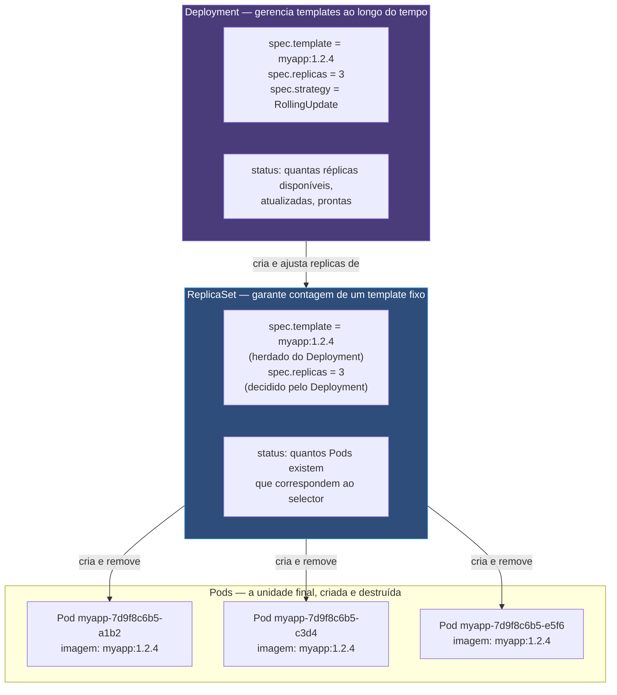
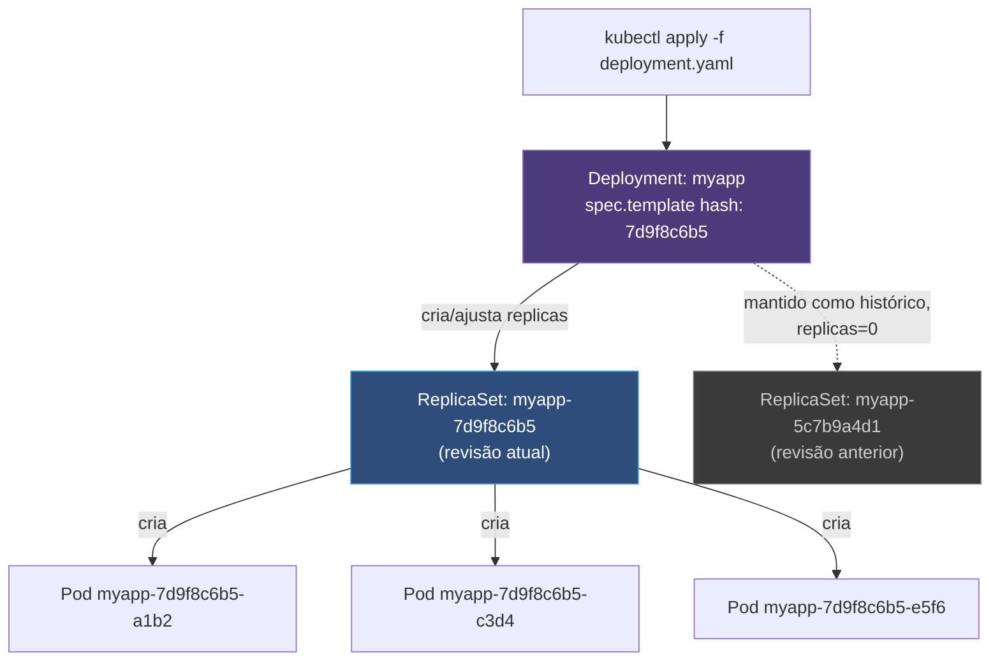

# Deployment e ReplicaSet

> [!abstract] TL;DR
> Um Pod não se cura sozinho — a nota anterior deste galho fechou exatamente nessa lacuna. A resposta do Kubernetes não é um objeto único, é uma cadeia de dois: o ReplicaSet observa "existem N Pods deste template exato?" e cria ou remove Pods até que sim; o Deployment observa "o ReplicaSet ativo corresponde ao template que eu quero agora?" e, quando não corresponde, cria um ReplicaSet novo e transfere réplicas do antigo para o novo, gradualmente. Uma atualização de imagem não edita nada em lugar nenhum — ela gera um ReplicaSet inteiro, com um template inteiro, e deixa o antigo de pé, zerado, guardado como histórico. `rollout undo` não volta no tempo; ele redeclara um template antigo como o template atual, e o mesmo mecanismo de criação-e-transferência roda de novo, na direção oposta. Cada elo dessa cadeia é seu próprio loop de reconciliação, independente, observando um pedaço menor do problema.

Imagine o cenário mais comum de todos: uma equipe termina de corrigir um bug crítico, builda uma imagem nova, `myapp:1.2.4`, e precisa colocá-la em produção sem que o serviço fique fora do ar durante a troca — três réplicas rodando `myapp:1.2.3` precisam virar três réplicas rodando `myapp:1.2.4`, sem nunca ter menos de duas de pé ao mesmo tempo. Rodar `kubectl set image deployment/myapp myapp=myapp:1.2.4` parece uma operação simples de "trocar uma tag", mas o que de fato acontece por trás é mais interessante e mais relevante para prever comportamento do que a simplicidade do comando sugere: nenhum Pod existente é editado, nenhuma imagem é trocada dentro de um container já rodando. Um objeto inteiro novo é criado, um objeto velho é esvaziado gradualmente, e o resultado visível — a troca suave, sem downtime — é o efeito colateral de dois loops de reconciliação disputando terreno de forma coordenada, não de uma operação atômica de "substituir imagem".

Vale situar o peso real deste objeto antes de entrar no mecanismo: o Deployment é, disparadamente, o objeto mais usado no dia a dia de qualquer cluster que rode aplicações sem estado — a StatefulSet e o DaemonSet, cobertos em notas mais adiante neste galho, resolvem problemas mais específicos (identidade estável por réplica, uma réplica por nó), mas a resposta padrão para "eu tenho uma imagem e quero N cópias dela rodando, atualizáveis sem downtime" é sempre um Deployment. Entender a cadeia descrita aqui — não decorar comandos de `kubectl`, entender por que cada comando produz o efeito que produz — é o que separa quem consegue prever "o que vai acontecer se eu rodar isto" de quem só reage ao que já aconteceu depois do fato.

Entender essa mecânica por dentro é o que permite prever o que `kubectl rollout undo` realmente vai fazer, por que `kubectl scale` não gera uma nova revisão mas `kubectl set image` gera, e por que um `Deployment` órfão de `ReplicaSet` ou um `ReplicaSet` órfão de `Pods` não é uma anomalia rara — é um estado transitório perfeitamente normal durante qualquer atualização em andamento. Esta nota assume o vocabulário estabelecido em [[03-Dominios/Tecnologia/Infraestrutura/Kubernetes/02 - O loop de reconciliação|O loop de reconciliação]] (spec observado contra status, controllers level-triggered) e em [[03-Dominios/Tecnologia/Infraestrutura/Kubernetes/03 - O Pod, a unidade que não é o container|O Pod, a unidade que não é o container]] (Pods são gado, substituíveis, nunca editados in-place) — e aplica os dois ao objeto que resolve a lacuna que a nota anterior deixou aberta.

## Por que dois objetos, e não um só

A pergunta óbvia, na primeira vez que se olha para essa cadeia, é por que o Kubernetes não resolveu isso com um único objeto que gerenciasse Pods diretamente, com suporte embutido a atualização de template. A resposta está em separar duas responsabilidades que têm ciclos de reconciliação genuinamente diferentes, e que ganham em clareza — e em capacidade de composição — por estarem em objetos distintos.

O **ReplicaSet** resolve exatamente um problema: dado um template de Pod e um número `N`, garantir que existam sempre `N` Pods correspondentes àquele template — nem mais, nem menos. Seu loop de reconciliação é propositalmente simples: conta quantos Pods existem hoje que correspondem ao `selector` declarado, compara com `spec.replicas`, e cria ou remove Pods até bater. O ReplicaSet **não sabe** o que fazer se alguém quiser trocar a imagem do template — sua única reação a uma mudança de template é aplicá-la aos Pods novos que ele criar dali para frente; ele não tem nenhuma lógica de transição gradual entre um template antigo e um novo, porque isso simplesmente está fora do escopo que ele foi desenhado para resolver.

O **Deployment** resolve um problema de nível acima: gerenciar a transição entre templates diferentes ao longo do tempo, mantendo disponibilidade durante essa transição. Ele não cria Pods diretamente — ele cria e gerencia ReplicaSets, e delega a cada ReplicaSet a responsabilidade mecânica de materializar Pods. Quando o template declarado no Deployment muda (uma imagem nova, uma variável de ambiente nova, um limite de recursos novo), o Deployment não tenta editar o ReplicaSet existente para refletir isso — ele cria um **ReplicaSet novo**, com o template novo, e organiza a transferência gradual de réplicas do ReplicaSet antigo para o novo, obedecendo aos parâmetros de `strategy` declarados.

Essa separação em duas camadas — uma que garante contagem, outra que gerencia transição de template — é o que permite ao Deployment ficar relativamente simples internamente: ele delega toda a mecânica de "criar e remover Pods individuais" para o ReplicaSet, e se concentra só em decidir quantas réplicas cada ReplicaSet (o antigo, o novo) deveria ter em cada instante da transição. Cada camada tem seu próprio loop de reconciliação, rodando de forma independente, e é essa independência que torna o sistema mais fácil de raciocinar em isolamento — embora o comportamento agregado, visto de fora, pareça uma única operação coordenada.

## A cadeia como uma sequência de loops de reconciliação

O diagrama abaixo situa os três níveis — Deployment, ReplicaSet, Pods — e nomeia, para cada elo, qual `spec` cada camada observa e qual `status` ela produz para a camada acima consumir.



Repare que cada seta representa um loop de reconciliação distinto, rodando de forma independente: o controller de Deployment observa Deployments e ReplicaSets, decide quantas réplicas cada ReplicaSet deveria ter agora, e escreve isso no `spec.replicas` daquele ReplicaSet — ele nunca cria ou remove um Pod diretamente. O controller de ReplicaSet observa ReplicaSets e Pods, compara `spec.replicas` contra a contagem real de Pods correspondentes ao `selector`, e cria ou remove Pods para fechar essa diferença — ele nunca sabe, nem precisa saber, que existe um Deployment acima decidindo esse número. Essa independência é o que a lente deste galho chama de level-triggered: cada controller reage ao estado atual observado, não a um evento específico de "alguém mudou a imagem" — se o controller de Deployment reiniciar no meio de uma atualização, ele recomeça olhando o estado atual do cluster, não uma fila de eventos perdidos, e chega exatamente à mesma decisão que chegaria se nunca tivesse parado.

## `ownerReferences` e a coleta de lixo em cascata

O mecanismo que amarra cada Pod ao ReplicaSet que o criou, e cada ReplicaSet ao Deployment que o criou, tem nome e formato concretos: o campo `metadata.ownerReferences`, presente em todo objeto criado por um controller de nível superior. Um Pod gerado por um ReplicaSet carrega, no seu próprio manifesto (visível via `kubectl get pod <nome> -o yaml`), uma referência ao UID exato daquele ReplicaSet — não ao nome, ao identificador único e imutável que o objeto recebeu no instante em que foi criado. O mesmo vale para um ReplicaSet criado por um Deployment: ele carrega uma `ownerReference` apontando para o UID do Deployment.

```yaml
# Trecho relevante do manifesto de um Pod gerado por um ReplicaSet —
# não escrito por um humano, preenchido automaticamente pelo controller.
metadata:
    name: myapp-7d9f8c6b5-a1b2
    ownerReferences:
        - apiVersion: apps/v1
          kind: ReplicaSet
          name: myapp-7d9f8c6b5
          uid: 3f9a2b1c-...
          controller: true
          blockOwnerDeletion: true
```

Essa cadeia de referências é o que permite ao Kubernetes implementar **coleta de lixo em cascata** (*cascading garbage collection*): quando um Deployment é removido com `kubectl delete deployment myapp`, o garbage collector do control plane não precisa de nenhuma lógica especial de "e agora encontre tudo que este Deployment criou" — ele simplesmente segue a cadeia de `ownerReferences` na direção inversa, encontra todos os ReplicaSets cujo dono é aquele Deployment, os remove, e ao removê-los dispara a mesma lógica recursivamente para os Pods cujo dono é cada um desses ReplicaSets. O resultado observável é que `kubectl delete deployment myapp` remove o Deployment, seus ReplicaSets (o ativo e os históricos mantidos por `revisionHistoryLimit`, descrito na próxima seção) e todos os Pods correspondentes, numa única operação aparente — mas mecanicamente são três remoções em cascata, cada uma disparada pela anterior via esse encadeamento de referências.

Vale registrar o comportamento por trás da flag `--cascade`, porque ela expõe diretamente esse mecanismo: `kubectl delete deployment myapp --cascade=orphan` remove só o Deployment, deixando os ReplicaSets (e seus Pods) órfãos — de pé, mas sem nenhum controller de nível superior gerenciando-os a partir dali. É um comando raro em uso normal, mas ilustra bem que a cascata de remoção não é mágica automática inescapável, é uma política configurável construída sobre o mesmo grafo de `ownerReferences` que sustenta o funcionamento normal da cadeia.

Dá para confirmar essa cadeia de referências com as próprias mãos, sem precisar confiar apenas na descrição: peça o UID do Deployment, depois confira que o ReplicaSet ativo aponta exatamente para ele.

```bash
kubectl get deployment myapp -o jsonpath='{.metadata.uid}'
# 8f2a1c40-....

kubectl get replicaset -l app=myapp -o jsonpath='{.items[0].metadata.ownerReferences[0].uid}'
# 8f2a1c40-.... — o mesmo UID, confirmando o vínculo de propriedade
```

Repare que a comparação é feita por **UID**, não por nome — mesmo que, em algum cenário incomum, o Deployment fosse removido e recriado com o nome idêntico, o UID novo seria diferente, e qualquer ReplicaSet remanescente do Deployment antigo ficaria órfão em vez de ser adotado pelo novo. Identidade, no Kubernetes, é sempre o UID; o nome é só um rótulo legível que pode, em teoria, ser reaproveitado.

## Atualização como criação de um ReplicaSet novo

O núcleo mecânico desta nota é este: quando o `spec.template` de um Deployment muda — uma imagem nova, uma variável de ambiente alterada, um recurso reconfigurado — o controller de Deployment nunca modifica o ReplicaSet existente para refletir essa mudança. Ele calcula um hash determinístico sobre o novo `spec.template` (o mesmo mecanismo, na prática, que gera o sufixo que aparece no nome do ReplicaSet, como `myapp-7d9f8c6b5`), verifica se já existe um ReplicaSet com esse hash exato — o que acontece, por exemplo, num rollback para um template já visto antes — e, se não existir, cria um ReplicaSet inteiramente novo, com `spec.replicas` começando em zero.

A partir daí, o controller de Deployment executa a transição gradual, incrementando `spec.replicas` do ReplicaSet novo e decrementando `spec.replicas` do ReplicaSet antigo, em passos governados por dois parâmetros de `strategy.rollingUpdate`:

`maxSurge` define quantos Pods **a mais** do que `spec.replicas` do Deployment podem existir temporariamente durante a atualização — a folga que permite subir um Pod novo antes de derrubar um antigo. `maxUnavailable` define quantos Pods **a menos** do que `spec.replicas` podem estar indisponíveis durante a transição — a folga que permite derrubar um Pod antigo antes que o substituto novo esteja pronto, se a equipe aceitar esse risco em troca de velocidade. Ambos podem ser expressos como número absoluto ou como percentual do total de réplicas declarado.

```mermaid
sequenceDiagram
    participant D as Controller do Deployment
    participant RSold as ReplicaSet antigo (v1.2.3)
    participant RSnew as ReplicaSet novo (v1.2.4)

    Note over D: spec.template muda para v1.2.4;<br/>maxSurge=1, maxUnavailable=0
    D->>RSnew: cria com replicas=0
    D->>RSnew: replicas=1 (surge — acima das 3 originais)
    Note over RSnew: novo Pod fica Ready
    D->>RSold: replicas=2 (reduz 1, mantém disponibilidade ≥ 3)
    D->>RSnew: replicas=2
    Note over RSnew: segundo Pod novo fica Ready
    D->>RSold: replicas=1
    D->>RSnew: replicas=3
    Note over RSold: último Pod antigo removido
    D->>RSold: replicas=0
```

Repare que, a cada passo, o total de Pods disponíveis nunca cai abaixo de 3 (porque `maxUnavailable: 0`) e nunca sobe além de 4 (porque `maxSurge: 1` permite só uma unidade de folga acima do total de 3 declarado) — é exatamente essa aritmética, repetida em pequenos incrementos até o ReplicaSet antigo chegar a zero e o novo chegar ao total declarado, que produz o efeito de "atualização sem downtime" visto de fora. Nenhum Pod é editado; cada Pod novo nasce já com a imagem nova, e cada Pod antigo é removido inteiro, nunca modificado.

## A outra estratégia: `Recreate`

`RollingUpdate` não é a única estratégia disponível — existe uma segunda, `Recreate`, mais simples e mais brusca: o Deployment reduz o ReplicaSet antigo a zero réplicas por completo, espera todos os Pods antigos terminarem, e só então cria o ReplicaSet novo e sobe os Pods com o template atualizado. Não existe fase de convivência entre versões — em nenhum momento da transição as duas versões rodam simultaneamente.

```yaml
spec:
    strategy:
        type: Recreate
```

Essa aparente regressão (trocar zero-downtime por um período garantido sem nenhuma réplica de pé) é, em alguns cenários, a escolha certa, não um erro de configuração: quando duas versões de uma aplicação não podem coexistir com segurança — um formato de dados em um cache compartilhado que mudou de forma incompatível entre versões, uma migração de schema que a versão antiga não sabe interpretar, um recurso exclusivo do sistema operacional que só uma instância pode segurar por vez — permitir que versões antigas e novas atendam tráfego ao mesmo tempo, mesmo que por poucos segundos, é mais arriscado que aceitar uma janela curta de indisponibilidade total. `Recreate` existe exatamente para esse caso; escolher `RollingUpdate` por padrão sem considerar se as duas versões realmente coexistem com segurança é a armadilha oposta, mais sutil, que vale nomear: zero-downtime não é gratuito, ele pressupõe compatibilidade entre versões consecutivas.

## O `selector` é imutável depois de criado

Um detalhe que costuma surpreender quem tenta "consertar" um Deployment já existente: o campo `spec.selector` de um Deployment é imutável depois que o objeto é criado — o Kubernetes rejeita qualquer tentativa de `kubectl apply` que mude esse campo num Deployment já existente, com um erro explícito de campo imutável. Isso não é uma limitação arbitrária: o `selector` é o critério que amarra o Deployment aos ReplicaSets (e, através deles, aos Pods) que ele reconhece como seus; permitir que esse critério mudasse livremente abriria a possibilidade de um Deployment "roubar" Pods de outro objeto, ou de perder de vista Pods que ele mesmo criou, sem nenhuma trilha de auditoria clara sobre o que aconteceu. Se um `selector` errado for detectado, a correção correta não é editar o campo — é recriar o Deployment do zero, com o `selector` certo desde a criação, aceitando a janela de indisponibilidade que essa recriação implica ou orquestrando-a manualmente com um Deployment paralelo.

## Vendo a cadeia com as próprias mãos

A melhor forma de internalizar que uma atualização gera um ReplicaSet novo, em vez de editar o existente, é observar isso acontecer. Aplique o manifesto mostrado mais adiante nesta nota, anote o nome do ReplicaSet ativo, dispare uma atualização, e observe a lista de ReplicaSets crescer:

```bash
kubectl apply -f deployment.yaml
kubectl get replicasets -l app=myapp
# NAME                 DESIRED   CURRENT   READY
# myapp-7d9f8c6b5      3         3         3

kubectl set image deployment/myapp myapp=myapp:1.2.5
kubectl get replicasets -l app=myapp
# NAME                 DESIRED   CURRENT   READY
# myapp-7d9f8c6b5      0         0         0     <- antigo, zerado, mantido como histórico
# myapp-9a1c3e7f2      3         3         3     <- novo, ativo

kubectl get pods -l app=myapp -o wide
# Os três Pods listados agora carregam o sufixo "9a1c3e7f2" no nome,
# não mais "7d9f8c6b5" — são Pods novos, não os antigos com imagem trocada.
```

Repare que nenhum nome de Pod se repete entre antes e depois da atualização — não porque o Kubernetes evita coincidência de nomes por regra explícita, mas porque cada Pod é criado do zero pelo ReplicaSet novo, com um sufixo derivado do hash daquele ReplicaSet, nunca reaproveitando a identidade de um Pod que pertencia ao ReplicaSet anterior. `kubectl describe deployment myapp` na sequência mostra, na seção de eventos, a trilha exata dessa transição: "Scaled up replica set myapp-9a1c3e7f2 to 1", "Scaled down replica set myapp-7d9f8c6b5 to 2", e assim por diante — o mesmo incremento gradual que o diagrama de sequência mais acima descreveu, agora visível como histórico de eventos reais do cluster.

## As condições do Deployment: o `status` além da contagem de réplicas

Além de contar réplicas, o `status` de um Deployment carrega um conjunto de **condições** — sinais de mais alto nível que resumem se a transição está indo bem, sem exigir que quem observa faça a aritmética de réplicas manualmente. Vale nomear as três mais relevantes:

| Condição | O que indica | Quando vira `False` |
| --- | --- | --- |
| `Available` | Existem réplicas suficientes disponíveis (passando a readiness probe) por tempo suficiente | Poucas réplicas prontas, ou instabilidade recorrente de Pods |
| `Progressing` | A transição entre ReplicaSets está avançando dentro do prazo esperado | `progressDeadlineSeconds` expira sem progresso — o sintoma central da armadilha de `maxSurge`/`maxUnavailable` zerados juntos |
| `ReplicaFailure` | Algum ReplicaSet gerenciado não consegue criar os Pods que deveria | Cota de recursos do namespace esgotada, erro de admissão, imagem inexistente |

`kubectl describe deployment myapp` mostra essas três condições, com um motivo textual associado a cada uma, e é geralmente o primeiro lugar a olhar quando um `kubectl rollout status` fica pendurado sem terminar — a condição `Progressing` com razão `ProgressDeadlineExceeded` é o sinal mais direto de que algo impede a transição de avançar, antes mesmo de examinar Pods individualmente.

## Histórico de revisões e o que `rollout undo` realmente faz

Cada vez que o Deployment cria um ReplicaSet novo por causa de uma mudança de template, o ReplicaSet antigo não é removido — ele é mantido, com `spec.replicas` zerado, como registro histórico daquela revisão. O número de ReplicaSets antigos mantidos dessa forma é controlado por `spec.revisionHistoryLimit` (o padrão histórico é 10), e é justamente essa coleção de ReplicaSets zerados, cada um guardando um template completo, que sustenta o comando `kubectl rollout history`:

```bash
kubectl rollout history deployment/myapp
# REVISION  CHANGE-CAUSE
# 1         kubectl apply --filename=deployment-v1.yaml
# 2         kubectl set image deployment/myapp myapp=myapp:1.2.4
# 3         kubectl set image deployment/myapp myapp=myapp:1.2.5

kubectl rollout history deployment/myapp --revision=2
# Mostra o template completo daquela revisão específica —
# a imagem, as variáveis de ambiente, os recursos daquele momento.
```

Com esse contexto, o que `kubectl rollout undo deployment/myapp --to-revision=2` faz deixa de parecer mágico: ele **não** volta o cluster no tempo, não restaura nenhum estado anterior de forma literal. O que ele faz, mecanicamente, é ler o `spec.template` guardado no ReplicaSet correspondente à revisão 2 (que continha, digamos, `myapp:1.2.4`) e reescrevê-lo como o `spec.template` **atual** do Deployment. A partir desse ponto, o mecanismo já descrito nesta nota — hash do template, verificação se já existe um ReplicaSet correspondente, criação ou reaproveitamento, transição gradual via `maxSurge`/`maxUnavailable` — roda exatamente como rodaria para qualquer outra mudança de template, só que na direção "de volta" para um template já visto. Se o ReplicaSet da revisão 2 ainda existir (dentro do limite de `revisionHistoryLimit`), o Deployment o reaproveita diretamente, em vez de recriar um idêntico do zero; se já tiver sido descartado por exceder o limite de histórico, o rollback simplesmente não tem para onde voltar, e o comando falha.

> [!info] Baseline de versão
> O comportamento de `revisionHistoryLimit` e o mecanismo de rollback via `ownerReferences`/hash de template descritos aqui são estáveis desde as primeiras versões do objeto Deployment em `apps/v1` e continuam válidos em clusters correntes (2026). O valor padrão de `revisionHistoryLimit`, quando omitido, é 10; ambientes com pipelines de deploy muito frequentes costumam reduzir esse número deliberadamente para limitar o acúmulo de ReplicaSets zerados no cluster.

## De onde vem a coluna `CHANGE-CAUSE`

Vale um parágrafo sobre um detalhe pequeno que aparece na saída de `kubectl rollout history` mostrada acima, porque ele costuma decepcionar quem espera que apareça automaticamente: a coluna `CHANGE-CAUSE` não é preenchida por mágica a partir do comando que gerou a revisão — ela reflete o conteúdo da anotação `kubernetes.io/change-cause` no `spec.template.metadata.annotations` do Deployment no momento em que aquela revisão foi criada. Sem essa anotação preenchida explicitamente, a coluna aparece vazia ou com um traço, mesmo que a revisão exista e seja perfeitamente navegável e reversível. Preencher essa anotação a cada mudança relevante — manualmente, ou por convenção do pipeline de CI que aplica os manifestos — é o que transforma o histórico de revisões de uma lista de hashes anônimos numa trilha legível do que mudou e por quê:

```bash
kubectl annotate deployment/myapp kubernetes.io/change-cause="corrige vazamento de conexão do pool de banco" --overwrite
kubectl set image deployment/myapp myapp=myapp:1.2.5
```

> [!info] Baseline de versão
> A antiga flag `--record` de `kubectl set image` e comandos similares, que preenchia `kubernetes.io/change-cause` automaticamente a partir da linha de comando executada, foi descontinuada nas versões mais recentes do `kubectl`. Em clusters e versões de cliente correntes (2026), a forma suportada é anotar explicitamente, como no exemplo acima, antes ou durante a mudança que se quer registrar.

## A anotação que numera as revisões

Vale um detalhe final sobre a mecânica de numeração vista em `kubectl rollout history`: o número de revisão que aparece ali (1, 2, 3...) não é um contador guardado centralmente em algum lugar único — ele vive como uma anotação, `deployment.kubernetes.io/revision`, escrita pelo controller de Deployment em `metadata.annotations` de cada ReplicaSet que ele cria. Confira diretamente:

```bash
kubectl get replicaset -l app=myapp -o jsonpath='{range .items[*]}{.metadata.name}{"\t"}{.metadata.annotations.deployment\.kubernetes\.io/revision}{"\n"}{end}'
# myapp-7d9f8c6b5    2
# myapp-9a1c3e7f2    3
```

É essa anotação, presente em cada ReplicaSet individualmente, que permite ao `kubectl rollout history` reconstituir a lista ordenada de revisões sem precisar de nenhum registro externo — a informação inteira já está distribuída entre os próprios objetos que compõem a cadeia. Um rollback para uma revisão específica funciona encontrando o ReplicaSet cuja anotação corresponde ao número pedido, não contando posições numa lista em algum outro lugar.

## `rollout status`, `pause` e `resume`

Três comandos operacionais fecham o vocabulário prático desta cadeia. `kubectl rollout status deployment/myapp` bloqueia o terminal e acompanha, em tempo real, o progresso da transição entre ReplicaSets — útil em pipelines de CI que precisam esperar a atualização terminar antes de considerar o deploy concluído, e que retornam código de saída diferente de zero se a atualização travar (por exemplo, se os Pods novos nunca ficarem `Ready`, o comando expira depois de `progressDeadlineSeconds`, também configurável em `spec`).

`kubectl rollout pause deployment/myapp` congela o controller de Deployment naquele ponto exato da transição — nenhuma réplica adicional é movida entre ReplicaSets até o `resume`. É a base mecânica de um padrão de deploy canário rudimentar: pausar depois que uma fração pequena de réplicas novas já está de pé, observar métricas reais contra essa fração, e só então decidir se `resume` (continua a transição inteira) ou `undo` (desiste e volta ao template anterior). Vale deixar explícito o limite desse padrão: o Deployment sozinho não tem nenhuma lógica de decisão automática baseada em métricas — pausar e retomar são comandos manuais (ou disparados por uma ferramenta externa), não um comportamento nativo de análise de canário. `kubectl rollout resume deployment/myapp` desfaz o congelamento e deixa o controller retomar exatamente de onde parou, porque, sendo level-triggered, ele nunca perdeu de vista o estado real — só parou de agir sobre ele.

> [!warning] Estratégia de release não é o assunto desta nota
> Canário de verdade (com análise automatizada de métricas), blue-green, e progressive delivery com um operator dedicado (como Argo Rollouts ou Flagger) são políticas de **quando e como decidir** avançar uma transição — e vivem em [[03-Dominios/Engenharia/Operação/2 - Entrega e release/02 - Deployment strategies|Deployment strategies]] e em [[03-Dominios/Engenharia/Operação/2 - Entrega e release/03 - Progressive delivery e rollback|Progressive delivery e rollback]]. O que esta nota descreve é o mecanismo de objeto por trás de qualquer uma dessas políticas — a cadeia Deployment → ReplicaSet → Pods, `maxSurge`/`maxUnavailable`, `ownerReferences` — não a política de quando apertar o gatilho.

## Por que mudar a imagem gera revisão nova e mudar réplicas não

Vale fechar o mecanismo com uma distinção que costuma gerar confusão na primeira vez que alguém nota o comportamento: `kubectl set image deployment/myapp myapp=myapp:1.2.4` gera uma revisão nova em `rollout history`; `kubectl scale deployment/myapp --replicas=5` não gera nenhuma revisão nova, mesmo sendo, também, uma escrita no `spec` do Deployment.

A distinção está exatamente na peça que o Deployment usa para decidir se precisa criar um ReplicaSet novo: o hash calculado sobre `spec.template` — o Pod que será criado, com sua imagem, suas variáveis de ambiente, seus recursos. Uma mudança de `spec.replicas` não altera `spec.template` em nada; o número de réplicas é uma propriedade do Deployment (e, por consequência, repassada ao ReplicaSet ativo), não uma propriedade do template do Pod em si. Como o hash do template não muda, o Deployment não tem motivo para criar um ReplicaSet novo — ele simplesmente ajusta `spec.replicas` do ReplicaSet já existente, e o controller de ReplicaSet, por sua vez, cria ou remove Pods diretamente daquele mesmo ReplicaSet, sem nenhuma transição gradual entre dois templates porque não existem dois templates envolvidos.

Essa regra generaliza bem: qualquer mudança que altere `spec.template` — imagem, `env`, `resources`, `command`, labels do template, volumes — dispara a criação de um ReplicaSet novo e uma transição via `rollingUpdate`. Qualquer mudança que fique fora de `spec.template` — `spec.replicas`, `spec.paused`, anotações no próprio Deployment que não afetem o template do Pod — é aplicada diretamente, sem gerar revisão nova nem transição.

## O que `kubectl get deployment` resume numa linha só

Vale fechar o mecanismo com a leitura da saída mais comum de todas, porque cada coluna carrega uma peça específica do que esta nota já desenvolveu:

```bash
kubectl get deployment myapp
# NAME    READY   UP-TO-DATE   AVAILABLE   AGE
# myapp   3/3     3            3           14d
```

`READY` é a contagem de Pods atuais que passam a readiness probe, sobre o total declarado em `spec.replicas` — o numerador vem do `status` agregado dos ReplicaSets geridos, não de uma contagem direta de Pods pelo próprio Deployment. `UP-TO-DATE` é quantos desses Pods já correspondem ao `spec.template` **atual**, distinto do total em `READY` durante qualquer transição em andamento — nos instantes intermediários do diagrama de sequência mostrado mais acima, essa coluna mostraria um número menor que o total, refletindo exatamente os Pods que já pertencem ao ReplicaSet novo. `AVAILABLE` é o subconjunto de `READY` que está disponível há tempo suficiente (`minReadySeconds`, um campo que não foi desenvolvido nesta nota mas que existe para evitar contar como disponível um Pod que acabou de passar a probe uma única vez, antes de qualquer instabilidade se manifestar). Ler essas quatro colunas com precisão, no meio de uma atualização em andamento, é o que permite responder, sem adivinhação, à pergunta "está tudo bem, ou uma transição está travada?".

## Fronteira: mecanismo do objeto, não política de release nem autoscaling

> [!warning] Este galho não cobre a estratégia de deploy nem o autoscaling
> O objeto deste galho é o mecanismo — como Deployment e ReplicaSet se relacionam, como a transição de template funciona por dentro. A decisão de qual estratégia de release usar (blue-green completo com dois Services, canário guiado por métricas, progressive delivery automatizado) e o zero-downtime como prática operacional completa (readiness gating combinado com connection draining na borda) pertencem a [[03-Dominios/Engenharia/Operação/3 - Rodar em produção/03 - Zero-downtime e alta disponibilidade|Zero-downtime e alta disponibilidade]] e a [[03-Dominios/Engenharia/Operação/2 - Entrega e release/02 - Deployment strategies|Deployment strategies]]. Autoscaling — HPA, VPA, KEDA, Cluster Autoscaler, que mudam `spec.replicas` automaticamente em resposta a métricas — é assunto de [[03-Dominios/Engenharia/Operação/3 - Rodar em produção/04 - Escala e capacidade|Escala e capacidade]], não deste galho.

## Por que quase ninguém cria um ReplicaSet sozinho

Assim como a nota anterior deste galho explicou por que quase ninguém cria um Pod à mão, vale fechar o mesmo raciocínio para o ReplicaSet: tecnicamente nada impede criar um ReplicaSet diretamente, sem nenhum Deployment por trás dele — o objeto é uma API de primeira classe, plenamente funcional sozinho. E ele de fato garante a contagem de réplicas exatamente como descrito: derrube um Pod à mão que pertença a um ReplicaSet avulso, e outro nasce no lugar imediatamente, porque o loop de reconciliação do ReplicaSet continua rodando independentemente de existir ou não um Deployment acima dele.

O que falta a um ReplicaSet avulso é exatamente a peça que motivou a existência do Deployment: nenhuma forma nativa de trocar o template gradualmente. Editar `spec.template` de um ReplicaSet existente não dispara nenhuma transição — o ReplicaSet aplica o template novo só aos Pods que ele criar depois da edição, sem tocar nos Pods já existentes, e sem nenhuma lógica de `maxSurge`/`maxUnavailable` orquestrando quantos trocar por vez. Trocar a imagem de uma aplicação gerida por um ReplicaSet avulso, sem downtime, exigiria escrever manualmente a mesma coreografia que o controller de Deployment já implementa — motivo pelo qual, na prática, ReplicaSets raramente aparecem em manifestos escritos por humanos: eles existem, plenamente funcionais, mas como implementação interna que o Deployment gerencia por trás, não como objeto de interação direta do dia a dia.

## Labels do template não são as mesmas labels do objeto

Vale um parágrafo desfazendo uma confusão comum de quem lê o manifesto pela primeira vez: o Deployment tem `metadata.labels` (as labels do próprio objeto Deployment, usadas por quem quiser encontrar *o Deployment* com `kubectl get deployments -l ...`) e o template tem seu próprio `spec.template.metadata.labels` (as labels que cada Pod gerado vai carregar). Os dois blocos costumam repetir os mesmos pares de chave-valor por convenção — é comum e recomendado que sejam consistentes — mas são tecnicamente independentes, e é o segundo bloco, o do template, que precisa necessariamente corresponder ao `spec.selector.matchLabels` do próprio Deployment; o primeiro bloco não tem essa obrigação. Um erro comum de quem copia um manifesto e edita labels apressadamente é mudar `metadata.labels` do Deployment sem mudar `spec.template.metadata.labels`, e se perguntar por que nada mudou no rótulo dos Pods.

## Disrupção voluntária: o vizinho deste mecanismo

Vale nomear, sem desenvolver, um objeto vizinho que interage diretamente com a contagem de réplicas que esta nota descreveu: o `PodDisruptionBudget`, que declara quantas réplicas de um Deployment (via o mesmo `selector` por labels) podem ficar indisponíveis simultaneamente por conta de uma **disrupção voluntária** — um `kubectl drain` de manutenção de nó, por exemplo, não uma falha inesperada. Sem um orçamento de disrupção declarado, nada impede que uma operação de manutenção do cluster derrube réplicas suficientes de um Deployment para reduzir a disponibilidade real a zero, mesmo que o Deployment continue, ele mesmo, tentando recriar réplicas assim que possível. A mecânica completa desse objeto, os cálculos de `minAvailable`/`maxUnavailable` no nível do orçamento (distintos dos `maxSurge`/`maxUnavailable` da estratégia de rollout descritos nesta nota, apesar do nome parecido), e como ele se combina com operações de manutenção de cluster pertencem a [[03-Dominios/Engenharia/Operação/3 - Rodar em produção/06 - Resiliência operacional|Resiliência operacional]] — aqui bastava reconhecer que ele existe e observa a mesma contagem de réplicas que o ReplicaSet mantém.

## Do Compose ao Deployment: o que a atualização gradual acrescenta

Quem chega a este galho vindo de [[03-Dominios/Tecnologia/Infraestrutura/Docker/11 - Compose como ambiente de desenvolvimento|Compose como ambiente de desenvolvimento]] já conhece `docker compose up --scale worker=3`, que sobe três instâncias de um serviço declarado — superficialmente parecido com `spec.replicas: 3` de um Deployment. A semelhança para no número; o comportamento de atualização é onde a diferença de arquitetura aparece com força. Trocar a imagem de um serviço no Compose e rodar `docker compose up` de novo tipicamente derruba os containers daquele serviço e sobe os novos — sem nenhuma transição gradual nativa, sem um equivalente a `maxSurge`/`maxUnavailable` decidindo quantos manter de pé durante a troca, e sem histórico de revisões navegável depois do fato. É perfeitamente adequado para o ambiente de desenvolvimento de máquina única que o Compose foi desenhado para servir — onde uma janela curta de indisponibilidade de um serviço local não tem o mesmo custo que teria em produção atendendo tráfego real — mas não seria adequado transplantado diretamente para produção, e é exatamente essa lacuna, nomeada explicitamente já na abertura deste galho, que a cadeia Deployment-ReplicaSet resolve: atualização como transição gradual e reversível, gerida por um controller que continua reconciliando mesmo que ninguém esteja olhando o terminal no momento exato da troca.

## Manifesto completo: um Deployment comentado

O manifesto abaixo reúne os elementos desenvolvidos nesta nota: uma estratégia `RollingUpdate` explícita, um histórico de revisões limitado, e um template de Pod completo o bastante para produzir um hash estável entre atualizações.

```yaml
apiVersion: apps/v1
kind: Deployment
metadata:
    name: myapp
    labels:
        app: myapp
spec:
    replicas: 3

    # revisionHistoryLimit controla quantos ReplicaSets antigos, zerados,
    # ficam guardados como histórico navegável por "kubectl rollout history".
    revisionHistoryLimit: 5

    # progressDeadlineSeconds: se a transição não progredir dentro deste
    # prazo (por exemplo, Pods novos nunca ficam Ready), o Deployment marca
    # a condição "Progressing" como False — sinal para pipelines de CI pararem.
    progressDeadlineSeconds: 300

    # selector amarra este Deployment aos Pods que ele reconhece como seus —
    # é o mesmo mecanismo de correspondência por labels que a nota anterior
    # deste galho introduziu.
    selector:
        matchLabels:
            app: myapp

    strategy:
        type: RollingUpdate
        rollingUpdate:
            maxSurge: 1          # até 1 Pod a mais que spec.replicas durante a transição
            maxUnavailable: 0    # nunca menos que spec.replicas Pods disponíveis

    # template é exatamente o manifesto de um Pod, sem apiVersion/kind próprios —
    # é sobre ESTE bloco que o hash de revisão é calculado.
    template:
        metadata:
            labels:
                app: myapp
        spec:
            containers:
                - name: myapp
                  image: myapp:1.2.4
                  ports:
                      - containerPort: 8080
                  resources:
                      requests:
                          memory: "256Mi"
                          cpu: "250m"
                      limits:
                          memory: "512Mi"
                          cpu: "500m"
                  readinessProbe:
                      httpGet:
                          path: /ready
                          port: 8080
                      initialDelaySeconds: 5
                      periodSeconds: 5
```

A configuração completa de `readinessProbe` e `livenessProbe` — os valores corretos de `initialDelaySeconds`, `periodSeconds`, `failureThreshold`, e como eles interagem com o desligamento gracioso descrito na nota anterior — pertence a [[03-Dominios/Engenharia/Operação/3 - Rodar em produção/02 - O contrato de produção do Kubernetes|O contrato de produção do Kubernetes]]; o que importa reter aqui é só que a `readinessProbe` é o sinal que o controller de Deployment usa para saber quando um Pod novo pode ser contado como "disponível" ao calcular se já é seguro remover mais um Pod antigo — sem uma probe de prontidão configurada corretamente, o Deployment considera um Pod disponível assim que o container reporta `Running`, o que pode ser cedo demais para uma aplicação que ainda está inicializando.

## Diagrama: a cadeia completa, do manifesto ao Pod



## Recapitulando a cadeia inteira numa tabela

Vale fechar o mecanismo com uma tabela de recapitulação que amarra as duas notas — esta e a anterior — numa única visão de responsabilidades, do objeto mais concreto ao mais abstrato:

| Objeto | O que garante | O que NÃO sabe fazer sozinho |
| --- | --- | --- |
| Pod | Um grupo de containers rodando com rede e ciclo de vida compartilhados | Não se recria sozinho se morrer; não tem noção de "quantas cópias" |
| ReplicaSet | N Pods existindo, sempre, de um template fixo | Não sabe fazer transição gradual entre templates diferentes |
| Deployment | Transição gradual e reversível entre templates, com histórico | Não decide estratégia de release (canário, blue-green) nem escala sozinho por métricas |

Cada linha desta tabela depende inteiramente da linha acima: um Deployment sem ReplicaSets por trás não existiria como mecanismo funcional, e um ReplicaSet sem Pods reais criados por ele seria só uma contagem sem efeito. A cadeia inteira só produz o comportamento observável — "atualizo a imagem e o serviço continua no ar" — porque cada elo resolve exatamente um problema, delegando para o elo abaixo tudo que não é da sua responsabilidade.

## Dois Deployments não devem competir pelo mesmo `selector`

Vale nomear um efeito colateral direto de como o `selector` funciona, porque o erro é sutil e o sintoma costuma parecer aleatório: se dois Deployments diferentes forem criados com `matchLabels` que resultam no mesmo conjunto de Pods sendo correspondido por ambos, os dois controllers passam a competir pela mesma população de Pods — cada um tentando reconciliar aquele conjunto para o seu próprio `spec.replicas` e o seu próprio template, sem que nenhum dos dois tenha conhecimento da existência do outro. O sintoma observado costuma ser Pods sendo criados e removidos em sequência aparentemente sem lógica, contagens de réplicas que nunca se estabilizam, e templates alternando entre dois valores diferentes a cada poucos segundos — cada controller "corrigindo" o que o outro acabou de fazer. A prevenção é simples de enunciar e fácil de esquecer sob pressão: `selector.matchLabels` de cada Deployment deveria corresponder a um conjunto de Pods exclusivo daquele Deployment, tipicamente garantido incluindo um valor de label específico o bastante (um nome de aplicação, não só um label genérico como `tier: backend` que vários Deployments poderiam compartilhar).

## Armadilhas comuns

> [!warning] Editar um ReplicaSet diretamente esperando que o Deployment "sincronize" com essa mudança
> O ReplicaSet ativo de um Deployment é gerenciado pelo controller de Deployment, que continuamente reconcilia o `spec` do ReplicaSet para corresponder ao que o Deployment quer. Editar `spec.replicas` ou `spec.template` de um ReplicaSet diretamente costuma ser revertido no ciclo de reconciliação seguinte do Deployment, que reescreve o ReplicaSet de volta ao que ele considera correto — a edição parece "não pegar", e a causa é essa disputa entre uma edição manual e um controller que continua observando e corrigindo.

> [!warning] Achar que `kubectl rollout undo` restaura o estado exato de antes, incluindo dados
> `rollout undo` restaura o **template do Pod** — imagem, variáveis de ambiente, recursos — para o que era numa revisão anterior. Ele não tem nenhuma opinião sobre dados em volumes persistentes, sobre migrações de schema já aplicadas no banco, ou sobre qualquer efeito colateral externo que a versão nova tenha causado antes do rollback. Reverter o código sem reverter uma migração de schema incompatível costuma trocar um problema por outro, pior.

> [!warning] Configurar `maxUnavailable: 0` e `maxSurge: 0` ao mesmo tempo
> Essa combinação impede o Deployment de progredir: não é permitido derrubar um Pod antigo (`maxUnavailable: 0`) nem subir um Pod novo além do total declarado (`maxSurge: 0`), então não sobra nenhum espaço de manobra para a transição acontecer. Na prática, a atualização trava, o Deployment fica preso indefinidamente em progresso parcial, e `progressDeadlineSeconds` eventualmente marca a condição de progresso como falha — um sintoma que costuma ser diagnosticado como "bug do Kubernetes" quando é, na verdade, uma configuração que geometricamente não deixa espaço para nenhum passo intermediário existir.

> [!warning] Confundir `replicas: 0` do Deployment com o Deployment estar "pausado"
> Escalar um Deployment para zero réplicas (`kubectl scale deployment/myapp --replicas=0`) remove todos os Pods, mas o Deployment continua ativo e continua reconciliando — se alguém escalar de volta para um número positivo, ele volta a criar Pods normalmente, com o template atual. Isso é diferente de `kubectl rollout pause`, que congela a lógica de transição entre ReplicaSets, mas não zera réplicas nem interrompe o funcionamento do ReplicaSet ativo. Os dois comandos soam parecidos ("parar o Deployment"), mas achatam dimensões completamente diferentes do objeto.

> [!warning] Esperar que `kubectl apply` de um Deployment idêntico ao atual gere uma revisão nova
> Se o `spec.template` aplicado é byte a byte equivalente ao que já está ativo (mesmo hash), o Deployment não cria nenhum ReplicaSet novo — reaplicar o mesmo manifesto não é, por si só, garantia de "forçar um redeploy". Quando a intenção é reiniciar todos os Pods sem mudar o template (por exemplo, para pegar um ConfigMap atualizado que os Pods não recarregam sozinhos), o comando correto é `kubectl rollout restart deployment/myapp`, que força uma nova revisão através de uma anotação de timestamp no template, não através de uma mudança de conteúdo funcional.

> [!warning] Dois Deployments com `selector.matchLabels` sobrepostos, disputando os mesmos Pods
> Como descrito na seção anterior, essa sobreposição gera uma disputa silenciosa entre dois controllers, cada um tentando reconciliar a mesma população de Pods para objetivos diferentes. O sintoma raramente aponta direto para a causa — parece instabilidade aleatória de Pods — até alguém comparar os `selector` dos dois Deployments envolvidos e notar que ambos correspondem ao mesmo conjunto de labels.

> [!warning] Ignorar `deployment.kubernetes.io/revision` e depender só da ordem de criação para entender o histórico
> Como a numeração de revisão vive numa anotação em cada ReplicaSet, não numa lista central, tentar inferir a ordem histórica só pela data de criação dos objetos (`kubectl get replicaset --sort-by=.metadata.creationTimestamp`) costuma funcionar, mas deixa de ser confiável em cenários onde um rollback reaproveitou um ReplicaSet antigo — nesse caso, a data de criação reflete quando aquele ReplicaSet nasceu originalmente, não a ordem em que ele voltou a ficar ativo. A anotação de revisão, não a data de criação, é a fonte de verdade para a ordem cronológica de templates que o Deployment de fato assumiu.

## Como explicar em inglês

| Português | English |
| --- | --- |
| O ReplicaSet garante que existem N Pods de um template fixo | The ReplicaSet ensures N Pods of a fixed template exist |
| O Deployment gerencia a transição entre templates diferentes | The Deployment manages the transition between different templates |
| Uma atualização cria um ReplicaSet novo, nunca edita o existente | An update creates a new ReplicaSet, never edits the existing one |
| `ownerReferences` sustenta a coleta de lixo em cascata | `ownerReferences` powers cascading garbage collection |
| `rollout undo` redeclara um template antigo como o atual | `rollout undo` redeclares an old template as the current one |
| `maxSurge` e `maxUnavailable` controlam o ritmo da transição | `maxSurge` and `maxUnavailable` control the pace of the rollout |
| Mudar réplicas não gera uma revisão nova; mudar o template gera | Changing replica count doesn't create a new revision; changing the template does |
| `rollout restart` força uma nova revisão sem mudar o conteúdo funcional | `rollout restart` forces a new revision without changing functional content |
| O `selector` de um Deployment é imutável depois de criado | A Deployment's `selector` is immutable once created |
| `Recreate` derruba tudo antes de subir a versão nova | `Recreate` tears everything down before bringing up the new version |
| `PodDisruptionBudget` limita quantas réplicas podem cair numa disrupção voluntária | A `PodDisruptionBudget` limits how many replicas can go down during a voluntary disruption |
| A anotação de revisão vive em cada ReplicaSet, não numa lista central | The revision annotation lives on each ReplicaSet, not in a central list |

## Quando a resposta não é um Deployment

Vale fechar nomeando os limites deste objeto, sem desenvolvê-los, porque saber onde ele para de fazer sentido é tão útil quanto saber como ele funciona por dentro. Um Deployment presume que suas réplicas são intercambiáveis — qualquer Pod pode ser destruído e substituído por outro, sem que nenhum cliente perceba diferença, porque nenhum Pod carrega identidade própria além do template compartilhado. Isso deixa de valer para cargas que precisam de identidade estável por réplica (um nome de rede fixo por instância, um volume de armazenamento exclusivo que persiste através de substituições) — o objeto certo para esse caso é o StatefulSet, coberto mais adiante neste galho. Também deixa de valer para cargas que precisam de exatamente uma réplica por nó do cluster, não um número fixo independente da topologia — esse é o papel do DaemonSet. E deixa de valer para trabalho que deve rodar até completar e então parar, não continuar indefinidamente — esse é o papel do Job e do CronJob. Cada um desses três objetos reaproveita conceitos desta nota (template, `selector`, `ownerReferences`) mas resolve uma forma de vida diferente da que o Deployment assume por padrão: réplicas fungíveis, de longa duração, sem identidade própria.

## O que vem a seguir

As réplicas agora existem, são substituíveis, e sobrevivem a atualizações sem downtime — mas cada Pod individual, como a nota anterior deste galho estabeleceu, nasce com um IP próprio e efêmero, que muda a cada substituição. Durante uma atualização gradual como a descrita nesta nota, isso fica ainda mais evidente: em qualquer instante da transição, os três Pods "atuais" podem ter três IPs completamente diferentes dos que existiam um minuto antes, porque parte deles pertence ao ReplicaSet novo e parte ainda pertence ao antigo. Um cliente que precise falar com "o serviço", não com um Pod específico, e que não possa se dar ao luxo de descobrir um IP novo a cada substituição, ainda não tem para onde apontar de forma estável. Essa lacuna — um endereço de rede que sobrevive à substituição de qualquer Pod individual por trás dele, e que continua válido durante uma transição inteira entre ReplicaSets — é o assunto da próxima nota: [[03-Dominios/Tecnologia/Infraestrutura/Kubernetes/05 - Service|Service]].

## Fontes

- [Kubernetes documentation — Deployments](https://kubernetes.io/docs/concepts/workloads/controllers/deployment/)
- [Kubernetes documentation — ReplicaSet](https://kubernetes.io/docs/concepts/workloads/controllers/replicaset/)
- [Kubernetes documentation — Garbage Collection](https://kubernetes.io/docs/concepts/architecture/garbage-collection/)
- [Kubernetes documentation — Owners and Dependents](https://kubernetes.io/docs/concepts/overview/working-with-objects/owners-dependents/)
- [Kubernetes API Reference — DeploymentSpec](https://kubernetes.io/docs/reference/generated/kubernetes-api/v1.30/#deploymentspec-v1-apps)
- [Kubernetes documentation — Kubectl rollout](https://kubernetes.io/docs/reference/generated/kubectl/kubectl-commands#rollout)
- [Kubernetes documentation — Specifying a Disruption Budget for your Application](https://kubernetes.io/docs/tasks/run-application/configure-pdb/)
- [Kubernetes documentation — Kubectl Conventions (change-cause annotation)](https://kubernetes.io/docs/reference/kubectl/conventions/)
- [Kubernetes documentation — StatefulSets](https://kubernetes.io/docs/concepts/workloads/controllers/statefulset/)
- [Kubernetes documentation — Jobs](https://kubernetes.io/docs/concepts/workloads/controllers/job/)
- [Kubernetes documentation — DaemonSet](https://kubernetes.io/docs/concepts/workloads/controllers/daemonset/)
- [Kubernetes documentation — Managing Resources (labels and selectors)](https://kubernetes.io/docs/concepts/overview/working-with-objects/labels/)
- [Kubernetes documentation — Recommended Labels](https://kubernetes.io/docs/concepts/overview/working-with-objects/common-labels/)
