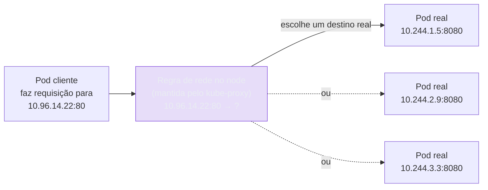
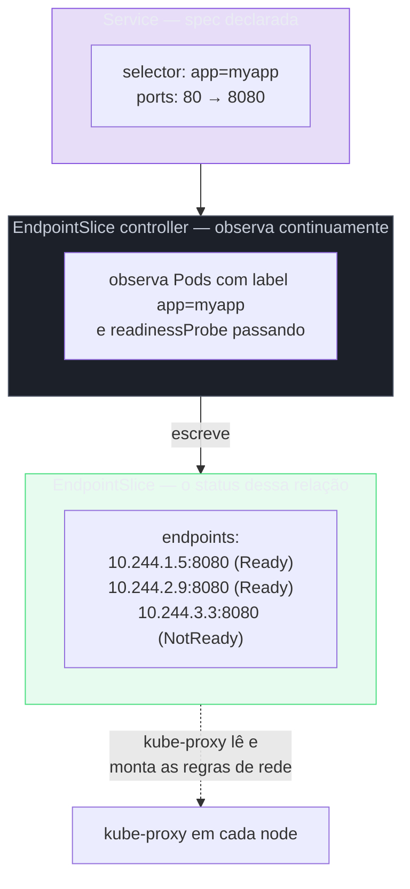

# Service

> [!abstract] TL;DR
> Um Deployment resolve a substituibilidade das réplicas, mas cada Pod continua tendo um IP próprio, atribuído pela rede do cluster no instante em que o Pod nasce, e descartado no instante em que ele morre — nada, além do próprio Pod, garante que esse endereço permaneça o mesmo por mais que alguns minutos. O Service é o objeto que resolve exatamente essa lacuna: um endereço estável — um ClusterIP virtual, que não pertence a nenhuma interface de rede de nenhuma máquina real — que aponta, o tempo todo, para o conjunto certo de Pods vivos naquele instante. Ele faz isso do mesmo jeito que qualquer outro objeto deste galho: um `selector` declara quais Pods interessam, um controller observa continuamente quais Pods casam com esse selector, e escreve o resultado dessa observação num objeto `status`-like separado, o **EndpointSlice** — nunca um apontamento direto e estático do Service para um Pod específico. Quando um Service "não funciona", o sintoma quase sempre mora ali: um EndpointSlice vazio, não o Service em si.

Imagine a cena que fecha a nota anterior deste galho: uma atualização gradual está em andamento, três Pods rodando `myapp:1.2.3` estão sendo substituídos, um a um, por três Pods novos rodando `myapp:1.2.4`. Em qualquer instante dessa transição, existe uma mistura de Pods antigos e novos de pé ao mesmo tempo — e cada um deles, sem exceção, tem um endereço IP diferente de qualquer Pod que existiu um minuto antes, porque um Pod recriado nunca reaproveita o IP do Pod que ele substituiu. Um cliente que precise falar com "a API", sem se importar com qual réplica específica atende a chamada, não tem, até aqui, nenhum lugar estável para apontar. Gravar o IP de um Pod específico numa variável de configuração funciona por alguns minutos e quebra na primeira substituição — e substituições acontecem o tempo todo: rolling updates, Pods derrubados por falta de memória, nodes reiniciados por manutenção. O problema não é hipotético nem raro; é a condição normal de qualquer cluster com mais de um Pod rodando por mais de alguns minutos.

A resposta óbvia — "documenta os IPs atuais e atualiza manualmente a cada mudança" — não escala além do primeiro incidente de produção, e nem precisa: o Kubernetes já resolveu esse problema exatamente uma vez, de forma genérica, para qualquer conjunto de Pods que compartilhe um label em comum. Essa resposta genérica é o **Service**, e ela reaproveita, sem exceção, o vocabulário que a nota [[03-Dominios/Tecnologia/Infraestrutura/Kubernetes/02 - O loop de reconciliação|O loop de reconciliação]] já estabeleceu: existe uma `spec` (o `selector`, as portas, o tipo), existe um controller observando continuamente o cluster, e existe um `status` — só que aqui o `status` não vive dentro do próprio objeto Service, vive num objeto vizinho, o EndpointSlice, que essa mesma nota desenvolve em detalhe adiante. Um Service, visto de perto, não é uma peça de rede exótica: é mais um objeto reconciliado, como qualquer outro deste galho, só que a diferença que ele fecha é "quais Pods vivos correspondem a este selector agora", não "quantos Pods existem" ou "qual template está ativo".

## O ClusterIP como endereço virtual, não real

O primeiro passo para entender um Service com precisão é desfazer uma suposição intuitiva, mas errada: o ClusterIP que um Service recebe ao ser criado **não pertence a nenhuma interface de rede de nenhuma máquina do cluster**. Não existe um node com uma placa de rede configurada para responder por aquele endereço, e não existe um processo escutando ativamente naquele IP esperando conexões chegarem, no sentido tradicional de um servidor bind-ado numa porta. O ClusterIP é uma entrada numa tabela de regras — mantida e sincronizada em todo node do cluster por um componente chamado `kube-proxy` — que diz, essencialmente, "quando algum pacote chegar endereçado a este IP e esta porta, redirecione para um dos IPs reais de Pod que estão na lista atual".



Vale reter essa distinção de propósito, porque ela explica um comportamento que costuma soar contraintuitivo na primeira vez que aparece: um `ping` contra um ClusterIP tipicamente não responde nada, mesmo que uma requisição HTTP contra aquele mesmo endereço, na mesma porta, funcione perfeitamente. Não é falha de configuração — é que não existe processo nenhum respondendo a ICMP naquele endereço, porque o endereço não é uma máquina, é uma entrada de tabela que só o tráfego correspondente às regras configuradas (tipicamente TCP/UDP nas portas declaradas) sabe atravessar. Perguntar "quem está escutando em `10.96.14.22`?" é, estruturalmente, a pergunta errada — a pergunta certa é "para onde essa regra está redirecionando agora?", e essa resposta muda o tempo todo, sem que o endereço visível para quem faz a chamada mude nunca.

O mecanismo exato de como essa tradução acontece dentro do node — iptables, IPVS, o modelo de rede plano que faz todo Pod conseguir falar com todo outro Pod sem NAT, o papel do CNI — é assunto da nota [[03-Dominios/Tecnologia/Infraestrutura/Kubernetes/20 - Rede do cluster por dentro|Rede do cluster por dentro]]. Aqui basta reter que a tradução existe, que ela acontece em algum lugar entre o cliente e o Pod real, e que ela é feita por um componente que roda em todo node — não centralizado num único ponto do cluster, o que evitaria que o ClusterIP inteiro dependesse de uma única máquina estar de pé.

## O selector e a peça que quase todo mundo pula

O manifesto mais simples de um Service parece só mais um objeto de configuração — um `selector`, algumas portas, um tipo:

```yaml
apiVersion: v1
kind: Service
metadata:
    name: myapp
spec:
    selector:
        app: myapp        # encontra Pods por label, não por nome nem por IP
    ports:
        - port: 80          # porta que o Service expõe
          targetPort: 8080  # porta em que o container do Pod escuta de fato
    type: ClusterIP         # default; pode ser omitido
```

A leitura apressada desse manifesto costuma concluir algo como "o Service aponta para os Pods com o label `app: myapp`" — e essa frase, embora não esteja tecnicamente errada no resultado final, esconde a peça mais importante do mecanismo: **o Service não aponta para Pod nenhum diretamente**. Nenhum campo do objeto Service guarda uma lista de IPs de Pods; o `selector` é só um critério de correspondência, o mesmo tipo de critério que um Deployment usa para reconhecer seus próprios Pods. O que de fato traduz esse critério numa lista concreta e atualizada de destinos é um processo separado, rodando continuamente, chamado **EndpointSlice controller**.

O EndpointSlice controller observa, via watch — o mesmo mecanismo de observação contínua que a nota 02 deste galho já descreveu para qualquer outro controller —, todo Pod que casa com o `selector` de algum Service existente, e cuja `readinessProbe` (se configurada) esteja passando. Para cada Service, ele mantém um ou mais objetos **EndpointSlice**, que listam os IPs reais dos Pods correspondentes, no instante mais recente observado. Esse EndpointSlice é, na prática, o `status` da relação entre o Service e os Pods que ele deveria alcançar — reconciliado exatamente como qualquer outro `status` deste galho: recalculado sempre que a população de Pods muda, sem que ninguém precise pedir explicitamente.



Vale ver esse objeto com as próprias mãos, porque é raro alguém olhar para ele fora de um momento de depuração — e é exatamente por isso que sua existência costuma pegar quem só conhece o Service pelo manifesto:

```bash
kubectl get endpointslices -l kubernetes.io/service-name=myapp
```

```
NAME               ADDRESSTYPE   PORTS   ENDPOINTS                          AGE
myapp-a1b2c        IPv4          8080    10.244.1.5,10.244.2.9,10.244.3.3   14d
```

Descrever o objeto por inteiro revela a lista completa, com cada endereço marcado como pronto ou não:

```bash
kubectl get endpointslice myapp-a1b2c -o yaml
```

```yaml
apiVersion: discovery.k8s.io/v1
kind: EndpointSlice
metadata:
    name: myapp-a1b2c
    labels:
        kubernetes.io/service-name: myapp   # amarra este EndpointSlice ao Service "myapp"
addressType: IPv4
ports:
    - name: ""
      port: 8080
      protocol: TCP
endpoints:
    - addresses: ["10.244.1.5"]
      conditions:
          ready: true
    - addresses: ["10.244.2.9"]
      conditions:
          ready: true
    - addresses: ["10.244.3.3"]
      conditions:
          ready: false   # readinessProbe falhando; kube-proxy não envia tráfego para cá
```

Repare no campo `conditions.ready` de cada entrada: um Pod que casa com o `selector` mas cuja `readinessProbe` está falhando continua listado no EndpointSlice, marcado como não pronto, em vez de simplesmente desaparecer da lista — é essa distinção que permite ao `kube-proxy` parar de enviar tráfego para um Pod instável sem que o EndpointSlice controller precise removê-lo e recriá-lo a cada oscilação de saúde. É o mesmo tipo de sinal que a nota anterior deste galho descreveu como a peça que o controller de Deployment usa para saber quando um Pod novo já pode ser considerado disponível — aqui, o consumidor do sinal é outro controller, mas a fonte, a `readinessProbe`, é a mesma.

> [!info] Baseline de versão
> O objeto `EndpointSlice`, na API `discovery.k8s.io/v1`, é o mecanismo estável desde o Kubernetes 1.21 e substituiu o antigo objeto `Endpoints` (API `v1`, um único objeto por Service, sem particionamento) como a fonte de verdade primária para `kube-proxy` e outros consumidores. O objeto `Endpoints` legado continua existindo em clusters correntes (2026), mantido por compatibilidade retroativa e sincronizado automaticamente a partir dos EndpointSlices, mas não deve mais ser tratado como a peça central do mecanismo em conteúdo novo.

### Por que um objeto novo substituiu o antigo Endpoints

Vale nomear o motivo concreto por trás dessa troca, porque não foi capricho de nomenclatura: o objeto `Endpoints` original guardava, num único objeto, a lista **inteira** de endereços de todos os Pods de um Service — sem limite embutido de tamanho. Um Service por trás de milhares de Pods (não incomum em clusters muito grandes, atendendo tráfego de alto volume) produzia um único objeto `Endpoints` de dezenas de megabytes, e qualquer mudança mínima nessa população — um único Pod trocando de IP — obrigava o api-server a retransmitir o objeto inteiro para todo consumidor daquele watch, inclusive `kube-proxy` em cada node do cluster. O `EndpointSlice` resolve isso particionando a mesma informação em múltiplos objetos menores (por padrão, até 100 endereços por slice), de forma que uma mudança pequena na população de Pods só precisa retransmitir o slice afetado, não a lista inteira. Para um Service com poucos Pods — o caso mais comum de longe — essa diferença é invisível na prática; ela só se torna relevante na cauda extrema de escala, mas a substituição do mecanismo aconteceu de qualquer forma, uniformemente, porque manter dois caminhos de código para dois tamanhos de cluster teria sido pior do que manter um só que escala bem nos dois casos.

## Diagnosticando um Service que "não funciona"

A frase "o Service não está funcionando" cobre, na prática, um leque enorme de causas possíveis — DNS errado, porta errada, NetworkPolicy bloqueando tráfego — mas existe uma causa que responde por uma fração desproporcional dos casos reais, e que tem um sintoma diagnóstico direto e imediato: **o `selector` do Service não casa com os labels de nenhum Pod real**. Quando isso acontece, o EndpointSlice controller não erra silenciosamente nem trava — ele simplesmente não encontra Pod nenhum correspondente, e o EndpointSlice existe, vazio, refletindo com precisão a realidade observada: zero Pods casam com este critério.

Considere o cenário mais comum desse erro: alguém escreve um Deployment com o label `app: myapp` no template dos Pods, mas copia o manifesto de um Service de outro projeto e esquece de ajustar o `selector`, que continua apontando para `app: my-app` — um traço a mais que ninguém percebe numa leitura rápida:

```yaml
# Deployment — Pods nascem com este label
spec:
    template:
        metadata:
            labels:
                app: myapp
```

```yaml
# Service — selector com um erro de digitação sutil
apiVersion: v1
kind: Service
metadata:
    name: myapp
spec:
    selector:
        app: my-app        # <- hífen a mais; não casa com "myapp"
    ports:
        - port: 80
          targetPort: 8080
```

O `kubectl apply` de ambos os manifestos retorna sucesso normalmente — o Service é um objeto sintaticamente válido, o `selector` é uma string qualquer, o api-server não tem como saber, no momento da validação, se algum Pod vai casar com ela ou não. O sintoma aparece só na hora de usar o Service: uma requisição contra o ClusterIP trava até dar timeout, sem nenhuma mensagem de erro clara vinda do lado do cliente. O diagnóstico correto começa exatamente onde a maior parte de quem não conhece esse mecanismo não pensa em olhar:

```bash
kubectl get endpointslices -l kubernetes.io/service-name=myapp
```

```
No resources found in default namespace.
```

Um EndpointSlice inexistente, ou existente e vazio, é o sinal diagnóstico mais direto de um `selector` desalinhado — e a correção, uma vez visto isso, é trivial: comparar o `selector` do Service contra os labels reais de um Pod que deveria ser alcançado por ele.

```bash
kubectl get pods -l app=myapp --show-labels
```

```
NAME                    READY   STATUS    RESTARTS   AGE   LABELS
myapp-7d9f8c6b5-a1b2    1/1     Running   0          10m   app=myapp,pod-template-hash=7d9f8c6b5
```

Os Pods existem, estão `Running`, e carregam o label `app=myapp` — sem o hífen que o `selector` do Service esperava. Corrigir o `selector` do Service para `app: myapp` e reaplicar faz o EndpointSlice controller, na rodada seguinte do seu laço, encontrar os Pods correspondentes e popular o EndpointSlice imediatamente, sem nenhuma outra intervenção necessária — o mesmo padrão observar-comparar-agir de sempre, só que desta vez a diferença que ele fecha nasceu de um erro de digitação, não de uma mudança de infraestrutura.

> [!warning] Um EndpointSlice vazio nem sempre significa selector errado
> Existe uma segunda causa, menos comum mas igualmente silenciosa: os Pods casam com o `selector`, mas nenhum deles está passando a `readinessProbe` — nesse caso o EndpointSlice existe, mas toda entrada aparece marcada como `ready: false`, e `kube-proxy` não envia tráfego para nenhuma delas, produzindo o mesmo sintoma externo (a chamada não chega a lugar nenhum) por uma causa de saúde da aplicação, não de configuração de rede. Conferir `conditions.ready` de cada entrada do EndpointSlice, não só a existência da lista, evita confundir os dois diagnósticos.

## Os tipos de Service, e o que cada um significa de verdade

O campo `type` de um Service é, provavelmente, o ponto do objeto mais fácil de tratar como decoreba — "ClusterIP é interno, LoadBalancer é externo" — sem entender o que cada tipo de fato constrói por baixo. Vale destrinchar os quatro tipos principais na ordem em que cada um se apoia no anterior, porque essa ordem — cada tipo **contém** o de trás — é o que explica por que trocar `type: ClusterIP` para `type: LoadBalancer` num manifesto existente não remove nada, só acrescenta.

**`ClusterIP`** é o tipo padrão, e o que todas as seções anteriores desta nota já descreveram: um IP virtual, roteável só de dentro do cluster, resolvido via as regras de rede que o `kube-proxy` mantém em cada node. Nenhum Pod ou cliente fora do cluster consegue alcançar esse endereço diretamente — é o tipo certo para comunicação entre serviços internos, o caso de uso mais comum de todos em qualquer arquitetura de microsserviços rodando dentro de um único cluster.

**`NodePort`** faz tudo que `ClusterIP` faz — o ClusterIP continua existindo, continua funcionando internamente — e acrescenta um detalhe: abre a **mesma porta**, escolhida de uma faixa reservada (tipicamente entre 30000 e 32767), em **todo node do cluster**, sem exceção, redirecionando qualquer tráfego que chegue naquela porta, em qualquer node, para o mesmo ClusterIP interno.

```yaml
apiVersion: v1
kind: Service
metadata:
    name: myapp-nodeport
spec:
    selector:
        app: myapp
    ports:
        - port: 80
          targetPort: 8080
          nodePort: 30080   # opcional; se omitido, o Kubernetes escolhe uma porta livre na faixa
    type: NodePort
```

Isso soa conveniente na primeira leitura — "basta apontar para qualquer node do cluster e a porta certa" — mas raramente é o que se quer de fato em produção, por um motivo estrutural, não estético: `NodePort` amarra o acesso externo à disponibilidade individual de nodes específicos. Se o node que um cliente estava usando cair, ou for removido numa operação de escala do cluster, o acesso por aquele endereço específico simplesmente para de funcionar — não existe, no `NodePort` sozinho, nenhuma lógica de failover automático entre nodes, nenhum balanceamento real de carga entre eles além do que o próprio `kube-proxy` já faz internamente para o ClusterIP. `NodePort` é, na prática, mais útil como peça de mais baixo nível sobre a qual outra coisa se constrói — como o próprio `LoadBalancer`, a seguir — do que como ponto de entrada final de produção, onde apontar clientes diretamente para IPs de nodes individuais raramente sobrevive a uma operação normal de manutenção do cluster.

**`LoadBalancer`** faz tudo que `NodePort` faz — que por sua vez faz tudo que `ClusterIP` faz — e acrescenta a peça que costuma surpreender mais gente: **o Kubernetes, sozinho, não cria balanceador de carga nenhum**. Declarar `type: LoadBalancer` só registra a **intenção** de que um balanceador externo deveria existir, apontando para os nodes do cluster nas portas do `NodePort` subjacente; quem de fato provisiona esse balanceador é um componente separado, geralmente chamado de *cloud controller manager*, que observa Services desse tipo via watch e faz chamadas à API do provedor de nuvem para criar o recurso real — um Elastic Load Balancer na AWS, um Load Balancer do Google Cloud, e assim por diante.

```yaml
apiVersion: v1
kind: Service
metadata:
    name: myapp-lb
spec:
    selector:
        app: myapp
    ports:
        - port: 80
          targetPort: 8080
    type: LoadBalancer
```

Num cluster gerenciado por um provedor de nuvem, esse controller já vem instalado e configurado, e o efeito costuma parecer instantâneo — segundos depois do `apply`, `kubectl get service myapp-lb` mostra um `EXTERNAL-IP` real, apontando para um balanceador de fato provisionado. Mas num cluster sem esse controller — um cluster local, um cluster bare-metal sem nenhuma integração de nuvem configurada — o mesmo manifesto produz um resultado bem menos satisfatório:

```bash
kubectl get service myapp-lb
```

```
NAME        TYPE           CLUSTER-IP     EXTERNAL-IP   PORT(S)        AGE
myapp-lb    LoadBalancer   10.96.22.100   <pending>     80:31080/TCP   2m
```

Esse `<pending>` não é um erro transitório que vai se resolver sozinho depois de alguns segundos a mais — é o `status` reportando, com precisão, que a intenção foi gravada mas nenhum processo assumiu a responsabilidade de materializá-la. Sem um cloud controller manager (ou uma alternativa como o MetalLB, para clusters bare-metal, que implementa esse mesmo papel de observador sem depender de nenhuma nuvem específica) rodando naquele cluster, `<pending>` é o estado final, não um estágio intermediário — o mesmo padrão de "intenção gravada, ninguém convergindo" que a nota 02 deste galho já descreveu para qualquer objeto sem controller correspondente.

**`ExternalName`** é o tipo que menos se parece com os outros três, porque não envolve `selector`, EndpointSlice, nem ClusterIP nenhum — ele resolve um problema diferente: dar um nome interno, resolvível via DNS do cluster, a um recurso que vive **fora** do cluster inteiramente, como um banco de dados gerenciado ou uma API externa.

```yaml
apiVersion: v1
kind: Service
metadata:
    name: banco-legado
spec:
    type: ExternalName
    externalName: banco-legado.exemplo-corp.internal
```

Um Pod que resolva `banco-legado.default.svc.cluster.local` recebe, do DNS do cluster, um registro `CNAME` apontando diretamente para `banco-legado.exemplo-corp.internal` — nenhum tráfego de fato passa por dentro do cluster, nenhuma tradução de endereço acontece, é puramente uma indireção de nome, resolvida no momento da consulta DNS. É útil sobretudo como camada de abstração: uma aplicação dentro do cluster pode sempre falar com `banco-legado`, sem saber (nem precisar saber) se aquele nome aponta hoje para um servidor legado fora do cluster ou, no futuro, para um Service interno de verdade — a troca acontece só nesse manifesto, sem tocar em nenhum código de aplicação.

## DNS do cluster: o nome que sobrevive à mudança de IP

Todo Service — com exceção de `ExternalName`, que já é ele mesmo uma entrada DNS — recebe automaticamente um nome resolvível dentro do cluster, no formato `<service>.<namespace>.svc.cluster.local`, mantido por um servidor DNS interno (tipicamente CoreDNS) que observa continuamente os Services existentes e atualiza seus registros de acordo. Um Pod rodando no namespace `default` que precise falar com o Service `myapp`, também no namespace `default`, pode usar simplesmente `myapp` — a resolução curta funciona porque a busca de DNS do Pod já inclui o namespace atual como sufixo implícito de busca. Alcançar um Service de **outro** namespace exige o nome qualificado com esse namespace: `myapp.outro-namespace`, ou o FQDN completo `myapp.outro-namespace.svc.cluster.local`, sem o qual a resolução simplesmente falha por não encontrar nenhum registro correspondente dentro do namespace atual.

```bash
# de dentro de um Pod, no namespace "default"
curl http://myapp/                                          # resolve para o Service "myapp" do mesmo namespace
curl http://myapp.outro-namespace/                           # resolve para o Service "myapp" de outro namespace
curl http://myapp.outro-namespace.svc.cluster.local/         # forma totalmente qualificada, sempre funciona
```

Vale marcar o que esse mecanismo substitui, para quem chega vindo de [[03-Dominios/Tecnologia/Infraestrutura/Docker/07 - Rede no Docker|Rede no Docker]] e do DNS embutido do Compose: o Compose já resolvia nomes de serviço para IPs de container dentro de uma rede definida por usuário, o que parece, à primeira vista, o mesmo problema resolvido de outro jeito. A diferença real não está no DNS em si — está em **o que existe atrás do nome resolvido**. No Compose, o nome resolve, tipicamente, para o IP de um container específico (ou, com múltiplas réplicas via `--scale`, para múltiplos registros A que o cliente precisa escolher entre si, sem nenhuma lógica embutida de saúde). No Kubernetes, o nome do Service resolve para o ClusterIP virtual — um endereço estável, que nunca muda, atrás do qual o `kube-proxy` distribui tráfego só entre Pods que o EndpointSlice já confirmou estarem prontos. O DNS, nos dois casos, resolve nomes; só o Kubernetes acopla essa resolução a uma camada de saúde e de balanceamento contínuo por trás do endereço resolvido.

## Headless Service: quando o IP virtual atrapalha mais do que ajuda

Existe um caso em que o ClusterIP — a própria peça central que esta nota descreveu até aqui — deixa de ser desejável: quando um cliente precisa alcançar uma réplica **específica**, não qualquer uma escolhida por balanceamento. Um Service **headless**, declarado com `clusterIP: None`, resolve esse caso invertendo o comportamento padrão do DNS do cluster: em vez de devolver o endereço virtual único do Service, uma consulta DNS contra um Service headless devolve, diretamente, a lista de endereços IP reais de **todos** os Pods correspondentes ao `selector`.

```yaml
apiVersion: v1
kind: Service
metadata:
    name: postgres-headless
spec:
    clusterIP: None      # sem IP virtual; DNS devolve os IPs dos Pods diretamente
    selector:
        app: postgres
    ports:
        - port: 5432
          targetPort: 5432
```

```bash
# de dentro de um Pod cliente
nslookup postgres-headless.default.svc.cluster.local
```

```
Name:   postgres-headless.default.svc.cluster.local
Address: 10.244.1.12
Address: 10.244.2.30
Address: 10.244.3.7
```

Repare que o EndpointSlice ainda existe, e ainda é mantido pelo mesmo controller, exatamente do mesmo jeito — a única coisa que muda é que não há mais um ClusterIP virtual intermediário fazendo a escolha entre os endereços por trás dele; a escolha, se houver, passa a ser responsabilidade do próprio cliente, que recebe todos os endereços de uma vez e decide o que fazer com eles. Esse comportamento prepara terreno para um objeto que este galho ainda não cobriu: um Service headless combinado com um objeto que dá a cada réplica uma identidade estável e individual — nome de rede fixo, volume próprio que persiste através de substituições — é a base que sustenta o **StatefulSet**, assunto de uma nota mais adiante neste galho, na fase Adepto. Aqui basta reter o mecanismo do Service em si: headless não é uma variação menor do Service comum, é a mesma máquina de EndpointSlice, só que sem a camada de indireção de IP virtual por cima.

## `port`, `targetPort` e `nodePort`: a confusão de nomes mais comum do objeto

Poucos objetos do Kubernetes concentram tanta confusão de nomenclatura num espaço tão pequeno quanto os três campos de porta de um Service — e a confusão nasce de que os três soam parecidos, mas cada um vive num lado diferente da tradução que o Service faz.

```yaml
apiVersion: v1
kind: Service
metadata:
    name: myapp
spec:
    selector:
        app: myapp
    ports:
        - port: 80          # (1) porta em que o PRÓPRIO SERVICE escuta — o que o cliente usa
          targetPort: 8080   # (2) porta em que o CONTAINER do Pod escuta de fato
          nodePort: 30080    # (3) porta aberta em CADA NODE — só existe em type: NodePort/LoadBalancer
    type: NodePort
```

`port` é a porta que aparece no endereço que um cliente **dentro do cluster** usa para falar com o Service — no exemplo, um outro Pod chamaria `http://myapp:80/`, independentemente de qual porta o container de fato usa internamente. `targetPort` é a porta em que o container, dentro do Pod, de fato está escutando — o Service traduz `port` para `targetPort` no momento de rotear o tráfego para um Pod real, e é perfeitamente comum, e até esperado, que os dois números sejam diferentes: um Service pode expor a porta convencional `80` para os clientes, enquanto o container por trás escuta na porta `8080` que o framework da aplicação usa por padrão. `nodePort`, por fim, só existe quando `type` é `NodePort` ou `LoadBalancer` — é a porta, escolhida de uma faixa reservada, aberta em **todo node** do cluster, que redireciona para o mesmo `port` do Service internamente; é o único dos três campos que expõe algo fora do cluster diretamente, e é também o único que pode ser omitido para que o Kubernetes escolha um valor livre automaticamente.

Um erro comum, fácil de cometer sob pressão de copiar um manifesto de outro projeto, é confundir `targetPort` com a porta do próprio Service e apontar clientes para a porta errada — uma requisição contra `myapp:8080`, quando o Service na verdade expõe `port: 80` e só o container interno usa `8080`, simplesmente não encontra nada escutando naquele número específico do lado do cliente, produzindo um erro de conexão recusada que soa, à primeira vista, como se o Service inteiro estivesse fora do ar.

## Um Service pode expor mais de uma porta

Nada obriga um Service a se limitar a uma única entrada em `ports` — um Pod que exponha, por exemplo, uma porta HTTP para tráfego normal e uma porta separada para métricas do Prometheus, ou uma porta de administração distinta da porta de aplicação, é representado por um único Service com múltiplas entradas na lista, cada uma com seu próprio `port`, `targetPort` e, opcionalmente, seu próprio `nodePort`:

```yaml
apiVersion: v1
kind: Service
metadata:
    name: myapp
spec:
    selector:
        app: myapp
    ports:
        - name: http        # nome obrigatório quando há mais de uma porta
          port: 80
          targetPort: 8080
        - name: metrics
          port: 9090
          targetPort: 9090
```

Vale reter a única exigência nova que aparece nesse cenário: assim que um Service declara mais de uma porta, **cada entrada precisa de um `name` único** — o Kubernetes rejeita a validação de um manifesto com duas portas sem nome, porque não haveria como distinguir, por exemplo, num objeto `EndpointSlice` que também lista múltiplas portas por endereço, qual entrada corresponde a qual finalidade. Com uma única porta declarada, `name` continua opcional, porque não existe ambiguidade nenhuma para resolver.

## Como o tráfego chega de fato ao Pod: onde esta nota para

Toda a mecânica descrita até aqui — ClusterIP como entrada de tabela, EndpointSlice como lista de destinos válidos — depende de um componente concreto, rodando em todo node do cluster, que de fato lê essa lista e monta as regras de rede que interceptam o tráfego endereçado ao ClusterIP e o redirecionam para um Pod real: o **`kube-proxy`**. Ele observa, via watch, tanto os Services quanto os EndpointSlices, e mantém, em cada node, um conjunto de regras — implementadas via `iptables`, ou via `IPVS`, dependendo do modo configurado no cluster — que fazem essa tradução acontecer no momento em que um pacote chega, sem que nenhum processo intermediário precise interceptar e retransmitir o tráfego manualmente pacote a pacote.

Esta nota deliberadamente não abre o **como** dessa tradução — o formato exato das regras de `iptables`, a diferença de desempenho entre `iptables` e `IPVS` em clusters muito grandes, o papel do CNI em garantir que todo Pod, em qualquer node, consiga alcançar qualquer outro Pod sem NAT no meio do caminho. Esse mecanismo interno é assunto da nota [[03-Dominios/Tecnologia/Infraestrutura/Kubernetes/20 - Rede do cluster por dentro|Rede do cluster por dentro]] — chegar até aqui, entendendo que existe uma tradução, feita em todo node, alimentada continuamente pelo EndpointSlice, já é o bastante para prever corretamente o comportamento de qualquer Service do dia a dia sem precisar decorar o funcionamento interno do `kube-proxy` ainda.

> [!info] Baseline de versão
> A separação entre `EndpointSlice` (mecanismo primário, estável desde 1.21) e o antigo `Endpoints` (mantido por compatibilidade, sincronizado automaticamente), assim como os quatro tipos de Service descritos nesta nota (`ClusterIP`, `NodePort`, `LoadBalancer`, `ExternalName`) e o comportamento de Services headless via `clusterIP: None`, são estáveis em clusters correntes (2026, linha 1.3x) e não sofreram mudança de comportamento relevante nas últimas versões maiores.

> [!tip] Vídeo — as regras de iptables que materializam o IP virtual
> [**Kubernetes — Kube Proxy — iptables mode**](https://www.youtube.com/watch?v=6azrY0F1x3s) (JOMO Developer, ~13 min, EN) começa exatamente onde a seção anterior termina. Ele entra num nó, lista as regras de `iptables` e mostra o que o kube-proxy escreveu ali: uma regra por Service, e depois uma regra por endpoint — isto é, por Pod que casou com o selector. O detalhe que compensa assistir é **como a distribuição entre os Pods acontece sem nenhum balanceador**: as regras são encadeadas com **probabilidade**, e o vídeo lê os números na tela. Com três Pods, a primeira regra pega com probabilidade `0.333`; quem não cai nela vai para a próxima, que pega com `0.5` do que sobrou; e a última recebe o resto. O efeito agregado é distribuição uniforme, mas o mecanismo é sorteio em cascata dentro do kernel, não um processo intermediário — o que explica por que o ClusterIP não responde a `ping` e por que não existe processo escutando naquele endereço. **O que ele não cobre:** os tipos de Service, o Endpoint/EndpointSlice como objeto, DNS do cluster, headless Service, e a confusão `port`/`targetPort`/`nodePort`.

## Manifesto completo: um Service comentado, ponta a ponta

O manifesto abaixo reúne, num único objeto de exemplo, os elementos desenvolvidos ao longo desta nota — o `selector` que amarra o Service aos Pods certos, a distinção `port`/`targetPort`, e comentários explicando a função de cada campo:

```yaml
apiVersion: v1
kind: Service
metadata:
    name: myapp
    labels:
        app: myapp
spec:
    # selector é o único elo entre este Service e os Pods reais — não há
    # nenhum campo neste objeto que aponte diretamente para um Pod específico.
    # O EndpointSlice controller observa continuamente quais Pods casam com
    # este critério e mantém a lista de destinos atualizada num objeto à parte.
    selector:
        app: myapp

    ports:
        - name: http
          port: 80          # porta que clientes dentro do cluster usam: http://myapp:80
          targetPort: 8080  # porta em que o container do Pod escuta de fato

    # ClusterIP é o padrão; pode ser omitido. Um IP virtual, roteável só
    # dentro do cluster, mantido por regras de rede em todo node (kube-proxy).
    type: ClusterIP

    # sessionAffinity opcionalmente amarra um mesmo cliente ao mesmo Pod por
    # um período — útil para aplicações com estado de sessão em memória local,
    # mas não substitui identidade estável de verdade (assunto do StatefulSet).
    sessionAffinity: None
```

E o equivalente, exposto externamente via um balanceador de nuvem de verdade — reaproveitando o mesmo `selector` e as mesmas portas, só mudando o `type`:

```yaml
apiVersion: v1
kind: Service
metadata:
    name: myapp-externo
spec:
    selector:
        app: myapp
    ports:
        - port: 80
          targetPort: 8080
    # LoadBalancer inclui, por baixo, tudo que NodePort e ClusterIP já fazem.
    # O Kubernetes não cria o balanceador sozinho — ele só registra a intenção;
    # um cloud controller manager (ou MetalLB, em cluster sem nuvem) observa
    # este objeto e provisiona o recurso real no provedor. Sem esse controller,
    # o campo status.loadBalancer.ingress fica <pending> indefinidamente.
    type: LoadBalancer
```

## Armadilhas comuns

> [!warning] Confundir "EndpointSlice vazio" com "o cluster está com defeito"
> Um EndpointSlice sem nenhum endereço listado não é sinal de bug do Kubernetes nem de falha de infraestrutura — é o controller relatando, com precisão, que zero Pods correspondem ao `selector` declarado. A causa quase sempre é humana: um `selector` com erro de digitação, um Deployment que ainda não subiu nenhum Pod, ou uma `readinessProbe` que nunca passa. Investigar o EndpointSlice antes de qualquer outra coisa evita horas de depuração de rede num problema que é, na origem, um descasamento de labels.

> [!warning] Usar `NodePort` como estratégia de exposição externa em produção
> `NodePort` funciona, tecnicamente, mas amarra o acesso à disponibilidade de nodes individuais e específicos — sem failover automático entre eles, sem certificado TLS embutido, sem nenhuma lógica de balanceamento além da que o próprio `kube-proxy` já provê internamente. É a peça correta como fundação de baixo nível sobre a qual um `LoadBalancer` ou um Ingress se constroem, não como ponto de entrada final voltado para clientes reais.

> [!warning] Assumir que `type: LoadBalancer` sempre provisiona um balanceador
> Num cluster sem um cloud controller manager configurado — comum em clusters locais de desenvolvimento, ou em instalações bare-metal sem uma solução como o MetalLB — um Service `LoadBalancer` fica permanentemente `<pending>` no campo de IP externo, porque não existe nenhum processo observando aquele tipo de Service e agindo sobre ele. Esse `<pending>` não é um estágio transitório de alguns segundos; é o estado final enquanto nenhum controller assumir a responsabilidade.

> [!warning] Trocar `port` por `targetPort` na hora de escrever a URL de acesso
> Clientes dentro do cluster falam com o Service pela porta declarada em `port`, nunca pela porta em que o container escuta internamente (`targetPort`), a menos que os dois valores coincidam por coincidência. Confundir os dois produz um erro de conexão recusada que soa como o Service inteiro estar fora do ar, quando na verdade é só o número de porta errado do lado de quem está chamando.

> [!warning] Esquecer que Headless Service ainda depende do `selector` casar com Pods reais
> `clusterIP: None` muda o que o DNS devolve — os IPs dos Pods em vez de um endereço virtual único — mas não muda em nada a dependência do `selector` casar com labels reais para o EndpointSlice ter algo a listar. Um Headless Service com selector errado produz o mesmo sintoma de qualquer outro Service mal configurado: uma consulta DNS que não devolve nenhum endereço, ou devolve NXDOMAIN, dependendo do resolvedor usado no cliente.

## Como explicar em inglês

| Português | English |
| --- | --- |
| O ClusterIP é um endereço virtual, não pertence a nenhuma máquina | The ClusterIP is a virtual address; it doesn't belong to any actual machine |
| O Service não aponta para Pods diretamente — o selector é só um critério | The Service doesn't point at Pods directly — the selector is just a matching criterion |
| O EndpointSlice é o status observado dessa relação, mantido por um controller | The EndpointSlice is the observed status of that relationship, maintained by a controller |
| Um EndpointSlice vazio é o sintoma diagnóstico de um selector desalinhado | An empty EndpointSlice is the diagnostic symptom of a mismatched selector |
| Cada tipo de Service contém o comportamento do tipo anterior | Each Service type contains the behavior of the previous one |
| LoadBalancer não cria um balanceador sozinho — depende de um controller do provedor de nuvem | LoadBalancer doesn't provision a load balancer by itself — it depends on a cloud provider's controller |
| Um Service ExternalName é só um CNAME no DNS do cluster | An ExternalName Service is just a CNAME in the cluster's DNS |
| Headless Service devolve os IPs dos Pods diretamente, sem IP virtual | A headless Service returns Pod IPs directly, with no virtual IP |
| `port` é a porta do Service, `targetPort` é a porta do container | `port` is the Service's port, `targetPort` is the container's port |
| O kube-proxy traduz o ClusterIP em destino real em cada node | kube-proxy translates the ClusterIP into a real destination on every node |

## O que vem a seguir

O `selector` acabou de se revelar a peça que faz o modelo inteiro funcionar — não um detalhe cosmético de configuração, mas o critério de correspondência que amarra o Service (e, antes dele, o ReplicaSet e o Deployment) ao conjunto certo de Pods, sem nunca apontar para um objeto individual diretamente. Tudo isso depende de labels bem desenhados, e de um espaço de nomes que evite que dois times, ou duas aplicações, colidam usando os mesmos labels por acidente. A próxima nota deste galho olha para essa peça a sério: [[03-Dominios/Tecnologia/Infraestrutura/Kubernetes/06 - Namespaces, labels e selectors|Namespaces, labels e selectors]] — como labels são desenhados na prática, o que um `matchExpressions` acrescenta sobre um simples `matchLabels`, e como um namespace isola um conjunto de objetos do resto do cluster sem exigir um cluster inteiro por equipe.

## Fontes

- [Kubernetes documentation — Service](https://kubernetes.io/docs/concepts/services-networking/service/)
- [Kubernetes documentation — EndpointSlices](https://kubernetes.io/docs/concepts/services-networking/endpoint-slices/)
- [Kubernetes documentation — DNS for Services and Pods](https://kubernetes.io/docs/concepts/services-networking/dns-pod-service/)
- [Kubernetes documentation — Connecting Applications with Services](https://kubernetes.io/docs/tutorials/services/connect-applications-service/)
- [Kubernetes documentation — Virtual IPs and Service Proxies](https://kubernetes.io/docs/reference/networking/virtual-ips/)
- [Kubernetes API Reference — ServiceSpec](https://kubernetes.io/docs/reference/generated/kubernetes-api/v1.30/#servicespec-v1-core)
- [Kubernetes Enhancement Proposal — EndpointSlices (KEP-752)](https://github.com/kubernetes/enhancements/tree/master/keps/sig-network/0752-endpointslices)
- [Kubernetes documentation — Service Topology and Traffic Distribution](https://kubernetes.io/docs/concepts/services-networking/service/#traffic-distribution)
- [Kubernetes documentation — StatefulSets](https://kubernetes.io/docs/concepts/workloads/controllers/statefulset/)
- [MetalLB documentation — Load-Balancer implementation for bare metal Kubernetes clusters](https://metallb.universe.tf/)
