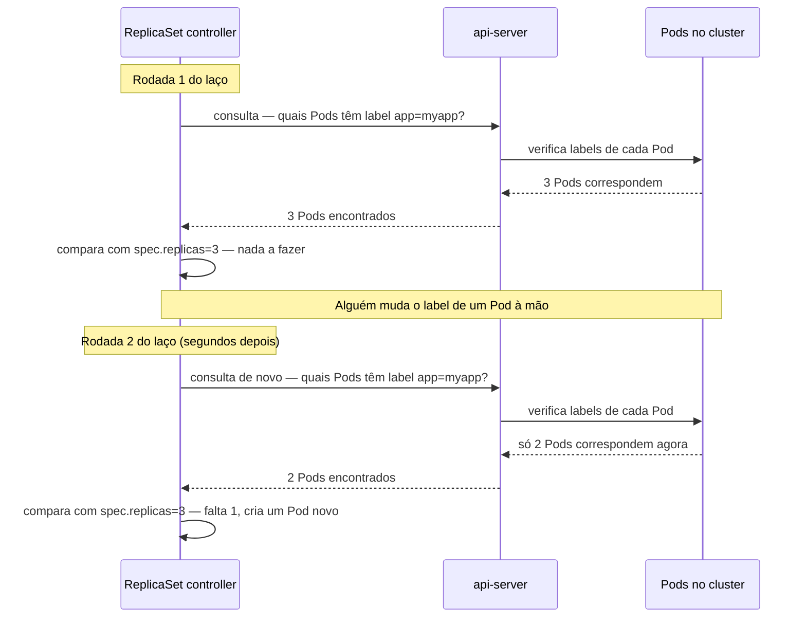
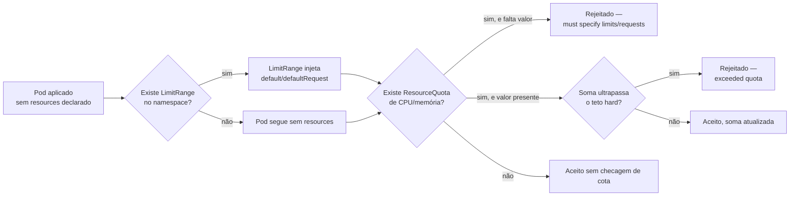

# Namespaces, labels e selectors

> [!abstract] TL;DR
> Um cluster com algumas centenas de objetos não tem nomes de arquivo, nem pastas, nem hierarquia — tem uma coleção plana de recursos, e a única forma de perguntar "quais desses são meus?" ou "quais desses o controller X deveria gerenciar?" é por **label**, um par chave-valor anexado ao `metadata` de qualquer objeto. As notas anteriores deste galho já usaram esse mecanismo sem examiná-lo: o ReplicaSet acha "seus" Pods por `selector`, o Service acha "seus" Pods por `selector` — nenhum dos dois guarda uma lista de nomes, a relação é derivada por consulta e reavaliada a cada rodada do laço de reconciliação. Consequência direta: mudar o label de um Pod à mão o tira (ou o traz) do conjunto gerenciado, na hora, sem aviso. Labels servem para **selecionar**; annotations servem para **carregar informação**, e confundir os dois é o erro mais comum de quem chega ao objeto. Namespaces resolvem um problema diferente e menor — só o escopo de nome — e não isolam rede nem segurança por padrão. ResourceQuota e LimitRange fecham o mecanismo de organização, impondo teto agregado por namespace e valor por objeto.

Imagine um cluster de produção real, não o ambiente de três Pods usado nas notas anteriores deste galho: trezentos, quatrocentos objetos — Deployments, Services, ConfigMaps, Jobs — pertencentes a oito times diferentes, rodando cinco ambientes distintos (dev, staging, homologação, produção, disaster recovery), todos no mesmo cluster físico. Alguém precisa responder, com confiança, a perguntas do tipo "quais Pods pertencem ao time de pagamentos?", "quantos Deployments do ambiente de staging existem agora?", "qual desses duzentos ConfigMaps é da versão 2 da API de checkout?". Nenhuma dessas perguntas tem resposta em `kubectl get pods` puro — a lista viria com trezentos nomes, a maioria deles um hash ilegível como `checkout-7d9f8c6b5-a1b2`, sem nenhuma pista sobre time, ambiente ou versão. Nomes de objeto foram desenhados para ser únicos, não para carregar significado — e mesmo que alguém tentasse embutir significado no nome (`checkout-prod-time-pagamentos-v2-7d9f8c6b5`), nenhuma ferramenta automatizada teria como extrair esse significado de volta de forma confiável, porque não existe estrutura garantida num nome, só uma string.

O problema fica mais grave um andar abaixo do humano perguntando: um **controller** — o mesmo tipo de processo que a nota [[03-Dominios/Tecnologia/Infraestrutura/Kubernetes/02 - O loop de reconciliação|02 — O loop de reconciliação]] descreveu observando, comparando e agindo — também precisa de uma forma de responder "quais objetos são meus?" sem depender de uma lista de nomes fixada de antemão. Um ReplicaSet criado às 14h pode precisar reconhecer, à 1h da manhã, um Pod que nem existia quando ele foi criado, porque outro Pod correspondente ao mesmo template morreu e um substituto nasceu no lugar com um nome novo. Se a relação entre ReplicaSet e Pod dependesse de uma lista de nomes gravada estaticamente, ela ficaria desatualizada no instante em que o primeiro Pod fosse substituído. É exatamente esse problema — organização para humanos, e reconhecimento de conjunto para controllers — que o mecanismo desta nota resolve, e resolve com a mesma peça, nos dois casos: o **label**.

## Labels como o mecanismo de ligação que sustenta o laço inteiro

Vale voltar, agora com atenção explícita, a um detalhe que as notas [[03-Dominios/Tecnologia/Infraestrutura/Kubernetes/04 - Deployment e ReplicaSet|04 — Deployment e ReplicaSet]] e [[03-Dominios/Tecnologia/Infraestrutura/Kubernetes/05 - Service|Service]] usaram sem examinar: o campo `spec.selector.matchLabels` de um ReplicaSet, e o campo `spec.selector` de um Service. Os dois manifestos abaixo — um recorte do que já apareceu nas notas anteriores — carregam a mesma peça, só que aplicada a dois problemas diferentes:

```yaml
# Recorte do ReplicaSet gerenciado por um Deployment
spec:
    selector:
        matchLabels:
            app: myapp
    template:
        metadata:
            labels:
                app: myapp
---
# Recorte de um Service
spec:
    selector:
        app: myapp
    ports:
        - port: 80
          targetPort: 8080
```

Repare no que nenhum dos dois manifestos contém: uma lista de nomes de Pods. O ReplicaSet não diz "meus Pods são `myapp-7d9f8c6b5-a1b2`, `myapp-7d9f8c6b5-c3d4` e `myapp-7d9f8c6b5-e5f6`" — ele diz "meus Pods são qualquer objeto do tipo Pod que carregue o label `app: myapp`". O Service diz exatamente a mesma coisa, com a mesma sintaxe, para o mesmo propósito de fundo: encontrar um conjunto de Pods sem depender de saber os nomes deles de antemão. Essa é a definição operacional de **label selector**: um critério de correspondência contra os labels de um objeto, que qualquer cliente do api-server — um controller, o `kubectl`, um humano — pode usar para perguntar "quais objetos correspondem a isto?" a qualquer momento.

O ponto central desta nota, que vale nomear sem rodeio porque é o ângulo que a organiza inteira: **a relação entre um ReplicaSet e seus Pods, ou entre um Service e seus Pods, não é uma posse fixada no momento da criação — é derivada por consulta, reavaliada a cada rodada do laço de reconciliação.** Não existe, em lugar nenhum do cluster, uma tabela "ReplicaSet X é dono dos Pods A, B, C" gravada de forma estática. O que existe é um `selector` guardado no ReplicaSet, e uma pergunta que o controller refaz continuamente contra o estado atual do cluster: "quais Pods, agora, correspondem a este `selector`?". A resposta a essa pergunta pode mudar de um segundo para o outro, sem que o `selector` em si tenha mudado uma linha — e é exatamente essa reavaliação contínua que a próxima seção torna tangível.



Esse diagrama é a peça que faltava no vocabulário construído até aqui: o `selector` não é examinado uma vez, no momento da criação do ReplicaSet, e depois esquecido. Ele é reexecutado como consulta a cada rodada — e, sendo level-triggered (o vocabulário que a nota 02 estabeleceu), o controller nunca precisa saber *por que* a contagem mudou, só que ela mudou.

## O experimento que prova que a relação é por consulta, não por posse

A melhor forma de tornar isso tangível — e a demonstração mais direta possível de que "posse" é a palavra errada aqui — é mudar o label de um Pod gerenciado, à mão, e observar o ReplicaSet reagir como se aquele Pod nunca tivesse existido para ele. Parta de um Deployment com três réplicas, já convergido:

```bash
kubectl get pods -l app=myapp
# NAME                    READY   STATUS    RESTARTS   AGE
# myapp-7d9f8c6b5-a1b2    1/1     Running   0          4m
# myapp-7d9f8c6b5-c3d4    1/1     Running   0          4m
# myapp-7d9f8c6b5-e5f6    1/1     Running   0          4m
```

Agora, em vez de apagar um Pod (o experimento que a nota 02 já fez), mude só o label dele, sem tocar em mais nada:

```bash
kubectl label pod myapp-7d9f8c6b5-a1b2 app=myapp-orfao --overwrite
kubectl get pods -l app=myapp --watch
```

No instante seguinte ao `label`, o Pod `myapp-7d9f8c6b5-a1b2` continua rodando — nenhum container foi tocado, o processo dentro dele nem percebeu a mudança. Mas a saída do `--watch` mostra algo que costuma surpreender quem espera algum tipo de proteção: o Pod desaparece da lista filtrada por `app=myapp` (porque seu label mudou, ele já não corresponde mais ao filtro), e segundos depois um Pod novo nasce no lugar, com um sufixo diferente:

```
NAME                    READY   STATUS              RESTARTS   AGE
myapp-7d9f8c6b5-c3d4    1/1     Running             0          4m10s
myapp-7d9f8c6b5-e5f6    1/1     Running             0          4m10s
myapp-7d9f8c6b5-g7h8    0/1     Pending             0          0s
myapp-7d9f8c6b5-g7h8    0/1     ContainerCreating   0          2s
myapp-7d9f8c6b5-g7h8    1/1     Running             0          6s
```

O que aconteceu, mecanicamente: o ReplicaSet controller refez a consulta "quais Pods têm `app=myapp`?" na sua rodada seguinte, e a resposta agora era 2, não 3 — o Pod que teve o label trocado literalmente saiu do conjunto que o ReplicaSet reconhece como seu, mesmo continuando vivo, rodando, saudável. Comparado com `spec.replicas: 3`, a diferença apareceu, e o controller criou um substituto, exatamente como faria se o Pod tivesse morrido de verdade. Ao mesmo tempo, `kubectl get pods -l app=myapp-orfao` mostraria o Pod renomeado — vivo, mas órfão de qualquer controller, porque nenhum outro `selector` no cluster corresponde a esse label novo (a não ser que, por azar de configuração, outro objeto use exatamente esse valor de label, cenário que a nota [[03-Dominios/Tecnologia/Infraestrutura/Kubernetes/04 - Deployment e ReplicaSet|04 — Deployment e ReplicaSet]] já descreveu ao falar de dois Deployments competindo pelo mesmo `selector`).

O experimento inverso é igualmente revelador: peça a um Pod qualquer, criado avulso e sem dono nenhum, para *entrar* no conjunto gerenciado, só rotulando-o com o label certo:

```bash
kubectl run intruso --image=nginx:1.27-alpine --labels="app=myapp"
kubectl get pods -l app=myapp
```

Segundos depois, o ReplicaSet controller vê que agora existem 4 Pods correspondendo ao `selector` — um a mais do que os 3 declarados em `spec.replicas` — e remove um deles (não necessariamente o intruso; a escolha de qual Pod remover quando há excesso segue uma heurística própria, não ordem de chegada) para voltar à contagem certa. Nenhum dos dois experimentos — tirar um Pod do conjunto rotulando-o para fora, ou trazer um Pod de fora rotulando-o para dentro — envolveu tocar em qualquer `spec` do ReplicaSet ou do Deployment. A fronteira do que é "gerenciado" e do que não é nunca foi uma lista fixa; foi, o tempo todo, uma consulta contra o estado atual de labels do cluster.

## Labels e annotations não são a mesma coisa

O erro mais comum de quem começa a usar labels é tratá-los como um campo genérico de metadado — "um lugar para guardar informação sobre o objeto" — e usá-los indiferentemente para qualquer dado que pareça relevante. O Kubernetes distingue, de propósito, dois campos com propósitos opostos: `metadata.labels` e `metadata.annotations`.

**Labels são para selecionar.** Um label é indexado pelo api-server especificamente para permitir consultas eficientes — é essa indexação que torna `kubectl get pods -l app=myapp` rápido mesmo num cluster com dezenas de milhares de Pods, e que torna o `selector` de um ReplicaSet ou Service uma consulta barata de executar a cada rodada do laço. Por serem indexados e consultáveis, labels carregam uma restrição de formato relativamente rígida: chaves com até 63 caracteres (mais um prefixo opcional de domínio DNS, com até 253 caracteres, separado por `/`), valores com até 63 caracteres, e um alfabeto limitado — letras, números, `-`, `_` e `.`, começando e terminando em caractere alfanumérico. Não dá para colocar um JSON inteiro, uma descrição de texto livre, ou um valor de mais de 63 caracteres num label — o formato existe justamente para manter a indexação rápida e a semântica de "identificador curto e comparável" intacta.

**Annotations são para carregar informação.** Uma annotation não é indexada, não participa de nenhum `selector`, e não tem a mesma restrição rígida de tamanho — pode carregar um bloco de texto relativamente grande (o limite prático é o tamanho total do objeto no etcd, não um teto de 63 caracteres por valor). Annotations existem para que ferramentas — e só ferramentas, tipicamente, não humanos consultando via `kubectl get -l` — guardem informação estruturada associada a um objeto: a nota [[03-Dominios/Tecnologia/Infraestrutura/Kubernetes/04 - Deployment e ReplicaSet|04 — Deployment e ReplicaSet]] já usou uma, `kubernetes.io/change-cause`, para registrar o motivo textual de uma revisão de Deployment. Outros exemplos comuns: uma annotation carregando a configuração inteira que um Ingress controller precisa interpretar (`nginx.ingress.kubernetes.io/rewrite-target`), ou uma carregando o timestamp da última aplicação de configuração via `kubectl apply` (`kubectl.kubernetes.io/last-applied-configuration`, usado internamente pelo próprio `kubectl` para calcular diffs em atualizações incrementais).

```yaml
metadata:
    labels:
        app: checkout
        env: production
        team: pagamentos
    annotations:
        kubernetes.io/change-cause: "corrige timeout no gateway de pagamento"
        contact-team-slack: "#pagamentos-oncall"
        description: >
            Serviço de checkout responsável por processar pagamentos via
            gateway externo. Depende de postgres.pagamentos.svc e do
            serviço de notificações. Runbook completo no wiki interno.
```

Repare na diferença de intenção entre os dois blocos: `labels` responde "por qual critério alguém acharia este objeto?" — e cada valor ali é curto, exato, comparável. `annotations` responde "que informação extra este objeto carrega, para quem já o encontrou?" — e o valor pode ser um texto livre, uma URL, um bloco YAML inteiro serializado como string.

O erro inverso, menos comum mas igualmente problemático, é usar uma annotation onde o caso de uso pedia um label — por exemplo, guardar o ambiente (`env: production`) só como annotation. Nesse caso, `kubectl get pods -l env=production` simplesmente não encontra nada, porque annotations não participam de `selector` nenhum; qualquer automação que precisasse filtrar por ambiente teria que ler e parsear annotations manualmente, um trabalho que o próprio design de labels existe para evitar.

## A sintaxe de seleção: igualdade, conjunto, e a mesma linguagem por toda parte

O Kubernetes define duas formas de expressar um critério de seleção contra labels, e a mesma sintaxe vale tanto para o `kubectl get -l` de um humano no terminal quanto para o `selector` interno de um ReplicaSet ou Service — não são duas linguagens parecidas, é literalmente a mesma linguagem, no mesmo formato de string, em ambos os contextos.

**Seleção por igualdade** (*equality-based*) testa se uma chave tem exatamente um valor, ou explicitamente não tem:

```bash
kubectl get pods -l app=checkout
kubectl get pods -l env!=production
kubectl get pods -l app=checkout,env=production
```

A vírgula, no terceiro comando, funciona como um "E" lógico — só Pods que correspondem aos dois critérios ao mesmo tempo. É exatamente essa mesma sintaxe de igualdade que aparece em `matchLabels`, a forma mais comum de `selector` usada nos manifestos vistos até aqui neste galho.

**Seleção por conjunto** (*set-based*) é mais expressiva, e só existe na forma de string usada por `kubectl -l` ou no campo `matchExpressions` de um `selector` estruturado — `matchLabels` sozinho não sabe expressar "um dos vários valores possíveis":

```bash
kubectl get pods -l 'env in (staging, production)'
kubectl get pods -l 'tier notin (frontend, cache)'
kubectl get pods -l 'app'
kubectl get pods -l '!app'
```

O primeiro comando encontra Pods cujo `env` seja staging **ou** production — algo que a sintaxe de igualdade não conseguiria expressar numa única consulta. O segundo exclui dois valores de `tier` ao mesmo tempo. O terceiro, `-l 'app'` sem operador nenhum, testa só a **presença** da chave `app`, com qualquer valor. O quarto, `-l '!app'`, testa a **ausência** — encontra Pods que não têm a chave `app` de forma nenhuma, útil, por exemplo, para achar objetos criados fora de qualquer convenção de time, candidatos a limpeza.

A mesma expressividade aparece dentro de um manifesto, no campo `matchExpressions` de um `selector` — usado, por exemplo, num `NetworkPolicy` ou num `PodDisruptionBudget` que precisa de um critério mais rico do que igualdade simples:

```yaml
selector:
    matchExpressions:
        - key: env
          operator: In
          values: ["staging", "production"]
        - key: tier
          operator: NotIn
          values: ["cache"]
        - key: legacy
          operator: DoesNotExist
```

Repare que os operadores (`In`, `NotIn`, `Exists`, `DoesNotExist`) mapeiam, um a um, para os operadores da forma textual usada em `kubectl -l` (`in (...)`, `notin (...)`, presença de chave, `!chave`). Não é coincidência de design — é literalmente a mesma gramática de seleção, exposta de duas formas: como string compacta para consulta interativa, e como estrutura YAML para uso dentro de um manifesto que outro `selector`, mais amplo que `matchLabels`, precisa compor.

```bash
# Mais exemplos de kubectl get -l, cada um respondendo a uma pergunta de organização real
kubectl get pods -A -l team=pagamentos
kubectl get deployments -l 'app.kubernetes.io/component in (backend, worker)'
kubectl get pods -l app=checkout --show-labels
kubectl get all -l 'env=production,tier!=cache'
kubectl delete pods -l 'legacy=true,env=staging'
kubectl get pods -n producao -l '!app.kubernetes.io/managed-by'
```

O último comando é um exemplo real de uso da seleção por ausência: encontrar Pods que não carregam a label de convenção `app.kubernetes.io/managed-by`, um sinal de que aquele objeto foi criado fora do processo padrão do time (via `kubectl run` manual, por exemplo, em vez de um chart Helm ou uma pipeline de GitOps).

## Labels recomendados: uma convenção compartilhada entre ferramentas

O Kubernetes documenta um conjunto de labels recomendados, sob o prefixo `app.kubernetes.io/`, cujo valor não vem de nenhuma obrigação técnica — nenhum controller embutido do cluster exige esses labels para funcionar — mas de uma vantagem prática concreta: quando várias ferramentas diferentes (Helm, um dashboard como o Lens, um sistema de observabilidade, uma ferramenta de custo por workload) leem o mesmo cluster, uma convenção compartilhada permite que cada uma delas agrupe e correlacione objetos sem precisar de configuração específica por time.

| Label | O que descreve | Exemplo |
| --- | --- | --- |
| `app.kubernetes.io/name` | O nome da aplicação, de forma consistente entre todos os objetos que a compõem | `checkout` |
| `app.kubernetes.io/instance` | Um identificador único desta instância específica da aplicação (útil quando a mesma aplicação roda várias vezes no cluster) | `checkout-canary` |
| `app.kubernetes.io/component` | O papel deste objeto dentro da arquitetura da aplicação | `backend`, `database`, `cache` |
| `app.kubernetes.io/part-of` | O sistema maior do qual esta aplicação é parte | `plataforma-pagamentos` |
| `app.kubernetes.io/managed-by` | A ferramenta que criou e gerencia este objeto | `helm`, `argocd`, `kustomize` |
| `app.kubernetes.io/version` | A versão corrente da aplicação | `1.2.4` |

```yaml
metadata:
    labels:
        app.kubernetes.io/name: checkout
        app.kubernetes.io/instance: checkout
        app.kubernetes.io/component: backend
        app.kubernetes.io/part-of: plataforma-pagamentos
        app.kubernetes.io/managed-by: helm
        app.kubernetes.io/version: "1.2.4"
```

Vale um exemplo concreto do valor prático dessa convenção: um chart Helm aplica automaticamente `app.kubernetes.io/managed-by: Helm` (e frequentemente `helm.sh/chart` com nome e versão do chart) a todo objeto que ele cria, sem que o autor do chart precise pensar nisso — é parte do template padrão gerado por `helm create`. Uma ferramenta de observabilidade genérica, construída para funcionar em qualquer cluster, pode agrupar métricas por `app.kubernetes.io/name` sem precisar de nenhuma configuração específica daquele cluster, porque a convenção — sendo pública e amplamente adotada — já entrega a peça de agrupamento pronta. Um time que inventasse sua própria convenção de labels, sem seguir o padrão documentado, perderia exatamente esse tipo de interoperabilidade de graça com qualquer ferramenta de terceiros que já espera o prefixo `app.kubernetes.io/`.

## Por que o `selector` de um Deployment é imutável

A nota [[03-Dominios/Tecnologia/Infraestrutura/Kubernetes/04 - Deployment e ReplicaSet|04 — Deployment e ReplicaSet]] já mencionou, en passant, que `spec.selector` de um Deployment não pode mudar depois de criado — vale, aqui, entender o motivo com a lente completa desta nota, porque ele cai direto do que as seções anteriores acabaram de estabelecer. Se a relação entre um controller e "seus" objetos é derivada por consulta contra o `selector`, então mudar o `selector` depois de criado equivaleria a mudar, retroativamente, qual conjunto inteiro de objetos aquele controller passa a considerar seu — um Deployment poderia, de um segundo para o outro, começar a reconhecer como seus Pods que nunca fizeram parte dele, ou perder de vista Pods que ele mesmo criou, sem nenhuma trilha clara do que causou a mudança de conjunto.

```bash
kubectl apply -f deployment-com-selector-novo.yaml
```

```
The Deployment "myapp" is invalid: spec.selector: Invalid value:
v1.LabelSelector{MatchLabels:map[string]string{"app":"myapp-v2"}, MatchExpressions:[]v1.LabelSelectorRequirement(nil)}:
field is immutable
```

O api-server rejeita a mudança na validação, antes mesmo de gravar qualquer coisa no etcd — o mesmo ponto de validação síncrona que a nota 02 descreveu como parte do fluxo de `kubectl apply`. Não existe forma de contornar essa restrição editando o Deployment existente; a correção, quando um `selector` errado precisa ser trocado, é recriar o objeto do zero com o `selector` certo desde a criação, aceitando a janela de indisponibilidade que a recriação implica, ou orquestrando manualmente uma migração via um Deployment paralelo com `selector` novo, que a nota [[03-Dominios/Tecnologia/Infraestrutura/Kubernetes/04 - Deployment e ReplicaSet|04]] já apontou como caminho.

## Namespaces: escopo de nome, não fronteira de segurança

Um **namespace** resolve um problema mais estreito do que costuma parecer à primeira vista: ele divide o espaço de **nomes** de objetos, permitindo que dois objetos do mesmo tipo, com o mesmo nome, coexistam no mesmo cluster, desde que vivam em namespaces diferentes.

```bash
kubectl create namespace equipe-pagamentos
kubectl create namespace equipe-checkout

kubectl apply -f deployment.yaml -n equipe-pagamentos   # cria "worker"
kubectl apply -f deployment.yaml -n equipe-checkout     # cria outro "worker", sem conflito
```

Os dois Deployments chamados `worker` coexistem sem erro nenhum, porque o identificador de fato único de um objeto não é o nome sozinho — é o par `(namespace, nome)` para o mesmo `kind`. Sem namespaces, ou dentro do mesmo namespace, essa mesma tentativa falharia com um erro de objeto já existente. Vale notar que nem todo objeto do Kubernetes é *namespaced* — alguns tipos são **cluster-scoped**, existindo uma única vez no cluster inteiro, sem repetição possível por namespace: Nodes, PersistentVolumes (a reivindicação, PVC, é namespaced; o volume em si, PV, não é), ClusterRoles, StorageClasses, e o próprio objeto Namespace são exemplos comuns. Descobrir, para qualquer cluster, quais tipos são cluster-scoped e quais são namespaced é uma consulta direta:

```bash
kubectl api-resources --namespaced=false
kubectl api-resources --namespaced=true
```

O primeiro comando lista tipos como `namespaces`, `nodes`, `persistentvolumes`, `clusterroles`, `storageclasses` — recursos que existem "acima" de qualquer namespace, visíveis e únicos no cluster inteiro. O segundo lista a maioria dos tipos do dia a dia — Pods, Deployments, Services, ConfigMaps — que só fazem sentido dentro de um namespace específico.

> [!warning] O que namespace NÃO é
> Um namespace, sozinho, não é fronteira de segurança nem isolamento de rede. Por padrão, todo Pod do cluster consegue falar com todo Pod de qualquer outro namespace — um Pod em `equipe-pagamentos` alcança, por IP ou por DNS interno, um Pod em `equipe-checkout`, sem nenhuma barreira de rede impedindo essa comunicação. Restringir esse tráfego exige um objeto explícito, o `NetworkPolicy`, que declara regras de ingress/egress por seletor de Pod e de namespace — assunto que este galho reserva para a nota [[03-Dominios/Tecnologia/Infraestrutura/Kubernetes/20 - Rede do cluster por dentro|Rede do cluster por dentro]], e que [[03-Dominios/Engenharia/Operação/3 - Rodar em produção/05 - Rede e borda em produção|Rede e borda em produção]], no domínio de Operação, cobre do ponto de vista operacional. Segurança de acesso — quem pode ler ou escrever objetos dentro de um namespace — é assunto de RBAC, coberto mais adiante neste galho, na fase Adepto; um namespace por si só não impede nenhum usuário autenticado com permissão cluster-wide de ler ou modificar objetos em qualquer namespace.

Namespaces cumprem, então, um papel mais modesto e igualmente valioso: são a unidade natural de **organização administrativa** — separar ambientes (dev, staging, produção), separar times, aplicar cotas de recursos por fatia do cluster, e servir de escopo para RBAC (uma `Role`, diferente de uma `ClusterRole`, se aplica só dentro de um namespace). É exatamente esse papel administrativo, não o de isolamento técnico, que a próxima seção constrói em cima.

## ResourceQuota e LimitRange: teto agregado e valor padrão

Um namespace sozinho não impõe nenhum limite sobre quantos recursos os objetos nele contidos podem consumir — sem nenhuma configuração adicional, um único time poderia, por engano ou por pico de tráfego, criar Pods suficientes para esgotar toda a capacidade de CPU e memória do cluster, afetando o namespace de todos os outros times que compartilham a mesma infraestrutura física. Dois objetos, complementares, fecham essa lacuna.

**`ResourceQuota`** declara um teto agregado por namespace: quanto de CPU, memória, e quantos objetos de certos tipos (Pods, Services, PersistentVolumeClaims) podem existir, somados, dentro daquele namespace inteiro.

```yaml
apiVersion: v1
kind: ResourceQuota
metadata:
    name: quota-equipe-pagamentos
    namespace: equipe-pagamentos
spec:
    hard:
        requests.cpu: "10"          # soma de todos os requests.cpu não pode passar de 10 cores
        requests.memory: 20Gi        # soma de todos os requests.memory não pode passar de 20Gi
        limits.cpu: "20"
        limits.memory: 40Gi
        pods: "50"                   # no máximo 50 Pods simultâneos neste namespace
        persistentvolumeclaims: "10"
```

Tentar criar um Pod que faria a soma ultrapassar qualquer um desses tetos falha na validação, com um erro explícito:

```bash
kubectl apply -f pod-que-estoura-cota.yaml
```

```
Error from server (Forbidden): error when creating "pod-que-estoura-cota.yaml":
pods "worker-extra" is forbidden: exceeded quota: quota-equipe-pagamentos,
requested: requests.cpu=2, used: requests.cpu=9, limited: requests.cpu=10
```

Repare no formato da mensagem: ela mostra exatamente os três números que importam — o que estava sendo pedido, o que já estava em uso, e o teto configurado — o suficiente para diagnosticar o estouro sem precisar de nenhuma investigação adicional.

**`LimitRange`** resolve um problema complementar e menor em escopo: definir um valor **padrão** de `requests`/`limits` para objetos que não declaram esses campos explicitamente, e opcionalmente um mínimo e um máximo permitido por container individual.

```yaml
apiVersion: v1
kind: LimitRange
metadata:
    name: limites-padrao
    namespace: equipe-pagamentos
spec:
    limits:
        - type: Container
          default:
              cpu: "500m"
              memory: "512Mi"
          defaultRequest:
              cpu: "250m"
              memory: "256Mi"
          min:
              cpu: "100m"
          max:
              cpu: "2"
              memory: "2Gi"
```

Um Pod criado neste namespace sem `resources` declarado explicitamente recebe, automaticamente, `requests.cpu: 250m` e `limits.cpu: 500m` — os valores de `defaultRequest` e `default` — sem que quem escreveu o manifesto precisasse pensar nisso. Um Pod que tentasse declarar `limits.cpu: 4` seria rejeitado, porque ultrapassa o `max` configurado para aquele namespace.

Há uma interação entre os dois objetos que costuma pegar quem só conhece um deles isoladamente, e vale nomear com precisão: **assim que um `ResourceQuota` de CPU ou memória está ativo num namespace, todo Pod criado ali passa a ser obrigado a declarar `requests` e `limits` explicitamente para os recursos cobertos pela cota** — não porque o `ResourceQuota` em si force isso diretamente, mas porque, sem um valor declarado, o api-server não tem como saber quanto aquele Pod específico consumiria do teto agregado, e rejeita a criação:

```bash
kubectl apply -f pod-sem-resources.yaml
```

```
Error from server (Forbidden): error when creating "pod-sem-resources.yaml":
pods "worker" is forbidden: failed quota: quota-equipe-pagamentos:
must specify limits.cpu,limits.memory,requests.cpu,requests.memory
```

É exatamente para resolver esse atrito — um `ResourceQuota` de CPU/memória ativo tornando obrigatório declarar `resources` em todo Pod — que um `LimitRange` com `default`/`defaultRequest` costuma ser configurado no mesmo namespace: o `LimitRange` preenche os valores que faltarem antes da validação da cota acontecer, então um manifesto simples, sem `resources` declarado, continua funcionando mesmo sob uma cota estrita, porque o valor default é injetado a tempo de satisfazer o requisito da cota.



Manifesto de namespace completo, reunindo os três objetos desta seção num único conjunto coerente:

```yaml
apiVersion: v1
kind: Namespace
metadata:
    name: equipe-pagamentos
    labels:
        # convenção de labels recomendada, aplicada também ao namespace
        team: pagamentos
        env: production
---
apiVersion: v1
kind: ResourceQuota
metadata:
    name: quota-equipe-pagamentos
    namespace: equipe-pagamentos
spec:
    hard:
        requests.cpu: "10"
        requests.memory: 20Gi
        limits.cpu: "20"
        limits.memory: 40Gi
        pods: "50"
---
apiVersion: v1
kind: LimitRange
metadata:
    name: limites-padrao
    namespace: equipe-pagamentos
spec:
    limits:
        - type: Container
          default:
              cpu: "500m"
              memory: "512Mi"
          defaultRequest:
              cpu: "250m"
              memory: "256Mi"
          max:
              cpu: "2"
              memory: "2Gi"
```

Repare que os três objetos, aplicados juntos, respondem em conjunto às perguntas administrativas que abriram esta nota: `Namespace` dá ao time de pagamentos um espaço de nome próprio, isolado de colisão com outros times; `ResourceQuota` garante que esse time não consome, sozinho, mais do que sua fatia acordada de capacidade do cluster; `LimitRange` garante que nenhum Pod individual escapa despercebido sem `requests`/`limits` declarados, mesmo sob a pressão de uma cota agregada estrita.

## Armadilhas comuns

> [!warning] Confundir label com annotation e descobrir o erro só quando o selector "não encontra nada"
> Guardar um dado importante — o ambiente, o time responsável, a versão — como annotation em vez de label parece inofensivo até alguém tentar filtrar por esse dado com `kubectl get -l` ou construir um `selector` em cima dele, e a consulta simplesmente não retorna nada, porque annotations nunca participam de seleção. O sintoma é silencioso: não há erro, só um conjunto vazio onde se esperava uma lista.

> [!warning] Achar que mudar o label de um Pod gerenciado é uma operação segura e reversível
> Como o experimento desta nota mostrou, rotular um Pod para fora do `selector` de um ReplicaSet o tira do conjunto gerenciado imediatamente — o controller cria um substituto, e o Pod original continua rodando, órfão, sem que ninguém mais o gerencie ou o remova automaticamente. Um Pod órfão desses pode continuar consumindo recursos do cluster indefinidamente, sem aparecer em nenhuma contagem de réplicas esperada, até alguém notar por acaso um Pod "a mais" numa auditoria manual.

> [!warning] Usar um label genérico demais no selector e acabar correspondendo a Pods de outra aplicação
> Um `selector` como `tier: backend`, sem nenhum identificador de aplicação específico, corre o risco real de corresponder a Pods de mais de um Deployment diferente, se dois times usarem a mesma convenção de `tier` sem um label de `app` ou `app.kubernetes.io/name` mais específico junto. O sintoma, como a nota [[03-Dominios/Tecnologia/Infraestrutura/Kubernetes/04 - Deployment e ReplicaSet|04 — Deployment e ReplicaSet]] já descreveu para o caso de dois Deployments competindo, costuma parecer instabilidade aleatória de contagem de Pods, não um erro óbvio de configuração.

> [!warning] Esquecer que um ResourceQuota ativo torna resources obrigatório em todo Pod novo do namespace
> Um pipeline de CI que aplica manifestos simples, sem `resources` declarado, funciona perfeitamente em um namespace sem cota — e passa a falhar, com um erro de validação, no primeiro namespace onde alguém ativou um `ResourceQuota` de CPU ou memória. A correção mais robusta não é lembrar de declarar `resources` manualmente em cada manifesto, mas configurar um `LimitRange` com `default`/`defaultRequest` no mesmo namespace, para que o valor seja preenchido automaticamente antes da checagem de cota acontecer.

> [!warning] Tratar namespace como se fosse isolamento de rede ou de segurança por padrão
> É comum assumir, por analogia com "pasta" ou "container isolado", que dois namespaces diferentes não conseguem se comunicar sem configuração explícita. O oposto é verdade por padrão: todo Pod alcança todo outro Pod do cluster inteiro, através de qualquer namespace, até que uma `NetworkPolicy` explícita restrinja esse tráfego. Presumir isolamento que não existe é um erro de modelo mental que só aparece quando um teste de penetração, ou um incidente real, atravessa uma fronteira de namespace que ninguém tinha fechado.

## Como explicar em inglês

| Português | English |
| --- | --- |
| Labels servem para selecionar; annotations servem para carregar informação | Labels are for selecting; annotations are for carrying information |
| A relação entre um selector e seus Pods é derivada por consulta, não uma lista fixa | The relationship between a selector and its Pods is query-derived, not a fixed list |
| O selector de um Deployment é imutável depois de criado | A Deployment's selector is immutable once created |
| Um namespace divide o espaço de nomes, não isola rede por padrão | A namespace divides the naming scope, it doesn't isolate network traffic by default |
| ResourceQuota impõe um teto agregado por namespace | A ResourceQuota enforces an aggregate cap per namespace |
| LimitRange preenche um valor padrão quando o objeto não declara resources | A LimitRange injects a default value when the object doesn't declare resources |
| Alguns recursos são namespaced, outros são cluster-scoped | Some resources are namespaced, others are cluster-scoped |
| Selector por conjunto permite expressar "um dos vários valores" | Set-based selectors let you express "one of several values" |
| Mudar o label de um Pod o tira do conjunto gerenciado imediatamente | Changing a Pod's label removes it from the managed set immediately |
| A convenção `app.kubernetes.io/*` existe para interoperar entre ferramentas | The `app.kubernetes.io/*` convention exists to interoperate across tools |

## O que vem a seguir

Esta nota mostrou a linguagem de seleção que todo controller usa por dentro — igualdade, conjunto, presença e ausência — e como `kubectl get -l` fala exatamente essa mesma linguagem no terminal. Isso não é coincidência de sintaxe parecida: é a mesma consulta, no mesmo formato, sendo enviada para o mesmo lugar. A pergunta que sobra, e que a próxima nota deste galho responde, é: o que `kubectl` de fato *é*, mecanicamente, quando executa qualquer um desses comandos? A resposta — que ele é, ele mesmo, só mais um cliente HTTP contra o api-server, e que a linguagem de `selector` vista aqui vira, literalmente, um parâmetro numa URL — é o assunto de [[03-Dominios/Tecnologia/Infraestrutura/Kubernetes/07 - kubectl é um cliente de API|07 — kubectl é um cliente de API]].

## Fontes

- [Kubernetes documentation — Labels and Selectors](https://kubernetes.io/docs/concepts/overview/working-with-objects/labels/)
- [Kubernetes documentation — Recommended Labels](https://kubernetes.io/docs/concepts/overview/working-with-objects/common-labels/)
- [Kubernetes documentation — Annotations](https://kubernetes.io/docs/concepts/overview/working-with-objects/annotations/)
- [Kubernetes documentation — Namespaces](https://kubernetes.io/docs/concepts/overview/working-with-objects/namespaces/)
- [Kubernetes documentation — Resource Quotas](https://kubernetes.io/docs/concepts/policy/resource-quotas/)
- [Kubernetes documentation — Limit Ranges](https://kubernetes.io/docs/concepts/policy/limit-range/)
- [Kubernetes documentation — Network Policies](https://kubernetes.io/docs/concepts/services-networking/network-policies/)
- [Kubernetes documentation — kubectl Cheat Sheet (label selectors)](https://kubernetes.io/docs/reference/kubectl/cheatsheet/#viewing-finding-resources)
- [Kubernetes API Reference — LabelSelector](https://kubernetes.io/docs/reference/generated/kubernetes-api/v1.30/#labelselector-v1-meta)
- [Kubernetes documentation — Deployment (selector immutability)](https://kubernetes.io/docs/concepts/workloads/controllers/deployment/)
