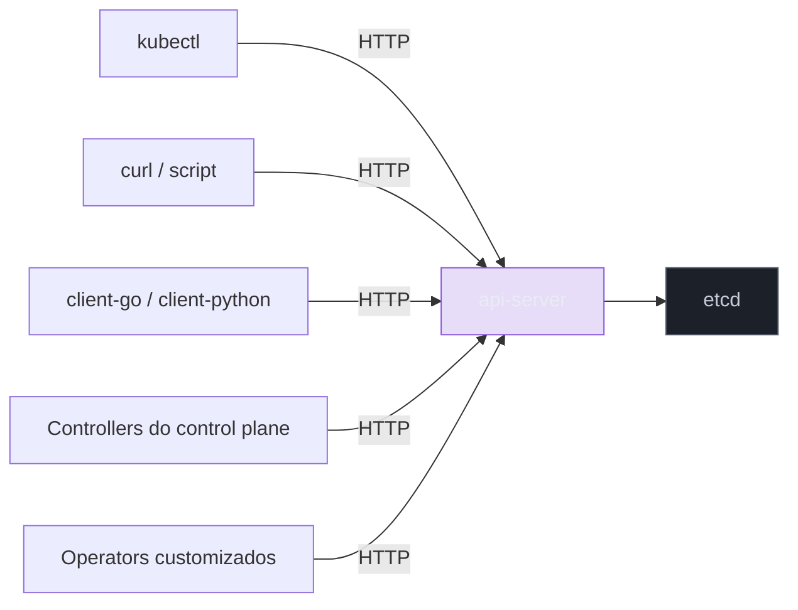

# kubectl é um cliente de API

> [!abstract] TL;DR
> `kubectl` não tem nenhum poder que a API não expõe: ele é um cliente HTTP comum, que monta uma requisição, resolve credenciais no `kubeconfig`, e fala com o api-server pela mesma porta que qualquer controller, qualquer pipeline de CI/CD e qualquer linha de código escrita à mão também usam. `kubectl get pods -v=8` mostra o verbo, a URL e o corpo da chamada; `kubectl proxy` seguido de `curl` reproduz o mesmo resultado sem `kubectl` nenhum no meio. A API se organiza em grupos, versões e recursos — o que explica por que o grupo legado mora em `/api/v1/...` e todo o resto mora em `/apis/<grupo>/<versão>/...`, uma assimetria histórica, não um capricho. `apply`, `create`, `patch` e `replace` mandam corpos e verbos HTTP diferentes pela mesma URL, e cada um resolve o conflito "o objeto já existe?" de um jeito distinto — inclusive na forma como listas dentro da spec são mescladas ou substituídas inteiras. `kubectl explain` lê o schema que o cluster de fato conhece, `--dry-run=server` passa pela validação real do api-server sem persistir nada, e o `kubeconfig` decide, silenciosamente, contra qual cluster qualquer um desses comandos está falando. Entender isso fecha a fase Iniciado deste galho: a spec não é um arquivo, é um objeto na API, e qualquer coisa que fale HTTP pode lê-la, mudá-la ou apagá-la.

Há uma armadilha mental que quase todo mundo carrega na primeira vez que abre um terminal com `kubectl` instalado: a sensação de que ele é uma ferramenta com poderes próprios, quase um pequeno sistema operacional de linha de comando que "sabe" orquestrar containers. Essa impressão nasce de uma boa razão — `kubectl` de fato faz muita coisa, de aplicar manifestos a mostrar logs a executar um shell dentro de um Pod remoto — mas o modelo mental que ela produz, "o `kubectl` faz as coisas acontecerem", trava exatamente o entendimento que a nota [[03-Dominios/Tecnologia/Infraestrutura/Kubernetes/02 - O loop de reconciliação|02 — O loop de reconciliação]] já começou a desmontar. Aquela nota estabeleceu que o `apply` termina no etcd — que existe uma fronteira síncrona clara entre "a intenção foi gravada" e "o container está rodando", e que quem faz a segunda parte é um controller, rodando em outro instante, olhando para o mesmo estado que qualquer um poderia olhar. Esta nota puxa esse fio até o fim: se o `apply` só faz uma chamada HTTP contra o api-server, então o `kubectl` inteiro — não só o `apply` — é apenas um cliente dessa API. Nenhum comando seu tem acesso a nada que a API não exponha por HTTP a qualquer outro cliente autenticado. E a virada mais útil dessa constatação é dupla: qualquer coisa que o `kubectl` faz, seu próprio código também pode fazer, direto contra a mesma URL; e os controllers que fecham o loop de reconciliação — o `kube-scheduler`, o `kube-controller-manager`, cada operator customizado — usam exatamente essa mesma porta, sem nenhum atalho especial que só eles conhecem. A nota [[03-Dominios/Tecnologia/Infraestrutura/Kubernetes/06 - Namespaces, labels e selectors|06 — Namespaces, labels e selectors]] fechou apontando que a linguagem de label selector — `app=minha-api`, `environment in (staging, production)` — não é sintaxe exclusiva do `kubectl`, mas vira, ela mesma, um parâmetro de query string numa URL HTTP. É exatamente daí que esta nota parte.

## Ver o HTTP com os próprios olhos

A forma mais direta de derrubar a mística é pedir ao próprio `kubectl` para mostrar o que ele está fazendo por baixo dos panos. `kubectl` aceita uma flag de verbosidade, `-v`, com uma escala numérica que vai de mensagens de alto nível até o dump completo da requisição e da resposta HTTP. No nível 6, o comando já revela o verbo e a URL de cada chamada; no nível 8, ele acrescenta os cabeçalhos e um trecho do corpo da requisição e da resposta. Rode um `get` simples com verbosidade alta e observe:

```bash
kubectl get pods -l app=minha-api -n default -v=8
```

A saída, entre as linhas de log internas do próprio `kubectl`, revela algo como isto:

```
I0803 10:12:04.118273   34821 round_trippers.go:463] GET https://192.168.49.2:8443/api/v1/namespaces/default/pods?labelSelector=app%3Dminha-api
I0803 10:12:04.118301   34821 round_trippers.go:469] Request Headers:
I0803 10:12:04.118309   34821 round_trippers.go:473]     Accept: application/json;as=Table;g=meta.k8s.io;v=v1
I0803 10:12:04.118315   34821 round_trippers.go:473]     User-Agent: kubectl/v1.31.0 (linux/amd64) kubernetes/...
I0803 10:12:04.156482   34821 round_trippers.go:588] Response Status: 200 OK in 38 milliseconds
I0803 10:12:04.156701   34821 request.go:1181] Response Body: {"kind":"Table","apiVersion":"meta.k8s.io/v1","columnDefinitions"...
```

Repare em cada peça dessa linha: o verbo é `GET`, o destino é o endereço do próprio api-server (a mesma URL que está registrada no `kubeconfig` como `server:` do cluster ativo), o caminho é `/api/v1/namespaces/default/pods`, e o label selector que você escreveu como `-l app=minha-api` virou, sem cerimônia nenhuma, o parâmetro de query `labelSelector=app%3Dminha-api` — o `%3D` é só o `=` escapado para caber numa URL. Não existe segredo nenhum aqui: é uma chamada `GET` comum, a mesma que qualquer biblioteca HTTP de qualquer linguagem poderia montar à mão.

Para provar isso sem sombra de dúvida, o próprio `kubectl` oferece um atalho que remove até a necessidade de lidar com autenticação: `kubectl proxy` sobe um servidor HTTP local (por padrão na porta `8001`) que aceita conexões sem TLS nem token, e repassa cada requisição para o api-server real usando as credenciais já resolvidas do seu `kubeconfig`. Com o proxy no ar, num terminal separado, qualquer cliente HTTP comum consegue falar com o cluster:

```bash
kubectl proxy --port=8001 &
curl -s http://localhost:8001/api/v1/namespaces/default/pods | head -c 400
```

```json
{"kind":"PodList","apiVersion":"v1","metadata":{"resourceVersion":"48213"},"items":[{"metadata":{"name":"minha-api-7d8f9c6b5-abcde","namespace":"default","uid":"3f2b1a9c-..."
```

Esse `curl` nunca invocou o binário `kubectl` além da linha que subiu o proxy — a listagem de Pods veio de uma requisição HTTP crua, montada por uma ferramenta que não tem absolutamente nenhuma noção do que é um Deployment ou um ReplicaSet. Vale ir além e criar um objeto pelo mesmo caminho, sem `apply` nenhum:

```bash
curl -s -X POST http://localhost:8001/api/v1/namespaces/default/pods \
  -H 'Content-Type: application/json' \
  -d '{"apiVersion":"v1","kind":"Pod","metadata":{"name":"pod-via-curl"},"spec":{"containers":[{"name":"nginx","image":"nginx:1.27"}]}}'
```

O cluster aceita, valida e cria esse Pod exatamente como aceitaria um `kubectl apply -f pod.yaml` com o mesmo conteúdo — porque, do ponto de vista do api-server, os dois são indistinguíveis: ambos chegam como um `POST` com um corpo JSON contra a mesma URL. O que muda entre `kubectl` e `curl` é só conveniência: resolução automática de autenticação, validação client-side antes de enviar, formatação de saída, e um vocabulário de subcomandos memorizável. Nenhuma dessas conveniências é poder que só o `kubectl` tem — é por isso que bibliotecas como `client-go` (Go), `client-python`, ou o `kubernetes` client de qualquer outra linguagem popular existem: elas são, todas, clientes HTTP alternativos da mesma API, e um controller escrito à mão usando qualquer uma delas tem exatamente a mesma superfície de acesso que o `kubectl` do seu terminal.



Vale levar essa demonstração um passo além e reproduzir, com `curl` puro, o próprio mecanismo de *watch* que a nota anterior descreveu como o jeito pelo qual controllers observam mudanças sem fazer polling. A URL é a mesma coleção de sempre, só que com um parâmetro extra, `watch=true`, e a resposta chega em *streaming*, uma linha JSON por evento, em vez de uma lista fechada de uma vez só:

```bash
curl -s -N "http://localhost:8001/api/v1/namespaces/default/pods?watch=true"
```

Com esse `curl` ainda aberto num terminal, escale o Deployment `minha-api` num segundo terminal — `kubectl scale deployment minha-api --replicas=4` — e observe o primeiro terminal receber, em tempo real, uma linha nova por Pod criado, cada uma envelopada como `{"type":"ADDED","object":{...}}`. É exatamente esse fluxo de eventos, sem absolutamente nenhuma mágica adicional, que o `client-go` de qualquer controller consome através do Informer descrito na nota anterior — o `curl` só não sabe organizar esses eventos num cache local indexado, mas o protocolo por trás é idêntico. Todo participante desse diagrama entra pela mesma porta e é tratado, pelo api-server, sob as mesmas regras de autenticação e autorização — a diferença entre um humano rodando `kubectl` e um controller do control plane não é o caminho que a requisição percorre, é só a identidade que cada um carrega e o que essa identidade tem permissão de fazer, assunto que a seção sobre `kubectl auth can-i`, mais adiante, começa a abrir.

> [!tip] Vídeo — interceptando o tráfego do `kubectl` num proxy
> [**Using mitmproxy to understand what kubectl does under the hood**](https://www.youtube.com/watch?v=30a0WrfaS2A) (Maël Valais, ~11 min, EN) faz por outro caminho o que a seção acima faz com `-v=8`: em vez de pedir ao próprio `kubectl` que narre suas requisições, ele coloca um **mitmproxy no meio** e lê o tráfego de fora. O percurso é instrutivo porque cada obstáculo revela uma peça do modelo: o certificado do api-server é autoassinado, então o proxy precisa apresentar o seu e o cliente precisa ser instruído a aceitá-lo; o endereço do cluster no `kubeconfig` é um endereço de loopback, o que atrapalha o encaminhamento por proxy; e a autenticação do cliente é feita por certificado, que também precisa atravessar. No fim, aparece a lista de requisições HTTP que o `kubectl` de fato emite — a prova empírica da tese desta nota. **O que ele não cobre:** grupos e versões da API, a diferença entre `apply`/`create`/`patch`/`replace`, server-side apply, e o `kubeconfig` como assunto próprio.
>
> ⚠️ **Exceção declarada à régua de autoridade deste galho.** O vídeo tem poucas centenas de visualizações, abaixo do piso que reprovou outros candidatos. Entra assim mesmo por três motivos: o autor é contribuidor do ecossistema Kubernetes (cert-manager); o ângulo — observar o `kubectl` de fora, como tráfego de rede — não aparece em nenhum outro material encontrado; e a técnica é verificável por quem assiste, o que substitui a autoridade do canal pela reprodutibilidade do experimento.

## A forma da API: grupos, versões e recursos

Toda URL da API do Kubernetes segue uma estrutura previsível, e vale nomear as três peças que a compõem porque elas aparecem, sem exceção, em qualquer manifesto YAML que você já escreveu: **grupo**, **versão** e **recurso**. O campo `apiVersion` de um manifesto — `v1`, `apps/v1`, `batch/v1`, `networking.k8s.io/v1` — é, na verdade, grupo e versão concatenados; o `kind` — `Pod`, `Deployment`, `Job`, `Ingress` — mapeia para um recurso, geralmente no plural e em minúsculas na URL (`pods`, `deployments`, `jobs`, `ingresses`).

Existe uma assimetria histórica nessa estrutura que confunde bastante gente na primeira vez que olha os dois caminhos lado a lado, e vale explicar a causa em vez de só memorizar o padrão. Os recursos mais antigos do Kubernetes — Pod, Service, Namespace, ConfigMap, Secret, Node — pertencem ao que a documentação chama de **grupo legado**, ou **grupo core**, cujo nome é a string vazia (`""`). Por uma decisão de versionamento tomada nos primeiros anos do projeto, antes de a convenção de grupos nomeados existir, esses recursos ficaram hospedados sob o caminho `/api/v1/...`, sem prefixo de grupo nenhum. Todos os recursos adicionados depois — `Deployment` e `ReplicaSet` no grupo `apps`, `Job` e `CronJob` no grupo `batch`, `Ingress` e `NetworkPolicy` no grupo `networking.k8s.io` — seguem o padrão mais novo e mais regular, hospedado sob `/apis/<grupo>/<versão>/...`. Por isso um `kubectl get pods -v=6` mostra `GET .../api/v1/namespaces/default/pods`, sem `apis` no meio, enquanto o mesmo comando para Deployments mostra `GET .../apis/apps/v1/namespaces/default/deployments` — a diferença de um segmento na URL (`api` contra `apis`) é resquício direto de quando o grupo core foi criado, não uma regra que alguém precisa decorar caso a caso.

```bash
kubectl get pods -v=6 2>&1 | grep GET
kubectl get deployments -v=6 2>&1 | grep GET
```

```
I0803 10:15:02.331002   41203 loader.go:395] GET https://192.168.49.2:8443/api/v1/namespaces/default/pods
I0803 10:15:03.882117   41209 loader.go:395] GET https://192.168.49.2:8443/apis/apps/v1/namespaces/default/deployments
```

Duas ferramentas resolvem, na prática, qualquer dúvida sobre qual grupo e qual versão um recurso específico usa, sem precisar consultar documentação externa: `kubectl api-versions` lista todo grupo e versão que o cluster conectado de fato serve, e `kubectl api-resources` lista cada recurso conhecido junto com seu grupo, se ele é namespaced ou não, e os `kind` e `shortNames` associados.

```bash
kubectl api-versions | sort | head -8
```

```
apps/v1
autoscaling/v2
batch/v1
networking.k8s.io/v1
policy/v1
rbac.authorization.k8s.io/v1
storage.k8s.io/v1
v1
```

```bash
kubectl api-resources --namespaced=true | head -6
```

```
NAME         SHORTNAMES   APIVERSION   NAMESPACED   KIND
pods         po           v1           true         Pod
deployments  deploy       apps/v1      true         Deployment
jobs                      batch/v1     true         Job
services     svc          v1           true         Service
```

A coluna `APIVERSION` dessa listagem é exatamente o valor que vai no campo `apiVersion` de um manifesto — o que significa que, diante de um recurso desconhecido (um CRD instalado por algum operator, por exemplo), `kubectl api-resources` responde de imediato à pergunta "sob qual grupo e versão esse recurso vive?" sem precisar abrir documentação nenhuma. Vale notar também que um mesmo recurso pode ter mais de uma versão ativa ao mesmo tempo — `v1beta1` convivendo com `v1` durante um período de transição, por exemplo — e o cluster aceita objetos em qualquer versão que ele sirva, convertendo internamente entre elas quando necessário; esse mecanismo de conversão entre versões de um mesmo recurso é assunto mais profundo da nota [[03-Dominios/Tecnologia/Infraestrutura/Kubernetes/18 - A API como sistema extensível|A API como sistema extensível — CRDs]], e não precisa ser resolvido aqui — basta saber que a versão no `apiVersion` não é decorativa, ela participa da URL de verdade.

## `apply` × `create` × `patch` × `replace`: o que cada um manda pela rede

Os quatro verbos que `kubectl` expõe para escrever um objeto — `create`, `apply`, `patch`, `replace` — não são sinônimos com nomes diferentes; cada um monta um verbo HTTP e um corpo distintos, e cada um resolve de forma diferente a pergunta "o que fazer se o objeto já existir?".

**`kubectl create -f arquivo.yaml`** monta um `POST` simples contra a coleção do recurso (`/apis/apps/v1/namespaces/default/deployments`, por exemplo) — o equivalente HTTP de "insira este objeto novo". Se já existir um objeto com aquele nome no mesmo namespace, o api-server responde com `409 Conflict`, porque um `POST` de criação pressupõe que o recurso ainda não existe:

```bash
kubectl create -f deployment.yaml
```

```
Error from server (AlreadyExists): error when creating "deployment.yaml": deployments.apps "minha-api" already exists
```

**`kubectl apply -f arquivo.yaml`**, em contraste, nunca assume que o objeto é novo — ele resolve as duas situações, criar quando não existe e atualizar quando existe, através de um `PATCH` (no modelo mais moderno, *server-side apply*, detalhado na próxima seção) ou, no modelo mais antigo do lado do cliente, através de uma comparação de três vias entre a última configuração aplicada (guardada numa anotação, `kubectl.kubernetes.io/last-applied-configuration`), o estado ao vivo do objeto no cluster, e a nova configuração que você acabou de escrever. É exatamente essa comparação de três vias que permite ao `apply` calcular, sozinho, o que remover (um campo que estava na versão anterior e sumiu da nova), o que manter (um campo que outro processo escreveu e que a sua configuração nunca mencionou) e o que sobrescrever (um campo presente tanto na configuração anterior quanto na nova, com valor diferente). É essa mesma lógica de convergência — spec desejada contra o que já existe — que faz o `apply` nunca falhar com `409` só porque o objeto já existe: ele foi desenhado, desde o início, para ser seguro rodar repetidamente.

**`kubectl replace -f arquivo.yaml`** monta um `PUT`, o verbo HTTP mais direto e mais perigoso dos quatro: ele substitui o objeto inteiro pelo conteúdo enviado, campo por campo, sem nenhuma tentativa de mesclar com o que já existia. Qualquer campo que o cluster tivesse preenchido sozinho — um default do api-server, um valor escrito por outro controller — e que não apareça explicitamente no arquivo enviado é apagado, não preservado. `replace` também exige, por padrão, que o objeto já exista (falha com erro se não existir) e, em versões que respeitam controle de concorrência otimista à risca, pode exigir o `resourceVersion` correto no corpo enviado, rejeitando a escrita se algum outro processo tiver modificado o objeto entre a leitura e a tentativa de substituição.

**`kubectl patch`** é o mais granular dos quatro: em vez de enviar o objeto inteiro, ele manda só o pedaço que deve mudar, através de um `PATCH` HTTP cujo *content-type* determina qual dialeto de patch o api-server deve interpretar. Existem três dialetos em uso corrente, e a escolha entre eles importa de verdade, sobretudo diante de listas dentro da spec:

| Tipo de patch | Content-Type | Comportamento em listas |
|---|---|---|
| Strategic merge patch | `application/strategic-merge-patch+json` | Mescla listas por chave (ex.: `containers` por `name`), quando o tipo do recurso declara essa chave; é o default do `kubectl patch` para recursos embutidos. |
| JSON merge patch (RFC 7386) | `application/merge-patch+json` | Substitui a lista inteira pelo array enviado — não sabe mesclar por chave, porque a especificação não tem esse conceito. |
| JSON patch (RFC 6902) | `application/json-patch+json` | Uma sequência explícita de operações (`add`, `remove`, `replace`, por índice ou por caminho) — dá controle cirúrgico, mas exige que você conheça a posição exata do elemento na lista. |

A pegadinha clássica mora exatamente nessa coluna de comportamento em listas. Um `kubectl patch deployment minha-api --type=merge -p '{"spec":{"template":{"spec":{"containers":[{"name":"api","image":"minha-api:v2"}]}}}}'` — usando JSON merge patch — não atualiza só a imagem do container `api`; ele **substitui a lista `containers` inteira** pelo array de um elemento enviado, apagando qualquer outro container (um sidecar, por exemplo) que existisse antes na mesma lista, porque JSON merge patch trata array como valor atômico, nunca como coleção mesclável por chave. O mesmo patch, enviado como strategic merge (`--type=strategic`, o default do `kubectl patch` para recursos core e `apps`), reconhece que `containers` é uma lista com chave `name` e mescla só o elemento correspondente, preservando os demais. Vale ver isso na prática, comparando os dois tipos lado a lado num Deployment com dois containers:

```bash
kubectl patch deployment minha-api --type=strategic -p '{"spec":{"template":{"spec":{"containers":[{"name":"api","image":"minha-api:v2"}]}}}}'
# resultado: só o container "api" muda de imagem; o sidecar continua intacto

kubectl patch deployment minha-api --type=merge -p '{"spec":{"template":{"spec":{"containers":[{"name":"api","image":"minha-api:v2"}]}}}}'
# resultado: a lista containers vira só [{"name":"api","image":"minha-api:v2"}] — o sidecar desaparece
```

Esse comportamento não é um bug de nenhum dos dois tipos de patch — é uma consequência direta da especificação que cada um implementa, e a escolha errada entre eles é exatamente o tipo de erro que só aparece em produção, quando alguém automatiza um patch parecido com o de cima sem saber qual dialeto estava mandando pela rede.

## Server-side apply e gerenciamento de campo

A nota [[03-Dominios/Tecnologia/Infraestrutura/Kubernetes/02 - O loop de reconciliação|02 — O loop de reconciliação]] já introduziu o conflito entre controllers concorrentes brigando pelo mesmo campo — o Helm reaplicando `replicas: 3` por cima de um `kubectl scale` manual que tinha posto 10 — e nomeou o *server-side apply* como o mecanismo desenhado para tornar esse conflito visível. Vale entender, aqui, o que muda de fato na requisição HTTP quando esse mecanismo entra em ação.

No modelo mais antigo, *client-side apply*, era o próprio `kubectl` quem calculava o diff de três vias (anotação de última configuração aplicada, estado ao vivo, configuração nova) e enviava, como resultado desse cálculo, um `PATCH` já pronto. No *server-side apply*, esse cálculo se move para dentro do api-server: o `kubectl` envia a configuração inteira que você escreveu, marcada com um identificador de **field manager** (por padrão, `kubectl-client-side-apply` ou `kubectl` dependendo da flag usada), e é o próprio api-server quem decide, campo por campo, o que pertence a qual manager e o que precisa mudar. Cada campo de cada objeto passa a carregar metadados de posse — visíveis através de `--show-managed-fields`:

```bash
kubectl get deployment minha-api -o yaml --show-managed-fields | head -20
```

```yaml
metadata:
  managedFields:
    - manager: kubectl
      operation: Apply
      apiVersion: apps/v1
      fieldsV1:
        f:spec:
          f:replicas: {}
          f:template:
            f:spec:
              f:containers: {}
    - manager: kube-controller-manager
      operation: Update
      apiVersion: apps/v1
      fieldsV1:
        f:status: {}
```

Essa listagem responde, de forma explícita, à pergunta "quem é dono de quê" que antes só existia como suposição implícita: o manager `kubectl` reivindica os campos que vieram do seu `apply` (a `spec` inteira, no exemplo), e o `kube-controller-manager` reivindica os campos de `status`, que ele escreve a cada rodada de reconciliação. Quando um segundo manager tenta escrever num campo já reivindicado por outro — o mesmo cenário do Helm contra o `kubectl scale` mencionado na nota anterior —, o api-server, em vez de aceitar a sobrescrita silenciosamente, responde com `409 Conflict`, listando qual manager reivindica aquele campo:

```
error: Apply failed with 1 conflict: conflict with "helm" using apps/v1:
  .spec.replicas
Please review the fields above—they currently have other managers.
```

O comando aceita uma saída deliberada dessa trava, `--force-conflicts`, que instrui o api-server a assumir a posse do campo disputado de qualquer forma, transferindo a reivindicação para o manager atual e sobrescrevendo o valor anterior. Vale usar essa flag com cuidado consciente — ela resolve o sintoma imediato (o `apply` volta a funcionar) sem resolver a causa (duas fontes de verdade legítimas competindo pelo mesmo campo), exatamente a ressalva que a nota anterior já fez sobre esse tipo de conflito ser um erro de processo, não de mecanismo.

> [!info] Baseline de versão
> Server-side apply é estável (GA) desde o Kubernetes 1.22 e habilitado por padrão desde então; `kubectl apply` usa server-side apply quando a flag `--server-side` é passada explicitamente, e o comportamento default do `kubectl apply` sem essa flag continua sendo client-side apply em versões amplamente usadas em 2026 (linha 1.3x) — a migração completa para server-side apply como default do `kubectl` é uma discussão em aberto na comunidade, não um fato já consumado. Vale conferir a documentação oficial de referência antes de assumir qual modo está ativo num cluster específico.

## `kubectl explain` e a diferença entre os dois `--dry-run`

Duas ferramentas resolvem, de formas bem diferentes, o problema de descobrir o que um campo faz ou se um manifesto está correto **antes** de gravar qualquer coisa de verdade no cluster.

**`kubectl explain`** não é uma referência estática embutida no binário — é uma consulta ao schema **que o cluster conectado de fato conhece**, obtido via OpenAPI publicado pelo próprio api-server. Isso importa porque um cluster com CRDs instalados (Custom Resource Definitions, assunto da nota [[03-Dominios/Tecnologia/Infraestrutura/Kubernetes/18 - A API como sistema extensível|A API como sistema extensível — CRDs]]) expõe `kubectl explain` para esses recursos customizados exatamente como expõe para `Pod` ou `Deployment` — a documentação viva cresce junto com o que o cluster de fato entende, sem depender de uma versão de documentação baixada à parte:

```bash
kubectl explain deployment.spec.strategy
```

```
KIND:     Deployment
VERSION:  apps/v1

FIELD: strategy <DeploymentStrategy>

DESCRIPTION:
    The deployment strategy to use to replace existing pods with new ones.
    FIELDS:
      rollingUpdate	<RollingUpdateDeployment>
        Rolling update config params. Present only if DeploymentStrategyType =
        RollingUpdate.
      type	<string>
        Type of deployment. Can be "Recreate" or "RollingUpdate".
```

`kubectl explain <recurso>.<caminho>.<mais.caminho>` navega o schema inteiro campo a campo, incluindo o tipo esperado e uma descrição, e é a forma mais rápida de responder "esse campo aceita o quê, exatamente?" sem sair do terminal nem adivinhar pela memória.

**`--dry-run`**, por outro lado, resolve um problema diferente: rodar um comando de escrita sem de fato persistir a mudança, mas a flag aceita dois valores com garantias bem diferentes entre si, e a diferença importa mais do que o nome sugere à primeira vista. `--dry-run=client` faz o `kubectl` renderizar e validar a estrutura do manifesto **localmente**, sem sequer enviar a requisição ao api-server — é útil para conferir sintaxe YAML e gerar um manifesto a partir de um comando imperativo (`kubectl create deployment ... --dry-run=client -o yaml`), mas não passa por validação nenhuma do lado do cluster: um campo com um valor sintaticamente válido, mas semanticamente proibido por um admission controller, passa despercebido. `--dry-run=server`, em contraste, envia a requisição de verdade até o api-server — que valida o objeto contra o schema, roda a cadeia completa de admission controllers configurada naquele cluster (webhooks de validação inclusive) — e só não persiste o resultado no etcd ao final:

```bash
kubectl apply -f deployment.yaml --dry-run=server
```

```
deployment.apps/minha-api created (server dry run)
```

Se algum admission webhook do cluster rejeitaria aquele objeto — por exemplo, uma política que exige `resources.limits` declarado em todo container — `--dry-run=server` revela esse erro; `--dry-run=client` nunca revelaria, porque a requisição nem chega perto do api-server. Um pipeline de CI que valida manifestos antes de um `apply` de verdade ganha muito mais confiança rodando `--dry-run=server` do que `--dry-run=client`, precisamente porque só o primeiro atravessa a mesma cadeia de validação e admissão que o `apply` real atravessaria.

## Ver o objeto real: `-o yaml`, `jsonpath` e `custom-columns`

O que você escreve num manifesto YAML e o que o cluster de fato grava raramente são idênticos byte a byte — o api-server preenche defaults para praticamente todo campo omitido, e comparar os dois é, sem exagero, a técnica de aprendizado mais barata que existe para entender o que o Kubernetes de fato assume quando você não especifica algo. Escreva um Pod minúsculo, sem quase nada além do essencial, e peça de volta o objeto inteiro:

```yaml
apiVersion: v1
kind: Pod
metadata:
    name: pod-minimo
spec:
    containers:
        - name: app
          image: nginx:1.27
```

```bash
kubectl apply -f pod-minimo.yaml
kubectl get pod pod-minimo -o yaml
```

O `-o yaml` de volta chega com dezenas de linhas que você nunca escreveu: `spec.dnsPolicy: ClusterFirst`, `spec.restartPolicy: Always`, `spec.terminationGracePeriodSeconds: 30`, `spec.containers[0].terminationMessagePath: /dev/termination-log`, `spec.containers[0].imagePullPolicy: IfNotPresent` (ou `Always`, dependendo se a tag da imagem é `latest`), além de um `status` inteiro descrevendo fase, condições e IP atribuído. Nenhuma dessas linhas é acidente — cada uma é um default que o api-server decidiu, sozinho, em nome do que você não especificou, e a única forma confiável de descobrir esses defaults é olhar o objeto de volta, não a documentação escrita à parte, que pode estar desatualizada em relação à versão específica do cluster à sua frente.

Para extrair um campo específico desse retorno enorme, sem precisar ler o YAML inteiro à mão, duas flags de formatação de saída resolvem a maior parte dos casos do dia a dia. `-o jsonpath` navega o objeto como uma árvore JSON, usando uma sintaxe de caminho compacta:

```bash
kubectl get pod pod-minimo -o jsonpath='{.spec.containers[0].imagePullPolicy}{"\n"}'
```

```
IfNotPresent
```

`-o custom-columns` monta uma tabela com colunas nomeadas por você, cada uma apontando para um caminho jsonpath, útil quando o que se quer é uma visão tabular de vários objetos ao mesmo tempo, sem o ruído das colunas padrão do `kubectl get`:

```bash
kubectl get pods -o custom-columns='NOME:.metadata.name,IMAGEM:.spec.containers[0].image,POLITICA:.spec.containers[0].imagePullPolicy'
```

```
NOME                        IMAGEM         POLITICA
pod-minimo                  nginx:1.27     IfNotPresent
minha-api-7d8f9c6b5-abcde   minha-api:v2   IfNotPresent
```

Vale reter o hábito, não só a sintaxe: toda vez que um comportamento do cluster parecer inesperado, a primeira pergunta útil não é "o que a documentação diz que deveria acontecer", é "o que o `-o yaml` deste objeto específico, neste cluster específico, de fato mostra agora". A resposta está sempre ali, gravada, esperando para ser lida.

## `kubeconfig`: contra qual cluster você está falando

Toda essa conversa sobre HTTP pressupõe uma pergunta anterior, silenciosa e fácil de esquecer: contra qual endereço, exatamente, o `kubectl` está mandando essas requisições? A resposta mora num arquivo — por padrão `~/.kube/config`, mas substituível pela variável de ambiente `KUBECONFIG` ou pela flag `--kubeconfig` — que guarda três tipos de entrada relacionadas entre si: **clusters** (endereço do api-server e certificado de autoridade para validar a conexão TLS), **usuários** (credenciais — token, certificado de cliente, ou um plugin de autenticação externo) e **contextos** (um par cluster+usuário, opcionalmente com um namespace default associado). Um único arquivo de `kubeconfig` costuma acumular múltiplos contextos — um cluster de desenvolvimento local, um cluster de staging, um cluster de produção — e o `kubectl` sempre opera contra exatamente um deles por vez: o **contexto atual**.

```bash
kubectl config get-contexts
```

```
CURRENT   NAME              CLUSTER           AUTHINFO          NAMESPACE
*         producao          cluster-prod      usuario-prod      default
          staging           cluster-staging   usuario-staging   staging
          minikube          minikube          minikube          default
```

```bash
kubectl config current-context
```

```
producao
```

Repare no asterisco na primeira coluna da primeira listagem, marcando qual contexto está ativo — e repare, com ainda mais atenção, no valor que o `current-context` devolveu no exemplo acima: `producao`. Todo comando que você rodar a seguir, incluindo um `kubectl delete namespace teste` digitado sem pensar duas vezes, vai contra esse cluster, não contra o que você talvez estivesse assumindo mentalmente. Rodar `kubectl config current-context` antes de qualquer comando destrutivo — `delete`, `scale --replicas=0`, `rollout restart` num objeto sensível — deveria ser reflexo, não etapa opcional, exatamente pela mesma razão que confirmar o branch atual antes de um `git push --force` é reflexo para quem mexe com Git com regularidade: o comando em si está correto, o contexto em que ele roda é que decide se o resultado é inofensivo ou catastrófico. Trocar de contexto, e de namespace default dentro dele, usa o mesmo subcomando de configuração:

```bash
kubectl config use-context staging
kubectl config set-context --current --namespace=minha-equipe
```

Vale abrir, ainda que rapidamente, a forma bruta desse arquivo — ela deixa explícito que as três peças (clusters, usuários, contextos) são, cada uma, uma lista independente, e que um contexto é só um ponteiro que casa uma entrada de cada lista:

```yaml
apiVersion: v1
kind: Config
clusters:
    - name: cluster-prod
      cluster:
          server: https://api.producao.exemplo.com:6443
          certificate-authority-data: LS0tLS1CRUdJTi...
users:
    - name: usuario-prod
      user:
          token: eyJhbGciOiJSUzI1NiIsImtpZCI6...
contexts:
    - name: producao
      context:
          cluster: cluster-prod
          user: usuario-prod
          namespace: default
current-context: producao
```

Nenhum campo desse arquivo é lido por mágica: o `kubectl` resolve `current-context`, segue até a entrada correspondente em `contexts`, junta o `cluster` e o `user` referenciados, monta a URL base e os cabeçalhos de autenticação de toda requisição a partir disso — e é exatamente esse mesmo arquivo, resolvido do mesmo jeito, que qualquer biblioteca cliente noutra linguagem (`client-go`, `client-python`) também sabe carregar diretamente, sem depender do binário `kubectl` estar presente. Um `kubeconfig` mal gerido — token expirado, `certificate-authority-data` de um cluster que já foi recriado — costuma se manifestar como um erro de conexão TLS ou de autenticação genérico demais para apontar a causa de cara; saber que o arquivo é só essas três listas simples, resolvidas nessa ordem, transforma a depuração de "o kubectl não conecta em lugar nenhum, sei lá por quê" em "qual dessas três entradas está desatualizada".

## Comandos imperativos e o que eles escondem

`kubectl` oferece um punhado de comandos que criam ou modificam recursos sem exigir um arquivo YAML — `kubectl run`, `kubectl expose`, `kubectl scale`, `kubectl edit` — e eles são genuinamente úteis para explorar um comportamento rápido, prototipar, ou depurar um cenário isolado num ambiente descartável. O problema não é que eles funcionem mal; é o que eles escondem quando alguém os usa como fonte permanente da verdade. Cada um desses comandos monta, por baixo, o mesmo tipo de `POST` ou `PATCH` que qualquer outro cliente da API montaria — mas o resultado dessa escrita passa a existir **só dentro do cluster**, sem nenhum arquivo versionado que descreva o que foi pedido:

```bash
kubectl run debug-pod --image=busybox:1.36 --command -- sleep 3600
kubectl expose deployment minha-api --port=80 --target-port=8080
kubectl scale deployment minha-api --replicas=8
kubectl edit configmap minha-api-config
```

Cada uma dessas quatro linhas produz uma mudança real e imediata no cluster — um Pod novo, um Service novo, uma contagem de réplicas nova, um ConfigMap alterado — mas nenhuma delas deixa rastro em nenhum repositório Git, nenhum diff revisável por outra pessoa, nenhum histórico além do que o próprio `kubectl rollout history` ou os eventos do cluster conseguem reconstruir depois do fato. É a mesma lição da nota anterior levada um passo além: se o `kubectl scale` de alguém sob pressão, mencionado ali como o exemplo de conflito de campo contra um Helm chart, tivesse sido feito editando o valor de `replicas` no chart e reaplicando via pipeline, o conflito nunca teria existido — a spec continuaria existindo só num lugar. Comandos imperativos fazem exatamente o oposto: a spec passa a existir **só no cluster**, divergindo silenciosamente de qualquer manifesto versionado que alguém ainda acredite ser a fonte da verdade. Isso não os torna proibidos — são ferramentas legítimas de exploração e depuração pontual — mas usá-los como caminho permanente de mudança de produção é abrir mão, de propósito, da rastreabilidade que a prática de GitOps, discutida na nota [[03-Dominios/Engenharia/Operação/2 - Entrega e release/05 - GitOps e Infrastructure as Code|GitOps e Infrastructure as Code]], existe justamente para garantir.

## `kubectl auth can-i`: perguntando à API o que você pode fazer

Toda requisição que chega ao api-server carrega uma identidade — a mesma credencial que o `kubeconfig` resolveu — e essa identidade tem, ou não tem, permissão de fazer o que está pedindo. Antes de descobrir isso por tentativa e erro (rodar o comando e ver se ele falha com `403 Forbidden`), existe uma forma direta de perguntar: `kubectl auth can-i`, que consulta o próprio mecanismo de autorização do cluster e devolve só um `yes` ou `no`, sem efeito colateral nenhum:

```bash
kubectl auth can-i delete deployments --namespace=producao
```

```
no
```

```bash
kubectl auth can-i create pods --namespace=staging
```

```
yes
```

Esse comando aceita também a flag `--as`, útil para simular a resposta que outra identidade — uma ServiceAccount usada por um pipeline, por exemplo — receberia, sem precisar de fato assumir aquela identidade:

```bash
kubectl auth can-i delete deployments --namespace=producao --as=system:serviceaccount:ci:deploy-bot
```

A resposta a essa pergunta não vem de nenhuma lógica interna do `kubectl` — vem, de novo, de uma chamada HTTP contra o api-server, que por sua vez consulta as regras configuradas de autorização daquele cluster. O que decide o `yes` ou `no`, e como essas regras são declaradas e atribuídas a identidades, é o assunto inteiro da nota sobre RBAC e ServiceAccount, mais adiante neste galho, na fase Adepto — aqui bastava reconhecer que "o que eu posso fazer" é, ele também, só mais uma pergunta que a mesma API responde, não um segredo escondido em algum lugar fora do alcance de um cliente HTTP comum.

## Armadilhas comuns

> [!warning] Achar que `--dry-run=client` valida contra o cluster
> A flag `--dry-run=client` renderiza e confere sintaxe localmente, sem sequer contatar o api-server — o que significa que ela nunca detecta um objeto rejeitado por um admission webhook, uma política de segurança do cluster, ou qualquer validação que exista só do lado do servidor. Um pipeline de CI que usa `--dry-run=client` como gate de qualidade está, na prática, só checando se o YAML está bem formado; para validar de verdade contra as regras daquele cluster específico, é preciso `--dry-run=server`, que atravessa a cadeia real de validação e admissão sem persistir o resultado.

> [!warning] Usar JSON merge patch (`--type=merge`) numa lista esperando mesclagem por chave
> JSON merge patch (RFC 7386) trata qualquer array como valor atômico — enviar um novo valor para `containers` substitui a lista inteira, apagando qualquer elemento (um sidecar, por exemplo) que não estivesse no array enviado. Só o strategic merge patch, o default do `kubectl patch` para recursos embutidos como Pod e Deployment, sabe mesclar listas por chave (`name`, no caso de containers). A prevenção é simples e barata: antes de rodar um `patch` que toca uma lista, confirmar qual `--type` está em uso e, se a intenção é mesclar em vez de substituir, garantir que é strategic merge, não JSON merge nem JSON patch por índice.

> [!warning] Tratar `kubectl scale`, `kubectl edit` ou `kubectl run` como fonte permanente de configuração
> Esses comandos escrevem estado real no cluster com a mesma validade de qualquer `apply` — mas não deixam nenhum rastro versionado do que foi pedido. Um `kubectl scale --replicas=8` rodado sob pressão, sem atualizar o manifesto correspondente, cria exatamente o tipo de divergência silenciosa entre "o que o Git diz" e "o que o cluster tem" que a próxima reconciliação de um pipeline de GitOps, ou o próximo `helm upgrade`, vai desfazer sem aviso. A correção é sempre levar a mudança de volta para o arquivo versionado assim que o experimento pontual terminar — ou nunca fazer a mudança fora dele, para começo de conversa.

> [!warning] Confundir posse de campo (`--show-managed-fields`) com permissão de escrita (RBAC)
> São dois mecanismos completamente diferentes, resolvendo problemas diferentes, e é fácil misturá-los na cabeça porque os dois aparecem em torno da mesma conversa sobre "quem pode mudar o quê". Field managers do server-side apply decidem qual processo é dono de qual valor de campo, para resolver conflitos entre múltiplas fontes legítimas de escrita — não têm nada a ver com se aquele processo tinha, em primeiro lugar, autorização para escrever ali. Essa segunda pergunta é resolvida por RBAC, checável via `kubectl auth can-i`, e é inteiramente independente de qualquer coisa que `--show-managed-fields` revele.

> [!warning] Esquecer qual `current-context` está ativo antes de um comando destrutivo
> O `kubeconfig` costuma acumular contextos de múltiplos clusters ao longo de meses de trabalho, e trocar de contexto numa sessão de terminal para investigar staging, sem trocar de volta, é um erro fácil de cometer sem perceber. Um `kubectl delete namespace teste` digitado logo depois, achando que ainda está contra o cluster de desenvolvimento local, apaga o namespace `teste` de onde quer que o contexto ativo esteja apontando no momento — que pode ser produção. Conferir `kubectl config current-context` antes de qualquer comando irreversível custa um segundo e evita exatamente esse tipo de incidente.

## Como explicar em inglês

| Português | Inglês | Nuance de uso |
|---|---|---|
| Cliente de API | API client | `kubectl` costuma ser descrito, em qualquer conversa técnica séria, como "just an API client" — a formulação que desarma a mística de "poder especial" na cabeça de quem está aprendendo. |
| Grupo de API | API group | Sempre em referência ao segmento depois de `/apis/` na URL; o grupo legado (`""`) é chamado de "core group" ou "legacy group", nunca de "no group". |
| Aplicação do lado do servidor | Server-side apply | Termo técnico fixo, sempre com hífen; contrastado diretamente com "client-side apply" em qualquer discussão sobre conflito de campo. |
| Gerenciador de campo | Field manager | "Each field is owned by exactly one field manager at a time" é a formulação padrão para explicar o conceito a quem nunca ouviu falar dele. |
| Simulação (dry-run) | Dry run | Sempre qualificado por "client-side" ou "server-side" em conversa precisa — dizer só "dry run" sem qualificar deixa em aberto qual das duas garantias está em jogo. |
| Patch de mesclagem estratégica | Strategic merge patch | Termo técnico fixo, não se traduz nem se abrevia; contrasta diretamente com "JSON merge patch" e "JSON patch" na mesma frase quando o ponto é a diferença de comportamento em listas. |
| Comando imperativo | Imperative command | Usado em contraste direto com "declarative configuration" — "imperative commands are great for exploration, but they leave no versioned trace." |
| Arquivo de configuração do kubectl | Kubeconfig | Sempre em minúsculas, sem espaço, tratado como nome próprio de arquivo mesmo em prosa corrida em inglês. |
| Contexto atual | Current context | "Always check your current context before a destructive command" é a formulação natural para essa recomendação em inglês. |

## O que vem a seguir

Esta nota fecha a fase Iniciado deste galho. O leitor que chegou até aqui sabe, ao mesmo tempo, duas coisas que pareciam distantes quando o galho começou: como declarar uma carga de trabalho que converge sozinha, e como falar diretamente com a API que torna essa convergência possível — sem precisar mais tratar o `kubectl` como uma caixa-preta com poderes próprios. A pergunta natural que sobra, e que a fase Adepto começa a responder, é sobre um tipo de conteúdo que ainda não apareceu em nenhum manifesto exemplo deste galho: onde mora a configuração — e sobretudo o segredo — que a imagem do container não deveria carregar embutido nela mesma? A nota ConfigMap e Secret, a próxima deste galho, resolve exatamente essa lacuna: como desacoplar configuração e credenciais da imagem, e o que o Kubernetes de fato garante, e não garante, sobre a confidencialidade de um Secret.

## Fontes

- [Kubernetes Docs — The Kubernetes API](https://kubernetes.io/docs/concepts/overview/kubernetes-api/)
- [Kubernetes Docs — API Concepts (grupos, versões e recursos)](https://kubernetes.io/docs/reference/using-api/api-concepts/)
- [Kubernetes Docs — kubectl (Command Line Tool)](https://kubernetes.io/docs/reference/kubectl/)
- [Kubernetes Docs — Server-Side Apply](https://kubernetes.io/docs/reference/using-api/server-side-apply/)
- [Kubernetes Docs — Server-Side Apply: Field Management](https://kubernetes.io/docs/reference/using-api/server-side-apply/#field-management)
- [Kubernetes Docs — Update API Objects in Place Using kubectl patch](https://kubernetes.io/docs/tasks/manage-kubernetes-objects/update-api-object-kubectl-patch/)
- [Kubernetes Docs — Object Management using kubectl; apply, create, replace](https://kubernetes.io/docs/tasks/manage-kubernetes-objects/declarative-config/)
- [Kubernetes Docs — kubectl proxy](https://kubernetes.io/docs/reference/generated/kubectl/kubectl-commands#proxy)
- [Kubernetes Docs — kubectl explain](https://kubernetes.io/docs/reference/generated/kubectl/kubectl-commands#explain)
- [Kubernetes Docs — Dry Run](https://kubernetes.io/docs/reference/using-api/api-concepts/#dry-run)
- [Kubernetes Docs — Organizing Cluster Access Using kubeconfig Files](https://kubernetes.io/docs/concepts/configuration/organize-cluster-access-kubeconfig/)
- [Kubernetes Docs — kubectl auth can-i](https://kubernetes.io/docs/reference/generated/kubectl/kubectl-commands#auth)
- [Kubernetes Docs — Managing Kubernetes Objects Using Imperative Commands](https://kubernetes.io/docs/tasks/manage-kubernetes-objects/imperative-command/)
- [Kubernetes Docs — JSONPath Support](https://kubernetes.io/docs/reference/kubectl/jsonpath/)
- [Kubernetes Docs — kubectl Cheat Sheet](https://kubernetes.io/docs/reference/kubectl/cheatsheet/)
- [IETF RFC 7386 — JSON Merge Patch](https://www.rfc-editor.org/rfc/rfc7386)
- [IETF RFC 6902 — JavaScript Object Notation (JSON) Patch](https://www.rfc-editor.org/rfc/rfc6902)
