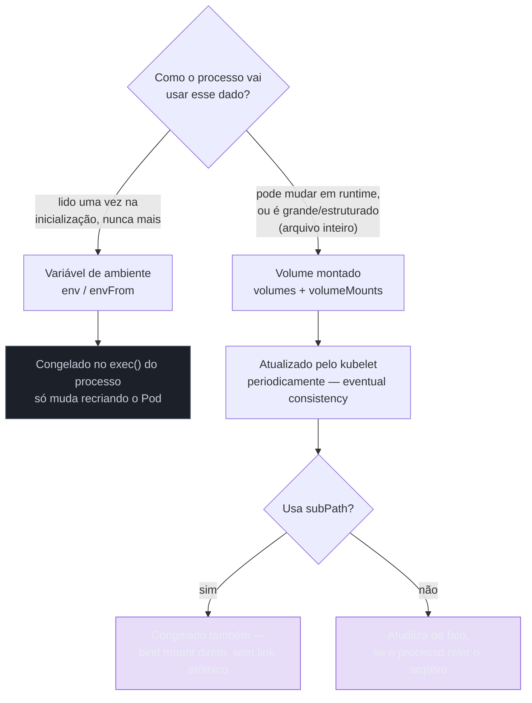
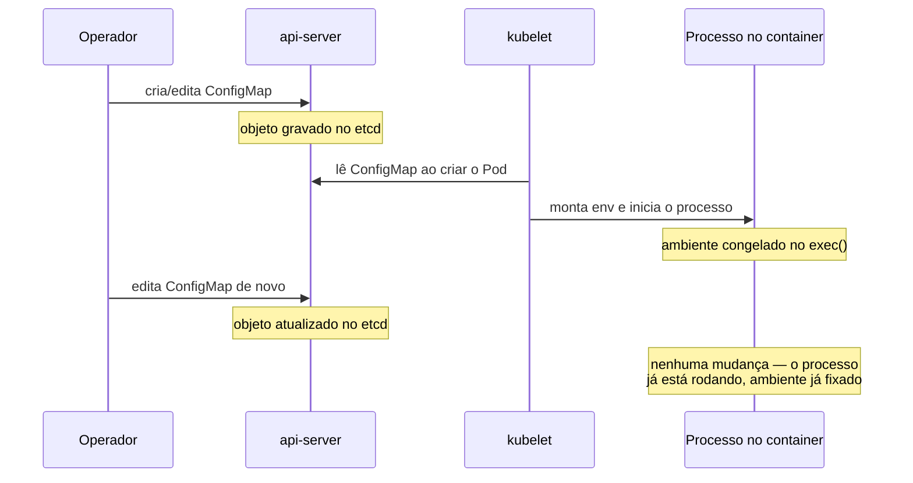

# ConfigMap e Secret

> [!abstract] TL;DR
> A mesma imagem precisa rodar em desenvolvimento, homologação e produção com endereço de banco, nível de log e credenciais diferentes — e assar isso na imagem quebraria a imutabilidade que o galho de Docker estabeleceu como propriedade fundamental do artefato. `ConfigMap` e `Secret` resolvem isso injetando dado externo no momento em que o Pod nasce, não no momento em que a imagem é construída. Os dois são objetos comuns da API, com `spec`, `status` e reconciliação como qualquer outro — mas o **consumo** deles por um Pod é onde o modelo declarativo mostra uma costura visível: uma variável de ambiente é lida **uma vez**, na criação do processo, e mudar o objeto depois não muda nada até o Pod ser recriado; um volume montado é atualizado pelo kubelet periodicamente, e o arquivo dentro do container muda sozinho — mas só se o processo que o lê também souber reler. `Secret` não cifra nada por padrão: é `base64`, uma codificação reversível por qualquer um que consiga ler o objeto, e a confidencialidade real vem de RBAC, de criptografia em repouso configurada à parte no api-server, ou de manter o segredo fora do cluster inteiramente. Entender essas duas costuras — a defasagem de atualização e a falsa sensação de segredo — é o que separa quem só copia um manifesto de quem sabe por que ele às vezes não funciona como esperado.

Imagine uma equipe que acabou de terminar o processo descrito na nota [[03-Dominios/Tecnologia/Infraestrutura/Docker/02 - A anatomia de uma imagem|A anatomia de uma imagem]]: a imagem `minha-api:1.2.3` está pronta, suas camadas são imutáveis, o hash do manifesto não muda entre um pull e outro. Essa mesma imagem, sem nenhuma alteração de bytes, precisa rodar contra um banco de desenvolvimento local, um banco de homologação compartilhado, e um cluster de produção com réplicas geograficamente distribuídas — cada ambiente com um host de banco diferente, um nível de log diferente, e credenciais que, por razão óbvia, não podem ser as mesmas em todos os três lugares. A tentação mais simples — gravar `DATABASE_URL=postgres://prod-db.exemplo.com/app` dentro da imagem, num arquivo de configuração ou como valor padrão de uma variável de ambiente do `Dockerfile` — resolveria o problema imediato ao custo de destruir a propriedade que fazia a imagem valer a pena em primeiro lugar: a mesma imagem, testada uma vez, deveria ser exatamente o artefato que roda em todo lugar, sem recompilação, sem `docker build` por ambiente. Assim que a configuração de produção fica embutida na imagem, ou a equipe recompila uma imagem por ambiente (perdendo a garantia de que o que foi testado é bit a bit o que roda em produção), ou vaza segredo de produção para qualquer pessoa com acesso à imagem de desenvolvimento — porque a imagem, uma vez publicada num registry, carrega os mesmos bytes para quem quer que a baixe.

A saída é desacoplar a configuração da imagem, movendo-a para fora do artefato e para dentro do momento em que o Pod é criado — exatamente o ponto de costura que a nota [[03-Dominios/Tecnologia/Infraestrutura/Kubernetes/02 - O loop de reconciliação|02 — O loop de reconciliação]] descreveu como a fronteira entre `spec` gravada no etcd e processo de fato rodando num node. `ConfigMap` e `Secret` são os dois objetos que o Kubernetes oferece para isso: o primeiro para dado não sensível (URL de banco, nível de log, um arquivo de propriedades inteiro), o segundo para dado sensível (senha, token de API, certificado privado) — mas os dois compartilham a mesma mecânica de fundo, e essa mecânica é onde esta nota concentra a atenção. Não é só "como declarar um mapa de chave-valor" — isso é a parte fácil, coberta em poucos parágrafos. É "o que de fato acontece quando esse mapa muda, enquanto Pods que já o consumiram continuam rodando" — e é aí que a maior parte da confusão de quem chega novo ao Kubernetes se instala.

## ConfigMap: um mapa sem esquema nenhum

Um `ConfigMap` é, na sua forma mais crua, um objeto da API que carrega um mapa de chave-valor — sem tipo, sem validação de conteúdo, sem esquema de nenhuma espécie imposto pelo cluster. O api-server aceita qualquer string como chave e qualquer string (ou bloco de texto multilinha) como valor; ele nunca verifica se `DATABASE_URL` de fato parece uma URL, se `LOG_LEVEL` é um dos valores que a aplicação reconhece, ou se um arquivo `application.properties` embutido tem sintaxe válida para o formato que ele finge representar. Essa ausência de validação não é uma lacuna a ser preenchida algum dia — é uma escolha deliberada de design: o Kubernetes não tem, e não deveria ter, nenhuma opinião sobre o formato interno da configuração de uma aplicação arbitrária. Quem valida o conteúdo é a própria aplicação, ao ler o valor — e um `ConfigMap` com sintaxe quebrada só revela o problema quando o processo que o consome tenta interpretá-lo, não no momento em que o objeto é criado.

Existem três formas comuns de criar um `ConfigMap`, e vale nomear as três porque cada uma serve a um cenário diferente. A primeira é literal, direto na linha de comando, útil para experimentos rápidos ou scripts de bootstrap:

```bash
kubectl create configmap app-config \
  --from-literal=LOG_LEVEL=info \
  --from-literal=DATABASE_URL=postgres://db.default.svc.cluster.local:5432/app
```

A segunda lê o conteúdo de um arquivo existente, usando o nome do arquivo como chave e seu conteúdo inteiro como valor — o caminho natural para um arquivo de propriedades, um `nginx.conf`, ou qualquer configuração que já existe como arquivo fora do Kubernetes:

```bash
kubectl create configmap app-properties \
  --from-file=application.properties
```

A terceira, e a que domina qualquer pipeline versionado a sério, é o manifesto declarativo — a mesma disciplina de "a `spec` mora num arquivo Git, não só na memória de quem rodou um comando uma vez" que a nota [[03-Dominios/Tecnologia/Infraestrutura/Kubernetes/07 - kubectl é um cliente de API|07 — kubectl é um cliente de API]] já defendeu contra comandos imperativos:

```yaml
apiVersion: v1
kind: ConfigMap
metadata:
    name: app-config
data:
    LOG_LEVEL: "info"
    DATABASE_URL: "postgres://db.default.svc.cluster.local:5432/app"
    application.properties: |
        server.port=8080
        spring.jpa.show-sql=true
        management.endpoints.web.exposure.include=health,metrics
```

Repare na diferença entre os pares chave-valor simples (`LOG_LEVEL`, `DATABASE_URL`) e a entrada `application.properties`, que carrega um bloco de texto inteiro como valor de uma única chave — o `data` de um `ConfigMap` não distingue "uma variável" de "um arquivo de configuração inteiro"; os dois são só strings associadas a uma chave, e é a forma de consumo, discutida na próxima seção, que decide se essa chave vira uma variável de ambiente isolada ou um arquivo dentro de um diretório montado. Existe também um bloco irmão, `binaryData`, para conteúdo que não é texto UTF-8 válido (um certificado em formato binário, por exemplo) — codificado em base64 dentro do próprio objeto, mas sem nenhuma pretensão de sigilo: é só um jeito de representar bytes arbitrários dentro de um formato que é, em si, texto (YAML/JSON), exatamente a mesma técnica que o `Secret` usa, e pelo mesmo motivo técnico, não por segurança — ponto que a seção sobre `Secret` desenvolve adiante.

Vale nomear, ainda antes de sair da criação do objeto, uma ferramenta que reaparece em qualquer pipeline maduro de manifestos: o `configMapGenerator` do Kustomize (e o equivalente que Helm oferece através de funções de template) gera automaticamente um `ConfigMap` a partir de um arquivo fonte, mas anexa ao nome do objeto um sufixo derivado de um hash do conteúdo — `app-config-8fgh72dk` em vez de só `app-config`. Isso não é capricho de nomenclatura: é a mesma lógica de "recriar sob nome novo em vez de editar in-place" que a seção sobre Secrets imutáveis, mais adiante nesta nota, desenvolve com profundidade — mudar o conteúdo do arquivo fonte muda o hash, muda o nome do `ConfigMap` gerado, e qualquer Deployment que referencia esse nome (o próprio Kustomize atualiza a referência automaticamente) passa a apontar para um objeto novo, disparando reconciliação sem precisar de nenhuma annotation de checksum calculada à parte.

Vale marcar, antes de seguir, uma distinção que separa `ConfigMap`/`Secret` do objeto que a nota [[03-Dominios/Tecnologia/Infraestrutura/Docker/06 - Dados que sobrevivem ao container|Dados que sobrevivem ao container]] já discutiu no galho de Docker: um volume Docker existe para dado que a aplicação **escreve** e que precisa sobreviver à substituição do container — um banco de dados, um diretório de uploads. Um `ConfigMap` ou `Secret` é o oposto: dado que a aplicação só **lê**, nunca escreve de volta, e cuja fonte da verdade nunca é o container — é sempre o objeto na API, gravado no etcd, exatamente como qualquer outra `spec` descrita na nota sobre o loop de reconciliação. O Pod nunca "possui" esse dado; ele só o projeta, temporariamente, para dentro do seu próprio ambiente ou sistema de arquivos, enquanto existir.

## As duas portas de entrada, e a diferença que importa mais

Um Pod consome um `ConfigMap` (ou um `Secret`) de duas formas fundamentalmente diferentes, e a escolha entre elas não é estética — ela decide se uma mudança futura no objeto chega, ou não, ao processo já em execução.



### Como variável de ambiente: lida uma vez, na criação do processo

A forma mais direta é injetar chaves do `ConfigMap` como variáveis de ambiente do container, via `envFrom` (para importar todas as chaves de uma vez, cada uma virando uma variável com o mesmo nome) ou via `env` com `valueFrom.configMapKeyRef` (para escolher uma chave específica e, opcionalmente, renomeá-la):

```yaml
env:
    - name: NIVEL_DE_LOG
      valueFrom:
          configMapKeyRef:
              name: app-config
              key: LOG_LEVEL
envFrom:
    - configMapRef:
          name: app-config
```

O mecanismo por trás disso é simples e vale nomear com precisão: o kubelet lê o `ConfigMap` referenciado **no momento em que monta o ambiente do processo do container**, antes de invocar o comando de entrada — exatamente como qualquer shell monta o ambiente de um processo novo, lendo variáveis uma única vez, no instante do `exec`. Depois desse instante, o processo já está de pé, com seu ambiente já congelado pelo kernel; não existe, em nenhum sistema operacional Unix convencional, um mecanismo que reinjete uma variável de ambiente num processo já em execução. Isso significa que **mudar o `ConfigMap` depois que o Pod já subiu não muda absolutamente nada** para um container que o consome via variável de ambiente — o valor antigo continua lá, na memória do processo, até que aquele Pod específico morra e seja substituído por outro, com um ambiente montado de novo, a partir do valor atual do `ConfigMap` naquele instante.



Esse comportamento não é um bug nem uma limitação a ser contornada com um patch futuro — é a mesma restrição fundamental que qualquer variável de ambiente de qualquer processo Unix sempre teve, e o Kubernetes não tenta escondê-la nem simulá-la. Quem espera que editar um `ConfigMap` consumido via `env` propague a mudança para um Pod já rodando está aplicando a um mecanismo síncrono e pontual — a criação de um processo — a expectativa de um mecanismo contínuo e reativo, que é exatamente o oposto do que uma variável de ambiente é.

### Como volume montado: atualizado pelo kubelet, mas sob a responsabilidade de quem lê

A segunda forma monta as chaves do `ConfigMap` como arquivos dentro de um diretório do container, cada chave virando um arquivo com o nome da chave e o valor como conteúdo:

```yaml
volumeMounts:
    - name: config
      mountPath: /etc/config
volumes:
    - name: config
      configMap:
          name: app-config
```

Depois desse mount, `/etc/config/LOG_LEVEL` existe como um arquivo cujo conteúdo inteiro é `info`, e `/etc/config/application.properties` existe como um arquivo com as três linhas de propriedades declaradas no `ConfigMap`. A diferença crucial em relação à variável de ambiente é que este mecanismo **não é pontual** — o kubelet, a cada rodada da sua sincronização periódica de volumes (o mesmo tipo de laço observar-e-agir descrito na nota sobre o loop de reconciliação, só que rodando localmente no node, não no control plane), verifica se o `ConfigMap` montado ainda corresponde ao que está gravado no etcd e, se não corresponder, atualiza o conteúdo do volume — sem reiniciar o container, sem matar o processo, sem qualquer sinalização explícita ao processo em execução.

A documentação oficial do Kubernetes descreve a latência dessa propagação com uma fórmula explícita: o atraso total, do momento em que o `ConfigMap` é atualizado até o momento em que as chaves projetadas mudam dentro do Pod, pode chegar a `kubelet sync period + cache propagation delay` — o período de sincronização do kubelet somado ao atraso do mecanismo de cache que o kubelet usa para não bater no api-server a cada verificação. Esse cache é configurável, via o campo `configMapAndSecretChangeDetectionStrategy` da configuração do kubelet, entre três estratégias: `Watch` (o padrão, onde o atraso de propagação equivale ao atraso do próprio mecanismo de watch contra o api-server), baseada em TTL (onde o atraso equivale ao tempo de vida configurado do cache), ou requisições diretas ao api-server a cada verificação (sem atraso de cache, ao custo de mais carga sobre o api-server). Em nenhum desses três modos a atualização é instantânea — é sempre "eventualmente consistente", na formulação exata que a documentação usa, e depender de que a mudança chegue em milissegundos é assumir uma garantia que o mecanismo nunca ofereceu.

> [!info] Baseline de versão
> A documentação oficial (`kubernetes.io/docs/concepts/configuration/configmap/`) confirma esse comportamento com a formulação: "the total delay from the moment when the ConfigMap is updated to the moment when new keys are projected to the Pod can be as long as the kubelet sync period + cache propagation delay". O comportamento é estável há várias versões e continua válido em clusters correntes (2026, linha 1.3x). O mecanismo interno de troca atômica do conteúdo do diretório montado — tipicamente observável, ao inspecionar o volume diretamente, como um diretório com nome iniciado por `..` e um link simbólico `..data` apontando para ele, trocado de uma vez por outra versão a cada atualização — é um detalhe de implementação do kubelet, não algo detalhado a fundo na documentação conceitual; a garantia formal que a documentação de fato assume é só a de eventual consistência dentro do prazo descrito acima, não a mecânica exata de troca de arquivo por baixo.

Mesmo sem a documentação conceitual detalhar byte a byte a troca de arquivo, o comportamento observável ao vivo é consistente com uma troca atômica: nunca se vê, inspecionando o diretório montado no meio de uma atualização, um arquivo pela metade ou um conjunto de chaves parcialmente novo e parcialmente antigo — a troca acontece como uma unidade só, de uma versão completa do conjunto de arquivos para a próxima. Isso importa porque resolve, por construção, o risco óbvio de uma leitura corrompida: um processo que reabre o arquivo no meio da propagação nunca encontra um estado intermediário inconsistente, só a versão antiga completa ou a versão nova completa, nunca uma mistura das duas.

E aqui está a parte que a variável de ambiente nunca ofereceu, mas que o volume montado só entrega **parcialmente**: o arquivo no disco muda sozinho, mas o processo dentro do container só percebe a mudança se ele mesmo, ativamente, reabrir e reler aquele arquivo. Um processo que leu `/etc/config/LOG_LEVEL` uma única vez, na inicialização, e guardou o valor numa variável em memória, está exatamente na mesma situação que o processo que consumiu a chave via variável de ambiente — o arquivo no disco pode ter mudado dez vezes, e o processo continua operando com o valor lido no primeiro instante, porque nada o forçou a olhar de novo. O volume montado resolve a metade "o dado disponível mudou"; a outra metade, "o processo percebeu e reagiu", continua sendo responsabilidade exclusiva de quem escreveu o código da aplicação — seja através de um watcher de arquivo explícito (`inotify` no Linux, ou uma biblioteca de configuração que o abstrai), seja através de uma releitura periódica agendada por temporizador.

### Vendo a defasagem com as próprias mãos

A melhor forma de internalizar essa diferença é reproduzi-la, em vez de tomar como fé. Suponha um Pod com dois containers do mesmo `ConfigMap`: um consumindo via `env`, outro via volume montado, os dois vivos ao mesmo tempo:

```bash
kubectl create configmap demo-defasagem --from-literal=VALOR=inicial

kubectl run demo-env --image=busybox:1.36 --restart=Never \
  --overrides='{"spec":{"containers":[{"name":"demo-env","image":"busybox:1.36","command":["sleep","3600"],"envFrom":[{"configMapRef":{"name":"demo-defasagem"}}]}]}}'

kubectl run demo-vol --image=busybox:1.36 --restart=Never \
  --overrides='{"spec":{"containers":[{"name":"demo-vol","image":"busybox:1.36","command":["sleep","3600"],"volumeMounts":[{"name":"cfg","mountPath":"/cfg"}]}],"volumes":[{"name":"cfg","configMap":{"name":"demo-defasagem"}}]}}'
```

Confirme os dois valores iniciais — o da variável de ambiente e o do arquivo montado devem coincidir, ambos `inicial`:

```bash
kubectl exec demo-env -- printenv VALOR
kubectl exec demo-vol -- cat /cfg/VALOR
```

Agora mude o `ConfigMap` e espere alguns segundos — o tempo aproximado de uma rodada de sincronização do kubelet, tipicamente na casa de dezenas de segundos, não instantâneo:

```bash
kubectl patch configmap demo-defasagem --type=merge -p '{"data":{"VALOR":"atualizado"}}'
sleep 90
kubectl exec demo-env -- printenv VALOR
kubectl exec demo-vol -- cat /cfg/VALOR
```

O segundo par de comandos deixa a assimetria exposta: `demo-env` continua imprimindo `inicial` — o valor congelado no `exec()` do processo, no instante em que o Pod nasceu — enquanto `demo-vol` já imprime `atualizado`, porque o kubelet trocou o conteúdo do arquivo por trás, sem que ninguém precisasse reiniciar nada. Nenhum dos dois Pods percebeu um "evento" de mudança — o de `env` simplesmente nunca teve chance de perceber nada, e o de `cat` só mostrou o valor novo porque o próprio comando reabriu o arquivo do zero a cada chamada; um processo de longa duração dentro de `demo-vol` que tivesse lido `/cfg/VALOR` uma única vez, na inicialização, estaria tão desatualizado quanto `demo-env`.

> [!warning] `subPath` mata a atualização
> Montar uma chave específica de um `ConfigMap` usando `subPath` — uma técnica comum para injetar um único arquivo de configuração dentro de um diretório que já tem outro conteúdo, sem sobrescrever o diretório inteiro — desliga completamente o mecanismo de atualização automática. A documentação oficial é direta sobre isso: "A container using a ConfigMap as a subPath volume mount will not receive updates when the ConfigMap changes." A razão é mecânica: `subPath` faz o kubelet montar (via bind mount) um arquivo específico do volume interno diretamente no caminho de destino, em vez de manter o link simbólico indireto que sustenta a troca atômica do conjunto inteiro de arquivos — e sem esse link intermediário, não existe o que trocar quando o `ConfigMap` muda. Quem monta uma chave via `subPath` está, na prática, optando por uma cópia estática, congelada no instante da criação do Pod, mesmo que o resto do desenho pareça idêntico a um mount sem `subPath`.

> [!tip] Vídeo — a montagem como volume, vista de dentro do container
> [**Kubernetes Secrets in 5 Minutes!**](https://www.youtube.com/watch?v=cQAEK9PBY8U) (DevOps Directive, ~6 min, EN) é curto e deliberadamente estreito, mas cobre bem a peça que a seção acima descreve em texto: as duas formas de criar um Secret — a partir de arquivo e a partir de literal, com a observação prática de que a segunda evita deixar o segredo em disco na sua máquina — e, principalmente, a montagem como volume vista de dentro do container. O detalhe que ele demonstra e que quase todo mundo erra na primeira vez é o par de nomes: o `name` no `volumeMounts` precisa casar com o `name` declarado em `volumes`, e o `mountPath` é onde aquilo aparece no sistema de arquivos — com **cada chave do Secret virando um arquivo** naquele diretório. **O que ele não cobre — praticamente todo o resto desta nota:** ConfigMap, a distinção entre variável de ambiente e volume quanto à atualização sem reinício, o hash na annotation para forçar reconciliação, a mentira do base64 e o que de fato protege um Secret, `imagePullSecrets` e Secrets imutáveis. É uma porta de entrada de cinco minutos, não um tratamento.

## Forçando a reconciliação de verdade: o hash na annotation

Diante das duas limitações — variável de ambiente nunca atualiza, e volume montado só atualiza o arquivo, não o processo — existem só dois caminhos honestos para propagar uma mudança de configuração até a aplicação de fato usá-la. O primeiro é o processo observar o arquivo ativamente, como já descrito. O segundo, mais comum na prática e mais fácil de garantir de forma genérica, sem depender de cada aplicação implementar seu próprio watcher, é forçar a recriação do Pod inteiro — deixando o mecanismo já conhecido de rolling update, descrito na nota [[03-Dominios/Tecnologia/Infraestrutura/Kubernetes/04 - Deployment e ReplicaSet|04 — Deployment e ReplicaSet]], fazer o trabalho de substituir Pods antigos por Pods novos, cada um começando do zero com a configuração atual, seja ela lida via `env` ou via volume.

O truque canônico para isso — amplamente documentado e usado em produção — é incluir um hash do conteúdo do `ConfigMap` (ou do `Secret`) como uma annotation dentro do **template de Pod** do Deployment, não no Deployment em si. A `spec.template` de um Deployment é, ela mesma, comparada campo a campo pelo ReplicaSet controller a cada reconciliação — a nota [[03-Dominios/Tecnologia/Infraestrutura/Kubernetes/02 - O loop de reconciliação|02 — O loop de reconciliação]] já estabeleceu que mudar qualquer coisa dentro desse template dispara uma nova revisão do Deployment. Mudar uma annotation dentro do template não altera nenhum comportamento funcional do Pod diretamente — mas altera o template, e é exatamente essa mudança que o controller enxerga como "a spec desejada é diferente da anterior", disparando um rollout gradual como qualquer outra mudança de imagem dispararia:

```yaml
apiVersion: apps/v1
kind: Deployment
metadata:
    name: minha-api
spec:
    replicas: 3
    selector:
        matchLabels:
            app: minha-api
    template:
        metadata:
            labels:
                app: minha-api
            annotations:
                # SHA256 do conteúdo do ConfigMap, calculado no momento em que
                # o manifesto é gerado (por um script, por Helm, por Kustomize).
                # Mudar uma linha do ConfigMap muda este hash, muda o template,
                # e dispara um rollout novo — mesmo sem nenhuma imagem nova.
                checksum/config: "a3f9e21c8b7d4f0e91a2c5d8e6f3b7a1c9d0e2f4"
        spec:
            containers:
                - name: api
                  image: minha-api:1.2.3
                  envFrom:
                      - configMapRef:
                            name: app-config
                  volumeMounts:
                      - name: config
                        mountPath: /etc/config
            volumes:
                - name: config
                  configMap:
                      name: app-config
```

Esse hash não precisa de nenhum controller especial nem de nenhuma extensão do Kubernetes — é só um valor de string, calculado fora do cluster (tipicamente por Helm, através da função `sha256sum` sobre o conteúdo renderizado do `ConfigMap`, ou por um script de pipeline equivalente) e injetado no template antes do `apply`. O Kubernetes nunca sabe, nem precisa saber, que aquele valor representa um hash de configuração — ele só vê que o template mudou, e reage exatamente como reagiria a qualquer outra mudança de template: criando Pods novos, com o `ConfigMap` atual já refletido tanto no ambiente quanto nos arquivos montados, e removendo os antigos gradualmente conforme a estratégia de rolling update configurada. É o truque mais útil desta nota inteira, porque resolve, de uma vez, tanto a limitação da variável de ambiente (que nunca atualiza sozinha) quanto a limitação do volume montado sem watcher (onde o arquivo muda mas o processo não percebe) — trocando as duas por uma única garantia mais simples de raciocinar: toda mudança de configuração relevante vira um Pod novo, com processo novo, lendo a configuração do zero.

## Secret: a mentira do base64 e o que de fato protege

Um `Secret` é, estruturalmente, o mesmo tipo de objeto que um `ConfigMap` — um mapa de chave-valor, consumível pelas mesmas duas formas (variável de ambiente ou volume montado), sujeito exatamente à mesma defasagem de atualização descrita nas seções anteriores. A diferença declarada é semântica: um `Secret` sinaliza "este dado é sensível", e por isso o Kubernetes trata seu conteúdo de forma ligeiramente diferente em alguns pontos específicos — não é exibido por padrão em `kubectl describe` (a saída mostra `<redacted>` ou o tamanho em bytes, não o valor), e o campo `data` é codificado em base64 dentro do YAML/JSON do objeto, em vez de texto plano como o `data` de um `ConfigMap`.

É exatamente esse último ponto — a codificação base64 — que produz a confusão mais comum e mais perigosa sobre `Secret`: **base64 não é criptografia**. É uma codificação reversível, sem chave nenhuma envolvida, cujo único propósito é representar bytes arbitrários (incluindo dados binários) dentro de um formato de texto como YAML ou JSON. Decodificar um valor de `Secret` não exige quebrar nada — exige rodar `base64 -d`, um comando disponível em qualquer sistema Unix, sem senha, sem chave privada, sem esforço computacional relevante:

```bash
kubectl get secret db-credentials -o jsonpath='{.data.password}' | base64 -d
```

A documentação oficial do Kubernetes é direta sobre essa limitação, na própria página de conceitos de `Secret`: "Kubernetes Secrets are, by default, stored unencrypted in the API server's underlying data store (etcd). Anyone with API access can retrieve or modify a Secret, and so can anyone with access to etcd." Quem trata um `Secret` como automaticamente seguro só porque o Kubernetes "tem um objeto especial para segredos" está confundindo uma convenção de nomenclatura e um pequeno conjunto de proteções operacionais com criptografia — que o `Secret`, sozinho, nunca ofereceu.

O que de fato protege um `Secret`, então, não é o objeto em si, mas três camadas que precisam ser deliberadamente construídas em torno dele:

A primeira, e a mais imediata, é **RBAC** — restringir, por identidade, quem tem permissão de ler objetos `Secret` num namespace ou cluster. Um `Secret` não lido por ninguém sem autorização explícita é, na prática, tão protegido quanto o mecanismo de autorização por trás dele permitir; um cluster com RBAC frouxo, onde qualquer ServiceAccount pode listar `Secrets` de qualquer namespace, não ganha proteção nenhuma do fato de o valor estar em base64. A mecânica completa de papéis, bindings e como restringir esse acesso especificamente pertence à nota sobre RBAC e ServiceAccount, mais adiante neste galho.

A segunda é **criptografia em repouso no etcd**, configurada explicitamente no api-server através de um recurso chamado `EncryptionConfiguration` — um arquivo passado via a flag `--encryption-provider-config` do `kube-apiserver`, que declara, para cada tipo de recurso listado (tipicamente `secrets`), uma lista ordenada de provedores de criptografia a aplicar antes de gravar no etcd. Vale a honestidade explícita aqui, porque é ponto de confusão comum: **essa criptografia não vem ligada por padrão** num cluster que você mesmo instala. A documentação oficial confirma: "By default, the API server stores plain-text representations of resources into etcd, with no at-rest encryption" — e "If you are running the kube-apiserver without the `--encryption-provider-config` command line argument, you do not have encryption at rest enabled." Provedores de nuvem gerenciados costumam habilitar essa criptografia por padrão como parte da oferta do serviço, mas um cluster levantado do zero — via `kubeadm`, via uma distribuição self-hosted — não tem essa proteção a menos que alguém a configure explicitamente. Vale outra ressalva honesta, ainda mais fácil de esquecer: ativar o `EncryptionConfiguration` num cluster que já tem `Secrets` gravados **não recriptografa retroativamente** o que já existe — só objetos criados ou atualizados depois da mudança passam pelo novo provedor de criptografia, o que exige, na prática, reescrever (mesmo que trivialmente, um `kubectl get`/`apply` sem mudança de conteúdo) cada `Secret` pré-existente para que ele de fato passe a ser armazenado de forma cifrada.

Vale nomear, ainda dentro dessa segunda camada, uma variação que clusters gerenciados costumam expor: em vez de uma chave estática dentro do próprio arquivo `EncryptionConfiguration` (o exemplo `aesgcm` com uma chave em base64 embutida no arquivo, mostrado na documentação oficial), o provedor de criptografia pode delegar a operação de cifra para um serviço externo de gestão de chaves — um provedor `kms`, que fala com um KMS gerenciado pela nuvem (AWS KMS, Google Cloud KMS, Azure Key Vault) através de um plugin. A vantagem prática é que a chave mestra nunca precisa existir, em texto plano, em nenhum arquivo do próprio cluster — ela mora inteiramente do lado do provedor de nuvem, e o api-server só pede, a cada operação, para cifrar ou decifrar um pedaço de dado, sem nunca enxergar a chave mestra em si. Detalhar a configuração completa de um provedor KMS foge do escopo desta nota — o ponto a reter é só que "criptografia em repouso" não é uma escolha binária entre "nada" e "uma chave simétrica local", existe um espectro de maturidade operacional entre as duas pontas.

A terceira é manter o segredo **fora do cluster inteiramente**, num cofre externo — HashiCorp Vault, AWS Secrets Manager, ou equivalente — injetando o valor em tempo de execução em vez de gravá-lo como objeto `Secret` do Kubernetes de forma permanente. Esse padrão desloca a superfície de ataque inteira para fora do etcd e do RBAC do cluster, ao custo de uma peça de infraestrutura adicional a operar; a gestão prática desse cofre — rotação de credenciais, quem tem acesso administrativo a ele, política de expiração — é assunto de produção, coberto com profundidade pela nota [[03-Dominios/Engenharia/Operação/2 - Entrega e release/06 - Secrets e configuração em produção|Secrets e configuração em produção]]. Esta nota fica só no mecanismo: como o objeto `Secret` funciona por dentro do Kubernetes, e quais das três camadas acima efetivamente entra em jogo quando ele é consumido diretamente, sem cofre externo.

### `stringData`: conveniência de escrita, não segurança adicional

Escrever um valor de `Secret` diretamente em base64 dentro de um manifesto YAML é incômodo o bastante para o Kubernetes oferecer um campo alternativo, `stringData`, que aceita texto plano no momento da escrita — o api-server codifica o valor em base64 sozinho, no instante em que grava o objeto, e mescla o resultado dentro do campo `data` de sempre:

```yaml
apiVersion: v1
kind: Secret
metadata:
    name: db-credentials
type: Opaque
stringData:
    username: "user"
    password: "password"
```

Vale a ressalva explícita: `stringData` é só um atalho de escrita, existe apenas na direção "cliente para api-server" — um `kubectl get secret -o yaml` nunca devolve `stringData` de volta, sempre devolve `data` já codificado. Nenhuma proteção adicional nasce desse campo; o valor que você escreveu em texto plano no arquivo YAML continua em texto plano no arquivo YAML, no seu editor, no seu histórico de shell, e potencialmente no seu repositório Git se alguém commitar esse manifesto sem pensar duas vezes — o mesmo risco que motiva a recomendação, em qualquer prática séria de GitOps, de nunca versionar um manifesto de `Secret` com valor real embutido, preferindo referências geradas em runtime por um cofre externo ou por uma ferramenta de selagem que cifra o conteúdo antes de chegar ao Git.

O `Secret` também tem um campo `type`, que a documentação usa para orientar validação leve e formato esperado do conteúdo — nunca para impor confidencialidade adicional, que continua vindo só das três camadas acima. Vale a clareza sobre o que esse campo de fato faz: para os tipos embutidos que exigem chaves específicas (`kubernetes.io/tls` exige `tls.crt` e `tls.key`, por exemplo), o api-server rejeita a criação de um objeto que declare aquele `type` sem as chaves obrigatórias presentes — uma validação estrutural leve, sobre nomes de chave, nunca sobre o conteúdo em si; o api-server nunca verifica se `tls.crt` de fato contém um certificado X.509 válido, só que a chave existe. Vale nomear os três tipos mais comuns: `Opaque`, o padrão, sem estrutura imposta nenhuma além do mapa de chave-valor genérico; `kubernetes.io/dockerconfigjson`, usado especificamente para credenciais de autenticação contra um registry de imagens privado, cujo formato espelha o arquivo `~/.docker/config.json` que a nota [[03-Dominios/Tecnologia/Infraestrutura/Docker/12 - Registry|Registry]] já descreveu como a forma que ferramentas de linha de comando guardam credenciais de login; e `kubernetes.io/tls`, para o par de chave privada e certificado que um objeto `Ingress` referencia via `secretName`, como a `tls.crt` e `tls.key` que sustentam um TLS termination na borda do cluster.

Vale fechar esta seção com uma pergunta que costuma surgir na primeira vez que alguém compara `ConfigMap` e `Secret` lado a lado: por que não existe um único objeto, com um campo booleano `sensitive: true/false`, em vez de dois `kind` distintos? A resposta é sobretudo operacional, não técnica — separar os dois em objetos distintos permite que ferramentas de RBAC, de auditoria e de varredura de segurança apliquem políticas diferentes por `kind` inteiro (por exemplo, "nenhuma ServiceAccount de CI pode listar `Secrets`, mas pode listar `ConfigMaps` livremente"), sem precisar inspecionar um campo interno de cada objeto individual para decidir a política. A separação por tipo de objeto, não por campo, é o que torna a regra de autorização simples de escrever e simples de auditar.

## `imagePullSecrets`: um caso concreto que amarra tudo

O tipo `kubernetes.io/dockerconfigjson` deixa de ser abstrato assim que aparece o cenário mais comum que o exige: uma imagem hospedada num registry privado, exatamente o tipo de registry que a nota [[03-Dominios/Tecnologia/Infraestrutura/Docker/12 - Registry|Registry]] descreveu como padrão em qualquer organização que não publica suas imagens publicamente. O `kubelet`, ao tentar puxar uma imagem para criar um container, precisa das mesmas credenciais que um `docker login` forneceria — e o Kubernetes injeta essas credenciais através de um `Secret` desse tipo específico, referenciado no Pod (ou no ServiceAccount que o Pod usa, o que evita repetir a referência em cada manifesto) via `imagePullSecrets`:

```bash
kubectl create secret docker-registry regcred \
  --docker-server=registry.exemplo.com \
  --docker-username=deploy-bot \
  --docker-password=um-token-de-longa-duracao \
  --docker-email=deploy@exemplo.com
```

```yaml
apiVersion: v1
kind: Pod
metadata:
    name: app-com-imagem-privada
spec:
    imagePullSecrets:
        - name: regcred
    containers:
        - name: app
          image: registry.exemplo.com/time-x/minha-api:1.2.3
```

Sem essa referência, o `kubelet` tenta puxar a imagem sem credencial nenhuma, e o resultado é exatamente o `ImagePullBackOff` que a nota sobre o loop de reconciliação já descreveu para o caso de uma tag inexistente — só que desta vez a causa não é uma tag errada, é autenticação faltando contra um registry que exige login. Vale reconhecer que esse é o mesmo tipo de `Secret`, consumido pelo mesmo mecanismo geral descrito nesta nota, só que lido por um consumidor diferente do de costume: não é o processo dentro do container que lê esse `Secret`, é o próprio `kubelet`, antes mesmo de o container existir — um lembrete de que "consumir um `Secret`" não se limita a variável de ambiente ou volume montado dentro do Pod; alguns objetos do control plane também leem `Secrets` diretamente, para propósitos próprios do cluster.

Repetir `imagePullSecrets` em todo manifesto de Pod de um namespace inteiro é o tipo de repetição que convida a esquecimento — e existe um atalho para evitar isso: anexar o mesmo `imagePullSecrets` diretamente ao `ServiceAccount` que os Pods daquele namespace usam (o `default`, se nenhum outro for especificado), em vez de a cada Deployment individual:

```bash
kubectl patch serviceaccount default \
  -p '{"imagePullSecrets": [{"name": "regcred"}]}'
```

A partir desse ponto, todo Pod criado naquele namespace sem `imagePullSecrets` próprio herda automaticamente a credencial associada à sua `ServiceAccount` — o mesmo princípio de "a identidade carrega a credencial, não cada manifesto individual" que a nota [[03-Dominios/Tecnologia/Infraestrutura/Kubernetes/13 - RBAC e ServiceAccount|RBAC e ServiceAccount]] desenvolve em profundidade para autorização em geral, não só para pull de imagem.

## Secrets imutáveis: proteção e desempenho ao mesmo tempo

Tanto `ConfigMap` quanto `Secret` aceitam um campo `immutable: true`, disponível desde a versão 1.19, que trava o objeto contra qualquer alteração posterior ao seu conteúdo depois de criado — qualquer tentativa de `PATCH` ou `apply` que mude o `data` de um objeto marcado como imutável é rejeitada pelo api-server. A motivação óbvia é proteger contra alteração acidental ou maliciosa de um valor crítico, mas existe uma segunda razão, menos intuitiva e documentada explicitamente: desempenho do cluster.

Todo `ConfigMap` ou `Secret` consumido via volume montado é, por padrão, observado continuamente pelo kubelet — seja via watch, seja via verificação periódica com cache, conforme a estratégia configurada, exatamente o mecanismo de propagação descrito nas seções anteriores desta nota. Um objeto marcado como imutável não precisa desse acompanhamento contínuo: como o api-server garante, por construção, que o conteúdo nunca vai mudar, o kubelet pode parar de observá-lo depois da leitura inicial, e o próprio api-server reduz a carga de manter watches ativos sobre um objeto que estruturalmente não pode gerar eventos de mudança. Em clusters com um número grande de `ConfigMaps` e `Secrets` — centenas ou milhares, comum em ambientes multi-tenant com muitos times — essa economia de watches ativos é mensurável na carga do api-server, não é só um detalhe cosmético:

```yaml
apiVersion: v1
kind: ConfigMap
metadata:
    name: app-config-v3
data:
    LOG_LEVEL: "info"
immutable: true
```

A consequência prática dessa escolha é que um `ConfigMap` imutável não pode ser editado — só recriado sob um nome novo (daí o sufixo `-v3` no exemplo acima, uma convenção comum). Isso empurra a prática de configuração para o mesmo padrão de imutabilidade que a imagem Docker já segue: em vez de editar `app-config` in-place, cria-se `app-config-v4`, atualiza-se a referência no template do Deployment para o nome novo, e o mesmo mecanismo de hash na annotation (ou, neste caso, a própria mudança de nome do `ConfigMap` referenciado) dispara o rollout — a imutabilidade do objeto de configuração e a estratégia de forçar recriação do Pod deixam de ser dois mecanismos separados e passam a reforçar um ao outro.

Vale amarrar essa economia de watches de volta ao vocabulário da nota sobre o loop de reconciliação: cada `ConfigMap` ou `Secret` mutável, consumido via volume por algum Pod, é, do ponto de vista do kubelet daquele node, mais um objeto sob observação contínua — um Informer local, um cache a manter sincronizado, um watch a sustentar aberto contra o api-server. Um objeto marcado `immutable: true` sai dessa lista de observação depois da primeira leitura, precisamente porque a garantia de que ele nunca muda torna qualquer observação subsequente redundante por definição — o mesmo tipo de raciocínio de "não fazer trabalho desnecessário quando já se sabe, de antemão, que não há diferença a fechar" que sustenta a idempotência dos controllers do control plane, só que aplicado aqui à camada de leitura, no lado do node, em vez de à camada de escrita, no control plane.

## Exemplo trabalhado completo

Vale fechar o corpo técnico da nota com um cenário único, reunindo cada peça discutida separadamente: um Deployment que consome um `ConfigMap` por volume (arquivo de propriedades da aplicação) e um `Secret` por variável de ambiente (a senha do banco), com o hash de configuração já embutido na annotation do template.

```yaml
apiVersion: v1
kind: ConfigMap
metadata:
    name: minha-api-config
data:
    application.properties: |
        server.port=8080
        spring.jpa.show-sql=false
        logging.level.root=INFO
---
apiVersion: v1
kind: Secret
metadata:
    name: minha-api-db-secret
type: Opaque
data:
    # base64 de "supersecreta123" — só para o exemplo; em produção este valor
    # nunca deveria ser criado por kubectl create -f, e sim por --from-literal
    # numa sessão que não fica gravada em Git, ou por um cofre externo.
    DB_PASSWORD: c3VwZXJzZWNyZXRhMTIz
---
apiVersion: apps/v1
kind: Deployment
metadata:
    name: minha-api
spec:
    replicas: 3
    selector:
        matchLabels:
            app: minha-api
    template:
        metadata:
            labels:
                app: minha-api
            annotations:
                # Recalculado a cada geração do manifesto (Helm, Kustomize ou
                # script equivalente) a partir do conteúdo real do ConfigMap.
                checksum/config: "7c1f3a9e6b2d4c8f0a5e9d1b3c7f2a6e8d0b4c9f"
            spec:
                containers:
                    - name: api
                      image: minha-api:1.2.3
                      ports:
                          - containerPort: 8080
                      env:
                          - name: DB_PASSWORD
                            valueFrom:
                                secretKeyRef:
                                    name: minha-api-db-secret
                                    key: DB_PASSWORD
                      volumeMounts:
                          - name: config
                            mountPath: /etc/minha-api
                volumes:
                    - name: config
                      configMap:
                          name: minha-api-config
```

Duas mudanças distintas, aplicadas contra esse manifesto, mostram o comportamento completo desta nota em ação. A primeira: editar `application.properties` dentro do `ConfigMap`, sem tocar em mais nada. O kubelet, na sua próxima sincronização periódica, atualiza o arquivo `/etc/minha-api/application.properties` dentro do container em execução — mas, como discutido, o processo Java (ou o que for) que já leu esse arquivo na inicialização e guardou os valores em memória continua rodando com a configuração antiga, indefinidamente, até ser reiniciado por qualquer outro motivo. Se ninguém atualizar o `checksum/config` da annotation para refletir esse novo conteúdo, os três Pods do Deployment continuam servindo tráfego com a configuração antiga, mesmo que `kubectl get configmap minha-api-config -o yaml` já mostre o valor novo — um exemplo direto da defasagem que esta nota inteira existe para explicar.

A segunda: girar a senha do banco, criando um `minha-api-db-secret` com um `DB_PASSWORD` novo e atualizando o Deployment (com um novo `checksum/config` refletindo também o conteúdo do `Secret`, não só do `ConfigMap`, se a convenção de hash cobrir os dois objetos). Como `DB_PASSWORD` é consumido via `env`, a única forma de qualquer Pod passar a usar a senha nova é ele ser recriado — não existe cenário onde um Pod já rodando, com a senha antiga já lida no `exec()` do seu processo, passa a autenticar com a senha nova sem reiniciar. A mudança de `checksum/config` no template, disparando um rollout gradual do Deployment, é exatamente o que fecha esse ciclo: Pods antigos, com a senha velha na memória, são substituídos um a um por Pods novos, cada um lendo o `Secret` atualizado no momento da própria criação — o mesmo padrão observar-comparar-agir de sempre, só que a "diferença" que o loop está fechando, desta vez, não é uma contagem de réplicas, é uma versão de configuração desatualizada dentro de um Pod que, tecnicamente, continua saudável do ponto de vista de qualquer probe.

## Armadilhas comuns

> [!warning] Assumir que editar um `ConfigMap` ou `Secret` propaga instantaneamente para toda variável de ambiente já injetada
> Variável de ambiente é lida uma única vez, no `exec()` do processo do container — não existe, em nenhum sistema Unix convencional, mecanismo para reinjetar uma variável num processo já em execução. Um `Secret` girado (senha nova) que alimenta uma variável de ambiente continua invisível para qualquer Pod já rodando até que esse Pod seja recriado; a defesa é sempre forçar essa recriação de forma explícita — via hash na annotation do template, via `kubectl rollout restart`, ou via qualquer outro gatilho que produza um Pod novo — nunca assumir que o `apply` do objeto de configuração, sozinho, já resolveu o problema.

> [!warning] Montar um ConfigMap com `subPath` e esperar atualização automática
> `subPath` monta um arquivo específico via bind mount direto, sem o link intermediário que sustenta a troca atômica do conjunto de arquivos — e sem esse link, a atualização automática simplesmente não acontece, mesmo que o restante do manifesto pareça idêntico a um mount sem `subPath`. A documentação oficial confirma essa limitação de forma explícita. Quem precisa injetar um único arquivo dentro de um diretório com outro conteúdo, e ainda assim quer atualização automática, precisa de uma estratégia diferente — como montar o `ConfigMap` inteiro num diretório separado e usar um `initContainer` ou script de entrada para copiar o arquivo específico, aceitando que essa cópia herda a mesma limitação de "lida uma vez" que a variável de ambiente tem.

> [!warning] Tratar base64 como proteção suficiente para um Secret
> Base64 é codificação, não criptografia — qualquer pessoa com acesso de leitura ao objeto (via `kubectl get secret -o yaml`, via acesso direto ao etcd, ou via um backup do etcd mal protegido) decodifica o valor com um comando trivial, sem senha nem chave nenhuma envolvida. A proteção real vem de RBAC restringindo quem lê o objeto, de criptografia em repouso configurada explicitamente via `EncryptionConfiguration` no api-server (que não vem ligada por padrão num cluster self-managed), ou de manter o segredo fora do cluster inteiramente, num cofre externo. Tratar o `Secret` como "já protegido só por ser um Secret" é a origem mais comum de vazamento de credencial em cluster mal configurado.

> [!warning] Ativar `EncryptionConfiguration` e assumir que os Secrets antigos já estão cifrados
> Ligar a criptografia em repouso protege daquele momento em diante — objetos já gravados no etcd antes da mudança continuam em texto plano até serem reescritos. É preciso, depois de ativar o `EncryptionConfiguration`, reescrever explicitamente cada `Secret` pré-existente (mesmo que seja só um `get` seguido de `apply` sem mudança de conteúdo) para que ele de fato passe pelo novo provedor de criptografia. Assumir cobertura retroativa automática deixa exatamente os segredos mais antigos — muitas vezes os mais críticos, porque estão em produção há mais tempo — sem a proteção que acabou de ser configurada.

> [!warning] Assumir que um Pod que referencia um `ConfigMap` ou `Secret` inexistente falha na hora
> Um Pod cujo `envFrom` ou `volumes` aponta para um `ConfigMap` ou `Secret` que não existe (nome errado, namespace errado, objeto ainda não criado por uma corrida entre pipelines) não é rejeitado pelo api-server no momento do `apply` — a validação de existência do objeto referenciado não acontece na validação estrutural da `spec`, só quando o kubelet, no node, tenta de fato montar o volume ou resolver a variável. O sintoma é um Pod preso em `ContainerCreating` indefinidamente, sem nenhuma mensagem de erro visível em `kubectl get pods`; o diagnóstico correto é sempre `kubectl describe pod`, que revela, na seção de eventos, algo como `Warning FailedMount ... configmap "app-config" not found` — o mesmo hábito de "ir procurar em `status` e `events`, nunca confiar só no retorno do `apply`" que a nota sobre o loop de reconciliação já estabeleceu para qualquer erro assíncrono deste tipo.

## Como explicar em inglês

| Português | Inglês | Nuance de uso |
|---|---|---|
| Variável de ambiente lida uma vez | Read once at process startup | Formulação padrão para explicar por que editar a fonte não propaga; contrasta direto com "eventually updated" do volume montado. |
| Volume montado, eventualmente consistente | Eventually consistent, mounted as a volume | "Eventually consistent" é o termo técnico exato que a documentação usa para descrever a defasagem do volume montado — não dizer "instant" nem "real-time". |
| Codificação, não criptografia | Encoding, not encryption | A formulação mais direta para desarmar a confusão sobre base64; útil dita em voz alta numa entrevista técnica sobre segurança de Kubernetes. |
| Criptografia em repouso | Encryption at rest | Sempre qualificado como algo que precisa ser "configured explicitly" ou "enabled" — nunca tratado como comportamento padrão. |
| Gerenciador de campo de segredo (RBAC) | Least-privilege access to Secrets | Formulação usada em conjunto com RBAC — "restrict who can read Secret objects" é a frase que amarra o conceito ao mecanismo de autorização. |
| Segredo imutável | Immutable Secret | Termo técnico fixo; sempre mencionado junto do benefício duplo — "protects against accidental edits and reduces API server load." |
| Segredo fora do cluster | Externally managed secret | Usado para descrever o padrão de cofre externo — Vault, AWS Secrets Manager — em contraste com "cluster-native Secret object." |

Vale fechar com um limite concreto que reforça, de forma prática, por que esses dois objetos nunca deveriam ser tratados como armazenamento de propósito geral: todo objeto do Kubernetes, `ConfigMap` e `Secret` inclusive, é gravado inteiro como um único valor no `etcd`, e a documentação oficial crava o teto: os dados de um `ConfigMap` **não podem exceder 1 MiB**. O motivo de fundo é o próprio `etcd`, cujo tamanho máximo de requisição limita o quanto cabe num único objeto. Um `ConfigMap` que tenta carregar um arquivo de alguns megabytes (um dataset de teste, um binário qualquer disfarçado de configuração) esbarra nesse teto e falha na escrita, com um erro do api-server recusando o objeto por exceder o limite — não é uma questão de boas práticas apenas, é uma restrição estrutural do armazenamento que sustenta todo o cluster, e é o primeiro sinal concreto de que o dado em questão pertence a outro tipo de objeto. Esse teto é, tecnicamente, ajustável no lado do próprio `etcd` (a flag `--max-request-bytes` do processo `etcd`), mas mexer nesse valor é uma decisão de operação do cluster inteiro, não algo que se resolve caso a caso por aplicação — e mesmo um `etcd` reconfigurado para aceitar objetos maiores continua sendo, por desenho, um armazenamento de metadado de cluster, não um sistema de arquivos ou banco de dados de aplicação.

## O que vem a seguir

`ConfigMap` e `Secret` resolvem o problema do dado pequeno, de leitura, que precisa variar por ambiente sem tocar a imagem — mas nenhum dos dois foi desenhado para guardar dado grande, nem para sobreviver além do ciclo de vida do Pod que o consome. Um `ConfigMap` de alguns kilobytes de propriedades é o caso de uso natural; um banco de dados inteiro, um diretório de uploads de usuário, ou qualquer estado que precise persistir depois que o Pod que o escreveu já morreu e foi substituído, exige um objeto diferente, com uma relação diferente com o ciclo de vida do Pod. Essa é exatamente a lacuna que a próxima nota do galho, [[03-Dominios/Tecnologia/Infraestrutura/Kubernetes/09 - Armazenamento|09 — Armazenamento]], fecha: como um Pod grava dado que sobrevive à sua própria morte, e como o Kubernetes garante — ou não garante — que esse dado continua disponível para o Pod substituto que o herda.

## Fontes

- [Kubernetes Docs — ConfigMaps](https://kubernetes.io/docs/concepts/configuration/configmap/)
- [Kubernetes Docs — Secrets](https://kubernetes.io/docs/concepts/configuration/secret/)
- [Kubernetes Docs — Good practices for Kubernetes Secrets](https://kubernetes.io/docs/concepts/security/secrets-good-practices/)
- [Kubernetes Docs — Encrypting Confidential Data at Rest](https://kubernetes.io/docs/tasks/administer-cluster/encrypt-data/)
- [Kubernetes Docs — Volumes (ConfigMap e Secret como volume)](https://kubernetes.io/docs/concepts/storage/volumes/)
- [Kubernetes Docs — Distribute Credentials Securely Using Secrets](https://kubernetes.io/docs/tasks/inject-data-application/distribute-credentials-secure/)
- [Kubernetes Docs — Pull an Image from a Private Registry](https://kubernetes.io/docs/tasks/configure-pod-container/pull-image-private-registry/)
- [Kubernetes Docs — Kubelet Configuration Reference](https://kubernetes.io/docs/reference/config-api/kubelet-config.v1beta1/)
- [Kubernetes Docs — Managing Secrets using kubectl](https://kubernetes.io/docs/tasks/configmap-secret/managing-secret-using-kubectl/)
- [Kubernetes Docs — Configure a Pod to Use a ConfigMap](https://kubernetes.io/docs/tasks/configure-pod-container/configure-pod-configmap/)
