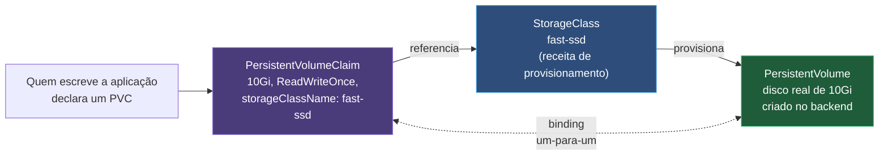

# Armazenamento — PV, PVC e StorageClass

> [!abstract] TL;DR
> Um Pod é descartável por design — pode morrer num node e renascer em outro qualquer, sem aviso, sem cerimônia. Um disco não tem essa liberdade: o dado gravado nele tem que continuar existindo, no mesmo lugar, mesmo que o Pod que o escreveu já não exista mais. O Kubernetes resolve essa tensão separando três papéis que costumam se confundir na primeira leitura: **PersistentVolumeClaim** (PVC) é o *pedido* de armazenamento que quem escreve a aplicação declara — "preciso de 10Gi, acesso de um node só"; **PersistentVolume** (PV) é o *recurso real* que existe, seja um disco de nuvem, um array NFS ou um cluster Ceph; **StorageClass** é a *receita* que ensina o cluster a criar um PV do zero quando nenhum serve ao pedido. Um controller observa PVCs sem PV correspondente e age para fechar essa diferença — o mesmo loop observar-comparar-agir de sempre, aplicado agora a bytes em disco, não a containers em execução. O resultado é que quem escreve o manifesto de uma aplicação nunca precisa saber se o disco por trás é um EBS da AWS, um Persistent Disk do Google ou um NFS caseiro — só precisa pedir "10Gi, `ReadWriteOnce`" e deixar o cluster resolver o resto.

Imagine o cenário mais simples de todos: um Pod escreve num arquivo dentro do seu próprio filesystem, sem nenhuma montagem especial. Funciona perfeitamente enquanto o Pod está vivo. Aí ele morre — por um `OOMKilled`, por um node que caiu, por um rollout comum de rotina — e o ReplicaSet, seguindo exatamente o mecanismo que a nota [[03-Dominios/Tecnologia/Infraestrutura/Kubernetes/04 - Deployment e ReplicaSet|04 — Deployment e ReplicaSet]] já descreveu, cria um Pod novo para substituí-lo. Só que esse Pod novo pode nascer em qualquer node do cluster, escolhido pelo `kube-scheduler` sem nenhuma obrigação de repetir a máquina do Pod anterior — e o filesystem local do container é, como qualquer camada de escrita efêmera, local àquele processo específico, exatamente como a nota [[03-Dominios/Tecnologia/Infraestrutura/Docker/06 - Dados que sobrevivem ao container|Dados que sobrevivem ao container]] já estabeleceu para o Docker isolado. O dado que existia no Pod antigo simplesmente não existe no Pod novo. Não é bug, não é falha de infraestrutura: é a mesma premissa de "tudo é descartável e substituível" que torna o Kubernetes inteiro robusto a falha, só que agora encostando de frente numa realidade que se recusa a ser descartável — o dado tem identidade, tem história, e recriá-lo do zero a partir do template não é uma opção, é uma perda.

Essa é exatamente a lacuna que esta nota fecha, e ela chega pronta para reaproveitar vocabulário que este galho já construiu. O objeto `emptyDir`, mencionado mais adiante, resolve um caso adjacente, mas não este; o Docker já tinha resolvido "onde o dado mora" para um container isolado numa máquina só, com volumes nomeados, bind mounts e tmpfs — o Kubernetes precisa da mesma resposta, mas multiplicada por um cluster inteiro de nodes que vêm e vão, onde "o disco certo" pode estar fisicamente preso a uma máquina específica, ou pode ser um recurso de rede que qualquer node alcança igualmente. O restante desta nota desenvolve a separação de papéis que resolve isso, o mecanismo de provisionamento por trás dela, e os parâmetros que decidem exatamente onde, quando e como um disco de verdade aparece atrás de um pedido declarado em YAML.

## PVC, PV e StorageClass: os três papéis

A separação em três objetos distintos não é acidente de design nem excesso de camadas — ela existe para isolar, com a mesma disciplina que separa `spec` de `status` em qualquer objeto deste galho, três responsabilidades que pertencem a pessoas diferentes. Quem escreve uma aplicação escreve um **PersistentVolumeClaim**: uma declaração de necessidade, não de implementação. Quanto espaço, que modo de acesso, opcionalmente que classe de armazenamento — nada sobre qual disco físico, qual provedor de nuvem, qual protocolo de rede está por trás.

```yaml
apiVersion: v1
kind: PersistentVolumeClaim
metadata:
    name: dados-pvc
spec:
    accessModes:
        - ReadWriteOnce
    resources:
        requests:
            storage: 10Gi
    storageClassName: fast-ssd
```

O **PersistentVolume** é o objeto do outro lado dessa relação: o recurso de armazenamento que de fato existe no cluster, com um tamanho concreto, um modo de acesso concreto, e um backend concreto — um volume EBS já provisionado na AWS, um export NFS já configurado, um disco Ceph já alocado. Um PV pode ter sido criado à mão por quem administra o cluster (provisionamento estático, tratado adiante) ou pode ter sido criado automaticamente por um controller a partir de uma StorageClass (provisionamento dinâmico, o caminho disparadamente mais comum). A **StorageClass**, por fim, não é um recurso de armazenamento em si — é a receita que descreve como criar um PV do zero quando nenhum PV existente satisfaz um PVC pendente: qual `provisioner` chamar, com quais parâmetros, com qual política de recuperação quando o PVC for apagado.



Vale marcar o contraste com o modelo que a nota [[03-Dominios/Tecnologia/Infraestrutura/Docker/06 - Dados que sobrevivem ao container|Dados que sobrevivem ao container]] já descreveu para o Docker isolado, porque a semelhança superficial esconde uma diferença estrutural relevante. Um volume nomeado do Docker é criado e gerenciado por um único daemon, numa única máquina — não existe conceito de "onde fisicamente aquele volume mora dentro de um cluster de várias máquinas", porque não há cluster nenhum, só um host. O Kubernetes precisa resolver um problema que o Docker isolado nunca enfrentou: o Pod que vai consumir o disco pode nascer em qualquer node, e o disco físico, dependendo do backend, pode estar preso a uma zona ou a uma máquina específica — a separação em PVC, PV e StorageClass, com um controller de binding e um scheduler que leva em conta a topologia do armazenamento, é a resposta a essa complexidade adicional que só aparece quando "onde o dado mora" e "onde o processo roda" deixam de ser garantidamente a mesma máquina.

Vale nomear o motivo prático por trás dessa separação: ela é o que permite trocar o backend de armazenamento inteiro — de um disco local para um EBS, de um EBS para Ceph, de um provedor de nuvem para outro — sem tocar em nenhum manifesto de aplicação. Uma equipe de plataforma muda a `StorageClass` padrão, ou cria uma nova com parâmetros diferentes, e todo PVC futuro que a referencie recebe automaticamente o backend novo, sem que uma única linha do Deployment ou do StatefulSet precise mudar. É a mesma indireção que o Service já aplicou à rede — um `selector` no lugar de um IP fixo — aplicada agora ao armazenamento: um nome de classe no lugar de um caminho de disco específico.

## Provisionamento dinâmico: mais um loop de reconciliação

O caminho mais comum, de longe, para um PV nascer é o **provisionamento dinâmico**, e vale nomear explicitamente o que ele é: mais um loop de reconciliação, do mesmo tipo que este galho já descreveu para Pods, ReplicaSets e EndpointSlices. Quando um PVC é criado referenciando uma `storageClassName` cujo provisionador está ativo, e nenhum PV existente satisfaz aquele pedido, um controller — o provisionador declarado na StorageClass, geralmente um plugin CSI rodando como Pod dentro do próprio cluster — observa esse PVC pendente via watch, chama a API do backend de armazenamento correspondente (a API da AWS para criar um volume EBS, por exemplo), espera a confirmação de que o disco real foi criado, e então cria o objeto PersistentVolume no Kubernetes representando esse disco. O passo final é o **binding**: o PVC e o PV recém-criado são amarrados um ao outro, numa relação de referência bidirecional, e a partir desse momento nenhum outro PVC pode reivindicar aquele mesmo PV.

```bash
kubectl get pvc dados-pvc
# NAME        STATUS    VOLUME                                     CAPACITY   ACCESS MODES   STORAGECLASS
# dados-pvc   Pending                                                                          fast-ssd
```

Nos primeiros instantes depois do `kubectl apply`, o PVC aparece `Pending` — exatamente como um Deployment recém-criado mostra `status.replicas: 0` antes do ReplicaSet controller agir, o PVC mostra `Pending` antes do provisionador da StorageClass agir. Segundos depois, dependendo da latência do backend:

```bash
kubectl get pvc dados-pvc
# NAME        STATUS   VOLUME                                     CAPACITY   ACCESS MODES   STORAGECLASS
# dados-pvc   Bound    pvc-3f9a2b1c-8e7d-4a6f-9c1e-2b8a7d5f4e3c   10Gi       RWO            fast-ssd
```

`Bound` é o `status` reportando que o loop convergiu: existe um PV, ele corresponde ao pedido, e os dois estão amarrados. Repare no nome do volume gerado — um UUID, não um nome legível — porque o PV foi criado pelo provisionador, não por uma pessoa, e não há convenção de nome que faça sentido além de garantir unicidade. Um Pod que monte esse PVC não precisa saber nada disso: ele referencia o PVC pelo nome que uma pessoa escolheu (`dados-pvc`), e a indireção até o PV real acontece inteiramente por trás.

### Vendo o binding acontecer em câmera lenta

Da mesma forma que a nota [[03-Dominios/Tecnologia/Infraestrutura/Kubernetes/02 - O loop de reconciliação|O loop de reconciliação]] recomenda observar uma convergência ao vivo em vez de tomá-la como fé, vale acompanhar um PVC saindo de `Pending` para `Bound` num terminal separado, com `--watch`, para tornar tangível que existe de fato um controller trabalhando entre os dois estados:

```bash
kubectl apply -f pvc.yaml
kubectl get pvc dados-pvc --watch
```

```
NAME        STATUS    VOLUME   CAPACITY   ACCESS MODES   STORAGECLASS   AGE
dados-pvc   Pending                                       fast-ssd       0s
dados-pvc   Bound     pvc-3f9a2b1c-...   10Gi   RWO       fast-ssd       4s
```

Repare que a transição não é instantânea, e o tempo entre as duas linhas — normalmente poucos segundos, mas variável conforme a latência da API do backend de nuvem — é exatamente o tempo que o provisionador CSI levou para chamar a API externa, esperar a confirmação de que o disco físico foi criado, e escrever o objeto PV de volta no cluster. Um `kubectl describe pvc dados-pvc` rodado nesse intervalo mostraria, na seção de eventos, uma linha `Normal Provisioning` seguida, segundos depois, de `Normal ProvisioningSucceeded` — o mesmo padrão de eventos cronológicos que qualquer outro controller deste galho já produziu para qualquer outra convergência.

### Diagnosticando um PVC preso em `Pending`

Um PVC que nunca sai de `Pending` é o equivalente, no mundo do armazenamento, ao EndpointSlice vazio que a nota [[03-Dominios/Tecnologia/Infraestrutura/Kubernetes/05 - Service|Service]] já ensinou a diagnosticar: um sintoma direto de que o loop não encontrou como convergir, e o primeiro lugar a olhar não é o PVC em si, mas os eventos associados a ele.

```bash
kubectl describe pvc dados-pvc
```

```
Events:
  Type     Reason              Age   From                         Message
  ----     ------              ----  ----                         -------
  Warning  ProvisioningFailed  12s   ebs.csi.aws.com_ebs-csi-...   rpc error: code = InvalidArgument desc = invalid parameter "typo": unknown
```

As causas mais comuns, em ordem de frequência real: um nome de `storageClassName` com erro de digitação, que não corresponde a nenhuma StorageClass existente (nesse caso o PVC fica `Pending` silenciosamente, sem nem chegar a tentar provisionar); um parâmetro inválido na StorageClass, como no exemplo acima; uma cota de recursos do namespace (`ResourceQuota`) que já esgotou o limite de armazenamento permitido; ou, em `volumeBindingMode: WaitForFirstConsumer`, simplesmente nenhum Pod ainda referenciando aquele PVC — o que não é erro nenhum, é o comportamento esperado, e o PVC só sai de `Pending` quando um Pod real for agendado.

> [!warning] `Pending` sob `WaitForFirstConsumer` não é sinal de problema
> Um PVC criado com uma StorageClass que usa `WaitForFirstConsumer` fica `Pending` por design até que um Pod concreto o referencie — não existe provisionamento nenhum acontecendo, nem deveria. Rodar `kubectl describe pvc` nesse instante e ver "esperando o primeiro consumidor" na mensagem de evento é o comportamento correto, não um sintoma de falha. Confundir os dois casos leva a depurar um problema que não existe.

## Provisionamento estático: quando ainda se usa

Nem todo cluster tem um provisionador dinâmico disponível para todo tipo de armazenamento, e existem cenários em que o disco já existe antes de qualquer PVC ser escrito — um volume NFS que a equipe de infraestrutura já mantém há anos, um disco de nuvem criado manualmente por exigência de auditoria, um recurso que precisa ser reaproveitado exatamente como está, com dados já presentes. Para esses casos, quem administra o cluster cria o PV diretamente, apontando para o recurso físico já existente:

```yaml
apiVersion: v1
kind: PersistentVolume
metadata:
    name: pv-nfs-legado
spec:
    capacity:
        storage: 50Gi
    accessModes:
        - ReadWriteMany
    nfs:
        server: nfs.exemplo-corp.internal
        path: /exports/dados-legados
    persistentVolumeReclaimPolicy: Retain
```

Um PVC criado depois, com requisitos compatíveis (tamanho igual ou menor, mesmo modo de acesso), casa com esse PV pelo mesmo mecanismo de binding — só que sem nenhum provisionador precisando criar disco nenhum, porque o disco já existia. Provisionamento estático continua relevante sobretudo para backends que não têm um plugin CSI maduro, para recursos legados que precisam ser importados ao cluster sem recriação, e para ambientes onde a política de segurança exige que todo recurso de armazenamento passe por revisão humana antes de existir — o preço é perder a conveniência de "peça e receba" que o provisionamento dinâmico oferece, em troca de controle explícito sobre o que exatamente está sendo alocado.

Vale reter uma diferença sutil de comportamento entre os dois caminhos: um PV estático que já existia antes de qualquer PVC ser criado fica com `status: Available` até algum PVC compatível reivindicá-lo — nada o consome automaticamente antes disso, mesmo que exista um PVC pendente esperando. O binding, nos dois casos, dinâmico ou estático, é sempre decidido pelo mesmo controller de volume do control plane, comparando `accessModes`, capacidade solicitada, e (quando declarado) `storageClassName` — a diferença entre os dois caminhos está inteiramente em quem cria o PV, nunca em como o PVC encontra o PV depois de criado.

## Modos de acesso: a precisão que quase todo mundo erra

O campo `accessModes` de um PVC parece autoexplicativo até alguém tentar montar o mesmo volume em duas réplicas de um Deployment e descobrir, na prática, que `ReadWriteOnce` não significa o que a leitura apressada sugere.

| Modo | Sigla | O que de fato permite | Backend típico |
| --- | --- | --- | --- |
| `ReadWriteOnce` | RWO | Montagem de leitura-e-escrita por **um node** — não um Pod; múltiplos Pods no mesmo node podem montar o mesmo volume simultaneamente | EBS, discos de nuvem em geral |
| `ReadOnlyMany` | ROX | Montagem de leitura por múltiplos nodes ao mesmo tempo | NFS, dados estáticos compartilhados |
| `ReadWriteMany` | RWX | Montagem de leitura-e-escrita por múltiplos nodes simultaneamente | NFS, CephFS, poucos backends de bloco suportam |
| `ReadWriteOncePod` | RWOP | Montagem de leitura-e-escrita restrita a **um único Pod**, não a um node inteiro | CSI drivers que implementam o modo; nem todo backend suporta |

A confusão mais comum, e vale nomeá-la com precisão porque ela custa tempo de depuração real: `ReadWriteOnce` restringe a montagem a um **node**, não a um Pod. Dois Pods diferentes, rodando no mesmo node, podem montar o mesmo volume `ReadWriteOnce` ao mesmo tempo sem nenhum conflito — o que costuma surpreender quem espera que RWO garanta exclusividade de Pod único, e que só descobre a diferença ao tentar impedir dois processos concorrentes de escreverem no mesmo arquivo sem coordenação própria. `ReadWriteMany` resolve o caso de múltiplos nodes escrevendo ao mesmo tempo, mas poucos backends de bloco tradicionais (EBS, discos de nuvem em geral) suportam esse modo — eles são desenhados para anexar a uma única máquina por vez; é preciso um sistema de arquivos de rede de verdade, como NFS ou CephFS, para RWX funcionar. E `ReadWriteOncePod` — o modo mais recente da lista — existe exatamente para fechar a lacuna que RWO deixa aberta: quando a exigência real é "só um Pod, nunca dois, mesmo que estejam no mesmo node", como um banco de dados de escrita única que não tolera concorrência de nenhum tipo.

> [!info] Baseline de versão
> `ReadWriteOncePod` está documentado como um dos quatro modos de acesso na referência oficial de PersistentVolumes; verificar o estágio de disponibilidade (alpha/beta/GA) e a versão mínima de suporte no cluster e no driver CSI específico antes de depender dele em produção — a documentação da versão em uso é a fonte final, porque o suporte depende tanto da versão do control plane quanto de o driver CSI específico implementar esse modo.

### `ReadWriteMany` na prática: por que a maioria dos backends recusa

Vale tornar concreto por que `ReadWriteMany` é uma exceção, não a regra, entre os backends de armazenamento disponíveis. Um disco de bloco — o modelo que EBS, discos de nuvem em geral e a maioria dos SSDs locais seguem — é desenhado, no nível do protocolo, para ser anexado (*attach*) a uma única máquina de cada vez; o próprio conceito de "anexar" pressupõe posse exclusiva. Um sistema de arquivos de rede como NFS resolve isso de um jeito estruturalmente diferente: o disco físico nunca é anexado a nenhum node do cluster diretamente — ele mora num servidor à parte, e cada node conversa com esse servidor por um protocolo de rede que já foi desenhado, desde o início, para múltiplos clientes concorrentes lendo e escrevendo o mesmo espaço.

```yaml
apiVersion: v1
kind: PersistentVolume
metadata:
    name: pv-compartilhado
spec:
    capacity:
        storage: 100Gi
    accessModes:
        - ReadWriteMany
    nfs:
        server: nfs.exemplo-corp.internal
        path: /exports/compartilhado
    persistentVolumeReclaimPolicy: Retain
```

Um Deployment com múltiplas réplicas, todas montando o mesmo PVC `ReadWriteMany`, é o caso de uso mais direto — um pool de workers que precisam ler e escrever no mesmo diretório de arquivos compartilhados, por exemplo. O preço de trocar um disco de bloco local por um sistema de arquivos de rede é latência: cada operação de I/O agora atravessa a rede até o servidor NFS, em vez de falar diretamente com um disco fisicamente anexado — um trade-off que vale a pena para o caso de compartilhamento genuíno, e que seria desperdício desnecessário para uma aplicação que só precisa de um disco exclusivo por réplica, caso em que `ReadWriteOnce` continua sendo a escolha certa e mais barata.

## `volumeBindingMode`: quando o binding acontece

O campo `volumeBindingMode` de uma StorageClass decide **quando**, no ciclo de vida de um PVC, o binding — e, no caso dinâmico, a criação do disco real — de fato acontece. `Immediate`, o padrão, faz o provisionador agir assim que o PVC é criado, sem esperar nenhum Pod existir ainda. `WaitForFirstConsumer` adia esse trabalho até que exista um Pod real referenciando aquele PVC e o `kube-scheduler` já tenha decidido em qual node ele vai rodar.

A razão para preferir `WaitForFirstConsumer` na maioria dos backends com restrição topológica é um problema clássico e concreto: num cluster com nodes espalhados por múltiplas zonas de disponibilidade, um disco de bloco provisionado com `Immediate` pode nascer numa zona qualquer, escolhida sem nenhum conhecimento de onde o Pod vai efetivamente rodar. Se o `kube-scheduler`, minutos depois, decidir colocar o Pod numa zona diferente daquela onde o disco nasceu, o resultado é um Pod preso em `Pending` para sempre — porque discos de bloco normalmente não atravessam zonas, e o volume já existe no lugar errado, sem nenhum jeito barato de mover. `WaitForFirstConsumer` resolve isso invertendo a ordem: o scheduler decide o node primeiro, considerando toda a topologia disponível, e só então o provisionador cria o disco já na zona certa, alinhada à decisão de agendamento.

```yaml
apiVersion: storage.k8s.io/v1
kind: StorageClass
metadata:
    name: fast-ssd
provisioner: ebs.csi.aws.com
volumeBindingMode: WaitForFirstConsumer
```

### O problema concreto que `Immediate` causa, passo a passo

Vale seguir o cenário até o fim, com uma linha do tempo concreta, porque é o tipo de armadilha que só se torna óbvia depois de vista uma vez. Um cluster tem nodes distribuídos em três zonas de disponibilidade — `zona-a`, `zona-b`, `zona-c` — e uma StorageClass com `volumeBindingMode: Immediate` provisiona discos de bloco, que só podem ser anexados a uma máquina na mesma zona onde nasceram.

```bash
kubectl apply -f pvc-imediato.yaml
# o provisionador age na hora, sem saber onde o Pod vai rodar depois,
# e o disco nasce, digamos, na zona-b

kubectl apply -f pod-consumidor.yaml
```

Se o `kube-scheduler`, decidindo com base em outros critérios — afinidade de node, recursos disponíveis, taints — colocar esse Pod num node da `zona-a` ou `zona-c`, o resultado é um Pod preso indefinidamente:

```bash
kubectl get pod app-com-dados
# NAME             READY   STATUS    RESTARTS   AGE
# app-com-dados    0/1     Pending   0          3m

kubectl describe pod app-com-dados
```

```
Events:
  Type     Reason            Age   From               Message
  Warning  FailedScheduling  3m    default-scheduler   0/6 nodes are available: 4 node(s) had volume node affinity conflict
```

A mensagem `volume node affinity conflict` é o sintoma diagnóstico direto desse descompasso — o PV já nasceu com uma afinidade de zona gravada (`nodeAffinity` no próprio PV, herdada da zona onde o disco foi criado), e nenhum node fora daquela zona satisfaz essa restrição. Não existe correção rápida depois que o disco já nasceu no lugar errado: a saída realista é apagar o PVC, recriar com `WaitForFirstConsumer` na StorageClass, e deixar o scheduler decidir o node antes de qualquer disco ser criado — exatamente o comportamento que a seção anterior já descreveu como o motivo de `WaitForFirstConsumer` ser a escolha default recomendada para a maioria dos backends com restrição de topologia.

## Política de recuperação: o que sobrevive a um PVC apagado

O campo `persistentVolumeReclaimPolicy`, herdado do PV que a StorageClass provisiona (o padrão para provisionamento dinâmico é `Delete`), decide o que acontece com o disco real quando o PVC que o reivindicava é apagado. `Delete` remove o PV do Kubernetes **e** o recurso físico de armazenamento por trás — o disco EBS, o volume de nuvem, o que for. `Retain` remove só o binding: o PVC desaparece, mas o PV continua existindo, marcado como `Released`, com o dado intacto, indisponível para qualquer outro PVC reivindicar automaticamente até alguém intervir manualmente.

A consequência real de `Delete`, e vale nomeá-la sem meio-termo: apagar um PVC cuja política é `Delete` apaga o dado junto, sem confirmação adicional, sem período de graça. `kubectl delete pvc dados-pvc` executado por engano — um script rodando contra o namespace errado, um `kubectl delete -f .` aplicado sem revisar o diretório inteiro — não deixa margem para arrependimento depois que o comando retorna sucesso; o disco físico já começou a ser desalocado no backend. É por isso que ambientes que levam continuidade de dado a sério costumam trocar a política padrão para `Retain` em StorageClasses usadas por bancos de dados e outros dados críticos, aceitando o custo operacional de limpar manualmente PVs `Released` órfãos em troca da rede de segurança de nunca perder dado por um comando apressado.

```bash
kubectl get pv
# NAME                                       CAPACITY   STATUS     CLAIM               STORAGECLASS
# pvc-3f9a2b1c-8e7d-4a6f-9c1e-2b8a7d5f4e3c   10Gi       Released   default/dados-pvc   fast-ssd
```

Um PV `Released` não volta a ficar `Available` sozinho, mesmo que o dado ainda esteja lá — é preciso limpeza manual explícita (ou automação própria) antes de reaproveitá-lo, exatamente o comportamento que a nota [[03-Dominios/Tecnologia/Infraestrutura/Kubernetes/02 - O loop de reconciliação|O loop de reconciliação]] já descreveu como típico de um objeto sem controller agindo sobre uma condição pendente: o fato "este PV está liberado, mas ainda tem dado de outro dono" persiste até alguém — não um controller automático — decidir o que fazer com ele.

## Expansão de volume: crescer é permitido, encolher não

O campo `allowVolumeExpansion` de uma StorageClass, quando `true`, permite que um PVC já vinculado seja redimensionado para cima simplesmente editando `spec.resources.requests.storage` com um valor maior e reaplicando — o controller de expansão observa essa mudança, chama o backend para expandir o disco real, e (dependendo do filesystem e do driver) redimensiona o sistema de arquivos dentro do volume para usar o espaço novo, às vezes exigindo que o Pod seja reiniciado para o kernel perceber o tamanho novo.

```yaml
apiVersion: storage.k8s.io/v1
kind: StorageClass
metadata:
    name: fast-ssd
provisioner: ebs.csi.aws.com
allowVolumeExpansion: true
```

A limitação que vale gravar sem exceção: **encolher um volume não é suportado**. Não existe caminho nativo para reduzir `storage` de um PVC já provisionado — a operação é estruturalmente unidirecional, porque reduzir um filesystem com dados dentro exige mover ou truncar dados de forma seguramente coordenada, um problema que a maioria dos backends e drivers simplesmente não resolve de forma genérica e automática. Quem precisa de um volume menor precisa criar um novo PVC do tamanho certo e migrar os dados manualmente — copiar, não redimensionar.

## CSI: o padrão que substituiu os drivers embutidos

Todo exemplo desta nota até aqui referenciou um `provisioner` como `ebs.csi.aws.com` — uma string que aponta para um plugin **CSI** (*Container Storage Interface*), o padrão que se tornou a forma canônica de conectar o Kubernetes a qualquer backend de armazenamento. Antes do CSI existir, o suporte a cada backend (EBS, GCE Persistent Disk, Azure Disk, e outros) vivia embutido diretamente no código-fonte do próprio Kubernetes — os chamados plugins *in-tree* — o que significava que corrigir um bug de um driver de armazenamento específico, ou adicionar suporte a um backend novo, exigia mudar e recompilar o próprio Kubernetes. O CSI resolve isso movendo essa lógica para fora, para plugins independentes que rodam como Pods dentro do cluster e conversam com o control plane por uma interface padronizada — qualquer fabricante de storage pode escrever e evoluir seu próprio driver CSI sem depender do ciclo de release do Kubernetes em si.

A migração dos plugins *in-tree* para os equivalentes CSI aconteceu de forma gradual, ao longo de várias versões maiores do Kubernetes, com cada backend principal (EBS, GCE PD, Azure Disk, Cinder, vSphere, entre outros) sendo migrado individualmente, de forma transparente para quem já usava StorageClasses com o nome de provisionador antigo — uma camada de tradução interna (`CSIMigration`) redireciona, por baixo, chamadas para o nome de plugin antigo até o driver CSI correspondente, sem exigir que ninguém reescreva manifestos existentes. O processo começou como funcionalidade alpha na versão 1.14 e avançou para beta na 1.17, cobrindo os backends de nuvem mais usados; hoje, em qualquer cluster corrente, o caminho *in-tree* está desativado por padrão ou já removido para a maioria desses backends, e toda nova integração de armazenamento é feita exclusivamente via CSI — não existe mais caminho de contribuição para adicionar suporte embutido diretamente ao código-fonte do Kubernetes.

Esta nota não aprofunda o mecanismo interno de um plugin CSI — como ele se registra no cluster via um objeto `CSIDriver`, como o `kubelet` conversa com ele por uma API gRPC local para montar e desmontar volumes, como o **CSI Node** e o **CSI Controller** dividem responsabilidades entre o node onde o Pod roda e o control plane — porque isso pertence à parte deste galho dedicada ao control plane e ao kubelet, na fase Magus. Aqui basta reter que CSI é o padrão atual e único caminho de extensão, que a string do `provisioner` de uma StorageClass é, na prática, sempre um driver CSI em qualquer cluster corrente, e que a mecânica de provisionamento dinâmico descrita nesta nota — observar PVC pendente, chamar o backend, criar o PV, fazer o binding — é exatamente o que um plugin CSI implementa por trás, escondido atrás da mesma interface para qualquer backend que o cluster use.

> [!info] Baseline de versão
> CSI Migration para os principais provedores de nuvem (AWS EBS, GCE PD, Azure Disk, OpenStack Cinder) progrediu de alpha (Kubernetes 1.14) para beta (1.17) e é o caminho padrão em clusters correntes (2026); verificar, na documentação da distribuição específica em uso, se algum backend particular ainda depende do caminho in-tree antes de assumir migração completa em todo cenário.

## Tipos efêmeros: para não confundir "volume" com "persistente"

Vale fechar o corpo técnico desta nota desfazendo uma confusão comum: nem todo `volume` montado num Pod é persistente — a palavra "volume", no vocabulário do Kubernetes, é mais ampla do que PV/PVC, e inclui tipos que existem só enquanto o Pod existe.

`emptyDir` é o mais comum desses tipos efêmeros: um diretório vazio criado no instante em que o Pod nasce, compartilhado entre todos os containers daquele Pod, e apagado permanentemente quando o Pod morre — não quando um container reinicia dentro dele, mas quando o Pod inteiro é removido. É o mecanismo certo para um cache temporário de processamento, ou para dados compartilhados entre um container principal e um sidecar, que nenhum dos dois precisa que sobreviva além da vida daquele Pod específico.

```yaml
apiVersion: v1
kind: Pod
metadata:
    name: worker-com-cache
spec:
    containers:
        - name: app
          image: myapp:1.0
          volumeMounts:
              - name: cache-temporario
                mountPath: /tmp/cache
    volumes:
        - name: cache-temporario
          emptyDir: {}
```

Existe também o **volume efêmero genérico** (*generic ephemeral volume*), que usa a mesma sintaxe de `volumeClaimTemplate` que o StatefulSet emprega — a nota seguinte deste galho desenvolve esse mecanismo em detalhe — mas gera um PVC cujo ciclo de vida está atado ao do Pod: quando o Pod morre, o PVC (e, dependendo da política de recuperação, o PV) morre junto. É útil para cargas que precisam de um volume provisionado dinamicamente por uma StorageClass, com desempenho de disco de verdade, mas sem nenhuma intenção de que aquele dado sobreviva além daquela execução específica — um meio-termo entre `emptyDir` (sempre local ao node, sem passar por StorageClass nenhuma) e um PVC persistente de verdade.

Nomear esses dois tipos aqui, lado a lado com PV e PVC, tem um propósito preciso: evitar o erro de ler qualquer manifesto com a palavra `volumes:` e presumir persistência automática. Persistência, no Kubernetes, é sempre uma escolha explícita — PVC referenciando uma StorageClass, ou um PV estático já existente — nunca uma propriedade implícita de qualquer coisa chamada "volume".

## Snapshot: capturar um estado no tempo

Vale nomear, sem aprofundar, o objeto `VolumeSnapshot`: um recurso, também mediado por um driver CSI que suporte a capacidade, que captura o estado de um PVC num instante específico, permitindo restaurar um PVC novo a partir daquele ponto no tempo mais tarde. `VolumeSnapshotClass` funciona como a StorageClass do snapshot — a receita de como o snapshot deve ser criado no backend, análoga em espírito à StorageClass que já apareceu para o PV.

```yaml
apiVersion: snapshot.storage.k8s.io/v1
kind: VolumeSnapshot
metadata:
    name: dados-snapshot-2026-08-03
spec:
    volumeSnapshotClassName: csi-snapclass
    source:
        persistentVolumeClaimName: dados-pvc
```

Restaurar a partir de um snapshot é, mecanicamente, criar um PVC novo referenciando o snapshot como origem, em vez de deixar o provisionador criar um disco vazio do zero:

```yaml
apiVersion: v1
kind: PersistentVolumeClaim
metadata:
    name: dados-restaurados
spec:
    accessModes:
        - ReadWriteOnce
    resources:
        requests:
            storage: 10Gi
    storageClassName: fast-ssd
    dataSource:
        name: dados-snapshot-2026-08-03
        kind: VolumeSnapshot
        apiGroup: snapshot.storage.k8s.io
```

Este é um mecanismo de backup e recuperação pontual — uma foto do disco num instante — não uma estratégia completa de continuidade de dados para um banco de produção. Um snapshot tirado enquanto um banco relacional está em pleno funcionamento carrega o mesmo risco de inconsistência entre arquivos que a nota [[03-Dominios/Tecnologia/Infraestrutura/Docker/06 - Dados que sobrevivem ao container|Dados que sobrevivem ao container]] já apontou para um `tar` ingênuo de um data directory: sem coordenação com o processo do banco sobre quando é seguro capturar o quê, o snapshot pode congelar arquivos em estados mutuamente inconsistentes. A disciplina de backup real, coordenada com o próprio banco, pertence a uma conversa mais ampla que este galho não desenvolve aqui.

## Manifestos completos: PVC, StorageClass e um Pod consumindo o PVC

Reunindo os elementos desta nota num fluxo único e comentado — a StorageClass que ensina o cluster a provisionar, o PVC que pede o disco, e o Pod que de fato usa o resultado:

```yaml
# 1. A StorageClass — a receita, criada uma vez por quem administra o cluster.
apiVersion: storage.k8s.io/v1
kind: StorageClass
metadata:
    name: fast-ssd
provisioner: ebs.csi.aws.com     # driver CSI responsável pelo provisionamento real
parameters:
    type: gp3
volumeBindingMode: WaitForFirstConsumer   # espera o scheduler decidir o node antes de criar o disco
reclaimPolicy: Delete                     # disco real some junto com o PV quando o PVC for apagado
allowVolumeExpansion: true                # permite crescer o volume depois; nunca encolher
---
# 2. O PVC — o pedido, escrito por quem desenvolve a aplicação.
apiVersion: v1
kind: PersistentVolumeClaim
metadata:
    name: dados-pvc
spec:
    accessModes:
        - ReadWriteOnce        # um node só; múltiplos Pods no mesmo node podem montar junto
    resources:
        requests:
            storage: 10Gi
    storageClassName: fast-ssd
---
# 3. O Pod — consome o PVC pelo nome, sem nenhuma noção do disco real por trás.
apiVersion: v1
kind: Pod
metadata:
    name: app-com-dados
spec:
    containers:
        - name: app
          image: myapp:1.0
          volumeMounts:
              - name: dados
                mountPath: /var/lib/app/data
    volumes:
        - name: dados
          persistentVolumeClaim:
              claimName: dados-pvc
```

Repare que o terceiro bloco não menciona `fast-ssd`, `ebs.csi.aws.com`, nem nenhum detalhe do backend — ele referencia só o nome do PVC, `dados-pvc`. É essa camada de indireção, ponta a ponta, que permite trocar toda a infraestrutura de armazenamento por trás — de EBS para outro backend, de uma StorageClass para outra com parâmetros diferentes — sem tocar num único manifesto de Pod ou de Deployment.

## Recapitulando os três papéis numa tabela

Vale fechar o corpo técnico com a mesma disciplina de recapitulação que a nota [[03-Dominios/Tecnologia/Infraestrutura/Kubernetes/04 - Deployment e ReplicaSet|Deployment e ReplicaSet]] já usou para sua própria cadeia de objetos — uma tabela que amarra os três papéis desta nota numa única visão de responsabilidades:

| Objeto | Quem escreve | O que garante | O que NÃO sabe fazer sozinho |
| --- | --- | --- | --- |
| PersistentVolumeClaim | Quem desenvolve a aplicação | Um pedido declarativo de espaço, modo de acesso e classe | Não cria disco nenhum sozinho; depende de um PV existente ou de um provisionador ativo |
| PersistentVolume | Um controller (dinâmico) ou quem administra o cluster (estático) | O recurso real de armazenamento, com tamanho e backend concretos | Não decide política de aplicação — não sabe se o dado é crítico o bastante para exigir `Retain` |
| StorageClass | Quem administra o cluster, uma vez, para toda a equipe reaproveitar | A receita de como provisionar automaticamente quando nenhum PV serve | Não provisiona nada sozinha — só é acionada quando um PVC pendente a referencia |

Cada linha desta tabela depende da anterior de um jeito específico: sem uma StorageClass configurada com um provisionador funcional, um PVC de provisionamento dinâmico fica `Pending` para sempre; sem um PV — estático ou dinâmico — vinculado, o PVC nunca sai de `Pending`; e sem o PVC referenciado explicitamente num Pod, todo o mecanismo de provisionamento existe, mas não produz nenhum efeito visível. A cadeia inteira só produz o comportamento observável — "meu Pod tem um disco que sobrevive à minha morte" — porque cada peça resolve exatamente um problema, sem se sobrepor às outras duas.

> [!warning] Este galho não cobre backup de banco de dados nem storage distribuído entre datacenters
> PV, PVC e StorageClass resolvem "onde o dado mora tecnicamente dentro do cluster" — não resolvem replicação geográfica, backup consistente sob carga, nem disaster recovery entre regiões. Essas disciplinas, que dependem tanto da ferramenta de banco específica quanto de política operacional, pertencem a [[03-Dominios/Engenharia/Dados/index|Engenharia/Dados]] e a [[03-Dominios/Engenharia/Operação/3 - Rodar em produção/06 - Resiliência operacional|Resiliência operacional]]. O mecanismo de objeto descrito aqui é a fundação sobre a qual essas disciplinas operam, não um substituto para elas.

## Armadilhas comuns

> [!warning] Achar que `ReadWriteOnce` significa "só um Pod"
> `ReadWriteOnce` restringe a montagem a um **node**, não a um Pod específico. Dois Pods no mesmo node podem montar o mesmo volume RWO simultaneamente, sem nenhuma barreira do Kubernetes impedindo escrita concorrente descoordenada. Quem precisa de exclusividade real de Pod único deve usar `ReadWriteOncePod`, verificando primeiro se o driver CSI em uso suporta esse modo.

> [!warning] Apagar um PVC com `reclaimPolicy: Delete` sem checar se é reversível
> A política `Delete`, padrão em provisionamento dinâmico, remove o disco físico junto com o objeto — sem confirmação extra, sem período de graça. Um `kubectl delete pvc` num script rodando contra o namespace errado é, na prática, um comando de destruição de dado irreversível. Ambientes com dados críticos costumam trocar a política padrão para `Retain` justamente para transformar esse erro num incômodo operacional, não numa perda permanente.

> [!warning] Usar `volumeBindingMode: Immediate` num cluster com múltiplas zonas
> `Immediate` provisiona o disco antes de o scheduler decidir onde o Pod vai rodar, o que pode colocar o volume numa zona diferente da que o Pod acaba recebendo — resultando num Pod preso em `Pending` porque o disco de bloco não atravessa zonas. `WaitForFirstConsumer` evita esse descompasso adiando o provisionamento até depois da decisão de agendamento.

> [!warning] Tentar reduzir o `storage` de um PVC já provisionado
> `allowVolumeExpansion` só permite crescer. Editar um PVC pedindo um valor menor do que o já provisionado não encolhe o disco — o Kubernetes rejeita a mudança ou simplesmente a ignora, dependendo do driver. A única saída real para "eu superdimensionei o disco" é criar um PVC novo do tamanho certo e migrar os dados manualmente.

> [!warning] Confundir `emptyDir` com armazenamento persistente por causa do nome "volume"
> Todo `emptyDir`, mesmo declarado dentro de `volumes:` como qualquer PVC, morre junto com o Pod. É um erro raro em teoria, mas comum na prática entre quem lê o YAML depressa e presume que qualquer entrada em `volumes:` sobrevive à recriação do Pod — persistência real exige, sem exceção, um PersistentVolumeClaim.

> [!warning] `storageClassName` com erro de digitação deixa o PVC `Pending` sem mensagem óbvia
> Um PVC referenciando uma StorageClass que não existe não produz um erro de validação na hora do `kubectl apply` — o objeto é sintaticamente válido, o api-server não valida se aquela classe existe. O sintoma aparece só depois, como `Pending` persistente, e o diagnóstico correto é comparar `storageClassName` do PVC contra `kubectl get storageclass`, exatamente como a nota [[03-Dominios/Tecnologia/Infraestrutura/Kubernetes/05 - Service|Service]] já ensinou a comparar `selector` contra labels reais.

## Como explicar em inglês

| Português | English |
| --- | --- |
| O PVC é o pedido; o PV é o recurso real; a StorageClass é a receita | The PVC is the request; the PV is the actual resource; the StorageClass is the recipe |
| Provisionamento dinâmico é mais um loop de reconciliação | Dynamic provisioning is just another reconciliation loop |
| ReadWriteOnce restringe a montagem a um node, não a um Pod | ReadWriteOnce restricts mounting to a single node, not a single Pod |
| WaitForFirstConsumer evita provisionar o disco na zona errada | WaitForFirstConsumer avoids provisioning the disk in the wrong zone |
| A política Delete apaga o disco real junto com o PV | The Delete policy removes the underlying disk along with the PV |
| Expansão de volume só cresce, nunca encolhe | Volume expansion only grows, it never shrinks |
| CSI substituiu os plugins de armazenamento embutidos no próprio Kubernetes | CSI replaced the storage plugins that used to be built into Kubernetes itself |
| `emptyDir` morre junto com o Pod, não é armazenamento persistente | `emptyDir` dies with the Pod; it isn't persistent storage |

## O que vem a seguir

O PVC resolve "o dado sobrevive à morte do Pod" — mas não resolve uma pergunta mais afiada, que aparece assim que uma aplicação com estado precisa de mais de uma réplica: como garantir que **esta** réplica específica, ao renascer, volte encontrando **o dado dela**, e não o de outra? Num Deployment comum, todas as réplicas são intercambiáveis por design — a nota [[03-Dominios/Tecnologia/Infraestrutura/Kubernetes/04 - Deployment e ReplicaSet|Deployment e ReplicaSet]] construiu esse pressuposto desde a base — e um único PVC compartilhado entre réplicas indistintas não dá a nenhuma delas identidade própria. Falta a peça que amarra um PVC específico a uma réplica específica, de forma estável através de qualquer substituição: essa peça é o assunto da próxima nota, [[03-Dominios/Tecnologia/Infraestrutura/Kubernetes/10 - StatefulSet|StatefulSet]].

## Fontes

- [Kubernetes documentation — Persistent Volumes](https://kubernetes.io/docs/concepts/storage/persistent-volumes/)
- [Kubernetes documentation — Storage Classes](https://kubernetes.io/docs/concepts/storage/storage-classes/)
- [Kubernetes documentation — Dynamic Volume Provisioning](https://kubernetes.io/docs/concepts/storage/dynamic-provisioning/)
- [Kubernetes documentation — Volumes (emptyDir e outros tipos)](https://kubernetes.io/docs/concepts/storage/volumes/)
- [Kubernetes documentation — Ephemeral Volumes](https://kubernetes.io/docs/concepts/storage/ephemeral-volumes/)
- [Kubernetes documentation — Volume Snapshots](https://kubernetes.io/docs/concepts/storage/volume-snapshots/)
- [Kubernetes documentation — Volume Snapshot Classes](https://kubernetes.io/docs/concepts/storage/volume-snapshot-classes/)
- [Kubernetes Container Storage Interface (CSI) for Kubernetes GA announcement](https://kubernetes.io/blog/2019/01/15/container-storage-interface-ga/)
- [Kubernetes 1.17 Feature: In-Tree to CSI Volume Migration Moves to Beta](https://kubernetes.io/blog/2019/12/09/kubernetes-1-17-feature-csi-migration-beta/)
- [Kubernetes documentation — Volume Health Monitoring](https://kubernetes.io/docs/concepts/storage/volume-health-monitoring/)
- [Kubernetes documentation — StatefulSets](https://kubernetes.io/docs/concepts/workloads/controllers/statefulset/)
