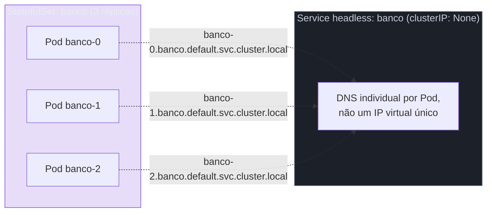
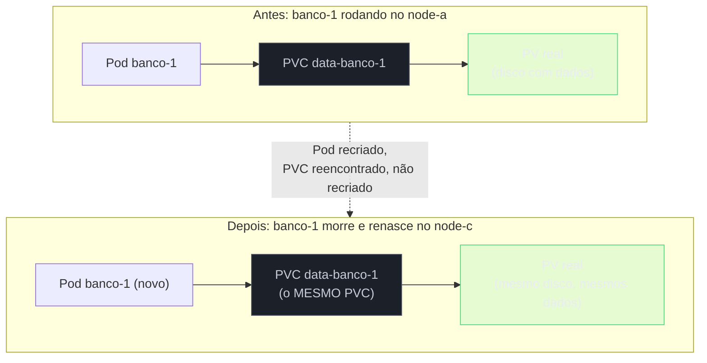
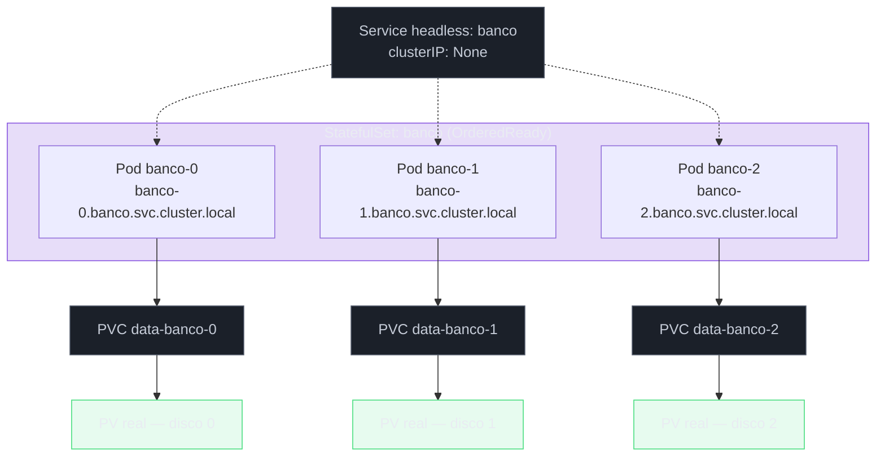

# StatefulSet

> [!abstract] TL;DR
> Um Deployment presume que suas réplicas são intercambiáveis — qualquer uma pode morrer e renascer com nome novo, IP novo, sem que nada distinga a réplica 1 da réplica 2. Um cluster de banco de dados quebra essa presunção pela raiz: a réplica 0 costuma ser a primária, carrega um disco que é dela e só dela, e os outros membros do cluster precisam encontrá-la por um endereço que não muda a cada substituição. O **StatefulSet** é a resposta do Kubernetes a essa exigência de identidade, e ele entrega exatamente três garantias, nenhuma a mais: nome de rede estável por réplica (`app-0`, `app-1`, resolvíveis individualmente via DNS por trás de um Service headless), armazenamento estável por réplica (um PVC próprio, gerado a partir de um `volumeClaimTemplate`, que o Pod recriado reencontra em vez de herdar um disco compartilhado ou vazio), e ordem garantida de criação e término. Nenhuma dessas três garantias, sozinha ou junta, ensina o Kubernetes a fazer failover de banco, coordenar eleição de líder ou restaurar um backup — isso continua sendo conhecimento operacional específico daquele software, não algo que o objeto resolve por construção.

Imagine três réplicas de um banco de dados relacional configurado em cluster — uma primária que aceita escrita, duas secundárias que replicam dela e podem, dependendo da configuração, atender leitura. Isso não é um conjunto de três cópias idênticas de um mesmo template, como um Deployment presume: a réplica 0 sabe que é a primária, as réplicas 1 e 2 sabem que replicam da réplica 0 especificamente, e cada uma escreve num disco que acumulou horas ou dias de dados que não podem ser recriados do zero a partir de nenhuma imagem. Se a réplica 1 morrer e for recriada, ela precisa voltar sendo a réplica 1 de novo — reconectando ao mesmo disco que já tinha, resolvendo o mesmo endereço de rede que os outros membros do cluster já conhecem — não uma réplica genérica qualquer, indistinguível das outras duas, que reinicia a replicação do zero.

Um Deployment não tem vocabulário para nenhuma dessas exigências, e não é falha de design — ele simplesmente foi construído para resolver um problema diferente, o de réplicas genuinamente fungíveis, e aplicar esse mesmo modelo a uma carga com estado é forçar a ferramenta errada contra o problema certo. A nota [[03-Dominios/Tecnologia/Infraestrutura/Kubernetes/04 - Deployment e ReplicaSet|Deployment e ReplicaSet]] já fechou, na sua última seção, exatamente com esse limite: réplicas de um Deployment nascem com nomes gerados por hash, sem ordem garantida de criação, e — se compartilharem armazenamento — compartilhariam o mesmo PVC entre todas, o que não faz sentido nenhum para um disco que precisa ser exclusivo de uma réplica. A nota [[03-Dominios/Tecnologia/Infraestrutura/Kubernetes/09 - Armazenamento|Armazenamento — PV, PVC e StorageClass]] já fechou a metade desse problema — como um disco sobrevive à morte de um Pod — mas deixou em aberto a pergunta mais afiada: como amarrar um PVC específico a uma réplica específica, de forma estável através de qualquer substituição futura. Esta nota fecha as duas lacunas ao mesmo tempo, porque elas são, na prática, a mesma exigência vista de dois ângulos: identidade que sobrevive à recriação.

Vale registrar, antes de entrar no mecanismo, o nome que a comunidade usa com frequência para descrever esse tipo de carga: **workload com estado** (*stateful workload*), em contraste com o **sem estado** (*stateless*) que motivou toda a cadeia Deployment-ReplicaSet. A fronteira entre os dois não é sempre óbvia à primeira vista — uma aplicação pode parecer sem estado no código, mas depender de um cache local em memória que não sobrevive a uma substituição, ou de uma sessão de usuário fixada num Pod específico — e reconhecer com precisão de que lado do limite uma carga está é o primeiro passo, antes de qualquer decisão sobre qual objeto usar.

## As três garantias, uma a uma

### Identidade de rede estável

O StatefulSet nomeia cada Pod com um sufixo **ordinal**, previsível, começando em zero: `banco-0`, `banco-1`, `banco-2`, para um StatefulSet chamado `banco` com três réplicas. Diferente do sufixo de hash aleatório que um ReplicaSet gera para os Pods de um Deployment, esse nome não muda quando o Pod é recriado — um `banco-1` que morre e é substituído renasce, de novo, como `banco-1`, nunca como `banco-9a1c3e7`.

Esse nome estável, sozinho, não bastaria sem um jeito de resolvê-lo pela rede — e é exatamente aqui que o **Service headless**, que a nota [[03-Dominios/Tecnologia/Infraestrutura/Kubernetes/05 - Service|Service]] já preparou explicitamente para este momento, entra como peça obrigatória. Um StatefulSet exige, na sua `spec.serviceName`, o nome de um Service headless (`clusterIP: None`) que compartilha o `selector` do StatefulSet. Esse Service headless não escolhe um IP virtual para balancear entre os Pods — ele devolve, via DNS, o endereço de cada Pod individualmente, e é a combinação do nome ordinal do Pod com o nome do Service headless que produz um endereço DNS individual e estável para cada réplica:

```
banco-0.banco.default.svc.cluster.local
banco-1.banco.default.svc.cluster.local
banco-2.banco.default.svc.cluster.local
```



Um cliente — ou outro membro do mesmo cluster de banco — que precise falar especificamente com a réplica 0, não com "qualquer réplica disponível", resolve `banco-0.banco.default.svc.cluster.local` e chega exatamente àquele Pod, não a um balanceamento entre os três. É essa resolução individual, e não a existência de um ClusterIP comum, que faz o headless Service ser peça obrigatória, não opcional, de qualquer StatefulSet — sem ele, o mecanismo de nomeação ordinal existiria, mas não haveria como alcançar cada réplica pelo nome de forma confiável pela rede.

### Armazenamento estável por réplica

O segundo pilar reaproveita, quase inteiramente, o vocabulário que a nota [[03-Dominios/Tecnologia/Infraestrutura/Kubernetes/09 - Armazenamento|Armazenamento — PV, PVC e StorageClass]] já construiu — só que agora aplicado individualmente a cada réplica, não a um PVC único compartilhado. Em vez de um `volumes:` referenciando um PVC já existente, um StatefulSet declara `volumeClaimTemplates`: um molde de PVC que o controller instancia, uma vez, **para cada réplica**, gerando um PVC dedicado nomeado pela combinação do nome do template com o nome ordinal do Pod.

```yaml
volumeClaimTemplates:
    - metadata:
          name: data
      spec:
          accessModes: ["ReadWriteOnce"]
          storageClassName: fast-ssd
          resources:
              requests:
                  storage: 10Gi
```

Para um StatefulSet chamado `banco` com três réplicas, esse template produz três PVCs distintos:

```bash
kubectl get pvc -l app=banco
# NAME              STATUS   VOLUME       CAPACITY   ACCESS MODES   STORAGECLASS
# data-banco-0      Bound    pvc-3f9a...  10Gi       RWO            fast-ssd
# data-banco-1      Bound    pvc-8e7d...  10Gi       RWO            fast-ssd
# data-banco-2      Bound    pvc-1a2b...  10Gi       RWO            fast-ssd
```

O mecanismo que torna essa associação estável através de recriações é o coração do que este pilar entrega: quando `banco-1` morre e o controller de StatefulSet cria um Pod novo para substituí-lo, esse Pod novo é criado referenciando explicitamente `data-banco-1` — o mesmo PVC, não um novo instanciado a partir do template outra vez. O controller nunca recria um PVC que já existe para aquele ordinal; ele só cria um PVC novo, a partir do template, na primeira vez que aquele ordinal aparece. O Pod pode nascer num node completamente diferente do que rodava antes — o PVC, através do binding com o PV real, segue disponível para ele exatamente como estava, com todo o dado que já continha.



Repare no que essa garantia resolve exatamente, sem prometer nada além disso: ela amarra um PVC a um **ordinal**, não a uma **máquina física**. Se o backend de armazenamento em uso for restrito a uma zona (o mesmo tipo de restrição de topologia que a nota anterior deste galho já descreveu para discos de bloco comuns), o Pod recriado só pode nascer num node daquela mesma zona — a mesma dinâmica de `volumeBindingMode` e afinidade de zona já se aplica aqui, sem nenhuma exceção especial só porque o PVC agora vem de um StatefulSet.

### Ordem: criação, escala e término

O terceiro pilar é o mais visível no dia a dia de quem observa um rollout acontecer: por padrão (`podManagementPolicy: OrderedReady`), o StatefulSet cria réplicas **uma de cada vez**, em ordem estritamente crescente de ordinal, esperando cada Pod ficar `Ready` antes de criar o próximo. `banco-0` precisa estar pronto antes de `banco-1` começar a ser criado; `banco-1` precisa estar pronto antes de `banco-2` começar.

```bash
kubectl apply -f statefulset.yaml
kubectl get pods -l app=banco --watch
```

```
NAME       READY   STATUS              AGE
banco-0    0/1     ContainerCreating   1s
banco-0    1/1     Running             8s
banco-1    0/1     Pending             8s
banco-1    0/1     ContainerCreating   9s
banco-1    1/1     Running             16s
banco-2    0/1     Pending             16s
banco-2    0/1     ContainerCreating   17s
banco-2    1/1     Running             24s
```

Repare que `banco-1` só aparece depois que `banco-0` já está `Running` — não há nenhuma sobreposição, diferente da criação em paralelo que um ReplicaSet faria para réplicas sem identidade própria. Escalar para baixo segue a ordem exatamente inversa: o Pod de **maior** ordinal é removido primeiro, e o controller espera a remoção completar antes de seguir para o próximo — reduzir `banco` de três réplicas para uma remove `banco-2`, espera, depois remove `banco-1`, nunca as duas ao mesmo tempo, e nunca `banco-0` antes das outras duas.

> [!tip] Vídeo — por que Deployment não serve, com um banco na cabeça
> [**Kubernetes StatefulSet simply explained | Deployment vs StatefulSet**](https://www.youtube.com/watch?v=pPQKAR1pA9U) (TechWorld with Nana, ~16 min, EN) chega às mesmas três garantias por um caminho útil: partindo de um exemplo concreto de banco replicado e perguntando o que quebraria se ele rodasse sob um Deployment. Réplicas de aplicação sem estado são **idênticas e intercambiáveis**, e por isso o Deployment pode criá-las em qualquer ordem e com nomes aleatórios; réplicas de um banco não são — há uma que escreve e outras que leem, e uma réplica nova precisa **clonar os dados de uma existente e só então entrar em sincronização contínua**. Daí decorrem, uma a uma, a identidade fixa e previsível, a ordem estrita de criação, e o vínculo entre identidade e volume: como o estado mora no disco, o Pod substituto precisa receber **de volta o mesmo volume**, o que só é possível se ele tiver o mesmo nome. **O que ele não cobre:** `podManagementPolicy: Parallel`, estratégias de atualização com `partition`, a pegadinha de que os PVCs **sobrevivem** à exclusão do StatefulSet, o caso do nó que nunca mais responde, e a expansão de disco em produção.

## Por que a ordem importa — e o preço que ela cobra

A ordem não é burocracia nem cautela genérica — ela existe porque software de cluster de verdade, o tipo de carga que motiva a existência do StatefulSet em primeiro lugar, costuma depender de sequência para formar quorum ou eleger um líder com segurança. Um cluster de banco distribuído, ou um cluster Kafka coordenando partições, frequentemente espera que o primeiro nó (ordinal 0) suba e se estabilize como semente antes de qualquer outro nó tentar se juntar ao cluster — subir todos ao mesmo tempo, sem ordem, pode produzir uma corrida onde nenhum nó sabe ainda quem é o líder, ou onde dois nós tentam assumir a primazia simultaneamente por não terem visto um ao outro a tempo.

O preço honesto dessa garantia é velocidade: um StatefulSet com dez réplicas, cada uma levando trinta segundos para ficar `Ready`, leva cinco minutos inteiros só para subir do zero — contra os poucos segundos que um ReplicaSet levaria criando as dez réplicas em paralelo. Esse mesmo custo se repete em qualquer rolling update sob a estratégia padrão, tratada na próxima seção: cada réplica espera a anterior terminar antes de começar a própria transição. Para cargas que genuinamente não dependem de ordem — um cache distribuído sem coordenação de liderança, por exemplo — pagar esse custo sem necessidade real é desperdício puro, e vale a pena questionar se o StatefulSet é mesmo o objeto certo antes de aceitar a lentidão como inevitável.

### Vendo o Pod reencontrar o próprio PVC

Vale tornar tangível, com as próprias mãos, a afirmação central da seção anterior — que um Pod recriado reencontra o mesmo PVC, não um novo. Apague `banco-1` diretamente e observe tanto o Pod quanto o PVC correspondente:

```bash
kubectl get pvc -l app=banco
kubectl delete pod banco-1
kubectl get pods -l app=banco --watch
```

```
NAME       READY   STATUS        AGE
banco-1    1/1     Terminating   14m
banco-1    0/1     Pending       0s
banco-1    0/1     ContainerCreating   1s
banco-1    1/1     Running       6s
```

O Pod `banco-1` some e reaparece com o mesmo nome — diferente de um Deployment, onde o substituto nasceria com um sufixo de nome totalmente novo. Rodar `kubectl get pvc -l app=banco` de novo, depois da recriação, mostra exatamente os mesmos três PVCs de antes, com o mesmo `VOLUME` (o mesmo UID de PV) associado a `data-banco-1` — nenhum PVC novo foi criado, porque o controller de StatefulSet, ao recriar um Pod para um ordinal que já tinha um PVC provisionado, sempre referencia o existente em vez de instanciar o template de novo. É essa releitura do estado atual — não um evento específico de "este Pod morreu" — que garante a reconexão correta, o mesmo padrão level-triggered que a nota [[03-Dominios/Tecnologia/Infraestrutura/Kubernetes/02 - O loop de reconciliação|O loop de reconciliação]] já descreveu para qualquer outro controller deste galho.

### O estado quebrado que a documentação oficial nomeia explicitamente

Vale registrar, com honestidade, uma armadilha operacional que a própria documentação do Kubernetes nomeia sem rodeios: sob a política padrão `OrderedReady`, é possível um rolling update entrar num estado quebrado que exige intervenção manual para reparar. Isso acontece tipicamente quando um Pod no meio da sequência de atualização entra em `CrashLoopBackOff` ou fica preso, nunca ficando `Ready` — e, como a regra de ordem exige que cada Pod esteja pronto antes do próximo ser tocado, o rollout inteiro trava naquele ponto, sem avançar e sem reverter sozinho. Diferente de um Deployment, cujo `progressDeadlineSeconds` marca a condição `Progressing` como falha depois de um prazo configurável mas continua tentando convergir, um StatefulSet travado dessa forma não tem um mecanismo automático equivalente de "desistir e sinalizar" — o diagnóstico (`kubectl describe pod` no Pod travado, revisão do `spec.template` que gerou a quebra) e a correção (reverter a mudança, ou remover manualmente o Pod problemático) ficam por conta de quem está operando o cluster.

## `podManagementPolicy: Parallel`

Para os casos em que a ordem de criação e término genuinamente não importa — só a identidade de rede e de armazenamento por réplica interessam, não a sequência entre elas — o campo `podManagementPolicy` aceita `Parallel`, que remove a espera sequencial: todos os Pods são criados (ou removidos) ao mesmo tempo, sem que um precise esperar o outro ficar `Ready` primeiro.

```yaml
spec:
    podManagementPolicy: Parallel
```

Vale nomear com precisão o que essa troca preserva e o que ela abre mão: a identidade de rede estável e o armazenamento estável por réplica continuam intactos — `banco-0` continua sendo `banco-0`, com o PVC dele, independente da política de gerenciamento. O que muda é só a garantia de sequência entre réplicas diferentes. Escolher `Parallel` sem checar se a aplicação de fato tolera essa ausência de ordem — se ela não depende de um nó semente específico para formar cluster com segurança — é a armadilha oposta à de aceitar lentidão desnecessária: trocar velocidade por uma corrida de inicialização que a aplicação não estava preparada para tolerar.

## Estratégias de atualização

### `RollingUpdate` e o mecanismo de `partition`

A estratégia padrão, `RollingUpdate`, atualiza réplicas na ordem inversa da criação — do maior ordinal para o menor — esperando cada Pod atualizado ficar `Ready` antes de seguir para o próximo, o mesmo espírito sequencial que já governa criação e término.

```yaml
spec:
    updateStrategy:
        type: RollingUpdate
        rollingUpdate:
            partition: 0
```

O campo `partition` é o mecanismo que embute, diretamente no objeto, algo próximo de um canário controlado sem precisar de nenhuma ferramenta externa: qualquer Pod cujo ordinal seja **menor** que o valor de `partition` não é tocado pela atualização, mesmo que o template do StatefulSet já tenha mudado. Só os Pods com ordinal maior ou igual a `partition` são substituídos.

```bash
kubectl patch statefulset banco -p '{"spec":{"updateStrategy":{"rollingUpdate":{"partition":2}}}}'
kubectl set image statefulset/banco banco=banco:1.2.4
```

Com `partition: 2` num StatefulSet de três réplicas (ordinais 0, 1, 2), só `banco-2` é atualizado — `banco-0` e `banco-1` continuam rodando a imagem antiga, intocados, mesmo que o `spec.template` já referencie a imagem nova. Isso permite observar o comportamento da versão nova numa única réplica, real, em produção, antes de decidir avançar: reduzir `partition` para 1 estende a atualização para `banco-1` também, e `partition: 0` completa a transição para todas. É um canário rudimentar, sem análise automática de métricas — a decisão de quando reduzir o `partition` é manual, ou orquestrada por uma ferramenta externa que observa sinais de saúde e decide avançar — mas o mecanismo de objeto que sustenta esse padrão já vem embutido, sem precisar de nenhum controller adicional.

### `OnDelete`

A segunda estratégia, `OnDelete`, remove qualquer automação: o controller de StatefulSet não substitui nenhum Pod automaticamente quando o template muda — ele só age quando alguém apaga um Pod manualmente, e nesse caso recria aquele Pod específico já com o template novo.

```yaml
spec:
    updateStrategy:
        type: OnDelete
```

É a escolha certa quando a atualização de um cluster com estado exige uma coreografia manual mais cuidadosa do que qualquer automação genérica saberia executar — por exemplo, confirmar que a réplica atualizada terminou de sincronizar com as demais antes de tocar na próxima, uma decisão que depende de métricas internas do próprio banco, não de uma `readinessProbe` genérica.

## A pegadinha operacional grande: PVCs sobrevivem por padrão

Vale nomear, sem meio-termo, o comportamento que mais surpreende quem usa StatefulSet pela primeira vez em produção: apagar um StatefulSet, ou reduzir o número de réplicas, **não apaga os PVCs correspondentes**. Isso é deliberado, não uma omissão — a mesma filosofia de "proteger o dado por padrão" que a nota anterior deste galho já descreveu para `persistentVolumeReclaimPolicy: Retain`, aplicada aqui no nível do próprio StatefulSet.

```bash
kubectl delete statefulset banco
kubectl get pvc -l app=banco
# NAME              STATUS   VOLUME       CAPACITY   ACCESS MODES   STORAGECLASS
# data-banco-0      Bound    pvc-3f9a...  10Gi       RWO            fast-ssd
# data-banco-1      Bound    pvc-8e7d...  10Gi       RWO            fast-ssd
# data-banco-2      Bound    pvc-1a2b...  10Gi       RWO            fast-ssd
```

Os três PVCs continuam `Bound`, os três discos reais continuam existindo, e continuam sendo cobrados pelo provedor de nuvem, mesmo que nenhum Pod, nenhum StatefulSet, nada mais no cluster os esteja usando. O mesmo vale para uma redução de réplicas: escalar `banco` de três para uma remove `banco-2` e `banco-1`, mas `data-banco-2` e `data-banco-1` continuam existindo, prontos para serem reencontrados se a escala voltar a subir depois — o que é exatamente o comportamento desejado quando a intenção é uma redução temporária, mas é também a fonte mais comum de custo de disco esquecido, acumulado silenciosamente ao longo de meses em qualquer conta de nuvem que já rodou StatefulSets de teste sem limpeza deliberada.

Versões mais recentes do Kubernetes introduziram um campo opcional, `persistentVolumeClaimRetentionPolicy`, com duas sub-políticas — `whenDeleted` (o que acontece ao apagar o StatefulSet inteiro) e `whenScaled` (o que acontece ao reduzir réplicas) — cada uma configurável entre `Retain` (o comportamento padrão de sempre) e `Delete` (o PVC é removido automaticamente junto com o Pod correspondente).

```yaml
spec:
    persistentVolumeClaimRetentionPolicy:
        whenDeleted: Retain
        whenScaled: Delete
```

> [!info] Baseline de versão
> `persistentVolumeClaimRetentionPolicy` progrediu de alpha na versão 1.23 para beta na 1.27, e é **estável desde a 1.32** — em cluster corrente, o campo está disponível sem feature gate. Em cluster mais antigo, ele pode não existir, e a limpeza de PVC órfão continua sendo trabalho manual. O que não muda com a versão é o padrão: ambas as sub-políticas nascem em `Retain`, de modo que **nunca se deve presumir `Delete` como comportamento implícito** — a filosofia de proteger o dado a qualquer custo continua sendo o default, e a remoção automática é sempre uma escolha explícita de quem escreve o manifesto.

## O caso especial de um node que nunca mais responde

Vale nomear um cenário que expõe, de forma mais aguda do que qualquer outro, por que identidade estável exige cuidado redobrado: um node onde `banco-1` rodava fica inalcançável — não removido do cluster de forma limpa, apenas silencioso, sem responder mais nada. O mecanismo de detecção de falha de node que a nota [[03-Dominios/Tecnologia/Infraestrutura/Kubernetes/02 - O loop de reconciliação|O loop de reconciliação]] já descreveu (o `Lease` que para de bater, o `NodeStatus` marcado como não pronto) eventualmente torna aquele Pod candidato a recriação em outro node — mas o Kubernetes, por padrão, não tem garantia absoluta de que o processo antigo de fato parou de rodar antes de recriar um novo no lugar, porque um node inalcançável pode estar particionado da rede, não necessariamente morto.

Para a maioria das cargas sem estado, essa ambiguidade é aceitável: dois Pods idênticos rodando ao mesmo tempo, por acidente, raramente causa dano real. Para um StatefulSet com identidade única por réplica — sobretudo um banco que assume, por protocolo, que só existe uma instância respondendo por `banco-1` a qualquer momento — essa mesma ambiguidade é perigosa: duas instâncias pensando que são a mesma réplica, escrevendo no mesmo papel dentro do protocolo de replicação, é exatamente o tipo de cenário de *split-brain* que a disciplina de bancos distribuídos existe para evitar. O Kubernetes oferece uma saída explícita e deliberadamente manual para esse caso — a **remoção forçada** de um Pod:

```bash
kubectl delete pod banco-1 --grace-period=0 --force
```

Esse comando não confirma, de forma alguma, que o processo antigo parou de fato — ele só remove o objeto Pod do etcd, permitindo que o controller de StatefulSet crie um substituto imediatamente. É por isso que a própria documentação oficial trata essa remoção como uma operação que só deveria acontecer depois que quem opera o cluster confirmou, por fora do Kubernetes — acessando o node diretamente, ou tendo certeza de que ele está de fato desligado — que o Pod antigo não está mais escrevendo em lugar nenhum. Usar `--force` como reflexo, sem essa confirmação, é abrir mão precisamente da garantia de identidade única que motivou usar um StatefulSet em primeiro lugar.

## Por que banco de dados em Kubernetes é decisão, não default

Vale fechar o mecanismo com uma honestidade que este galho já pratica desde a primeira nota: o StatefulSet dá as três primitivas descritas aqui — identidade de rede, armazenamento por réplica, ordem — mas não dá, e nunca prometeu dar, nada do que realmente torna um cluster de banco de dados operável com segurança. Ele não sabe fazer backup coordenado com o estado interno do banco. Não sabe decidir quando promover uma réplica secundária a primária depois de uma falha real — a diferença entre "o node está momentaneamente inalcançável" e "a primária morreu de vez e alguém precisa assumir" é uma decisão que exige conhecimento do protocolo de replicação daquele banco específico, não algo genérico que o Kubernetes possa inferir olhando `readinessProbe`. Não sabe restaurar um backup para um ponto específico no tempo (*point-in-time recovery*). Não sabe rebalancear partições de um cluster distribuído depois de adicionar um nó novo.

Esse conhecimento operacional — o que fazer, e quando, diante de cada tipo específico de falha de um banco específico — é exatamente o que um **operator** existe para codificar: um controller customizado, escrito especificamente para aquele software (Postgres, Kafka, Elasticsearch, o que for), que observa o mesmo tipo de `spec` declarativa deste galho, mas reage com lógica que entende o protocolo interno daquela aplicação, não só a contagem genérica de réplicas prontas que um StatefulSet já entende sozinho. Este galho trata operators com profundidade na nota [[03-Dominios/Tecnologia/Infraestrutura/Kubernetes/19 - Operators|Operators]]; aqui basta reconhecer a fronteira: StatefulSet é o alicerce mecânico, operator é a camada que sabe operar o software específico por cima desse alicerce.

> [!warning] A alternativa honesta é considerar um banco gerenciado
> Rodar um StatefulSet de banco de dados sem um operator maduro por trás, numa equipe sem profundidade operacional naquele banco específico, é assumir manualmente todo o trabalho que o operator faria — muitas vezes sem perceber o tamanho do compromisso até o primeiro incidente real de failover malsucedido. Um serviço de banco gerenciado pelo provedor de nuvem terceiriza exatamente esse conhecimento operacional para quem já o tem em produção há anos, ao custo de menos controle e, geralmente, mais dinheiro por unidade de capacidade. Nenhuma das duas opções é universalmente certa; a decisão pertence a [[03-Dominios/Engenharia/Operação/index|Engenharia/Operação]] e a [[03-Dominios/Tecnologia/Cloud/12 - Containers gerenciados/05 - Kubernetes gerenciado de raspão|Kubernetes gerenciado de raspão]], não a este galho, que só descreve o mecanismo do objeto.

## Expandindo o disco de um StatefulSet já em produção

Vale fechar uma ponta solta que a nota anterior deste galho deixou em aberto de propósito: como a expansão de volume (`allowVolumeExpansion`, tratada em [[03-Dominios/Tecnologia/Infraestrutura/Kubernetes/09 - Armazenamento|Armazenamento — PV, PVC e StorageClass]]) se aplica quando o PVC em questão nasceu de um `volumeClaimTemplates`, não de um PVC solto. A resposta tem uma armadilha de nomenclatura própria: editar `spec.resources.requests.storage` dentro do `volumeClaimTemplates` do StatefulSet muda o **molde**, não os PVCs que já existem — um PVC já provisionado, como `data-banco-0`, não é retroativamente expandido só porque o template mudou. A expansão real, para PVCs já existentes, exige editar cada PVC individualmente:

```bash
kubectl patch pvc data-banco-0 -p '{"spec":{"resources":{"requests":{"storage":"20Gi"}}}}'
kubectl patch pvc data-banco-1 -p '{"spec":{"resources":{"requests":{"storage":"20Gi"}}}}'
kubectl patch pvc data-banco-2 -p '{"spec":{"resources":{"requests":{"storage":"20Gi"}}}}'
```

Cada um desses `patch` dispara o mesmo mecanismo de expansão já descrito na nota anterior — o controller de expansão observa a mudança, chama o backend para redimensionar o disco real — só que agora repetido manualmente, réplica por réplica, porque não existe (em nenhuma versão corrente do Kubernetes) um mecanismo que propague uma mudança no `volumeClaimTemplates` retroativamente para PVCs já provisionados. Editar o template continua valendo a pena para consistência futura — qualquer réplica nova, criada depois (por exemplo, ao escalar o StatefulSet), nasce já com o tamanho atualizado — mas não substitui o trabalho de expandir cada PVC existente à mão.

## Manifesto completo: StatefulSet e Service headless

Reunindo os elementos desenvolvidos nesta nota — o Service headless obrigatório, o `volumeClaimTemplates` gerando um PVC por réplica, a estratégia de atualização e a política de retenção:

```yaml
# O Service headless — obrigatório, referenciado por spec.serviceName do StatefulSet.
# Não escolhe um IP virtual; devolve, via DNS, o endereço de cada Pod individualmente.
apiVersion: v1
kind: Service
metadata:
    name: banco
spec:
    clusterIP: None
    selector:
        app: banco
    ports:
        - port: 5432
          targetPort: 5432
---
apiVersion: apps/v1
kind: StatefulSet
metadata:
    name: banco
spec:
    serviceName: banco   # amarra este StatefulSet ao Service headless acima
    replicas: 3

    selector:
        matchLabels:
            app: banco

    # OrderedReady é o padrão; Parallel remove a espera sequencial
    # entre réplicas, quando a aplicação genuinamente não depende de ordem.
    podManagementPolicy: OrderedReady

    updateStrategy:
        type: RollingUpdate
        rollingUpdate:
            partition: 0   # 0 = atualiza todas; um valor maior protege ordinais menores

    # PVCs sobrevivem por padrão (Retain/Retain); Delete remove
    # automaticamente o PVC correspondente na condição declarada.
    persistentVolumeClaimRetentionPolicy:
        whenDeleted: Retain
        whenScaled: Retain

    template:
        metadata:
            labels:
                app: banco
        spec:
            containers:
                - name: banco
                  image: postgres:16
                  ports:
                      - containerPort: 5432
                  volumeMounts:
                      - name: data
                        mountPath: /var/lib/postgresql/data
                  readinessProbe:
                      exec:
                          command: ["pg_isready", "-U", "postgres"]
                      initialDelaySeconds: 10
                      periodSeconds: 5

    # Instanciado uma vez POR RÉPLICA — cada Pod recebe seu próprio PVC,
    # nomeado "data-banco-0", "data-banco-1", "data-banco-2".
    volumeClaimTemplates:
        - metadata:
              name: data
          spec:
              accessModes: ["ReadWriteOnce"]
              storageClassName: fast-ssd
              resources:
                  requests:
                      storage: 10Gi
```

## Diagrama: a relação completa



Repare que cada réplica carrega três identidades amarradas simultaneamente — o nome ordinal do Pod, o endereço DNS individual via headless Service, e o PVC próprio — e é a soma das três, não qualquer uma isolada, que produz a identidade estável completa que motivou a existência deste objeto. Um StatefulSet que só tivesse a ordem, sem o `volumeClaimTemplates`, ainda deixaria réplicas competindo por um disco compartilhado; um que só tivesse os PVCs individuais, sem o Service headless, ainda deixaria os membros do cluster sem um jeito confiável de se encontrarem uns aos outros pelo nome.

## Recapitulando: Deployment contra StatefulSet

| Aspecto | Deployment | StatefulSet |
| --- | --- | --- |
| Nome do Pod | Hash aleatório, muda a cada substituição | Ordinal estável (`app-0`, `app-1`), nunca muda |
| Ordem de criação | Paralela, sem garantia | Sequencial (`OrderedReady`) ou paralela (`Parallel`), à escolha |
| Armazenamento | Um PVC compartilhado entre réplicas, ou nenhum | Um PVC exclusivo por réplica, via `volumeClaimTemplates` |
| Endereço de rede | ClusterIP único, balanceado entre réplicas | DNS individual por Pod, via Service headless obrigatório |
| PVC ao apagar/escalar | Não se aplica da mesma forma — réplicas não têm PVC próprio | Sobrevive por padrão (`Retain`); `Delete` é opt-in explícito |
| Caso de uso típico | Aplicação sem estado, réplicas fungíveis | Banco de dados, filas distribuídas, qualquer cluster com quorum |

Vale marcar, para fechar a comparação, o mesmo tipo de fronteira honesta que a nota [[03-Dominios/Tecnologia/Infraestrutura/Kubernetes/04 - Deployment e ReplicaSet|Deployment e ReplicaSet]] já traçou para o objeto irmão: nada nesta tabela substitui a decisão de arquitetura sobre se uma carga de fato precisa de estado próprio por réplica, ou se um redesenho da aplicação — movendo o estado para um serviço externo, tratando cada réplica como sem estado de verdade — eliminaria a necessidade de StatefulSet inteiramente. Um StatefulSet usado por hábito, para uma aplicação que na prática poderia ser stateless com um pequeno redesenho, herda toda a lentidão de ordem e toda a complexidade de PVCs individuais sem nenhum benefício real em troca — a mesma armadilha que o monólito deste galho já registrou como "StatefulSet em vez de Deployment quando não precisa".

## Armadilhas comuns

> [!warning] Esquecer o Service headless e se perguntar por que o StatefulSet "não funciona"
> Um StatefulSet sem `spec.serviceName` apontando para um Service headless existente falha na criação, ou — dependendo da versão e configuração — cria os Pods sem nenhum registro DNS individual resolvível. A identidade ordinal do Pod, sozinha, não produz identidade de rede nenhuma sem o Service headless por trás resolvendo cada nome individualmente.

> [!warning] Achar que apagar o StatefulSet limpa os discos
> PVCs gerados por `volumeClaimTemplates` sobrevivem, por padrão, tanto à remoção do StatefulSet quanto à redução de réplicas — comportamento deliberado de segurança, não bug. Sem configurar `persistentVolumeClaimRetentionPolicy` para `Delete` explicitamente (ou limpar os PVCs manualmente), discos de testes descartados se acumulam, cobrando do provedor de nuvem indefinidamente sem que ninguém perceba.

> [!warning] Usar `Parallel` sem checar se a aplicação depende de ordem para formar cluster
> `podManagementPolicy: Parallel` remove a espera sequencial entre réplicas, mas não pergunta se a aplicação genuinamente tolera isso. Softwares que dependem de um nó semente subir primeiro para formar quorum com segurança podem entrar numa corrida de inicialização sob `Parallel`, mesmo mantendo identidade de rede e armazenamento estáveis — a ordem removida era, para essa aplicação específica, parte do contrato de correção, não só uma cautela genérica.

> [!warning] Editar `volumeClaimTemplates` e achar que PVCs já existentes foram atualizados
> Uma mudança em `spec.resources.requests.storage` dentro do `volumeClaimTemplates` só afeta PVCs futuros, criados a partir daquele ponto em diante — nenhum PVC já provisionado é expandido retroativamente. Expandir o armazenamento de réplicas já em produção exige editar cada PVC individualmente, réplica por réplica, além de atualizar o template para manter consistência com qualquer réplica nova.

> [!warning] Esperar que o StatefulSet, sozinho, faça failover de banco de dados
> Nenhuma das três garantias deste objeto decide qual réplica deveria assumir como primária depois de uma falha real, nem coordena esse tipo de decisão com o protocolo interno do banco. Tratar o StatefulSet como suficiente para produção sem um operator ou disciplina operacional equivalente por trás é confundir o alicerce mecânico com a operação completa.

> [!warning] Usar `--force` num Pod sem confirmar que o node de fato parou
> A remoção forçada (`--grace-period=0 --force`) não verifica, de forma nenhuma, se o processo antigo realmente parou de rodar — ela só apaga o registro do Pod no cluster, liberando o controller para criar um substituto com a mesma identidade. Num StatefulSet cuja aplicação assume identidade única por réplica, isso pode produzir duas instâncias respondendo pelo mesmo papel ao mesmo tempo, se o node antigo só estava particionado da rede, não desligado de verdade.

> [!warning] Trocar `partition` sem entender que ele protege por ordinal, não por porcentagem
> `partition: N` protege todo Pod com ordinal **menor** que `N`, não uma fração aleatória das réplicas. Num StatefulSet com réplicas numeradas de forma significativa (a réplica 0 sendo a primária, por exemplo), um valor de `partition` mal escolhido pode acabar atualizando exatamente a réplica mais sensível primeiro, em vez de guardá-la para o fim do canário — o oposto do que a maioria das equipes pretende ao usar esse mecanismo.

## Como explicar em inglês

| Português | English |
| --- | --- |
| O StatefulSet dá identidade estável por réplica, não intercambiabilidade | StatefulSet gives per-replica stable identity, not interchangeability |
| Cada réplica tem seu próprio PVC, gerado por um template | Each replica gets its own PVC, generated from a template |
| O nome ordinal nunca muda quando o Pod é recriado | The ordinal name never changes when the Pod is recreated |
| O Service headless resolve cada Pod individualmente via DNS | The headless Service resolves each Pod individually via DNS |
| PVCs sobrevivem à remoção do StatefulSet por padrão | PVCs survive StatefulSet deletion by default |
| `partition` implementa um canário embutido no próprio objeto | `partition` implements a canary built directly into the object |
| Um operator codifica o conhecimento operacional que o StatefulSet não tem | An operator encodes the operational knowledge the StatefulSet doesn't have |
| A ordem custa velocidade em troca de segurança de formação de cluster | Ordering trades speed for safe cluster formation |

## O que vem a seguir

Deployment e StatefulSet cobrem, juntos, todo processo pensado para rodar indefinidamente — sem estado ou com estado, intercambiável ou com identidade própria, mas sempre de pé, sempre reconciliado de volta se morrer. Falta uma categoria de trabalho inteiramente diferente: aquele que tem começo, meio e fim por definição, e que **deveria** parar de existir quando termina, não ser recriado para sempre pelo mesmo loop que mantém um servidor web no ar. Um script de migração de banco, um relatório que roda toda madrugada, um job de backup periódico — nenhum desses se encaixa no vocabulário deste galho até aqui. Essa lacuna é o assunto da próxima nota: [[03-Dominios/Tecnologia/Infraestrutura/Kubernetes/11 - Job, CronJob e DaemonSet|Job, CronJob e DaemonSet]].

## Fontes

- [Kubernetes documentation — StatefulSets](https://kubernetes.io/docs/concepts/workloads/controllers/statefulset/)
- [Kubernetes documentation — StatefulSet Basics (tutorial)](https://kubernetes.io/docs/tutorials/stateful-application/basic-stateful-set/)
- [Kubernetes documentation — Persistent Volumes](https://kubernetes.io/docs/concepts/storage/persistent-volumes/)
- [Kubernetes documentation — Service (headless Services)](https://kubernetes.io/docs/concepts/services-networking/service/#headless-services)
- [Kubernetes API Reference — StatefulSetSpec](https://kubernetes.io/docs/reference/generated/kubernetes-api/v1.30/#statefulsetspec-v1-apps)
- [Kubernetes documentation — Running a Replicated Stateful Application](https://kubernetes.io/docs/tasks/run-application/run-replicated-stateful-application/)
- [Kubernetes documentation — Force Delete StatefulSet Pods](https://kubernetes.io/docs/tasks/run-application/force-delete-stateful-set-pod/)
