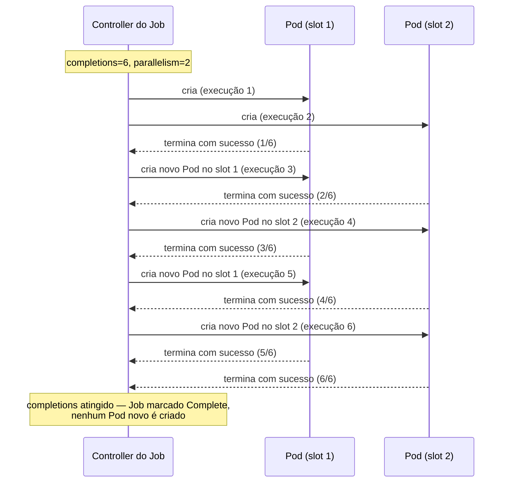
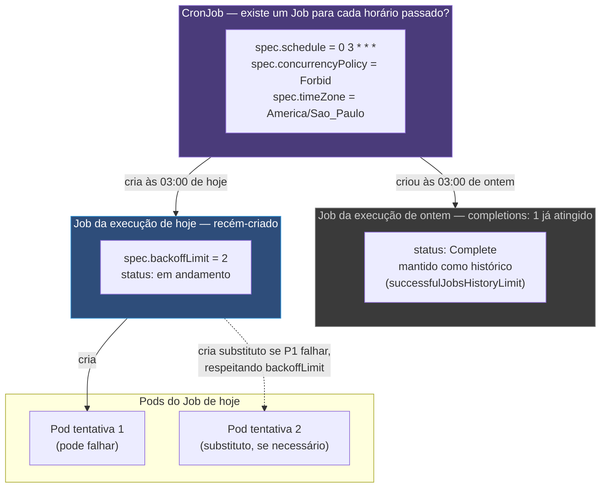

# Job, CronJob e DaemonSet

> [!abstract] TL;DR
> Nem toda carga é um servidor de longa duração. Uma migração de banco, um relatório noturno e um coletor de log presente em cada máquina do cluster não são "servidores web" — e rodar qualquer um deles como Deployment produz um comportamento absurdo, porque para o Deployment "o processo terminou" é sinônimo de "o processo caiu", e ele reage recriando o Pod para sempre. Job, CronJob e DaemonSet são a resposta do Kubernetes a três formas diferentes de "estado desejado" que não são "N réplicas rodando indefinidamente": para o Job, estado desejado é *N execuções concluídas com sucesso*; para o CronJob, é *existe um Job para cada horário que já passou*; para o DaemonSet, é *existe um Pod em cada nó que casa com o critério*. Nenhum dos três é um tipo especial de mecanismo — é o mesmo laço observar-comparar-agir descrito em [[03-Dominios/Tecnologia/Infraestrutura/Kubernetes/02 - O loop de reconciliação|O loop de reconciliação]], só que respondendo a uma pergunta diferente sobre o que conta como "convergido".

Imagine três cenários banais do dia a dia de qualquer time que roda aplicações em produção. O primeiro: uma migração de schema precisa rodar exatamente uma vez, antes de uma nova versão da aplicação subir, e depois disso não há mais nada para fazer — o processo termina, e terminar é o objetivo, não uma falha. O segundo: todo dia às três da manhã, um relatório precisa ser gerado a partir dos dados acumulados no dia anterior, rodar por alguns minutos, e desaparecer até o dia seguinte. O terceiro: cada nó do cluster, sem exceção, precisa ter um agente coletando logs e enviando para um sistema central — não três agentes, não um agente só num nó qualquer, um agente por nó, sempre, inclusive nos nós que entrarem no cluster depois.

Nenhum desses três cenários é "um Deployment com replicas: 1". Se alguém empacotar a migração de banco como Deployment, o container termina com código de saída zero — sucesso, no vocabulário de qualquer pessoa que já rodou aquele script manualmente — e o ReplicaSet controller, vendo que existem 0 Pods `Running` contra uma spec que pede 1, recria o Pod imediatamente. A migração roda de novo. E de novo. Até alguém notar o loop e apagar o Deployment às pressas, ou até a migração não ser mais idempotente e quebrar o banco na segunda execução. O Deployment nunca foi desenhado para saber a diferença entre "o processo morreu porque falhou" e "o processo terminou porque tinha um trabalho finito para fazer" — para o loop descrito em [[03-Dominios/Tecnologia/Infraestrutura/Kubernetes/04 - Deployment e ReplicaSet|Deployment e ReplicaSet]], as duas situações são idênticas: existem menos Pods `Running` do que `spec.replicas` pede, e a ação correta é sempre criar mais um.

Esta nota descreve os três objetos que existem precisamente para expressar um estado desejado diferente desse. Cada um reaproveita o vocabulário já estabelecido neste galho — `spec` contra `status`, controllers level-triggered, `selector` por labels, `ownerReferences` — e aplica esse vocabulário a uma pergunta de convergência que não é "quantas réplicas de longa duração existem", mas sim "o trabalho terminou", "existe um Job para este horário" ou "existe um Pod neste nó".

## Job: o critério de sucesso é terminar, não continuar rodando

Um **Job** cria um ou mais Pods e garante que um número declarado deles termine com sucesso. A diferença central em relação ao ReplicaSet, que a nota 04 já descreveu, está exatamente aqui: o ReplicaSet compara "quantos Pods `Running` existem" contra `spec.replicas`; o Job compara "quantas execuções **terminaram com sucesso**" contra `spec.completions`. Um Pod que termina com código de saída zero não é motivo para o controller de Job criar outro Pod no lugar — é exatamente o resultado que ele estava esperando. É essa mudança de critério, sozinha, que resolve o absurdo descrito na abertura desta nota.

Dois campos governam a forma da execução. `spec.completions` declara quantas execuções bem-sucedidas são necessárias para o Job ser considerado concluído — o padrão, quando omitido, é 1, o caso mais comum de todos: uma tarefa única que precisa rodar uma vez. `spec.parallelism` declara quantos Pods podem rodar ao mesmo tempo enquanto o Job ainda não atingiu `completions` — o padrão, também, é 1. A combinação desses dois campos produz três padrões de uso bem diferentes entre si, e vale nomear cada um, porque a literatura de Kubernetes os trata como formas canônicas:

**Trabalho único** (`completions: 1`, `parallelism: 1`, ou ambos omitidos): um Pod roda, termina com sucesso, o Job está concluído. É o caso da migração de banco da abertura — não há nada para paralelizar, e uma única execução bem-sucedida é o objetivo inteiro.

**Fila de trabalho de tamanho fixo, conhecido de antemão** (`completions: N`, `parallelism: P` com `P > 1`): o Job precisa de N execuções bem-sucedidas no total, mas pode rodar até P delas simultaneamente. Um lote de mil imagens a processar, com `completions: 1000` e `parallelism: 20`, mantém até vinte Pods trabalhando ao mesmo tempo até acumular mil sucessos — o controller de Job cria um Pod novo assim que outro termina, sempre respeitando o teto de paralelismo, exatamente como o ReplicaSet mantém uma contagem-alvo, só que a contagem aqui é de sucessos acumulados, não de Pods vivos neste instante.

**Fila de trabalho de tamanho desconhecido** (`completions` omitido, `parallelism: P`): esse é o padrão menos intuitivo dos três. Sem `completions` declarado, o Job não sabe de antemão quantas execuções bem-sucedidas bastam — a decisão de "acabou" fica com os próprios Pods, tipicamente consumindo itens de uma fila externa (uma fila de mensagens, por exemplo) até ela ficar vazia, e então cada Pod termina com sucesso por conta própria. O Job, nesse modo, é considerado concluído quando **qualquer** Pod termina com sucesso e não há mais Pods ativos — o controller não está mais contando contra um alvo fixo, está observando que o trabalho, definido externamente, acabou. Esse padrão é o mais raro dos três em manifestos comuns, exatamente porque exige uma fila externa coordenando o fim do trabalho, algo que o Job sozinho não modela.

`spec.backoffLimit` declara quantas vezes o Job tenta de novo antes de desistir e marcar a execução como falha — o padrão, segundo a documentação oficial, é 4. Cada tentativa que falha entra num backoff que cresce a cada retentativa, aplicado pelo controller de Job antes de criar o próximo Pod substituto, o mesmo padrão de retry gradual já visto no comportamento do `kubelet` puxando uma imagem inexistente, descrito na nota 02 deste galho.

```yaml
apiVersion: batch/v1
kind: Job
metadata:
    name: importa-lote-de-imagens
spec:
    completions: 1000        # 1000 execuções bem-sucedidas são o alvo
    parallelism: 20          # até 20 Pods rodando ao mesmo tempo
    backoffLimit: 6          # tentativas antes de desistir e marcar Failed
    activeDeadlineSeconds: 3600   # corta o Job inteiro se passar de 1h
    ttlSecondsAfterFinished: 86400  # remove o Job (e seus Pods) 24h depois de terminar
    template:
        spec:
            restartPolicy: OnFailure
            containers:
                - name: worker
                  image: importador-de-imagens:2.1
                  command: ["./processa-proximo-item.sh"]
```

`spec.template.spec.restartPolicy` — a mesma `restartPolicy` já descrita na nota 03 deste galho, aqui restrita a duas opções: um Pod de Job só aceita `Never` ou `OnFailure`, nunca `Always`, porque `Always` reintroduziria exatamente o absurdo que este objeto existe para evitar — um container que termina seria sempre reiniciado, e "terminar com sucesso" deixaria de ser um estado alcançável. A diferença prática entre as duas opções permitidas importa mais do que parece à primeira vista: `OnFailure` reinicia o **container dentro do mesmo Pod** quando ele falha, preservando o mesmo Pod, o mesmo nome, o mesmo objeto; `Never` nunca reinicia o container — em vez disso, é o **controller de Job** quem cria um **Pod inteiro novo** para tentar de novo, descartando o Pod que falhou. `Never` costuma ser a escolha certa quando o histórico dos Pods que falharam importa para depuração (cada tentativa fica visível como um objeto Pod separado, inspecionável); `OnFailure` costuma ser mais econômico em ambientes com muitas tentativas esperadas, porque reaproveita o mesmo Pod em vez de acumular objetos.

`spec.activeDeadlineSeconds` corta o Job inteiro — não uma tentativa individual, o Job como um todo — se ele ainda estiver ativo depois de tantos segundos quanto declarado, independentemente de quantas tentativas de `backoffLimit` já foram consumidas. É a rede de segurança contra trabalho que travou: um script que entrou em loop infinito, uma consulta a um banco que nunca retorna, um Pod preso em `Pending` esperando um recurso que nunca vai ficar disponível.

`spec.ttlSecondsAfterFinished` resolve um problema real e silencioso de qualquer cluster que roda muitos Jobs: por padrão, um Job concluído — com sucesso ou com falha — **não desaparece sozinho**. Ele continua existindo indefinidamente, junto com os Pods que ele criou, até alguém removê-lo manualmente. Um pipeline de CI que dispara um Job por execução, sem essa configuração, acumula centenas ou milhares de Jobs zerados ao longo de meses, cada um com seus Pods correspondentes ocupando espaço no etcd e poluindo qualquer `kubectl get jobs`. Declarar `ttlSecondsAfterFinished` delega essa limpeza a um controller dedicado, que remove o Job (e, em cascata, via `ownerReferences`, os Pods que pertenciam a ele) um número fixo de segundos depois que o Job entrou em `Complete` ou `Failed`.

### Indexed Job: um índice fixo por Pod

Existe um modo de Job, ativado com `completionMode: Indexed`, em que cada Pod criado recebe um índice fixo — de 0 a `completions - 1` — disponível para o próprio container via variável de ambiente e anotação. É útil precisamente para particionar trabalho de forma determinística: em vez de todos os Pods de uma fila de tamanho fixo competirem por itens de uma fila externa compartilhada, cada Pod sabe, desde o nascimento, exatamente qual fatia do trabalho total lhe cabe — o Pod de índice 3, por exemplo, pode ser instruído a processar só o arquivo de número 3 de um lote de N arquivos, sem precisar de nenhuma coordenação externa entre os Pods.

> [!info] Baseline de versão
> O Indexed Job (`completionMode: Indexed`) é uma funcionalidade estável (GA) na API `batch/v1` em versões correntes de Kubernetes; foi promovido de beta para estável em uma release anterior ao ciclo 1.3x usado como referência neste galho. Antes dele, particionar trabalho exigia coordenação externa (uma fila de mensagens, um índice gerado manualmente por variável de ambiente injetada de fora). Vale conferir o estágio exato na versão do cluster em uso — a documentação oficial de Jobs é a fonte de verdade, e o comportamento em si (índice fixo por Pod, exposto ao container) é estável há tempo suficiente para não mudar entre patch releases.

```yaml
apiVersion: batch/v1
kind: Job
metadata:
    name: particiona-arquivo-grande
spec:
    completions: 8
    parallelism: 8
    completionMode: Indexed   # cada Pod recebe um índice de 0 a 7
    template:
        spec:
            restartPolicy: Never
            containers:
                - name: worker
                  image: particionador:1.0
                  # JOB_COMPLETION_INDEX é injetado automaticamente pelo Job controller
                  command: ["./processa-particao.sh", "$(JOB_COMPLETION_INDEX)"]
```

### Vendo a fila de trabalho em paralelo, em câmera lenta

A melhor forma de internalizar a diferença entre `completions` e `parallelism` é observar um Job de fila fixa convergindo ao vivo, do mesmo jeito que a nota 02 deste galho recomendou para a convergência de um Deployment. Aplique o manifesto de `importa-lote-de-imagens` mostrado acima (ajustando `completions` para um número pequeno, digamos 6, e `parallelism` para 2, para caber num terminal) e acompanhe:

```bash
kubectl apply -f job.yaml
kubectl get pods -l batch.kubernetes.io/job-name=importa-lote-de-imagens --watch
```

A sequência de eventos observada mostra o controller de Job nunca criando mais do que dois Pods simultâneos — o teto de `parallelism` — mesmo com seis execuções ainda faltando no início. Assim que um dos dois Pods ativos termina com sucesso, o controller cria um Pod novo para ocupar a vaga liberada, mantendo o paralelismo no teto até `completions` ser atingido; nos últimos ciclos, com menos trabalho restante do que o teto de paralelismo, o número de Pods ativos cai naturalmente, porque não há mais sentido em manter dois Pods disputando as últimas execuções que faltam.



Repare que, em nenhum momento dessa sequência, o controller de Job precisou de nenhuma lista central de "quais execuções já rodaram" — ele só compara, a cada rodada do laço, quantos Pods terminaram com sucesso (via `status.succeeded`) contra `spec.completions`, e quantos Pods estão ativos agora contra `spec.parallelism`. É o mesmo par spec-contra-status de sempre, só que aplicado a uma contagem de sucessos acumulados em vez de uma contagem de réplicas vivas neste instante.

### As labels que o Job gera sozinho, e por que o `selector` de um Job é imutável

Assim como um ReplicaSet amarra seus Pods por `selector`, um Job faz o mesmo — mas com uma diferença que vale nomear: o `spec.selector` de um Job é, na prática, **gerado automaticamente** pelo próprio controller a partir de um rótulo com o UID do Job (exposto como `batch.kubernetes.io/controller-uid`), não escrito manualmente por quem redige o manifesto. Junto a ele, o controller aplica a cada Pod criado a label `batch.kubernetes.io/job-name`, com o nome do Job que o originou — é essa label, e não uma convenção de nome de Pod, que sustenta consultas como:

```bash
kubectl get pods --selector=batch.kubernetes.io/job-name=importa-lote-de-imagens
```

Como o `selector` amarra a identidade do Job aos Pods que ele reconhece como seus, ele é, pelo mesmo motivo já explicado para o Deployment na nota 04, imutável depois de criado — o Kubernetes rejeita qualquer tentativa de editá-lo num Job já existente. Declarar manualmente um `spec.selector` customizado (via `manualSelector: true`) é uma via de escape rara, documentada, mas fora do caminho comum: existe para casos avançados de adoção de Pods pré-existentes por um Job, não para uso cotidiano.

### Política de falha por Pod: indo além do `backoffLimit` cru

`backoffLimit` conta falhas de forma cega — qualquer código de saída diferente de zero consome uma tentativa do orçamento, sem distinguir "esse erro vale a pena tentar de novo" de "esse erro nunca vai se resolver tentando de novo". Existe um campo mais fino, `spec.podFailurePolicy`, que permite declarar regras baseadas no código de saída específico do container ou em condições do Pod — por exemplo, tratar um código de saída específico como falha definitiva do Job inteiro (sem consumir tentativas de `backoffLimit` tentando de novo, porque tentar de novo não mudaria o resultado), ou, ao contrário, tratar uma falha causada por despejo do nó (`Evicted`, sem relação nenhuma com o código do programa em si) como algo que não deveria contar contra o orçamento de tentativas.

> [!info] Baseline de versão
> `spec.podFailurePolicy` é **estável desde a versão 1.31**, e ligado por padrão a partir dela. Em cluster mais antigo, o campo pode não existir ou depender de feature gate — e nesse caso `backoffLimit`, combinado com `activeDeadlineSeconds`, continua sendo o único controle disponível. Vale notar um efeito colateral documentado de ligar uma política de falha: para Jobs que a definem, o `podReplacementPolicy` passa a ser obrigatoriamente `Failed`, ou seja, o controller só cria o Pod substituto depois que o Pod anterior atinge de fato a fase `Failed`, em vez de criá-lo assim que o anterior começa a terminar.

## A armadilha central do Job: ele não garante execução única

O nome "Job" e a ideia de "rodar até completar" costumam sugerir, erradamente, uma garantia mais forte do que o objeto de fato oferece: alguém tende a assumir que um Job garante que o trabalho aconteceu **exatamente uma vez**. Não é o que ele garante. O Job garante que existiu, no mínimo, uma execução que terminou com sucesso — mas o caminho até essa execução bem-sucedida pode envolver mais de um Pod tentando o mesmo trabalho, e em certos cenários mais de um Pod pode até chegar a rodar simultaneamente sobre o mesmo item de trabalho.

O cenário mais comum onde isso aparece: um Pod de Job é agendado num nó, começa a rodar, e o nó cai — não crasha o processo, o nó inteiro fica inalcançável, exatamente o cenário de partição de rede descrito na nota 02 deste galho. O controller de Job, ao perceber (via o mesmo mecanismo de `NodeStatus`/`Lease` já descrito naquela nota) que o Pod não está mais correspondendo ao que se espera dele, cria um Pod substituto para tentar de novo. Mas o processo original pode não ter morrido de verdade — ele pode ter continuado rodando no nó que ficou temporariamente inalcançável, e ter terminado seu trabalho de qualquer forma, sem que o controller tivesse como saber disso no momento em que decidiu recriar. Se aquele trabalho grava um registro num banco, envia um e-mail, ou cobra um cartão de crédito, a recriação do Pod pode produzir o mesmo efeito colateral duas vezes.

Essa não é uma falha de implementação corrigível numa versão futura — é uma consequência direta e inevitável do mesmo modelo level-triggered que torna o Kubernetes resiliente a todo o resto: o controller nunca tem uma garantia perfeita e instantânea de que um Pod morreu de verdade, só de que ele parou de responder por tempo suficiente para ser tratado como morto. É exatamente o mesmo princípio que a nota 02 já exigiu da função de reconciliação de qualquer controller — **idempotência** — só que aplicado uma camada acima: não é mais só o controller que precisa ser idempotente ao reagir a um evento perdido, é o **trabalho que o Pod executa** que precisa tolerar ser executado mais de uma vez sem produzir um resultado incorreto. Uma migração de schema escrita como `ALTER TABLE ADD COLUMN` sem checagem de existência prévia falha na segunda execução (o que, ironicamente, é mais seguro do que ter sucesso silencioso duas vezes); um script que envia um e-mail de notificação sem nenhuma marca de "já enviado" manda dois e-mails. Projetar o trabalho dentro de um Job para ser seguro sob reexecução — checar antes de agir, usar chaves de idempotência, tornar a operação uma atualização que converge para o mesmo estado final não importa quantas vezes rodar — não é um refinamento opcional; é o mesmo contrato que sustenta o Kubernetes inteiro, só que agora é responsabilidade de quem escreve o script, não do controller.

> [!warning] A prática operacional completa de migrations e de resiliência sob falha fica em Operação
> Esta nota descreve o mecanismo do objeto Job e a exigência estrutural de idempotência que ele impõe. A prática completa de rodar migrations de banco com segurança em produção — janelas de compatibilidade entre versões, migrations expand/contract, como coordenar uma migration com um rollout de Deployment em andamento — pertence a [[03-Dominios/Engenharia/Operação/2 - Entrega e release/04 - Migrations de banco em produção|Migrations de banco em produção]]. E o vocabulário mais amplo de projetar trabalho tolerante a reexecução e a falhas parciais, incluindo padrões que vão além de um único Job, pertence a [[03-Dominios/Engenharia/Operação/3 - Rodar em produção/06 - Resiliência operacional|Resiliência operacional]].

## CronJob: um controller que cria Jobs por horário

Um **CronJob** não roda trabalho diretamente — ele cria objetos **Job**, um para cada horário programado, e delega a esse Job (com o mecanismo inteiro já descrito acima) a responsabilidade de fato de rodar Pods até completar. A cadeia é CronJob → Job → Pods, com dois elos de controller distintos, cada um reconciliando seu próprio pedaço do problema, exatamente na mesma lógica de composição que a nota 04 já descreveu para Deployment → ReplicaSet → Pods.

`spec.schedule` usa a sintaxe cron padrão de cinco campos (minuto, hora, dia do mês, mês, dia da semana) — `"0 3 * * *"` para todo dia às três da manhã, `"*/15 * * * *"` para a cada quinze minutos. Historicamente, sem nenhuma configuração adicional, esse horário é interpretado no fuso horário local do processo `kube-controller-manager` que hospeda o controller de CronJob — um detalhe que surpreendia (e ainda surpreende, em clusters mais antigos) quem esperava o fuso do próprio cluster ou da própria organização. O campo `spec.timeZone`, estável desde a versão 1.27 do Kubernetes segundo a documentação oficial, resolve isso de forma explícita: aceita o nome de um fuso horário da base tz (como `"America/Sao_Paulo"` ou `"Etc/UTC"`), e o `schedule` passa a ser interpretado naquele fuso, independentemente de onde o control plane está rodando. Embutir o fuso diretamente na string de `schedule`, via prefixos como `CRON_TZ=` ou `TZ=`, não é suportado oficialmente e é rejeitado pela validação em versões correntes — `spec.timeZone` é o único caminho suportado.

`spec.concurrencyPolicy` decide o que fazer quando chega a hora de um novo horário programado e o Job do horário anterior ainda não terminou — um cenário mais comum do que parece, especialmente para trabalho cuja duração varia (um relatório que às vezes leva dois minutos, às vezes leva quinze). Três valores, cada um resolvendo ou destruindo um cenário concreto diferente:

`Allow` (o padrão) deixa os dois Jobs coexistirem, rodando ao mesmo tempo. É seguro quando o trabalho é idempotente e independente entre execuções — um relatório que lê um snapshot fixo dos dados de ontem não sofre por rodar em paralelo com o relatório de hoje, mesmo que se sobreponham. É perigoso quando as duas execuções competem pelo mesmo recurso exclusivo: dois processos de backup gravando no mesmo arquivo de destino ao mesmo tempo corrompem o resultado, não dobram o trabalho útil.

`Forbid` recusa criar o novo Job enquanto o anterior ainda estiver ativo — o horário perdido simplesmente não gera uma execução, e o próximo horário programado é a próxima chance. É a escolha certa quando rodar duas instâncias simultâneas seria pior do que pular uma execução inteira: uma migração de dados que não pode ter duas cópias mexendo na mesma tabela ao mesmo tempo.

`Replace` cancela o Job anterior ainda em andamento (removendo seus Pods) e cria o novo no lugar. Faz sentido quando só o resultado mais recente importa, e um resultado antigo, atrasado, não tem valor mesmo que termine: um job que sincroniza um cache com o estado mais atual de uma fonte externa não ganha nada em deixar uma sincronização desatualizada terminar depois que uma mais nova já começou.

`spec.startingDeadlineSeconds` é onde o CronJob costuma "simplesmente parar de funcionar" de um jeito que assusta quem não conhece o mecanismo por dentro. Esse campo declara quanto tempo, depois do horário programado, o controller ainda tenta criar o Job correspondente antes de desistir daquele horário específico e tratá-lo como perdido — útil quando o próprio controller ficou fora do ar (por manutenção, por reinício do control plane) durante uma janela e, ao voltar, encontra vários horários que já passaram sem execução correspondente. Sem esse campo declarado, o comportamento padrão é mais tolerante: o controller tenta recuperar horários perdidos dentro de um limite embutido. Esse limite embutido é o detalhe que costuma surpreender: a documentação oficial estabelece um teto rígido de **cem horários perdidos** — se o controller de CronJob ficar fora do ar (ou simplesmente não conseguir criar Jobs, por qualquer motivo) por tempo suficiente para acumular mais de cem execuções perdidas sem conseguir processá-las, ele **para de tentar recuperar esse CronJob inteiramente**, registra um evento de erro, e o CronJob fica efetivamente inerte até alguém intervir manualmente. É esse teto, não um bug, que produz o sintoma "meu CronJob simplesmente parou de rodar, sem erro óbvio nenhum" depois de uma manutenção prolongada do cluster — vale sempre conferir os eventos do objeto CronJob (`kubectl describe cronjob`) diante desse sintoma, antes de suspeitar de qualquer outra causa.

`spec.successfulJobsHistoryLimit` (padrão 3) e `spec.failedJobsHistoryLimit` (padrão 1) controlam quantos Jobs concluídos — separadamente para sucesso e para falha — o CronJob mantém como histórico navegável, análogo ao `revisionHistoryLimit` de um Deployment: Jobs além desse limite são removidos automaticamente pelo controller, junto com os Pods que pertenciam a eles, via a mesma cascata de `ownerReferences` já descrita na nota 04.

`spec.suspend` (padrão `false`), quando definido como `true`, congela a criação de novos Jobs a partir daquele momento — os horários programados continuam existindo na definição do `schedule`, mas nenhum deles gera um Job novo enquanto a suspensão estiver ativa. Jobs já criados antes da suspensão continuam rodando normalmente até terminar; a suspensão afeta só criações futuras. É o equivalente, para CronJob, do `kubectl rollout pause` de um Deployment: um jeito de desligar temporariamente sem apagar a definição.

```yaml
apiVersion: batch/v1
kind: CronJob
metadata:
    name: relatorio-noturno
spec:
    schedule: "0 3 * * *"          # 3h da manhã, todo dia
    timeZone: "America/Sao_Paulo"  # sem isso, seria o fuso do control plane
    concurrencyPolicy: Forbid      # nunca dois relatórios rodando ao mesmo tempo
    startingDeadlineSeconds: 600   # se passar de 10min do horário, pula esta execução
    successfulJobsHistoryLimit: 3
    failedJobsHistoryLimit: 3
    suspend: false
    jobTemplate:
        spec:
            backoffLimit: 2
            activeDeadlineSeconds: 1800   # corta se o relatório travar por mais de 30min
            template:
                spec:
                    restartPolicy: OnFailure
                    containers:
                        - name: gerador-relatorio
                          image: relatorio-noturno:1.4
                          command: ["./gera-relatorio.sh"]
```

### `cron` do sistema operacional contra CronJob do Kubernetes

Vale nomear uma diferença que quem já operou `crontab` numa máquina Linux costuma esperar que não exista, mas existe: o `cron` clássico do sistema operacional roda o comando declarado **diretamente**, como um processo filho do daemon `cron` — se o comando trava, ele trava para sempre, salvo alguma camada externa de timeout que o time tenha adicionado por conta própria; se a máquina reinicia no meio de uma execução, o `cron` simplesmente perde o rastro, sem nenhuma tentativa embutida de recuperar a execução perdida. O CronJob do Kubernetes não roda comando nenhum diretamente — ele cria um objeto Job, delegando a esse Job toda a mecânica de `backoffLimit`, `activeDeadlineSeconds` e substituição de Pod já descrita nesta nota. Uma execução que trava não é um processo órfão consumindo CPU indefinidamente numa máquina; é um Job com um Pod visível, inspecionável via `kubectl describe`, sujeito a um `activeDeadlineSeconds` declarado, e com um controller observando seu progresso. A camada de resiliência que, no `cron` tradicional, cada time precisava construir manualmente por cima (com `timeout`, com scripts de vigia, com alertas de execução travada) vem embutida por padrão na composição CronJob → Job.

### Vendo o CronJob disparar um Job novo, em câmera lenta

Para tornar tangível a cadeia CronJob → Job → Pods sem esperar até de madrugada, o teste mais direto é declarar um `schedule` de frequência alta o bastante para observar em minutos, num ambiente de teste isolado (nunca em produção, por razões óbvias de ruído):

```bash
kubectl apply -f cronjob-teste.yaml   # schedule: "*/2 * * * *" — a cada 2 minutos
kubectl get cronjob relatorio-teste --watch
```

Nos primeiros dois minutos, `LAST SCHEDULE` aparece como `<none>` — o CronJob existe, mas ainda não disparou nada. Assim que o relógio cruza o próximo múltiplo de dois minutos, um Job novo aparece:

```bash
kubectl get jobs -l batch.kubernetes.io/job-name --show-labels
# NAME                          COMPLETIONS   DURATION   AGE
# relatorio-teste-28912345      1/1           4s         12s

kubectl get cronjob relatorio-teste
# NAME               SCHEDULE      SUSPEND   ACTIVE   LAST SCHEDULE   AGE
# relatorio-teste     */2 * * * *   False     0        23s             5m
```

Repare no nome gerado para o Job — `relatorio-teste-28912345` — o sufixo numérico não é aleatório como o hash de template de um ReplicaSet: é derivado do horário Unix do disparo, dividido pelo intervalo em minutos, o que garante que o mesmo horário nunca produz dois nomes diferentes de Job mesmo que o controller precise recalcular a decisão de criação mais de uma vez. `ACTIVE` no `kubectl get cronjob` reflete quantos Jobs filhos ainda não terminaram — o mesmo tipo de contagem observada, não declarada, que sustenta `concurrencyPolicy: Forbid` recusando um novo disparo enquanto esse número for maior que zero.

## DaemonSet: um Pod por nó, sem exceção

Um **DaemonSet** garante que exista exatamente um Pod correspondente ao seu `selector` rodando em cada nó do cluster que casa com um critério declarado — por padrão, todos os nós; opcionalmente, um subconjunto restrito via `nodeSelector` ou `affinity` no template do Pod. O caso de uso canônico é infraestrutura que precisa estar presente uniformemente, não em quantidade fixa: um coletor de log que precisa ler o `/var/log` de cada nó individualmente (porque logs de container ficam no disco do nó onde o container rodou, não em algum lugar centralizado por padrão), um agente de coleta de métricas de sistema operacional que só faz sentido rodando localmente em cada máquina, um plugin de rede (CNI) que precisa configurar a pilha de rede de cada nó, ou um driver de armazenamento (CSI) que precisa expor volumes ao kubelet local.

O que torna o DaemonSet um caso particularmente elegante da lente deste galho é como ele reage a um nó novo entrando no cluster: não existe nenhum evento especial de "nó adicionado" que alguém precise escutar e tratar como caso à parte. O controller de DaemonSet, exatamente como qualquer outro controller descrito neste galho, roda o mesmo laço observar-comparar-agir — observa a lista de nós elegíveis e a lista de Pods do DaemonSet existentes, compara as duas, e para cada nó elegível sem um Pod correspondente, cria um. Um nó que acabou de entrar no cluster é, do ponto de vista desse laço, simplesmente um novo fato a comparar na próxima rodada — o mesmo mecanismo level-triggered que garante que um Pod apagado à mão volta sozinho garante, aqui, que um DaemonSet nunca precisa de nenhuma automação externa disparada por "evento de scale-out do cluster": o laço já cobre esse caso, porque ele nunca dependeu de um evento específico para funcionar, só da comparação repetida entre o que existe e o que deveria existir.

Boa parte dos nós de um cluster real carrega **taints** — marcações que repelem Pods por padrão, incluindo, tipicamente, os nós de control plane, que costumam ser protegidos de receber carga de aplicação comum. Um DaemonSet que precisa rodar em **todos** os nós, inclusive os de control plane (um coletor de log de infraestrutura, por exemplo, que precisa capturar logs até dos componentes do próprio control plane), precisa declarar explicitamente as **tolerations** correspondentes no seu template de Pod — sem elas, o Pod do DaemonSet simplesmente não é agendado nesses nós, e o "um Pod por nó, sem exceção" que o nome promete falha silenciosamente para o subconjunto protegido. O mecanismo completo de taints e tolerations — o vocabulário de `NoSchedule`, `PreferNoSchedule` e `NoExecute`, e como eles interagem com a decisão de onde um Pod é colocado — é o assunto da próxima nota deste galho, [[03-Dominios/Tecnologia/Infraestrutura/Kubernetes/12 - Scheduling|Scheduling]]; aqui basta reter que um DaemonSet sem tolerations explícitas para os taints de control plane deixa esses nós de fora da cobertura, mesmo que a intenção declarada fosse "todos os nós".

Atualizar um DaemonSet segue uma de duas estratégias, declaradas em `spec.updateStrategy.type`. `OnDelete`, a mais conservadora, só substitui o Pod de um nó quando alguém o remove manualmente — nada acontece automaticamente depois de uma mudança no template. `RollingUpdate`, o padrão, substitui os Pods gradualmente, nó por nó, governado por `maxUnavailable` (quantos nós podem ficar temporariamente sem o Pod do DaemonSet durante a atualização, com padrão de 1 segundo a documentação oficial) e, em versões correntes, também por `maxSurge` (quantos Pods extras, além de um por nó, podem existir temporariamente durante a transição, com padrão 0) — uma diferença sutil e importante em relação a `maxSurge` de Deployment: como só um Pod por nó é esperado em regime normal, um `maxSurge` maior que zero aqui permite que, durante a atualização de um nó específico, o Pod novo suba **antes** do Pod antigo daquele mesmo nó ser removido, útil quando uma janela sem nenhum Pod do DaemonSet ativo naquele nó (por exemplo, um agente de rede) seria inaceitável mesmo por poucos segundos.

```yaml
apiVersion: apps/v1
kind: DaemonSet
metadata:
    name: coletor-de-log
    namespace: kube-system
spec:
    selector:
        matchLabels:
            app: coletor-de-log
    updateStrategy:
        type: RollingUpdate
        rollingUpdate:
            maxUnavailable: 1
    template:
        metadata:
            labels:
                app: coletor-de-log
        spec:
            # Sem esta toleration, os nós de control-plane ficam sem o Pod —
            # o taint padrão desses nós repele o Pod por padrão.
            tolerations:
                - key: node-role.kubernetes.io/control-plane
                  operator: Exists
                  effect: NoSchedule
            containers:
                - name: fluent-bit
                  image: fluent/fluent-bit:3.0
                  resources:
                      requests:
                          cpu: "50m"
                          memory: "64Mi"
                      limits:
                          cpu: "100m"
                          memory: "128Mi"
                  volumeMounts:
                      - name: logs-do-no
                        mountPath: /var/log
                        readOnly: true
            volumes:
                - name: logs-do-no
                  hostPath:
                      path: /var/log
```

Repare no `hostPath` do manifesto acima — um volume que aponta diretamente para um diretório do sistema de arquivos do **nó**, não um volume gerenciado pelo cluster. É um padrão comum, quase obrigatório, em DaemonSets de infraestrutura, porque o próprio propósito do objeto — agir sobre o nó local — costuma exigir acesso direto a recursos do nó que um Pod de aplicação comum nunca tocaria.

### Vendo o laço reagir a um nó novo, com as próprias mãos

A melhor forma de confirmar que o DaemonSet não depende de nenhum evento especial de "nó adicionado" é observar o comportamento em torno da entrada de um nó novo no cluster — algo replicável em qualquer ambiente onde seja possível adicionar um nó de teste, um cenário comum em clusters gerenciados na nuvem, onde escalar o grupo de nós é uma operação de poucos minutos.

```bash
kubectl get daemonset coletor-de-log -n kube-system
# NAME              DESIRED   CURRENT   READY   UP-TO-DATE   AVAILABLE
# coletor-de-log    3         3         3       3            3

# adicione um nó novo ao cluster (comando específico do provedor/ferramenta usada)

kubectl get daemonset coletor-de-log -n kube-system --watch
# NAME              DESIRED   CURRENT   READY   UP-TO-DATE   AVAILABLE
# coletor-de-log    4         3         3       3            3    <- DESIRED subiu assim que o nó apareceu
# coletor-de-log    4         4         3       4            3    <- Pod criado no nó novo
# coletor-de-log    4         4         4       4            4    <- Pod novo ficou Ready
```

A coluna `DESIRED` reage no instante em que o novo nó se torna elegível — antes mesmo de qualquer Pod ter sido criado nele — porque `DESIRED`, para um DaemonSet, não é um número fixo declarado na `spec` como seria `replicas` num Deployment: é uma contagem **derivada**, recalculada a cada rodada do laço a partir da lista atual de nós elegíveis. Não existe, em nenhum lugar do manifesto do DaemonSet, um número absoluto de réplicas — o próprio conjunto de nós do cluster **é** a spec implícita que o controller está reconciliando, e é exatamente essa propriedade que faz o DaemonSet "simplesmente funcionar" quando o cluster escala, sem que ninguém precise lembrar de ajustar mais nada.

> [!warning] Este galho não cobre a operação de escala do cluster em si
> Como adicionar, remover ou substituir nós de um cluster — Cluster Autoscaler, políticas de node pool, manutenção de infraestrutura subjacente — é assunto de [[03-Dominios/Engenharia/Operação/index|Engenharia/Operação]] e da camada de plataforma gerenciada citada na fronteira deste galho, no [[03-Dominios/Tecnologia/Infraestrutura/Kubernetes/index|índice]]. O que esta nota descreve é só a reação do controller de DaemonSet a uma lista de nós que muda, não a decisão de quando ou como fazer essa lista mudar.

### Do Compose ao DaemonSet: por que "um container por serviço" não expressa "um por máquina"

Vale fechar o mecanismo do DaemonSet situando a lacuna que ele preenche em relação ao ponto de partida deste galho. Um `docker-compose.yml`, mesmo com `deploy.mode: global` no modo Swarm (um recurso do Compose voltado a Swarm, não ao modo padrão de desenvolvimento local que a nota 01 deste galho descreveu), presume que "as máquinas" são um conjunto fixo, conhecido de antemão, sobre o qual alguém decide replicar um serviço manualmente. Não existe, no vocabulário do Compose usado como ambiente de desenvolvimento — o escopo coberto pelo Compose do galho de [[03-Dominios/Tecnologia/Infraestrutura/Docker/index|Docker]] —, nenhuma forma de declarar "um container por host, e todo host novo que aparecer no futuro também recebe um automaticamente". O DaemonSet resolve essa lacuna reformulando a pergunta: em vez de "quantas cópias", ele pergunta "em quais nós", e a resposta a essa segunda pergunta é sempre derivada da topologia real do cluster no momento em que o laço roda, nunca de um número fixo escrito à mão.

### Atualizando um DaemonSet, um nó por vez

Vale um diagrama de sequência para a atualização de template de um DaemonSet, porque o padrão — embora reaproveite o mesmo vocabulário `maxUnavailable`/`maxSurge` de um Deployment — segue uma ordem diferente: em vez de decidir quantas réplicas de cada template devem existir *no total*, o controller decide, nó a nó, se aquele nó específico já tem o Pod atualizado.

```mermaid
sequenceDiagram
    participant D as Controller do DaemonSet
    participant N1 as Nó 1 (Pod antigo)
    participant N2 as Nó 2 (Pod antigo)
    participant N3 as Nó 3 (Pod antigo)

    Note over D: spec.template muda;<br/>maxUnavailable=1, maxSurge=0
    D->>N1: remove Pod antigo
    Note over N1: nó 1 fica sem Pod<br/>por um instante (maxUnavailable=1)
    D->>N1: cria Pod novo
    Note over N1: Pod novo fica Ready
    D->>N2: remove Pod antigo
    D->>N2: cria Pod novo
    Note over N2: Pod novo fica Ready
    D->>N3: remove Pod antigo
    D->>N3: cria Pod novo
    Note over N3: Pod novo fica Ready — atualização concluída
```

Repare que, com `maxUnavailable: 1`, nunca mais de um nó fica temporariamente sem o Pod do DaemonSet — mas, ao contrário de um Deployment, não existe aqui nenhum conceito de "réplica total disponível" sendo protegido; a garantia é por nó, individualmente. Um `maxSurge` maior que zero mudaria essa coreografia para criar o Pod novo **antes** de remover o antigo em cada nó, ao custo de, por um instante, dois Pods do mesmo DaemonSet coexistindo no mesmo nó — aceitável para um agente que tolera duas instâncias temporárias competindo por uma porta ou um recurso exclusivo local, arriscado para um que não tolera.

> [!tip] Vídeo — os três objetos num cluster de verdade
> [**Kubernetes DaemonSet Explained — Daemonsets, Job and Cronjob**](https://www.youtube.com/watch?v=kvITrySpy_k) (Tech Tutorials with Piyush, ~20 min, EN) cobre exatamente os três objetos desta nota com demonstração ao vivo, e traz duas observações que valem a visita. A primeira fecha o argumento da seção acima sobre o DaemonSet: ele roda `kubectl get daemonset --all-namespaces` e mostra que o **`kube-proxy` do próprio cluster é um DaemonSet** — o mecanismo não é uma curiosidade para agentes de log, é como o Kubernetes distribui os próprios componentes de nó. A segunda aparece quando o Pod não é criado no nó de control plane e ele explica o motivo: o nó tem um **taint**, e sem tolerância o DaemonSet não coloca Pod ali — o que amarra este objeto ao mecanismo da nota 12 e desfaz o "um Pod por nó, sem exceção" tomado ao pé da letra. A parte de CronJob percorre a sintaxe de agendamento campo a campo, incluindo dia da semana e os intervalos com `*/5` e `*/10`. **O que ele não cobre:** `completions` e `parallelism`, `backoffLimit`, `activeDeadlineSeconds`, `ttlSecondsAfterFinished`, e — o mais importante — a garantia real do Job, que é **pelo menos uma** execução e não exatamente uma, tratada na seção "A armadilha central do Job".

## Diagrama: a cadeia CronJob → Job → Pods



Repare que essa cadeia é a mesma forma da cadeia Deployment → ReplicaSet → Pods já estabelecida na nota 04: dois níveis de controller, cada um reconciliando um pedaço menor e mais simples do problema, delegando para o nível abaixo a mecânica concreta de criar e destruir Pods. O CronJob nunca cria um Pod diretamente — ele cria Jobs; o Job nunca sabe que existe um CronJob acima dele decidindo horários — ele só sabe reconciliar `completions` contra sucessos observados.

## Tabela comparativa: os objetos de carga do galho, lado a lado

| Objeto | O que garante | Quando "termina" | Como identifica a réplica |
| --- | --- | --- | --- |
| Deployment | N réplicas de um template rodando indefinidamente, com transição gradual entre templates | Nunca — só termina quando o objeto é removido | Nome com sufixo de hash do ReplicaSet ativo, sem significado além de identidade |
| StatefulSet | N réplicas com identidade estável e volume próprio, criadas e removidas em ordem | Nunca — mesmo padrão do Deployment, com identidade persistente | Nome ordinal fixo (`postgres-0`, `postgres-1`), reaproveitado entre substituições |
| Job | N execuções concluídas com sucesso | Quando `completions` é atingido (ou, no modo sem `completions`, quando qualquer Pod termina com sucesso) | Índice fixo (`completionMode: Indexed`) ou nome gerado sem significado, dependendo do modo |
| CronJob | Existe um Job para cada horário programado que já passou | Nunca convergido de forma definitiva — reavalia a cada minuto se um novo horário chegou | Cada execução é um objeto Job filho, nomeado com o horário/hash daquele disparo |
| DaemonSet | Existe um Pod correspondente em cada nó elegível | Nunca — reage a nós entrando e saindo continuamente | Um Pod por nó; o nó, não um contador, é a chave de identidade |

Vale nomear o que essa tabela deixa visível de forma agregada: Deployment, StatefulSet e DaemonSet nunca "terminam" — o laço continua rodando indefinidamente, mantendo um estado estável ao longo do tempo. Job e CronJob são os únicos dois objetos deste galho cujo estado desejado inclui, explicitamente, uma noção de conclusão — e é exatamente essa diferença de critério, não um mecanismo interno diferente, que os separa dos demais.

Vale nomear também onde essa lógica mora fisicamente: assim como os controllers de Deployment e ReplicaSet, os controllers de Job, CronJob e DaemonSet são processos embutidos dentro do `kube-controller-manager` — cada um implementado como sua própria goroutine, com seu próprio Informer e sua própria fila de trabalho, na mesma arquitetura de Reflector, cache local e workers que a nota 02 deste galho já detalhou em profundidade. Não existem cinco binários separados rodando cinco laços independentes em cinco processos distintos; existe um único processo, hospedando cinco implementações do mesmo padrão observar-comparar-agir, cada uma escutando um tipo de objeto diferente e agindo sobre um tipo de objeto filho diferente. É essa uniformidade de implementação — não uma coincidência de nomenclatura — que explica por que aprender o laço uma vez, na nota 02, paga dividendos em toda nota de objeto deste galho, sem exceção.

## Armadilhas comuns

> [!warning] Rodar trabalho de execução única como Deployment "porque é mais simples de escrever"
> É o erro descrito na abertura desta nota, e ele reaparece com frequência em manifestos escritos às pressas: um script que roda uma vez, empacotado com `kind: Deployment` e `replicas: 1`, termina com sucesso e é imediatamente recriado pelo ReplicaSet controller, entrando num laço de reexecução que só para quando alguém percebe e apaga o objeto manualmente — ou, pior, quando o script não é idempotente e a segunda execução corrompe algo que a primeira já tinha corrigido.

> [!warning] Confiar no Job como garantia de execução exatamente uma vez
> Como a seção sobre a armadilha central desta nota desenvolveu, um Pod pode ser recriado depois de uma partição de rede ou de um nó que ficou temporariamente inalcançável, mesmo que o processo original tenha, de fato, terminado o trabalho. Trabalho executado dentro de um Job — grava em banco, envia notificação, cobra um valor — precisa ser seguro sob reexecução; tratar o Job como uma garantia de "isso vai acontecer exatamente uma vez, nunca mais" é uma suposição que a documentação oficial do Kubernetes explicitamente não sustenta.

> [!warning] Configurar `concurrencyPolicy: Allow` (o padrão) para um CronJob cujo trabalho não é seguro rodando em paralelo consigo mesmo
> `Allow` é o padrão silencioso, e é fácil esquecer de mudá-lo quando o trabalho declarado no `jobTemplate` não foi desenhado para tolerar duas execuções simultâneas competindo pelo mesmo recurso — um backup gravando no mesmo destino, uma sincronização de cache lendo e escrevendo a mesma chave. O sintoma costuma ser dado corrompido ou resultado inconsistente, raramente um erro explícito que aponte de volta para a causa.

> [!warning] Esquecer `startingDeadlineSeconds` e descobrir o limite de cem horários perdidos só quando o CronJob já parou de rodar
> Sem esse campo, o comportamento padrão é tentar recuperar horários perdidos dentro do teto embutido de cem execuções sem sucesso. Um CronJob de alta frequência (a cada minuto, por exemplo) atinge esse teto em menos de duas horas de indisponibilidade do controller — e, uma vez atingido, o CronJob simplesmente para de ser reconciliado, sem nenhum erro óbvio no `kubectl get cronjob`, só um evento discreto que exige `kubectl describe` para ser encontrado.

> [!warning] Criar um DaemonSet sem tolerations e presumir que ele cobre "todos os nós"
> O nome do objeto promete um Pod por nó, mas o `selector`/template sozinho não ignora taints — se os nós de control plane (ou qualquer outro nó com taint customizado) não tiverem a toleration correspondente declarada no template do DaemonSet, esses nós simplesmente ficam de fora silenciosamente, sem nenhum erro visível além da ausência do Pod esperado naquele nó específico.

> [!warning] Esquecer `ttlSecondsAfterFinished` e acumular milhares de Jobs zerados
> Um pipeline de CI ou um sistema de processamento em lote que dispara Jobs com frequência, sem essa configuração, acumula Jobs concluídos indefinidamente — cada um com seus Pods correspondentes, todos zerados mas ainda existindo como objetos no etcd. O sintoma costuma aparecer como lentidão geral em comandos `kubectl get` sobre o namespace afetado, muito antes de alguém associar a causa à ausência dessa única linha de configuração.

## Como explicar em inglês

| Português | English |
| --- | --- |
| Para o Job, o estado desejado é N execuções concluídas com sucesso | For a Job, the desired state is N successfully completed runs |
| `completions` e `parallelism` controlam o total e o ritmo de execuções simultâneas | `completions` and `parallelism` control the total and the pace of concurrent runs |
| Um Job não garante execução exatamente uma vez — o trabalho precisa ser idempotente | A Job doesn't guarantee exactly-once execution — the work needs to be idempotent |
| O CronJob cria um Job para cada horário programado que já passou | The CronJob creates a Job for each schedule that has already occurred |
| `concurrencyPolicy` decide o que fazer quando uma execução ainda está em andamento | `concurrencyPolicy` decides what to do when a previous run is still active |
| Passar de cem horários perdidos faz o CronJob parar de ser reconciliado | Missing more than one hundred schedules stops the CronJob from being reconciled |
| O DaemonSet garante um Pod por nó elegível, incluindo nós que entram depois | The DaemonSet ensures one Pod per eligible node, including nodes that join later |
| Sem toleration explícita, um DaemonSet não cobre nós com taint | Without an explicit toleration, a DaemonSet doesn't cover tainted nodes |
| `ttlSecondsAfterFinished` limpa Jobs concluídos automaticamente | `ttlSecondsAfterFinished` cleans up finished Jobs automatically |
| Job e CronJob são os únicos objetos deste galho com uma noção explícita de "terminado" | Job and CronJob are the only objects in this branch with an explicit notion of "finished" |

## Quando nenhum dos três resolve

Vale fechar nomeando, sem desenvolver, dois vizinhos que costumam ser confundidos com os objetos desta nota. Trabalho recorrente que precisa reagir a um evento externo — uma mensagem numa fila, um webhook, um arquivo novo num bucket — em vez de um horário fixo, não é um CronJob; é um padrão de *event-driven scaling*, tipicamente resolvido escalando um Deployment a partir de zero réplicas via uma ferramenta como KEDA, assunto que pertence à camada de autoscaling explicitamente fora deste galho, apontada no [[03-Dominios/Tecnologia/Infraestrutura/Kubernetes/index|índice]]. E um processo que precisa rodar em *alguns* nós, com afinidade a um tipo específico de hardware (nós com GPU, por exemplo), mas não necessariamente em todos, não é o caso mais simples de DaemonSet — é DaemonSet combinado com `nodeSelector` ou `affinity`, o mesmo vocabulário de seleção de nó que a próxima nota deste galho desenvolve em profundidade.

## O que vem a seguir

Cada um dos três objetos descritos nesta nota — Job, CronJob, DaemonSet — cria Pods, exatamente como Deployment e StatefulSet já criavam. Mas nenhuma nota até aqui explicou como um Pod recém-criado escolhe, entre todos os nós disponíveis do cluster, **em qual nó específico** ele vai efetivamente rodar — nem por que um Pod às vezes fica preso em `Pending` por muito mais tempo do que o esperado, sem nenhum erro explícito, só esperando por um nó que nunca aparece. A toleration que este DaemonSet precisou declarar para chegar aos nós de control plane é só a ponta visível de um mecanismo de decisão bem maior — taints, tolerations, afinidade e antiafinidade, restrições de topologia — que decide, a cada Pod novo, a pergunta que nenhuma nota anterior deste galho respondeu: quem decide o nó, e o que acontece quando ninguém serve. Essa é a próxima nota: [[03-Dominios/Tecnologia/Infraestrutura/Kubernetes/12 - Scheduling|Scheduling]].

## Fontes

- [Kubernetes documentation — Jobs](https://kubernetes.io/docs/concepts/workloads/controllers/job/)
- [Kubernetes documentation — CronJob](https://kubernetes.io/docs/concepts/workloads/controllers/cron-jobs/)
- [Kubernetes documentation — DaemonSet](https://kubernetes.io/docs/concepts/workloads/controllers/daemonset/)
- [Kubernetes documentation — Perform a Rolling Update on a DaemonSet](https://kubernetes.io/docs/tasks/manage-daemon/update-daemon-set/)
- [Kubernetes documentation — Running an Indexed Job for parallel processing with a static work item allocation](https://kubernetes.io/docs/tasks/job/indexed-parallel-processing-static/)
- [Kubernetes documentation — Fine Parallel Processing Using a Work Queue](https://kubernetes.io/docs/tasks/job/fine-parallel-processing-work-queue/)
- [Kubernetes documentation — Automatic Clean-up for Finished Jobs](https://kubernetes.io/docs/concepts/workloads/controllers/job/#clean-up-finished-jobs-automatically)
- [Kubernetes documentation — Taints and Tolerations](https://kubernetes.io/docs/concepts/scheduling-eviction/taint-and-toleration/)
- [Kubernetes documentation — Pod Lifecycle (restartPolicy)](https://kubernetes.io/docs/concepts/workloads/pods/pod-lifecycle/)
