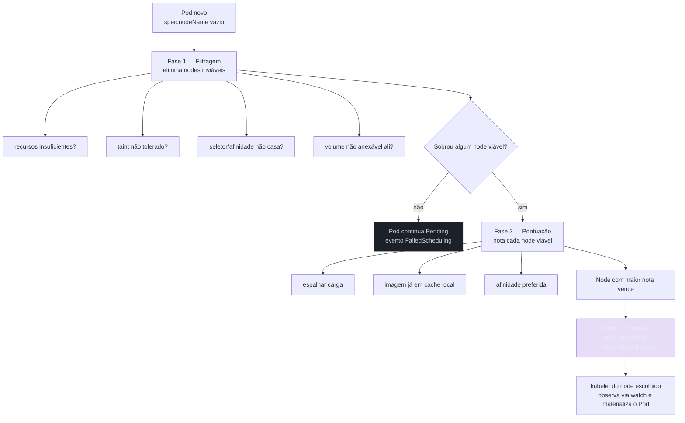
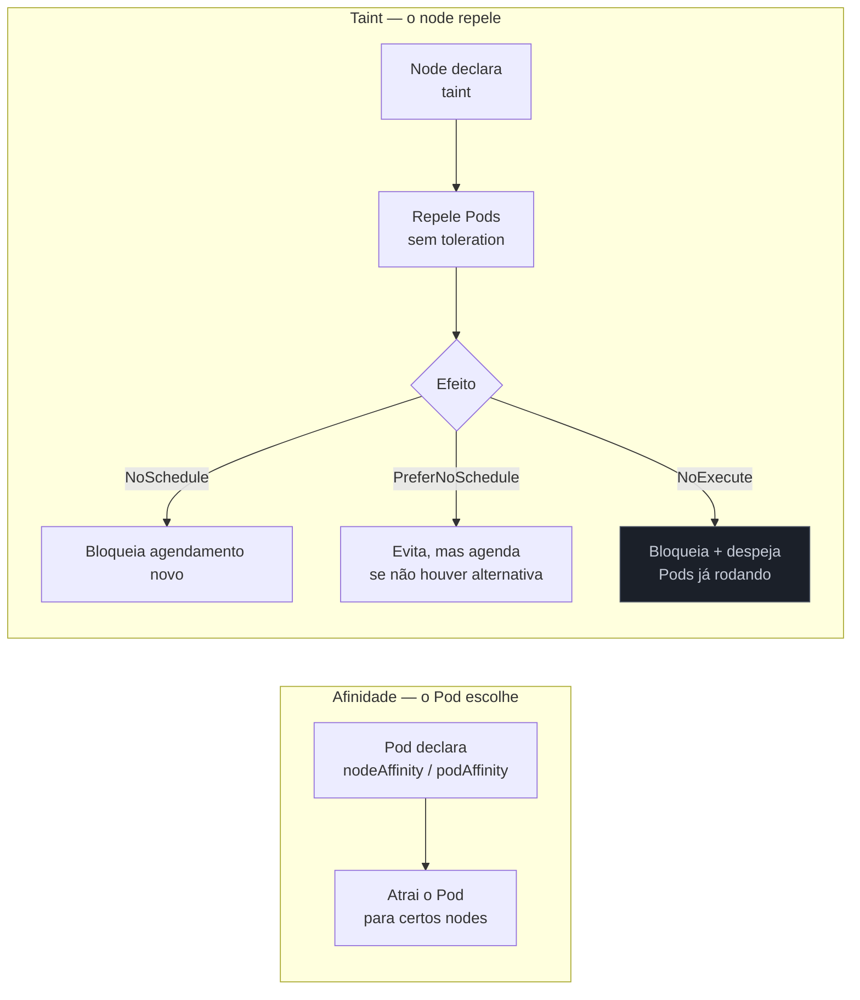
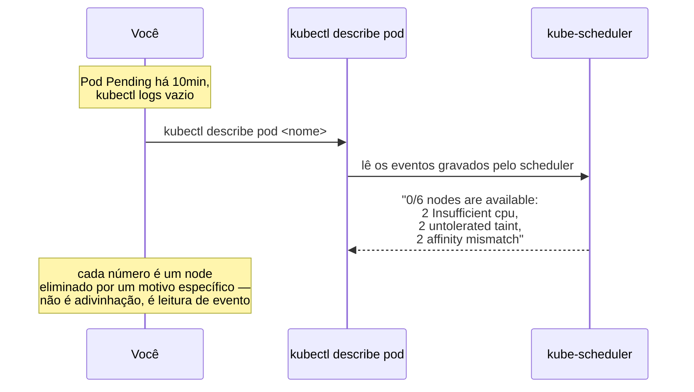

# Scheduling

> [!abstract] TL;DR
> Um Pod `Pending` não tem container nenhum rodando — e `kubectl logs` não ajuda em nada, porque não existe processo algum para produzir log. O que existe é uma decisão que ainda não foi tomada: o `kube-scheduler`, mais um controller level-triggered entre tantos que este galho já descreveu, responde a uma única pergunta — "existe algum Pod sem `spec.nodeName` preenchido?" — e, quando encontra um, escolhe um node em duas fases (filtragem, depois pontuação) e escreve o nome desse node de volta no objeto. Ele não move nada, não copia nada, não executa nada: ele faz uma escrita. É o `kubelet` do node escolhido, observando essa escrita via watch, quem de fato materializa o Pod. Requests (não limits) contra capacidade alocável, taints que repelem, afinidade que atrai, restrições de topologia que espalham, prioridade que despeja — todo esse vocabulário resolve a mesma pergunta de fundo, "qual node serve", e todo Pod preso em `Pending` tem uma resposta objetiva escondida na seção de eventos de `kubectl describe pod`, esperando para ser lida.

Imagine a cena: um Pod está `Pending` há dez minutos. `kubectl get pods` mostra `0/1 Running`, sem restart, sem crash, sem nada que se pareça com um erro de aplicação. `kubectl logs` retorna vazio, porque não há container — o Pod nunca chegou perto de rodar. `kubectl top nodes` mostra CPU ociosa em três dos quatro nodes do cluster. A reação mais comum, para quem chega ao Kubernetes vindo de outro modelo mental, é assumir algum tipo de lentidão — talvez o cluster esteja sobrecarregado, talvez o registry esteja lento, talvez seja só questão de esperar mais um pouco. Nenhuma dessas hipóteses é a certa. O Pod está preso porque ninguém, ainda, decidiu **onde** ele deveria rodar — e essa decisão, ao contrário de quase tudo que este galho já cobriu, não é feita pelo controller que criou o Pod (o ReplicaSet, o Job, o DaemonSet, o que for), é feita por um processo à parte, especializado numa única pergunta, que a nota [[03-Dominios/Tecnologia/Infraestrutura/Kubernetes/02 - O loop de reconciliação|O loop de reconciliação]] já nomeou de passagem, sem abrir: o `kube-scheduler`.

Esta nota abre essa caixa. A nota anterior, [[03-Dominios/Tecnologia/Infraestrutura/Kubernetes/11 - Job, CronJob e DaemonSet|Job, CronJob e DaemonSet]], terminou justamente na borda desse mecanismo — um DaemonSet sem `tolerations` explícita ficando de fora dos nodes de control plane, silenciosamente, porque nada na sua `spec` disse ao scheduler para ignorar o taint daquele node. Esta nota pega esse fio solto e o segue até o fim: o que o scheduler observa, como ele decide, o que fazer quando ele nunca decide nada — e por que, quando isso acontece, a resposta não é adivinhação, é leitura de evento.

## As duas fases do ciclo de agendamento: filtrar, depois pontuar

O `kube-scheduler` roda o mesmo padrão observar-comparar-agir de qualquer outro controller deste galho, só que a pergunta que ele faz é mais estreita do que a de um ReplicaSet ou um Job: não "quantos Pods existem contra quantos deveriam existir", mas "existe algum Pod cujo `spec.nodeName` está vazio?". Cada Pod que casa com essa pergunta entra num ciclo de decisão de duas fases, sempre nesta ordem, sempre isolado por Pod — o scheduler decide um Pod de cada vez, não em lote.

A primeira fase é a **filtragem** (o predicado, na nomenclatura mais antiga da documentação; hoje, um conjunto de *plugins* de filtro no framework de scheduling). O objetivo aqui não é escolher o melhor node — é eliminar, da lista completa de nodes do cluster, todo node que é **inviável** para este Pod específico, por qualquer motivo estrutural: recurso insuficiente (o node não tem CPU ou memória alocável suficiente para cobrir os `requests` declarados), taint não tolerado (o node repele explicitamente Pods que não carregam a `toleration` correspondente, mecanismo que a seção adiante nesta nota desenvolve), seletor ou afinidade que não casa (`nodeSelector` ou `nodeAffinity` exigindo um label que aquele node não tem), porta de host já ocupada por outro Pod que reivindicou a mesma porta, ou um volume que não pode ser anexado àquele node — por exemplo, um disco de bloco já provisionado numa zona diferente da zona do node, o mesmo conflito de topologia que a nota [[03-Dominios/Tecnologia/Infraestrutura/Kubernetes/09 - Armazenamento|Armazenamento — PV, PVC e StorageClass]] já descreveu em detalhe ao explicar por que `WaitForFirstConsumer` existe. O resultado da filtragem é uma lista, possivelmente vazia, de nodes **viáveis** — nodes onde o Pod, tecnicamente, poderia rodar sem violar nenhuma restrição obrigatória.

A segunda fase, que só roda sobre os nodes que sobreviveram à primeira, é a **pontuação** (os *priorities* antigos; hoje, plugins de *score* do mesmo framework). Cada node viável recebe uma nota, calculada a partir de múltiplos critérios combinados — espalhar carga para não concentrar Pods num node só, preferir um node que já tem a imagem do container em cache local (evitando o custo de puxar do registry, o mesmo fator de latência que a nota 02 já identificou como o mais variável de toda a linha do tempo de convergência), respeitar as preferências declaradas via afinidade suave, entre outros. O node com a pontuação mais alta vence, e é sobre ele que o scheduler age.



O ato final desse ciclo é o que dá nome a esta seção inteira, e vale nomeá-lo com precisão porque é aqui que a lente deste galho se aplica sem exceção: o scheduler não move o Pod para lugar nenhum — ele **escreve**. Ele cria um objeto `Binding`, que o api-server traduz numa atualização de `spec.nodeName` no Pod, e é só isso. Não existe transporte, não existe cópia, não existe nenhum processo que "leve" o Pod até o node escolhido — existe um campo de texto, antes vazio, agora preenchido com o nome de um node. O agendamento é uma **atribuição declarada**, não uma execução. A execução de fato — puxar a imagem, criar o container, montar o volume — é obra do `kubelet` daquele node, que está fazendo, ele mesmo, exatamente o mesmo tipo de laço: observar via watch se existe algum Pod atribuído a ele que ele ainda não colocou para rodar, e agir sobre a diferença que encontrar. O scheduler nunca fala com o `kubelet` diretamente, e o `kubelet` nunca pede permissão ao scheduler para agir — os dois se comunicam exclusivamente através do mesmo api-server e do mesmo etcd que sustentam todo o resto deste galho, cada um lendo e escrevendo o mesmo objeto Pod, de ângulos diferentes.

### Vendo a capacidade alocável de um node com as próprias mãos

Antes de seguir para o restante desta nota, vale tornar concreta a peça que a fase de filtragem de fato compara — porque "capacidade alocável" soa abstrato até alguém rodar o comando que a expõe. `kubectl describe node` mostra, lado a lado, a capacidade total do node e o que já foi comprometido por `requests` de Pods já agendados:

```bash
kubectl describe node node-2
```

```
Capacity:
  cpu:                4
  memory:             16268184Ki
Allocatable:
  cpu:                3800m
  memory:             15Gi
Allocated resources:
  (Total limits may be over 100 percent, i.e., overcommitted.)
  Resource           Requests      Limits
  --------           --------      ------
  cpu                3650m (96%)   7200m (189%)
  memory             12Gi (80%)    14Gi (93%)
```

Repare nas duas colunas: `Requests` a 96% de CPU explica, sozinho, por que um Pod novo pedindo `cpu: 500m` não passa na filtragem daquele node — sobra só 150m de folga. `Limits` a 189%, bem acima de 100%, não é um erro de leitura nem uma inconsistência: é o retrato normal de um cluster onde a soma dos `limits` declarados excede a capacidade física, porque `limits` nunca entra na conta do scheduler — só entra na conta de quem decide, em runtime, quanto CPU cada container pode de fato usar antes de ser limitado. Um node pode estar, ao mesmo tempo, com `requests` perto de 100% (recusando Pods novos) e com `limits` bem acima de 100% (aceito e normal), e as duas linhas não se contradizem — elas respondem a perguntas diferentes, uma sobre agendamento, outra sobre runtime.

## `requests` contra `limits`: o que o scheduler de fato olha

Existe uma precisão sobre a fase de filtragem que quase todo mundo erra na primeira leitura, e vale nomeá-la sem rodeio, porque ela explica um sintoma real e recorrente: **o scheduler só olha `requests`, nunca `limits`**, e nunca olha o uso real medido em tempo de execução — ele compara `requests` contra a capacidade *alocável* do node (o total de CPU e memória disponível para Pods, descontando o que o sistema operacional e os componentes do próprio node já reservam para si) **descontando a soma dos `requests` de todo Pod já agendado naquele node**, não o consumo real que cada um está de fato usando neste instante.

É essa distinção, sozinha, que produz o sintoma que costuma parecer paradoxal: um cluster pode estar com CPU visivelmente ociosa em `kubectl top nodes` — porque os Pods já rodando ali estão usando bem menos do que pediram — e ainda assim recusar um Pod novo, porque a **soma dos `requests` já comprometidos** já esgotou a capacidade alocável do node, mesmo que o **uso real** esteja longe disso. O scheduler não sabe, e não tenta saber, quanto um Pod está de fato consumindo; ele só sabe quanto cada Pod **prometeu** consumir, no mínimo, ao ser agendado, e essa promessa é o único número que entra na conta de filtragem.

```yaml
apiVersion: v1
kind: Pod
metadata:
    name: worker-processamento
spec:
    containers:
        - name: app
          image: worker:2.3
          resources:
              requests:
                  cpu: "500m"      # o scheduler soma isto contra a capacidade alocável do node
                  memory: "512Mi"  # e só isto — nunca o uso real medido depois
              limits:
                  cpu: "1"         # limits governa throttling em runtime; o scheduler nem olha para cá
                  memory: "1Gi"    # ultrapassar isto é o que dispara OOMKilled — outro mecanismo, outra camada
```

Vale marcar com a mesma honestidade que a política de **como escolher** os valores de `requests` e `limits` — dimensionar com folga suficiente, evitar superestimar a ponto de desperdiçar capacidade do cluster inteiro, calibrar via observação de uso real ao longo do tempo — é uma disciplina operacional própria, que pertence a [[03-Dominios/Engenharia/Operação/3 - Rodar em produção/04 - Escala e capacidade|Escala e capacidade]]. O que esta nota descreve é só o mecanismo: qual número o scheduler de fato lê, e por que `limits` generosos e `requests` mal calibrados produzem um cluster que parece ter espaço e não tem — não a receita de como acertar o número certo para cada carga.

## `nodeSelector`: a forma mais simples, e seu teto

A forma mais direta de restringir onde um Pod pode rodar é `nodeSelector`: um mapa de pares chave-valor que precisa casar, **por igualdade exata**, com labels já presentes no node — o mesmo vocabulário de labels e seletores que a nota [[03-Dominios/Tecnologia/Infraestrutura/Kubernetes/06 - Namespaces, labels e selectors|Namespaces, labels e selectors]] já estabeleceu para amarrar Service a Pod, aqui aplicado a Pod contra node.

```yaml
apiVersion: v1
kind: Pod
metadata:
    name: worker-com-gpu
spec:
    nodeSelector:
        gpu-vendor: nvidia          # só nodes com este label exato passam na filtragem
        disktype: ssd                # todos os pares precisam casar — é um AND implícito
    containers:
        - name: app
          image: worker-gpu:1.0
```

O teto de `nodeSelector` é exatamente a sua simplicidade: ele só expressa igualdade exata (`AND` implícito entre todos os pares declarados), nunca uma preferência, nunca um "OR", nunca "qualquer node menos este". Não existe forma de dizer, via `nodeSelector`, "prefira um node com SSD, mas aceite outro se não houver" — a exigência é sempre obrigatória, tudo ou nada, o que basta para o caso simples de exigir um tipo de hardware específico, mas não basta para nenhum cenário mais fino. É exatamente essa lacuna que `nodeAffinity` resolve.

## Afinidade de nó: obrigatório contra preferência, e o que "IgnoredDuringExecution" quer dizer

`nodeAffinity` reformula a mesma pergunta de `nodeSelector` — "que labels de node importam?" — mas com um vocabulário mais expressivo (operadores como `In`, `NotIn`, `Exists`, `Gt`, `Lt`, não só igualdade) e, mais importante, com duas variantes que diferem em **quão obrigatória** é a regra.

`requiredDuringSchedulingIgnoredDuringExecution` é a forma dura: uma regra que precisa ser satisfeita para o Pod ser agendado, funcionalmente equivalente a `nodeSelector` na sua obrigatoriedade, mas com a sintaxe mais rica de `matchExpressions`. Se nenhum node satisfizer, o Pod fica `Pending`, exatamente como aconteceria com `nodeSelector`.

`preferredDuringSchedulingIgnoredDuringExecution` é a forma suave: uma lista de preferências, cada uma com um `weight` de 1 a 100, que **influencia** a fase de pontuação sem nunca eliminar nenhum node na fase de filtragem. Um node que não casa com nenhuma preferência ainda é elegível — só recebe uma nota mais baixa do que casaria se atendesse à preferência, e continua competindo normalmente contra os demais.

```yaml
apiVersion: v1
kind: Pod
metadata:
    name: api-com-afinidade
spec:
    affinity:
        nodeAffinity:
            requiredDuringSchedulingIgnoredDuringExecution:
                nodeSelectorTerms:
                    - matchExpressions:
                          - key: topology.kubernetes.io/zone
                            operator: In
                            values: ["zona-a", "zona-b"]   # obrigatório: só estas duas zonas passam na filtragem
            preferredDuringSchedulingIgnoredDuringExecution:
                - weight: 80
                  preference:
                      matchExpressions:
                          - key: node-lifecycle
                            operator: NotIn
                            values: ["spot"]   # preferência: evita spot, mas aceita se for a única opção viável
    containers:
        - name: api
          image: minha-api:v1
```

Vale explicar o nome inteiro, porque ele **é** a documentação, não um rótulo arbitrário — e é fácil ler rápido demais e perder exatamente o detalhe que mais importa na prática. "DuringScheduling" já é claro: a regra é avaliada no momento em que o scheduler está decidindo o node. "**IgnoredDuringExecution**" é a parte que costuma surpreender: uma vez que o Pod já foi agendado e está rodando, se o **node deixar de satisfazer a regra** — porque alguém removeu o label, porque o node mudou de zona numa migração, porque qualquer coisa alterou a condição que originalmente casava — o Pod **não é removido, nem realocado**. A regra de afinidade só é reavaliada em tempo de agendamento; depois disso, ela é literalmente ignorada durante toda a execução do Pod. É a mesma lógica de "decisão tomada uma vez, não revalidada continuamente" que explica por que remover um taint de um node não expulsa Pods que já estavam ali sem tolerá-lo antes de a toleration existir — o comportamento simétrico de taints, descrito adiante, com uma exceção importante que o próprio nome do efeito `NoExecute` denuncia.

> [!info] Baseline de versão
> `nodeAffinity` com as duas variantes `required`/`preferredDuringSchedulingIgnoredDuringExecution` é funcionalidade estável (GA) na API `v1` de Pod há várias versões majoritárias, e não muda de comportamento entre releases recentes do ciclo 1.3x usado como referência neste galho. Não existe hoje, na documentação oficial, uma variante `RequiredDuringExecution` que removeria um Pod cujo node deixou de satisfazer a regra — só existe a semântica "ignorado durante a execução" descrita acima; quem precisa desse comportamento de remoção ativa precisa implementá-lo por fora, tipicamente via um controller próprio observando mudanças de label de node.

## Afinidade e antiafinidade entre Pods, e o `topologyKey`

`nodeAffinity` decide com base em labels do **node**. `podAffinity` e `podAntiAffinity` decidem com base em labels de **outros Pods** já rodando — a pergunta muda de "este node tem a característica certa?" para "que outros Pods já estão perto daqui, e eu quero estar perto deles ou longe deles?". As mesmas duas variantes de obrigatoriedade (`required`/`preferredDuringSchedulingIgnoredDuringExecution`) se aplicam aqui, com o mesmo significado já explicado para `nodeAffinity`.

A peça nova, específica de afinidade entre Pods, é o **`topologyKey`**: o label de node que define o que conta como "o mesmo lugar" para efeito daquela regra. `kubernetes.io/hostname` trata cada node individualmente — "o mesmo lugar" é o mesmo node exato. `topology.kubernetes.io/zone` trata cada zona de disponibilidade como uma unidade — "o mesmo lugar" é qualquer node dentro da mesma zona, não importa qual node específico. `topology.kubernetes.io/region` sobe mais um nível, tratando toda uma região geográfica como uma unidade só. O `topologyKey` não é um detalhe cosmético do YAML — ele é literalmente o que decide se "espalhar" significa "em nodes diferentes" ou "em zonas diferentes", duas garantias de resiliência bem diferentes entre si.

O exemplo canônico, e o motivo mais comum de existir `podAntiAffinity` num manifesto real, é impedir que duas réplicas do mesmo serviço caiam no mesmo node — porque um node caindo não deveria, sozinho, derrubar a disponibilidade inteira de um serviço com múltiplas réplicas.

```yaml
apiVersion: apps/v1
kind: Deployment
metadata:
    name: minha-api
spec:
    replicas: 3
    selector:
        matchLabels:
            app: minha-api
    template:
        metadata:
            labels:
                app: minha-api
        spec:
            affinity:
                podAntiAffinity:
                    requiredDuringSchedulingIgnoredDuringExecution:
                        - labelSelector:
                              matchLabels:
                                  app: minha-api   # nunca no mesmo node de outro Pod com este label
                          topologyKey: kubernetes.io/hostname
            containers:
                - name: api
                  image: minha-api:v1
```

Vale um alerta honesto de custo, porque é a armadilha operacional mais real deste mecanismo em cluster grande: avaliar `podAffinity`/`podAntiAffinity` exige que o scheduler compare o Pod candidato contra **todos os outros Pods relevantes já agendados** dentro do escopo do `topologyKey`, não só contra labels estáticos de node — é uma operação estruturalmente mais cara do que `nodeAffinity`, cujo custo é proporcional ao número de nodes, não ao número de Pods. Num cluster com dezenas de milhares de Pods, `podAntiAffinity` mal empregado (sobretudo em regras `required`, aplicadas de forma ampla) pode degradar visivelmente a latência do próprio ciclo de agendamento — um custo que a documentação oficial reconhece explicitamente ao recomendar cautela no uso de afinidade entre Pods em escala.

## Taints e tolerations: o mecanismo inverso

Tudo que as duas seções anteriores descreveram parte do Pod: é o Pod que declara, via `nodeSelector` ou `nodeAffinity`, que node ele quer. **Taints e tolerations invertem essa direção** — é o **node** que declara, de forma ativa, que tipos de Pod ele recusa, e o Pod precisa carregar uma `toleration` correspondente para furar essa recusa. Onde afinidade é atração ("eu, Pod, quero este node"), taint é repulsão ("eu, node, não aceito Pods sem permissão explícita").

Um taint tem três partes — chave, valor opcional, e um dos três **efeitos** possíveis — e é o efeito que decide a severidade da repulsa:

`NoSchedule` impede que um Pod novo, sem a `toleration` correspondente, seja agendado ali — mas não mexe em nada que já esteja rodando no node antes do taint ser aplicado. `PreferNoSchedule` é a versão suave, análoga a uma preferência de afinidade: o scheduler tenta evitar aquele node para Pods sem a toleration, mas agenda ali de qualquer forma se não sobrar alternativa viável. `NoExecute` é o mais severo dos três, e vale nomear a diferença com precisão porque ela quebra a simetria que a seção anterior estabeleceu: além de impedir agendamento novo, `NoExecute` **despeja Pods já rodando** naquele node que não tolerem o taint — é o único dos três efeitos, entre tudo que esta nota cobriu até aqui, que age sobre execução em andamento, não só sobre decisão de agendamento futura.

```yaml
apiVersion: v1
kind: Pod
metadata:
    name: worker-tolerante
spec:
    tolerations:
        - key: "workload-tipo"
          operator: "Equal"
          value: "batch"
          effect: "NoSchedule"        # aceita rodar em nodes com este taint específico
        - key: "node.kubernetes.io/not-ready"
          operator: "Exists"
          effect: "NoExecute"
          tolerationSeconds: 300      # tolera o taint automático por 5min antes de ser despejado
    containers:
        - name: worker
          image: worker-batch:1.0
```

O cluster aplica alguns taints automaticamente, sem intervenção manual, como parte da própria detecção de falha de node que a nota 02 deste galho já descreveu via `NodeStatus` e `Lease`: quando um node para de reportar prontidão, o control plane aplica taints como `node.kubernetes.io/not-ready` ou `node.kubernetes.io/unreachable`, com efeito `NoExecute` — e é exatamente aqui que `tolerationSeconds` entra, um campo que só faz sentido combinado com `NoExecute`: em vez de despejar o Pod no instante em que o taint aparece, o control plane espera o número de segundos declarado antes de agir, dando ao node uma janela para se recuperar sozinho sem que toda carga que rodava ali seja recriada em outro lugar à toa. Sem `tolerationSeconds` declarado, o comportamento padrão do sistema já aplica uma tolerância implícita a esses dois taints automáticos específicos — mas declará-lo explicitamente é a forma de controlar essa janela para uma carga que, por sua natureza, prefere esperar mais (um banco com muito estado, custoso para recriar) ou menos (uma carga stateless, barata para recriar) do que o padrão do cluster.



Vale reconectar este mecanismo com a nota anterior deste galho: o DaemonSet `coletor-de-log` que precisou de uma `toleration` explícita para `node-role.kubernetes.io/control-plane` — mostrado na nota [[03-Dominios/Tecnologia/Infraestrutura/Kubernetes/11 - Job, CronJob e DaemonSet|Job, CronJob e DaemonSet]] — não era um detalhe acidental daquele exemplo, era exatamente este mecanismo em ação: os nodes de control plane carregam, por padrão, um taint `NoSchedule` que repele qualquer Pod sem a toleration correspondente, e um DaemonSet que promete "todo nó, sem exceção" precisa furar esse taint explicitamente, ou a promessa quebra silenciosamente.

> [!tip] Vídeo — as duas fases e os três mecanismos, demonstrados ao vivo
> [**How Scheduling in Kubernetes Works**](https://www.youtube.com/watch?v=0FvQR-0tK54) (Himani Agrawal & Mahendra Kariya, GoJek — KubeCon, canal da CNCF, ~20 min, EN) percorre a mesma espinha desta nota, com um cluster real na tela: primeiro **filtrar** (cada nó é avaliado contra os requisitos e sai ou fica) e depois **pontuar** entre os que sobraram para achar o melhor encaixe; em seguida `nodeSelector`, afinidade de nó na distinção entre exigência rígida e preferência, e taints com tolerations como o mecanismo inverso. A escolha didática deles ajuda mais do que parece: os nós são casas de *Game of Thrones* e os Pods são personagens, então cada regra de afinidade vira uma frase legível ("este personagem só pode ser alocado na casa Lannister") em vez de um YAML abstrato. **O que ele não cobre:** afinidade **entre Pods** e `topologyKey`, `topologySpreadConstraints`, prioridade e preempção, e o catálogo de diagnóstico de `Pending` — ou seja, toda a segunda metade desta nota.
>
> ⚠️ Palestra de 2019, com Kubernetes 1.16 na demonstração. Os mecanismos mostrados seguem exatamente iguais, mas o fecho envelheceu: eles apresentam o **scheduling framework** como novidade em estado alpha na 1.15. Ele há muito deixou de ser experimental e é hoje a arquitetura padrão de plugins do scheduler — é o assunto da seção "De raspão: um scheduler extensível", no fim desta nota.

## `topologySpreadConstraints`: distribuição uniforme como objetivo de primeira classe

`podAntiAffinity` resolve "nunca dois no mesmo lugar" bem, mas resolve mal um objetivo ligeiramente diferente e muito comum: "espalhe as réplicas o mais uniformemente possível entre zonas", quando existem mais réplicas do que zonas — nesse caso, antiafinidade `required` simplesmente fica impossível de satisfazer a partir de um certo número de réplicas, e antiafinidade `preferred` não dá nenhuma garantia de quão desbalanceado o resultado final pode ficar. `topologySpreadConstraints` foi desenhado precisamente para esse objetivo: distribuição balanceada como parâmetro de primeira classe, não como efeito colateral de "evite ficar perto".

Três campos governam o comportamento. `topologyKey` tem exatamente o mesmo papel já explicado para `podAffinity` — o label de node que define o que conta como "o mesmo domínio" (node, zona, região). `maxSkew` declara a diferença máxima tolerada entre o domínio com mais Pods casando o `labelSelector` e o domínio com menos — um `maxSkew: 1` com três zonas e seis réplicas força algo próximo de 2/2/2, nunca permitindo, por exemplo, 4/1/1. `whenUnsatisfiable` decide o que fazer quando a distribuição pedida não é alcançável: `DoNotSchedule` (o padrão) trata a restrição como obrigatória e deixa o Pod `Pending` se não houver como respeitar o `maxSkew`; `ScheduleAnyway` trata como preferência — agenda de qualquer forma, dando prioridade, na fase de pontuação, aos domínios que mais reduziriam o desbalanceamento.

```yaml
apiVersion: apps/v1
kind: Deployment
metadata:
    name: minha-api
spec:
    replicas: 6
    selector:
        matchLabels:
            app: minha-api
    template:
        metadata:
            labels:
                app: minha-api
        spec:
            topologySpreadConstraints:
                - maxSkew: 1
                  topologyKey: topology.kubernetes.io/zone
                  whenUnsatisfiable: DoNotSchedule   # obrigatório: nunca mais de 1 de diferença entre zonas
                  labelSelector:
                      matchLabels:
                          app: minha-api
            containers:
                - name: api
                  image: minha-api:v1
```

Por que preferir isso a `podAntiAffinity` para o caso "espalhe entre zonas"? Porque antiafinidade raciocina em pares — "este Pod, contra aquele Pod específico" — e antiafinidade `required` vira, na prática, "no máximo um Pod por zona", uma restrição rígida demais assim que o número de réplicas passa do número de zonas disponíveis. `topologySpreadConstraints` raciocina em contagens agregadas por domínio, com uma folga explícita (`maxSkew`) que admite mais de um Pod por zona, mantendo o objetivo real — nenhuma zona muito mais carregada que as outras — sem impor uma exclusividade que a maioria dos cenários reais não precisa nem quer.

> [!info] Baseline de versão
> `topologySpreadConstraints` é estável (GA) na API `v1` de Pod desde a versão 1.19, depois de passar por alpha na 1.16 e beta. Há aqui um detalhe que contraria a intuição e vale cravar: **não declarar o campo não significa "sem espalhamento nenhum"**. Desde a versão 1.24, se ninguém configurou restrições padrão de cluster, o `kube-scheduler` se comporta como se estas estivessem declaradas — `maxSkew: 3` sobre `kubernetes.io/hostname` e `maxSkew: 5` sobre `topology.kubernetes.io/zone`, ambas com `whenUnsatisfiable: ScheduleAnyway`. Ou seja, existe um espalhamento **suave** embutido: o scheduler prefere distribuir, mas nunca recusa agendar por causa disso. Duas consequências práticas: primeira, quem observa Pods razoavelmente distribuídos sem ter declarado nada não está vendo sorte, está vendo esse default; segunda, como as regras embutidas dependem dos rótulos de nó `kubernetes.io/hostname` e `topology.kubernetes.io/zone`, um cluster cujos nós não carregam esses rótulos não ganha espalhamento nenhum — nesse caso a documentação recomenda declarar as próprias restrições em vez de confiar no padrão. Quem quiser desligar o comportamento pode fazê-lo na `KubeSchedulerConfiguration`, definindo `defaultingType: List` com `defaultConstraints` vazio.

## Prioridade e preempção: quando um Pod importante não cabe

Tudo que esta nota descreveu até aqui pressupõe implicitamente que existe espaço sobrando em algum node viável. Nem sempre existe. `PriorityClass` é o objeto que atribui um valor inteiro de prioridade — quanto maior, mais importante — a um Pod, via `priorityClassName` na sua `spec`; sem essa declaração, a prioridade padrão é zero.

```yaml
apiVersion: scheduling.k8s.io/v1
kind: PriorityClass
metadata:
    name: alta-prioridade
value: 1000000
globalDefault: false
description: "Reservado para cargas críticas de produção que não podem ficar Pending esperando capacidade."
```

Quando um Pod de prioridade alta não passa na fase de filtragem em nenhum node — não por falta de nodes viáveis em termos de taint ou afinidade, mas por falta pura de recursos — o scheduler não desiste de imediato: ele avalia se **remover um ou mais Pods de prioridade menor** de algum node abriria espaço suficiente para o Pod de prioridade alta caber. Se encontrar esse node, ele **despeja** os Pods de prioridade menor — a mesma palavra usada para o efeito `NoExecute` de um taint, mas aqui disparada por comparação de prioridade, não por marcação explícita de node. O Pod despejado não desaparece silenciosamente: ele volta a ser um Pod sem node, e o loop de reconciliação do controller que o possuía (ReplicaSet, Job, o que for) trata sua recriação em outro node exatamente como trataria qualquer outra morte de Pod.

Vale nomear o campo que existe precisamente para quem quer prioridade alta na fila de agendamento **sem** o poder de despejar ninguém: `preemptionPolicy: Never`, declarado na própria `PriorityClass`. Um Pod dessa classe entra na fila de agendamento à frente de Pods de prioridade menor — ganha prioridade de fila — mas nunca dispara preempção; se não houver espaço sem despejar alguém, ele simplesmente espera, como qualquer Pod comum, até que recursos fiquem disponíveis por conta própria. É a escolha certa para cargas que merecem prioridade de fila (rodar antes de outras coisas pendentes) sem merecer o direito de interromper trabalho alheio já em andamento — um caso de uso citado explicitamente na documentação oficial é carga de ciência de dados, que quer furar a fila sem derrubar serviços já rodando.

```yaml
apiVersion: scheduling.k8s.io/v1
kind: PriorityClass
metadata:
    name: alta-prioridade-sem-despejo
value: 900000
preemptionPolicy: Never   # entra na frente da fila, mas nunca despeja Pods de prioridade menor
```

> [!info] Baseline de versão
> `preemptionPolicy: Never` é estável desde a versão 1.24 do Kubernetes, segundo a documentação oficial de prioridade e preempção; sem essa declaração, o padrão de qualquer `PriorityClass` é `PreemptLowerPriority`, o comportamento de despejo descrito acima. `PriorityClass` em si é um objeto estável na API `scheduling.k8s.io/v1` há várias versões majoritárias, sem mudança de comportamento relevante dentro do ciclo 1.3x usado como referência neste galho.

Vale um alerta de fronteira, porque preempção interage diretamente com uma garantia que outra parte deste vault já estabeleceu: um `PodDisruptionBudget` limita quantos Pods de um mesmo conjunto podem ficar indisponíveis **voluntariamente** de uma vez — mas preempção por prioridade é, ela mesma, uma forma de disrupção que o scheduler pode disparar. A interação exata entre PDB e preempção, e a política mais ampla de garantir disponibilidade mínima sob pressão de capacidade, pertence a [[03-Dominios/Engenharia/Operação/3 - Rodar em produção/06 - Resiliência operacional|Resiliência operacional]] — esta nota descreve só o gatilho mecânico de quando o scheduler decide despejar, não a política de quanto isso pode custar em disponibilidade.

## Os cinco mecanismos, lado a lado

Vale fechar o corpo técnico consolidando, numa única tabela, os cinco mecanismos que esta nota descreveu — porque cada um resolve uma pergunta ligeiramente diferente, e confundi-los é a fonte mais comum de escolher a ferramenta errada para o problema certo:

| Mecanismo | Quem inicia | O que decide | Pergunta que responde |
| --- | --- | --- | --- |
| `nodeSelector` | O Pod | Igualdade exata de labels de node, sempre obrigatória | "Este node tem exatamente os labels que eu exijo?" |
| `nodeAffinity` | O Pod | Igualdade e expressões mais ricas, obrigatória ou preferida | "Este node casa com o que eu quero, ou prefiro?" |
| `podAffinity`/`podAntiAffinity` | O Pod | Presença ou ausência de outros Pods, por `topologyKey` | "Que outros Pods já estão aqui perto, e eu quero estar perto ou longe?" |
| Taints e tolerations | O node | Repulsa ativa, furada só por toleration explícita | "Que Pods eu, node, recuso, a menos que provem permissão?" |
| `topologySpreadConstraints` | O Pod (e opcionalmente o cluster) | Distribuição balanceada por contagem, com folga (`maxSkew`) | "As réplicas estão uniformemente distribuídas entre os domínios?" |
| `PriorityClass` e preempção | O scheduler, comparando prioridades | Se vale a pena despejar alguém de prioridade menor | "Este Pod é importante o bastante para justificar tirar espaço de outro?" |

Repare que os quatro primeiros mecanismos atuam inteiramente dentro da fase de **filtragem** ou influenciam a fase de **pontuação** — decidem quais nodes entram na disputa e como eles são ordenados. Preempção é a exceção: ela só entra em cena depois que a filtragem normal já falhou para todo node, como um último recurso antes de deixar o Pod `Pending` de vez.

## Um resumo de comandos para a caixa de ferramentas

Da mesma forma que a nota 02 deste galho reuniu, ao final, os comandos que respondem às perguntas mais recorrentes sobre reconciliação em geral, vale reunir aqui os comandos específicos de agendamento:

| Pergunta | Comando |
| --- | --- |
| Por que este Pod específico está `Pending`? | `kubectl describe pod <nome>` |
| Quanto de `requests` já está comprometido neste node? | `kubectl describe node <nome>` |
| Que taints este node carrega? | `kubectl describe node <nome> \| grep Taints` |
| Que tolerations este Pod declara? | `kubectl get pod <nome> -o jsonpath='{.spec.tolerations}'` |
| A que node este Pod foi de fato atribuído? | `kubectl get pod <nome> -o jsonpath='{.spec.nodeName}'` |
| Existe algum Pod sendo despejado por preempção agora? | `kubectl get events --field-selector reason=Preempted --sort-by='.lastTimestamp'` |
| Quantos nodes existem, e quantos estão prontos? | `kubectl get nodes` |
| Qual scheduler está processando este Pod? | `kubectl get pod <nome> -o jsonpath='{.spec.schedulerName}'` |

## Por que o Pod fica `Pending`: o catálogo diagnóstico

Toda a mecânica descrita nesta nota converge para uma única pergunta prática, a que abriu a nota inteira: um Pod está `Pending`, e por quê? A resposta nunca é adivinhação — ela está sempre nos eventos do próprio Pod, porque a fase de filtragem, ao eliminar cada node, registra o motivo da eliminação, e essa contagem agregada é exatamente o que `kubectl describe pod` expõe.

O catálogo de causas, em ordem aproximada de frequência real:

**Recurso insuficiente.** A soma dos `requests` já comprometidos em cada node viável já esgotou a capacidade alocável — o cenário que a seção sobre `requests` contra `limits` já detalhou, incluindo o paradoxo de CPU ociosa e cluster recusando Pods novos ao mesmo tempo.

**Taint não tolerado.** O Pod não carrega a `toleration` correspondente a um taint presente em todo node viável — o caso do DaemonSet sem toleration para o taint de control plane, generalizado para qualquer Pod comum.

**Seletor ou afinidade insatisfeita.** `nodeSelector` ou `nodeAffinity` `required` não encontram nenhum node com os labels exigidos — um erro de digitação no valor do label é a causa mais boba e mais comum dentro desta categoria.

**Volume não vinculável naquela zona.** Um PVC já vinculado a um PV cuja `nodeAffinity` (herdada da zona onde o disco nasceu) não bate com nenhum node viável — o cenário `volume node affinity conflict` que a nota [[03-Dominios/Tecnologia/Infraestrutura/Kubernetes/09 - Armazenamento|Armazenamento — PV, PVC e StorageClass]] já mostrou em detalhe como consequência de `volumeBindingMode: Immediate` mal combinado com um cluster multi-zona.

**`PodDisruptionBudget` ou quota bloqueando.** Vale separar dois sintomas parecidos que têm causas diferentes. Um `PodDisruptionBudget` nunca impede a **criação** de um Pod novo — ele limita quantos Pods **já existentes** podem ficar indisponíveis de uma vez durante uma operação voluntária (um `kubectl drain`, por exemplo), então um Pod preso em `Pending` por causa de PDB é, na prática, sinal de que um drain está bloqueado esperando esse mesmo Pod, não de que o Pod novo não conseguiu nascer. Uma `ResourceQuota` de namespace já esgotada é diferente: ela bloqueia a **criação** do objeto Pod no api-server, antes mesmo de ele existir para o scheduler processar — o sintoma nesse caso não é `Pending` com evento `FailedScheduling`, é a rejeição imediata do próprio `kubectl apply`, com uma mensagem citando o nome da quota excedida.

```bash
kubectl apply -f pod-extra.yaml
```

```
Error from server (Forbidden): error when creating "pod-extra.yaml":
pods "worker-extra" is forbidden: exceeded quota: quota-batch,
requested: requests.cpu=500m, used: requests.cpu=4, limited: requests.cpu=4
```

Repare que essa mensagem nunca chega a `kubectl describe pod`, porque o Pod nunca foi de fato criado — é o api-server recusando a escrita na hora do `apply`, antes de qualquer fase de agendamento começar. É um erro de uma camada anterior a tudo que esta nota descreveu, mas vale citá-lo aqui porque o sintoma superficial — "meu Pod não sobe" — é indistinguível, para quem só olha `kubectl get pods` sem pods nenhum novo aparecendo, de qualquer uma das causas anteriores.

**Nenhum node pronto.** Todos os nodes do cluster estão marcados `NotReady` — o mesmo mecanismo de `NodeStatus`/`Lease` da nota 02 — e, nesse caso, não existe nenhum node viável, ponto final, independentemente de qualquer outra restrição.

```bash
kubectl describe pod worker-processamento
```

```
Events:
  Type     Reason            Age   From               Message
  Warning  FailedScheduling  45s   default-scheduler   0/6 nodes are available: 2 Insufficient cpu, 2 node(s) had untolerated taint {workload-tipo: batch}, 2 node(s) didn't match Pod's node affinity/selector.
```

Essa única linha — `0/6 nodes are available` seguida de uma lista de motivos — é o coração prático desta nota, e vale aprender a lê-la com a mesma fluência que a nota [[03-Dominios/Tecnologia/Infraestrutura/Kubernetes/09 - Armazenamento|Armazenamento — PV, PVC e StorageClass]] já ensinou a ler `volume node affinity conflict`: ela **literalmente diz** quantos nodes existem no total, quantos passaram na filtragem (zero, se o Pod está `Pending`), e, para cada motivo de eliminação, quantos nodes caíram por aquele motivo específico. No exemplo acima: seis nodes no total, dois eliminados por CPU insuficiente, dois por taint não tolerado, dois por afinidade/seletor não satisfeitos — a soma bate exatamente com o total, porque cada node é contado uma vez, pelo primeiro motivo de eliminação que encontrou. Ler essa mensagem linha por linha, contra o catálogo acima, transforma "por que meu Pod não sobe" de uma investigação às cegas numa leitura direta de um relatório que o próprio scheduler já escreveu.



## De raspão: um scheduler extensível

Vale nomear, sem aprofundar, que o `kube-scheduler` descrito nesta nota inteira não é uma caixa fechada com lógica fixa: ele é implementado como um **framework de plugins**, com pontos de extensão explícitos em cada fase do ciclo (filtragem, pontuação, e outras fases menos visíveis, como reserva e permit), permitindo compor **scheduling profiles** diferentes dentro do mesmo binário, ou até rodar um scheduler alternativo inteiro, apontado por Pod via `spec.schedulerName` — um Pod que declara um `schedulerName` diferente do padrão (`default-scheduler`) simplesmente não é observado pelo scheduler padrão, e sim por qualquer processo que tenha se registrado sob aquele nome, seguindo exatamente o mesmo contrato de escrever `spec.nodeName` de volta no objeto. Essa extensibilidade — o mesmo tema que reaparece, numa escala bem maior, na nota [[03-Dominios/Tecnologia/Infraestrutura/Kubernetes/19 - Operators|Operators]], ao tratar controllers customizados — é o que permite a times com necessidades de agendamento fora do comum (cargas de machine learning com afinidade de GPU complexa, por exemplo) substituir ou complementar o scheduler padrão sem tocar em nenhuma linha do Kubernetes em si.

## Armadilhas comuns

> [!warning] Achar que aumentar `limits` resolve um Pod `Pending` por falta de recurso
> Como o scheduler só olha `requests` na fase de filtragem, aumentar `limits` não muda em nada a decisão de agendamento — `limits` só governa o que acontece depois que o Pod já está rodando (throttling de CPU, `OOMKilled` de memória). Quem vê `Insufficient cpu` ou `Insufficient memory` no evento de `FailedScheduling` precisa olhar para `requests`, nunca para `limits`.

> [!warning] Presumir que `nodeAffinity` remove um Pod se o node deixar de casar depois
> O próprio nome do campo avisa — `IgnoredDuringExecution` — mas a expectativa intuitiva costuma ser a oposta: que a regra continua valendo enquanto o Pod roda. Não continua. Um Pod agendado com sucesso permanece exatamente onde está mesmo que o node perca, depois, o label que originalmente justificou a escolha; só uma nova decisão de agendamento (um Pod recriado do zero) reavalia a regra.

> [!warning] Usar `podAntiAffinity` `required` para espalhar mais réplicas do que zonas disponíveis
> Antiafinidade `required` entre Pods do mesmo `labelSelector`, com `topologyKey` de zona, vira "no máximo um Pod por zona" — e assim que o número de réplicas ultrapassa o número de zonas, as réplicas excedentes ficam permanentemente `Pending`, sem nenhum node viável. `topologySpreadConstraints` com `maxSkew` resolve o mesmo objetivo de espalhamento sem essa armadilha de exclusividade rígida.

> [!warning] Criar um DaemonSet ou Pod sem `tolerations` e presumir cobertura total do cluster
> Como a nota anterior deste galho já mostrou, um taint em qualquer node — de control plane ou customizado — silenciosamente exclui esse node de qualquer Pod sem a toleration correspondente, sem erro explícito além da ausência do Pod esperado ali. A checagem correta é comparar os taints de `kubectl describe node` contra as tolerations declaradas no template do Pod, não presumir que "todo nó" significa, de fato, todo nó.

> [!warning] Configurar preempção por prioridade sem considerar o impacto em `PodDisruptionBudget`
> Um Pod de prioridade alta pode disparar o despejo de Pods de prioridade menor mesmo que esses Pods estejam protegidos por um PDB contra disrupção voluntária — preempção não é, por definição do Kubernetes, o mesmo tipo de disrupção que o PDB governa. Times que dependem de PDB como garantia absoluta de disponibilidade mínima precisam considerar prioridade e preempção como um caminho separado que pode, sim, reduzir réplicas disponíveis abaixo do que o PDB pretendia proteger.

> [!warning] Tratar `FailedScheduling` como um erro genérico e ignorar a mensagem detalhada
> A tentação, sob pressão, é reagir a `Pending` aumentando o cluster, ou apagando e recriando o Pod, sem antes ler a contagem de motivos que o próprio evento já fornece. Na maioria dos casos, a mensagem de `kubectl describe pod` já contém a resposta completa — quantos nodes, por qual motivo cada um foi eliminado — e pular essa leitura custa tempo de depuração que a mensagem já tinha economizado.

## Como explicar em inglês

| Português | English |
| --- | --- |
| O scheduler não move o Pod, ele escreve o nome do node no objeto | The scheduler doesn't move the Pod, it writes the node's name onto the object |
| O ciclo tem duas fases: filtragem e depois pontuação | The cycle has two phases: filtering, then scoring |
| O scheduler só olha `requests`, nunca `limits`, na decisão de agendamento | The scheduler only looks at `requests`, never `limits`, when making the scheduling decision |
| Afinidade é o Pod escolhendo o node; taint é o node repelindo o Pod | Affinity is the Pod choosing the node; a taint is the node repelling the Pod |
| "IgnoredDuringExecution" significa que a regra só vale no momento do agendamento | "IgnoredDuringExecution" means the rule only applies at scheduling time |
| Só o efeito `NoExecute` despeja Pods que já estão rodando | Only the `NoExecute` effect evicts Pods that are already running |
| `topologySpreadConstraints` distribui de forma balanceada, não só evita coincidência | `topologySpreadConstraints` distributes evenly, it doesn't just avoid coincidence |
| Preempção despeja Pods de prioridade menor para abrir espaço para um de prioridade maior | Preemption evicts lower-priority Pods to make room for a higher-priority one |
| A mensagem de `FailedScheduling` diz exatamente quantos nodes foram descartados e por quê | The `FailedScheduling` message states exactly how many nodes were discarded and why |

## O que vem a seguir

O scheduler decide o node; o `kubelet` materializa o Pod ali; o ReplicaSet, o Job, o CronJob e o DaemonSet decidem quando criar e destruir Pods. Nenhum desses processos age por conta própria fora do api-server — todos eles são, estruturalmente, **clientes da mesma API**, fazendo chamadas HTTP autenticadas, exatamente como o `kubectl` de qualquer humano faz. O que nenhuma nota deste galho respondeu ainda é a pergunta que separa "o mecanismo consegue fazer isso" de "o mecanismo tem permissão para fazer isso": quem, dentro do cluster, pode criar um Pod, ler um Secret, escrever num Binding, apagar um Deployment — e como o próprio scheduler, o próprio `kubelet`, o próprio controller de cada objeto provam, perante o api-server, que têm autoridade para agir em nome de quem os configurou. Essa é a próxima nota: [[03-Dominios/Tecnologia/Infraestrutura/Kubernetes/13 - RBAC e ServiceAccount|RBAC e ServiceAccount]].

## Fontes

- [Kubernetes documentation — Kubernetes Scheduler](https://kubernetes.io/docs/concepts/scheduling-eviction/kube-scheduler/)
- [Kubernetes documentation — Assigning Pods to Nodes](https://kubernetes.io/docs/concepts/scheduling-eviction/assign-pod-node/)
- [Kubernetes documentation — Taints and Tolerations](https://kubernetes.io/docs/concepts/scheduling-eviction/taint-and-toleration/)
- [Kubernetes documentation — Pod Topology Spread Constraints](https://kubernetes.io/docs/concepts/scheduling-eviction/topology-spread-constraints/)
- [Kubernetes documentation — Pod Priority and Preemption](https://kubernetes.io/docs/concepts/scheduling-eviction/pod-priority-preemption/)
- [Kubernetes documentation — Scheduling Framework](https://kubernetes.io/docs/concepts/scheduling-eviction/scheduling-framework/)
- [Kubernetes documentation — Managing Resources for Containers](https://kubernetes.io/docs/concepts/configuration/manage-resources-containers/)
- [Kubernetes documentation — Node-pressure Eviction](https://kubernetes.io/docs/concepts/scheduling-eviction/node-pressure-eviction/)
- [Kubernetes documentation — Multiple Schedulers](https://kubernetes.io/docs/tasks/extend-kubernetes/configure-multiple-schedulers/)
