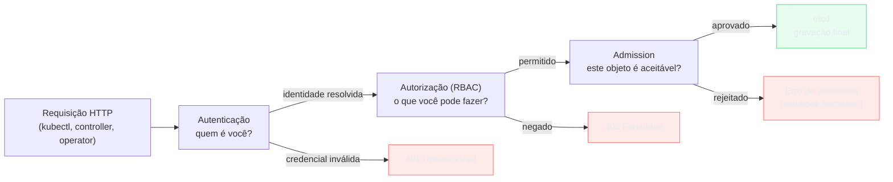
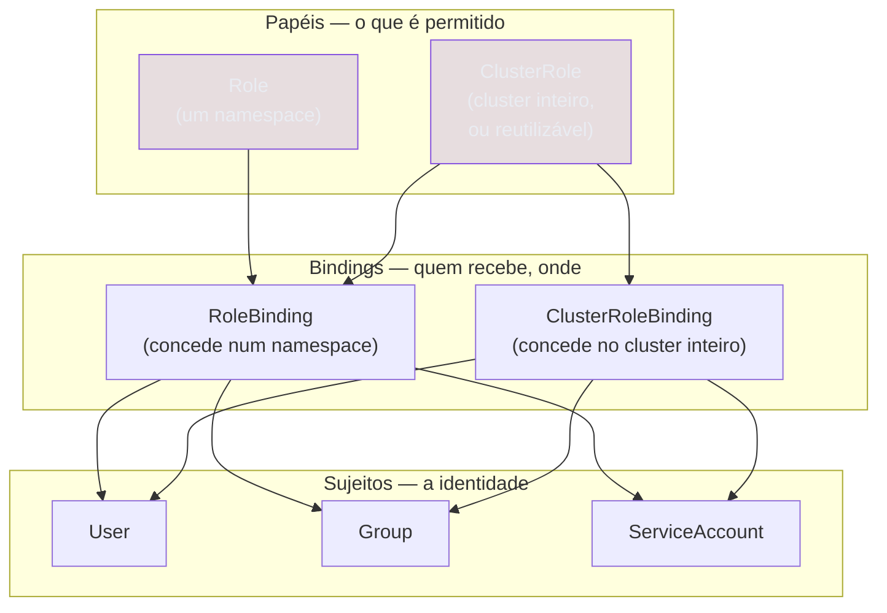

# RBAC e ServiceAccount

> [!abstract] TL;DR
> Um Pod que roda dentro do cluster não ganha, só por estar lá dentro, permissão nenhuma de falar com a própria API do cluster — todo cliente da API, incluindo um controller caseiro ou um operator rodando num container comum, precisa de uma identidade e de uma autorização, exatamente como qualquer humano digitando `kubectl`. O api-server responde essa pergunta em duas etapas encadeadas: autenticação (quem é você) e autorização (o que você pode fazer), seguidas de uma terceira etapa, admission, já apresentada na nota sobre o loop de reconciliação. Existem dois tipos de identidade — usuários humanos, que o Kubernetes deliberadamente não modela como objeto da API (não existe `kind: User`), e ServiceAccounts, que são objetos do cluster feitos para processos, com token projetado dentro do container, de curta duração, renovado automaticamente pelo kubelet desde que essa geração de token virou o padrão. A autorização em si é um conjunto de quatro objetos comuns — `Role`, `ClusterRole`, `RoleBinding`, `ClusterRoleBinding` — que o api-server consulta a cada requisição, puramente aditivos, sem nenhum conceito de regra de negação. Entender essa mecânica é o que transforma "o RBAC está bloqueando" de sentença misteriosa em pergunta precisa: qual identidade, qual verbo, qual recurso, qual binding.

Imagine um cenário comum o bastante para valer a pena nomear com precisão: uma equipe escreve um controller próprio, ou um agente de coleta de métricas, ou um operator de terceiros, e a primeira pergunta prática que aparece é sempre a mesma — esse processo, rodando dentro de um Pod, dentro do mesmo cluster que ele precisa consultar, já tem acesso à API só por estar lá dentro? A intuição mais comum, vinda de quem já operou máquinas onde "estar na rede interna" costuma implicar algum grau de confiança implícita, é que sim. A resposta do Kubernetes é não, e categoricamente não: um Pod recém-criado, sem nenhuma configuração adicional, consegue no máximo listar as próprias credenciais e algumas informações de descoberta de API — qualquer chamada real contra `pods`, `deployments`, `secrets` ou qualquer outro recurso volta com `403 Forbidden`, a mesma resposta que qualquer cliente HTTP sem autorização receberia. Entender por que essa resposta é não — e o que exatamente precisa mudar para virar sim — é entender a separação mais fundamental do modelo de segurança do Kubernetes: quem você é nunca é, por si só, o que você pode fazer.

Essa separação continua diretamente de onde a nota [[03-Dominios/Tecnologia/Infraestrutura/Kubernetes/07 - kubectl é um cliente de API|07 — kubectl é um cliente de API]] parou: toda requisição contra o api-server é HTTP comum, sem nenhum atalho especial para controllers do control plane ou operators customizados — o `kube-scheduler`, o `kube-controller-manager`, um Deployment escrito por uma equipe qualquer, todos entram pela mesma porta. Aquela nota fechou apontando `kubectl auth can-i` como a forma de perguntar diretamente ao cluster "eu posso fazer isso?", sem explicar ainda de onde vem a resposta. Esta nota abre essa caixa. E a nota [[03-Dominios/Tecnologia/Infraestrutura/Kubernetes/08 - ConfigMap e Secret|08 — ConfigMap e Secret]] deixou uma promessa em aberto ainda mais direta: que base64 não protege um `Secret` nenhum pouco, e que a proteção real vem de RBAC restringindo quem tem permissão de ler aquele objeto. Esta nota honra essa promessa — não como um adendo de segurança colado por cima, mas como o mecanismo completo, do zero, que decide se um `kubectl get secret` de alguém retorna o valor ou um `Forbidden`.

## Duas perguntas separadas, uma cadeia só

Toda requisição que chega ao api-server passa, na ordem, por três etapas distintas, e vale nomear as três com precisão porque confundir uma com a outra é a fonte mais comum de diagnóstico errado diante de um erro de acesso. A primeira é **autenticação**: o api-server examina a credencial apresentada — um certificado de cliente, um token — e decide quem está falando, produzindo um nome e, geralmente, uma lista de grupos. A segunda é **autorização**: de posse dessa identidade, o api-server decide se ela tem permissão de fazer, no recurso e no namespace específicos, exatamente o que a requisição pede. A terceira, que a nota sobre o loop de reconciliação já mencionou de passagem, é **admission**: uma cadeia de plugins que roda depois da autorização já ter aprovado a requisição, capaz de validar ou até mutar o objeto antes da gravação final no etcd — um admission controller nunca decide quem pode fazer o quê, só se o objeto em si, já autorizado, é aceitável na forma em que chegou.

Essa ordem importa porque cada etapa responde a uma pergunta que a anterior não responde e a seguinte não repete. Um certificado inválido nunca chega à pergunta de autorização — a requisição já é recusada na primeira etapa, com `401 Unauthorized`. Uma identidade válida, mas sem permissão para o verbo pedido, nunca chega à admissão — é recusada na segunda etapa, com `403 Forbidden`, a mensagem que esta nota inteira gira em torno de decifrar. E um objeto autorizado, mas que viola uma política de admissão do cluster (por exemplo, exigir `resources.limits` em todo container), é recusado só na terceira etapa, normalmente com um erro de webhook nomeando a política específica que barrou o pedido. RBAC — o assunto central desta nota — é o mecanismo de autorização que a esmagadora maioria dos clusters em produção usa hoje; existem outros modos de autorização (ABAC, um modo de arquivo estático quase extinto na prática; Webhook, que delega a decisão a um serviço externo; Node, específico para requisições vindas de kubelets), mas RBAC é o padrão de fato, e o único detalhado aqui.



## Duas identidades, uma assimetria que surpreende

O Kubernetes reconhece dois tipos fundamentalmente diferentes de identidade, e a forma como cada um é modelado — ou deliberadamente não modelado — costuma surpreender quem chega esperando simetria entre os dois. A documentação oficial é direta sobre o primeiro tipo: "Kubernetes does not have objects which represent normal user accounts. Normal users cannot be added to a cluster through an API call." Não existe `kind: User`, não existe um `kubectl create user`, não existe um objeto que se possa listar com `kubectl get users`. Um usuário humano é inteiramente externo ao cluster — a identidade vem de um certificado de cliente (o `commonName` do certificado vira o nome, as `organization` viram grupos), de um token JWT emitido por um provedor OIDC externo, ou de um proxy de autenticação configurado na borda — e o api-server, ao validar essa credencial, só enxerga o resultado final: um nome, uma lista de grupos, e opcionalmente um conjunto de campos extras. Ele nunca sabe, e nunca precisa saber, como aquele nome foi decidido do lado de fora.

**ServiceAccounts**, em contraste, são objetos do cluster como qualquer `Pod` ou `ConfigMap` — com `spec`, `status`, gravados no etcd, criáveis via `kubectl create serviceaccount` ou por manifesto declarativo, e sujeitos exatamente ao mesmo ciclo de reconciliação que a nota [[03-Dominios/Tecnologia/Infraestrutura/Kubernetes/02 - O loop de reconciliação|02 — O loop de reconciliação]] descreveu para qualquer outro recurso. Essa assimetria não é um descuido a ser corrigido numa versão futura — é uma decisão de design deliberada, e a razão é prática: usuários humanos são gerenciados por sistemas de identidade que já existem fora do Kubernetes (um diretório corporativo, um provedor OIDC, uma PKI própria), e reinventar esse gerenciamento dentro do cluster duplicaria uma responsabilidade que já pertence a outro sistema. Processos que rodam dentro do cluster, por outro lado, não têm nenhum sistema de identidade externo natural — é o próprio Kubernetes quem os cria, quem os destrói, e é o próprio Kubernetes quem precisa saber, de forma nativa, "qual identidade este Pod específico carrega".

```bash
kubectl get serviceaccounts -n producao
```

```
NAME      SECRETS   AGE
default   0         120d
deploy-bot 0        14d
```

Todo namespace recém-criado ganha, automaticamente, uma ServiceAccount chamada `default` — sem nenhuma ação explícita de ninguém, exatamente como o próprio api-server preenche dezenas de campos default num Pod minúsculo, comportamento já discutido na nota sobre `kubectl` como cliente de API. Um Pod que não declara `serviceAccountName` na sua `spec` herda essa `default`, silenciosamente, e passa a carregar a identidade que ela representa em toda chamada que fizer contra a API do cluster.

## ServiceAccount: identidade projetada dentro do container

O mecanismo que conecta uma ServiceAccount a um Pod específico é a **projeção de token**: no momento em que o kubelet cria o container, ele monta, num volume especial dentro do sistema de arquivos do container, um conjunto de arquivos que representam a credencial daquele Pod — o próprio token, o certificado da autoridade certificadora do cluster (para validar a conexão TLS contra o api-server sem precisar confiar cegamente), e o nome do namespace. Os três arquivos ficam num caminho fixo e previsível, o mesmo em qualquer cluster:

```
/var/run/secrets/kubernetes.io/serviceaccount/token
/var/run/secrets/kubernetes.io/serviceaccount/ca.crt
/var/run/secrets/kubernetes.io/serviceaccount/namespace
```

Qualquer biblioteca cliente da API — `client-go`, `client-python`, ou o `curl` mais cru possível — sabe, por convenção, procurar exatamente esses três caminhos quando roda dentro de um Pod e precisa montar uma requisição autenticada, sem exigir nenhuma configuração explícita de credencial: é o mesmo princípio de "a identidade mora num lugar conhecido, não precisa ser passada à mão" que sustenta a resolução automática de `kubeconfig` fora do cluster, só que aplicado de dentro para dentro.

> [!info] Baseline de versão
> Desde a versão 1.22, o comportamento padrão passou a ser tokens **projetados via a TokenRequest API**: curta duração, com audiência declarada (o token só é válido contra o destinatário para o qual foi emitido, tipicamente o próprio api-server) e vinculado ao Pod específico que o solicitou — o token para de funcionar assim que aquele Pod é removido, não continua válido indefinidamente. O kubelet renova esse token automaticamente antes de expirar, sem que a aplicação precise fazer nada. Esse modelo substitui o comportamento anterior, em que toda ServiceAccount ganhava, na criação, um `Secret` permanente contendo um token que nunca expirava e nunca era rotacionado — um risco de segurança relevante em qualquer cluster de vida longa, porque um token vazado uma vez continuava válido para sempre. A geração automática desse `Secret` legado passou a ficar desligada por padrão a partir da versão 1.24 (via o feature gate `LegacyServiceAccountTokenNoAutoGeneration`), e essa mudança chegou a GA na versão 1.27 — criar um `Secret` de token permanente continua tecnicamente possível, mas deixou de acontecer automaticamente, e a documentação oficial desaconselha esse caminho.

Vale ver o token de fato de dentro de um container, para desfazer qualquer mística sobre ele ser algo especial de acesso restrito só a processos privilegiados:

```bash
kubectl exec -it minha-api-9f6c7d4b3-lmnop -- cat /var/run/secrets/kubernetes.io/serviceaccount/token
```

O resultado é um JWT comum — três blocos separados por ponto, decodificáveis com qualquer ferramenta de JWT, revelando `sub` (a identidade `system:serviceaccount:<namespace>:<nome-da-sa>`), `aud` (a audiência, restringindo contra qual API o token é aceito), e `exp` (o instante de expiração). Um processo dentro do container, ao montar uma requisição contra a API, lê esse arquivo e o inclui no cabeçalho `Authorization: Bearer <token>` — exatamente o mesmo cabeçalho que um `kubectl` fora do cluster monta a partir da credencial resolvida do `kubeconfig`.

Nem todo Pod precisa dessa credencial. Um container que nunca fala com a API do cluster — a maioria absoluta dos Pods de qualquer cluster real, que só serve tráfego HTTP para clientes externos ou processa uma fila — ganha, mesmo assim, o token montado por padrão, o que amplia desnecessariamente a superfície de ataque: qualquer processo comprometido dentro daquele container, mesmo sem nenhuma necessidade legítima de falar com a API, encontra a credencial já pronta no disco. A defesa é desligar essa montagem explicitamente, no Pod ou na própria ServiceAccount:

```yaml
apiVersion: v1
kind: Pod
metadata:
    name: worker-sem-api
spec:
    serviceAccountName: default
    automountServiceAccountToken: false
    containers:
        - name: worker
          image: worker:1.0
```

Definir `automountServiceAccountToken: false` — seja no Pod, seja na ServiceAccount inteira, aplicando-se a todo Pod que a use — é higiene básica de segurança para qualquer carga de trabalho que não precisa de acesso à API: menos um artefato sensível espalhado por dezenas ou centenas de réplicas, sem custo funcional nenhum para quem de fato nunca ia usar aquele token.

> [!tip] Vídeo — a assimetria das duas identidades, construída do zero
> [**Understanding Kubernetes RBAC | Access control basics explained**](https://www.youtube.com/watch?v=jvhKOAyD8S8) (That DevOps Guy, ~33 min, EN) é longo porque faz o percurso inteiro à mão, e é justamente por isso que serve a esta nota: ele **materializa a assimetria** que a seção anterior descreve. Para o usuário humano, ele mostra na prática que não existe objeto `User` no Kubernetes — é preciso gerar uma chave, produzir uma CSR, assiná-la com a **CA do próprio cluster** e embutir o certificado num `kubeconfig`, montando à mão a identidade que a API vai reconhecer. Para a carga de trabalho, o contraste é imediato: um `ServiceAccount` é um objeto de verdade, criado com um YAML de três linhas, e o token aparece montado dentro do Pod em `/var/run/secrets/kubernetes.io/serviceaccount`. Entre os dois, ele monta Role e RoleBinding campo a campo — `apiGroups`, `resources`, `verbs` — testando cada permissão de dentro de um container que roda como o usuário criado. Uma boa prática aparece de passagem e vale reter: ele emite o certificado com validade de **um dia**, observando que sem expiração um `kubeconfig` que vaza vale para sempre. **O que ele não cobre:** ClusterRoles padrão e agregação de roles, a regra de que RBAC é puramente aditivo, escalonamento de privilégio, e o diagnóstico com `kubectl auth can-i`.

## As quatro peças do RBAC

A autorização baseada em papéis do Kubernetes se apoia em quatro tipos de objeto, e a matriz entre eles é exatamente o ponto que mais confunde quem está aprendendo — vale nomear cada peça com precisão antes de qualquer exemplo. **Role** declara um conjunto de permissões com escopo de namespace: uma `Role` criada no namespace `producao` só pode ser referenciada por um binding dentro daquele mesmo namespace. **ClusterRole** declara permissões que podem ter escopo de cluster inteiro (recursos não-namespaced, como `Node` ou `PersistentVolume`, só podem aparecer numa `ClusterRole`, nunca numa `Role`) — mas uma `ClusterRole` também serve a um segundo propósito, igualmente comum: ser um conjunto de permissões **reutilizável**, definido uma única vez e referenciado por vários bindings de namespace diferentes, evitando reescrever a mesma lista de regras em cada namespace que precisa da mesma permissão.

**RoleBinding** é quem de fato concede a permissão, associando uma identidade (ou várias) a um papel, sempre dentro de um namespace específico — e é aqui que mora o ponto que confunde todo mundo na primeira leitura: um `RoleBinding` pode apontar tanto para uma `Role` quanto para uma `ClusterRole`. Quando aponta para uma `ClusterRole`, o efeito não é conceder aquele papel no cluster inteiro — o `RoleBinding` continua limitando o efeito ao seu próprio namespace, só que reaproveitando a lista de regras já declarada numa `ClusterRole` compartilhada, em vez de duplicá-la numa `Role` local. **ClusterRoleBinding** é o quarto e último tipo: concede permissão no cluster inteiro, sempre associado a uma `ClusterRole` (nunca a uma `Role`, porque não faria sentido "espalhar" um conjunto de permissões namespaced por todos os namespaces de uma vez sem que cada um tenha sido explicitamente concedido).

| | Escopo do papel (Role/ClusterRole) | Escopo da concessão (Binding) |
|---|---|---|
| `Role` + `RoleBinding` | Um único namespace | Aquele mesmo namespace |
| `ClusterRole` + `RoleBinding` | Cluster inteiro (reutilizável) | **Só o namespace do binding** — o caso que confunde |
| `ClusterRole` + `ClusterRoleBinding` | Cluster inteiro | Cluster inteiro |
| `Role` + `ClusterRoleBinding` | — | **Combinação inválida — não existe** |

Vale um exemplo concreto para fixar a linha do meio da tabela, porque é o caso de uso mais comum em qualquer organização com múltiplas equipes: uma `ClusterRole` chamada `pod-reader`, com permissão de listar Pods, é declarada uma única vez. Cinco equipes diferentes, cada uma com seu próprio namespace, criam cada uma o seu `RoleBinding`, todos apontando para a mesma `ClusterRole` `pod-reader`, cada `RoleBinding` vivendo no namespace da equipe correspondente. O resultado: cinco concessões independentes, cada uma limitada ao seu próprio namespace, todas reaproveitando a mesma definição de regras, sem que nenhuma equipe ganhe acesso ao namespace das outras.



Note, no diagrama, que só `RoleBinding` aceita as duas origens possíveis de papel — `Role` local ou `ClusterRole` reutilizável —, enquanto `ClusterRoleBinding` só aceita `ClusterRole`, nunca `Role`: não existe combinação onde um papel de escopo namespace seja concedido no cluster inteiro, porque isso equivaleria a inventar regras que nunca foram declaradas com aquele alcance em mente.

## Sujeitos: quem pode aparecer do outro lado de um binding

Todo `RoleBinding` e `ClusterRoleBinding` concede permissão a uma lista de **sujeitos** (`subjects`), e o Kubernetes reconhece três tipos possíveis, cada um resolvido de forma diferente pelo api-server. `User` referencia um usuário humano pelo nome exato que a autenticação resolveu — o `commonName` de um certificado, ou o campo de nome de um token OIDC — sem que o api-server precise, em nenhum momento, verificar se aquele nome corresponde a alguém real; a existência do usuário é inteiramente responsabilidade do sistema de autenticação externo, RBAC só concede permissão a um nome, exista ele de fato ou não. `Group` funciona do mesmo jeito, mas referenciando um grupo — geralmente populado pelas `organization` de um certificado ou pelos `groups` de um token OIDC — e é o caminho mais comum para conceder acesso a um time inteiro sem enumerar cada pessoa individualmente num binding. `ServiceAccount` referencia uma ServiceAccount existente, sempre com namespace explícito, porque o nome de uma ServiceAccount só é único dentro do seu próprio namespace.

```yaml
subjects:
    - kind: User
      name: alice@exemplo.com
      apiGroup: rbac.authorization.k8s.io
    - kind: Group
      name: time-plataforma
      apiGroup: rbac.authorization.k8s.io
    - kind: ServiceAccount
      name: deploy-bot
      namespace: ci
```

Vale registrar um grupo especial, sintético, que o api-server preenche automaticamente e que aparece com frequência em bindings pensados para "toda ServiceAccount de um namespace, sem exceção": `system:serviceaccounts:<namespace>`. Referenciar esse grupo como sujeito de um `Group`, em vez de listar cada ServiceAccount individualmente, concede a mesma permissão a toda ServiceAccount daquele namespace, presente ou futura — útil, por exemplo, para dar a todo Pod de um namespace de observabilidade a mesma permissão de leitura de métricas, sem precisar atualizar o binding cada vez que uma ServiceAccount nova aparece ali.

Há ainda um verbo próprio, `impersonate`, que decide quem tem permissão de usar a flag `--as` explorada na seção de diagnóstico mais adiante — sem essa permissão concedida explicitamente, uma tentativa de impersonar outra identidade falha com `403`, mesmo que a identidade que está tentando impersonar tenha, ela mesma, bastante permissão sobre outros recursos. Isso significa que a capacidade de perguntar "o que a ServiceAccount X pode fazer?" via `--as` não é um efeito colateral gratuito de nenhuma outra permissão — é, ela mesma, uma permissão RBAC distinta, concedida deliberadamente a quem precisa diagnosticar acesso alheio, tipicamente administradores de cluster.

```yaml
apiVersion: rbac.authorization.k8s.io/v1
kind: ClusterRole
metadata:
    name: pod-reader
rules:
    - apiGroups: [""]
      resources: ["pods"]
      verbs: ["get", "list", "watch"]
---
apiVersion: rbac.authorization.k8s.io/v1
kind: RoleBinding
metadata:
    name: pod-reader-time-checkout
    namespace: checkout
subjects:
    - kind: Group
      name: time-checkout
      apiGroup: rbac.authorization.k8s.io
roleRef:
    kind: ClusterRole
    name: pod-reader
    apiGroup: rbac.authorization.k8s.io
```

## Anatomia de uma regra

Toda regra dentro de uma `Role` ou `ClusterRole` combina quatro campos, e a granularidade de cada um decide quão preciso — ou quão perigosamente amplo — um papel de fato é. `apiGroups` identifica o grupo da API a que a regra se aplica — a string vazia (`""`) para o grupo legado (`Pod`, `Service`, `ConfigMap`, `Secret`), ou o nome do grupo nomeado (`apps`, `batch`, `networking.k8s.io`) para todo o resto, exatamente a mesma distinção que a nota sobre `kubectl` como cliente de API já detalhou para a URL da API. `resources` nomeia o tipo do recurso, geralmente no plural minúsculo tal como aparece na URL (`pods`, `deployments`, `secrets`). `verbs` lista as ações permitidas — `get`, `list`, `watch`, `create`, `update`, `patch`, `delete`, `deletecollection` — cada uma mapeando, por baixo, a um verbo HTTP ou a uma combinação de verbo e parâmetro de query específicos.

Dois campos adicionais, opcionais, afinam a regra ainda mais. `resourceNames` restringe a permissão a instâncias nomeadas especificamente — uma `Role` pode conceder `get` sobre o `ConfigMap` chamado `app-config`, e nenhum outro, mesmo que o verbo `get` sozinho, sem `resourceNames`, permitiria ler qualquer `ConfigMap` do namespace. E **sub-recursos** — declarados no campo `resources` com uma barra, como `pods/log` ou `pods/exec` — merecem destaque próprio, porque são o exemplo mais direto de por que essa granularidade fina importa na prática, não só na teoria. `pods/log` e `pods/exec` não são recursos separados no sentido de terem seu próprio objeto no etcd; são ações específicas sobre um `Pod` já existente, expostas como se fossem recursos à parte justamente para que pudessem receber regras de autorização independentes do resto do `Pod`.

```yaml
apiVersion: rbac.authorization.k8s.io/v1
kind: Role
metadata:
    namespace: producao
    name: debug-limitado
rules:
    - apiGroups: [""]
      resources: ["pods"]
      verbs: ["get", "list"]
    - apiGroups: [""]
      resources: ["pods/log"]
      verbs: ["get"]
```

Repare no que essa `Role` conscientemente **não** concede: `pods/exec`. Quem tem `create` sobre `pods/exec` consegue abrir um shell interativo dentro de qualquer container que a `Role` alcance — e, uma vez com shell dentro do container, tem acesso equivalente a tudo que aquele processo já tinha acesso: variáveis de ambiente, arquivos montados, e o próprio token de ServiceAccount projetado ali dentro, se `automountServiceAccountToken` não tiver sido desligado. Uma `Role` que concede `get`/`list`/`watch` sobre `pods` para fins de observabilidade, mas nunca `create` sobre `pods/exec`, é uma diferença de granularidade que separa "consegue ver o estado dos Pods" de "consegue, na prática, assumir a identidade de qualquer processo rodando dentro deles" — e é exatamente esse tipo de distinção fina que confirma o valor de tratar sub-recursos como regras próprias, nunca como detalhe implícito do recurso principal.

Vale uma nota sobre uma distinção fina, fácil de subestimar até se deparar com ela na prática: `get`, `list` e `watch` são três verbos distintos, não uma escala de "mais ou menos leitura". `get` autoriza buscar um objeto específico pelo nome; `list` autoriza buscar uma coleção inteira de objetos de um tipo, com ou sem filtro de label; `watch` autoriza abrir a conexão de longa duração que sustenta o mecanismo de observação contínua descrito na nota sobre o loop de reconciliação. Uma `Role` que concede só `get` sobre `pods`, sem `list` nem `watch`, permite `kubectl get pod nome-especifico`, mas rejeita `kubectl get pods` (sem nome, que é uma operação de `list`) com o mesmo `Forbidden` de sempre — um detalhe que costuma surpreender quem assume, por analogia com permissões de arquivo, que "ler" é uma coisa só. Controllers escritos com o padrão de Informer, descrito na mesma nota, sempre precisam de `list` e `watch` juntos — `list` para a releitura completa inicial (e para qualquer relist de segurança depois de uma desconexão), `watch` para o fluxo contínuo de eventos entre uma relist e outra; conceder só um dos dois quebra o Informer de um jeito que costuma ser mais difícil de diagnosticar do que uma falha total, porque a relist inicial funciona normalmente e só a atualização contínua falha silenciosamente depois.

## RBAC é puramente aditivo

A documentação oficial do Kubernetes é direta sobre uma propriedade estrutural do modelo, fácil de citar de memória e valiosa o bastante para valer a pena repetir aqui com as mesmas palavras: "Permissions are purely additive (there are no 'deny' rules)." Não existe, em nenhuma versão do RBAC nativo do Kubernetes, uma regra que diga "negue explicitamente este verbo sobre este recurso" — cada `RoleBinding` ou `ClusterRoleBinding` só soma permissão, nunca subtrai. A permissão efetiva de uma identidade, em qualquer namespace, é a união de tudo que qualquer binding aplicável a ela concede, sem exceção nem prioridade entre regras conflitantes — não existe conceito de "regra mais específica vence", porque não existe conflito possível quando tudo que existe é concessão.

A consequência prática dessa escolha de design é imediata e às vezes contra-intuitiva para quem vem de sistemas de firewall ou de outros modelos de autorização com regra de negação explícita: **remover** uma permissão de alguém nunca é feito escrevendo uma regra de bloqueio — é feito removendo, ou restringindo, o `RoleBinding` (ou `ClusterRoleBinding`) que concedia aquela permissão em primeiro lugar. Se uma identidade recebe acesso via dois bindings diferentes — um `RoleBinding` local e um `ClusterRoleBinding` herdado de um grupo mais amplo — remover só o primeiro não revoga a permissão concedida pelo segundo; a identidade continua com o acesso, porque a união das concessões ainda inclui aquele segundo binding. Auditar "por que esta identidade tem esta permissão" costuma exigir, por isso, listar **todos** os bindings que a referenciam, direta ou indiretamente via grupo, não só o binding mais óbvio ou mais recente.

## ClusterRoles padrão e agregação

Todo cluster já vem com um conjunto de `ClusterRoles` prontas, cobrindo os quatro níveis de acesso mais comuns: `view` concede leitura sobre a maior parte dos recursos de um namespace, sem acesso a `Secrets` completos nem a objetos sensíveis de configuração; `edit` acrescenta escrita sobre a maioria dos recursos, mas deliberadamente exclui `Role` e `RoleBinding` — quem tem `edit` não pode escalar o próprio acesso criando papéis novos; `admin` concede controle completo dentro de um namespace, incluindo gerenciar `Role` e `RoleBinding` locais; `cluster-admin` é o superusuário absoluto, com acesso irrestrito a qualquer recurso, em qualquer namespace, e a qualquer operação administrativa do cluster inteiro.

A armadilha mais comum em torno dessas quatro é conceder `cluster-admin` "só temporariamente", geralmente sob pressão — um incidente em produção, uma depuração urgente que parece exigir acesso irrestrito. O problema não é a concessão pontual em si; é que "temporário" raramente tem, na prática, um mecanismo automático de expiração — um `ClusterRoleBinding` concedido às pressas continua vigente até que alguém, deliberadamente, lembre de revogá-lo, e a experiência recorrente de qualquer time de segurança é que essa revogação costuma nunca acontecer, ou acontecer só numa auditoria muito depois do incidente que a motivou. A alternativa mais disciplinada é conceder o mínimo necessário para o incidente específico — geralmente algo bem mais estreito que `cluster-admin` — e, se algo mais amplo for genuinamente inevitável, tratar a concessão como algo a ser explicitamente calendarizado para revogação, não como um favor a ser lembrado de boa vontade.

Existe ainda um mecanismo que conecta essas `ClusterRoles` padrão a recursos que ainda nem existem no momento em que o cluster é instalado: **agregação de ClusterRole**, via o campo `aggregationRule`. Uma `ClusterRole` agregadora não declara suas próprias `rules` diretamente — em vez disso, declara um seletor de labels, e o controller de agregação, rodando continuamente no `kube-controller-manager` (o mesmo padrão observar-comparar-agir de qualquer outro controller do control plane), varre todas as `ClusterRoles` existentes procurando as que carregam aquele label, e copia as regras de cada uma para dentro da `ClusterRole` agregadora, recalculando esse conjunto sempre que alguma `ClusterRole` correspondente ao seletor é criada, alterada ou removida:

```yaml
apiVersion: rbac.authorization.k8s.io/v1
kind: ClusterRole
metadata:
    name: monitoring-crd-edit
    labels:
        rbac.authorization.k8s.io/aggregate-to-edit: "true"
rules:
    - apiGroups: ["monitoring.example.com"]
      resources: ["alertrules"]
      verbs: ["get", "list", "watch", "create", "update", "patch", "delete"]
```

O efeito prático é notável: assim que alguém instala um CRD novo (Custom Resource Definition, o mecanismo que estende a API do Kubernetes com tipos próprios, assunto da nota [[03-Dominios/Tecnologia/Infraestrutura/Kubernetes/18 - A API como sistema extensível|A API como sistema extensível — CRDs]]) acompanhado de uma `ClusterRole` marcada com o label `rbac.authorization.k8s.io/aggregate-to-edit: "true"`, toda identidade que já tinha o papel padrão `edit` passa a ter, automaticamente, acesso de escrita ao recurso novo — sem que ninguém precise editar a `ClusterRole` `edit` diretamente, sem restart de nenhum componente, sem coordenação manual entre o time que instala o CRD e o time que administra RBAC. É esse mesmo mecanismo, funcionando sob o capô, que faz operators de terceiros — um controller de banco de dados, uma ferramenta de observabilidade instalada via Helm — aparecerem, de forma transparente, dentro dos papéis padrão que já existiam antes deles.

Vale fechar esta seção com o comando mais direto de auditar, num cluster real, quem de fato acumulou o papel mais poderoso de todos — porque "conceder `cluster-admin` temporariamente" só vira um problema visível quando alguém, meses depois, pergunta quem ainda tem esse nível de acesso e ninguém sabe responder de cabeça:

```bash
kubectl get clusterrolebindings -o json \
  | jq -r '.items[] | select(.roleRef.name == "cluster-admin") | .metadata.name + ": " + (.subjects // [] | map(.kind + "/" + .name) | join(", "))'
```

```
cluster-admin: Group/system:masters
incident-2026-06-emergencial: ServiceAccount/ci/deploy-bot
```

A segunda linha desse exemplo é exatamente o tipo de achado que uma auditoria periódica existe para capturar: um `ClusterRoleBinding` com nome de incidente, concedendo `cluster-admin` a uma ServiceAccount de pipeline, criado às pressas numa data específica e nunca mais revisado. Rodar esse comando com regularidade — não só quando algo dá errado — é a forma mais barata de transformar "acesso temporário" de promessa em fato verificável.

## Escalonamento de privilégio

O RBAC do Kubernetes protege contra um cenário específico e importante: alguém com autorização para criar `RoleBinding` ou `ClusterRoleBinding` usando essa autorização para se conceder — ou conceder a outra identidade — permissão maior do que a própria. A regra de fundo, confirmada pela documentação oficial, é direta: "RBAC prevents granting permissions you don't have." Uma identidade que tem permissão de criar bindings, mas não tem ela mesma a permissão que o binding tentaria conceder, tem essa criação rejeitada pelo api-server — não é uma verificação de boas maneiras que confia na identidade se comportar bem, é uma validação estrutural aplicada em toda tentativa de escrita de `RoleBinding` ou `ClusterRoleBinding`. Um verbo específico, `escalate`, controla quem tem permissão de contornar essa checagem — concedido, por padrão, só ao papel `cluster-admin` e a quem administra RBAC deliberadamente, nunca a papéis de aplicação comuns.

Existe, porém, uma via de escalonamento real e frequentemente esquecida, que não depende de nenhum bug nem de nenhuma falha na checagem de `escalate` — depende só de como ServiceAccount e permissão de criar Pods interagem. Quem tem permissão de criar `Pods` num namespace consegue, na prática, especificar qualquer `serviceAccountName` já existente naquele mesmo namespace para o Pod que está criando — e, uma vez que o Pod nasce com aquela ServiceAccount, o token correspondente é montado dentro dele, exatamente como descrito nas seções anteriores. Se aquela ServiceAccount específica tiver permissões mais amplas do que a identidade que criou o Pod possui diretamente — porque um pipeline de CI usa uma ServiceAccount com acesso de escrita mais amplo, por exemplo —, criar um Pod com aquela ServiceAccount e um comando arbitrário dentro dele é, efetivamente, herdar as permissões da ServiceAccount, sem que nenhuma regra de `escalate` tenha sido violada — porque, tecnicamente, a identidade nunca criou nem alterou nenhum `RoleBinding`, só criou um `Pod`, uma operação comum e frequentemente concedida sem segundo pensamento.

A defesa contra esse caminho não é uma configuração especial de RBAC — é tratar "permissão de criar Pods num namespace" como equivalente, na prática, a "permissão de usar qualquer ServiceAccount daquele namespace", e dimensionar as permissões de criação de Pod com essa consequência em mente, nunca isoladamente. Um pipeline de CI com permissão ampla de deploy, cuja ServiceAccount tem acesso de escrita a `Secrets` de produção, por exemplo, deveria negar explicitamente a qualquer identidade menos confiável a permissão de criar Pods naquele mesmo namespace — porque criar um Pod ali, especificando `serviceAccountName` do pipeline, é o caminho mais curto e menos ruidoso para herdar as permissões daquele pipeline sem nunca precisar tocar diretamente em nenhum objeto de RBAC.

Vale nomear, por fim, o verbo `bind`, irmão de `escalate` e frequentemente citado ao lado dele: em clusters onde a flag `RBAC.AuthorizationRuleResolution` de checagem implícita está desligada (comportamento raro, mas configurável), o api-server passa a exigir que quem cria um `RoleBinding` referenciando um determinado papel tenha, além de já possuir as permissões que aquele papel concede, também o verbo `bind` explicitamente sobre aquele `Role` ou `ClusterRole` específico. No modo padrão da maioria dos clusters, a checagem implícita — "você só pode conceder o que já tem" — já cobre o mesmo caso sem exigir esse verbo adicional; `bind` existe para quem precisa de uma política ainda mais explícita e auditável sobre quem tem permissão de multiplicar um papel específico através de novos bindings, independente de possuir ou não, ele mesmo, as permissões daquele papel.

## Diagnóstico: perguntando à API o que se pode fazer

`kubectl auth can-i` já foi apresentado, na nota sobre `kubectl` como cliente de API, como a forma direta de perguntar "posso fazer isso?" sem efeito colateral nenhum. Vale expandir aqui as duas variações mais úteis dessa ferramenta para investigar RBAC especificamente. A primeira lista, de uma vez, tudo que a identidade atual tem permissão de fazer no namespace corrente:

```bash
kubectl auth can-i --list -n producao
```

```
Resources                                       Non-Resource URLs   Resource Names   Verbs
pods                                             []                  []               [get list watch]
pods/log                                         []                  []               [get]
configmaps                                       []                  []               [get list watch create update]
```

A segunda usa impersonação, `--as`, para responder à mesma pergunta sobre **outra** identidade, sem nunca precisar assumir aquela identidade de verdade — útil sobretudo para diagnosticar uma ServiceAccount de pipeline sem precisar extrair o token dela e montar uma requisição autenticada manualmente:

```bash
kubectl auth can-i delete deployments -n producao --as=system:serviceaccount:ci:deploy-bot
```

```
no
```

Quando a resposta de fato falha em produção — não numa pergunta de diagnóstico, mas numa chamada real — a mensagem de erro devolvida pelo api-server é, ela mesma, o diagnóstico completo, sem precisar de nenhuma ferramenta adicional para interpretá-la:

```
Error from server (Forbidden): pods is forbidden: User "system:serviceaccount:producao:deploy-bot"
cannot list resource "pods" in API group "" in the namespace "producao"
```

Repare no que essa única linha já entrega: a identidade exata (`system:serviceaccount:producao:deploy-bot`, no formato `system:serviceaccount:<namespace>:<nome>` que toda ServiceAccount carrega), o verbo (`list`), o recurso (`pods`), o grupo de API (o vazio, `""`, o grupo legado), e o namespace (`producao`). Não existe ambiguidade nenhuma sobre o que falhou — a única investigação que resta é descobrir qual `RoleBinding` deveria existir, e não existe, para conceder esse verbo específico àquela identidade específica naquele namespace específico. Ler essa mensagem com atenção, campo por campo, resolve a maior parte dos incidentes de `Forbidden` antes mesmo de abrir qualquer manifesto de RBAC.

Uma vez identificada a identidade e o verbo faltante, o próximo passo natural é descobrir quais bindings, se algum, já referenciam aquela identidade — para decidir se o caminho certo é ampliar um binding existente ou criar um novo. Como não existe, nativamente, um comando "liste todos os bindings que concedem algo a esta ServiceAccount", a forma mais direta é filtrar a listagem completa pelo nome do sujeito:

```bash
kubectl get rolebindings,clusterrolebindings -A -o json \
  | jq -r '.items[] | select(.subjects[]?.name == "deploy-bot") | .metadata.namespace + "/" + .metadata.name + " -> " + .roleRef.name'
```

```
ci/deploy-bot-binding -> deployer
producao/deploy-bot-readonly -> pod-reader
```

Essa listagem já revela, de forma explícita, algo que a mensagem de `Forbidden` sozinha nunca mostraria: a identidade tem dois bindings, um em `ci` e outro em `producao`, apontando para papéis diferentes — e é só examinando as regras de cada papel referenciado (`deployer`, `pod-reader`) que fica claro qual dos dois, se algum, já deveria cobrir o verbo que falhou. Vale reter esse hábito como padrão de investigação: a mensagem de erro aponta a identidade e o verbo faltante; a listagem de bindings aponta onde, exatamente, a correção precisa ser feita.

Nem toda regra de RBAC recai sobre um recurso da API com `apiGroups`/`resources` — uma categoria à parte, **URLs não associadas a recurso** (`nonResourceURLs`), cobre endpoints do próprio api-server que não representam nenhum objeto do cluster, como `/healthz`, `/version` ou `/metrics`. Regras desse tipo só podem aparecer numa `ClusterRole` (nunca numa `Role`, porque não fazem sentido restritas a um namespace) e substituem `apiGroups`/`resources`/`resourceNames` pelo campo `nonResourceURLs`, com os mesmos `verbs` de sempre restritos, na prática, a `get` e pouco mais:

```yaml
apiVersion: rbac.authorization.k8s.io/v1
kind: ClusterRole
metadata:
    name: health-checker
rules:
    - nonResourceURLs: ["/healthz", "/healthz/*"]
      verbs: ["get"]
```

É um canto pequeno do RBAC, raramente citado fora de referência técnica, mas vale nomeá-lo aqui porque explica um `Forbidden` que, à primeira vista, parece não se encaixar em nenhuma regra de `apiGroups`/`resources` — um agente de monitoramento externo tentando ler `/healthz` sem essa permissão específica recebe exatamente o mesmo tipo de erro estruturado, só que apontando para uma URL, não para um recurso.

## Exemplo trabalhado completo

Vale fechar o corpo técnico da nota reunindo cada peça discutida numa cena única e concreta: um controller caseiro, rodando dentro de um Pod, precisa listar Pods do próprio namespace — nada além disso — e cada manifesto necessário para chegar lá, do zero, com o mínimo de permissão que a tarefa exige.

O primeiro objeto é a identidade — uma ServiceAccount dedicada, nunca a `default` compartilhada por todo Pod do namespace que não declara a sua própria:

```yaml
apiVersion: v1
kind: ServiceAccount
metadata:
    name: pod-watcher-sa
    namespace: monitoramento
```

O segundo é o papel — uma `Role`, com escopo de namespace, porque a tarefa nunca precisa enxergar outro namespace além do próprio:

```yaml
apiVersion: rbac.authorization.k8s.io/v1
kind: Role
metadata:
    name: pod-watcher-role
    namespace: monitoramento
rules:
    - apiGroups: [""]
      resources: ["pods"]
      verbs: ["get", "list", "watch"]
```

O terceiro conecta os dois — um `RoleBinding`, também restrito ao mesmo namespace, apontando a ServiceAccount para o papel:

```yaml
apiVersion: rbac.authorization.k8s.io/v1
kind: RoleBinding
metadata:
    name: pod-watcher-binding
    namespace: monitoramento
subjects:
    - kind: ServiceAccount
      name: pod-watcher-sa
      namespace: monitoramento
roleRef:
    kind: Role
    name: pod-watcher-role
    apiGroup: rbac.authorization.k8s.io
```

E o quarto amarra tudo num Deployment de fato, referenciando a ServiceAccount pelo nome e desligando a montagem automática de token em qualquer Pod que, por engano, viesse a herdar a `default` no futuro — uma camada extra de disciplina que não custa nada aqui, porque a ServiceAccount certa já está explícita:

```yaml
apiVersion: apps/v1
kind: Deployment
metadata:
    name: pod-watcher
    namespace: monitoramento
spec:
    replicas: 1
    selector:
        matchLabels:
            app: pod-watcher
    template:
        metadata:
            labels:
                app: pod-watcher
        spec:
            serviceAccountName: pod-watcher-sa
            containers:
                - name: watcher
                  image: pod-watcher:1.0
```

Aplicar esses quatro objetos, nessa ordem, e verificar com `kubectl auth can-i list pods -n monitoramento --as=system:serviceaccount:monitoramento:pod-watcher-sa` confirma `yes` — enquanto a mesma pergunta contra `delete pods` ou contra `secrets` em qualquer verbo confirma `no`, porque nada além do que a `Role` declara foi concedido. Essa é a diferença prática entre um controller escrito com o princípio de mínimo privilégio em mente e um controller rodando sob a `default` de um namespace mal auditado: o primeiro, comprometido, dá ao invasor exatamente a leitura de Pods que ele já tinha; o segundo, dependendo do que mais compartilha aquele namespace com a `default`, pode dar muito mais do que ninguém pretendia.

Vale registrar, para quem prefere validar sem escrever quatro arquivos YAML à mão num experimento rápido, que os mesmos três primeiros objetos têm equivalentes imperativos — úteis para prototipar, exatamente com a mesma ressalva de rastreabilidade que a nota sobre `kubectl` como cliente de API já fez sobre `kubectl run`, `kubectl scale` e companhia:

```bash
kubectl create serviceaccount pod-watcher-sa -n monitoramento
kubectl create role pod-watcher-role -n monitoramento --verb=get,list,watch --resource=pods
kubectl create rolebinding pod-watcher-binding -n monitoramento \
  --role=pod-watcher-role --serviceaccount=monitoramento:pod-watcher-sa
```

O resultado, gravado no etcd, é indistinguível dos quatro manifestos aplicados via `kubectl apply` — a única diferença é, de novo, a ausência de rastro versionado: um pipeline de produção deveria sempre preferir os manifestos declarativos, deixando os comandos imperativos só para a exploração inicial de uma permissão nova antes de fixá-la em arquivo.

## Armadilhas comuns

> [!warning] Conceder `cluster-admin` "só temporariamente" e nunca revogar
> A concessão em si é rápida e resolve o incidente imediato; a revogação depende de alguém lembrar depois, sob nenhuma pressão que force esse lembrete a acontecer. `cluster-admin` concedido às pressas e nunca calendarizado para revogação é uma das formas mais comuns de acesso órfão encontradas em auditoria de clusters reais — a defesa é sempre conceder o mínimo necessário para o incidente específico, ou tratar qualquer concessão ampla como algo com data de expiração explícita desde o momento em que é criada.

> [!warning] Confundir posse de campo (server-side apply) com autorização (RBAC)
> Os dois mecanismos resolvem problemas completamente diferentes e é fácil misturá-los porque aparecem em torno da mesma conversa sobre "quem pode mudar o quê". Field managers, discutidos na nota sobre `kubectl` como cliente de API, decidem qual processo é dono de qual valor de campo entre múltiplas fontes legítimas de escrita — não têm relação nenhuma com se aquele processo tinha, em primeiro lugar, autorização para escrever ali. Essa pergunta é resolvida inteiramente por RBAC, checável via `kubectl auth can-i`, independente de qualquer coisa que `--show-managed-fields` revele.

> [!warning] Assumir que remover um `RoleBinding` revoga toda a permissão de uma identidade
> RBAC é aditivo, e uma identidade pode receber a mesma permissão por mais de um caminho — um binding direto e um binding herdado de um grupo, por exemplo. Remover só um dos dois deixa a permissão efetiva intacta, porque a união de concessões ainda inclui o binding que sobrou. Uma auditoria de "por que esta identidade tem este acesso" precisa listar todos os bindings aplicáveis, nunca confiar em ter encontrado o único.

> [!warning] Ignorar que criar Pods equivale, na prática, a poder usar qualquer ServiceAccount do namespace
> Uma identidade com permissão de `create` sobre `pods`, mas sem nenhuma permissão de RBAC explícita além dessa, ainda consegue especificar `serviceAccountName` de qualquer ServiceAccount já existente naquele namespace — herdando, através do Pod recém-criado, todas as permissões daquela ServiceAccount, sem nunca tocar num objeto de RBAC diretamente. Dimensionar quem pode criar Pods num namespace exige considerar a permissão da ServiceAccount mais privilegiada que já existe ali, não só a permissão nominal de criar Pods isoladamente.

> [!warning] Deixar `automountServiceAccountToken` ligado por padrão em Pods que nunca falam com a API
> A montagem de token é o comportamento padrão de todo Pod, mesmo para cargas de trabalho que nunca fazem nenhuma chamada contra o api-server — o que significa que a maioria dos Pods de um cluster real carrega uma credencial que nunca usa, ampliando a superfície de ataque sem benefício funcional nenhum. Desligar `automountServiceAccountToken` explicitamente, no Pod ou na ServiceAccount, para toda carga de trabalho que genuinamente não precisa falar com a API, é uma correção barata e sem efeito colateral.

## Como explicar em inglês

| Português | Inglês | Nuance de uso |
|---|---|---|
| Controle de acesso baseado em papéis | Role-Based Access Control (RBAC) | Sempre por extenso na primeira menção de uma conversa técnica, depois abreviado; nunca traduzir a sigla. |
| Papel com escopo de cluster | ClusterRole | Termo técnico fixo, sem tradução; contrasta diretamente com `Role` (namespaced) na mesma frase quando o ponto é a diferença de escopo. |
| Vínculo de papel | Binding (RoleBinding / ClusterRoleBinding) | "A binding grants a role to a subject" é a formulação padrão; "subject" é o termo genérico para usuário, grupo ou ServiceAccount. |
| Permissões puramente aditivas | Purely additive permissions | Formulação exata da documentação oficial; útil para explicar, sem ambiguidade, por que não existe regra de negação. |
| Escalonamento de privilégio | Privilege escalation | Sempre qualificado com o mecanismo específico em jogo — "via pod creation" ou "via the escalate verb" — para não soar genérico demais numa discussão técnica. |
| Conta de serviço | ServiceAccount | Termo técnico fixo, uma palavra só (sem espaço) em inglês, mesmo quando o resto da frase está em português; nunca "conta de serviço" em contexto técnico de manifesto ou log. |
| Token de curta duração | Short-lived, bound token | "Bound" é o adjetivo específico que a documentação usa para "vinculado ao Pod" — não confundir com apenas "short-lived", que só cobre a duração, não o vínculo. |
| Princípio de mínimo privilégio | Principle of least privilege | Formulação padrão em qualquer discussão de segurança, não exclusiva do Kubernetes; útil para ancorar a conversa a um princípio mais amplo que o leitor já deve reconhecer. |

## O que vem a seguir

Chegado a este ponto, o leitor já sabe declarar tudo que uma aplicação precisa para rodar no Kubernetes com identidade própria e permissão mínima — Deployment, ConfigMap, Secret, ServiceAccount, Role, RoleBinding, cada um com seu papel bem definido. O que ainda falta é uma pilha inteira de manifestos assim, multiplicada por vários ambientes — desenvolvimento, homologação, produção — cada um precisando de pequenas variações (réplicas diferentes, `ConfigMaps` diferentes, talvez uma `Role` mais restrita em produção do que em desenvolvimento) sobre uma base que, na maior parte, é idêntica. Copiar e colar essa pilha inteira por ambiente é o tipo de repetição frágil que convida a divergência silenciosa — exatamente o problema que a próxima nota deste galho, [[03-Dominios/Tecnologia/Infraestrutura/Kubernetes/14 - Helm e Kustomize|14 — Helm e Kustomize]], resolve: como parametrizar e organizar essa pilha de manifestos sem duplicá-la manualmente ambiente a ambiente.

Vale registrar, por fim, a fronteira consciente que esta nota mantém: o RBAC descrito aqui é a implementação concreta de um mecanismo de autorização — como o Kubernetes, especificamente, decide quem pode fazer o quê. Os modelos conceituais de autorização em geral — RBAC como um entre vários paradigmas possíveis, ao lado de ABAC e ReBAC, e como cada um se comporta em cenários de multi-tenancy — são assunto próprio do domínio [[03-Dominios/Engenharia/Auth e Identidade/index|Auth e Identidade]], detalhado nas notas [[03-Dominios/Engenharia/Auth e Identidade/3 - Autorização e multi-tenancy/01 - RBAC, ABAC e ReBAC — os três modelos|RBAC, ABAC e ReBAC — os três modelos]] e [[03-Dominios/Engenharia/Auth e Identidade/3 - Autorização e multi-tenancy/03 - Multi-tenancy e organizações|Multi-tenancy e organizações]]. Quem quer entender por que RBAC, como paradigma, tem os limites que tem diante de permissões muito granulares ou muito dinâmicas, encontra essa discussão lá; esta nota ficou deliberadamente no mecanismo — os quatro objetos, a cadeia de decisão, o que de fato acontece dentro do api-server quando uma ServiceAccount pergunta se pode listar Pods.

## Fontes

- [Kubernetes Docs — Using RBAC Authorization](https://kubernetes.io/docs/reference/access-authn-authz/rbac/)
- [Kubernetes Docs — Controlling Access to the Kubernetes API](https://kubernetes.io/docs/concepts/security/controlling-access/)
- [Kubernetes Docs — Authenticating](https://kubernetes.io/docs/reference/access-authn-authz/authentication/)
- [Kubernetes Docs — Service Accounts](https://kubernetes.io/docs/concepts/security/service-accounts/)
- [Kubernetes Docs — Managing Service Accounts](https://kubernetes.io/docs/reference/access-authn-authz/service-accounts-admin/)
- [Kubernetes Docs — Configure Service Accounts for Pods](https://kubernetes.io/docs/tasks/configure-pod-container/configure-service-account/)
- [Kubernetes Docs — Authorization Overview](https://kubernetes.io/docs/reference/access-authn-authz/authorization/)
- [Kubernetes Docs — Admission Control](https://kubernetes.io/docs/reference/access-authn-authz/admission-controllers/)
- [Kubernetes Docs — Projected Volumes (serviceAccountToken)](https://kubernetes.io/docs/concepts/storage/projected-volumes/)
