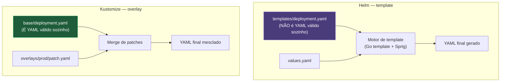

# Helm e Kustomize

> [!abstract] TL;DR
> A mesma aplicação em desenvolvimento, homologação e produção difere em cinco linhas de trinta arquivos YAML — e manter três cópias sincronizadas à mão diverge silenciosamente na primeira mudança que alguém esquece de replicar. Existem duas filosofias opostas para resolver isso, e nenhuma é superior em abstrato. O **Helm** trata o manifesto final como algo *gerado*: um chart é um modelo com marcadores (`{{ .Values.replicaCount }}`), preenchido por um arquivo de valores, e o Helm guarda no cluster o histórico do que instalou — o que permite `helm rollback` sem reconstruir nada à mão. O **Kustomize**, embutido no `kubectl` desde a versão 1.14 (`kubectl apply -k`), trata o manifesto base como YAML válido de verdade, sem marcador nenhum, e produz variantes aplicando *patches* sobre ele — nada de linguagem de template nova para aprender. Nenhuma das duas ferramentas reconcilia nada: as duas só produzem YAML e mandam para o api-server; a convergência de sempre — a mesma que a nota [[03-Dominios/Tecnologia/Infraestrutura/Kubernetes/02 - O loop de reconciliação|02 — O loop de reconciliação]] descreveu — continua acontecendo depois, do lado de dentro do cluster, exatamente igual não importa qual das duas ferramentas produziu o YAML.

Imagine o cenário mais comum de todo time que já passou de "um cluster, uma aplicação, um ambiente": a mesma API roda em desenvolvimento, homologação e produção, e as diferenças entre os três ambientes cabem, honestamente, em meia dúzia de valores — o número de réplicas, a tag da imagem, o domínio do Ingress, o limite de memória. O manifesto inteiro, porém, tem trinta arquivos YAML, cada um com dezenas de linhas. A primeira tentação é copiar a pasta `k8s/` três vezes, uma por ambiente, e editar as poucas linhas que mudam em cada cópia. Funciona bem na primeira semana. Na segunda, alguém corrige um `readinessProbe` mal ajustado em produção, sob pressão de um incidente, e esquece de replicar a mesma correção nas outras duas cópias — porque nada, além da disciplina de quem lembrar, garante que as três pastas continuem em sincronia. Meses depois, ninguém mais confia em nenhuma das três cópias como fonte da verdade, porque cada uma acumulou pequenas divergências que ninguém documentou.

O problema real, quando destrinchado com cuidado, não é "escrever manifesto" — escrever trinta arquivos YAML uma vez é trabalho finito, feito uma vez e revisado. O problema é **manter N variantes** de um mesmo conjunto de manifestos convergindo ao longo do tempo, com o mínimo de duplicação e o máximo de rastreabilidade de qual diferença é intencional e qual é acidente de cópia. É exatamente esse problema — não "como escrever YAML", mas "como manter YAML em múltiplas variantes sem duplicar tudo" — que Helm e Kustomize resolvem, cada um a seu jeito, e a diferença entre os dois jeitos é o eixo desta nota inteira.

## Duas filosofias, não uma ferramenta melhor que a outra

Vale nomear a distinção com precisão antes de entrar em qualquer detalhe de sintaxe, porque ela organiza tudo que vem depois. **Helm segue o modelo de template**: o manifesto que você escreve não é YAML válido — é um arquivo Go template, cheio de marcadores como `{{ .Values.replicaCount }}`, que só vira YAML de fato depois de passar por um motor de renderização que substitui cada marcador pelo valor correspondente. **Kustomize segue o modelo de sobreposição** (*overlay*): o manifesto base é YAML válido do início ao fim, sem marcador nenhum, aplicável sozinho com um `kubectl apply -f` comum se for preciso; variantes nascem de **patches** — trechos que dizem "pegue este campo específico deste objeto específico e mude para este valor" — aplicados por cima do base, nunca misturados dentro dele.



Essa diferença de filosofia não é estética — ela se propaga para cada decisão prática das duas ferramentas. Um chart do Helm pode gerar YAML sintaticamente inválido se o template estiver mal escrito, porque o texto que você edita não é validado como YAML até o momento da renderização. Um `kustomization.yaml` nunca corre esse risco da mesma forma, porque cada peça que ele consome — o `base/`, cada patch — já é YAML de verdade, validável isoladamente, antes mesmo de o Kustomize entrar em cena.

## Helm: o chart como unidade de distribuição

Um **chart** é a unidade fundamental do Helm — um diretório com uma estrutura fixa que empacota tudo que uma aplicação precisa para rodar no cluster, junto com os pontos de variação que cada instalação pode ajustar:

```
meu-chart/
├── Chart.yaml          # metadados: nome, versão, apiVersion (v2 para Helm 3+)
├── values.yaml          # valores default, consumidos pelos templates
├── templates/
│   ├── deployment.yaml
│   ├── service.yaml
│   ├── ingress.yaml
│   └── _helpers.tpl     # funções e trechos reutilizáveis entre templates
├── charts/               # dependências (subcharts) empacotadas
└── crds/                 # Custom Resource Definitions, em YAML puro, sem template
```

`Chart.yaml` carrega metadados obrigatórios — nome, versão semântica do próprio chart — e opcionais como descrição, mantenedores e uma lista de dependências (outros charts, empacotados dentro de `charts/` ou resolvidos de um repositório remoto). `values.yaml` é o conjunto de valores default, a peça que qualquer instalação pode sobrescrever, seja com um arquivo próprio (`--values values-prod.yaml`) ou valor a valor pela linha de comando (`--set image.tag=1.2.4`). E `templates/` é onde a filosofia de template aparece na prática:

```yaml
# templates/deployment.yaml
apiVersion: apps/v1
kind: Deployment
metadata:
    name: {{ .Release.Name }}-api
spec:
    replicas: {{ .Values.replicaCount }}
    selector:
        matchLabels:
            app: {{ .Release.Name }}
    template:
        metadata:
            labels:
                app: {{ .Release.Name }}
        spec:
            containers:
                - name: api
                  image: "{{ .Values.image.repository }}:{{ .Values.image.tag }}"
                  resources:
                      limits:
                          memory: {{ .Values.resources.limits.memory }}
```

`{{ .Values.replicaCount }}` lê o campo `replicaCount` de `values.yaml` (ou de qualquer override passado na instalação); `{{ .Release.Name }}` é uma variável embutida, resolvida pelo próprio Helm no momento da instalação, referindo-se ao nome que você deu à release. A linguagem por trás dessas chaves duplas é o **template de texto do Go** (com um conjunto extra de funções, o Sprig), a mesma engine que qualquer programa Go usa para gerar texto a partir de um modelo — e é justamente por isso que YAML gerado por template textual sofre com um problema estrutural que quem escreve Helm chart aprende cedo: indentação é significativa em YAML, mas o motor de template não sabe nada sobre YAML, só sobre texto — inserir um valor multilinha (um bloco de configuração inteiro, por exemplo) no lugar errado da indentação produz um YAML quebrado que só se revela no momento da renderização, não ao editar o template.

O motor de template aceita condicionais, laços e funções de transformação de texto, e é exatamente esse poder extra — a diferença mais concreta em relação ao modelo de overlay do Kustomize — que permite a um único template cobrir cenários que exigiriam vários patches separados:

```yaml
# templates/deployment.yaml (trecho)
spec:
    template:
        spec:
            containers:
                - name: api
                  image: "{{ .Values.image.repository }}:{{ .Values.image.tag | default .Chart.AppVersion }}"
                  {{- if .Values.env }}
                  env:
                      {{- range $chave, $valor := .Values.env }}
                      - name: {{ $chave }}
                        value: {{ $valor | quote }}
                      {{- end }}
                  {{- end }}
```

`{{ .Values.image.tag | default .Chart.AppVersion }}` encadeia um *pipe* — a mesma sintaxe de encadeamento de comandos do shell, só que operando sobre valores dentro do template — para usar a tag declarada em `values.yaml` se ela existir, ou cair de volta para a versão da aplicação declarada no próprio `Chart.yaml` caso contrário. O bloco `{{- range $chave, $valor := .Values.env }}` itera sobre um mapa arbitrário de variáveis de ambiente definido em `values.yaml`, gerando uma entrada `env:` para cada par chave-valor sem que o autor do chart precise prever, de antemão, quantas variáveis cada instalação vai declarar — um `values.yaml` de uma instalação específica só precisa acrescentar `env: { FEATURE_X: "true" }` para uma variável nova aparecer no Deployment renderizado, sem tocar no template. É esse tipo de lógica condicional e repetitiva, embutida no próprio manifesto, que o Kustomize deliberadamente não oferece — o preço dessa expressividade a mais é exatamente a perda de "isto já é YAML válido" que a seção anterior descreveu.

A forma correta de evitar essa surpresa é nunca aplicar um chart às cegas — sempre renderizar primeiro e olhar o resultado:

```bash
helm template meu-chart --values values-prod.yaml
```

`helm template` roda o motor de renderização e imprime o YAML final no terminal, sem tocar em nenhum cluster — é o equivalente, para Helm, do que `kubectl apply --dry-run=client -o yaml` é para um manifesto comum: uma forma de ver exatamente o que vai ser enviado, antes de enviar de fato.

### A release: o que o Helm guarda que o Kubernetes não guarda

A peça central que separa o Helm de "um gerador de YAML qualquer" é o conceito de **release**: toda vez que alguém instala um chart num cluster, o Helm registra, dentro do próprio cluster (por padrão, num Secret no namespace de destino), o que foi instalado — qual versão do chart, quais valores foram usados, o YAML resultante inteiro. Essa gravação existe fora de qualquer objeto Kubernetes comum; é um estado paralelo, mantido pelo Helm, não pelo Kubernetes. É esse histórico que permite duas operações que nenhum `kubectl apply` sozinho oferece:

```bash
helm install minha-api ./meu-chart --values values-prod.yaml
helm upgrade minha-api ./meu-chart --set image.tag=1.2.4
helm history minha-api
helm rollback minha-api 2
```

`helm history` lista cada revisão anterior da release, com o número, a data e uma descrição curta do que mudou. `helm rollback minha-api 2` volta a release para o estado gravado na revisão 2 — reaplicando, no cluster, o YAML que aquela revisão tinha gerado, o que é mecanicamente parecido ao que a nota [[03-Dominios/Tecnologia/Infraestrutura/Kubernetes/02 - O loop de reconciliação|02 — O loop de reconciliação]] já descreveu sobre `kubectl rollout undo`: nenhuma das duas operações copia bytes de container de volta a lugar nenhum, as duas reaplicam uma spec anterior e deixam a convergência de sempre acontecer. A diferença é o escopo: `rollout undo` opera sobre um Deployment isolado; `helm rollback` opera sobre a release inteira, todo objeto que o chart gerou, de uma vez.

Vale marcar com honestidade o que esse estado paralelo custa: ele é uma segunda fonte de verdade, guardada fora do Git, que só o Helm sabe interpretar. Um cluster que já teve seus objetos editados manualmente por fora do Helm (via `kubectl edit`, por exemplo) pode divergir silenciosamente do que a release do Helm acredita ter instalado — o mesmo tipo de conflito de posse de campo entre fontes de verdade concorrentes que a nota [[03-Dominios/Tecnologia/Infraestrutura/Kubernetes/07 - kubectl é um cliente de API|07 — kubectl é um cliente de API]] já descreveu para o `server-side apply`, só que aqui sem os *field managers* do api-server sabendo mediar a disputa — o Helm compara contra o que ele próprio gravou na última release, não contra um cálculo de posse de campo por campo do cluster.

### Dependências e hooks: o resto do vocabulário de chart

Um chart pode declarar dependência de outros charts em `Chart.yaml` — um chart de aplicação que depende de um chart de banco de dados como subchart, por exemplo — resolvidas via `helm dependency update`, que baixa cada dependência declarada para dentro de `charts/`. É o mesmo mecanismo, em espírito, que qualquer gerenciador de pacotes de linguagem de programação já oferece: uma árvore de dependências, versionada, resolvida antes da instalação.

```yaml
# Chart.yaml
apiVersion: v2
name: minha-api
version: 1.4.0
appVersion: "1.4.0"
dependencies:
    - name: postgresql
      version: "15.x.x"
      repository: "https://charts.bitnami.com/bitnami"
      condition: postgresql.enabled
    - name: redis
      version: "19.x.x"
      repository: "https://charts.bitnami.com/bitnami"
      condition: redis.enabled
      tags:
          - cache
```

`condition` liga a instalação daquele subchart a um valor booleano dentro de `values.yaml` (`postgresql.enabled: false` desliga o subchart inteiro sem remover a declaração de dependência); `tags` agrupa dependências para ligar ou desligar várias de uma vez pelo mesmo interruptor. É essa combinação que permite a um único chart servir tanto "quero tudo incluso, banco e cache junto" quanto "só a aplicação, o banco já existe fora" — sem duplicar chart nenhum, só trocando um valor.

**Hooks** são o segundo mecanismo que vale nomear: anotações especiais (`helm.sh/hook: pre-upgrade`, por exemplo) que marcam um recurso — tipicamente um `Job` — para rodar num ponto específico do ciclo de vida da release, em vez de junto com o resto dos objetos do chart. Os tipos de hook cobrem instalação (`pre-install`/`post-install`), atualização (`pre-upgrade`/`post-upgrade`), rollback (`pre-rollback`/`post-rollback`) e remoção (`pre-delete`/`post-delete`), além de um hook de `test`, usado por `helm test` para validar uma release já instalada.

```yaml
apiVersion: batch/v1
kind: Job
metadata:
    name: migracao-schema
    annotations:
        "helm.sh/hook": pre-upgrade
        "helm.sh/hook-weight": "0"
        "helm.sh/hook-delete-policy": before-hook-creation
spec:
    template:
        spec:
            containers:
                - name: migrate
                  image: minha-api-migrations:1.4.0
                  command: ["./migrate", "up"]
            restartPolicy: Never
```

O uso mais comum e mais útil desse mecanismo é exatamente o do exemplo: rodar uma migração de schema de banco de dados **antes** que o `helm upgrade` substitua os Pods da aplicação pela versão nova — garantindo que o schema já esteja no formato que o código novo espera no instante em que o primeiro Pod novo sobe. `helm.sh/hook-weight` decide a ordem de execução quando existe mais de um hook do mesmo tipo (pesos menores rodam primeiro), e `helm.sh/hook-delete-policy` decide o que acontece com o `Job` depois de rodar — `before-hook-creation`, no exemplo, apaga qualquer execução anterior do mesmo hook antes de criar uma nova, evitando acumular Jobs de migração de upgrades passados.

## Kustomize: base, overlay e a ausência deliberada de template

Um `kustomization.yaml` é o arquivo que qualquer diretório precisa ter para o Kustomize reconhecê-lo como uma unidade de configuração — e a estrutura mínima já entrega o conceito central:

```
k8s/
├── base/
│   ├── deployment.yaml
│   ├── service.yaml
│   └── kustomization.yaml
└── overlays/
    ├── dev/
    │   ├── kustomization.yaml
    │   └── replicas-patch.yaml
    ├── staging/
    │   └── kustomization.yaml
    └── prod/
        ├── kustomization.yaml
        └── replicas-patch.yaml
```

```yaml
# base/kustomization.yaml
apiVersion: kustomize.config.k8s.io/v1beta1
kind: Kustomization
resources:
    - deployment.yaml
    - service.yaml
```

Repare que `base/deployment.yaml` e `base/service.yaml`, referenciados por esse `kustomization.yaml`, são YAML comum — nenhum marcador, nenhuma sintaxe estranha. Um `kubectl apply -f base/deployment.yaml`, sozinho, aplicaria esse manifesto sem erro nenhum. É essa propriedade — a base ser aplicável sozinha — que separa o modelo de overlay do modelo de template desde a raiz.

Um overlay referencia a base e declara **patches**, cada um mudando um pedaço específico de um objeto específico:

```yaml
# overlays/prod/kustomization.yaml
apiVersion: kustomize.config.k8s.io/v1beta1
kind: Kustomization
resources:
    - ../../base

replicas:
    - name: minha-api
      count: 5

images:
    - name: minha-api
      newTag: "1.2.4"

configMapGenerator:
    - name: app-config
      literals:
          - LOG_LEVEL=warn
          - FEATURE_FLAG_X=enabled

patches:
    - target:
          kind: Deployment
          name: minha-api
      patch: |-
          - op: replace
            path: /spec/template/spec/containers/0/resources/limits/memory
            value: 2Gi
```

Aplicar esse overlay é um único comando, seja via `kubectl` diretamente — sem instalar nada, porque o Kustomize está embutido desde a versão 1.14 — seja via o binário standalone para quem precisa de uma versão mais recente que a empacotada no `kubectl`:

```bash
kubectl apply -k overlays/prod/
kubectl kustomize overlays/prod/    # só imprime o YAML final, sem aplicar
```

### Os tipos de patch, e quando usar cada um

O bloco `patches:` do exemplo acima usa a sintaxe de **JSON patch** (RFC 6902) — uma sequência explícita de operações (`replace`, `add`, `remove`), cada uma navegando o objeto por um caminho JSON preciso. É a mesma família de sintaxe, aliás, que a nota [[03-Dominios/Tecnologia/Infraestrutura/Kubernetes/07 - kubectl é um cliente de API|07 — kubectl é um cliente de API]] já apresentou como um dos três dialetos que `kubectl patch` aceita — o Kustomize reaproveita o mesmo vocabulário, não inventa um novo. A alternativa mais comum é o **patch estratégico** (*strategic merge patch*), que se parece com um recorte do próprio objeto, com só os campos que devem mudar:

```yaml
# overlays/prod/replicas-patch.yaml — patch estratégico
apiVersion: apps/v1
kind: Deployment
metadata:
    name: minha-api
spec:
    template:
        spec:
            containers:
                - name: api
                  resources:
                      limits:
                          memory: 2Gi
```

Referenciado no `kustomization.yaml` via `patchesStrategicMerge` (em versões mais antigas) ou dentro do bloco unificado `patches:` com o campo `patch` contendo YAML em vez de uma lista de operações JSON. A escolha entre os dois estilos segue a mesma lógica que a nota 07 já descreveu para `kubectl patch`: patch estratégico é mais legível para quem está acostumado a ler manifesto comum e lida melhor com listas mescláveis por chave (como `containers`, indexado por `name`); JSON patch dá controle cirúrgico por caminho exato, útil quando o alvo é um campo isolado dentro de uma estrutura que não tem chave de mesclagem natural.

### Geradores e o sufixo de hash

`configMapGenerator` e `secretGenerator`, vistos no exemplo do overlay de produção, resolvem um problema que qualquer pessoa que já editou um `ConfigMap` em produção reconhece: mudar o conteúdo de um `ConfigMap` referenciado por um Deployment via `envFrom` **não dispara nenhum rollout**, porque o Deployment não guarda o conteúdo do `ConfigMap`, só o nome dele — o Pod continua vivo com o valor antigo em memória até ser reciclado por qualquer outro motivo. O Kustomize resolve isso de um jeito direto: cada `ConfigMap` gerado por `configMapGenerator` recebe, automaticamente, um **sufixo de hash** no nome — `app-config-8f7d6c5b2`, por exemplo — calculado a partir do conteúdo. Quando o conteúdo muda, o hash muda, o nome do `ConfigMap` muda, e o Kustomize atualiza automaticamente toda referência a esse `ConfigMap` nos objetos que ele mesmo gera — o que faz o Deployment referenciar um nome de `ConfigMap` novo, que é, ele mesmo, uma mudança de spec, e portanto dispara um rollout de verdade. É exatamente o truque de forçar rollout que a nota [[03-Dominios/Tecnologia/Infraestrutura/Kubernetes/08 - ConfigMap e Secret|08 — ConfigMap e Secret]] já descreveu como solução para esse problema — só que aqui automatizado pela ferramenta, em vez de exigir que alguém lembre de calcular e trocar o sufixo manualmente a cada mudança.

### Campos transversais: aplicar a mesma mudança a todo objeto do overlay

Além de patches pontuais e geradores, um `kustomization.yaml` reconhece um punhado de campos que atuam sobre **todos** os recursos do overlay de uma vez — a peça que evita repetir a mesma mudança em cada arquivo individualmente:

```yaml
# overlays/prod/kustomization.yaml (trecho adicional)
namespace: producao
namePrefix: prod-
commonLabels:
    environment: production
    team: plataforma
commonAnnotations:
    contact: plataforma@exemplo.com
```

`namespace` injeta o mesmo `metadata.namespace` em todo objeto do overlay — útil quando a mesma base é reaproveitada em múltiplos namespaces, um por ambiente, sem que o `base/` precise saber de namespace nenhum. `namePrefix` (e seu par, `nameSuffix`) prefixa o nome de todo objeto gerado, e o Kustomize reescreve automaticamente qualquer referência cruzada entre objetos afetados — o mesmo tipo de reescrita automática que já apareceu para o sufixo de hash dos `ConfigMap`s gerados, só que aplicado de forma geral a qualquer nome. `commonLabels` e `commonAnnotations` acrescentam o mesmo par chave-valor a todo objeto do overlay, incluindo, no caso de `commonLabels`, aos `selector`s de objetos que precisam casar por label — Deployment e o Service que aponta para ele, por exemplo — sem que seja preciso editar cada `selector` manualmente.

Existe ainda o campo `vars` (em processo de substituição gradual por `replacements`, mais expressivo e explícito sobre origem e destino do valor), que resolve um problema específico: injetar, num objeto, um valor que só existe depois que outro objeto do mesmo overlay é processado — o nome final, já com prefixo, de um `Service`, por exemplo, referenciado dentro de uma variável de ambiente de um `ConfigMap`. Esse mecanismo é menos comum no dia a dia do que patches e geradores, mas vale saber que existe para o caso em que um valor de um objeto depende do resultado do processamento de outro dentro do mesmo build.

## A comparação honesta

Vale resistir à tentação de declarar um vencedor absoluto, porque as duas ferramentas otimizam para problemas diferentes, e a escolha certa depende de qual problema está na frente.

**Helm ganha em distribuir software para terceiros.** É, de fato, o formato *de fato* do ecossistema — quase toda ferramenta séria que se instala num cluster (Prometheus, cert-manager, ingress-nginx, qualquer operator publicado) publica um chart do Helm como forma canônica de instalação, e não um kustomization. Isso não é acidente: um chart empacota versão, dependências e valores configuráveis num formato único, redistribuível, instalável com um comando — exatamente o que um mantenedor de software de terceiros quer oferecer. Helm também ganha, com folga, em ter versionamento e rollback embutidos como conceito de primeira classe: o histórico de releases é parte do modelo, não algo que se constrói por fora.

**Kustomize ganha em manter *o seu próprio* software em vários ambientes.** Não existe linguagem nova para aprender — quem já lê YAML de Kubernetes já sabe ler um `kustomization.yaml`, porque tanto a base quanto os patches são YAML de verdade, sem chaves duplas escondendo o que vai ser gerado. Isso também significa que o YAML permanece legível ponta a ponta, sem depender de renderizar nada mentalmente para saber o que um manifesto de fato diz. Para um time gerenciando dev/staging/produção da própria aplicação — o cenário mais comum de longe — essa simplicidade costuma pesar mais do que o ecossistema de charts públicos, que só importa na hora de instalar software de terceiros.

Usar os dois juntos, no mesmo cluster, é comum e legítimo: Helm para instalar dependências de terceiros publicadas como chart, Kustomize para os manifestos da aplicação própria — e nada impede, inclusive, usar Kustomize para injetar patches por cima do YAML que `helm template` já renderizou, para quem precisa de um ajuste que o `values.yaml` daquele chart específico não expõe.

```bash
helm template ingress-nginx ingress-nginx/ingress-nginx --values values-ingress.yaml > gerado/ingress-nginx.yaml
kubectl apply -k overlays/prod/    # overlay que inclui gerado/ingress-nginx.yaml como resource, com um patch por cima
```

### Um exemplo lado a lado, para o mesmo problema

Vale ver as duas filosofias resolvendo exatamente o mesmo cenário, para tornar a diferença concreta em vez de abstrata: uma aplicação que roda com uma réplica em desenvolvimento e cinco em produção, com o resto do manifesto idêntico entre os dois ambientes.

Com **Kustomize**, o `base/deployment.yaml` declara `replicas: 1` — um valor qualquer, sem significado especial, porque nenhum ambiente vai usar o `base/` sozinho em produção — e o overlay de produção sobrescreve esse único campo:

```yaml
# overlays/prod/kustomization.yaml
resources:
    - ../../base
replicas:
    - name: minha-api
      count: 5
```

Com **Helm**, o mesmo template nunca declara um número fixo — ele declara a referência ao valor: `replicas: {{ .Values.replicaCount }}` — e cada ambiente traz seu próprio arquivo de values:

```yaml
# values-dev.yaml
replicaCount: 1

# values-prod.yaml
replicaCount: 5
```

```bash
helm upgrade minha-api ./meu-chart --values values-prod.yaml
```

O resultado final, nos dois casos, é idêntico: um Deployment com `spec.replicas: 5` em produção. O que muda é onde o número "5" mora e como ele chegou até ali. No Kustomize, ele mora num patch explícito, referenciando o campo exato que muda, em cima de um base que nunca teve a intenção de rodar sozinho em produção. No Helm, ele mora num arquivo de valores, e o template nunca tem um número fixo — só uma referência simbólica, resolvida no momento da renderização. Nenhum dos dois caminhos é "mais correto"; um é mais explícito sobre a diferença entre ambientes (o patch mostra exatamente o que muda), o outro é mais direto para variáveis que aparecem repetidas vezes em lugares diferentes do mesmo manifesto (mudar `.Values.replicaCount` uma vez propaga para qualquer lugar do template que o referencie, sem precisar de um patch por ocorrência).

| | Helm | Kustomize |
|---|---|---|
| Filosofia | Template — o manifesto final é gerado | Overlay — o manifesto base já é YAML válido |
| Curva de aprendizado | Média — exige aprender Go template e Sprig | Baixa — reaproveita o YAML que você já lê |
| Validação | Só depois de renderizar | Cada peça (base, patch) já é YAML validável isoladamente |
| Histórico/rollback | Sim, embutido (releases) | Não — depende de Git ou de fora da ferramenta |
| Instalação | Precisa instalar o binário `helm` à parte | Embutido no `kubectl` desde a 1.14 |
| Uso mais forte | Distribuir software de terceiros | Manter variantes do seu próprio software |

> [!tip] Vídeo — a comparação encenada como disputa, e o veredito que não é um vencedor
> [**Helm vs Kustomize — The Fight Between Templating and Patching in Kubernetes**](https://www.youtube.com/watch?v=ZMFYSm0ldQ0) (Viktor Farcic, DevOps & AI Toolkit, ~34 min, EN) põe as duas ferramentas lado a lado no mesmo problema — expor uma aplicação, mudar imagem, ajustar recursos por ambiente — e mostra o mesmo resultado alcançado pelos dois caminhos, o que torna a diferença de filosofia palpável em vez de abstrata. Dois argumentos dele merecem atenção porque esta nota os trata pelo lado teórico. O primeiro é o teto do templating: se algo **não foi exposto como valor** pelo autor do chart, mudar exige editar o template — a abstração só cobre o que alguém previu, que é exatamente a armadilha da seção seguinte. O segundo, em [30:10], é prático e decisivo em ambiente real: *"nem toda aplicação de terceiros tem um chart Helm, mas absolutamente toda aplicação feita para rodar em Kubernetes tem manifestos Kubernetes"* — e o Kustomize consome manifesto direto, sem precisar que alguém tenha empacotado nada. **O veredito dele, em [32:40], é o mesmo desta nota:** *"depende de quem são os juízes — se forem desenvolvedores, Helm vence; se forem operadores ou administradores que entendem Kubernetes a fundo, Kustomize vence"*. **O que ele não cobre:** o ciclo de vida do release no Helm (`upgrade`, `rollback`, o Secret de release), dependências entre charts, hooks, e a fronteira com GitOps.

## Ver o que cada ferramenta realmente vai enviar, antes de enviar

O hábito mais barato para evitar surpresa com qualquer uma das duas ferramentas é o mesmo, adaptado a cada uma: nunca aplicar sem antes ver o YAML final resolvido. Para Helm, além de `helm template` já apresentado, existem dois comandos complementares que respondem perguntas ligeiramente diferentes:

```bash
helm lint ./meu-chart                        # valida a estrutura do chart e convenções, sem renderizar contra valores reais
helm get manifest minha-api                  # mostra o YAML que a release ATUAL de fato tem instalado no cluster
helm diff upgrade minha-api ./meu-chart --values values-prod.yaml   # plugin externo; mostra o diff antes do upgrade
```

`helm lint` roda uma bateria de checagens estáticas sobre o chart — campos obrigatórios ausentes, indentação suspeita, valores sem default — antes mesmo de tentar renderizar com um conjunto real de valores; é o equivalente, para um chart, do que um linter de código é para uma linguagem de programação. `helm get manifest` responde a uma pergunta diferente de `helm template`: não "o que este chart geraria com estes valores", mas "o que a release já instalada de fato tem gravado agora", o que é indispensável para comparar contra o que um `helm upgrade` proposto mudaria. `helm diff` não vem embutido — é um plugin da comunidade, amplamente adotado — e fecha a lacuna mais sentida do fluxo padrão: nenhum dos comandos nativos do Helm mostra, de forma direta, a diferença entre o que está rodando e o que um upgrade proposto mudaria, antes de aplicá-lo de fato.

Para Kustomize, a mesma disciplina tem um comando único, já apresentado, que vale reforçar como hábito e não como curiosidade: `kubectl kustomize overlays/prod/` (ou o equivalente `kubectl apply -k overlays/prod/ --dry-run=server`, que já passa pela validação real do api-server sem persistir nada, exatamente como a nota [[03-Dominios/Tecnologia/Infraestrutura/Kubernetes/07 - kubectl é um cliente de API|07 — kubectl é um cliente de API]] descreveu para qualquer outro manifesto). Como cada peça de um overlay já é YAML válido isoladamente, um erro de sintaxe costuma aparecer cedo — ao editar o próprio arquivo, com qualquer editor que valide YAML — em vez de só na hora do build, o que é, precisamente, a vantagem estrutural do modelo de overlay sobre o modelo de template.

## A armadilha da abstração

Toda camada que se põe entre o autor de um manifesto e o api-server cobra um preço, e vale nomear os três lugares mais comuns em que esse preço aparece.

Um chart público com trezentos valores configuráveis, cada um documentado (ou não) só num comentário de `values.yaml`, é, na prática, **uma API mal documentada**. Descobrir o que um valor de fato controla exige, às vezes, ler o template inteiro por trás dele — o mesmo tipo de arqueologia de código que se tentaria evitar ao usar um chart pronto em primeiro lugar.

Vale seguir um cenário concreto até o fim, porque é o tipo de incidente que soa abstrato até acontecer de verdade. Um time instala o chart público de um Ingress Controller, fixando só a versão da imagem em `values.yaml` e deixando o resto nos defaults do chart — inclusive `resources.requests.memory: 90Mi`, um valor que o mantenedor do chart considerava razoável na época em que aquela versão foi publicada. Meses depois, o time roda `helm upgrade ingress-nginx ingress-nginx/ingress-nginx --version 4.11.0` para pegar uma correção de segurança relatada numa CVE — e essa versão nova do chart, sem relação nenhuma com a correção que motivou o upgrade, trocou o default de `resources.requests.memory` para `256Mi`, um ajuste que os mantenedores fizeram porque a maioria dos clusters reais precisava de mais memória do que o valor antigo previa. Num cluster com pouca folga de capacidade, esse aumento de request — multiplicado pelo número de réplicas do controller — pode ser, sozinho, grande o bastante para um Pod ficar `Pending` por falta de recurso agendável, um efeito colateral que nenhuma linha do changelog anunciava como "mudança de comportamento", porque tecnicamente não é: é só um novo default, coerente com a filosofia do Helm de que valores não fixados explicitamente sempre seguem o chart. A prevenção é sempre a mesma, e nada exótica: fixar em `values.yaml` próprio todo valor do qual a operação depende de verdade, e rodar `helm diff upgrade` (ou, na ausência do plugin, `helm get values` antes e depois) para ver exatamente o que um upgrade de versão de chart muda, não só o que a mensagem de release notes escolheu destacar.

Um `helm upgrade` de uma versão nova do mesmo chart pode, portanto, mudar um default silenciosamente sempre que um campo não estiver fixado no arquivo de values da instalação — e a instalação existente herda o novo default sem aviso nenhum no terminal além de uma linha discreta no `CHANGELOG` do chart, se existir.

O ponto mais importante, porém, e o que amarra esta nota de volta à lente do galho inteiro: **nenhuma das duas ferramentas reconcilia nada**. Helm e Kustomize são, os dois, geradores de YAML — o trabalho de cada um termina no momento em que o manifesto final é produzido e enviado ao api-server, seja via `helm install`/`helm upgrade` (que fazem, internamente, o mesmo tipo de chamada HTTP que a nota [[03-Dominios/Tecnologia/Infraestrutura/Kubernetes/07 - kubectl é um cliente de API|07 — kubectl é um cliente de API]] já destrinchou para o `kubectl`), seja via `kubectl apply -k`. Depois disso, a convergência é sempre e só do Kubernetes: o mesmo laço observar-comparar-agir, os mesmos controllers, o mesmo `status` refletindo o que de fato existe. Um `helm upgrade` que retorna sucesso garante que o YAML foi gravado, não que os Pods novos já subiram — exatamente a mesma distância entre "aplicado" e "rodando" que a nota 02 já nomeou para o `kubectl apply` puro.

> [!warning] Um `helm upgrade` bem-sucedido não é um deploy concluído
> `helm upgrade` retornando sem erro garante só que o YAML renderizado foi validado e gravado no etcd — a convergência real (Pods novos subindo, health checks passando) é assunto do mesmo controller de sempre, rodando depois, de forma assíncrona. `helm upgrade --wait` existe justamente para isso: bloqueia até os recursos afetados reportarem prontos, em vez de devolver o terminal no instante em que a gravação termina.

## Fronteira: GitOps consome o que estas ferramentas produzem

Vale marcar com clareza onde esta nota para, porque o assunto vizinho é tentador de puxar para dentro e produziria uma versão pior do que já existe em outro lugar do vault. Um pipeline de **GitOps** — Argo CD, Flux, e ferramentas do mesmo gênero — não é uma terceira filosofia concorrendo com template e overlay; é a camada que decide **quem aplica** o YAML que Helm ou Kustomize produzem, e **quando**. Um controller de GitOps observa um repositório Git continuamente (o mesmo padrão observar-comparar-agir de sempre, um nível acima do cluster, como a nota [[03-Dominios/Tecnologia/Infraestrutura/Kubernetes/02 - O loop de reconciliação|02 — O loop de reconciliação]] já descreveu de passagem) e, ao detectar uma mudança, roda `helm template` ou `kubectl kustomize` internamente para gerar o YAML final, e então aplica esse resultado contra o cluster — em vez de um humano rodando `helm upgrade` ou `kubectl apply -k` manualmente do próprio terminal. A prática de GitOps em si — o fluxo de PR e revisão, o modelo de permissões que isso possibilita, a reconciliação entre Git e cluster como política operacional — é o assunto inteiro da nota [[03-Dominios/Engenharia/Operação/2 - Entrega e release/05 - GitOps e Infrastructure as Code|GitOps e Infrastructure as Code]], no domínio de Operação; aqui bastava reconhecer que Helm e Kustomize continuam sendo a peça que empacota, não a peça que decide quando aplicar.

## Armadilhas comuns

> [!warning] Rodar `kubectl apply -f` num diretório que tem `kustomization.yaml`
> `kubectl apply -f overlays/prod/` aplica só os arquivos soltos daquele diretório — se `kustomization.yaml` for o único arquivo ali, e os patches estiverem em arquivos separados referenciados por ele, o `apply -f` sem `-k` não produz o YAML mesclado nenhum; ele tenta interpretar o próprio `kustomization.yaml` como um manifesto Kubernetes comum e falha, ou aplica algo incompleto. A flag `-k` (ou `kubectl kustomize` seguido de um pipe para `kubectl apply -f -`) é o único caminho correto para processar um diretório de Kustomize.

> [!warning] Confiar no default de um chart público sem fixá-lo explicitamente
> Um `values.yaml` não sobrescrito integralmente herda todo default do chart instalado — inclusive os que mudaram entre versões. Uma instalação de produção que depende de comportamento específico (um `replicaCount` mínimo, um `resources.limits` calculado com cuidado) deveria fixar esses valores explicitamente no arquivo de values próprio, nunca confiar que o default de hoje continua sendo o default da próxima versão do chart.

> [!warning] Editar o YAML gerado por um chart em vez de editar o template ou os values
> É tentador, depois de um `helm template` mostrar o resultado, copiar esse YAML final, editar à mão, e aplicar direto com `kubectl apply -f` — mas isso quebra o vínculo entre o cluster e a release do Helm: a próxima pessoa que rodar `helm upgrade` sobrescreve a edição manual sem aviso, porque o Helm não sabe que ela existiu. Qualquer ajuste precisa voltar para dentro do `values.yaml` ou do template — nunca para o YAML já renderizado.

> [!warning] Esquecer o sufixo de hash ao referenciar um ConfigMap gerado fora do Kustomize
> Um manifesto que referencia `app-config` diretamente, por nome fixo, quebra assim que o mesmo `ConfigMap` passa a ser gerado por `configMapGenerator` — porque o nome real, com hash, deixa de bater. A referência correta só existe dentro de objetos que o próprio Kustomize também processa (onde ele reescreve automaticamente o nome), nunca em algo aplicado por fora do mesmo fluxo de build.

> [!warning] Tratar `helm upgrade` como sinônimo de deploy concluído
> Como qualquer outra operação de escrita contra a API do Kubernetes, `helm upgrade` retornando sucesso confirma só que o manifesto foi validado e gravado — não que os Pods novos já estão saudáveis. Seguir com `helm upgrade --wait` ou uma checagem explícita de `kubectl rollout status` evita declarar um deploy concluído antes da hora, o mesmo cuidado que a nota 02 já recomendou para `kubectl apply` puro.

> [!warning] Misturar lógica condicional pesada dentro de um `kustomization.yaml`
> É tentador, ao sentir falta de um `if` do Helm, tentar simular condicionais empilhando múltiplos overlays e bases intermediárias até o resultado ficar equivalente — mas isso reintroduz, por outro caminho, a mesma complexidade que a filosofia de overlay existe para evitar. Quando a necessidade real é lógica condicional de verdade (ligar ou desligar blocos inteiros de configuração dependendo de um valor), isso é sinal de que o problema pede um template, não um patch — e é exatamente aí que Helm, não Kustomize, é a ferramenta certa para aquele pedaço específico do sistema.

## Como explicar em inglês

| Português | English |
| --- | --- |
| O Helm gera o manifesto a partir de um template | Helm generates the manifest from a template |
| O Kustomize aplica patches sobre um YAML que já é válido | Kustomize applies patches on top of YAML that's already valid |
| Uma release guarda o histórico do que foi instalado | A release tracks the history of what was installed |
| Nenhuma das duas ferramentas reconcilia nada — quem converge é o Kubernetes | Neither tool reconciles anything — the Kubernetes control loop does the converging |
| O sufixo de hash força um rollout quando o ConfigMap muda | The hash suffix forces a rollout when the ConfigMap changes |
| Um chart com muitos valores configuráveis é, na prática, uma API | A chart with a lot of configurable values is, in practice, an API |
| Kustomize está embutido no kubectl desde a versão 1.14 | Kustomize has been built into kubectl since version 1.14 |
| Um GitOps controller roda o Helm ou o Kustomize por dentro | A GitOps controller runs Helm or Kustomize under the hood |
| O sufixo de nome garante que toda referência cruzada seja reescrita junto | The name suffix ensures every cross-reference gets rewritten along with it |
| Fixar um valor no chart evita herdar um default que mudou | Pinning a value in the chart avoids inheriting a default that changed |

## O que vem a seguir

Falta a última peça do que uma aplicação precisa para ser útil de verdade: não basta rodar dentro do cluster, ela precisa ser **alcançável de fora**, por um nome e um caminho, sem depender de um balanceador dedicado por serviço. A próxima nota deste galho, [[03-Dominios/Tecnologia/Infraestrutura/Kubernetes/15 - Ingress e a borda do cluster|15 — Ingress e a borda do cluster]], fecha exatamente essa lacuna — e reencontra, mais uma vez, o mesmo padrão observar-comparar-agir, desta vez aplicado à borda HTTP do cluster.

## Fontes

- [Helm documentation — Charts](https://helm.sh/docs/topics/charts/)
- [Helm documentation — Chart Hooks](https://helm.sh/docs/topics/charts_hooks/)
- [Helm documentation — Helm install](https://helm.sh/docs/helm/helm_install/)
- [Helm documentation — Helm upgrade](https://helm.sh/docs/helm/helm_upgrade/)
- [Helm documentation — Helm rollback](https://helm.sh/docs/helm/helm_rollback/)
- [Helm documentation — Chart Template Guide](https://helm.sh/docs/chart_template_guide/getting_started/)
- [Kustomize documentation — kubectl.docs.kubernetes.io](https://kubectl.docs.kubernetes.io/references/kustomize/)
- [Kustomize documentation — Kustomization file reference](https://kubectl.docs.kubernetes.io/references/kustomize/kustomization/)
- [Kubernetes blog — Kubernetes 1.14 Release Announcement (integração do Kustomize ao kubectl)](https://kubernetes.io/blog/2019/03/25/kubernetes-1-14-release-announcement/)
- [Kubernetes documentation — Declarative Management of Kubernetes Objects Using Kustomize](https://kubernetes.io/docs/tasks/manage-kubernetes-objects/kustomization/)
- [Kustomize GitHub repository — kubernetes-sigs/kustomize](https://github.com/kubernetes-sigs/kustomize)
