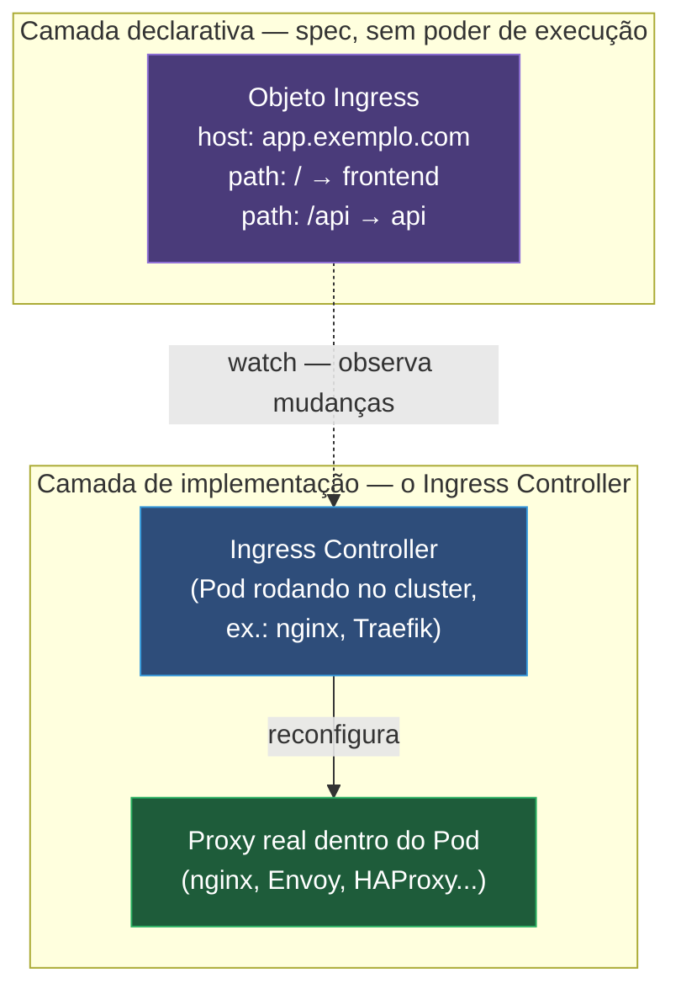
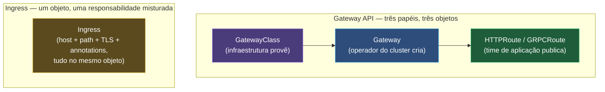
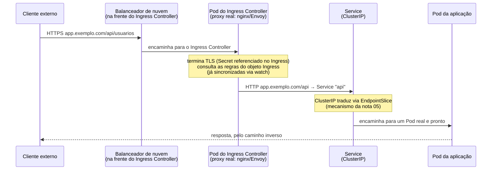

# Ingress e a borda do cluster

> [!abstract] TL;DR
> Expor dez serviços com `type: LoadBalancer`, um por um, significa dez balanceadores do provedor de nuvem, dez IPs públicos e dez faturas — e mesmo assim nada ali roteia por caminho de URL nem termina TLS num só lugar. Falta uma camada HTTP na borda, e o objeto que a representa é o **Ingress** — só que o Ingress, sozinho, não faz nada: é um conjunto de regras declarativas, sem nenhum poder de executar coisa nenhuma. Quem de fato implementa essas regras é um **Ingress Controller** — um Pod comum, rodando dentro do cluster, observando objetos Ingress via watch e reconfigurando um proxy de verdade a cada mudança. Sem controlador instalado, o api-server aceita o objeto Ingress normalmente e simplesmente o ignora — o sintoma clássico é um Ingress criado, com regras corretas, e o campo `ADDRESS` vazio para sempre. É a mesma lente que este galho inteiro vem repetindo: declarar não é executar, e um objeto sem controller correspondente é, estruturalmente, papel morto.

Imagine o cenário que fecha a lacuna deixada pela nota anterior: uma aplicação com um frontend, uma API e um serviço de métricas, cada um já exposto via um `Service` do tipo `LoadBalancer` — três balanceadores distintos, três IPs públicos, três entradas de DNS apontando cada uma para o seu próprio endereço. Funciona, tecnicamente, mas custa proporcionalmente ao número de serviços expostos, não ao tráfego que eles recebem — cada balanceador de nuvem tem uma fatura própria, independente de estar servindo cem requisições por segundo ou uma por hora. E o problema não é só custo: nenhum desses três `LoadBalancer`s sabe rotear `app.exemplo.com/` para o frontend e `app.exemplo.com/api` para a API dentro do **mesmo** domínio — cada `Service` do tipo `LoadBalancer` enxerga só as portas TCP que ele mesmo expõe, sem noção nenhuma de caminho de URL, porque a nota [[03-Dominios/Tecnologia/Infraestrutura/Kubernetes/05 - Service|05 — Service]] já deixou claro que um Service opera na camada de transporte, não na de aplicação. Terminação de TLS centralizada, um certificado por domínio em vez de um por serviço, roteamento por host e por caminho — nada disso existe nessa combinação de três `LoadBalancer`s isolados, por mais que cada um, individualmente, funcione perfeitamente.

A resposta não é inventar um quarto tipo de Service — é subir uma camada acima do transporte e introduzir um objeto que entenda HTTP de verdade: hosts, caminhos, certificados. Esse objeto existe, chama-se **Ingress**, e o jeito mais rápido de errar sua leitura é tratá-lo como mais um tipo de Service com superpoderes. Não é. A distinção que esta nota inteira desenvolve — e que é, sem exagero, a peça mais importante para não se perder ao trabalhar com Ingress no dia a dia — é que o Ingress **declara** intenção de roteamento HTTP, exatamente como qualquer outro objeto deste galho declara uma `spec`, e outro processo, separado, observa essa declaração e a torna real.

## A separação que confunde todo mundo

Vale nomear com precisão máxima, porque é o coração desta nota: um objeto `Ingress` é **só um conjunto de regras**, gravado no etcd via api-server, exatamente como qualquer outro objeto que este galho já descreveu. Ele não escuta porta nenhuma, não termina conexão TLS nenhuma, não redireciona pacote nenhum — nenhuma dessas ações acontece por conta própria do objeto Ingress em si. Quem faz todo esse trabalho é um processo à parte, o **Ingress Controller**: nginx Ingress Controller, Traefik, HAProxy Ingress, o controlador nativo de um provedor de nuvem (AWS Load Balancer Controller, GKE Ingress Controller), e uma lista crescente de outras implementações. Um Ingress Controller é, na prática mais crua possível, **um Pod rodando dentro do cluster**, como qualquer outro Pod deste galho — só que esse Pod específico mantém aberto um watch contra os objetos `Ingress` do cluster inteiro (ou de um subconjunto deles, como a seção sobre `IngressClass` detalha adiante), e reage a cada mudança reconfigurando um proxy HTTP de verdade que ele mesmo executa internamente.



Essa é a lente do galho aplicada de novo, no seu ponto mais literal: declarar não é executar. É exatamente o mesmo argumento que a nota [[03-Dominios/Tecnologia/Infraestrutura/Kubernetes/02 - O loop de reconciliação|02 — O loop de reconciliação]] estabeleceu para `kubectl apply` terminando no etcd, e que a nota [[03-Dominios/Tecnologia/Infraestrutura/Kubernetes/05 - Service|05 — Service]] repetiu para o `type: LoadBalancer` — um Service `LoadBalancer` também não provisiona nada sozinho, depende de um *cloud controller manager* observando e agindo. Ingress é a mesma peça de novo, um andar acima na pilha HTTP: uma `spec` sem poder de execução própria, um controller externo que observa e converge.

Vale nomear que "Ingress Controller" não é sinônimo de um único produto — existe uma família inteira de implementações, cada uma com um proxy real diferente por trás: o **nginx Ingress Controller** (o mais adotado, construído sobre o servidor nginx), **Traefik** (proxy moderno, com suporte nativo a Let's Encrypt embutido), **HAProxy Ingress**, controladores baseados em Envoy como **Contour** e **Emissary-Ingress**, e os controladores nativos de cada provedor de nuvem — o **AWS Load Balancer Controller** e o **GCE Ingress Controller** entre os mantidos oficialmente pelo próprio projeto Kubernetes, além de implementações de terceiros como as de Azure, Oracle Cloud e F5. Nada nessa lista concorre por exclusividade dentro de um cluster — a seção sobre `IngressClass`, adiante, mostra exatamente como dois ou mais desses controladores coexistem no mesmo cluster, cada um respondendo por um subconjunto diferente de objetos Ingress.

O sintoma diagnóstico dessa separação, quando alguém instala Ingress pela primeira vez sem ter instalado nenhum controller, é sempre o mesmo, e vale reconhecê-lo de cara:

```bash
kubectl apply -f meu-ingress.yaml
kubectl get ingress meu-ingress
```

```
NAME          CLASS   HOSTS               ADDRESS   PORTS     AGE
meu-ingress   nginx   app.exemplo.com               80, 443   2m
```

O `apply` retorna sucesso — o api-server validou o objeto e gravou a intenção no etcd normalmente, porque a estrutura do YAML está correta e nada no `Ingress` em si depende de um controller existir para ser aceito. A coluna `ADDRESS`, porém, fica vazia — não por alguns segundos, como uma convergência normal em andamento, mas indefinidamente, porque não existe nenhum processo no cluster assumindo a responsabilidade de materializar aquela intenção. É o mesmo `<pending>` eterno que a nota 05 já descreveu para um `Service` `LoadBalancer` sem cloud controller manager, só que aqui a ausência é de um Ingress Controller inteiro, não de um provedor de nuvem específico.

## As regras: como uma requisição HTTP encontra o Service certo

O corpo de um objeto `Ingress` organiza regras em torno de duas coordenadas: **host** (o domínio pelo qual a requisição chegou) e **caminho** (o segmento de URL depois do domínio). Um manifesto simples, com um único host e duas rotas por caminho, já mostra a estrutura inteira:

```yaml
apiVersion: networking.k8s.io/v1
kind: Ingress
metadata:
    name: app-ingress
spec:
    ingressClassName: nginx
    rules:
        - host: app.exemplo.com
          http:
              paths:
                  - path: /
                    pathType: Prefix
                    backend:
                        service:
                            name: frontend
                            port:
                                number: 80
                  - path: /api
                    pathType: Prefix
                    backend:
                        service:
                            name: api
                            port:
                                number: 8080
```

Repare no detalhe estrutural mais fácil de deixar passar: cada `backend` aponta para um **Service**, nunca para um Pod diretamente — nenhum campo do Ingress carrega um `selector` de label nem uma lista de endereços de Pod, exatamente a mesma indireção que a nota 05 já descreveu para o próprio Service em relação ao EndpointSlice, só que aqui numa camada acima. Uma requisição que chega em `app.exemplo.com/` casa com a primeira regra e é encaminhada ao Service `frontend`, porta `80`; uma requisição em `app.exemplo.com/api/usuarios` casa com o prefixo `/api` e vai para o Service `api`, porta `8080`. Se `host` for omitido numa regra, ela se aplica a qualquer domínio que chegar ao controlador sem casar antes com uma regra mais específica — uma forma de regra "pega-tudo", útil sobretudo quando um único Ingress Controller atende múltiplos domínios com uma regra genérica de fallback.

### `pathType`: por que a escolha entre os três valores importa

O campo `pathType`, presente em cada entrada de `paths`, decide **como** o caminho declarado é comparado contra o caminho real da requisição, e os três valores possíveis produzem resultados bem diferentes para o mesmo texto de caminho:

| `pathType` | Comportamento |
|---|---|
| `Prefix` | Casa por segmento de caminho — `/api` casa com `/api`, `/api/`, `/api/usuarios`, mas não com `/apis` (um segmento diferente, mesmo com prefixo textual igual) |
| `Exact` | Casa só com o caminho idêntico, byte a byte, incluindo diferenciação de maiúsculas/minúsculas — `/api` não casa com `/api/` nem com `/API` |
| `ImplementationSpecific` | O casamento depende inteiramente de como o Ingress Controller específico interpreta o campo `path` — pode aceitar expressões regulares ou outra sintaxe própria, sem garantia de comportamento igual entre controladores diferentes |

A armadilha mais comum nasce exatamente da diferença entre `Prefix` e o que a intuição de "prefixo de string" sugeriria: `Prefix` casa por **segmento de caminho** delimitado por `/`, não por prefixo textual cru — é por isso que `/api` com `pathType: Prefix` não intercepta acidentalmente uma rota `/apiv2` que por acaso comece com as mesmas quatro letras. `ImplementationSpecific` é o valor mais arriscado dos três precisamente por não ter significado único definido na especificação — o mesmo manifesto, aplicado contra dois Ingress Controllers diferentes, pode produzir comportamento de roteamento distinto, o que já causou incidente real em migrações de um controlador para outro sem que ninguém tivesse motivo óbvio para desconfiar do YAML em si.

### Backend padrão: para onde vai o que não casa com nenhuma regra

Um Ingress pode declarar um `defaultBackend`, o destino de qualquer requisição que não case com nenhuma regra declarada em `rules` — útil como página de erro customizada, ou como comportamento explícito em vez de deixar o controlador decidir sozinho o que fazer com tráfego não roteado:

```yaml
apiVersion: networking.k8s.io/v1
kind: Ingress
metadata:
    name: app-ingress
spec:
    ingressClassName: nginx
    defaultBackend:
        service:
            name: pagina-404-customizada
            port:
                number: 80
    rules:
        - host: app.exemplo.com
          http:
              paths:
                  - path: /
                    pathType: Prefix
                    backend:
                        service:
                            name: frontend
                            port:
                                number: 80
```

Se `spec.rules` estiver totalmente ausente — um Ingress sem regra nenhuma, só com `defaultBackend` — o objeto vira, na prática, um redirecionamento incondicional de todo o tráfego que o controlador recebe para um único Service, cenário raro fora de um teste isolado, mas útil para entender que `defaultBackend` é, ele mesmo, um destino válido, não uma exceção especial dentro do modelo.

## Múltiplos hosts num único objeto: hospedagem virtual por nome

Nada obriga um Ingress a se limitar a um único host — a lista `rules` aceita quantas entradas forem necessárias, cada uma com seu próprio conjunto de caminhos, o que permite a um único objeto Ingress (atendido por um único controlador, por trás de um único balanceador de nuvem) servir múltiplos domínios completamente distintos, um comportamento clássico chamado **hospedagem virtual por nome** (*name-based virtual hosting*):

```yaml
apiVersion: networking.k8s.io/v1
kind: Ingress
metadata:
    name: multi-dominio
spec:
    ingressClassName: nginx
    tls:
        - hosts:
              - app.exemplo.com
              - admin.exemplo.com
          secretName: exemplo-wildcard-tls
    rules:
        - host: app.exemplo.com
          http:
              paths:
                  - path: /
                    pathType: Prefix
                    backend:
                        service:
                            name: frontend
                            port:
                                number: 80
        - host: admin.exemplo.com
          http:
              paths:
                  - path: /
                    pathType: Prefix
                    backend:
                        service:
                            name: painel-admin
                            port:
                                number: 80
```

O controlador decide qual regra aplicar olhando primeiro para o cabeçalho `Host` (ou a extensão SNI, no caso de TLS, resolvida antes mesmo do handshake terminar) da requisição recebida, e só depois considera o caminho dentro da regra daquele host específico — é por isso que dois hosts diferentes podem reutilizar o mesmo caminho (`/` em ambos os exemplos acima) sem colisão nenhuma entre si, porque o host já os separou antes de qualquer comparação de caminho acontecer. Nada impede, também, espalhar hosts diferentes por objetos `Ingress` separados em vez de um único objeto — a escolha entre consolidar tudo num Ingress ou dividir por domínio é, majoritariamente, uma questão de organização de manifesto e de quem tem permissão de editar cada um, não uma limitação técnica do mecanismo em si.

## `IngressClass`: como o cluster sabe qual controlador atende qual Ingress

> [!warning] O `ingress-nginx` foi aposentado — leia antes de copiar os exemplos abaixo
> Os exemplos desta nota usam `k8s.io/ingress-nginx` como controlador porque ele foi, por muitos anos, o padrão de fato do ecossistema — e continua sendo o que você mais vai encontrar em cluster existente. Mas **ele não é mais uma escolha válida para instalação nova.** Em 11 de novembro de 2025, o SIG Network e o Security Response Committee do Kubernetes anunciaram sua aposentadoria: manutenção de melhor esforço até **março de 2026** e, depois disso, *"no further releases, no bugfixes, and no updates to resolve any security vulnerabilities that may be discovered"*. O repositório está arquivado. O README do projeto usa o pretérito e recomenda, para quem ainda não o usa, adotar uma implementação de **Gateway API**. Implantações existentes seguem funcionando e os artefatos continuam disponíveis — o que não existe mais é correção de vulnerabilidade num componente exposto diretamente à internet. **Atenção à distinção:** o que foi aposentado é o **controlador**, não a **API de Ingress** — esta segue congelada, porém suportada, como a seção sobre Gateway API mais adiante detalha.


Um cluster raramente tem só um Ingress Controller instalado — é comum coexistir, por exemplo, um controlador interno para tráfego de aplicações comuns e outro dedicado a uma API que exige um recurso específico (autenticação mútua TLS, um limite de corpo de requisição maior, um protocolo diferente). O objeto **IngressClass** é a peça que resolve a pergunta "qual dos controladores instalados deveria processar este Ingress específico?", referenciada pelo campo `ingressClassName` de cada Ingress:

```yaml
apiVersion: networking.k8s.io/v1
kind: IngressClass
metadata:
    name: nginx
    annotations:
        ingressclass.kubernetes.io/is-default-class: "true"
spec:
    controller: k8s.io/ingress-nginx
```

Cada instalação de Ingress Controller costuma registrar sua própria `IngressClass`, com um nome de sua escolha (`nginx`, `traefik`, `alb`) e um campo `controller` que identifica, de forma única, qual implementação deve reconhecer aquela classe — é esse campo, não o nome da classe em si, que o controlador de fato compara para decidir se um Ingress é seu ou de outro controlador instalado no mesmo cluster. A anotação `ingressclass.kubernetes.io/is-default-class: "true"` marca uma `IngressClass` como padrão: qualquer Ingress que **omita** `ingressClassName` é processado por essa classe padrão, se ela existir; se nenhuma classe estiver marcada como padrão e o Ingress também não declarar `ingressClassName`, o comportamento fica a critério de cada implementação de controlador — algumas processam mesmo assim, outras ignoram o objeto silenciosamente, o que produz o mesmo sintoma de `ADDRESS` vazio já descrito, só que por um motivo de configuração de classe, não de ausência total de controlador.

```bash
kubectl get ingressclass
```

```
NAME    CONTROLLER             PARAMETERS   AGE
nginx   k8s.io/ingress-nginx   <none>       40d
alb     ingress.k8s.aws/alb    <none>       40d
```

Um cluster com essa saída tem dois controladores instalados e prontos para atender Ingress objects — um Ingress com `ingressClassName: alb` é processado pelo AWS Load Balancer Controller, um com `ingressClassName: nginx` (ou sem `ingressClassName`, se `nginx` estiver marcado como padrão) é processado pelo nginx Ingress Controller, ambos coexistindo no mesmo cluster sem conflito, porque cada um só reage a objetos que apontam para a sua própria classe.

## TLS: terminação de certificado na borda

A seção `tls` de um Ingress declara em quais hosts o controlador deve terminar TLS, referenciando um `Secret` que carrega o certificado e a chave privada correspondentes:

```yaml
apiVersion: networking.k8s.io/v1
kind: Ingress
metadata:
    name: app-ingress
spec:
    ingressClassName: nginx
    tls:
        - hosts:
              - app.exemplo.com
          secretName: app-tls
    rules:
        - host: app.exemplo.com
          http:
              paths:
                  - path: /
                    pathType: Prefix
                    backend:
                        service:
                            name: frontend
                            port:
                                number: 80
```

O `Secret` referenciado por `secretName` precisa ser do tipo `kubernetes.io/tls`, um dos tipos nomeados de Secret que a nota [[03-Dominios/Tecnologia/Infraestrutura/Kubernetes/08 - ConfigMap e Secret|08 — ConfigMap e Secret]] já introduziu de passagem, exigindo exatamente duas chaves: `tls.crt` (o certificado, codificado em base64) e `tls.key` (a chave privada correspondente, também em base64):

```yaml
apiVersion: v1
kind: Secret
metadata:
    name: app-tls
type: kubernetes.io/tls
data:
    tls.crt: LS0tLS1CRUdJTiBDRVJUSUZJQ0FURS0tLS0t...
    tls.key: LS0tLS1CRUdJTiBQUklWQVRFIEtFWS0tLS0t...
```

O Ingress Controller lê esse `Secret`, carrega o par certificado/chave dentro do proxy que ele gerencia, e passa a terminar conexões HTTPS para os hosts declarados em `tls.hosts` — o tráfego entre o cliente e o controlador é criptografado, e o tráfego entre o controlador e o Service de destino, na configuração mais comum, volta a ser HTTP simples dentro dos limites da rede do cluster, considerada confiável para esse propósito na maioria dos cenários (o cenário oposto — terminar TLS e reencriptar até o Pod de destino — é possível, mas é configuração extra, não o comportamento default de nenhum controlador popular).

Gerar e renovar esse `Secret` manualmente, certificado por certificado, é exatamente o tipo de trabalho repetitivo que motivou a existência do **cert-manager**: um operator (o mesmo padrão de controller customizado que a nota [[03-Dominios/Tecnologia/Infraestrutura/Kubernetes/19 - Operators|Operators]] detalha) que observa anotações como `cert-manager.io/cluster-issuer` num Ingress, solicita um certificado automaticamente junto a uma autoridade certificadora configurada (Let's Encrypt é a mais comum, mas não a única), e mantém o `Secret` do tipo `kubernetes.io/tls` sempre atualizado, renovando antes do vencimento sem intervenção manual. Aprofundar o funcionamento interno do cert-manager foge do escopo desta nota — basta reconhecer que ele resolve, de forma automatizada, exatamente o mesmo `Secret` que a seção `tls` de um Ingress já sabe consumir sem nenhuma mudança de formato.

## Annotations: a válvula de escape que revela o limite da especificação

A especificação formal de um objeto `Ingress` é deliberadamente mínima — host, caminho, backend, TLS, pouco mais além disso. Qualquer coisa mais específica que uma operação de borda real costuma precisar — reescrever o caminho antes de encaminhar a requisição, limitar o tamanho máximo do corpo de uma requisição, ajustar timeout de conexão, configurar CORS, manter *sticky sessions* por cliente — não tem campo nenhum na especificação padrão do Ingress. Toda essa funcionalidade migrou para **annotations**, e cada uma delas é **específica de cada controlador**:

```yaml
apiVersion: networking.k8s.io/v1
kind: Ingress
metadata:
    name: app-ingress
    annotations:
        nginx.ingress.kubernetes.io/rewrite-target: /$2
        nginx.ingress.kubernetes.io/proxy-body-size: 20m
        nginx.ingress.kubernetes.io/proxy-connect-timeout: "10"
spec:
    ingressClassName: nginx
    rules:
        - host: app.exemplo.com
          http:
              paths:
                  - path: /api(/|$)(.*)
                    pathType: ImplementationSpecific
                    backend:
                        service:
                            name: api
                            port:
                                number: 8080
```

Cada uma dessas três annotations começa com o prefixo `nginx.ingress.kubernetes.io/`, e nenhuma delas tem significado nenhum para o Traefik, para o HAProxy Ingress, ou para o AWS Load Balancer Controller — cada implementação define seu próprio conjunto de annotations reconhecidas, com prefixo próprio, sem obrigação nenhuma de compatibilidade entre si. A consequência é honesta e vale nomear sem rodeio: um Ingress "portável entre controladores" é uma ficção assim que se usa a primeira annotation além do básico — o que, na prática, é quase sempre, porque reescrita de caminho e limite de corpo de requisição são necessidades comuns demais para ficar de fora. Migrar de nginx Ingress Controller para outro controlador, num cluster que já usa um punhado de annotations específicas, não é troca de configuração — é reescrita de parte da configuração de roteamento.

> [!warning] Confundir `ImplementationSpecific` com portabilidade garantida
> O exemplo acima usa `pathType: ImplementationSpecific` justamente porque a expressão regular de captura de grupo (`(/|$)(.*)`) só tem significado para o nginx Ingress Controller interpretando aquela sintaxe específica — outro controlador pode tratar o mesmo texto de caminho de forma totalmente diferente, ou rejeitar o Ingress na validação. Sempre que `pathType` for `ImplementationSpecific`, o manifesto já deixou de ser portável entre implementações, mesmo que nenhuma annotation adicional esteja em uso.

Vale nomear mais um punhado de annotations do nginx Ingress Controller — o mais adotado, e por isso o vocabulário mais comum de se encontrar em produção — para tornar concreto o tamanho real da superfície que vive fora da especificação formal:

```yaml
metadata:
    annotations:
        nginx.ingress.kubernetes.io/enable-cors: "true"
        nginx.ingress.kubernetes.io/cors-allow-origin: "https://app.exemplo.com"
        nginx.ingress.kubernetes.io/affinity: cookie
        nginx.ingress.kubernetes.io/session-cookie-name: sessao-app
        nginx.ingress.kubernetes.io/limit-rps: "20"
```

`enable-cors` e `cors-allow-origin` configuram cabeçalhos de CORS que, sem essa annotation, exigiriam a própria aplicação implementá-los caso a caso; `affinity: cookie` liga sticky session baseada em cookie, útil para uma aplicação com estado de sessão em memória local de um Pod específico — o mesmo problema que a nota [[03-Dominios/Tecnologia/Infraestrutura/Kubernetes/05 - Service|05 — Service]] já mencionou de passagem ao descrever `sessionAffinity` no próprio Service, só que aqui resolvido na borda HTTP, antes mesmo de o tráfego chegar ao Service; `limit-rps` aplica um teto de requisições por segundo por endereço IP de origem, uma proteção básica contra abuso que a especificação do Ingress não prevê de forma nenhuma. Cada uma dessas cinco linhas é, ao mesmo tempo, extremamente útil no dia a dia e uma prova concreta de que a "portabilidade" de um Ingress termina exatamente onde a lista de annotations começa.

## Gateway API: a sucessora, e o que ela resolve de fato

Vale nomear, com honestidade sobre o estado atual, o desenvolvimento mais relevante e mais recente nessa área da rede do cluster. A **Gateway API** nasceu como um projeto próprio dentro do Kubernetes (`sig-network`) para resolver exatamente as três limitações que a seção anterior expôs: expressividade (timeout, TLS, reescrita e outras configurações comuns viram campos de primeira classe da própria API, não annotations de terceiros), separação de papéis (um modelo com três personas distintas — quem provê a infraestrutura de borda, via `GatewayClass`; quem opera o cluster e cria pontos de entrada, via `Gateway`; e quem publica rotas de aplicação, via `HTTPRoute` e objetos irmãos — cada um com seu próprio objeto e seu próprio nível de permissão, em vez de um único objeto Ingress que mistura as três responsabilidades) e tipagem em vez de string livre (campos estruturados, validados pelo schema da API, em vez de uma annotation cujo formato só o controlador de destino sabe interpretar).

A documentação oficial confirma que a Gateway API atingiu **Estabilidade Geral (GA)** com a versão 1.0, lançada em outubro de 2023: os três recursos centrais do canal *Standard* — `GatewayClass`, `Gateway` e `HTTPRoute` — graduaram de beta para `v1`, junto com `GRPCRoute`, também estável. A própria documentação do Kubernetes é explícita ao afirmar que a Gateway API é a **sucessora** da API de Ingress — mas "sucessora" não significa "substituição imediata": a documentação oficial também registra que a API de Ingress está **congelada**, sem receber novos campos, mas continua estável e suportada, sem data anunciada de descontinuação. Migrar exige esforço deliberado — não é uma troca automática de nenhum cluster existente — e convivência das duas APIs no mesmo cluster, durante um período de transição, é o cenário mais comum de longe, não a exceção.



> [!info] Baseline de versão
> Gateway API atingiu GA com a versão 1.0 em outubro de 2023, com `GatewayClass`, `Gateway`, `HTTPRoute` e `GRPCRoute` estáveis no canal *Standard* (`v1`) em clusters correntes (2026). A API de Ingress, em contraste, está congelada — sem novos campos previstos — mas segue estável e amplamente suportada; não existe, até o momento desta nota, prazo oficial de descontinuação. Vale conferir a documentação oficial de referência (`kubernetes.io/docs/concepts/services-networking/gateway/`) antes de assumir qual recurso específico da Gateway API já é estável num cluster e numa versão de controlador específicos, porque parte do escopo mais novo (TLS avançado entre gateway e backend, por exemplo) ainda vive no canal experimental.

Vale marcar, com a mesma honestidade, onde esta nota deliberadamente para: a **prática** de operar a borda com Gateway API — como desenhar a divisão de papéis num time real, como migrar um Ingress existente sem downtime, como isso se combina com um service mesh — é assunto de [[03-Dominios/Engenharia/Operação/3 - Rodar em produção/05 - Rede e borda em produção|Rede e borda em produção]], no domínio de Operação. Escrever essa prática aqui produziria uma versão pior do que já existe em outro lugar do vault; aqui bastava entender o objeto Ingress como mecanismo, e reconhecer para onde o ecossistema está indo.

## Do tráfego externo ao Pod: onde o Ingress atua, e onde ele para

Vale fechar o corpo técnico consolidando, num único diagrama, o caminho completo que uma requisição HTTP percorre desde fora do cluster até o container que de fato responde — deixando explícito em que ponto exato o objeto Ingress participa, e em que ponto ele já não participa de nada.



Repare que o objeto `Ingress` em si não aparece em nenhum ponto **deste** diagrama de tráfego — ele já fez seu trabalho antes, na configuração do proxy dentro do Pod do controlador, através do watch descrito na primeira seção. O Ingress é **configuração**, não **caminho de dados**: nenhum pacote de nenhuma requisição real passa "através" do objeto Ingress, porque o objeto Ingress não é um processo, é uma entrada de dados que o controlador leu, uma vez, para decidir como configurar o proxy que de fato intercepta e roteia tráfego. É a mesma distinção, mais uma vez, entre a `spec` que se declara e o mecanismo que a torna real — só que agora aplicada à camada mais visível do cluster, a que qualquer cliente externo, sem noção nenhuma do que é um Pod ou um Service, de fato toca.

## Diagnosticando um Ingress que "não funciona"

A mesma disciplina de diagnóstico que a nota 05 já ensinou para um Service que não roteia se aplica aqui, só que numa camada acima — e vale seguir a mesma ordem de investigação, do mais estrutural para o mais específico, em vez de adivinhar.

O primeiro comando confirma se existe controlador algum reconhecendo o objeto:

```bash
kubectl get ingress app-ingress
```

```
NAME          CLASS   HOSTS               ADDRESS         PORTS     AGE
app-ingress   nginx   app.exemplo.com     34.120.10.55    80, 443   4d
```

Uma coluna `ADDRESS` preenchida já confirma que algum controlador está reconhecendo e processando aquele objeto — o problema, se ainda existir, está em outro lugar da cadeia. Uma coluna `ADDRESS` vazia, revisitando o diagnóstico já apresentado, aponta de volta para ausência de controlador ou de `IngressClass` compatível.

O segundo passo, quando o `ADDRESS` está preenchido mas o roteamento ainda falha, é olhar os eventos do próprio objeto — a mesma fonte de diagnóstico que a nota [[03-Dominios/Tecnologia/Infraestrutura/Kubernetes/02 - O loop de reconciliação|02 — O loop de reconciliação]] já apresentou como o lugar onde o cluster registra o que tentou fazer e o que deu errado:

```bash
kubectl describe ingress app-ingress
```

```
Events:
  Type     Reason  Age   From                      Message
  ----     ------  ----  ----                      -------
  Normal   Sync    2m    nginx-ingress-controller  Scheduled for sync
  Warning  Sync    2m    nginx-ingress-controller  Service "api" not found
```

Um evento `Warning` referenciando um Service inexistente ou um `secretName` de TLS que não existe é o tipo de erro que `kubectl describe` revela imediatamente, e que o `apply` original nunca teria mostrado — a mesma distância entre "aplicado" e "de fato funcionando" que a nota 02 já descreveu para qualquer outro objeto deste galho, agora vista na borda do cluster.

Se os eventos do objeto Ingress não denunciarem nada óbvio, o terceiro passo é olhar os logs do próprio Pod do controlador — porque é ele, não o api-server, quem de fato tenta rotear cada requisição e reporta a falha real:

```bash
kubectl get pods -n ingress-nginx
kubectl logs -n ingress-nginx deploy/ingress-nginx-controller --tail=50
```

Requisições que chegam ao proxy mas não encontram backend saudável costumam aparecer nesses logs como um `502` ou `503` do próprio nginx (ou equivalente, dependendo do controlador), com o nome do Service de destino explícito na linha — o que, de novo, leva de volta ao mesmo diagnóstico de EndpointSlice vazio que a nota 05 já ensinou, só que descoberto por um caminho diferente.

> [!warning] `describe ingress` mostra o que o controlador reportou de volta — nem todo controlador reporta tudo
> Nem toda implementação de Ingress Controller escreve eventos detalhados de volta no objeto `Ingress` — alguns controladores são mais verbosos nos próprios logs do Pod do que nos eventos do cluster. Quando `kubectl describe ingress` não mostra nada de útil além de `Sync`, os logs do Pod do controlador continuam sendo a fonte de verdade mais confiável, não um recurso de último caso.

## Armadilhas comuns

> [!warning] Criar um Ingress sem nenhum controlador instalado, e esperar que algo aconteça
> Um Ingress aplicado num cluster sem nenhum Ingress Controller rodando é aceito normalmente pelo api-server — a validação de schema não exige controlador nenhum instalado — e fica, para sempre, com `ADDRESS` vazio. Não é um erro transitório nem um bug: é o sintoma exato, e esperado, de uma spec sem nenhum processo observando e agindo sobre ela. A correção é sempre confirmar, antes de qualquer outra investigação, que existe um Pod de Ingress Controller de pé e um `IngressClass` compatível registrado.

> [!warning] Usar `ImplementationSpecific` ou annotations específicas e depois trocar de controlador sem revisar o manifesto
> Um Ingress que depende de `ImplementationSpecific` para expressar reescrita de caminho, ou que usa um punhado de annotations com prefixo `nginx.ingress.kubernetes.io/`, não tem nenhuma garantia de funcionar igual sob outro controlador. Trocar de implementação — de nginx para Traefik, por exemplo, numa migração de infraestrutura — exige reler cada annotation e cada `pathType: ImplementationSpecific` do zero, não só trocar o valor de `ingressClassName`.

> [!warning] Esquecer que o Ingress aponta para um Service, nunca para um Pod
> Um `backend.service.name` que aponta para um Service com `selector` desalinhado — o mesmo erro de digitação de labels que a nota 05 já diagnosticou via EndpointSlice vazio — produz, do lado do Ingress, um erro de gateway (`502 Bad Gateway` ou equivalente, dependendo do controlador), porque o proxy encontra o Service, mas o Service não tem nenhum Pod pronto para encaminhar. O diagnóstico correto continua sendo o mesmo da nota 05: verificar o EndpointSlice do Service referenciado antes de suspeitar do Ingress em si.

> [!warning] Confundir `defaultBackend` ausente com Ingress quebrado
> Um Ingress sem `defaultBackend` declarado, recebendo uma requisição que não casa com nenhuma regra de `rules`, normalmente responde com um erro genérico do próprio controlador (uma página `404` do nginx, por exemplo) — não um erro do Kubernetes, e não um sinal de que o objeto Ingress está malformado. Declarar um `defaultBackend` explícito é sempre opcional, e sua ausência é um comportamento válido, não uma omissão a corrigir por padrão.

> [!warning] Tratar a Gateway API como já obrigatória, ou o Ingress como já obsoleto
> A API de Ingress está congelada, não descontinuada — ela continua sendo a forma mais simples e mais amplamente suportada de expor tráfego HTTP num cluster comum, sem exigir a curva de aprendizado adicional do modelo de três papéis da Gateway API. Migrar prematuramente, sem uma necessidade concreta (multi-tenancy de borda, roteamento avançado, separação de responsabilidade entre times), troca uma solução simples e conhecida por uma mais expressiva, porém mais nova e com um vocabulário próprio ainda em consolidação em parte do seu escopo experimental.

## Como explicar em inglês

| Português | English |
| --- | --- |
| O Ingress é só um conjunto de regras; ele não faz nada sozinho | The Ingress is just a set of rules — it doesn't do anything by itself |
| Sem um Ingress Controller instalado, o objeto é aceito e ignorado | Without an Ingress Controller installed, the object is accepted and ignored |
| `pathType: Prefix` casa por segmento de caminho, não por prefixo de string | `pathType: Prefix` matches by path segment, not by raw string prefix |
| A IngressClass decide qual controlador atende qual Ingress | The IngressClass decides which controller serves which Ingress |
| Um Ingress "portável" deixa de existir na primeira annotation específica de controlador | A "portable" Ingress stops being portable the moment it uses a controller-specific annotation |
| O Ingress é configuração, não caminho de dados | The Ingress is configuration, not the data path |
| A Gateway API é a sucessora do Ingress, mas o Ingress não está descontinuado | Gateway API is the successor to Ingress, but Ingress isn't deprecated |
| O modelo da Gateway API separa papéis entre infraestrutura, cluster e aplicação | The Gateway API model separates roles across infrastructure, cluster, and application |

## O que vem a seguir

> [!info] E o Nginx que roda dentro do controlador?
> Esta nota descreve o Ingress como **objeto** e o controlador como o processo que o implementa — mas para deliberadamente antes de abrir o processo. O que aquele Nginx faz por dentro, como o controlador traduz um objeto Ingress em diretivas de `nginx.conf`, e por que cada mudança de Ingress custa um reload são o assunto de [[03-Dominios/Tecnologia/Infraestrutura/Nginx/14 - Nginx em container e como Ingress Controller|Nginx 14 — Nginx em container e como Ingress Controller]], no galho [[03-Dominios/Tecnologia/Infraestrutura/Nginx/index|Nginx]]. É lá também que estão a precedência do `location`, o comportamento do `proxy_pass` e as fases de processamento de uma request — o mecanismo que as annotations desta nota configuram por baixo.

Esta nota fecha a fase Adepto do galho. O leitor que chegou até aqui sabe usar o Kubernetes de ponta a ponta — declarar, observar, diagnosticar e expor uma aplicação real, do objeto mais simples ao mais visível de fora do cluster. Falta uma pergunta, e é a que abre a fase Magus: tudo isso — api-server, etcd, os controllers que reconciliam, o scheduler que atribui nodes — funciona *como*, por dentro? A próxima nota deste galho, [[03-Dominios/Tecnologia/Infraestrutura/Kubernetes/16 - O control plane por dentro|O control plane por dentro]], abre exatamente essa caixa, mostrando os componentes que até aqui foram tratados como caixas-pretas confiáveis, e como eles conversam entre si para fazer tudo que as quatorze notas anteriores já deram como certo.

## Fontes

- [Kubernetes documentation — Ingress](https://kubernetes.io/docs/concepts/services-networking/ingress/)
- [Kubernetes documentation — Ingress Controllers](https://kubernetes.io/docs/concepts/services-networking/ingress-controllers/)
- [Kubernetes documentation — IngressClass](https://kubernetes.io/docs/concepts/services-networking/ingress/#ingress-class)
- [Kubernetes documentation — Gateway API](https://kubernetes.io/docs/concepts/services-networking/gateway/)
- [Kubernetes blog — Gateway API v1.0: GA Release](https://kubernetes.io/blog/2023/10/31/gateway-api-ga/)
- [Kubernetes API Reference — Ingress v1](https://kubernetes.io/docs/reference/kubernetes-api/networking/ingress-v1/)
- [Kubernetes API Reference — IngressClass v1](https://kubernetes.io/docs/reference/kubernetes-api/networking/ingress-class-v1/)
- [Kubernetes documentation — Secrets: TLS secrets](https://kubernetes.io/docs/concepts/configuration/secret/#tls-secrets)
- [cert-manager documentation](https://cert-manager.io/docs/)
- [ingress-nginx documentation — Annotations](https://kubernetes.github.io/ingress-nginx/user-guide/nginx-configuration/annotations/)
