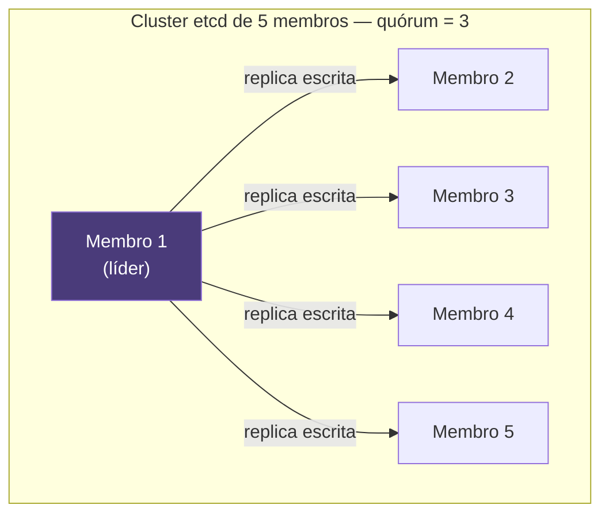
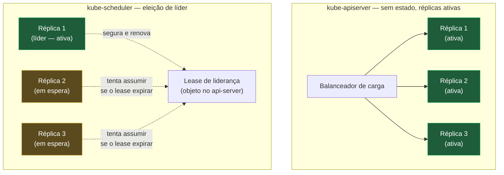
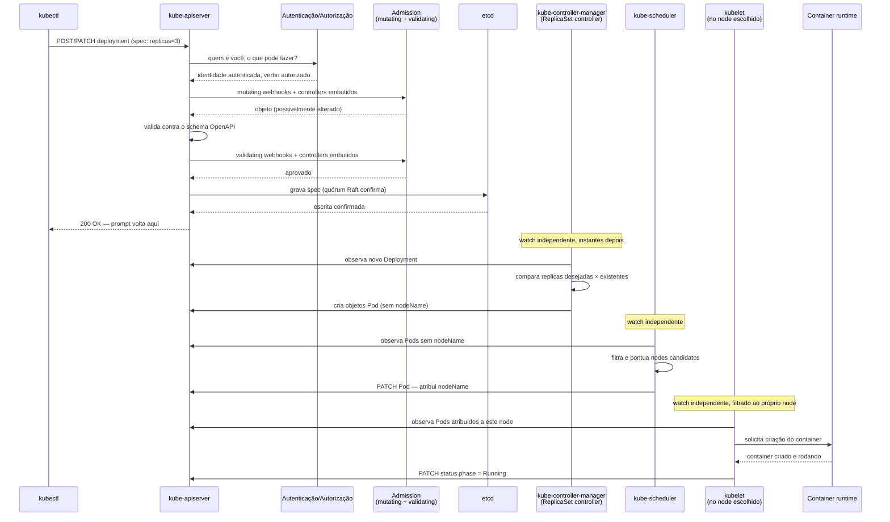

# O control plane por dentro

> [!abstract] TL;DR
> O control plane não é um cérebro central que comanda o cluster — é um punhado de processos independentes que só se falam através do `kube-apiserver`, cada um rodando o mesmo laço observar-comparar-agir sobre uma fatia diferente do estado. Nada, em nenhuma circunstância, fala com o `etcd` diretamente além do próprio api-server: nem scheduler, nem controller-manager, nem kubelet. Toda escrita passa pela mesma cadeia — autenticação, autorização, admission (mutating e depois validating), validação de esquema, persistência — e é a etapa de admission, com seus webhooks configuráveis, o ponto onde ferramentas externas injetam sidecar, aplicam política e podem, por configuração errada de `failurePolicy`, travar escritas no cluster inteiro. O `etcd` é a única fonte da verdade, replicado por consenso Raft, e perder quórum não deixa o cluster "mais lento" — deixa-o incapaz de aceitar qualquer escrita nova. Scheduler e controller-manager toleram múltiplas réplicas porque usam eleição de líder — só um age por vez —, enquanto o api-server tolera múltiplas réplicas ativas ao mesmo tempo, porque não guarda estado nenhum entre uma requisição e a seguinte. Nenhum desses processos chama o outro diretamente; essa ausência de acoplamento é o que permite ao sistema tolerar qualquer um deles caindo, um de cada vez, sem que o cluster pare de existir.

Imagine o tipo de falha que as quinze notas anteriores deste galho nunca precisaram explicar, porque cada uma tratou o cluster como uma caixa que responde de forma confiável: um `kubectl apply` que retorna sucesso, mas nenhum objeto novo aparece em lugar nenhum, minutos depois. Ou um `kubectl get pods` que, num dia normal, leva cem milissegundos, e hoje leva oito segundos, sem que nenhum Pod tenha mudado de estado. Ou um cluster que funcionava bem com cinquenta Deployments e começa a engasgar, de forma difusa, conforme o número de objetos cresce para alguns milhares — sem nenhum erro específico, só uma lentidão generalizada que piora aos poucos. Nenhum desses três sintomas tem diagnóstico possível sem saber, com precisão, quais processos compõem o control plane, o que cada um faz sozinho, e — mais importante ainda — o que cada um **não** faz sozinho, porque depende de outro processo específico para funcionar. A nota [[03-Dominios/Tecnologia/Infraestrutura/Kubernetes/02 - O loop de reconciliação|02 — O loop de reconciliação]] tratou "api-server", "etcd", "controller" e "scheduler" como caixas confiáveis, cada uma cumprindo seu papel no diagrama de sequência que fechou aquela nota, e deixou explícito, por duas vezes, que abrir essas caixas era trabalho para a fase Magus. Este é o momento dessa promessa.

Vale nomear, antes de qualquer peça isolada, o argumento que esta nota inteira defende, porque ele muda a forma de ler tudo que vem a seguir: **não existe coordenação direta entre nenhum dos processos do control plane**. `kube-scheduler` nunca chama `kube-controller-manager`. `kube-controller-manager` nunca chama `kubelet`. Nenhum deles telefona para o outro, publica numa fila própria, ou compartilha memória. Cada um mantém seu próprio watch contra o `kube-apiserver`, cada um roda seu próprio laço de observar, comparar e agir — exatamente o padrão que a nota 02 já formalizou —, e cada um ignora completamente a existência dos demais, exceto na medida em que os objetos que eles leem e escrevem no mesmo lugar comum acontecem de se cruzar. É essa ausência de acoplamento direto, e não nenhuma engenharia sofisticada de tolerância a falha, que explica por que o cluster inteiro não trava quando o `kube-scheduler` reinicia no meio de uma rodada, ou por que um `kube-controller-manager` lento não impede o `kubelet` de continuar relatando o status dos Pods que já estão rodando. Cada peça desta nota — `etcd`, `kube-apiserver`, admission, scheduler, controller-manager, cloud-controller-manager — é, antes de qualquer outra coisa, mais um exemplo desse mesmo padrão.

## `etcd`: a única fonte da verdade

Todo objeto que qualquer nota anterior deste galho já descreveu — cada Pod, cada Deployment, cada Secret, cada RoleBinding — existe, de fato, como uma entrada num armazenamento de chave-valor consistente chamado `etcd`. Não é um banco relacional, não tem noção de junção entre tabelas, não expõe uma linguagem de consulta rica: é, na essência mais crua, um dicionário distribuído, onde a chave é o caminho do recurso (algo como `/registry/deployments/producao/minha-api`) e o valor é a representação serializada do objeto inteiro. Toda leitura que o `kube-apiserver` faz em nome de qualquer cliente — `kubectl`, um controller, um watch de longa duração — origina, em algum momento, uma leitura contra esse armazenamento; toda escrita que o api-server aceita termina, se tudo correr bem, numa escrita nele.

O que torna o `etcd` confiável o suficiente para carregar essa responsabilidade sozinho é o algoritmo de consenso que ele implementa: **Raft**. Um cluster de `etcd` roda, tipicamente, com um número ímpar de membros — três ou cinco, raramente mais — e cada escrita só é considerada confirmada depois que a **maioria** desses membros concordar em replicá-la e persisti-la em disco. Essa maioria tem nome próprio: **quórum**. Para um cluster de `n` membros, o quórum é `(n/2)+1` — dois membros num cluster de três, três membros num cluster de cinco. Vale reparar num detalhe que costuma surpreender quem espera que "mais réplicas" sempre signifique "mais tolerância a falha": um cluster de quatro membros tolera exatamente a mesma quantidade de falhas simultâneas (uma) que um cluster de três — porque o quórum de quatro é três, e perder dois de quatro já é perder o quórum, exatamente como perder dois de três. É por isso que a documentação do próprio `etcd` recomenda números ímpares: eles oferecem a mesma tolerância a falha que o próximo número par, com um membro a menos para manter, replicar e pagar em latência de consenso.



A consequência prática de perder quórum é a mais severa entre todas as que este galho já descreveu para qualquer outro componente: o `etcd` não fica "mais lento" nem "eventualmente consistente" — ele para de aceitar escritas por completo. Sem maioria disponível para confirmar uma proposta de escrita, o algoritmo de Raft nunca a considera comprometida, e o `etcd` simplesmente não responde a ela com sucesso; a documentação oficial do projeto chama perda permanente de quórum de "catastrófica". E porque o `kube-apiserver`, por padrão, exige leitura **linearizável** — a garantia de que toda leitura reflete a escrita confirmada mais recente, o que também depende de consultar a maioria dos membros —, a maior parte das leituras também deixa de responder junto com as escritas: na prática, um cluster Kubernetes inteiro que perde quórum de `etcd` fica, para a esmagadora maioria dos propósitos operacionais, indisponível, não só congelado num estado somente-leitura confortável. `kubectl get` pode até devolver algo em circunstâncias específicas de leitura servida por um membro isolado, mas nenhuma escrita nova — nenhum `apply`, nenhuma reconciliação, nenhum Pod novo — acontece até o quórum ser restaurado.

Essa é a razão, sem rodeio nenhum, pela qual **backup do `etcd` é backup do cluster inteiro**: não existe nenhum outro lugar onde o estado desejado do cluster more. Perder o `etcd` sem backup válido não é perder configuração — é perder a única cópia existente de tudo que já foi declarado, sem nenhum jeito de reconstruir a partir de outra fonte. A ferramenta oficial para esse backup é o snapshot, tirado via `etcdctl snapshot save`, e a disciplina de tirar snapshots com regularidade — e, mais importante ainda, de testar a restauração desses snapshots antes de precisar deles de verdade — é o tipo de manutenção que só parece opcional até o dia em que deixa de ser.

Além do backup, o `etcd` exige duas outras rotinas de manutenção que não são cosméticas: **compactação** e **desfragmentação**. Por padrão, o `etcd` mantém um histórico de versões de cada chave — é esse histórico, de resto, que sustenta o mecanismo de `resourceVersion` e watch que a nota 02 já descreveu em detalhe, porque um watch reconectando depois de uma queda precisa conseguir pedir "tudo que mudou desde a versão X", e essa pergunta só tem resposta enquanto a versão X ainda existir no histórico. Sem compactação periódica, esse histórico cresce sem limite, consumindo espaço em disco e degradando a performance de leitura aos poucos — e é aqui que mora um dos sintomas mais traiçoeiros deste galho inteiro: um cluster com muitos objetos, ou com muita atividade de escrita (um pipeline de CI/CD reaplicando manifestos com frequência, por exemplo), sem compactação configurada corretamente, apresenta latência crescente em **qualquer** chamada de `kubectl`, não porque o `kubectl` tenha ficado mais lento, mas porque cada leitura contra o `etcd` está varrendo um histórico de versões cada vez maior. Desfragmentação é uma segunda etapa, geralmente automatizada junto com a compactação em clusters modernos: depois de compactar entradas antigas, o espaço em disco que elas ocupavam fica marcado como livre, mas não é devolvido ao sistema operacional até uma desfragmentação explícita revalidar os blocos de armazenamento — sem ela, o arquivo de dados do `etcd` no disco pode continuar grande mesmo depois de uma compactação bem-sucedida, até estourar um limite de tamanho configurado (o padrão de alarme é 2 GiB, embora ajustável) e, nesse ponto, o `etcd` entra num modo de alarme que rejeita escritas até que o espaço seja recuperado — mais uma forma de indisponibilidade nascida diretamente de uma manutenção adiada, não de uma falha de hardware.

Vale amarrar a mecânica interna do Raft a um conceito que este vault já formalizou em outro lugar, porque é o mesmo padrão de novo, só que aplicado ao nível de um armazenamento distribuído em vez de um serviço de aplicação: a eleição do membro líder do `etcd` — o único que aceita propostas de escrita novas e as replica para os demais — segue exatamente o mesmo problema geral que [[03-Dominios/Engenharia/Design de Software/Padrões de Projeto/Nuvem e Resiliência/10 - Leader Election|Leader Election]] descreve: garantir que, num grupo de processos, no máximo um assuma um papel exclusivo por vez, mesmo diante de falhas parciais e de mensagens perdidas na rede. Um `etcd` que perde o líder atual — porque a máquina onde ele rodava caiu, ou porque uma partição de rede o isolou dos demais — dispara uma nova eleição entre os membros restantes, e só volta a aceitar escritas depois que um novo líder é escolhido por maioria; essa reeleição, sozinha, costuma resolver em frações de segundo, mas é, ela mesma, mais um exemplo de coordenação sem comando central — nenhum membro do `etcd` "decide" sozinho ser líder, a eleição emerge do protocolo, exatamente como a lente deste galho descreve para o control plane inteiro, um nível acima.

> [!info] Baseline de versão
> A descrição do etcd nesta nota reflete o comportamento das versões estáveis correntes em 2026 (linha 3.5/3.6), com Raft como algoritmo de consenso desde a primeira versão 3.x do projeto. API Priority and Fairness, discutido na próxima seção, atingiu estabilidade (`v1`) e passou a habilitado por padrão na versão 1.29 do Kubernetes. `ComponentStatus`, mencionado na seção de diagnóstico adiante, está formalmente deprecado desde a versão 1.19. Nenhuma dessas três datas muda o mecanismo descrito — a arquitetura de processos independentes conversando só pelo api-server é estável há muito mais tempo do que qualquer uma dessas três marcas — mas vale registrar a baseline para quem estiver comparando contra um cluster mais antigo.

## `kube-apiserver`: a única porta

Se o `etcd` é a única fonte da verdade, o `kube-apiserver` é a única forma de chegar até ela. Vale repetir essa frase com a ênfase que ela merece, porque é o ponto mais fácil de subestimar em qualquer leitura apressada da arquitetura: **nada, absolutamente nada, fala com o `etcd` diretamente** — nem o `kube-scheduler`, nem o `kube-controller-manager`, nem o `kubelet` de nenhum node, nem nenhum operator customizado, por mais privilegiado que seja. Todos esses processos, sem exceção, são clientes HTTP do `kube-apiserver`, exatamente da mesma forma que a nota [[03-Dominios/Tecnologia/Infraestrutura/Kubernetes/07 - kubectl é um cliente de API|07 — kubectl é um cliente de API]] já demonstrou para o `kubectl` de um humano. O `etcd` nem sequer expõe, por padrão, uma superfície de rede alcançável por qualquer processo além do próprio api-server em clusters bem configurados — a comunicação entre os dois é interna ao control plane, protegida por TLS mútuo, e tratada como um detalhe de implementação do api-server, não como um serviço de propósito geral disponível para qualquer cliente do cluster.

Vale tornar essa relação tangível para quem, excepcionalmente, tem acesso administrativo direto ao `etcd` de um cluster próprio — algo raro em qualquer cluster gerenciado, mas comum em ambientes on-premises ou de laboratório. Cada objeto do Kubernetes vive sob um prefixo de chave previsível, o mesmo `/registry/...` que a documentação de referência do próprio projeto usa como convenção:

```bash
ETCDCTL_API=3 etcdctl get /registry/deployments/producao/minha-api --prefix -w json
```

O valor devolvido por esse comando não é o YAML legível que `kubectl get -o yaml` mostra — é a representação binária serializada (Protobuf, por padrão) do mesmo objeto, a forma que o api-server de fato grava e lê do armazenamento. Ninguém opera um cluster de produção lendo o `etcd` dessa forma no dia a dia — é o `kube-apiserver` quem sempre faz essa tradução, servindo JSON ou YAML para qualquer cliente HTTP — mas ver essa camada crua, uma vez, deixa concreto o que "o etcd é a única fonte da verdade" significa na prática: um dicionário de chaves e valores binários, sem noção nenhuma de `Deployment`, `Pod` ou `Service` — esses conceitos existem só na camada do api-server que os lê de volta.

Essa centralização, à primeira vista, parece o oposto do argumento desta nota inteira — um ponto único, obrigatório, por onde tudo passa soa como o "cérebro central" que a lente do galho promete não existir. A resolução dessa aparente contradição é precisa: o `kube-apiserver` é um ponto único de **acesso**, não um ponto único de **decisão**. Ele valida, autoriza, audita e distribui — ele nunca decide, sozinho, em qual node um Pod deveria rodar, nem quantas réplicas um Deployment deveria ter agora. Essas decisões continuam distribuídas entre scheduler, controller-manager e cada controller customizado, cada um lendo do api-server e escrevendo de volta nele, sem que o api-server em si carregue nenhuma lógica de negócio sobre o que fazer com aquele estado. É exatamente essa separação — um portal de acesso comum, decisões distribuídas entre múltiplos observadores independentes — que permite ao api-server ser, ele mesmo, replicado sem nenhuma coordenação especial entre suas réplicas, como a seção sobre alta disponibilidade detalha adiante.

Centralizar o acesso num único ponto compra, de uma vez, quatro garantias que seriam muito mais difíceis de sustentar se qualquer processo pudesse escrever direto no `etcd`: **validação** uniforme (todo objeto passa pelo mesmo schema, não importa quem o está escrevendo), **autorização** uniforme (a cadeia de RBAC descrita na nota [[03-Dominios/Tecnologia/Infraestrutura/Kubernetes/13 - RBAC e ServiceAccount|13 — RBAC e ServiceAccount]] se aplica igualmente a um humano no `kubectl` e a um controller customizado), **auditoria** uniforme (todo o histórico de quem tentou fazer o quê passa por um só lugar, onde pode ser logado de forma consistente) e **watch** uniforme (o mecanismo de observação de longa duração que sustenta o Informer de qualquer controller, descrito na nota 02, é implementado uma única vez, no api-server, em vez de cada cliente precisar reimplementar sua própria forma de vigiar o `etcd`). É também, e vale nomear isso com a mesma honestidade, o gargalo natural do cluster inteiro: toda operação de qualquer natureza — de um `kubectl get pods` isolado a um watch de longa duração mantido por centenas de controllers simultâneos — converge no mesmo processo, e é por isso que a saúde do api-server, sozinha, costuma ser o indicador mais precoce de um cluster sob estresse, muito antes de qualquer sintoma aparecer nos objetos de aplicação em si.

### Priorização e justiça: por que o cluster engasga conforme cresce

Vale voltar, com mais precisão técnica, ao terceiro sintoma da abertura desta nota — um cluster que funcionava bem com cinquenta Deployments e começa a engasgar, de forma difusa, conforme o número de objetos cresce. Uma causa real, distinta da lentidão de disco do `etcd` já descrita, mora dentro do próprio `kube-apiserver`: o mecanismo de **API Priority and Fairness** (APF), estável desde a versão 1.29 e habilitado por padrão em qualquer instalação corrente. Antes de existir, o api-server só tinha dois limites globais e grosseiros de concorrência (`--max-requests-inflight` e `--max-mutating-requests-inflight`) — números fixos de requisições simultâneas, sem nenhuma noção de quem estava mandando o quê. Um único cliente mal comportado — um controller com bug entrando em loop de retry, um script rodando `kubectl get pods --watch` em excesso, um pipeline disparando centenas de `apply` simultâneos — podia consumir a fatia inteira desses limites, deixando toda e qualquer outra requisição, inclusive as vitais para a saúde do cluster, esperando na fila atrás dele.

APF resolve isso classificando cada requisição, à entrada do api-server, através de objetos `FlowSchema` (que casam requisições por identidade do requisitante, verbo, recurso e namespace) contra níveis de prioridade configurados em `PriorityLevelConfiguration` — cada nível com sua própria fatia garantida de concorrência, isolada das demais. Um cluster real, sem nenhuma configuração adicional, já vem com níveis default para requisições de eleição de líder (a mais crítica, porque perdê-la derruba a coordenação entre réplicas de scheduler e controller-manager), requisições de controllers embutidos do sistema, requisições ligadas a Pods, e um nível genérico para o restante do tráfego de usuário. Isso significa que um pipeline de CI disparando um volume anormal de `apply`s, hoje, tende a competir só pela própria fatia de concorrência, sem conseguir esfomear a eleição de líder do scheduler nem os controllers internos do cluster — a diferença exata entre "um cliente barulhento deixa o cluster inteiro lento" e "um cliente barulhento fica ele mesmo mais lento, isolado do resto".

```bash
kubectl get flowschemas
kubectl get prioritylevelconfigurations
```

Vale registrar uma ressalva de escopo, porque é o tipo de detalhe que só aparece depois de um incidente real: requisições de longa duração — `kubectl exec`, tail de logs, um watch aberto por horas — não são contabilizadas da mesma forma pelo mecanismo de concorrência do APF quanto uma requisição comum de curta duração, o que significa que um número grande de watches abertos e esquecidos (um script de depuração antigo, um Informer de um controller mal escrito que nunca fecha conexões) ainda consegue degradar o api-server de um jeito que a classificação por `FlowSchema` sozinha não resolve — é aqui, de novo, que a métrica `apiserver_current_inflight_requests` e a contagem bruta de watches ativos (`apiserver_registered_watchers`) completam o diagnóstico que a classificação por prioridade, sozinha, não cobre.

> [!tip] Vídeo — o incidente real onde essa ressalva vira um control plane no chão
> [**Protecting Your Control Plane: A Deep Dive into kube-apiserver Memory Exhaustion**](https://www.youtube.com/watch?v=1Jno9-3DdA4) (Kevin Neila, Red Hat — Cloud Native Days Austria, ~32 min, EN) é a continuação natural do parágrafo acima, contada como história de incidente: um coletor de logs reiniciou, disparou `LIST` e `WATCH` sobre Pods, nodes e namespaces, e o consumo de memória do node de control plane saltou para a casa das centenas de gigabytes até o api-server entrar em ciclo de crash. O mecanismo que a palestra expõe é o que falta a esta seção: o problema não era **concorrência** — que é o que o APF classifica —, e sim **memória**, porque o api-server materializava o resultado inteiro de um `LIST` em um único bloco e o segurava até o cliente terminar de ler, sem nada limitando essa alocação (o `kube-apiserver` roda sem *resource limits* justamente por ser crítico, então `kube-reserved` e `system-reserved` não protegem; e o `kswapd`, varrendo páginas atrás de memória livre, ainda consome a CPU que sobrava). Ele também traz o número que dá escala ao risco: nos testes sintéticos citados, um único informer custava cerca de 4 GB, e com dezesseis o node ia ao chão. **O que ele não cobre:** `FlowSchema` e `PriorityLevelConfiguration` em detalhe, o Raft do etcd e a cadeia de admission — tudo isto é assunto desta nota e da seguinte. Trecho de destaque [20:28]: *"it gets worse and worse, and that means just one watcher is able to bring down your entire node — and at 16 informers the node was gone."*
>
> Vale a atualização de baseline, verificada no registro oficial do projeto: a correção é a **codificação em streaming das respostas de `LIST`** (KEP-5116 da SIG API Machinery), que passa a enviar os itens um a um em vez de serializar a coleção inteira em memória. Entrou como **beta habilitado por padrão no Kubernetes 1.33**, com estabilidade prevista para a 1.34, e o benchmark oficial registra um pico de memória caindo de cerca de 70 GB para cerca de 3 GB em dez `LIST` concorrentes de 1 GB cada.
>
> 🎬 [Assistir no YouTube](https://www.youtube.com/watch?v=1Jno9-3DdA4)

## A cadeia de processamento de uma requisição

A nota [[03-Dominios/Tecnologia/Infraestrutura/Kubernetes/13 - RBAC e ServiceAccount|13 — RBAC e ServiceAccount]] já nomeou as três etapas pelas quais toda requisição de escrita passa, na ordem: autenticação, autorização, admission. Aquela nota se aprofundou na segunda etapa — o RBAC, os quatro objetos, a mecânica de decidir quem pode fazer o quê. Esta seção completa o quadro, aprofundando a etapa que ficou deliberadamente em aberto: **admission**, a parte menos conhecida da cadeia, e o resto do que o api-server faz depois que autenticação e autorização já aprovaram a requisição.


Repare na ordem exata entre as duas fases de admission e a validação de esquema: **mutating** roda primeiro, depois vem a validação de esquema contra o OpenAPI do recurso, e só então roda **validating**. Essa ordem não é arbitrária — ela existe precisamente para que um plugin mutating tenha a chance de corrigir ou completar um objeto (preencher um campo omitido, injetar um container sidecar, adicionar uma anotação) antes que qualquer verificação de validade seja aplicada sobre o resultado final, e para que a etapa de validating, rodando por último, sempre veja a versão definitiva do objeto — já mutada, já com o schema conferido — em vez de uma versão intermediária que ainda vai mudar.

Dentro de cada uma dessas duas fases, existem dois tipos de plugin coexistindo. Os **admission controllers embutidos** são código compilado dentro do próprio binário do api-server, habilitados ou desabilitados por flag na inicialização do processo — cada cluster tem um conjunto default de embutidos ativos, e vale nomear alguns dos mais relevantes para entender o tipo de comportamento estrutural que eles cobrem, sem depender de nenhuma política customizada:

| Admission controller embutido | Fase | O que faz |
|---|---|---|
| `NamespaceLifecycle` | Validating | Impede criar objetos num namespace que já está sendo removido, ou num namespace que nunca existiu |
| `LimitRanger` | Mutating | Aplica limites de recurso default declarados por um `LimitRange` a containers que não especificaram `resources` |
| `ResourceQuota` | Validating | Rejeita uma criação que estouraria uma cota (`ResourceQuota`) já consumida no namespace |
| `DefaultStorageClass` | Mutating | Preenche a `StorageClass` de um `PersistentVolumeClaim` que não declarou uma explicitamente |
| `PodSecurity` | Validating | Aplica o padrão de segurança (`Privileged`, `Baseline`, `Restricted`) configurado por label no namespace, sucessor do antigo PodSecurityPolicy |
| `ServiceAccount` | Mutating | Preenche `serviceAccountName` com `default` quando um Pod não declara nenhuma, e monta o token projetado |
| `MutatingAdmissionWebhook` | Mutating | Delega a decisão para webhooks externos configurados via `MutatingWebhookConfiguration` |
| `ValidatingAdmissionWebhook` | Validating | Delega a decisão para webhooks externos configurados via `ValidatingWebhookConfiguration` |

Repare que os dois últimos da tabela não são, eles mesmos, política nenhuma — são só a ponte que entrega a decisão de política para fora do processo do api-server. Esses controllers embutidos cobrem comportamento estrutural do próprio Kubernetes — nada específico de uma organização, nada que dependa de política customizada.

É para cobrir exatamente essa política customizada que existem os **webhooks de admission** — `MutatingAdmissionWebhook` e `ValidatingAdmissionWebhook`, eles mesmos admission controllers embutidos, cuja única função é delegar a decisão real para um serviço HTTP externo, configurado através dos objetos `MutatingWebhookConfiguration` e `ValidatingWebhookConfiguration`. É esse mecanismo — não nenhuma mágica interna do api-server — que sustenta praticamente todo comportamento de política que um cluster de produção real costuma exigir: injetar um container sidecar de proxy de service mesh em todo Pod de um namespace (um webhook mutating), recusar qualquer Pod sem `resources.limits` declarado (um webhook validating), reescrever a imagem de um container para apontar a um registry interno espelhado (mutating de novo), ou rejeitar um objeto que viole uma política corporativa de segurança expressa numa ferramenta como o Kyverno ou o OPA Gatekeeper (validating). Cada um desses webhooks é, ele mesmo, só mais um Pod rodando dentro do cluster — exatamente como um Ingress Controller, descrito na nota [[03-Dominios/Tecnologia/Infraestrutura/Kubernetes/15 - Ingress e a borda do cluster|15 — Ingress e a borda do cluster]] — expondo um endpoint HTTPS que o api-server chama de forma síncrona, no meio da própria requisição de escrita, esperando uma resposta antes de continuar.

```yaml
apiVersion: admissionregistration.k8s.io/v1
kind: ValidatingWebhookConfiguration
metadata:
    name: exige-resource-limits
webhooks:
    - name: exige-limits.exemplo.com
      clientConfig:
          service:
              name: validador-de-politica
              namespace: governanca
              path: /validar
      rules:
          - apiGroups: [""]
            apiVersions: ["v1"]
            operations: ["CREATE", "UPDATE"]
            resources: ["pods"]
      failurePolicy: Fail
      timeoutSeconds: 5
      sideEffects: None
      admissionReviewVersions: ["v1"]
```

É exatamente esse caráter síncrono que produz o efeito colateral mais sério que qualquer peça deste galho já descreveu: **um webhook indisponível ou lento pode travar escritas no cluster inteiro**, e a única coisa que decide se isso acontece é um único campo, `failurePolicy`. Com `failurePolicy: Fail` — o valor mais seguro do ponto de vista de garantir que a política sempre seja aplicada, e por isso o mais comum em clusters que levam segurança a sério —, uma requisição cujo webhook não responde dentro do `timeoutSeconds` configurado (o padrão documentado é dez segundos, mas configurável para valores mais curtos) é rejeitada com erro, exatamente como se o webhook tivesse recusado o objeto de propósito. Se aquele webhook cobre um recurso amplo — `pods`, por exemplo, em vez de um recurso raro e específico — e o Pod que o implementa cai, ou fica sobrecarregado, ou perde conectividade de rede temporariamente, o resultado não é "aquele Deployment específico falha": é **todo `CREATE` e `UPDATE` de Pod no cluster inteiro passa a falhar**, incluindo, de forma particularmente perigosa, a tentativa do próprio controller responsável por recriar o Pod que hospeda o webhook — um ciclo em que o mecanismo criado para proteger o cluster acaba impedindo sua própria recuperação. Com `failurePolicy: Ignore`, o oposto acontece: um webhook fora do ar é simplesmente pulado, e a requisição prossegue sem a política ser aplicada — o que evita a paralisia total, mas abre uma janela real em que objetos que deveriam ter sido barrados passam despercebidos, sem nenhum log de erro óbvio apontando que algo foi ignorado.

> [!warning] Um webhook de admission mal configurado é uma das piores falhas operacionais possíveis
> Não porque seja rara — é relativamente comum, sobretudo depois de instalar uma ferramenta nova de política ou de service mesh sem revisar `failurePolicy` e `timeoutSeconds` com cuidado — mas porque o sintoma inicial (`Error creating: context deadline exceeded` ou `Internal error occurred: failed calling webhook`) não aponta, de forma óbvia, para "o pequeno serviço de validação de política caiu". O diagnóstico correto passa sempre por listar `kubectl get validatingwebhookconfigurations,mutatingwebhookconfigurations` e verificar, para cada um, se o serviço referenciado em `clientConfig` está de pé e respondendo — antes de suspeitar de qualquer outra coisa no cluster.

Nem todo webhook precisa cobrir todo objeto do cluster, e é aqui que o campo `namespaceSelector` (ou `objectSelector`, filtrando por label do próprio objeto) reduz drasticamente o raio de explosão de uma falha desse tipo: um webhook que só se aplica a namespaces marcados com uma label específica, em vez de a todo o cluster, limita o impacto de sua própria indisponibilidade ao subconjunto de namespaces que efetivamente dependem dele — uma prática de bom senso que qualquer instalação de webhook em produção deveria adotar por padrão, não como afterthought depois do primeiro incidente.

## `kube-scheduler` e `kube-controller-manager`: clientes do api-server, vistos de fora

A nota [[03-Dominios/Tecnologia/Infraestrutura/Kubernetes/12 - Scheduling|12 — Scheduling]] já detalhou, em profundidade, **como** o `kube-scheduler` escolhe um node para um Pod — filtros, pontuação, afinidade, taints e tolerations. O que aquela nota não precisou nomear, porque bastava tratar o scheduler como uma caixa que decide, é o que ele é, visto de fora, agora que esta nota já estabeleceu o vocabulário: o `kube-scheduler` é **um cliente comum do api-server**, exatamente como qualquer controller — mantém um watch sobre Pods recém-criados sem `nodeName` atribuído, roda o próprio laço observar-comparar-agir (observar Pods pendentes, comparar contra os nodes disponíveis, agir escrevendo a atribuição de volta), e nunca fala com o `kubelet` de nenhum node diretamente. A atribuição que o scheduler produz é só mais uma escrita no api-server — um `PATCH` no campo `spec.nodeName` do Pod — e é o próprio `kubelet` daquele node, mantendo seu próprio watch independente, quem percebe essa escrita depois, por conta própria, sem que o scheduler jamais tenha precisado chamá-lo.

Vale nomear, sem repetir o que a nota 12 já cobriu, um paralelo arquitetural que só faz sentido depois de entender admission: o `kube-scheduler`, internamente, é ele mesmo organizado como uma cadeia de plugins — a *Scheduling Framework* —, com pontos de extensão nomeados (`PreFilter`, `Filter`, `Score`, `Reserve`, `Permit`, `Bind`, entre outros) que rodam em sequência para cada Pod pendente, cada um podendo ser estendido por um plugin customizado sem recompilar o binário inteiro. É o mesmo espírito de "núcleo com pontos de extensão nomeados" que a cadeia de admission já demonstrou para o api-server, só que aplicado à decisão de posicionamento em vez de à decisão de aceitar ou não um objeto — mais uma confirmação de que "pontos de extensão bem definidos, coordenados por um estado comum" é um padrão recorrente na arquitetura do Kubernetes, não uma peculiaridade isolada de nenhum componente específico.

O `kube-controller-manager`, por sua vez, não é um único controller — é **um processo que hospeda dezenas de controllers embutidos**, cada um cuidando de uma fatia diferente do estado do cluster, todos compilados dentro do mesmo binário e rodando como goroutines dentro do mesmo processo do sistema operacional. É exatamente esse processo — não uma entidade abstrata — que a nota [[03-Dominios/Tecnologia/Infraestrutura/Kubernetes/02 - O loop de reconciliação|02 — O loop de reconciliação]] chamou, de forma genérica, de "o controller" toda vez que descreveu o ReplicaSet controller reconciliando réplicas. Vale nomear alguns dos controllers reais que vivem dentro desse único processo, porque cada um governa exatamente um tipo de objeto ou uma relação entre tipos, sem nenhuma sobreposição de responsabilidade entre si:

| Controller | O que reconcilia |
|---|---|
| Deployment controller | Cria e atualiza ReplicaSets para bater a `spec` de um Deployment, coordenando o rollout gradual |
| ReplicaSet controller | Cria e remove Pods para bater `spec.replicas` de um ReplicaSet |
| Node controller | Observa o `Lease` de cada node (o "batimento cardíaco" descrito na nota 02) e marca a condição `Ready` quando ele para de chegar |
| Job controller | Cria Pods para um Job até atingir `completions`, respeitando `backoffLimit` |
| EndpointSlice controller | Mantém o EndpointSlice de cada Service sincronizado com os Pods prontos que casam o seletor |
| Namespace controller | Executa a remoção em cascata de todo objeto de um namespace quando ele é apagado |
| Garbage collector | Observa `ownerReferences` e remove objetos órfãos quando o dono deixa de existir, mecanismo já descrito na nota 02 |
| ServiceAccount controller | Garante que todo namespace tenha uma ServiceAccount `default`, comportamento já observado na nota 13 |
| PersistentVolume controller | Liga (*binds*) um `PersistentVolumeClaim` a um `PersistentVolume` compatível |

Cada linha dessa tabela é, sozinha, mais um exemplo do mesmo padrão — observar via watch, comparar spec contra status, agir na diferença — só que hospedado dentro do mesmo processo do sistema operacional por conveniência de operação, não por acoplamento de lógica. Um bug no Job controller não derruba o ReplicaSet controller, porque cada um roda sua própria goroutine, com seu próprio Informer, sua própria fila de trabalho, e nenhuma dependência de código compartilhado além de bibliotecas comuns de baixo nível; a única coisa genuinamente compartilhada entre eles é o processo do sistema operacional que os hospeda — o que significa que, se **esse** processo cair inteiro (por falta de memória, por exemplo), todos os controllers hospedados nele param juntos, mesmo sendo, individualmente, independentes entre si.

## `cloud-controller-manager`: a peça que fala com o provedor

Existe uma categoria de decisão que nenhum dos controllers da tabela acima consegue tomar sozinho, porque depende de conhecimento que só existe fora do cluster: provisionar um balanceador de carga real na AWS quando alguém cria um Service `type: LoadBalancer`, ou perceber que uma instância de VM foi terminada pelo provedor de nuvem antes mesmo do `kubelet` daquele node reportar qualquer coisa. Esse conhecimento — específico de cada provedor, mudando de API a cada nuvem — vive num processo separado, o `cloud-controller-manager`, deliberadamente isolado do `kube-controller-manager` genérico.

A razão para essa separação é, ao mesmo tempo, estrutural e histórica, e vale nomear as duas. Estruturalmente: manter todo código específico de provedor (AWS, GCP, Azure, DigitalOcean, e uma lista crescente de outros) dentro do mesmo binário do `kube-controller-manager` obrigaria o projeto Kubernetes a versionar, testar e liberar esse código junto com o núcleo genérico do orquestrador — acoplando o ciclo de release de uma funcionalidade central a mudanças de API de provedores externos que o projeto Kubernetes não controla. Historicamente: nas primeiras versões do Kubernetes, o código de cada provedor de nuvem vivia, de fato, dentro do próprio binário do `kube-controller-manager` — o modelo chamado *in-tree*. Esse modelo se tornou, ao longo dos anos, um gargalo de manutenção reconhecido pelo próprio projeto: qualquer mudança na API de um provedor exigia uma mudança no núcleo do Kubernetes, revisada pelos mantenedores do projeto como um todo, para um comportamento que só interessava a quem usava aquele provedor específico. A migração para o modelo *out-of-tree* — cada provedor mantendo seu próprio `cloud-controller-manager`, implementando uma interface comum (a *Cloud Provider Interface*) — moveu essa responsabilidade para fora do núcleo, e é o modelo padrão em qualquer instalação corrente. Isolar esse código num processo próprio permite que cada provedor evolua no ritmo próprio da nuvem que representa, sem tocar em nenhuma linha do controller-manager genérico. É a mesma lógica, um nível de infraestrutura acima, que motivou a separação entre Ingress e Ingress Controller descrita na nota 15: um núcleo genérico e estável, e uma camada de implementação plugável por trás dele.

Dentro do `cloud-controller-manager`, três sub-controllers cobrem as responsabilidades mais comuns: o **Node controller**, que consulta a API do provedor para confirmar se uma VM ainda existe de fato antes de marcar um node como definitivamente morto (uma checagem que o `kube-controller-manager` genérico não tem como fazer sozinho, porque não sabe conversar com nenhuma API de nuvem); o **Route controller**, que configura rotas de rede específicas do provedor quando isso é necessário para conectividade entre Pods de nodes diferentes; e o **Service controller**, que observa Services do tipo `LoadBalancer` e provisiona, de fato, o balanceador de carga correspondente na infraestrutura do provedor — exatamente o mesmo padrão observar-comparar-agir de qualquer outro controller deste galho, só que a "ação" final, desta vez, é uma chamada de API contra um serviço externo ao cluster, não uma escrita local no `etcd`.

Vale fechar esta seção com uma consequência prática dessa arquitetura plugável, fácil de subestimar até se deparar com ela: um cluster provisionado sem `cloud-controller-manager` nenhum instalado — comum em ambientes on-premises sem integração de nuvem, ou em clusters locais de desenvolvimento como os que a nota [[03-Dominios/Tecnologia/Infraestrutura/Kubernetes/05 - Service|05 — Service]] já descreveu para `type: LoadBalancer` — reproduz exatamente o mesmo sintoma de `<pending>` eterno que a nota 15 já descreveu para um Ingress sem controlador: o objeto é aceito normalmente pelo api-server, porque a validação de schema não exige nenhum provedor de nuvem configurado, e fica, para sempre, esperando um processo que nunca vai aparecer para materializá-lo.

## Alta disponibilidade: réplicas ativas contra eleição de líder

Um control plane de produção nunca roda como um único processo de cada tipo — perder a única cópia do `kube-apiserver`, ou do `etcd`, deixaria o cluster inteiro cego. Mas a forma como cada componente lida com múltiplas réplicas não é uniforme, e entender **por que** ela difere é o que fecha o argumento arquitetural desta nota.

O `kube-apiserver` é **sem estado**: cada requisição HTTP que ele recebe já traz, dentro dela, tudo que ele precisa para respondê-la — a credencial, o corpo do objeto, o caminho do recurso — e o que ele consulta ou grava vive inteiramente no `etcd`, nunca em memória local que sobreviva entre requisições. Essa ausência de estado local é o que permite rodar **várias réplicas ativas ao mesmo tempo**, todas atendendo tráfego simultaneamente, atrás de um balanceador de carga (interno ou externo, dependendo de como o control plane foi implantado) que distribui as requisições entre elas sem nenhuma coordenação especial: qualquer réplica pode responder qualquer requisição, porque nenhuma delas carrega conhecimento que as outras não teriam ao consultar o mesmo `etcd`.

`kube-scheduler` e `kube-controller-manager` não têm essa liberdade, e a razão é fácil de tornar concreta com um cenário. Imagine dois `kube-scheduler`s rodando ao mesmo tempo, ambos ativos, ambos observando o mesmo Pod pendente. Sem nenhuma coordenação entre eles, os dois poderiam, no mesmo instante, decidir agendar aquele Pod no mesmo node — ou pior, dois Pods diferentes, cada um agendado por um scheduler diferente, para o mesmo slot de recurso que só existe uma vez naquele node, produzindo um node sobrecarregado além do que ele de fato suporta. O mesmo problema, na direção oposta, existiria com dois `kube-controller-manager`s: dois ReplicaSet controllers ativos, cada um vendo a mesma diferença entre spec e status, poderiam criar Pods em duplicidade antes que qualquer um dos dois percebesse a ação do outro. A solução não é fazer os dois se coordenarem diretamente — isso reintroduziria exatamente o acoplamento que esta nota inteira argumenta contra — é garantir que **só um esteja de fato ativo por vez**, através de **eleição de líder**: todas as réplicas de scheduler (ou de controller-manager) competem por um `Lease` exclusivo, gravado no api-server como qualquer outro objeto, e só a réplica que consegue segurar esse `Lease` roda a lógica de decisão de verdade; as demais ficam em modo de espera passiva, prontas para assumir o `Lease` se a atual detentora parar de renová-lo. É o mesmo problema geral que [[03-Dominios/Engenharia/Design de Software/Padrões de Projeto/Nuvem e Resiliência/10 - Leader Election|Leader Election]] descreve — garantir exclusividade de um papel num grupo de processos concorrentes, sem comando central —, aplicado aqui, de novo, sem que scheduler e controller-manager precisem trocar uma única mensagem direta entre si: a coordenação inteira acontece através de um objeto comum no api-server, o mesmo canal que qualquer outro par de processos deste galho usa para tudo.



Esse `Lease` de liderança não é um conceito abstrato — é um objeto comum do cluster, gravado no api-server como qualquer outro, que qualquer identidade com permissão de leitura consegue inspecionar diretamente para descobrir, sem ambiguidade, qual réplica está de fato ativa neste exato momento:

```bash
kubectl get lease -n kube-system kube-scheduler -o jsonpath='{.spec.holderIdentity}{"\n"}'
```

```
kube-scheduler-controlplane-2_a3f9c1e2-...
```

O campo `holderIdentity` identifica exatamente qual processo (por node e por um identificador único de instância) segura o `Lease` agora, e o campo `renewTime`, no mesmo objeto, mostra a última vez que essa réplica renovou a posse — se `renewTime` parar de avançar por mais tempo do que o intervalo de renovação esperado, é sinal de que a réplica líder está travada ou caiu, e uma nova eleição deveria estar em andamento entre as réplicas restantes. Esse mesmo padrão — liderança expressa como posse de um `Lease` comum, verificável por qualquer cliente da API — é exatamente o que a nota [[03-Dominios/Tecnologia/Infraestrutura/Kubernetes/02 - O loop de reconciliação|02 — O loop de reconciliação]] já descreveu para o `Lease` de "batimento cardíaco" de cada `kubelet`: o mesmo primitivo de baixo nível, reaproveitado para dois propósitos de coordenação completamente diferentes, sem que o Kubernetes precisasse inventar um mecanismo novo para cada um.

## O fluxo completo, do `apply` ao container rodando

Vale reunir, num único diagrama de sequência, cada peça que esta nota abriu — e cada peça que as notas 02, 07, 12 e 13 já haviam tratado como caixa confiável — para mostrar o caminho inteiro que um `kubectl apply` percorre até um container de fato existir numa máquina, sem pular nenhuma etapa desta vez.



Repare, mais uma vez, na estrutura que se repete em três participantes distintos depois da escrita inicial no `etcd`: `kube-controller-manager`, `kube-scheduler` e `kubelet` cada um mantém seu próprio watch, cada um só reage ao pedaço do estado que lhe interessa, e nenhuma seta deste diagrama liga diretamente um desses três a outro — toda comunicação entre eles atravessa o `kube-apiserver`, sempre. É esse diagrama, e não nenhuma frase solta, que responde de forma definitiva à promessa que a nota 02 deixou em aberto: o control plane não decide nada como um bloco monolítico. Ele converge, peça por peça, cada peça cega às demais, todas coordenadas apenas pelo estado comum que compartilham.

Vale nomear, com a mesma honestidade da tabela de ordens de grandeza que a nota 02 já construiu para o caminho inteiro do `apply` até o container rodando, onde especificamente o **control plane** — não o restante do caminho, já coberto por aquela tabela — costuma gastar tempo. A escrita síncrona inicial no `etcd`, incluindo a cadeia completa de autenticação, autorização e admission, tipicamente soma dezenas de milissegundos num cluster saudável — a maior parte disso, quando existe algum webhook de admission configurado, é o tempo de rede e processamento daquele webhook, não do api-server em si. A renovação do `Lease` de liderança de scheduler e controller-manager acontece em intervalos curtos, tipicamente na casa de segundos, o que significa que, na pior hipótese, uma queda da réplica líder deixa o cluster sem scheduler ativo por uma janela de poucos segundos antes que outra réplica assuma — um intervalo pequeno o bastante para passar despercebido na maioria dos clusters, mas real o bastante para justificar múltiplas réplicas em qualquer ambiente de produção que leve disponibilidade a sério. Nenhum desses números substitui medir o cluster real com suas próprias métricas — eles servem só para calibrar a intuição de qual etapa merece suspeita primeiro diante de uma lentidão nova.

## Diagnóstico: onde procurar quando algo trava

Os três sintomas descritos na abertura desta nota — objeto aceito mas nada acontece, `kubectl` lento, cluster degradando conforme cresce — têm, cada um, um caminho de investigação relativamente direto uma vez que se sabe quais processos existem.

Para **objeto aceito mas nada acontece**, o primeiro suspeito é sempre um controller que não está processando sua parte — e o comando mais direto é olhar os logs do `kube-controller-manager` ou do `kube-scheduler`, tipicamente acessíveis, num cluster gerenciado por `kubeadm` ou instalação equivalente, como Pods no namespace `kube-system`:

```bash
kubectl logs -n kube-system -l component=kube-controller-manager --tail=100
kubectl logs -n kube-system -l component=kube-scheduler --tail=100
```

Um segundo suspeito, sempre que a etapa travada envolve `CREATE` ou `UPDATE` de um recurso específico, é um webhook de admission indisponível — o comando de diagnóstico já apareceu nesta nota, e vale repeti-lo aqui como reflexo: `kubectl get validatingwebhookconfigurations,mutatingwebhookconfigurations`, seguido de conferir se o serviço referenciado em cada `clientConfig` está de pé.

Para **latência súbita em todo `kubectl`**, a suspeita deveria recair, quase sempre, sobre o `etcd` antes de qualquer outro componente — porque toda operação, sem exceção, passa por uma leitura ou escrita nele. Métricas do próprio api-server, expostas no endpoint `/metrics` em formato Prometheus, incluem histogramas de latência por verbo e por recurso (`apiserver_request_duration_seconds`), e uma correlação entre latência alta no api-server e latência alta de disco no `etcd` — visível em métricas próprias do `etcd`, como `etcd_disk_wal_fsync_duration_seconds` — é a assinatura clássica de um `etcd` rodando em disco lento demais para o volume de escrita que o cluster gera. O `etcd` é sensível a latência de disco de um jeito que poucos outros componentes deste galho são: cada escrita confirmada exige um `fsync` — a garantia de que o dado já está fisicamente gravado, não só em cache do sistema operacional — antes de responder como bem-sucedida, e um disco compartilhado, ou de rede, com latência inconsistente produz exatamente o tipo de lentidão difusa, sem erro explícito, que este sintoma descreve.

```bash
kubectl get --raw /metrics | grep apiserver_request_duration_seconds | head -5
```

Vale nomear, com honestidade, um comando que a documentação e boa parte de material de treinamento mais antigo ainda cita como forma de checar a saúde do control plane, mas que já não deveria ser o primeiro reflexo:

```bash
kubectl get componentstatuses
```

`ComponentStatus` está **deprecado desde a versão 1.19** da documentação oficial, e em boa parte dos clusters modernos devolve informação incompleta ou obsoleta sobre a saúde real do `kube-scheduler` e do `kube-controller-manager` — o substituto recomendado é consultar diretamente os endpoints de saúde de cada componente (`/healthz`, `/livez`, `/readyz`, dependendo da granularidade desejada) ou, de forma mais robusta em produção, uma pilha de observabilidade real coletando essas métricas de forma contínua, não uma checagem pontual sob demanda. A prática de observar esses sinais como disciplina contínua, não como reação a um incidente já em curso, é o assunto mais amplo de [[03-Dominios/Engenharia/Operação/4 - Observar e responder/index|Observar e responder]], no domínio de Operação — esta nota ficou deliberadamente no mecanismo interno, não na prática de monitoramento em produção.

Para **cluster degradando conforme cresce**, a causa mais comum, depois de descartar disco lento no `etcd`, é compactação e desfragmentação mal configuradas — o sintoma que a seção sobre `etcd` já descreveu em detalhe. Vale também considerar o número absoluto de watches simultâneos que o `kube-apiserver` está sustentando: cada controller, cada operator, cada `kubectl get --watch` aberto, é uma conexão de longa duração consumindo memória e ciclos de CPU no api-server — um cluster com centenas de operators customizados instalados, cada um mantendo múltiplos Informers, soma uma carga de watch que cresce de forma menos óbvia do que o número de objetos em si.

### Audit log: o registro de tudo que passou pela porta única

Existe uma quarta fonte de diagnóstico, distinta de logs de componente, eventos de objeto e métricas — e vale nomeá-la aqui porque é, com frequência, a única forma de responder a uma pergunta forense depois do fato: "quem fez essa mudança, exatamente, e quando?" O `kube-apiserver` suporta um mecanismo de **audit logging**, configurável através de uma política declarativa (`Policy`, um objeto próprio de configuração, não um recurso do cluster) que decide, regra por regra, quais requisições merecem registro e com que nível de detalhe — desde `None` (nada registrado) até `RequestResponse` (corpo completo da requisição e da resposta, o nível mais caro em espaço e mais completo em informação). Diferente dos eventos do cluster, que a nota 02 já apresentou e que qualquer controller pode gerar sobre qualquer objeto, o audit log é estritamente do api-server, registra **toda** requisição que passou pela cadeia de autenticação, autorização e admission — aprovada ou rejeitada — e inclui a identidade completa de quem fez a chamada, algo que um evento de objeto isolado raramente carrega com a mesma precisão.

```yaml
apiVersion: audit.k8s.io/v1
kind: Policy
rules:
    - level: RequestResponse
      resources:
          - group: ""
            resources: ["secrets"]
      namespaces: ["producao"]
    - level: Metadata
      resources:
          - group: ""
            resources: ["pods"]
```

Uma política como essa registra, em detalhe completo, toda leitura ou escrita de `Secret` no namespace `producao` — útil precisamente para responder "quem leu este segredo, e quando" depois de um incidente de segurança —, enquanto registra só metadados (quem, quando, qual verbo) para operações sobre `Pod`, sem o corpo completo, um meio-termo razoável entre auditabilidade e volume de dados gerado. O destino desses registros — arquivo local rotacionado, ou um backend externo (webhook, agregador de logs) — é uma decisão de operação de cada cluster, fora do escopo desta nota; o que importa reter aqui é que essa capacidade mora dentro do próprio `kube-apiserver`, ativada por flag na inicialização do processo, e é, estruturalmente, mais uma consequência direta de existir um único ponto de entrada: auditoria uniforme só é possível porque não existe nenhum caminho alternativo, por fora do api-server, para escrever no `etcd`.

## A fronteira gerenciada: quando o provedor cuida disso por você

Vale fechar com uma ressalva honesta, porque boa parte de quem lê esta nota nunca vai, de fato, operar um `etcd` com as próprias mãos. Em Kubernetes gerenciado — EKS na AWS, GKE no Google Cloud, DOKS na DigitalOcean, e praticamente todo serviço equivalente de outro provedor —, o control plane inteiro descrito nesta nota, incluindo o `etcd`, é operado pelo provedor: você nunca acessa as máquinas onde `kube-apiserver`, `etcd`, `kube-scheduler` e `kube-controller-manager` rodam, nunca tira um snapshot de `etcd` com as próprias mãos, e nunca decide o esquema de alta disponibilidade entre réplicas do api-server — tudo isso é responsabilidade contratual do provedor, coberta pelo SLA do serviço gerenciado.

O que muda na prática, e vale nomear sem exagero para nenhum dos dois lados: você deixa de ter uma preocupação operacional real (não há backup de `etcd` para você planejar, testar ou restaurar), mas os **limites do api-server continuam inteiramente seus**. Cotas de requisição, comportamento sob carga excessiva de watches, o efeito de um webhook de admission mal configurado travando escritas — nada disso desaparece só porque o control plane é gerenciado, porque cada um desses efeitos acontece do lado de dentro da API que você continua consumindo normalmente, não do lado de dentro da infraestrutura que o provedor esconde. Um cluster gerenciado com muitos operators customizados instalados, cada um com webhooks e watches próprios, ainda pode sofrer exatamente a degradação descrita na seção de diagnóstico acima — só que, nesse caso, a investigação de causa raiz relacionada a disco do `etcd` deixa de ser possível (não há acesso), enquanto a investigação relacionada a webhooks, watches e volume de requisição continua sendo inteiramente sua.

Vale tornar essa divisão concreta, componente por componente, em vez de deixá-la como generalização abstrata:

| Componente | Num cluster gerenciado (EKS, GKE, DOKS) | Continua sob sua responsabilidade |
|---|---|---|
| `etcd` | Operado, replicado e com backup gerido pelo provedor; sem acesso direto | Nada — visibilidade zero por design |
| `kube-apiserver` | Réplicas, disponibilidade e patch de versão geridos pelo provedor | Cotas de uso, webhooks de admission instalados por você, volume de watches dos seus próprios operators |
| `kube-scheduler` / `kube-controller-manager` | Réplicas e eleição de líder geridas pelo provedor | Nada diretamente — mas o comportamento observável (rollout lento, Pod pendente) continua seu para diagnosticar |
| `cloud-controller-manager` | Já vem integrado e configurado para o provedor específico | Nada — é, literalmente, a peça que o provedor mais tem interesse em manter funcionando de fábrica |
| Admission webhooks de terceiros (service mesh, política) | Nunca gerido pelo provedor — são instalados por você | Inteiramente seu: configuração, disponibilidade, `failurePolicy` |

A comparação completa entre operar o control plane com as próprias mãos e delegar essa operação a um provedor — o que se ganha, o que se perde, e como essa escolha se compara entre AWS, GCP e DigitalOcean — é o assunto de [[03-Dominios/Tecnologia/Cloud/12 - Containers gerenciados/05 - Kubernetes gerenciado de raspão|Kubernetes gerenciado de raspão]], no domínio Cloud; esta nota ficou deliberadamente no mecanismo em si, não na decisão de quem deveria operá-lo.

## Exemplo trabalhado: um webhook derruba as próprias escritas

Vale seguir, do início ao fim, o incidente que a seção sobre admission só descreveu em abstrato, porque é exatamente o tipo de cenário que qualquer pessoa operando um cluster de produção real, mais cedo ou mais tarde, encontra. Um time instala uma ferramenta de política — digamos, um `ValidatingWebhookConfiguration` que exige `resources.limits` em todo container de todo Pod do cluster, implementada por um serviço próprio rodando dentro do namespace `governanca`, com `failurePolicy: Fail` e sem `namespaceSelector` restringindo o alcance. Funciona bem por semanas: todo `apply` de Pod passa por aquele webhook, é validado, e segue seu caminho normal até o `etcd`.

Um dia, o namespace `governanca` sofre um pico de uso de memória em outro Pod não relacionado, o node onde o webhook estava rodando fica sob pressão, e o `kubelet` daquele node, seguindo sua própria política de eviction, remove o Pod do webhook para liberar memória. O ReplicaSet do webhook, seguindo o mesmo padrão observar-comparar-agir de sempre, tenta recriar o Pod removido — mas esse `CREATE` de Pod novo, ele mesmo, passa pela mesma cadeia de admission, incluindo o próprio webhook de validação de `resources.limits`, que agora está fora do ar porque o Pod que o implementava acabou de ser removido:

```bash
kubectl get pods -n governanca
```

```
NAME                            READY   STATUS    RESTARTS   AGE
validador-de-politica-7f8b9c6   0/1     Pending   0          12s
```

```bash
kubectl get events -n governanca --sort-by='.lastTimestamp' | tail -5
```

```
Warning  FailedCreate  8s   replicaset-controller  Error creating: Internal error occurred:
  failed calling webhook "exige-limits.exemplo.com": failed to call webhook: Post
  "https://validador-de-politica.governanca.svc:443/validar": context deadline exceeded
```

O ciclo se fecha sozinho: o ReplicaSet controller tenta recriar o Pod do webhook, essa criação passa pela cadeia de admission, o webhook — que é exatamente o Pod que está tentando nascer — não está disponível para responder, o `timeoutSeconds` expira, `failurePolicy: Fail` rejeita a criação, e o Pod nunca nasce. Enquanto isso acontece, **todo outro `CREATE` de Pod no cluster inteiro** — de qualquer namespace, de qualquer aplicação, sem relação nenhuma com o incidente original — falha exatamente da mesma forma, porque o mesmo webhook cobre `pods` sem `namespaceSelector` nenhum limitando seu alcance.

A saída, nesse cenário concreto, exige intervenção manual — porque o mecanismo automático de recuperação está, ele mesmo, bloqueado pelo mecanismo que deveria proteger o cluster:

```bash
kubectl delete validatingwebhookconfigurations exige-resource-limits
```

Removendo a configuração do webhook (ou, de forma menos drástica, ajustando `failurePolicy` para `Ignore` temporariamente, se a urgência não permitir esperar por uma correção mais cuidadosa), o `CREATE` do Pod do webhook volta a passar sem passar por ele mesmo, o Pod nasce, o serviço volta a responder, e a configuração pode ser restaurada — desta vez, se a lição for aprendida, com `namespaceSelector` excluindo o próprio namespace `governanca` do alcance da regra, quebrando o ciclo de dependência circular de uma vez por todas.

## Um resumo de comandos para a caixa de ferramentas

Vale reunir, numa única referência, os comandos que apareceram espalhados ao longo desta nota, cada um respondendo a uma pergunta específica sobre a saúde ou o comportamento de um componente do control plane:

| Pergunta | Comando |
|---|---|
| Qual é o quórum e quantos membros o etcd tem? | `etcdctl endpoint status --cluster -w table` (executado com as credenciais do etcd, geralmente só acessível a quem opera o control plane diretamente) |
| Os webhooks de admission configurados estão de pé? | `kubectl get validatingwebhookconfigurations,mutatingwebhookconfigurations` |
| Quais controllers embutidos existem dentro do controller-manager? | `kubectl logs -n kube-system -l component=kube-controller-manager \| grep "Starting"` |
| Qual réplica de scheduler ou controller-manager é a líder agora? | `kubectl get lease -n kube-system kube-scheduler kube-controller-manager -o yaml` |
| A latência do api-server está alta, e por qual verbo/recurso? | `kubectl get --raw /metrics \| grep apiserver_request_duration_seconds` |
| Quantos watches o api-server está sustentando agora? | `kubectl get --raw /metrics \| grep apiserver_registered_watchers` |
| A prioridade e a justiça de requisições estão configuradas como esperado? | `kubectl get flowschemas,prioritylevelconfigurations` |
| A saúde do control plane está boa, sem depender do comando deprecado? | `kubectl get --raw /healthz?verbose` |

## Armadilhas comuns

> [!warning] Achar que "control plane" é um processo único, ou uma máquina única
> A palavra no singular ("o control plane fez isso", "o control plane está lento") esconde uma pluralidade real de processos independentes — api-server, etcd, scheduler, controller-manager, cloud-controller-manager — cada um podendo falhar, ficar lento, ou reiniciar de forma isolada, sem que os demais percebam diretamente. Diagnosticar "o control plane" como se fosse uma coisa só atrasa a investigação; a pergunta certa é sempre "qual desses processos, especificamente, está se comportando mal agora".

> [!warning] Configurar `failurePolicy: Fail` num webhook amplo sem testar o cenário de indisponibilidade
> Um webhook validating cobrindo `pods` em todo o cluster, com `failurePolicy: Fail` e sem `namespaceSelector` restringindo seu alcance, transforma qualquer instabilidade daquele único Pod — reinício, falta de memória, perda de conectividade — numa paralisia de escrita afetando todo o cluster, incluindo o próprio mecanismo que recriaria o Pod do webhook. A prevenção passa por testar deliberadamente o cenário "o serviço do webhook está fora do ar" antes de ativar `Fail` em produção, e por restringir o alcance do webhook ao mínimo necessário via `namespaceSelector` ou `objectSelector`.

> [!warning] Adiar compactação e desfragmentação do etcd até o cluster já estar lento
> A degradação de latência causada por histórico de versões não compactado é gradual e difusa — não existe um alarme óbvio até o `etcd` atingir seu limite configurado de tamanho de banco de dados e entrar em modo de rejeição de escrita. Times que só descobrem essa manutenção quando o cluster já está visivelmente lento perderam, tipicamente, semanas de degradação silenciosa que uma rotina de compactação automatizada teria evitado desde o início.

> [!warning] Confundir "cluster de etcd com múltiplos membros" com "tolerância a falha proporcional ao número de membros"
> Um cluster de quatro membros de `etcd` tolera exatamente a mesma quantidade de falhas simultâneas — uma — que um cluster de três, porque o quórum de ambos exige maioria, e a maioria de quatro (três) é apenas um a mais que a maioria de três (dois). Adicionar um membro par não compra tolerância adicional, só custo adicional de replicação; números ímpares (3, 5) entregam a mesma garantia com menos overhead.

> [!warning] Tratar `kubectl get componentstatuses` como fonte confiável de saúde do control plane
> O comando está deprecado desde a versão 1.19 e, em muitos clusters modernos — sobretudo os gerenciados —, devolve informação incompleta ou visivelmente desatualizada sobre scheduler e controller-manager. Diagnóstico de saúde real do control plane deveria vir de endpoints de saúde dedicados (`/healthz`, `/livez`, `/readyz`) ou de uma pilha de observabilidade contínua, nunca de uma checagem pontual que a própria documentação já não recomenda.

> [!warning] Assumir que Kubernetes gerenciado elimina toda preocupação com o control plane
> Delegar a operação de `etcd`, api-server, scheduler e controller-manager a um provedor remove a carga operacional de infraestrutura — backup, disco, alta disponibilidade das réplicas — mas não remove a responsabilidade sobre como a própria API é consumida. Cotas, volume de watches, webhooks de admission mal configurados e o efeito deles sobre escritas no cluster continuam sendo, integralmente, problema de quem opera as cargas de trabalho, não do provedor do control plane.

## Como explicar em inglês

| Português | Inglês | Nuance de uso |
| --- | --- | --- |
| O control plane não é um cérebro central, é um conjunto de processos independentes | The control plane isn't a central brain — it's a set of independent processes | Formulação útil logo de início numa conversa técnica, para desarmar a suposição comum de coordenação centralizada. |
| Nada fala com o etcd diretamente além do api-server | Nothing talks to etcd directly except the api-server | "Except" carrega o peso da frase — vale enfatizar que não há exceção nenhuma, nem para componentes do próprio control plane. |
| Perder quórum deixa o etcd incapaz de aceitar escritas | Losing quorum leaves etcd unable to accept writes | Evitar "read-only" em inglês — a garantia de leitura linearizável também costuma cair junto, então "unavailable for practical purposes" é mais preciso que "read-only". |
| Admission roda em duas fases: mutating primeiro, validating depois | Admission runs in two phases: mutating first, then validating | "Mutating runs first" é o detalhe que mais gente esquece ao explicar de memória — vale sempre nomear a ordem explicitamente. |
| Um webhook indisponível pode travar escritas no cluster inteiro, dependendo do failurePolicy | An unavailable webhook can block writes cluster-wide, depending on the failurePolicy | "Fail closed" e "fail open" são os termos em inglês para `Fail` e `Ignore`, respectivamente — úteis quando o interlocutor já conhece o vocabulário genérico de segurança. |
| O api-server é sem estado; scheduler e controller-manager usam eleição de líder | The api-server is stateless; scheduler and controller-manager use leader election | "Stateless" é o adjetivo técnico padrão; "leader election", sempre em minúsculas salvo início de frase, nunca abreviado. |
| Só um scheduler ativo por vez, para não agendar o mesmo Pod duas vezes | Only one active scheduler at a time, to avoid double-scheduling the same Pod | "Double-scheduling" é o termo composto natural em inglês para o cenário de conflito descrito. |
| O kube-controller-manager hospeda dezenas de controllers dentro do mesmo processo | The kube-controller-manager hosts dozens of controllers inside the same process | Vale reforçar "inside the same process" — é o detalhe que explica por que uma falta de memória derruba todos juntos. |
| Backup de etcd é backup do cluster inteiro | An etcd backup is a backup of the entire cluster | Formulação direta e memorável, útil para justificar prioridade de manutenção diante de quem questiona o custo operacional do backup. |

## Uma arquitetura sem comando central, revisitada

Vale fechar o argumento desta nota nomeando, de forma explícita, o que cada peça isolada já sugeriu por conta própria: nenhum componente do control plane depende, para funcionar, de nenhum outro componente estar saudável no mesmo instante. Um `kube-scheduler` fora do ar não impede o `kube-apiserver` de continuar aceitando `apply`s — só impede Pods novos de ganhar um node, enquanto Pods já atribuídos continuam rodando normalmente sob o cuidado do `kubelet` de cada node. Um `kube-controller-manager` reiniciando não impede o `kube-scheduler` de continuar agendando os Pods que já existem — só atrasa a criação de Pods novos que um Deployment ainda não tinha materializado. Um `cloud-controller-manager` indisponível não impede nenhum Pod de continuar rodando — só atrasa a criação de um balanceador de carga novo, ou a detecção de que uma VM específica sumiu do provedor. Cada falha isolada degrada uma fatia específica e nomeável da funcionalidade do cluster, nunca o cluster inteiro de uma vez — com a exceção notável, e por isso vale nomeá-la sem rodeio, do próprio `etcd`: perder o quórum dele é a única falha desta lista inteira capaz de parar tudo ao mesmo tempo, precisamente porque é a única peça que não é, ela mesma, mais um observador independente — é a fonte da verdade que todos os outros observam.

Essa propriedade — degradação parcial e nomeável, em vez de falha total e opaca — não é acidente de implementação, é a consequência direta de recusar, em toda a arquitetura, qualquer chamada direta entre processos do control plane. Um sistema onde o scheduler chamasse o controller-manager diretamente, ou onde o kubelet recebesse ordens via uma API própria do scheduler em vez de observar o api-server por conta própria, teria caminhos de falha em cascata que este desenho evita por construção: a queda de um processo nunca se propaga para outro através de uma chamada que falhou, porque não existe chamada nenhuma entre eles para começo de conversa — só existe leitura e escrita contra um estado comum, e cada leitor decide, sozinho, o que fazer com o que encontrou. É a mesma lição que a nota [[03-Dominios/Tecnologia/Infraestrutura/Kubernetes/02 - O loop de reconciliação|02 — O loop de reconciliação]] já tirou do legado do Borg para explicar por que controllers individuais toleram evento perdido, reinício e partição de rede — só que aplicada, aqui, não a um controller isolado reconciliando um tipo de objeto, mas ao control plane inteiro como sistema de sistemas, cada peça reconciliando sua própria fatia, todas cegas umas às outras, todas vivas ou mortas de forma independente.

## O que vem a seguir

Esta nota abriu o control plane e mostrou como ele decide e escreve — mas decidir e escrever não é a mesma coisa que fazer um container existir de fato, rodando, numa máquina real. Falta a peça que esta nota deliberadamente deixou como caixa preta em cada diagrama: o `kubelet`, o agente que roda em cada node, que observa os Pods atribuídos a ele, e que de fato conversa com o container runtime para transformar uma decisão gravada no `etcd` em processo rodando. A próxima nota, [[03-Dominios/Tecnologia/Infraestrutura/Kubernetes/17 - O kubelet e o nó|17 — O kubelet e o nó]], fecha esse último elo — o único componente deste galho inteiro que, ao contrário de tudo que esta nota descreveu, não vive no control plane, e sim em cada máquina onde um container de fato roda.

## Fontes

- [Kubernetes Docs — Kubernetes Components](https://kubernetes.io/docs/concepts/overview/components/)
- [Kubernetes Docs — Kubernetes Cluster Architecture](https://kubernetes.io/docs/concepts/architecture/)
- [Kubernetes Docs — kube-apiserver](https://kubernetes.io/docs/reference/command-line-tools-reference/kube-apiserver/)
- [Kubernetes Docs — kube-controller-manager](https://kubernetes.io/docs/reference/command-line-tools-reference/kube-controller-manager/)
- [Kubernetes Docs — kube-scheduler](https://kubernetes.io/docs/reference/command-line-tools-reference/kube-scheduler/)
- [Kubernetes Docs — cloud-controller-manager](https://kubernetes.io/docs/concepts/architecture/cloud-controller/)
- [Kubernetes Docs — Admission Controllers Reference](https://kubernetes.io/docs/reference/access-authn-authz/admission-controllers/)
- [Kubernetes Docs — Dynamic Admission Control](https://kubernetes.io/docs/reference/access-authn-authz/extensible-admission-controllers/)
- [Kubernetes Docs — API Priority and Fairness](https://kubernetes.io/docs/concepts/cluster-administration/flow-control/)
- [Kubernetes Docs — Auditing](https://kubernetes.io/docs/tasks/debug/debug-cluster/audit/)
- [Kubernetes Docs — Operating etcd clusters for Kubernetes](https://kubernetes.io/docs/tasks/administer-cluster/configure-upgrade-etcd/)
- [Kubernetes Docs — ComponentStatus v1 (deprecated)](https://kubernetes.io/docs/reference/kubernetes-api/cluster-resources/component-status-v1/)
- [Kubernetes Docs — Metrics For Kubernetes System Components](https://kubernetes.io/docs/concepts/cluster-administration/system-metrics/)
- [Kubernetes Docs — Leases](https://kubernetes.io/docs/concepts/architecture/leases/)
- [etcd Docs — FAQ (quorum e tolerância a falha)](https://etcd.io/docs/v3.6/faq/)
- [etcd Docs — Maintenance (compactação e desfragmentação)](https://etcd.io/docs/v3.6/op-guide/maintenance/)
- [etcd Docs — Disaster recovery](https://etcd.io/docs/v3.6/op-guide/recovery/)
- [Kubernetes Docs — Creating Highly Available clusters with kubeadm](https://kubernetes.io/docs/setup/production-environment/tools/kubeadm/high-availability/)
