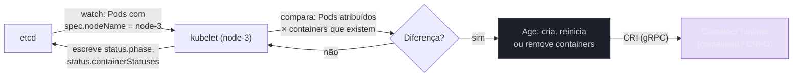
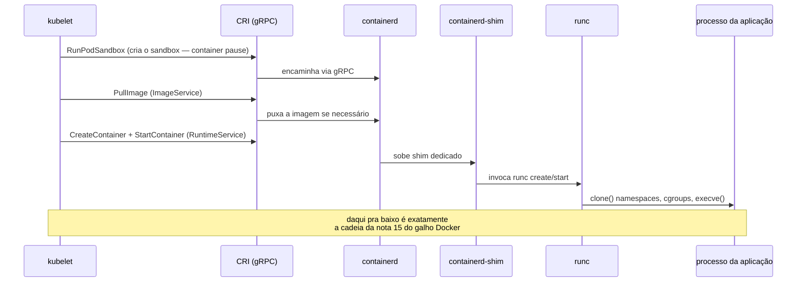
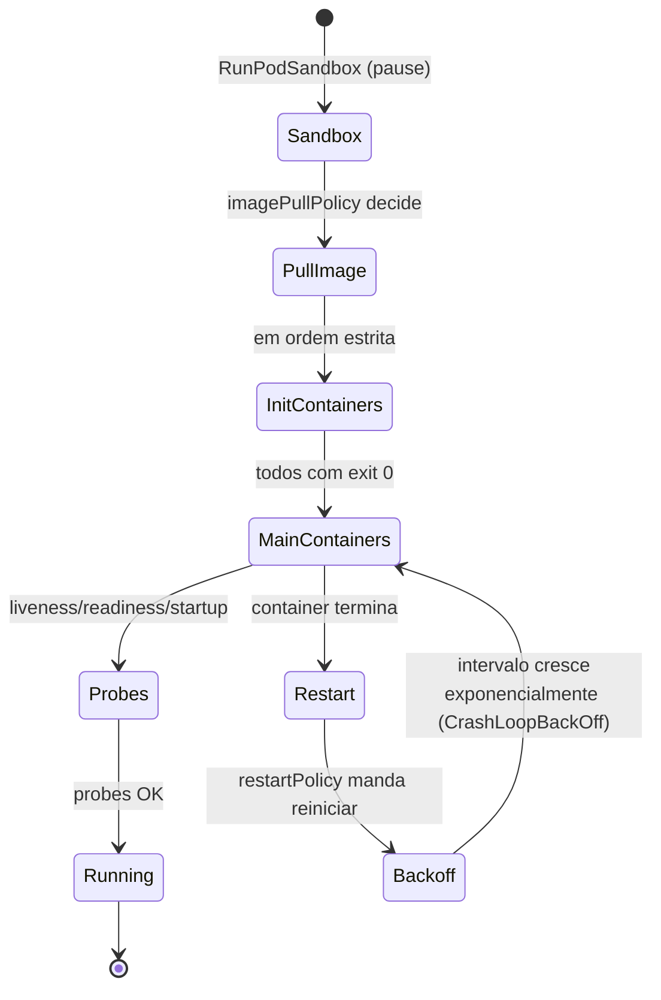
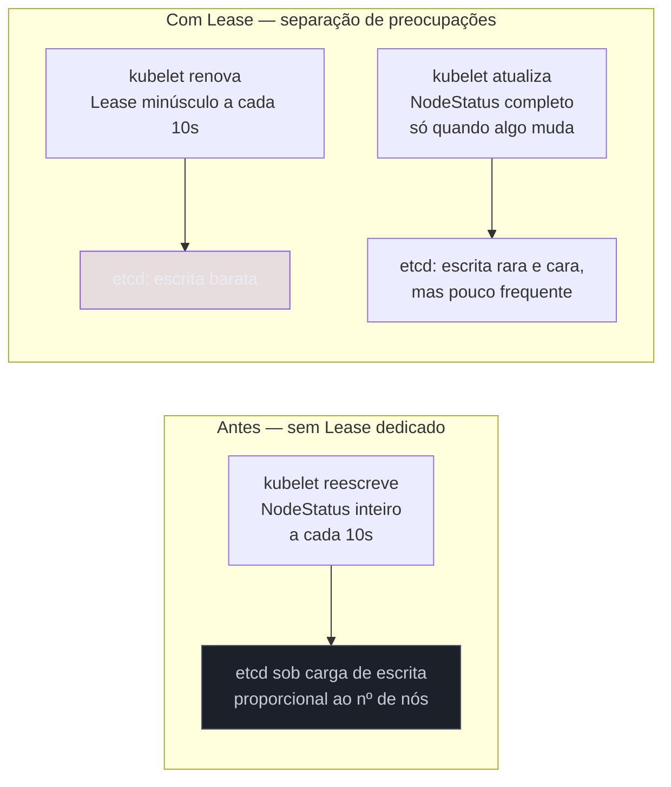
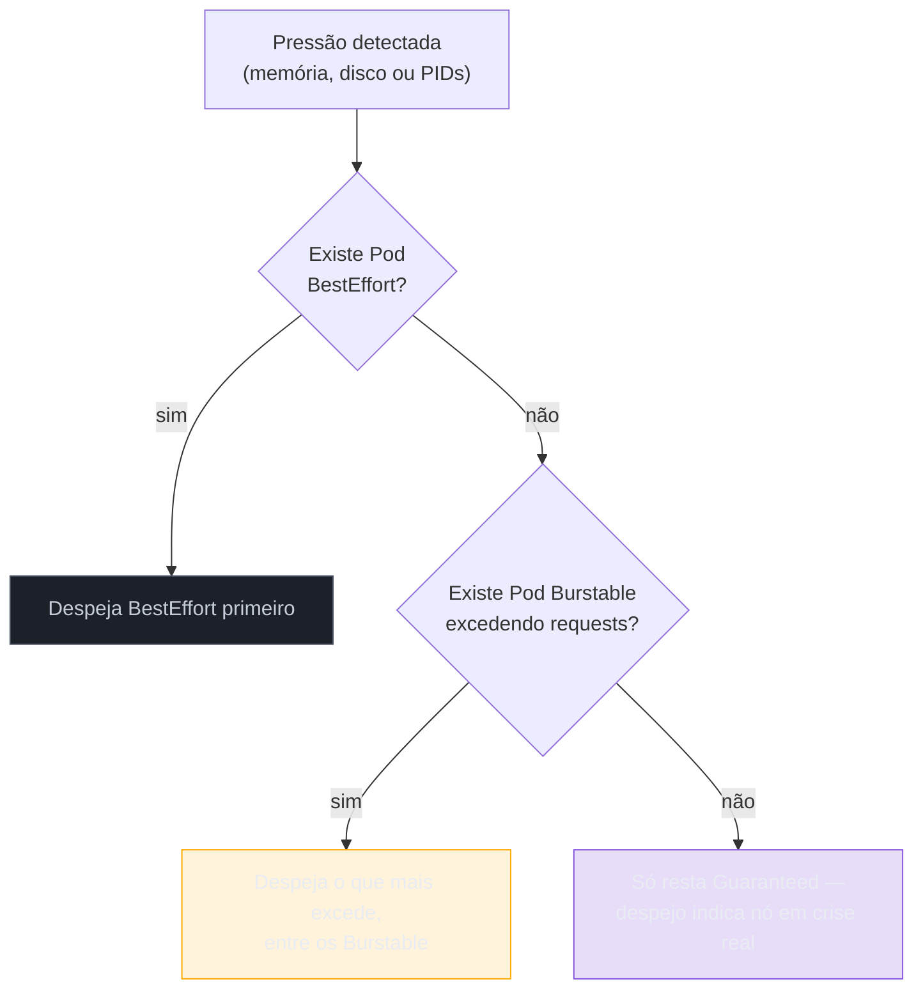

# O kubelet e o nó

> [!abstract] TL;DR
> A nota anterior deste galho terminou com o `kube-scheduler` escrevendo `spec.nodeName: node-3` num objeto Pod guardado no etcd — um texto num banco de dados, nada mais. O kubelet é quem fecha essa distância entre texto e processo. Ele observa, via watch contra o api-server, quais Pods foram atribuídos ao seu próprio nó; compara essa lista com o que de fato existe rodando ali; e age sobre a diferença — exatamente o mesmo padrão observar-comparar-agir de qualquer controller deste galho, só que o kubelet é o único elo da cadeia inteira que não delega a ninguém: no fim da linha, é ele quem fala com o container runtime via CRI e faz o container existir de verdade. Ele também relata — é o kubelet quem escreve o `status` de cada Pod do seu nó, quem registra o objeto `Node`, quem renova o `Lease` que serve de batimento cardíaco, e quem despeja Pods por conta própria quando o nó aperta. Entender o kubelet é entender onde a abstração inteira do Kubernetes termina e o Linux comum — processos, cgroups, disco, memória — começa.

Volte à cena exata onde a nota anterior parou: o `kube-scheduler` decidiu que `worker-processamento` deveria rodar em `node-3`, escreveu esse nome no campo `spec.nodeName` do objeto Pod, e terminou seu trabalho ali. Nenhum container nasceu nesse instante. Nenhuma imagem foi puxada. `node-3` — uma máquina física ou virtual em algum lugar, rodando seu próprio kernel Linux, com sua própria memória e seu próprio disco — não fez nada, porque nada mudou fisicamente nela: o que mudou foi um campo de texto num objeto guardado no `etcd`, um cluster de armazenamento que pode estar rodando em outras três máquinas completamente diferentes. A pergunta que abre esta nota é a mesma que abriu a nota 02 deste galho, só que aplicada um degrau mais abaixo na cadeia: como é que, segundos depois dessa escrita, existe um processo Linux de verdade, com um PID, consumindo CPU e memória, rodando especificamente em `node-3`?

A resposta é um processo chamado **kubelet**, e ele roda como um agente — não como um controller do `kube-controller-manager`, mas como um processo independente — em cada nó do cluster, com uma responsabilidade que nenhum outro componente do control plane compartilha: ele é o único que efetivamente materializa a intenção declarada em processo real. O `kube-scheduler` decide e escreve; o ReplicaSet controller decide e escreve; o kubelet decide e **age sobre o kernel da máquina onde está rodando**. Essa nota entra nesse componente por dentro — o que ele observa, como ele fala com o runtime, o que acontece com um Pod do nascimento à morte visto do nó, como o nó se anuncia e se mede, e o que acontece quando o nó aperta.

## O kubelet como o laço mais concreto de todos

A nota [[03-Dominios/Tecnologia/Infraestrutura/Kubernetes/02 - O loop de reconciliação|O loop de reconciliação]] já nomeou o kubelet de passagem, no diagrama que amarrava os três participantes da convergência de um Deployment: o ReplicaSet controller responde a "faltam Pods para bater a contagem?", o scheduler responde a "existe algum Pod sem node atribuído?", e o kubelet responde a "existe algum Pod atribuído a mim que eu ainda não coloquei para rodar?". Os três seguem o mesmo padrão — observar via watch, comparar contra o que já sabem, agir na diferença — e nenhum manda diretamente no outro; todos conversam só através do api-server e do etcd.

O que distingue o kubelet dos outros dois não é o padrão, é o **escopo** e o **fim de linha**. O escopo é estritamente local: o kubelet só observa Pods cujo `spec.nodeName` é o nome do próprio nó — ele nunca vê, e não precisa ver, o resto do cluster. Um `watch` contra o api-server filtrado por esse campo é, estruturalmente, a mesma tecnologia de Informer, Reflector e work queue que a nota 02 já detalhou para controllers do control plane, só que instanciada uma vez por nó, cada instância enxergando uma fatia estritamente menor do estado total do cluster.

O fim de linha é o que importa mais para esta nota: o kubelet é o **único** componente da cadeia inteira que não delega a decisão final para outro processo do Kubernetes. O scheduler decide o node e delega a execução ao kubelet daquele node. O ReplicaSet controller decide a contagem e delega a criação do Pod ao scheduler primeiro, ao kubelet depois. O kubelet, por sua vez, não delega para nenhum outro componente do Kubernetes — ele delega para o **container runtime**, que já não é mais Kubernetes, é a mesma cadeia containerd/shim/runc que a nota [[03-Dominios/Tecnologia/Infraestrutura/Docker/15 - Docker por dentro|Docker por dentro]] descreveu em detalhe. Depois do kubelet, não sobra mais nenhuma camada de orquestração — só o kernel Linux.



Vale reconectar essa observação a um detalhe que a nota [[03-Dominios/Tecnologia/Infraestrutura/Kubernetes/02 - O loop de reconciliação|O loop de reconciliação]] já registrou de passagem, sem abrir: "o `status` do Pod é preenchido por quem observa a realidade". O kubelet é exatamente esse "quem" para tudo que acontece dentro de um nó. Quando `kubectl describe pod` mostra `status.phase: Running`, `status.containerStatuses` com o `RestartCount` de cada container, ou um evento `Pulling image "minha-api:v7"`, nenhuma dessas linhas foi escrita por um controller do control plane olhando de fora — foi o kubelet daquele nó específico, tendo de fato observado o container existir (ou falhar ao existir), relatando o que viu de volta ao api-server. O kubelet não é só um executor; ele é, ao mesmo tempo, a fonte primária de verdade sobre tudo que diz respeito ao seu próprio nó.

## CRI: a fronteira gRPC entre o kubelet e o runtime

A cadeia que faz o container existir de fato — containerd, o shim, `runc`, a chamada `clone()` final — já foi descrita em detalhe pela nota [[03-Dominios/Tecnologia/Infraestrutura/Docker/15 - Docker por dentro|Docker por dentro]]. Esta seção não reabre essa cadeia; ela nomeia o ponto exato onde o kubelet entra nela, e por que esse ponto de entrada precisou ser formalizado como um contrato próprio.

Esse contrato chama-se **Container Runtime Interface (CRI)**: uma API baseada em gRPC, definida pelo próprio projeto Kubernetes, que qualquer runtime de container precisa implementar para que o kubelet consiga falar com ele. O kubelet é sempre o cliente; o runtime — tipicamente `containerd` ou `CRI-O` — é sempre o servidor, escutando num socket Unix local que o kubelet aponta via a flag `--container-runtime-endpoint`.

A API se divide em dois serviços gRPC com responsabilidades bem separadas, o mesmo tipo de separação de contratos que a Runtime Specification e a Image Specification da OCI já demonstraram em outro nível da cadeia:

- **`RuntimeService`** — gerencia o ciclo de vida de sandboxes de Pod e de containers: criar, iniciar, parar, remover, listar, consultar status. É essa parte da interface que o kubelet chama para pedir "crie o sandbox deste Pod" ou "inicie este container dentro dele".
- **`ImageService`** — gerencia imagens: puxar, listar, remover, inspecionar. É essa parte que resolve o `imagePullPolicy` descrito mais adiante nesta nota, decidindo se uma imagem precisa ser baixada do registry ou se já está disponível localmente.



### `crictl`: falando CRI diretamente, sem o kubelet no meio

Da mesma forma que a nota 15 do galho de Docker mostrou ser possível chamar `runc` diretamente, sem `dockerd` nem `containerd` no meio, existe uma ferramenta equivalente para falar CRI diretamente, sem o kubelet: `crictl`, mantida pelo próprio projeto Kubernetes especificamente para depuração de nó. Ela conversa com o mesmo socket que o kubelet usa, executando as mesmas chamadas `RuntimeService`/`ImageService` que ele executaria — só que a partir de um terminal humano, uma vez, em vez de um laço automático.

```bash
# Lista containers como o kubelet os vê, direto do runtime — não do api-server.
crictl ps -a

# Lista imagens já presentes localmente no node, o que o ImageService reportaria
# ao kubelet antes de decidir se um novo PullImage é necessário.
crictl images

# Inspeciona o sandbox (o equivalente ao container pause) de um Pod específico.
crictl inspectp <pod-sandbox-id>
```

`crictl` é a ferramenta certa para responder "o runtime enxerga este container, mesmo que o api-server não o reconheça mais?" — uma pergunta que só faz sentido quando o kubelet ou o api-server estão, eles mesmos, sob suspeita de estarem desatualizados ou fora do ar, e a única fonte confiável que resta é o runtime local.

### A remoção do dockershim: o que de fato saiu

Antes de o CRI existir como interface formal, o kubelet só sabia falar com uma coisa: o Docker Engine, diretamente, via a API do `dockerd`. Quando o Kubernetes decidiu adotar CRI como interface universal, surgiu um problema imediato: o Docker Engine, historicamente, não implementa CRI — ele fala sua própria API REST, a mesma que a nota 15 do galho de Docker já descreveu como o ponto de entrada do cliente `docker`. A solução de compromisso, chamada **dockershim**, era um componente mantido dentro do próprio código do kubelet que traduzia chamadas CRI para chamadas da API do Docker, permitindo que o kubelet continuasse falando com `dockerd` sem quebrar o contrato formal.

> [!info] Baseline de versão
> O dockershim foi removido do código do kubelet na **versão 1.24** do Kubernetes, lançada em 2022, depois de o anúncio da depreciação ter sido feito já na versão 1.20. A partir da 1.24, o kubelet só fala CRI puro — não existe mais nenhum caminho embutido para conversar diretamente com a API do Docker Engine. Isso não afeta clusters gerenciados que já rodavam `containerd` como runtime (a maioria dos clusters modernos de EKS, GKE e AKS há anos), mas exige atenção em qualquer cluster mais antigo, montado à mão, que ainda dependesse do Docker Engine como runtime de nó.

O mal-entendido que essa remoção gerou, e que vale desfazer com precisão: **nada mudou para quem constrói imagens com `docker build`**. O que saiu de cena foi o Docker Engine como **runtime de nó** — o processo que o kubelet invoca para materializar containers — não o formato da imagem produzida. Uma imagem gerada por `docker build` é, como a nota [[03-Dominios/Tecnologia/Infraestrutura/Docker/02 - A anatomia de uma imagem|A anatomia de uma imagem]] já estabeleceu, um artefato serializado segundo a OCI Image Specification: camadas endereçadas por conteúdo, manifesto, configuração. Um `containerd` rodando como runtime de nó consome exatamente esse mesmo formato — ele não precisa que a imagem tenha sido "aprovada" ou "traduzida" por `dockerd` para funcionar, porque `dockerd` nunca foi parte do formato, só de uma das cadeias possíveis de produzi-lo e de executá-lo. `docker build` continua rodando perfeitamente na máquina de qualquer desenvolvedor; o que mudou é que o cluster de produção, no nó, não precisa mais (e majoritariamente não tem mais) um `dockerd` completo instalado — só um runtime compatível com CRI, tipicamente `containerd` puro, que aliás já é o mesmo `containerd` que o Docker Engine usa por baixo dos panos, como a nota 15 do galho anterior descreveu.

## A cadeia completa até o processo

Juntando as duas metades — a interface CRI que o kubelet fala, e a cadeia que a nota 15 do galho de Docker já percorreu componente por componente — o caminho inteiro entre o campo `spec.nodeName` preenchido e um processo Linux respirando fica assim:

```mermaid
flowchart LR
    classDef neutro fill:#1B2029,stroke:#4E5666,color:#C6CCD8
    classDef destaque fill:#FFAA0024,stroke:#FFAA00,color:#E9ECF2
    classDef marca fill:#8855DF33,stroke:#8855DF,color:#E9ECF2
    subgraph K8S["Camada Kubernetes"]
        SN["spec.nodeName<br/>preenchido pelo scheduler"] --> KL["kubelet observa via watch"]
        KL --> DEC["Compara: Pods atribuídos<br/>× o que existe no nó"]
    end
    subgraph CRI_L["Fronteira CRI (gRPC)"]
        DEC --> CRI["RuntimeService + ImageService"]
    end
    subgraph OCI_L["Cadeia OCI — nota 15 do galho Docker"]
        CRI --> CD["containerd"]
        CD --> SH["containerd-shim"]
        SH --> RC["runc"]
    end
    subgraph KERNEL["Kernel Linux — Ciência/SO 13"]
        RC --> NS["clone() com namespaces"]
        NS --> CG["cgroups aplicados"]
        CG --> EXEC["execve() — o processo existe"]
    end

    class K8S neutro
    class CRI_L destaque
    class OCI_L marca
    class KERNEL marca
```



O paralelo com a cadeia `docker run` que a nota [[03-Dominios/Tecnologia/Infraestrutura/Docker/15 - Docker por dentro|Docker por dentro]] descreveu é direto e vale nomear sem rodeio: os dois caminhos convergem exatamente no mesmo ponto, `containerd`, só que chegam até ali por portas diferentes. `docker run` entra pela API REST do `dockerd`, que por sua vez fala com `containerd` via sua própria API interna. O kubelet entra direto por CRI, sem nenhum `dockerd` no meio — um caminho estruturalmente mais curto, e é exatamente essa ausência de um elo intermediário desnecessário que motivou a remoção do dockershim: manter uma tradução CRI→API-do-Docker→API-do-containerd para, no fim, chegar no mesmo lugar que uma chamada CRI direta já alcançava, era peso sem benefício correspondente. Dali para baixo — snapshotter extraindo o rootfs, shim dedicado por container, `runc` chamando `clone()`, `pivot_root()` e `execve()` — é, literal e mecanicamente, a mesma cadeia, o mesmo mecanismo de kernel que a nota [[03-Dominios/Ciência/Sistemas Operacionais/13 - Virtualização e containers|Virtualização e containers]] aprofunda; esta nota não reabre esse mecanismo, só nomeia o instante em que o Kubernetes o aciona por essa porta específica.

## O ciclo de vida de um Pod visto do nó

A nota [[03-Dominios/Tecnologia/Infraestrutura/Kubernetes/03 - O Pod, a unidade que não é o container|O Pod, a unidade que não é o container]] já descreveu as fases (`Pending`, `Running`, `Succeeded`, `Failed`, `Unknown`) e o container `pause` que segura o namespace de rede compartilhado. Esta seção retoma esse ciclo de vida do ponto de vista específico do kubelet — o que ele faz, passo a passo, entre observar o Pod atribuído e reportar `Running`.

Primeiro, o kubelet cria o **sandbox** do Pod via `RunPodSandbox` — a chamada CRI que materializa, na prática, o container `pause` já descrito na nota 03: o processo mínimo dono do network namespace compartilhado, criado antes de qualquer container declarado no manifesto.

Segundo, para cada container que precisa de imagem, o kubelet decide se puxa uma nova cópia com base no campo `imagePullPolicy`. `Always` força um pull a cada criação de Pod, mesmo que uma imagem com o mesmo nome já exista localmente — útil para tags mutáveis como `latest`, custoso em tempo de convergência. `IfNotPresent` só puxa se a imagem não estiver em cache local — o padrão para tags versionadas e imutáveis, e a razão pela qual um node que já rodou uma imagem antes converge visivelmente mais rápido que um node que precisa baixá-la pela primeira vez, o mesmo fator de latência que a nota 02 já identificou como o mais variável de toda a linha do tempo de convergência. `Never` nunca puxa, falhando se a imagem não existir localmente — usado sobretudo em ambientes de desenvolvimento ou de borda com controle estrito sobre o que entra no node. Sem declaração explícita, o padrão depende da tag: `latest` implica `Always`, qualquer outra tag implica `IfNotPresent`.

Terceiro, o kubelet executa os **init containers**, em ordem estrita — a mesma sequência que a nota 03 já detalhou, cada um precisando terminar com sucesso antes do próximo começar, e nenhum container principal subindo até o último terminar.

Quarto, o kubelet inicia os **containers principais**, agora em paralelo entre si, cada um via `CreateContainer` + `StartContainer` na `RuntimeService`.

Quinto, se declaradas, o kubelet passa a executar as **probes** — o assunto da próxima seção — decidindo, com base nelas, quando marcar o container como pronto para tráfego e quando reiniciá-lo.

Sexto, se um container termina — por crash, por falha de probe de liveness, por qualquer motivo — o kubelet decide se reinicia com base na `restartPolicy` do Pod, já descrita na nota 03 (`Always`, `OnFailure`, `Never`). Quando a política manda reiniciar, o kubelet não tenta de novo instantaneamente: ele aplica um **backoff exponencial** entre tentativas — um intervalo que começa curto (tipicamente em torno de dez segundos) e dobra a cada falha subsequente, até um teto (tipicamente cinco minutos), resetando de volta ao valor inicial se o container conseguir ficar de pé por tempo suficiente sem falhar de novo. `CrashLoopBackOff`, o estado que qualquer pessoa que já operou um cluster reconhece de cabeça, é literalmente essa espera sendo mostrada: o container falhou, a política manda reiniciar, e o kubelet está, neste exato momento, contando os segundos do intervalo de backoff antes da próxima tentativa — não travado, não quebrado, só respeitando um intervalo crescente para não martelar um container que está falhando de forma sistemática.



## Probes: o mecanismo por inteiro

Uma probe é uma verificação periódica que o kubelet executa, a partir do próprio nó, contra um container específico — nunca de dentro do container, sempre do lado de fora, exatamente como o `pause` observa de fora o que os containers reais fazem. Existem três tipos de probe, cada um respondendo a uma pergunta diferente sobre o mesmo container.

**Liveness probe** responde "este processo ainda está funcional, ou travou de um jeito que só um restart resolve?". Quando uma liveness probe falha repetidamente (além do limiar configurado), o kubelet mata o container e o recria, seguindo a mesma `restartPolicy` e o mesmo backoff já descritos — é o mecanismo certo para um processo que trava (deadlock, vazamento que degrada até parar de responder) sem necessariamente sair sozinho, um estado que `restartPolicy` sozinha não detectaria, porque o processo continua tecnicamente vivo, só não funcional.

**Readiness probe** responde a uma pergunta bem diferente: "este container está pronto para receber tráfego agora?". Uma falha de readiness não mata nem reinicia nada — ela só remove o Pod da lista de endpoints prontos que um Service usa para rotear tráfego, um mecanismo que pertence à camada de rede, fora do escopo desta nota. Um container pode estar perfeitamente vivo (liveness passa) e ainda assim não pronto (readiness falha) — o caso clássico é um processo que está de pé mas ainda carregando um cache grande em memória antes de aceitar requisições.

**Startup probe** existe para um problema específico de aplicações lentas para inicializar: enquanto uma startup probe declarada não passa pela primeira vez, o kubelet **desativa** as checagens de liveness e readiness daquele container — evitando que uma aplicação legitimamente lenta para subir seja morta por uma liveness probe impaciente antes mesmo de terminar de inicializar. Assim que a startup probe passa uma vez, ela para de rodar, e liveness/readiness assumem o controle normalmente.

Cada probe pode ser implementada de quatro formas, e o kubelet é sempre quem executa a checagem, a partir do nó:

| Tipo | Como o kubelet verifica | Critério de sucesso |
| --- | --- | --- |
| `httpGet` | Faz uma requisição HTTP contra um caminho e porta do container | Código de status entre 200 e 399 |
| `tcpSocket` | Tenta abrir uma conexão TCP contra uma porta do container | Conexão TCP estabelecida com sucesso |
| `exec` | Executa um comando dentro do container via a mesma interface que sustenta `kubectl exec` | Código de saída do comando é zero |
| `grpc` | Chama o protocolo de health checking padrão do gRPC contra uma porta do container | Serviço responde `SERVING` |

```yaml
apiVersion: v1
kind: Pod
metadata:
    name: api-com-probes
spec:
    containers:
        - name: api
          image: minha-api:1.2.3
          ports:
              - containerPort: 8080
          startupProbe:
              httpGet:
                  path: /health
                  port: 8080
              failureThreshold: 30     # até 30 tentativas antes de desistir
              periodSeconds: 2          # uma tentativa a cada 2s — até 60s de tolerância no boot
          livenessProbe:
              httpGet:
                  path: /health
                  port: 8080
              periodSeconds: 10
              failureThreshold: 3       # 3 falhas seguidas antes de reiniciar
          readinessProbe:
              tcpSocket:
                  port: 8080
              periodSeconds: 5
```

Vale um exemplo curto de como essas três probes se comportam de forma visivelmente diferente diante do mesmo sintoma — um container que está de pé, mas momentaneamente incapaz de processar requisições porque está reconstruindo um índice em memória. A liveness probe, se configurada corretamente com tolerância suficiente, não deveria falhar nesse cenário — o processo continua respondendo, só está ocupado; falhar aqui e matar o container seria destruir trabalho em andamento por um sintoma que um restart não resolve, só adia. A readiness probe, ao contrário, **deveria** falhar durante essa janela — é exatamente o sinal certo para remover o Pod da lista de endpoints prontos, evitando que tráfego chegue a um processo que não está preparado para atendê-lo, sem precisar matar nem reiniciar nada. É essa diferença de propósito, não uma diferença técnica de implementação, que separa uma liveness probe mal calibrada (matando containers ocupados, não travados) de uma readiness probe fazendo exatamente seu trabalho.

O mecanismo — tipos, quem executa, a interação entre startup e as outras duas — é assunto completo desta nota. A **política** de produção sobre esses mecanismos — quanto tempo de graça dar antes de matar um container, como calibrar `failureThreshold` e `periodSeconds` para não confundir lentidão passageira com falha real, como isso se combina com `PodDisruptionBudget` e rollout gradual — pertence a [[03-Dominios/Engenharia/Operação/3 - Rodar em produção/02 - O contrato de produção do Kubernetes|O contrato de produção do Kubernetes]], que desenvolve essa disciplina em profundidade própria.

## Registro do nó e batimento cardíaco

Quando o kubelet sobe pela primeira vez numa máquina, sua primeira ação relevante para o resto do cluster é se **registrar**: ele cria, via api-server, um objeto `Node` representando aquela máquina — capacidade de CPU e memória, versão do kernel, versão do container runtime, labels iniciais. É a existência desse objeto `Node` que torna a máquina, do ponto de vista do resto do Kubernetes, elegível para receber Pods; sem ele, o `kube-scheduler` sequer sabe que aquele nó existe.

Depois do registro, o kubelet precisa provar continuamente que continua vivo e funcional — e é aqui que entra o mecanismo que a nota 02 deste galho já nomeou de passagem, sem abrir: o objeto **`Lease`**, um "batimento cardíaco" que o kubelet renova em intervalos curtos, tipicamente a cada dez segundos. Enquanto esses batimentos chegam, o control plane considera o nó `Ready`. Quando param de chegar por um intervalo configurável (tipicamente contado em dezenas de segundos), o `kube-controller-manager` marca a condição `Ready` do `NodeStatus` daquele nó como desconhecida — o gatilho que, como a nota de Scheduling já descreveu, dispara os taints automáticos `node.kubernetes.io/not-ready` e `node.kubernetes.io/unreachable`.

Vale explicar por que esse `Lease` existe como objeto separado, em vez de o kubelet simplesmente reescrever o `NodeStatus` inteiro a cada batimento — porque essa escolha é um exemplo particularmente nítido de decisão de arquitetura visível de fora, não um detalhe de implementação arbitrário. O `NodeStatus` completo carrega uma quantidade razoável de informação — capacidade, condições, endereços, informação de imagem, versões — e escrevê-lo por inteiro no `etcd` a cada dez segundos, multiplicado por cada nó de um cluster com centenas ou milhares deles, produziria um volume de escrita no `etcd` desproporcional ao propósito real do batimento, que é só provar "eu ainda estou vivo", não "aqui está meu estado inteiro de novo". O `Lease` resolve isso separando as duas preocupações: um objeto `Lease` é minúsculo — pouco mais que um timestamp de renovação — e é só ele que precisa ser escrito com alta frequência. O `NodeStatus` completo continua sendo atualizado, mas com frequência bem menor, só quando algo de fato relevante muda (uma condição, a capacidade alocável, uma versão de componente), não a cada ciclo de prova de vida.



## As condições do `Node`: mais do que `Ready`

O `status.conditions` de um objeto `Node`, atualizado pelo kubelet junto com o `NodeStatus`, carrega mais sinais do que só "pronto ou não" — e vale nomear cada um, porque são exatamente esses sinais, e não um veredito único, que alimentam tanto a filtragem do scheduler quanto o mecanismo de eviction descrito adiante nesta nota.

| Condição | O que significa quando `True` | Consequência prática |
| --- | --- | --- |
| `Ready` | O nó está saudável e apto a receber Pods | `False` ou `Unknown` dispara os taints automáticos que a nota de Scheduling já descreveu |
| `MemoryPressure` | O nó está sob pressão de memória | Gatilho direto do mecanismo de eviction desta nota |
| `DiskPressure` | O nó está sob pressão de espaço em disco | Gatilho direto do mecanismo de eviction, e causa comum de nó doente por acúmulo de imagens |
| `PIDPressure` | O nó está perto do limite de processos disponíveis | Menos comum na prática, mas segue o mesmo mecanismo de eviction |
| `NetworkUnavailable` | A rede do nó ainda não foi configurada corretamente | Tipicamente `True` só nos primeiros instantes após o registro, até o plugin de rede (CNI) terminar de configurar o nó |

```bash
kubectl get node node-3 -o jsonpath='{range .status.conditions[*]}{.type}={.status}{"\n"}{end}'
```

```
Ready=True
MemoryPressure=False
DiskPressure=False
PIDPressure=False
NetworkUnavailable=False
```

Cada uma dessas condições é escrita pelo kubelet daquele nó especificamente — nenhuma outra parte do cluster tem visibilidade direta o bastante para preencher esses campos com precisão; o `kube-controller-manager` só consegue inferir `Ready=Unknown` pela ausência do `Lease`, nunca reescrever `MemoryPressure` ou `DiskPressure` por conta própria, porque só o kubelet local sabe, de fato, quanta memória e quanto disco sobram naquela máquina específica neste instante.

## Recursos do nó: `capacity` contra `allocatable`

A nota [[03-Dominios/Tecnologia/Infraestrutura/Kubernetes/12 - Scheduling|Scheduling]] já mostrou a saída de `kubectl describe node` com duas linhas distintas, `Capacity` e `Allocatable`, sem se deter em por que existe uma diferença entre elas. Ela existe porque um nó não é um recipiente vazio dedicado inteiramente a Pods: o próprio sistema operacional precisa de memória e CPU para funcionar, e o kubelet — junto com o container runtime e outros processos de sistema do nó — também consome recursos reais enquanto observa, decide e age.

`capacity` é o total físico da máquina: toda a CPU, toda a memória que o hardware (ou a VM) de fato tem. `allocatable` é o que sobra depois de descontar duas reservas configuráveis: a reserva para o sistema (`system-reserved`, cobrindo processos do sistema operacional fora do Kubernetes) e a reserva para o próprio kubelet e o container runtime (`kube-reserved`). Existe ainda um terceiro desconto, o **limiar de eviction** (`eviction-hard`), que reserva uma faixa adicional de memória e disco especificamente para dar ao kubelet margem de manobra antes que o nó fique tão apertado que nem o próprio kubelet consiga agir — é essa margem que sustenta o mecanismo de despejo descrito na próxima seção. O `kube-scheduler`, como a nota 12 já estabeleceu, só compara `requests` contra `allocatable`, nunca contra `capacity` — um nó com muita CPU física mas pouca folga de `allocatable`, por reservas configuradas de forma generosa, recusa Pods novos exatamente como recusaria se tivesse menos CPU física para começar.

### Vendo a reserva com as próprias mãos

Vale tornar concreta a diferença entre `capacity` e `allocatable` com um exemplo numérico simples, porque a abstração "reserva do sistema" some fácil sem um número ao lado. Considere um nó com 16Gi de memória física total e a seguinte configuração de reservas no kubelet daquele nó:

```yaml
# Trecho da KubeletConfiguration daquele node
systemReserved:
    memory: "1Gi"
kubeReserved:
    memory: "512Mi"
evictionHard:
    memory.available: "512Mi"
```

A conta que resulta em `allocatable` é simples de seguir: `capacity` (16Gi) menos `system-reserved` (1Gi) menos `kube-reserved` (512Mi) menos a margem de `eviction-hard` (512Mi) — sobram aproximadamente 14Gi de `allocatable`, o número que de fato aparece em `kubectl describe node` e o único que o scheduler usa na fase de filtragem. Os 2Gi que "desapareceram" não foram perdidos nem desperdiçados: são a margem que garante que o sistema operacional, o próprio kubelet e o container runtime continuam respirando mesmo com o nó cheio de Pods no limite do que foi declarado como `allocatable`.

## Eviction por pressão de recurso

Até aqui, tudo que esta nota descreveu sobre o kubelet reagindo a Pods partiu de uma decisão que outro componente tomou primeiro — o scheduler atribuindo, o ReplicaSet controller criando. A eviction por pressão de recurso é diferente: é o kubelet agindo **por conta própria**, sem esperar nenhuma decisão externa, porque o próprio nó onde ele roda está ficando sem recurso para sustentar o que já está ali.

O kubelet monitora continuamente um conjunto de sinais do nó — memória disponível, espaço livre em disco (separadamente para o filesystem geral do nó e para o filesystem usado por imagens de container), inodes livres, e PIDs disponíveis. Cada sinal tem um limiar configurável; quando um deles é cruzado, o kubelet entra em modo de despejo: escolhe Pods para remover, na ordem certa, até o sinal voltar para dentro de margem segura.

Essa ordem é governada pela classe de **Quality of Service (QoS)** de cada Pod — a mesma classificação que a nota 03 deste galho já introduziu de passagem, ao descrever `status.qosClass` como consequência de como `requests` e `limits` foram declarados por container. Vale relembrar como cada classe é determinada, porque é exatamente essa determinação que decide a ordem de despejo:

- **`BestEffort`** — nenhum container do Pod declara `requests` nem `limits`, para CPU nem memória. É a classe mais vulnerável: sem nenhuma reserva declarada, esses Pods são os primeiros candidatos ao despejo.
- **`Burstable`** — ao menos um container declara `requests` ou `limits`, mas nem todos os containers têm `requests` igual a `limits` em CPU e memória simultaneamente. É a classe mais comum na prática, e dentro dela o kubelet prioriza despejar primeiro os Pods que mais excedem seus próprios `requests` — quem pediu pouco e está consumindo muito sai antes de quem está dentro do que declarou.
- **`Guaranteed`** — todo container do Pod declara `limits` igual a `requests`, para CPU e para memória. É a classe mais protegida: só é despejada se não sobrar nenhum Pod `BestEffort` ou `Burstable` no nó, e mesmo assim o despejo de um `Guaranteed` é tratado como sinal de que o nó está numa situação genuinamente crítica, não rotineira.



Vale nomear ainda a diferença entre os dois tipos de limiar que governam quando esse despejo dispara, porque ela decide se um Pod recebe alguma janela de graça ou não. **Limiares suaves** (*soft eviction thresholds*) dão ao kubelet uma margem antes de agir — o sinal precisa permanecer cruzado por um período de graça configurável antes do despejo de fato começar, e mesmo o despejo em si respeita, dentro de um teto, o `terminationGracePeriodSeconds` do Pod, dando chance a um desligamento ordenado. **Limiares rígidos** (*hard eviction thresholds*) não dão margem nenhuma: assim que o sinal é cruzado, o kubelet despeja imediatamente, sem esperar nenhum período de graça — a situação já é considerada crítica o bastante para não valer a pena negociar tempo.

| Tipo de limiar | Espera antes de agir | Uso típico |
| --- | --- | --- |
| Soft (`eviction-soft`) | Sim — período de graça configurável, mais o `terminationGracePeriodSeconds` do Pod dentro de um teto | Dar chance a picos passageiros de consumo se resolverem sozinhos |
| Hard (`eviction-hard`) | Não — despejo imediato | Situação já crítica; esperar poderia comprometer a estabilidade do próprio nó |

Vale distinguir três mecanismos que costumam se confundir, porque todos os três terminam com "um Pod parou de rodar" mas nascem de gatilhos completamente diferentes. **Eviction do kubelet**, descrita nesta seção, nasce de pressão de recurso local no nó — o kubelet decidindo, sozinho, que precisa liberar espaço, sem que nenhuma prioridade de outro Pod esteja em jogo. **Preempção do scheduler**, descrita na nota [[03-Dominios/Tecnologia/Infraestrutura/Kubernetes/12 - Scheduling|Scheduling]], nasce de um Pod de prioridade alta não conseguir ser agendado por falta de espaço — o scheduler, não o kubelet, decide despejar Pods de prioridade menor para abrir vaga, num nó que nem precisa estar sob pressão real, só sem capacidade suficiente para o Pod novo. E o **`OOMKilled`** é um terceiro mecanismo, mais abrupto e mais baixo na pilha: o kernel Linux, através do seu próprio OOM killer, mata um processo específico dentro de um container quando aquele container ultrapassa seu `limits.memory` individual — uma ação do kernel, indiscriminada em relação à QoS do Pod, que acontece sem passar pelo kubelet e sem nenhuma noção de "qual Pod é menos importante". O kubelet só toma conhecimento do `OOMKilled` depois do fato, ao observar que o container morreu e relatar esse motivo específico no `status`, exatamente como relataria qualquer outra causa de término — mas ele não decidiu, não escolheu, e não teve chance de intervir antes.

Vale uma precisão que refina — sem contradizer — o parágrafo acima, porque a diferença entre os dois casos é fácil de embaralhar. Quando um container estoura o **próprio `limits.memory`**, o OOM kill é de fato cego à QoS: o cgroup daquele container atingiu seu teto, e é ele que morre, independentemente de qual classe o Pod tenha. Mas quando o nó inteiro fica sem memória — e o kernel precisa escolher **alguma** vítima entre todos os processos da máquina —, a escolha não é aleatória, porque o kubelet já preparou o terreno de antemão: ele grava, em cada container, um valor de `oom_score_adj` derivado da classe de QoS do Pod, que enviesa deliberadamente o cálculo que o *OOM killer* do kernel faz na hora de escolher. Pods `Guaranteed` recebem **-997**, o que na prática os blinda; Pods `BestEffort` recebem **1000**, o que os transforma na camada sacrificial imediata; e Pods `Burstable` recebem um valor calculado, tanto mais alto quanto menor for o `requests.memory` declarado em relação à capacidade total do nó — de novo a mesma lógica de "quem pediu pouco sai antes". Uma ressalva importante fecha o quadro: o *OOM killer* do kernel **não conhece `PriorityClass`** — ele decide só por `oom_score_adj` e consumo de memória. Ou seja, se a exaustão for rápida a ponto de o kernel agir antes do despejo ordenado do kubelet, a prioridade declarada de um Pod não o protege; só a classe de QoS, já materializada no `oom_score_adj`, protege.

> [!tip] Vídeo — a fonte original desse desenho, contada por quem o desenhou
> [**Everything You Ever Wanted to Know About Resource Scheduling, But Were Afraid to Ask**](https://www.youtube.com/watch?v=nWGkvrIPqJ4) (Tim Hockin, Google — KubeCon, canal oficial da CNCF, ~43 min, EN) é a palestra canônica sobre por que `requests` e `limits` existem com essa forma, dada por um dos engenheiros fundadores do Kubernetes. Ela acrescenta a esta seção a distinção que organiza tudo o mais e que este galho não nomeia em lugar nenhum: recursos **compressíveis** contra **incompressíveis**. Estourar o limite de CPU só faz o processo parar de ser escalonado — ele fica lento, e continua vivo. Estourar o limite de memória não tem equivalente gentil: memória já entregue não pode ser retomada sem matar alguém, e é essa assimetria física, não uma escolha de produto, que obriga o sistema a ter uma política de quem morre. Hockin também explica a intenção por trás do `oom_score_adj` descrito acima — ajustar a proteção no kernel *antes* da crise, para que a decisão já esteja tomada quando o kernel agir. **O que ele não cobre:** o kubelet como componente, CRI, os limiares soft e hard, e a mecânica de `capacity` contra `allocatable` — a palestra fala do modelo de recursos, não do agente que o aplica. Trecho de destaque [18:49]: *"then we're gonna lower your protection in the kernel until we're sure that, when the kernel pulls the trigger on that shotgun, it's you that gets killed."*
>
> ⚠️ Palestra de 2016: o modelo de `requests`/`limits` e as classes de QoS seguem válidos e praticamente inalterados, mas números, nomes de flags e recursos citados de passagem envelheceram.
>
> 🎬 [Assistir no YouTube](https://www.youtube.com/watch?v=nWGkvrIPqJ4)

## Métricas: cAdvisor e o `metrics-server`

O kubelet carrega embutido um componente chamado **cAdvisor** (*Container Advisor*), responsável por coletar, continuamente, métricas de uso de recurso de cada container rodando no nó — CPU, memória, I/O de disco, uso de rede — lendo diretamente dos mesmos cgroups que o `runc` configurou ao criar cada container. O cAdvisor não é um serviço externo nem um agente separado a instalar; ele roda como parte do próprio processo do kubelet, expondo essas métricas por uma API local que o kubelet, por sua vez, expõe agregada.

O **`metrics-server`** é um componente separado, tipicamente instalado à parte no cluster, que consulta periodicamente essa API de métricas exposta por cada kubelet, agrega os números de todos os nós, e os expõe através da Metrics API do Kubernetes — a mesma API que `kubectl top nodes` e `kubectl top pods` consultam, e a mesma que sustenta o `HorizontalPodAutoscaler` na hora de decidir se escala um Deployment para cima ou para baixo com base em uso observado de CPU ou memória. O cAdvisor embutido no kubelet é a origem primária desses números; o `metrics-server` é o agregador que os torna consultáveis num único ponto do cluster, sem que ninguém precise falar com cada kubelet individualmente. A disciplina completa de observabilidade — o que fazer com essas métricas além de olhar `kubectl top`, como compor dashboards, como alertar sobre elas — pertence a [[03-Dominios/Engenharia/Operação/4 - Observar e responder/index|Observar e responder]], fora do escopo desta nota.

## Pods estáticos: o kubelet gerenciando sem o api-server

Tudo que esta nota descreveu até aqui pressupõe um Pod chegando ao kubelet pelo caminho normal — atribuído por um scheduler, observado via watch contra o api-server. Existe uma segunda via, mais direta e deliberadamente mais simples: **Pods estáticos**, definidos por arquivos de manifesto colocados diretamente no disco do nó (por padrão, em `/etc/kubernetes/manifests`), que o kubelet observa e gerencia sozinho, sem nenhuma intermediação do api-server.

O kubelet varre esse diretório periodicamente. Um manifesto novo vira um Pod criado; um manifesto removido vira um Pod removido; um manifesto alterado vira um Pod recriado com a nova definição — o mesmo padrão observar-comparar-agir, só que a fonte observada é um sistema de arquivos local, não um `watch` contra o etcd. Um Pod estático continua tendo, no api-server, uma representação somente-leitura chamada **mirror Pod**, criada pelo próprio kubelet, que permite a qualquer pessoa ver aquele Pod via `kubectl get pods` — mas apagar esse mirror Pod via `kubectl delete` não apaga o Pod estático de verdade: o kubelet simplesmente o recria, porque o manifesto continua no disco, e é o disco, não o api-server, que ele trata como fonte da verdade para Pods estáticos.

Esse mecanismo resolve um problema de ovo-e-galinha que qualquer cluster instalado via `kubeadm` precisa enfrentar: os próprios componentes do control plane — `kube-apiserver`, `kube-controller-manager`, `kube-scheduler`, e tipicamente `etcd` — precisam rodar como containers em algum nó. Mas se eles fossem Pods comuns, geridos via api-server, existiria uma dependência circular impossível de resolver na inicialização: o `kube-apiserver` precisaria do api-server já estar rodando para ser agendado, porque é o api-server quem armazena a definição de qualquer Pod. Pods estáticos rompem esse ciclo: o kubelet do nó de control plane sobe, encontra os manifestos desses componentes já no disco (colocados ali pelo próprio `kubeadm` durante a inicialização), e os cria diretamente, sem precisar que nenhum api-server já esteja de pé para orientá-lo. É assim, concretamente, que um cluster instalado com `kubeadm` consegue "se levantar pelos próprios cabelos" — o control plane inteiro roda, na prática, como um conjunto de Pods estáticos supervisionados pelo kubelet local de cada nó de control plane, o mesmo kubelet que, um degrau abaixo na pilha, é ele próprio só mais um processo supervisionado pelo `systemd` (ou equivalente) daquela máquina.

Esse fechamento conecta diretamente com a nota [[03-Dominios/Tecnologia/Infraestrutura/Kubernetes/16 - O control plane por dentro|O control plane por dentro]]: os componentes que esta nota trata como "o control plane", vistos de dentro de um nó real instalado via `kubeadm`, não são mágica nem processos especiais — são Pods estáticos comuns, geridos pelo mesmo mecanismo que qualquer time poderia usar, em qualquer nó, para rodar um agente que precisa sobreviver independentemente do api-server estar disponível.

## Coleta de lixo de imagem e de container

Um nó que roda Pods por tempo suficiente acumula duas formas de lixo que o kubelet precisa gerenciar ativamente, sem intervenção humana: imagens de container que não são mais usadas por nenhum Pod em execução, e containers já terminados (de execuções antigas, de reinícios sucessivos) cujo estado ainda ocupa espaço em disco.

A **coleta de lixo de imagem** monitora o espaço usado pelo filesystem de imagens do nó e, ao cruzar um limiar configurável de uso de disco, remove imagens que não estão sendo referenciadas por nenhum container em execução no momento, começando tipicamente pelas menos usadas recentemente. A **coleta de lixo de container** funciona de forma parecida, mas para os containers já terminados: mantém um número limitado de containers finalizados por Pod (úteis para inspecionar uma falha recente via `kubectl logs --previous`), e remove os mais antigos além desse limite.

Vale nomear o motivo prático de dedicar uma seção a isso, em vez de tratá-lo como detalhe menor: **disco cheio é uma das causas mais comuns e mais mal diagnosticadas de nó doente**. Um nó sem espaço livre suficiente no filesystem de imagens não consegue puxar imagens novas — qualquer Pod novo atribuído ali fica preso tentando um `PullImage` que nunca termina. Um nó sem espaço livre no filesystem geral pode disparar o próprio mecanismo de eviction por pressão de disco descrito acima, despejando Pods que não têm nada de errado com eles além de estarem rodando num nó que ficou sem espaço. Os dois sintomas — Pod preso em pull, Pod despejado por pressão de disco — têm a mesma causa raiz na maioria dos casos reais: coleta de lixo que não conseguiu acompanhar o ritmo de acúmulo, geralmente porque o nó está rodando um volume de imagens ou de reinícios de container maior do que os limiares configurados foram pensados para absorver.

## Exemplo trabalhado: lendo um `CrashLoopBackOff` como o kubelet o vê

Vale amarrar boa parte desta nota num único cenário concreto, porque `CrashLoopBackOff` é, provavelmente, o estado mais visto e menos entendido em qualquer cluster real. Suponha um container que sobe, começa a inicializar, mas termina com código de saída diferente de zero cinco segundos depois — um erro de configuração que só se manifesta em runtime, não detectável na filtragem do scheduler nem na validação do api-server.

```bash
kubectl get pods
```

```
NAME                        READY   STATUS             RESTARTS   AGE
minha-api-7d8f9c6b5-pqrst   0/1     CrashLoopBackOff   4          3m12s
```

Do ponto de vista do kubelet, cada uma dessas quatro tentativas seguiu exatamente o ciclo descrito na seção sobre o ciclo de vida: `StartContainer` via CRI, o processo sobe, termina com falha, a `restartPolicy` (padrão `Always` para um Pod de Deployment) manda reiniciar, e o kubelet espera o intervalo de backoff — que já dobrou quatro vezes — antes da próxima tentativa. `kubectl describe pod` expõe essa contagem com precisão:

```bash
kubectl describe pod minha-api-7d8f9c6b5-pqrst
```

```
Containers:
  api:
    State:          Waiting
      Reason:       CrashLoopBackOff
    Last State:     Terminated
      Reason:       Error
      Exit Code:    1
      Started:      Mon, 03 Aug 2026 14:02:10 -0300
      Finished:     Mon, 03 Aug 2026 14:02:15 -0300
    Ready:          False
    Restart Count:  4
Events:
  Type     Reason     Age                  From     Message
  ----     ------     ----                 ----     -------
  Normal   Pulled     3m10s                kubelet  Successfully pulled image "minha-api:v1"
  Normal   Started    3m9s (x4 over 3m10s) kubelet  Started container api
  Warning  BackOff    38s (x8 over 2m50s)  kubelet  Back-off restarting failed container
```

Repare que `State: Waiting` com `Reason: CrashLoopBackOff` não significa "o kubelet travou" — significa, literalmente, que o kubelet está aguardando, de propósito, o intervalo de backoff terminar antes da próxima tentativa, exatamente o mesmo padrão de retry com espera crescente que a nota [[03-Dominios/Tecnologia/Infraestrutura/Kubernetes/02 - O loop de reconciliação|O loop de reconciliação]] já mostrou o kubelet aplicando ao tentar puxar uma imagem inexistente (`ImagePullBackOff`) — dois estados de nome parecido, ambos manifestando o mesmo princípio: o kubelet não desiste, e também não martela sem parar, ele espera um intervalo que cresce a cada falha sucessiva.

## Um resumo de comandos para a caixa de ferramentas

Seguindo o mesmo padrão que as notas 02 e 12 deste galho já estabeleceram, vale reunir aqui os comandos que respondem às perguntas mais recorrentes sobre o que o kubelet de um nó específico está fazendo:

| Pergunta | Comando |
| --- | --- |
| Este nó está `Ready`? Sob que pressão, se houver? | `kubectl describe node <nome>` |
| Quanto de `allocatable` sobra neste nó? | `kubectl get node <nome> -o jsonpath='{.status.allocatable}'` |
| O `Lease` deste nó está sendo renovado? | `kubectl get lease <nome> -n kube-node-lease -o yaml` |
| Por que este container foi reiniciado da última vez? | `kubectl describe pod <nome>` (seção `Last State`) |
| Que containers o runtime local enxerga, além do que o api-server sabe? | `crictl ps -a` (executado no próprio nó) |
| Este container foi morto pelo OOM killer do kernel? | `kubectl describe pod <nome>` — procurar `Reason: OOMKilled` em `Last State` |
| Que eventos de despejo aconteceram recentemente no cluster? | `kubectl get events --field-selector reason=Evicted --sort-by='.lastTimestamp'` |
| Este Pod é `Guaranteed`, `Burstable` ou `BestEffort`? | `kubectl get pod <nome> -o jsonpath='{.status.qosClass}'` |

## Armadilhas comuns

> [!warning] Achar que aumentar réplicas resolve um `ImagePullBackOff` ou `CrashLoopBackOff`
> Nenhum dos dois estados é sobre falta de capacidade do cluster — são sobre um container específico falhando ao subir, seja por imagem inexistente, seja por erro de configuração em runtime. Escalar o Deployment só multiplica o número de Pods presos no mesmo problema, sem resolver a causa raiz, que está sempre nos eventos do próprio Pod (`kubectl describe pod`), não em capacidade de nó.

> [!warning] Confundir eviction do kubelet com preempção do scheduler
> Os dois terminam com "um Pod parou de existir", mas nascem de gatilhos diferentes: eviction é o kubelet reagindo, sozinho, à pressão de recurso local do próprio nó; preempção é o scheduler despejando Pods de prioridade menor para abrir espaço para um Pod novo de prioridade maior, um mecanismo inteiramente distinto descrito na nota de Scheduling. Diagnosticar o motivo errado leva a ajustar o parâmetro errado — calibrar `requests`/`limits` não resolve um problema de `PriorityClass`, e vice-versa.

> [!warning] Presumir que `OOMKilled` passa pelo kubelet antes de acontecer
> O OOM killer é um mecanismo do kernel Linux, disparado quando um container ultrapassa seu `limits.memory` individual — ele age antes que o kubelet tenha qualquer chance de intervir ou de escolher com mais cuidado qual processo matar. O kubelet só relata o `OOMKilled` depois do fato, ao observar que o container morreu. Ajustar `requests`/`limits` para evitar isso é responsabilidade do autor do manifesto, não algo que o kubelet decide em tempo real.

> [!warning] Ignorar disco cheio como causa de nó doente porque "não é falta de CPU nem memória"
> Um nó sem espaço livre no filesystem de imagens não consegue completar `PullImage`, e um nó sem espaço no filesystem geral pode disparar eviction por pressão de disco — dois sintomas que parecem, à primeira vista, problema de rede ou de aplicação, mas cuja causa raiz mais comum é coleta de lixo de imagem e de container não acompanhando o ritmo de acúmulo do nó.

> [!warning] Confiar em Pods estáticos como se fossem Pods comuns geridos por Deployment
> Um Pod estático não tem ReplicaSet, não tem `spec.replicas`, e não é reconciliado por nenhum controller do control plane além do kubelet local daquele nó específico — se o nó inteiro cai, o Pod estático não é recriado em outro lugar, porque não existe nenhuma declaração de "deveria existir N cópias" fora do próprio disco daquele nó. É o padrão certo para os componentes do próprio control plane num cluster `kubeadm`, e uma escolha arriscada para qualquer carga de aplicação que precise da resiliência que um Deployment oferece.

## Como explicar em inglês

| Português | English |
| --- | --- |
| O kubelet é o único componente que não delega, ele executa | The kubelet is the one component that doesn't delegate, it executes |
| CRI separa o kubelet do runtime de container específico | The CRI decouples the kubelet from the specific container runtime |
| O dockershim foi removido, não o suporte a imagens Docker | Dockershim was removed, not support for Docker-built images |
| O `Lease` é um batimento cardíaco mais barato que reescrever o `NodeStatus` inteiro | The `Lease` is a cheaper heartbeat than rewriting the whole `NodeStatus` |
| O scheduler compara `requests` contra `allocatable`, não `capacity` | The scheduler compares `requests` against `allocatable`, not `capacity` |
| Eviction por pressão de recurso segue a ordem das classes de QoS | Node-pressure eviction follows the QoS class ordering |
| `OOMKilled` é o kernel agindo, não o kubelet decidindo | `OOMKilled` is the kernel acting, not the kubelet deciding |
| Pods estáticos são geridos pelo kubelet direto do disco, sem api-server | Static Pods are managed by the kubelet straight from disk, without the api-server |
| `CrashLoopBackOff` é o kubelet esperando de propósito, não travado | `CrashLoopBackOff` is the kubelet deliberately waiting, not stuck |
| cAdvisor está embutido no kubelet; `metrics-server` agrega entre nós | cAdvisor is built into the kubelet; `metrics-server` aggregates across nodes |

## O que vem a seguir

Esta nota fechou o círculo que o galho inteiro vinha percorrendo: do `kubectl apply` síncrono até o etcd, passando pelo controller que cria o Pod, pelo scheduler que escolhe o node, até o kubelet que finalmente faz o processo existir, via CRI, containerd, shim e `runc`. O sistema inteiro, de ponta a ponta, já foi visto. A pergunta que sobra, e que fecha este galho, é uma pergunta diferente de tudo que veio antes: tudo isso funcionou porque o Kubernetes já conhecia, de antemão, os tipos de objeto envolvidos — Pod, Deployment, Service. Como alguém ensina o cluster a reconciliar um tipo de objeto que o próprio Kubernetes nunca ouviu falar, sem modificar uma linha do código-fonte do projeto? Essa é a pergunta que a nota [[03-Dominios/Tecnologia/Infraestrutura/Kubernetes/18 - A API como sistema extensível|A API como sistema extensível — CRDs]] responde.

## Fontes

- [Kubernetes documentation — Kubelet](https://kubernetes.io/docs/reference/command-line-tools-reference/kubelet/)
- [Kubernetes documentation — Container Runtime Interface (CRI)](https://kubernetes.io/docs/concepts/architecture/cri/)
- [Kubernetes Blog — Dockershim Removal FAQ](https://kubernetes.io/blog/2022/02/17/dockershim-faq/)
- [Kubernetes documentation — Pod Lifecycle](https://kubernetes.io/docs/concepts/workloads/pods/pod-lifecycle/)
- [Kubernetes documentation — Configure Liveness, Readiness and Startup Probes](https://kubernetes.io/docs/tasks/configure-pod-container/configure-liveness-readiness-startup-probes/)
- [Kubernetes documentation — Node](https://kubernetes.io/docs/concepts/architecture/nodes/)
- [Kubernetes documentation — Node-pressure Eviction](https://kubernetes.io/docs/concepts/scheduling-eviction/node-pressure-eviction/)
- [Kubernetes documentation — Configure Quality of Service for Pods](https://kubernetes.io/docs/tasks/configure-pod-container/quality-service-pod/)
- [Kubernetes documentation — Static Pods](https://kubernetes.io/docs/tasks/configure-pod-container/static-pod/)
- [Kubernetes documentation — Metrics Server / kubectl top](https://kubernetes.io/docs/tasks/debug/debug-cluster/resource-metrics-pipeline/)
- [Kubernetes documentation — Node Controller e Lease](https://kubernetes.io/docs/concepts/architecture/nodes/#node-controller)
- [Kubernetes documentation — Garbage Collection for Containers and Images](https://kubernetes.io/docs/concepts/architecture/garbage-collection/)
- [Kubernetes documentation — Image Pull Policy](https://kubernetes.io/docs/concepts/containers/images/#image-pull-policy)
