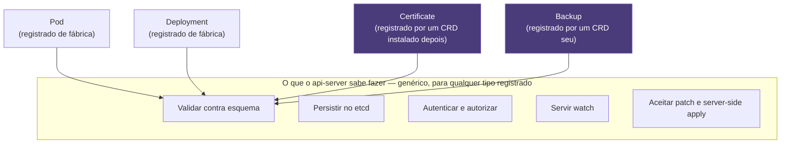
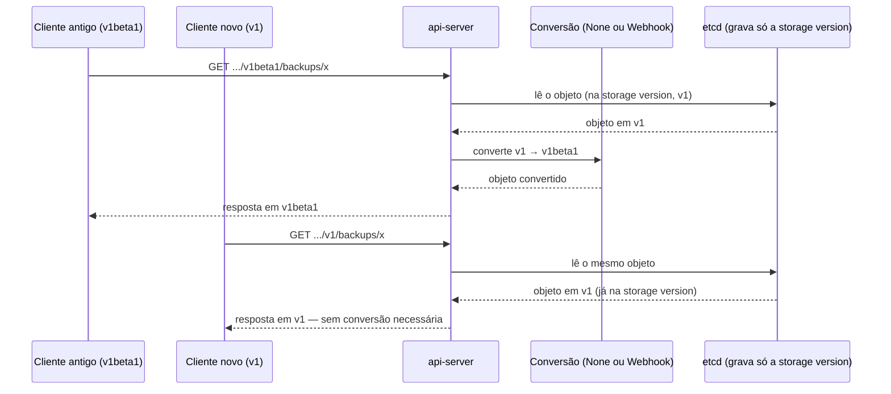

# A API como sistema extensível — CRDs

> [!abstract] TL;DR
> O api-server não sabe o que é um Deployment — ele sabe *servir recursos*: validar contra um esquema, versionar, persistir no etcd, autorizar e notificar quem observa. Toda a inteligência de um Deployment mora num controller que é só mais um cliente da mesma API que qualquer `curl` também alcança. Se isso é verdade, então qualquer um pode registrar um tipo novo, e esse tipo nasce cidadão de primeira classe: `kubectl`, RBAC, watch, server-side apply, `kubectl explain`, tudo de graça, porque o mecanismo que serve `Pod` é literalmente o mesmo que passa a servir `Certificate` ou `Backup`. O objeto que faz esse registro é a `CustomResourceDefinition` — anatomia de grupo, nomes, escopo, versões e esquema OpenAPI v3, com validação estrutural obrigatória e, desde a versão 1.33, regras CEL estáveis para invariantes que o esquema sozinho não expressa. O que o CRD nunca dá é comportamento: um CRD sem controller é um formulário bonito que o cluster guarda e mais nada — a peça que falta é assunto da próxima nota deste galho.

Instale qualquer ferramenta séria num cluster — cert-manager, o Prometheus Operator, Argo CD, um controlador de Ingress mais sofisticado — e repare no que acontece minutos depois da instalação terminar. Um comando que nunca funcionou antes, `kubectl get certificates` ou `kubectl get prometheuses` ou `kubectl get applications`, de repente funciona: lista objetos, mostra colunas com nome e idade, aceita `-n` para filtrar por namespace, responde a `kubectl describe` com um `status` detalhado. Nada disso é plugin do `kubectl` — não existe um binário `kubectl-cert-manager` sendo baixado, nenhum arquivo de configuração local do cliente mudou. O cluster ganhou um tipo novo, com o mesmo comportamento de qualquer tipo nativo, e a pergunta que vale a pena levar a sério, em vez de aceitar como mágica de instalação, é: como.

A resposta começa exatamente onde a nota [[03-Dominios/Tecnologia/Infraestrutura/Kubernetes/07 - kubectl é um cliente de API|07 — kubectl é um cliente de API]] parou. Aquela nota estabeleceu que `kubectl` é só um cliente HTTP entre outros, que toda URL da API segue a forma `/apis/<grupo>/<versão>/<recurso>`, e que `kubectl explain` funciona consultando o schema OpenAPI que o cluster de fato conhece — inclusive, já mencionado ali de passagem, para "recursos customizados exatamente como expõe para Pod ou Deployment". Esta nota puxa esse fio até a raiz: o que faz `kubectl explain certificate.spec.dnsNames` funcionar não é nenhum código escrito à mão dentro do api-server para entender `Certificate` — é o mesmo mecanismo genérico que entende `Pod`, agora apontado para um schema que alguém registrou depois que o cluster já estava rodando. E a nota [[03-Dominios/Tecnologia/Infraestrutura/Kubernetes/13 - RBAC e ServiceAccount|13 — RBAC e ServiceAccount]] já deixou um fio solto que esta nota amarra: a agregação de `ClusterRole`, que faz um recurso novo aparecer automaticamente dentro dos papéis padrão `edit` e `view` assim que alguém instala o CRD acompanhado do label certo — o mesmo tipo de generalidade, vista de outro ângulo.

## A virada: o api-server é genérico

Vale nomear com todas as letras o argumento que sustenta o galho inteiro desde a nota sobre o loop de reconciliação, porque esta nota é a sua consequência mais profunda: **o api-server não tem nenhuma lógica de negócio embutida sobre nenhum tipo específico de objeto.** Ele não sabe que um Deployment deveria criar um ReplicaSet quando `spec.replicas` muda. Ele não sabe que um Service deveria juntar Pods por label selector num EndpointSlice. Ele não sabe que um Pod deveria ser agendado num node por um scheduler. Tudo isso é comportamento — e comportamento, como as notas anteriores deste galho mostraram repetidamente, mora em controllers, processos separados, rodando fora do api-server, falando com ele pela mesma porta HTTP que qualquer outro cliente usa.

O que o api-server de fato sabe fazer, para qualquer tipo de objeto registrado, é um conjunto pequeno e genérico de operações: validar a estrutura de um objeto contra um esquema conhecido; atribuir e checar versões (`resourceVersion`) para controle de concorrência otimista; persistir o objeto no etcd; aplicar autenticação e autorização a cada requisição; expor um mecanismo de watch para quem quiser observar mudanças; e aceitar patches parciais e server-side apply com posse de campo por manager. Nenhuma dessas seis operações menciona "Deployment" ou "Pod" em lugar nenhum — elas são genéricas por construção, parametrizadas pelo esquema do tipo, não pelo tipo em si. `Deployment`, `Pod`, `Service` são só os tipos que o próprio projeto Kubernetes decidiu registrar de fábrica, com controllers embutidos no `kube-controller-manager` para lhes dar comportamento. Não existe, na arquitetura, nenhuma linha divisória especial entre "tipo nativo, que o api-server entende de verdade" e "tipo customizado, que ele só finge entender" — existe um único caminho de registro, e os tipos nativos passaram por ele antes de qualquer cluster ser ligado pela primeira vez.



É essa generalidade — não a existência de um recurso específico, não a popularidade de nenhum operator em particular — que explica o ecossistema inteiro do Kubernetes. Cert-manager não existe porque alguém convenceu o projeto Kubernetes a adicionar TLS ao núcleo; existe porque qualquer um pode registrar um tipo `Certificate`, escrever um controller que observa esses objetos e fala com uma autoridade certificadora, e distribuir os dois juntos como um pacote instalável. O mesmo vale para Prometheus Operator, para Argo CD, para praticamente todo projeto de infraestrutura que se anuncia como "nativo do Kubernetes": a frase inteira significa, na prática, "registra tipos via CRD e reconcilia com um controller próprio". Se o api-server tivesse lógica de negócio hard-coded por tipo, esse ecossistema simplesmente não existiria — cada extensão exigiria um fork do próprio Kubernetes.

Vale levar essa constatação um passo além, porque ela também explica por que a distinção entre "recurso nativo" e "recurso customizado" é, no fundo, uma distinção de calendário, não de arquitetura. Todo tipo nativo do Kubernetes — `Deployment`, `Job`, `HorizontalPodAutoscaler` — nasceu, em algum ponto da história do projeto, como uma proposta de esquema submetida ao repositório principal, revisada, e compilada dentro do binário do api-server. Um CRD faz o equivalente funcional desse processo, só que em tempo de execução, contra um cluster já ligado, sem precisar recompilar nem reiniciar nada. A única diferença estrutural remanescente entre os dois é onde o esquema mora — embutido no binário do api-server, para os tipos nativos, ou gravado como um objeto `CustomResourceDefinition` no etcd, para os customizados — e essa diferença de local de armazenamento não se manifesta em nenhum comportamento observável por um cliente da API.

## `CustomResourceDefinition`: o objeto que registra um tipo novo

O objeto que executa esse registro é, ele mesmo, um recurso do Kubernetes — uma `CustomResourceDefinition`, do grupo `apiextensions.k8s.io`, sempre com escopo de cluster inteiro (nunca namespaced, porque um tipo novo precisa existir para o cluster inteiro, não só para um namespace). Aplicar uma CRD é, mecanicamente, o mesmo `kubectl apply` de sempre, contra o mesmo api-server, gravando o mesmo tipo de objeto no mesmo etcd — só que o efeito colateral dessa gravação específica é fazer o próprio api-server passar a servir um caminho de URL novo, quase sempre em segundos.

```yaml
apiVersion: apiextensions.k8s.io/v1
kind: CustomResourceDefinition
metadata:
    name: backups.exemplo.com
spec:
    group: exemplo.com
    scope: Namespaced
    names:
        plural: backups
        singular: backup
        kind: Backup
        shortNames:
            - bkp
        categories:
            - all
    versions:
        - name: v1
          served: true
          storage: true
          schema:
              openAPIV3Schema:
                  type: object
                  properties:
                      spec:
                          type: object
```

Vale nomear cada campo dessa anatomia com precisão, porque cada um resolve um problema separado. `spec.group` é o grupo de API sob o qual o tipo vai viver — a mesma peça que a nota sobre `kubectl` como cliente de API já explicou para os grupos nativos (`apps`, `batch`, `networking.k8s.io`); um CRD sempre entra num grupo nomeado, nunca no grupo legado vazio, que é reservado para os tipos históricos do próprio projeto. `spec.names` carrega quatro variações do mesmo nome, cada uma servindo um propósito de superfície diferente: `plural` é o segmento que aparece na URL (`/apis/exemplo.com/v1/backups`) e o que `kubectl get backups` espera; `singular` é usado em mensagens de erro e como alias de `kubectl get`; `kind` é o valor que vai no campo `kind` de todo manifesto YAML desse tipo; `shortNames` é uma lista de apelidos curtos (`kubectl get bkp` funciona igual a `kubectl get backups`) — a mesma ideia por trás de `po` para `pods` ou `deploy` para `deployments`; `categories` agrupa o tipo dentro de coleções que `kubectl get <categoria>` já entende, sendo `all` a mais comum, a mesma que faz `kubectl get all` listar Pods, Deployments e Services juntos.

`spec.scope` decide se instâncias desse tipo vivem dentro de um namespace (`Namespaced`, o caso mais comum, análogo a `Pod` ou `ConfigMap`) ou soltas no cluster inteiro (`Cluster`, análogo a `Node` ou `PersistentVolume`) — a mesma distinção de escopo que a nota sobre RBAC já detalhou para `Role` contra `ClusterRole`, só que aplicada aqui à instância do recurso, não à permissão sobre ele. Vale reter uma consequência direta dessa escolha, fácil de esquecer até se deparar com ela na prática: um `Backup` com `scope: Namespaced` some junto com o namespace inteiro se alguém apagar esse namespace — o mesmo destino de qualquer `Pod` ou `ConfigMap` ali dentro, porque o garbage collector trata a relação namespace-objeto exatamente como trata qualquer outra `ownerReference`. `spec.versions` é uma lista, não um campo único, porque um CRD pode servir mais de uma versão do mesmo tipo simultaneamente — assunto da próxima seção — e cada entrada da lista carrega, entre outras coisas, dois booleanos que decidem o comportamento externo (`served`) e o comportamento de persistência (`storage`) daquela versão específica, além do próprio `schema.openAPIV3Schema`, o esquema de validação em OpenAPI v3 que decide o que um objeto desse tipo pode conter.

A CRD, ela mesma, também tem `spec` e `status` — o mesmo par que a nota sobre o loop de reconciliação estabeleceu como universal a qualquer objeto do Kubernetes. `status.conditions` de uma `CustomResourceDefinition` reporta se o registro do tipo foi aceito e se está pronto para servir requisições (`Established`), e se algum nome (`plural`, `shortNames`) colidiu com um tipo já existente (`NamesAccepted`). Registrar um CRD passa, ele também, pelo mesmo laço observar-comparar-agir: aplicar o objeto grava a intenção no etcd, e um controller interno do api-server — não um processo externo, mas ainda assim um componente separado da simples gravação — processa esse registro e atualiza o roteamento HTTP do cluster para passar a aceitar o novo caminho. É por isso que existe uma janela, geralmente de menos de um segundo, entre `kubectl apply -f backup-crd.yaml` retornar sucesso e `kubectl get backups` funcionar sem erro — o mesmo tipo de defasagem síncrono-contra-assíncrono que a nota sobre o loop de reconciliação já descreveu para `Deployment`, só que aqui aplicada ao próprio ato de nascer um tipo novo.

> [!tip] Vídeo — o CRD montado campo a campo, com a analogia que ajuda
> [**What are Custom Resource Definitions (CRDs) in Kubernetes**](https://www.youtube.com/watch?v=TScDYMym7LA) (CookNCode, ~9 min, EN) escreve um `CustomResourceDefinition` do zero na tela e explica cada campo do manifesto na ordem em que ele aparece — `group`, `names` com singular/plural/`kind`, `served`, `storage` e o `schema` de validação —, terminando com o `kubectl get crds` que prova o registro. A analogia que ele usa para ancorar tudo é a mais útil que existe para este assunto e vale mesmo para quem já entendeu o mecanismo: o **CRD está para o recurso customizado assim como uma classe está para seus objetos** — o CRD é o molde que define quais campos existem e que forma têm; cada recurso criado depois é uma instância que precisa obedecer àquele contrato. É exatamente o que a seção seguinte desenvolve ao tratar validação. **O que ele não cobre — e é a maior parte desta nota:** versionamento com conversão entre versões, subrecursos `/status` e `/scale`, `additionalPrinterColumns` e o resto da ergonomia, a camada de agregação como caminho alternativo, e a distinção central de que o CRD entrega **armazenamento e API, não comportamento** — que é a ponte para a nota 19.

## Validação: o esquema decide o que é aceito

Desde a API `apiextensions.k8s.io/v1` — disponível desde a versão 1.16, com o antecessor `v1beta1` removido definitivamente na versão 1.22 — todo CRD é obrigado a declarar um **esquema estrutural**, uma restrição específica sobre o que um schema OpenAPI v3 pode conter para ser aceito pelo api-server. Um esquema estrutural exige, entre outras regras, que todo campo tenha um `type` explícito (exceto quando marcado com `x-kubernetes-preserve-unknown-fields: true`), que campos usados dentro de `allOf`/`anyOf`/`oneOf`/`not` também apareçam fora desses operadores lógicos, e que só `metadata.name` e `metadata.generateName` possam ser restringidos dentro de `metadata`. A motivação não é burocracia por burocracia: um esquema não estrutural deixa ambiguidades que impediriam o api-server de aplicar, de forma confiável, o resto das funcionalidades desta seção — geração automática de defaults, `additionalPrinterColumns`, e a poda de campos desconhecidos.

```yaml
schema:
    openAPIV3Schema:
        type: object
        properties:
            spec:
                type: object
                required:
                    - alvo
                    - retencaoDias
                properties:
                    alvo:
                        type: string
                        description: "Nome do recurso a ser copiado"
                    retencaoDias:
                        type: integer
                        minimum: 1
                        default: 30
                    criptografado:
                        type: boolean
                        default: true
                    metadadosExtras:
                        type: object
                        x-kubernetes-preserve-unknown-fields: true
```

`required` funciona exatamente como em qualquer schema OpenAPI: uma lista de campos que precisam estar presentes para o objeto ser aceito na criação — tentar aplicar um `Backup` sem `alvo` volta com um erro de validação do api-server, no mesmo estilo de qualquer campo mal formado que a nota sobre o loop de reconciliação já mostrou para tipos nativos. `default` preenche um valor quando o campo é omitido — `retencaoDias` some do manifesto do usuário e aparece, de qualquer forma, como `30` no objeto gravado, o mesmo comportamento de "o api-server preenche dezenas de campos que você nunca escreveu" que a nota sobre `kubectl` já documentou para um Pod mínimo, só que agora acontecendo também para um tipo que você mesmo inventou.

`x-kubernetes-preserve-unknown-fields: true` merece um parágrafo à parte, porque o custo de usá-lo costuma passar despercebido. Por padrão, o api-server **poda** (remove) qualquer campo que não esteja declarado no esquema — é assim que a validação protege contra digitação errada, campo obsoleto, ou payload malicioso carregando dados extras. Marcar um nó do schema com essa flag desliga a poda ali dentro: qualquer estrutura JSON arbitrária passa a ser aceita e preservada sem checagem nenhuma. É útil para um caso genuíno — um campo que precisa carregar JSON de formato livre, controlado por outro sistema — mas usá-lo como atalho para "não quero escrever o schema completo agora" é abrir mão da validação que é, precisamente, o primeiro serviço que o api-server oferece de graça a qualquer tipo registrado.

### Regras de validação em CEL: invariantes que o esquema sozinho não expressa

Um esquema OpenAPI v3, por mais detalhado que seja, tem um limite estrutural: ele descreve a forma de um objeto isolado, campo a campo, mas não consegue expressar uma relação entre dois campos, nem comparar o valor atual de um campo com o valor que ele tinha antes de uma atualização. "O campo `alvo` não pode mudar depois de criado" ou "se `criptografado` for `false`, `chaveExterna` precisa estar vazio" são regras que nenhuma combinação de `type`, `required` e `default` consegue capturar sozinha. Antes da alternativa que esta seção descreve, a única forma de aplicar esse tipo de invariante era escrever um *admission webhook* próprio — um serviço HTTP separado, mantido, implantado e observado à parte, só para validar um punhado de regras.

Regras de validação em CEL (*Common Expression Language*), declaradas em `x-kubernetes-validations` dentro do schema, resolvem exatamente essa lacuna sem exigir webhook nenhum. Cada regra é uma expressão booleana avaliada pelo próprio api-server no momento da escrita, com acesso ao objeto atual através da variável `self` e, em atualizações, ao objeto anterior através de `oldSelf`:

```yaml
schema:
    openAPIV3Schema:
        type: object
        properties:
            spec:
                type: object
                properties:
                    alvo:
                        type: string
                    criptografado:
                        type: boolean
                x-kubernetes-validations:
                    - rule: "self.alvo == oldSelf.alvo"
                      message: "spec.alvo é imutável após a criação"
                      reason: FieldValueInvalid
```

> [!info] Baseline de versão
> Validação via CEL em CRDs (`x-kubernetes-validations`, controlada pelo feature gate `CustomResourceValidationExpressions`) entrou como alpha na versão 1.23, passou a beta — habilitada por padrão — na 1.25, e é **estável desde a versão 1.29**. Em qualquer cluster na linha 1.25 ou mais recente a funcionalidade já está disponível sem flag adicional, e da 1.29 em diante ela deixou de ser opcional em qualquer sentido prático. Vale não confundir esse recurso com outros mecanismos de CEL que amadureceram depois e resolvem problemas vizinhos — a política de admissão baseada em CEL (`ValidatingAdmissionPolicy`) e o *ratcheting* de validação de CRD são recursos distintos, com cronogramas próprios.

A regra do exemplo compara `self.alvo` com `oldSelf.alvo`, e só passa quando os dois coincidem — o mesmo padrão de "campo imutável" que aparece com frequência em recursos nativos do próprio Kubernetes (tentar mudar `spec.selector` de um Deployment depois de criado também falha, por um mecanismo equivalente). CEL suporta operadores lógicos e de comparação, navegação por listas e mapas, e funções de string, o suficiente para expressar a maioria das invariantes de negócio que antes exigiam um webhook dedicado — sem o custo operacional de manter um serviço HTTP extra, disponível, com sua própria política de retry e sua própria superfície de falha, só para validar regras que cabem em uma linha de expressão.

## Versionamento e conversão

Um CRD pode declarar mais de uma versão do mesmo tipo ao mesmo tempo, cada entrada em `spec.versions` com seus dois booleanos independentes: `served` decide se aquela versão responde a requisições (uma versão com `served: false` continua existindo no schema, mas `kubectl get backups.v1beta1.exemplo.com` falha como se o tipo não existisse); `storage` decide em qual formato o objeto é de fato persistido no etcd. A regra que o api-server impõe, sem exceção, é que **exatamente uma** versão tenha `storage: true` — nunca zero, nunca duas. Isso não é arbitrário: o etcd guarda um único blob por objeto, então precisa existir exatamente uma "forma canônica" na qual aquele blob é escrito, mesmo que várias versões diferentes possam ser servidas simultaneamente a clientes diferentes.

```yaml
versions:
    - name: v1beta1
      served: true
      storage: false
    - name: v1
      served: true
      storage: true
```

Esse desenho resolve um problema real e recorrente: um CRD evolui — um campo muda de nome, um tipo de campo muda de string para objeto estruturado — e clientes antigos (um Helm chart desatualizado, um pipeline de CI que ainda gera manifestos na versão antiga) continuam pedindo `v1beta1` enquanto controllers novos já usam `v1`. Sem suporte a múltiplas versões servidas, essa migração exigiria uma janela de indisponibilidade coordenada entre todos os clientes; com ele, as duas versões convivem, e a conversão entre uma e outra fica a cargo do campo `spec.conversion`.



Repare, nesse diagrama, que a conversão só entra em ação quando a versão pedida difere da versão de armazenamento — pedir a própria `storage version` de volta nunca aciona `spec.conversion`, porque não há nada para converter. É essa assimetria que explica por que a estratégia `None` continua sendo o default seguro: enquanto os schemas de fato coincidem entre versões, não existe trabalho de conversão real a fazer, só a troca do rótulo `apiVersion` no envelope da resposta.

A estratégia `None` — o default — assume que todas as versões servidas têm exatamente o mesmo schema, e a única coisa que muda entre uma requisição em `v1beta1` e outra em `v1` é o valor do campo `apiVersion` no corpo da resposta; nenhuma transformação de dado acontece. Ela só é segura quando as versões de fato não divergem em nenhum campo — o caso mais comum de "promover uma versão beta para estável" sem tocar no schema. A estratégia `Webhook` entra quando os schemas divergem de verdade: o api-server chama um serviço HTTP externo, passando o objeto na versão de origem, e espera de volta o mesmo objeto convertido para a versão de destino — a mesma peça de infraestrutura (um webhook mantido pelo autor do CRD) que a seção anterior evitou para validação simples, aqui justificada porque conversão entre schemas divergentes é, por natureza, lógica arbitrária que nenhuma declaração estática resolve sozinha.

## Subrecursos: `/status` e `/scale`

Um CRD pode declarar dois subrecursos opcionais, cada um expondo um caminho de URL separado do objeto principal, e cada um resolvendo um problema de design diferente. O subrecurso `status`, habilitado com uma seção vazia `status: {}` dentro de `subresources`, separa o caminho `/apis/exemplo.com/v1/namespaces/<ns>/backups/<nome>/status` do restante do objeto:

```yaml
versions:
    - name: v1
      subresources:
          status: {}
          scale:
              specReplicasPath: .spec.paralelismo
              statusReplicasPath: .status.execucoesAtivas
```

Essa separação importa por duas razões que ecoam diretamente a distinção `spec` contra `status` que a nota [[03-Dominios/Tecnologia/Infraestrutura/Kubernetes/02 - O loop de reconciliação|02 — O loop de reconciliação]] estabeleceu como a espinha do galho inteiro. A primeira é RBAC granular: com o subrecurso habilitado, uma `Role` pode conceder `update` sobre `backups/status` sem conceder `update` sobre `backups` — o controller que reconcilia `Backup` ganha permissão de escrever o resultado da reconciliação sem ganhar, de brinde, permissão de reescrever a intenção original do usuário. A segunda é proteção contra sobrescrita acidental: sem o subrecurso, um `kubectl apply` no manifesto do usuário — que naturalmente não inclui os campos de `status`, porque o usuário nunca escreve `status` — corre o risco de zerar qualquer valor de status que o controller já tivesse escrito, dependendo do tipo de patch em uso; com o subrecurso ativo, escritas em `/status` e escritas no resto do objeto passam por endpoints diferentes, cada um com sua própria contabilidade de campo no server-side apply, e uma não pisa na outra por acidente.

O subrecurso `scale`, com `specReplicasPath` e `statusReplicasPath` apontando para os campos do tipo customizado que representam "quantas réplicas eu quero" e "quantas réplicas existem agora", é o que faz `kubectl scale` funcionar contra o tipo novo — e, mais importante em produção, é o que permite ao **HorizontalPodAutoscaler** apontar para o recurso customizado como se fosse um Deployment qualquer. Sem esse subrecurso declarado, nem `kubectl scale backup/meu-backup --replicas=3` nem um HPA configurado contra `Backup` teriam como funcionar — não porque o conceito de "réplicas" não faça sentido para o tipo, mas porque não existe um caminho padronizado que o HPA saiba consultar sem essa declaração explícita de onde, dentro do schema customizado, mora o número.

```bash
kubectl scale backup/backup-banco-producao --replicas=3 -n dados
kubectl get backup backup-banco-producao -n dados -o jsonpath='{.spec.paralelismo}{"\n"}'
```

O primeiro comando monta, por baixo dos panos, um `PATCH` contra `/apis/exemplo.com/v1/namespaces/dados/backups/backup-banco-producao/scale` — o mesmo endpoint de subrecurso que `kubectl scale deployment` usa contra `/apis/apps/v1/.../deployments/.../scale` — e o api-server traduz esse `replicas` genérico de volta para o campo real declarado em `specReplicasPath`, `spec.paralelismo` no exemplo. É essa tradução, feita pelo próprio CRD, que permite ao `kubectl scale` e ao HPA falarem uma linguagem genérica de "réplicas" sem precisar conhecer o nome específico que cada schema customizado escolheu para o mesmo conceito.

## Ergonomia: fazendo o tipo novo parecer nativo de verdade

Três recursos, nenhum deles estritamente necessário para o tipo funcionar, decidem se um CRD parece polido ou parece um objeto cru mal documentado quando alguém interage com ele pela primeira vez. `additionalPrinterColumns` decide o que `kubectl get` mostra além das colunas padrão (`NAME` e `AGE`):

```yaml
additionalPrinterColumns:
    - name: Alvo
      type: string
      jsonPath: .spec.alvo
    - name: Retenção (dias)
      type: integer
      jsonPath: .spec.retencaoDias
    - name: Status
      type: string
      jsonPath: .status.fase
```

Sem essa declaração, `kubectl get backups` mostra só nome e idade — tecnicamente funcional, mas obrigando qualquer investigação além do óbvio a cair em `-o yaml` ou `-o jsonpath`. Com ela, a experiência de linha de comando do tipo customizado fica indistinguível da de um `Deployment`, cujo `kubectl get` já mostra `READY`, `UP-TO-DATE` e `AVAILABLE` através do mesmo mecanismo. `categories`, já mencionado na anatomia do CRD, agrupa o tipo dentro de coleções pré-existentes (`all` é a mais usada) ou dentro de uma categoria própria de um projeto maior, para que `kubectl get <categoria>` liste vários tipos relacionados de uma vez. `shortNames` reduz o atrito de digitação — `bkp` no lugar de `backups` — do mesmo jeito que `deploy` substitui `deployments` em qualquer sessão interativa.

`kubectl explain`, já apresentado na nota sobre `kubectl` como cliente de API, também herda essa ergonomia sem custo adicional. Assim que um CRD com schema completo está registrado, `kubectl explain backup.spec` navega o schema customizado exatamente como navegaria `deployment.spec`, incluindo a descrição de cada campo declarada via `description` no schema:

```bash
kubectl explain backup.spec.retencaoDias
```

```
KIND:     Backup
VERSION:  exemplo.com/v1

FIELD: retencaoDias <integer>

DESCRIPTION:
    <sem description explícita no schema deste campo>
```

Repare que a qualidade dessa saída depende inteiramente do esforço colocado no schema — um campo sem `description` produz uma explicação genérica, e um schema inteiro sob `x-kubernetes-preserve-unknown-fields` não produz explicação nenhuma, porque não existe estrutura declarada para `kubectl explain` percorrer. É outro ângulo do mesmo custo já nomeado antes: pular a escrita cuidadosa do schema economiza tempo na criação do CRD e cobra esse tempo de volta, com juros, de cada pessoa que depois tenta entender o tipo customizado sem ler o código do controller.

## O que o CRD dá de graça

Vale consolidar, num só lugar, a lista completa do que o registro de um CRD entrega sem que o autor precise escrever uma linha de código para nenhum item dela: `kubectl get`, `create`, `apply`, `patch`, `delete`, exatamente como para qualquer tipo nativo, porque são as mesmas operações genéricas de sempre, só que apontadas para um schema novo. Watch — o mesmo mecanismo de conexão HTTP de longa duração que sustenta o Informer descrito na nota sobre o loop de reconciliação — funciona para instâncias do tipo customizado sem nenhuma adaptação; um controller escrito com `client-go` observa `Backup` exatamente como observaria `Pod`. RBAC funciona sem ajuste — uma `Role` com `apiGroups: ["exemplo.com"]` e `resources: ["backups"]` é uma regra tão válida quanto qualquer outra, e a agregação de `ClusterRole` que a nota sobre RBAC descreveu passa a incluir o tipo novo nos papéis padrão assim que o CRD chega acompanhado do label `rbac.authorization.k8s.io/aggregate-to-edit: "true"`. Server-side apply e a contabilidade de posse de campo por manager também se aplicam integralmente. Auditoria do cluster — o log estruturado de quem fez o quê contra a API — registra chamadas contra `Backup` no mesmo formato que registra chamadas contra `Deployment`. Admission — validating e mutating webhooks configurados no cluster — pode interceptar objetos customizados exatamente como intercepta nativos, desde que o `AdmissionWebhookConfiguration` correspondente os inclua no seu escopo. E `kubectl explain backup.spec.alvo` funciona porque o schema publicado via OpenAPI é o mesmo mecanismo, só que alimentado por um documento que o CRD acabou de registrar.

Vale reter a formulação mais direta possível dessa lista inteira: **do ponto de vista de qualquer cliente da API — humano, pipeline, biblioteca — um tipo registrado via CRD é indistinguível de um tipo nativo do Kubernetes.** Não existe bandeira, cabeçalho ou comportamento visível que denuncie "este aqui foi adicionado depois" — a única forma de descobrir é perguntar explicitamente, via `kubectl api-resources` ou olhando o `apiVersion`, se o grupo é um dos grupos originais do projeto ou um grupo de terceiros.

Vale também nomear, com a mesma precisão que a nota sobre `kubectl` como cliente de API já aplicou aos tipos nativos, que essa gratuidade cobre igualmente os modos de inspeção mais usados no dia a dia. `kubectl get backups -o yaml` devolve o objeto completo, `spec` e `status`, exatamente no mesmo formato de saída que qualquer `Deployment`. `-o jsonpath` e `-o custom-columns` navegam a árvore de um `Backup` com a mesma sintaxe que navegariam a árvore de um `Pod` — não existe um dialeto de jsonpath separado para tipos customizados. `--dry-run=server` valida uma instância de `Backup` contra o schema publicado, incluindo qualquer regra CEL declarada, sem persistir nada, do mesmo jeito que validaria um `Deployment` contra admission webhooks configurados no cluster. Cada uma dessas ferramentas funciona porque nenhuma delas foi escrita pensando em tipos específicos — todas consultam o schema publicado via OpenAPI e operam sobre ele, seja ele embutido no binário do api-server ou registrado, minutos atrás, por uma `CustomResourceDefinition`.

## O que o CRD não dá: comportamento

Toda essa generosidade tem um limite exato, e vale nomeá-lo sem meio-termo: **um CRD, sozinho, não faz absolutamente nada acontecer.** Aplicar a `CustomResourceDefinition` de `Backup` e depois aplicar uma instância `kind: Backup` não dispara nenhum backup de verdade — o objeto é validado, gravado no etcd, e fica ali, parado, com o `status` que você mesmo escreveu (se escreveu algum) e nenhum processo observando para reagir a ele. É o equivalente exato de aplicar um `Deployment` num cluster hipotético sem `kube-controller-manager` rodando: a `spec` fica gravada, perfeitamente válida, e nenhum Pod nasce, porque não existe ninguém do outro lado comparando `spec` com `status` e agindo na diferença.

Um CRD sem controller é, em outras palavras, um formulário bonito: tem campos tipados, tem validação, tem uma interface de linha de comando ergonômica — e não faz nada além de guardar o que foi preenchido. A "inteligência" que transformaria `spec.alvo` e `spec.retencaoDias` num backup de verdade, executado, monitorado, com `status.fase` atualizado ao longo do processo, é um segundo componente, inteiramente separado do CRD, que precisa ser escrito, implantado e mantido à parte. Esse componente — um controller customizado, escrito com o mesmo padrão observar-comparar-agir descrito na nota sobre o loop de reconciliação, rodando fora do api-server, com sua própria ServiceAccount e sua própria `Role` — é o assunto inteiro da próxima nota deste galho, [[03-Dominios/Tecnologia/Infraestrutura/Kubernetes/19 - Operators|19 — Operators]]. O vocabulário que esta nota constrói — o tipo, o schema, os subrecursos, a ergonomia — existe pronto para ser usado; falta só o laço que faz alguém agir sobre ele.

## O outro caminho de extensão: a camada de agregação

CRD não é a única forma de estender a API do Kubernetes — vale conhecer a alternativa para entender, por contraste, por que quase ninguém a escolhe. A **camada de agregação** (*API aggregation*), configurada através de um objeto `APIService`, permite que um servidor de API próprio — um processo HTTP separado, escrito do zero, implementando as mesmas convenções de validação, serialização e autenticação que o api-server principal — atenda um grupo de API inteiro. O api-server principal, ao receber uma requisição para um grupo registrado dessa forma, encaminha (faz *proxy* de) a chamada para esse servidor externo, em vez de resolver a requisição sozinho contra o etcd.

O exemplo clássico, presente em praticamente qualquer cluster com autoscaling habilitado, é o **metrics-server**: ele implementa o grupo `metrics.k8s.io`, servindo os tipos `PodMetrics` e `NodeMetrics` que alimentam `kubectl top` e o HorizontalPodAutoscaler. Diferente de um recurso via CRD, esses objetos nunca são persistidos no etcd — o metrics-server calcula os valores sob demanda, a partir de dados coletados do kubelet de cada node, e responde diretamente, sem nenhuma gravação permanente de estado. É exatamente esse tipo de caso — dados calculados, efêmeros, caros de manter sincronizados no etcd — que justifica pagar o custo mais alto da agregação: implementar um servidor de API do zero, respeitando manualmente autenticação, autorização, versionamento, e toda a superfície de convenções que um CRD ganha de graça.

| | CRD | Agregação (APIService) |
|---|---|---|
| Persistência | Automática, no etcd do cluster | Responsabilidade do servidor externo — pode não persistir nada |
| Esforço de implementação | Um manifesto YAML de schema | Um servidor HTTP completo, implementando as convenções da API |
| Validação, watch, RBAC, server-side apply | De graça, herdados do api-server | Reimplementados manualmente pelo servidor externo |
| Caso de uso típico | A esmagadora maioria dos operators e ferramentas de terceiros | Dados calculados/efêmeros (métricas) ou integração com um sistema de armazenamento próprio já existente |
| Exemplo canônico | cert-manager, Prometheus Operator, praticamente todo operator | metrics-server |

A comparação honesta é que a camada de agregação existe para o caso em que o modelo de "objeto declarativo guardado no etcd" simplesmente não se encaixa — dados que mudam tão rápido que persistir cada mudança seria desperdício, ou um sistema de armazenamento externo que já tem sua própria fonte de verdade e não deveria duplicar estado no etcd do cluster. Fora desses casos relativamente raros, CRD vence por uma margem enorme: qualquer operator que representa "um recurso que existe, com um estado desejado e um estado observado" — a esmagadora maioria dos casos reais — se encaixa perfeitamente no modelo `spec`/`status` que o CRD já entrega pronto, sem exigir que ninguém reimplemente autenticação e watch do zero.

Vale um comentário final sobre por que essa escolha raramente é revisitada depois de feita: um servidor de API agregado precisa reimplementar, corretamente, toda a superfície que o watch e o Informer descritos na nota sobre o loop de reconciliação pressupõem — incluindo o comportamento de `resourceVersion` crescente, a compactação de histórico, e a resposta `410 Gone` que dispara uma relist quando um cliente fica desconectado por tempo demais. Um bug sutil nessa reimplementação não quebra só um endpoint isolado: quebra, de forma silenciosa, qualquer controller de terceiros que dependa daquele grupo de API para funcionar corretamente sob falha de rede. É esse risco de reimplementar mal uma peça de infraestrutura que já existe, pronta e testada, dentro do próprio api-server, que explica por que a maioria esmagadora dos projetos que hoje usam agregação — o próprio metrics-server incluído — só o fazem porque o dado que servem genuinamente não cabe no modelo de objeto persistido que o CRD pressupõe.

## Limites e armadilhas reais

CRD não é gratuito em todos os sentidos — vale nomear com honestidade onde o modelo cobra um preço, antes da lista formal de armadilhas mais adiante. Uma `CustomResourceDefinition` é, por definição, um objeto de escopo de cluster inteiro: não existe "um CRD por namespace", e não existe "duas versões incompatíveis do mesmo CRD coexistindo pacificamente". Quando dois Helm charts diferentes — digamos, duas versões distintas do mesmo operator, instaladas por engano em dois namespaces diferentes — tentam registrar CRDs com o mesmo nome mas schemas divergentes, o resultado não é dois CRDs convivendo: é um único objeto `CustomResourceDefinition` no cluster, e o segundo `apply` sobrescreve, ou entra em conflito de posse de campo com, o primeiro — o mesmo mecanismo de conflito de field manager que a nota sobre `kubectl` como cliente de API já descreveu para qualquer outro objeto, só que aqui o objeto em disputa é a própria definição de um tipo inteiro, não uma instância dele.

Apagar um CRD é uma operação mais destrutiva do que costuma parecer à primeira vista: o garbage collector do cluster, guiado pelo mesmo mecanismo de `ownerReferences` já descrito na nota sobre o loop de reconciliação, remove **todas as instâncias daquele tipo** junto com a definição — não é possível apagar só o "molde" e manter os objetos que já existiam. Um `kubectl delete crd backups.exemplo.com`, rodado sem pensar duas vezes durante uma limpeza de cluster, apaga silenciosamente todo `Backup` que qualquer equipe tivesse criado, em qualquer namespace, sem confirmação adicional além da confirmação padrão do próprio `delete`.

O gerenciamento de CRD por Helm merece nota à parte, porque o comportamento default surpreende quem assume que `helm upgrade` trata CRDs como qualquer outro recurso do chart. A própria documentação do Helm é explícita: CRDs colocadas no diretório especial `crds/` de um chart são instaladas na primeira vez que o chart é instalado (com `helm install`) — mas o Helm **não** as atualiza nem as remove em execuções seguintes, seja `helm upgrade`, seja `helm uninstall`. Essa foi uma decisão deliberada do projeto, motivada pelo risco de perda de dados: um `helm upgrade` que atualizasse uma CRD automaticamente, mudando seu schema, poderia invalidar objetos já existentes daquele tipo sem que ninguém tivesse pedido essa mudança explicitamente. A consequência prática é que atualizar o schema de um CRD instalado via Helm é, de fato, uma etapa manual — aplicar o CRD atualizado separadamente, fora do ciclo normal do chart — e times que esquecem desse detalhe descobrem, meses depois, que o operator novo espera um campo que o CRD antigo, nunca atualizado, simplesmente não conhece.

Por fim, o custo de guardar objetos grandes no etcd também se aplica, sem exceção, a recursos customizados: um `Backup` cujo `status` acumula um histórico extenso de execuções, ou um CRD cujo `spec` carrega um blob grande sob `x-kubernetes-preserve-unknown-fields`, pesa no mesmo orçamento de tamanho de objeto e de throughput de escrita que qualquer outro tipo — o etcd não distingue "nativo" de "customizado" na hora de contabilizar o custo de manter aquele estado consistente e replicado. Todo objeto individual do cluster, nativo ou customizado, compete contra o mesmo limite de tamanho por requisição que o etcd impõe por padrão (poucos megabytes), e um `Backup` que tenta empilhar um histórico crescente de execuções direto no `status`, em vez de externalizar esse histórico para outro armazenamento, é um jeito comum e evitável de esbarrar nesse teto — a mesma armadilha, em espécie, que levaria um `ConfigMap` gigante a falhar pela mesma razão.

Vale acrescentar um limite estrutural, menos citado, que decorre diretamente de o CRD ser um objeto de escopo de cluster: instalar um CRD exige permissão de RBAC sobre `customresourcedefinitions` no grupo `apiextensions.k8s.io`, um recurso de cluster inteiro — o que significa que, na prática, só quem já tem um nível razoável de confiança administrativa consegue introduzir tipos novos num cluster compartilhado. Times que operam clusters multi-tenant costumam restringir essa permissão a um pipeline central de plataforma, exatamente para evitar que qualquer equipe individual registre um CRD com nome colidindo com outro, ou com um schema mal desenhado que afeta a experiência de todo mundo que usa `kubectl get all` ou qualquer categoria compartilhada.

## Exemplo trabalhado completo

Vale fechar o corpo técnico reunindo cada peça discutida numa cena única: um tipo `Backup`, comentado do início ao fim, com esquema, subrecurso de status, colunas de impressão e uma regra CEL — seguido do objeto customizado correspondente e dos comandos de `kubectl` que passam a funcionar depois de aplicar os dois.

```yaml
apiVersion: apiextensions.k8s.io/v1
kind: CustomResourceDefinition
metadata:
    name: backups.exemplo.com
spec:
    group: exemplo.com
    scope: Namespaced
    names:
        plural: backups
        singular: backup
        kind: Backup
        shortNames:
            - bkp
        categories:
            - all
    versions:
        - name: v1
          served: true
          storage: true
          schema:
              openAPIV3Schema:
                  type: object
                  properties:
                      spec:
                          type: object
                          required:
                              - alvo
                              - retencaoDias
                          properties:
                              alvo:
                                  type: string
                                  description: "Nome do recurso a ser copiado"
                              retencaoDias:
                                  type: integer
                                  minimum: 1
                                  default: 30
                              criptografado:
                                  type: boolean
                                  default: true
                          x-kubernetes-validations:
                              - rule: "self.alvo == oldSelf.alvo"
                                message: "spec.alvo é imutável após a criação"
                      status:
                          type: object
                          properties:
                              fase:
                                  type: string
                              ultimaExecucao:
                                  type: string
                              tamanhoBytes:
                                  type: integer
          subresources:
              status: {}
          additionalPrinterColumns:
              - name: Alvo
                type: string
                jsonPath: .spec.alvo
              - name: Fase
                type: string
                jsonPath: .status.fase
              - name: Última execução
                type: string
                jsonPath: .status.ultimaExecucao
```

Repare que a regra CEL vive dentro de `properties.spec`, aplicada ao subobjeto `spec` — o `self` e o `oldSelf` dessa regra específica se referem à `spec` inteira, não ao objeto raiz, o que permite comparar `self.alvo` contra `oldSelf.alvo` diretamente. Aplicado esse CRD, a instância de um `Backup` real é um manifesto tão simples quanto qualquer `ConfigMap`:

```yaml
apiVersion: exemplo.com/v1
kind: Backup
metadata:
    name: backup-banco-producao
    namespace: dados
spec:
    alvo: banco-producao
    retencaoDias: 14
    criptografado: true
```

Aplicar os dois manifestos, nessa ordem, e o cluster inteiro passa a tratar `Backup` como um cidadão de primeira classe:

```bash
kubectl apply -f backup-crd.yaml
kubectl apply -f backup-banco-producao.yaml

kubectl get backups -n dados
kubectl get bkp -n dados
kubectl explain backup.spec.retencaoDias
kubectl describe backup backup-banco-producao -n dados
```

```
NAME                       ALVO              FASE   ÚLTIMA EXECUÇÃO
backup-banco-producao      banco-producao
```

A coluna `FASE` vem vazia porque nada além do CRD e da instância foi aplicado — nenhum controller está reconciliando `status.fase`, e é exatamente esse vazio, visível e honesto, que confirma a fronteira desta nota: o tipo existe, é validado, é listável, é descritível — e continua parado, esperando o laço que a próxima nota deste galho apresenta.

Tentar mudar `spec.alvo` depois de criado confirma a regra CEL em ação, sem precisar de webhook nenhum:

```bash
kubectl patch backup backup-banco-producao -n dados --type=merge -p '{"spec":{"alvo":"outro-banco"}}'
```

```
The Backup "backup-banco-producao" is invalid: spec.alvo: Invalid value: "string":
spec.alvo é imutável após a criação
```

## Armadilhas comuns

> [!warning] Apagar um CRD achando que é uma limpeza inofensiva
> `kubectl delete crd` remove, via garbage collector, todas as instâncias daquele tipo em qualquer namespace, de uma vez, sem confirmação adicional além da padrão. Antes de apagar um CRD de um cluster compartilhado, vale confirmar quantas instâncias existem (`kubectl get <tipo> -A --all-namespaces`) e se alguma equipe depende delas — a remoção não tem modo "só o molde, preserva os objetos".

> [!warning] Assumir que `helm upgrade` atualiza o schema do CRD
> Helm instala CRDs do diretório `crds/` de um chart apenas na primeira instalação; `helm upgrade` e `helm uninstall` deliberadamente não tocam nelas, por decisão explícita do projeto para evitar perda de dados. Um operator atualizado via `helm upgrade` pode passar a esperar um campo que o CRD antigo, nunca atualizado, simplesmente não conhece — a correção é aplicar o CRD novo manualmente, fora do ciclo do chart, antes ou durante o upgrade.

> [!warning] Usar `x-kubernetes-preserve-unknown-fields` como atalho para não escrever o schema
> Cada nó marcado com essa flag desliga a poda de campos desconhecidos e a validação estrutural ali dentro — qualquer JSON arbitrário passa. É legítimo para um campo genuinamente livre, controlado por outro sistema; usado por preguiça de detalhar o schema, é abrir mão do primeiro e mais barato serviço que um CRD entrega de graça: rejeitar, na entrada, um objeto malformado.

> [!warning] Duas fontes instalando CRDs incompatíveis com o mesmo nome
> Uma `CustomResourceDefinition` é um objeto único, de escopo de cluster — não existe "uma versão por namespace" nem "duas definições coexistindo". Dois charts, dois pipelines, ou duas versões do mesmo operator tentando registrar schemas divergentes para o mesmo nome entram em conflito de posse de campo exatamente como qualquer outro objeto disputado por dois managers, só que o objeto em jogo é a definição do tipo inteiro.

> [!warning] Confundir CRD registrado com comportamento implementado
> Um CRD aplicado sem nenhum controller correspondente é um tipo válido, listável, com `kubectl explain` funcionando — e sem nenhum efeito prático. É comum, sobretudo em prototipagem, esquecer que o `status` de um objeto sem controller nunca vai preencher sozinho; se `kubectl describe` mostra `status` vazio indefinidamente, a pergunta certa não é "por que a reconciliação está lenta", é "existe algum controller sequer rodando para este tipo".

## Como explicar em inglês

| Português | Inglês | Nuance de uso |
|---|---|---|
| Definição de recurso customizado | Custom Resource Definition (CRD) | Sempre por extenso na primeira menção, depois a sigla; "custom resource" sozinho refere-se à instância, "CRD" refere-se ao objeto de definição — os dois não são intercambiáveis. |
| Esquema estrutural | Structural schema | Termo técnico fixo da API `apiextensions.k8s.io/v1`; útil para explicar por que um schema precisa de `type` explícito em cada nó. |
| Regras de validação | Validation rules (CEL) | Sempre qualificado com "CEL" na primeira menção; "self" e "oldSelf" são citados em inglês mesmo em texto em português, porque são nomes de variáveis da linguagem, não termos traduzíveis. |
| Subrecurso | Subresource | "The status subresource decouples spec updates from status updates" é a formulação padrão para explicar o motivo de separar `/status`. |
| Camada de agregação | API aggregation layer | Sempre "aggregation layer" ou "aggregated API server", nunca só "aggregation" solto, que soa ambíguo fora de contexto. |
| Versão de armazenamento | Storage version | "Exactly one version must be the storage version" é a formulação exata que evita a ambiguidade entre "versão servida" e "versão persistida". |
| Poda de campos | Field pruning | Usado para explicar o comportamento default de remover campos não declarados no schema; contrasta diretamente com `x-kubernetes-preserve-unknown-fields` na mesma frase. |
| Cidadão de primeira classe | First-class citizen | Formulação idiomática comum para descrever que um tipo customizado tem a mesma superfície de `kubectl`, RBAC e watch que um tipo nativo — "a CRD makes your type a first-class citizen of the API." |

## O que vem a seguir

Esta nota deixou o vocabulário inteiro pronto — o tipo, o schema, os subrecursos, a ergonomia de linha de comando — e também deixou explícito o buraco exato que sobra: nenhum desses objetos age sozinho. `Backup` existe, é validado, é listável, aceita `kubectl scale` se o subrecurso estiver configurado, mas continua sendo só um formulário até que algo observe as instâncias e reaja a elas. A próxima nota deste galho, [[03-Dominios/Tecnologia/Infraestrutura/Kubernetes/19 - Operators|19 — Operators]], fecha exatamente essa lacuna: como um controller customizado, escrito com o mesmo padrão observar-comparar-agir de qualquer controller nativo, transforma um CRD parado num sistema que de fato faz backups, provisiona bancos de dados, ou renova certificados — o laço que faltava.

## Fontes

- [Kubernetes Docs — Extend the Kubernetes API with CustomResourceDefinitions](https://kubernetes.io/docs/tasks/extend-kubernetes/custom-resources/custom-resource-definitions/)
- [Kubernetes Docs — Versions in CustomResourceDefinitions](https://kubernetes.io/docs/tasks/extend-kubernetes/custom-resources/custom-resource-definition-versioning/)
- [Kubernetes Docs — Validation Rules for CustomResourceDefinitions (CEL)](https://kubernetes.io/docs/tasks/extend-kubernetes/custom-resources/custom-resource-definitions/#validation-rules)
- [Kubernetes Docs — Common Expression Language in Kubernetes](https://kubernetes.io/docs/reference/using-api/cel/)
- [Kubernetes Docs — Feature Gates (CustomResourceValidationExpressions)](https://kubernetes.io/docs/reference/command-line-tools-reference/feature-gates/)
- [Kubernetes Docs — Deprecated API Migration Guide](https://kubernetes.io/docs/reference/using-api/deprecation-guide/)
- [Kubernetes Docs — Kubernetes API Aggregation Layer](https://kubernetes.io/docs/concepts/extend-kubernetes/api-extension/apiserver-aggregation/)
- [Kubernetes Docs — Horizontal Pod Autoscaling](https://kubernetes.io/docs/tasks/run-application/horizontal-pod-autoscale/)
- [Kubernetes SIGs — metrics-server](https://github.com/kubernetes-sigs/metrics-server)
- [Helm Docs — Custom Resource Definitions](https://helm.sh/docs/chart_best_practices/custom_resource_definitions/)
