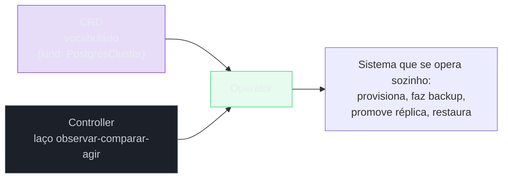
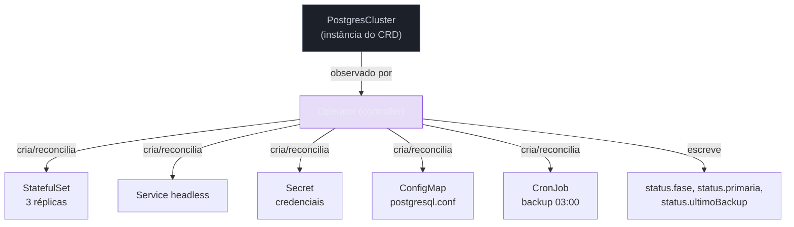
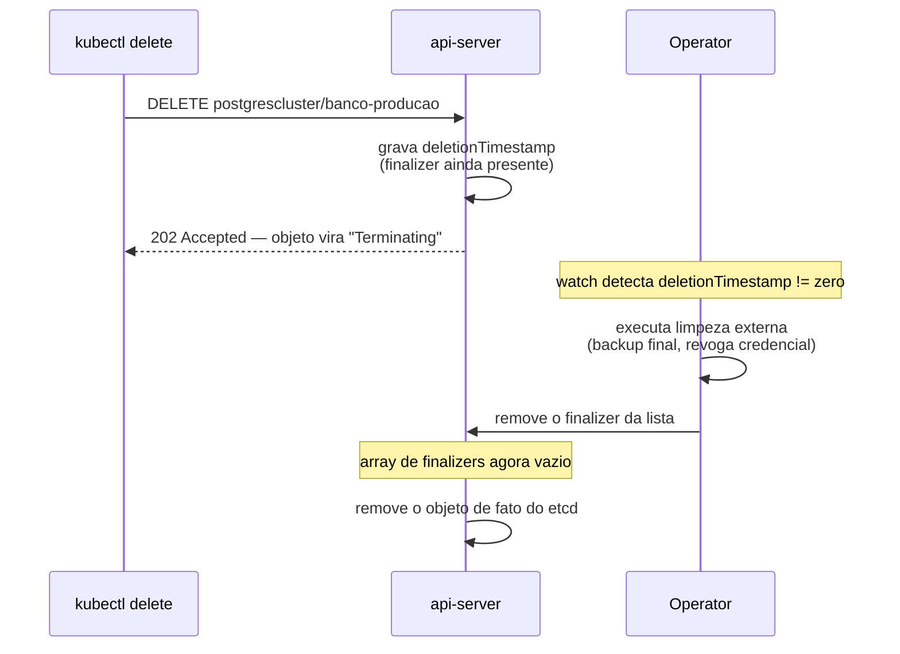
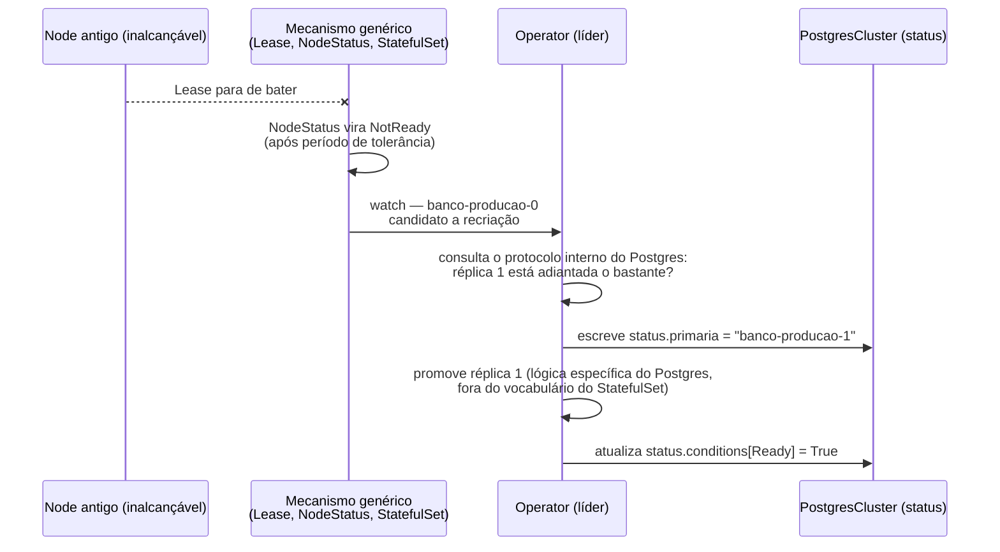
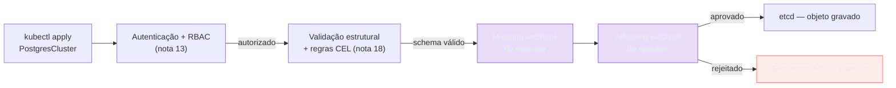

# Operators

> [!abstract] TL;DR
> Um `Backup` registrado via CRD é um formulário: campos tipados, validação, `kubectl get` funcionando — e nenhum backup de verdade acontecendo. A peça que faltava é o **controller**, e a fórmula que fecha o galho inteiro é simples de enunciar e profunda de entender: **CRD (o vocabulário) + controller (o laço) = operator**. Um operator não é uma categoria nova de mecanismo — é o mesmo padrão observar-comparar-agir da nota sobre o loop de reconciliação, escrito por alguém de fora do projeto Kubernetes, para um tipo que também é de fora, encapsulando conhecimento operacional que hoje mora na cabeça de quem opera um sistema à mão ou num runbook lido às três da manhã. Um StatefulSet de banco de dados dá disco estável e nome estável; não sabe promover uma réplica quando a primária morre, não sabe fazer backup agendado, não sabe restaurar para um instante no tempo. Um operator é esse runbook rodando continuamente, dentro do cluster, reagindo à diferença entre o que foi declarado e o que existe — com todas as garantias e todas as armadilhas que qualquer controller carrega, mais um conjunto de peças próprias (finalizers, `ownerReferences`, eleição de líder) que só passam a importar quando o controller que se escreve é o seu.

Volte à cena que fechou a nota anterior: três réplicas de PostgreSQL rodando num StatefulSet, cada uma com nome estável, cada uma com seu próprio disco, cada uma resolvível por DNS individual. Funciona — até o momento em que a réplica 0, a primária, cai às três da manhã. O StatefulSet não tem opinião nenhuma sobre o que fazer a seguir. Ele recria o Pod `banco-0` com o mesmo nome e o reconecta ao mesmo disco, exatamente como faria para qualquer Pod que tivesse morrido — mas religar o processo do banco não é o mesmo que restaurar a posição de primária dentro do protocolo de replicação daquele banco específico. Alguém, ou algum sistema, precisa decidir: a réplica 1 está adiantada o bastante para assumir? Existe um `pg_rewind` a rodar na réplica antiga antes de reintegrá-la como secundária? O `Backup` agendado da noite passada terminou antes da queda, ou ficou pela metade e precisa ser descartado?

Nenhuma dessas perguntas tem resposta genérica. Cada uma depende do protocolo interno daquele software específico — o mesmo ponto em que a nota [[03-Dominios/Tecnologia/Infraestrutura/Kubernetes/10 - StatefulSet|StatefulSet]] parou, ao afirmar sem rodeio que o objeto dá as três primitivas mecânicas (identidade de rede, disco por réplica, ordem) e nada além disso — nenhuma decisão de failover, nenhum backup coordenado, nenhuma restauração para um ponto no tempo. Esse conhecimento existe hoje, em qualquer equipe que já operou banco de dados em produção, de duas formas: na cabeça de quem já apagou incêndio suficientes vezes para reconhecer o padrão, ou escrito num runbook que alguém segue, comando por comando, sob pressão, às vezes errando um passo. Um operator é a proposta de fazer esse mesmo conhecimento rodar sozinho, dentro do cluster, continuamente — não como um script disparado manualmente quando alguém lembra, mas como um laço que nunca para de comparar o que foi declarado com o que existe.

## A fórmula, desenvolvida

A nota [[03-Dominios/Tecnologia/Infraestrutura/Kubernetes/18 - A API como sistema extensível|A API como sistema extensível — CRDs]] deixou o vocabulário pronto: um `CustomResourceDefinition` registra um tipo `PostgresCluster`, com um schema que aceita `spec.replicas`, `spec.version`, `spec.backup.schedule`. Aplicar uma instância desse tipo grava a intenção no etcd, valida contra o schema, aparece em `kubectl get postgresclusters` — e não faz nada além disso. A peça que fecha o círculo é um segundo processo, separado, rodando fora do api-server, que observa objetos `PostgresCluster` via watch, exatamente como qualquer controller do `kube-controller-manager` observa `Deployment`, e reage com lógica que entende aquele domínio específico.

```yaml
apiVersion: banco.exemplo.com/v1
kind: PostgresCluster
metadata:
    name: banco-producao
    namespace: dados
spec:
    replicas: 3
    version: "16"
    backup:
        schedule: "0 3 * * *"
        retencaoDias: 14
    recursos:
        cpu: "2"
        memoria: "4Gi"
```



Vale nomear com a mesma precisão que a nota anterior aplicou ao CRD: o vocabulário sozinho é estático, uma forma; o laço sozinho, sem um tipo para observar, não tem o que reconciliar. É a soma das duas peças — nunca uma isolada — que produz o que a comunidade chama de operator. A documentação oficial do Kubernetes descreve exatamente essa combinação: operators são extensões de software que usam recursos customizados para gerenciar aplicações e seus componentes, seguindo o princípio do control loop — clientes da API que atuam como controllers para Custom Resources.

> [!tip] Vídeo — por que o conceito precisou existir
> [**Kubernetes Operator simply explained in 10 mins**](https://www.youtube.com/watch?v=ha3LjlD6g7g) (TechWorld with Nana, ~10 min, EN) responde à pergunta que antecede a fórmula desta nota: *por que o Kubernetes, que já reconcilia tudo sozinho, precisou de um mecanismo extra?* A resposta que ela desenvolve é a assimetria entre aplicação **stateless** e **stateful**. Para a stateless, o loop de reconciliação nativo basta — atualizar, escalar e substituir Pods são operações genéricas, iguais para qualquer aplicação. Para a stateful, não existe operação genérica: a ordem de subida das réplicas, como se promove um novo primário, como se faz backup e restauração são **específicos de cada banco** — MySQL faz de um jeito, Postgres de outro, Elasticsearch de outro. Esse conhecimento sempre existiu, só que morava na cabeça de uma pessoa. O operator é a formulação dela para o que esta nota chama de fórmula: *"o operator substitui o operador humano por um operador de software"* — um **loop de controle customizado**, montado sobre CRDs, que codifica o conhecimento operacional específico daquela aplicação. **O que ele não cobre:** absolutamente nada de implementação — sem função de reconciliação, sem `Result`/`requeue`, sem finalizers, sem `ownerReferences`, sem admission webhook. É o *porquê*, não o *como*; o *como* começa na seção logo abaixo.

## O que o controller faz de verdade

Vale desfazer, sem rodeio, uma mística comum sobre o que um operator "faz por dentro". Um operator de banco de dados não fala com o kernel do node, não manipula disco em baixo nível, não reimplementa nada que o Kubernetes já sabe fazer. Ele **cria e gerencia objetos nativos** — exatamente os mesmos que qualquer pessoa criaria manualmente com `kubectl apply`, só que decididos programaticamente, em resposta a uma `spec` declarada por outra pessoa. Um operator de PostgreSQL, reagindo a um `PostgresCluster` com `spec.replicas: 3`, tipicamente cria um `StatefulSet` (a mesma peça descrita na nota anterior), um `Service` headless para identidade de rede, um ou mais `Secret` com a credencial gerada, um `ConfigMap` com a configuração do Postgres, e um `CronJob` (o objeto que a nota [[03-Dominios/Tecnologia/Infraestrutura/Kubernetes/11 - Job, CronJob e DaemonSet|Job, CronJob e DaemonSet]] já detalhou) para rodar o backup agendado em `spec.backup.schedule`.



Essa desmistificação vale a pena repetir com todas as letras: **um operator é, na essência mecânica, um programa que faz `kubectl apply` em nome de você, com lógica.** A parte difícil de escrever não é a chamada à API — `client-go`, a mesma biblioteca que sustenta o Informer descrito na nota sobre o loop de reconciliação, cuida disso — a parte difícil é a lógica de decisão: quando criar o `CronJob` de backup, quando decidir que a réplica 1 deve ser promovida, quando um `PostgresCluster` com `spec.version: "17"` deve disparar uma migração de versão maior em vez de só trocar a imagem do container.

## A função de reconciliação, com código

Todo framework moderno de operators em Go — Kubebuilder e Operator SDK, discutidos adiante — converge para a mesma interface, definida pela biblioteca `controller-runtime`: um tipo que implementa um método `Reconcile`, chamado repetidamente pelo runtime toda vez que o objeto observado (ou algo que ele possui) muda. Vale ver um esboço comentado, realista o bastante para servir de mapa mental, sem pretender compilar:

```go
// PostgresClusterReconciler observa objetos PostgresCluster e reconcilia
// o estado do cluster de banco de dados real contra a spec declarada.
type PostgresClusterReconciler struct {
    client.Client
    Scheme *runtime.Scheme
}

// Reconcile é chamado pelo runtime toda vez que um PostgresCluster muda,
// ou que um objeto que ele possui (StatefulSet, Secret, CronJob) muda.
// req carrega só Namespace e Name — nunca o conteúdo do objeto, forçando
// releitura do estado atual em vez de confiar no evento que disparou a chamada.
func (r *PostgresClusterReconciler) Reconcile(ctx context.Context, req ctrl.Request) (ctrl.Result, error) {
    // 1. Reler o objeto. Na prática esta leitura vem do cache do Informer
    //    (o mesmo descrito na nota 02), não da rede — e é justamente por isso
    //    que ela é barata o bastante para acontecer em toda rodada do laço.
    var pc bancov1.PostgresCluster
    if err := r.Get(ctx, req.NamespacedName, &pc); err != nil {
        if apierrors.IsNotFound(err) {
            // O objeto já foi removido — nada a fazer, o garbage collector
            // (via ownerReferences) já cuida da limpeza em cascata.
            return ctrl.Result{}, nil
        }
        return ctrl.Result{}, err
    }

    // 2. Tratar remoção em andamento: se um finalizer nosso está presente
    //    e o objeto tem deletionTimestamp, é hora de limpar recursos externos
    //    (ver seção sobre finalizers) antes de deixar o Kubernetes terminar.
    if !pc.DeletionTimestamp.IsZero() {
        return r.limparRecursosExternos(ctx, &pc)
    }
    if !controllerutil.ContainsFinalizer(&pc, finalizerLimpeza) {
        controllerutil.AddFinalizer(&pc, finalizerLimpeza)
        if err := r.Update(ctx, &pc); err != nil {
            return ctrl.Result{}, err
        }
    }

    // 3. Comparar: o StatefulSet esperado existe e bate com a spec?
    var ss appsv1.StatefulSet
    err := r.Get(ctx, req.NamespacedName, &ss)
    if apierrors.IsNotFound(err) {
        // Não existe — criar. A construção do objeto é idempotente:
        // gerar o mesmo StatefulSet a partir da mesma spec sempre produz
        // o mesmo resultado, não importa quantas vezes rodar.
        novo := construirStatefulSet(&pc)
        controllerutil.SetControllerReference(&pc, novo, r.Scheme) // ownerReference
        if err := r.Create(ctx, novo); err != nil {
            return ctrl.Result{}, err
        }
    } else if err == nil && *ss.Spec.Replicas != pc.Spec.Replicas {
        // Existe, mas divergiu — atualizar só o que mudou, nunca recriar.
        ss.Spec.Replicas = &pc.Spec.Replicas
        if err := r.Update(ctx, &ss); err != nil {
            return ctrl.Result{}, err
        }
    } else if err != nil {
        return ctrl.Result{}, err
    }

    // 4. Reconciliar o CronJob de backup, o Service, o Secret — mesmo padrão,
    //    omitido aqui por brevidade: buscar, comparar, criar ou atualizar.

    // 5. Atualizar status com o que foi observado — nunca o que foi pedido.
    pc.Status.Fase = calcularFase(&ss)
    pc.Status.ObservedGeneration = pc.Generation
    if err := r.Status().Update(ctx, &pc); err != nil {
        return ctrl.Result{}, err
    }

    // 6. Devolver o resultado: sem requeue se está tudo convergido, ou
    //    requeue com atraso se algo ainda está em transição (ex.: esperando
    //    o StatefulSet ficar Ready antes de considerar o cluster saudável).
    if pc.Status.Fase != "Pronto" {
        return ctrl.Result{RequeueAfter: 10 * time.Second}, nil
    }
    return ctrl.Result{}, nil
}
```

Repare no que essa estrutura preserva, quase à risca, do padrão descrito na nota [[03-Dominios/Tecnologia/Infraestrutura/Kubernetes/02 - O loop de reconciliação|O loop de reconciliação]]: buscar o estado atual (nunca confiar no evento que disparou a chamada), comparar contra o desejado, agir só na diferença, escrever `status` como observação, nunca como intenção. A `Request` que chega ao `Reconcile` carrega só namespace e nome — nenhum conteúdo do objeto, nenhum detalhe do que mudou — forçando, por design da própria biblioteca `controller-runtime`, a releitura completa a cada chamada. É essa arquitetura que torna a exigência de idempotência não uma boa prática opcional, mas uma condição de correção: a mesma função vai ser chamada de novo depois de uma relist, depois de um retry por falha de rede, depois de dois eventos que colidiram na work queue — e o resultado final observável no cluster precisa ser idêntico em qualquer desses casos, sob pena de criar um segundo `StatefulSet` a cada rodada ou de reprocessar um backup já concluído.

Vale nomear, com a mesma honestidade que a nota sobre o loop de reconciliação aplicou ao caso genérico, os dois erros de implementação mais comuns num `Reconcile` escrito por quem está aprendendo o padrão. O primeiro é tratar o objeto retornado pelo `Get` inicial como fonte de verdade durante toda a função, mesmo depois de escritas intermediárias — um `Update` no meio do `Reconcile` muda o `resourceVersion` do objeto no etcd, e continuar operando sobre a cópia antiga em memória, sem relê-la, é o mesmo tipo de corrida que a nota sobre o loop de reconciliação já descreveu para leituras de cache local desatualizadas. O segundo é ignorar o erro devolvido por uma chamada de escrita e seguir em frente como se ela tivesse sucedido — se o `Create` do `StatefulSet` falhar por um conflito de RBAC ou por o namespace estar sendo removido, o `Reconcile` precisa devolver esse erro (não `nil`) para que o `controller-runtime` agende um retry com backoff, em vez de marcar silenciosamente `status.fase = "Pronto"` sobre um objeto que, na realidade, nunca chegou a existir.

## Peças que todo operator sério usa

### `ownerReferences`: para o lixo ser coletado em cascata

Cada objeto que o operator cria — o `StatefulSet`, o `Secret`, o `CronJob` — deve carregar uma `ownerReference` apontando de volta para o `PostgresCluster` que o originou, o mesmo mecanismo que a nota sobre o loop de reconciliação já descreveu para a cadeia Deployment→ReplicaSet→Pod. `controllerutil.SetControllerReference`, chamado no esboço acima antes de criar o `StatefulSet`, faz exatamente isso. O efeito prático: apagar o `PostgresCluster` não exige que o operator escreva nenhuma lógica explícita de "quando eu morrer, apague o StatefulSet, o Secret e o CronJob também" — o garbage collector do cluster já cuida disso, seguindo as mesmas referências que cuidariam de qualquer outra cadeia de posse.

### Finalizers: o mecanismo que impede remoção sem limpeza

Nem todo trabalho de limpeza de um operator cabe dentro da cascata automática de `ownerReferences`. Um operator de banco pode precisar, antes de deixar o `PostgresCluster` sumir de verdade, tirar um backup final, remover um registro numa API externa de monitoramento, ou revogar uma credencial num cofre de segredos que vive fora do cluster — nenhuma dessas ações é um objeto Kubernetes que o garbage collector saiba apagar sozinho. O mecanismo que resolve esse caso é o **finalizer**: uma string arbitrária, escolhida pelo próprio operator (tipicamente com o formato `<dominio>/<nome>`, como `banco.exemplo.com/limpeza`), adicionada ao array `metadata.finalizers` do objeto.

O comportamento, uma vez que um finalizer está presente, é direto: um `kubectl delete` contra aquele objeto não o remove de imediato. O api-server grava `metadata.deletionTimestamp`, o objeto passa a aparecer como `Terminating` em qualquer listagem, e permanece assim — visível, mas marcado para morrer — até que **cada** finalizer da lista seja removido explicitamente por quem o adicionou. O operator, ao observar (via watch, o mesmo Informer de sempre) que `deletionTimestamp` não é mais zero, executa a limpeza externa e, só depois de confirmá-la, remove o próprio finalizer da lista com um `Update`. Quando o último finalizer sai, o objeto de fato desaparece.



Vale ver o objeto de fato, no meio dessa janela entre `deletionTimestamp` gravado e o finalizer ainda removido — o estado que `kubectl get postgrescluster banco-producao -o yaml` mostra enquanto o operator está no meio da limpeza externa:

```yaml
metadata:
    name: banco-producao
    namespace: dados
    deletionTimestamp: "2026-08-04T03:14:07Z"
    finalizers:
        - banco.exemplo.com/limpeza
status:
    fase: Terminando
    conditions:
        - type: Ready
          status: "False"
          reason: LimpezaExternaEmAndamento
          message: "Revogando credencial no cofre de segredos antes de liberar a remoção"
```

Repare que `status.conditions` continua fazendo o mesmo trabalho de sempre mesmo durante a remoção — comunicar, de forma estruturada, o que está acontecendo, em vez de deixar o objeto simplesmente sumir do `kubectl get` sem explicação enquanto o finalizer ainda está lá. É essa condição, não um segundo mecanismo separado, que responde à pergunta "por que este objeto ainda está aqui?" para qualquer pessoa investigando um `Terminating` que parece estar demorando.

Vale nomear, com a mesma honestidade que a nota sobre o loop de reconciliação aplicou a outras armadilhas, a causa número um de objeto preso indefinidamente em `Terminating`: um finalizer cujo dono — o operator, o controller, o processo responsável por removê-lo — não está mais rodando, foi desinstalado, ou tem um bug que faz a limpeza externa nunca terminar com sucesso. O objeto fica ali, visível, "deletando" para sempre, porque o único mecanismo que sabe tirar aquele finalizer específico simplesmente não existe mais para agir. A documentação oficial é explícita quanto à resposta correta: não é remover o finalizer manualmente por reflexo — é entender por que ele existia e garantir, de algum jeito, que o propósito dele foi cumprido antes de forçar a remoção.

### `status.conditions` como contrato de observabilidade

O mesmo padrão de `status.conditions` que a nota sobre CRDs já descreveu para a própria `CustomResourceDefinition` — e que Deployments e outros tipos nativos usam — é a forma esperada de um operator comunicar saúde de forma estruturada, não só um campo de texto livre como `status.fase`. Uma condição típica de `PostgresCluster` inclui `type: Ready`, `status: "True"/"False"/"Unknown"`, `reason` (um identificador curto, tipo `EsperandoStatefulSet`), e `message` (texto legível para humano). Ferramentas de terceiros — dashboards, `kubectl get` com `additionalPrinterColumns` apontando para `.status.conditions[?(@.type=="Ready")].status`, alertas — sabem consultar esse formato sem precisar conhecer o schema interno completo do tipo, exatamente porque é o mesmo contrato que qualquer outro objeto do cluster já respeita.

### Requeue com backoff

O `ctrl.Result` devolvido pelo `Reconcile` carrega duas informações independentes: se houve erro (retorno automático de requeue com backoff exponencial, cuidado pelo próprio `controller-runtime`) e, quando não há erro mas o trabalho não está de fato terminado, um `RequeueAfter` explícito — o esboço acima usa isso para reagendar uma nova rodada em dez segundos enquanto o `StatefulSet` ainda não ficou `Ready`. Essa combinação evita dois extremos ruins: reprocessar um objeto imediatamente após uma falha transitória de rede (sobrecarregando o api-server sem necessidade) e deixar um objeto parado indefinidamente à espera de um evento de watch que talvez nunca chegue, se a condição que falta observar não gera, ela mesma, nenhum evento novo.

### Eleição de líder

Um operator sério, em produção, roda com mais de uma réplica — não para paralelizar trabalho, mas para tolerar a queda do Pod que está rodando o controller sem deixar o cluster inteiro sem reconciliação até um novo Pod subir. O problema que essa redundância cria é o mesmo de qualquer sistema com múltiplas cópias do mesmo processo decisório: se duas réplicas do operator tentarem reconciliar o mesmo `PostgresCluster` ao mesmo tempo, o resultado é o mesmo tipo de "campo piscando" entre controllers concorrentes que a nota sobre o loop de reconciliação já descreveu para dois processos disputando a mesma spec. A solução padrão, embutida no `controller-runtime` via `LeaderElection: true` na configuração do `Manager`, usa um `Lease` do Kubernetes (o mesmo objeto de "batimento cardíaco" que detecta node caído) para garantir que só uma réplica, a líder, de fato executa o loop de reconciliação a qualquer momento — as demais ficam em espera (*standby*), prontas para assumir a liderança automaticamente se o `Lease` da líder atual parar de ser renovado.

Vale marcar, antes de seguir, onde essa fronteira de responsabilidade termina: o operator decide *quando* e *como* tirar e restaurar um backup dentro do ciclo de vida do cluster Kubernetes; a disciplina mais ampla de retenção, catalogação e recuperação de dados — os princípios que valem tanto para um backup de Postgres quanto para qualquer outro pipeline de dados de uma organização — pertence ao domínio [[03-Dominios/Engenharia/Dados/index|Engenharia/Dados]], não a este galho, que descreve só o mecanismo dentro do cluster.

## Um incidente completo, do início ao fim

Vale tornar tangível a fórmula inteira desta nota seguindo um único incidente através de cada peça já descrita, porque é assim que as peças isoladas — CRD, controller, finalizer, `ownerReferences`, eleição de líder — se revelam como um sistema único, não como uma lista de recursos independentes. Três da manhã: o node onde `banco-producao-0` rodava — a réplica primária do `PostgresCluster` desta nota — para de responder. O mecanismo de detecção de falha de node, já descrito na nota sobre o loop de reconciliação (o `Lease` do node que para de bater, o `NodeStatus` marcado como não pronto depois do prazo de tolerância), eventualmente torna aquele Pod candidato a recriação em outro node — exatamente o mesmo mecanismo genérico que qualquer StatefulSet já usa, sem nenhuma lógica especial de banco de dados envolvida ainda.



Repare no ponto exato em que o mecanismo genérico do Kubernetes termina e o conhecimento operacional do operator começa: até "réplica candidata a recriação", tudo é o mesmo laço que qualquer StatefulSet já executaria sozinho, sem operator nenhum. A partir de "qual réplica deveria assumir como primária", nenhuma API nativa do Kubernetes tem vocabulário para responder — é exatamente aqui que o `Reconcile` do operator, observando o `PostgresCluster` e comparando com o estado real do protocolo de replicação (consultado via uma conexão direta ao banco, não via API do Kubernetes), decide e age. O `status.primaria` escrito de volta no objeto não é decorativo: é o mesmo padrão `status` como observação, nunca como intenção, que sustenta o galho inteiro desde a nota sobre o loop de reconciliação — só que agora reportando um fato que nenhum objeto nativo do Kubernetes sabia expressar antes do CRD existir.

Se, no meio dessa promoção, o Pod do próprio operator morrer — o processo que estava decidindo qual réplica promover simplesmente some — a eleição de líder já descrita entra em ação: a réplica em espera do operator assume o `Lease`, e o novo `Reconcile` que ela dispara relê o `PostgresCluster` do zero, sem depender de nenhum estado em memória que a réplica anterior tivesse acumulado. Se a promoção já tinha sido escrita em `status.primaria` antes da queda, a nova réplica do operator reconhece esse fato já persistido e não repete a promoção; se a queda aconteceu antes dessa escrita, a nova réplica reavalia a mesma pergunta do zero — o mesmo requisito de idempotência do `Reconcile`, agora testado sob a pior condição possível: o próprio processo de decisão caindo no meio da decisão.

Semanas depois, alguém decide desativar aquele `PostgresCluster` de teste. `kubectl delete postgrescluster banco-producao` grava `deletionTimestamp`, o objeto entra em `Terminating`, e o operator — via o finalizer adicionado na primeira reconciliação — detecta essa transição, tira um backup final do estado atual, revoga a credencial que havia gerado num cofre de segredos externo, e só então remove o próprio finalizer. Assim que o array de finalizers esvazia, o `PostgresCluster` some de fato, e o garbage collector, seguindo as `ownerReferences` que o operator gravou em cada objeto filho na primeira reconciliação, remove o `StatefulSet`, o `Service`, o `Secret` e o `CronJob` em cascata — sem que o operator precise escrever nenhuma lógica explícita para essa limpeza específica, porque essa parte nunca dependeu de conhecimento operacional algum, só do mecanismo genérico que qualquer objeto Kubernetes já herda de graça.

## Operators também escrevem admission webhooks

Vale amarrar um fio que a nota sobre RBAC deixou preparado: a cadeia autenticação→autorização→**admission** que decide se um objeto, já autorizado, é aceitável na forma em que chegou. As regras CEL descritas na nota sobre CRDs cobrem boa parte das validações simples — um campo imutável, uma condição entre dois campos do mesmo objeto — sem exigir nenhum serviço externo. Mas nem toda validação cabe numa expressão CEL de uma linha: confirmar que `spec.version` referencia uma versão de Postgres que o operator de fato sabe operar, ou preencher um valor default calculado (não um literal fixo, que o schema OpenAPI já resolve sozinho) a partir de outro campo do objeto, exige lógica arbitrária — e é exatamente aí que um operator maduro passa a expor os próprios **admission webhooks**, o mesmo tipo de peça que a seção de conversão de versão da nota sobre CRDs já citou para o caso de schemas divergentes entre `v1beta1` e `v1`.

Um **validating webhook** intercepta a requisição depois da autorização (RBAC) já ter aprovado, mas antes da gravação no etcd, e pode rejeitar o objeto com uma mensagem de erro específica do domínio — "versão 12 do Postgres atingiu fim de suporte, use 14 ou mais recente" é uma mensagem que nenhum schema OpenAPI, por mais detalhado, conseguiria produzir sozinho, porque depende de uma tabela de versões suportadas que muda ao longo do tempo, não de uma regra estática declarada uma vez. Um **mutating webhook** vai além de rejeitar: reescreve o objeto antes da gravação — por exemplo, preenchendo `spec.backup.schedule` com um valor calculado a partir do fuso horário declarado em outro campo, quando o usuário não especificou nenhum agendamento explícito.



O custo dessa camada extra é o mesmo já nomeado na nota sobre CRDs para a estratégia `Webhook` de conversão: um serviço HTTP a mais, mantido e monitorado à parte, com sua própria disponibilidade — se o webhook cair e a política de falha estiver configurada como `Fail` (em vez de `Ignore`), toda escrita contra aquele tipo passa a falhar até o webhook voltar, mesmo que a intenção do usuário fosse perfeitamente válida. `controller-runtime` oferece o mesmo tipo de andaime para webhooks que oferece para o `Reconcile` — Kubebuilder gera o esqueleto de ambos a partir da mesma anotação no tipo Go — o que reduz, mas não elimina, o esforço de manter essa peça adicional funcionando de forma confiável.

## Modelo de maturidade

A comunidade em torno do Operator Framework organiza a evolução de um operator em cinco níveis, do mais simples ao mais autônomo, oficialmente chamados de **Capability Levels**. Vale registrá-los com o nome exato, porque a tentação de parafrasear costuma diluir a distinção entre os degraus intermediários.

| Nível | Nome oficial | O que entrega |
|---|---|---|
| I | Basic Install | Provisionamento e configuração automatizados da aplicação |
| II | Seamless Upgrades | Upgrades de versão patch e minor suportados sem intervenção manual |
| III | Full Lifecycle | Ciclo de vida completo — inclui ciclo de vida de armazenamento: backup e recuperação de falha |
| IV | Deep Insights | Métricas, alertas, processamento de log e análise de carga de trabalho |
| V | Auto Pilot | Escala horizontal/vertical automática, ajuste automático de configuração, detecção de anomalia, ajuste de scheduling |

Vale marcar onde o exemplo desta nota se encaixa: um operator que só cria o `StatefulSet`, o `Service` e o `Secret` na primeira instalação está no Nível I. Adicionar o `CronJob` de backup e a lógica de restauração, sem ainda entender upgrade de versão maior, aproxima do Nível III sem completá-lo — upgrade sem costura (Nível II) é, na prática, um pré-requisito comum antes de Nível III amadurecer, porque restaurar um backup de uma versão diferente do banco costuma exigir a mesma lógica de compatibilidade de schema que um upgrade limpo já precisaria resolver. A esmagadora maioria dos operators publicados no OperatorHub, mencionado adiante, nunca passa do Nível I ou II — Nível V é raro o bastante para valer a pena tratar como aspiracional, não como expectativa padrão.

Vale uma leitura honesta desses cinco níveis, porque a tentação de tratá-los como uma escada linear — "todo operator deveria mirar o Nível V eventualmente" — não sobrevive ao contato com a prática. A distância entre Nível III e Nível IV não é, principalmente, uma questão de mais código no `Reconcile`: Nível IV pressupõe uma pilha de observabilidade inteira por trás — os mesmos pilares que o domínio [[03-Dominios/Engenharia/Operação/4 - Observar e responder/index|Observar e responder]] desenvolve em profundidade — capaz de correlacionar métricas do banco com eventos do cluster e produzir alertas que fazem sentido para quem está de plantão. E Nível V, escalonamento e ajuste automáticos, exige que o operator tome decisões que historicamente ficavam reservadas a um humano sênior avaliando contexto amplo — decisões que, erradas, custam caro o suficiente para que a maioria das equipes prefira, deliberadamente, manter um humano no laço mesmo depois de ter automatizado tudo o resto. Um operator estacionado no Nível III, com backup e restauração confiáveis, já resolve a fatia mais cara do problema original desta nota — o telefonema às três da manhã — sem precisar perseguir os dois níveis seguintes só porque o modelo os lista.

> [!info] Baseline de versão
> Os cinco Capability Levels são definidos pelo Operator Framework (operatorframework.io), não pelo projeto Kubernetes central — não existe, portanto, um número de versão do Kubernetes associado a eles, e a nomenclatura (Basic Install, Seamless Upgrades, Full Lifecycle, Deep Insights, Auto Pilot) é estável desde que o modelo foi publicado. O `x-kubernetes-validations` e o `persistentVolumeClaimRetentionPolicy` citados nas duas notas anteriores deste galho, por contraste, são recursos versionados do próprio Kubernetes — vale não confundir os dois tipos de "maturidade" ao ler documentação de operators de terceiros.

## Ferramentas

**Kubebuilder** e **Operator SDK** são, ambos, andaimes (*scaffolding*) sobre a mesma biblioteca de fundo, `controller-runtime` — nenhum dos dois reimplementa o padrão observar-comparar-agir do zero; ambos geram a estrutura de projeto Go, os manifestos de CRD a partir de anotações no código, e o esqueleto de `Reconcile` que o esboço desta nota expandiu. A diferença prática é de escopo: Kubebuilder é focado especificamente em gerar operators em Go, com forte integração ao ecossistema de testes do `controller-runtime` (`envtest`); Operator SDK, mantido dentro do Operator Framework, cobre o mesmo caminho em Go mas também oferece dois caminhos que evitam escrever Go inteiramente — operators baseados em **Ansible** (a lógica de reconciliação é um playbook) e operators baseados em **Helm** (a lógica de reconciliação é, essencialmente, "aplicar este chart com estes valores, derivados da spec do CR") — úteis quando o conhecimento operacional a codificar já existe como automação declarativa e não justifica o custo de escrever e manter um controller em Go do zero.

Vale reunir as três ferramentas discutidas numa comparação direta, útil como ponto de partida na primeira vez que a pergunta "qual dessas eu uso?" aparece:

| Ferramenta | Linguagem da lógica | Sobre qual biblioteca | Ponto forte |
|---|---|---|---|
| Kubebuilder | Go | `controller-runtime` | Geração de esqueleto e testes (`envtest`) mais madura para operators 100% Go |
| Operator SDK | Go, Ansible ou Helm | `controller-runtime` (caminho Go) | Três caminhos num só framework; melhor opção se a lógica já existe como playbook ou chart |
| Metacontroller | Qualquer linguagem, via webhook HTTP | Nenhuma — o controller expõe seu próprio endpoint | Menor barreira de entrada; sem cache local nem work queue prontos |

Ambos os frameworks resolvem, além do esqueleto de `Reconcile`, um segundo problema fácil de subestimar até se deparar com ele: como testar um controller sem depender de um cluster real rodando em algum lugar. `controller-runtime` empacota um utilitário chamado `envtest`, que sobe uma instância mínima do api-server e do `etcd` — sem `kubelet`, sem `kube-scheduler`, sem nenhum container de fato rodando — o suficiente para exercitar a lógica de `Reconcile` contra uma API real, validando que o controller cria os objetos certos e reage às mudanças certas, sem o custo de provisionar um cluster inteiro a cada execução de teste. Kubebuilder gera esse arcabouço de teste junto com o esqueleto do projeto; times que escrevem operators sem esse hábito de teste tendem a descobrir bugs de reconciliação — sobretudo os que só aparecem sob concorrência, como dois `Reconcile` disputando o mesmo objeto — direto em produção, o pior lugar possível para aprender que a função não era tão idempotente quanto parecia no código.

Por cima de qualquer um dos dois, o **OLM** (*Operator Lifecycle Manager*) resolve um problema de nível mais alto do que escrever o operator em si: como instalar, atualizar e gerenciar dependências entre operators já empacotados, de forma declarativa, incluindo evitar que dois operators diferentes tentem reivindicar o mesmo grupo de API simultaneamente. O **OperatorHub** é o catálogo público onde operators empacotados para OLM são publicados e descobertos — o equivalente, para operators, do que um repositório de charts é para Helm.

Vale nomear também uma alternativa que evita Go inteiramente sem depender do Operator SDK: **Metacontroller**, um add-on que expõe a lógica de reconciliação como um webhook HTTP simples, recebendo e devolvendo JSON — qualquer linguagem que sirva um endpoint HTTP, incluindo uma função serverless, pode implementar o controller. O custo dessa simplicidade é abrir mão de boa parte do que `controller-runtime` já resolve de graça — cache local via Informer, work queue com backoff, geração de manifesto de CRD a partir de tipos — em troca de não precisar escrever Go. Para automações pequenas e bem contidas, essa troca costuma valer a pena; para um operator de banco de dados com o escopo desta nota, o custo de reimplementar manualmente o que `controller-runtime` já entrega pronto tende a superar o ganho de flexibilidade de linguagem.

## Quando escrever um operator é exagero

Vale fechar o mecanismo com a mesma honestidade que a nota sobre StatefulSet já aplicou à decisão de rodar banco de dados dentro do cluster. Se uma aplicação sobe com um `Deployment`, um `ConfigMap` e um `Service`, e a única variação entre ambientes é o número de réplicas ou uma variável de configuração, um chart de [[03-Dominios/Tecnologia/Infraestrutura/Kubernetes/14 - Helm e Kustomize|Helm ou Kustomize]] resolve — sem processo adicional rodando, sem RBAC extra, sem mais um componente para monitorar. Escrever um operator só se justifica quando existe **conhecimento operacional de ciclo de vida** — uma sequência de decisões que hoje alguém executa manualmente, sob pressão, seguindo um runbook — que ninguém quer (ou deveria) repetir à mão toda vez que o evento que a dispara acontece. Promoção de réplica primária, restauração para um ponto no tempo, rebalanceamento de partições depois de escalar um cluster distribuído: cada um desses é candidato genuíno. "Reiniciar o Pod quando a métrica de latência sobe" quase sempre não é — é mais barato resolver com uma `readinessProbe` bem ajustada ou um `HorizontalPodAutoscaler`.

O custo real de escrever um operator, honesto e frequentemente subestimado, tem três componentes. Primeiro, é **mais um sistema distribuído** para manter — código próprio, com seus próprios bugs, seu próprio ciclo de release, sua própria suíte de testes, correndo dentro do cluster que ele mesmo ajuda a operar. Segundo, ele costuma pedir **permissões amplas** — criar e apagar `StatefulSet`, `Secret`, `PersistentVolumeClaim`, muitas vezes em qualquer namespace onde uma instância do CR aparecer — o que amplia consideravelmente a superfície de risco de qualquer bug ou comprometimento no próprio código do operator, retomando o assunto da próxima seção. Terceiro, um operator mal escrito ou mal testado se torna **ponto único de falha operacional**: um bug na lógica de failover que promove a réplica errada, ou um requeue infinito consumindo recursos do api-server, causa exatamente o tipo de incidente que o operator existia para prevenir — só que agora automatizado, e potencialmente disparado no cluster inteiro de uma vez, em vez de limitado ao erro humano de uma única execução manual de runbook.

> [!warning] Escrever um operator para um problema que um chart já resolve
> A tentação de "automatizar tudo" leva, às vezes, a escrever um controller customizado para um tipo de carga genuinamente sem estado, sem nenhuma decisão de ciclo de vida além de "suba com esta imagem, com estas réplicas". Nesse caso, o operator não codifica conhecimento operacional nenhum — só reimplementa, com mais código e mais superfície de falha, o que um `Deployment` gerenciado por [[03-Dominios/Tecnologia/Infraestrutura/Kubernetes/14 - Helm e Kustomize|Helm]] já faz de graça.

Vale consolidar a decisão numa comparação direta, porque a pergunta "isso precisa de operator?" costuma ser respondida melhor contrastando as três alternativas reais disponíveis do que abstratamente:

| Alternativa | Quando basta | O que ela nunca vai fazer sozinha |
|---|---|---|
| Deployment + chart Helm/Kustomize | Aplicação sem estado, ou com estado externalizado para um serviço gerenciado | Nenhuma decisão de ciclo de vida — não sabe o que fazer diante de uma falha específica do domínio |
| StatefulSet cru (sem operator) | Cluster com estado onde a equipe opera failover/backup manualmente, com disciplina e runbook seguido à risca | Automatizar qualquer decisão — cada incidente exige um humano acordado, lendo o runbook, executando comando por comando |
| Operator | Existe conhecimento operacional de ciclo de vida repetitivo o bastante para justificar manter um sistema a mais rodando | Substituir julgamento humano em cenários que o autor do operator nunca previu — um operator só executa a lógica que foi escrita nele |

Nenhuma das três linhas é universalmente certa — a mesma ressalva que a nota sobre StatefulSet já fez ao comparar rodar banco de dados no cluster contra usar um serviço gerenciado se aplica aqui, um nível acima: escrever o próprio operator é a opção mais cara das três, e só compensa quando o conhecimento a codificar é estável o bastante, e repetido o bastante, para que o investimento de escrevê-lo e mantê-lo se pague ao longo de muitos incidentes futuros — não de um único incidente isolado, memorável o bastante para parecer justificar qualquer esforço logo depois de acontecer.

## Riscos de segurança

Um operator herda, e costuma ampliar, a preocupação de mínimo privilégio que a nota [[03-Dominios/Tecnologia/Infraestrutura/Kubernetes/13 - RBAC e ServiceAccount|RBAC e ServiceAccount]] já desenvolveu em detalhe. Para criar `StatefulSet`, `Secret`, `PersistentVolumeClaim` e `CronJob` em nome de qualquer instância de `PostgresCluster` que apareça em qualquer namespace, a `ServiceAccount` do operator tipicamente precisa de uma `ClusterRole` bastante ampla — muito além do que qualquer aplicação individual normalmente pede. Essa amplitude não é um descuido de quem escreveu o operator; é uma consequência quase inevitável de operar objetos de outras pessoas em nome delas. A parte que exige disciplina extra é lembrar exatamente a mesma lição da nota sobre RBAC: quem tem permissão de criar `Pods` com uma `ServiceAccount` específica herda, na prática, as permissões dela — e um operator com `Secret`/escrita ampla é, precisamente, a `ServiceAccount` mais valiosa de se comprometer em qualquer cluster que o rode. **Um operator comprometido é, para efeitos práticos, um cluster comprometido** — o mesmo raciocínio que levou a nota sobre RBAC a tratar `cluster-admin` concedido "temporariamente" como uma das formas mais comuns de acesso órfão em auditoria real, aplicado aqui a um processo automatizado, não a uma pessoa, o que torna a vigilância ainda mais fácil de esquecer porque não há ninguém pedindo a permissão de propósito a cada uso.

Vale nomear duas mitigações concretas, além da disciplina genérica de mínimo privilégio já discutida. A primeira é restringir o escopo do operator a um conjunto conhecido de namespaces, em vez de conceder `ClusterRole`/`ClusterRoleBinding` de fábrica — muitos frameworks, incluindo Operator SDK, suportam um modo de instalação "namespace-scoped", trocando `ClusterRole` por `Role` local, quando o caso de uso não exige de fato gerenciar instâncias em qualquer namespace do cluster. A segunda é tratar operators instalados via OperatorHub com a mesma desconfiança que qualquer dependência de terceiro em produção merece: revisar as permissões declaradas no seu manifesto de RBAC antes de instalar, não depois de um incidente — a mesma auditoria de "quem tem `cluster-admin`" que a nota sobre RBAC recomendou rodar com regularidade se aplica, ponto a ponto, a "qual operator tem permissão de escrever em `Secret` fora do namespace onde ele deveria operar".

## Exemplo trabalhado completo

Reunindo as peças discutidas, o manifesto de RBAC que uma `ServiceAccount` de operator de `PostgresCluster` normalmente exige — deliberadamente mais amplo do que o exemplo de mínimo privilégio da nota anterior, porque o operator de fato precisa gerenciar objetos de outros tipos em nome de instâncias que ele não controla diretamente:

```yaml
apiVersion: v1
kind: ServiceAccount
metadata:
    name: postgres-operator
    namespace: operators
---
apiVersion: rbac.authorization.k8s.io/v1
kind: ClusterRole
metadata:
    name: postgres-operator-role
rules:
    - apiGroups: ["banco.exemplo.com"]
      resources: ["postgresclusters", "postgresclusters/status"]
      verbs: ["get", "list", "watch", "update", "patch"]
    - apiGroups: ["apps"]
      resources: ["statefulsets"]
      verbs: ["get", "list", "watch", "create", "update", "patch", "delete"]
    - apiGroups: [""]
      resources: ["services", "secrets", "configmaps"]
      verbs: ["get", "list", "watch", "create", "update", "patch", "delete"]
    - apiGroups: ["batch"]
      resources: ["cronjobs"]
      verbs: ["get", "list", "watch", "create", "update", "patch", "delete"]
    - apiGroups: ["coordination.k8s.io"]
      resources: ["leases"]
      verbs: ["get", "list", "watch", "create", "update"]
---
apiVersion: rbac.authorization.k8s.io/v1
kind: ClusterRoleBinding
metadata:
    name: postgres-operator-binding
subjects:
    - kind: ServiceAccount
      name: postgres-operator
      namespace: operators
roleRef:
    kind: ClusterRole
    name: postgres-operator-role
    apiGroup: rbac.authorization.k8s.io
```

Repare no bloco `coordination.k8s.io`/`leases` — a permissão explícita que a eleição de líder, descrita mais acima, exige para renovar o `Lease` que decide qual réplica do operator está ativa. Sem essa regra, um operator configurado com `LeaderElection: true` falha silenciosamente em assumir liderança, e nenhuma réplica reconcilia nada — um sintoma que, sem conhecer esse detalhe, costuma ser diagnosticado como "o operator travou", quando na verdade é RBAC insuficiente para a própria infraestrutura interna do controller, não para o recurso que ele gerencia.

Aplicado o operator (fora do escopo desta nota, como uma implantação comum via Deployment na mesma linha de qualquer outra aplicação do cluster) e a CRD da nota anterior, aplicar a instância dispara o laço completo:

```bash
kubectl apply -f postgrescluster-crd.yaml
kubectl apply -f postgres-operator-rbac.yaml
kubectl apply -f postgres-operator-deployment.yaml
kubectl apply -f banco-producao.yaml

kubectl get postgresclusters -n dados
kubectl get statefulset,service,secret,cronjob -n dados -l app=banco-producao
```

```
NAME                        REPLICAS   FASE
banco-producao              3          Pronto
```

A coluna `FASE` agora mostra `Pronto` — em contraste direto com o `FASE` vazio que a nota anterior deixou como demonstração do CRD sozinho, sem controller. É essa diferença, visível numa única coluna, que confirma a fórmula desta nota inteira: o mesmo `Backup`/`PostgresCluster`, o mesmo schema, o mesmo `kubectl get` — só que agora com um segundo processo, observando e agindo, transformando o formulário em sistema.

## Armadilhas comuns

> [!warning] Confundir Pod recriado com backup recente
> Um `StatefulSet` que volta a `Running` depois de uma queda de node não significa que o banco está num estado consistente e recuperável — significa só que o processo subiu de novo. Confiar que "o Pod está saudável" substitui verificar `status.ultimoBackup` (ou o equivalente que o operator expõe) é confundir disponibilidade do processo com integridade do dado, exatamente a lacuna que motivou a existência do operator em primeiro lugar.

> [!warning] Objeto preso em `Terminating` e remover o finalizer por reflexo
> Quando um `kubectl delete` não termina e o objeto mostra `Terminating` indefinidamente, a causa quase sempre é um finalizer cujo dono (o operator) não está mais reconciliando — desinstalado, travado, ou com um bug na limpeza externa. Editar `metadata.finalizers` manualmente para forçar a remoção resolve o sintoma imediato, mas pula qualquer limpeza que aquele finalizer deveria ter garantido — um Secret externo nunca revogado, um backup final nunca tirado. A correção correta é restaurar o operator responsável e deixá-lo terminar a limpeza, não apagar o rastro do problema.

> [!warning] Rodar duas réplicas de operator sem `LeaderElection` habilitado
> Redundância de Pods sem eleição de líder não produz alta disponibilidade — produz dois processos reconciliando o mesmo objeto ao mesmo tempo, o mesmo padrão de "campo piscando" entre controllers concorrentes que a nota sobre o loop de reconciliação já descreveu para operators e Helm disputando o mesmo `Deployment`. A permissão de RBAC sobre `leases` (`coordination.k8s.io`) e a flag `LeaderElection: true` no `Manager` não são opcionais a partir do momento em que existe mais de uma réplica do controller.

> [!warning] Conceder ao operator mais permissão do que os tipos que ele de fato gerencia
> É comum copiar um exemplo de RBAC de operator de terceiro e aplicá-lo sem revisar cada `apiGroups`/`resources` linha por linha — um operator que só precisa criar `StatefulSet`, `Service`, `Secret` e `CronJob` não precisa de `delete` sobre `Namespace`, nem de acesso a `Secret` fora do próprio namespace que gerencia. Cada verbo e recurso a mais nessa `ClusterRole` é superfície de risco adicional caso o próprio operator seja comprometido — a mesma disciplina de mínimo privilégio da nota sobre RBAC, aplicada agora a um processo automatizado, não a uma pessoa.

> [!warning] Escrever um operator sem testar o comportamento sob falha do próprio operator
> É comum testar exaustivamente "o que acontece se o banco cair" e nunca testar "o que acontece se o operator cair no meio de uma promoção de réplica". Como a função de reconciliação precisa ser idempotente por design, uma promoção de réplica interrompida a meio caminho deveria, ao ser retomada por uma réplica nova do operator (ou pela mesma, reiniciada), reconhecer o estado parcial e continuar de forma segura — não repetir a promoção do zero, o que poderia produzir dois nós pensando que são o primário.

> [!warning] Tratar o backup automatizado como suficiente sem nunca testar a restauração
> Um `CronJob` de backup rodando sem falha visível, noite após noite, é evidência de que o backup foi *tirado* — nunca, sozinho, evidência de que ele é *restaurável*. Times descobrem, com frequência desconfortável, que meses de backups estavam corrompidos ou incompletos só no momento em que precisam restaurar de verdade. A disciplina de testar restauração periodicamente — não só confiar no `status.ultimoBackup` do operator — pertence à mesma categoria de rigor que [[03-Dominios/Engenharia/Operação/3 - Rodar em produção/06 - Resiliência operacional|Resiliência operacional]] já trata como não negociável para qualquer sistema com dado que importa.

## Como explicar em inglês

| Português | Inglês | Nuance de uso |
|---|---|---|
| Operator | Operator | Sem tradução; termo técnico fixo desde a documentação original do Kubernetes — "the Operator pattern" é a formulação padrão para se referir ao conceito, não só à implementação. |
| Conhecimento operacional codificado | Encoded operational knowledge | Formulação útil para explicar o "porquê" de um operator sem cair em jargão — "the operator encodes the knowledge a human on-call engineer would otherwise apply manually." |
| Finalizador | Finalizer | Termo técnico fixo; "a finalizer blocks deletion until cleanup completes" é a explicação padrão, sempre citada junto de `Terminating` na mesma frase quando o ponto é diagnóstico. |
| Preso em Terminating | Stuck in Terminating | Expressão idiomática comum em troubleshooting; evitar "stuck deleting", que soa menos preciso do que citar o `status.phase` real do objeto. |
| Eleição de líder | Leader election | Sempre "leader election", nunca "leadership election"; termo emprestado de sistemas distribuídos em geral, não exclusivo do Kubernetes. |
| Nível de capacidade (do operator) | Capability level | Sempre no singular quando se refere a um nível específico ("this operator is at capability level III"); "the Operator Capability Model" para o modelo inteiro. |
| Andaime de código | Scaffolding | "Kubebuilder scaffolds the project structure" é a formulação natural; não confundir com "boilerplate", que enfatiza repetição em vez de estrutura gerada. |
| Ciclo de vida completo | Full lifecycle | Termo fixo do Capability Model (Nível III); sempre em contraste direto com "basic install" quando o ponto é explicar a progressão de maturidade. |

## O que vem a seguir

Este galho já abriu o control plane, o nó, e agora a API estendida até o ponto em que ela sabe operar sozinha um sistema inteiro. Falta a camada que sustenta tudo isso em silêncio, sem que nenhuma das notas anteriores precisasse nomeá-la diretamente: como um Pod, criado por um StatefulSet, criado por um operator, de fato troca pacotes com outro Pod do mesmo cluster — ou com o mundo fora dele. A próxima nota, [[03-Dominios/Tecnologia/Infraestrutura/Kubernetes/20 - Rede do cluster por dentro|Rede do cluster por dentro]], abre essa camada.

Vale um fechamento honesto: diagnosticar por que um operator não convergiu — um `Reconcile` preso em erro, um webhook fora do ar, um finalizer travado — usa exatamente as mesmas ferramentas genéricas que a nota sobre o loop de reconciliação já ensinou (`kubectl describe`, `kubectl get events`, `status.conditions`), aplicadas agora a um controller escrito por terceiros ou pela própria equipe, não só aos controllers embutidos no `kube-controller-manager`. A nota [[03-Dominios/Tecnologia/Infraestrutura/Kubernetes/21 - Depurar um cluster|Depurar um cluster]], mais adiante neste galho, reúne esse tipo de investigação de forma sistemática.

## Fontes

- [Kubernetes Docs — Operator Pattern](https://kubernetes.io/docs/concepts/extend-kubernetes/operator/)
- [Kubernetes Docs — Custom Resources](https://kubernetes.io/docs/concepts/extend-kubernetes/api-extension/custom-resources/)
- [Kubernetes Docs — Finalizers](https://kubernetes.io/docs/concepts/overview/working-with-objects/finalizers/)
- [Kubernetes Docs — Garbage Collection](https://kubernetes.io/docs/concepts/architecture/garbage-collection/)
- [Kubebuilder Book](https://book.kubebuilder.io/)
- [Operator SDK — sdk.operatorframework.io](https://sdk.operatorframework.io/)
- [Operator Framework — Operator Capability Levels](https://operatorframework.io/operator-capabilities/)
- [Operator Lifecycle Manager — olm.operatorframework.io](https://olm.operatorframework.io/)
- [Metacontroller — Introduction](https://metacontroller.github.io/metacontroller/intro.html)
- [controller-runtime — pkg.go.dev](https://pkg.go.dev/sigs.k8s.io/controller-runtime)
- [Kubernetes Docs — Lease API and Leader Election](https://kubernetes.io/docs/concepts/architecture/leases/)
